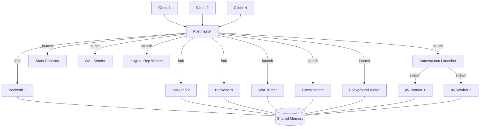
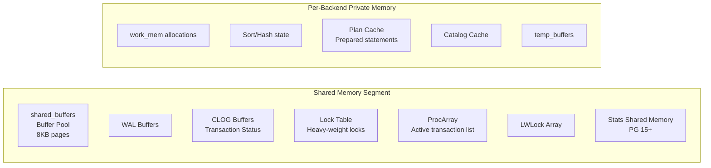
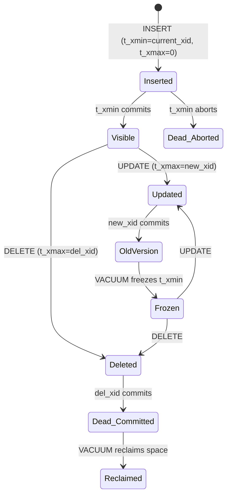

# PostgreSQL Internals

## 1. Process Architecture

PostgreSQL follows a **process-per-connection** model rooted in the Unix tradition. Every client connection is served by a dedicated OS-level process, and the server itself is managed by a hierarchy of specialized daemons.

### 1.1 The Postmaster

The **postmaster** is the supervisory process that starts when you run `pg_ctl start` or `postgres -D /data`. Its responsibilities are narrow but critical:

- **Listening on TCP/Unix sockets** — it accepts incoming connections on the configured port (default 5432).
- **Forking backend processes** — upon accepting a connection, postmaster forks a new child process (a "backend") to handle that client.
- **Managing shared memory** — postmaster allocates the shared memory segment during startup and passes it to child processes via inheritance.
- **Restarting crashed children** — if a backend process crashes (segfault, OOM kill), postmaster detects it via `waitpid()` and initiates a recovery cycle: it terminates all other backends, performs crash recovery using WAL, then resumes accepting connections.

The postmaster itself does almost no query processing. It is deliberately kept simple to minimize the risk of the supervisory process itself crashing.

```
┌─────────────────────────────────────────────────┐
│                   Postmaster                    │
│  - Listens on port 5432                         │
│  - Forks backends on new connections            │
│  - Monitors all child processes                 │
└────────┬──────────┬──────────┬──────────────────┘
         │          │          │
    ┌────▼───┐ ┌────▼───┐ ┌───▼────────────────┐
    │Backend │ │Backend │ │Background Workers  │
    │(Client │ │(Client │ │(autovacuum,        │
    │ conn1) │ │ conn2) │ │ WAL writer, etc.)  │
    └────────┘ └────────┘ └────────────────────┘
```

### 1.2 Backend Processes

Each backend process is the workhorse for a single client connection. It runs the full query lifecycle:

1. **Parse** — tokenize the SQL string, build a raw parse tree.
2. **Analyze** — resolve table/column names against the system catalog, produce a Query tree.
3. **Rewrite** — apply rewrite rules (views, row-level security policies).
4. **Plan** — the optimizer generates an execution plan (a tree of plan nodes).
5. **Execute** — the executor walks the plan tree, producing rows.

A backend process has its own private memory (local buffers, sort space, hash tables) but shares access to the shared buffer pool and other shared memory structures.

Key point: because each backend is a full OS process (not a thread), PostgreSQL avoids many concurrency pitfalls at the cost of higher per-connection memory overhead. This is why connection poolers like PgBouncer exist.

### 1.3 Background Worker Processes

PostgreSQL launches several background worker processes at startup. Each has a specific housekeeping role:

#### 1.3.1 Autovacuum Launcher and Workers

The **autovacuum launcher** periodically wakes up (controlled by `autovacuum_naptime`, default 1 minute) and checks whether any tables need vacuuming or analyzing. If so, it spawns **autovacuum worker** processes (up to `autovacuum_max_workers`, default 3).

Autovacuum workers perform two operations:

- **VACUUM** — reclaim space from dead tuples.
- **ANALYZE** — update table statistics for the query planner.

The decision to vacuum is based on:

```
dead_tuples > autovacuum_vacuum_threshold + autovacuum_vacuum_scale_factor * reltuples
```

For a table with 1,000,000 rows and default settings (threshold=50, scale_factor=0.2), vacuum triggers after 200,050 dead tuples accumulate.

#### 1.3.2 WAL Writer

The **WAL writer** process periodically flushes WAL buffers to disk. While backends can also flush WAL (during commit or when WAL buffers fill up), the WAL writer provides a background flushing mechanism that reduces latency spikes.

It wakes up every `wal_writer_delay` (default 200ms) and writes any dirty WAL pages. This is particularly beneficial for asynchronous commit (`synchronous_commit = off`) where backends do not wait for WAL flush on commit.

#### 1.3.3 Checkpointer

The **checkpointer** process periodically writes all dirty buffers to disk and creates a checkpoint record in the WAL. A checkpoint establishes a known-good point from which crash recovery can start, allowing old WAL segments to be recycled.

Checkpoints are triggered by:

- `checkpoint_timeout` (default 5 minutes) elapsed since the last checkpoint.
- `max_wal_size` worth of WAL has been generated.
- An explicit `CHECKPOINT` command.
- Server shutdown.

The checkpointer spreads writes over time using `checkpoint_completion_target` (default 0.9), meaning it aims to finish writing 90% of the way through the checkpoint interval, avoiding I/O spikes.

#### 1.3.4 Background Writer (bgwriter)

The **bgwriter** process scans the shared buffer pool and writes dirty pages to disk proactively. Its goal is to ensure that when a backend needs a free buffer, it can find a clean one without having to write a dirty page first (which would add latency to the query).

Configuration:

- `bgwriter_delay` — sleep time between rounds (default 200ms).
- `bgwriter_lru_maxpages` — max pages to write per round (default 100).
- `bgwriter_lru_multiplier` — how aggressively to clean ahead (default 2.0).

#### 1.3.5 Stats Collector

The **stats collector** (replaced by shared memory stats in PostgreSQL 15+) collects activity statistics from backends via UDP messages (or shared memory in newer versions). It maintains the data surfaced through `pg_stat_*` views.

In PostgreSQL 15 and later, the stats subsystem was rewritten to use shared memory instead of a separate process, eliminating the UDP overhead and stats file I/O.

#### 1.3.6 WAL Receiver and WAL Sender

On a **standby** server, the **WAL receiver** connects to the primary and streams WAL records for replay. On the **primary**, a **WAL sender** process (one per standby) reads WAL and sends it over the network. These form the backbone of streaming replication.

#### 1.3.7 Logical Replication Worker

For logical replication, PostgreSQL spawns **logical replication workers** that apply changes received from a publication. Each subscription gets its own apply worker.

### 1.4 Process Architecture Diagram



---

## 2. Memory Architecture

PostgreSQL's memory is divided into **shared memory** (accessible by all processes) and **per-process private memory**.

### 2.1 shared_buffers (The Buffer Pool)

`shared_buffers` defines the size of the shared buffer pool — the in-memory cache of data pages. Every read and write to table and index data goes through this cache.

**Default:** 128MB (far too small for production).

**Recommended:** 25% of total system RAM as a starting point, but rarely more than 8-16GB because the OS page cache provides a second layer of caching. Beyond a certain point, managing a larger buffer pool adds overhead without proportional benefit.

Example: on a 64GB server, start with `shared_buffers = 16GB`.

The buffer pool contains **8KB pages** (matching PostgreSQL's block size). A 16GB shared_buffers holds 2,097,152 pages.

### 2.2 work_mem

`work_mem` controls how much memory each **sort or hash operation** can use before spilling to disk. It is allocated per-operation, not per-query. A complex query with 5 sort operations and 3 hash joins could consume up to 8x `work_mem`.

**Default:** 4MB.

**Risk:** setting this too high with many concurrent queries can exhaust system memory. With 100 connections each running a query with 4 sort operations at `work_mem = 256MB`, peak usage could reach 100GB.

**Strategy:** keep the default moderate (e.g., 64MB) and raise it for specific sessions that need it:

```sql
SET work_mem = '512MB';
-- run the big analytical query
RESET work_mem;
```

### 2.3 maintenance_work_mem

`maintenance_work_mem` governs memory for maintenance operations: `VACUUM`, `CREATE INDEX`, `ALTER TABLE ADD FOREIGN KEY`.

**Default:** 64MB.

**Recommended:** set this higher than `work_mem` since maintenance operations run less frequently but benefit greatly from more memory. 1-2GB is common on production servers.

For `autovacuum`, use `autovacuum_work_mem` (defaults to `-1`, meaning it uses `maintenance_work_mem`). You can set it lower to prevent autovacuum from consuming too much memory.

### 2.4 effective_cache_size

`effective_cache_size` does **not** allocate any memory. It is a hint to the query planner about how much memory is available for caching (shared_buffers + OS page cache). It influences whether the planner chooses index scans (favored when caches are large) over sequential scans.

**Default:** 4GB.

**Recommended:** 50-75% of total RAM. On a 64GB server, `effective_cache_size = 48GB`.

### 2.5 wal_buffers

`wal_buffers` is the shared memory used to buffer WAL records before they are flushed to disk.

**Default:** `-1` (auto-tuned to 1/32 of `shared_buffers`, capped at 16MB).

For most workloads, the auto-tuned value is sufficient. If you see WAL-related wait events frequently, increasing this can help.

### 2.6 Shared Memory Layout Diagram



---

## 3. The Shared Buffer Pool

The buffer pool is the heart of PostgreSQL's I/O subsystem. Understanding its internals is essential for diagnosing performance problems.

### 3.1 Buffer Descriptors

Each buffer in the pool has an associated **buffer descriptor** — a small metadata structure stored in a separate array. The descriptor tracks:

- **tag** — identifies which relation (table/index) and which block number this buffer holds.
- **state** — a set of flags packed into an atomic uint32:
  - `BM_VALID` — the buffer contains valid data.
  - `BM_DIRTY` — the buffer has been modified since last written to disk.
  - `BM_TAG_VALID` — the tag field is meaningful.
  - `BM_IO_IN_PROGRESS` — someone is reading/writing this buffer.
  - `BM_LOCKED` — the buffer header spinlock is held.
  - **refcount** — number of backends currently accessing this buffer (pinned).
  - **usage_count** — used by the clock sweep algorithm (0-5).
- **content_lock** — a lightweight lock (LWLock) for the buffer contents. Readers acquire SHARED, writers acquire EXCLUSIVE.

### 3.2 Pin and Unpin

Before a backend can read or write a buffer's contents, it must **pin** the buffer (increment refcount). Pinning prevents the buffer from being evicted by the clock sweep algorithm while the backend is using it.

The lifecycle:

1. Backend calls `ReadBuffer(relation, blockNumber)`.
2. The buffer manager looks up the buffer in the **buffer table** (a hash table mapping `(RelFileNode, ForkNumber, BlockNumber)` to buffer IDs).
3. If found (cache hit), pin the buffer and return it.
4. If not found (cache miss), find a free buffer (via clock sweep), read the page from disk, pin it, return it.
5. The backend reads/writes the buffer contents.
6. Backend calls `ReleaseBuffer()` to unpin.

A buffer with `refcount > 0` cannot be evicted. This is the fundamental guarantee that prevents a page from being stolen while a query is in the middle of reading it.

### 3.3 Clock Sweep Eviction Algorithm

When PostgreSQL needs a free buffer and none are available, it runs the **clock sweep** algorithm — a variant of the "second chance" or "clock" page replacement algorithm:

1. Maintain a global `nextVictimBuffer` pointer that cycles through all buffers.
2. Examine the buffer at the current pointer position.
3. If `refcount == 0` and `usage_count == 0` — this buffer is the **victim**. Evict it.
4. If `refcount == 0` and `usage_count > 0` — decrement `usage_count` by 1 and move on.
5. If `refcount > 0` — skip (someone is using it), move on.
6. Advance the pointer and repeat.

The `usage_count` ranges from 0 to 5 (`BM_MAX_USAGE_COUNT`). Every time a buffer is accessed, its usage_count is incremented (up to the max). This means frequently accessed pages survive multiple clock sweeps while cold pages are evicted quickly.

This is significantly simpler than LRU but performs well in practice. It avoids the overhead of maintaining an LRU linked list with its associated locking.

### 3.4 Dirty Page Tracking and Writes

When a backend modifies a buffer, it marks it dirty (`BM_DIRTY`). Dirty buffers must be written to disk before they can be evicted.

Dirty buffers get written by three mechanisms:

1. **Checkpointer** — writes all dirty buffers during a checkpoint.
2. **Background writer** — proactively cleans buffers to maintain a pool of free clean buffers.
3. **Backend eviction** — if a backend needs a buffer and the victim is dirty, the backend writes it out before reusing the buffer. This is the worst case because it adds I/O latency to the query.

Before writing a dirty page, the writer must ensure the corresponding WAL has been flushed to disk first (the **WAL-before-data** rule). This guarantees crash recovery can reconstruct any modifications.

### 3.5 Buffer Ring Strategies

For large sequential scans, PostgreSQL uses a **buffer ring** — a small, fixed-size subset of buffers (typically 256KB / 32 pages) that the scan cycles through. This prevents a single large sequential scan from evicting the entire buffer pool (a problem known as "scan pollution").

Ring buffers are used for:

- Large sequential scans (ring size: 256KB).
- Bulk writes like COPY and CREATE TABLE AS (ring size: 16MB).
- VACUUM (ring size: 256KB).

---

## 4. Page Layout

PostgreSQL stores all data in **8KB pages** (the default `BLCKSZ`; can be changed at compile time). The layout of every heap (table) page follows the same structure.

### 4.1 Page Header (PageHeaderData)

The first 24 bytes of every page contain the page header:

| Field | Size | Description |
|-------|------|-------------|
| `pd_lsn` | 8 bytes | LSN of the last WAL record that modified this page. Used by the buffer manager to enforce WAL-before-data. |
| `pd_checksum` | 2 bytes | Page checksum (if data checksums are enabled). |
| `pd_flags` | 2 bytes | Flag bits: `PD_HAS_FREE_LINES`, `PD_PAGE_FULL`, `PD_ALL_VISIBLE`. |
| `pd_lower` | 2 bytes | Offset to the end of the line pointer array (start of free space). |
| `pd_upper` | 2 bytes | Offset to the beginning of the last tuple (end of free space). |
| `pd_special` | 2 bytes | Offset to the start of special space (used by indexes). For heap pages, equals the page size. |
| `pd_pagesize_version` | 2 bytes | Page size and layout version. |
| `pd_prune_xid` | 4 bytes | Oldest un-pruned XMAX on the page; hint for pruning. |

Free space on the page lies between `pd_lower` and `pd_upper`. New line pointers grow downward (pd_lower increases), new tuples grow upward from the bottom (pd_upper decreases).

### 4.2 Line Pointers (ItemId Array)

Immediately after the page header is an array of **line pointers** (ItemId entries), each 4 bytes. Each line pointer contains:

- **lp_off** (15 bits) — byte offset to the tuple within the page.
- **lp_flags** (2 bits) — `LP_UNUSED`, `LP_NORMAL`, `LP_REDIRECT`, `LP_DEAD`.
- **lp_len** (15 bits) — length of the tuple in bytes.

The line pointer array grows from the top of the page downward. Tuples are stored from the bottom of the page upward. They grow toward each other.

The indirection through line pointers is crucial: it allows tuples to be moved within a page (for compaction/defragmentation) without updating any index entries, because indexes reference tuples by `(page, offset_within_line_pointer_array)` — the **ctid**.

### 4.3 Tuples

Tuples are stored in the space between the line pointer array and the bottom of the page. Each tuple consists of a header followed by the actual data columns.

### 4.4 Special Space

For heap (table) pages, the special space is empty (pd_special equals page size). For index pages, the special space at the end of the page holds index-specific metadata (e.g., sibling page pointers for B-tree pages).

### 4.5 Free Space

The free space between `pd_lower` and `pd_upper` is tracked by the **Free Space Map (FSM)** — a separate auxiliary structure that records how much free space each page has. When inserting a new tuple, PostgreSQL consults the FSM to find a page with enough room.

```
┌──────────────────────────────────────────────────────────┐
│ Page Header (24 bytes)                                   │
│  pd_lsn | pd_checksum | pd_flags | pd_lower | pd_upper  │
│  pd_special | pd_pagesize_version | pd_prune_xid         │
├──────────────────────────────────────────────────────────┤
│ Line Pointer 1 → ──────────────────────────────────┐     │
│ Line Pointer 2 → ─────────────────────────────┐    │     │
│ Line Pointer 3 → ────────────────────────┐     │    │     │
│ ...                                      │     │    │     │
│ pd_lower ↓                               │     │    │     │
├──────────────────────────────────────────┤     │    │     │
│                                          │     │    │     │
│         F R E E   S P A C E              │     │    │     │
│                                          │     │    │     │
├──────────────────────────────────────────┤     │    │     │
│ pd_upper ↑                               │     │    │     │
│ ◄────────────────────────────────────────┘     │    │     │
│ Tuple 3 (HeapTupleHeader + data)               │    │     │
│ ◄──────────────────────────────────────────────┘    │     │
│ Tuple 2 (HeapTupleHeader + data)                    │     │
│ ◄───────────────────────────────────────────────────┘     │
│ Tuple 1 (HeapTupleHeader + data)                          │
├──────────────────────────────────────────────────────────┤
│ Special Space (empty for heap pages)                      │
└──────────────────────────────────────────────────────────┘
```

---

## 5. Tuple Format (HeapTupleHeaderData)

Every heap tuple begins with a 23-byte header (plus possible padding to an 8-byte boundary, making it effectively 24 bytes).

### 5.1 Header Fields

| Field | Size | Description |
|-------|------|-------------|
| `t_xmin` | 4 bytes | Transaction ID that **inserted** this tuple. |
| `t_xmax` | 4 bytes | Transaction ID that **deleted or updated** this tuple (0 if still live). |
| `t_cid` | 4 bytes | Command ID within the inserting transaction (for subtransaction visibility). |
| `t_ctid` | 6 bytes | Current tuple ID — `(block, offset)`. For the latest version, points to itself. For an updated tuple, points to the newer version (forming the version chain). |
| `t_infomask2` | 2 bytes | Number of attributes and additional flag bits (e.g., `HEAP_HOT_UPDATED`, `HEAP_ONLY_TUPLE`). |
| `t_infomask` | 2 bytes | Visibility and status flags (see below). |
| `t_hoff` | 1 byte | Offset to the start of user data (i.e., size of header + null bitmap). |

Total: 23 bytes, padded to 24.

### 5.2 Infomask Bits

The `t_infomask` field is a bitmask that carries critical visibility information:

- `HEAP_HASNULL` — tuple has at least one NULL attribute.
- `HEAP_HASVARWIDTH` — tuple has variable-width attributes.
- `HEAP_HASEXTERNAL` — tuple has TOAST references.
- `HEAP_XMIN_COMMITTED` — t_xmin transaction is known to have committed. This is a "hint bit" set lazily to avoid CLOG lookups.
- `HEAP_XMIN_INVALID` — t_xmin transaction is known to have aborted.
- `HEAP_XMAX_COMMITTED` — t_xmax transaction is known to have committed.
- `HEAP_XMAX_INVALID` — t_xmax transaction aborted or is not set.
- `HEAP_XMAX_IS_MULTI` — t_xmax is a MultiXactId (for row locking by multiple transactions).
- `HEAP_UPDATED` — tuple was created by an UPDATE (not an INSERT).

#### 5.2.1 Hint Bits and CLOG

When a transaction first encounters a tuple, the infomask may not yet record whether t_xmin/t_xmax committed or aborted. In that case, PostgreSQL must look up the transaction's status in the **CLOG** (Commit Log, stored in `pg_xact/`).

After looking up the status, PostgreSQL sets the appropriate hint bit on the tuple. This dirty the page, but subsequent accesses skip the CLOG lookup entirely. This lazy hint-bit setting is an important optimization — without it, every tuple access would require a CLOG lookup.

### 5.3 Null Bitmap

If `HEAP_HASNULL` is set, a null bitmap follows the fixed header fields. The bitmap has one bit per attribute — bit 0 for the first column, bit 1 for the second, etc. A `1` bit means the attribute is **not null**; a `0` bit means it is null. The bitmap is rounded up to the nearest byte.

### 5.4 User Data

After the null bitmap (and alignment padding), the actual column values follow in the order defined by the table's schema. Fixed-width fields are stored inline. Variable-width fields are preceded by a 1-byte or 4-byte length header (using the varlena format).

### 5.5 Tuple Lifecycle Diagram



---

## 6. TOAST (The Oversized-Attribute Storage Technique)

PostgreSQL pages are 8KB. Tuples cannot span pages. So what happens when a column value is larger than roughly 2KB? TOAST handles it.

### 6.1 TOAST Strategies

Each column can have one of four TOAST strategies:

- **PLAIN** — no TOAST at all. Used for fixed-width types that cannot be compressed (e.g., `integer`). Value must fit on the page.
- **EXTENDED** (default for variable-length types) — first try compression, then out-of-line storage if still too large.
- **EXTERNAL** — out-of-line storage without compression. Useful when you know the data is already compressed (e.g., JPEG images) and compression would just waste CPU.
- **MAIN** — try compression but avoid out-of-line storage unless absolutely necessary. The tuple will be stored inline if it fits after compression.

### 6.2 Compression

PostgreSQL uses the **pglz** compression algorithm (a simple LZ-family compressor) or, since PostgreSQL 14, optionally **LZ4**. LZ4 is significantly faster at both compression and decompression while achieving similar ratios for most data.

You can set the default compression method:

```sql
SET default_toast_compression = 'lz4';
```

Or per-column:

```sql
ALTER TABLE t ALTER COLUMN data SET COMPRESSION lz4;
```

### 6.3 Out-of-Line Storage

When a value is too large even after compression, PostgreSQL stores it in a separate **TOAST table**. Each table with TOASTable columns has an associated TOAST table (named `pg_toast.pg_toast_<oid>`).

The TOAST table stores the large value in **chunks** (each chunk defaults to about 2000 bytes). The original tuple stores a small **TOAST pointer** (18 bytes) that references the TOAST table.

The TOAST pointer contains:

- The OID of the TOAST table.
- The OID of the value (a unique identifier within the TOAST table).
- The original uncompressed size.
- The stored (possibly compressed) size.

The TOAST table has its own index on `(chunk_id, chunk_seq)` for efficient retrieval.

### 6.4 When TOAST Kicks In

PostgreSQL triggers TOAST processing when a tuple exceeds approximately 2KB (one quarter of the 8KB page size, controlled by `TOAST_TUPLE_THRESHOLD`). The algorithm:

1. Find the largest EXTENDED or EXTERNAL attribute.
2. If EXTENDED, try compressing it. If the compressed value is small enough, store it inline.
3. If still too large, move it to the TOAST table.
4. Repeat until the tuple fits on a page, or all TOASTable attributes have been processed.

### 6.5 Performance Implications

- Reading a TOASTed value requires additional I/O to the TOAST table. For queries that select many TOASTed columns, this can be significant.
- The `SELECT *` pattern is especially harmful with TOAST because it fetches large columns you might not need.
- TOASTed values are decompressed every time they are read. There is no decompressed cache.
- TOAST tables are vacuumed separately from their parent tables but are triggered by the parent's autovacuum.

---

## 7. VACUUM Deep Dive

VACUUM is PostgreSQL's garbage collection mechanism. It is arguably the most important background operation in the system, and understanding it deeply is essential for anyone running PostgreSQL in production.

### 7.1 Why VACUUM Exists

PostgreSQL's MVCC implementation keeps old tuple versions (dead tuples) in the heap. When a row is updated, the old version remains on the page with `t_xmax` set to the updating transaction. When a row is deleted, the tuple remains with `t_xmax` set. These dead tuples consume space and slow down scans.

VACUUM's job is to reclaim this space.

### 7.2 Lazy VACUUM (Standard VACUUM)

A standard `VACUUM` (also called "lazy vacuum") does not rewrite the table. It performs three phases:

**Phase 1: Scan the heap**

VACUUM scans each page of the table looking for dead tuples — tuples whose `t_xmax` is committed and whose transaction is no longer visible to any active snapshot. It collects the TIDs (tuple IDs) of dead tuples into a `maintenance_work_mem`-sized array.

VACUUM uses the **visibility map** to skip pages that are known to contain only visible tuples (all-visible pages). This makes VACUUM very efficient on tables where most data is not being modified.

**Phase 2: Clean up indexes**

For each index on the table, VACUUM removes index entries that point to the dead tuples collected in phase 1. This is called **index vacuuming**.

**Phase 3: Clean up the heap**

VACUUM returns to the heap pages containing dead tuples and marks those line pointers as `LP_DEAD` (or `LP_UNUSED`), making the space available for reuse. It also updates the **free space map** (FSM) so that future INSERT operations can find pages with available space.

If `maintenance_work_mem` fills up during phase 1, VACUUM performs phases 2 and 3 on the collected batch, then resumes scanning from where it left off.

### 7.3 VACUUM FULL

`VACUUM FULL` rewrites the entire table to a new physical file, eliminating all dead space. It is essentially equivalent to:

1. Create a new copy of the table with only live tuples.
2. Rebuild all indexes.
3. Swap the files.

This reclaims disk space back to the operating system but has severe drawbacks:

- Requires an **ACCESS EXCLUSIVE** lock on the table for the entire duration.
- Requires **temporary disk space** equal to the size of the table.
- Rewrites all indexes.
- Invalidates all existing tuple pointers (ctids change).

`VACUUM FULL` should be a last resort. In most cases, regular VACUUM keeps tables healthy enough. If bloat does accumulate, tools like `pg_repack` can compact tables without exclusive locks.

### 7.4 Autovacuum Tuning

The autovacuum daemon's behavior is controlled by several parameters:

| Parameter | Default | Description |
|-----------|---------|-------------|
| `autovacuum` | on | Master switch. Never turn this off. |
| `autovacuum_naptime` | 1min | How often the launcher checks for tables needing vacuum. |
| `autovacuum_max_workers` | 3 | Max concurrent autovacuum workers. Increase on servers with many tables. |
| `autovacuum_vacuum_threshold` | 50 | Minimum number of dead tuples before considering vacuum. |
| `autovacuum_vacuum_scale_factor` | 0.2 | Fraction of table size to add to threshold. |
| `autovacuum_analyze_threshold` | 50 | Minimum changed tuples before considering analyze. |
| `autovacuum_analyze_scale_factor` | 0.1 | Fraction of table size for analyze threshold. |
| `autovacuum_vacuum_cost_delay` | 2ms (PG12+) | Delay when cost limit is reached (throttling). |
| `autovacuum_vacuum_cost_limit` | -1 (uses `vacuum_cost_limit`=200) | Cost limit before sleeping. |

**The scale factor problem for large tables:**

With the default `autovacuum_vacuum_scale_factor = 0.2`, a table with 1 billion rows needs 200 million dead tuples before autovacuum triggers. This is almost certainly too many. For large tables, set per-table overrides:

```sql
ALTER TABLE huge_table SET (
    autovacuum_vacuum_scale_factor = 0.01,
    autovacuum_vacuum_threshold = 10000
);
```

**Throttling:**

Autovacuum uses the cost-based vacuum delay mechanism. Each I/O operation has a cost (page hit = 1, page miss = 10, page dirty = 20). When accumulated cost reaches the limit, autovacuum sleeps for `autovacuum_vacuum_cost_delay`. To make autovacuum more aggressive:

```
autovacuum_vacuum_cost_delay = 2ms
autovacuum_vacuum_cost_limit = 1000
```

### 7.5 The Visibility Map

Each table has a **visibility map** (VM) — a bitmap with two bits per heap page:

- **all-visible** — all tuples on this page are visible to all current and future transactions. VACUUM and index-only scans can skip these pages.
- **all-frozen** — all tuples on this page are frozen (t_xmin replaced with `FrozenTransactionId`). Anti-wraparound vacuum can skip these pages.

The VM dramatically reduces the work VACUUM does on large, mostly-static tables. If 99% of pages are all-visible, VACUUM only needs to process 1% of the table.

---

## 8. Transaction ID Wraparound

This is one of the most dangerous failure modes in PostgreSQL. Understanding it is not optional for anyone responsible for a production PostgreSQL system.

### 8.1 Transaction IDs Are 32-bit

PostgreSQL uses 32-bit unsigned integers for transaction IDs (XIDs). The valid range is 3 to 2^32 - 1 (about 4.29 billion). XIDs 0, 1, and 2 are reserved (InvalidTransactionId, BootstrapTransactionId, FrozenTransactionId).

PostgreSQL uses **modular arithmetic** to compare XIDs. Given a current XID, the 2^31 XIDs "ahead" are considered to be in the future, and the 2^31 XIDs "behind" are considered to be in the past. This means at any given moment, approximately 2 billion transactions are in the past and 2 billion are in the future.

### 8.2 The Wraparound Problem

If XIDs were allowed to simply wrap around, old committed tuples would suddenly appear to be from future transactions — and become invisible. Data would effectively disappear.

To prevent this, PostgreSQL uses the concept of **freezing**. When a tuple's `t_xmin` is old enough (older than `vacuum_freeze_min_age` transactions ago, default 50 million), VACUUM replaces it with the special `FrozenTransactionId` (2). Frozen tuples are always considered to be in the past regardless of the current XID.

### 8.3 Freeze Mechanism

There are two freezing thresholds:

- **vacuum_freeze_min_age** (default: 50,000,000) — VACUUM will freeze tuples older than this many transactions. This is a "lazy" freeze that happens during regular VACUUM.
- **vacuum_freeze_table_age** (default: 150,000,000) — when the table's `relfrozenxid` (oldest unfrozen XID) is this old, VACUUM performs an "aggressive" scan of the entire table, ignoring the visibility map, to freeze old tuples.

### 8.4 Aggressive VACUUM and the Emergency

If autovacuum fails to keep up (due to misconfiguration, long-running transactions holding back the freeze horizon, or simply a very high transaction rate), the system approaches the wraparound danger zone.

At `autovacuum_freeze_max_age` (default: 200,000,000) transactions, PostgreSQL forcibly launches an aggressive autovacuum that cannot be cancelled by user activity. This is the "aggressive anti-wraparound autovacuum."

If even this fails, when the system is within 3 million XIDs of wraparound, PostgreSQL takes drastic action: **it shuts down and refuses to process any new transactions.** The only recovery path is to start in single-user mode and manually run VACUUM FREEZE on the affected tables.

The error message:

```
WARNING: database "mydb" must be vacuumed within 3000000 transactions
HINT: To avoid a database shutdown, execute a database-wide VACUUM in that database.
```

Then, if ignored:

```
ERROR: database is not accepting commands to avoid wraparound data loss in database "mydb"
```

### 8.5 Monitoring Wraparound Risk

Monitor the age of `datfrozenxid` for each database:

```sql
SELECT datname, age(datfrozenxid) AS xid_age
FROM pg_database
ORDER BY xid_age DESC;
```

And per-table:

```sql
SELECT relname, age(relfrozenxid) AS xid_age
FROM pg_class
WHERE relkind = 'r'
ORDER BY xid_age DESC
LIMIT 20;
```

If any value exceeds 500 million, investigate immediately. If it approaches 2 billion, you are in danger.

### 8.6 64-bit XIDs

PostgreSQL has been working toward 64-bit transaction IDs, which would eliminate the wraparound problem entirely. This is a multi-version effort that requires changes to the tuple header format, CLOG, and many other subsystems.

---

## 9. HOT Updates (Heap-Only Tuples)

HOT is one of PostgreSQL's most important performance optimizations, dramatically reducing the overhead of UPDATE operations.

### 9.1 The Problem with Regular Updates

In PostgreSQL, an UPDATE creates a new tuple version. Without HOT, this means:

1. Insert a new tuple on the heap.
2. Insert a new entry in **every index** on the table, even if the indexed column was not changed.
3. Mark the old tuple's `t_xmax`.

For a table with 10 indexes, an UPDATE that changes only one non-indexed column still requires 10 index insertions. This is enormously wasteful.

### 9.2 How HOT Works

A HOT update avoids all index modifications. Instead:

1. The new tuple is placed on **the same page** as the old tuple.
2. The old tuple's `t_ctid` is set to point to the new tuple (forming an intra-page chain).
3. The old tuple is marked `HEAP_HOT_UPDATED`.
4. The new tuple is marked `HEAP_ONLY_TUPLE`.
5. **No index entries are created** for the new tuple.

Index scans find the new version by following the `t_ctid` chain from the old tuple (which is still referenced by the index entry).

### 9.3 HOT Chain Pruning

When a backend accesses a page that has dead HOT chain entries, it can perform **page-level pruning** — cleaning up the dead portions of HOT chains without a full VACUUM. The root line pointer is redirected to point to the latest live version (`LP_REDIRECT`), and intermediate dead entries are freed.

This pruning happens automatically during regular page access, making it very efficient.

### 9.4 When HOT Is Possible

HOT update can only occur when ALL of the following are true:

1. **No indexed column was changed.** If any column that has an index was modified, all indexes need new entries, so HOT cannot apply.
2. **There is free space on the same page.** The new tuple must fit on the same page as the old one. If the page is full, the new tuple goes to a different page, and HOT cannot apply (indexes need to find it).

### 9.5 Maximizing HOT Updates

- Keep fillfactor below 100 to leave room for updates:

```sql
ALTER TABLE my_table SET (fillfactor = 80);
```

A fillfactor of 80 means each page is filled to 80% during inserts, leaving 20% for HOT updates.

- Monitor HOT update ratio:

```sql
SELECT relname,
       n_tup_upd,
       n_tup_hot_upd,
       CASE WHEN n_tup_upd > 0
            THEN round(100.0 * n_tup_hot_upd / n_tup_upd)
            ELSE 0
       END AS hot_update_pct
FROM pg_stat_user_tables
WHERE n_tup_upd > 0
ORDER BY n_tup_upd DESC;
```

A low HOT update percentage on frequently updated tables suggests too many indexes on updated columns or insufficient page free space.

---

## 10. Index Types and Their Internals

PostgreSQL supports multiple index types, each optimized for different access patterns. Understanding their internal structure helps in choosing the right one.

### 10.1 B-tree

B-tree is the default and most common index type. PostgreSQL's B-tree implementation is based on the **Lehman-Yao algorithm** with extensions.

**Internal Structure:**

- **Leaf pages** contain index tuples — each tuple stores the indexed column values and the heap TID (ctid) of the corresponding row.
- **Internal pages** store separator keys and pointers to child pages.
- **Meta page** (block 0) contains the root page location and tree level.
- **Right-link pointers** — every page has a pointer to its right sibling, which enables concurrent traversal without holding locks on parent pages (the Lehman-Yao innovation).

**Deduplication (PG13+):** When multiple heap tuples have the same indexed value, the index stores a single key value with a list of TIDs. This can dramatically reduce index size for low-cardinality columns.

**Suffix truncation (PG12+):** Internal (non-leaf) pages only store enough of the key to distinguish between children. For a `text` column, this can save significant space.

**Bottom-up deletion (PG14+):** When a page is about to split, PostgreSQL first checks if there are dead index entries that can be removed, potentially avoiding the split.

**Key properties:**

- Supports all comparison operators: `<`, `<=`, `=`, `>=`, `>`.
- Supports `ORDER BY`, `BETWEEN`, `IS NULL`.
- Supports `UNIQUE` constraints.
- O(log N) lookup, O(N) full scan.

### 10.2 Hash Index

Hash indexes use a hash table structure. Before PostgreSQL 10, they were not crash-safe (not WAL-logged) and rarely used. Since PG10 they are WAL-logged and safe.

**Internal Structure:**

- **Bucket pages** — the hash table is divided into buckets. Each bucket stores index entries whose hash values map to that bucket.
- **Overflow pages** — when a bucket fills up, overflow pages are chained.
- **Bitmap pages** — track which overflow pages are allocated.
- **Meta page** — stores hash function, bucket count, and split pointer.

When the table grows, the hash index doubles its number of buckets — a costly operation.

**Key properties:**

- Supports only `=` operator.
- O(1) average lookup (vs O(log N) for B-tree).
- Not useful for range queries, sorting, or multicolumn indexes.
- In practice, rarely outperforms B-tree because B-tree's O(log N) is very fast and more versatile.

### 10.3 GiST (Generalized Search Tree)

GiST is a framework for building balanced tree indexes for arbitrary data types. It is used for:

- Geometric types (PostGIS uses GiST for spatial indexing).
- Range types.
- Full-text search (`tsvector`).
- `ltree` (label tree).

**Internal Structure:**

GiST is a balanced tree where each internal node contains a "predicate" (bounding value) that covers all entries in its subtree. For spatial data, the predicate is a bounding box. For ranges, it is a covering range.

The key operations that a GiST operator class must implement:

- `consistent(entry, query)` — does this entry potentially match the query?
- `union(entries)` — compute a predicate covering all given entries.
- `penalty(entry, new)` — how much does adding `new` to `entry`'s subtree "cost"?
- `picksplit(entries)` — divide entries into two groups for page splitting.
- `same(a, b)` — are two predicates identical?

**Key properties:**

- Supports complex operators: contains, overlaps, nearest-neighbor.
- Lossy — may require heap rechecks for exact matches.
- Supports KNN (K-nearest-neighbor) queries via `ORDER BY <-> point` syntax.

### 10.4 SP-GiST (Space-Partitioned GiST)

SP-GiST supports space-partitioned tree structures — trees that are not necessarily balanced and where internal nodes partition the space rather than overlapping it.

Examples include:

- **Quad-trees** for 2D points.
- **k-d trees** for multidimensional data.
- **Radix trees** (tries) for text data.
- **Suffix trees**.

**Key difference from GiST:** In GiST, internal node predicates can overlap. In SP-GiST, they partition the space into non-overlapping regions. This makes certain query types more efficient.

### 10.5 GIN (Generalized Inverted Index)

GIN is an inverted index — it maps values to the set of rows that contain them. It is ideal for:

- Full-text search (mapping words to documents).
- Array containment queries (`@>`).
- JSONB containment queries.
- Trigram similarity (pg_trgm).

**Internal Structure:**

- A B-tree of **entry values** (e.g., individual words).
- Each entry points to a **posting list** — a sorted list of heap TIDs where that value appears.
- For entries with many TIDs, the posting list is stored in a **posting tree** (a B-tree of TIDs).

**Fastupdate:** GIN supports a pending list for writes. Instead of immediately inserting into the index structure, new entries go to a pending list that is periodically flushed. This amortizes the cost of writing to GIN (which can be expensive because a single row insertion can add many entries).

```sql
-- Control fastupdate behavior
ALTER INDEX my_gin_idx SET (fastupdate = on, gin_pending_list_limit = 4096);
```

**Key properties:**

- Very fast for membership/containment queries.
- Slow to build and update (each row can produce many index entries).
- Supports multikey searches efficiently.
- No support for range queries or sorting.

### 10.6 BRIN (Block Range Index)

BRIN is a very compact index that stores summary information for ranges of physical table pages.

**Internal Structure:**

- The table is divided into **block ranges** (default: 128 pages per range, controlled by `pages_per_range`).
- For each range, BRIN stores a summary value — typically the min and max of the indexed column within that range.
- The index is tiny compared to a B-tree because there is one entry per 128 pages rather than one entry per row.

**When BRIN excels:**

BRIN works beautifully when the physical order of the table correlates with the indexed column. Time-series data inserted in chronological order is the textbook use case — the min/max timestamps per block range allow BRIN to skip large sections of the table.

**When BRIN fails:**

If the column values are randomly distributed across pages, every block range covers the full value range, and BRIN cannot skip anything. The index becomes useless.

```sql
-- BRIN is ideal for time-series tables
CREATE INDEX ON sensor_data USING brin (recorded_at) WITH (pages_per_range = 64);
```

---

## 11. The Query Executor

The executor takes the plan tree produced by the planner/optimizer and produces the result rows.

### 11.1 The Volcano/Iterator Model

PostgreSQL uses the **volcano model** (also called the iterator model or demand-driven pipeline model). Each plan node implements three functions:

- **ExecInit** — initialize the node (allocate state, open files).
- **ExecProcNode** — return the next result tuple (called repeatedly).
- **ExecEnd** — clean up (release resources).

The top-level executor calls `ExecProcNode` on the root node, which recursively calls its children. Tuples flow upward one at a time, from leaf nodes (scans) through intermediate nodes (joins, sorts) to the root.

This demand-driven model is elegant: each node is oblivious to what is above or below it. Nodes are composable. A sort node does not care whether its input is a sequential scan, an index scan, or a join.

### 11.2 Scan Nodes

**SeqScan (Sequential Scan):**

Reads every page of the table from beginning to end. Despite its simplicity, it is often the fastest option for small tables or queries that return a large fraction of rows.

For large tables, PostgreSQL uses a **synchronized scan** — multiple concurrent sequential scans on the same table share the scan position, so they read the same pages at the same time and benefit from shared I/O.

**IndexScan:**

Traverses the index (typically a B-tree) to find matching entries, then fetches the corresponding heap tuples. Each index entry contains the heap TID, so the scan alternates between index and heap access.

For range queries, IndexScan returns results in index order, which can satisfy `ORDER BY` without a separate sort.

**IndexOnlyScan:**

If all columns needed by the query are present in the index, the executor can satisfy the query from the index alone, without visiting the heap — but only for pages marked all-visible in the visibility map. For non-all-visible pages, it must still check the heap for tuple visibility.

**BitmapIndexScan + BitmapHeapScan:**

A two-phase approach:

1. **BitmapIndexScan** scans the index and builds a bitmap of matching heap page numbers.
2. **BitmapHeapScan** reads the heap pages in physical order (sequential I/O) rather than index order (random I/O).

This is highly effective when many rows match (too many for IndexScan, too few for SeqScan). Multiple bitmap index scans can be combined with AND/OR operations (BitmapAnd, BitmapOr) to evaluate complex predicates.

**TidScan:**

Directly fetches tuples by their TID (ctid). Used when the query specifies `WHERE ctid = '(0,1)'`.

### 11.3 Join Nodes

**Nested Loop Join:**

For each row in the outer (left) relation, scan the entire inner (right) relation for matches. Complexity: O(N * M).

Best for: small outer relation, especially when the inner relation has an index that can be used as an inner index scan.

A parameterized nested loop passes values from the outer row to the inner scan, enabling efficient index lookups on the inner side.

**Hash Join:**

Two phases:

1. **Build phase** — read the inner relation and build an in-memory hash table on the join key. If the hash table exceeds `work_mem`, it spills to disk using multiple batches.
2. **Probe phase** — read the outer relation and probe the hash table for matches.

Complexity: O(N + M) average case. This is the workhorse join for equi-joins where neither side is small enough for nested loop or already sorted for merge join.

**Merge Join:**

Both inputs must be sorted on the join key. The algorithm merges them in a single pass, like the merge step in merge sort.

Complexity: O(N log N + M log M) including the sorts, or O(N + M) if inputs are already sorted (e.g., from an index scan).

Best for: large equi-joins where both sides can be cheaply sorted, or where the output must be sorted.

### 11.4 Aggregate and Sort Nodes

**Sort:**

Implements either quicksort (in-memory) or external merge sort (spilling to disk when data exceeds `work_mem`). The external sort writes sorted runs to temporary files and merges them.

PostgreSQL also uses **incremental sort** (PG13+) when the input is already partially sorted (e.g., sorted on the first key of a multi-column ORDER BY).

**Aggregate:**

Two strategies:

- **Plain Agg** — a single group. Accumulate the aggregate over all rows.
- **HashAgg** — build a hash table keyed by GROUP BY columns. Each entry holds the running aggregate state. If the hash table exceeds `work_mem`, it spills to disk (PG13+).
- **GroupAgg** — input must be sorted by GROUP BY columns. Process each group sequentially.

**Gather and Gather Merge:**

These collect results from parallel workers (discussed in the next section).

### 11.5 Other Nodes

- **Limit** — stop after N rows. Enables early termination of the entire plan subtree.
- **Append** — concatenates results from multiple subplans (used for `UNION ALL`, partitioned table scans).
- **MergeAppend** — like Append but produces sorted output by merging pre-sorted subplans.
- **Materialize** — stores its input in a tuplestore for rescanning.
- **SubqueryScan** — wraps a subquery.
- **WindowAgg** — evaluates window functions.
- **SetOp** — implements `INTERSECT` and `EXCEPT`.
- **RecursiveUnion** — implements recursive CTEs (`WITH RECURSIVE`).
- **ModifyTable** — the top-level node for INSERT/UPDATE/DELETE.

---

## 12. Parallel Query

Since PostgreSQL 9.6, the executor can parallelize parts of a query plan across multiple worker processes.

### 12.1 How Parallel Workers Are Spawned

When the planner decides a query benefits from parallelism, it annotates the plan with a **Gather** (or **Gather Merge**) node. At execution time:

1. The backend (leader) registers parallel workers with the postmaster using `RegisterDynamicBackgroundWorker`.
2. Workers are launched (up to `max_parallel_workers_per_gather`, default 2).
3. Each worker attaches to the same shared memory segment and receives a copy of the plan subtree below the Gather node.
4. Workers execute their portion and write results to a shared **tuple queue** (implemented with shared memory).
5. The Gather node reads tuples from all workers' queues (and optionally from its own execution of the subtree) and passes them up the plan tree.

### 12.2 Gather vs. Gather Merge

- **Gather** — collects tuples from workers in arbitrary order. No ordering guarantee.
- **Gather Merge** — each worker produces sorted output, and the Gather Merge merges them while preserving sort order. Used when the query requires ordered output (ORDER BY) and the parallel scan produces pre-sorted results.

### 12.3 Parallel-Safe vs. Parallel-Restricted

Not all functions and plan nodes can run in parallel workers:

- **Parallel safe** — can run in a worker process. Most built-in functions are parallel safe.
- **Parallel restricted** — can only run in the leader process (e.g., functions that access temporary tables, cursors, or non-parallel-safe extensions).
- **Parallel unsafe** — the query cannot be parallelized at all if this function is present (e.g., functions that write data, functions that use SPI in certain ways).

Custom functions default to `PARALLEL UNSAFE`. Mark them appropriately:

```sql
CREATE FUNCTION my_pure_function(integer) RETURNS integer
    LANGUAGE sql PARALLEL SAFE AS $$SELECT $1 * 2$$;
```

### 12.4 What Can Be Parallelized

- Sequential scans (Parallel Seq Scan).
- Index scans (Parallel Index Scan, PG12+).
- Bitmap heap scans (Parallel Bitmap Heap Scan).
- Hash joins (inner build side is shared).
- Nested loop joins and merge joins (with restrictions).
- Aggregation (partial aggregation in workers, finalization in leader).
- Append (Parallel Append, PG11+ — different workers scan different partitions).

### 12.5 Parallel Query Configuration

| Parameter | Default | Description |
|-----------|---------|-------------|
| `max_parallel_workers_per_gather` | 2 | Max workers per Gather node. |
| `max_parallel_workers` | 8 | Global limit on parallel workers. |
| `max_worker_processes` | 8 | Global limit on all background workers. |
| `min_parallel_table_scan_size` | 8MB | Min table size to consider parallel scan. |
| `min_parallel_index_scan_size` | 512KB | Min index size to consider parallel index scan. |
| `parallel_tuple_cost` | 0.1 | Planner cost of passing a tuple between processes. |
| `parallel_setup_cost` | 1000 | Planner cost of launching workers. |

---

## 13. Extensions Architecture

PostgreSQL's extension system is one of its greatest strengths. Extensions can add custom types, operators, indexes, functions, languages, and even modify core behavior through hooks.

### 13.1 The Hook System

PostgreSQL provides numerous **hook points** — function pointers that are initially NULL but can be set by shared libraries loaded via `shared_preload_libraries`. When a hook is set, PostgreSQL calls the hook function at the appropriate point.

Key hooks include:

- **planner_hook** — intercept and replace the query planner. Used by extensions like pg_hint_plan.
- **executor_start_hook / executor_run_hook / executor_end_hook** — wrap executor stages. Used by pg_stat_statements to track query execution statistics.
- **ProcessUtility_hook** — intercept DDL statements.
- **post_parse_analyze_hook** — act after query analysis.
- **emit_log_hook** — intercept log messages. Used by pgaudit.
- **check_password_hook** — validate passwords before they are set.
- **shmem_startup_hook** — allocate shared memory during startup.

### 13.2 Custom Data Types

Extensions can define new data types with full support for:

- Input/output functions (text representation).
- Binary send/receive functions (binary COPY).
- Comparison functions (for B-tree indexing).
- Hash functions (for hash indexing).
- Operators and operator classes.
- TOAST support.

Examples: PostGIS adds the `geometry` and `geography` types. pgvector adds the `vector` type for embeddings.

### 13.3 Custom Index Access Methods

Since PostgreSQL 9.6, extensions can define entirely new index types. The extension implements the **Index Access Method API** — a set of callbacks that the executor invokes for index scans, inserts, deletes, and vacuuming.

The pgvector extension uses this to implement IVFFlat and HNSW index types for approximate nearest-neighbor search.

### 13.4 Foreign Data Wrappers (FDW)

FDWs allow PostgreSQL to query external data sources as if they were local tables. The FDW API defines callbacks for:

- Planning (providing cost estimates).
- Scanning (reading rows from the external source).
- Modifying (INSERT/UPDATE/DELETE on the external source).

Popular FDWs: `postgres_fdw` (query other PostgreSQL servers), `mysql_fdw`, `oracle_fdw`, `file_fdw` (CSV files), `parquet_s3_fdw`.

### 13.5 Procedural Languages

PostgreSQL can load external language handlers that execute functions written in languages other than SQL:

- **PL/pgSQL** — bundled, the most common procedural language.
- **PL/Python** — execute Python code in the database.
- **PL/V8** — JavaScript (V8 engine).
- **PL/Rust** — compile and run Rust inside PostgreSQL (pgx/pgrx).

### 13.6 Background Workers

Extensions can register custom background worker processes that run continuously alongside PostgreSQL. These workers can open database connections, run queries, and communicate with other processes.

Used by: pg_cron (job scheduler), TimescaleDB (background workers for continuous aggregates), Citus (distributed query workers).

---

## 14. pg_stat_ Views

PostgreSQL exposes a comprehensive set of statistics views that are essential for monitoring and tuning.

### 14.1 pg_stat_user_tables

One row per user table. Critical columns:

| Column | What It Tells You |
|--------|-------------------|
| `seq_scan` | Number of sequential scans. High values suggest missing indexes. |
| `seq_tup_read` | Rows read by sequential scans. Divide by `seq_scan` for avg rows per scan. |
| `idx_scan` | Number of index scans. Should be much higher than seq_scan for large tables. |
| `idx_tup_fetch` | Rows fetched by index scans. |
| `n_tup_ins` | Rows inserted since stats reset. |
| `n_tup_upd` | Rows updated. |
| `n_tup_del` | Rows deleted. |
| `n_tup_hot_upd` | HOT updates. Compare with n_tup_upd for HOT ratio. |
| `n_live_tup` | Estimated live rows. |
| `n_dead_tup` | Estimated dead rows. High values indicate vacuum is falling behind. |
| `last_vacuum` | Timestamp of last manual VACUUM. |
| `last_autovacuum` | Timestamp of last autovacuum. |
| `last_analyze` | Timestamp of last manual ANALYZE. |
| `last_autoanalyze` | Timestamp of last auto-analyze. |
| `vacuum_count` | Total manual vacuums. |
| `autovacuum_count` | Total autovacuums. |

**Diagnostic queries:**

```sql
-- Tables that need indexes (high seq_scan, low idx_scan)
SELECT schemaname, relname, seq_scan, idx_scan, n_live_tup
FROM pg_stat_user_tables
WHERE seq_scan > 100 AND n_live_tup > 10000
  AND (idx_scan IS NULL OR idx_scan < seq_scan)
ORDER BY seq_scan DESC;

-- Tables with vacuum problems
SELECT relname, n_dead_tup, n_live_tup,
       round(100.0 * n_dead_tup / NULLIF(n_live_tup, 0), 1) AS dead_pct,
       last_autovacuum
FROM pg_stat_user_tables
WHERE n_dead_tup > 10000
ORDER BY n_dead_tup DESC;
```

### 14.2 pg_stat_user_indexes

One row per user index. Key columns:

| Column | What It Tells You |
|--------|-------------------|
| `idx_scan` | Number of times the index was used. If 0, the index may be unused and wasting space. |
| `idx_tup_read` | Index entries returned by scans. |
| `idx_tup_fetch` | Heap tuples fetched via index. The difference between `idx_tup_read` and `idx_tup_fetch` reveals visibility-map effectiveness. |

**Finding unused indexes:**

```sql
SELECT schemaname, relname, indexrelname, idx_scan,
       pg_size_pretty(pg_relation_size(indexrelid)) AS index_size
FROM pg_stat_user_indexes
WHERE idx_scan = 0
  AND indexrelid NOT IN (SELECT conindid FROM pg_constraint WHERE contype IN ('p','u'))
ORDER BY pg_relation_size(indexrelid) DESC;
```

This excludes primary key and unique constraint indexes (which serve a purpose even if never scanned).

### 14.3 pg_stat_activity

One row per server process (backend). The most important monitoring view:

| Column | What It Tells You |
|--------|-------------------|
| `pid` | OS process ID. |
| `datname` | Database name. |
| `usename` | Username. |
| `application_name` | Client application name. |
| `client_addr` | Client IP. |
| `state` | `active`, `idle`, `idle in transaction`, `idle in transaction (aborted)`, `fastpath function call`, `disabled`. |
| `wait_event_type` | Category of wait (Lock, IO, LWLock, BufferPin, etc.) or NULL if not waiting. |
| `wait_event` | Specific wait event (e.g., `DataFileRead`, `WALWrite`, `relation`). |
| `query` | The last or currently executing query. |
| `query_start` | When the current query started. |
| `xact_start` | When the current transaction started. |
| `state_change` | When the state last changed. |
| `backend_type` | `client backend`, `autovacuum worker`, `walwriter`, etc. |

**Critical alerts:**

```sql
-- Long-running transactions (holding back vacuum)
SELECT pid, now() - xact_start AS xact_duration, state, query
FROM pg_stat_activity
WHERE state != 'idle'
  AND xact_start IS NOT NULL
  AND now() - xact_start > interval '1 hour';

-- Blocked queries (waiting on locks)
SELECT blocked.pid AS blocked_pid,
       blocked.query AS blocked_query,
       blocking.pid AS blocking_pid,
       blocking.query AS blocking_query
FROM pg_stat_activity blocked
JOIN pg_locks blocked_locks ON blocked.pid = blocked_locks.pid AND NOT blocked_locks.granted
JOIN pg_locks blocking_locks ON blocked_locks.locktype = blocking_locks.locktype
     AND blocked_locks.relation = blocking_locks.relation AND blocking_locks.granted
JOIN pg_stat_activity blocking ON blocking_locks.pid = blocking.pid
WHERE blocked.pid != blocking.pid;
```

### 14.4 pg_stat_bgwriter

A single row with cumulative statistics about buffer writer activity:

| Column | What It Tells You |
|--------|-------------------|
| `checkpoints_timed` | Checkpoints triggered by timeout. Should be >> checkpoints_req. |
| `checkpoints_req` | Checkpoints triggered by WAL size. If high, increase `max_wal_size`. |
| `buffers_checkpoint` | Pages written during checkpoints. |
| `buffers_clean` | Pages written by bgwriter. |
| `buffers_backend` | Pages written by backends. Should be low — if high, bgwriter/checkpointer are not keeping up. |
| `maxwritten_clean` | Times bgwriter stopped due to hitting `bgwriter_lru_maxpages`. If high, increase that setting. |
| `buffers_alloc` | Buffers allocated (a measure of buffer pool churn). |

**Health check:**

```sql
SELECT checkpoints_timed, checkpoints_req,
       round(100.0 * buffers_backend / NULLIF(buffers_checkpoint + buffers_clean + buffers_backend, 0), 1)
           AS pct_written_by_backends
FROM pg_stat_bgwriter;
```

If `pct_written_by_backends` exceeds 10%, backends are doing too much I/O. Increase `shared_buffers`, tune bgwriter, or increase checkpoint frequency.

---

## 15. Performance Tuning Checklist

The ten most impactful `postgresql.conf` settings for production systems.

### 15.1 shared_buffers

**What:** Size of the shared buffer pool.
**Default:** 128MB.
**Recommended:** 25% of RAM, typically 4-16GB.
**Why:** Too small means constant disk I/O. Too large wastes memory that the OS page cache could use more flexibly.

### 15.2 effective_cache_size

**What:** Planner hint for total available cache.
**Default:** 4GB.
**Recommended:** 50-75% of RAM.
**Why:** Influences the planner's preference for index scans vs sequential scans. Has zero impact on actual memory allocation.

### 15.3 work_mem

**What:** Per-operation memory for sorts and hashes.
**Default:** 4MB.
**Recommended:** 32-256MB depending on workload and connection count.
**Why:** Too low causes disk-based sorts. Too high with many connections can exhaust memory.

### 15.4 maintenance_work_mem

**What:** Memory for VACUUM, CREATE INDEX, etc.
**Default:** 64MB.
**Recommended:** 512MB-2GB.
**Why:** Larger values speed up maintenance operations significantly. Safe because few maintenance operations run concurrently.

### 15.5 max_wal_size

**What:** Maximum WAL size between checkpoints.
**Default:** 1GB.
**Recommended:** 4-16GB for write-heavy workloads.
**Why:** Larger values mean less frequent checkpoints, reducing I/O overhead. The trade-off is longer crash recovery time.

### 15.6 checkpoint_completion_target

**What:** Fraction of checkpoint interval to spread writes over.
**Default:** 0.9 (PG14+).
**Recommended:** 0.9.
**Why:** Spreading writes avoids I/O spikes. The default is already optimal in PG14+.

### 15.7 random_page_cost

**What:** Planner's estimated cost of a random page read relative to a sequential page read.
**Default:** 4.0.
**Recommended:** 1.1-2.0 for SSDs.
**Why:** On SSDs, random and sequential reads have similar latency. The default of 4.0 (calibrated for spinning disks) causes the planner to under-use indexes.

### 15.8 effective_io_concurrency

**What:** Number of concurrent I/O operations for bitmap heap scans.
**Default:** 1.
**Recommended:** 200 for SSDs.
**Why:** SSDs handle many concurrent I/O requests efficiently. This allows prefetching during bitmap scans.

### 15.9 max_connections

**What:** Maximum simultaneous connections.
**Default:** 100.
**Recommended:** As low as possible. Use a connection pooler (PgBouncer) and keep this at 100-200.
**Why:** Each connection consumes ~5-10MB of RAM and adds overhead for lock management, snapshot computation, etc. Thousands of connections kill performance.

### 15.10 wal_level / max_wal_senders / wal_keep_size

**What:** WAL configuration for replication.
**Recommended:**
```
wal_level = replica        -- or 'logical' if you need logical replication
max_wal_senders = 10       -- allow up to 10 streaming standbys
wal_keep_size = 1GB        -- retain this much WAL for slow standbys
```
**Why:** These must be configured before you need replication. Setting `wal_level = replica` has minimal overhead but enables physical replication when needed.

### 15.11 Full Example Configuration

```ini
# Memory
shared_buffers = 16GB
effective_cache_size = 48GB
work_mem = 64MB
maintenance_work_mem = 2GB
wal_buffers = 64MB

# WAL and Checkpoints
wal_level = replica
max_wal_size = 8GB
min_wal_size = 2GB
checkpoint_completion_target = 0.9
wal_compression = lz4

# Planner
random_page_cost = 1.1
effective_io_concurrency = 200
default_statistics_target = 200

# Connections
max_connections = 200
max_parallel_workers_per_gather = 4
max_parallel_workers = 8
max_worker_processes = 12

# VACUUM
autovacuum_max_workers = 5
autovacuum_vacuum_cost_delay = 2ms
autovacuum_vacuum_cost_limit = 1000

# Logging
log_min_duration_statement = 1000   -- log queries over 1 second
log_checkpoints = on
log_lock_waits = on
log_temp_files = 0                  -- log all temp file usage
```

---

## 16. Real-World PostgreSQL Incidents and Lessons

### 16.1 The GitLab Database Incident (2017)

GitLab experienced a severe database outage when an engineer accidentally ran `rm -rf` on the production database directory during a replication debugging session. The backup systems (LVM snapshots, pg_dump, WAL archiving) had all silently failed or were misconfigured.

**Lessons:**

- Test backup restoration regularly (not just that backups exist, but that they can actually be restored).
- Have clear, practiced runbooks for database recovery.
- Enforce safeguards (confirmation prompts, color-coded terminals for production) to prevent accidental destructive commands.
- Automate backup verification — run restore tests nightly and alert on failure.

### 16.2 Transaction ID Wraparound at Sentry

Sentry hit the XID wraparound danger zone on several high-write tables. Autovacuum was unable to keep up because long-running transactions from analytical queries held back the freeze horizon. The system issued the wraparound warning with shrinking XID headroom.

**Lessons:**

- Monitor `age(datfrozenxid)` and `age(relfrozenxid)` actively with alerts at 500 million and 1 billion.
- Kill or time-limit long-running transactions in OLTP databases. Use `statement_timeout` and `idle_in_transaction_session_timeout`.
- Separate OLTP and analytical workloads onto different databases or replicas.
- Tune autovacuum aggressively for high-write tables (lower `autovacuum_vacuum_scale_factor`, raise `autovacuum_vacuum_cost_limit`).

### 16.3 Connection Exhaustion

Multiple organizations have experienced outages where the application opened more connections than `max_connections` allowed, or where connection storms during recovery caused cascading failures. Each connection consuming ~10MB of private memory led to OOM kills.

**Lessons:**

- Always use a connection pooler (PgBouncer, PgCat) between the application and PostgreSQL.
- Set `max_connections` based on actual needs, not a large arbitrary number.
- Monitor `pg_stat_activity` for connection counts and states.
- Alert on `idle in transaction` connections lasting more than a few minutes.

### 16.4 Bloat Accumulation

Tables that receive heavy UPDATE workloads without proper VACUUM tuning can accumulate enormous dead tuple bloat. One well-known case involved a table that grew to 1TB of which only 50GB was live data. Sequential scans had to read the full 1TB.

**Lessons:**

- Monitor `n_dead_tup` and the ratio of dead to live tuples.
- Use `pg_repack` or `pg_squeeze` to reclaim space without downtime (unlike VACUUM FULL).
- Set appropriate fillfactor on frequently updated tables to enable HOT updates.
- Tune autovacuum per-table for large, high-churn tables.

### 16.5 Unindexed Foreign Keys

A common performance trap: creating a foreign key constraint without an index on the referencing column. When the referenced row is deleted or updated, PostgreSQL must scan the referencing table for matching rows. Without an index, this is a sequential scan — and the table is locked with a ShareLock during the scan, blocking other operations.

**Lessons:**

- Always create indexes on foreign key columns.
- Use `pg_stat_user_tables` to find tables with high sequential scan counts.
- Audit foreign keys against existing indexes periodically.

### 16.6 The fsync Surprise (2018)

PostgreSQL (and many other databases) assumed that if `fsync()` failed and was retried, the second call would either succeed or report the same error. In reality, Linux would mark the page as clean after a failed fsync, causing the retry to silently succeed even though the data was never written to disk. This meant data loss could go undetected.

**Lessons:**

- PostgreSQL 12+ panics on fsync failure (crash and recovery is safer than silent data loss).
- Use hardware with battery-backed write caches for write-intensive workloads.
- Enable data checksums (`initdb -k`) to detect silent corruption.

---

## 17. Advanced Topics

### 17.1 CLOG (Commit Log) and pg_xact

The CLOG stores the commit status of every transaction in 2 bits:

- `TRANSACTION_STATUS_IN_PROGRESS` (0)
- `TRANSACTION_STATUS_COMMITTED` (1)
- `TRANSACTION_STATUS_ABORTED` (2)
- `TRANSACTION_STATUS_SUB_COMMITTED` (3)

The CLOG is stored in files under `pg_xact/`, with each file being a segment of 256KB. The CLOG is cached in shared memory in 8KB pages.

When checking tuple visibility, the executor must determine whether `t_xmin` and `t_xmax` have committed. It first checks the hint bits on the tuple. If unset, it falls back to the CLOG. After the lookup, it sets the hint bits to avoid future CLOG lookups.

### 17.2 Subtransactions and SLRU

Savepoints create **subtransactions**. Each subtransaction has its own XID. The mapping from subtransaction XIDs to their parent transaction XIDs is stored in `pg_subtrans/` — another SLRU (Simple Least Recently Used) buffer.

Heavy use of subtransactions (e.g., PL/pgSQL exception handlers, which create a savepoint per BEGIN/EXCEPTION block) can cause performance problems because each subtransaction must be tracked in the ProcArray, slowing down snapshot computation.

### 17.3 MultiXact

When multiple transactions hold row-level locks on the same tuple, PostgreSQL uses **MultiXact IDs** — a way to store multiple XIDs in a single `t_xmax` field. The mapping from MultiXact IDs to their member XIDs is stored in `pg_multixact/`.

MultiXact IDs can also wrap around and must be vacuumed, similar to regular XIDs.

### 17.4 Write-Ahead Log (WAL) Internals

WAL records are written to a circular buffer (`wal_buffers`) and flushed to WAL segment files (default 16MB each) in `pg_wal/`.

Each WAL record contains:

- Record length and type.
- The XID of the generating transaction.
- The resource manager ID (heap, btree, etc.) and record type within that resource manager.
- A reference to the affected page (RelFileNode + block number).
- The actual change data (e.g., the bytes to write at a specific offset on the page, or a full-page image after a checkpoint).

**Full-page writes:** After a checkpoint, the first modification to any page causes a **full-page image** (FPI) to be written to WAL. This protects against partial page writes (torn pages) during a crash. FPIs increase WAL volume but are essential for crash safety.

WAL compression (`wal_compression = lz4` or `pglz`) can significantly reduce WAL volume by compressing FPIs.

### 17.5 The Buffer Manager and Ring Buffer Internals

The buffer manager is implemented in `src/backend/storage/buffer/`. Its key files:

- `bufmgr.c` — main buffer manager logic (ReadBuffer, ReleaseBuffer, etc.).
- `freelist.c` — clock sweep implementation and free list management.
- `buf_table.c` — the hash table mapping (RelFileNode, BlockNumber) to buffer IDs.
- `buf_init.c` — initialization of shared buffer pool.
- `localbuf.c` — local buffer management for temporary tables.

The buffer table uses a partitioned hash table (128 partitions by default) to reduce lock contention. Each partition has its own lightweight lock.

### 17.6 Lock Manager

PostgreSQL has multiple locking layers:

1. **Spinlocks** — the most primitive. Busy-wait. Used for very short critical sections (buffer header locks).
2. **LWLocks (Lightweight Locks)** — sleep-based locks with SHARED/EXCLUSIVE modes. Used for shared memory structures (buffer content locks, WAL insertion lock, CLOG buffers).
3. **Regular locks (heavyweight locks)** — the full lock manager with deadlock detection. Used for table-level locks (`ACCESS SHARE`, `ROW EXCLUSIVE`, `ACCESS EXCLUSIVE`, etc.) and row-level locks.
4. **Advisory locks** — user-defined locks for application-level synchronization.

The lock manager maintains a hash table of lock entries in shared memory. Deadlock detection runs when a transaction waits for a lock longer than `deadlock_timeout` (default 1 second).

### 17.7 Relation Cache and Catalog Cache

Each backend maintains private caches for system catalog data:

- **Catalog Cache (CatCache)** — caches individual catalog tuples (e.g., the pg_class row for table `users`). Keyed by OID or name.
- **Relation Cache (RelCache)** — caches the full descriptor (`RelationData`) for each opened relation, including its schema, indexes, and access method.

These caches are invalidated via **shared invalidation messages**. When a DDL statement modifies the catalog, it sends invalidation messages through shared memory. Other backends pick up these messages and purge the affected cache entries.

Cache invalidation storms (e.g., after a mass DDL operation) can cause performance hiccups as all backends rebuild their caches simultaneously.

---

## 18. Diagnostic Queries Reference

### 18.1 Table and Index Bloat Estimation

```sql
-- Estimate table bloat
SELECT
    schemaname || '.' || relname AS table_name,
    pg_size_pretty(pg_total_relation_size(relid)) AS total_size,
    pg_size_pretty(pg_relation_size(relid)) AS table_size,
    n_live_tup,
    n_dead_tup,
    CASE WHEN n_live_tup > 0
         THEN round(100.0 * n_dead_tup / n_live_tup, 1)
         ELSE 0
    END AS dead_pct,
    last_autovacuum,
    last_autoanalyze
FROM pg_stat_user_tables
ORDER BY n_dead_tup DESC
LIMIT 20;
```

### 18.2 Index Usage Statistics

```sql
-- Comprehensive index analysis
SELECT
    s.schemaname,
    s.relname AS table_name,
    s.indexrelname AS index_name,
    s.idx_scan AS times_used,
    pg_size_pretty(pg_relation_size(s.indexrelid)) AS index_size,
    i.indisunique,
    i.indisprimary
FROM pg_stat_user_indexes s
JOIN pg_index i ON s.indexrelid = i.indexrelid
ORDER BY s.idx_scan ASC, pg_relation_size(s.indexrelid) DESC;
```

### 18.3 Cache Hit Ratios

```sql
-- Buffer cache hit ratio (should be > 99%)
SELECT
    sum(blks_hit) AS hits,
    sum(blks_read) AS reads,
    round(100.0 * sum(blks_hit) / NULLIF(sum(blks_hit) + sum(blks_read), 0), 2)
        AS cache_hit_ratio
FROM pg_stat_database;
```

### 18.4 Lock Monitoring

```sql
-- Current locks with details
SELECT
    l.locktype,
    l.relation::regclass,
    l.mode,
    l.granted,
    a.pid,
    a.state,
    a.query,
    age(now(), a.query_start) AS query_age
FROM pg_locks l
JOIN pg_stat_activity a ON l.pid = a.pid
WHERE NOT l.granted
ORDER BY a.query_start;
```

### 18.5 Replication Lag

```sql
-- On primary: check replication lag
SELECT
    client_addr,
    state,
    sent_lsn,
    write_lsn,
    flush_lsn,
    replay_lsn,
    pg_wal_lsn_diff(sent_lsn, replay_lsn) AS replay_lag_bytes,
    pg_size_pretty(pg_wal_lsn_diff(sent_lsn, replay_lsn)) AS replay_lag_pretty
FROM pg_stat_replication;
```

---

## 19. PostgreSQL Source Code Orientation

For those who want to read the source code, here are the key directories:

| Directory | Contents |
|-----------|----------|
| `src/backend/access/heap/` | Heap access method (tuple insertion, deletion, vacuum). |
| `src/backend/access/nbtree/` | B-tree index implementation. |
| `src/backend/access/gin/` | GIN index implementation. |
| `src/backend/access/gist/` | GiST index implementation. |
| `src/backend/access/brin/` | BRIN index implementation. |
| `src/backend/storage/buffer/` | Buffer manager, clock sweep, buffer table. |
| `src/backend/storage/lmgr/` | Lock manager (heavyweight locks, deadlock detection). |
| `src/backend/storage/ipc/` | Shared memory, inter-process communication. |
| `src/backend/executor/` | Query executor nodes. |
| `src/backend/optimizer/` | Query planner/optimizer. |
| `src/backend/parser/` | SQL parser (Bison grammar). |
| `src/backend/postmaster/` | Postmaster process, autovacuum launcher. |
| `src/backend/commands/` | DDL command implementations (vacuum.c, analyze.c). |
| `src/backend/utils/cache/` | Catalog cache, relation cache, invalidation. |
| `src/backend/access/transam/` | Transaction management, WAL, CLOG. |
| `src/include/` | Header files with struct definitions. |

Start with `src/include/access/htup_details.h` for the HeapTupleHeaderData structure, and `src/include/storage/buf_internals.h` for buffer descriptor structures.

---

## 20. Appendix: Quick Reference

### 20.1 Important System Catalogs

| Catalog | Purpose |
|---------|---------|
| `pg_class` | All relations (tables, indexes, sequences, views). |
| `pg_attribute` | All columns of all relations. |
| `pg_index` | Index metadata (which columns, uniqueness, etc.). |
| `pg_constraint` | Constraints (PK, FK, CHECK, UNIQUE). |
| `pg_proc` | Functions and procedures. |
| `pg_type` | Data types. |
| `pg_namespace` | Schemas. |
| `pg_tablespace` | Tablespaces. |
| `pg_depend` | Dependencies between database objects. |
| `pg_extension` | Installed extensions. |

### 20.2 Important File Locations

| Path | Contents |
|------|----------|
| `base/<oid>/` | Heap and index files for each database. |
| `pg_wal/` | WAL segment files. |
| `pg_xact/` | CLOG (transaction status). |
| `pg_multixact/` | MultiXact mappings. |
| `pg_subtrans/` | Subtransaction parent mappings. |
| `pg_tblspc/` | Tablespace symlinks. |
| `pg_stat/` | Permanent stats files (pre-PG15). |
| `pg_stat_tmp/` | Temporary stats files (pre-PG15). |
| `global/pg_control` | Cluster control file (pg_controldata). |

### 20.3 Useful pg_* Functions

```sql
-- Page inspection (requires pageinspect extension)
CREATE EXTENSION pageinspect;

-- View a heap page header
SELECT * FROM page_header(get_raw_page('my_table', 0));

-- View tuple headers on a page
SELECT lp, lp_off, lp_len, t_xmin, t_xmax, t_ctid,
       t_infomask::bit(16), t_infomask2::bit(16)
FROM heap_page_items(get_raw_page('my_table', 0));

-- View B-tree meta page
SELECT * FROM bt_metap('my_index');

-- View B-tree page stats
SELECT * FROM bt_page_stats('my_index', 1);

-- View B-tree page items
SELECT * FROM bt_page_items('my_index', 1);
```

### 20.4 WAL Inspection

```sql
-- View WAL stats (requires pg_walinspect, PG15+)
CREATE EXTENSION pg_walinspect;

SELECT * FROM pg_get_wal_stats(
    pg_current_wal_lsn() - '10MB'::pg_lsn::bigint,
    pg_current_wal_lsn()
);

-- Or use pg_waldump command-line tool
-- pg_waldump --start=0/1000000 --end=0/2000000 pg_wal/000000010000000000000001
```
