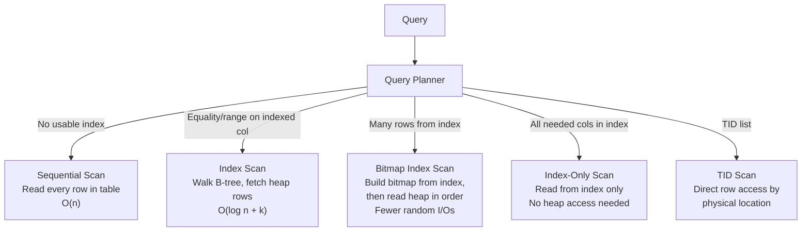
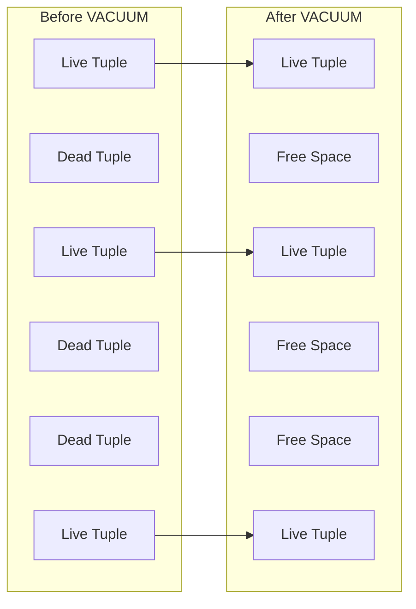
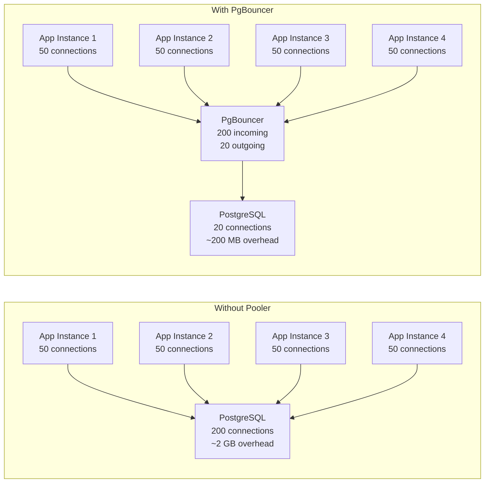

# PostgreSQL Performance Tuning

## Why Performance Tuning Matters

PostgreSQL is remarkably capable out of the box. Its default configuration, however, is tuned for **compatibility**, not performance — it assumes 1 GB of RAM, minimal concurrent connections, and conservative disk I/O. Running production workloads on default settings is like driving a sports car in first gear.

The difference between a well-tuned and poorly-tuned PostgreSQL instance is not marginal. A single missing index can turn a 2ms query into a 2-second query. Misconfigured `work_mem` can cause hash joins to spill to disk, adding 100x latency. An untuned autovacuum can let table bloat grow until sequential scans dominate and storage costs double.

Tuning PostgreSQL requires understanding three interconnected systems: the **query planner** (which decides how to execute your queries), the **storage engine** (which manages how data is physically stored and accessed), and the **operating system** (which manages memory, disk I/O, and process scheduling).

## EXPLAIN ANALYZE Deep Dive

`EXPLAIN ANALYZE` is the most important tool for PostgreSQL performance work. It shows you exactly how the database executes a query — which indexes are used, how many rows are scanned, where time is spent, and whether the planner's estimates match reality.

### Reading Execution Plans

```sql
EXPLAIN (ANALYZE, BUFFERS, FORMAT TEXT)
SELECT u.name, COUNT(o.id) as order_count
FROM users u
JOIN orders o ON o.user_id = u.id
WHERE u.created_at > '2025-01-01'
GROUP BY u.name
ORDER BY order_count DESC
LIMIT 10;
```

```
Sort  (cost=1542.87..1542.90 rows=10 width=44) (actual time=12.456..12.460 rows=10 loops=1)
  Sort Key: (count(o.id)) DESC
  Sort Method: top-N heapsort  Memory: 25kB
  Buffers: shared hit=1203 read=45
  ->  HashAggregate  (cost=1542.10..1542.60 rows=50 width=44) (actual time=12.321..12.389 rows=50 loops=1)
        Group Key: u.name
        Batches: 1  Memory Usage: 24kB
        Buffers: shared hit=1203 read=45
        ->  Hash Join  (cost=245.50..1490.10 rows=10400 width=22) (actual time=1.234..10.567 rows=10400 loops=1)
              Hash Cond: (o.user_id = u.id)
              Buffers: shared hit=1203 read=45
              ->  Seq Scan on orders o  (cost=0.00..820.00 rows=50000 width=12) (actual time=0.012..3.456 rows=50000 loops=1)
                    Buffers: shared hit=820
              ->  Hash  (cost=240.00..240.00 rows=440 width=26) (actual time=1.123..1.123 rows=440 loops=1)
                    Buckets: 1024  Batches: 1  Memory Usage: 35kB
                    Buffers: shared hit=383 read=45
                    ->  Index Scan using idx_users_created_at on users u  (cost=0.29..240.00 rows=440 width=26) (actual time=0.045..0.890 rows=440 loops=1)
                          Index Cond: (created_at > '2025-01-01'::date)
                          Buffers: shared hit=383 read=45
```

### Plan Anatomy

Every line in an execution plan is a **plan node**. Read bottom-up — execution starts at the innermost nodes.

| Field | Meaning |
|-------|---------|
| `cost=X..Y` | Estimated startup cost and total cost (in arbitrary units, not milliseconds) |
| `rows=N` | Estimated number of output rows |
| `actual time=X..Y` | Real startup time and total time (milliseconds) |
| `rows=N` (actual) | Real number of output rows |
| `loops=N` | How many times this node was executed (important for nested loops) |
| `Buffers: shared hit=N` | Pages read from PostgreSQL's buffer cache (RAM) |
| `Buffers: shared read=N` | Pages read from disk (or OS page cache) |
| `width=N` | Average row width in bytes |

::: danger The "rows" Estimate vs Reality Gap
When the planner's estimated `rows` is wildly different from actual `rows`, the planner is making decisions based on wrong statistics. This almost always means you need to run `ANALYZE` on the table, or the statistics target is too low for columns with skewed distributions. A 100x estimate error can cause the planner to choose a nested loop instead of a hash join, turning a 10ms query into a 10-second query.
:::

### Scan Types



| Scan Type | When Used | I/O Pattern | Performance |
|-----------|----------|-------------|-------------|
| Sequential Scan | No useful index, or selecting most of the table | Sequential reads | Good for large fractions (>5-10%) of a table |
| Index Scan | Selective predicate on indexed column | Random I/O (heap lookup per row) | Best for highly selective queries |
| Bitmap Index Scan | Moderate selectivity, or combining multiple indexes | Sequential reads after bitmap construction | Good for medium selectivity |
| Index-Only Scan | All required columns are in the index | Index-only reads | Fastest — no heap access |

### Join Types

| Join | How It Works | Best When |
|------|-------------|-----------|
| **Nested Loop** | For each row in outer table, scan inner table | Inner table is small or has a fast index lookup |
| **Hash Join** | Build hash table from smaller relation, probe with larger | Equi-joins with moderate-to-large relations |
| **Merge Join** | Sort both relations, merge | Both inputs are pre-sorted (index) or large |

```sql
-- Force a specific join type for testing (not for production)
SET enable_hashjoin = off;
SET enable_nestloop = off;
-- Run EXPLAIN ANALYZE, then re-enable
RESET enable_hashjoin;
RESET enable_nestloop;
```

### Cost Model

PostgreSQL's cost model uses two base costs:

| Parameter | Default | Meaning |
|-----------|---------|---------|
| `seq_page_cost` | 1.0 | Cost of reading one sequential page from disk |
| `random_page_cost` | 4.0 | Cost of reading one random page from disk |
| `cpu_tuple_cost` | 0.01 | Cost of processing one row |
| `cpu_index_tuple_cost` | 0.005 | Cost of processing one index entry |
| `cpu_operator_cost` | 0.0025 | Cost of processing one operator/function |

For SSD-backed storage, `random_page_cost` should be reduced to `1.1`-`1.5` because random reads on SSDs are nearly as fast as sequential reads. Leaving it at 4.0 makes the planner unfairly penalize index scans.

```sql
-- For SSD-backed systems
ALTER SYSTEM SET random_page_cost = 1.1;
ALTER SYSTEM SET effective_io_concurrency = 200;
SELECT pg_reload_conf();
```

## Index Strategies

### B-tree Indexes (Default)

B-tree is the default index type and handles equality and range queries on sortable data types:

```sql
-- Simple B-tree
CREATE INDEX idx_users_email ON users (email);

-- Composite index — column order matters for query matching
CREATE INDEX idx_orders_user_date ON orders (user_id, created_at DESC);

-- The above index supports:
-- WHERE user_id = 123                           (uses first column)
-- WHERE user_id = 123 AND created_at > '2025-01-01'  (uses both columns)
-- WHERE user_id = 123 ORDER BY created_at DESC  (uses both columns + avoids sort)
-- But NOT:
-- WHERE created_at > '2025-01-01'              (cannot skip leading column)
```

::: tip Composite Index Column Order
Put the **most selective** (equality) columns first, then range columns. For `WHERE status = 'active' AND created_at > '2025-01-01'`, index on `(status, created_at)` — not `(created_at, status)`. The first ordering lets PostgreSQL narrow to a small range of `status = 'active'` entries and then scan the `created_at` range. The reverse ordering scans the entire date range and then filters by status.
:::

### Partial Indexes

A partial index only indexes rows matching a `WHERE` clause, making it smaller and faster:

```sql
-- Only index active users — 90% of rows are inactive
CREATE INDEX idx_users_active_email ON users (email)
WHERE status = 'active';

-- Only index unprocessed orders
CREATE INDEX idx_orders_pending ON orders (created_at)
WHERE processed_at IS NULL;

-- Only index non-null values
CREATE INDEX idx_products_sku ON products (sku)
WHERE sku IS NOT NULL;
```

Partial indexes can be 10-100x smaller than full indexes when the predicate is highly selective. The query planner uses them automatically when the query's `WHERE` clause matches the index's predicate.

### Expression Indexes

Index the result of an expression rather than a raw column value:

```sql
-- Case-insensitive email lookup
CREATE INDEX idx_users_email_lower ON users (lower(email));
-- Query: WHERE lower(email) = 'user@example.com'

-- Index on extracted JSON field
CREATE INDEX idx_events_type ON events ((payload->>'type'));
-- Query: WHERE payload->>'type' = 'purchase'

-- Index on computed date
CREATE INDEX idx_orders_month ON orders (date_trunc('month', created_at));
-- Query: WHERE date_trunc('month', created_at) = '2025-01-01'
```

::: warning Expression Must Match Exactly
The expression in the query must match the expression in the index exactly. `WHERE LOWER(email) = ...` uses the index, but `WHERE email ILIKE ...` does not. PostgreSQL does not recognize semantic equivalence between different expressions.
:::

### Covering Indexes (INCLUDE)

A covering index includes additional columns that are not part of the search key but are needed by the query. This enables index-only scans:

```sql
-- Without INCLUDE: Index Scan + heap lookup for name and email
CREATE INDEX idx_users_status ON users (status);
-- SELECT name, email FROM users WHERE status = 'active';
-- → Index Scan on idx_users_status → Heap Fetch for name, email

-- With INCLUDE: Index-Only Scan — no heap access needed
CREATE INDEX idx_users_status_covering ON users (status) INCLUDE (name, email);
-- SELECT name, email FROM users WHERE status = 'active';
-- → Index-Only Scan on idx_users_status_covering
```

The `INCLUDE` columns are stored in the index leaf pages but are not part of the B-tree structure. They cannot be used for searching or sorting — only for avoiding heap lookups.

### GIN Indexes (Full-Text Search, Arrays, JSONB)

Generalized Inverted Indexes map values to the rows that contain them. Essential for:

```sql
-- Full-text search
CREATE INDEX idx_articles_search ON articles USING gin (to_tsvector('english', title || ' ' || body));
-- Query: WHERE to_tsvector('english', title || ' ' || body) @@ to_tsquery('postgresql & tuning')

-- JSONB containment
CREATE INDEX idx_events_payload ON events USING gin (payload jsonb_path_ops);
-- Query: WHERE payload @> '{"type": "purchase", "amount": 99.99}'

-- Array containment
CREATE INDEX idx_products_tags ON products USING gin (tags);
-- Query: WHERE tags @> ARRAY['electronics', 'sale']
```

::: tip GIN vs GiST for Full-Text Search
GIN indexes are faster for lookups but slower to update (every insert must update the inverted index). GiST indexes are faster to build and update but slower for queries. Use GIN for read-heavy workloads (most production systems). Use GiST if your table has very high write throughput and you can tolerate slower queries.
:::

### GiST Indexes (Geometric, Range, Nearest-Neighbor)

Generalized Search Tree indexes support geometric operations, range queries, and nearest-neighbor search:

```sql
-- PostGIS spatial queries
CREATE INDEX idx_locations_geom ON locations USING gist (geom);
-- Query: WHERE ST_DWithin(geom, ST_MakePoint(-73.99, 40.73)::geography, 1000)

-- Range types (e.g., time ranges for booking systems)
CREATE INDEX idx_bookings_period ON bookings USING gist (tsrange(check_in, check_out));
-- Query: WHERE tsrange(check_in, check_out) && tsrange('2025-06-01', '2025-06-07')

-- Trigram similarity (fuzzy text matching)
CREATE INDEX idx_products_name_trgm ON products USING gist (name gist_trgm_ops);
-- Query: WHERE name % 'postgresql'  (similarity match)
```

### BRIN Indexes (Block Range Indexes)

BRIN indexes are tiny indexes that store min/max values per range of physical pages. Extremely effective for naturally ordered data (timestamps, auto-incrementing IDs):

```sql
-- Excellent for time-series data that is inserted in order
CREATE INDEX idx_events_created ON events USING brin (created_at)
WITH (pages_per_range = 128);

-- BRIN is tiny: a 100GB table might have a 100KB BRIN index
-- vs a 2GB B-tree index for the same column
```

| Index Type | Size (100M rows) | Build Time | Lookup Speed | Best For |
|-----------|-------------------|------------|--------------|----------|
| B-tree | ~2 GB | Minutes | O(log n) | Equality, range, sorting |
| GIN | ~1-3 GB | Minutes | O(1) per value | Full-text, JSONB, arrays |
| GiST | ~1-2 GB | Minutes | Varies | Geometry, ranges, similarity |
| BRIN | ~100 KB | Seconds | O(ranges) | Time-series, naturally ordered |
| Hash | ~1.5 GB | Minutes | O(1) | Equality only (rarely used) |

## Query Optimization

### Avoid SELECT *

```sql
-- Bad: fetches all columns, prevents index-only scans
SELECT * FROM orders WHERE user_id = 123;

-- Good: fetch only needed columns
SELECT id, total, created_at FROM orders WHERE user_id = 123;

-- Best: with a covering index on (user_id) INCLUDE (id, total, created_at)
-- this becomes an Index-Only Scan
```

`SELECT *` is harmful for three reasons: it transfers unnecessary data over the network, it prevents index-only scans (the planner must access the heap for columns not in the index), and it breaks when columns are added or reordered.

### CTEs vs Subqueries

In PostgreSQL 12+, CTEs are **inlined** by default (treated as subqueries for optimization). But CTEs marked with `MATERIALIZED` are executed once and stored:

```sql
-- Inlined CTE (PostgreSQL 12+) — planner optimizes as if it were a subquery
WITH active_users AS (
    SELECT id, name FROM users WHERE status = 'active'
)
SELECT au.name, COUNT(o.id)
FROM active_users au
JOIN orders o ON o.user_id = au.id
GROUP BY au.name;

-- Materialized CTE — executed once, stored in memory/temp file
-- Useful as an optimization fence when the planner makes a bad choice
WITH active_users AS MATERIALIZED (
    SELECT id, name FROM users WHERE status = 'active'
)
SELECT au.name, COUNT(o.id)
FROM active_users au
JOIN orders o ON o.user_id = au.id
GROUP BY au.name;
```

### EXISTS vs IN

```sql
-- EXISTS: stops at first match (short-circuit)
SELECT u.name FROM users u
WHERE EXISTS (
    SELECT 1 FROM orders o WHERE o.user_id = u.id AND o.total > 100
);

-- IN with subquery: may execute subquery fully
SELECT u.name FROM users u
WHERE u.id IN (
    SELECT o.user_id FROM orders o WHERE o.total > 100
);

-- For large subquery results, EXISTS is usually faster because it short-circuits.
-- For small subquery results, performance is similar.
-- The planner often rewrites one to the other anyway.
```

### Keyset Pagination (Cursor-Based)

OFFSET-based pagination is slow for deep pages because PostgreSQL must scan and discard all preceding rows:

```sql
-- Bad: OFFSET-based — O(offset + limit) work
SELECT id, name, created_at FROM products
ORDER BY created_at DESC, id DESC
LIMIT 20 OFFSET 10000;
-- Must scan 10,020 rows, discard 10,000

-- Good: Keyset-based — O(limit) work regardless of page depth
SELECT id, name, created_at FROM products
WHERE (created_at, id) < ('2025-03-15 10:30:00', 984532)
ORDER BY created_at DESC, id DESC
LIMIT 20;
-- Index scan starts directly at the cursor position
```

Keyset pagination requires a unique, ordered cursor (usually `(created_at, id)`) and a composite index on those columns. The tradeoff is you cannot jump to arbitrary page numbers — you can only go forward and backward from a known position.

### Batch Operations

```sql
-- Bad: N individual inserts (N round trips)
INSERT INTO events (type, data) VALUES ('click', '{}');
INSERT INTO events (type, data) VALUES ('view', '{}');
-- ...repeated 10,000 times

-- Good: Multi-row INSERT (1 round trip)
INSERT INTO events (type, data) VALUES
    ('click', '{}'),
    ('view', '{}'),
    -- ...up to ~1000 rows per statement
;

-- Best: COPY for bulk loading (binary protocol, no SQL parsing)
COPY events (type, data) FROM STDIN WITH (FORMAT csv);
```

| Method | Rows/sec (typical) | Use Case |
|--------|-------------------|----------|
| Individual INSERTs | 500-2,000 | Small batches, ORM default |
| Multi-row INSERT | 10,000-50,000 | Application batch operations |
| COPY | 100,000-500,000 | Data migrations, ETL, bulk loading |
| COPY (binary format) | 200,000-1,000,000 | Maximum throughput |

## VACUUM and Autovacuum

### Why VACUUM Exists

PostgreSQL's MVCC (Multi-Version Concurrency Control) never modifies rows in-place. An `UPDATE` creates a new version of the row and marks the old version as dead. A `DELETE` marks the row as dead without physically removing it. These dead tuples (also called "dead rows") accumulate over time, causing:

1. **Table bloat** — the table occupies more disk space than the live data requires
2. **Index bloat** — indexes still point to dead tuples
3. **Slower sequential scans** — must read through dead tuples to find live ones
4. **Transaction ID wraparound risk** — without vacuuming, PostgreSQL can run out of transaction IDs (a catastrophic failure)



::: warning VACUUM Reclaims Space — But Does Not Return It to the OS
Standard `VACUUM` marks dead tuple space as reusable within the table, but the table file does not shrink on disk. Only `VACUUM FULL` (or `pg_repack`) physically compacts the table — but `VACUUM FULL` takes an exclusive lock, blocking all reads and writes. Use `VACUUM FULL` only during maintenance windows.
:::

### Autovacuum Tuning

The autovacuum daemon runs automatically, but its default settings are conservative:

```sql
-- Check autovacuum activity
SELECT relname, n_dead_tup, n_live_tup,
       round(n_dead_tup::numeric / GREATEST(n_live_tup, 1) * 100, 1) AS dead_pct,
       last_vacuum, last_autovacuum, last_analyze, last_autoanalyze
FROM pg_stat_user_tables
ORDER BY n_dead_tup DESC
LIMIT 20;
```

Default autovacuum triggers:

$$
\text{vacuum when: } \text{dead\_tuples} > \text{threshold} + \text{scale\_factor} \times \text{live\_tuples}
$$

With defaults (`threshold=50`, `scale_factor=0.2`):
- A 1,000-row table is vacuumed after 250 dead tuples (50 + 0.2 * 1000)
- A 10,000,000-row table is vacuumed after 2,000,050 dead tuples

The problem is clear: **large tables tolerate too much bloat** before autovacuum kicks in. For a 100-million-row table, you need 20 million dead tuples before autovacuum runs.

```sql
-- Tune per-table for large, high-churn tables
ALTER TABLE orders SET (
    autovacuum_vacuum_scale_factor = 0.01,      -- 1% instead of 20%
    autovacuum_vacuum_threshold = 1000,           -- Lower base threshold
    autovacuum_analyze_scale_factor = 0.005,      -- Analyze more frequently
    autovacuum_vacuum_cost_delay = 2              -- Faster vacuum (less throttling)
);

-- Global tuning for the entire cluster
ALTER SYSTEM SET autovacuum_max_workers = 6;              -- More concurrent vacuums
ALTER SYSTEM SET autovacuum_vacuum_cost_limit = 2000;     -- Less throttling
ALTER SYSTEM SET autovacuum_naptime = '15s';              -- Check more frequently
SELECT pg_reload_conf();
```

### Monitoring Bloat

```sql
-- Estimate table bloat (approximate)
SELECT
    schemaname || '.' || relname AS table_name,
    pg_size_pretty(pg_total_relation_size(relid)) AS total_size,
    pg_size_pretty(pg_relation_size(relid)) AS table_size,
    n_dead_tup,
    n_live_tup,
    round(n_dead_tup::numeric / GREATEST(n_live_tup + n_dead_tup, 1) * 100, 1) AS dead_pct
FROM pg_stat_user_tables
WHERE n_dead_tup > 10000
ORDER BY n_dead_tup DESC;

-- Precise bloat estimation using pgstattuple extension
CREATE EXTENSION IF NOT EXISTS pgstattuple;
SELECT * FROM pgstattuple('orders');
-- Returns: table_len, tuple_count, dead_tuple_count, dead_tuple_len, free_space, free_percent
```

## Connection Pooling

### Why You Need a Connection Pooler

Each PostgreSQL connection is a dedicated OS process consuming 5-10 MB of RAM. With 200 connections, that is 1-2 GB just for connection overhead. Applications using connection-per-request patterns (common in serverless and microservices) can exhaust PostgreSQL's connection limit within seconds.



### PgBouncer Pooling Modes

| Mode | Behavior | Connection Reuse | Supports |
|------|----------|-----------------|----------|
| **Session** | Connection assigned per client session | After client disconnects | Everything (prepared statements, temp tables, SET) |
| **Transaction** | Connection assigned per transaction | After each COMMIT/ROLLBACK | Most queries (not SET, not prepared statements across transactions) |
| **Statement** | Connection assigned per statement | After each statement | Only simple autocommit queries (no multi-statement transactions) |

```ini
# pgbouncer.ini
[databases]
mydb = host=127.0.0.1 port=5432 dbname=mydb

[pgbouncer]
listen_addr = 0.0.0.0
listen_port = 6432
auth_type = scram-sha-256
auth_file = /etc/pgbouncer/userlist.txt

# Pool sizing
pool_mode = transaction
default_pool_size = 20        # Connections per user/database pair
min_pool_size = 5             # Keep this many connections open
reserve_pool_size = 5         # Extra connections for burst traffic
reserve_pool_timeout = 3      # Wait 3s before using reserve pool

# Timeouts
server_idle_timeout = 600     # Close idle server connections after 10 min
client_idle_timeout = 0       # Never close idle client connections
query_timeout = 30            # Kill queries running longer than 30s

# Limits
max_client_conn = 1000        # Max incoming connections
max_db_connections = 50       # Max connections to PostgreSQL
```

### Supavisor (Modern Alternative)

Supavisor is a newer connection pooler built for multi-tenant, cloud-native PostgreSQL:

```
- Written in Elixir (BEAM VM — excellent for concurrent connections)
- Native support for multi-tenant routing
- Prometheus metrics built-in
- Supports both transaction and session pooling
- Designed for Supabase but works with any PostgreSQL
```

## Memory Tuning

### Key Memory Parameters

```sql
-- View current settings
SELECT name, setting, unit, context
FROM pg_settings
WHERE name IN (
    'shared_buffers', 'work_mem', 'maintenance_work_mem',
    'effective_cache_size', 'wal_buffers', 'huge_pages'
)
ORDER BY name;
```

| Parameter | Default | Recommended | Purpose |
|-----------|---------|-------------|---------|
| `shared_buffers` | 128 MB | 25% of RAM (up to ~8 GB) | PostgreSQL's main buffer cache |
| `effective_cache_size` | 4 GB | 50-75% of RAM | Planner hint for OS cache size |
| `work_mem` | 4 MB | 16-64 MB | Memory per sort/hash operation |
| `maintenance_work_mem` | 64 MB | 256 MB - 1 GB | Memory for VACUUM, CREATE INDEX |
| `wal_buffers` | 16 MB | 64 MB | WAL write buffer size |
| `huge_pages` | try | on (if OS supports) | Use huge pages for shared memory |

### shared_buffers

The shared buffer pool is PostgreSQL's primary cache. Data read from disk is stored here, and frequently accessed pages stay in memory:

```sql
-- Set to 25% of total RAM (e.g., 4 GB for a 16 GB server)
ALTER SYSTEM SET shared_buffers = '4GB';
-- Requires restart to take effect
```

::: tip Why Not Set shared_buffers to 50% or More?
PostgreSQL relies on the OS page cache for additional caching. Setting `shared_buffers` too high steals memory from the OS page cache, which can actually hurt performance. The OS cache handles sequential read-ahead and caches data that PostgreSQL evicts from its buffer pool. The sweet spot is 25% of RAM for dedicated database servers.
:::

### work_mem

`work_mem` is allocated per **sort or hash operation**, not per query or connection. A single complex query with 5 sort/hash operations can use 5x `work_mem`:

```sql
-- Default 4 MB — too low for complex analytics queries
ALTER SYSTEM SET work_mem = '32MB';

-- For specific analytical queries, set it per-session
SET work_mem = '256MB';
-- Run your complex query
RESET work_mem;
```

How to detect when `work_mem` is too low — look for `Sort Method: external merge Disk:` in EXPLAIN output:

```
Sort  (cost=...) (actual time=2345.678..2400.123 rows=1000000 loops=1)
  Sort Key: created_at
  Sort Method: external merge  Disk: 125MB    ← PROBLEM: spilling to disk
```

If you see `Disk:` in sort operations, increase `work_mem`. If you see `Memory:`, the sort fits in RAM.

### effective_cache_size

This is purely a hint to the planner — it does not allocate any memory. It tells the planner how much of the data it can expect to find in cache (PostgreSQL shared buffers + OS page cache). This affects whether the planner chooses index scans (which benefit from caching) over sequential scans:

```sql
-- Set to 50-75% of total RAM
ALTER SYSTEM SET effective_cache_size = '12GB';  -- For a 16 GB server
```

## Write Optimization

### WAL Configuration

```sql
-- For high-throughput write workloads
ALTER SYSTEM SET wal_level = 'replica';           -- Minimum for replication
ALTER SYSTEM SET max_wal_size = '4GB';            -- Larger WAL before checkpoint
ALTER SYSTEM SET min_wal_size = '1GB';            -- Minimum WAL retention
ALTER SYSTEM SET checkpoint_completion_target = 0.9;  -- Spread checkpoint I/O
ALTER SYSTEM SET wal_compression = 'zstd';        -- Compress WAL (PG 15+)
```

### synchronous_commit

For write-heavy workloads where you can tolerate a tiny window of data loss:

```sql
-- Default: on — every commit waits for WAL flush to disk
-- Safest, but adds ~2-5ms latency per commit (fsync)

-- Off: commit returns immediately, WAL flushed asynchronously
-- Risk: up to wal_writer_delay (200ms) of committed transactions lost on crash
ALTER SYSTEM SET synchronous_commit = 'off';

-- Per-transaction control (best approach)
SET LOCAL synchronous_commit = 'off';
INSERT INTO analytics_events (...) VALUES (...);
COMMIT;  -- Returns immediately, no fsync wait
```

| Setting | Data Safety | Write Latency | Use Case |
|---------|------------|---------------|----------|
| `on` (default) | Zero data loss | ~2-5ms per commit | Financial transactions, user data |
| `off` | Up to 200ms of commits lost | Sub-millisecond | Analytics events, logs, metrics |
| `remote_write` | Data on standby's OS cache | ~1-2ms network RTT | Primary-standby with fast network |
| `remote_apply` | Data applied on standby | ~5-20ms | Read-after-write consistency on replicas |

### COPY for Bulk Loading

```sql
-- Fastest way to load data
-- 1. Disable indexes and constraints during load
ALTER TABLE events SET UNLOGGED;  -- No WAL (10x faster, but not crash-safe)
-- OR
ALTER TABLE events DISABLE TRIGGER ALL;  -- Disable triggers

-- 2. Use COPY
COPY events (type, user_id, data, created_at)
FROM '/path/to/data.csv' WITH (FORMAT csv, HEADER true);

-- 3. Re-enable
ALTER TABLE events SET LOGGED;
ALTER TABLE events ENABLE TRIGGER ALL;

-- 4. Rebuild indexes
REINDEX TABLE events;

-- 5. Update statistics
ANALYZE events;
```

## Monitoring

### pg_stat_statements

The most important extension for query performance monitoring. It tracks execution statistics for every query:

```sql
-- Enable the extension
CREATE EXTENSION IF NOT EXISTS pg_stat_statements;

-- Top queries by total execution time
SELECT
    round(total_exec_time::numeric, 2) AS total_time_ms,
    calls,
    round(mean_exec_time::numeric, 2) AS avg_time_ms,
    round((100 * total_exec_time / sum(total_exec_time) OVER ())::numeric, 2) AS pct_total,
    query
FROM pg_stat_statements
ORDER BY total_exec_time DESC
LIMIT 20;

-- Queries with the worst cache hit ratio
SELECT
    query,
    calls,
    shared_blks_hit,
    shared_blks_read,
    round(shared_blks_hit::numeric / GREATEST(shared_blks_hit + shared_blks_read, 1) * 100, 1) AS cache_hit_pct
FROM pg_stat_statements
WHERE calls > 100
ORDER BY cache_hit_pct ASC
LIMIT 20;

-- Reset statistics (do this periodically)
SELECT pg_stat_statements_reset();
```

### Lock Monitoring

```sql
-- View current locks and blocking queries
SELECT
    blocked.pid AS blocked_pid,
    blocked_activity.query AS blocked_query,
    blocking.pid AS blocking_pid,
    blocking_activity.query AS blocking_query,
    blocked.locktype,
    now() - blocked_activity.query_start AS blocked_duration
FROM pg_catalog.pg_locks blocked
JOIN pg_catalog.pg_stat_activity blocked_activity ON blocked.pid = blocked_activity.pid
JOIN pg_catalog.pg_locks blocking ON blocked.locktype = blocking.locktype
    AND blocked.database IS NOT DISTINCT FROM blocking.database
    AND blocked.relation IS NOT DISTINCT FROM blocking.relation
    AND blocked.page IS NOT DISTINCT FROM blocking.page
    AND blocked.tuple IS NOT DISTINCT FROM blocking.tuple
    AND blocked.virtualxid IS NOT DISTINCT FROM blocking.virtualxid
    AND blocked.transactionid IS NOT DISTINCT FROM blocking.transactionid
    AND blocked.pid != blocking.pid
JOIN pg_catalog.pg_stat_activity blocking_activity ON blocking.pid = blocking_activity.pid
WHERE NOT blocked.granted;

-- Kill a blocking query
SELECT pg_terminate_backend(<pid>);
```

### Buffer Cache Hit Ratio

```sql
-- Overall cache hit ratio (should be > 99%)
SELECT
    sum(heap_blks_read) AS heap_read,
    sum(heap_blks_hit) AS heap_hit,
    round(sum(heap_blks_hit)::numeric / GREATEST(sum(heap_blks_hit) + sum(heap_blks_read), 1) * 100, 2) AS cache_hit_ratio
FROM pg_statio_user_tables;

-- Per-table cache hit ratio
SELECT
    relname,
    heap_blks_read,
    heap_blks_hit,
    round(heap_blks_hit::numeric / GREATEST(heap_blks_hit + heap_blks_read, 1) * 100, 1) AS hit_pct
FROM pg_statio_user_tables
WHERE heap_blks_read + heap_blks_hit > 1000
ORDER BY hit_pct ASC
LIMIT 20;
```

## Partitioning

Partitioning divides a large table into smaller physical pieces. PostgreSQL supports declarative partitioning since version 10:

```sql
-- Range partitioning by date (most common)
CREATE TABLE events (
    id bigint GENERATED ALWAYS AS IDENTITY,
    event_type text NOT NULL,
    data jsonb,
    created_at timestamptz NOT NULL
) PARTITION BY RANGE (created_at);

-- Create monthly partitions
CREATE TABLE events_2025_01 PARTITION OF events
    FOR VALUES FROM ('2025-01-01') TO ('2025-02-01');
CREATE TABLE events_2025_02 PARTITION OF events
    FOR VALUES FROM ('2025-02-01') TO ('2025-03-01');
-- ... etc

-- Default partition for rows that don't match any partition
CREATE TABLE events_default PARTITION OF events DEFAULT;

-- Each partition can have its own indexes
CREATE INDEX ON events_2025_01 (event_type);
CREATE INDEX ON events_2025_02 (event_type);
-- Or create indexes on the parent (automatically inherited)
CREATE INDEX ON events (event_type);
```

**When to partition:**
- Tables exceeding 50-100 GB
- Time-series data with range queries on the timestamp column
- When you need to drop old data quickly (`DROP TABLE events_2024_01` is instant vs `DELETE` which is slow and creates bloat)
- When vacuum struggles to keep up with a single huge table

## Common Anti-Patterns

### N+1 Query Problem

```sql
-- Anti-pattern: 1 query for users + N queries for orders
SELECT * FROM users WHERE active = true;
-- For each user:
--   SELECT * FROM orders WHERE user_id = ?;

-- Fix: Single query with JOIN
SELECT u.id, u.name, o.id AS order_id, o.total
FROM users u
LEFT JOIN orders o ON o.user_id = u.id
WHERE u.active = true;

-- Or batch with IN (if JOIN produces too many rows)
SELECT * FROM orders WHERE user_id IN (1, 2, 3, 4, 5, ...);
```

### Missing Indexes on Foreign Keys

```sql
-- Anti-pattern: foreign key without index
CREATE TABLE orders (
    id serial PRIMARY KEY,
    user_id integer REFERENCES users(id)   -- FK without index
);

-- This makes JOIN to users slow (sequential scan on orders.user_id)
-- Also makes DELETE FROM users slow (must check orders for references)

-- Fix: always index foreign key columns
CREATE INDEX idx_orders_user_id ON orders (user_id);
```

::: danger PostgreSQL Does NOT Auto-Create Foreign Key Indexes
Unlike some databases, PostgreSQL does not automatically create an index on the foreign key column. It only creates an index on the referenced column (which already exists — it is the primary key). You must manually create indexes on every foreign key column. This is one of the most common performance mistakes.
:::

### Over-Indexing

```sql
-- Anti-pattern: indexes on every column
CREATE INDEX idx_users_name ON users (name);
CREATE INDEX idx_users_email ON users (email);
CREATE INDEX idx_users_created ON users (created_at);
CREATE INDEX idx_users_status ON users (status);
CREATE INDEX idx_users_name_email ON users (name, email);
CREATE INDEX idx_users_email_name ON users (email, name);
CREATE INDEX idx_users_status_created ON users (status, created_at);
-- ...20 more indexes

-- Problems:
-- 1. Every INSERT/UPDATE must update ALL indexes
-- 2. Disk space wasted on redundant indexes
-- 3. Planner may choose suboptimal index

-- Find unused indexes
SELECT
    s.relname AS table_name,
    i.relname AS index_name,
    s.idx_scan AS times_used,
    pg_size_pretty(pg_relation_size(i.oid)) AS index_size
FROM pg_stat_user_indexes s
JOIN pg_class i ON i.relname = s.indexrelname
WHERE s.idx_scan = 0
AND s.relname NOT LIKE 'pg_%'
ORDER BY pg_relation_size(i.oid) DESC;
```

### Using OFFSET for Deep Pagination

See the [Keyset Pagination](#keyset-pagination-cursor-based) section above. OFFSET-based pagination degrades linearly with page depth.

---

## Key Takeaway

::: info Key Takeaway
PostgreSQL performance tuning is not about memorizing settings — it is about building a feedback loop: use `EXPLAIN ANALYZE` to understand how queries execute, use `pg_stat_statements` to find the most impactful queries to optimize, use proper indexing strategies (partial, covering, expression) to eliminate unnecessary I/O, and tune autovacuum and memory settings based on your specific workload. The highest-leverage action is almost always adding the right index or rewriting a query — not changing `postgresql.conf` settings.
:::

---

## Common Misconceptions

::: warning Common Misconceptions

**1. "More RAM for shared_buffers is always better."**
Setting `shared_buffers` beyond 25% of RAM (or ~8 GB) often degrades performance because it starves the OS page cache. PostgreSQL relies on the OS cache as a second-level cache — taking memory away from it can increase disk I/O. The 25% guideline exists because the OS cache is better at sequential read-ahead and handles cache eviction differently.

**2. "VACUUM FULL should be run regularly."**
`VACUUM FULL` takes an exclusive lock on the table, blocking all reads and writes. It is a maintenance operation for severe bloat, not a routine task. Regular (standard) `VACUUM` runs without blocking and is sufficient for normal operations. If you need to reclaim space without downtime, use `pg_repack` instead.

**3. "Indexes always make queries faster."**
Indexes slow down writes (every INSERT/UPDATE/DELETE must update all affected indexes), consume disk space, and can even slow down reads if the planner chooses an index scan when a sequential scan would be faster (e.g., reading >10% of a table). Over-indexing is a real problem — monitor `pg_stat_user_indexes` for unused indexes and remove them.

**4. "PostgreSQL automatically creates indexes for foreign keys."**
It does not. PostgreSQL only creates indexes for PRIMARY KEY and UNIQUE constraints. Foreign key columns must be indexed manually. Missing foreign key indexes are one of the most common performance problems and make both JOINs and cascading DELETEs slow.

**5. "Connection pooling is optional for small applications."**
Even small applications benefit from connection pooling. PostgreSQL's per-connection overhead (forking a process, allocating private memory) adds 50-100ms to connection creation. Without pooling, every request that opens a new connection pays this cost. With PgBouncer in transaction mode, 200 application connections can share 20 PostgreSQL connections.

**6. "CTEs are always optimization barriers."**
This was true before PostgreSQL 12. Since PG 12, CTEs are **inlined** by default — the planner optimizes them as subqueries. Only CTEs explicitly marked with `MATERIALIZED` or those that are referenced multiple times may be materialized. Wrapping queries in CTEs for readability has no performance penalty in modern PostgreSQL.
:::

---

## When NOT to Use These Techniques

| Technique | When NOT to Use | Why |
|-----------|----------------|-----|
| Partial indexes | Table has uniform data distribution | Partial index covers as many rows as a full index — no benefit |
| BRIN indexes | Data is not physically ordered | BRIN relies on correlation between physical and logical order |
| GIN indexes | Small tables (<10K rows) | B-tree is faster for small tables |
| `synchronous_commit = off` | Financial or user-critical data | Risk of losing committed transactions on crash |
| Partitioning | Tables under 10-50 GB | Partitioning adds query complexity with minimal benefit for small tables |
| Connection pooling (statement mode) | Queries use prepared statements or temp tables | Statement mode does not support multi-statement transactions |

---

## In Production

::: warning Production Considerations

**Monitor pg_stat_statements continuously.** Reset it weekly and look for new slow queries, regression in existing queries (mean_exec_time increasing), and queries with high `shared_blks_read` (low cache hit ratio). This single extension reveals more performance issues than any other tool.

**Set random_page_cost correctly for your storage.** If you are on SSDs (which you should be), set `random_page_cost` to `1.1`. The default `4.0` is for spinning disks and makes the planner unfairly avoid index scans on SSD-backed systems.

**Size work_mem based on your query complexity.** If EXPLAIN shows `Sort Method: external merge Disk:`, increase `work_mem`. But be conservative — it is per-sort-operation, not per-query. A setting of 256 MB with 100 concurrent connections doing 3 sorts each could use 75 GB of RAM.

**Tune autovacuum aggressively for large tables.** The default `autovacuum_vacuum_scale_factor` of 0.2 means a 100M-row table tolerates 20M dead tuples before vacuum. Set it to 0.01-0.05 per-table for large, high-churn tables.

**Use `pg_repack` instead of `VACUUM FULL`.** `pg_repack` performs an online table compaction without an exclusive lock. It creates a new copy of the table, replays changes via triggers, and swaps atomically. Your application continues to read and write during the process.

**Never run without connection pooling in production.** Even if your application has its own connection pool, consider PgBouncer in front of PostgreSQL. It handles connection storms (hundreds of new connections in seconds) that would overwhelm PostgreSQL's fork-per-connection model.
:::

---

## Quiz

::: details Quiz — 7 Questions

**Q1: In an EXPLAIN ANALYZE plan, you see `Buffers: shared hit=500 read=5000`. What does this tell you?**
500 pages were read from PostgreSQL's shared buffer cache (RAM), and 5000 pages were read from disk (or the OS page cache). A ratio of 500:5000 (9% cache hit) indicates the data is not fitting in `shared_buffers`. Either the table is too large for the buffer pool, the query is accessing data that is not frequently read (cold data), or `shared_buffers` needs to be increased.

**Q2: Why is a partial index on `WHERE status = 'active'` beneficial if only 5% of rows are active?**
The index is 20x smaller than a full index (only stores the 5% of rows that match). Smaller indexes mean faster scans, less memory consumption in the buffer pool, and faster maintenance. The planner uses this index automatically when the query includes `WHERE status = 'active'`. The 95% of inactive rows consume zero index space.

**Q3: What is the difference between PgBouncer's transaction mode and session mode?**
In **session mode**, a PostgreSQL connection is assigned to a client for the entire session — the client can use prepared statements, temporary tables, and SET commands across multiple transactions. In **transaction mode**, the connection is returned to the pool after each transaction, so features that depend on session state (prepared statements, temp tables, SET without RESET) do not work across transaction boundaries. Transaction mode achieves much higher connection multiplexing.

**Q4: Why does `SELECT *` prevent index-only scans?**
An index-only scan reads data entirely from the index, avoiding the heap (table) access. This requires all queried columns to be present in the index. `SELECT *` requests all columns, which are almost never all in a single index. The planner must perform a regular index scan plus a heap fetch for every row, which is significantly slower.

**Q5: When would you use a BRIN index instead of a B-tree?**
BRIN indexes are ideal for very large tables where the indexed column is physically correlated with the row storage order — typically timestamp columns in append-only tables (logs, events, time-series data). BRIN indexes are 1000x smaller than equivalent B-tree indexes (100 KB vs 2 GB for 100M rows) because they only store min/max per block range. Use them when you filter by range on a naturally ordered column.

**Q6: Why is the default `autovacuum_vacuum_scale_factor` of 0.2 problematic for large tables?**
For a 100-million-row table, this setting allows 20 million dead tuples to accumulate before autovacuum triggers. Those 20 million dead tuples consume significant disk space, slow down sequential scans, and waste I/O as the vacuum must eventually process all of them at once. For large tables, set the per-table `autovacuum_vacuum_scale_factor` to 0.01-0.05 to vacuum more frequently with smaller batches.

**Q7: What happens when `work_mem` is too low for a hash join?**
The hash table that PostgreSQL builds for the smaller relation spills to temporary disk files. Instead of an in-memory hash lookup (microseconds per row), the join must read and write temporary files (milliseconds per batch). EXPLAIN shows `Batches: N` where N > 1, indicating the hash table was split into multiple batches with disk spills. Increasing `work_mem` to fit the hash table in memory can speed up the join by 10-100x.
:::

---

## Exercise

::: details Diagnose and Optimize a Slow Query Suite

**Scenario:** You have a PostgreSQL 16 database with the following schema:

```sql
CREATE TABLE users (
    id serial PRIMARY KEY,
    email text UNIQUE NOT NULL,
    name text NOT NULL,
    status text NOT NULL DEFAULT 'active',
    created_at timestamptz NOT NULL DEFAULT now()
);
-- 5 million rows, 95% status = 'inactive'

CREATE TABLE orders (
    id serial PRIMARY KEY,
    user_id integer REFERENCES users(id),  -- No index!
    total numeric(10,2) NOT NULL,
    status text NOT NULL DEFAULT 'pending',
    created_at timestamptz NOT NULL DEFAULT now()
);
-- 50 million rows
```

**Slow queries to optimize:**

```sql
-- Query 1: Takes 12 seconds
SELECT u.name, u.email, COUNT(o.id) as order_count, SUM(o.total) as lifetime_value
FROM users u
JOIN orders o ON o.user_id = u.id
WHERE u.status = 'active'
GROUP BY u.name, u.email
ORDER BY lifetime_value DESC
LIMIT 20;

-- Query 2: Takes 45 seconds
SELECT * FROM orders WHERE user_id = 12345 ORDER BY created_at DESC LIMIT 10;

-- Query 3: Takes 8 seconds
SELECT * FROM orders WHERE status = 'pending' AND created_at < now() - interval '7 days';

-- Query 4: Pagination — takes 30+ seconds for deep pages
SELECT * FROM orders ORDER BY created_at DESC LIMIT 20 OFFSET 1000000;
```

**Tasks:**
1. Run `EXPLAIN ANALYZE` (mentally) on each query and identify the bottleneck
2. Propose the exact `CREATE INDEX` statements to fix each query
3. Rewrite Query 4 to use keyset pagination
4. Identify which indexes should be partial indexes and why
5. Propose `autovacuum` tuning for the `orders` table (50M rows, high churn)
6. Calculate appropriate `shared_buffers` and `work_mem` for a 32 GB server

**Expected improvements:** Query 1 from 12s to <100ms, Query 2 from 45s to <5ms, Query 3 from 8s to <50ms, Query 4 from 30s to <5ms.
:::

---

## One-Liner Summary

PostgreSQL performance tuning is a feedback loop — use EXPLAIN ANALYZE to find bottlenecks, add targeted indexes (partial, covering, BRIN), tune autovacuum for your table sizes, and pool connections with PgBouncer to multiply throughput.

---

*See also: [PostgreSQL Internals](./postgres-internals.md) | [Indexing Deep Dive](./indexing-deep-dive.md) | [Connection Pooling](./connection-pooling.md) | [Query Planning and Optimization](./query-planning-optimization.md) | [MVCC](./mvcc.md)*
