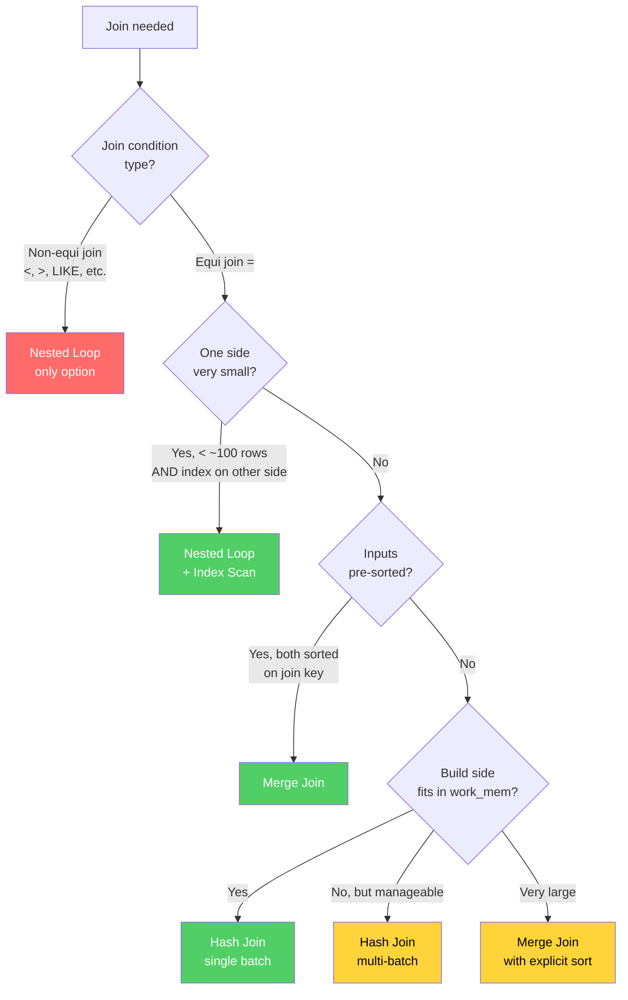

# Query Planning & Optimization

The query planner is the most sophisticated component in any relational database. It takes a declarative SQL statement — which says *what* you want but not *how* to get it — and produces an imperative execution plan that specifies exactly which algorithms to use, in which order, on which data structures. A good planner turns a naive query into something that finishes in milliseconds. A bad plan for the same query can run for hours.

Most developers never look at query plans. They write SQL, see that results come back, and move on. Then one day a query that took 10ms starts taking 10 minutes, and they have no mental model for understanding why. This section gives you that mental model.

## What the Query Planner Does

The planner's job is deceptively simple: given a SQL query, find the cheapest way to produce the correct result. "Cheapest" means lowest estimated cost, which is a proxy for execution time. The planner considers every legal permutation of join orders, join algorithms, scan methods, and sort strategies, estimates the cost of each, and picks the cheapest one.

For a query joining 5 tables, the planner might evaluate thousands of possible plans. For 10 tables, it could be millions. The planner must do this quickly — spending 500ms to plan a query that runs in 1ms defeats the purpose.

This creates a fundamental tension: exhaustive search produces the best plan but takes too long. Heuristic search is fast but might miss the optimal plan. Every real planner navigates this trade-off.

## Query Processing Pipeline

Every SQL query passes through a well-defined pipeline before any data is touched:

```
                    SQL Text
                       │
                       ▼
              ┌────────────────┐
              │     Parser     │   Lexical + syntactic analysis
              │                │   Produces a parse tree (AST)
              └───────┬────────┘
                      │
                      ▼
              ┌────────────────┐
              │    Analyzer    │   Semantic analysis: resolve table names,
              │   (Rewriter)   │   column types, view expansion, rule
              │                │   application
              └───────┬────────┘
                      │
                      ▼
              ┌────────────────┐
              │    Planner /   │   Generate candidate plans, estimate
              │   Optimizer    │   costs, pick the cheapest
              └───────┬────────┘
                      │
                      ▼
              ┌────────────────┐
              │    Executor    │   Execute the chosen plan, produce
              │                │   result rows
              └────────────────┘
```

### Stage 1: Parsing

The parser performs lexical analysis (tokenization) and syntactic analysis (grammar checking). It transforms the SQL text into an abstract syntax tree (AST), also called a parse tree.

```sql
SELECT u.name, o.total
FROM users u
JOIN orders o ON u.id = o.user_id
WHERE o.total > 100;
```

The parser produces a tree structure like:

```
SelectStmt
├── targetList
│   ├── ColumnRef: u.name
│   └── ColumnRef: o.total
├── fromClause
│   └── JoinExpr
│       ├── larg: RangeVar(users, alias=u)
│       ├── rarg: RangeVar(orders, alias=o)
│       └── quals: OpExpr(=, u.id, o.user_id)
└── whereClause
    └── OpExpr(>, o.total, Const(100))
```

At this stage, the parser does not check whether the tables or columns actually exist. It only checks that the SQL is syntactically valid.

### Stage 2: Analysis and Rewriting

The analyzer resolves names (do tables `users` and `orders` exist? does `users` have a column `name`?), determines data types, resolves function overloads, and expands views.

The rewriter then applies rewrite rules. In PostgreSQL, views are implemented as rewrite rules — `SELECT * FROM my_view` is rewritten to the view's defining query. The rewriter also applies `CREATE RULE` rules and transforms certain patterns.

Key transformations during rewriting:

- **View expansion:** Views are replaced with their defining queries
- **Rule application:** PostgreSQL's rule system can rewrite queries (e.g., `INSERT` on a view → `INSERT` on the base table)
- **Security barrier views:** Rewriting respects security barriers to prevent information leakage
- **Subquery simplification:** Some trivial subqueries are inlined

### Stage 3: Planning and Optimization

This is where the magic happens. The planner takes the analyzed query tree and produces an execution plan. It must decide:

1. **Scan method:** For each table, how do we access the rows? Sequential scan, index scan, bitmap scan, index-only scan?
2. **Join order:** In which order do we join the tables? `(A JOIN B) JOIN C` or `A JOIN (B JOIN C)`?
3. **Join algorithm:** For each join, which algorithm? Nested loop, hash join, merge join?
4. **Sort strategy:** If the query needs sorted output, when and how do we sort?
5. **Aggregate strategy:** How do we compute aggregates? Hash aggregate, sort + group aggregate?
6. **Parallelism:** Can parts of the plan run in parallel?

The planner outputs a tree of plan nodes. Each node takes input rows, applies some operation, and produces output rows.

### Stage 4: Execution

The executor walks the plan tree from bottom to top (or more precisely, uses a demand-driven pipeline model where the top node pulls rows from its children). Each plan node is a small state machine that produces rows one at a time (with some exceptions like hash joins that materialize intermediate results).

## Plan Node Types

### Scan Nodes

Scan nodes are the leaves of the plan tree. They access table data and produce rows.

#### Sequential Scan (Seq Scan)

Reads every row in the table, in physical storage order. This is the simplest and often most efficient scan for large result sets.

```
Seq Scan on orders  (cost=0.00..1834.00 rows=100000 width=40)
  Filter: (status = 'active')
```

**When it's chosen:**
- No suitable index exists
- The query needs most of the table's rows (high selectivity)
- The table is very small (fits in a few pages)
- `enable_seqscan` is on (default)

**Cost formula:**
$$
\text{cost} = (\text{pages} \times \text{seq\_page\_cost}) + (\text{rows} \times \text{cpu\_tuple\_cost})
$$

For a table with 1,000 pages and 100,000 rows with default costs:
$$
\text{cost} = (1000 \times 1.0) + (100000 \times 0.01) = 1000 + 1000 = 2000
$$

#### Index Scan

Uses a B-tree (or other) index to find specific rows, then fetches those rows from the heap (the main table storage).

```
Index Scan using idx_orders_user_id on orders  (cost=0.42..8.44 rows=1 width=40)
  Index Cond: (user_id = 42)
```

**When it's chosen:**
- A suitable index exists
- The query selects a small fraction of rows (low selectivity, typically < 5-10%)
- The results benefit from index ordering

**Cost formula (simplified):**
$$
\text{cost} = (\text{index\_pages\_read} \times \text{random\_page\_cost}) + (\text{heap\_pages\_read} \times \text{random\_page\_cost}) + (\text{rows} \times \text{cpu\_index\_tuple\_cost}) + (\text{rows} \times \text{cpu\_tuple\_cost})
$$

The key insight is `random_page_cost` (default 4.0) versus `seq_page_cost` (default 1.0). Random I/O is 4x more expensive than sequential I/O. An index scan that reads 30% of the table's pages via random I/O can be more expensive than a sequential scan that reads 100% of them sequentially.

#### Index-Only Scan

If the index contains all columns the query needs (a "covering index"), PostgreSQL can skip the heap fetch entirely and return data directly from the index.

```
Index Only Scan using idx_orders_user_total on orders  (cost=0.42..4.44 rows=1 width=12)
  Index Cond: (user_id = 42)
  Heap Fetches: 0
```

**Prerequisites:**
- All columns in `SELECT`, `WHERE`, and `JOIN ON` must be in the index
- The visibility map must indicate that the pages are all-visible (otherwise Postgres must check the heap for MVCC visibility)
- `VACUUM` must have run recently to ensure the visibility map is up to date

**When "Heap Fetches" is high:**
If `EXPLAIN ANALYZE` shows a high number of heap fetches on an index-only scan, it means many pages are not all-visible. Run `VACUUM` on the table to fix this.

#### Bitmap Index Scan + Bitmap Heap Scan

A two-phase scan. First, the bitmap index scan reads the index and builds a bitmap of pages that contain matching rows. Then, the bitmap heap scan reads those pages sequentially and rechecks the condition.

```
Bitmap Heap Scan on orders  (cost=5.08..394.75 rows=200 width=40)
  Recheck Cond: (total > 500)
  ->  Bitmap Index Scan on idx_orders_total  (cost=0.00..5.03 rows=200 width=0)
        Index Cond: (total > 500)
```

**When it's chosen:**
- Too many rows for an index scan to be efficient (random I/O penalty)
- Too few rows for a sequential scan to be efficient
- The "sweet spot" is typically 1-20% of the table
- Also used when combining multiple indexes via BitmapAnd or BitmapOr

**Key advantage:** The bitmap sorts page accesses by physical location, converting random I/O into sequential I/O. If an index scan would read pages 5, 100, 3, 99, 7 (random order), the bitmap scan reads pages 3, 5, 7, 99, 100 (sequential order).

**Lossy bitmaps:** If the bitmap requires more memory than `work_mem`, it degrades from exact (row-level) to lossy (page-level). A lossy bitmap marks entire pages as "containing matches" without tracking which specific rows match. The recheck condition then filters out non-matching rows during the heap scan phase. This is why you see `Rows Removed by Filter` in bitmap heap scans.

### Join Nodes

Join nodes combine rows from two inputs (the "outer" and "inner" relations).

#### Nested Loop Join

For each row in the outer relation, scan the inner relation for matching rows. The simplest join algorithm.

```
Nested Loop  (cost=0.42..1250.00 rows=100 width=80)
  ->  Seq Scan on users  (cost=0.00..25.00 rows=100 width=40)
        Filter: (country = 'US')
  ->  Index Scan using idx_orders_user_id on orders  (cost=0.42..12.25 rows=1 width=40)
        Index Cond: (user_id = users.id)
```

**Cost formula:**
$$
\text{cost} = \text{cost}(\text{outer}) + N_{\text{outer}} \times \text{cost}(\text{inner per iteration})
$$

**When it's chosen:**
- One side (outer) is small
- The inner side has an efficient index lookup
- For cross joins and non-equi-joins (the only algorithm that handles `<`, `>`, `LIKE`, etc.)

**Performance characteristics:**
- Best case: Small outer, indexed inner. $O(N_{\text{outer}} \times \log(N_{\text{inner}}))$
- Worst case: Large outer, no index on inner. $O(N_{\text{outer}} \times N_{\text{inner}})$ — this is the "nested loop on large tables" disaster

#### Hash Join

Build a hash table on the smaller relation ("build" side), then probe it with each row from the larger relation ("probe" side).

```
Hash Join  (cost=30.00..1200.00 rows=5000 width=80)
  Hash Cond: (orders.user_id = users.id)
  ->  Seq Scan on orders  (cost=0.00..1000.00 rows=50000 width=40)
  ->  Hash  (cost=25.00..25.00 rows=1000 width=40)
        ->  Seq Scan on users  (cost=0.00..25.00 rows=1000 width=40)
```

**Algorithm in detail:**

**Phase 1 — Build:** Read all rows from the inner (smaller) relation, hash the join key, and insert into an in-memory hash table. If the hash table exceeds `work_mem`, it spills to disk using multiple batches.

**Phase 2 — Probe:** Read rows from the outer (larger) relation one by one, hash the join key, and look up matching rows in the hash table.

**Cost formula:**
$$
\text{cost} = \text{cost}(\text{build input}) + \text{cost}(\text{probe input}) + N_{\text{build}} \times \text{cpu\_hash\_cost} + N_{\text{probe}} \times \text{cpu\_hash\_cost}
$$

If the hash table fits in `work_mem`, the join is one pass through each relation: $O(N_{\text{build}} + N_{\text{probe}})$.

If it spills to disk, performance degrades significantly because the data must be written to and read from temporary files in multiple batches.

**When it's chosen:**
- Both relations are large
- No useful sort order exists
- The join condition is an equality (`=`) — hash joins cannot handle inequality joins
- `work_mem` is large enough to hold the build side in memory

#### Merge Join

Sort both relations on the join key, then merge them like the merge step of merge sort.

```
Merge Join  (cost=500.00..1500.00 rows=10000 width=80)
  Merge Cond: (users.id = orders.user_id)
  ->  Sort  (cost=100.00..110.00 rows=5000 width=40)
        Sort Key: users.id
        ->  Seq Scan on users  (cost=0.00..80.00 rows=5000 width=40)
  ->  Sort  (cost=400.00..425.00 rows=50000 width=40)
        Sort Key: orders.user_id
        ->  Seq Scan on orders  (cost=0.00..300.00 rows=50000 width=40)
```

**Algorithm:** Advance two pointers through the sorted inputs. When join keys match, output the combined row. When they don't, advance the pointer on the side with the smaller key.

**Cost formula:**
$$
\text{cost} = \text{sort}(\text{outer}) + \text{sort}(\text{inner}) + N_{\text{outer}} + N_{\text{inner}}
$$

Sorting cost is $O(N \log N)$ per relation, but if the input is already sorted (from an index scan or a previous sort), the sort cost is zero.

**When it's chosen:**
- Both inputs are already sorted on the join key (e.g., from an index scan)
- The inputs are large and the result set is large
- The join condition is an equality or range condition on an orderable type

**Key advantage over hash join:** Merge join handles the case where both inputs are pre-sorted extremely well — it becomes a simple $O(N + M)$ merge. Also, merge join supports non-equality join conditions like `<` and `>` (which hash joins cannot handle).

### Sort Nodes

```
Sort  (cost=800.00..825.00 rows=10000 width=40)
  Sort Key: orders.created_at DESC
  Sort Method: quicksort  Memory: 1024kB
  ->  Seq Scan on orders  (cost=0.00..500.00 rows=10000 width=40)
```

If the data fits in `work_mem`, PostgreSQL uses quicksort in memory. If it exceeds `work_mem`, it uses an external merge sort that writes sorted runs to temporary files and merges them.

**When EXPLAIN ANALYZE shows `Sort Method: external merge  Disk: 50000kB`**, it means the sort spilled to disk. This is often a major performance problem. The fix is usually to increase `work_mem` (for the session, not globally) or to add an index that provides pre-sorted output.

### Aggregate Nodes

#### HashAggregate

```
HashAggregate  (cost=1200.00..1250.00 rows=100 width=44)
  Group Key: user_id
  ->  Seq Scan on orders  (cost=0.00..1000.00 rows=50000 width=12)
```

Builds a hash table keyed by the `GROUP BY` columns. Each entry accumulates the aggregate function's state. Good when the number of groups is small relative to `work_mem`.

#### GroupAggregate

```
GroupAggregate  (cost=1100.00..1300.00 rows=100 width=44)
  Group Key: user_id
  ->  Sort  (cost=1000.00..1100.00 rows=50000 width=12)
        Sort Key: user_id
        ->  Seq Scan on orders  (cost=0.00..800.00 rows=50000 width=12)
```

Requires input sorted by the `GROUP BY` columns. Reads rows sequentially, accumulating the aggregate until the group key changes. Uses very little memory because it only holds one group's state at a time.

**When it's chosen:** When the input is already sorted (from an index or a preceding sort that's needed for other reasons), or when the number of groups is so large that a hash table would exceed `work_mem`.

## The Cost Model

PostgreSQL's planner uses a cost model where costs are measured in arbitrary units (roughly corresponding to sequential page reads). Every plan node has a **startup cost** (cost before the first row can be produced) and a **total cost** (cost to produce all rows).

```
Index Scan using idx_orders_user_id on orders  (cost=0.42..8.44 rows=1 width=40)
                                                 ^^^^    ^^^^
                                              startup   total
```

### Cost Parameters

These are the tunable knobs in `postgresql.conf`:

| Parameter | Default | Meaning |
|-----------|---------|---------|
| `seq_page_cost` | 1.0 | Cost of reading one page sequentially from disk |
| `random_page_cost` | 4.0 | Cost of reading one page randomly from disk |
| `cpu_tuple_cost` | 0.01 | Cost of processing one row |
| `cpu_index_tuple_cost` | 0.005 | Cost of processing one index entry |
| `cpu_operator_cost` | 0.0025 | Cost of evaluating one operator or function |
| `effective_cache_size` | 4GB | Planner's estimate of total cache (OS + shared buffers) |
| `work_mem` | 4MB | Memory for sorts, hash joins, hash aggregates per operation |

#### Why `random_page_cost` Matters So Much

The default ratio of `random_page_cost` to `seq_page_cost` is 4:1. This reflects the reality of spinning disks where seeking to a random location is about 4x slower than reading sequentially.

But if your database fits entirely in RAM (or on fast NVMe SSDs), the distinction between random and sequential reads nearly vanishes. In that case, you should lower `random_page_cost` to 1.1-1.5. This makes the planner more willing to choose index scans over sequential scans.

```sql
-- For SSD-based systems:
SET random_page_cost = 1.1;

-- For systems where the entire DB fits in RAM:
SET random_page_cost = 1.0;
```

::: warning
Changing `random_page_cost` globally affects every query's plan. Test thoroughly before applying in production. A common mistake is setting it to 1.0 on a system where the working set does NOT fit in RAM — this causes the planner to choose index scans on cold data, leading to terrible performance due to actual random I/O on disk.
:::

#### `effective_cache_size`

This does NOT allocate memory. It tells the planner how much of the data is likely to be cached (in PostgreSQL's shared buffers + the OS page cache combined). A higher value makes the planner more willing to choose index scans, because it assumes index pages are likely cached.

A good starting point is 50-75% of total system RAM:

```sql
-- System with 64GB RAM:
SET effective_cache_size = '48GB';
```

#### `work_mem`

Memory available per sort/hash operation (not per query — a single query can have multiple sorts and hashes, each using up to `work_mem`).

```sql
-- Default is 4MB, which is often too low for analytical queries
SET work_mem = '256MB';  -- Set per session, not globally
```

::: danger
Setting `work_mem` too high globally is dangerous. If you set it to 1GB and 100 connections each run a query with 3 hash joins, you could use 300GB of memory. Set it high only for specific analytical sessions.
:::

## Statistics: How the Planner Estimates Cardinality

The planner's cost estimates depend critically on **cardinality estimates** — how many rows will each plan node produce? If the planner estimates a filter will return 100 rows but it actually returns 100,000, it might choose a nested loop join (cheap for 100 rows) when it should have chosen a hash join.

PostgreSQL maintains statistics about each column in `pg_statistic` (exposed through the `pg_stats` view). These statistics are updated by `ANALYZE` (or `autovacuum`).

### pg_stats: What Statistics PostgreSQL Keeps

```sql
SELECT
  attname,
  n_distinct,
  most_common_vals,
  most_common_freqs,
  histogram_bounds,
  correlation,
  avg_width,
  null_frac
FROM pg_stats
WHERE tablename = 'orders'
  AND attname = 'status';
```

#### `n_distinct`

The estimated number of distinct values in the column.

- Positive value (e.g., 5): there are approximately 5 distinct values
- Negative value (e.g., -0.5): the number of distinct values is approximately $|n\_distinct| \times N_{\text{rows}}$ (i.e., 50% of rows have distinct values)

The planner uses `n_distinct` to estimate the selectivity of equality conditions:

$$
\text{selectivity}(column = \text{value}) = \frac{1}{n\_distinct}
$$

If `status` has `n_distinct = 5`, the planner estimates that `WHERE status = 'active'` matches $\frac{1}{5} = 20\%$ of rows. Unless the value appears in `most_common_vals`, in which case the actual frequency from `most_common_freqs` is used instead.

#### `most_common_vals` and `most_common_freqs`

The most frequently occurring values and their frequencies. By default, PostgreSQL tracks the top 100 most common values (controlled by `default_statistics_target`, default 100).

```
most_common_vals:   {active, completed, cancelled, refunded, pending}
most_common_freqs:  {0.45,   0.30,      0.12,      0.08,     0.05}
```

When the planner encounters `WHERE status = 'active'`, it looks up 'active' in `most_common_vals` and finds its frequency is 0.45 (45% of rows). This is far more accurate than the naive $\frac{1}{n\_distinct} = 20\%$ estimate.

For values NOT in the MCV list, the planner estimates selectivity as:

$$
\text{selectivity} = \frac{1 - \sum(\text{MCF})}{n\_distinct - |\text{MCV}|}
$$

#### `histogram_bounds`

For non-MCV values, the planner uses a histogram to estimate the selectivity of range conditions (`>`, `<`, `BETWEEN`).

```
histogram_bounds: {0.50, 15.75, 28.30, 45.00, 67.50, 89.99, 120.00, 250.00, 500.00, 999.99}
```

The histogram divides the non-MCV values into equal-frequency buckets. If there are 10 bounds, there are 9 buckets, each containing approximately $\frac{1}{9}$ of the non-MCV values.

For `WHERE total > 100`, the planner finds which bucket 100 falls in (between 89.99 and 120.00), interpolates within the bucket to estimate the fraction above 100, and adds the fractions from all higher buckets.

#### `correlation`

The statistical correlation between the physical row order and the logical order of the column values. Ranges from -1 to 1.

- `correlation = 1.0`: The column values are in perfectly ascending order in the physical table. A range scan on this column reads consecutive pages.
- `correlation = 0.0`: No correlation. Values are randomly distributed across pages. A range scan reads pages in random order.
- `correlation = -1.0`: Perfectly descending order.

The planner uses correlation to estimate index scan cost. A high correlation means the index scan will read pages mostly sequentially (lower cost). A low correlation means more random I/O (higher cost).

```sql
-- Check correlation for a column:
SELECT correlation FROM pg_stats
WHERE tablename = 'orders' AND attname = 'created_at';
-- Result: 0.98 (nearly sequential — great for range scans)

SELECT correlation FROM pg_stats
WHERE tablename = 'orders' AND attname = 'user_id';
-- Result: 0.15 (nearly random — index range scan will be expensive)
```

::: tip When to CLUSTER
If a column's correlation is low but you frequently do range scans on it, consider `CLUSTER orders USING idx_orders_created_at`. This physically reorders the table to match the index order, making future range scans sequential. The downside: `CLUSTER` takes a full table lock and future inserts will degrade the correlation over time.
:::

#### `null_frac`

The fraction of rows that are NULL. Used to estimate the selectivity of `IS NULL` and `IS NOT NULL` conditions, and to adjust other selectivity estimates.

#### `avg_width`

The average width in bytes of the column's values. Used to estimate the amount of memory needed for sorts, hash tables, and the total width of result rows.

### Increasing Statistics Accuracy

If the planner consistently misestimates cardinality for a column (e.g., a column with a highly skewed distribution where the top 100 MCVs don't capture enough of the distribution), you can increase the statistics target:

```sql
-- Increase to 1000 buckets and MCVs for this column:
ALTER TABLE orders ALTER COLUMN status SET STATISTICS 1000;
ANALYZE orders;
```

The trade-off: more statistics = more accurate estimates but more time spent in `ANALYZE` and slightly more memory used by the planner.

### Extended Statistics

PostgreSQL 10+ supports extended statistics for correlated columns. If your query has `WHERE city = 'Seattle' AND state = 'WA'`, the planner normally assumes these are independent conditions and multiplies their selectivities: $P(\text{city}) \times P(\text{state})$. But they're correlated — knowing the city is Seattle makes the state almost certainly WA.

```sql
-- Create extended statistics for correlated columns:
CREATE STATISTICS stts_city_state (dependencies, ndistinct, mcv)
  ON city, state FROM addresses;
ANALYZE addresses;
```

Types of extended statistics:
- **`dependencies`**: Functional dependencies between columns (city determines state)
- **`ndistinct`**: Number of distinct combinations of values
- **`mcv`** (PostgreSQL 12+): Most common value combinations

## EXPLAIN ANALYZE: Reading Plan Output

`EXPLAIN` shows the estimated plan without running the query. `EXPLAIN ANALYZE` actually runs the query and shows actual vs. estimated numbers. Always use `EXPLAIN (ANALYZE, BUFFERS, FORMAT TEXT)` for the most useful output.

```sql
EXPLAIN (ANALYZE, BUFFERS, FORMAT TEXT)
SELECT u.name, COUNT(*) as order_count, SUM(o.total) as total_spent
FROM users u
JOIN orders o ON u.id = o.user_id
WHERE u.country = 'US'
  AND o.created_at > '2025-01-01'
GROUP BY u.name
ORDER BY total_spent DESC
LIMIT 10;
```

### Anatomy of EXPLAIN Output

```
Limit  (cost=2500.00..2500.03 rows=10 width=44) (actual time=45.123..45.130 rows=10 loops=1)
  Buffers: shared hit=1234 read=56
  ->  Sort  (cost=2500.00..2510.00 rows=500 width=44) (actual time=45.120..45.125 rows=10 loops=1)
        Sort Key: (sum(o.total)) DESC
        Sort Method: top-N heapsort  Memory: 25kB
        Buffers: shared hit=1234 read=56
        ->  HashAggregate  (cost=2400.00..2450.00 rows=500 width=44) (actual time=44.500..44.800 rows=487 loops=1)
              Group Key: u.name
              Batches: 1  Memory Usage: 200kB
              Buffers: shared hit=1234 read=56
              ->  Hash Join  (cost=30.00..2200.00 rows=5000 width=20) (actual time=0.500..40.000 rows=4832 loops=1)
                    Hash Cond: (o.user_id = u.id)
                    Buffers: shared hit=1200 read=56
                    ->  Seq Scan on orders o  (cost=0.00..2000.00 rows=30000 width=12) (actual time=0.020..25.000 rows=28456 loops=1)
                          Filter: (created_at > '2025-01-01')
                          Rows Removed by Filter: 71544
                          Buffers: shared hit=1100 read=50
                    ->  Hash  (cost=25.00..25.00 rows=400 width=16) (actual time=0.400..0.400 rows=387 loops=1)
                          Buckets: 1024  Batches: 1  Memory Usage: 25kB
                          Buffers: shared hit=100 read=6
                          ->  Seq Scan on users u  (cost=0.00..25.00 rows=400 width=16) (actual time=0.010..0.300 rows=387 loops=1)
                                Filter: (country = 'US')
                                Rows Removed by Filter: 613
                                Buffers: shared hit=100 read=6
Planning Time: 0.250 ms
Execution Time: 45.200 ms
```

Let's break down every element:

### Cost Estimates: `(cost=2500.00..2500.03 rows=10 width=44)`

- **`cost=2500.00..2500.03`**: Startup cost is 2500.00 (must process all input before producing first row). Total cost is 2500.03 (finishing after startup is nearly free — just picking top 10).
- **`rows=10`**: The planner estimates this node will produce 10 rows.
- **`width=44`**: Each output row is estimated at 44 bytes.

### Actual Metrics: `(actual time=45.123..45.130 rows=10 loops=1)`

- **`actual time=45.123..45.130`**: Wall-clock time in milliseconds. 45.123ms to produce the first row, 45.130ms total.
- **`rows=10`**: Actually produced 10 rows.
- **`loops=1`**: This node was executed once. In a nested loop, the inner node might have `loops=100`, meaning it was executed 100 times. The reported time and rows are *per loop* — multiply by loops for the total.

::: warning The loops multiplier trap
When you see `loops=100` with `actual time=0.5..1.0`, the total time for this node is $1.0 \times 100 = 100\text{ms}$, NOT 1.0ms. This is the most common mistake when reading EXPLAIN ANALYZE output. Always multiply time and rows by loops.
:::

### Buffer Usage: `Buffers: shared hit=1234 read=56`

- **`shared hit=1234`**: 1,234 pages were found in PostgreSQL's shared buffer cache (no disk I/O needed).
- **`shared read=56`**: 56 pages were read from disk (or OS page cache).
- **`shared dirtied=N`**: Pages that were modified (for writes).
- **`shared written=N`**: Dirty pages that were flushed to disk.
- **`temp read=N / temp written=N`**: Temporary file I/O (sorts or hash joins spilling to disk). If you see these, `work_mem` is too small for this operation.

### Rows Removed by Filter

```
Seq Scan on orders o
  Filter: (created_at > '2025-01-01')
  Rows Removed by Filter: 71544
```

This means 71,544 rows were read from the table and then discarded because they didn't match the filter. This is wasted I/O. If a large fraction of rows is removed by filter, consider adding an index on the filter column.

### Sort Method

```
Sort Method: quicksort  Memory: 25kB     -- Good: in-memory sort
Sort Method: top-N heapsort  Memory: 25kB -- Good: LIMIT optimization
Sort Method: external merge  Disk: 50MB   -- Bad: spilled to disk
```

## Common Plan Problems and Their Fixes

### Problem 1: Sequential Scan When Index Exists

```sql
EXPLAIN ANALYZE SELECT * FROM orders WHERE user_id = 42;

-- Shows:
Seq Scan on orders  (cost=0.00..2000.00 rows=50000 width=40) (actual time=0.020..30.000 rows=15 loops=1)
  Filter: (user_id = 42)
  Rows Removed by Filter: 99985
```

**Why it happens:**
1. The statistics are stale — the planner thinks the condition matches 50,000 rows (50%), so a seq scan is cheaper. Reality: only 15 rows match.
2. `random_page_cost` is set too high for SSD storage.
3. The `enable_seqscan` parameter is ON and the planner genuinely thinks seq scan is cheaper.

**Fix:**
```sql
-- Step 1: Update statistics
ANALYZE orders;

-- Step 2: Re-run EXPLAIN ANALYZE
EXPLAIN ANALYZE SELECT * FROM orders WHERE user_id = 42;

-- If still seq scan, check if an index exists:
SELECT indexname, indexdef FROM pg_indexes WHERE tablename = 'orders';

-- If no index:
CREATE INDEX idx_orders_user_id ON orders (user_id);

-- If index exists but not used, check random_page_cost:
SHOW random_page_cost;
-- If on SSD, consider: SET random_page_cost = 1.1;
```

### Problem 2: Wrong Join Order

```
Nested Loop  (cost=0.42..5000000.00 rows=10000 width=80) (actual time=0.500..120000.000 rows=10000 loops=1)
  ->  Seq Scan on large_table  (cost=0.00..50000.00 rows=1000000 width=40)
  ->  Index Scan on small_table  (cost=0.42..4.50 rows=1 width=40)
        Index Cond: (small_table.id = large_table.ref_id)
```

The planner put the large table as the outer relation in a nested loop. For each of the 1,000,000 rows in `large_table`, it does an index scan on `small_table`. Total: 1,000,000 index lookups.

**Fix:** If flipping the join order (small table as outer) would be better, check why the planner made this choice:
1. Are statistics accurate? `ANALYZE` both tables.
2. Is `join_collapse_limit` too low? With complex queries involving many joins, PostgreSQL may not consider all join orderings.
3. Can you rewrite the query to guide the planner?

```sql
-- Increase join_collapse_limit for this session:
SET join_collapse_limit = 12;  -- Default is 8

-- Or use explicit join order with SET LOCAL:
SET LOCAL join_collapse_limit = 1;
SELECT ... FROM small_table JOIN large_table ON ...;
```

### Problem 3: Nested Loop on Large Tables

```
Nested Loop  (cost=... rows=... ) (actual time=0.100..85000.000 rows=500000 loops=1)
  ->  Seq Scan on table_a  (cost=... rows=10000)
  ->  Seq Scan on table_b  (cost=... rows=10000)
        Filter: (table_b.key = table_a.key)
        Rows Removed by Filter: 9999
```

For each of 10,000 rows in table_a, we scan all 10,000 rows in table_b. That's $10,000 \times 10,000 = 100,000,000$ row comparisons.

**Why it happens:**
- No index on the join key
- `enable_hashjoin` and `enable_mergejoin` are disabled (rare but possible)
- Statistics misestimate: the planner thinks one side is tiny when it's actually large

**Fix:**
```sql
-- Create an index on the join key:
CREATE INDEX idx_table_b_key ON table_b (key);

-- Or verify hash join is enabled:
SHOW enable_hashjoin;  -- Should be 'on'
SHOW enable_mergejoin; -- Should be 'on'
```

### Problem 4: Sort Spilling to Disk

```
Sort  (cost=15000.00..15500.00 rows=200000 width=100)
  Sort Key: orders.created_at
  Sort Method: external merge  Disk: 25600kB
  Buffers: temp read=3200 temp written=3200
```

**Fix:**
```sql
-- Option 1: Increase work_mem for this query
SET LOCAL work_mem = '64MB';

-- Option 2: Add an index to avoid sorting entirely
CREATE INDEX idx_orders_created_at ON orders (created_at);

-- Option 3: If using ORDER BY + LIMIT, an index is especially valuable
-- because PostgreSQL can do a top-N heapsort or read pre-sorted from the index
```

### Problem 5: Hash Join Batching

```
Hash Join  (cost=... rows=...)
  ->  ...
  ->  Hash  (cost=... rows=500000 width=100)
        Buckets: 65536  Batches: 16  Memory Usage: 4097kB
```

`Batches: 16` means the hash table didn't fit in `work_mem` and was split into 16 batches. Each batch requires a pass through the probe side. More batches = more disk I/O.

**Fix:**
```sql
SET LOCAL work_mem = '256MB';  -- Enough to hold the hash table in one batch
```

### Problem 6: Planner Cardinality Misestimate

The most insidious problem. Everything downstream of a bad estimate is also wrong.

```
Hash Join  (cost=... rows=100 ...) (actual ... rows=500000 ...)
```

The planner estimated 100 rows but got 500,000. It chose a hash join with a tiny hash table, but the actual data is 5,000x larger.

**Diagnosing:**
1. Compare `rows=...` (estimated) with `actual ... rows=...` (actual) at every node. A ratio > 10x indicates a problem.
2. Look at the deepest node with a large misestimate — that's usually the root cause.
3. Check if the misestimate is due to stale statistics, correlated columns, or a filter on a function result.

**Fixes:**
```sql
-- Stale statistics:
ANALYZE table_name;

-- Correlated columns:
CREATE STATISTICS stat_name (dependencies) ON col1, col2 FROM table_name;
ANALYZE table_name;

-- Function in WHERE clause (planner uses default 0.33% selectivity for unknown functions):
-- Rewrite to avoid function, or create a functional index:
CREATE INDEX idx_lower_email ON users (lower(email));
```

## Join Algorithm Deep Dive: When Each Is Chosen

### Decision Factors

The planner considers several factors when choosing a join algorithm:



### Cost Comparison with Numbers

Consider joining `users` (10,000 rows, 100 pages) with `orders` (1,000,000 rows, 10,000 pages) on `users.id = orders.user_id`.

**Nested Loop + Index Scan (users as outer):**
$$
\text{cost} = \text{scan}(\text{users}) + 10{,}000 \times \text{index\_lookup}(\text{orders})
$$
$$
= (100 \times 1.0) + 10{,}000 \times (3 \times 4.0 + 100 \times 0.01)
$$
$$
= 100 + 10{,}000 \times 13 = 130{,}100
$$

**Hash Join (users as build side):**
$$
\text{cost} = \text{scan}(\text{users}) + \text{build\_hash} + \text{scan}(\text{orders}) + \text{probe\_hash}
$$
$$
= (100 \times 1.0) + (10{,}000 \times 0.01) + (10{,}000 \times 1.0) + (1{,}000{,}000 \times 0.01)
$$
$$
= 100 + 100 + 10{,}000 + 10{,}000 = 20{,}200
$$

**Merge Join (no pre-existing sort):**
$$
\text{cost} = \text{sort}(\text{users}) + \text{sort}(\text{orders}) + \text{merge}
$$
$$
\approx 10{,}000 \times \log_2(10{,}000) + 1{,}000{,}000 \times \log_2(1{,}000{,}000) + (10{,}000 + 1{,}000{,}000)
$$
$$
\approx 133{,}000 + 20{,}000{,}000 + 1{,}010{,}000 \approx 21{,}143{,}000
$$

In this case, hash join wins decisively. The nested loop is 6x more expensive, and merge join is 1,000x more expensive (dominated by sorting orders).

But if orders already has an index on `user_id` and users has an index on `id`:

**Merge Join (pre-sorted via index):**
$$
\text{cost} = \text{index\_scan}(\text{users}) + \text{index\_scan}(\text{orders}) + \text{merge}
$$
$$
\approx 10{,}100 + 1{,}010{,}000 + 1{,}010{,}000 \approx 2{,}030{,}100
$$

Still more expensive than hash join in this case, but much closer. And if both tables were small enough that their index scans were essentially free (all in cache), merge join could win.

## Subquery Optimization

### Subquery Flattening (Pull-Up)

The planner tries to "flatten" subqueries into the main query wherever possible, converting them into joins. This gives the planner more freedom to choose join orders and algorithms.

```sql
-- Original: subquery in FROM
SELECT * FROM users u
WHERE u.id IN (SELECT user_id FROM orders WHERE total > 1000);

-- Planner flattens to:
SELECT DISTINCT u.* FROM users u
JOIN orders o ON u.id = o.user_id
WHERE o.total > 1000;
```

This flattening happens automatically. The planner can then consider all possible join orders and algorithms for the flattened query.

### EXISTS vs. IN vs. JOIN

These three forms are often semantically equivalent, but the planner handles them differently:

```sql
-- Form 1: IN subquery
SELECT * FROM users u
WHERE u.id IN (SELECT user_id FROM orders WHERE total > 1000);

-- Form 2: EXISTS
SELECT * FROM users u
WHERE EXISTS (SELECT 1 FROM orders o WHERE o.user_id = u.id AND o.total > 1000);

-- Form 3: JOIN
SELECT DISTINCT u.* FROM users u
JOIN orders o ON u.id = o.user_id
WHERE o.total > 1000;
```

**In modern PostgreSQL (10+), all three are typically optimized to the same plan.** The planner recognizes these patterns and flattens them. However, there are exceptions:

1. **IN with a large value list:** `WHERE id IN (1, 2, 3, ..., 10000)` — this is not a subquery, it's a value list, and it's transformed into a hash lookup or an `= ANY(ARRAY[...])`.

2. **Correlated subquery that can't be flattened:** If the subquery references the outer query in a way that prevents flattening (e.g., using the outer column in a LIMIT or aggregate), the planner may execute it as a nested loop.

### Correlated Subquery Problems

```sql
-- Dangerous: correlated subquery in SELECT
SELECT
  u.name,
  (SELECT COUNT(*) FROM orders o WHERE o.user_id = u.id) as order_count
FROM users u;
```

This subquery is correlated — it references `u.id` from the outer query. The planner executes it once per row in `users`. If `users` has 100,000 rows, the subquery runs 100,000 times.

```
Seq Scan on users u  (cost=0.00..2500000.00 rows=100000 width=40) (actual time=0.020..5000.000 rows=100000 loops=1)
  SubPlan 1
    ->  Aggregate  (cost=0.42..24.50 rows=1 width=8) (actual time=0.040..0.040 rows=1 loops=100000)
          ->  Index Scan using idx_orders_user_id on orders o  (cost=0.42..24.00 rows=10 width=0) (actual time=0.020..0.035 rows=10 loops=100000)
                Index Cond: (user_id = u.id)
```

Total time: $100{,}000 \times 0.04\text{ms} = 4{,}000\text{ms}$.

**Fix:** Rewrite as a JOIN with GROUP BY:
```sql
SELECT u.name, COALESCE(oc.order_count, 0) as order_count
FROM users u
LEFT JOIN (
  SELECT user_id, COUNT(*) as order_count
  FROM orders
  GROUP BY user_id
) oc ON u.id = oc.user_id;
```

This allows the planner to use a hash join and a single hash aggregate, completing in a fraction of the time.

### Lateral Joins

`LATERAL` subqueries are intentionally correlated — each invocation can reference columns from preceding `FROM` items. They're useful for "top-N per group" queries but can be performance traps if the outer set is large.

```sql
-- Get the 3 most recent orders per user
SELECT u.name, recent.*
FROM users u
CROSS JOIN LATERAL (
  SELECT o.id, o.total, o.created_at
  FROM orders o
  WHERE o.user_id = u.id
  ORDER BY o.created_at DESC
  LIMIT 3
) recent;
```

This is efficient IF there's an index on `orders(user_id, created_at DESC)` — each lateral invocation is a quick index scan returning 3 rows. Without the index, each invocation could be expensive.

## CTE Optimization

### Pre-PostgreSQL 12: The Optimization Fence

Before PostgreSQL 12, CTEs (`WITH` queries) were always materialized. The planner treated them as optimization fences — it would compute the CTE result once, store it in a temporary table, and read from that. The main query's predicates were NOT pushed down into the CTE.

```sql
-- Pre-PG12: CTE is materialized, then filtered
WITH active_orders AS (
  SELECT * FROM orders WHERE status = 'active'
)
SELECT * FROM active_orders WHERE user_id = 42;
```

Pre-12, this materializes ALL active orders into a temp table, then filters for `user_id = 42`. If there are 1,000,000 active orders and only 10 for user 42, this is wildly inefficient.

### PostgreSQL 12+: Inline by Default

PostgreSQL 12 changed the default: CTEs that are referenced exactly once and are not recursive are inlined (treated as subqueries). The planner can now push predicates through them and optimize them as part of the main query.

```sql
-- PG12+: This is optimized as if the CTE were a subquery
WITH active_orders AS (
  SELECT * FROM orders WHERE status = 'active'
)
SELECT * FROM active_orders WHERE user_id = 42;

-- Equivalent to:
SELECT * FROM orders WHERE status = 'active' AND user_id = 42;
-- The planner can use an index on (user_id) or (user_id, status)
```

### Controlling CTE Materialization

```sql
-- Force materialization (useful when CTE is referenced multiple times
-- and you want to compute it once):
WITH active_orders AS MATERIALIZED (
  SELECT * FROM orders WHERE status = 'active'
)
SELECT * FROM active_orders ao1
JOIN active_orders ao2 ON ao1.user_id = ao2.referred_by;

-- Force inlining (override the planner's choice to materialize):
WITH active_orders AS NOT MATERIALIZED (
  SELECT * FROM orders WHERE status = 'active'
)
SELECT * FROM active_orders WHERE user_id = 42;
```

**When to force materialization:**
- The CTE is referenced multiple times and its computation is expensive
- The CTE query is a "stability barrier" — you want to ensure the same rows are used in each reference, even under concurrent modifications

**When to force inlining:**
- The CTE is referenced once but the planner chose to materialize (rare in PG12+)
- You need predicate pushdown or index usage from the outer query

## Partitioning and Plan Pruning

### Partition Elimination

When a query includes a condition on the partition key, the planner can eliminate (skip) partitions that cannot contain matching rows.

```sql
-- Table partitioned by month on created_at
CREATE TABLE orders (
  id BIGINT,
  user_id INT,
  total NUMERIC,
  created_at TIMESTAMP
) PARTITION BY RANGE (created_at);

CREATE TABLE orders_2025_01 PARTITION OF orders
  FOR VALUES FROM ('2025-01-01') TO ('2025-02-01');
CREATE TABLE orders_2025_02 PARTITION OF orders
  FOR VALUES FROM ('2025-02-01') TO ('2025-03-01');
-- ... etc

-- Query with partition key condition:
EXPLAIN SELECT * FROM orders WHERE created_at >= '2025-06-01' AND created_at < '2025-07-01';
```

```
Append  (cost=0.00..500.00 rows=10000 width=40)
  ->  Seq Scan on orders_2025_06  (cost=0.00..500.00 rows=10000 width=40)
        Filter: (created_at >= '2025-06-01' AND created_at < '2025-07-01')
```

Only `orders_2025_06` is scanned. All other partitions are pruned at plan time.

### Runtime Partition Pruning (PostgreSQL 11+)

If the partition key value comes from a parameter or subquery (not a literal), PostgreSQL 11+ can prune at execution time.

```sql
-- Prepared statement: partition pruning happens at execution time
PREPARE get_orders(timestamp, timestamp) AS
  SELECT * FROM orders WHERE created_at >= $1 AND created_at < $2;

EXECUTE get_orders('2025-06-01', '2025-07-01');
-- Only scans orders_2025_06
```

### Parallel Plans on Partitioned Tables

PostgreSQL can run parallel scans across different partitions simultaneously:

```
Gather  (cost=0.00..5000.00 rows=100000 width=40)
  Workers Planned: 4
  ->  Parallel Append  (cost=0.00..4000.00 rows=25000 width=40)
        ->  Parallel Seq Scan on orders_2025_01  (cost=0.00..500.00 rows=10000)
        ->  Parallel Seq Scan on orders_2025_02  (cost=0.00..500.00 rows=10000)
        ->  Parallel Seq Scan on orders_2025_03  (cost=0.00..500.00 rows=10000)
        ...
```

Each worker processes a different partition, and the `Gather` node collects the results.

## Parallel Query Execution

PostgreSQL 9.6+ supports parallel query execution. The leader process launches background workers that each process part of the data. Key parallel operations:

### Parallel Sequential Scan

```
Gather  (cost=0.00..15000.00 rows=1000000 width=40)
  Workers Planned: 4
  Workers Launched: 4
  ->  Parallel Seq Scan on orders  (cost=0.00..10000.00 rows=250000 width=40)
        Filter: (status = 'active')
```

The table is divided into blocks, and each worker scans a portion. The `Gather` node collects rows from all workers.

### Parallel Hash Join

```
Gather  (cost=... rows=...)
  Workers Planned: 4
  ->  Parallel Hash Join  (cost=... rows=...)
        Hash Cond: (o.user_id = u.id)
        ->  Parallel Seq Scan on orders o  (cost=... rows=...)
        ->  Parallel Hash  (cost=... rows=...)
              ->  Parallel Seq Scan on users u  (cost=... rows=...)
```

Workers collaboratively build a shared hash table (introduced in PostgreSQL 11), then each worker probes its portion of the outer relation against the shared hash table.

### Parallel Aggregate

```
Finalize GroupAggregate  (cost=... rows=...)
  Group Key: user_id
  ->  Gather Merge  (cost=... rows=...)
        Workers Planned: 4
        ->  Partial GroupAggregate  (cost=... rows=...)
              Group Key: user_id
              ->  Parallel Index Scan using idx_orders_user on orders  (cost=... rows=...)
```

Each worker computes partial aggregates for its portion of the data. The leader then finalizes them by combining the partial results.

### Gather vs. Gather Merge

- **`Gather`**: Collects rows from workers in arbitrary order. Used when order doesn't matter.
- **`Gather Merge`**: Collects rows from workers while preserving sort order. Each worker produces sorted output, and the gather merge node does a merge-sort across workers. Used when the output must be sorted (e.g., for a merge join or `ORDER BY`).

### Controlling Parallelism

```sql
-- Maximum number of workers per query:
SET max_parallel_workers_per_gather = 4;  -- Default: 2

-- Minimum table size to consider parallelism:
SET min_parallel_table_scan_size = '8MB';  -- Default: 8MB
SET min_parallel_index_scan_size = '512kB'; -- Default: 512kB

-- Disable parallel query for a session:
SET max_parallel_workers_per_gather = 0;

-- Per-table parallel workers override:
ALTER TABLE orders SET (parallel_workers = 8);
```

::: tip When Parallel Query Hurts
Parallel query is not always faster. Costs include:
- Worker process startup time (~50-100ms per worker)
- Inter-process communication overhead
- Memory multiplied by number of workers (each worker gets its own `work_mem`)
- Contention on shared resources (buffer pool, lock manager)

For queries that complete in <100ms, the worker startup cost dominates. Parallel query shines on queries that scan large amounts of data (multi-second sequential scans, large hash joins).
:::

## Real EXPLAIN ANALYZE Examples

### Example 1: Missing Index

```sql
-- Slow query: finding recent orders for a user
EXPLAIN (ANALYZE, BUFFERS)
SELECT * FROM orders
WHERE user_id = 12345
  AND created_at > '2025-01-01'
ORDER BY created_at DESC
LIMIT 10;
```

**Bad plan:**
```
Limit  (cost=25000.00..25000.03 rows=10 width=80) (actual time=180.000..180.005 rows=10 loops=1)
  Buffers: shared hit=500 read=12000
  ->  Sort  (cost=25000.00..25050.00 rows=20000 width=80) (actual time=180.000..180.003 rows=10 loops=1)
        Sort Key: created_at DESC
        Sort Method: top-N heapsort  Memory: 25kB
        Buffers: shared hit=500 read=12000
        ->  Seq Scan on orders  (cost=0.00..22000.00 rows=20000 width=80) (actual time=0.050..170.000 rows=847 loops=1)
              Filter: ((user_id = 12345) AND (created_at > '2025-01-01'))
              Rows Removed by Filter: 999153
              Buffers: shared hit=500 read=12000
Planning Time: 0.150 ms
Execution Time: 180.100 ms
```

**Problems identified:**
1. Sequential scan reading 12,500 pages (12,000 from disk!)
2. 999,153 rows discarded by filter — scanning the entire table to find 847 rows
3. The planner estimated 20,000 rows but only 847 were returned — cardinality misestimate

**Fix:**
```sql
CREATE INDEX idx_orders_user_created ON orders (user_id, created_at DESC);
ANALYZE orders;
```

**Fixed plan:**
```
Limit  (cost=0.43..5.50 rows=10 width=80) (actual time=0.030..0.055 rows=10 loops=1)
  Buffers: shared hit=15
  ->  Index Scan using idx_orders_user_created on orders  (cost=0.43..430.00 rows=847 width=80) (actual time=0.028..0.050 rows=10 loops=1)
        Index Cond: ((user_id = 12345) AND (created_at > '2025-01-01'))
        Buffers: shared hit=15
Planning Time: 0.200 ms
Execution Time: 0.080 ms
```

Improvement: **180ms to 0.08ms** (2,250x faster). Buffer reads dropped from 12,500 to 15.

### Example 2: Hash Join Spilling to Disk

```sql
EXPLAIN (ANALYZE, BUFFERS)
SELECT u.name, SUM(o.total) as lifetime_value
FROM users u
JOIN orders o ON u.id = o.user_id
GROUP BY u.name
ORDER BY lifetime_value DESC;
```

**Problematic plan:**
```
Sort  (cost=85000.00..85500.00 rows=50000 width=44) (actual time=4500.000..4510.000 rows=48723 loops=1)
  Sort Key: (sum(o.total)) DESC
  Sort Method: external merge  Disk: 3200kB
  Buffers: shared hit=15000 read=5000, temp read=400 temp written=400
  ->  HashAggregate  (cost=80000.00..82000.00 rows=50000 width=44) (actual time=4200.000..4300.000 rows=48723 loops=1)
        Group Key: u.name
        Batches: 4  Memory Usage: 4200kB  Disk Usage: 12800kB
        Buffers: shared hit=15000 read=5000, temp read=1600 temp written=1600
        ->  Hash Join  (cost=2000.00..75000.00 rows=1000000 width=20) (actual time=50.000..2500.000 rows=987654 loops=1)
              Hash Cond: (o.user_id = u.id)
              Buffers: shared hit=15000 read=5000
              ->  Seq Scan on orders o  (cost=0.00..60000.00 rows=1000000 width=12)
                    Buffers: shared hit=12000 read=5000
              ->  Hash  (cost=1500.00..1500.00 rows=50000 width=16) (actual time=45.000..45.000 rows=50000 loops=1)
                    Buckets: 65536  Batches: 1  Memory Usage: 2800kB
                    Buffers: shared hit=3000
                    ->  Seq Scan on users u  (cost=0.00..1500.00 rows=50000 width=16)
```

**Problems identified:**
1. Sort spilling to disk: `Sort Method: external merge  Disk: 3200kB`
2. HashAggregate spilling: `Batches: 4  Disk Usage: 12800kB`
3. Temp file I/O: `temp read=2000 temp written=2000`

**Fix:**
```sql
SET LOCAL work_mem = '64MB';
-- Re-run the same query
```

**Fixed plan:**
```
Sort  (cost=... rows=50000 width=44) (actual time=1800.000..1810.000 rows=48723 loops=1)
  Sort Key: (sum(o.total)) DESC
  Sort Method: quicksort  Memory: 5500kB
  ->  HashAggregate  (cost=... rows=50000 width=44) (actual time=1500.000..1600.000 rows=48723 loops=1)
        Group Key: u.name
        Batches: 1  Memory Usage: 8200kB
        ->  Hash Join  (cost=... rows=1000000 width=20) (actual time=... rows=987654 loops=1)
              ...
```

Both sort and hash aggregate now fit in memory. No temp files. Execution time dropped from 4.5s to 1.8s.

### Example 3: Correlated Subquery

```sql
EXPLAIN (ANALYZE, BUFFERS)
SELECT
  u.id,
  u.name,
  (SELECT MAX(o.created_at) FROM orders o WHERE o.user_id = u.id) as last_order
FROM users u
WHERE u.country = 'US';
```

**Problematic plan:**
```
Seq Scan on users u  (cost=0.00..750000.00 rows=5000 width=48) (actual time=0.050..3500.000 rows=4872 loops=1)
  Filter: (country = 'US')
  Rows Removed by Filter: 45128
  Buffers: shared hit=150000 read=25000
  SubPlan 1
    ->  Aggregate  (cost=0.42..148.50 rows=1 width=8) (actual time=0.650..0.650 rows=1 loops=4872)
          Buffers: shared hit=148000 read=24000
          ->  Index Scan using idx_orders_user_id on orders o  (cost=0.42..148.00 rows=200 width=8) (actual time=0.020..0.600 rows=195 loops=4872)
                Index Cond: (user_id = u.id)
                Buffers: shared hit=148000 read=24000
Planning Time: 0.300 ms
Execution Time: 3500.500 ms
```

**Problem:** The subquery runs 4,872 times (once per US user). Each execution does an index scan on orders. Total: $4{,}872 \times 0.65\text{ms} = 3{,}167\text{ms}$.

**Fix: Rewrite as LEFT JOIN with aggregate:**
```sql
SELECT u.id, u.name, MAX(o.created_at) as last_order
FROM users u
LEFT JOIN orders o ON u.id = o.user_id
WHERE u.country = 'US'
GROUP BY u.id, u.name;
```

**Fixed plan:**
```
HashAggregate  (cost=... rows=5000 width=48) (actual time=250.000..260.000 rows=4872 loops=1)
  Group Key: u.id
  Batches: 1  Memory Usage: 800kB
  Buffers: shared hit=15000 read=3000
  ->  Hash Right Join  (cost=... rows=... width=...)
        Hash Cond: (o.user_id = u.id)
        ->  Seq Scan on orders o  (cost=... rows=...)
        ->  Hash  (cost=... rows=5000)
              ->  Seq Scan on users u  (cost=... rows=5000)
                    Filter: (country = 'US')
Planning Time: 0.400 ms
Execution Time: 260.500 ms
```

Improvement: **3.5s to 0.26s** (13x faster). One hash join + one aggregate instead of 4,872 index scans.

## PostgreSQL-Specific Planner Configuration

### Disabling Plan Node Types

PostgreSQL lets you disable specific plan node types for testing. This is useful for understanding why the planner made a choice: disable the chosen method and see what the planner picks instead.

```sql
-- Disable sequential scans to force index usage:
SET enable_seqscan = off;
-- Note: This doesn't actually disable seq scans — it makes them
-- astronomically expensive in the cost model. If no other option
-- exists, the planner will still use seq scan.

-- Other toggles:
SET enable_indexscan = off;
SET enable_bitmapscan = off;
SET enable_hashjoin = off;
SET enable_mergejoin = off;
SET enable_nestloop = off;
SET enable_hashagg = off;
SET enable_sort = off;
SET enable_material = off;
SET enable_parallel_hash = off;
```

::: warning
Never set these in production `postgresql.conf`. Use them only for debugging in a single session. Setting `enable_hashjoin = off` globally can turn 100ms queries into 10-minute queries.
:::

### `join_collapse_limit` and `from_collapse_limit`

These control how aggressively the planner reorders joins.

```sql
-- Default: 8
-- The planner will consider all orderings for up to 8 joins
SET join_collapse_limit = 8;

-- For complex queries with many joins:
SET join_collapse_limit = 12;

-- To force the planner to respect your explicit join order:
SET join_collapse_limit = 1;
```

When a query has more joins than `join_collapse_limit`, the planner uses a genetic algorithm (GEQO) instead of exhaustive search. GEQO is faster but may miss the optimal plan.

```sql
-- Control GEQO activation threshold:
SET geqo_threshold = 12;  -- Default: 12
SET geqo = off;           -- Disable GEQO entirely (use exhaustive search always)
```

::: danger
Setting `geqo = off` with queries joining 15+ tables can cause planning times of minutes or hours. The number of possible join orderings grows super-exponentially: $n!$ for $n$ tables. With 15 tables, that's $1.3 \times 10^{12}$ orderings.
:::

### `effective_cache_size` Tuning

This tells the planner how much data is likely to be cached. It affects the planner's cost estimate for index scans: a higher value makes index scans cheaper (because index pages are more likely to be in cache).

```sql
-- Check current value:
SHOW effective_cache_size;

-- Set to 75% of total RAM on a dedicated database server:
-- For a 64GB server:
ALTER SYSTEM SET effective_cache_size = '48GB';
SELECT pg_reload_conf();
```

### `cursor_tuple_fraction`

When using cursors (or when the application fetches only some rows), this tells the planner what fraction of rows will actually be fetched.

```sql
-- Default: 0.1 (10%)
SET cursor_tuple_fraction = 0.01;  -- Expect to fetch only 1% of rows
```

This affects plan choice: if only 1% of rows will be fetched, the planner favors plans with low startup cost (like nested loop with index scan) over plans with low total cost but high startup cost (like hash join).

## TypeScript: Cost-Based Query Planner Simulation

Here's a simplified cost-based planner that decides between a sequential scan and an index scan, illustrating the core principles:

```typescript
interface TableStats {
  tableName: string;
  totalRows: number;
  totalPages: number;       // 8KB pages
  avgRowWidth: number;       // bytes
  columns: Map<string, ColumnStats>;
}

interface ColumnStats {
  columnName: string;
  nDistinct: number;
  nullFrac: number;
  correlation: number;       // -1 to 1
  mostCommonVals: { value: unknown; frequency: number }[];
  histogramBounds: number[];
  avgWidth: number;
}

interface IndexInfo {
  indexName: string;
  tableName: string;
  columns: string[];
  totalPages: number;
  isUnique: boolean;
  treeHeight: number;        // B-tree depth
}

interface CostParams {
  seqPageCost: number;       // Default: 1.0
  randomPageCost: number;    // Default: 4.0
  cpuTupleCost: number;      // Default: 0.01
  cpuIndexTupleCost: number; // Default: 0.005
  cpuOperatorCost: number;   // Default: 0.0025
  effectiveCacheSize: number; // Pages
}

interface PlanNode {
  type: string;
  estimatedRows: number;
  estimatedStartupCost: number;
  estimatedTotalCost: number;
  details: Record<string, unknown>;
  children: PlanNode[];
}

interface EqualityCondition {
  column: string;
  value: unknown;
}

const DEFAULT_COSTS: CostParams = {
  seqPageCost: 1.0,
  randomPageCost: 4.0,
  cpuTupleCost: 0.01,
  cpuIndexTupleCost: 0.005,
  cpuOperatorCost: 0.0025,
  effectiveCacheSize: 524288, // 4GB in 8KB pages
};

class SimpleCostBasedPlanner {
  private costs: CostParams;

  constructor(costs: Partial<CostParams> = {}) {
    this.costs = { ...DEFAULT_COSTS, ...costs };
  }

  /**
   * Estimate selectivity of an equality condition.
   * This is the core of cardinality estimation.
   */
  estimateSelectivity(
    columnStats: ColumnStats,
    condition: EqualityCondition
  ): number {
    // Check if the value is in the most common values list
    const mcvEntry = columnStats.mostCommonVals.find(
      (mcv) => mcv.value === condition.value
    );

    if (mcvEntry) {
      // Use the exact frequency from the MCV list
      return mcvEntry.frequency;
    }

    // Value is not in MCV list. Estimate frequency of non-MCV values.
    const mcvTotalFreq = columnStats.mostCommonVals.reduce(
      (sum, mcv) => sum + mcv.frequency,
      0
    );
    const mcvCount = columnStats.mostCommonVals.length;
    const remainingDistinct = Math.max(
      columnStats.nDistinct - mcvCount,
      1
    );
    const remainingFreq = 1.0 - mcvTotalFreq - columnStats.nullFrac;

    // Assume uniform distribution among non-MCV values
    return Math.max(remainingFreq / remainingDistinct, 0.0001);
  }

  /**
   * Estimate number of rows matching a condition.
   */
  estimateFilteredRows(
    tableStats: TableStats,
    condition: EqualityCondition
  ): number {
    const columnStats = tableStats.columns.get(condition.column);
    if (!columnStats) {
      // No statistics — use default selectivity (0.5%)
      return Math.max(tableStats.totalRows * 0.005, 1);
    }

    const selectivity = this.estimateSelectivity(columnStats, condition);
    return Math.max(Math.round(tableStats.totalRows * selectivity), 1);
  }

  /**
   * Cost a sequential scan with a filter condition.
   */
  costSeqScan(
    tableStats: TableStats,
    condition: EqualityCondition
  ): PlanNode {
    const estimatedRows = this.estimateFilteredRows(tableStats, condition);

    // Startup cost: 0 (we can start returning rows immediately)
    const startupCost = 0;

    // Total cost: read all pages sequentially + process all rows +
    // evaluate filter on all rows
    const diskCost = tableStats.totalPages * this.costs.seqPageCost;
    const cpuCost =
      tableStats.totalRows * this.costs.cpuTupleCost +
      tableStats.totalRows * this.costs.cpuOperatorCost;
    const totalCost = startupCost + diskCost + cpuCost;

    return {
      type: 'Seq Scan',
      estimatedRows,
      estimatedStartupCost: startupCost,
      estimatedTotalCost: totalCost,
      details: {
        table: tableStats.tableName,
        filter: `${condition.column} = ${condition.value}`,
        pagesRead: tableStats.totalPages,
        rowsScanned: tableStats.totalRows,
        rowsRemovedByFilter: tableStats.totalRows - estimatedRows,
      },
      children: [],
    };
  }

  /**
   * Cost an index scan with an equality condition.
   */
  costIndexScan(
    tableStats: TableStats,
    indexInfo: IndexInfo,
    condition: EqualityCondition
  ): PlanNode {
    const estimatedRows = this.estimateFilteredRows(tableStats, condition);

    // How many heap pages will we need to fetch?
    // This depends on the correlation between the index order
    // and the physical row order.
    const columnStats = tableStats.columns.get(condition.column);
    const correlation = columnStats?.correlation ?? 0;

    // Estimate pages to fetch using Mackert-Lohman formula
    // (simplified version)
    const selectivity = estimatedRows / tableStats.totalRows;
    const correlationFactor = Math.abs(correlation);

    // With perfect correlation, we read pages sequentially.
    // With zero correlation, we read pages randomly.
    const heapPagesEstimate = this.estimateHeapPagesFetched(
      tableStats.totalPages,
      estimatedRows,
      tableStats.totalRows,
      correlationFactor
    );

    // Index traversal cost: descend the B-tree + scan index leaf pages
    const indexPagesToRead = Math.ceil(
      indexInfo.treeHeight + estimatedRows / 200
      // ~200 index tuples per 8KB page
    );

    // Startup cost: traverse B-tree to first leaf
    const startupCost = indexInfo.treeHeight * this.costs.randomPageCost;

    // I/O cost: mix of random and sequential based on correlation
    const randomHeapPages = heapPagesEstimate * (1 - correlationFactor);
    const seqHeapPages = heapPagesEstimate * correlationFactor;
    const heapIOCost =
      randomHeapPages * this.costs.randomPageCost +
      seqHeapPages * this.costs.seqPageCost;

    const indexIOCost = indexPagesToRead * this.costs.randomPageCost;

    // CPU cost: process index tuples + process heap tuples
    const cpuCost =
      estimatedRows * this.costs.cpuIndexTupleCost +
      estimatedRows * this.costs.cpuTupleCost;

    // Apply cache adjustment: if the index and table fit in
    // effective_cache_size, reduce I/O cost
    const cacheAdjustment = this.estimateCacheHitRatio(
      indexInfo.totalPages + tableStats.totalPages
    );
    const adjustedIOCost =
      (heapIOCost + indexIOCost) * (1 - cacheAdjustment * 0.9);

    const totalCost = startupCost + adjustedIOCost + cpuCost;

    return {
      type: 'Index Scan',
      estimatedRows,
      estimatedStartupCost: startupCost,
      estimatedTotalCost: totalCost,
      details: {
        index: indexInfo.indexName,
        table: tableStats.tableName,
        indexCond: `${condition.column} = ${condition.value}`,
        heapPagesFetched: Math.round(heapPagesEstimate),
        indexPagesRead: indexPagesToRead,
        correlation: correlation,
        cacheHitRatio: cacheAdjustment,
      },
      children: [],
    };
  }

  /**
   * Estimate heap pages fetched during an index scan.
   * Uses a simplified Mackert-Lohman formula.
   */
  private estimateHeapPagesFetched(
    totalPages: number,
    matchingRows: number,
    totalRows: number,
    correlationFactor: number
  ): number {
    if (matchingRows === 0) return 0;
    if (matchingRows >= totalRows) return totalPages;

    // With perfect correlation, we read approximately:
    //   matchingRows / rowsPerPage contiguous pages
    const rowsPerPage = totalRows / totalPages;
    const seqPages = Math.ceil(matchingRows / rowsPerPage);

    // With zero correlation, we read approximately:
    //   min(matchingRows, totalPages) random pages
    // (birthday paradox: probability of hitting same page twice)
    const randomPages = Math.min(
      totalPages *
        (1 - Math.pow(1 - 1 / totalPages, matchingRows)),
      matchingRows
    );

    // Interpolate based on correlation
    return seqPages * correlationFactor +
           randomPages * (1 - correlationFactor);
  }

  /**
   * Estimate what fraction of pages are in cache.
   */
  private estimateCacheHitRatio(totalPagesNeeded: number): number {
    if (totalPagesNeeded <= this.costs.effectiveCacheSize) {
      // Everything fits in cache
      return Math.min(
        totalPagesNeeded / this.costs.effectiveCacheSize,
        0.99
      );
    }
    // Only a fraction fits
    return this.costs.effectiveCacheSize / totalPagesNeeded;
  }

  /**
   * Choose the best scan method for a single-table query with
   * an equality filter.
   */
  chooseScanMethod(
    tableStats: TableStats,
    indexes: IndexInfo[],
    condition: EqualityCondition
  ): { chosenPlan: PlanNode; consideredPlans: PlanNode[] } {
    const plans: PlanNode[] = [];

    // Always consider sequential scan
    const seqScanPlan = this.costSeqScan(tableStats, condition);
    plans.push(seqScanPlan);

    // Consider each applicable index
    for (const index of indexes) {
      if (index.columns[0] === condition.column) {
        const indexScanPlan = this.costIndexScan(
          tableStats,
          index,
          condition
        );
        plans.push(indexScanPlan);
      }
    }

    // Choose the plan with the lowest total cost
    plans.sort((a, b) => a.estimatedTotalCost - b.estimatedTotalCost);

    return {
      chosenPlan: plans[0],
      consideredPlans: plans,
    };
  }

  /**
   * Format a plan node as EXPLAIN-style text output.
   */
  formatPlan(plan: PlanNode, indent: number = 0): string {
    const prefix = ' '.repeat(indent);
    const arrow = indent > 0 ? '->  ' : '';
    let output = `${prefix}${arrow}${plan.type}`;
    output += ` on ${plan.details.table || plan.details.index}`;
    output += `  (cost=${plan.estimatedStartupCost.toFixed(2)}..`;
    output += `${plan.estimatedTotalCost.toFixed(2)}`;
    output += ` rows=${plan.estimatedRows})\n`;

    for (const [key, value] of Object.entries(plan.details)) {
      if (key !== 'table') {
        output += `${prefix}      ${key}: ${value}\n`;
      }
    }

    for (const child of plan.children) {
      output += this.formatPlan(child, indent + 6);
    }

    return output;
  }
}

// ─── Demonstration ───────────────────────────────────────

function demonstratePlanner(): void {
  const planner = new SimpleCostBasedPlanner({
    randomPageCost: 4.0,
    seqPageCost: 1.0,
  });

  // Define table statistics for 'orders' table
  const ordersStats: TableStats = {
    tableName: 'orders',
    totalRows: 1_000_000,
    totalPages: 12_500, // ~80 rows per page
    avgRowWidth: 100,
    columns: new Map([
      [
        'user_id',
        {
          columnName: 'user_id',
          nDistinct: 50_000,
          nullFrac: 0,
          correlation: 0.15, // Low correlation — random distribution
          mostCommonVals: [],
          histogramBounds: [],
          avgWidth: 4,
        },
      ],
      [
        'status',
        {
          columnName: 'status',
          nDistinct: 5,
          nullFrac: 0,
          correlation: 0.02,
          mostCommonVals: [
            { value: 'completed', frequency: 0.6 },
            { value: 'active', frequency: 0.25 },
            { value: 'pending', frequency: 0.08 },
            { value: 'cancelled', frequency: 0.05 },
            { value: 'refunded', frequency: 0.02 },
          ],
          histogramBounds: [],
          avgWidth: 10,
        },
      ],
    ]),
  };

  const indexes: IndexInfo[] = [
    {
      indexName: 'idx_orders_user_id',
      tableName: 'orders',
      columns: ['user_id'],
      totalPages: 2_700,
      isUnique: false,
      treeHeight: 3,
    },
    {
      indexName: 'idx_orders_status',
      tableName: 'orders',
      columns: ['status'],
      totalPages: 2_700,
      isUnique: false,
      treeHeight: 2,
    },
  ];

  // Scenario 1: High-selectivity query (few matching rows)
  // WHERE user_id = 12345  → ~20 rows out of 1M
  console.log('=== Scenario 1: High selectivity (user_id = 12345) ===\n');
  const result1 = planner.chooseScanMethod(
    ordersStats,
    indexes,
    { column: 'user_id', value: 12345 }
  );

  console.log(`Chosen plan: ${result1.chosenPlan.type}`);
  console.log(`\nAll plans considered:`);
  for (const plan of result1.consideredPlans) {
    console.log(`\n${planner.formatPlan(plan)}`);
  }

  // Scenario 2: Low-selectivity query (many matching rows)
  // WHERE status = 'completed'  → ~600,000 rows out of 1M
  console.log('\n=== Scenario 2: Low selectivity (status = completed) ===\n');
  const result2 = planner.chooseScanMethod(
    ordersStats,
    indexes,
    { column: 'status', value: 'completed' }
  );

  console.log(`Chosen plan: ${result2.chosenPlan.type}`);
  console.log(`\nAll plans considered:`);
  for (const plan of result2.consideredPlans) {
    console.log(`\n${planner.formatPlan(plan)}`);
  }

  // Scenario 3: Same as Scenario 2, but on SSD
  console.log('\n=== Scenario 3: Low selectivity, SSD storage ===\n');
  const ssdPlanner = new SimpleCostBasedPlanner({
    randomPageCost: 1.1,
    seqPageCost: 1.0,
  });
  const result3 = ssdPlanner.chooseScanMethod(
    ordersStats,
    indexes,
    { column: 'status', value: 'completed' }
  );

  console.log(`Chosen plan: ${result3.chosenPlan.type}`);
  console.log('Note: With SSD, random I/O cost is nearly equal to sequential.');
  console.log('The planner is more willing to use index scans, but for 60%');
  console.log('selectivity, seq scan is still cheaper.\n');
}

demonstratePlanner();
```

### Key Insights from the Simulation

1. **Index scan wins for high selectivity** (few matching rows). The index lookup cost is low, and we skip scanning most of the table.

2. **Sequential scan wins for low selectivity** (many matching rows). When we need 60% of the table, reading it sequentially is cheaper than 600,000 random I/O operations.

3. **The crossover point depends on `random_page_cost`**. On spinning disks (4.0), the crossover is around 5-10% selectivity. On SSDs (1.1), it's around 20-30%.

4. **Correlation matters enormously for index scans.** A high correlation means the rows matching a range condition are physically adjacent, reducing random I/O. Low correlation means each matching row could be on a different page.

## Advanced: Planner Hints and Overrides

PostgreSQL intentionally does not support optimizer hints (unlike Oracle's `/*+ FULL(t) */` or MySQL's `FORCE INDEX`). The philosophy is that if the planner makes a bad choice, you should fix the root cause (statistics, cost parameters, query rewrite) rather than papering over it with hints.

However, there are several tools for influencing the planner:

### 1. `pg_hint_plan` Extension

An unofficial extension that adds hint support:

```sql
/*+ SeqScan(orders) HashJoin(users orders) */
SELECT * FROM users JOIN orders ON users.id = orders.user_id;
```

### 2. Materialized Subqueries as Optimization Barriers

```sql
-- Force a specific join order by materializing one side:
WITH MATERIALIZED small_set AS (
  SELECT * FROM users WHERE country = 'US'
)
SELECT * FROM small_set JOIN orders ON small_set.id = orders.user_id;
```

### 3. `SET LOCAL` for Per-Query Overrides

```sql
BEGIN;
SET LOCAL random_page_cost = 1.1;
SET LOCAL work_mem = '256MB';
SET LOCAL enable_seqscan = off;
-- Run your query here
COMMIT;
```

`SET LOCAL` applies only to the current transaction, avoiding global impact.

## Monitoring Query Plans in Production

### `pg_stat_statements`

Track all queries, their execution counts, total time, and row counts:

```sql
SELECT
  query,
  calls,
  total_exec_time / calls as avg_time_ms,
  rows / calls as avg_rows,
  shared_blks_hit,
  shared_blks_read,
  temp_blks_written
FROM pg_stat_statements
ORDER BY total_exec_time DESC
LIMIT 20;
```

### `auto_explain`

Automatically log EXPLAIN output for slow queries:

```sql
-- In postgresql.conf:
-- shared_preload_libraries = 'auto_explain'
-- auto_explain.log_min_duration = '100ms'
-- auto_explain.log_analyze = true
-- auto_explain.log_buffers = true
-- auto_explain.log_format = 'json'
```

### Query Plan Regression Detection

When you deploy schema changes or upgrade PostgreSQL, query plans can change. Use `pg_stat_statements` to detect plan regressions:

```sql
-- Compare average query time before and after a change:
-- Save a baseline:
CREATE TABLE plan_baseline AS
SELECT query, calls, total_exec_time / calls as avg_ms
FROM pg_stat_statements
WHERE calls > 100;

-- After change, compare:
SELECT
  b.query,
  b.avg_ms as before_ms,
  s.total_exec_time / s.calls as after_ms,
  (s.total_exec_time / s.calls) / b.avg_ms as regression_factor
FROM plan_baseline b
JOIN pg_stat_statements s ON b.query = s.query
WHERE s.total_exec_time / s.calls > b.avg_ms * 2  -- 2x regression
ORDER BY regression_factor DESC;
```

## Summary of Mental Models

### When to Suspect the Planner

1. **Estimated rows vs. actual rows differ by > 10x** at any node in the plan tree
2. **Sequential scan on a large table** with a highly selective filter
3. **Nested loop join** where the outer relation has more than ~1,000 rows and the inner relation has no index
4. **Sort or hash spilling to disk** (`external merge`, `Batches > 1`, `temp read/written`)
5. **Parallel query not used** on a query scanning millions of rows

### The Fix Checklist

```
1. ANALYZE the tables (statistics may be stale)
2. Check for missing indexes on join keys and filter columns
3. Check random_page_cost (lower for SSD/all-in-RAM)
4. Check work_mem (increase for sorts and hash joins that spill)
5. Check effective_cache_size (set to 50-75% of RAM)
6. Look for correlated columns → CREATE STATISTICS
7. Look for correlated subqueries → rewrite as JOINs
8. Check join_collapse_limit for many-table queries
9. Use pg_stat_statements to find the worst queries
10. Use auto_explain to capture plans for slow queries automatically
```

### The Cost Model in One Formula

$$
\text{Total Cost} = \underbrace{\text{Pages}_{\text{seq}} \times S}_{\text{sequential I/O}} + \underbrace{\text{Pages}_{\text{rand}} \times R}_{\text{random I/O}} + \underbrace{\text{Rows} \times T}_{\text{CPU per row}} + \underbrace{\text{Ops} \times O}_{\text{CPU per operation}}
$$

Where $S = \text{seq\_page\_cost}$, $R = \text{random\_page\_cost}$, $T = \text{cpu\_tuple\_cost}$, $O = \text{cpu\_operator\_cost}$.

Every plan choice ultimately comes down to this formula. The planner evaluates it for every candidate plan and picks the lowest total cost.

## Further Reading

- **"The Internals of PostgreSQL" (Chapter 3: Query Processing)** by Hironobu Suzuki — the most detailed public documentation of PostgreSQL's planner internals
- **"PostgreSQL 14 Internals" by Egor Rogov** — comprehensive coverage of the planner's cost model and statistics
- **`src/backend/optimizer/` in PostgreSQL source** — the actual planner implementation, well-commented
- **Tom Lane's pgsql-hackers mailing list posts** — authoritative explanations from the planner's primary author
- **Next:** [Connection Pooling](./connection-pooling) — why database connections are expensive and how pooling solves it
