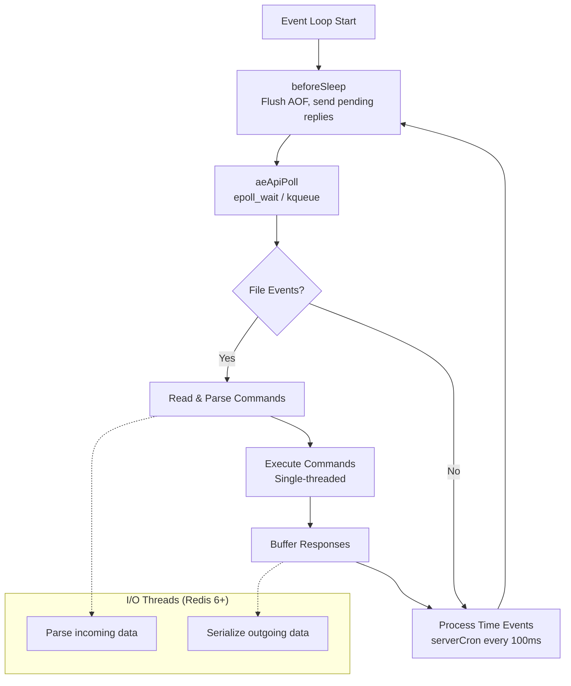
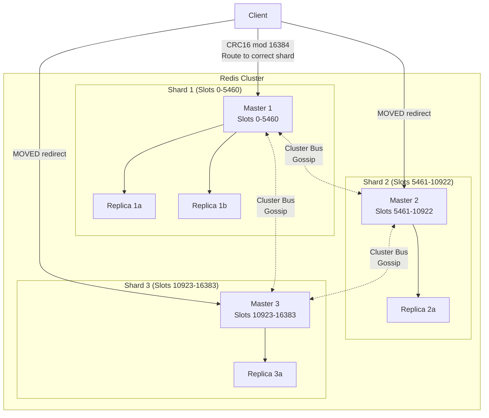
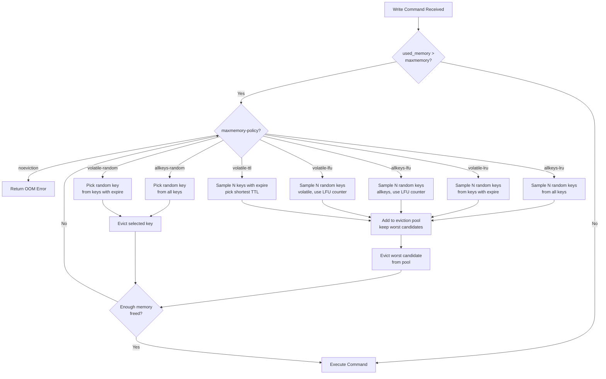
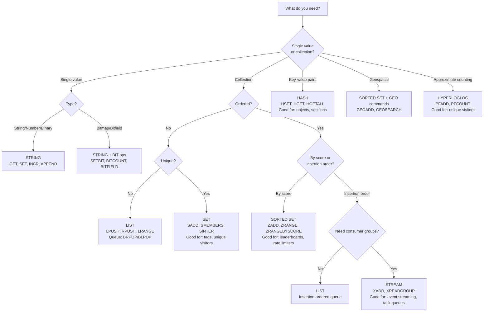

# Redis Internals

## 1. Architecture: The Single-Threaded Event Loop

Redis is an in-memory data structure server that processes all commands on a single main thread. This design choice is counterintuitive — how can a single-threaded server handle millions of operations per second? — but it is fundamental to Redis's performance characteristics and simplicity guarantees.

### 1.1 Why Single-Threaded Works

The key insight: for in-memory operations, the bottleneck is almost never CPU. It is network I/O and memory access latency. A single CPU core can perform hundreds of millions of simple operations per second on in-memory data. The bottleneck is getting data to and from clients over the network.

By avoiding multithreading, Redis eliminates:

- **Lock contention** — no mutexes, no spinlocks, no read-write locks on data structures. Every operation executes atomically without any synchronization overhead.
- **Context switching** — no thread context switches, no cache line invalidation from threads running on different cores.
- **Cache coherence traffic** — the entire working set stays hot in L1/L2 cache of a single core.
- **Complexity** — the codebase is dramatically simpler. No deadlocks, no race conditions, no lock ordering violations.

A single Redis instance on modern hardware can sustain 100,000-200,000 operations per second. For most applications, this exceeds requirements. When more throughput is needed, Redis Cluster distributes data across multiple instances — each instance still single-threaded, but the aggregate throughput scales linearly.

### 1.2 The Event Loop (ae.c)

Redis implements its own event loop library called **ae** (A simple Event library), located in `ae.c`. The event loop is the core scheduling mechanism:

```
┌───────────────────────────────────────────────────────┐
│                    Event Loop                         │
│                                                       │
│  ┌─────────────────────────────────────────────────┐  │
│  │  1. Process time events (cron-like callbacks)   │  │
│  └─────────────────────────────────────────────────┘  │
│                       │                               │
│  ┌─────────────────────────────────────────────────┐  │
│  │  2. Poll for I/O events (epoll_wait/kqueue)     │  │
│  │     - New connections (accept)                  │  │
│  │     - Readable sockets (read commands)          │  │
│  │     - Writable sockets (send responses)         │  │
│  └─────────────────────────────────────────────────┘  │
│                       │                               │
│  ┌─────────────────────────────────────────────────┐  │
│  │  3. Process fired events                        │  │
│  │     - Parse commands                            │  │
│  │     - Execute commands                          │  │
│  │     - Buffer responses                          │  │
│  └─────────────────────────────────────────────────┘  │
│                       │                               │
│  ┌─────────────────────────────────────────────────┐  │
│  │  4. Before sleep: flush AOF, handle writes      │  │
│  └─────────────────────────────────────────────────┘  │
│                       │                               │
│              Loop back to step 1                      │
└───────────────────────────────────────────────────────┘
```

The loop runs continuously. Each iteration:

1. **beforeSleep** callback — flush pending AOF writes, handle async tasks, send pending replies to clients.
2. **aeApiPoll** — call the platform-specific I/O multiplexer (epoll on Linux, kqueue on macOS/BSD, select on other platforms) with a timeout derived from the next scheduled time event.
3. **Process file events** — for each socket that has data ready, read the incoming bytes, parse complete commands, execute them, and buffer the response.
4. **Process time events** — execute any time-based callbacks whose deadline has passed. The main time event is `serverCron`, which runs every 100ms (configurable via `hz`, default 10).

### 1.3 I/O Multiplexing

Redis abstracts the I/O multiplexing layer behind a common API in `ae.c`. The implementation is chosen at compile time based on the platform:

- **epoll** (Linux) — the most efficient for thousands of connections. Uses `epoll_create`, `epoll_ctl`, `epoll_wait`. O(1) event notification.
- **kqueue** (macOS, FreeBSD) — similar efficiency to epoll. Uses `kqueue()`, `kevent()`.
- **evport** (Solaris) — Solaris event ports.
- **select** (fallback) — portable but limited to ~1024 file descriptors and O(N) per call.

Redis prefers epoll > kqueue > evport > select, using the best available on the current platform.

### 1.4 I/O Threads (Redis 6+)

Starting with Redis 6, Redis introduced **I/O threads** for reading client input and writing responses. The command execution itself remains single-threaded. This is an important distinction:

- I/O threads handle the parsing of incoming data and the serialization of outgoing data (which are CPU-intensive due to protocol parsing and memory copies).
- The main thread still executes all commands sequentially.
- This preserves all atomicity guarantees while offloading I/O work.

Configuration:

```
io-threads 4              # Number of I/O threads (default: 1, meaning disabled)
io-threads-do-reads yes   # Also use threads for reading (default: no)
```

The implementation uses a simple synchronization model: the main thread distributes pending clients to I/O threads, waits for them to finish, then processes commands. There is no lock contention on data because I/O threads never touch the keyspace.

### 1.5 serverCron: The Heartbeat

The `serverCron` function runs `hz` times per second (default 10, so every 100ms). It handles periodic housekeeping:

- **Expire keys** — sample random keys with TTLs and delete expired ones (active expiration, complementing lazy expiration on access).
- **Rehashing** — perform incremental rehashing steps on dictionaries that are being resized.
- **AOF/RDB** — check if background save/rewrite is needed or has completed.
- **Replication** — send heartbeats to replicas, handle partial resync checks.
- **Cluster** — send cluster bus gossip messages, handle failover timers.
- **Memory management** — check maxmemory limits, trigger eviction if needed.
- **Client timeout** — close clients that have been idle too long.
- **Statistics** — update ops/sec counters, memory stats, latency tracking.

### 1.6 Event Loop Diagram



---

## 2. Internal Data Structures

Redis implements several highly optimized data structures. The choice of implementation varies based on the data's size and characteristics — Redis transparently switches between compact and scalable encodings.

### 2.1 SDS (Simple Dynamic String)

Redis does not use C strings. Instead, it uses **SDS** (Simple Dynamic String), defined in `sds.h` and `sds.c`.

**Why not C strings?**

- Getting the length of a C string is O(N). SDS stores the length, making it O(1).
- C strings cannot contain null bytes. SDS is binary-safe.
- Buffer overflows are the #1 source of security vulnerabilities in C. SDS pre-allocates space and checks bounds.
- Appending to a C string requires `realloc` every time. SDS uses a preallocation strategy.

**SDS Structure:**

```c
struct sdshdr8 {    // For strings up to 255 bytes
    uint8_t len;    // Used length
    uint8_t alloc;  // Allocated length (excluding header and null terminator)
    unsigned char flags;  // Type flags (sdshdr5, sdshdr8, sdshdr16, sdshdr32, sdshdr64)
    char buf[];     // Actual string data
};
```

Redis defines multiple SDS header types (`sdshdr5`, `sdshdr8`, `sdshdr16`, `sdshdr32`, `sdshdr64`) to minimize overhead. A string shorter than 256 bytes uses `sdshdr8` with only 3 bytes of overhead. A string up to 4GB uses `sdshdr32` with 9 bytes of overhead.

**Preallocation strategy:**

When an SDS string is modified and needs more space:

- If the new length is less than `SDS_MAX_PREALLOC` (1MB), double the allocation.
- If the new length is >= 1MB, add 1MB of extra space.

This amortizes the cost of repeated appends to O(1) per operation.

### 2.2 Dict (Hash Table with Incremental Rehashing)

The **dict** is Redis's hash table implementation, used for the main keyspace and for Hash objects.

**Structure:**

```c
typedef struct dict {
    dictType *type;       // Type-specific functions (hash, compare, etc.)
    void *privdata;       // Type-specific private data
    dictht ht[2];         // Two hash tables (ht[0] is active, ht[1] used during rehashing)
    long rehashidx;       // Rehashing progress (-1 if not rehashing)
    int iterators;        // Number of active iterators
} dict;

typedef struct dictht {
    dictEntry **table;    // Array of pointers to entries (buckets)
    unsigned long size;   // Number of buckets (always a power of 2)
    unsigned long sizemask; // size - 1 (for hash & sizemask instead of hash % size)
    unsigned long used;   // Number of entries stored
} dictht;
```

**Incremental Rehashing:**

When the hash table's load factor exceeds a threshold (typically 1, or 5 if a background save is in progress), Redis starts rehashing — resizing the table to twice its current size. But it does not rehash all at once (which would block the event loop). Instead:

1. Allocate `ht[1]` with the new size.
2. Set `rehashidx = 0`.
3. On every dict operation (lookup, insert, delete) and during `serverCron`, move a small batch of entries from `ht[0]` to `ht[1]`.
4. During rehashing, lookups check both `ht[0]` and `ht[1]`. Inserts go to `ht[1]`.
5. When all entries are moved, swap `ht[0]` and `ht[1]`, free the old table, set `rehashidx = -1`.

This ensures rehashing is amortized over many operations and never blocks the main thread for more than a few microseconds at a time.

**Hash function:** Redis uses **SipHash** (previously MurmurHash2 and djb) for string hashing. SipHash provides strong protection against hash-flooding attacks.

### 2.3 Ziplist (Legacy) and Listpack

**Ziplist** was Redis's compact encoding for small lists, hashes, and sorted sets. It stored entries sequentially in a contiguous block of memory.

**Ziplist structure:**

```
<zlbytes><zltail><zllen><entry><entry>...<entry><zlend>
```

Each entry stored the previous entry's length (for reverse traversal), the entry's own encoding and length, and the data. The clever encoding used variable-length integers to minimize overhead.

**The cascading update problem:**

If an entry in the middle of a ziplist changed size, the next entry's "previous length" field might need to change from 1 byte to 5 bytes (if the previous entry grew past 254 bytes). This could cascade through subsequent entries, causing O(N^2) behavior in the worst case.

**Listpack** (replacing ziplist since Redis 7.0) solves this. Listpack entries do not store the previous entry's length. Instead, they store their own total length at the end of the entry, enabling reverse traversal without the cascading update problem.

**Listpack structure:**

```
<total-bytes><num-elements><entry><entry>...<entry><listpack-end-byte>
```

Each entry:

```
<encoding><data><entry-total-length>
```

The `entry-total-length` at the end allows backward iteration: from any position, you can read the total length of the preceding entry and jump back.

### 2.4 Skiplist (for Sorted Sets)

Redis uses a **skiplist** for sorted sets that exceed the listpack threshold. The skiplist provides O(log N) search, insert, and delete with the additional ability to efficiently iterate in order and perform range queries.

**Why not a balanced tree?**

Antirez (Salvatore Sanfilippo, Redis creator) chose skiplists over red-black trees or AVL trees because:

- Skiplists are simpler to implement and debug.
- Range operations (ZRANGEBYSCORE, ZRANGEBYRANK) map naturally to skiplist traversal.
- Memory overhead is comparable (each node has ~1.33 pointers on average with p=0.25).
- Concurrent modification is easier (though Redis is single-threaded, this influenced the design).

**Redis skiplist structure:**

```c
typedef struct zskiplistNode {
    sds ele;                         // The member (string value)
    double score;                    // The score (sorting key)
    struct zskiplistNode *backward;  // Pointer to previous node (level 0 only)
    struct zskiplistLevel {
        struct zskiplistNode *forward;  // Pointer to next node at this level
        unsigned long span;             // Number of nodes between this and forward
    } level[];                       // Flexible array of levels
} zskiplistNode;

typedef struct zskiplist {
    struct zskiplistNode *header, *tail;
    unsigned long length;    // Number of nodes
    int level;               // Current max level
} zskiplist;
```

The `span` field is Redis-specific — it records how many nodes each forward pointer skips. This enables O(log N) rank-based operations (ZRANK, ZRANGEBYRANK) by summing spans during traversal.

Redis's skiplist uses `ZSKIPLIST_MAXLEVEL = 32` and probability `ZSKIPLIST_P = 0.25`. This means on average each node has 1.33 levels, and the skiplist can efficiently handle up to 2^32 elements.

**Sorted sets use both a skiplist and a dict:**

The skiplist provides ordered access (by score), while the dict provides O(1) lookup by member name. Both point to the same SDS string and score, so there is minimal duplication.

### 2.5 Intset

For sets that contain only integers and are small, Redis uses an **intset** — a sorted array of integers.

```c
typedef struct intset {
    uint32_t encoding;  // INTSET_ENC_INT16, INT32, or INT64
    uint32_t length;    // Number of elements
    int8_t contents[];  // Sorted array of integers
} intset;
```

The encoding field determines the size of each integer in the array. If all integers fit in 16 bits, each element uses 2 bytes. If a 32-bit integer is added, the entire array is **upgraded** to 32-bit encoding.

Binary search provides O(log N) lookup. The sorted array provides O(N) insertion (due to shifting). This is acceptable because intsets are only used for small sets (up to `set-max-intset-entries`, default 512).

### 2.6 Quicklist

A **quicklist** is a doubly-linked list of listpacks (previously ziplists). It is the encoding used for Redis lists.

```c
typedef struct quicklist {
    quicklistNode *head;
    quicklistNode *tail;
    unsigned long count;        // Total entries across all listpacks
    unsigned long len;          // Number of quicklist nodes
    int fill : QL_FILL_BITS;   // Max listpack size per node
    unsigned int compress : QL_COMP_BITS;  // Depth of LZF compression
    // ...
} quicklist;

typedef struct quicklistNode {
    struct quicklistNode *prev;
    struct quicklistNode *next;
    unsigned char *entry;       // Pointer to the listpack
    size_t sz;                  // Listpack size in bytes
    unsigned int count : 16;    // Entries in this listpack
    unsigned int encoding : 2;  // RAW or LZF compressed
    // ...
} quicklistNode;
```

The quicklist balances memory efficiency (listpacks are compact) with performance (linked list allows O(1) push/pop at both ends).

The `fill` parameter controls how large each listpack can grow. A positive value sets the max number of entries; a negative value (-1 to -5) sets the max size in bytes.

The `compress` parameter enables LZF compression of interior listpack nodes. Nodes near the head and tail (within `compress` depth) are kept uncompressed for fast access. Interior nodes (which are accessed less frequently) are compressed to save memory.

### 2.7 Rax (Radix Tree)

Redis uses a **radix tree** (rax) for Streams. A rax is a compressed trie where each node can represent a prefix of any length, and nodes with a single child are merged to save space.

```
Root
 ├── "app" ─── "le" → [value for "apple"]
 │          └── "lication" → [value for "application"]
 └── "ban" ─── "ana" → [value for "banana"]
            └── "k" → [value for "bank"]
```

In Redis, the rax is used to map Stream entry IDs (which are `<milliseconds>-<sequence>` pairs) to the actual stream entries. The lexicographic ordering of the keys in the rax provides natural time-ordering.

The rax implementation is in `rax.c` and `rax.h`. Each node contains:

- A flag indicating if this node has a value (is a key endpoint).
- The number of children.
- The compressed prefix (if the node has exactly one child, it stores the full prefix in the node itself).
- Pointers to children and optionally a value pointer.

---

## 3. Object Encoding

Redis uses a **redisObject** structure to wrap all values stored in the keyspace:

```c
typedef struct redisObject {
    unsigned type:4;      // OBJ_STRING, OBJ_LIST, OBJ_SET, OBJ_ZSET, OBJ_HASH, OBJ_STREAM
    unsigned encoding:4;  // Internal encoding (OBJ_ENCODING_RAW, EMBSTR, INT, LISTPACK, etc.)
    unsigned lru:LRU_BITS; // LRU time or LFU data (for eviction)
    int refcount;          // Reference count
    void *ptr;             // Pointer to the actual data structure
} robj;
```

The `type` tells Redis what abstract data type this is. The `encoding` tells Redis which internal data structure implements it. Redis dynamically chooses the encoding based on data characteristics.

### 3.1 String Encodings

| Encoding | When Used | Implementation |
|----------|-----------|----------------|
| `OBJ_ENCODING_INT` | Value is an integer that fits in a `long` | Stored directly in the `ptr` field (no heap allocation). |
| `OBJ_ENCODING_EMBSTR` | String <= 44 bytes | The SDS string is allocated in the same `malloc` as the robj (one contiguous block). |
| `OBJ_ENCODING_RAW` | String > 44 bytes | Separate SDS string allocation pointed to by `ptr`. |

The 44-byte threshold for EMBSTR comes from the jemalloc allocation size: `sizeof(robj) + sizeof(sdshdr8) + 44 + 1 (null terminator) = 64 bytes`, which fits in a 64-byte jemalloc slab.

EMBSTR is immutable — any modification converts it to RAW. This is because modifying an embedded string might require reallocation, which would move the entire robj.

### 3.2 List Encodings

| Encoding | When Used | Implementation |
|----------|-----------|----------------|
| `OBJ_ENCODING_LISTPACK` | Entries <= `list-max-listpack-size` (default 128) AND each entry <= 64 bytes | Single contiguous listpack. |
| `OBJ_ENCODING_QUICKLIST` | Exceeds listpack thresholds | Quicklist (linked list of listpacks). |

### 3.3 Set Encodings

| Encoding | When Used | Implementation |
|----------|-----------|----------------|
| `OBJ_ENCODING_INTSET` | All members are integers AND count <= `set-max-intset-entries` (default 512) | Sorted integer array. |
| `OBJ_ENCODING_LISTPACK` | Count <= `set-max-listpack-entries` (default 128) AND each entry <= 64 bytes | Listpack. |
| `OBJ_ENCODING_HT` | Exceeds above thresholds | Dict (hash table). |

### 3.4 Hash Encodings

| Encoding | When Used | Implementation |
|----------|-----------|----------------|
| `OBJ_ENCODING_LISTPACK` | Entries <= `hash-max-listpack-entries` (default 128) AND each value <= `hash-max-listpack-value` (default 64 bytes) | Listpack with alternating key/value entries. |
| `OBJ_ENCODING_HT` | Exceeds listpack thresholds | Dict (hash table). |

### 3.5 Sorted Set Encodings

| Encoding | When Used | Implementation |
|----------|-----------|----------------|
| `OBJ_ENCODING_LISTPACK` | Entries <= `zset-max-listpack-entries` (default 128) AND each entry <= `zset-max-listpack-value` (default 64 bytes) | Listpack with alternating member/score entries. |
| `OBJ_ENCODING_SKIPLIST` | Exceeds listpack thresholds | Skiplist + dict combination. |

### 3.6 Stream Encoding

Streams always use a rax (radix tree) internally. The rax maps stream IDs to **listpack**-encoded entries. Multiple stream entries are packed into each listpack node (controlled by `stream-node-max-bytes` and `stream-node-max-entries`).

### 3.7 Encoding Transition Diagram

```mermaid
graph TD
    subgraph String
        INT[INT encoding<br/>integer value] -->|Append/modify| RAW[RAW encoding<br/>SDS string]
        EMBSTR[EMBSTR encoding<br/>≤44 bytes] -->|Modify| RAW
    end

    subgraph List
        LLP[LISTPACK<br/>small list] -->|Exceeds thresholds| QL[QUICKLIST<br/>linked listpacks]
    end

    subgraph Set
        IS[INTSET<br/>all integers, small] -->|Non-integer added<br/>or exceeds 512| SLP[LISTPACK<br/>small mixed set]
        SLP -->|Exceeds 128 entries| HT_S[HASHTABLE]
        IS -->|Exceeds 512| HT_S
    end

    subgraph Hash
        HLP[LISTPACK<br/>small hash] -->|Exceeds entries/value thresholds| HT_H[HASHTABLE]
    end

    subgraph SortedSet
        ZLP[LISTPACK<br/>small zset] -->|Exceeds entries/value thresholds| SL[SKIPLIST + HASHTABLE]
    end
```



---

## 4. Memory Management

Redis's value proposition depends on efficient memory usage. Understanding how Redis allocates, fragments, and tracks memory is essential for production operation.

### 4.1 jemalloc

Redis uses **jemalloc** as its default memory allocator (on Linux). jemalloc was created by Jason Evans for FreeBSD and is designed for multithreaded applications with low fragmentation, but Redis benefits from its **size class** system and low overhead.

jemalloc allocates memory in discrete **size classes**: 8, 16, 32, 48, 64, 80, 96, 112, 128, 160, 192, 224, 256, 320, 384, ... bytes. When Redis requests N bytes, jemalloc rounds up to the next size class. For example, requesting 50 bytes allocates 64 bytes (wasting 14 bytes, or 28%).

This rounding is why Redis's actual memory usage (reported by the OS) is always higher than the sum of all values stored. The `mem_fragmentation_ratio` metric captures this.

Redis can also be compiled with **libc malloc**, **tcmalloc**, or a custom allocator, but jemalloc is the recommended and default choice.

### 4.2 Memory Fragmentation

**Fragmentation ratio** = `used_memory_rss` / `used_memory`

- `used_memory` — bytes allocated by Redis (as tracked by jemalloc).
- `used_memory_rss` — resident set size as reported by the OS.

| Ratio | Interpretation |
|-------|----------------|
| < 1.0 | Redis memory has been swapped out. This is a critical problem — swapping makes Redis unusable. |
| 1.0-1.5 | Normal and healthy. |
| 1.5-2.0 | Elevated fragmentation. Consider `MEMORY PURGE` or restarting. |
| > 2.0 | Severe fragmentation. Investigate allocation patterns. |

**Causes of fragmentation:**

- Frequent allocation/deallocation of different-sized objects.
- Deleting many keys of one size and creating keys of a different size.
- Using variable-length values that are frequently updated to different sizes.

**Active defragmentation (Redis 4+):**

Redis can perform online defragmentation by copying values to new, contiguous allocations and freeing the old fragmented ones:

```
activedefrag yes
active-defrag-enabled yes
active-defrag-ignore-bytes 100mb        # Don't defrag if fragmentation < 100MB
active-defrag-threshold-lower 10        # Start defrag if fragmentation > 10%
active-defrag-threshold-upper 100       # Max effort if fragmentation > 100%
active-defrag-cycle-min 1               # Min CPU% for defrag
active-defrag-cycle-max 25              # Max CPU% for defrag
```

### 4.3 INFO MEMORY Output

```
used_memory:1234567           # Total allocated by Redis (bytes)
used_memory_human:1.18M       # Human-readable version
used_memory_rss:2345678       # RSS from OS perspective
used_memory_rss_human:2.24M
used_memory_peak:3456789      # Peak memory usage
used_memory_peak_human:3.30M
used_memory_overhead:567890   # Memory used for internal overhead (data structures, buffers)
used_memory_dataset:666677    # used_memory - used_memory_overhead (approximate data size)
mem_fragmentation_ratio:1.90  # RSS / allocated
mem_allocator:jemalloc-5.3.0  # Which allocator is in use
```

**Key relationships:**

- `used_memory_dataset` = `used_memory` - `used_memory_overhead`
- `used_memory_overhead` includes: client buffers, replication backlog, keyspace metadata (dict overhead), AOF buffers, Lua scripts, pub/sub metadata.
- `allocator_frag_ratio` (Redis 4+) provides jemalloc-specific fragmentation data.

### 4.4 Maxmemory Policies

When Redis reaches the `maxmemory` limit, it must decide what to evict. The `maxmemory-policy` setting controls this:

| Policy | Description |
|--------|-------------|
| `noeviction` | Return errors on write commands. Never evict. This is the default. |
| `allkeys-lru` | Evict the least recently used key from the entire keyspace. Most common choice for caches. |
| `volatile-lru` | Evict the least recently used key, but only among keys with an expire set. |
| `allkeys-lfu` | Evict the least frequently used key from the entire keyspace. Better than LRU for many workloads. |
| `volatile-lfu` | LFU eviction, but only among keys with an expire. |
| `allkeys-random` | Evict a random key. Simple but surprisingly effective. |
| `volatile-random` | Random eviction among keys with expires. |
| `volatile-ttl` | Evict the key with the shortest remaining TTL. |

**LRU vs LFU:**

LRU can be tricked by a single scan of many cold keys — they all appear "recently used" even though they will never be accessed again. LFU tracks access frequency over time and is more resistant to scan pollution.

---

## 5. Persistence

Redis offers multiple persistence mechanisms, each with different durability and performance trade-offs.

### 5.1 RDB Snapshots

RDB (Redis DataBase) creates point-in-time snapshots of the entire dataset. The snapshot is written as a compact binary file.

**How it works:**

1. Redis forks the main process using `fork()`.
2. The child process writes the entire dataset to a temporary RDB file.
3. The parent process continues serving clients.
4. When the child finishes, it atomically renames the temp file to `dump.rdb`.

**fork() and Copy-on-Write (COW):**

The `fork()` system call creates a child process that shares the parent's memory pages. The OS uses **copy-on-write** (COW): pages are shared until one process modifies a page, at which point the OS creates a private copy.

This means the child sees a consistent snapshot of the data at the moment of fork, even as the parent continues modifying data. The memory cost is proportional to the number of pages modified during the save, not the total dataset size.

However, if the parent is actively modifying many keys, COW causes significant additional memory usage. In the worst case (every page is modified), memory usage temporarily doubles. This is why the common recommendation is to ensure at least 50% free memory above the dataset size.

**RDB configuration:**

```
save 900 1        # Save if at least 1 key changed in 900 seconds
save 300 10       # Save if at least 10 keys changed in 300 seconds
save 60 10000     # Save if at least 10000 keys changed in 60 seconds
rdbcompression yes
rdbchecksum yes
dbfilename dump.rdb
```

**RDB advantages:**

- Compact single-file format, ideal for backups and disaster recovery.
- Very fast restarts (loading RDB is much faster than replaying AOF).
- The child process does all the work; minimal impact on parent performance.

**RDB disadvantages:**

- Data loss window: you can lose all changes since the last snapshot.
- `fork()` can be slow for very large datasets (gigabytes of page table entries to copy).
- `fork()` causes temporary memory spike due to COW.

### 5.2 AOF (Append-Only File)

AOF logs every write command received by the server in a protocol-compatible format. On restart, Redis replays the AOF to reconstruct the dataset.

**Fsync policies:**

| Policy | Behavior | Data Loss Risk |
|--------|----------|----------------|
| `always` | fsync after every write command. | Minimal (only in-flight command). |
| `everysec` | fsync once per second (default). | Up to 1 second of data. |
| `no` | Let the OS decide when to flush. | Up to 30 seconds or more (OS dependent). |

```
appendonly yes
appendfsync everysec
appendfilename "appendonly.aof"
```

**`everysec`** is the recommended default. It provides a good balance: the main thread never blocks on fsync (a background thread handles it), and the data loss window is at most ~1 second.

**`always`** provides maximum durability but significantly impacts performance because every command must wait for the disk write. Even with fast SSDs, this adds ~0.5ms latency per command.

### 5.3 AOF Rewrite

The AOF file grows indefinitely as commands accumulate. Periodic **AOF rewrite** compacts it by generating the minimal set of commands needed to recreate the current state.

For example, if a key was SET 1000 times, the rewrite produces a single SET command with the final value. If a list had 500 LPUSH and 200 LPOP commands, the rewrite produces a single RPUSH with the remaining elements.

**How rewrite works:**

1. Redis forks the main process.
2. The child iterates over the entire keyspace and writes the current state as a sequence of commands to a temporary AOF file.
3. While the child is writing, the parent accumulates new commands in an **AOF rewrite buffer** (in addition to the regular AOF file).
4. When the child finishes, the parent appends the rewrite buffer to the new AOF file.
5. The new AOF file atomically replaces the old one.

Configuration:

```
auto-aof-rewrite-percentage 100   # Trigger rewrite when AOF is 100% larger than last rewrite
auto-aof-rewrite-min-size 64mb    # Don't rewrite if AOF is smaller than this
aof-rewrite-incremental-fsync yes # Fsync every 32MB during rewrite to avoid I/O spikes
```

### 5.4 RDB+AOF Hybrid Mode (Redis 4+)

When AOF rewrite runs, it can write the dataset in RDB format (compact binary) followed by AOF commands that accumulated during the rewrite. This combines RDB's compactness and fast loading with AOF's minimal data loss window.

```
aof-use-rdb-preamble yes    # Default: yes (since Redis 4)
```

The resulting AOF file looks like:

```
[RDB binary data for the full dataset at the fork point]
[AOF text commands for changes during the rewrite]
[AOF text commands from ongoing operation]
```

On restart, Redis loads the RDB portion (fast), then replays the trailing AOF commands.

### 5.5 Multi-Part AOF (Redis 7+)

Redis 7 introduced **multi-part AOF**, storing the AOF as a manifest file pointing to multiple files:

- A **base AOF** (either RDB or AOF format) representing the dataset at a point in time.
- One or more **incremental AOF** files containing commands since the base.

This eliminates the risky atomic rename during AOF rewrite and makes AOF management more robust. The manifest tracks which files are current, and old files are garbage-collected.

```
appenddirname "appendonlydir"   # Directory for AOF files
```

---

## 6. Replication

Redis supports asynchronous master-replica replication. A replica is an exact copy of the master's dataset.

### 6.1 Full Resynchronization

When a replica connects to a master for the first time (or after falling too far behind), a full resync is required:

1. The replica sends `PSYNC ? -1` (no replication ID, requesting full sync).
2. The master starts a background RDB save (or uses an existing one if already in progress).
3. The master sends the RDB file to the replica.
4. While sending the RDB, the master buffers all new write commands in the **client output buffer** for the replica.
5. The replica receives the RDB, flushes its own dataset, and loads the RDB.
6. The master sends the buffered commands.
7. From this point on, the master sends each write command to the replica in real-time.

### 6.2 Partial Resynchronization (PSYNC)

If a replica disconnects briefly and reconnects, a full resync is wasteful. Redis supports **partial resync** using:

- **Replication ID** — a 40-character hex string that uniquely identifies a dataset lineage. Master and replica share the same replication ID.
- **Replication offset** — a monotonically increasing counter of bytes processed. The master tracks its offset, and each replica tracks how far it has consumed.
- **Replication backlog** — a fixed-size in-memory circular buffer (default 1MB) on the master that stores recent write commands.

When a replica reconnects:

1. It sends `PSYNC <replication_id> <offset>`.
2. The master checks: is the replication ID correct, and is the requested offset still in the backlog?
3. If yes: master sends only the missing commands from the backlog (partial resync). Fast and cheap.
4. If no (offset is too old or replication ID mismatch): full resync is required.

**Backlog sizing:**

```
repl-backlog-size 256mb    # Larger backlog tolerates longer disconnections
```

Calculate required size: `(write throughput in bytes/sec) * (max acceptable disconnection duration in seconds)`. If your master processes 10MB/s of writes and you want to tolerate 30 seconds of disconnection, set the backlog to at least 300MB.

### 6.3 Diskless Replication

By default, full resync writes the RDB to disk, then sends it over the network. **Diskless replication** skips the disk entirely — the master forks a child that writes the RDB directly to the replica's socket.

```
repl-diskless-sync yes
repl-diskless-sync-delay 5    # Wait 5 seconds for more replicas before starting
```

This is beneficial when the disk is slow (spinning HDD) but the network is fast. The delay allows multiple replicas to receive the same RDB stream simultaneously.

Since Redis 7, diskless replication also supports **diskless loading** on the replica side:

```
repl-diskless-load swapdb    # Load new RDB into memory while serving from old data
```

### 6.4 Replication Lag and WAIT

Replication is asynchronous — the master does not wait for replicas to acknowledge writes. This means a replica may be slightly behind the master.

The `WAIT` command allows a client to request that the master wait until a specified number of replicas have acknowledged a specific write:

```
SET key value
WAIT 1 5000    # Wait up to 5000ms for at least 1 replica to acknowledge
```

`WAIT` does not guarantee the replica has persisted the data (only that it received it). It provides a form of **synchronous replication** at the application level.

### 6.5 Replica Serve Stale Data

During full resync, the replica may serve stale data (from its previous state) or refuse connections entirely:

```
replica-serve-stale-data yes    # Serve old data during sync (default)
replica-serve-stale-data no     # Return errors during sync
```

---

## 7. Redis Cluster

Redis Cluster provides automatic sharding, high availability, and horizontal scalability.

### 7.1 Hash Slots

Redis Cluster divides the keyspace into **16384 hash slots**. Each key is assigned to a slot using:

```
slot = CRC16(key) mod 16384
```

Each master node is responsible for a subset of slots. For example, with 3 masters:

- Node A: slots 0-5460
- Node B: slots 5461-10922
- Node C: slots 10923-16383

**Why 16384?**

The number was chosen to be small enough that the full slot-to-node mapping fits in a compact bitmap (16384 bits = 2KB) which is included in every cluster bus heartbeat message. This allows efficient gossip propagation without excessive bandwidth.

**Hash tags:**

To force related keys to the same slot, use **hash tags**. Only the substring between the first `{` and `}` is hashed:

```
SET {user:123}:name "Alice"     # Slot = CRC16("user:123") mod 16384
SET {user:123}:email "a@b.com"  # Same slot — same hash tag
```

This enables multi-key operations (MGET, transactions, Lua scripts) on related keys.

### 7.2 Cluster Bus and Gossip Protocol

Cluster nodes communicate via the **cluster bus** — a dedicated TCP connection on port `(data port + 10000)` using a binary protocol.

Each node sends **PING** messages to random other nodes at regular intervals. The PING includes:

- The sender's node ID, IP, port, and flags.
- The sender's view of the cluster state (configuration epoch, slot assignments).
- A random subset of other known nodes and their status (the gossip section).

The recipient responds with a **PONG** containing its own information.

This gossip protocol ensures that configuration changes propagate to all nodes within O(N * log N) message exchanges, where N is the number of nodes.

### 7.3 MOVED and ASK Redirections

When a client sends a command to a node that does not own the target slot, the node responds with a **redirection**:

**MOVED redirection:**

```
GET key1
-MOVED 3999 192.168.1.10:6379
```

This means slot 3999 is permanently assigned to the specified node. The client should update its local slot-to-node mapping and redirect the command (and future commands for this slot) to the correct node.

**ASK redirection:**

```
GET key1
-ASK 3999 192.168.1.10:6379
```

This means slot 3999 is being **migrated** to the specified node. The client should send the command to the target node, but only this one time (preceded by an `ASKING` command). Future commands for this slot should still go to the original node until the migration completes and a MOVED is received.

### 7.4 Failover Process

When a master node fails, one of its replicas is promoted to master.

**Failure detection:**

1. Node A sends PING to Node B. If no PONG within `cluster-node-timeout` (default 15 seconds), Node A marks Node B as **PFAIL** (Possible Failure).
2. Nodes exchange gossip. When a **majority of masters** mark Node B as PFAIL within a window of `2 * cluster-node-timeout`, Node B is marked as **FAIL**.
3. The FAIL flag is broadcast to all nodes.

**Replica election:**

1. Replicas of the failed master notice the FAIL flag.
2. Each replica waits for a delay proportional to its replication offset (replicas with more data wait less, ensuring the most up-to-date replica is favored).
3. The replica requests votes from all masters by sending a `FAILOVER_AUTH_REQUEST`.
4. Masters vote for the first requesting replica (each master votes only once per configuration epoch).
5. When a replica receives votes from a majority of masters, it wins the election.
6. The winning replica promotes itself: it takes over the failed master's slots, increments the configuration epoch, and broadcasts the new configuration.

**Manual failover:**

```
CLUSTER FAILOVER          # Graceful: waits for replication to catch up
CLUSTER FAILOVER FORCE    # Immediate: does not wait for replication
CLUSTER FAILOVER TAKEOVER # No vote needed: just take over (dangerous)
```

### 7.5 Resharding

Moving slots between nodes (adding/removing nodes, rebalancing):

1. Set the target slot to **IMPORTING** state on the destination node.
2. Set the source slot to **MIGRATING** state on the source node.
3. For each key in the slot on the source node:
   a. `MIGRATE` the key to the destination (atomic move).
4. Update the slot assignment in the cluster configuration.

During migration, the source node handles requests for keys that are still present. For keys already migrated, it returns an ASK redirection to the destination.

The `redis-cli --cluster reshard` command automates this process.

### 7.6 Cluster Architecture Diagram



---

## 8. Redis Sentinel

Redis Sentinel provides high availability for non-clustered Redis deployments.

### 8.1 Sentinel Roles

Sentinel is a distributed system that runs as separate processes (typically 3 or 5 instances for quorum). It performs four functions:

1. **Monitoring** — continuously checks whether master and replica instances are working as expected.
2. **Notification** — notifies administrators or other programs via pub/sub or scripts when something is wrong.
3. **Automatic failover** — if a master is down, Sentinel promotes a replica to master and reconfigures other replicas to use the new master.
4. **Configuration provider** — clients connect to Sentinel to discover the current master address.

### 8.2 Failure Detection

Sentinel uses a two-phase detection process, similar to Cluster:

**SDOWN (Subjective Down):**

A single Sentinel considers a master SDOWN when it does not respond to PING within `down-after-milliseconds` (default 30000ms = 30 seconds).

**ODOWN (Objective Down):**

A Sentinel asks other Sentinels whether they also consider the master down. If at least `quorum` Sentinels agree (e.g., 2 out of 3), the master is declared ODOWN.

### 8.3 Failover Process

1. A Sentinel that detects ODOWN tries to get elected as the **failover leader** by requesting authorization from other Sentinels.
2. The leader selects the best replica (considering replication offset, priority, and runid).
3. The leader sends `SLAVEOF NO ONE` to the selected replica.
4. The leader reconfigures all other replicas to replicate from the new master.
5. The leader updates its configuration and broadcasts the new master address.
6. If the old master comes back online, it is reconfigured as a replica of the new master.

### 8.4 Configuration

```
sentinel monitor mymaster 192.168.1.10 6379 2    # Monitor master, quorum = 2
sentinel down-after-milliseconds mymaster 5000    # SDOWN after 5 seconds
sentinel failover-timeout mymaster 60000          # Max failover time: 60 seconds
sentinel parallel-syncs mymaster 1                # Replicas to resync in parallel
```

The `parallel-syncs` setting controls how many replicas can resync with the new master simultaneously. During resync, a replica may be unavailable for reads, so setting this to 1 ensures at most one replica is unavailable at a time.

### 8.5 Client Discovery

Clients should connect to Sentinel first to discover the master:

```python
# Python example using redis-py
from redis.sentinel import Sentinel

sentinel = Sentinel([
    ('sentinel1', 26379),
    ('sentinel2', 26379),
    ('sentinel3', 26379)
], socket_timeout=0.1)

master = sentinel.master_for('mymaster', socket_timeout=0.1)
master.set('key', 'value')

replica = sentinel.slave_for('mymaster', socket_timeout=0.1)
value = replica.get('key')
```

---

## 9. Pipelining

### 9.1 The Round-Trip Problem

Without pipelining, each Redis command requires a full network round-trip:

```
Client: SEND SET key1 value1
Server: RECV, PROCESS, SEND +OK
Client: RECV +OK

Client: SEND SET key2 value2
Server: RECV, PROCESS, SEND +OK
Client: RECV +OK
```

If the network latency is 0.5ms, each command takes at least 0.5ms (plus processing time). Throughput is limited to ~2000 ops/sec regardless of Redis's actual capacity.

### 9.2 How Pipelining Works

Pipelining sends multiple commands without waiting for individual responses:

```
Client: SEND SET key1 value1
Client: SEND SET key2 value2
Client: SEND SET key3 value3
Client: SEND GET key1
Server: RECV all, PROCESS all, SEND all responses
Client: RECV +OK, +OK, +OK, $6 value1
```

The client sends all commands in a batch, and Redis processes them sequentially (single-threaded, so the order is preserved) and sends all responses back. The network cost is one round-trip for the entire batch.

### 9.3 Performance Impact

Without pipelining: throughput is bounded by `1 / RTT` where RTT is the round-trip time.

With pipelining: throughput approaches Redis's raw processing capacity (100K-200K ops/sec), limited only by command processing speed and network bandwidth.

Benchmarks with `redis-benchmark`:

```
# Without pipelining
redis-benchmark -t SET -n 100000 -q
SET: 45000 requests per second

# With pipelining (16 commands per batch)
redis-benchmark -t SET -n 100000 -P 16 -q
SET: 450000 requests per second
```

A 10x improvement is typical. Larger batch sizes give diminishing returns — the optimal batch size is usually 50-200 commands.

### 9.4 Batch Size Tuning

- **Too small** (1-5) — still paying per-round-trip overhead.
- **Sweet spot** (10-200) — amortizes RTT effectively, memory usage is reasonable.
- **Too large** (1000+) — increases memory usage on both client and server (all responses must be buffered), increases latency for individual responses, and can cause client output buffer limits to trigger.

The Redis client output buffer limit for normal clients is:

```
client-output-buffer-limit normal 0 0 0   # No limit for normal clients
```

But very large pipelines can still exhaust memory. Monitor `used_memory` and client output buffer sizes.

---

## 10. Lua Scripting

### 10.1 EVAL Command

Redis embeds a Lua 5.1 interpreter. The `EVAL` command executes a Lua script atomically — no other command can run while the script executes.

```
EVAL "return redis.call('GET', KEYS[1])" 1 mykey
```

The script receives:

- `KEYS` — array of key names (must be declared upfront for cluster compatibility).
- `ARGV` — array of additional arguments.
- `redis.call(command, ...)` — execute a Redis command and return the result (raises errors on failure).
- `redis.pcall(command, ...)` — like call but returns errors as Lua table instead of raising.

### 10.2 Atomicity Guarantees

Because Redis is single-threaded, a Lua script executes atomically — nothing else runs while the script is in progress. This makes scripts a powerful alternative to MULTI/EXEC transactions for complex operations.

However, this also means a slow script blocks all other clients. Redis enforces a configurable timeout:

```
lua-time-limit 5000    # Kill scripts after 5 seconds (default)
```

After the timeout, Redis starts accepting `SCRIPT KILL` and `SHUTDOWN NOSAVE` commands but does not automatically kill the script.

If the script has already performed write operations, `SCRIPT KILL` will not work (to prevent partial writes). The only option is `SHUTDOWN NOSAVE`.

### 10.3 Script Caching (EVALSHA)

Every time `EVAL` is called, the script is compiled and cached. The cache key is the SHA1 hash of the script body:

```
# First call uses EVAL
EVAL "return redis.call('GET', KEYS[1])" 1 mykey

# Subsequent calls use EVALSHA (faster, less bandwidth)
EVALSHA "a42059b356c875f0717db19a51f6aaa9161571a2" 1 mykey
```

The client library typically handles this automatically: it tries `EVALSHA` first, and if the script is not cached (`NOSCRIPT` error), it falls back to `EVAL`.

### 10.4 Redis Functions (Redis 7+)

Redis 7 introduced **Functions** as a replacement for ad-hoc EVAL scripts. Functions are named, versioned, and stored persistently. They survive restarts and are replicated.

```
# Register a function library
FUNCTION LOAD "#!lua name=mylib\n redis.register_function('myfunc', function(keys, args) return redis.call('GET', keys[1]) end)"

# Call the function
FCALL myfunc 1 mykey
```

Functions are the recommended approach for production use, replacing EVAL/EVALSHA.

---

## 11. Streams

Redis Streams (introduced in Redis 5.0) provide an append-only log data structure, inspired by Apache Kafka.

### 11.1 Stream Entries

Each stream entry has:

- An **ID** in the format `<millisecondsTime>-<sequenceNumber>` (e.g., `1553456789012-0`).
- A set of **field-value pairs** (like a hash).

IDs are auto-generated by default but can be specified explicitly. They are always increasing.

```
XADD mystream * sensor-id 1234 temperature 19.8 humidity 56
# Returns: "1553456789012-0"

XADD mystream * sensor-id 1234 temperature 20.1 humidity 55
# Returns: "1553456789012-1"
```

### 11.2 Consumer Groups

Consumer groups allow multiple consumers to divide the work of processing stream entries:

```
# Create a consumer group
XGROUP CREATE mystream mygroup $ MKSTREAM

# Consumer 1 reads entries
XREADGROUP GROUP mygroup consumer1 COUNT 10 BLOCK 5000 STREAMS mystream >

# Consumer 2 reads different entries
XREADGROUP GROUP mygroup consumer2 COUNT 10 BLOCK 5000 STREAMS mystream >
```

Each entry is delivered to exactly one consumer in the group. The `>` special ID means "entries never delivered to this consumer."

### 11.3 XREAD and XREADGROUP

**XREAD** — read entries from one or more streams, optionally blocking:

```
XREAD COUNT 100 BLOCK 5000 STREAMS mystream 0
# Read up to 100 entries from position 0, block up to 5 seconds
```

**XREADGROUP** — read entries as part of a consumer group:

```
XREADGROUP GROUP mygroup consumer1 COUNT 10 BLOCK 5000 STREAMS mystream >
```

The key difference: XREADGROUP tracks which entries each consumer has received and delivers each entry to exactly one consumer.

### 11.4 PEL (Pending Entries List)

When a consumer receives an entry via XREADGROUP, that entry is added to the consumer's **Pending Entries List (PEL)**. The entry remains pending until the consumer acknowledges it with `XACK`:

```
XACK mystream mygroup 1553456789012-0
```

The PEL serves several purposes:

- **At-least-once delivery** — if a consumer crashes without acknowledging, the entry remains pending and can be claimed by another consumer.
- **Monitoring** — `XPENDING` shows how many entries each consumer has pending, how long they have been pending, and which entries they are.
- **Claiming** — `XCLAIM` transfers ownership of pending entries from one consumer to another (for handling consumer failures).

```
# View pending entries summary
XPENDING mystream mygroup

# View specific pending entries
XPENDING mystream mygroup - + 10

# Claim entries idle for more than 60 seconds
XCLAIM mystream mygroup consumer2 60000 1553456789012-0
```

**XAUTOCLAIM (Redis 6.2+)** automates the claim process:

```
XAUTOCLAIM mystream mygroup consumer2 60000 0-0 COUNT 10
# Automatically claim up to 10 entries idle for > 60 seconds
```

### 11.5 Stream Trimming

Streams can be trimmed to limit memory usage:

```
XADD mystream MAXLEN ~ 10000 * field value
# ~ means approximate trimming (more efficient, allows small overrun)

XTRIM mystream MAXLEN ~ 10000

# Or trim by minimum ID (Redis 6.2+)
XTRIM mystream MINID ~ 1553456789000-0
```

The `~` prefix enables approximate trimming, which is much more efficient because Redis only trims whole rax nodes rather than individual entries.

### 11.6 Comparison with Kafka

| Feature | Redis Streams | Apache Kafka |
|---------|---------------|--------------|
| **Storage** | In-memory (with persistence) | Disk-based (log segments) |
| **Throughput** | Hundreds of thousands/sec | Millions/sec |
| **Data size** | Limited by RAM | Limited by disk |
| **Consumer groups** | Built-in, simple | Built-in, complex (rebalancing) |
| **Ordering** | Per-stream guarantee | Per-partition guarantee |
| **Retention** | MAXLEN or MINID trimming | Time-based or size-based |
| **Replication** | Redis Cluster / Redis replication | Topic-level replication factor |
| **Use case** | Small/medium event streaming, real-time | Large-scale event streaming, event sourcing |

Redis Streams is suitable for moderate-scale streaming where sub-millisecond latency matters and data volumes fit in memory. Kafka is the choice for high-volume, durable event streaming with terabytes of data.

---

## 12. Pub/Sub

Redis Pub/Sub implements a publish/subscribe messaging system.

### 12.1 How It Works

```
# Subscriber (Client 1)
SUBSCRIBE news:sports news:tech

# Publisher (Client 2)
PUBLISH news:sports "Goal scored!"
# Returns: (integer) 1  — number of subscribers who received the message

# Subscriber receives:
# 1) "message"
# 2) "news:sports"
# 3) "Goal scored!"
```

### 12.2 Pattern Matching

Subscribers can use glob-style patterns:

```
PSUBSCRIBE news:*       # Match all channels starting with "news:"
PSUBSCRIBE user:[0-9]*  # Match user channels with numeric suffixes
```

Pattern subscriptions are slower than exact subscriptions because Redis must check every pattern against the published channel name.

### 12.3 Internal Implementation

Redis maintains two data structures for pub/sub:

1. **pubsub_channels** — a dict mapping channel names to a linked list of subscribed clients.
2. **pubsub_patterns** — a linked list of `(pattern, client)` pairs.

When `PUBLISH` is called:

1. Look up the channel in `pubsub_channels`. Send the message to all clients in the list.
2. Iterate through `pubsub_patterns`. For each pattern that matches the channel, send the message to the subscribed client.

### 12.4 Limitations

Pub/Sub has significant limitations that are important to understand:

- **No persistence** — messages are not stored. If no subscribers are listening, the message is lost.
- **No replay** — a subscriber that disconnects and reconnects will miss all messages published during the disconnection.
- **No acknowledgement** — Redis does not track whether subscribers received messages.
- **Fire-and-forget** — there is no delivery guarantee beyond "it was sent to currently connected subscribers."
- **No backpressure** — if a subscriber is slow, Redis buffers messages in the client output buffer. If the buffer exceeds the limit, the subscriber is disconnected:

```
client-output-buffer-limit pubsub 32mb 8mb 60
# Disconnect if buffer > 32MB immediately, or > 8MB for > 60 seconds
```

### 12.5 Sharded Pub/Sub (Redis 7+)

In Redis Cluster, standard Pub/Sub broadcasts messages to all nodes (every PUBLISH is forwarded to every node in the cluster, regardless of which node owns the key). This is inefficient.

**Sharded Pub/Sub** ties channels to hash slots. A message is only sent to the shard that owns the channel's slot:

```
SSUBSCRIBE news:sports     # Sharded subscribe
SPUBLISH news:sports "Goal scored!"  # Sharded publish
```

This dramatically reduces cross-node traffic for Pub/Sub in cluster mode.

---

## 13. The Eviction Problem

When Redis reaches `maxmemory`, it must evict keys to make room for new writes. The eviction algorithm's quality directly impacts cache hit rates.

### 13.1 LRU Approximation

Redis does not implement true LRU (which would require maintaining a doubly-linked list of all keys — enormous memory overhead). Instead, it uses **approximated LRU** by sampling.

**How it works:**

1. When eviction is needed, Redis randomly samples `maxmemory-samples` keys (default 5).
2. Among the sampled keys, it evicts the one that was least recently accessed.
3. Repeat until enough memory is freed.

With 5 samples, the approximation is surprisingly close to true LRU. With 10 samples, it is nearly indistinguishable:

```
maxmemory-samples 10    # Better approximation, slightly more CPU
```

The LRU clock is stored in each key's `robj.lru` field (24 bits, resolution of ~10 seconds). The clock wraps around every ~194 days. Access to a key updates the LRU clock.

**Eviction pool (Redis 3.0+):**

Redis maintains a pool of the best eviction candidates found so far. When new candidates are sampled, they are added to the pool if they are worse (older) than existing pool members. The pool ensures that even with small sample sizes, Redis consistently evicts good candidates.

### 13.2 LFU Implementation

LFU (Least Frequently Used) was added in Redis 4.0 and provides better eviction quality for many workloads. The LFU counter uses a **probabilistic logarithmic counter** stored in the same 24-bit `lru` field:

- **16 bits** — the last decrement time (minutes resolution).
- **8 bits** — the logarithmic frequency counter (0-255).

**Logarithmic counter:**

Instead of counting every access, the counter is incremented probabilistically:

```
1 / (current_counter * lfu_log_factor + 1)
```

With the default `lfu-log-factor = 10`:

- Counter 0 → 1: always incremented (100%).
- Counter 1 → 2: ~9% chance per access.
- Counter 10 → 11: ~1% chance.
- Counter 100 → 101: ~0.1% chance.
- Counter 255: maximum, represents extremely frequent access.

This logarithmic growth means counter 255 represents millions of accesses, not 255 accesses. A key accessed once per second for a day reaches counter ~100.

**Decay:**

The counter decays over time to adapt to changing access patterns. Every `lfu-decay-time` minutes (default 1), the counter is halved:

```
lfu-decay-time 1    # Halve counter every minute of inactivity
```

If a key was very popular an hour ago but has not been accessed since, its counter will have decayed significantly, making it eligible for eviction.

**LFU advantages over LRU:**

- Resistant to scan pollution (one-time access of many cold keys does not evict frequently used keys).
- Better for workloads with a heavy-tailed popularity distribution (Zipf-like).

### 13.3 Eviction Process Flow



---

## 14. Performance

### 14.1 Benchmarking Methodology

Redis includes `redis-benchmark` for performance testing. Key considerations for meaningful benchmarks:

**Use realistic payloads:**

```bash
# Default benchmark (3-byte value, not realistic)
redis-benchmark -t SET,GET -n 1000000

# Realistic payload sizes
redis-benchmark -t SET,GET -n 1000000 -d 256    # 256-byte values
redis-benchmark -t SET,GET -n 1000000 -d 4096   # 4KB values
```

**Test with pipelining:**

```bash
# Without pipeline
redis-benchmark -t SET -n 1000000 -q
# SET: ~100,000 requests per second

# With pipeline depth 16
redis-benchmark -t SET -n 1000000 -P 16 -q
# SET: ~800,000 requests per second

# With pipeline depth 50
redis-benchmark -t SET -n 1000000 -P 50 -q
# SET: ~1,200,000 requests per second
```

**Use multiple client connections:**

```bash
redis-benchmark -t SET -n 1000000 -c 50 -q    # 50 concurrent clients
redis-benchmark -t SET -n 1000000 -c 200 -q   # 200 concurrent clients
```

**Test specific commands:**

```bash
redis-benchmark -n 1000000 -q LPUSH mylist value
redis-benchmark -n 1000000 -q ZADD myset __rand_int__ member:__rand_int__
redis-benchmark -n 1000000 -q HSET myhash field:__rand_int__ value
```

### 14.2 Pipeline vs No Pipeline Numbers

Typical numbers on modern hardware (1 Gbps network, SSD, single Redis instance):

| Operation | No Pipeline | Pipeline (16) | Pipeline (50) |
|-----------|-------------|---------------|---------------|
| SET (small value) | 120K ops/s | 850K ops/s | 1.2M ops/s |
| GET (small value) | 130K ops/s | 900K ops/s | 1.3M ops/s |
| INCR | 130K ops/s | 900K ops/s | 1.3M ops/s |
| LPUSH | 120K ops/s | 800K ops/s | 1.1M ops/s |
| ZADD | 100K ops/s | 700K ops/s | 950K ops/s |
| HSET | 110K ops/s | 750K ops/s | 1.0M ops/s |

These numbers vary significantly based on hardware, network topology (local vs remote), value sizes, and key count.

### 14.3 Memory Per Key Overhead

A common question: "How much memory does each key use beyond the value itself?"

For a simple string key-value pair:

| Component | Size |
|-----------|------|
| Dict entry (dictEntry) | 24 bytes (3 pointers) |
| Key (robj + SDS) | 16 (robj) + 3 (sdshdr8) + key_length + 1 (null) |
| Value (robj) | 16 bytes for the robj wrapper |
| Value data | Depends on encoding (embedded for small strings, separate allocation for larger) |
| Expire dict entry (if TTL set) | 24 bytes + 8 bytes (int64 timestamp) |
| Jemalloc rounding | Each allocation rounded up to the nearest size class |

**Practical example:** A key "user:12345" (10 bytes) with value "John Smith" (10 bytes):

- Key: dictEntry (24) + robj (16) + sdshdr8 (3) + 10 + 1 = ~54 bytes, rounded to 64 by jemalloc.
- Value: robj (16) + sdshdr8 (3) + 10 + 1 = ~30 bytes. Since <=44 bytes, EMBSTR encoding: robj+SDS in one 64-byte allocation.
- Total per key: ~128 bytes of allocations for 20 bytes of actual data. Overhead: ~108 bytes per key.

For 100 million keys at this size: ~12.8 GB of memory for ~2 GB of actual data.

This is why techniques like **hash packing** (storing many small values in a single hash using listpack encoding) can dramatically reduce memory usage. A hash with 100 field-value pairs stored as a listpack uses far less memory than 100 individual string keys.

### 14.4 Latency Monitoring

Redis has built-in latency monitoring:

```
CONFIG SET latency-monitor-threshold 10   # Track events taking > 10ms

LATENCY LATEST          # Most recent latency events
LATENCY HISTORY event   # History for a specific event
LATENCY RESET           # Clear latency data
```

**Latency sources to monitor:**

- `command` — slow commands (O(N) operations on large data).
- `fast-command` — commands that should be fast but are not (indicates system issues).
- `fork` — fork latency (RDB save, AOF rewrite). Can be high for large datasets.
- `aof-fsync-always` — fsync latency (if using `appendfsync always`).
- `expire-cycle` — time spent in the active expiration cycle.
- `eviction-cycle` — time spent in the eviction cycle.

**Slow log:**

```
CONFIG SET slowlog-log-slower-than 10000   # Log commands taking > 10ms (in microseconds)
CONFIG SET slowlog-max-len 128             # Keep last 128 slow commands

SLOWLOG GET 10    # Get last 10 slow commands
SLOWLOG LEN       # Number of entries in the slow log
SLOWLOG RESET     # Clear the slow log
```

### 14.5 Key Performance Factors

1. **Command complexity** — O(1) commands (GET, SET, HGET) are always fast. O(N) commands (KEYS, SMEMBERS on large sets, LRANGE 0 -1 on large lists) can block the server.

2. **Value size** — larger values increase serialization time, network transfer time, and memory copy time.

3. **Number of connected clients** — each client consumes memory for input/output buffers. Thousands of idle connections waste resources.

4. **Persistence I/O** — RDB saves and AOF rewrites fork the process (memory spike) and generate disk I/O.

5. **Key expiration** — if many keys expire simultaneously, the active expiration cycle can consume significant CPU time.

6. **Memory fragmentation** — high fragmentation wastes memory and can cause allocation latency.

7. **Transparent Huge Pages (THP)** — must be disabled. THP causes 2MB COW copies instead of 4KB, dramatically increasing memory usage during fork and causing latency spikes.

```bash
echo never > /sys/kernel/mm/transparent_hugepage/enabled
```

---

## 15. Common Misuses

### 15.1 Using Redis as a Primary Database

Redis is frequently misused as a primary database without understanding the durability trade-offs:

**The problem:**

- With `appendfsync everysec`, up to 1 second of data can be lost on crash.
- With `appendfsync always`, durability improves but performance degrades significantly.
- Even with AOF, there is no Write-Ahead Log in the traditional sense — if the OS crashes during an AOF write, the file may be corrupted (though Redis has repair tools).
- Replication is asynchronous — failover can lose acknowledged writes.

**When it is acceptable:**

Redis can serve as a primary store for data that is either:

- Derivable from other sources (caches, materialized views).
- Tolerant of small data loss windows (session data, rate limiters).
- Backed by synchronous replication and careful monitoring.

**When it is not acceptable:**

Financial transactions, user account data, order records, or any data where loss is unacceptable should not be stored exclusively in Redis.

### 15.2 Not Setting maxmemory

Running Redis without a `maxmemory` limit is one of the most common and dangerous mistakes.

**What happens:**

- Redis grows without bound as data is added.
- Eventually, the server runs out of RAM.
- The Linux OOM killer terminates Redis (or another critical process).
- If swap is enabled, Redis starts swapping — performance drops by orders of magnitude, and the server becomes effectively unusable.

**The fix:**

```
maxmemory 8gb
maxmemory-policy allkeys-lru    # or allkeys-lfu
```

Always set maxmemory for cache use cases. For primary data stores, set it and configure alerting when usage approaches the limit.

### 15.3 Not Monitoring Memory

Many teams deploy Redis and never monitor its memory usage until it is too late.

**Essential monitoring:**

```
INFO memory     # Overall memory stats
INFO stats      # Ops/sec, hit rate, etc.
INFO clients    # Connected clients, blocked clients
INFO replication  # Replication lag, connection status
```

**Key metrics to alert on:**

| Metric | Warning Threshold | Critical Threshold |
|--------|-------------------|---------------------|
| `used_memory` / `maxmemory` | > 80% | > 90% |
| `mem_fragmentation_ratio` | > 1.5 | > 2.0 or < 1.0 |
| `connected_clients` | > 80% of `maxclients` | > 95% |
| `evicted_keys` | > 0 (if unexpected) | Rapid increase |
| `rejected_connections` | > 0 | Any |
| `rdb_last_bgsave_status` | err | err for > 1 hour |
| `master_link_status` (replica) | down | down for > 30 seconds |
| `master_last_io_seconds_ago` | > 10 | > 30 |

### 15.4 Using KEYS in Production

The `KEYS pattern` command scans the entire keyspace, blocking the server for potentially seconds on large databases:

```
KEYS user:*    # DO NOT USE IN PRODUCTION
```

**Use SCAN instead:**

```
SCAN 0 MATCH user:* COUNT 100    # Iterates incrementally, non-blocking
```

SCAN returns a cursor that must be passed to subsequent calls until it returns 0. Each call is fast (processes a small batch) and does not block other clients.

### 15.5 Storing Large Objects

Storing objects larger than 10-100KB in Redis is often problematic:

- Serialization/deserialization time increases linearly.
- Network transfer time increases.
- Memory fragmentation increases (large allocations are harder to reuse).
- Even `GET`/`SET` on large values can cause latency spikes.

**Better approaches:**

- Store large blobs in an object store (S3, GCS) and keep only references in Redis.
- Break large objects into smaller pieces using hashes or lists.
- Compress values before storing if they are text-based.

### 15.6 Not Using Connection Pooling

Creating a new TCP connection per operation is extremely wasteful:

- TCP handshake: ~0.5ms minimum.
- Redis AUTH: additional round-trip.
- SELECT database: additional round-trip.

**The fix:**

Use a connection pool in your client library. Most Redis client libraries support connection pooling out of the box:

```python
import redis

pool = redis.ConnectionPool(host='localhost', port=6379, max_connections=50)
r = redis.Redis(connection_pool=pool)
```

### 15.7 Hot Keys

A single key receiving an extremely high volume of operations can become a bottleneck, even for Redis. In Redis Cluster, a hot key means one shard handles disproportionate load.

**Mitigation strategies:**

- **Read replicas** — distribute read traffic across replicas.
- **Key splitting** — split a single hot key into multiple keys (e.g., `counter:{0}` through `counter:{9}`) and aggregate on the client.
- **Local caching** — cache extremely hot keys in the application's local memory with a short TTL.
- **Client-side caching (Redis 6+)** — Redis can track which keys a client has cached and send invalidation messages when they change.

---

## 16. Data Structure Selection Guide



---

## 17. Internals Deep Dive: The Database Object

Each Redis database (default: 16 databases, numbered 0-15) is represented by a `redisDb` structure:

```c
typedef struct redisDb {
    dict *dict;             // The main keyspace: key -> value
    dict *expires;          // Keys with TTLs: key -> expiration timestamp
    dict *blocking_keys;    // Keys with blocked clients (BLPOP)
    dict *ready_keys;       // Keys that received PUSH while clients were blocked
    dict *watched_keys;     // Keys watched by WATCH for transactions
    int id;                 // Database number (0-15)
    long long avg_ttl;      // Average TTL of keys with expires
    // ...
} redisDb;
```

### 17.1 Key Expiration

Redis uses two strategies for key expiration:

**Lazy expiration:**

When a key is accessed, Redis checks if it has expired. If so, it is deleted before the command executes. The client receives a response as if the key does not exist.

**Active expiration:**

The `serverCron` function (every 100ms) runs an expiration cycle:

1. Sample 20 random keys from the `expires` dict.
2. Delete all sampled keys that have expired.
3. If more than 25% of sampled keys were expired, repeat immediately (up to a time limit).

This adaptive algorithm ensures that even without reads, expired keys are cleaned up. The 25% threshold prevents the algorithm from consuming too much CPU when many keys are expiring.

### 17.2 Key Space Notifications

Redis can emit notifications when keys are modified:

```
CONFIG SET notify-keyspace-events KEA
# K = Keyspace events (key-focused)
# E = Keyevent events (event-focused)
# A = All events (g$lszt...)
```

Clients subscribe to notification channels:

```
SUBSCRIBE __keyevent@0__:expired    # All expired key events on db 0
SUBSCRIBE __keyspace@0__:mykey      # All events on mykey in db 0
```

These notifications use pub/sub internally and inherit its limitations (no persistence, fire-and-forget).

---

## 18. Client-Side Caching (Redis 6+)

Redis 6 introduced server-assisted client-side caching, allowing clients to cache key values locally and receive invalidation messages when those keys change.

### 18.1 Tracking Mode

```
CLIENT TRACKING ON REDIRECT <client-id>
```

When tracking is enabled:

1. The client reads a key (e.g., `GET mykey`).
2. Redis records that this client has cached `mykey` in a **tracking table**.
3. When another client modifies `mykey`, Redis sends an invalidation message to the caching client.
4. The client removes `mykey` from its local cache.

### 18.2 Broadcasting Mode

For clients with many cached keys, tracking individual keys is expensive. Broadcasting mode uses key prefixes:

```
CLIENT TRACKING ON BCAST PREFIX user: PREFIX product:
```

The client receives invalidation messages for any key matching the subscribed prefixes. This is less precise (more false invalidations) but requires much less server-side memory.

### 18.3 OPTIN Mode

The client explicitly marks which keys it wants to track:

```
CLIENT TRACKING ON OPTIN
CLIENT CACHING YES       # Track the next read command
GET mykey                # This key is now tracked
```

This gives the client full control over which keys are cached locally.

---

## 19. Redis Internals Source Code Orientation

For those who want to read the Redis source code:

| File | Contents |
|------|----------|
| `server.c` / `server.h` | Main server loop, command processing, `serverCron`. |
| `ae.c` / `ae.h` | Event loop implementation. |
| `ae_epoll.c` / `ae_kqueue.c` | Platform-specific I/O multiplexer backends. |
| `networking.c` | Client connection management, command reading, response writing. |
| `db.c` | Database operations (lookup, set, delete, expire). |
| `t_string.c` | String type commands (GET, SET, INCR, etc.). |
| `t_list.c` | List type commands (LPUSH, RPOP, LRANGE, etc.). |
| `t_set.c` | Set type commands (SADD, SMEMBERS, SINTER, etc.). |
| `t_zset.c` | Sorted set type commands (ZADD, ZRANGE, etc.). |
| `t_hash.c` | Hash type commands (HSET, HGET, etc.). |
| `t_stream.c` | Stream type commands (XADD, XREAD, etc.). |
| `dict.c` / `dict.h` | Hash table (dict) implementation with incremental rehashing. |
| `sds.c` / `sds.h` | Simple Dynamic String implementation. |
| `ziplist.c` | Ziplist implementation (legacy). |
| `listpack.c` | Listpack implementation (ziplist replacement). |
| `quicklist.c` | Quicklist implementation (linked list of listpacks). |
| `intset.c` | Integer set implementation. |
| `rax.c` / `rax.h` | Radix tree implementation (for Streams). |
| `object.c` | Redis object (robj) creation, encoding, type checking. |
| `rdb.c` | RDB persistence (save and load). |
| `aof.c` | AOF persistence. |
| `replication.c` | Replication logic (PSYNC, backlog, etc.). |
| `cluster.c` | Redis Cluster implementation. |
| `sentinel.c` | Redis Sentinel implementation. |
| `evict.c` | Key eviction logic (LRU, LFU, etc.). |
| `expire.c` | Key expiration logic. |
| `scripting.c` | Lua scripting (EVAL). |
| `module.c` | Redis Modules API. |
| `bio.c` | Background I/O threads (for lazy free, AOF fsync). |
| `lazyfree.c` | Asynchronous key deletion (UNLINK, FLUSHDB ASYNC). |
| `defrag.c` | Active memory defragmentation. |

---

## 20. Production Checklist

### 20.1 Before Going to Production

**System configuration:**

```bash
# Disable Transparent Huge Pages
echo never > /sys/kernel/mm/transparent_hugepage/enabled

# Set overcommit memory (required for fork)
sysctl vm.overcommit_memory=1

# Increase max open files
ulimit -n 65535

# Increase TCP backlog
sysctl net.core.somaxconn=65535
sysctl net.ipv4.tcp_max_syn_backlog=65535
```

**Redis configuration essentials:**

```
# Memory
maxmemory 8gb
maxmemory-policy allkeys-lfu

# Persistence (choose based on requirements)
save 900 1
save 300 10
save 60 10000
appendonly yes
appendfsync everysec

# Security
requirepass <strong-password>
rename-command FLUSHDB ""
rename-command FLUSHALL ""
rename-command CONFIG "CONFIG_b4d9f2a1"
bind 127.0.0.1 -::1
protected-mode yes

# Performance
tcp-backlog 511
timeout 300
tcp-keepalive 300

# Limits
maxclients 10000
client-output-buffer-limit normal 0 0 0
client-output-buffer-limit replica 256mb 64mb 60
client-output-buffer-limit pubsub 32mb 8mb 60

# Logging
loglevel notice
logfile /var/log/redis/redis-server.log
slowlog-log-slower-than 10000
slowlog-max-len 256
latency-monitor-threshold 10
```

### 20.2 Monitoring Essentials

**Key metrics to export to your monitoring system:**

- `used_memory` and `used_memory_rss` — memory usage and RSS.
- `mem_fragmentation_ratio` — memory fragmentation.
- `connected_clients` — number of connected clients.
- `blocked_clients` — clients blocked on BLPOP/BRPOP/WAIT.
- `instantaneous_ops_per_sec` — current operations per second.
- `hit_rate` = `keyspace_hits / (keyspace_hits + keyspace_misses)` — cache hit rate.
- `evicted_keys` — keys evicted due to maxmemory.
- `expired_keys` — keys that expired.
- `rejected_connections` — connections rejected due to maxclients.
- `rdb_last_bgsave_status` — last RDB save result.
- `rdb_last_bgsave_time_sec` — how long the last RDB save took.
- `aof_last_rewrite_time_sec` — how long the last AOF rewrite took.
- `master_link_status` (on replicas) — replication connection status.
- `master_last_io_seconds_ago` (on replicas) — seconds since last data received.
- `connected_slaves` (on master) — number of connected replicas.

### 20.3 Backup Strategy

- **RDB snapshots** — schedule periodic RDB saves and copy them to remote storage (S3, GCS, etc.).
- **AOF persistence** — enable AOF with `everysec` for minimal data loss.
- **Replication** — maintain at least one replica in a different availability zone.
- **Test restores** — regularly test that backups can be restored successfully.
- **Point-in-time recovery** — combine RDB snapshots with AOF for point-in-time recovery capability.

### 20.4 Upgrade Strategy

- **Test on a staging environment** with production-equivalent data.
- **Use replication for zero-downtime upgrades:** add a replica running the new version, promote it to master, then upgrade the old master.
- **Monitor closely after upgrade** — especially memory usage, latency, and replication stability.
- **Have a rollback plan** — keep the old master's data intact until the new version is confirmed stable.
