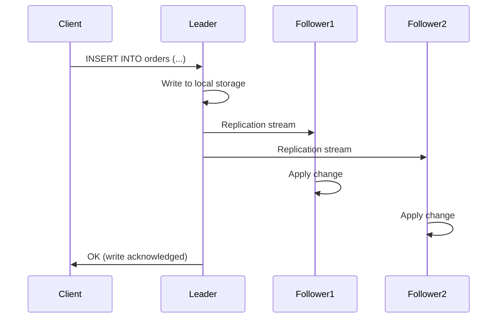
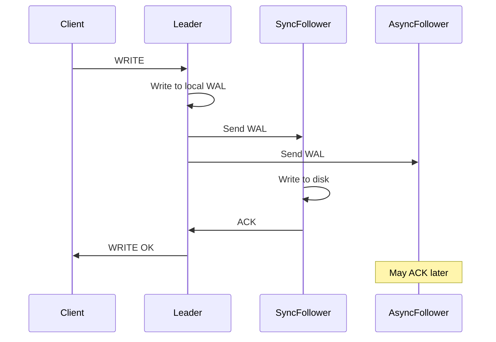
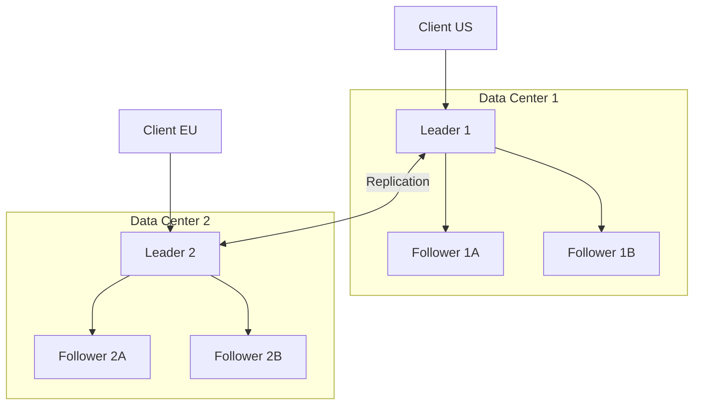
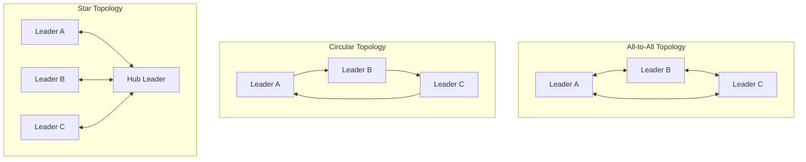
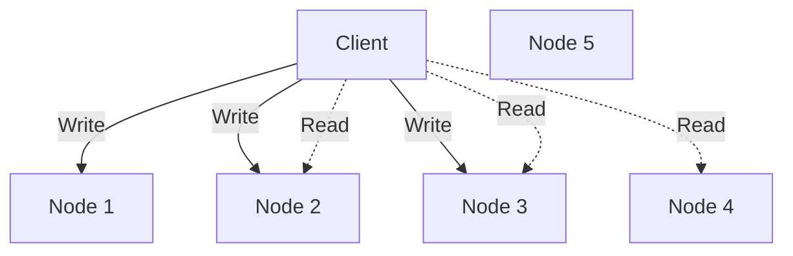
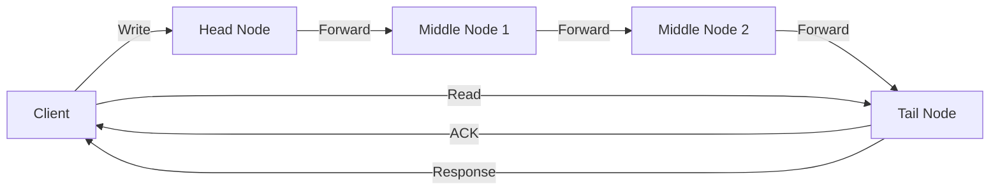
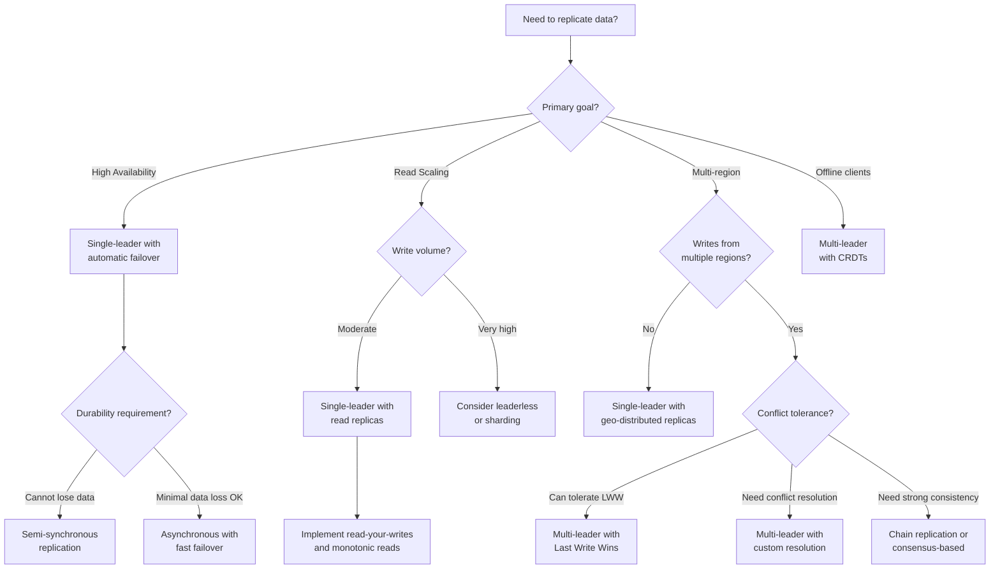

# Replication

Replication is the act of keeping copies of the same data on multiple machines connected via a network. Every serious production database deployment involves replication in some form. The reasons are straightforward, but the implementations are anything but. This document covers the full spectrum — from the simplest single-leader setups to the subtleties of leaderless quorum protocols — with production configurations, code simulations, and real failure scenarios.

## Why Replicate

There are exactly four reasons to replicate data, and most deployments are motivated by more than one.

### High Availability

If a single database server fails — hardware fault, kernel panic, network partition — the system goes down. With replication, a standby can take over. The difference between "we lost the database for four hours" and "we failed over in twelve seconds" is replication.

High availability is measured in nines:

| Availability | Downtime per year | Downtime per month |
|---|---|---|
| 99% (two nines) | 3.65 days | 7.31 hours |
| 99.9% (three nines) | 8.77 hours | 43.83 minutes |
| 99.99% (four nines) | 52.60 minutes | 4.38 minutes |
| 99.999% (five nines) | 5.26 minutes | 26.30 seconds |

Without replication, achieving even three nines is difficult. With proper replication and automated failover, four nines becomes realistic.

### Read Scaling

A single database node can handle a finite number of queries per second. When read traffic exceeds that capacity, you have two choices: buy a bigger machine (vertical scaling) or distribute reads across replicas (horizontal scaling). Replication enables the latter.

A common pattern in web applications: one primary handles all writes, and five to ten replicas handle reads. If your workload is 95% reads (common for content-heavy applications), this effectively multiplies your read capacity by the number of replicas.

### Disaster Recovery

If a data center catches fire, floods, or loses power, every machine in that data center is gone. Replication to a geographically separate data center means your data survives. This is not hypothetical — OVHcloud's Strasbourg data center fire in March 2021 destroyed servers and the data on them. Customers without off-site replication lost everything.

### Geographic Locality

If your users are spread across continents, a database in Virginia adds 150-200ms of latency for users in Tokyo. A replica in Tokyo serves those reads locally. This is not just about performance — it is about whether the application feels responsive or sluggish.

## Single-Leader Replication

Single-leader replication (also called primary-secondary, master-slave, or active-passive) is the most common replication topology. One node is designated as the leader (primary). All writes go to the leader. The leader sends a stream of changes to the followers (replicas), which apply those changes in the same order.

### How It Works

The fundamental mechanism:

1. A client sends a write request (INSERT, UPDATE, DELETE) to the leader.
2. The leader writes the change to its local storage.
3. The leader sends the change to all followers as part of a replication stream.
4. Each follower applies the change to its own copy of the data.
5. The follower acknowledges the change back to the leader (in synchronous mode) or does not (in asynchronous mode).



### WAL Shipping

Write-Ahead Logging (WAL) is the foundation of crash recovery in databases like PostgreSQL. Before any change is applied to the data files, it is first written to a sequential log — the WAL. If the database crashes, it replays the WAL to recover.

WAL shipping reuses this mechanism for replication. The leader continuously ships WAL segments to followers, which replay them. This is physical replication — the follower applies the exact same byte-level changes to its data files.

Advantages of WAL shipping:

- **Exact byte-for-byte copy**: The follower's data files are identical to the leader's. This guarantees consistency.
- **Low overhead on the leader**: The WAL is already being written for crash recovery. Shipping it adds minimal cost.
- **Proven reliability**: WAL shipping has been PostgreSQL's primary replication mechanism since version 9.0 (2010). It is battle-tested.

Disadvantages:

- **Version coupling**: Because WAL is a physical format tied to the database's internal storage layout, the leader and follower must run the same major version of the database. You cannot replicate from PostgreSQL 15 to PostgreSQL 16.
- **All-or-nothing**: You replicate the entire database cluster. You cannot selectively replicate specific tables or databases.
- **No cross-engine replication**: WAL is PostgreSQL-specific. You cannot ship PostgreSQL WAL to MySQL.

### Logical Replication

Logical replication operates at a higher level of abstraction. Instead of shipping raw WAL bytes, the leader decodes changes into a logical format: "row X in table Y was inserted with values Z" or "row X in table Y was updated, column A changed from V1 to V2."

This has significant advantages:

- **Cross-version replication**: Because the format is logical, not physical, you can replicate between different major versions. This enables zero-downtime major version upgrades.
- **Selective replication**: You can replicate specific tables, specific schemas, or even filter rows.
- **Cross-platform**: Logical replication can feed into different systems — a PostgreSQL change stream can feed into Kafka, Elasticsearch, or a data warehouse.
- **Triggers and transformations**: The subscriber can apply transformations to incoming data.

The trade-off is higher overhead: the leader must decode WAL entries into logical changes, which consumes CPU. The follower must apply changes through the normal SQL execution path, which is slower than raw WAL replay.

PostgreSQL's logical replication uses a publish/subscribe model with publications and subscriptions. MySQL's binlog-based replication is inherently logical (row-based binlog format).

## Synchronous vs Asynchronous Replication

This is the central trade-off in replication: durability versus latency.

### Synchronous Replication

In synchronous replication, the leader does not acknowledge a write to the client until at least one follower has confirmed it has received and durably stored the change.



**Guarantee**: If the leader crashes immediately after acknowledging the write, the data is safe on the synchronous follower. No acknowledged write is lost.

**Cost**: Every write must wait for a network round trip to the follower plus the follower's disk write. If the follower is in another data center, this adds significant latency — typically 1-10ms for same-region, 50-200ms for cross-region.

**Risk**: If the synchronous follower goes down, the leader cannot acknowledge any writes. The system blocks. This is why purely synchronous replication (all followers synchronous) is rarely used in practice.

### Asynchronous Replication

In asynchronous replication, the leader acknowledges the write to the client as soon as it has written to its own local storage. Followers receive and apply changes sometime later.

**Guarantee**: None, regarding followers. If the leader crashes before shipping a change to any follower, that change is lost — even though the client received an acknowledgment.

**Cost**: Minimal. Write latency is determined only by the leader's local disk write. The leader does not wait for followers at all.

**Risk**: Data loss on leader failure. The amount of data at risk equals the replication lag — the amount of data written to the leader but not yet received by followers. In normal operation this is milliseconds. Under load or network issues, it can be seconds or minutes.

### Semi-Synchronous Replication

The practical middle ground: one follower is synchronous, the rest are asynchronous. This is PostgreSQL's default when `synchronous_standby_names` is configured.

The protocol:

1. The leader writes to its local WAL.
2. The leader sends the WAL to all followers.
3. The leader waits for the synchronous follower to acknowledge.
4. The leader acknowledges the write to the client.
5. Asynchronous followers apply the change whenever they get to it.

If the synchronous follower goes down, the leader promotes one of the asynchronous followers to synchronous. This ensures there is always one follower with a complete copy of the data.

This gives you:

- **No data loss**: At least one follower always has every acknowledged write.
- **Bounded latency impact**: Only one network round trip, not N.
- **Availability**: The system keeps working even if the synchronous follower fails (after promoting a new one).

PostgreSQL configuration for semi-synchronous replication:

```ini
# postgresql.conf on the primary
synchronous_standby_names = 'FIRST 1 (standby1, standby2, standby3)'
synchronous_commit = on
```

This means: "Of the standbys named standby1, standby2, standby3, wait for the first one to acknowledge. If that one goes down, wait for the next available."

MySQL semi-synchronous replication uses the `rpl_semi_sync_master` plugin:

```ini
# my.cnf on the primary
rpl_semi_sync_master_enabled = 1
rpl_semi_sync_master_wait_for_slave_count = 1
rpl_semi_sync_master_timeout = 10000  # Fall back to async after 10s
```

Note MySQL's fallback behavior: if no replica acknowledges within the timeout, MySQL falls back to asynchronous replication rather than blocking. This is a pragmatic choice but means semi-sync in MySQL does not guarantee durability in all cases.

## Replication Lag

Replication lag is the delay between when a write is committed on the leader and when it becomes visible on a follower. In asynchronous replication, this lag is nonzero and variable.

### What Causes Replication Lag

**Leader write volume**: If the leader is processing 10,000 writes per second and the follower can only apply 8,000 per second, the follower falls behind. This is common when replicas also serve read queries, consuming CPU that would otherwise go to applying changes.

**Network latency and bandwidth**: WAL segments must traverse the network. If the network is congested or the connection is cross-region, delivery is delayed.

**Large transactions**: A single transaction that modifies millions of rows generates a large WAL entry. The follower must apply the entire transaction atomically, which can take seconds or minutes.

**DDL operations**: An `ALTER TABLE` on a large table on the leader may take minutes. The follower must apply the same operation, during which it cannot apply subsequent changes.

**Follower resource contention**: If the follower is handling heavy read queries, its disk I/O and CPU may be saturated, slowing WAL replay.

**Vacuum and maintenance**: Background maintenance operations on the follower compete with replication for resources.

### How to Measure Replication Lag

**PostgreSQL**: Query `pg_stat_replication` on the primary:

```sql
SELECT
    client_addr,
    state,
    sent_lsn,
    write_lsn,
    flush_lsn,
    replay_lsn,
    write_lag,
    flush_lag,
    replay_lag
FROM pg_stat_replication;
```

The `replay_lag` column (available since PostgreSQL 10) shows the time difference between when the leader sent the WAL and when the follower replayed it. This is the most meaningful metric.

You can also compute the byte lag:

```sql
SELECT
    client_addr,
    pg_wal_lsn_diff(sent_lsn, replay_lsn) AS byte_lag
FROM pg_stat_replication;
```

**MySQL**: On the replica, run `SHOW REPLICA STATUS`:

```sql
SHOW REPLICA STATUS\G
```

The key field is `Seconds_Behind_Source` (previously `Seconds_Behind_Master`). However, this metric is famously unreliable — it measures the difference between the replica's clock and the timestamp in the binlog event, which can be misleading if the replica has been paused and resumed, or if clocks are skewed.

A more reliable approach is to use heartbeat tables — the leader writes a timestamp to a heartbeat table every second, and monitoring compares that timestamp on the replica to the current time.

### Impact on Read-Your-Writes Consistency

The most common user-facing symptom of replication lag: a user submits a form, the write goes to the leader, and the subsequent page load reads from a replica that has not yet received the write. The user sees stale data — their submission appears to have vanished.

This is not a bug. It is the expected behavior of asynchronous replication. But it is confusing and frustrating for users.

## Solutions for Replication Lag

Replication lag is inevitable in asynchronous replication. The question is how to prevent it from causing user-visible inconsistencies.

### Read-Your-Writes Guarantee

The most important consistency guarantee for user-facing applications. After a user performs a write, any subsequent read by that same user must reflect that write (or a later one).

**Implementation: Route reads after writes to the primary.**

The simplest approach: after a user performs a write, route that user's reads to the primary for a short window (e.g., 10 seconds). After the window, resume reading from replicas.

```typescript
class ReadYourWritesRouter {
  private lastWriteTimestamps: Map<string, number> = new Map();
  private readonly readYourWritesWindowMs: number;
  private readonly primary: DatabaseConnection;
  private readonly replicas: DatabaseConnection[];

  constructor(
    primary: DatabaseConnection,
    replicas: DatabaseConnection[],
    windowMs: number = 10_000
  ) {
    this.primary = primary;
    this.replicas = replicas;
    this.readYourWritesWindowMs = windowMs;
  }

  recordWrite(userId: string): void {
    this.lastWriteTimestamps.set(userId, Date.now());
  }

  getConnectionForRead(userId: string): DatabaseConnection {
    const lastWrite = this.lastWriteTimestamps.get(userId);

    if (lastWrite && Date.now() - lastWrite < this.readYourWritesWindowMs) {
      // Recent write — route to primary to guarantee read-your-writes
      return this.primary;
    }

    // No recent write — safe to read from replica
    const replicaIndex = Math.floor(Math.random() * this.replicas.length);
    return this.replicas[replicaIndex];
  }
}
```

**Alternative: Use the replica's LSN position.**

Instead of a time-based window, track the WAL position (LSN) of the last write. When reading from a replica, check if the replica has reached that LSN. If not, either wait or fall back to the primary.

```typescript
class LSNAwareRouter {
  private lastWriteLSN: Map<string, string> = new Map();
  private readonly primary: DatabaseConnection;
  private readonly replicas: ReplicaConnection[];

  async recordWrite(userId: string): Promise<void> {
    // After the write, get the current WAL position on the primary
    const result = await this.primary.query('SELECT pg_current_wal_lsn()::text AS lsn');
    this.lastWriteLSN.set(userId, result.rows[0].lsn);
  }

  async getConnectionForRead(userId: string): Promise<DatabaseConnection> {
    const requiredLSN = this.lastWriteLSN.get(userId);

    if (!requiredLSN) {
      return this.pickRandomReplica();
    }

    // Find a replica that has replayed past the required LSN
    for (const replica of this.replicas) {
      const result = await replica.query('SELECT pg_last_wal_replay_lsn()::text AS lsn');
      const replicaLSN = result.rows[0].lsn;

      if (this.lsnGreaterOrEqual(replicaLSN, requiredLSN)) {
        return replica;
      }
    }

    // No replica is caught up — fall back to primary
    return this.primary;
  }

  private lsnGreaterOrEqual(a: string, b: string): boolean {
    // PostgreSQL LSN format: "X/Y" where X and Y are hex numbers
    const [aHigh, aLow] = a.split('/').map(s => parseInt(s, 16));
    const [bHigh, bLow] = b.split('/').map(s => parseInt(s, 16));
    return aHigh > bHigh || (aHigh === bHigh && aLow >= bLow);
  }

  private pickRandomReplica(): DatabaseConnection {
    return this.replicas[Math.floor(Math.random() * this.replicas.length)];
  }
}
```

### Monotonic Reads

A weaker guarantee than read-your-writes, but still important. If a user reads a value at time T1 and reads again at time T2 (where T2 > T1), the second read must not return an older value than the first.

Without monotonic reads, a user might see a comment appear, refresh the page (hitting a different, more lagged replica), and see the comment disappear, then refresh again and see it reappear. This is disorienting.

**Implementation: Pin users to a specific replica.**

Hash the user ID to select a replica. As long as the user hits the same replica, their reads are monotonic (a single replica's state only moves forward).

```typescript
class MonotonicReadRouter {
  private readonly replicas: DatabaseConnection[];

  constructor(replicas: DatabaseConnection[]) {
    this.replicas = replicas;
  }

  getConnectionForRead(userId: string): DatabaseConnection {
    // Consistent hash: same user always hits the same replica
    const hash = this.hashString(userId);
    const replicaIndex = hash % this.replicas.length;
    return this.replicas[replicaIndex];
  }

  private hashString(s: string): number {
    let hash = 0;
    for (let i = 0; i < s.length; i++) {
      const char = s.charCodeAt(i);
      hash = ((hash << 5) - hash) + char;
      hash = hash & hash; // Convert to 32-bit integer
    }
    return Math.abs(hash);
  }
}
```

The downside: if a replica goes down, users pinned to it must be rehashed to a different replica, and monotonicity is temporarily broken.

### Consistent Prefix Reads

This guarantee ensures that if a sequence of writes happens in a certain order, anyone reading those writes sees them in the same order. This is primarily a concern in partitioned (sharded) databases where different partitions may have different replication lags.

Example: In a chat application, Alice says "How are you?" and Bob replies "I'm fine." If these messages are on different partitions with different lag, a reader might see Bob's reply before Alice's question.

**Implementation**: Ensure causally related writes go to the same partition. In the chat example, all messages in a conversation should be on the same partition.

## Multi-Leader Replication

In multi-leader replication (also called active-active or master-master), more than one node accepts writes. Each leader sends its changes to all other leaders.



### Use Cases

**Multi-datacenter operation**: Each data center has its own leader. Writes are local (low latency), and changes replicate between data centers asynchronously. If one data center goes down, the other continues operating independently.

**Offline clients**: A calendar app on your phone must work without internet. Each device has a local database (a "leader") that syncs with the server and other devices when connectivity is available. CouchDB and PouchDB are designed for this pattern.

**Collaborative editing**: Google Docs allows multiple users to edit simultaneously. Each user's edits are applied locally and then replicated to other users. This is multi-leader replication at the keystroke level.

### Conflict Detection and Resolution

The fundamental challenge of multi-leader replication: two leaders can independently accept conflicting writes. User A updates a row's name to "Alice" on Leader 1 while User B updates the same row's name to "Bob" on Leader 2. When these changes replicate, there is a conflict.

#### Conflict Detection

**Synchronous detection**: Before accepting a write, check with all other leaders. This eliminates the concurrency benefit of multi-leader replication and is rarely used.

**Asynchronous detection**: Conflicts are detected when a leader tries to apply a replicated change that conflicts with a local change. This is the practical approach, but it means the conflict is detected after both writes have been acknowledged to their respective clients.

#### Conflict Resolution Strategies

**Last Write Wins (LWW)**: Attach a timestamp to each write. When a conflict is detected, the write with the later timestamp wins. The other write is silently discarded.

LWW is simple but dangerous:

- It requires synchronized clocks. If clocks are skewed, "last" is meaningless.
- It silently drops data. One client's acknowledged write vanishes.
- It is not "convergent" in any meaningful sense — the "winner" is arbitrary.

Despite these problems, LWW is the default in Apache Cassandra and many other systems. It is simple to implement and easy to reason about, as long as you accept the data loss.

```typescript
interface ConflictingWrite {
  value: string;
  timestamp: number;
  nodeId: string;
}

function resolveWithLWW(writes: ConflictingWrite[]): ConflictingWrite {
  // Sort by timestamp descending, break ties by nodeId
  writes.sort((a, b) => {
    if (b.timestamp !== a.timestamp) {
      return b.timestamp - a.timestamp;
    }
    return b.nodeId.localeCompare(a.nodeId);
  });
  return writes[0];
}
```

**Merge functions**: Instead of picking a winner, merge the conflicting values. For example, if two users add different items to a shopping cart, the merged result includes both items. CRDTs (Conflict-free Replicated Data Types) formalize this approach.

```typescript
// Example: a G-Counter CRDT for conflict-free counting
class GCounter {
  private counts: Map<string, number> = new Map();

  increment(nodeId: string): void {
    const current = this.counts.get(nodeId) ?? 0;
    this.counts.set(nodeId, current + 1);
  }

  merge(other: GCounter): GCounter {
    const merged = new GCounter();
    const allNodes = new Set([...this.counts.keys(), ...other.counts.keys()]);

    for (const nodeId of allNodes) {
      const thisCount = this.counts.get(nodeId) ?? 0;
      const otherCount = other.counts.get(nodeId) ?? 0;
      merged.counts.set(nodeId, Math.max(thisCount, otherCount));
    }

    return merged;
  }

  value(): number {
    let total = 0;
    for (const count of this.counts.values()) {
      total += count;
    }
    return total;
  }
}
```

**Custom resolution**: The application defines a conflict resolution handler. When a conflict is detected, the handler is invoked with both versions, and it decides the outcome. Couchbase and RethinkDB support this approach.

```typescript
type ConflictResolver<T> = (local: T, remote: T, metadata: ConflictMetadata) => T;

const userProfileResolver: ConflictResolver<UserProfile> = (local, remote, metadata) => {
  // Business logic: merge fields individually
  return {
    name: metadata.localTimestamp > metadata.remoteTimestamp ? local.name : remote.name,
    email: metadata.localTimestamp > metadata.remoteTimestamp ? local.email : remote.email,
    // For arrays, take the union
    tags: [...new Set([...local.tags, ...remote.tags])],
    // For counters, take the max
    loginCount: Math.max(local.loginCount, remote.loginCount),
    updatedAt: new Date(Math.max(
      metadata.localTimestamp,
      metadata.remoteTimestamp
    )),
  };
};
```

### Replication Topologies

The topology determines how changes flow between leaders.

**All-to-all**: Every leader sends its changes to every other leader. Most fault-tolerant — if one leader fails, others still communicate directly. But it can cause problems with causality: a change might arrive at a leader before the change it depends on.

**Circular**: Leaders are arranged in a ring. Each leader receives changes from one predecessor and forwards them (plus its own changes) to one successor. Simple but fragile — if one leader fails, the ring breaks.

**Star (hub and spoke)**: One central leader receives changes from all others and distributes them. Simple but the hub is a single point of failure.



In practice, all-to-all is the most common topology for multi-leader replication because it avoids single points of failure. MySQL's multi-source replication and PostgreSQL's BDR (Bi-Directional Replication) both default to all-to-all.

## Leaderless Replication

In leaderless replication, there is no designated leader. Any node can accept writes. The client sends writes to multiple nodes and reads from multiple nodes. Consistency is achieved through quorum protocols.

Amazon's Dynamo paper (2007) popularized this approach. Apache Cassandra, Riak, and Voldemort are all Dynamo-inspired systems. ScyllaDB, a high-performance Cassandra-compatible database, also uses leaderless replication.

### Dynamo-Style Replication



The system has N replicas for each piece of data. The client sends each write to W nodes and reads from R nodes. If W + R > N, the read set and write set overlap — at least one node in the read set has the latest write. This is the quorum condition.

### Quorum Reads and Writes

With N = 3, common configurations:

- **W=2, R=2**: Tolerates one node failure for both reads and writes. This is the most common configuration.
- **W=3, R=1**: Writes must reach all nodes (slow, durable), reads are fast (one node). Good for read-heavy workloads.
- **W=1, R=3**: Writes are fast (one node), reads must check all nodes. Good for write-heavy workloads but reads are slow.
- **W=1, R=1**: No quorum guarantee. Fast but may return stale data.

The math is straightforward: as long as W + R > N, at least one node in the read quorum participated in the write quorum. That node has the latest value.

But "latest" requires version tracking. Each value is tagged with a version number or vector clock. When a client reads from R nodes, it picks the value with the highest version.

### Sloppy Quorums and Hinted Handoff

In a strict quorum, the W writes and R reads must involve the N "home" nodes designated for that key. If fewer than W home nodes are available, the write fails.

A sloppy quorum relaxes this: if a home node is unavailable, the write can be sent to a different node that is not normally responsible for that key. This node stores the value temporarily and, when the home node recovers, hands it off. This is hinted handoff.

Sloppy quorums increase write availability (writes succeed even when home nodes are down) but weaken the quorum guarantee (the read quorum may not overlap with the nodes that actually have the data).

Cassandra's `consistency_level` setting controls this:

- `QUORUM`: Strict quorum across the data center.
- `LOCAL_QUORUM`: Strict quorum within the local data center.
- `ONE`: Write to one node, sloppy quorum.
- `ANY`: Write to any node, including hinted handoff. Maximum availability, weakest consistency.

### Anti-Entropy with Merkle Trees

Over time, replicas may diverge — a node was down and missed some writes, or a network partition caused some writes to reach only a subset of nodes. Anti-entropy is the process of detecting and repairing these divergences.

A naive approach: for each key, compare the value on every replica pair. This requires O(keys * replicas^2) comparisons — impractical for billions of keys.

Merkle trees (hash trees) make this efficient. Each node maintains a Merkle tree over its data:

1. Partition the key space into ranges.
2. Hash the data in each range.
3. Build a binary tree of hashes: each internal node is the hash of its children's hashes.
4. The root hash summarizes the entire dataset.

To compare two replicas, compare root hashes. If they match, the replicas are identical. If they differ, recursively descend into children to find the differing ranges. This narrows down the divergence to specific key ranges in O(log N) comparisons.

```typescript
class MerkleNode {
  hash: string;
  left: MerkleNode | null;
  right: MerkleNode | null;
  rangeStart: string;
  rangeEnd: string;

  constructor(rangeStart: string, rangeEnd: string) {
    this.hash = '';
    this.left = null;
    this.right = null;
    this.rangeStart = rangeStart;
    this.rangeEnd = rangeEnd;
  }
}

class MerkleTree {
  private root: MerkleNode;

  constructor(private data: Map<string, string>, private depth: number) {
    this.root = this.buildTree('', 'ffffffffffffffff', depth);
  }

  private buildTree(rangeStart: string, rangeEnd: string, depth: number): MerkleNode {
    const node = new MerkleNode(rangeStart, rangeEnd);

    if (depth === 0) {
      // Leaf node: hash all keys in this range
      const keysInRange = [...this.data.entries()]
        .filter(([k]) => k >= rangeStart && k <= rangeEnd)
        .sort(([a], [b]) => a.localeCompare(b));

      const content = keysInRange.map(([k, v]) => `${k}:${v}`).join('|');
      node.hash = this.hashFunction(content);
      return node;
    }

    // Split range and recurse
    const mid = this.midpoint(rangeStart, rangeEnd);
    node.left = this.buildTree(rangeStart, mid, depth - 1);
    node.right = this.buildTree(mid, rangeEnd, depth - 1);
    node.hash = this.hashFunction(node.left.hash + node.right.hash);

    return node;
  }

  findDifferences(other: MerkleTree): Array<{ rangeStart: string; rangeEnd: string }> {
    const diffs: Array<{ rangeStart: string; rangeEnd: string }> = [];
    this.compareNodes(this.root, other.root, diffs);
    return diffs;
  }

  private compareNodes(
    a: MerkleNode,
    b: MerkleNode,
    diffs: Array<{ rangeStart: string; rangeEnd: string }>
  ): void {
    if (a.hash === b.hash) return; // Subtrees are identical

    if (!a.left || !a.right || !b.left || !b.right) {
      // Leaf node with different hash — this range has diverged
      diffs.push({ rangeStart: a.rangeStart, rangeEnd: a.rangeEnd });
      return;
    }

    // Recurse into children
    this.compareNodes(a.left, b.left, diffs);
    this.compareNodes(a.right, b.right, diffs);
  }

  private hashFunction(input: string): string {
    // In production, use SHA-256 or similar
    let hash = 0;
    for (let i = 0; i < input.length; i++) {
      const char = input.charCodeAt(i);
      hash = ((hash << 5) - hash) + char;
      hash = hash & hash;
    }
    return Math.abs(hash).toString(16).padStart(8, '0');
  }

  private midpoint(a: string, b: string): string {
    const aNum = parseInt(a, 16);
    const bNum = parseInt(b, 16);
    return Math.floor((aNum + bNum) / 2).toString(16).padStart(a.length, '0');
  }
}
```

Cassandra uses Merkle trees in its `nodetool repair` process. Each node builds a Merkle tree for each token range, exchanges trees with replicas, and streams the differing ranges.

### Read Repair

A simpler, opportunistic anti-entropy mechanism. When a client reads from R nodes and discovers that some nodes have stale data (lower version numbers), it writes the latest value back to the stale nodes.

Read repair only fixes data that is actually read. Data that is never read remains divergent. This is why read repair is used in conjunction with Merkle tree anti-entropy, not as a replacement.

```typescript
async function readWithRepair(
  key: string,
  nodes: ReplicaNode[],
  readQuorum: number
): Promise<VersionedValue> {
  // Read from R nodes
  const responses = await Promise.all(
    nodes.slice(0, readQuorum).map(node => node.get(key))
  );

  // Find the latest version
  const latest = responses.reduce((best, current) =>
    current.version > best.version ? current : best
  );

  // Repair stale nodes (fire and forget)
  for (let i = 0; i < responses.length; i++) {
    if (responses[i].version < latest.version) {
      nodes[i].put(key, latest.value, latest.version).catch(err => {
        console.error(`Read repair failed for node ${nodes[i].id}:`, err);
      });
    }
  }

  return latest;
}
```

## Chain Replication

Chain replication is a less well-known but powerful replication protocol that provides strong consistency with high throughput. It was introduced by Renesse and Schneider in 2004.

### How Chain Replication Works

Nodes are arranged in a chain. The first node is the head, the last is the tail.

- **Writes** go to the head. The head applies the write and forwards it to the next node in the chain. Each node applies the write and forwards it to the next. The tail applies the write and sends an acknowledgment back to the client.
- **Reads** go to the tail. Since the tail has applied all acknowledged writes, reads from the tail are always consistent.



### Why Chain Replication is Powerful

**Strong consistency**: Because all reads go to the tail and the tail only acknowledges writes that have been applied by every node in the chain, every read sees the latest acknowledged write. This is linearizable — the strongest consistency guarantee.

**High throughput**: Unlike Raft or Paxos, where the leader does all the work (receiving client requests, replicating to followers, processing reads), chain replication distributes the work. The head handles incoming writes, middle nodes handle forwarding, and the tail handles reads. The bottleneck is the throughput of a single node, but the work is parallelized across nodes.

**Network efficiency**: Each node only communicates with its immediate neighbor, not with every other node. This reduces network traffic compared to broadcast-based protocols.

### Microsoft's FAWN

FAWN (Fast Array of Wimpy Nodes) was a research project at CMU (later continued at Microsoft Research) that used chain replication with flash storage. The insight: many small, low-power nodes with SSDs can provide better performance-per-watt and performance-per-dollar than a few large servers.

FAWN combined consistent hashing for data placement with chain replication for consistency. Each key maps to a chain of nodes. The result was a key-value store that achieved high throughput with strong consistency on inexpensive hardware.

### Chain Replication in Practice

Microsoft Azure Storage uses a variant of chain replication. HDFS (Hadoop Distributed File System) also uses a chain-like protocol for writing blocks — data is pipelined through a chain of DataNodes.

The main drawback of chain replication is that the tail is a single point of failure for reads, and the head is a single point of failure for writes. If either fails, the chain must be reconfigured. A separate configuration service (like ZooKeeper) monitors the chain and reconfigures it on failure.

## PostgreSQL Replication

PostgreSQL has robust, production-proven replication built in. This section covers practical setup and configuration.

### Streaming Replication Setup

Streaming replication ships WAL records from the primary to standbys in real time, without waiting for WAL files to be complete.

**On the primary:**

```ini
# postgresql.conf
wal_level = replica                    # Must be 'replica' or 'logical'
max_wal_senders = 10                   # Maximum number of standby connections
wal_keep_size = 1GB                    # Keep this much WAL for slow standbys
hot_standby = on                       # Allow reads on standbys
```

```ini
# pg_hba.conf — allow replication connections
host    replication    replicator    10.0.0.0/24    scram-sha-256
```

**Create a replication user:**

```sql
CREATE ROLE replicator WITH REPLICATION LOGIN PASSWORD 'secure_password';
```

**On the standby — take a base backup:**

```bash
pg_basebackup -h primary-host -D /var/lib/postgresql/16/main \
  -U replicator -Fp -Xs -P -R
```

The `-R` flag creates `standby.signal` and adds connection info to `postgresql.auto.conf`, so the standby automatically connects to the primary on startup.

**Standby configuration (postgresql.auto.conf, created by pg_basebackup -R):**

```ini
primary_conninfo = 'host=primary-host port=5432 user=replicator password=secure_password'
```

Start the standby, and it begins streaming WAL from the primary.

### Replication Slots

Without replication slots, the primary may recycle WAL segments before the standby has received them. If the standby falls too far behind (or is offline for too long), it can no longer catch up. The standby must be rebuilt from scratch.

Replication slots prevent this. A slot tells the primary: "Do not recycle WAL that this standby has not yet received."

```sql
-- On the primary
SELECT * FROM pg_create_physical_replication_slot('standby1_slot');
```

On the standby, reference the slot:

```ini
primary_slot_name = 'standby1_slot'
```

**Danger**: If a standby goes down permanently and its slot is not dropped, the primary will retain WAL indefinitely, eventually filling the disk. Monitor slot lag:

```sql
SELECT
    slot_name,
    active,
    pg_wal_lsn_diff(pg_current_wal_lsn(), restart_lsn) AS retained_bytes
FROM pg_replication_slots;
```

Set `max_slot_wal_keep_size` (PostgreSQL 13+) to cap how much WAL a slot can retain:

```ini
max_slot_wal_keep_size = 10GB
```

### Logical Replication with Publications and Subscriptions

PostgreSQL's logical replication uses a publish/subscribe model.

**On the publisher (primary):**

```sql
-- Create a publication for specific tables
CREATE PUBLICATION my_publication FOR TABLE orders, customers, products;

-- Or publish all tables
CREATE PUBLICATION all_tables FOR ALL TABLES;
```

**On the subscriber (replica):**

```sql
-- Create a subscription
CREATE SUBSCRIPTION my_subscription
  CONNECTION 'host=primary-host port=5432 dbname=mydb user=replicator password=secure_password'
  PUBLICATION my_publication;
```

The subscriber automatically takes an initial snapshot of the published tables and then applies ongoing changes.

Logical replication differences from streaming replication:

| Feature | Streaming Replication | Logical Replication |
|---|---|---|
| Replication unit | Entire cluster | Per-table |
| Cross-version | No (same major version) | Yes |
| Writable replica | No (read-only) | Yes (subscriber can have local writes) |
| Conflict handling | N/A | Errors on conflict |
| DDL replication | Yes (automatic) | No (manual) |
| Overhead | Low | Higher (decode + apply) |
| Use case | HA standby | Data integration, upgrades |

## MySQL Replication

MySQL's replication works differently from PostgreSQL's. It is based on the binary log (binlog), which records all changes as events.

### Binlog-Based Replication

MySQL replication has three binlog formats:

- **Statement-based (SBR)**: Logs the SQL statements. Compact but can cause divergence (non-deterministic functions like `NOW()`, `UUID()`).
- **Row-based (RBR)**: Logs the actual row changes (before and after images). Larger but deterministic. This is the recommended and default format since MySQL 8.0.
- **Mixed**: Uses statement-based by default, switches to row-based for non-deterministic statements.

**Setting up MySQL replication:**

On the source (primary):

```ini
[mysqld]
server-id = 1
log-bin = mysql-bin
binlog-format = ROW
gtid-mode = ON
enforce-gtid-consistency = ON
```

On the replica:

```ini
[mysqld]
server-id = 2
relay-log = relay-bin
read-only = ON
gtid-mode = ON
enforce-gtid-consistency = ON
```

```sql
-- On the replica
CHANGE REPLICATION SOURCE TO
  SOURCE_HOST = 'primary-host',
  SOURCE_USER = 'replicator',
  SOURCE_PASSWORD = 'secure_password',
  SOURCE_AUTO_POSITION = 1;

START REPLICA;
```

### GTID Replication

Global Transaction Identifiers (GTIDs) uniquely identify each transaction across the entire replication topology. A GTID is formatted as `server_uuid:transaction_id`, for example `3E11FA47-71CA-11E1-9E33-C80AA9429562:23`.

Without GTIDs, a replica tracks its position using binlog file name and position (`mysql-bin.000003:154`). This is fragile — if the source's binlog files are rotated or if failover changes the source, the position becomes meaningless.

With GTIDs, the replica simply knows "I have applied all transactions up to GTID X." Failover is seamless — the new source can determine exactly which transactions the replica is missing.

### Group Replication

MySQL Group Replication (MGR) is a plugin that provides multi-leader replication with automatic conflict detection. It uses a Paxos-based protocol for group membership and transaction ordering.

In single-primary mode, one member accepts writes and the others are read-only. On failure, the group automatically elects a new primary. This is similar to PostgreSQL's Patroni but built into MySQL.

In multi-primary mode, all members accept writes. Conflicts are detected at commit time — if two members modify the same row in the same certification interval, one transaction is rolled back.

```sql
-- Install and configure Group Replication
INSTALL PLUGIN group_replication SONAME 'group_replication.so';

SET GLOBAL group_replication_group_name = 'aaaaaaaa-bbbb-cccc-dddd-eeeeeeeeeeee';
SET GLOBAL group_replication_local_address = 'node1:33061';
SET GLOBAL group_replication_group_seeds = 'node1:33061,node2:33061,node3:33061';
SET GLOBAL group_replication_single_primary_mode = ON;

-- Bootstrap the group on the first node
SET GLOBAL group_replication_bootstrap_group = ON;
START GROUP_REPLICATION;
SET GLOBAL group_replication_bootstrap_group = OFF;
```

## Monitoring Replication

Monitoring is not optional. Undetected replication lag or broken replication is worse than no replication at all — you think you have a standby, but you do not.

### Lag Metrics

**PostgreSQL** — query `pg_stat_replication` on the primary:

```sql
-- Replication lag in bytes and time
SELECT
    application_name,
    state,
    sync_state,
    pg_wal_lsn_diff(pg_current_wal_lsn(), replay_lsn) AS replay_lag_bytes,
    replay_lag
FROM pg_stat_replication;
```

Export these to your monitoring system (Prometheus, Datadog, etc.). Alert if:

- `replay_lag` exceeds 30 seconds (warning) or 5 minutes (critical)
- `replay_lag_bytes` exceeds 1 GB
- `state` is not `streaming`
- No rows returned (no replicas connected)

**MySQL** — on the replica:

```sql
SELECT
    CHANNEL_NAME,
    SERVICE_STATE,
    LAST_APPLIED_TRANSACTION_END_APPLY_TIMESTAMP,
    APPLYING_TRANSACTION,
    LAST_ERROR_NUMBER,
    LAST_ERROR_MESSAGE
FROM performance_schema.replication_applier_status_by_worker;
```

### Slot Monitoring

PostgreSQL replication slots must be monitored to prevent disk exhaustion.

```sql
-- Check slot status
SELECT
    slot_name,
    slot_type,
    active,
    pg_size_pretty(pg_wal_lsn_diff(pg_current_wal_lsn(), restart_lsn)) AS retained_wal,
    pg_size_pretty(safe_wal_size) AS safe_wal_size
FROM pg_replication_slots;
```

Alert if:

- `active` is `false` for more than 10 minutes (the standby is disconnected)
- `retained_wal` exceeds `max_slot_wal_keep_size` or a threshold you define
- `safe_wal_size` is null or small (approaching the limit)

### Failover Detection

Monitor the health of the primary and the readiness of standbys. Key indicators:

- **Primary health**: Connection count, transaction rate, replication slot status, disk usage
- **Standby readiness**: Is it streaming? What is its lag? Can it accept connections? Is it in recovery?

```sql
-- On a standby: am I in recovery mode?
SELECT pg_is_in_recovery();

-- What is my current replay position?
SELECT pg_last_wal_replay_lsn(), pg_last_xact_replay_timestamp();
```

## Failover

Failover is the process of promoting a standby to become the new primary when the old primary fails. It is the most critical operation in a replicated database deployment, and the most dangerous.

### Manual vs Automatic Failover

**Manual failover**: An operator detects the failure, verifies that the primary is truly down (not just slow), selects a standby, promotes it, and reconfigures clients to connect to the new primary. This is slow (minutes to hours) but safe — a human verifies each step.

**Automatic failover**: A monitoring system detects the failure and triggers promotion automatically. This is fast (seconds to minutes) but risky — automated systems can make incorrect decisions, especially during network partitions.

### Split-Brain Prevention

The worst failure mode in replication: both the old primary and the new primary accept writes simultaneously. Clients connected to different nodes write conflicting data. When the network partition heals, the databases have diverged and cannot be reconciled without data loss.

Split-brain happens when:

1. The primary is slow (not down), and the failover system incorrectly decides it is dead.
2. The failover system promotes a standby.
3. The old primary is still running and accepting writes.
4. Clients connected to the old primary continue writing.

Prevention strategies:

**Fencing (STONITH — Shoot The Other Node In The Head)**: Before promoting a standby, ensure the old primary cannot accept writes. Methods:

- Power off the old primary via IPMI/iLO/DRAC.
- Revoke the old primary's network access via SDN.
- Revoke the old primary's storage access.
- Use a "death pill" — a mechanism where the old primary kills itself if it cannot reach the cluster.

**Lease-based leadership**: The primary holds a lease (a time-limited lock). If the primary cannot renew its lease (because it is partitioned), it steps down automatically. The standby only promotes itself if the lease has expired.

### Patroni

Patroni is the standard tool for PostgreSQL high availability. It manages a cluster of PostgreSQL instances, handles leader election via a distributed consensus store (etcd, ZooKeeper, or Consul), and automates failover.

```yaml
# patroni.yml
scope: postgres-cluster
name: node1

restapi:
  listen: 0.0.0.0:8008
  connect_address: 10.0.0.1:8008

etcd3:
  hosts: 10.0.0.10:2379,10.0.0.11:2379,10.0.0.12:2379

bootstrap:
  dcs:
    ttl: 30
    loop_wait: 10
    retry_timeout: 10
    maximum_lag_on_failover: 1048576  # 1MB — do not failover to a lagged replica
    synchronous_mode: true
    postgresql:
      use_pg_rewind: true
      parameters:
        max_connections: 200
        wal_level: replica
        hot_standby: on
        max_wal_senders: 10
        max_replication_slots: 10
        synchronous_commit: on

postgresql:
  listen: 0.0.0.0:5432
  connect_address: 10.0.0.1:5432
  data_dir: /var/lib/postgresql/16/main
  authentication:
    superuser:
      username: postgres
      password: 'secure_password'
    replication:
      username: replicator
      password: 'secure_password'
```

Patroni's failover process:

1. The leader holds a lock in etcd with a TTL (time to live).
2. The leader renews the lock every `loop_wait` seconds.
3. If the leader fails to renew (crash, network partition), the lock expires.
4. Standbys detect the expired lock and initiate a leader election.
5. The standby with the least replication lag wins the election.
6. The winning standby promotes itself to primary.
7. Other standbys reconfigure to follow the new primary.
8. If the old primary recovers, Patroni uses `pg_rewind` to resync it as a standby.

### pg_auto_failover

An alternative to Patroni from Citus/Microsoft. It uses a dedicated "monitor" node instead of an external consensus store.

```bash
# On the monitor node
pg_autoctl create monitor \
  --pgdata /var/lib/postgresql/monitor \
  --pgport 5000 \
  --auth scram-sha-256

# On the primary
pg_autoctl create postgres \
  --pgdata /var/lib/postgresql/16/main \
  --pgport 5432 \
  --pgctl /usr/lib/postgresql/16/bin/pg_ctl \
  --monitor postgres://autoctl_node@monitor-host:5000/pg_auto_failover

# On the standby
pg_autoctl create postgres \
  --pgdata /var/lib/postgresql/16/main \
  --pgport 5432 \
  --pgctl /usr/lib/postgresql/16/bin/pg_ctl \
  --monitor postgres://autoctl_node@monitor-host:5000/pg_auto_failover
```

pg_auto_failover is simpler than Patroni (no etcd cluster to manage) but less flexible (no support for multiple synchronous standbys in some configurations, more opinionated about topology).

## TypeScript Simulation: Quorum-Based Replication

This simulation demonstrates quorum reads and writes with configurable W, R, and N parameters, including version tracking, read repair, and conflict detection.

```typescript
import crypto from 'node:crypto';

// --- Types ---

interface VersionedValue {
  value: string;
  version: number;
  timestamp: number;
  nodeId: string;
}

interface WriteResult {
  success: boolean;
  acknowledgedBy: string[];
  version: number;
}

interface ReadResult {
  success: boolean;
  value: string | null;
  version: number;
  respondedNodes: string[];
  repairedNodes: string[];
}

interface QuorumConfig {
  n: number; // Total replicas
  w: number; // Write quorum
  r: number; // Read quorum
}

// --- Simulated Replica Node ---

class ReplicaNode {
  readonly id: string;
  private store: Map<string, VersionedValue> = new Map();
  private alive: boolean = true;
  private latencyMs: number;

  constructor(id: string, latencyMs: number = 10) {
    this.id = id;
    this.latencyMs = latencyMs;
  }

  async write(key: string, value: string, version: number): Promise<boolean> {
    if (!this.alive) {
      throw new Error(`Node ${this.id} is down`);
    }

    await this.simulateLatency();

    const existing = this.store.get(key);
    if (existing && existing.version >= version) {
      // Do not overwrite with an older version
      return false;
    }

    this.store.set(key, {
      value,
      version,
      timestamp: Date.now(),
      nodeId: this.id,
    });

    return true;
  }

  async read(key: string): Promise<VersionedValue | null> {
    if (!this.alive) {
      throw new Error(`Node ${this.id} is down`);
    }

    await this.simulateLatency();
    return this.store.get(key) ?? null;
  }

  kill(): void {
    this.alive = false;
  }

  revive(): void {
    this.alive = true;
  }

  isAlive(): boolean {
    return this.alive;
  }

  getStoreSnapshot(): Map<string, VersionedValue> {
    return new Map(this.store);
  }

  private simulateLatency(): Promise<void> {
    const jitter = Math.random() * this.latencyMs;
    return new Promise(resolve => setTimeout(resolve, jitter));
  }
}

// --- Quorum Coordinator ---

class QuorumCoordinator {
  private nodes: ReplicaNode[];
  private config: QuorumConfig;
  private versionCounter: number = 0;

  constructor(config: QuorumConfig) {
    this.config = config;

    if (config.w + config.r <= config.n) {
      console.warn(
        `WARNING: W(${config.w}) + R(${config.r}) <= N(${config.n}). ` +
        `Quorum intersection is not guaranteed. Stale reads are possible.`
      );
    }

    // Create N replica nodes with varying latencies
    this.nodes = Array.from({ length: config.n }, (_, i) => {
      const latency = 5 + Math.random() * 50; // 5-55ms
      return new ReplicaNode(`node-${i}`, latency);
    });

    console.log(`Quorum coordinator initialized: N=${config.n}, W=${config.w}, R=${config.r}`);
    console.log(`Quorum overlap: W+R-N = ${config.w + config.r - config.n}`);
  }

  async write(key: string, value: string): Promise<WriteResult> {
    const version = ++this.versionCounter;
    const aliveNodes = this.nodes.filter(n => n.isAlive());

    if (aliveNodes.length < this.config.w) {
      return {
        success: false,
        acknowledgedBy: [],
        version,
      };
    }

    // Send write to all alive nodes, wait for W acknowledgments
    const writePromises = aliveNodes.map(async node => {
      try {
        const ok = await node.write(key, value, version);
        return ok ? node.id : null;
      } catch {
        return null; // Node is down
      }
    });

    const results = await Promise.all(writePromises);
    const acknowledgedBy = results.filter((id): id is string => id !== null);
    const success = acknowledgedBy.length >= this.config.w;

    if (success) {
      console.log(
        `WRITE key="${key}" value="${value}" version=${version} ` +
        `acked by ${acknowledgedBy.length}/${aliveNodes.length} nodes`
      );
    } else {
      console.log(
        `WRITE FAILED key="${key}" — only ${acknowledgedBy.length}/${this.config.w} required acks`
      );
    }

    return { success, acknowledgedBy, version };
  }

  async read(key: string): Promise<ReadResult> {
    const aliveNodes = this.nodes.filter(n => n.isAlive());

    if (aliveNodes.length < this.config.r) {
      return {
        success: false,
        value: null,
        version: 0,
        respondedNodes: [],
        repairedNodes: [],
      };
    }

    // Read from R nodes
    const readPromises = aliveNodes.slice(0, this.config.r).map(async node => {
      try {
        const result = await node.read(key);
        return { nodeId: node.id, data: result };
      } catch {
        return { nodeId: node.id, data: null };
      }
    });

    const responses = await Promise.all(readPromises);
    const validResponses = responses.filter(r => r.data !== null);

    if (validResponses.length === 0) {
      return {
        success: true,
        value: null,
        version: 0,
        respondedNodes: responses.map(r => r.nodeId),
        repairedNodes: [],
      };
    }

    // Find the latest version
    let latest: VersionedValue | null = null;
    for (const resp of validResponses) {
      if (!latest || (resp.data && resp.data.version > latest.version)) {
        latest = resp.data;
      }
    }

    // Read repair: update stale nodes
    const repairedNodes: string[] = [];
    if (latest) {
      for (const resp of validResponses) {
        if (resp.data && resp.data.version < latest.version) {
          const node = this.nodes.find(n => n.id === resp.nodeId);
          if (node) {
            try {
              await node.write(key, latest.value, latest.version);
              repairedNodes.push(resp.nodeId);
            } catch {
              // Read repair is best-effort
            }
          }
        }
      }
    }

    const result: ReadResult = {
      success: true,
      value: latest?.value ?? null,
      version: latest?.version ?? 0,
      respondedNodes: responses.map(r => r.nodeId),
      repairedNodes,
    };

    console.log(
      `READ key="${key}" => value="${result.value}" version=${result.version} ` +
      `from ${result.respondedNodes.length} nodes` +
      (repairedNodes.length > 0 ? ` (repaired: ${repairedNodes.join(', ')})` : '')
    );

    return result;
  }

  killNode(index: number): void {
    if (index >= 0 && index < this.nodes.length) {
      this.nodes[index].kill();
      console.log(`Node ${this.nodes[index].id} killed`);
    }
  }

  reviveNode(index: number): void {
    if (index >= 0 && index < this.nodes.length) {
      this.nodes[index].revive();
      console.log(`Node ${this.nodes[index].id} revived`);
    }
  }

  getNodeStates(): Array<{ id: string; alive: boolean; storeSize: number }> {
    return this.nodes.map(n => ({
      id: n.id,
      alive: n.isAlive(),
      storeSize: n.getStoreSnapshot().size,
    }));
  }
}

// --- Simulation Runner ---

async function runSimulation(): Promise<void> {
  console.log('=== Quorum Replication Simulation ===\n');

  // Standard quorum: N=5, W=3, R=3
  const coordinator = new QuorumCoordinator({ n: 5, w: 3, r: 3 });

  // Basic write and read
  console.log('\n--- Basic Write/Read ---');
  await coordinator.write('user:1', 'Alice');
  const readResult = await coordinator.read('user:1');
  console.log(`Read result: ${readResult.value} (version ${readResult.version})`);

  // Write with a node down
  console.log('\n--- Write With One Node Down ---');
  coordinator.killNode(0);
  await coordinator.write('user:2', 'Bob'); // Should succeed (4 alive >= W=3)
  await coordinator.read('user:2');

  // Write with two nodes down
  console.log('\n--- Write With Two Nodes Down ---');
  coordinator.killNode(1);
  await coordinator.write('user:3', 'Charlie'); // Should succeed (3 alive >= W=3)

  // Write with three nodes down — should fail
  console.log('\n--- Write With Three Nodes Down (Should Fail) ---');
  coordinator.killNode(2);
  const failedWrite = await coordinator.write('user:4', 'Diana');
  console.log(`Write succeeded: ${failedWrite.success}`);

  // Revive nodes and demonstrate read repair
  console.log('\n--- Revive Nodes and Read Repair ---');
  coordinator.reviveNode(0);
  coordinator.reviveNode(1);
  coordinator.reviveNode(2);

  // Read user:2 — nodes 0 and 1 were down when it was written
  // Read repair should update them
  await coordinator.read('user:2');

  // Multiple writes to same key — version tracking
  console.log('\n--- Version Tracking ---');
  await coordinator.write('counter', 'value-1');
  await coordinator.write('counter', 'value-2');
  await coordinator.write('counter', 'value-3');
  const counterRead = await coordinator.read('counter');
  console.log(`Latest counter value: ${counterRead.value} (version ${counterRead.version})`);

  // Show final node states
  console.log('\n--- Final Node States ---');
  const states = coordinator.getNodeStates();
  for (const state of states) {
    console.log(`  ${state.id}: alive=${state.alive}, keys=${state.storeSize}`);
  }

  console.log('\n=== Simulation Complete ===');
}

// Run the simulation
runSimulation().catch(console.error);
```

This simulation demonstrates:

- Quorum writes succeeding and failing based on available nodes
- Read repair fixing stale nodes during reads
- Version tracking to determine the "latest" value
- The relationship between W, R, N and fault tolerance

## War Story: Replication Lag in a Payment System

This is a composite story based on real incidents at multiple companies. The details are changed but the failure mode is real and common.

### The Setup

A payment processing system handled credit card transactions. The architecture:

- One PostgreSQL primary in us-east-1 for all writes
- Three read replicas, also in us-east-1, for read traffic
- Asynchronous replication (the team chose it for lower write latency)
- A web application that used a connection pool routing writes to the primary and reads to replicas

The flow for processing a payment:

1. User submits payment form.
2. Application writes a `payment` record with status `pending` to the primary.
3. Application calls the payment processor API (Stripe).
4. On success, application updates the `payment` record to status `completed`.
5. Application redirects the user to a confirmation page.
6. The confirmation page reads the `payment` record to display the status.

### The Bug

Step 6 read from a replica. Under normal conditions, replication lag was under 100ms, and by the time the user's browser followed the redirect, the replica had the updated record. Everything worked.

Then traffic increased during a holiday sale. The primary was writing heavily, and replicas fell behind — lag climbed to 2-5 seconds. Users started seeing the confirmation page with status `pending` instead of `completed`. Some panicked and submitted the payment again. The application created duplicate payments.

Worse: some users saw their payment as `pending`, waited a few seconds, and refreshed. On the refresh, they sometimes hit a different replica with even more lag and saw no payment record at all (the `pending` write had not arrived). The user, believing their payment was lost, submitted a third time.

### The Impact

- 847 duplicate charges over the holiday weekend
- Customer support overwhelmed with complaints
- Chargebacks from angry customers
- Regulatory scrutiny (duplicate charges raise fraud flags)

### The Fix

The team implemented read-your-writes routing:

1. After any write to the `payments` table, set a cookie with the current WAL LSN.
2. On subsequent reads, check the cookie. If set, route the read to the primary (or to a replica that has reached that LSN).
3. The cookie expires after 30 seconds.

```typescript
// Middleware: after a write, record the LSN
async function afterWrite(req: Request, res: Response, next: NextFunction) {
  if (req.method === 'POST' || req.method === 'PUT' || req.method === 'PATCH') {
    const lsn = await primaryPool.query('SELECT pg_current_wal_lsn()::text AS lsn');
    res.cookie('_last_write_lsn', lsn.rows[0].lsn, {
      maxAge: 30000, // 30 seconds
      httpOnly: true,
      secure: true,
      sameSite: 'strict',
    });
  }
  next();
}

// Middleware: before a read, check if we need the primary
function getReadPool(req: Request): Pool {
  const lastWriteLSN = req.cookies._last_write_lsn;
  if (lastWriteLSN) {
    // Route to primary to guarantee read-your-writes
    return primaryPool;
  }
  return replicaPool;
}
```

Additionally, the team added idempotency keys to the payment submission endpoint to prevent duplicate charges even if the user double-submitted.

### The Lesson

Asynchronous replication is fine for most read traffic. But for reads that immediately follow writes — especially writes with financial consequences — you must route to the primary or implement read-your-writes guarantees. The default behavior of "writes go to primary, reads go to replicas" is a time bomb for any workflow where a user writes and then immediately reads.

The second lesson: always implement idempotency for payment operations, regardless of your replication strategy. The duplicate payment bug would have been harmless if the payment endpoint had rejected duplicate submissions.

## Replication Topology Decision Guide



## Key Takeaways for Production

1. **Default to single-leader, asynchronous replication** unless you have a specific reason for something more complex. It is the simplest, most well-understood, and most battle-tested topology.

2. **Use semi-synchronous replication** if you cannot afford to lose any acknowledged writes. The latency cost is one network round trip to one follower.

3. **Implement read-your-writes routing** from day one if your application has any workflow where a user writes and then immediately reads. Do not wait for the bug report.

4. **Monitor replication lag obsessively**. Alert on lag exceeding your tolerance. Alert on disconnected replicas. Alert on replication slot retention.

5. **Use Patroni or pg_auto_failover** for PostgreSQL high availability. Do not build your own failover automation. The edge cases are numerous and deadly (split-brain, data loss, cascading failures).

6. **Multi-leader replication is hard**. Use it only when you genuinely need writes in multiple locations. Conflict resolution is application-specific and cannot be fully automated.

7. **Leaderless replication trades consistency for availability**. It is appropriate for use cases that can tolerate eventual consistency (shopping carts, social media feeds, sensor data). It is not appropriate for financial transactions or inventory management.

8. **Test failover regularly**. A failover mechanism that has never been tested is a failover mechanism that does not work. Run monthly failover drills in production (or in a production-like environment).

9. **Replication is not a backup**. Replication propagates deletes and corruptions. If someone runs `DROP TABLE` on the primary, the replicas obediently drop the table too. You still need point-in-time recovery (PITR) backups.

10. **Understand your consistency requirements before choosing a replication strategy**. The choice between synchronous and asynchronous, single-leader and multi-leader, quorum and non-quorum, is ultimately a choice about what consistency guarantees your application needs.
