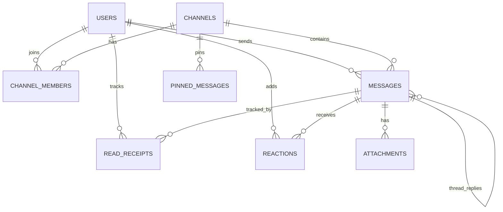
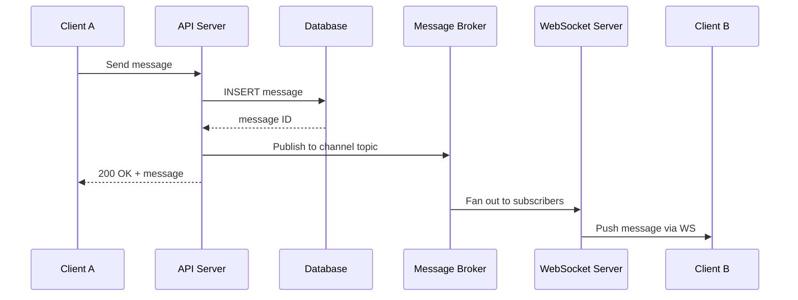

# Chat Application Schema Design

Chat schemas must handle high write throughput (messages), efficient read patterns (load channel history), and real-time state (who's online, who's read what). The critical design tension is between write speed and read flexibility — especially for features like threads, reactions, and search.

## Entity Relationship Overview



## Core Tables

### Users

```sql
CREATE TABLE users (
    id           BIGINT GENERATED ALWAYS AS IDENTITY PRIMARY KEY,
    username     TEXT NOT NULL UNIQUE,
    display_name TEXT NOT NULL,
    email        TEXT NOT NULL UNIQUE,
    avatar_url   TEXT,
    status       TEXT DEFAULT 'offline',       -- 'online', 'away', 'dnd', 'offline'
    status_text  TEXT,                         -- custom status message
    last_seen    TIMESTAMPTZ DEFAULT NOW(),
    created_at   TIMESTAMPTZ DEFAULT NOW(),
    updated_at   TIMESTAMPTZ DEFAULT NOW()
);

CREATE INDEX idx_users_username ON users(username);
```

::: tip Online Status
Don't store real-time online status in the database. Use Redis or an in-memory presence service. The database `last_seen` timestamp is updated periodically (every 60 seconds) for "last active" display, not for real-time presence.
:::

### Channels

```sql
CREATE TYPE channel_type AS ENUM ('public', 'private', 'direct');

CREATE TABLE channels (
    id           BIGINT GENERATED ALWAYS AS IDENTITY PRIMARY KEY,
    name         TEXT,                          -- NULL for DMs
    type         channel_type NOT NULL DEFAULT 'public',
    description  TEXT,
    avatar_url   TEXT,
    created_by   BIGINT REFERENCES users(id),
    is_archived  BOOLEAN DEFAULT FALSE,
    -- Denormalized
    member_count INT DEFAULT 0,
    last_message_at TIMESTAMPTZ,
    created_at   TIMESTAMPTZ DEFAULT NOW(),
    updated_at   TIMESTAMPTZ DEFAULT NOW()
);

CREATE TABLE channel_members (
    channel_id   BIGINT NOT NULL REFERENCES channels(id) ON DELETE CASCADE,
    user_id      BIGINT NOT NULL REFERENCES users(id) ON DELETE CASCADE,
    role         TEXT NOT NULL DEFAULT 'member',  -- 'owner', 'admin', 'member'
    nickname     TEXT,                            -- channel-specific display name
    is_muted     BOOLEAN DEFAULT FALSE,
    notification_pref TEXT DEFAULT 'all',         -- 'all', 'mentions', 'none'
    joined_at    TIMESTAMPTZ DEFAULT NOW(),

    PRIMARY KEY (channel_id, user_id)
);

CREATE INDEX idx_channel_members_user ON channel_members(user_id);
CREATE INDEX idx_channels_last_message ON channels(last_message_at DESC NULLS LAST);
```

### Direct Messages

Direct messages are channels with `type = 'direct'`. For two users, create one channel and add both as members.

```sql
-- Create or find a DM channel between two users
-- Use a deterministic lookup to avoid duplicates

CREATE TABLE dm_channels (
    channel_id   BIGINT NOT NULL REFERENCES channels(id) ON DELETE CASCADE,
    user_id_low  BIGINT NOT NULL REFERENCES users(id),
    user_id_high BIGINT NOT NULL REFERENCES users(id),

    PRIMARY KEY (user_id_low, user_id_high),
    CHECK (user_id_low < user_id_high)  -- canonical ordering
);
```

```sql
-- Find or create DM channel
-- Always order user IDs so (low, high) is deterministic
WITH existing AS (
    SELECT channel_id FROM dm_channels
    WHERE user_id_low = LEAST($user_a, $user_b)
      AND user_id_high = GREATEST($user_a, $user_b)
)
SELECT channel_id FROM existing

-- If no result, create:
-- INSERT INTO channels (type) VALUES ('direct') RETURNING id;
-- INSERT INTO dm_channels (channel_id, user_id_low, user_id_high) VALUES (...);
-- INSERT INTO channel_members (channel_id, user_id) VALUES (...), (...);
```

### Messages

```sql
CREATE TABLE messages (
    id           BIGINT GENERATED ALWAYS AS IDENTITY PRIMARY KEY,
    channel_id   BIGINT NOT NULL REFERENCES channels(id) ON DELETE CASCADE,
    sender_id    BIGINT NOT NULL REFERENCES users(id),
    content      TEXT,                         -- NULL if only attachment
    message_type TEXT NOT NULL DEFAULT 'text', -- 'text', 'system', 'file'
    thread_id    BIGINT REFERENCES messages(id) ON DELETE SET NULL, -- parent message for threads
    is_edited    BOOLEAN DEFAULT FALSE,
    is_deleted   BOOLEAN DEFAULT FALSE,        -- soft delete (show "message deleted")
    metadata     JSONB DEFAULT '{}',           -- link previews, embeds, etc.
    created_at   TIMESTAMPTZ DEFAULT NOW(),
    updated_at   TIMESTAMPTZ DEFAULT NOW()
);

-- Primary query: load channel history (newest first)
CREATE INDEX idx_messages_channel ON messages(channel_id, created_at DESC);

-- Thread replies
CREATE INDEX idx_messages_thread ON messages(thread_id, created_at)
    WHERE thread_id IS NOT NULL;

-- User's messages (for search, moderation)
CREATE INDEX idx_messages_sender ON messages(sender_id, created_at DESC);
```

::: warning Message Deletion
Most chat apps use soft deletes. The message row remains but `is_deleted = TRUE` and the UI shows "This message was deleted." Hard deletes break threading, read receipts, and reactions that reference the message ID.
:::

### Threads

Threads use the `thread_id` column on `messages`. The first message in a thread is the "parent" — its `thread_id` is NULL. All replies point their `thread_id` to the parent's `id`.

```sql
-- Denormalize thread metadata on the parent message
ALTER TABLE messages ADD COLUMN reply_count INT DEFAULT 0;
ALTER TABLE messages ADD COLUMN last_reply_at TIMESTAMPTZ;

-- Load a thread
SELECT m.*, u.username, u.avatar_url
FROM messages m
JOIN users u ON u.id = m.sender_id
WHERE m.thread_id = $parent_message_id
   OR m.id = $parent_message_id        -- include the parent
ORDER BY m.created_at;
```

### Read Receipts

```sql
CREATE TABLE read_receipts (
    channel_id     BIGINT NOT NULL REFERENCES channels(id) ON DELETE CASCADE,
    user_id        BIGINT NOT NULL REFERENCES users(id) ON DELETE CASCADE,
    last_read_id   BIGINT NOT NULL REFERENCES messages(id),
    last_read_at   TIMESTAMPTZ DEFAULT NOW(),

    PRIMARY KEY (channel_id, user_id)
);
```

**Unread count calculation:**

```sql
-- Unread message count for a user in a channel
SELECT COUNT(*)
FROM messages m
WHERE m.channel_id = $channel_id
  AND m.created_at > (
      SELECT last_read_at
      FROM read_receipts
      WHERE channel_id = $channel_id AND user_id = $user_id
  )
  AND m.sender_id != $user_id
  AND NOT m.is_deleted;

-- All channels with unread counts (for sidebar)
SELECT
    cm.channel_id,
    c.name,
    c.type,
    c.last_message_at,
    COALESCE(unread.cnt, 0) AS unread_count
FROM channel_members cm
JOIN channels c ON c.id = cm.channel_id
LEFT JOIN LATERAL (
    SELECT COUNT(*) AS cnt
    FROM messages m
    WHERE m.channel_id = cm.channel_id
      AND m.sender_id != cm.user_id
      AND m.created_at > COALESCE(
          (SELECT last_read_at FROM read_receipts
           WHERE channel_id = cm.channel_id AND user_id = cm.user_id),
          cm.joined_at
      )
      AND NOT m.is_deleted
) unread ON TRUE
WHERE cm.user_id = $user_id
  AND NOT c.is_archived
ORDER BY c.last_message_at DESC NULLS LAST;
```

::: tip Optimizing Unread Counts
For high-traffic channels, counting unread messages per query is expensive. Alternatives:

1. **Denormalize:** Maintain an `unread_count` column on `channel_members`. Increment on new message, reset on read.
2. **Approximation:** Store `last_read_message_id` and compare to `max(message.id)` in the channel. If they differ, show "unread" without counting.
3. **Redis counter:** Maintain per-user-per-channel unread count in Redis. Increment atomically on message, reset on read.
:::

### Reactions

```sql
CREATE TABLE reactions (
    message_id   BIGINT NOT NULL REFERENCES messages(id) ON DELETE CASCADE,
    user_id      BIGINT NOT NULL REFERENCES users(id) ON DELETE CASCADE,
    emoji        TEXT NOT NULL,                -- ':thumbsup:', unicode, or custom

    PRIMARY KEY (message_id, user_id, emoji)
);

CREATE INDEX idx_reactions_message ON reactions(message_id);
```

```sql
-- Get reactions grouped by emoji for a message
SELECT
    emoji,
    COUNT(*) AS count,
    ARRAY_AGG(user_id) AS user_ids
FROM reactions
WHERE message_id = $1
GROUP BY emoji;

-- Batch: reactions for multiple messages (avoids N+1)
SELECT
    message_id,
    emoji,
    COUNT(*) AS count,
    ARRAY_AGG(user_id) AS user_ids
FROM reactions
WHERE message_id = ANY($message_ids)
GROUP BY message_id, emoji;
```

### Attachments

```sql
CREATE TABLE attachments (
    id           BIGINT GENERATED ALWAYS AS IDENTITY PRIMARY KEY,
    message_id   BIGINT NOT NULL REFERENCES messages(id) ON DELETE CASCADE,
    file_name    TEXT NOT NULL,
    file_type    TEXT NOT NULL,               -- MIME type: 'image/png', 'application/pdf'
    file_size    BIGINT NOT NULL,             -- bytes
    url          TEXT NOT NULL,               -- S3/CDN URL
    thumbnail_url TEXT,
    width        INT,                         -- for images/videos
    height       INT,
    created_at   TIMESTAMPTZ DEFAULT NOW()
);

CREATE INDEX idx_attachments_message ON attachments(message_id);
```

### Pinned Messages

```sql
CREATE TABLE pinned_messages (
    channel_id   BIGINT NOT NULL REFERENCES channels(id) ON DELETE CASCADE,
    message_id   BIGINT NOT NULL REFERENCES messages(id) ON DELETE CASCADE,
    pinned_by    BIGINT NOT NULL REFERENCES users(id),
    pinned_at    TIMESTAMPTZ DEFAULT NOW(),

    PRIMARY KEY (channel_id, message_id)
);
```

## Common Queries

### Load Channel History (Paginated)

```sql
-- Keyset pagination (cursor-based, efficient)
SELECT
    m.id, m.content, m.message_type, m.thread_id,
    m.reply_count, m.is_edited, m.is_deleted,
    m.created_at,
    u.id AS sender_id, u.username, u.avatar_url
FROM messages m
JOIN users u ON u.id = m.sender_id
WHERE m.channel_id = $channel_id
  AND m.created_at < $cursor_timestamp   -- previous page's oldest message
ORDER BY m.created_at DESC
LIMIT 50;

-- First page (no cursor)
-- Remove the AND m.created_at < $cursor line
```

### Search Messages

```sql
-- Full-text search within a channel
CREATE INDEX idx_messages_search ON messages
    USING GIN (to_tsvector('english', COALESCE(content, '')));

SELECT
    m.id, m.content, m.created_at,
    u.username,
    c.name AS channel_name,
    ts_rank(to_tsvector('english', m.content), query) AS rank
FROM messages m
JOIN users u ON u.id = m.sender_id
JOIN channels c ON c.id = m.channel_id
CROSS JOIN plainto_tsquery('english', $search_term) query
WHERE m.channel_id = ANY(
    SELECT channel_id FROM channel_members WHERE user_id = $user_id
)
AND to_tsvector('english', m.content) @@ query
AND NOT m.is_deleted
ORDER BY rank DESC, m.created_at DESC
LIMIT 20;
```

### Channel Sidebar (Ordered by Last Activity)

```sql
-- User's channels ordered by most recent activity
SELECT
    c.id,
    c.name,
    c.type,
    c.last_message_at,
    cm.is_muted,
    cm.notification_pref,
    -- Last message preview
    lm.content AS last_message,
    lu.username AS last_sender
FROM channel_members cm
JOIN channels c ON c.id = cm.channel_id
LEFT JOIN LATERAL (
    SELECT content, sender_id
    FROM messages
    WHERE channel_id = c.id AND NOT is_deleted
    ORDER BY created_at DESC
    LIMIT 1
) lm ON TRUE
LEFT JOIN users lu ON lu.id = lm.sender_id
WHERE cm.user_id = $user_id
  AND NOT c.is_archived
ORDER BY c.last_message_at DESC NULLS LAST
LIMIT 50;
```

## Message Delivery Architecture



## Performance Considerations

| Concern | Solution |
|---------|---------|
| Channel history load speed | Index on `(channel_id, created_at DESC)`; keyset pagination |
| Unread counts at scale | Denormalize on `channel_members` or use Redis counters |
| Message search | Full-text search index; consider Elasticsearch for advanced search |
| Attachment storage | Store files in S3/R2; only metadata in database |
| Large channels (10K+ members) | Fan-out via message broker, not database polling |
| Message table size | Partition by `channel_id` range or `created_at` month |
| Online presence | Redis pub/sub or dedicated presence service; not database |
| Typing indicators | Pure WebSocket; never touches the database |

## Schema Design Decisions

| Decision | Rationale |
|----------|----------|
| BIGINT IDENTITY over UUID | Messages are insert-heavy; sequential IDs are faster for B-tree indexes than random UUIDs |
| Soft delete for messages | Preserves threading, reactions, and read receipt references |
| `dm_channels` lookup table | Canonical ordering (`user_id_low < user_id_high`) prevents duplicate DM channels |
| `thread_id` on messages | Simpler than a separate threads table; thread is just a message with replies pointing to it |
| Denormalized `last_message_at` on channels | Avoids expensive `MAX(created_at)` subquery for channel ordering |
| Denormalized `reply_count` on messages | Avoids `COUNT(*)` query for thread preview |
| Reactions as separate table | Supports any emoji, easy to add/remove, queryable per message |
| JSONB for message metadata | Link previews, embeds, and rich content vary per message; JSONB is flexible |
| Read receipts track `last_read_id` not per-message | One row per user per channel instead of one row per user per message |
