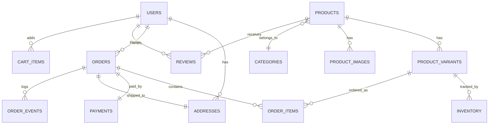

# E-Commerce Schema Design

Designing an e-commerce schema is a rite of passage for backend engineers. The domain appears simple — products, orders, payments — but the details are brutal: variant combinations, inventory races, price histories, tax calculation, and order state machines. This page presents a production-grade schema with commentary on why each decision was made.

## Entity Relationship Overview



## Core Tables

### Users & Addresses

```sql
CREATE TABLE users (
    id            BIGINT GENERATED ALWAYS AS IDENTITY PRIMARY KEY,
    email         TEXT NOT NULL UNIQUE,
    password_hash TEXT NOT NULL,
    full_name     TEXT NOT NULL,
    phone         TEXT,
    is_verified   BOOLEAN DEFAULT FALSE,
    created_at    TIMESTAMPTZ DEFAULT NOW(),
    updated_at    TIMESTAMPTZ DEFAULT NOW()
);

CREATE TABLE addresses (
    id          BIGINT GENERATED ALWAYS AS IDENTITY PRIMARY KEY,
    user_id     BIGINT NOT NULL REFERENCES users(id) ON DELETE CASCADE,
    label       TEXT DEFAULT 'home',           -- 'home', 'work', 'other'
    line1       TEXT NOT NULL,
    line2       TEXT,
    city        TEXT NOT NULL,
    state       TEXT NOT NULL,
    postal_code TEXT NOT NULL,
    country     TEXT NOT NULL DEFAULT 'US',
    is_default  BOOLEAN DEFAULT FALSE,
    created_at  TIMESTAMPTZ DEFAULT NOW()
);

CREATE INDEX idx_addresses_user ON addresses(user_id);
```

::: tip Why Separate Addresses?
Users have multiple shipping/billing addresses. Embedding them in the `users` table would require arrays or JSON, losing the ability to query and index individual address fields.
:::

### Products & Variants

```sql
CREATE TABLE categories (
    id        BIGINT GENERATED ALWAYS AS IDENTITY PRIMARY KEY,
    name      TEXT NOT NULL UNIQUE,
    slug      TEXT NOT NULL UNIQUE,
    parent_id BIGINT REFERENCES categories(id),
    sort_order INT DEFAULT 0
);

CREATE TABLE products (
    id          BIGINT GENERATED ALWAYS AS IDENTITY PRIMARY KEY,
    name        TEXT NOT NULL,
    slug        TEXT NOT NULL UNIQUE,
    description TEXT,
    category_id BIGINT REFERENCES categories(id),
    brand       TEXT,
    is_active   BOOLEAN DEFAULT TRUE,
    metadata    JSONB DEFAULT '{}',       -- flexible attributes
    created_at  TIMESTAMPTZ DEFAULT NOW(),
    updated_at  TIMESTAMPTZ DEFAULT NOW()
);

CREATE TABLE product_variants (
    id            BIGINT GENERATED ALWAYS AS IDENTITY PRIMARY KEY,
    product_id    BIGINT NOT NULL REFERENCES products(id) ON DELETE CASCADE,
    sku           TEXT NOT NULL UNIQUE,
    name          TEXT NOT NULL,              -- e.g., "Red / Large"
    price_cents   INT NOT NULL,               -- store money as cents
    compare_price INT,                        -- original price for "was $X"
    weight_grams  INT,
    attributes    JSONB DEFAULT '{}',         -- {"color": "red", "size": "L"}
    is_active     BOOLEAN DEFAULT TRUE,
    created_at    TIMESTAMPTZ DEFAULT NOW()
);

CREATE TABLE product_images (
    id          BIGINT GENERATED ALWAYS AS IDENTITY PRIMARY KEY,
    product_id  BIGINT NOT NULL REFERENCES products(id) ON DELETE CASCADE,
    variant_id  BIGINT REFERENCES product_variants(id) ON DELETE SET NULL,
    url         TEXT NOT NULL,
    alt_text    TEXT,
    sort_order  INT DEFAULT 0,
    is_primary  BOOLEAN DEFAULT FALSE
);

CREATE INDEX idx_products_category ON products(category_id) WHERE is_active;
CREATE INDEX idx_products_slug ON products(slug);
CREATE INDEX idx_variants_product ON product_variants(product_id);
CREATE INDEX idx_variants_sku ON product_variants(sku);
CREATE INDEX idx_images_product ON product_images(product_id);
```

::: warning Money as Integers
Never store money as `FLOAT` or `DOUBLE`. Use `INT` (cents) or `NUMERIC(12,2)`. A price of $19.99 is stored as `1999`. This avoids floating-point rounding errors that can cause financial discrepancies.
:::

### Inventory

```sql
CREATE TABLE inventory (
    id          BIGINT GENERATED ALWAYS AS IDENTITY PRIMARY KEY,
    variant_id  BIGINT NOT NULL REFERENCES product_variants(id),
    warehouse   TEXT NOT NULL DEFAULT 'main',
    quantity    INT NOT NULL DEFAULT 0 CHECK (quantity >= 0),
    reserved    INT NOT NULL DEFAULT 0 CHECK (reserved >= 0),
    updated_at  TIMESTAMPTZ DEFAULT NOW(),

    UNIQUE (variant_id, warehouse)
);

-- Available = quantity - reserved
CREATE INDEX idx_inventory_variant ON inventory(variant_id);
```

**Inventory reservation flow:**

```sql
-- 1. Reserve stock when order is placed (atomic)
UPDATE inventory
SET reserved = reserved + $qty,
    updated_at = NOW()
WHERE variant_id = $variant_id
  AND warehouse = 'main'
  AND quantity - reserved >= $qty  -- sufficient available stock
RETURNING id;
-- If 0 rows returned: out of stock

-- 2. Confirm (after payment): deduct from quantity
UPDATE inventory
SET quantity = quantity - $qty,
    reserved = reserved - $qty,
    updated_at = NOW()
WHERE variant_id = $variant_id AND warehouse = 'main';

-- 3. Cancel: release reservation
UPDATE inventory
SET reserved = reserved - $qty,
    updated_at = NOW()
WHERE variant_id = $variant_id AND warehouse = 'main';
```

### Orders & Order Items

```sql
CREATE TYPE order_status AS ENUM (
    'pending',      -- order created, awaiting payment
    'paid',         -- payment confirmed
    'processing',   -- being prepared/packed
    'shipped',      -- handed to carrier
    'delivered',    -- confirmed delivery
    'cancelled',    -- order cancelled
    'refunded'      -- money returned
);

CREATE TABLE orders (
    id                BIGINT GENERATED ALWAYS AS IDENTITY PRIMARY KEY,
    user_id           BIGINT NOT NULL REFERENCES users(id),
    status            order_status NOT NULL DEFAULT 'pending',
    shipping_address  JSONB NOT NULL,          -- snapshot at order time
    billing_address   JSONB,
    subtotal_cents    INT NOT NULL,
    tax_cents         INT NOT NULL DEFAULT 0,
    shipping_cents    INT NOT NULL DEFAULT 0,
    discount_cents    INT NOT NULL DEFAULT 0,
    total_cents       INT NOT NULL,
    currency          TEXT NOT NULL DEFAULT 'USD',
    notes             TEXT,
    created_at        TIMESTAMPTZ DEFAULT NOW(),
    updated_at        TIMESTAMPTZ DEFAULT NOW()
);

CREATE TABLE order_items (
    id              BIGINT GENERATED ALWAYS AS IDENTITY PRIMARY KEY,
    order_id        BIGINT NOT NULL REFERENCES orders(id) ON DELETE CASCADE,
    variant_id      BIGINT NOT NULL REFERENCES product_variants(id),
    product_name    TEXT NOT NULL,           -- snapshot
    variant_name    TEXT NOT NULL,           -- snapshot
    sku             TEXT NOT NULL,           -- snapshot
    unit_price      INT NOT NULL,            -- snapshot price in cents
    quantity        INT NOT NULL CHECK (quantity > 0),
    line_total      INT NOT NULL             -- unit_price * quantity
);

CREATE TABLE order_events (
    id          BIGINT GENERATED ALWAYS AS IDENTITY PRIMARY KEY,
    order_id    BIGINT NOT NULL REFERENCES orders(id),
    status      order_status NOT NULL,
    note        TEXT,
    actor       TEXT DEFAULT 'system',       -- 'system', 'admin', 'customer'
    created_at  TIMESTAMPTZ DEFAULT NOW()
);

CREATE INDEX idx_orders_user ON orders(user_id);
CREATE INDEX idx_orders_status ON orders(status) WHERE status NOT IN ('delivered', 'cancelled');
CREATE INDEX idx_order_items_order ON order_items(order_id);
CREATE INDEX idx_order_events_order ON order_events(order_id);
```

::: tip Why Snapshot Product Data in Order Items?
Products can be renamed, repriced, or deleted after an order is placed. The order record must reflect what the customer actually bought at the time of purchase. Always copy `product_name`, `variant_name`, `sku`, and `unit_price` into `order_items`.
:::

### Payments

```sql
CREATE TYPE payment_status AS ENUM (
    'pending', 'authorized', 'captured', 'failed', 'refunded', 'partially_refunded'
);

CREATE TYPE payment_method AS ENUM (
    'credit_card', 'debit_card', 'upi', 'bank_transfer', 'wallet', 'cod'
);

CREATE TABLE payments (
    id              BIGINT GENERATED ALWAYS AS IDENTITY PRIMARY KEY,
    order_id        BIGINT NOT NULL REFERENCES orders(id),
    status          payment_status NOT NULL DEFAULT 'pending',
    method          payment_method NOT NULL,
    amount_cents    INT NOT NULL,
    currency        TEXT NOT NULL DEFAULT 'USD',
    gateway         TEXT NOT NULL,              -- 'stripe', 'razorpay'
    gateway_txn_id  TEXT,                       -- external reference
    gateway_response JSONB,                     -- raw response for debugging
    created_at      TIMESTAMPTZ DEFAULT NOW(),
    updated_at      TIMESTAMPTZ DEFAULT NOW()
);

CREATE INDEX idx_payments_order ON payments(order_id);
CREATE INDEX idx_payments_gateway_txn ON payments(gateway_txn_id);
```

### Reviews

```sql
CREATE TABLE reviews (
    id          BIGINT GENERATED ALWAYS AS IDENTITY PRIMARY KEY,
    product_id  BIGINT NOT NULL REFERENCES products(id) ON DELETE CASCADE,
    user_id     BIGINT NOT NULL REFERENCES users(id),
    rating      SMALLINT NOT NULL CHECK (rating BETWEEN 1 AND 5),
    title       TEXT,
    body        TEXT,
    is_verified BOOLEAN DEFAULT FALSE,    -- purchased the product?
    created_at  TIMESTAMPTZ DEFAULT NOW(),
    updated_at  TIMESTAMPTZ DEFAULT NOW(),

    UNIQUE (product_id, user_id)          -- one review per product per user
);

CREATE INDEX idx_reviews_product ON reviews(product_id);
CREATE INDEX idx_reviews_rating ON reviews(product_id, rating);
```

### Cart

```sql
CREATE TABLE cart_items (
    id          BIGINT GENERATED ALWAYS AS IDENTITY PRIMARY KEY,
    user_id     BIGINT NOT NULL REFERENCES users(id) ON DELETE CASCADE,
    variant_id  BIGINT NOT NULL REFERENCES product_variants(id),
    quantity    INT NOT NULL DEFAULT 1 CHECK (quantity > 0),
    added_at    TIMESTAMPTZ DEFAULT NOW(),

    UNIQUE (user_id, variant_id)
);
```

## Common Queries

```sql
-- Product listing with primary image and price range
SELECT
    p.id, p.name, p.slug,
    MIN(pv.price_cents) AS min_price,
    MAX(pv.price_cents) AS max_price,
    pi.url AS image_url,
    COALESCE(rs.avg_rating, 0) AS avg_rating,
    COALESCE(rs.review_count, 0) AS review_count
FROM products p
LEFT JOIN product_variants pv ON pv.product_id = p.id AND pv.is_active
LEFT JOIN product_images pi ON pi.product_id = p.id AND pi.is_primary
LEFT JOIN LATERAL (
    SELECT
        AVG(rating)::numeric(3,2) AS avg_rating,
        COUNT(*) AS review_count
    FROM reviews WHERE product_id = p.id
) rs ON TRUE
WHERE p.is_active AND p.category_id = $1
GROUP BY p.id, p.name, p.slug, pi.url, rs.avg_rating, rs.review_count
ORDER BY p.created_at DESC
LIMIT 20;

-- Order history for a user
SELECT
    o.id, o.status, o.total_cents, o.created_at,
    jsonb_agg(jsonb_build_object(
        'product', oi.product_name,
        'variant', oi.variant_name,
        'qty', oi.quantity,
        'price', oi.unit_price
    )) AS items
FROM orders o
JOIN order_items oi ON oi.order_id = o.id
WHERE o.user_id = $1
GROUP BY o.id
ORDER BY o.created_at DESC;
```

## Performance Considerations

| Concern | Solution |
|---------|---------|
| Product search | Full-text index: `CREATE INDEX idx_products_search ON products USING GIN (to_tsvector('english', name \|\| ' ' \|\| COALESCE(description, '')))` |
| Inventory races | `UPDATE ... WHERE quantity - reserved >= $qty` is atomic in a single statement |
| Order counting | Maintain `order_count` on `users` via trigger or application logic |
| Review aggregates | Materialized view or denormalized `avg_rating`/`review_count` on `products` |
| Category tree | Recursive CTE for nested categories; or materialized path (`/electronics/phones/smartphones`) |
| Soft deletes | `is_active` flag on products instead of `DELETE`; orders still reference the product |

## Schema Design Decisions

| Decision | Rationale |
|----------|----------|
| Cents not dollars | Avoids float rounding; all math is integer arithmetic |
| Snapshots in order_items | Orders are immutable records of what was purchased |
| JSONB for addresses in orders | Address at order time is frozen; user may later change their address |
| JSONB for variant attributes | Product attributes vary wildly (shoes have size, laptops have RAM); JSONB is flexible |
| Separate inventory table | Decouples stock from product catalog; supports multi-warehouse |
| order_events for audit trail | Every status change is logged; enables debugging and customer support |
| ENUM for statuses | Database enforces valid state values; faster than text comparison |
