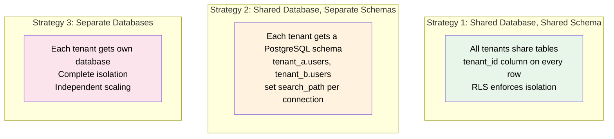
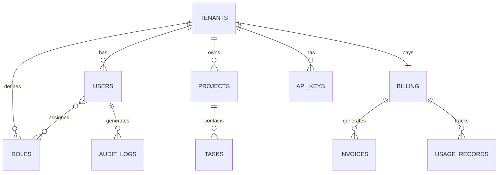

# SaaS Multi-Tenant Schema Design

Multi-tenancy is the defining architectural challenge of SaaS applications. Every table, every query, every migration must account for tenant isolation. Get it wrong and you leak data between tenants — the kind of bug that ends companies. This page covers the three major strategies and provides a production-grade schema for the most common approach.

## Multi-Tenancy Strategies



| Strategy | Isolation | Complexity | Cost | When to Use |
|----------|-----------|-----------|------|-------------|
| **Shared schema + tenant_id** | Low (RLS-enforced) | Low | Lowest | Most SaaS apps, <1000 tenants |
| **Schema-per-tenant** | Medium | Medium | Medium | Regulated industries, custom schemas |
| **Database-per-tenant** | Highest | Highest | Highest | Enterprise customers requiring full isolation |

::: warning The #1 Multi-Tenant Bug
Forgetting `WHERE tenant_id = ?` on a single query leaks data across tenants. Row-Level Security (RLS) is your safety net — it enforces filtering at the database level, even if the application forgets.
:::

## Schema Design (Shared Schema + tenant_id)

This is the most common approach. All tenants share the same tables, distinguished by a `tenant_id` column. PostgreSQL Row-Level Security enforces isolation.

### Entity Relationship Overview



### Tenants

```sql
CREATE TABLE tenants (
    id          UUID PRIMARY KEY DEFAULT gen_random_uuid(),
    name        TEXT NOT NULL,
    slug        TEXT NOT NULL UNIQUE,         -- subdomain: acme.app.com
    plan        TEXT NOT NULL DEFAULT 'free', -- 'free', 'pro', 'enterprise'
    settings    JSONB DEFAULT '{}',           -- feature flags, limits
    is_active   BOOLEAN DEFAULT TRUE,
    trial_ends_at TIMESTAMPTZ,
    created_at  TIMESTAMPTZ DEFAULT NOW(),
    updated_at  TIMESTAMPTZ DEFAULT NOW()
);

CREATE INDEX idx_tenants_slug ON tenants(slug);
```

### Users & Authentication

```sql
CREATE TABLE users (
    id          UUID PRIMARY KEY DEFAULT gen_random_uuid(),
    tenant_id   UUID NOT NULL REFERENCES tenants(id) ON DELETE CASCADE,
    email       TEXT NOT NULL,
    password_hash TEXT NOT NULL,
    full_name   TEXT NOT NULL,
    avatar_url  TEXT,
    is_active   BOOLEAN DEFAULT TRUE,
    last_login  TIMESTAMPTZ,
    created_at  TIMESTAMPTZ DEFAULT NOW(),
    updated_at  TIMESTAMPTZ DEFAULT NOW(),

    UNIQUE (tenant_id, email)  -- email unique within tenant, not globally
);

CREATE INDEX idx_users_tenant ON users(tenant_id);
CREATE INDEX idx_users_email ON users(tenant_id, email);
```

::: tip Email Uniqueness Scope
In single-tenant apps, email is globally unique. In multi-tenant apps, the same email can exist in different tenants (e.g., alice@company.com is a user in both Acme Corp and Globex Corp tenants). The `UNIQUE (tenant_id, email)` constraint enforces this correctly.
:::

### Roles & Permissions (RBAC)

```sql
CREATE TABLE roles (
    id          UUID PRIMARY KEY DEFAULT gen_random_uuid(),
    tenant_id   UUID NOT NULL REFERENCES tenants(id) ON DELETE CASCADE,
    name        TEXT NOT NULL,                -- 'admin', 'editor', 'viewer'
    permissions TEXT[] NOT NULL DEFAULT '{}',  -- ['projects.read', 'projects.write']
    is_default  BOOLEAN DEFAULT FALSE,
    created_at  TIMESTAMPTZ DEFAULT NOW(),

    UNIQUE (tenant_id, name)
);

CREATE TABLE user_roles (
    user_id  UUID NOT NULL REFERENCES users(id) ON DELETE CASCADE,
    role_id  UUID NOT NULL REFERENCES roles(id) ON DELETE CASCADE,

    PRIMARY KEY (user_id, role_id)
);

-- Seed default roles per tenant
-- INSERT INTO roles (tenant_id, name, permissions, is_default) VALUES
--   ($tenant_id, 'admin', ARRAY['*'], false),
--   ($tenant_id, 'member', ARRAY['projects.read','projects.write','tasks.read','tasks.write'], true),
--   ($tenant_id, 'viewer', ARRAY['projects.read','tasks.read'], false);

CREATE INDEX idx_roles_tenant ON roles(tenant_id);
CREATE INDEX idx_user_roles_user ON user_roles(user_id);
```

**Permission check query:**

```sql
-- Check if user has a specific permission
SELECT EXISTS (
    SELECT 1
    FROM user_roles ur
    JOIN roles r ON r.id = ur.role_id
    WHERE ur.user_id = $user_id
      AND (
          r.permissions @> ARRAY['*']           -- wildcard admin
          OR r.permissions @> ARRAY[$permission] -- specific permission
      )
) AS has_permission;
```

### Application Data (Projects & Tasks)

```sql
CREATE TABLE projects (
    id          UUID PRIMARY KEY DEFAULT gen_random_uuid(),
    tenant_id   UUID NOT NULL REFERENCES tenants(id) ON DELETE CASCADE,
    name        TEXT NOT NULL,
    description TEXT,
    status      TEXT NOT NULL DEFAULT 'active',  -- 'active', 'archived'
    owner_id    UUID REFERENCES users(id) ON DELETE SET NULL,
    settings    JSONB DEFAULT '{}',
    created_at  TIMESTAMPTZ DEFAULT NOW(),
    updated_at  TIMESTAMPTZ DEFAULT NOW()
);

CREATE TABLE tasks (
    id          UUID PRIMARY KEY DEFAULT gen_random_uuid(),
    tenant_id   UUID NOT NULL REFERENCES tenants(id) ON DELETE CASCADE,
    project_id  UUID NOT NULL REFERENCES projects(id) ON DELETE CASCADE,
    title       TEXT NOT NULL,
    description TEXT,
    status      TEXT NOT NULL DEFAULT 'todo',    -- 'todo', 'in_progress', 'done'
    priority    SMALLINT DEFAULT 0,
    assignee_id UUID REFERENCES users(id) ON DELETE SET NULL,
    due_date    DATE,
    created_at  TIMESTAMPTZ DEFAULT NOW(),
    updated_at  TIMESTAMPTZ DEFAULT NOW()
);

CREATE INDEX idx_projects_tenant ON projects(tenant_id);
CREATE INDEX idx_tasks_tenant ON tasks(tenant_id);
CREATE INDEX idx_tasks_project ON tasks(project_id);
CREATE INDEX idx_tasks_assignee ON tasks(assignee_id) WHERE assignee_id IS NOT NULL;
```

### Billing & Usage

```sql
CREATE TABLE billing (
    tenant_id       UUID PRIMARY KEY REFERENCES tenants(id) ON DELETE CASCADE,
    stripe_customer TEXT,                      -- external billing provider ID
    plan            TEXT NOT NULL DEFAULT 'free',
    billing_email   TEXT NOT NULL,
    payment_method  JSONB,                     -- last4, brand (not full card!)
    current_period_start TIMESTAMPTZ,
    current_period_end   TIMESTAMPTZ,
    is_active       BOOLEAN DEFAULT TRUE,
    created_at      TIMESTAMPTZ DEFAULT NOW(),
    updated_at      TIMESTAMPTZ DEFAULT NOW()
);

CREATE TABLE invoices (
    id           UUID PRIMARY KEY DEFAULT gen_random_uuid(),
    tenant_id    UUID NOT NULL REFERENCES tenants(id),
    amount_cents INT NOT NULL,
    currency     TEXT NOT NULL DEFAULT 'USD',
    status       TEXT NOT NULL DEFAULT 'pending',  -- 'pending', 'paid', 'failed'
    period_start TIMESTAMPTZ NOT NULL,
    period_end   TIMESTAMPTZ NOT NULL,
    stripe_invoice TEXT,                       -- external reference
    paid_at      TIMESTAMPTZ,
    created_at   TIMESTAMPTZ DEFAULT NOW()
);

CREATE TABLE usage_records (
    id          UUID PRIMARY KEY DEFAULT gen_random_uuid(),
    tenant_id   UUID NOT NULL REFERENCES tenants(id),
    metric      TEXT NOT NULL,                 -- 'api_calls', 'storage_bytes', 'seats'
    quantity    BIGINT NOT NULL,
    recorded_at TIMESTAMPTZ DEFAULT NOW()
);

CREATE INDEX idx_invoices_tenant ON invoices(tenant_id, created_at DESC);
CREATE INDEX idx_usage_tenant ON usage_records(tenant_id, metric, recorded_at DESC);
```

**Usage aggregation for billing:**

```sql
-- Monthly API call count for a tenant
SELECT
    tenant_id,
    DATE_TRUNC('month', recorded_at) AS month,
    SUM(quantity) AS total_api_calls
FROM usage_records
WHERE tenant_id = $1
  AND metric = 'api_calls'
  AND recorded_at >= DATE_TRUNC('month', NOW())
GROUP BY tenant_id, month;
```

### API Keys

```sql
CREATE TABLE api_keys (
    id          UUID PRIMARY KEY DEFAULT gen_random_uuid(),
    tenant_id   UUID NOT NULL REFERENCES tenants(id) ON DELETE CASCADE,
    name        TEXT NOT NULL,
    key_hash    TEXT NOT NULL UNIQUE,          -- SHA-256 of the key
    key_prefix  TEXT NOT NULL,                 -- first 8 chars for identification
    permissions TEXT[] DEFAULT ARRAY['read'],
    expires_at  TIMESTAMPTZ,
    last_used   TIMESTAMPTZ,
    created_by  UUID REFERENCES users(id),
    created_at  TIMESTAMPTZ DEFAULT NOW()
);

CREATE INDEX idx_api_keys_hash ON api_keys(key_hash);
CREATE INDEX idx_api_keys_tenant ON api_keys(tenant_id);
```

### Audit Logs

```sql
CREATE TABLE audit_logs (
    id          UUID PRIMARY KEY DEFAULT gen_random_uuid(),
    tenant_id   UUID NOT NULL REFERENCES tenants(id) ON DELETE CASCADE,
    user_id     UUID REFERENCES users(id) ON DELETE SET NULL,
    action      TEXT NOT NULL,                 -- 'user.created', 'project.deleted'
    resource_type TEXT NOT NULL,
    resource_id UUID,
    changes     JSONB,                         -- {"field": {"old": "x", "new": "y"}}
    ip_address  INET,
    user_agent  TEXT,
    created_at  TIMESTAMPTZ DEFAULT NOW()
);

-- Partition by month for performance (audit logs grow fast)
-- In production, use declarative partitioning:
-- CREATE TABLE audit_logs (...) PARTITION BY RANGE (created_at);

CREATE INDEX idx_audit_tenant ON audit_logs(tenant_id, created_at DESC);
CREATE INDEX idx_audit_resource ON audit_logs(tenant_id, resource_type, resource_id);
```

## Row-Level Security (RLS)

RLS is the critical safety net that prevents cross-tenant data leaks at the database level.

### Setup

```sql
-- 1. Enable RLS on every tenant-scoped table
ALTER TABLE users ENABLE ROW LEVEL SECURITY;
ALTER TABLE roles ENABLE ROW LEVEL SECURITY;
ALTER TABLE projects ENABLE ROW LEVEL SECURITY;
ALTER TABLE tasks ENABLE ROW LEVEL SECURITY;
ALTER TABLE audit_logs ENABLE ROW LEVEL SECURITY;

-- 2. Create policies that filter by tenant_id
-- The application sets a session variable: SET app.current_tenant = 'uuid';

CREATE POLICY tenant_isolation ON users
    USING (tenant_id = current_setting('app.current_tenant')::uuid);

CREATE POLICY tenant_isolation ON projects
    USING (tenant_id = current_setting('app.current_tenant')::uuid);

CREATE POLICY tenant_isolation ON tasks
    USING (tenant_id = current_setting('app.current_tenant')::uuid);

-- 3. For the application user (not superuser), RLS is enforced
-- Even if the app forgets WHERE tenant_id = ?, RLS blocks cross-tenant access

-- 4. Set tenant context at the beginning of each request
-- In your connection pool / middleware:
SET app.current_tenant = '550e8400-e29b-41d4-a716-446655440000';
```

### Connection Pool Integration

```sql
-- In Node.js with pg pool:
-- pool.on('connect', async (client) => {
--   await client.query("SET app.current_tenant = $1", [tenantId]);
-- });

-- With Prisma:
-- Use $executeRaw to set session variable before queries
-- await prisma.$executeRaw`SET app.current_tenant = ${tenantId}`;
```

::: warning RLS and Superusers
RLS policies do NOT apply to superusers or the table owner. Your application should connect as a non-superuser role. Create a dedicated role:

```sql
CREATE ROLE app_user WITH LOGIN PASSWORD '...';
GRANT SELECT, INSERT, UPDATE, DELETE ON ALL TABLES IN SCHEMA public TO app_user;
-- RLS now applies to all queries from app_user
```
:::

## Plan Limits & Feature Gating

```sql
-- Store limits in tenant settings JSONB
UPDATE tenants
SET settings = jsonb_build_object(
    'max_users', 5,
    'max_projects', 10,
    'max_storage_mb', 500,
    'features', jsonb_build_object(
        'api_access', false,
        'custom_domain', false,
        'sso', false
    )
)
WHERE plan = 'free';

-- Check limit before creating a user
SELECT
    (SELECT COUNT(*) FROM users WHERE tenant_id = $1) <
    (settings->>'max_users')::int AS can_add_user
FROM tenants
WHERE id = $1;
```

## Performance Considerations

| Concern | Solution |
|---------|---------|
| Every query needs `tenant_id` | RLS handles it; composite indexes always start with `tenant_id` |
| Large tenants dominate shared tables | Monitor per-tenant row counts; consider sharding for outliers |
| Audit log growth | Partition by month; archive old partitions to cold storage |
| API key lookup speed | Index on `key_hash`; cache validated keys in Redis (TTL 5 min) |
| Usage metering overhead | Batch usage records (buffer in Redis, flush every minute) |
| Cross-tenant admin queries | Superuser bypasses RLS; or create a separate admin role with different policies |

## Schema Design Decisions

| Decision | Rationale |
|----------|----------|
| UUID primary keys | Globally unique; safe for cross-tenant exports/imports; no sequential ID leakage |
| `tenant_id` on every table | Core tenant isolation mechanism; enables RLS |
| RBAC over ABAC | Role-based is simpler and sufficient for most SaaS; attribute-based adds complexity |
| `permissions` as `TEXT[]` | Simple, fast array containment check; good enough for 95% of apps |
| JSONB for tenant settings | Plan limits vary by tier; JSONB avoids schema changes for new limits |
| Separate `billing` table | Billing data has different access patterns and sensitivity than tenant metadata |
| Audit log partitioning | Audit logs are append-only and grow indefinitely; partitioning enables efficient pruning |
| `key_hash` not `key_value` | API keys are like passwords; store only the hash, show the key once at creation |

## Migration Strategy for Multi-Tenancy

If you're adding multi-tenancy to an existing single-tenant app:

1. Add `tenant_id` column (nullable) to all tables
2. Create a default tenant, assign all existing rows to it
3. Make `tenant_id` NOT NULL
4. Add composite indexes starting with `tenant_id`
5. Enable RLS with policies
6. Update all queries (or rely on RLS as safety net)
7. Update application to set `app.current_tenant` per request
