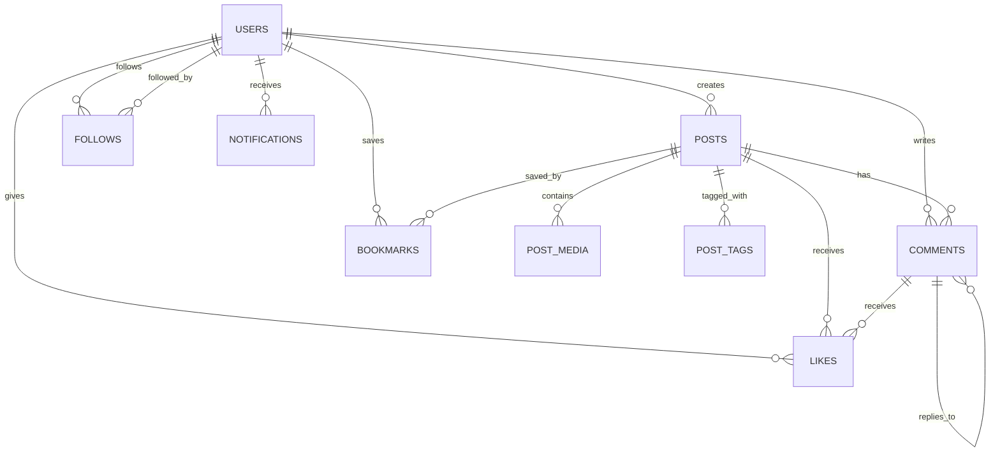

# Social Media Schema Design

Social media schemas look deceptively simple — users, posts, follows. The complexity hides in the feed: how do you efficiently show a user the latest posts from everyone they follow? This page covers the core schema and the critical feed generation strategies.

## Entity Relationship Overview



## Core Tables

### Users & Profiles

```sql
CREATE TABLE users (
    id            BIGINT GENERATED ALWAYS AS IDENTITY PRIMARY KEY,
    username      TEXT NOT NULL UNIQUE,
    email         TEXT NOT NULL UNIQUE,
    password_hash TEXT NOT NULL,
    display_name  TEXT NOT NULL,
    bio           TEXT,
    avatar_url    TEXT,
    cover_url     TEXT,
    website       TEXT,
    location      TEXT,
    is_verified   BOOLEAN DEFAULT FALSE,
    is_private    BOOLEAN DEFAULT FALSE,
    -- Denormalized counters (updated via triggers or app logic)
    follower_count  INT DEFAULT 0,
    following_count INT DEFAULT 0,
    post_count      INT DEFAULT 0,
    created_at    TIMESTAMPTZ DEFAULT NOW(),
    updated_at    TIMESTAMPTZ DEFAULT NOW()
);

CREATE INDEX idx_users_username ON users(username);
CREATE INDEX idx_users_email ON users(email);
```

::: tip Denormalized Counters
Counting followers with `SELECT COUNT(*) FROM follows WHERE following_id = ?` is O(n) and hits the database hard for popular accounts. Storing `follower_count` directly on the user row makes profile loads O(1). Update it atomically:

```sql
UPDATE users SET follower_count = follower_count + 1 WHERE id = $1;
```
:::

### Follows

```sql
CREATE TABLE follows (
    follower_id  BIGINT NOT NULL REFERENCES users(id) ON DELETE CASCADE,
    following_id BIGINT NOT NULL REFERENCES users(id) ON DELETE CASCADE,
    created_at   TIMESTAMPTZ DEFAULT NOW(),

    PRIMARY KEY (follower_id, following_id),
    CHECK (follower_id != following_id)  -- can't follow yourself
);

-- "Who does user X follow?"
CREATE INDEX idx_follows_follower ON follows(follower_id, created_at DESC);

-- "Who follows user X?"
CREATE INDEX idx_follows_following ON follows(following_id, created_at DESC);
```

**Key queries:**

```sql
-- Check if user A follows user B (O(1) with primary key)
SELECT 1 FROM follows WHERE follower_id = $A AND following_id = $B;

-- Get user X's followers (paginated)
SELECT u.id, u.username, u.display_name, u.avatar_url
FROM follows f
JOIN users u ON u.id = f.follower_id
WHERE f.following_id = $X
ORDER BY f.created_at DESC
LIMIT 20 OFFSET 0;

-- Mutual follows (people who follow each other)
SELECT f1.following_id
FROM follows f1
JOIN follows f2
  ON f1.follower_id = f2.following_id
 AND f1.following_id = f2.follower_id
WHERE f1.follower_id = $user_id;
```

### Posts

```sql
CREATE TABLE posts (
    id            BIGINT GENERATED ALWAYS AS IDENTITY PRIMARY KEY,
    author_id     BIGINT NOT NULL REFERENCES users(id) ON DELETE CASCADE,
    content       TEXT NOT NULL CHECK (LENGTH(content) <= 5000),
    post_type     TEXT NOT NULL DEFAULT 'text',  -- 'text', 'image', 'video', 'poll'
    visibility    TEXT NOT NULL DEFAULT 'public', -- 'public', 'followers', 'private'
    parent_id     BIGINT REFERENCES posts(id) ON DELETE SET NULL,  -- for reposts/quotes
    is_repost     BOOLEAN DEFAULT FALSE,
    -- Denormalized counters
    like_count    INT DEFAULT 0,
    comment_count INT DEFAULT 0,
    repost_count  INT DEFAULT 0,
    bookmark_count INT DEFAULT 0,
    created_at    TIMESTAMPTZ DEFAULT NOW(),
    updated_at    TIMESTAMPTZ DEFAULT NOW()
);

CREATE TABLE post_media (
    id         BIGINT GENERATED ALWAYS AS IDENTITY PRIMARY KEY,
    post_id    BIGINT NOT NULL REFERENCES posts(id) ON DELETE CASCADE,
    media_type TEXT NOT NULL,                     -- 'image', 'video', 'gif'
    url        TEXT NOT NULL,
    thumbnail  TEXT,
    width      INT,
    height     INT,
    sort_order INT DEFAULT 0
);

CREATE TABLE post_tags (
    post_id BIGINT NOT NULL REFERENCES posts(id) ON DELETE CASCADE,
    tag     TEXT NOT NULL,
    PRIMARY KEY (post_id, tag)
);

CREATE INDEX idx_posts_author ON posts(author_id, created_at DESC);
CREATE INDEX idx_posts_created ON posts(created_at DESC);
CREATE INDEX idx_posts_parent ON posts(parent_id) WHERE parent_id IS NOT NULL;
CREATE INDEX idx_post_media_post ON post_media(post_id);
CREATE INDEX idx_post_tags_tag ON post_tags(tag);
```

### Likes

```sql
CREATE TABLE likes (
    user_id      BIGINT NOT NULL REFERENCES users(id) ON DELETE CASCADE,
    target_type  TEXT NOT NULL,     -- 'post' or 'comment'
    target_id    BIGINT NOT NULL,
    created_at   TIMESTAMPTZ DEFAULT NOW(),

    PRIMARY KEY (user_id, target_type, target_id)
);

-- "Has user X liked this post?"
-- Covered by primary key

-- "All likes on a post" (for notification fan-out)
CREATE INDEX idx_likes_target ON likes(target_type, target_id, created_at DESC);
```

::: warning Polymorphic Foreign Keys
`target_id` references either `posts.id` or `comments.id` depending on `target_type`. PostgreSQL cannot enforce this with a regular FK. Options:

1. **Two separate tables** (`post_likes`, `comment_likes`) — cleaner, FK-safe
2. **Application-level enforcement** — simpler schema, no DB-level FK
3. **Trigger-based validation** — custom trigger checks target exists

For most social media apps, option 1 is recommended for data integrity.
:::

### Comments

```sql
CREATE TABLE comments (
    id         BIGINT GENERATED ALWAYS AS IDENTITY PRIMARY KEY,
    post_id    BIGINT NOT NULL REFERENCES posts(id) ON DELETE CASCADE,
    author_id  BIGINT NOT NULL REFERENCES users(id) ON DELETE CASCADE,
    parent_id  BIGINT REFERENCES comments(id) ON DELETE CASCADE,  -- threaded replies
    content    TEXT NOT NULL CHECK (LENGTH(content) <= 2000),
    like_count INT DEFAULT 0,
    depth      INT NOT NULL DEFAULT 0,    -- nesting level (0 = top-level)
    created_at TIMESTAMPTZ DEFAULT NOW(),
    updated_at TIMESTAMPTZ DEFAULT NOW()
);

CREATE INDEX idx_comments_post ON comments(post_id, created_at);
CREATE INDEX idx_comments_parent ON comments(parent_id) WHERE parent_id IS NOT NULL;
CREATE INDEX idx_comments_author ON comments(author_id, created_at DESC);
```

**Threaded comments query:**

```sql
-- Get all comments for a post, threaded
WITH RECURSIVE thread AS (
    SELECT id, author_id, parent_id, content, depth, created_at
    FROM comments
    WHERE post_id = $1 AND parent_id IS NULL
    ORDER BY created_at

    UNION ALL

    SELECT c.id, c.author_id, c.parent_id, c.content, c.depth, c.created_at
    FROM comments c
    JOIN thread t ON c.parent_id = t.id
)
SELECT
    t.*,
    u.username,
    u.avatar_url
FROM thread t
JOIN users u ON u.id = t.author_id
ORDER BY t.depth, t.created_at;
```

### Notifications

```sql
CREATE TYPE notification_type AS ENUM (
    'like', 'comment', 'follow', 'mention', 'repost'
);

CREATE TABLE notifications (
    id          BIGINT GENERATED ALWAYS AS IDENTITY PRIMARY KEY,
    user_id     BIGINT NOT NULL REFERENCES users(id) ON DELETE CASCADE,  -- recipient
    actor_id    BIGINT NOT NULL REFERENCES users(id) ON DELETE CASCADE,  -- who did it
    type        notification_type NOT NULL,
    target_type TEXT,              -- 'post', 'comment'
    target_id   BIGINT,
    is_read     BOOLEAN DEFAULT FALSE,
    created_at  TIMESTAMPTZ DEFAULT NOW()
);

CREATE INDEX idx_notifications_user ON notifications(user_id, created_at DESC);
CREATE INDEX idx_notifications_unread ON notifications(user_id)
    WHERE NOT is_read;
```

### Bookmarks

```sql
CREATE TABLE bookmarks (
    user_id    BIGINT NOT NULL REFERENCES users(id) ON DELETE CASCADE,
    post_id    BIGINT NOT NULL REFERENCES posts(id) ON DELETE CASCADE,
    created_at TIMESTAMPTZ DEFAULT NOW(),

    PRIMARY KEY (user_id, post_id)
);

CREATE INDEX idx_bookmarks_user ON bookmarks(user_id, created_at DESC);
```

## Feed Generation

The feed is the hardest part of a social media schema. There are two main strategies:

### Strategy 1: Fan-Out on Read (Pull Model)

When a user opens their feed, query posts from everyone they follow in real-time.

```sql
-- Pull feed: query at read time
SELECT p.*, u.username, u.avatar_url
FROM posts p
JOIN follows f ON f.following_id = p.author_id
JOIN users u ON u.id = p.author_id
WHERE f.follower_id = $current_user
  AND p.visibility IN ('public', 'followers')
ORDER BY p.created_at DESC
LIMIT 20;
```

| Pros | Cons |
|------|------|
| Simple schema | Slow for users following 1000+ accounts |
| Always fresh | Requires joining follows + posts tables |
| No write amplification | Hard to rank/personalize |

### Strategy 2: Fan-Out on Write (Push Model)

When a user publishes a post, write it to every follower's feed table.

```sql
CREATE TABLE feed_items (
    user_id    BIGINT NOT NULL REFERENCES users(id) ON DELETE CASCADE,
    post_id    BIGINT NOT NULL REFERENCES posts(id) ON DELETE CASCADE,
    author_id  BIGINT NOT NULL,
    created_at TIMESTAMPTZ NOT NULL,

    PRIMARY KEY (user_id, post_id)
);

CREATE INDEX idx_feed_user ON feed_items(user_id, created_at DESC);
```

```sql
-- On new post: fan out to all followers
INSERT INTO feed_items (user_id, post_id, author_id, created_at)
SELECT f.follower_id, $post_id, $author_id, NOW()
FROM follows f
WHERE f.following_id = $author_id;

-- Read feed: simple index scan
SELECT fi.post_id, p.content, u.username, u.avatar_url
FROM feed_items fi
JOIN posts p ON p.id = fi.post_id
JOIN users u ON u.id = fi.author_id
WHERE fi.user_id = $current_user
ORDER BY fi.created_at DESC
LIMIT 20;
```

| Pros | Cons |
|------|------|
| Fast reads (single index scan) | Write amplification: celebrity with 10M followers = 10M rows per post |
| Easy to personalize/rank | Storage-intensive |
| Predictable performance | Delayed delivery for large fan-outs |

### Strategy 3: Hybrid (Production Standard)

- **Regular users** (<10K followers): Fan-out on write (push)
- **Celebrities** (>10K followers): Fan-out on read (pull)
- At read time, merge the user's feed table with real-time queries for celebrity accounts they follow

```sql
-- Hybrid feed query
WITH celebrity_posts AS (
    SELECT p.id AS post_id, p.author_id, p.created_at
    FROM posts p
    WHERE p.author_id = ANY($celebrity_ids_followed)
      AND p.created_at > NOW() - INTERVAL '7 days'
),
regular_feed AS (
    SELECT post_id, author_id, created_at
    FROM feed_items
    WHERE user_id = $current_user
      AND created_at > NOW() - INTERVAL '7 days'
)
SELECT * FROM (
    SELECT * FROM celebrity_posts
    UNION ALL
    SELECT * FROM regular_feed
) combined
ORDER BY created_at DESC
LIMIT 20;
```

## Performance Considerations

| Concern | Solution |
|---------|---------|
| Feed query speed | Keyset pagination: `WHERE created_at < $cursor ORDER BY created_at DESC LIMIT 20` |
| Counter accuracy | Use `UPDATE ... SET like_count = like_count + 1` (atomic increment) |
| Counter drift | Periodic reconciliation job: `UPDATE posts SET like_count = (SELECT COUNT(*) FROM likes WHERE ...)` |
| Hashtag search | GIN index on `post_tags.tag` or full-text search |
| Mention extraction | Parse `@username` in application layer, store in `mentions` table, trigger notification |
| Hot posts (viral) | Cache hot post data in Redis; database only for persistence |
| Follower list for celebrity | Pre-compute in Redis sorted set; fan-out via background workers |

## Schema Design Decisions

| Decision | Rationale |
|----------|----------|
| Denormalized counters on posts/users | `COUNT(*)` over millions of likes is too slow for real-time display |
| Composite PK on follows | Natural compound key; prevents duplicate follows at DB level |
| Separate media table | Posts can have 0-N media items; avoids array columns |
| `depth` on comments | Allows limiting nesting (e.g., max depth 3) without recursive query |
| `visibility` on posts | Supports public, followers-only, and private posts |
| `notification_type` as ENUM | Finite set of notification types; enforced at DB level |
| `is_read` index partial | Only unread notifications are queried frequently; partial index is smaller |
| JSONB avoided for core entities | Structured data deserves structured columns for indexing and validation |
