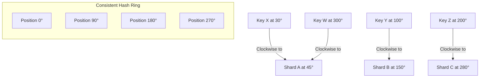
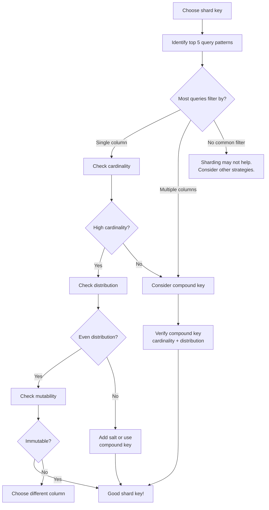
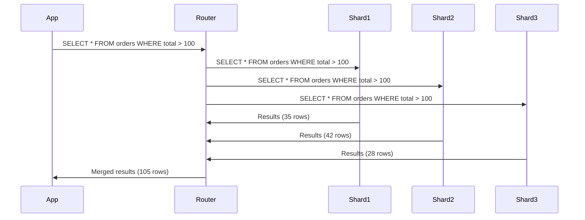
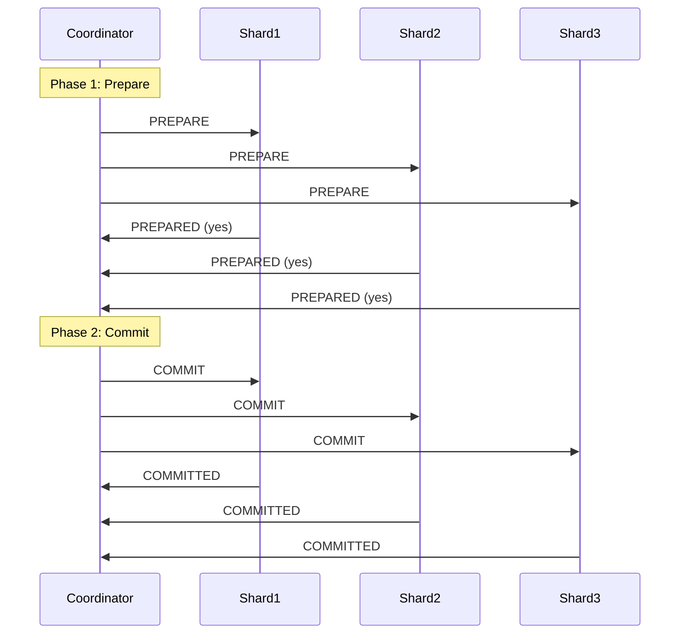
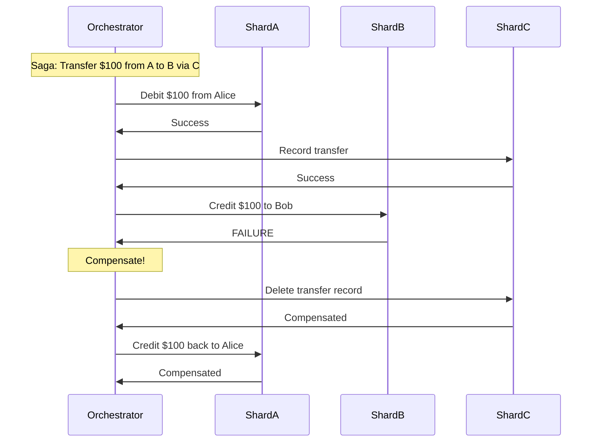
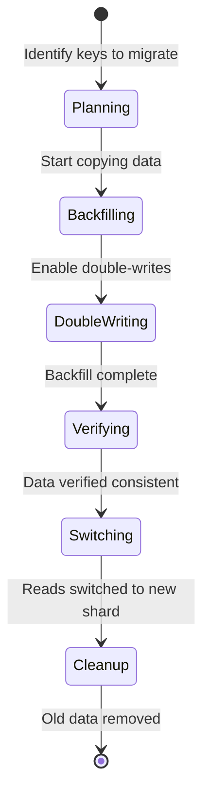
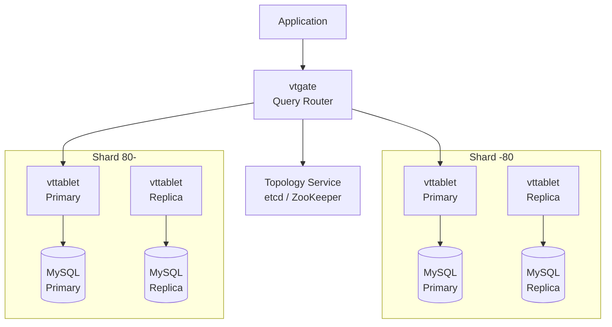
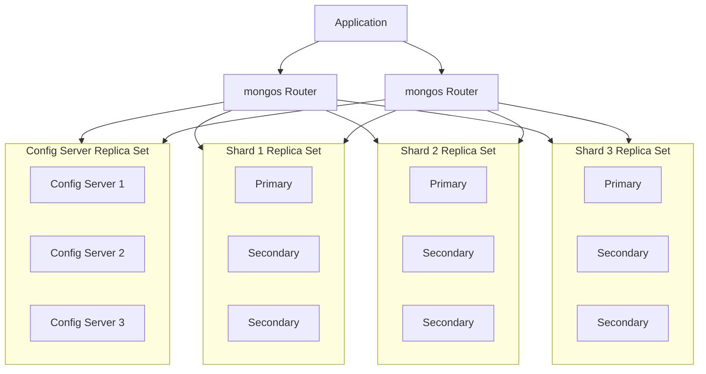
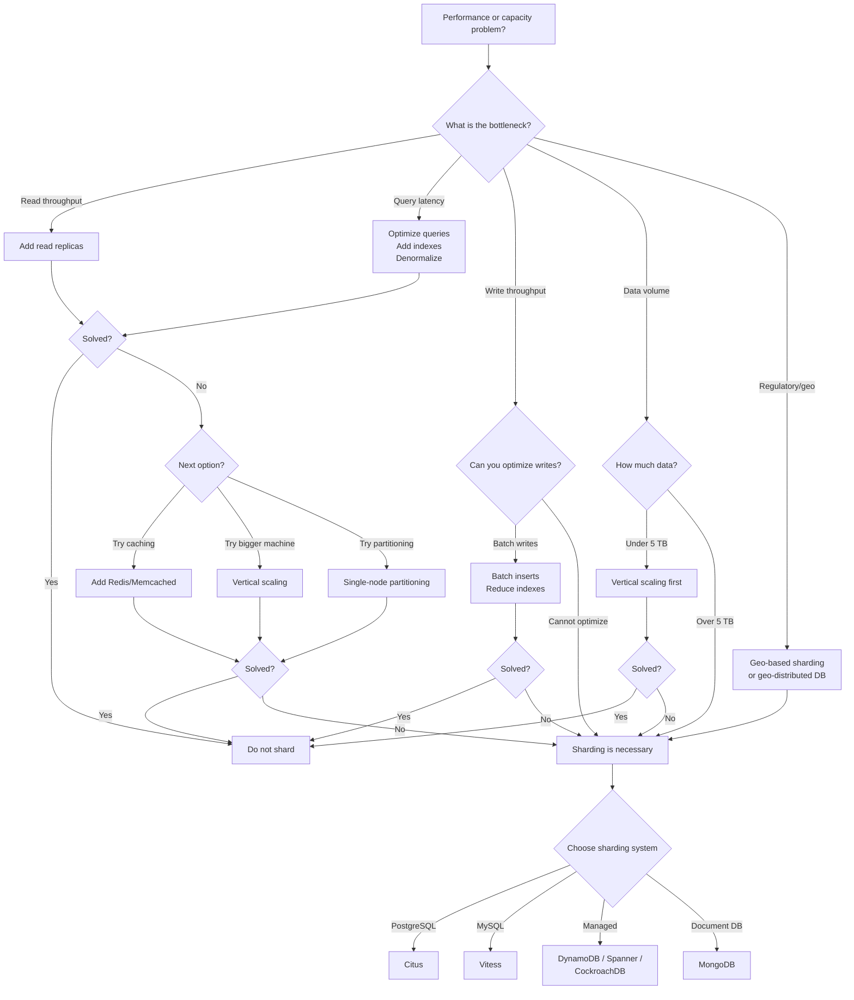

# Sharding

Sharding is the practice of splitting a database into multiple smaller databases, each holding a subset of the data. Each piece is called a shard (or partition). Unlike replication, where every node has a complete copy, sharding distributes data so that each shard holds only a fraction. The total dataset is the union of all shards.

Sharding is the last resort for database scaling. It introduces enormous complexity in application code, operational procedures, and failure modes. Every other scaling technique — read replicas, caching, query optimization, denormalization, vertical scaling — should be exhausted first. But when a single node cannot handle the write throughput or the data volume, sharding is the only path forward.

## Why Shard

### When Vertical Scaling Is No Longer Sufficient

Vertical scaling — buying a bigger machine — has limits. As of 2026, the largest commercially available single servers have around 24 TB of RAM and 448 CPU cores. This is enormous, but some datasets exceed it. More importantly, the cost curve is superlinear: a machine with 2x the capacity costs significantly more than 2x the price. At some point, it is cheaper to use multiple commodity machines.

There is also a practical limit. A single PostgreSQL instance can handle roughly 10-50 TB of data before vacuum, backup, and recovery times become unmanageable. A single MySQL instance tops out around 2-5 TB for comfortable operation. These are not hard limits — they are points where operational pain exceeds tolerance.

### When Single-Node Write Throughput Is the Bottleneck

Read replicas solve read scaling but do nothing for writes. All writes still go to a single primary. If your application writes 50,000 rows per second and the primary can handle 30,000, no number of read replicas will help.

Sharding splits writes across multiple primaries. Each shard handles writes for its subset of data. If you have 5 shards, the aggregate write throughput is (roughly) 5x a single node.

### When Data Volume Exceeds Single-Node Capacity

If your dataset is 100 TB and your largest available machine has 10 TB of fast storage, you need at least 10 shards. This is the simplest case — pure volume exceeding capacity.

### When Regulatory or Geographic Requirements Mandate Data Locality

Some regulations require data to reside in specific jurisdictions. EU data in EU data centers, Chinese data in Chinese data centers. Geo-based sharding can satisfy these requirements by routing data to shards in the appropriate region.

## Sharding Strategies

### Hash-Based Sharding

Take the shard key, compute a hash, and use modulo (or consistent hashing) to determine which shard holds the data.

```
shard_index = hash(shard_key) % num_shards
```

**Example**: If the shard key is `user_id` and you have 4 shards:

```
hash("user_123") = 2847191034
shard = 2847191034 % 4 = 2  → Shard 2
```

**Advantages**:

- Even distribution: A good hash function (like MurmurHash3 or xxHash) distributes keys uniformly across shards, preventing hot spots.
- No need for a lookup table: The shard for any key can be computed locally.
- Works well for point lookups: Given a key, you know exactly which shard to query.

**Disadvantages**:

- Range queries are impossible: Consecutive keys (e.g., user_100, user_101, user_102) hash to different shards. A query like `WHERE user_id BETWEEN 100 AND 200` must hit all shards.
- Resharding is expensive with naive modulo: If you change `num_shards`, almost every key maps to a different shard. Consistent hashing mitigates this.

#### Consistent Hashing

Instead of simple modulo, consistent hashing maps both keys and shard nodes onto a ring (0 to 2^32 - 1). A key is assigned to the first node encountered when walking clockwise from the key's position on the ring.

When a node is added or removed, only the keys between the new/removed node and its predecessor are affected. Instead of rehashing everything, only ~1/N of the keys move. This is the foundation of Amazon's DynamoDB, Apache Cassandra, and many other distributed systems.



To prevent uneven distribution (when nodes are not evenly spaced), each physical node is represented by multiple virtual nodes (vnodes) at different positions on the ring. Cassandra uses 256 vnodes per physical node by default.

### Range-Based Sharding

Assign contiguous ranges of the shard key to each shard.

**Example — partition by date**:

| Shard | Range |
|---|---|
| Shard 0 | 2024-01-01 to 2024-06-30 |
| Shard 1 | 2024-07-01 to 2024-12-31 |
| Shard 2 | 2025-01-01 to 2025-06-30 |
| Shard 3 | 2025-07-01 to 2025-12-31 |

**Example — partition by region**:

| Shard | Range |
|---|---|
| Shard US | Customers in United States |
| Shard EU | Customers in European Union |
| Shard APAC | Customers in Asia-Pacific |

**Advantages**:

- Range queries are efficient: `WHERE order_date BETWEEN '2025-01-01' AND '2025-03-31'` hits only Shard 2.
- Natural data aging: Old shards can be archived or moved to cheaper storage.
- Human-readable: An operator can reason about which shard holds what data.

**Disadvantages**:

- Hot spots: If the shard key is monotonically increasing (like a timestamp), all writes go to the last shard. This is the most common pitfall of range-based sharding.
- Uneven distribution: Some ranges may have far more data than others (the US shard might be 10x larger than the APAC shard).
- Manual rebalancing: When a shard gets too large, you must split it. This requires choosing a new range boundary and migrating data.

### Directory-Based Sharding

A lookup table (the directory) maps each key (or key range) to a shard. Every query first consults the directory to determine which shard to query.

```
Directory Table:
  key_range [0, 1000)     → Shard A
  key_range [1000, 5000)  → Shard B
  key_range [5000, 10000) → Shard C
  key_range [10000, ∞)    → Shard D
```

**Advantages**:

- Maximum flexibility: Any key can be assigned to any shard. Resharding is a matter of updating the directory.
- Supports arbitrary strategies: The directory can encode hash-based, range-based, or custom assignments.

**Disadvantages**:

- The directory is a single point of failure: If the directory is unavailable, no shard can be located.
- The directory is a bottleneck: Every query requires a directory lookup. This must be fast (in-memory, cached) or it adds latency to every operation.
- Consistency: The directory must be updated atomically with data migrations. If the directory says "key X is on Shard B" but the data has not yet been migrated from Shard A, the query returns nothing.

### Geo-Based Sharding

A special case of directory-based or range-based sharding where the shard key is geographic location. Data is routed to the shard nearest to its geographic origin.

This is used when:

- Regulations require data residency (GDPR, China's data localization laws)
- Low-latency access is critical and users are geographically distributed
- Different regions have different data sovereignty requirements

CockroachDB supports geo-partitioned leaseholders, where the leaseholder (the replica that serves reads) for a row is pinned to the region closest to that row's data. Spanner supports similar placement constraints.

## Shard Key Selection

The shard key is the single most important decision in a sharded system. A bad shard key choice can make the system worse than an unsharded database. This decision is very difficult to change after the fact.

### Criteria for a Good Shard Key

**High cardinality**: The shard key should have many distinct values. If the shard key is `country` and you have 5 shards but 80% of users are in the US, one shard does all the work. If the shard key is `user_id` and you have millions of users, the load distributes evenly.

**Even distribution**: Not just many values, but values that are roughly equally common. If the shard key is `customer_id` but one customer generates 50% of all rows, that customer's shard is overwhelmed.

**Query alignment**: The shard key should match your most common query patterns. If 90% of your queries include a `WHERE user_id = ?` clause, `user_id` is a good shard key because each query hits exactly one shard. If your queries are `WHERE order_date > ?`, sharding by `user_id` means every query must scatter to all shards.

**Immutability**: The shard key should not change. If a row's shard key changes, the row must be moved from one shard to another. This is expensive and complex. `user_id` is stable. `status` is not (it changes from `pending` to `completed`).

**Compound keys**: Sometimes no single column satisfies all criteria. A compound shard key like `(tenant_id, user_id)` or `(region, customer_id)` can balance distribution and query alignment.

### The Decision Process



### Examples

**E-commerce platform**: Shard key = `customer_id`. Most queries are "show me my orders," "show me my cart," "show me my profile." All of these filter by `customer_id`. High cardinality (millions of customers), even distribution (no single customer dominates), immutable.

**Multi-tenant SaaS**: Shard key = `tenant_id`. All queries are scoped to a single tenant. Cardinality depends on number of tenants. Distribution can be uneven (one large enterprise tenant might have 100x the data of a small team). Solution: put the largest tenants on dedicated shards.

**Time-series data**: Shard key = `sensor_id` (not `timestamp`). Sharding by timestamp creates a hot shard (all current writes go to one shard). Sharding by `sensor_id` distributes writes across shards. Time-range queries are cross-shard, but this is usually acceptable.

**Social media**: Shard key = `user_id`. User timelines, friend lists, and posts are all per-user. But celebrity users (millions of followers) cause hot shards. Solution: fan-out on write (precompute timelines) rather than fan-out on read, or shard the fan-out itself.

## Hot Shard Problem

A hot shard is a shard that receives disproportionately more traffic than others. It is the most common problem in sharded systems and, if unaddressed, negates the benefits of sharding entirely.

### What Causes Hot Shards

**Skewed key distribution**: Some keys are far more popular than others. A social media platform sharded by `user_id` will have shards for celebrity users handling orders of magnitude more traffic.

**Temporal patterns**: An e-commerce platform sharded by `product_id` will see all Black Friday traffic hit the shards containing the discounted products.

**Monotonic keys**: Sharding by an auto-incrementing ID with range-based sharding puts all new writes on the last shard. Sharding by timestamp has the same problem.

**Correlated access**: If a viral event causes millions of users to access the same data simultaneously, the shard holding that data becomes hot regardless of how well the keys are normally distributed.

### Detection

Monitor per-shard metrics:

- **CPU utilization per shard**: If one shard's CPU is at 90% while others are at 20%, it is hot.
- **Queries per second per shard**: Uneven QPS indicates skew.
- **Disk I/O per shard**: A shard with significantly more disk I/O is handling more data.
- **Response latency per shard**: Hot shards respond slower.
- **Connection count per shard**: More connections indicate more traffic.

```sql
-- PostgreSQL: identify heavy tables/queries per shard
SELECT
    schemaname,
    relname,
    seq_scan,
    seq_tup_read,
    idx_scan,
    idx_tup_fetch,
    n_tup_ins,
    n_tup_upd,
    n_tup_del
FROM pg_stat_user_tables
ORDER BY (n_tup_ins + n_tup_upd + n_tup_del) DESC
LIMIT 20;
```

### Mitigation

**Shard splitting**: Split the hot shard into two or more smaller shards. This requires data migration and updating the routing layer. Vitess automates this.

**Salting**: Add a random or deterministic prefix to the shard key to distribute a single logical key across multiple shards. For example, instead of sharding by `user_id`, shard by `hash(user_id) % 4 + ":" + user_id`. Reads for a single user must now check 4 shards, but writes are spread.

```typescript
class SaltedShardRouter {
  private readonly saltFactor: number;
  private readonly numShards: number;

  constructor(numShards: number, saltFactor: number = 4) {
    this.numShards = numShards;
    this.saltFactor = saltFactor;
  }

  getWriteShard(key: string): number {
    // Add a random salt to spread writes
    const salt = Math.floor(Math.random() * this.saltFactor);
    const saltedKey = `${salt}:${key}`;
    return this.hash(saltedKey) % this.numShards;
  }

  getReadShards(key: string): number[] {
    // Must read from all possible salt values
    const shards = new Set<number>();
    for (let salt = 0; salt < this.saltFactor; salt++) {
      const saltedKey = `${salt}:${key}`;
      shards.add(this.hash(saltedKey) % this.numShards);
    }
    return [...shards];
  }

  private hash(input: string): number {
    let hash = 0;
    for (let i = 0; i < input.length; i++) {
      const char = input.charCodeAt(i);
      hash = ((hash << 5) - hash) + char;
      hash = hash & hash;
    }
    return Math.abs(hash);
  }
}
```

**Application-level caching**: Cache the hot data in front of the shard. If a celebrity's profile is read 10,000 times per second, cache it in Redis or Memcached. The shard only handles cache misses.

**Dedicated shards**: Move the hot key to its own dedicated shard (or even its own dedicated server). This is manual and operational, but effective for known hot keys.

## Cross-Shard Queries

The biggest operational challenge of sharding: queries that need data from multiple shards.

### Scatter-Gather

When a query cannot be routed to a single shard (because it does not include the shard key in the WHERE clause), the routing layer sends the query to all shards and aggregates the results.



Scatter-gather is expensive:

- **Latency**: The response time is the maximum of all shard response times (the slowest shard determines overall latency).
- **Load**: Every shard processes the query, even if most results come from one shard.
- **Complexity**: Aggregations (COUNT, SUM, AVG), sorting (ORDER BY), and pagination (LIMIT/OFFSET) must be applied globally after gathering results from all shards. This is non-trivial. For example, `LIMIT 10` cannot be pushed down to individual shards — each shard must return its top 10, and the router selects the global top 10 from the combined results.

### The Routing Layer

The routing layer sits between the application and the shards. It parses queries, determines which shard(s) to route to, and aggregates results.

Implementations:

- **Application-side routing**: The application computes the shard for each query. Simple but couples sharding logic into application code.
- **Proxy routing**: A middleware proxy (like Vitess's vtgate, ProxySQL, or pgcat) handles routing transparently. The application thinks it is talking to a single database.
- **Library routing**: A database driver library handles routing. The application uses a special connection that routes internally. Citus's distributed query planner works this way.

### The Problem with JOINs

JOINs across shards are the hardest problem in sharding. If `orders` is sharded by `customer_id` and `products` is sharded by `product_id`, a JOIN between them requires data from different shards.

```sql
-- This query is a nightmare in a sharded system
SELECT o.order_id, c.name, p.product_name
FROM orders o
JOIN customers c ON o.customer_id = c.customer_id
JOIN products p ON o.product_id = p.product_id
WHERE o.order_date > '2025-01-01';
```

Strategies for cross-shard JOINs:

**Co-location**: Ensure that tables frequently JOINed together are sharded by the same key. If `orders` and `customers` are both sharded by `customer_id`, JOINs between them stay within a single shard. This is the most important sharding strategy: design your shard key to keep related data together.

**Reference tables**: Small, frequently-joined tables (like `countries`, `currencies`, `product_categories`) are replicated in full on every shard. JOINs with reference tables are always local. Citus and Vitess both support reference tables.

**Denormalization**: Instead of JOINing `orders` with `customers` to get the customer name, store the customer name directly on the `orders` table. This duplicates data but eliminates the cross-shard JOIN. Update the denormalized copy when the source changes (eventual consistency).

**Application-level joins**: Fetch data from each shard separately and join in application code. This is slow and complex but sometimes the only option.

```typescript
// Application-level join across shards
async function getOrderWithDetails(orderId: string, customerId: string): Promise<OrderDetails> {
  // Determine shards
  const orderShard = shardRouter.getShard('orders', customerId);
  const productShard = shardRouter.getShard('products', /* need product_id */);

  // Step 1: Get the order (we know the shard from customerId)
  const order = await orderShard.query(
    'SELECT * FROM orders WHERE order_id = $1',
    [orderId]
  );

  // Step 2: Get the product (need to know which shard)
  // If we don't know the product shard, scatter to all shards
  const product = await scatterQuery(
    'SELECT * FROM products WHERE product_id = $1',
    [order.rows[0].product_id]
  );

  // Step 3: Join in application code
  return {
    orderId: order.rows[0].order_id,
    customerName: order.rows[0].customer_name, // denormalized
    productName: product.rows[0].product_name,
    total: order.rows[0].total,
  };
}
```

## Cross-Shard Transactions

Maintaining ACID transactions across shards is one of the hardest problems in distributed systems.

### Two-Phase Commit (2PC) Overhead

2PC ensures that a transaction either commits on all shards or aborts on all shards.



2PC problems:

- **Latency**: Two network round trips minimum. If shards are in different data centers, this is very slow.
- **Blocking**: If the coordinator crashes after sending PREPARE but before sending COMMIT, all participating shards are stuck holding locks, waiting for a decision that never comes. This can block the entire shard.
- **Coordinator is a single point of failure**: If the coordinator is down, in-doubt transactions cannot be resolved.
- **Lock contention**: Shards hold locks during both phases. The longer the transaction, the more contention.

PostgreSQL supports 2PC via `PREPARE TRANSACTION` and `COMMIT PREPARED`, but it is intended for rare cases, not high-throughput cross-shard transactions.

### Eventual Consistency Patterns

Instead of requiring immediate cross-shard consistency, accept that shards may be temporarily inconsistent and converge over time.

**Outbox pattern**: Instead of writing to two shards atomically, write to the local shard and an outbox table in the same local transaction. A background process reads the outbox and applies changes to other shards.

```sql
-- Transaction on Shard A
BEGIN;
UPDATE accounts SET balance = balance - 100 WHERE account_id = 'alice';
INSERT INTO outbox (event_type, payload, processed)
  VALUES ('transfer', '{"from": "alice", "to": "bob", "amount": 100}', false);
COMMIT;

-- Background process reads the outbox and applies to Shard B
BEGIN;
UPDATE accounts SET balance = balance + 100 WHERE account_id = 'bob';
COMMIT;

-- Mark outbox entry as processed on Shard A
UPDATE outbox SET processed = true WHERE id = ?;
```

### Saga Pattern for Cross-Shard Operations

A saga is a sequence of local transactions, each on a single shard, with compensating transactions to undo previous steps if a later step fails.



Saga trade-offs:

- **No isolation**: During the saga, intermediate states are visible. After debiting Alice but before crediting Bob, the total money in the system is inconsistent.
- **Compensating transactions are hard to write**: Not every operation has a clean undo. If step 2 sends an email, you cannot unsend it.
- **Ordering matters**: Compensating transactions must be applied in reverse order.
- **Idempotency required**: Each step and compensation must be idempotent because retries are inevitable.

```typescript
interface SagaStep<T> {
  name: string;
  execute: (context: T) => Promise<void>;
  compensate: (context: T) => Promise<void>;
}

class SagaOrchestrator<T> {
  private steps: SagaStep<T>[] = [];
  private completedSteps: SagaStep<T>[] = [];

  addStep(step: SagaStep<T>): this {
    this.steps.push(step);
    return this;
  }

  async execute(context: T): Promise<{ success: boolean; error?: Error }> {
    this.completedSteps = [];

    for (const step of this.steps) {
      try {
        console.log(`Executing step: ${step.name}`);
        await step.execute(context);
        this.completedSteps.push(step);
      } catch (error) {
        console.error(`Step "${step.name}" failed:`, error);
        await this.compensate(context);
        return {
          success: false,
          error: error instanceof Error ? error : new Error(String(error)),
        };
      }
    }

    return { success: true };
  }

  private async compensate(context: T): Promise<void> {
    // Compensate in reverse order
    for (let i = this.completedSteps.length - 1; i >= 0; i--) {
      const step = this.completedSteps[i];
      try {
        console.log(`Compensating step: ${step.name}`);
        await step.compensate(context);
      } catch (error) {
        // Compensation failure is serious — log and alert
        console.error(`CRITICAL: Compensation for "${step.name}" failed:`, error);
        // In production, this should trigger an alert and manual intervention
      }
    }
  }
}

// Example usage: cross-shard money transfer
interface TransferContext {
  fromAccount: string;
  toAccount: string;
  amount: number;
  transferId: string;
}

const transferSaga = new SagaOrchestrator<TransferContext>()
  .addStep({
    name: 'debit-source',
    execute: async (ctx) => {
      const shard = getShardForAccount(ctx.fromAccount);
      await shard.query(
        'UPDATE accounts SET balance = balance - $1 WHERE account_id = $2 AND balance >= $1',
        [ctx.amount, ctx.fromAccount]
      );
    },
    compensate: async (ctx) => {
      const shard = getShardForAccount(ctx.fromAccount);
      await shard.query(
        'UPDATE accounts SET balance = balance + $1 WHERE account_id = $2',
        [ctx.amount, ctx.fromAccount]
      );
    },
  })
  .addStep({
    name: 'credit-destination',
    execute: async (ctx) => {
      const shard = getShardForAccount(ctx.toAccount);
      await shard.query(
        'UPDATE accounts SET balance = balance + $1 WHERE account_id = $2',
        [ctx.amount, ctx.toAccount]
      );
    },
    compensate: async (ctx) => {
      const shard = getShardForAccount(ctx.toAccount);
      await shard.query(
        'UPDATE accounts SET balance = balance - $1 WHERE account_id = $2',
        [ctx.amount, ctx.toAccount]
      );
    },
  })
  .addStep({
    name: 'record-transfer',
    execute: async (ctx) => {
      const shard = getShardForAccount(ctx.fromAccount);
      await shard.query(
        'INSERT INTO transfers (id, from_account, to_account, amount, status) VALUES ($1, $2, $3, $4, $5)',
        [ctx.transferId, ctx.fromAccount, ctx.toAccount, ctx.amount, 'completed']
      );
    },
    compensate: async (ctx) => {
      const shard = getShardForAccount(ctx.fromAccount);
      await shard.query(
        'UPDATE transfers SET status = $1 WHERE id = $2',
        ['rolled_back', ctx.transferId]
      );
    },
  });
```

## Resharding

Resharding is the process of changing the number of shards or the assignment of data to shards. It is one of the most operationally complex procedures in a sharded system.

### Why Resharding Is Necessary

- A shard runs out of disk space.
- A shard becomes a hot spot.
- The overall dataset has grown and more shards are needed.
- A shard's hardware is being decommissioned.
- You need to rebalance after a shard failure.

### Adding Shards Without Downtime

The naive approach — change `num_shards` and rehash everything — requires migrating most of the data. With modular hashing (`hash % N`), changing N from 4 to 5 moves approximately 80% of keys. This is unacceptable for a production system.

**Consistent hashing for minimal data movement**: With consistent hashing, adding a shard moves only ~1/N of the data (the keys between the new shard's position and its predecessor on the ring). This is the theoretical minimum.

**Double-write migration**:

1. Add the new shard to the ring but mark it as "receiving."
2. Start copying historical data from old shards to the new shard (backfill).
3. During backfill, new writes go to both the old shard and the new shard (double-write).
4. Once backfill is complete, verify consistency.
5. Switch reads for the migrated key range to the new shard.
6. Stop writing to the old shard for migrated keys.
7. Clean up migrated data from old shards.



### Virtual Shards (Vitess Approach)

Instead of mapping data directly to physical shards, Vitess maps data to virtual shards (called "keyspace IDs"). Each virtual shard is a range of the key space. Physical shards host one or more virtual shards.

Resharding in Vitess means moving virtual shards between physical shards, or splitting/merging virtual shard ranges. Since virtual shards are a logical concept, the mapping between virtual and physical can change without rehashing.

For example, to split a shard that handles key range `[0x00, 0x80)`:

1. Create two new shards for ranges `[0x00, 0x40)` and `[0x40, 0x80)`.
2. VReplication (Vitess's replication engine) streams data from the old shard to the new shards, filtering by key range.
3. Once caught up, cut over: the old shard stops serving, the new shards start.

This process is online — the database serves reads and writes throughout.

## Vitess

Vitess is the sharding middleware that YouTube built to scale MySQL. It is now a CNCF graduated project and is used by Slack, Square, GitHub, HubSpot, and many others.

### Architecture



**vtgate**: The query router. Applications connect to vtgate as if it were a MySQL server. vtgate parses SQL, determines which shard(s) to route to, sends queries, and aggregates results. It is stateless and can be horizontally scaled.

**vttablet**: A sidecar process that runs alongside each MySQL instance. It handles connection pooling, query rewriting, query planning, and serves as the interface between vtgate and MySQL. vttablet also enforces schema changes and manages replication.

**Topology service**: Stores the mapping of keyspaces to shards to tablets. Uses etcd, ZooKeeper, or Consul. vtgate consults the topology to determine routing.

### Resharding Workflow

Vitess's resharding is a multi-step, online process:

1. **Create target shards**: Set up new MySQL instances with vttablets for the target shard ranges.
2. **Start VReplication**: VReplication streams data from source to target shards, applying the new shard key ranges as filters.
3. **Catch up**: VReplication continues until the target shards are caught up with the source shards (sub-second lag).
4. **Cut over**: A brief (sub-second) pause in writes while Vitess switches traffic from old shards to new shards.
5. **Cleanup**: Remove old shard data and vttablets.

Vitess handles the complexity of resharding — including schema consistency, data verification, and traffic management — that would take months to build from scratch.

## Citus

Citus is a PostgreSQL extension (now part of Microsoft Azure) that turns PostgreSQL into a distributed database. Unlike Vitess, which sits in front of MySQL, Citus extends PostgreSQL from within.

### Core Concepts

**Distributed tables**: Tables that are sharded across worker nodes. The shard key determines which worker holds each row.

```sql
-- Create a distributed table
CREATE TABLE orders (
    order_id bigint,
    customer_id bigint,
    product_id bigint,
    total numeric,
    created_at timestamptz
);

SELECT create_distributed_table('orders', 'customer_id');
```

**Reference tables**: Small tables replicated in full on every worker. JOINs with reference tables are always local.

```sql
-- Create a reference table
CREATE TABLE products (
    product_id bigint PRIMARY KEY,
    name text,
    price numeric
);

SELECT create_reference_table('products');
```

**Co-location**: Tables sharded by the same key are co-located — rows with the same shard key value are on the same worker. This makes JOINs between co-located tables local.

```sql
-- Co-locate customers and orders on the same worker
SELECT create_distributed_table('customers', 'customer_id');
SELECT create_distributed_table('orders', 'customer_id', colocate_with => 'customers');
```

Now a JOIN between `orders` and `customers` on `customer_id` is executed locally on each worker, with no cross-shard traffic.

### Distributed Query Planner

Citus intercepts SQL queries and rewrites them into distributed execution plans. Simple queries (filtering by shard key) are routed to a single worker. Complex queries (no shard key filter, or cross-shard JOINs) are executed as scatter-gather operations.

```sql
-- Routed to a single worker (shard key in WHERE clause)
SELECT * FROM orders WHERE customer_id = 42;

-- Scatter-gather (no shard key filter)
SELECT COUNT(*) FROM orders WHERE total > 100;

-- Local join (co-located tables, join on shard key)
SELECT o.order_id, c.name
FROM orders o JOIN customers c ON o.customer_id = c.customer_id
WHERE o.customer_id = 42;

-- Cross-shard join (different shard keys) — expensive!
SELECT o.order_id, p.name
FROM orders o JOIN products p ON o.product_id = p.product_id
WHERE o.total > 100;
-- Citus handles this by broadcasting the smaller table or using repartition joins
```

### Rebalancing

Citus supports online shard rebalancing:

```sql
-- Check shard balance
SELECT * FROM citus_shard_sizes();

-- Rebalance shards across workers
SELECT citus_rebalance_start();

-- Monitor rebalancing progress
SELECT * FROM citus_rebalance_status();
```

## MongoDB Sharding

MongoDB has built-in sharding as a first-class feature. It is one of the most widely deployed sharded database systems.

### Architecture



**mongos**: The query router. Stateless, multiple instances for high availability. Clients connect to mongos as if it were a regular MongoDB instance.

**Config servers**: A replica set that stores the cluster metadata — which chunks are on which shards, the shard key for each collection, chunk ranges. The config server replica set uses the standard MongoDB replication protocol.

**Shards**: Each shard is a replica set (primary + secondaries). The shard holds a subset of the data, organized into chunks.

### Shard Key Selection in MongoDB

MongoDB supports two sharding strategies:

**Hashed sharding**: Hashes the shard key value. Even distribution but no range queries on the shard key.

```javascript
sh.shardCollection("mydb.orders", { customer_id: "hashed" });
```

**Ranged sharding**: Uses the shard key value directly. Supports range queries but can create hot spots with monotonic keys.

```javascript
sh.shardCollection("mydb.events", { timestamp: 1, device_id: 1 });
```

MongoDB 5.0+ supports resharding — changing the shard key of an existing collection without downtime. This was a massive operational limitation in earlier versions.

### Chunk Migration and the Balancer

MongoDB divides each sharded collection into chunks (default 128 MB). The balancer is a background process that monitors chunk distribution across shards and migrates chunks to maintain balance.

Migration process:

1. The balancer identifies an imbalanced shard (one shard has significantly more chunks than others).
2. It selects a chunk to migrate from the overloaded shard to an underloaded shard.
3. The destination shard copies the chunk data from the source.
4. The config server updates the chunk metadata.
5. The source shard deletes the migrated chunk data.

During migration, both shards can serve reads for the migrating chunk. Writes to the migrating chunk are forwarded to the new shard once the migration enters the "critical section" (a brief period of blocked writes).

```javascript
// Check balancer status
sh.getBalancerState()

// Check chunk distribution
db.orders.getShardDistribution()

// Manually move a chunk (rarely needed)
sh.moveChunk("mydb.orders", { customer_id: MinKey }, "shard0002")
```

## DynamoDB Partitioning

Amazon DynamoDB manages partitioning automatically and transparently. The user chooses a partition key; DynamoDB handles everything else.

### Automatic Partition Management

DynamoDB partitions data based on the partition key using consistent hashing internally. As data volume or throughput increases, DynamoDB automatically splits partitions. As it decreases, partitions may be merged.

The user never sees partitions directly. There is no "add a shard" or "rebalance" operation. DynamoDB's control plane handles all partition management.

### Adaptive Capacity

Older DynamoDB had a significant problem: throughput was divided equally across partitions. If you provisioned 10,000 RCU (read capacity units) and had 10 partitions, each partition got 1,000 RCU. If one partition was hot, it would be throttled even though overall throughput was under capacity.

Adaptive capacity (introduced in 2018) fixes this. DynamoDB dynamically reallocates capacity to hot partitions, borrowing unused capacity from cold partitions. A partition can receive up to the full table throughput (with on-demand mode) or a significant multiple of its fair share (with provisioned mode).

With on-demand capacity mode (introduced in 2018), you do not provision throughput at all. DynamoDB scales automatically based on actual traffic. This eliminates the hot partition problem almost entirely (with some caveats for extreme burst patterns).

### Partition Key Design

The partition key is analogous to the shard key. The same principles apply:

- **High cardinality**: Many distinct values.
- **Even distribution**: No single value dominates.
- **Query alignment**: Most queries include the partition key.

Good partition keys:

```
user_id          → High cardinality, even distribution
order_id         → High cardinality, even distribution
device_id        → High cardinality, depends on device fleet
```

Bad partition keys:

```
status           → Low cardinality (pending, active, completed)
country          → Low cardinality, very skewed (US dominates)
date             → Monotonically increasing, hot partition
```

For time-series data, a common pattern is a composite partition key:

```
Partition key: sensor_id
Sort key: timestamp
```

This gives each sensor its own partition, distributing writes. Time-range queries for a specific sensor are efficient (range query on sort key within a single partition).

For high-write scenarios where even a single sensor generates too much data, add a random suffix:

```
Partition key: sensor_id + "#" + random(0, 9)
```

Writes are now spread across 10 partitions per sensor. Reads must query all 10 partitions and merge (scatter-gather for a single sensor).

## The Case Against Sharding

Sharding is not always the answer. It is important to understand when NOT to shard.

### When NOT to Shard

**Your dataset fits on a single machine**: If your database is 500 GB and you have 2 TB of NVMe storage, you do not need sharding. You need a bigger disk, not more disks.

**Your problem is read throughput, not write throughput**: Read replicas are simpler and solve read scaling without the complexity of sharding.

**Your problem is query performance, not capacity**: A slow query is not fixed by sharding. It is fixed by adding indexes, rewriting the query, or denormalizing. Sharding a table with bad indexes gives you multiple shards with bad indexes.

**Your team is small**: Sharding adds operational complexity that requires dedicated database engineers. A team of five developers maintaining a sharded database will spend more time on database operations than on product features.

**You have not exhausted other options**: Before sharding, try these in order:
1. Query optimization (indexes, EXPLAIN ANALYZE, rewriting)
2. Caching (Redis, Memcached, application-level)
3. Read replicas
4. Vertical scaling (bigger machine)
5. Denormalization (trade storage for query speed)
6. Archiving (move old data to cold storage)
7. Connection pooling (PgBouncer, ProxySQL)

### Alternatives to Sharding

**Read replicas**: Scale reads horizontally. Each replica handles a fraction of read traffic. Writes remain on a single primary.

**Caching**: Put a caching layer (Redis, Memcached) in front of the database. Cache hit rates of 95%+ are common, effectively reducing database load by 20x.

**Denormalization**: Store computed or copied data to avoid expensive JOINs. Trade write complexity for read performance.

**Vertical scaling**: A machine with 96 cores, 768 GB RAM, and 4 TB NVMe can handle a lot. The cost of one large machine is often less than the engineering cost of sharding.

**Partitioning (single-node)**: PostgreSQL table partitioning splits a table into sub-tables on the same server. You get the query benefits of smaller tables (partition pruning) without the distributed systems complexity.

```sql
-- PostgreSQL native partitioning (single-node, not sharding)
CREATE TABLE events (
    id bigint GENERATED ALWAYS AS IDENTITY,
    event_type text,
    payload jsonb,
    created_at timestamptz NOT NULL
) PARTITION BY RANGE (created_at);

CREATE TABLE events_2025_q1 PARTITION OF events
    FOR VALUES FROM ('2025-01-01') TO ('2025-04-01');
CREATE TABLE events_2025_q2 PARTITION OF events
    FOR VALUES FROM ('2025-04-01') TO ('2025-07-01');
CREATE TABLE events_2025_q3 PARTITION OF events
    FOR VALUES FROM ('2025-07-01') TO ('2025-10-01');
CREATE TABLE events_2025_q4 PARTITION OF events
    FOR VALUES FROM ('2025-10-01') TO ('2026-01-01');
```

## Decision Framework: Do I Need to Shard?



## TypeScript Implementation: Consistent Hashing Shard Router

A complete implementation of a shard router using consistent hashing with virtual nodes, including shard addition, removal, and key lookup.

```typescript
import crypto from 'node:crypto';

// --- Consistent Hash Ring ---

interface VirtualNode {
  hash: number;
  physicalNode: string;
  virtualIndex: number;
}

class ConsistentHashRing {
  private ring: VirtualNode[] = [];
  private readonly virtualNodesPerShard: number;

  constructor(virtualNodesPerShard: number = 150) {
    this.virtualNodesPerShard = virtualNodesPerShard;
  }

  addNode(nodeId: string): void {
    for (let i = 0; i < this.virtualNodesPerShard; i++) {
      const virtualKey = `${nodeId}:vnode:${i}`;
      const hash = this.hashKey(virtualKey);
      this.ring.push({
        hash,
        physicalNode: nodeId,
        virtualIndex: i,
      });
    }

    // Keep ring sorted by hash for binary search
    this.ring.sort((a, b) => a.hash - b.hash);
  }

  removeNode(nodeId: string): void {
    this.ring = this.ring.filter(vn => vn.physicalNode !== nodeId);
  }

  getNode(key: string): string | null {
    if (this.ring.length === 0) return null;

    const hash = this.hashKey(key);

    // Binary search for the first virtual node with hash >= key hash
    let low = 0;
    let high = this.ring.length - 1;
    let result = 0;

    while (low <= high) {
      const mid = Math.floor((low + high) / 2);
      if (this.ring[mid].hash >= hash) {
        result = mid;
        high = mid - 1;
      } else {
        low = mid + 1;
      }
    }

    // If no node has hash >= key hash, wrap around to the first node
    if (low > high && low >= this.ring.length) {
      result = 0;
    }

    return this.ring[result].physicalNode;
  }

  getNodes(): string[] {
    const nodes = new Set(this.ring.map(vn => vn.physicalNode));
    return [...nodes];
  }

  getDistribution(sampleKeys: string[]): Map<string, number> {
    const distribution = new Map<string, number>();
    for (const key of sampleKeys) {
      const node = this.getNode(key);
      if (node) {
        distribution.set(node, (distribution.get(node) ?? 0) + 1);
      }
    }
    return distribution;
  }

  private hashKey(key: string): number {
    // Use MD5 for consistent hashing (not for security)
    const hash = crypto.createHash('md5').update(key).digest();
    // Take first 4 bytes as a 32-bit unsigned integer
    return hash.readUInt32BE(0);
  }
}

// --- Shard Router ---

interface ShardConfig {
  id: string;
  host: string;
  port: number;
  database: string;
}

interface RoutingResult {
  shard: ShardConfig;
  key: string;
  hash: number;
}

class ShardRouter {
  private ring: ConsistentHashRing;
  private shards: Map<string, ShardConfig> = new Map();

  constructor(virtualNodesPerShard: number = 150) {
    this.ring = new ConsistentHashRing(virtualNodesPerShard);
  }

  addShard(config: ShardConfig): void {
    this.shards.set(config.id, config);
    this.ring.addNode(config.id);
    console.log(`Added shard ${config.id} (${config.host}:${config.port}/${config.database})`);
  }

  removeShard(shardId: string): Map<string, string> | null {
    const shard = this.shards.get(shardId);
    if (!shard) return null;

    this.shards.delete(shardId);
    this.ring.removeNode(shardId);
    console.log(`Removed shard ${shardId}`);

    // In a real system, you would need to migrate data from the removed shard
    // to the remaining shards. Return the new mapping for affected keys.
    return null;
  }

  route(key: string): RoutingResult | null {
    const shardId = this.ring.getNode(key);
    if (!shardId) return null;

    const shard = this.shards.get(shardId);
    if (!shard) return null;

    return {
      shard,
      key,
      hash: crypto.createHash('md5').update(key).digest().readUInt32BE(0),
    };
  }

  routeMultiple(keys: string[]): Map<string, RoutingResult[]> {
    // Group keys by shard for batch operations
    const grouped = new Map<string, RoutingResult[]>();

    for (const key of keys) {
      const result = this.route(key);
      if (result) {
        const shardId = result.shard.id;
        if (!grouped.has(shardId)) {
          grouped.set(shardId, []);
        }
        grouped.get(shardId)!.push(result);
      }
    }

    return grouped;
  }

  getDistribution(numSampleKeys: number = 10000): void {
    const sampleKeys = Array.from(
      { length: numSampleKeys },
      (_, i) => `key:${i}:${Math.random().toString(36).substring(7)}`
    );

    const distribution = this.ring.getDistribution(sampleKeys);
    const total = numSampleKeys;

    console.log(`\nDistribution across ${this.shards.size} shards (${total} sample keys):`);
    const ideal = total / this.shards.size;

    for (const [shardId, count] of distribution) {
      const pct = ((count / total) * 100).toFixed(1);
      const deviation = (((count - ideal) / ideal) * 100).toFixed(1);
      const bar = '█'.repeat(Math.floor(count / (total / 50)));
      console.log(
        `  ${shardId.padEnd(12)} ${String(count).padStart(5)} keys (${pct}%) ` +
        `deviation: ${deviation}% ${bar}`
      );
    }
  }
}

// --- Shard-Aware Query Builder ---

class ShardAwareQueryBuilder {
  private router: ShardRouter;

  constructor(router: ShardRouter) {
    this.router = router;
  }

  buildInsert(
    table: string,
    shardKey: string,
    shardKeyValue: string,
    data: Record<string, unknown>
  ): { shard: ShardConfig; sql: string; params: unknown[] } | null {
    const result = this.router.route(shardKeyValue);
    if (!result) throw new Error(`No shard found for key ${shardKeyValue}`);

    const columns = Object.keys(data);
    const placeholders = columns.map((_, i) => `$${i + 1}`);
    const values = Object.values(data);

    const sql = `INSERT INTO ${table} (${columns.join(', ')}) VALUES (${placeholders.join(', ')})`;

    return { shard: result.shard, sql, params: values };
  }

  buildSelect(
    table: string,
    shardKey: string,
    shardKeyValue: string | null,
    conditions: string,
    params: unknown[]
  ): Array<{ shard: ShardConfig; sql: string; params: unknown[] }> {
    if (shardKeyValue) {
      // Single-shard query
      const result = this.router.route(shardKeyValue);
      if (!result) return [];

      const sql = `SELECT * FROM ${table} WHERE ${conditions}`;
      return [{ shard: result.shard, sql, params }];
    }

    // Scatter query — send to all shards
    const queries: Array<{ shard: ShardConfig; sql: string; params: unknown[] }> = [];
    const shardIds = this.router['ring'].getNodes();

    for (const shardId of shardIds) {
      const shard = this.router['shards'].get(shardId);
      if (shard) {
        const sql = `SELECT * FROM ${table} WHERE ${conditions}`;
        queries.push({ shard, sql, params });
      }
    }

    console.log(
      `SCATTER query: ${table} sent to ${queries.length} shards ` +
      `(no shard key in WHERE clause)`
    );

    return queries;
  }
}

// --- Simulation ---

function runShardRouterSimulation(): void {
  console.log('=== Consistent Hashing Shard Router Simulation ===\n');

  const router = new ShardRouter(150);

  // Add initial shards
  router.addShard({ id: 'shard-1', host: 'db1.example.com', port: 5432, database: 'app_shard1' });
  router.addShard({ id: 'shard-2', host: 'db2.example.com', port: 5432, database: 'app_shard2' });
  router.addShard({ id: 'shard-3', host: 'db3.example.com', port: 5432, database: 'app_shard3' });
  router.addShard({ id: 'shard-4', host: 'db4.example.com', port: 5432, database: 'app_shard4' });

  // Show distribution
  router.getDistribution(10000);

  // Route some keys
  console.log('\n--- Routing Examples ---');
  const keys = ['user:alice', 'user:bob', 'user:charlie', 'order:1001', 'order:1002'];
  for (const key of keys) {
    const result = router.route(key);
    if (result) {
      console.log(`  ${key} → ${result.shard.id} (hash: ${result.hash})`);
    }
  }

  // Add a shard and show how few keys move
  console.log('\n--- Adding Shard 5 ---');
  const keysBeforeAdd = new Map<string, string>();
  const testKeys = Array.from({ length: 1000 }, (_, i) => `test:${i}`);

  for (const key of testKeys) {
    const result = router.route(key);
    if (result) keysBeforeAdd.set(key, result.shard.id);
  }

  router.addShard({ id: 'shard-5', host: 'db5.example.com', port: 5432, database: 'app_shard5' });

  let movedKeys = 0;
  for (const key of testKeys) {
    const result = router.route(key);
    if (result && keysBeforeAdd.get(key) !== result.shard.id) {
      movedKeys++;
    }
  }

  console.log(
    `  Keys moved: ${movedKeys}/${testKeys.length} (${((movedKeys / testKeys.length) * 100).toFixed(1)}%)`
  );
  console.log(`  Ideal (1/N): ${((1 / 5) * 100).toFixed(1)}%`);

  router.getDistribution(10000);

  // Batch routing
  console.log('\n--- Batch Routing ---');
  const batchKeys = ['user:1', 'user:2', 'user:3', 'user:4', 'user:5'];
  const grouped = router.routeMultiple(batchKeys);

  for (const [shardId, results] of grouped) {
    console.log(`  ${shardId}: ${results.map(r => r.key).join(', ')}`);
  }

  // Query building
  console.log('\n--- Query Building ---');
  const queryBuilder = new ShardAwareQueryBuilder(router);

  const insertQuery = queryBuilder.buildInsert(
    'orders',
    'customer_id',
    'customer:42',
    { order_id: 1001, customer_id: 42, total: 99.99 }
  );
  if (insertQuery) {
    console.log(`  INSERT → ${insertQuery.shard.id}: ${insertQuery.sql}`);
  }

  const selectQueries = queryBuilder.buildSelect(
    'orders',
    'customer_id',
    null, // No shard key — scatter!
    'total > $1',
    [100]
  );
  console.log(`  SELECT (scatter) → ${selectQueries.length} shards`);

  const targetedSelect = queryBuilder.buildSelect(
    'orders',
    'customer_id',
    'customer:42',
    'customer_id = $1 AND total > $2',
    [42, 50]
  );
  console.log(`  SELECT (targeted) → ${targetedSelect.length} shard(s)`);

  console.log('\n=== Simulation Complete ===');
}

runShardRouterSimulation();
```

## War Stories

### War Story 1: Wrong Shard Key Causing Hot Partitions

A SaaS analytics platform stored event data in a MongoDB cluster sharded by `{ event_type: 1 }`. The reasoning: "Most queries filter by event type, so this is the natural shard key."

The problem became apparent within weeks. There were only 12 distinct event types. One type — `page_view` — accounted for 73% of all events. The shard holding `page_view` was overwhelmed while other shards were nearly idle.

Worse, the team had not realized that MongoDB (at the time, version 4.2) did not support changing the shard key of an existing collection. They had two options:

1. Create a new collection with a better shard key and migrate all data (hundreds of billions of documents).
2. Live with the hot shard and throw hardware at it.

They chose option 1. The migration took three weeks. The new shard key was `{ event_type: 1, _id: 1 }` — a compound key that kept the query efficiency for event-type-filtered queries while distributing data more evenly within each event type.

**Lesson**: Test your shard key against your actual data distribution before deploying. Run `db.collection.aggregate([{ $group: { _id: "$shard_key_field", count: { $sum: 1 } } }, { $sort: { count: -1 } }, { $limit: 20 }])` to see if any single value dominates.

### War Story 2: Resharding Incident

A fintech company running Vitess with 8 MySQL shards decided to reshard to 16 shards. The Vitess resharding workflow was well-documented, and the team had practiced in staging.

The resharding began on a Tuesday morning. VReplication started streaming data from old shards to new shards. By Wednesday afternoon, the new shards were caught up and the team prepared for cutover.

The cutover failed. A custom Vitess VSchema (virtual schema) configuration had a typo in one of the new shard ranges. The range `80-c0` was incorrectly specified as `80-c`. Vitess accepted the configuration but routed some keys to a shard range that did not exist. Writes to those keys returned errors.

The team rolled back to the old shards within 4 minutes. No data was lost (VReplication had not yet completed the cutover). But for those 4 minutes, approximately 2,300 transactions failed. Customer-facing impact was limited because the application retried failed transactions, but some payment webhooks from external providers were dropped.

The root cause was a manual VSchema edit without sufficient validation. The fix was threefold:

1. Add a CI check that validates VSchema configurations against the shard topology before any deployment.
2. Implement a "dry run" mode that simulates routing for a sample of production traffic against the new VSchema before cutover.
3. Add monitoring that detects "shard not found" routing errors and alerts immediately.

**Lesson**: Resharding is not just a data migration — it is a routing configuration change. Test the routing separately from the data movement. A typo in a shard range specification can cause more damage than a data migration bug, because it causes immediate, active data loss rather than slower, detectable inconsistency.

### War Story 3: The Cross-Shard JOIN Catastrophe

An e-commerce platform sharded their PostgreSQL database by `customer_id` using Citus. All customer-facing queries were fast — orders, carts, profiles, all co-located by `customer_id`.

Then the business team needed a report: "Top 100 products by revenue this quarter." This required joining `orders` (sharded by `customer_id`) with `products` (a reference table, but the aggregation was across all customers).

The query:

```sql
SELECT
    p.product_id,
    p.name,
    SUM(oi.quantity * oi.unit_price) AS total_revenue
FROM order_items oi
JOIN products p ON oi.product_id = p.product_id
JOIN orders o ON oi.order_id = o.order_id
WHERE o.created_at >= '2025-01-01'
GROUP BY p.product_id, p.name
ORDER BY total_revenue DESC
LIMIT 100;
```

On a single-node database, this query took 12 seconds. On the sharded cluster with 16 shards, it took 47 minutes. Citus had to:

1. Send the query to all 16 shards.
2. Each shard scanned its local `order_items` and `orders` tables and joined with the replicated `products` table.
3. Each shard returned partial aggregates.
4. The coordinator merged the results, re-aggregated, sorted, and returned the top 100.

The 47-minute runtime was because the `order_items` table was not co-located with `orders` (it was sharded by `customer_id`, but the join was on `order_id`). Citus had to do a repartition join, shuffling data between shards.

The fix was twofold:

1. **Co-locate `order_items` with `orders`** by ensuring both were distributed by `customer_id` and the join included the distribution key.
2. **Build a materialized view** for the reporting query. A nightly job aggregated product revenue into a summary table on a single node. The report queried the summary table (sub-second).

The general lesson: sharding is optimized for operational queries (serving individual users). Analytical queries (aggregating across all users) are fundamentally at odds with sharding by user. The solution is either co-location (design your schema so analytical joins stay local) or a separate analytical store (data warehouse, OLAP system like ClickHouse or BigQuery).

## Production Sharding Checklist

Before sharding, verify:

1. **You have exhausted all alternatives** — indexing, caching, read replicas, vertical scaling, denormalization, partitioning.

2. **You have chosen the right shard key** — tested against your data distribution, validated against your top 10 query patterns, confirmed immutable.

3. **You have a plan for cross-shard queries** — identified which queries will scatter, implemented co-location where possible, built summary tables for analytics.

4. **You have a plan for cross-shard transactions** — identified which operations span shards, implemented sagas or outbox pattern, tested compensation logic.

5. **You have monitoring** — per-shard CPU, QPS, latency, disk usage, connection count. Alerts for hot shards, imbalanced distribution, failed routing.

6. **You have a resharding plan** — you will eventually need more shards. Use a system (Vitess, Citus, MongoDB) that supports online resharding, or design your custom solution before you need it.

7. **You have tested failover** — each shard is a replicated cluster. Test that individual shard failures do not cascade. Test that the routing layer handles shard unavailability gracefully.

8. **Your team understands the system** — sharding adds complexity that every engineer touching the database must understand. Document the shard key, the routing logic, and the co-location relationships. Make it impossible to accidentally write a cross-shard query in a hot path.

9. **You have a runbook for common operations** — adding shards, removing shards, handling hot shards, rebuilding a shard from backup, performing schema migrations across all shards.

10. **You have accepted the trade-offs** — sharding sacrifices operational simplicity, cross-shard query performance, and transactional guarantees in exchange for horizontal write scaling and storage capacity. If you are not comfortable with these trade-offs, reconsider whether you truly need sharding.
