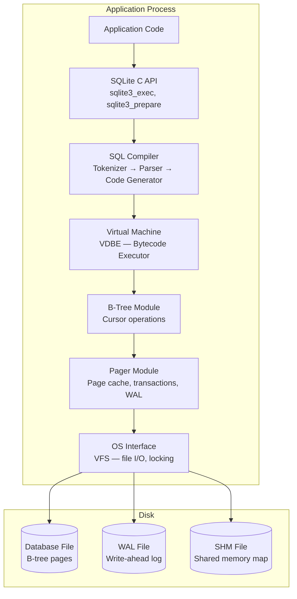
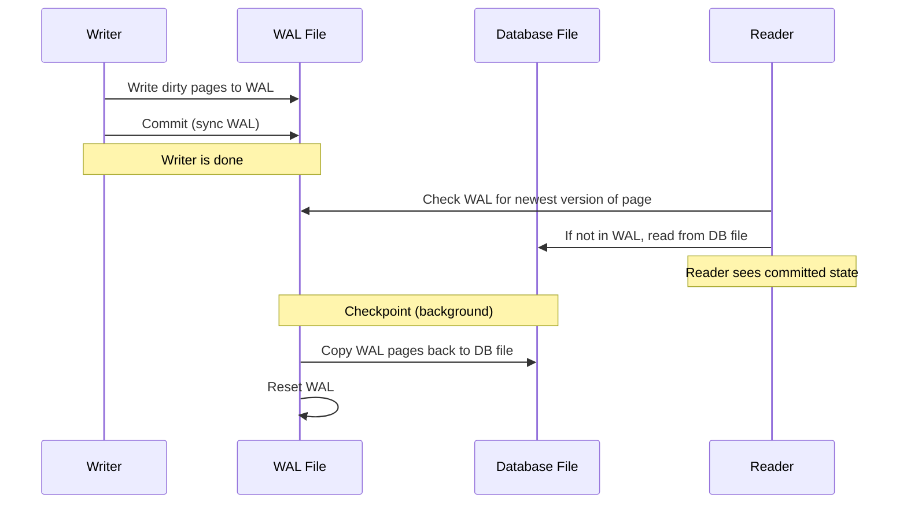

# SQLite Internals

SQLite is the most deployed database engine in the world — it runs on every smartphone, every web browser, and most embedded systems. Unlike PostgreSQL or MySQL, SQLite is not a client-server database. It is a library linked directly into your application process, reading and writing a single file on disk. This simplicity is its superpower: zero configuration, zero network hops, zero administration.

Yet SQLite is increasingly being used in contexts it was not originally designed for — as the primary database for web applications, as a replicated data store via Litestream/LiteFS, and as a distributed database via Turso/libSQL. Understanding its internals helps you decide when to use it and how to push its limits.

---

## Architecture Overview



The key layers:
1. **SQL Compiler** — parses SQL into bytecode (not a query plan tree like PostgreSQL — SQLite compiles to a virtual machine instruction set)
2. **VDBE (Virtual Database Engine)** — executes bytecode instructions like `OpenRead`, `Column`, `ResultRow`
3. **B-Tree Module** — manages the B-tree data structures that store tables and indexes
4. **Pager** — handles page-level caching, transaction management, and WAL
5. **VFS (Virtual File System)** — abstracts file I/O (enables custom VFS implementations for encryption, HTTP, etc.)

---

## The Database File Format

A SQLite database is a single file with a well-defined binary format. The file is divided into fixed-size pages (default 4096 bytes).

### Page Types

| Page Type | Purpose |
|-----------|---------|
| **Lock-byte page** | Page 1 — contains the file header (first 100 bytes) |
| **Interior table page** | B-tree internal node for a table |
| **Leaf table page** | B-tree leaf node containing row data |
| **Interior index page** | B-tree internal node for an index |
| **Leaf index page** | B-tree leaf node containing index entries |
| **Overflow page** | Extra data for rows that don't fit in a single page |
| **Free page** | Unused page (on the freelist) |

### File Header (First 100 Bytes of Page 1)

```
Offset  Size  Description
0       16    Magic string: "SQLite format 3\000"
16      2     Page size (e.g., 4096)
18      1     File format write version
19      1     File format read version
24      4     File change counter
28      4     Database size (in pages)
32      4     First freelist trunk page
36      4     Total freelist pages
40      4     Schema cookie
92      4     SQLite version number
```

::: tip Page Size Selection
The default page size of 4096 bytes matches most filesystem block sizes. For large BLOBs, use 8192 or 16384. For small, read-heavy datasets, 4096 is optimal. Change page size only at database creation:
```sql
PRAGMA page_size = 8192;
```
:::

---

## B-Tree Storage

SQLite uses B-trees for all data storage. There are two types:

### Table B-Trees (B+ Tree variant)

Each SQL table is stored as a B+ tree where:
- **Key** = the `INTEGER PRIMARY KEY` (the rowid)
- **Value** = the entire row data (all columns serialized together)
- All data lives in **leaf nodes** only
- Internal nodes contain only keys and child pointers

```
Table B-Tree:
                    ┌───────────────────┐
                    │  Internal Node    │
                    │  Keys: [100, 500] │
                    └─┬──────┬────────┬─┘
                      │      │        │
            ┌─────────▼┐ ┌──▼──────┐ ┌▼─────────┐
            │ Leaf Node│ │Leaf Node│ │ Leaf Node │
            │ Rows 1-99│ │100-499  │ │ 500+      │
            └──────────┘ └─────────┘ └───────────┘
```

### Index B-Trees

Each index is stored as a separate B-tree where:
- **Key** = indexed column(s) + rowid
- **Value** = (none — index B-trees store keys only)

```sql
CREATE INDEX idx_users_email ON users(email);
-- Creates a B-tree: key = (email, rowid)
-- Lookup: find email → get rowid → seek table B-tree
```

### Record Format

Each row is serialized using a compact variable-length format:

```
┌──────────────────────────────────────────────────┐
│ Header: [header_size, type1, type2, type3, ...]  │
│ Body:   [value1, value2, value3, ...]            │
└──────────────────────────────────────────────────┘

Type codes:
0 = NULL (0 bytes)
1 = 8-bit integer (1 byte)
2 = 16-bit integer (2 bytes)
3 = 24-bit integer (3 bytes)
4 = 32-bit integer (4 bytes)
5 = 48-bit integer (6 bytes)
6 = 64-bit integer (8 bytes)
7 = 64-bit float (8 bytes)
N >= 12 (even) = BLOB of (N-12)/2 bytes
N >= 13 (odd) = TEXT of (N-13)/2 bytes
```

This format is impressively compact — a `NULL` column costs zero data bytes (just 1 byte in the header for the type code). Small integers use fewer bytes than large ones.

---

## WAL Mode

Write-Ahead Logging is the recommended journal mode for concurrent access. It allows readers to proceed without blocking writers, and vice versa.

### How WAL Works



### WAL vs. Rollback Journal

| Feature | WAL Mode | Rollback Journal |
|---------|---------|-----------------|
| Concurrent reads during write | Yes | No (readers blocked) |
| Write performance | Better (sequential WAL writes) | Worse (random DB writes) |
| Read performance | Slightly worse (check WAL first) | Better (direct DB read) |
| Crash recovery | Faster | Slower |
| Works over NFS | No | Yes |
| File count | 3 files (db, wal, shm) | 2 files (db, journal) |

```sql
-- Enable WAL mode (one-time, persistent)
PRAGMA journal_mode = WAL;

-- Configure WAL auto-checkpoint (pages before checkpoint)
PRAGMA wal_autocheckpoint = 1000;
```

::: warning WAL + Network Filesystems
WAL mode requires shared memory (`-shm` file) and file locking, which do **not** work reliably on network filesystems (NFS, SMB). If your SQLite database is on a network mount, use rollback journal mode. This limitation is a primary driver behind Litestream and LiteFS.
:::

### Checkpoint Modes

| Mode | Behavior |
|------|----------|
| `PASSIVE` | Checkpoint only pages not being read (non-blocking) |
| `FULL` | Wait for readers to finish, then checkpoint all pages |
| `RESTART` | Like FULL, but also reset the WAL file |
| `TRUNCATE` | Like RESTART, but truncate WAL to zero bytes |

---

## Concurrency Model

SQLite's concurrency is fundamentally different from client-server databases:

- **Readers never block writers** (in WAL mode)
- **Writers never block readers** (in WAL mode)
- **Only one writer at a time** — this is the critical limitation

```
Multiple readers + 1 writer:   ✅ Works great
Multiple concurrent writers:   ❌ SQLITE_BUSY errors
```

### Handling SQLITE_BUSY

```typescript
// Configure busy timeout (wait up to 5 seconds for lock)
db.pragma('busy_timeout = 5000');

// Or use WAL mode + immediate transactions for predictable behavior
db.exec('PRAGMA journal_mode = WAL');

// For write transactions, use BEGIN IMMEDIATE
// This acquires the write lock at transaction start, not at first write
db.exec('BEGIN IMMEDIATE');
// ... do writes ...
db.exec('COMMIT');
```

::: tip Write Throughput
SQLite in WAL mode on a modern NVMe SSD handles **50,000-100,000 simple writes per second** with a single writer. This is sufficient for most web applications. If you need more write throughput, SQLite is the wrong choice — use PostgreSQL.
:::

---

## Modern SQLite Extensions

### Litestream — Continuous Replication

Litestream continuously replicates a SQLite database to S3 (or any object storage) by streaming WAL changes. It provides disaster recovery without changing your application code.

```
┌──────────────┐     WAL changes     ┌──────────────┐
│ Application  │ ──────────────────→  │  Litestream  │
│   + SQLite   │                      │   (sidecar)  │
└──────────────┘                      └──────┬───────┘
                                             │
                                     ┌───────▼───────┐
                                     │  S3 / MinIO   │
                                     │  (WAL copies) │
                                     └───────────────┘
```

- **RPO (Recovery Point Objective)**: ~1 second (WAL streamed continuously)
- **RTO (Recovery Time Objective)**: Minutes (restore from S3, replay WAL)
- **Cost**: Nearly free (S3 storage for WAL segments)

### LiteFS — Distributed SQLite

LiteFS replicates SQLite across multiple nodes using a FUSE filesystem layer. One node is the primary (accepts writes); others are read replicas.

```
┌──────────────┐    ┌──────────────┐    ┌──────────────┐
│  Primary     │    │  Replica 1   │    │  Replica 2   │
│  (reads +    │──→ │  (reads only)│    │  (reads only)│
│   writes)    │    │              │──→ │              │
└──────────────┘    └──────────────┘    └──────────────┘
     LiteFS FUSE         LiteFS FUSE         LiteFS FUSE
```

- Automatic leader election via Consul
- Replicas serve reads with sub-second lag
- Applications see a normal SQLite file (no code changes)
- Used by Fly.io for edge-deployed SQLite

### Turso / libSQL — SQLite for the Edge

Turso is a managed service built on libSQL (a fork of SQLite) that adds:
- **Multi-tenant edge replication** — database replicas at the edge
- **HTTP/WebSocket access** — no file system needed
- **Embedded replicas** — sync a local copy for offline-first apps

```typescript
import { createClient } from '@libsql/client';

const db = createClient({
  url: 'libsql://my-db-myorg.turso.io',
  authToken: 'eyJ...',
});

const result = await db.execute('SELECT * FROM users WHERE id = ?', [userId]);
```

---

## When to Use SQLite

| Use Case | SQLite? | Why |
|----------|---------|-----|
| Mobile/desktop app database | Yes | Embedded, zero-config |
| Single-server web app (< 1000 RPS) | Yes | Simpler than PostgreSQL |
| High-write-throughput service | No | Single-writer bottleneck |
| Multi-server deployment (traditional) | No | File locking doesn't work across servers |
| Multi-server with LiteFS/Turso | Maybe | If read-heavy and write-light |
| Analytics / OLAP | No | No columnar storage, no parallelism |
| Edge/embedded compute | Yes | Small footprint, no network dependency |
| Test/CI database | Yes | Fast, in-memory mode, deterministic |
| Data format / file exchange | Yes | Self-contained, cross-platform |

::: tip The SQLite Renaissance
SQLite is no longer "just for mobile." With Litestream, LiteFS, and Turso, it's becoming a viable choice for single-server web apps, edge computing, and offline-first architectures. The key insight: if your application has a single write path and can tolerate the single-writer limitation, SQLite eliminates the operational overhead of running PostgreSQL.
:::

---

## Performance Tuning

### Essential PRAGMAs

```sql
-- WAL mode (concurrent reads + writes)
PRAGMA journal_mode = WAL;

-- Synchronous: NORMAL is safe with WAL (vs. FULL which is overkill)
PRAGMA synchronous = NORMAL;

-- Cache size: negative = KiB, positive = pages
PRAGMA cache_size = -64000;  -- 64 MB page cache

-- Memory-mapped I/O (bypass page cache for reads)
PRAGMA mmap_size = 268435456;  -- 256 MB

-- Foreign keys (disabled by default!)
PRAGMA foreign_keys = ON;

-- Busy timeout (wait for locks instead of immediate SQLITE_BUSY)
PRAGMA busy_timeout = 5000;

-- Temp store in memory (faster temp tables and sorting)
PRAGMA temp_store = MEMORY;
```

### Write Optimization

```typescript
// BAD: 1000 individual inserts (1000 transactions)
for (const user of users) {
  db.prepare('INSERT INTO users (name, email) VALUES (?, ?)').run(user.name, user.email);
}
// ~40 inserts/second with fsync per transaction

// GOOD: batch insert in a single transaction
const insert = db.prepare('INSERT INTO users (name, email) VALUES (?, ?)');
const insertMany = db.transaction((users) => {
  for (const user of users) {
    insert.run(user.name, user.email);
  }
});
insertMany(users);
// ~100,000+ inserts/second (single fsync at commit)
```

::: warning The Single Most Important Optimization
**Wrap bulk operations in explicit transactions.** Without an explicit transaction, SQLite creates an implicit transaction for every statement — each with its own fsync. This drops write throughput by 1000x or more.
:::

---

## Comparison with Other Embedded Databases

| Feature | SQLite | DuckDB | RocksDB | LevelDB |
|---------|--------|--------|---------|---------|
| Query language | SQL | SQL | Key-value API | Key-value API |
| OLTP performance | Excellent | Poor | Excellent | Good |
| OLAP performance | Poor | Excellent | N/A | N/A |
| Concurrent writers | 1 | 1 | Many | 1 |
| Storage format | B-tree pages | Columnar | LSM tree | LSM tree |
| Max database size | 281 TB | Unlimited | Unlimited | Unlimited |
| Replication | Via extensions | No | Via RocksDB tools | No |

---

## Summary

| Aspect | Detail |
|--------|--------|
| Storage engine | B-tree (B+ tree variant for tables) |
| File format | Single file, fixed-size pages (default 4096 bytes) |
| Concurrency | Single writer, multiple readers (WAL mode) |
| Write throughput | 50-100K simple writes/sec (batched, NVMe) |
| Max database size | 281 TB (theoretical), practical limit ~1 TB |
| Replication | Litestream (S3), LiteFS (FUSE), Turso (edge) |
| Best for | Embedded, single-server web apps, edge computing |
| Not for | High write concurrency, multi-server without LiteFS, OLAP |

**Related**: [Storage Engines](/system-design/databases/storage-engines) | [Write-Ahead Logging](/system-design/databases/write-ahead-logging) | [PostgreSQL Internals](/system-design/databases/postgres-internals) | [Database Selection Guide](/system-design/databases/database-selection-guide)
