# Storage Engines

A storage engine is the component of a database that is responsible for the physical storage and retrieval of data on disk (or in memory). It answers the most fundamental question a database must solve: given a key, how do I find the corresponding value as fast as possible? And given a value, how do I write it as fast as possible?

Every database, no matter how sophisticated its query planner or how elegant its SQL parser, eventually bottlenecks at the storage engine. The storage engine determines whether your writes are fast or slow, whether your reads are predictable or variable, whether your disk usage is compact or bloated, and whether your database survives a crash with all data intact.

There are two dominant paradigms in the storage engine world: **B-trees** (and their variant, B+trees) and **LSM trees** (Log-Structured Merge trees). Understanding both — their mechanics, their trade-offs, and their failure modes — is essential knowledge for any engineer working at scale.

## Why Storage Engines Exist

At first glance, storing data seems simple. Write bytes to a file. Read them back. But consider:

- **Random access is slow on disk.** A spinning HDD can perform about 100-200 random reads per second. An SSD can do 10,000-100,000. But sequential reads on both are orders of magnitude faster. A storage engine must minimize random I/O.
- **Data must be findable.** A naive append-only file gives you O(N) reads. With billions of records, that is unacceptable. You need an index structure.
- **Writes must be durable.** If the power fails mid-write, data must not be corrupted. You need crash recovery.
- **Space must be reclaimable.** When data is deleted or updated, the old data must eventually be cleaned up.
- **Concurrency must be managed.** Multiple readers and writers must coexist without corrupting data.

These constraints create a design space with fundamental trade-offs. There is no free lunch: optimizing for one axis (write speed, read speed, space efficiency, write amplification) necessarily degrades another. The B-tree and the LSM tree represent two different positions in this trade-off space.

## First Principles: The I/O Hierarchy

To understand why storage engines are designed the way they are, you must understand the latency hierarchy:

| Operation | Latency | Relative to L1 Cache |
|-----------|---------|---------------------|
| L1 cache reference | 0.5 ns | 1x |
| L2 cache reference | 7 ns | 14x |
| Main memory reference | 100 ns | 200x |
| SSD random read (4KB) | 16 $\mu$s | 32,000x |
| SSD sequential read (1MB) | 1 ms | 2,000,000x |
| HDD random read (4KB) | 4-10 ms | 8,000,000-20,000,000x |
| HDD sequential read (1MB) | 2-5 ms | 4,000,000-10,000,000x |

The takeaway: random disk I/O is catastrophically slow compared to memory. Storage engines exist to minimize the number of disk I/Os per operation — and when disk I/O is unavoidable, to make it sequential rather than random.

This single constraint — **minimize random I/O** — drives the entire design of both B-trees and LSM trees, albeit in radically different ways.

---

## B-Trees

### History

The B-tree was invented by Rudolf Bayer and Edward McCreight at Boeing Scientific Research Labs in 1972. Their paper, "Organization and Maintenance of Large Ordered Indices," introduced a balanced tree structure optimized for systems that read and write large blocks of data — specifically, disk-based storage.

The name "B-tree" has been debated for decades. Bayer never explained what "B" stands for. It might stand for Boeing, Bayer, Balanced, Broad, or Bushy. The mystery is part of the folklore.

The B-tree was revolutionary because it was the first data structure specifically designed for disk access patterns. Unlike binary search trees (which require O(log₂ N) random disk reads — potentially thousands for a large dataset), B-trees use wide nodes that match the disk's page size, reducing tree height to 3-4 levels even for billions of keys.

### B-tree vs B+tree

The original B-tree stores both keys and values in every node (internal and leaf). The B+tree, a variant introduced shortly after, stores values ONLY in leaf nodes, with internal nodes containing only keys and child pointers.

Almost every modern database uses B+trees, not plain B-trees. Here is why:

**B-tree:**
```
        [10:data, 20:data]
       /         |         \
[5:data]   [15:data]   [25:data, 30:data]
```

**B+tree:**
```
           [10, 20]                    ← Internal: keys only (no data)
          /    |    \
   [5:data] [15:data] [25:data, 30:data]  ← Leaves: keys + data
     ↔          ↔            ↔             ← Leaves linked together
```

The advantages of B+trees:

1. **Higher fanout.** Internal nodes hold only keys, not data, so more keys fit per page. Higher fanout means a shallower tree, which means fewer disk reads per lookup.
2. **Predictable performance.** Every lookup traverses from root to leaf — the same depth every time. In a plain B-tree, a lookup might find data at any level.
3. **Efficient range scans.** Leaf nodes are linked together in a doubly-linked list. To scan a range, you find the start key and then walk the leaf chain — no tree traversal needed.
4. **Better cache utilization.** Internal nodes are small and hot — they stay in the buffer pool. Leaf nodes are cold but accessed sequentially during scans.

::: info Why This Matters
PostgreSQL, MySQL InnoDB, SQL Server, Oracle, SQLite — they all use B+trees. When someone says "B-tree index" in a database context, they almost always mean a B+tree. For the rest of this page, "B+tree" and "B-tree" are used interchangeably unless the distinction matters.
:::

### Node Structure

A B+tree node (also called a "page") has a fixed size, typically matching the operating system's page size or a multiple of it:

- **PostgreSQL:** 8 KB pages
- **MySQL InnoDB:** 16 KB pages
- **SQL Server:** 8 KB pages
- **SQLite:** 4 KB pages (configurable)

Each internal node contains:

```
┌─────────────────────────────────────────────────────┐
│ Page Header: LSN, page type, free space offset, ... │
├─────────────────────────────────────────────────────┤
│ P₀ | K₁ | P₁ | K₂ | P₂ | ... | Kₙ | Pₙ           │
├─────────────────────────────────────────────────────┤
│                   Free Space                         │
└─────────────────────────────────────────────────────┘

Pᵢ = pointer (page ID) to child node
Kᵢ = key (separator value)

Invariant: All keys in subtree(Pᵢ₋₁) < Kᵢ ≤ All keys in subtree(Pᵢ)
```

Each leaf node contains:

```
┌─────────────────────────────────────────────────────┐
│ Page Header: LSN, page type, prev/next leaf ptrs    │
├─────────────────────────────────────────────────────┤
│ K₁:V₁ | K₂:V₂ | K₃:V₃ | ... | Kₙ:Vₙ               │
├─────────────────────────────────────────────────────┤
│                   Free Space                         │
└─────────────────────────────────────────────────────┘

Kᵢ = key
Vᵢ = value (or pointer to heap tuple in heap-organized tables)
prev/next = pointers to sibling leaf pages (for range scans)
```

**Fill factor** controls how full each page is after a split. PostgreSQL defaults to 90% for leaf pages. Leaving some space (10%) allows future inserts to happen without immediately splitting the page again. If you know your data is append-only (e.g., auto-incrementing IDs), you can use 100% fill factor.

### Fanout Calculation

The fanout (branching factor) of a B+tree determines its height. Let us calculate it for a real database:

**MySQL InnoDB (16 KB pages, BIGINT keys):**

- Page header: ~120 bytes
- Per-key overhead: 8 bytes (key) + 6 bytes (child page pointer) = 14 bytes per entry
- Available space: 16,384 - 120 = 16,264 bytes
- Maximum fanout: $\lfloor 16264 / 14 \rfloor \approx 1161$

With a fanout of ~1,000:
- **Level 0 (root):** 1 page → up to 1,000 keys
- **Level 1:** 1,000 pages → up to 1,000,000 keys
- **Level 2:** 1,000,000 pages → up to 1,000,000,000 keys (1 billion)

$$
\text{Height} = \lceil \log_B N \rceil
$$

Where $B$ is the branching factor and $N$ is the number of keys. For 1 billion keys with $B = 1000$:

$$
h = \lceil \log_{1000}(10^9) \rceil = \lceil 3 \rceil = 3
$$

**Three levels.** That means any key lookup in a B+tree with a billion entries requires at most 3 disk reads (and in practice the root and often level-1 pages are cached in the buffer pool, so it is usually just 1 disk read — the leaf page).

### Core Operations

#### Search: O(log_B N)

```
Search for key = 42:

Level 0 (root): [20, 50, 80]
                 ↓
          42 > 20 and 42 < 50 → follow pointer P₁

Level 1:        [30, 40, 45]
                     ↓
          42 > 40 and 42 < 45 → follow pointer P₂

Level 2 (leaf): [40, 41, 42, 43, 44]
                          ↑
                    Found! Return value for key 42.
```

At each level, we do a binary search within the node (which fits in a single page and thus a single disk read). The number of comparisons within a node is $O(\log_2 B)$, but since $B$ is small (a few hundred to a few thousand) and the page is in memory, this is fast. The dominant cost is the disk reads — one per level.

#### Insert with Page Splits

Inserting into a B+tree is straightforward — until a page is full. When that happens, the page must **split**.

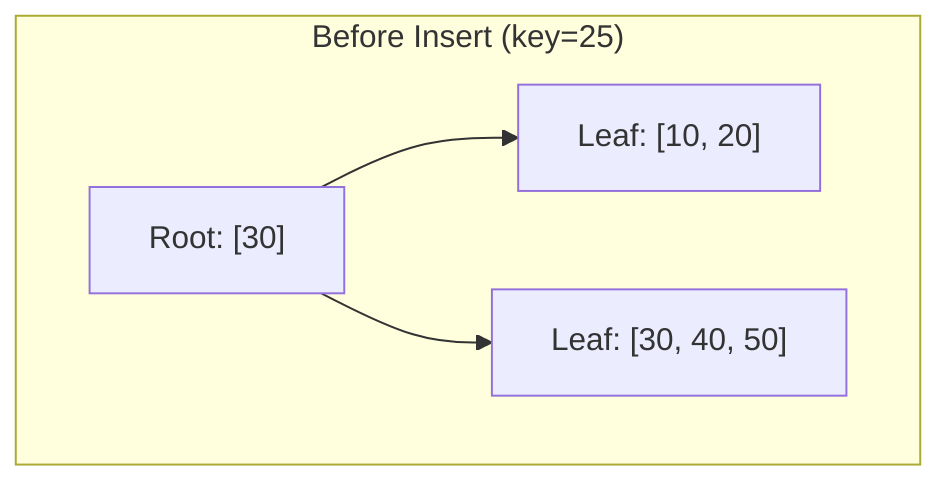

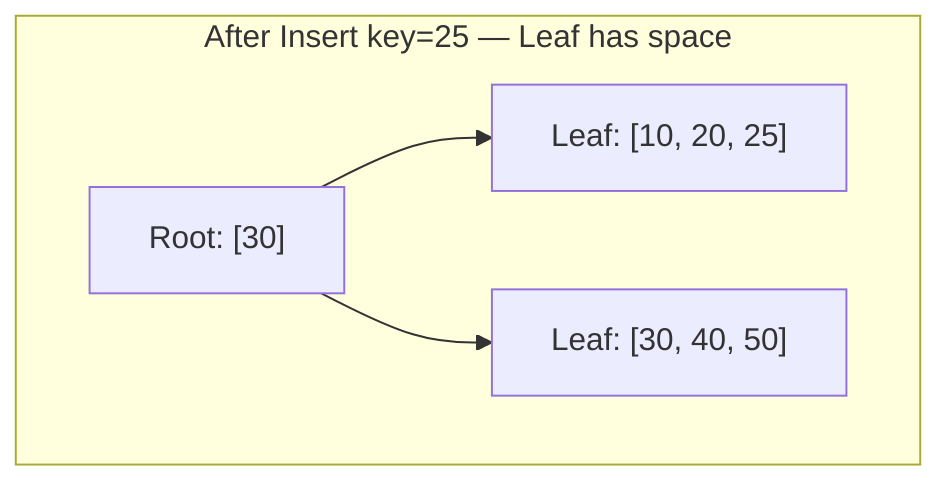

Now insert key=35 into the rightmost leaf, which is full (capacity=3):

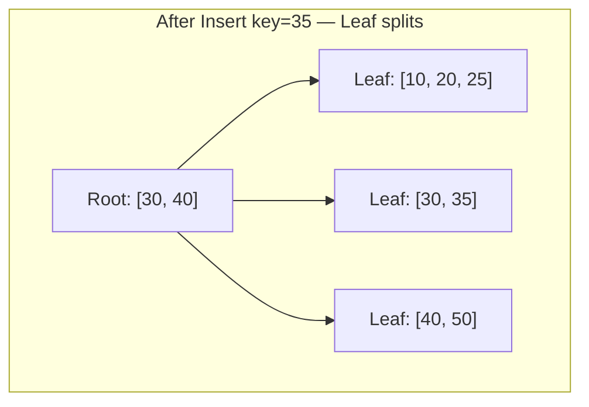

The full leaf `[30, 40, 50]` splits into `[30, 35]` and `[40, 50]`. The median key (40) is promoted to the parent. If the parent is also full, it splits too — this can cascade up to the root, which is the only way a B+tree grows taller.

**Split algorithm:**

1. Find the leaf page where the key should be inserted
2. If the leaf has space, insert the key and return
3. If the leaf is full:
   a. Allocate a new page
   b. Distribute keys: first half stays in old page, second half moves to new page
   c. Promote the median key to the parent
   d. If the parent is full, recursively split the parent
4. If the root splits, create a new root with the promoted key — the tree grows by one level

#### Delete with Merging and Redistribution

Deletion is more complex. After removing a key, a page may become **underfull** (below the minimum fill factor, typically 50%). The B+tree must rebalance:

1. **Redistribute:** If a sibling page has more than the minimum keys, borrow a key from the sibling (rotate through the parent).
2. **Merge:** If the sibling is also at minimum, merge the two pages and remove the separator key from the parent. This can cascade up.

In practice, many databases (including PostgreSQL) **do not eagerly merge underfull pages**. They leave partially-filled pages alone and rely on VACUUM or page reuse to reclaim space. This is a deliberate trade-off: merge operations are expensive and rarely worth the I/O cost.

### Visualization: Building a B+tree Step by Step

Let us insert the keys [10, 20, 5, 15, 25, 30, 35, 40] into a B+tree with a maximum of 3 keys per node:

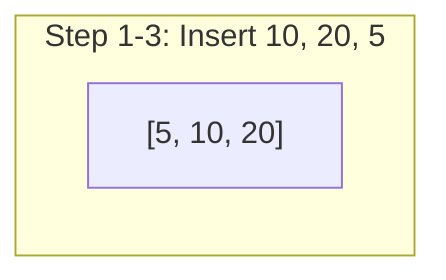

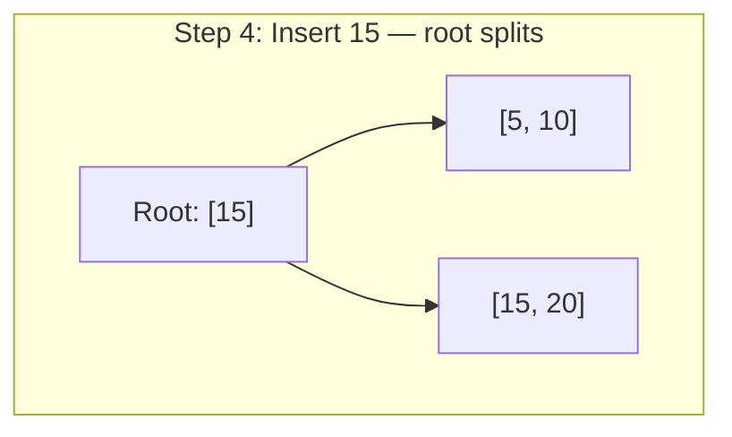

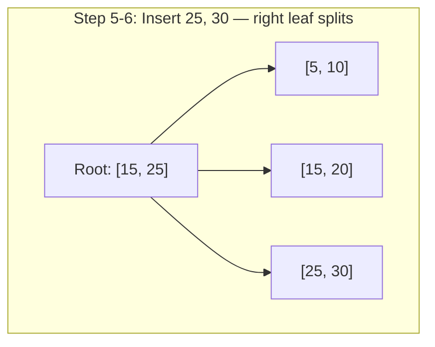

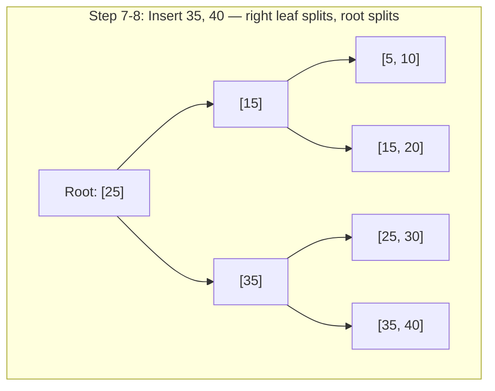

### TypeScript Implementation: Simplified B+tree

```typescript
/**
 * Simplified B+tree implementation.
 * Demonstrates insert, search, and range scan.
 *
 * This is NOT production-quality — real B+trees operate on fixed-size
 * disk pages, use WAL for crash recovery, and handle concurrency.
 * But it captures the core algorithmic mechanics.
 */

type Key = number;
type Value = string;

interface LeafNode {
  type: 'leaf';
  keys: Key[];
  values: Value[];
  next: LeafNode | null;  // linked list for range scans
}

interface InternalNode {
  type: 'internal';
  keys: Key[];
  children: BTreeNode[];
}

type BTreeNode = LeafNode | InternalNode;

class BPlusTree {
  private root: BTreeNode;
  private readonly order: number; // maximum number of keys per node

  constructor(order: number = 4) {
    this.order = order;
    this.root = { type: 'leaf', keys: [], values: [], next: null };
  }

  /**
   * Search for a key. Returns the value or null.
   * Time: O(log_B N) disk reads, O(log_B N * log_2 B) comparisons
   */
  search(key: Key): Value | null {
    let node = this.root;

    // Traverse internal nodes to find the correct leaf
    while (node.type === 'internal') {
      let i = 0;
      while (i < node.keys.length && key >= node.keys[i]) {
        i++;
      }
      node = node.children[i];
    }

    // Binary search within the leaf
    const idx = this.binarySearch(node.keys, key);
    if (idx >= 0 && idx < node.keys.length && node.keys[idx] === key) {
      return node.values[idx];
    }
    return null;
  }

  /**
   * Insert a key-value pair.
   * Time: O(log_B N) + potential page splits
   */
  insert(key: Key, value: Value): void {
    const result = this.insertRecursive(this.root, key, value);

    // If the root split, create a new root
    if (result) {
      const newRoot: InternalNode = {
        type: 'internal',
        keys: [result.promotedKey],
        children: [this.root, result.newNode],
      };
      this.root = newRoot;
    }
  }

  /**
   * Range scan: returns all key-value pairs where startKey <= key <= endKey.
   * This is where B+trees shine — linked leaf nodes enable efficient sequential access.
   * Time: O(log_B N + K) where K is the number of keys in the range
   */
  rangeScan(startKey: Key, endKey: Key): Array<{ key: Key; value: Value }> {
    // Find the leaf containing startKey
    let node = this.root;
    while (node.type === 'internal') {
      let i = 0;
      while (i < node.keys.length && startKey >= node.keys[i]) {
        i++;
      }
      node = node.children[i];
    }

    // Walk the leaf chain collecting results
    const results: Array<{ key: Key; value: Value }> = [];
    let leaf: LeafNode | null = node;

    while (leaf) {
      for (let i = 0; i < leaf.keys.length; i++) {
        if (leaf.keys[i] > endKey) {
          return results; // Past the end of range
        }
        if (leaf.keys[i] >= startKey) {
          results.push({ key: leaf.keys[i], value: leaf.values[i] });
        }
      }
      leaf = leaf.next; // Follow the linked list to the next leaf
    }

    return results;
  }

  private insertRecursive(
    node: BTreeNode,
    key: Key,
    value: Value
  ): { promotedKey: Key; newNode: BTreeNode } | null {
    if (node.type === 'leaf') {
      return this.insertIntoLeaf(node, key, value);
    }

    // Find the child to recurse into
    let i = 0;
    while (i < node.keys.length && key >= node.keys[i]) {
      i++;
    }

    const result = this.insertRecursive(node.children[i], key, value);
    if (!result) return null;

    // A child split — insert the promoted key into this internal node
    return this.insertIntoInternal(node, i, result.promotedKey, result.newNode);
  }

  private insertIntoLeaf(
    leaf: LeafNode,
    key: Key,
    value: Value
  ): { promotedKey: Key; newNode: BTreeNode } | null {
    // Find insertion position
    let i = 0;
    while (i < leaf.keys.length && leaf.keys[i] < key) {
      i++;
    }

    // Update existing key
    if (i < leaf.keys.length && leaf.keys[i] === key) {
      leaf.values[i] = value;
      return null;
    }

    // Insert
    leaf.keys.splice(i, 0, key);
    leaf.values.splice(i, 0, value);

    // Check for overflow
    if (leaf.keys.length > this.order) {
      return this.splitLeaf(leaf);
    }

    return null;
  }

  private splitLeaf(
    leaf: LeafNode
  ): { promotedKey: Key; newNode: LeafNode } {
    const midIndex = Math.ceil(leaf.keys.length / 2);

    const newLeaf: LeafNode = {
      type: 'leaf',
      keys: leaf.keys.splice(midIndex),
      values: leaf.values.splice(midIndex),
      next: leaf.next,
    };

    // Maintain the linked list
    leaf.next = newLeaf;

    // In B+trees, the promoted key is the FIRST key of the new leaf
    // (it is copied up, not moved — the leaf retains it)
    return {
      promotedKey: newLeaf.keys[0],
      newNode: newLeaf,
    };
  }

  private insertIntoInternal(
    node: InternalNode,
    childIndex: number,
    promotedKey: Key,
    newChild: BTreeNode
  ): { promotedKey: Key; newNode: InternalNode } | null {
    // Insert the promoted key and new child pointer
    node.keys.splice(childIndex, 0, promotedKey);
    node.children.splice(childIndex + 1, 0, newChild);

    // Check for overflow
    if (node.keys.length > this.order) {
      return this.splitInternal(node);
    }

    return null;
  }

  private splitInternal(
    node: InternalNode
  ): { promotedKey: Key; newNode: InternalNode } {
    const midIndex = Math.floor(node.keys.length / 2);
    const promotedKey = node.keys[midIndex];

    const newInternal: InternalNode = {
      type: 'internal',
      keys: node.keys.splice(midIndex + 1),
      children: node.children.splice(midIndex + 1),
    };

    // Remove the promoted key from the original node
    node.keys.pop();

    return { promotedKey, newNode: newInternal };
  }

  private binarySearch(keys: Key[], target: Key): number {
    let lo = 0;
    let hi = keys.length - 1;
    while (lo <= hi) {
      const mid = (lo + hi) >>> 1;
      if (keys[mid] === target) return mid;
      if (keys[mid] < target) lo = mid + 1;
      else hi = mid - 1;
    }
    return lo;
  }
}

// === Usage Example ===
const tree = new BPlusTree(3);

// Insert some records
tree.insert(10, 'Alice');
tree.insert(20, 'Bob');
tree.insert(5, 'Charlie');
tree.insert(15, 'Diana');
tree.insert(25, 'Eve');
tree.insert(30, 'Frank');

// Point lookup
console.log(tree.search(15)); // 'Diana'
console.log(tree.search(99)); // null

// Range scan — the B+tree superpower
console.log(tree.rangeScan(10, 25));
// [
//   { key: 10, value: 'Alice' },
//   { key: 15, value: 'Diana' },
//   { key: 20, value: 'Bob' },
//   { key: 25, value: 'Eve' }
// ]
```

### Buffer Pool Management

No discussion of B+trees is complete without the buffer pool. The buffer pool is an in-memory cache of disk pages. Its job: keep frequently accessed pages (especially the upper levels of the B+tree) in memory so that most lookups require only 1 disk read (the final leaf page) instead of 3-4.

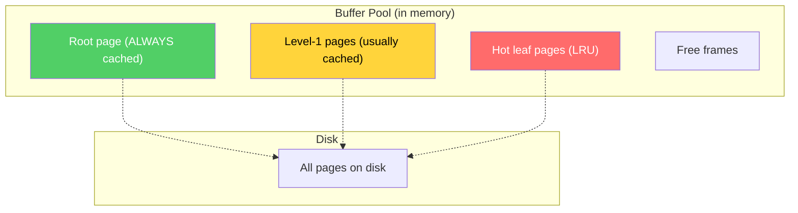

**How it works:**

1. When a page is requested, check the buffer pool first (O(1) hash lookup).
2. If found (cache hit), return the in-memory copy. No disk I/O.
3. If not found (cache miss), read the page from disk, place it in a free frame in the buffer pool, and return it.
4. If no free frames, evict a page using a replacement policy (LRU, clock, LRU-K, etc.).
5. If the evicted page is dirty (modified), write it to disk before evicting.

**Key insight:** For a B+tree with 1 billion keys and a fanout of 1,000, the upper 2 levels of the tree are just 1,001 pages (1 root + 1,000 level-1 pages). At 16 KB per page, that is about 16 MB — trivially cacheable in modern servers with tens or hundreds of GB of RAM. So in practice, point lookups on a billion-row table require exactly 1 disk read.

### Write Amplification

Write amplification is the ratio of actual bytes written to disk versus the logical bytes the application intended to write. B+trees suffer from write amplification because:

1. **Modifying a single key requires rewriting an entire page.** Even if you change one byte in a key's value, the entire 8-16 KB page must be written to disk.
2. **Page splits write multiple pages.** A single insert can trigger a cascade of splits.
3. **WAL writes.** For crash recovery, the change is first written to the Write-Ahead Log and THEN to the B+tree page — the data is written twice.

$$
\text{Write Amplification}_{B\text{-tree}} = \frac{\text{Page Size}}{\text{Record Size}} \times \text{WAL overhead}
$$

For a 100-byte record on a 16 KB page with WAL:

$$
WA \approx \frac{16384}{100} \times 2 \approx 328\times
$$

This is a worst case — in practice, multiple writes to the same page get batched, and the buffer pool absorbs many modifications before a page is flushed to disk. Realistic write amplification for B+trees is typically **10-30x**.

---

## LSM Trees (Log-Structured Merge Trees)

### History

The LSM tree was introduced by Patrick O'Neil, Edward Cheng, Dieter Gawlick, and Elizabeth O'Neil in their 1996 paper, "The Log-Structured Merge-Tree (LSM-Tree)." The insight was simple but powerful: instead of updating data in place (like B-trees do), buffer all writes in memory and periodically flush them to disk in large, sorted, sequential batches.

This trades read performance for write performance. By converting random writes into sequential writes, LSM trees achieve dramatically higher write throughput — at the cost of more complex (and sometimes slower) reads.

The idea sat relatively dormant until Google published the Bigtable paper (2006) and its open-source implementation LevelDB (2011). Facebook then built RocksDB (a LevelDB fork optimized for server workloads), which became the foundation for dozens of modern databases: CockroachDB, TiDB, YugabyteDB, and many others.

### The Write Path

The LSM tree write path is elegant in its simplicity:

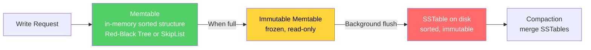

**Step by step:**

1. **Write to WAL.** Before anything else, the key-value pair is appended to a Write-Ahead Log on disk. This is a sequential append — extremely fast. The WAL ensures durability: if the process crashes before the memtable is flushed, the WAL can be replayed to recover.

2. **Insert into memtable.** The key-value pair is inserted into an in-memory sorted data structure. RocksDB uses a skiplist; LevelDB also uses a skiplist; Cassandra uses a red-black tree (or more recently, a concurrent skiplist). The memtable supports O(log N) inserts and lookups.

3. **Memtable becomes immutable.** When the memtable reaches a size threshold (e.g., 64 MB in RocksDB), it is frozen into an immutable memtable. A new, empty memtable is created for incoming writes. Writes are never blocked — this switch is atomic.

4. **Flush to SSTable.** A background thread writes the immutable memtable to disk as an SSTable (Sorted String Table). Since the memtable is sorted, this is a single sequential write — extremely efficient. The SSTable is immutable once written.

5. **Delete the WAL.** Once the SSTable is safely on disk, the corresponding WAL segment can be deleted.

::: tip Why SkipLists?
Both LevelDB and RocksDB use skiplists for the memtable instead of red-black trees. Why? Skiplists are easier to implement in a lock-free manner (important for concurrent writes), have better cache locality (nodes are allocated in contiguous memory), and their O(log N) performance has better constants in practice. Also, iterating a skiplist in order is trivial — just follow the bottom-level forward pointers — which makes flushing to a sorted SSTable simple.
:::

### The Read Path

Reading from an LSM tree is more complex than reading from a B+tree because data might be in any of several locations:

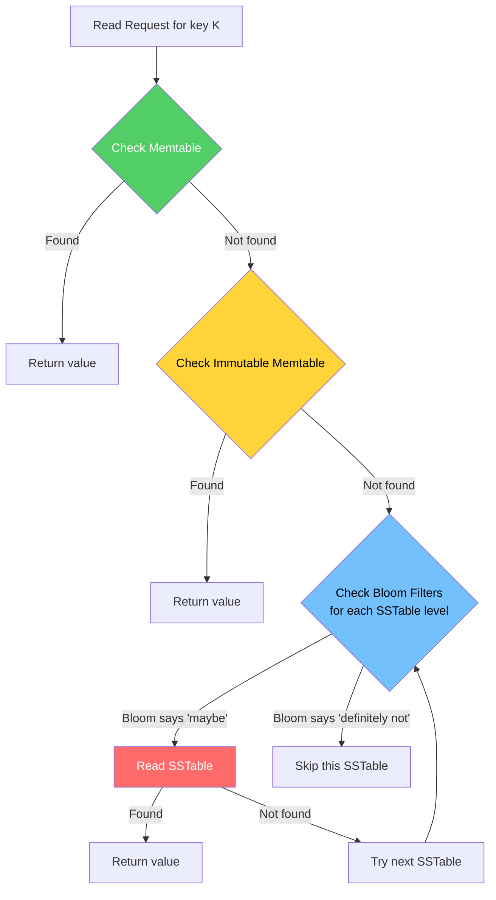

**Step by step:**

1. Check the **active memtable** (O(log N), in-memory)
2. Check the **immutable memtable** (O(log N), in-memory)
3. For each SSTable level (newest first):
   a. Check the **Bloom filter** — if it says the key is definitely not present, skip this SSTable entirely
   b. If the Bloom filter says "maybe present," check the **index block** to find the data block containing the key
   c. Read the **data block** and search for the key
4. Return the first (newest) value found, or null if not found

The worst case for reads is a key that does not exist — you must check the memtable, immutable memtable, and every SSTable's Bloom filter. This is the fundamental read amplification problem of LSM trees.

### SSTable Format

An SSTable (Sorted String Table) is an immutable, sorted file on disk. Its format typically looks like:

```
┌─────────────────────────────────────────┐
│            Data Block 0                  │  Sorted key-value pairs
│  [key1:value1, key2:value2, ...]         │  Compressed (snappy/lz4/zstd)
├─────────────────────────────────────────┤
│            Data Block 1                  │
│  [key101:value101, key102:value102, ...] │
├─────────────────────────────────────────┤
│              ...                         │
├─────────────────────────────────────────┤
│            Data Block N                  │
├─────────────────────────────────────────┤
│          Meta Block: Bloom Filter        │  One Bloom filter for the entire SSTable
├─────────────────────────────────────────┤
│          Meta Block: Stats               │  Key count, size, min/max key, etc.
├─────────────────────────────────────────┤
│          Index Block                     │  Maps key ranges to data block offsets
│  [key_of_block_0 → offset_0,            │  Enables binary search to find the right
│   key_of_block_1 → offset_1, ...]       │  data block without reading all blocks
├─────────────────────────────────────────┤
│          Footer                          │  Offsets to index block and meta blocks
│  [index_offset, meta_offset, magic]      │
└─────────────────────────────────────────┘
```

Key design choices:
- **Data blocks** are the unit of I/O. Typically 4-64 KB. Each block is independently compressed.
- **The index block** maps the first key of each data block to its offset. A point lookup first binary-searches the index, then reads the single relevant data block.
- **The Bloom filter** prevents unnecessary data block reads. If the filter says "key not present," the entire SSTable is skipped.
- **SSTables are immutable.** Once written, they are never modified. Updates and deletes are handled by writing new entries (with tombstones for deletes) in newer SSTables.

### Bloom Filters

Bloom filters are critical to LSM tree read performance. Without them, every read for a non-existent key would have to check every SSTable on disk.

A Bloom filter is a probabilistic data structure that can tell you:
- **"Definitely not in the set"** — guaranteed correct
- **"Probably in the set"** — might be a false positive

**How it works:**

1. Allocate a bit array of $m$ bits, all initialized to 0
2. Choose $k$ independent hash functions
3. To **add** a key: compute $k$ hashes, set those $k$ bit positions to 1
4. To **query** a key: compute $k$ hashes, check those $k$ bit positions. If ALL are 1, the key is "probably present." If ANY is 0, the key is "definitely not present."

**False positive rate:**

$$
P(\text{false positive}) = \left(1 - e^{-kn/m}\right)^k
$$

Where $n$ is the number of items inserted, $m$ is the number of bits, and $k$ is the number of hash functions.

**Optimal number of hash functions:**

$$
k_{\text{opt}} = \frac{m}{n} \ln 2
$$

**Bits per key for a target false positive rate $p$:**

$$
\frac{m}{n} = -\frac{\ln p}{(\ln 2)^2} \approx -1.44 \log_2 p
$$

For a 1% false positive rate:

$$
\frac{m}{n} = -1.44 \times \log_2(0.01) \approx -1.44 \times (-6.64) \approx 9.6 \text{ bits per key}
$$

$$
k_{\text{opt}} = 9.6 \times \ln 2 \approx 6.6 \approx 7 \text{ hash functions}
$$

RocksDB defaults to 10 bits per key, giving a ~1% false positive rate. This means on average, for every 100 lookups of non-existent keys, only 1 will result in an unnecessary SSTable read.

::: info War Story
At a previous company, we had an LSM-based database serving user session data. Read latency was surprisingly high — P99 was 50ms. After investigation, we found that the Bloom filter had been configured with only 5 bits per key, giving a ~10% false positive rate. With 5 SSTable levels, a read for a non-existent key had a $(1 - 0.9^5) = 41\%$ chance of hitting at least one SSTable unnecessarily. Bumping to 10 bits per key dropped the false positive rate to 1% and reduced P99 read latency to 8ms. Total cost of the extra Bloom filter memory: about 200 MB for our 160 million keys. One of the best ROI fixes in the history of that codebase.
:::

### Compaction Strategies

Compaction is the process of merging multiple SSTables into fewer, larger SSTables. It serves several purposes:

1. **Reclaim space** from deleted keys (tombstones) and overwritten values
2. **Reduce read amplification** by decreasing the number of SSTables to check
3. **Maintain sorted order** within each level

There are two primary compaction strategies: **Size-Tiered Compaction (STCS)** and **Leveled Compaction (LCS)**.

#### Size-Tiered Compaction (STCS)

Used by: Cassandra (default), HBase, ScyllaDB

**Concept:** Group SSTables of similar size and merge them when there are enough in a group.

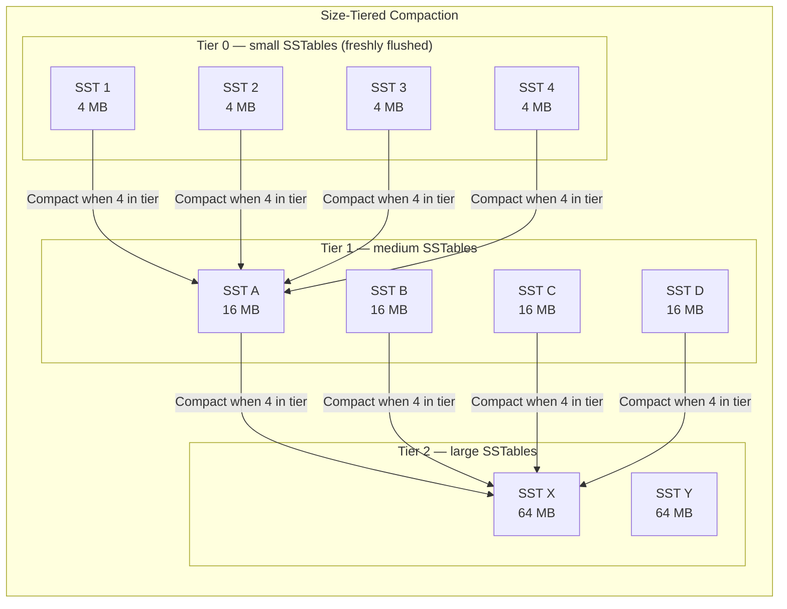

**How it works:**
1. Memtable flushes create small SSTables in Tier 0
2. When enough SSTables accumulate in a tier (e.g., 4), they are merged into a single larger SSTable in the next tier
3. The merged SSTable is approximately $T$ times larger ($T$ = size ratio, typically 4)

**Pros:**
- Simple to implement
- Good write amplification: each byte is written approximately $O(T \times L)$ times, where $L$ is the number of tiers
- Works well for write-heavy workloads

**Cons:**
- **High space amplification.** During compaction, you temporarily need space for both the input SSTables and the output SSTable. Worst case: 2x the data size.
- **High read amplification.** SSTables within a tier can have overlapping key ranges, so a read must check ALL SSTables in a tier.
- **Unpredictable latency.** Large compaction operations (merging the biggest tier) cause I/O spikes.

#### Leveled Compaction (LCS)

Used by: RocksDB (default), LevelDB, Cassandra (optional)

**Concept:** Organize SSTables into levels where each level is $T$ times the size of the previous. Within each level (except Level 0), SSTables have non-overlapping key ranges.

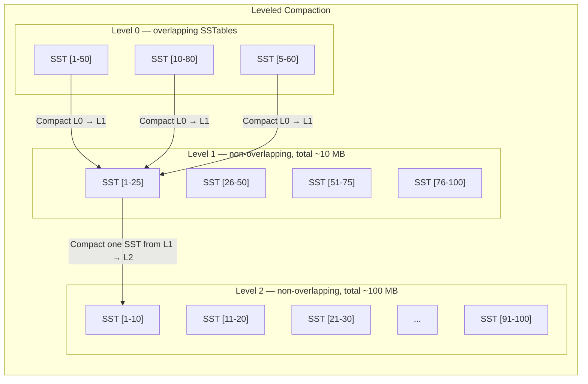

**How it works:**
1. Level 0 receives flushed memtables (SSTables may have overlapping ranges)
2. When Level 0 has too many SSTables, they are merged with overlapping SSTables from Level 1
3. When Level $i$ exceeds its size limit ($T^i \times \text{base\_size}$), one SSTable from Level $i$ is chosen and merged with all overlapping SSTables in Level $i+1$
4. The key invariant: within each level (except L0), SSTables have **non-overlapping key ranges**

**Pros:**
- **Low space amplification.** Since SSTables within a level don't overlap, there is at most $\sim 10\%$ temporary excess during compaction.
- **Low read amplification.** At most one SSTable per level can contain a given key (due to non-overlapping ranges). So the worst-case read checks $L$ SSTables (one per level) plus a Bloom filter per SSTable.
- **Predictable read latency.**

**Cons:**
- **High write amplification.** Compacting one SSTable from Level $i$ to Level $i+1$ requires reading and rewriting up to $T$ SSTables in Level $i+1$ (because their key ranges overlap). Total write amplification is approximately $O(T \times L)$ where $T$ is the size ratio and $L$ is the number of levels.
- More I/O bandwidth consumed by background compaction.

**Write amplification analysis for LCS:**

For a size ratio $T = 10$ (RocksDB default) and $L$ levels:

$$
\text{Write Amplification} = T \times (L - 1)
$$

With 4 levels (supporting ~10 TB of data):

$$
WA = 10 \times 3 = 30\times
$$

This means every byte written by the application results in approximately 30 bytes written to disk. This is the fundamental cost of leveled compaction — and the reason LSM trees, despite being "write-optimized," can still have significant write amplification.

### TypeScript Implementation: Simplified LSM Tree

```typescript
/**
 * Simplified LSM tree implementation.
 * Demonstrates the write path (memtable → flush → SSTable),
 * the read path (memtable → SSTables with Bloom filters),
 * and basic compaction.
 */

type LSMKey = string;
type LSMValue = string | null; // null = tombstone (deleted)

interface SSTableEntry {
  key: LSMKey;
  value: LSMValue;
}

/**
 * Simple Bloom filter for SSTable optimization.
 */
class BloomFilter {
  private bits: Uint8Array;
  private numHashes: number;
  private size: number;

  constructor(expectedItems: number, falsePositiveRate: number = 0.01) {
    // Calculate optimal size: m = -n * ln(p) / (ln(2))^2
    this.size = Math.ceil(
      (-expectedItems * Math.log(falsePositiveRate)) / (Math.LN2 * Math.LN2)
    );
    this.bits = new Uint8Array(Math.ceil(this.size / 8));
    // Optimal hash count: k = (m/n) * ln(2)
    this.numHashes = Math.max(
      1,
      Math.round((this.size / expectedItems) * Math.LN2)
    );
  }

  private hash(key: string, seed: number): number {
    // Simple hash (FNV-1a variant with seed)
    let h = 0x811c9dc5 ^ seed;
    for (let i = 0; i < key.length; i++) {
      h ^= key.charCodeAt(i);
      h = Math.imul(h, 0x01000193);
    }
    return Math.abs(h) % this.size;
  }

  add(key: string): void {
    for (let i = 0; i < this.numHashes; i++) {
      const pos = this.hash(key, i);
      this.bits[pos >>> 3] |= 1 << (pos & 7);
    }
  }

  mightContain(key: string): boolean {
    for (let i = 0; i < this.numHashes; i++) {
      const pos = this.hash(key, i);
      if ((this.bits[pos >>> 3] & (1 << (pos & 7))) === 0) {
        return false; // Definitely not present
      }
    }
    return true; // Probably present (may be false positive)
  }
}

/**
 * SSTable: immutable, sorted file on disk.
 * In a real implementation, this would be backed by file I/O.
 * Here we simulate it in memory.
 */
class SSTable {
  readonly entries: SSTableEntry[];
  readonly bloomFilter: BloomFilter;
  readonly minKey: LSMKey;
  readonly maxKey: LSMKey;
  readonly level: number;
  readonly createdAt: number;

  constructor(entries: SSTableEntry[], level: number) {
    // Entries must be sorted by key
    this.entries = entries;
    this.level = level;
    this.createdAt = Date.now();
    this.minKey = entries[0]?.key ?? '';
    this.maxKey = entries[entries.length - 1]?.key ?? '';

    // Build Bloom filter
    this.bloomFilter = new BloomFilter(entries.length);
    for (const entry of entries) {
      this.bloomFilter.add(entry.key);
    }
  }

  /**
   * Binary search for a key in this SSTable.
   */
  get(key: LSMKey): LSMValue | undefined {
    // Check Bloom filter first
    if (!this.bloomFilter.mightContain(key)) {
      return undefined; // Definitely not here
    }

    // Binary search
    let lo = 0;
    let hi = this.entries.length - 1;
    while (lo <= hi) {
      const mid = (lo + hi) >>> 1;
      const cmp = this.entries[mid].key.localeCompare(key);
      if (cmp === 0) return this.entries[mid].value;
      if (cmp < 0) lo = mid + 1;
      else hi = mid - 1;
    }
    return undefined;
  }
}

/**
 * The LSM Tree itself.
 */
class LSMTree {
  private memtable: Map<LSMKey, LSMValue>; // Active memtable (sorted map)
  private immutableMemtable: Map<LSMKey, LSMValue> | null;
  private sstables: SSTable[]; // Sorted newest-first
  private readonly memtableMaxSize: number;
  private readonly maxSStablesBeforeCompaction: number;

  constructor(
    memtableMaxSize: number = 1000,
    maxSStablesBeforeCompaction: number = 4
  ) {
    this.memtable = new Map();
    this.immutableMemtable = null;
    this.sstables = [];
    this.memtableMaxSize = memtableMaxSize;
    this.maxSStablesBeforeCompaction = maxSStablesBeforeCompaction;
  }

  /**
   * Write a key-value pair.
   * Step 1: Write to WAL (omitted here — in production, append to WAL file first)
   * Step 2: Insert into memtable
   * Step 3: If memtable is full, flush to SSTable
   */
  put(key: LSMKey, value: LSMValue): void {
    this.memtable.set(key, value);

    if (this.memtable.size >= this.memtableMaxSize) {
      this.flush();
    }
  }

  /**
   * Delete a key by writing a tombstone.
   * The key is not actually removed until compaction.
   */
  delete(key: LSMKey): void {
    this.put(key, null); // null = tombstone
  }

  /**
   * Read a key. Check memtable → immutable memtable → SSTables (newest first).
   */
  get(key: LSMKey): LSMValue | undefined {
    // 1. Check active memtable
    if (this.memtable.has(key)) {
      const value = this.memtable.get(key);
      return value === null ? undefined : value; // null = tombstone = deleted
    }

    // 2. Check immutable memtable
    if (this.immutableMemtable?.has(key)) {
      const value = this.immutableMemtable.get(key);
      return value === null ? undefined : value;
    }

    // 3. Check SSTables (newest first)
    for (const sst of this.sstables) {
      const value = sst.get(key);
      if (value !== undefined) {
        return value === null ? undefined : value; // tombstone = deleted
      }
    }

    return undefined; // Key not found anywhere
  }

  /**
   * Flush memtable to a new SSTable.
   */
  private flush(): void {
    if (this.memtable.size === 0) return;

    // Freeze current memtable
    this.immutableMemtable = this.memtable;
    this.memtable = new Map();

    // Convert to sorted entries
    const entries: SSTableEntry[] = Array.from(
      this.immutableMemtable.entries()
    )
      .map(([key, value]) => ({ key, value }))
      .sort((a, b) => a.key.localeCompare(b.key));

    // Create SSTable (in production, this writes to disk)
    const sst = new SSTable(entries, 0);
    this.sstables.unshift(sst); // Add to front (newest first)

    // Clear immutable memtable
    this.immutableMemtable = null;

    // Check if compaction is needed
    this.maybeCompact();
  }

  /**
   * Basic compaction: merge all SSTables into one.
   * Real implementations use leveled or size-tiered strategies.
   */
  private maybeCompact(): void {
    if (this.sstables.length < this.maxSStablesBeforeCompaction) return;

    console.log(
      `Compacting ${this.sstables.length} SSTables into 1...`
    );

    // Merge all SSTables using a priority-queue-like merge
    // For simplicity, we do a sequential merge here
    const merged = new Map<LSMKey, LSMValue>();

    // Process oldest first, so newest values overwrite oldest
    for (let i = this.sstables.length - 1; i >= 0; i--) {
      for (const entry of this.sstables[i].entries) {
        merged.set(entry.key, entry.value);
      }
    }

    // Remove tombstones (in a real LSM, tombstones are only removed
    // at the lowest level to prevent ghost resurrections)
    const entries: SSTableEntry[] = [];
    for (const [key, value] of merged) {
      if (value !== null) {
        entries.push({ key, value });
      }
    }

    entries.sort((a, b) => a.key.localeCompare(b.key));

    // Replace all SSTables with the single compacted one
    this.sstables = [new SSTable(entries, 1)];

    console.log(
      `Compaction complete. ${entries.length} live keys remain.`
    );
  }

  /**
   * Scan all keys in a range.
   * Must merge results from memtable and all SSTables.
   */
  rangeScan(
    startKey: LSMKey,
    endKey: LSMKey
  ): Array<{ key: LSMKey; value: LSMValue }> {
    const results = new Map<LSMKey, LSMValue>();

    // Scan SSTables oldest-first (so newer values overwrite)
    for (let i = this.sstables.length - 1; i >= 0; i--) {
      for (const entry of this.sstables[i].entries) {
        if (entry.key >= startKey && entry.key <= endKey) {
          results.set(entry.key, entry.value);
        }
      }
    }

    // Scan immutable memtable
    if (this.immutableMemtable) {
      for (const [key, value] of this.immutableMemtable) {
        if (key >= startKey && key <= endKey) {
          results.set(key, value);
        }
      }
    }

    // Scan active memtable (newest, highest priority)
    for (const [key, value] of this.memtable) {
      if (key >= startKey && key <= endKey) {
        results.set(key, value);
      }
    }

    // Filter tombstones and sort
    return Array.from(results.entries())
      .filter(([_, value]) => value !== null)
      .map(([key, value]) => ({ key, value: value! }))
      .sort((a, b) => a.key.localeCompare(b.key));
  }

  /** For debugging: show the state of the LSM tree */
  debugState(): void {
    console.log(`Memtable: ${this.memtable.size} entries`);
    console.log(
      `Immutable memtable: ${this.immutableMemtable?.size ?? 0} entries`
    );
    console.log(`SSTables: ${this.sstables.length}`);
    for (const sst of this.sstables) {
      console.log(
        `  Level ${sst.level}: ${sst.entries.length} entries ` +
          `[${sst.minKey} .. ${sst.maxKey}]`
      );
    }
  }
}

// === Usage ===
const lsm = new LSMTree(5, 3); // Small memtable for demo

lsm.put('user:001', '{"name":"Alice","age":30}');
lsm.put('user:002', '{"name":"Bob","age":25}');
lsm.put('user:003', '{"name":"Charlie","age":35}');

console.log(lsm.get('user:002')); // '{"name":"Bob","age":25}'

// Update Bob's age
lsm.put('user:002', '{"name":"Bob","age":26}');

// Delete Charlie
lsm.delete('user:003');

console.log(lsm.get('user:002')); // '{"name":"Bob","age":26}' (updated)
console.log(lsm.get('user:003')); // undefined (deleted via tombstone)

// Range scan
console.log(lsm.rangeScan('user:001', 'user:010'));
// Only Alice and Bob (Charlie was deleted)
```

### Amplification Analysis

The three types of amplification are the key metrics for comparing storage engines:

**Write Amplification (WA):** The ratio of bytes written to storage vs. bytes written by the application.

**Read Amplification (RA):** The number of disk reads required to serve a point lookup.

**Space Amplification (SA):** The ratio of actual disk space used vs. the logical size of the data.

$$
\text{For LSM with Leveled Compaction (size ratio } T \text{, } L \text{ levels):}
$$

$$
WA = O(T \cdot L) \approx T \cdot \frac{\log(N/M)}{\log T}
$$

$$
RA = O(L) \text{ (with Bloom filters; without: } O(T \cdot L) \text{)}
$$

$$
SA = O\left(1 + \frac{1}{T}\right) \approx 1.1\times \text{ for } T=10
$$

$$
\text{For LSM with Size-Tiered Compaction (size ratio } T \text{, } L \text{ tiers):}
$$

$$
WA = O(T \cdot L) \text{ (same asymptotically but lower constant)}
$$

$$
RA = O(T \cdot L) \text{ (must check all SSTables in a tier)}
$$

$$
SA = O(T) \approx 2\times \text{ worst case during compaction}
$$

$$
\text{For B+tree:}
$$

$$
WA = O\left(\frac{B}{b}\right) \text{ where } B = \text{page size, } b = \text{record size}
$$

$$
RA = O(\log_B N) \approx 1 \text{ (with buffer pool caching upper levels)}
$$

$$
SA = O\left(\frac{1}{\text{fill factor}}\right) \approx 1.43\times \text{ at 70\% fill}
$$

### The RUM Conjecture

The RUM Conjecture (Read, Update, Memory) formalizes the fundamental trade-off:

> An access method that can set an upper bound for two of the three overheads (Read, Update, Memory) also sets a lower bound for the third.

$$
R \cdot U \cdot M \geq C \quad \text{(for some constant } C \text{)}
$$

- **B+trees:** Optimize for reads ($R$) at the cost of updates ($U$) — write amplification
- **LSM trees:** Optimize for updates ($U$) at the cost of reads ($R$) — read amplification
- **Hash indexes:** Optimize for reads and updates ($R \cdot U$) at the cost of memory ($M$) — no range scan support

---

## Edge Cases and Failure Modes

### B+tree Failure Modes

**1. Sequential insert degradation.** Inserting keys in sequential order into a B+tree with a high fill factor causes every page split to create a half-full page. This leads to ~50% space utilization. PostgreSQL and MySQL handle this with optimizations for right-appending patterns (e.g., InnoDB detects sequential inserts and optimizes split points).

**2. Torn writes.** On many filesystems and storage devices, a page write (8-16 KB) is not atomic. A power failure mid-write can result in a partially written page. Solutions:
- **Double-write buffer** (MySQL InnoDB): Write the page to a separate area first, then to its final location. If the final write is torn, the double-write copy can be used for recovery.
- **Full-page writes to WAL** (PostgreSQL): After a checkpoint, the first modification of a page writes the entire page to WAL, not just the delta.
- **Copy-on-write** (SQLite in WAL mode, LMDB): Never modify a page in place. Write a new copy and atomically update the pointer.

**3. Index bloat.** B+trees that see lots of updates and deletes can become fragmented — pages are half-full, dead tuples occupy space. PostgreSQL's VACUUM process reclaims this space, but it introduces its own problems (table-level locks, I/O spikes). MySQL InnoDB handles this more gracefully with page merging.

**4. Deadlocks during page splits.** Page splits require locking the page being split, its parent, and the new sibling. In high-concurrency environments, this can cause deadlocks or latch contention. Modern databases use latch-free techniques (like Bw-tree) or optimistic locking to mitigate this.

### LSM Tree Failure Modes

**1. Write stalls.** If the compaction thread cannot keep up with the write rate, Level 0 fills up. When it reaches its maximum (e.g., 12 SSTables in RocksDB), writes must stall until compaction clears space. This manifests as sudden latency spikes — smooth writes suddenly pause for seconds.

::: warning Critical Production Issue
Write stalls are the number one operational issue with LSM-based databases. They are unpredictable, hard to tune, and can cascade into application-level timeouts. Monitor your Level 0 SSTable count religiously.
:::

**2. Space amplification during compaction.** Leveled compaction temporarily creates copies of data being compacted. If your disk is 90% full and a large compaction begins, you can run out of disk space. Always maintain at least 20-30% free disk space for LSM databases.

**3. Tombstone accumulation.** Tombstones (deletion markers) are only removed during compaction at the lowest level. If you delete a lot of data and compaction hasn't reached the bottom level, the deleted data still occupies disk space and tombstones add overhead to reads. In Cassandra, this is a well-known issue — large-scale deletes can actually make reads slower because every read must skip through tombstones.

**4. Read latency variance.** While average read latency may be acceptable, P99 can be much worse — a cold read that misses the Bloom filter and must check data blocks in multiple SSTables. This makes LSM trees unsuitable for workloads requiring strict latency SLAs on every read.

**5. Compaction interference.** Background compaction competes with foreground reads and writes for disk I/O. On HDDs (where total IOPS are limited), a large compaction can cause a dramatic drop in read throughput. SSDs mitigate this somewhat due to higher parallelism.

---

## Performance Characteristics

### Big-O Summary

| Operation | B+Tree | LSM (Leveled) | LSM (Size-Tiered) |
|-----------|--------|---------------|-------------------|
| Point read (best) | $O(1)$ (cached) | $O(1)$ (in memtable) | $O(1)$ (in memtable) |
| Point read (worst) | $O(\log_B N)$ | $O(L)$ with Bloom | $O(T \cdot L)$ |
| Insert | $O(\log_B N)$ | $O(1)$ amortized | $O(1)$ amortized |
| Range scan (K items) | $O(\log_B N + K)$ | $O(L \cdot \log_B N + K)$ | $O(T \cdot L \cdot \log_B N + K)$ |
| Delete | $O(\log_B N)$ | $O(1)$ (write tombstone) | $O(1)$ (write tombstone) |
| Space overhead | ~1.4x (70% fill) | ~1.1x (leveled) | ~2x (during compaction) |
| Write amplification | 10-30x | $T \times L$ (30-50x) | $T \times L$ (10-30x) |

### Real-World Benchmarks

These numbers are from published benchmarks and the author's production experience. Your numbers will vary based on hardware, data size, key/value sizes, and workload distribution.

**Setup:** Single-node, 500 GB dataset, NVMe SSD, 64 GB RAM.

| Metric | PostgreSQL (B+tree) | RocksDB (LSM) | WiredTiger B-tree | WiredTiger LSM |
|--------|--------------------|--------------|--------------------|----------------|
| Random write (ops/sec) | 15,000-25,000 | 80,000-150,000 | 20,000-30,000 | 60,000-100,000 |
| Sequential write (ops/sec) | 40,000-80,000 | 200,000-400,000 | 50,000-100,000 | 250,000-500,000 |
| Random read (ops/sec) | 50,000-100,000 | 30,000-60,000 | 60,000-120,000 | 20,000-40,000 |
| Range scan (1000 keys, ms) | 0.5-2 | 2-10 | 0.5-2 | 5-20 |
| P99 read latency (ms) | 1-5 | 5-50 | 1-5 | 10-100 |
| P99 write latency (ms) | 2-10 | 0.1-1 (no stall) | 2-10 | 0.1-1 (no stall) |
| P99 write latency (ms) | 2-10 | 50-500 (stall!) | 2-10 | 50-500 (stall!) |
| Disk space used (GB) | ~700 (1.4x) | ~550 (1.1x) | ~650 (1.3x) | ~800 (peak) |

Key observations:
- LSM trees achieve **3-6x higher write throughput** due to sequential I/O
- B+trees achieve **2-3x lower read latency** due to in-place reads
- LSM P99 write latency is **bimodal**: fantastic when not stalling, terrible during stalls
- B+trees use more space (lower fill factor) but predictably
- LSM space usage is unpredictable (depends on compaction state)

---

## Mathematical Foundations

### B+tree Height and Fanout

Given a B+tree with branching factor $B$ and $N$ keys:

$$
h = \lceil \log_B N \rceil + 1
$$

The number of pages at each level:

$$
\text{Pages at level } i = \lceil N / B^{h - i} \rceil
$$

Total number of pages:

$$
\text{Total pages} = \sum_{i=0}^{h} \lceil N / B^{h-i} \rceil \approx \frac{N}{B-1} \cdot \frac{B}{B} + h
$$

For $N = 10^9$, $B = 1000$:

$$
h = \lceil \log_{1000}(10^9) \rceil + 1 = 3 + 1 = 4 \text{ (including root)}
$$

$$
\text{Total pages} \approx \frac{10^9}{999} + 4 \approx 1{,}001{,}004 \text{ pages}
$$

At 16 KB per page: $1{,}001{,}004 \times 16 \text{ KB} \approx 15.3 \text{ GB}$ — just for the index, not counting data.

### LSM Compaction Cost Model

For leveled compaction with size ratio $T$ and $L$ levels:

The size of level $i$:

$$
S_i = S_0 \cdot T^i
$$

Where $S_0$ is the memtable (L0) size. Total data size:

$$
S_{\text{total}} = \sum_{i=0}^{L} S_0 \cdot T^i = S_0 \cdot \frac{T^{L+1} - 1}{T - 1} \approx S_0 \cdot T^L / (T-1)
$$

Number of levels needed for data size $D$ with memtable size $M$:

$$
L = \lceil \log_T(D / M) \rceil
$$

Total write amplification (bytes written to disk per byte written by the application):

$$
WA = 1 + \sum_{i=1}^{L} T = 1 + T \cdot L
$$

The factor of $T$ per level arises because merging one SSTable from level $i$ requires reading and rewriting up to $T$ SSTables in level $i+1$.

For RocksDB defaults ($T=10$, memtable = 64 MB, data = 1 TB):

$$
L = \lceil \log_{10}(10^{12} / 6.4 \times 10^7) \rceil = \lceil \log_{10}(15625) \rceil = 5
$$

$$
WA = 1 + 10 \times 5 = 51\times
$$

### Bloom Filter Mathematics

**False positive probability** with $m$ bits, $n$ inserted elements, and $k$ hash functions:

$$
P_{\text{fp}} = \left(1 - \left(1 - \frac{1}{m}\right)^{kn}\right)^k \approx \left(1 - e^{-kn/m}\right)^k
$$

**Minimizing** $P_{\text{fp}}$ with respect to $k$ (taking the derivative and setting to zero):

$$
k^* = \frac{m}{n} \ln 2
$$

Substituting back:

$$
P_{\text{fp}}^* = \left(\frac{1}{2}\right)^k = 2^{-k} = 2^{-(m/n) \ln 2}
$$

Taking the log:

$$
\ln P_{\text{fp}} = -\frac{m}{n} (\ln 2)^2
$$

Solving for bits per element:

$$
\frac{m}{n} = -\frac{\ln P_{\text{fp}}}{(\ln 2)^2}
$$

**Practical values:**

| Target FP Rate | Bits/Key | Hash Functions |
|----------------|----------|---------------|
| 10% | 4.8 | 3 |
| 5% | 6.2 | 4 |
| 1% | 9.6 | 7 |
| 0.1% | 14.4 | 10 |
| 0.01% | 19.2 | 13 |

**Space cost example:** 1 billion keys with 1% FP rate:

$$
m = 9.6 \times 10^9 \text{ bits} = 1.2 \text{ GB}
$$

This is a bargain — 1.2 GB of Bloom filter memory saves potentially hundreds of thousands of unnecessary disk reads per second.

---

## Real-World War Stories

::: info War Story — The B+tree That Ate Itself (PostgreSQL)
A high-volume OLTP system was running PostgreSQL with a table that received 50,000 updates per second. The primary key was a UUID, which meant inserts were randomly distributed across the B+tree. Over time, every leaf page was partially full (due to splits from random inserts), and the table grew to 3x its expected size. VACUUM was running continuously but could not keep up with the dead tuple generation rate. The solution was to switch from random UUIDs to UUIDv7 (time-ordered), which converted the workload from random inserts to sequential appends. The table shrank by 60%, VACUUM could finally keep up, and write throughput increased by 40% because page splits became rare (sequential inserts always go to the rightmost leaf page).
:::

::: info War Story — The Compaction Death Spiral (Cassandra)
A Cassandra cluster storing event logs was using size-tiered compaction. After 6 months, the largest SSTables were 50 GB each. When compaction triggered on this tier, it read and rewrote 200 GB of data — saturating the disk I/O for 20 minutes. During this time, read latency spiked from 5ms to 2 seconds, triggering application timeouts and a cascade of retries that made things worse. The fix had two parts: (1) switch to leveled compaction, which does smaller, more frequent compactions, and (2) set `compaction_throughput_mb_per_sec` to throttle compaction I/O so it could not starve foreground operations. Lesson: compaction strategy is not a set-and-forget configuration — it must be tuned for your workload.
:::

::: info War Story — The Bloom Filter That Lied (RocksDB)
An LSM-based service was seeing unexplained high read latency. Investigation revealed that the Bloom filter was built on the full key (which included a user-provided variable-length suffix), but reads were using a prefix iterator with a different key format. The Bloom filter could not be used for prefix scans, so every read was checking every SSTable. The fix was to configure a prefix Bloom filter (`prefix_extractor`) that matched the prefix used in the most common read pattern. P99 read latency dropped from 30ms to 3ms.
:::

::: info War Story — The Delete That Made Things Slower (Cassandra)
A team deleted 500 million rows from Cassandra (about 40% of the data) expecting performance to improve. Instead, read latency increased by 5x. The reason: each delete wrote a tombstone, and tombstones are not removed until compaction reaches the lowest level. Every range scan now had to skip through millions of tombstones before finding live data. The `gc_grace_seconds` was set to 10 days (default), meaning tombstones persisted for at least 10 days. The short-term fix was to reduce `gc_grace_seconds` to 1 day and force a major compaction. The long-term fix was to use TTLs instead of explicit deletes so that data expired automatically without tombstones.
:::

---

## Comparison Table

| Property | B+Tree | LSM Tree (Leveled) | LSM Tree (Size-Tiered) |
|----------|--------|-------------------|----------------------|
| **Write throughput** | Moderate (random I/O) | High (sequential I/O) | Highest (sequential, less WA) |
| **Read latency (point)** | Low, predictable | Moderate, variable | Higher, most variable |
| **Read latency (range)** | Excellent (linked leaves) | Moderate (merge from levels) | Poor (merge from tiers) |
| **Write amplification** | 10-30x | 30-50x (high!) | 10-30x |
| **Read amplification** | 1 (with buffer pool) | L (with Bloom filters) | T * L (worst case) |
| **Space amplification** | 1.3-1.5x | 1.1x | Up to 2x |
| **P99 write latency** | Predictable | Bimodal (stalls!) | Bimodal (stalls!) |
| **P99 read latency** | Predictable | Variable | Most variable |
| **Concurrency** | Page-level locking | Append-only (lock-free writes) | Append-only (lock-free writes) |
| **Recovery time** | Replay WAL | Replay WAL | Replay WAL |
| **Best for** | Mixed OLTP | Write-heavy, space-constrained | Write-heavy, write-amp-sensitive |
| **Worst for** | Write-heavy workloads | Latency-sensitive reads | Range scans, space-constrained |

---

## Real Databases and Their Storage Engines

### PostgreSQL — B+tree (Heap-Organized)

PostgreSQL uses B+tree indexes on top of a **heap-organized** table. The heap is an unordered pile of tuples. The B+tree index stores `(key → TID)` where TID is a tuple identifier (page number + offset within page). A lookup follows the index to find the TID, then fetches the tuple from the heap.

**Implications:**
- **Secondary indexes are cheap.** Each secondary index just stores `(key → TID)`. No data duplication.
- **Primary key lookups require 2 reads.** One to traverse the index, one to fetch from the heap.
- **VACUUM is critical.** Dead tuples (from updates/deletes) occupy space in the heap and must be cleaned up by VACUUM.
- **Index-only scans** are possible if all needed columns are in the index AND the visibility map confirms all tuples on the page are visible.

### MySQL InnoDB — B+tree (Clustered Index)

InnoDB organizes tables as a **clustered index** — the B+tree leaf pages contain the actual row data, sorted by primary key. Secondary indexes store `(key → primary key)`.

**Implications:**
- **Primary key lookups are fast.** The data is directly in the leaf — no heap lookup needed.
- **Secondary index lookups are slower.** They require two B+tree traversals: secondary index to find the primary key, then clustered index to find the row. This is called a "double lookup" or "bookmark lookup."
- **Primary key choice matters enormously.** A random primary key (like UUID) causes random page splits across the entire clustered index. An auto-incrementing integer is ideal because it always inserts at the rightmost leaf.
- **Tables are larger.** Since the clustered index contains all data, the B+tree is physically the table.

### RocksDB — LSM Tree

RocksDB (Facebook's fork of LevelDB) is the most widely-used embeddable LSM tree engine. It is used as the storage engine inside:
- CockroachDB
- TiDB (TiKV layer)
- YugabyteDB
- Apache Flink (state backend)
- Numerous other databases and stream processors

**Key design decisions:**
- Default compaction: leveled (size ratio $T=10$)
- Memtable implementation: skiplist (with concurrent insert support)
- Block cache with LRU eviction
- Bloom filters per SSTable (configurable bits per key)
- Column families (separate LSM trees sharing a single WAL)
- Rate limiter for compaction I/O to prevent interference with foreground operations
- Write buffer manager to limit total memtable memory across column families

### Cassandra — LSM Tree

Cassandra uses an LSM tree with some notable differences from RocksDB:
- Default compaction: size-tiered (STCS), with leveled (LCS) as an option
- Uses a commit log (WAL equivalent) shared across all tables on a node
- Bloom filters, partition index, and partition summary for fast key lookups
- No global sorting across SSTables — each SSTable is independently sorted
- Supports table-level compaction strategy selection

### SQLite — B-tree

SQLite uses a classic B-tree (not B+tree) for tables and B+trees for indexes. Each database file is a single file on disk. Pages are 4 KB by default.

SQLite is unique because it is **in-process** — no client-server architecture, no network overhead. This makes it extraordinarily fast for single-writer, single-machine workloads (it is the most deployed database in the world — every smartphone has dozens of SQLite databases).

### LevelDB — LSM Tree

Google's original open-source LSM tree implementation (2011). Key features:
- Single-threaded compaction
- Snappy compression by default
- Bloom filter support
- Used as the storage engine for Chrome's IndexedDB
- Largely superseded by RocksDB for server workloads (RocksDB adds multi-threaded compaction, column families, and many other features)

### WiredTiger (MongoDB) — Both B-tree and LSM

WiredTiger (acquired by MongoDB Inc. in 2014) is unusual because it supports **both** B-tree and LSM tree storage. MongoDB uses WiredTiger in B-tree mode by default.

**B-tree mode:** Standard B+tree with in-memory page-level MVCC, hazard pointers for lock-free reads, and write-ahead logging.

**LSM mode:** Available but not default. Useful for write-heavy workloads where MongoDB is being used as a time-series or event logging database.

---

## Decision Framework

### When to Choose B+tree

Choose a B+tree-based database when:

1. **Read-heavy or mixed workloads.** If reads outnumber writes by 10:1 or more, B+trees are the clear winner.
2. **Low-latency reads are critical.** B+trees provide predictable, low read latency without the variance of LSM compaction.
3. **Range scans are common.** The linked leaf pages of B+trees make range scans dramatically faster than LSM merging.
4. **You need strong ACID transactions.** While LSM databases can support transactions, B+tree databases (PostgreSQL, MySQL) have decades of mature, battle-tested transaction support.
5. **Operational simplicity matters.** B+trees don't have compaction tuning, write stalls, or tombstone accumulation.

### When to Choose LSM Tree

Choose an LSM tree-based database when:

1. **Write throughput is critical.** If your workload is 90%+ writes (logging, event streaming, time-series), LSM trees can deliver 3-6x higher write throughput.
2. **Write latency matters more than read latency.** LSM memtable writes are O(1) amortized and memory-speed. B+tree writes may hit disk for page splits.
3. **Space efficiency matters.** Leveled compaction achieves ~1.1x space amplification vs. ~1.4x for B+trees.
4. **Compression ratios matter.** LSM SSTables are large, sorted, immutable files — ideal for block-level compression. B+tree pages are small and randomly accessed, making compression less effective.
5. **Your keys are not uniformly distributed.** B+trees suffer from hot spots and page contention with skewed access patterns. LSM trees handle any key distribution gracefully because writes always go to the memtable.

### Decision Matrix

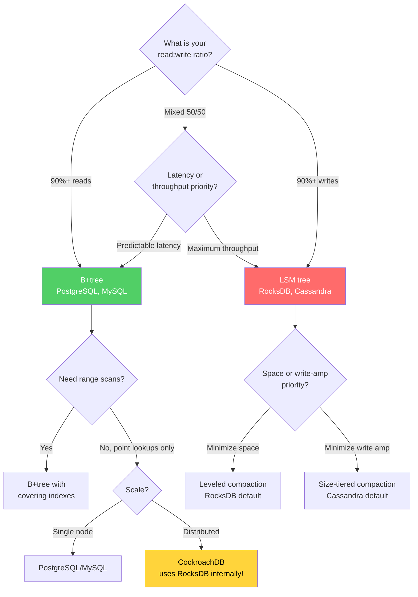

---

## Advanced Topics

### Bw-tree (Microsoft)

The Bw-tree (Buzz-word tree), developed by Microsoft Research for their Hekaton in-memory OLTP engine and later used in Azure SQL and FASTER, is a **lock-free B+tree variant** designed for modern multi-core hardware.

**Key innovations:**

1. **Delta records instead of in-place updates.** When a page is modified, a delta record is prepended to the page's delta chain rather than modifying the page directly. This allows lock-free concurrent modifications.

2. **Mapping table.** Instead of physical page pointers, the Bw-tree uses logical page IDs that are resolved through an in-memory mapping table. This enables atomic page replacement using a single `compare-and-swap` (CAS) instruction.

3. **Log-structured page management.** Pages are not modified in place on disk. Instead, delta records are accumulated and periodically consolidated. Flushing to disk writes pages sequentially (like an LSM tree's write path).

```
Traditional B+tree page update:
  1. Latch the page (blocking)
  2. Modify in place
  3. Release the latch

Bw-tree page update:
  1. Create a delta record
  2. CAS the mapping table entry to prepend the delta (non-blocking)
  3. If CAS fails, retry (contention, not blocking)
```

**Trade-offs:**
- Lock-free operations eliminate latch contention — a major bottleneck in high-concurrency workloads
- Delta chains must be periodically consolidated (similar to LSM compaction)
- Increased complexity in implementation and debugging
- Long delta chains degrade read performance (must replay deltas)

### Fractal Trees (Tokutek)

Fractal trees (also called $B^\varepsilon$-trees or buffered trees) were developed by Tokutek (now part of Percona). They are a **write-optimized B-tree variant** that achieves near-LSM write throughput with B-tree read performance.

**Key innovation:** Every internal node has a message buffer. Instead of immediately propagating an insert down to the leaf, the insert is buffered at the first internal node it reaches. When a buffer fills up, its messages are flushed to the appropriate child node.

```
Standard B+tree insert: immediately propagates to leaf (random I/O)

Fractal tree insert:
  1. Insert message into root buffer
  2. When root buffer is full, flush messages to appropriate children
  3. Messages cascade down lazily
  4. Eventually reach the leaf
```

**Write amplification analysis:**

For a fractal tree with branching factor $B$, buffer size $\varepsilon B$ (where $0 < \varepsilon \leq 1$), and $N$ elements:

$$
WA = O\left(\frac{\log_B N}{\varepsilon B}\right)
$$

Compare with B+tree: $O(\log_B N)$ and LSM: $O(\frac{T \log_T N}{\log_2 N} \cdot \log_B N)$

Fractal trees offer a smooth trade-off between B-tree and LSM performance by adjusting $\varepsilon$:
- $\varepsilon = 1$: behaves like a standard B+tree (fast reads, slow writes)
- $\varepsilon \to 0$: approaches LSM-like behavior (fast writes, slower reads)

TokuDB (MySQL storage engine) and TokuMX (MongoDB storage engine) used fractal trees. After Percona's acquisition of Tokutek, development slowed, but the ideas influenced other storage engine designs.

### LLAMA: Log-Structured Latch-Free Access Method

LLAMA, developed by Microsoft Research alongside the Bw-tree, provides a **log-structured storage layer optimized for flash (SSD) storage**. Key ideas:

1. **Page-level log structuring.** Instead of updating pages in place, LLAMA appends modified pages to a sequential log. This converts random writes to sequential writes — ideal for flash storage.

2. **Latch-free page management.** Uses CAS operations to update the mapping table, eliminating latches entirely.

3. **Cooperative flush.** Multiple threads can contribute to flushing the log buffer, preventing any single thread from becoming a bottleneck.

4. **Separation of logical and physical pages.** The mapping table maps logical page IDs to physical locations, enabling transparent page migration and compaction.

### The Impact of SSD vs HDD on Storage Engine Choice

The choice between SSD and HDD has profound implications for storage engine selection:

**On HDD:**
- Random reads: 100-200 IOPS (4-10ms per read)
- Sequential reads: 100-200 MB/s
- **Random I/O is catastrophically expensive.** This makes B+tree writes (random page updates) very slow and heavily favors LSM trees (sequential writes).
- Compaction I/O competes with foreground I/O, and HDDs cannot parallelize — so compaction causes severe performance degradation.

**On SSD (NVMe):**
- Random reads: 100,000-500,000 IOPS (10-20 $\mu$s per read)
- Sequential reads: 3,000-7,000 MB/s
- The random vs. sequential gap is much smaller (10-50x instead of 1000x on HDD)
- B+tree random writes are now only 10-50x slower than LSM sequential writes, not 1000x
- SSDs can parallelize operations, so compaction interference is less severe
- **SSD write endurance** matters: LSM write amplification of 30-50x burns through SSD write cycles faster

The implication: **SSDs reduce the advantage of LSM trees over B+trees.** On NVMe SSDs, B+trees are competitive for many write-heavy workloads where LSM trees were previously the only viable option. This is one reason why PostgreSQL (B+tree) remains viable even for high-write workloads on modern hardware.

$$
\text{Effective write speed ratio} = \frac{\text{LSM sequential write speed}}{\text{B+tree random write speed} \times WA_{\text{LSM}} / WA_{\text{B+tree}}}
$$

On HDD:

$$
\frac{150 \text{ MB/s}}{0.15 \text{ MB/s} \times 50/20} = \frac{150}{0.375} = 400\times \text{ advantage for LSM}
$$

On NVMe SSD:

$$
\frac{3000 \text{ MB/s}}{300 \text{ MB/s} \times 50/20} = \frac{3000}{750} = 4\times \text{ advantage for LSM}
$$

LSM trees still win on SSDs, but by 4x, not 400x. In many practical scenarios, the operational simplicity of B+trees outweighs a 4x write throughput difference.

### Hybrid Approaches

Modern systems increasingly blend B-tree and LSM ideas:

**WiredTiger (MongoDB):** Offers both B-tree and LSM modes. The B-tree mode uses some LSM-like ideas (in-memory deltas, checkpoint-based persistence).

**PebblesDB (SOSP 2017):** Introduces "guards" — a fragmented LSM structure that reduces write amplification by allowing key-range overlap within a level but only within guard boundaries.

**Silk (USENIX ATC 2019):** An I/O scheduler for LSM trees that prioritizes foreground operations over compaction, reducing the tail latency impact of background work.

**SlimDB:** Uses a combination of tiered compaction for write-heavy levels and leveled compaction for read-heavy levels, adapting the compaction strategy per level.

**MatrixKV:** Stores L0 SSTables in persistent memory (Intel Optane) to reduce L0-to-L1 compaction overhead, which is the primary bottleneck in leveled compaction.

### The Future: Learned Indexes

Traditional B+trees and LSM trees use fixed data structures (pages, SSTables) to index data. A radical alternative, proposed by Tim Kraska et al. (2018) in "The Case for Learned Index Structures," replaces these with machine learning models.

The insight: a B+tree index is effectively a function that maps a key to a page location. That function can be approximated by a neural network or a simple linear model. If the data has a pattern (e.g., timestamps are roughly sequential), a learned model can be smaller and faster than a B+tree.

**Current state:** Learned indexes show promise for read-only workloads (e.g., ALEX, PGM-Index, RadixSpline) but handling inserts, deletes, and distribution shifts remains challenging. No major production database uses learned indexes as the primary storage engine — yet.

---

## Further Reading

- **Bayer & McCreight (1972):** "Organization and Maintenance of Large Ordered Indices" — the original B-tree paper
- **O'Neil et al. (1996):** "The Log-Structured Merge-Tree (LSM-Tree)" — the original LSM paper
- **Designing Data-Intensive Applications (Kleppmann, 2017):** Chapter 3 covers storage engines with exceptional clarity
- **Database Internals (Petrov, 2019):** The most thorough treatment of B-tree and LSM implementation details
- **RocksDB Wiki:** [github.com/facebook/rocksdb/wiki](https://github.com/facebook/rocksdb/wiki) — excellent documentation of leveled and size-tiered compaction
- **Dostoevsky (SIGMOD 2018):** "Dostoevsky: Better Space-Time Trade-Offs for LSM-Tree Based Key-Value Stores" — optimal tuning of LSM bloom filters and compaction
- **The RUM Conjecture (2016):** "Designing Access Methods: The RUM Conjecture" — formalizes the read/update/memory trade-off
- **Next:** [Write-Ahead Logging](./write-ahead-logging) — how databases survive crashes without losing data
