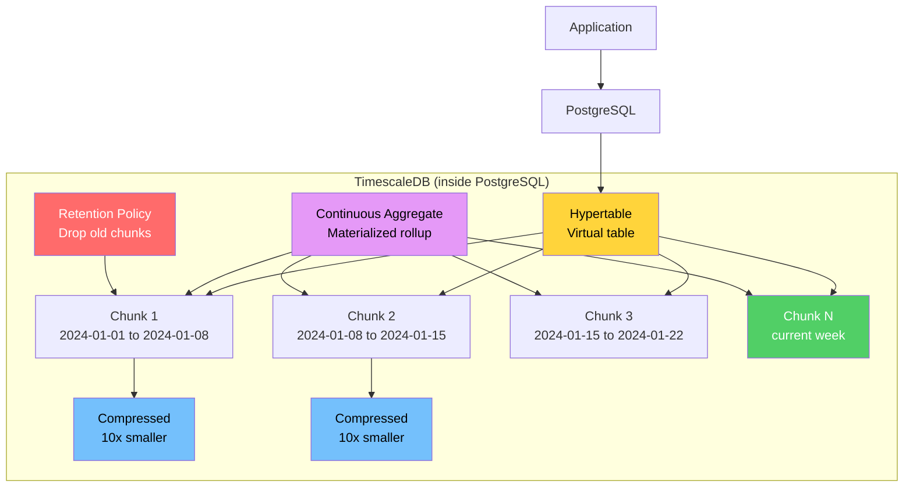
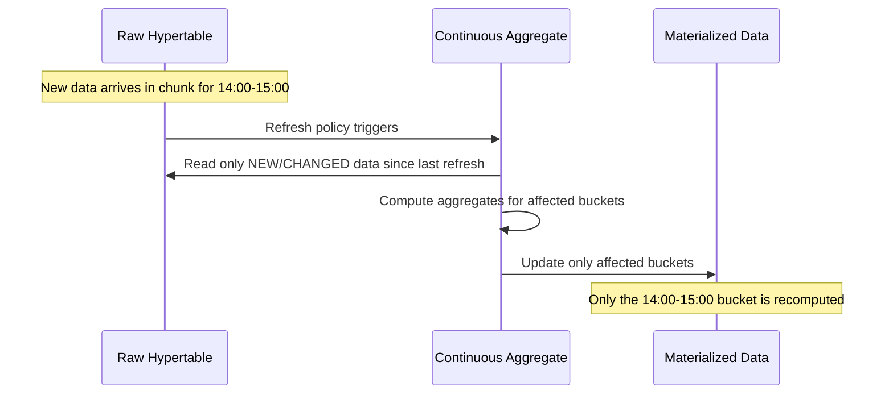
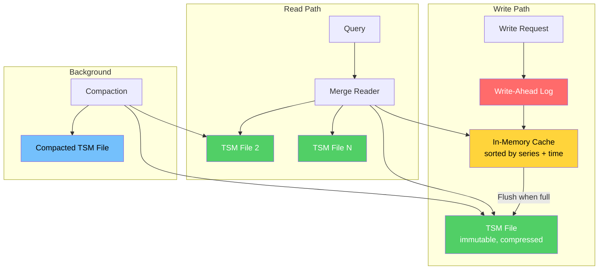
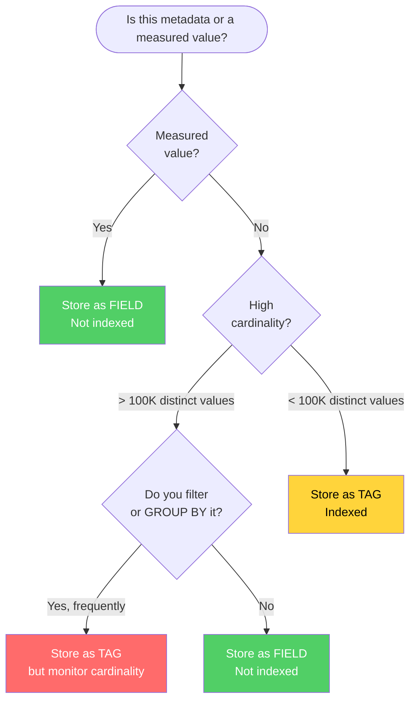
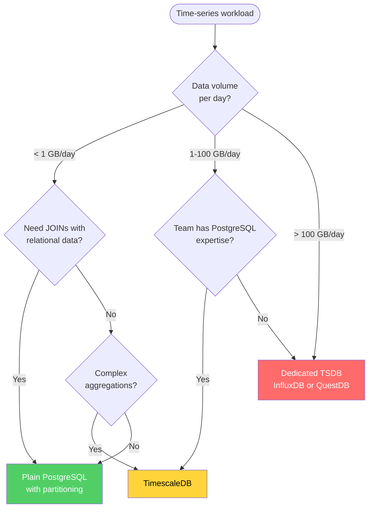

# Time-Series Databases

Time-series data is the fastest-growing category of data in the world. Every IoT sensor, every application metric, every financial tick, every server log entry, every user interaction event — they all share the same fundamental shape: a timestamp, an identifier, and one or more values. This shape seems simple, but the scale and access patterns of time-series data break traditional databases in specific, predictable ways.

This page covers why time-series data is different, what dedicated TSDBs do to handle it, and when you should (and should not) reach for one.

## What Makes Time-Series Data Special

Time-series data has five properties that distinguish it from general-purpose application data:

### 1. Append-Heavy, Rarely Updated

Time-series data is almost exclusively append-only. Once a sensor reading is recorded, it is never modified. This means:
- Updates and deletes are rare (< 0.1% of operations)
- The storage engine can be optimized for sequential writes
- MVCC overhead (versions, tombstones) is wasted

$$
\text{Write pattern:} \quad \frac{\text{inserts}}{\text{updates} + \text{deletes}} \gg 100
$$

### 2. Time-Ordered

Data arrives in roughly chronological order. Queries almost always include a time range predicate. This means:
- Data can be physically organized by time (partitioning by time range)
- Indexes on time are almost always useful
- Range scans over recent data are the dominant read pattern

### 3. High Cardinality Challenge

Each unique combination of metadata labels (called a "series" or "tag set") creates a separate time-series. For example:

```
cpu_usage{host="server-1", region="us-east", az="us-east-1a"} = series 1
cpu_usage{host="server-1", region="us-east", az="us-east-1b"} = series 2
cpu_usage{host="server-2", region="eu-west", az="eu-west-1a"} = series 3
```

If you monitor 10,000 hosts with 100 metrics each and 5 tags per metric, you can easily reach millions of unique time-series. This is the **cardinality explosion** problem — it affects index size, memory usage, and query planning.

$$
\text{Series cardinality} = \prod_{i=1}^{n} |T_i|
$$

where $|T_i|$ is the number of distinct values for tag $i$. With 3 tags having 100, 50, and 10 distinct values respectively:

$$
\text{Series} = 100 \times 50 \times 10 = 50{,}000
$$

### 4. Natural Expiry

Most time-series data becomes less valuable over time. You need second-level granularity for the last hour, minute-level for the last week, hourly for the last month, and daily for the last year. This leads to:
- **Retention policies:** Automatically delete data older than N days
- **Downsampling:** Aggregate fine-grained data into coarser summaries
- **Tiered storage:** Move old data to cheaper storage (S3, cold disks)

### 5. Aggregate-Heavy Queries

Users rarely query individual data points. Instead, they ask questions like:
- "What was the average CPU usage per host over the last 24 hours?"
- "What was the 99th percentile response time per service, bucketed into 5-minute intervals?"
- "Which sensors exceeded their threshold more than 3 times in the last hour?"

These are windowed aggregations over time — the fundamental query pattern for time-series data.

## How Traditional Databases Fail

### PostgreSQL Without Partitioning

A naive approach: create a table in PostgreSQL and insert rows.

```sql
CREATE TABLE metrics (
    time        TIMESTAMPTZ NOT NULL,
    sensor_id   TEXT NOT NULL,
    temperature DOUBLE PRECISION,
    humidity    DOUBLE PRECISION
);
CREATE INDEX idx_metrics_time ON metrics (time);
```

**What goes wrong at scale:**

| Problem | Why It Happens |
|---------|---------------|
| Insert throughput degrades | B-tree index on `time` becomes a hotspot (all inserts go to the rightmost leaf) |
| Queries slow down | Table scans grow linearly with data volume |
| VACUUM can't keep up | Dead tuples accumulate (even though there are no updates — autovacuum still runs) |
| Index bloat | B-tree indexes on ever-growing time columns become huge |
| Storage grows unboundedly | No built-in retention policy |
| Backups take forever | Full-table backups include all historical data |

### PostgreSQL WITH Partitioning

PostgreSQL's declarative partitioning (v10+) solves some of these problems:

```sql
CREATE TABLE metrics (
    time        TIMESTAMPTZ NOT NULL,
    sensor_id   TEXT NOT NULL,
    temperature DOUBLE PRECISION,
    humidity    DOUBLE PRECISION
) PARTITION BY RANGE (time);

CREATE TABLE metrics_2024_01 PARTITION OF metrics
    FOR VALUES FROM ('2024-01-01') TO ('2024-02-01');
-- ... more partitions
```

**What it fixes:**
- Partition pruning speeds up time-range queries
- Dropping old partitions is instant (`DROP TABLE metrics_2024_01`)
- Each partition has its own B-tree index, reducing hotspot severity

**What it doesn't fix:**
- You must manually create partitions (or use pg_partman)
- No automatic compression
- No continuous aggregates (must build your own materialized views)
- No downsampling automation
- Query planning overhead increases with many partitions
- Still uses B-tree storage engine — not optimized for time-series write patterns

::: tip When Partitioned PostgreSQL Is Enough
If your data volume is under 100 GB, your cardinality is under 10,000 series, and you need to JOIN time-series data with relational tables — plain partitioned PostgreSQL with pg_partman is often sufficient. The added complexity of a dedicated TSDB only pays off when you have the scale problems that PostgreSQL can't handle.
:::

## TimescaleDB

TimescaleDB is a PostgreSQL extension that turns PostgreSQL into a time-series database. Because it is an extension (not a fork), it runs inside the PostgreSQL process and has full access to all PostgreSQL features — SQL, JOINs, indexes, extensions, tools, and the entire ecosystem.

### Architecture



### Hypertables

A hypertable is TimescaleDB's core abstraction. It looks like a regular PostgreSQL table but is automatically partitioned into chunks by time.

```sql
-- Create a regular table
CREATE TABLE metrics (
    time        TIMESTAMPTZ NOT NULL,
    sensor_id   TEXT NOT NULL,
    temperature DOUBLE PRECISION,
    humidity    DOUBLE PRECISION
);

-- Convert it to a hypertable (automatic time partitioning)
SELECT create_hypertable('metrics', 'time');
```

After this call, `metrics` becomes a hypertable. Behind the scenes, TimescaleDB:
1. Creates chunks (child tables) for each time interval
2. Automatically creates new chunks as data arrives
3. Routes inserts to the correct chunk based on the timestamp
4. Prunes irrelevant chunks during queries

**Chunk interval:** By default, TimescaleDB selects a chunk interval so that each chunk contains about 25% of available memory. For example, if data arrives at 1 GB per day and you have 32 GB of RAM, chunks might cover 7-day intervals. You can override this:

```sql
SELECT create_hypertable('metrics', 'time', chunk_time_interval => INTERVAL '1 day');
```

### Space Partitioning

In addition to time-based partitioning, TimescaleDB supports partitioning by a second dimension (typically a tag like `sensor_id` or `host`). This is called space partitioning:

```sql
SELECT create_hypertable('metrics', 'time',
    partitioning_column => 'sensor_id',
    number_partitions => 4
);
```

This creates a 2D grid of chunks:

$$
\text{Total chunks} = \frac{\text{Time range}}{\text{Chunk interval}} \times \text{Space partitions}
$$

Space partitioning helps when:
- Multiple disks are available (parallelize I/O across partitions)
- Multi-node TimescaleDB distributes chunks across data nodes
- Queries frequently filter on the space dimension

### Compression

TimescaleDB's compression converts row-oriented chunks into a columnar format with type-specific compression. Compression ratios of 10-20x are common.

```sql
-- Enable compression on a hypertable
ALTER TABLE metrics SET (
    timescaledb.compress,
    timescaledb.compress_segmentby = 'sensor_id',
    timescaledb.compress_orderby = 'time DESC'
);

-- Compress chunks older than 7 days
SELECT add_compression_policy('metrics', INTERVAL '7 days');
```

**How it works internally:**

```
Before compression (row-oriented):
┌──────────────┬───────────┬─────────────┬──────────┐
│ time         │ sensor_id │ temperature │ humidity │
├──────────────┼───────────┼─────────────┼──────────┤
│ 2024-01-01T1 │ s1        │ 22.5        │ 45.2     │
│ 2024-01-01T2 │ s1        │ 22.6        │ 45.1     │
│ 2024-01-01T3 │ s1        │ 22.4        │ 45.3     │
│ 2024-01-01T1 │ s2        │ 18.1        │ 60.2     │
└──────────────┴───────────┴─────────────┴──────────┘

After compression (columnar, segmented by sensor_id):
Segment: sensor_id = 's1'
┌──────────────────────────────────────────────────┐
│ time: [delta-of-delta encoded] → 3 bytes         │
│ temperature: [gorilla float encoding] → 4 bytes  │
│ humidity: [gorilla float encoding] → 4 bytes      │
└──────────────────────────────────────────────────┘
Segment: sensor_id = 's2'
┌──────────────────────────────────────────────────┐
│ time: [delta-of-delta encoded] → 1 byte          │
│ temperature: [gorilla float encoding] → 2 bytes  │
│ humidity: [gorilla float encoding] → 2 bytes      │
└──────────────────────────────────────────────────┘
```

**Compression algorithms by data type:**

| Data Type | Algorithm | Why |
|-----------|-----------|-----|
| Timestamps | Delta-of-delta | Timestamps are regularly spaced; the delta between consecutive deltas is often 0 |
| Floats | Gorilla (XOR-based) | Consecutive float values are often similar; XOR of adjacent values has many leading zeros |
| Integers | Delta + Simple-8b | Integer sequences often have small, predictable differences |
| Text (low cardinality) | Dictionary | Few distinct values — store dictionary + indexes |
| Text (high cardinality) | LZ4 | General-purpose compression |

### Continuous Aggregates

Continuous aggregates are materialized views that are incrementally maintained — they automatically update as new data arrives, without re-computing the entire aggregation.

```sql
CREATE MATERIALIZED VIEW hourly_metrics
WITH (timescaledb.continuous) AS
SELECT
    time_bucket('1 hour', time) AS bucket,
    sensor_id,
    AVG(temperature) AS avg_temp,
    MAX(temperature) AS max_temp,
    MIN(temperature) AS min_temp,
    COUNT(*) AS sample_count
FROM metrics
GROUP BY bucket, sensor_id;

-- Automatically refresh every hour, covering the last 3 hours
SELECT add_continuous_aggregate_policy('hourly_metrics',
    start_offset => INTERVAL '3 hours',
    end_offset => INTERVAL '1 hour',
    schedule_interval => INTERVAL '1 hour'
);
```

**How incremental refresh works:**



You can even build continuous aggregates on top of continuous aggregates — for example, hourly rollups feeding into daily rollups:

```sql
CREATE MATERIALIZED VIEW daily_metrics
WITH (timescaledb.continuous) AS
SELECT
    time_bucket('1 day', bucket) AS day,
    sensor_id,
    AVG(avg_temp) AS avg_temp,
    MAX(max_temp) AS max_temp,
    MIN(min_temp) AS min_temp,
    SUM(sample_count) AS total_samples
FROM hourly_metrics
GROUP BY day, sensor_id;
```

### Retention Policies

```sql
-- Automatically drop raw data older than 90 days
SELECT add_retention_policy('metrics', INTERVAL '90 days');

-- Keep hourly aggregates for 1 year
SELECT add_retention_policy('hourly_metrics', INTERVAL '1 year');

-- Keep daily aggregates forever (no retention policy)
```

This creates a tiered retention strategy:

$$
\text{Storage cost} = \underbrace{90 \text{ days}}_{\text{raw}} \times R_{\text{raw}} + \underbrace{365 \text{ days}}_{\text{hourly}} \times R_{\text{hourly}} + \underbrace{\infty}_{\text{daily}} \times R_{\text{daily}}
$$

where $R_{\text{raw}} \gg R_{\text{hourly}} \gg R_{\text{daily}}$ because aggregation dramatically reduces data volume.

## InfluxDB

InfluxDB is a purpose-built time-series database — not an extension on top of a relational database, but a ground-up design optimized for time-series workloads.

### Data Model

InfluxDB uses a unique data model with specific terminology:

| Concept | Definition | Example |
|---------|-----------|---------|
| **Measurement** | Like a table — groups related time-series | `cpu_usage` |
| **Tag** | Indexed metadata (string only) — used for filtering and grouping | `host=server-1`, `region=us-east` |
| **Field** | The actual measured values (any type) — NOT indexed | `usage_idle=95.2`, `usage_system=3.1` |
| **Timestamp** | Time of the measurement (nanosecond precision) | `2024-01-15T10:30:00Z` |
| **Series** | A unique combination of measurement + tag set | `cpu_usage,host=server-1,region=us-east` |

```
Measurement: cpu_usage
┌─────────────────────────────┬───────────────────┬──────────────┬──────────────┐
│ time                        │ host (tag)        │ usage_idle   │ usage_system │
│                             │                   │ (field)      │ (field)      │
├─────────────────────────────┼───────────────────┼──────────────┼──────────────┤
│ 2024-01-15T10:30:00.000Z    │ server-1          │ 95.2         │ 3.1          │
│ 2024-01-15T10:30:00.000Z    │ server-2          │ 87.4         │ 8.2          │
│ 2024-01-15T10:30:10.000Z    │ server-1          │ 94.8         │ 3.5          │
└─────────────────────────────┴───────────────────┴──────────────┴──────────────┘
```

::: danger Tags vs Fields: The Critical Distinction
Tags are indexed; fields are not. Querying by a field value requires a full scan of all data points. The most common InfluxDB performance mistake is putting high-cardinality data (like user IDs or request IDs) as tags — this explodes the series index. Conversely, putting frequently-queried metadata as fields means those queries are unbearably slow.

**Rule of thumb:** If you GROUP BY or filter by it frequently, it's a tag. If it's the measured value, it's a field. If it has more than ~100,000 distinct values, it should probably be a field (or you need to rethink your data model).
:::

### TSM Storage Engine

InfluxDB uses the **Time Structured Merge Tree (TSM)** engine — a variant of LSM trees specifically designed for time-series data.



**TSM file structure:**

```
┌────────────────────────────────────────┐
│ Header (magic number, version)         │
├────────────────────────────────────────┤
│ Data Blocks                            │
│ ┌──────────────────────────────────┐   │
│ │ Block 1: series_key + timestamps │   │
│ │          + values (compressed)   │   │
│ ├──────────────────────────────────┤   │
│ │ Block 2: series_key + timestamps │   │
│ │          + values (compressed)   │   │
│ ├──────────────────────────────────┤   │
│ │ ...                              │   │
│ └──────────────────────────────────┘   │
├────────────────────────────────────────┤
│ Index                                  │
│ (series_key → block offset mappings)   │
├────────────────────────────────────────┤
│ Footer (index offset)                  │
└────────────────────────────────────────┘
```

**Compression within data blocks:**
- Timestamps: Delta encoding + run-length encoding (RLE) for regular intervals, then simple-8b packing
- Float values: Gorilla encoding (Facebook's algorithm — XOR of adjacent values)
- Integer values: Delta + zigzag encoding + simple-8b packing
- Strings: Snappy compression
- Booleans: Bit packing (1 bit per value)

### Flux Query Language

InfluxDB 2.x introduced Flux — a functional query language designed for time-series transformations:

```flux
// Average CPU usage per host, 5-minute buckets, last 24 hours
from(bucket: "monitoring")
  |> range(start: -24h)
  |> filter(fn: (r) => r._measurement == "cpu_usage")
  |> filter(fn: (r) => r._field == "usage_idle")
  |> aggregateWindow(every: 5m, fn: mean)
  |> group(columns: ["host"])
  |> yield(name: "cpu_avg")
```

**Key Flux operations:**

| Function | Purpose |
|----------|---------|
| `from()` + `range()` | Select data source and time range |
| `filter()` | Filter by tags, fields, measurements |
| `aggregateWindow()` | Bucket data by time and apply aggregate |
| `map()` | Transform each row |
| `pivot()` | Convert fields from rows to columns |
| `join()` | Combine data from multiple sources |
| `movingAverage()` | Sliding window average |
| `derivative()` | Rate of change |
| `difference()` | Difference between consecutive values |
| `histogram()` | Distribution of values |
| `quantile()` | Percentile calculation |

### Retention Policies

```flux
// Create a bucket with 30-day retention
influx bucket create --name monitoring --retention 30d

// Downsample to 1-hour resolution for long-term storage
option task = {
    name: "downsample_cpu",
    every: 1h,
}

from(bucket: "monitoring")
  |> range(start: -task.every)
  |> filter(fn: (r) => r._measurement == "cpu_usage")
  |> aggregateWindow(every: 1h, fn: mean)
  |> to(bucket: "monitoring_longterm")
```

## QuestDB

QuestDB is a high-performance time-series database built from scratch in Java and C++, optimized for maximum ingestion speed.

### Architecture

QuestDB uses a **columnar storage engine** where each column is stored as a separate memory-mapped file:

```
Table: sensor_data
├── time.d          (timestamp column - 8 bytes per value)
├── sensor_id.d     (symbol column - 4 bytes per value, dictionary encoded)
├── sensor_id.k     (symbol dictionary keys)
├── sensor_id.v     (symbol dictionary values)
├── temperature.d   (double column - 8 bytes per value)
├── humidity.d      (double column - 8 bytes per value)
└── _txn            (transaction file)
```

**Why this is fast:**
- Memory-mapped files leverage the OS page cache without serialization overhead
- Columnar layout means aggregating one column reads only that column's file — no wasted I/O on unneeded columns
- Fixed-size columns (doubles, longs) require no parsing — just pointer arithmetic
- Append-only writes are sequential I/O — the fastest operation on any storage device

### SQL Support

QuestDB supports SQL via the PostgreSQL wire protocol:

```sql
-- Time-bucketed aggregation with SAMPLE BY
SELECT
    sensor_id,
    avg(temperature) AS avg_temp,
    max(temperature) AS max_temp,
    count() AS samples
FROM sensor_data
WHERE time > dateadd('d', -7, now())
SAMPLE BY 1h
ALIGN TO CALENDAR;
```

The `SAMPLE BY` clause is QuestDB's native time-bucketing syntax — equivalent to TimescaleDB's `time_bucket()` but built into the parser for optimal execution.

### Performance Characteristics

QuestDB's published benchmarks show:

| Metric | QuestDB | InfluxDB | TimescaleDB |
|--------|---------|----------|-------------|
| Write throughput (rows/sec) | 1.4M | 200K | 400K |
| Disk usage (10B rows) | 28 GB | 85 GB | 65 GB |
| Simple aggregation latency | 15ms | 150ms | 80ms |
| Complex aggregation latency | 200ms | 2s | 500ms |

::: warning Benchmark Caveats
These benchmarks are from QuestDB's marketing materials. Real-world performance depends heavily on hardware, data shape, cardinality, query patterns, and configuration. Always run your own benchmarks with your own data. TimescaleDB with compression and continuous aggregates can match or exceed QuestDB for many analytical queries, and InfluxDB's performance varies significantly between versions (1.x vs 2.x vs 3.x).
:::

## Comparison Table

| Feature | TimescaleDB | InfluxDB (2.x) | QuestDB |
|---------|-------------|----------------|---------|
| **Foundation** | PostgreSQL extension | Custom (Go) | Custom (Java/C++) |
| **Query Language** | SQL (full PostgreSQL) | Flux | SQL (PostgreSQL wire) |
| **Storage Engine** | PostgreSQL heap + compression | TSM (LSM variant) | Columnar (mmap) |
| **JOINs** | Full SQL JOINs | Limited (Flux join) | SQL JOINs |
| **Compression** | Columnar, 10-20x | Block-level, 5-10x | Columnar, 10-15x |
| **Continuous Aggregates** | Built-in, incremental | Tasks (scheduled Flux) | Not built-in |
| **Retention Policies** | Built-in (drop_chunks) | Built-in (bucket TTL) | Not built-in (manual) |
| **Clustering** | Multi-node (Enterprise) | Enterprise only | Single-node |
| **Ecosystem** | Full PostgreSQL ecosystem | Telegraf, Grafana | Grafana, PostgreSQL tools |
| **Best For** | Existing PostgreSQL users, relational + time-series | Pure monitoring/IoT | Extreme ingestion speed |
| **Worst For** | Highest ingestion rates | Complex relational queries | Production features |

## Data Modeling for Time-Series

### Wide vs Narrow Schema

**Narrow schema (one metric per row):**

```
time                  | metric_name  | value
2024-01-15T10:30:00   | cpu_idle     | 95.2
2024-01-15T10:30:00   | cpu_system   | 3.1
2024-01-15T10:30:00   | memory_free  | 4096
```

**Wide schema (all metrics in one row):**

```
time                  | cpu_idle | cpu_system | memory_free
2024-01-15T10:30:00   | 95.2     | 3.1        | 4096
```

**Trade-offs:**

| Aspect | Narrow | Wide |
|--------|--------|------|
| Adding new metrics | Easy (just insert new rows) | Requires ALTER TABLE |
| Query for single metric | Simple filter | Column selection |
| Query for multiple metrics | Requires JOIN or pivot | Simple SELECT |
| Storage efficiency | Repeats timestamp per metric | One timestamp per row |
| Compression | Worse (mixed data in value column) | Better (homogeneous columns) |
| Cardinality | Higher (metric_name is an extra dimension) | Lower |
| InfluxDB native model | Yes (one field per row) | Via pivot |
| TimescaleDB preference | Both work | Better compression |
| QuestDB preference | Both work | Much better performance |

::: tip Practical Recommendation
Use the **wide schema** when:
- Metrics are always collected together (e.g., all CPU metrics come from the same collector)
- The set of metrics is relatively stable
- You frequently query multiple metrics at the same time

Use the **narrow schema** when:
- Metrics are heterogeneous (different types, different collection frequencies)
- New metrics are added frequently
- Each metric is queried independently
:::

### Tag Design

For all TSDBs, the choice of tags (indexed metadata) versus fields (unindexed values) is critical:



### Handling High Cardinality

High cardinality is the number one performance killer in time-series databases. When the number of unique series exceeds the series index's memory capacity, performance degrades rapidly.

**Strategies for managing cardinality:**

1. **Avoid encoding unique IDs as tags.** A `request_id` or `trace_id` should be a field, not a tag. You don't GROUP BY request IDs — you look them up by time range and other tags.

2. **Use bounded tag values.** Instead of tagging with `user_id` (millions of values), tag with `user_tier` (free/pro/enterprise — 3 values).

3. **Pre-aggregate at the source.** Instead of sending one metric per HTTP request, aggregate at the application level and send one metric per minute per endpoint.

4. **Shard by tag.** If you must have high-cardinality tags, distribute the data across multiple databases or measurements to keep per-database cardinality manageable.

$$
\text{Memory usage} \approx \text{Series count} \times \text{Bytes per series index entry}
$$

For InfluxDB, each series consumes approximately 1 KB of memory in the series index. At 10 million series, that's 10 GB just for the index — often more than the data itself.

## When to Use a Dedicated TSDB vs Regular PostgreSQL



**Choose plain PostgreSQL when:**
- Data volume is small (< 1 GB/day)
- You need full SQL with JOINs to relational tables
- The time-series data is just one part of a larger relational application
- Your team already knows PostgreSQL and doesn't want another database to manage

**Choose TimescaleDB when:**
- You want time-series features (compression, continuous aggregates, retention) on top of PostgreSQL
- You need SQL JOINs between time-series and relational data
- Data volume is moderate (1-100 GB/day)
- You value the PostgreSQL ecosystem (tooling, extensions, monitoring)

**Choose InfluxDB when:**
- Your workload is pure monitoring/IoT (no relational data)
- You need built-in integration with Telegraf collectors and Grafana
- You want a purpose-built system that requires minimal schema design
- Data volume is moderate to high

**Choose QuestDB when:**
- Ingestion speed is the primary concern (millions of rows per second)
- Your queries are primarily SQL aggregations over time
- You can tolerate a less mature ecosystem
- Single-node deployment is acceptable

## Real-World Benchmark: Ingestion

To ground these comparisons in reality, here is a controlled benchmark setup and methodology you can reproduce:

**Setup:**
- 10,000 simulated IoT devices
- Each device reports 10 metrics every 10 seconds
- Total: 10,000 writes per second (100K metrics per second)
- Data shape: timestamp (8 bytes) + device_id (tag) + 10 float64 fields (80 bytes) per row
- Duration: 24 hours

**Expected daily data volume (uncompressed):**

$$
\text{Daily volume} = 10{,}000 \times \frac{86{,}400}{10} \times (8 + 80) \text{ bytes} \approx 7.6 \text{ GB/day}
$$

**Key observations:**
- At this scale (10K writes/sec), all four options (PostgreSQL, TimescaleDB, InfluxDB, QuestDB) handle the write load
- The differentiation appears at query time: aggregating 24 hours of data across all devices takes ~50ms on QuestDB, ~200ms on TimescaleDB (with continuous aggregates: < 10ms), ~500ms on InfluxDB, and ~2s on plain PostgreSQL
- At 100K writes/sec (10x), plain PostgreSQL falls behind. TimescaleDB keeps up with compression enabled. InfluxDB and QuestDB handle it comfortably
- At 1M writes/sec (100x), only QuestDB and InfluxDB (with careful tuning) maintain sub-second ingestion latency
