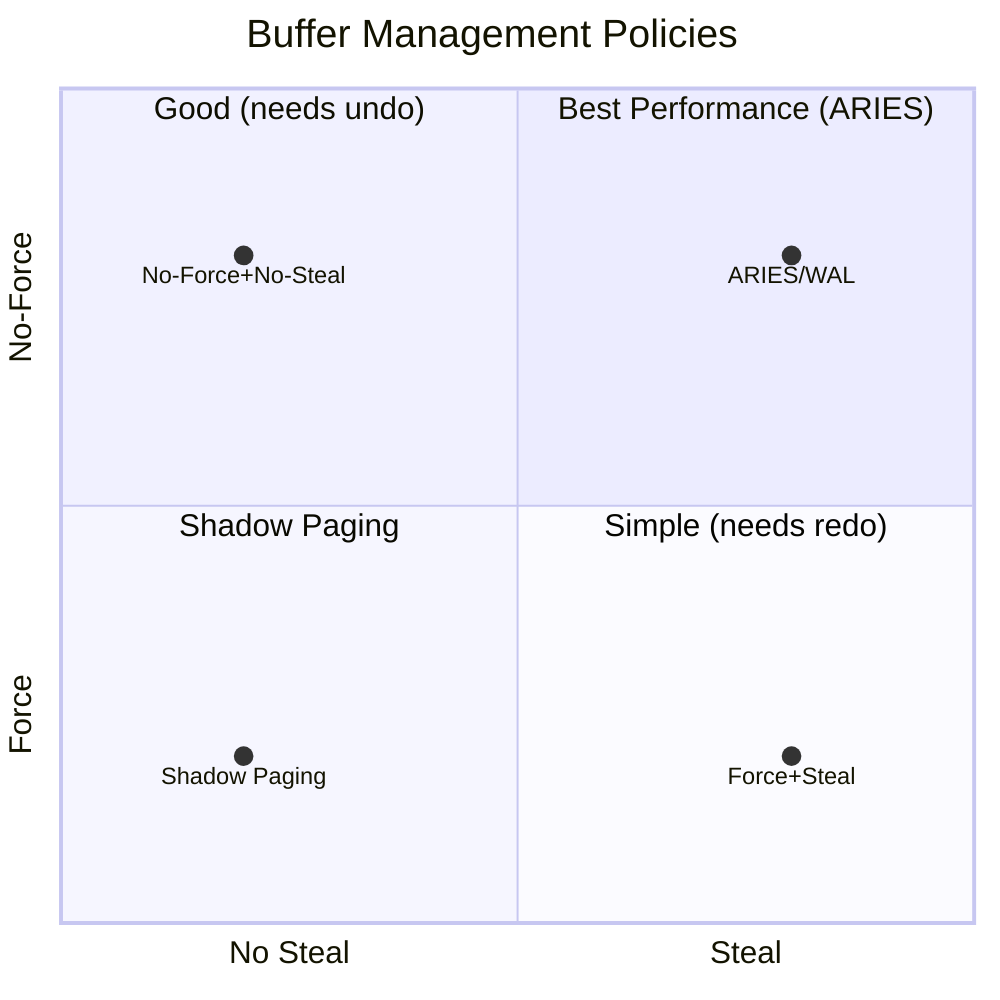
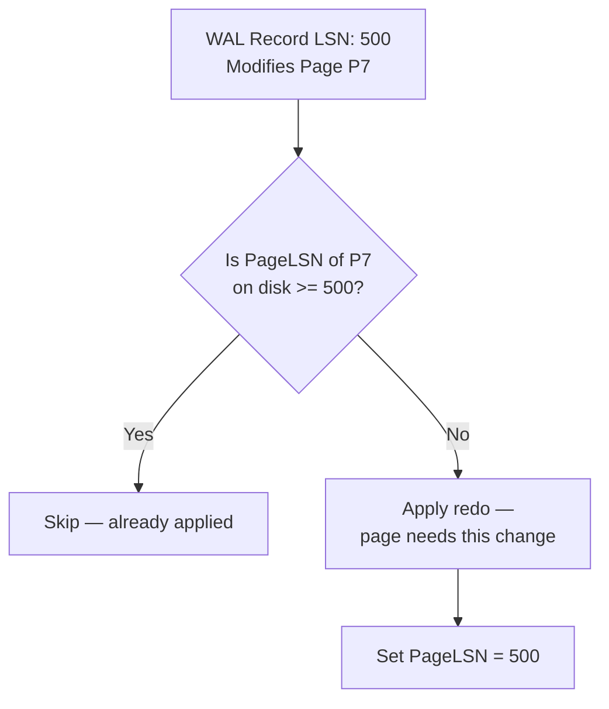
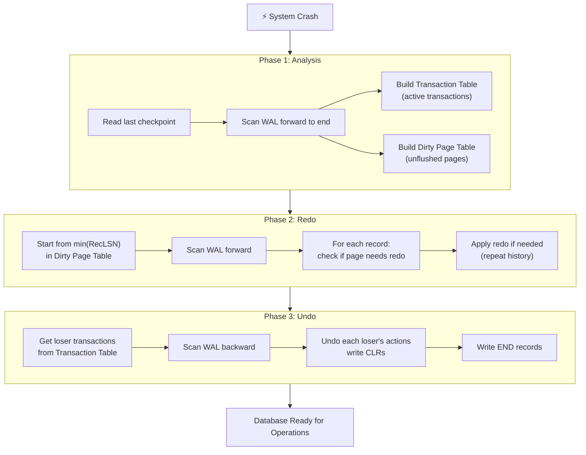
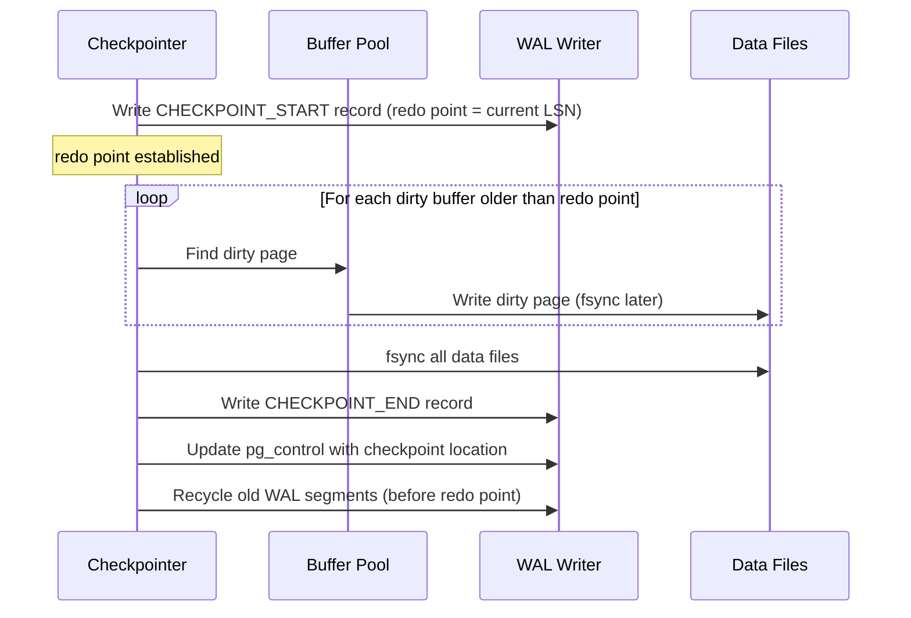
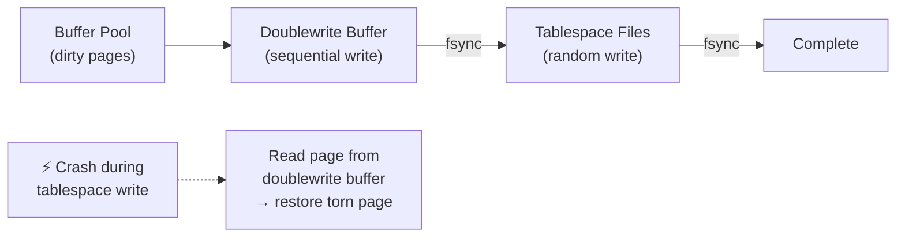
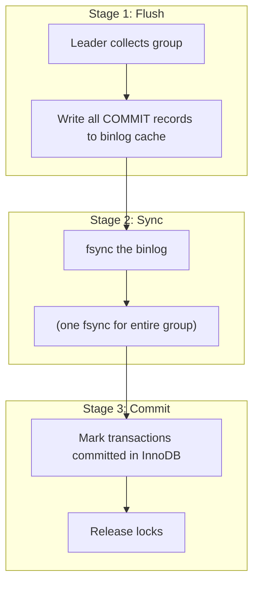
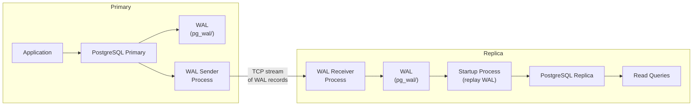
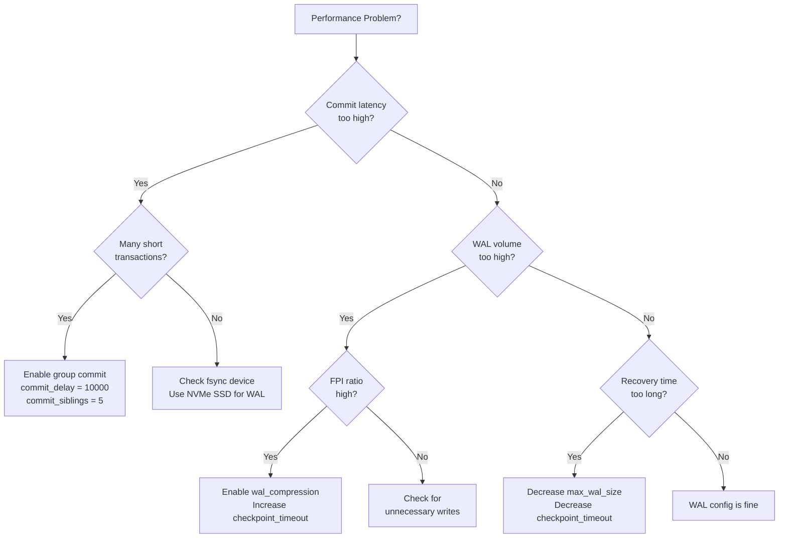

# Write-Ahead Logging (WAL)

Write-Ahead Logging is the single most important technique in database engineering. Without it, databases cannot guarantee durability — the "D" in ACID. Every serious database engine uses some form of WAL: PostgreSQL calls it WAL, MySQL InnoDB calls it the redo log, SQLite calls it the WAL file, Oracle calls it the redo log. The names differ but the principle is identical. If you understand WAL deeply, you understand how databases survive crashes, how replication works, and why certain performance characteristics exist.

This is not a surface-level overview. We will go from first principles through the ARIES recovery algorithm, through real-world implementations in PostgreSQL and MySQL, through TypeScript simulations, through the math of recovery time, and through war stories from production failures.

## Level 1: Why It Exists — The Durability Problem

### The Naive Approach and Why It Fails

Imagine you're building a database from scratch. A transaction modifies three pages (a page is the fundamental unit of storage, typically 8 KB in PostgreSQL, 16 KB in InnoDB). The simplest approach: write the modified pages directly to the data files on disk.

The problem is atomic failure. If you're writing three pages and power fails after page 2 is written but before page 3:

- The database is now in an inconsistent state
- Page 1 and 2 reflect the transaction, page 3 does not
- You cannot roll back because you've overwritten the original data
- You cannot roll forward because you don't know what page 3 should contain

```
Transaction T1 modifies pages P1, P2, P3:

  Time ──────────────────────────────────────────────►

  Write P1 to disk    ✓ (committed bits on platter)
  Write P2 to disk    ✓ (committed bits on platter)
  Write P3 to disk    ⚡ POWER FAILURE

  Result: P1 and P2 have new data, P3 has old data
          Database is CORRUPT — no way to fix it
```

This is called a **torn write** or **partial write** — and it's not a theoretical concern. It happens in production regularly. Hard drives, SSDs, and operating systems make no guarantees about atomicity of multi-page writes.

### The Fundamental Insight

The WAL protocol solves this with one deceptively simple rule:

> **Before modifying any data page on disk, first write a log record describing the change to a sequential log file, and ensure that log record is durable (fsync'd).**

This is the "write-ahead" part — the log is written *ahead* of the data. If the system crashes:

- If the log record was NOT written: the change never happened, no corruption
- If the log record WAS written but the data page was NOT updated: replay the log to apply the change
- If both were written: no recovery needed

The key properties that make this work:

1. **Sequential I/O:** The log is append-only. Sequential writes are 100-1000x faster than random writes on spinning disks and 5-10x faster on SSDs.
2. **Small writes:** A log record describing "change byte 42 on page 7 from 0x00 to 0xFF" is much smaller than writing the entire 8 KB page.
3. **Atomicity of small writes:** A single sector write (512 bytes or 4 KB on modern drives) is atomic. A single log record fits within a sector boundary.

### The Cost of Durability

Durability is not free. The WAL introduces a mandatory `fsync` on every transaction commit. An `fsync` forces the operating system to flush its write buffers to the physical storage medium — it blocks until the bits are actually on the platter (HDD) or the NAND cells (SSD).

On a typical SSD, `fsync` latency is 0.1–2 ms. On a spinning disk, it's 5–15 ms (one full disk rotation). This puts a hard ceiling on transaction throughput:

$$
\text{Max TPS (single-threaded)} = \frac{1}{\text{fsync latency}} = \frac{1}{0.001 \text{s}} = 1000 \text{ TPS (SSD)}
$$

$$
\text{Max TPS (single-threaded, HDD)} = \frac{1}{0.010 \text{s}} = 100 \text{ TPS}
$$

Group commit (covered later) breaks through this ceiling by batching multiple transactions into a single fsync.

## Level 2: First Principles — The WAL Protocol Rules

The WAL protocol is governed by two inviolable rules:

### Rule 1: Write-Ahead Logging Rule (WAL Rule)

A data page $P$ must NOT be written to the stable database (data files on disk) until ALL log records describing changes to $P$ have been flushed to stable storage (the WAL).

Formally:

$$
\forall P: \text{PageLSN}(P) \leq \text{FlushedLSN} \quad \text{before } P \text{ is written to disk}
$$

Where:
- $\text{PageLSN}(P)$ is the LSN of the most recent log record that modified page $P$
- $\text{FlushedLSN}$ is the LSN of the most recently flushed WAL record

### Rule 2: Force-at-Commit Rule

When a transaction commits, ALL of its log records — including the COMMIT record — must be flushed to stable storage BEFORE the commit acknowledgment is returned to the client.

$$
\forall T: \text{COMMIT}(T) \implies \text{all log records of } T \text{ are on stable storage}
$$

These two rules together guarantee:

- **Durability:** A committed transaction's changes can always be reconstructed from the log
- **Atomicity:** An uncommitted transaction's changes can always be undone using undo information in the log

### No-Force and Steal Policies

WAL enables two critical buffer management policies:

**No-Force:** You do NOT need to force dirty data pages to disk at commit time. The WAL records are sufficient for recovery. This dramatically improves commit latency because you avoid random I/O to data files.

**Steal:** You CAN write dirty pages to disk BEFORE the transaction commits (to free buffer pool space). This is safe because the WAL contains undo information to reverse the changes if the transaction aborts.



The combination of **steal + no-force** is what ARIES uses, and it's what PostgreSQL and MySQL implement. It requires both redo AND undo information in the log, but provides the best runtime performance.

## Level 3: Core Mechanics — WAL Record Format and Structure

### Log Sequence Number (LSN)

Every WAL record is assigned a monotonically increasing Log Sequence Number. The LSN serves as:

1. **A unique identifier** for each log record
2. **A physical address** into the log (in PostgreSQL, the LSN is the byte offset into the WAL stream)
3. **An ordering mechanism** — if $\text{LSN}_a < \text{LSN}_b$, then record $a$ was written before record $b$

In PostgreSQL, an LSN is a 64-bit integer formatted as two 32-bit hex numbers: `0/16B3748`. It represents the byte offset from the start of the WAL.

```
PostgreSQL LSN format: 0/16B3748
                        │ │
                        │ └── Lower 32 bits: offset within segment
                        └──── Upper 32 bits: segment group

Total WAL capacity: 2^64 bytes = 16 exabytes
```

### WAL Record Structure

A WAL record typically contains the following fields:

```
┌──────────────────────────────────────────────────────────────┐
│                     WAL Record Header                        │
├──────────┬───────────┬──────────┬──────────┬────────────────┤
│ LSN      │ Prev LSN  │ Tx ID    │ Type     │ Length         │
│ (8 bytes)│ (8 bytes) │ (4 bytes)│ (1 byte) │ (4 bytes)     │
├──────────┴───────────┴──────────┴──────────┴────────────────┤
│                     Record Body                              │
├──────────┬───────────┬──────────┬───────────────────────────┤
│ Page ID  │ Offset    │ Redo Data│ Undo Data                 │
│ (8 bytes)│ (2 bytes) │ (var)    │ (var)                     │
├──────────┴───────────┴──────────┴───────────────────────────┤
│ CRC-32 Checksum (4 bytes)                                    │
└──────────────────────────────────────────────────────────────┘
```

**Record types** include:

| Type | Description |
|------|-------------|
| `INSERT` | A new tuple was inserted |
| `UPDATE` | An existing tuple was modified |
| `DELETE` | A tuple was deleted |
| `COMMIT` | Transaction committed |
| `ABORT` | Transaction aborted |
| `CHECKPOINT_START` | Beginning of a checkpoint |
| `CHECKPOINT_END` | End of a checkpoint |
| `COMPENSATION (CLR)` | Compensation log record (undo of an undo) |

### The PrevLSN Chain

Each log record contains a `PrevLSN` pointer — the LSN of the previous log record written by the same transaction. This forms a per-transaction linked list through the log, enabling efficient traversal during undo:

```
Transaction T1's records in the WAL:

  LSN 100: INSERT (PrevLSN: NULL)  ◄─── T1's first operation
      │
      ▼
  LSN 250: UPDATE (PrevLSN: 100)
      │
      ▼
  LSN 480: DELETE (PrevLSN: 250)
      │
      ▼
  LSN 530: COMMIT (PrevLSN: 480)


To undo T1: follow PrevLSN chain from LSN 480 → 250 → 100
```

### Page LSN

Every data page in the buffer pool carries a `PageLSN` — the LSN of the most recent WAL record that modified that page. This is critical for two purposes:

1. **WAL Rule enforcement:** Before writing page $P$ to disk, ensure $\text{PageLSN}(P) \leq \text{FlushedLSN}$
2. **Idempotent redo:** During recovery, skip redo of a log record if the page's on-disk LSN is already $\geq$ the record's LSN (the change was already applied)



## Level 4: ARIES Recovery Algorithm

ARIES (Algorithms for Recovery and Isolation Exploiting Semantics) is the gold standard recovery algorithm, published by C. Mohan et al. at IBM Research in 1992. PostgreSQL, MySQL InnoDB, SQL Server, and DB2 all implement variations of ARIES.

ARIES operates in three phases after a crash: **Analysis**, **Redo**, and **Undo**.

### Data Structures for Recovery

ARIES maintains two critical in-memory data structures that are periodically checkpointed:

**Transaction Table (TT):** Tracks all active transactions at the time of the crash.

| Field | Description |
|-------|-------------|
| `TransID` | Transaction identifier |
| `Status` | Running, Committing, Aborting |
| `LastLSN` | LSN of the most recent log record for this transaction |
| `UndoNxtLSN` | Next LSN to undo (for transactions being rolled back) |

**Dirty Page Table (DPT):** Tracks all pages in the buffer pool that have been modified but not yet written to disk.

| Field | Description |
|-------|-------------|
| `PageID` | Identifier of the dirty page |
| `RecLSN` | The LSN of the first log record that dirtied this page since it was last flushed (recovery LSN) |

### Phase 1: Analysis

The Analysis phase scans the WAL forward from the most recent checkpoint to the end of the log. Its goals:

1. Reconstruct the Transaction Table — determine which transactions were active at crash time
2. Reconstruct the Dirty Page Table — determine which pages might need redo
3. Determine the starting point for the Redo phase

```
Checkpoint                                  Crash
    │                                          │
    ▼                                          ▼
────┬──────┬──────┬──────┬──────┬──────┬──────┬────
    │ CP   │ Ins  │ Upd  │ Comm │ Ins  │ Del  │
    │ T1,T2│ T1   │ T3   │ T1   │ T3   │ T2   │
────┴──────┴──────┴──────┴──────┴──────┴──────┴────

    ─────────── Analysis scans forward ──────────►

    Result:
    - Transaction Table: {T2: active, T3: active}
      (T1 committed, so it's removed)
    - Dirty Page Table: {pages modified by T1, T2, T3}
    - Redo start LSN: min(RecLSN) from Dirty Page Table
```

**Algorithm:**

1. Initialize TT and DPT from the checkpoint record
2. Scan forward through the log:
   - For each log record of transaction $T$: add/update $T$ in TT, set $\text{LastLSN}(T) = \text{current LSN}$
   - For each log record modifying page $P$: if $P \notin \text{DPT}$, add $P$ with $\text{RecLSN} = \text{current LSN}$
   - For COMMIT records: remove $T$ from TT
   - For ABORT/END records: remove $T$ from TT
3. At end of log: TT contains all "loser" transactions that need undo; DPT contains all pages that might need redo

### Phase 2: Redo (Repeating History)

ARIES's redo phase is distinctive because it **repeats history** — it redoes ALL logged actions, including those of transactions that will be undone. This simplifies recovery and ensures the database state is exactly what it was at crash time.

The redo scan starts from the smallest RecLSN in the Dirty Page Table and scans forward:

```
Redo Start                                 End of Log
    │                                          │
    ▼                                          ▼
────┬──────┬──────┬──────┬──────┬──────┬──────┬────
    │ Ins  │ Upd  │ Upd  │ Comm │ Ins  │ Del  │
    │ T1   │ T3   │ T1   │ T1   │ T3   │ T2   │
────┴──────┴──────┴──────┴──────┴──────┴──────┴────

    ────────────── Redo scans forward ───────────►

    For EACH log record:
    1. Is the page in the DPT?
       No → skip (page was flushed before crash)
    2. Is the record's LSN < RecLSN for this page?
       Yes → skip (change was already on disk)
    3. Fetch the page from disk. Is PageLSN >= record's LSN?
       Yes → skip (change was already applied)
    4. Otherwise → REDO the operation
```

**Why repeat history?** By redoing everything — including uncommitted transactions — ARIES restores the exact pre-crash state. This means undo can use the same logic as normal transaction rollback. It also means Compensation Log Records (CLRs) from in-progress rollbacks are correctly replayed.

### Phase 3: Undo (Rolling Back Losers)

The Undo phase rolls back all transactions that were active at crash time ("loser" transactions). It processes them simultaneously, scanning backward through the log:

```
Start of Log                               End of Log
    │                                          │
    ▼                                          ▼
────┬──────┬──────┬──────┬──────┬──────┬──────┬────
    │ Ins  │ Upd  │ Upd  │ Comm │ Ins  │ Del  │
    │ T1   │ T3   │ T1   │ T1   │ T3   │ T2   │
────┴──────┴──────┴──────┴──────┴──────┴──────┴────

    ◄──────────── Undo scans backward ──────────

    Undo T2's DELETE at LSN 6 → write CLR
    Undo T3's INSERT at LSN 5 → write CLR
    Undo T3's UPDATE at LSN 2 → write CLR

    (T1 committed — not undone)
```

**Compensation Log Records (CLRs):** Each undo operation writes a CLR to the WAL. A CLR records the undo action and includes a `UndoNxtLSN` pointing to the next record to undo. CLRs are redo-only — they are never undone themselves. This prevents infinite undo loops if the system crashes during recovery:

```
Original:     CLR:
LSN 480       LSN 600
Type: DELETE  Type: CLR (compensation)
TxID: T2      TxID: T2
Page: P5      Page: P5
Data: ...     Data: reverse of DELETE (re-insert)
PrevLSN: 250  PrevLSN: 480
              UndoNxtLSN: 250  ←── skip to T2's previous action
```

### ARIES Recovery — Complete Flow



## Level 5: fsync and the Durability Guarantee

### What fsync Actually Does

When a process calls `write()`, the operating system copies data into kernel buffer cache (page cache) and returns immediately. The data is NOT on disk — it's in volatile RAM. If power fails now, the data is lost.

`fsync(fd)` forces the kernel to flush all modified pages associated with file descriptor `fd` to the physical storage device. It blocks until the device confirms the write is complete.

```
Application          Kernel              Disk
    │                  │                   │
    │  write(fd, buf)  │                   │
    │─────────────────►│                   │
    │  return (fast)   │  (data in cache)  │
    │◄─────────────────│                   │
    │                  │                   │
    │  fsync(fd)       │                   │
    │─────────────────►│  flush to disk    │
    │                  │──────────────────►│
    │                  │  disk confirms    │
    │                  │◄──────────────────│
    │  return (slow)   │                   │
    │◄─────────────────│                   │
```

### The fsync Reliability Problem

`fsync` has a dark history of unreliability:

**Linux kernel bug (pre-5.2):** If `fsync` failed (returned an error), the dirty pages were marked clean in the page cache. A subsequent `fsync` would report success — but the data was never written. PostgreSQL was particularly affected. The kernel would lose track of the failure state.

::: danger The PostgreSQL fsync Disaster (2018)
In 2018, the PostgreSQL community discovered that their `fsync` error handling was broken on Linux. If `fsync` returned `EIO` (I/O error), PostgreSQL would retry the `fsync` — but the Linux kernel had already discarded the dirty pages. The retry would succeed (nothing to flush), but the data was lost. PostgreSQL had been silently losing data on fsync failures for years. The fix: PostgreSQL now panics (crashes) on fsync failure, forcing full recovery from WAL. This is the only safe response.
:::

**Write barriers and disk caches:** Modern disks have write caches (volatile RAM on the disk controller). When the OS sends a write, the disk controller may report completion before data reaches the non-volatile medium. `fsync` must issue a cache flush command (FUA — Force Unit Access, or a full cache flush) to ensure true durability. Cheap consumer SSDs sometimes lie about flush completion.

### Battery-Backed Write Cache (BBWC)

Enterprise storage controllers include battery-backed write caches. The controller acknowledges writes immediately (into its battery-backed RAM), and drains the cache to disk in the background. If power fails, the battery keeps the cache alive long enough to complete the writes on power restore.

With BBWC:

$$
\text{Effective fsync latency} \approx 0.01\text{ ms (BBWC acknowledge)}
$$

$$
\text{Max single-threaded TPS} = \frac{1}{0.00001\text{ s}} = 100{,}000 \text{ TPS}
$$

This is why enterprise database deployments always use hardware RAID controllers with BBWC.

### Direct I/O vs Buffered I/O

Some databases bypass the OS page cache entirely using `O_DIRECT`:

| Approach | Used By | Pros | Cons |
|----------|---------|------|------|
| Buffered I/O + fsync | PostgreSQL | OS handles caching, simpler code | Double buffering (DB buffer pool + OS page cache), fsync flushes everything |
| Direct I/O | MySQL InnoDB (`innodb_flush_method=O_DIRECT`) | No double buffering, precise control | Must manage all caching in userspace |

PostgreSQL uses buffered I/O because its developers believe the OS page cache provides benefits (read-ahead, write coalescence) that outweigh the cost of double buffering. InnoDB uses direct I/O because it manages its own buffer pool and does not want the OS duplicating cached pages.

## Level 6: WAL in PostgreSQL

### pg_wal Directory Structure

PostgreSQL stores WAL files in the `$PGDATA/pg_wal/` directory (called `pg_xlog/` before PostgreSQL 10). Each WAL file is called a **segment** and is 16 MB by default (configurable with `--wal-segsize` at `initdb` time).

```
$PGDATA/pg_wal/
├── 000000010000000000000001    (segment 1: bytes 0–16MB)
├── 000000010000000000000002    (segment 2: bytes 16MB–32MB)
├── 000000010000000000000003    (segment 3: bytes 32MB–48MB)
├── ...
└── archive_status/
    ├── 000000010000000000000001.done
    └── 000000010000000000000002.ready
```

Segment file naming: `TTTTTTTTSSSSSSSSSSSSSSSS` where:
- `T` = timeline ID (8 hex digits) — changes during point-in-time recovery
- `S` = segment number (16 hex digits)

### WAL Record Types in PostgreSQL

PostgreSQL defines WAL record types per resource manager. Key resource managers:

| Resource Manager | Purpose | Record Types |
|-----------------|---------|--------------|
| `Heap` | Table data | INSERT, UPDATE, DELETE, HOT_UPDATE, TRUNCATE |
| `Heap2` | Table data (overflow) | CLEAN, FREEZE_PAGE, VISIBLE, MULTI_INSERT, LOCK |
| `Btree` | B-tree indexes | INSERT_LEAF, INSERT_UPPER, SPLIT, DELETE |
| `Transaction` | Transaction status | COMMIT, ABORT, PREPARE |
| `XLOG` | WAL management | CHECKPOINT_ONLINE, CHECKPOINT_SHUTDOWN, END_OF_RECOVERY |
| `Standby` | Replication info | LOCK, RUNNING_XACTS, INVALIDATIONS |

You can inspect WAL records using `pg_waldump`:

```sql
-- Show WAL records between two LSNs
$ pg_waldump -s 0/16B3700 -e 0/16B3800 /path/to/pg_wal

rmgr: Heap    len (rec/tot):     59/    59, tx:      738, lsn: 0/16B3748,
  prev 0/16B3710, desc: INSERT off 3 flags 0x00,
  blkref #0: rel 1663/16384/16385 blk 0
```

### The Checkpoint Process

A checkpoint ensures that all data pages modified before the checkpoint's redo point have been flushed to disk. After a checkpoint, recovery only needs to replay WAL from the checkpoint's redo point forward — not from the beginning of time.



Key checkpoint parameters in PostgreSQL:

```sql
-- Trigger checkpoint every 5 minutes
checkpoint_timeout = 5min

-- Trigger checkpoint when WAL reaches this size
max_wal_size = 1GB

-- Spread checkpoint I/O over this fraction of the interval
checkpoint_completion_target = 0.9

-- Minimum WAL retained (for replication slots)
min_wal_size = 80MB
```

### wal_level Settings

PostgreSQL's `wal_level` controls how much information is written to the WAL:

| Level | Records | Use Case |
|-------|---------|----------|
| `minimal` | Only crash recovery | Standalone server, no replication |
| `replica` | + data for replication | Streaming replication (default since PG 10) |
| `logical` | + logical decoding info | Logical replication, CDC |

Higher WAL levels generate more WAL traffic. `logical` can generate 10-20% more WAL volume than `replica`.

### WAL Writer Process

PostgreSQL has a dedicated `wal writer` background process that periodically flushes WAL buffers to disk. This reduces the number of fsync calls needed at commit time:

1. Transaction writes WAL record to WAL buffer (shared memory)
2. At commit, transaction calls `XLogFlush()` which:
   - If the WAL writer already flushed past this LSN → return immediately (fast path)
   - Otherwise → flush WAL buffers to disk and fsync

The WAL writer runs every `wal_writer_delay` (default 200ms) and flushes `wal_writer_flush_after` pages (default 1MB).

## Level 7: WAL in MySQL InnoDB

### The Redo Log

InnoDB's redo log serves the same purpose as PostgreSQL's WAL but has a different architecture. Key differences:

**Fixed-size circular buffer:** InnoDB's redo log was historically a fixed set of files (`ib_logfile0`, `ib_logfile1`), each of configurable size. Since MySQL 8.0.30, the redo log is stored in `#innodb_redo/` with automatic management.

```
Before MySQL 8.0.30:
  ibdata/
  ├── ib_logfile0   (fixed size, e.g., 1 GB)
  └── ib_logfile1   (fixed size, e.g., 1 GB)

  Total redo space = innodb_log_file_size × innodb_log_files_in_group

After MySQL 8.0.30:
  #innodb_redo/
  ├── #ib_redo0
  ├── #ib_redo1
  └── ...  (automatically managed)
```

**The circular buffer problem:** Because the redo log is fixed size, InnoDB must ensure that the oldest redo records have been checkpointed (their corresponding dirty pages flushed to the tablespace files) before those log positions can be overwritten. If the redo log fills up, InnoDB enters a **synchronous checkpoint** — all transactions stall while dirty pages are flushed. This is a performance cliff.

```
Redo Log (circular buffer):

  ┌─────────────────────────────────────────────┐
  │▓▓▓▓▓▓▓▓▓▓▓▓▓▓▓░░░░░░░░░░░░░░░░░░░░░░░░░░░│
  │              ▲                ▲              │
  │              │                │              │
  │        Checkpoint LSN    Current LSN         │
  │              │                │              │
  │   ◄──flushed──┤◄──active──────┤──free──►     │
  └─────────────────────────────────────────────┘

  If Current LSN catches up to Checkpoint LSN:
  ⚠️  REDO LOG FULL — all writes stall until checkpoint advances
```

### Doublewrite Buffer

InnoDB faces an additional problem that PostgreSQL handles differently: **torn pages**. InnoDB's page size is 16 KB, but most filesystems and disk sectors are 4 KB. A power failure during a page write can result in a half-written (torn) page — 4 KB of new data and 12 KB of old data.

The doublewrite buffer solves this:

1. Before writing dirty pages to their tablespace locations, InnoDB first writes them sequentially to the **doublewrite buffer** (a contiguous area in the system tablespace or dedicated files)
2. `fsync` the doublewrite buffer
3. Write the pages to their actual locations in the tablespace files
4. `fsync` the tablespace files

If a crash occurs during step 3, InnoDB detects the torn page (checksum mismatch) and recovers it from the doublewrite buffer.



::: info Why PostgreSQL Doesn't Need Doublewrite
PostgreSQL uses **full-page writes** instead. After a checkpoint, the first modification to any page writes the ENTIRE page image into the WAL (a "full-page image" or FPI). If the on-disk page is torn, recovery replaces it entirely from the FPI in the WAL. This trades more WAL volume for architectural simplicity. PostgreSQL's `full_page_writes = on` (default) controls this.
:::

### InnoDB Crash Recovery

InnoDB's crash recovery is similar to ARIES but simplified:

1. **Redo:** Scan the redo log from the last checkpoint and apply all redo records. InnoDB uses physical redo (page-level) so this is straightforward.
2. **Undo:** Roll back all uncommitted transactions using the undo log (stored in the system tablespace or undo tablespaces).

There's no separate analysis phase because InnoDB's redo log contains enough metadata to determine which transactions were active.

## Level 8: Group Commit — Breaking the fsync Barrier

### The Problem

As established in Level 1, single-threaded transaction throughput is limited by fsync latency. If each transaction requires its own fsync, you get at most $1/\text{fsync\_latency}$ TPS.

### The Solution: Group Commit

Group commit batches multiple transactions' WAL records into a single fsync call:

1. Transaction $T_1$ writes its COMMIT record to the WAL buffer
2. Before $T_1$ can fsync, transactions $T_2$, $T_3$, $T_4$ also write their COMMIT records
3. One fsync call flushes all four transactions' records to disk
4. All four transactions are notified of successful commit

```
Without group commit:
  T1: write─fsync─ack    T2: write─fsync─ack    T3: write─fsync─ack
  Total: 3 × fsync_latency

With group commit:
  T1: write──┐
  T2: write──┼── fsync ── ack (T1, T2, T3)
  T3: write──┘
  Total: 1 × fsync_latency for 3 transactions
```

### PostgreSQL's CommitDelay

PostgreSQL implements group commit with `commit_delay`:

```sql
-- Wait up to 10ms for more transactions to join the group
commit_delay = 10000  -- microseconds (10ms)

-- Only use commit_delay if at least 5 transactions are active
commit_siblings = 5
```

The leader-follower model:
1. The first transaction to request a WAL flush becomes the **group leader**
2. The leader waits `commit_delay` microseconds for followers to join
3. The leader performs a single fsync for the entire group
4. All followers are woken up and notified

### MySQL's Binary Log Group Commit

MySQL has a more complex group commit because it must coordinate TWO logs: the InnoDB redo log and the binary log (binlog):



The `binlog_group_commit_sync_delay` parameter controls how long to wait for more transactions to join a group.

### Throughput Math

With group commit, the throughput formula becomes:

$$
\text{TPS} = \frac{N_{\text{group}}}{\text{fsync\_latency} + \text{group\_wait}}
$$

Where $N_{\text{group}}$ is the average number of transactions per group.

For a busy system with 100 concurrent transactions and 1ms fsync latency:

$$
\text{TPS} = \frac{100}{0.001 + 0.001} = 50{,}000 \text{ TPS}
$$

This is 50x better than the 1,000 TPS limit without group commit.

## Level 9: WAL-Based Replication

### The Key Insight

The WAL contains a complete, ordered record of every change to the database. If you ship WAL records to another server and replay them, you get an exact copy of the database. This is WAL-based (physical) replication.

### PostgreSQL Streaming Replication



**Synchronous vs Asynchronous Replication:**

| Mode | Behavior | Commit Latency | Data Loss on Primary Failure |
|------|----------|----------------|------------------------------|
| Async | Primary doesn't wait for replica | Low | Possible (uncommitted WAL) |
| Sync (remote_write) | Wait until replica writes WAL to OS cache | Medium | Possible (OS crash on replica) |
| Sync (on) | Wait until replica fsyncs WAL | High | Zero |
| Sync (remote_apply) | Wait until replica applies WAL | Highest | Zero, reads see latest data |

Configuration:

```sql
-- Primary: postgresql.conf
wal_level = replica
max_wal_senders = 10
synchronous_standby_names = 'replica1'
synchronous_commit = on  -- or remote_apply

-- Replica: create standby.signal file, set in postgresql.conf
primary_conninfo = 'host=primary port=5432 user=replicator'
```

### Replication Lag

Replication lag is the delay between a WAL record being written on the primary and applied on the replica. It's measured in both bytes and time:

$$
\text{Lag}_{\text{bytes}} = \text{LSN}_{\text{primary}} - \text{LSN}_{\text{replica\_applied}}
$$

$$
\text{Lag}_{\text{time}} = \text{now()} - \text{timestamp of oldest unapplied WAL record}
$$

Monitor with:

```sql
-- On primary:
SELECT client_addr,
       sent_lsn,
       write_lsn,
       flush_lsn,
       replay_lsn,
       pg_wal_lsn_diff(sent_lsn, replay_lsn) AS replay_lag_bytes
FROM pg_stat_replication;

-- On replica:
SELECT now() - pg_last_xact_replay_timestamp() AS replication_delay;
```

### WAL Archiving and Point-in-Time Recovery (PITR)

Beyond streaming replication, WAL segments can be archived to external storage for point-in-time recovery:

```sql
-- postgresql.conf
archive_mode = on
archive_command = 'cp %p /archive/%f'  -- or use pgBackRest, WAL-G

-- Restore to a specific point in time:
-- recovery.conf (or postgresql.conf in PG12+)
restore_command = 'cp /archive/%f %p'
recovery_target_time = '2026-03-17 14:30:00'
```

This enables recovering the database to any point in time — not just the latest state.

## Level 10: TypeScript Implementation — WAL Simulation

### Complete WAL Engine Simulation

```typescript
// ============================================================
// Write-Ahead Logging — Complete Simulation
// ============================================================

type LSN = number;
type PageId = number;
type TransactionId = number;

// ---- WAL Record Types ----

enum WALRecordType {
  INSERT = "INSERT",
  UPDATE = "UPDATE",
  DELETE = "DELETE",
  COMMIT = "COMMIT",
  ABORT = "ABORT",
  CHECKPOINT_START = "CHECKPOINT_START",
  CHECKPOINT_END = "CHECKPOINT_END",
  CLR = "CLR", // Compensation Log Record
}

interface WALRecord {
  lsn: LSN;
  prevLSN: LSN | null; // Previous LSN for this transaction
  transactionId: TransactionId;
  type: WALRecordType;
  pageId?: PageId;
  offset?: number;
  redoData?: Buffer | Uint8Array;
  undoData?: Buffer | Uint8Array;
  // For CLR records:
  undoNextLSN?: LSN | null;
}

// ---- Page ----

interface Page {
  id: PageId;
  data: Uint8Array;
  pageLSN: LSN; // LSN of the last WAL record applied
  dirty: boolean;
}

// ---- Transaction State ----

enum TransactionStatus {
  RUNNING = "RUNNING",
  COMMITTING = "COMMITTING",
  ABORTING = "ABORTING",
  COMMITTED = "COMMITTED",
  ABORTED = "ABORTED",
}

interface TransactionEntry {
  id: TransactionId;
  status: TransactionStatus;
  lastLSN: LSN;
  undoNextLSN: LSN | null;
}

// ---- Dirty Page Table Entry ----

interface DirtyPageEntry {
  pageId: PageId;
  recLSN: LSN; // First LSN that dirtied this page
}

// ---- The WAL Engine ----

class WriteAheadLog {
  private log: WALRecord[] = [];
  private currentLSN: LSN = 0;
  private flushedLSN: LSN = -1;
  private bufferPool: Map<PageId, Page> = new Map();
  private diskPages: Map<PageId, Uint8Array> = new Map();

  // ARIES data structures
  private transactionTable: Map<TransactionId, TransactionEntry> = new Map();
  private dirtyPageTable: Map<PageId, DirtyPageEntry> = new Map();

  private lastCheckpointLSN: LSN = -1;

  // --- Public API ---

  beginTransaction(txId: TransactionId): void {
    this.transactionTable.set(txId, {
      id: txId,
      status: TransactionStatus.RUNNING,
      lastLSN: -1,
      undoNextLSN: null,
    });
  }

  write(
    txId: TransactionId,
    pageId: PageId,
    offset: number,
    newData: Uint8Array,
    oldData: Uint8Array
  ): LSN {
    // 1. Write WAL record FIRST (write-ahead rule)
    const prevLSN = this.transactionTable.get(txId)?.lastLSN ?? null;

    const record: WALRecord = {
      lsn: this.nextLSN(),
      prevLSN,
      transactionId: txId,
      type: WALRecordType.UPDATE,
      pageId,
      offset,
      redoData: newData,
      undoData: oldData,
    };

    this.log.push(record);

    // 2. Update transaction table
    const txEntry = this.transactionTable.get(txId)!;
    txEntry.lastLSN = record.lsn;

    // 3. Update dirty page table
    if (!this.dirtyPageTable.has(pageId)) {
      this.dirtyPageTable.set(pageId, {
        pageId,
        recLSN: record.lsn,
      });
    }

    // 4. Apply change to buffer pool page
    const page = this.getOrLoadPage(pageId);
    page.data.set(newData, offset);
    page.pageLSN = record.lsn;
    page.dirty = true;

    return record.lsn;
  }

  commit(txId: TransactionId): void {
    const txEntry = this.transactionTable.get(txId);
    if (!txEntry) throw new Error(`Transaction ${txId} not found`);

    // 1. Write COMMIT record to WAL
    const commitRecord: WALRecord = {
      lsn: this.nextLSN(),
      prevLSN: txEntry.lastLSN,
      transactionId: txId,
      type: WALRecordType.COMMIT,
    };
    this.log.push(commitRecord);

    // 2. FORCE: flush WAL up to commit record (the force-at-commit rule)
    this.flushWAL(commitRecord.lsn);

    // 3. Update transaction state
    txEntry.status = TransactionStatus.COMMITTED;
    txEntry.lastLSN = commitRecord.lsn;

    // Note: we do NOT force dirty pages to disk (no-force policy)
  }

  abort(txId: TransactionId): void {
    const txEntry = this.transactionTable.get(txId);
    if (!txEntry) throw new Error(`Transaction ${txId} not found`);

    // Undo all operations for this transaction
    this.undoTransaction(txId);

    // Write ABORT record
    const abortRecord: WALRecord = {
      lsn: this.nextLSN(),
      prevLSN: txEntry.lastLSN,
      transactionId: txId,
      type: WALRecordType.ABORT,
    };
    this.log.push(abortRecord);
    this.flushWAL(abortRecord.lsn);

    txEntry.status = TransactionStatus.ABORTED;
  }

  checkpoint(): void {
    // 1. Write CHECKPOINT_START
    const startRecord: WALRecord = {
      lsn: this.nextLSN(),
      prevLSN: null,
      transactionId: -1,
      type: WALRecordType.CHECKPOINT_START,
    };
    this.log.push(startRecord);

    // 2. Flush all dirty pages whose pageLSN <= current flushedLSN
    for (const [pageId, page] of this.bufferPool) {
      if (page.dirty) {
        // Enforce WAL rule: flush WAL up to page's LSN first
        if (page.pageLSN > this.flushedLSN) {
          this.flushWAL(page.pageLSN);
        }
        this.flushPage(pageId);
      }
    }

    // 3. Write CHECKPOINT_END with transaction table and dirty page table
    const endRecord: WALRecord = {
      lsn: this.nextLSN(),
      prevLSN: null,
      transactionId: -1,
      type: WALRecordType.CHECKPOINT_END,
    };
    this.log.push(endRecord);
    this.flushWAL(endRecord.lsn);

    this.lastCheckpointLSN = startRecord.lsn;

    console.log(
      `[CHECKPOINT] Complete at LSN ${startRecord.lsn}. ` +
        `Active transactions: ${this.transactionTable.size}, ` +
        `Dirty pages: ${this.dirtyPageTable.size}`
    );
  }

  // --- Crash and Recovery ---

  simulateCrash(): void {
    console.log("\n⚡ SYSTEM CRASH ⚡\n");

    // Lose all buffer pool contents (volatile memory is gone)
    this.bufferPool.clear();

    // Lose in-memory transaction table and dirty page table
    this.transactionTable.clear();
    this.dirtyPageTable.clear();

    // WAL records up to flushedLSN survive (they were fsync'd)
    // WAL records after flushedLSN are lost
    this.log = this.log.filter((r) => r.lsn <= this.flushedLSN);

    // Disk pages survive (they were fsync'd when flushed)
    // diskPages map represents what's on stable storage
  }

  recover(): void {
    console.log("=== ARIES RECOVERY START ===\n");

    // Phase 1: Analysis
    this.analysisPhase();

    // Phase 2: Redo
    this.redoPhase();

    // Phase 3: Undo
    this.undoPhase();

    console.log("\n=== RECOVERY COMPLETE ===");
  }

  private analysisPhase(): void {
    console.log("--- Phase 1: ANALYSIS ---");

    // Find the last checkpoint
    let checkpointLSN = -1;
    for (const record of this.log) {
      if (record.type === WALRecordType.CHECKPOINT_START) {
        checkpointLSN = record.lsn;
      }
    }

    const startLSN = checkpointLSN >= 0 ? checkpointLSN : 0;
    console.log(`  Starting analysis from LSN ${startLSN}`);

    // Scan forward from checkpoint
    for (const record of this.log) {
      if (record.lsn < startLSN) continue;

      const txId = record.transactionId;
      if (txId < 0) continue; // Skip system records

      // Update transaction table
      if (!this.transactionTable.has(txId)) {
        this.transactionTable.set(txId, {
          id: txId,
          status: TransactionStatus.RUNNING,
          lastLSN: record.lsn,
          undoNextLSN: null,
        });
      }

      const txEntry = this.transactionTable.get(txId)!;
      txEntry.lastLSN = record.lsn;

      if (record.type === WALRecordType.COMMIT) {
        txEntry.status = TransactionStatus.COMMITTED;
      } else if (record.type === WALRecordType.ABORT) {
        txEntry.status = TransactionStatus.ABORTED;
      }

      // Update dirty page table
      if (
        record.pageId !== undefined &&
        !this.dirtyPageTable.has(record.pageId)
      ) {
        this.dirtyPageTable.set(record.pageId, {
          pageId: record.pageId,
          recLSN: record.lsn,
        });
      }
    }

    // Identify loser transactions
    const losers = [...this.transactionTable.values()].filter(
      (tx) => tx.status === TransactionStatus.RUNNING
    );

    console.log(
      `  Active (loser) transactions: [${losers.map((t) => `T${t.id}`).join(", ")}]`
    );
    console.log(
      `  Dirty pages: [${[...this.dirtyPageTable.keys()].join(", ")}]`
    );
  }

  private redoPhase(): void {
    console.log("\n--- Phase 2: REDO ---");

    // Find the minimum recLSN in the dirty page table
    let redoStart = Infinity;
    for (const entry of this.dirtyPageTable.values()) {
      if (entry.recLSN < redoStart) {
        redoStart = entry.recLSN;
      }
    }

    if (redoStart === Infinity) {
      console.log("  No pages to redo");
      return;
    }

    console.log(`  Starting redo from LSN ${redoStart}`);

    for (const record of this.log) {
      if (record.lsn < redoStart) continue;
      if (record.pageId === undefined) continue;
      if (!record.redoData) continue;

      // Check 1: Is the page in the dirty page table?
      const dptEntry = this.dirtyPageTable.get(record.pageId);
      if (!dptEntry) {
        console.log(`  LSN ${record.lsn}: SKIP (page not in DPT)`);
        continue;
      }

      // Check 2: Is the record's LSN < recLSN?
      if (record.lsn < dptEntry.recLSN) {
        console.log(`  LSN ${record.lsn}: SKIP (LSN < recLSN)`);
        continue;
      }

      // Check 3: Is the page's on-disk LSN >= record's LSN?
      const page = this.getOrLoadPage(record.pageId);
      if (page.pageLSN >= record.lsn) {
        console.log(
          `  LSN ${record.lsn}: SKIP (pageLSN ${page.pageLSN} >= ${record.lsn})`
        );
        continue;
      }

      // Apply redo
      console.log(
        `  LSN ${record.lsn}: REDO ${record.type} on page ${record.pageId}`
      );
      page.data.set(record.redoData, record.offset ?? 0);
      page.pageLSN = record.lsn;
      page.dirty = true;
    }
  }

  private undoPhase(): void {
    console.log("\n--- Phase 3: UNDO ---");

    // Collect all loser transactions
    const losers = [...this.transactionTable.values()].filter(
      (tx) => tx.status === TransactionStatus.RUNNING
    );

    if (losers.length === 0) {
      console.log("  No transactions to undo");
      return;
    }

    // Build a set of LSNs to undo (using lastLSN from each loser)
    const toUndo: LSN[] = losers.map((tx) => tx.lastLSN);

    while (toUndo.length > 0) {
      // Process the largest LSN first (scan backward)
      toUndo.sort((a, b) => b - a);
      const lsn = toUndo.shift()!;

      const record = this.log.find((r) => r.lsn === lsn);
      if (!record) continue;

      // Skip non-data records
      if (
        record.type === WALRecordType.COMMIT ||
        record.type === WALRecordType.ABORT
      ) {
        if (record.prevLSN !== null) toUndo.push(record.prevLSN);
        continue;
      }

      if (record.pageId !== undefined && record.undoData) {
        console.log(
          `  Undoing LSN ${record.lsn}: ${record.type} on page ${record.pageId} (T${record.transactionId})`
        );

        // Apply undo
        const page = this.getOrLoadPage(record.pageId);
        page.data.set(record.undoData, record.offset ?? 0);

        // Write CLR
        const clr: WALRecord = {
          lsn: this.nextLSN(),
          prevLSN: record.lsn,
          transactionId: record.transactionId,
          type: WALRecordType.CLR,
          pageId: record.pageId,
          offset: record.offset,
          redoData: record.undoData, // CLR's redo = original's undo
          undoNextLSN: record.prevLSN,
        };
        this.log.push(clr);
        page.pageLSN = clr.lsn;
        page.dirty = true;

        console.log(
          `    Wrote CLR at LSN ${clr.lsn}, undoNextLSN = ${clr.undoNextLSN}`
        );
      }

      // Follow the chain
      if (record.prevLSN !== null) {
        toUndo.push(record.prevLSN);
      }
    }

    // Mark loser transactions as aborted
    for (const tx of losers) {
      tx.status = TransactionStatus.ABORTED;
      const endRecord: WALRecord = {
        lsn: this.nextLSN(),
        prevLSN: tx.lastLSN,
        transactionId: tx.id,
        type: WALRecordType.ABORT,
      };
      this.log.push(endRecord);
    }
  }

  // --- Internal Helpers ---

  private nextLSN(): LSN {
    return this.currentLSN++;
  }

  private flushWAL(upToLSN: LSN): void {
    // Simulate fsync of WAL — in reality this calls fsync()
    this.flushedLSN = Math.max(this.flushedLSN, upToLSN);
  }

  private flushPage(pageId: PageId): void {
    const page = this.bufferPool.get(pageId);
    if (!page) return;

    // Write page to "disk"
    this.diskPages.set(pageId, new Uint8Array(page.data));
    page.dirty = false;

    // Remove from dirty page table
    this.dirtyPageTable.delete(pageId);
  }

  private getOrLoadPage(pageId: PageId): Page {
    if (this.bufferPool.has(pageId)) {
      return this.bufferPool.get(pageId)!;
    }

    // Load from "disk" or create new
    const diskData = this.diskPages.get(pageId);
    const page: Page = {
      id: pageId,
      data: diskData ? new Uint8Array(diskData) : new Uint8Array(4096),
      pageLSN: diskData ? 0 : -1, // Simplified: real impl stores pageLSN in page header
      dirty: false,
    };
    this.bufferPool.set(pageId, page);
    return page;
  }

  private undoTransaction(txId: TransactionId): void {
    const txEntry = this.transactionTable.get(txId);
    if (!txEntry) return;

    // Walk the prevLSN chain and undo each operation
    let currentLSN: LSN | null = txEntry.lastLSN;

    while (currentLSN !== null && currentLSN >= 0) {
      const record = this.log.find((r) => r.lsn === currentLSN);
      if (!record) break;

      if (record.pageId !== undefined && record.undoData) {
        const page = this.getOrLoadPage(record.pageId);
        page.data.set(record.undoData, record.offset ?? 0);

        // Write CLR
        const clr: WALRecord = {
          lsn: this.nextLSN(),
          prevLSN: txEntry.lastLSN,
          transactionId: txId,
          type: WALRecordType.CLR,
          pageId: record.pageId,
          offset: record.offset,
          redoData: record.undoData,
          undoNextLSN: record.prevLSN,
        };
        this.log.push(clr);
        txEntry.lastLSN = clr.lsn;
        page.pageLSN = clr.lsn;
      }

      currentLSN = record.prevLSN;
    }
  }

  // --- Diagnostics ---

  printLog(): void {
    console.log("\n=== WAL LOG ===");
    for (const record of this.log) {
      const pageInfo = record.pageId !== undefined ? ` page=${record.pageId}` : "";
      const prevInfo =
        record.prevLSN !== null ? ` prev=${record.prevLSN}` : "";
      console.log(
        `  LSN ${record.lsn}: ${record.type} tx=T${record.transactionId}${pageInfo}${prevInfo}`
      );
    }
  }

  printState(): void {
    console.log("\n=== DATABASE STATE ===");
    console.log("Buffer Pool:");
    for (const [id, page] of this.bufferPool) {
      console.log(
        `  Page ${id}: LSN=${page.pageLSN} dirty=${page.dirty} data=[${page.data.slice(0, 8).join(",")}...]`
      );
    }
    console.log("Disk Pages:");
    for (const [id, data] of this.diskPages) {
      console.log(`  Page ${id}: data=[${data.slice(0, 8).join(",")}...]`);
    }
  }
}

// ============================================================
// Demo: crash and recovery
// ============================================================

function demo(): void {
  const wal = new WriteAheadLog();

  // Start two transactions
  wal.beginTransaction(1);
  wal.beginTransaction(2);

  // T1 writes to page 10
  wal.write(1, 10, 0, new Uint8Array([1, 2, 3, 4]), new Uint8Array([0, 0, 0, 0]));

  // T2 writes to page 20
  wal.write(2, 20, 0, new Uint8Array([5, 6, 7, 8]), new Uint8Array([0, 0, 0, 0]));

  // T1 commits successfully
  wal.commit(1);

  // T2 writes more data but does NOT commit
  wal.write(2, 20, 4, new Uint8Array([9, 10, 11, 12]), new Uint8Array([0, 0, 0, 0]));

  wal.printLog();
  wal.printState();

  // CRASH! T2 was not committed
  wal.simulateCrash();

  // Recovery: T1's changes should survive, T2's should be undone
  wal.recover();

  wal.printState();
}

demo();
```

## Checkpointing Strategies

### Time-Based Checkpointing

The simplest strategy: run a checkpoint every $N$ minutes.

```sql
-- PostgreSQL: checkpoint every 5 minutes
checkpoint_timeout = 5min
```

**Trade-off:** Short intervals mean less WAL to replay on recovery (faster recovery) but more I/O overhead during normal operation. Long intervals mean less I/O but longer recovery times.

$$
\text{Recovery time} \propto \text{WAL generated since last checkpoint}
$$

$$
\text{Checkpoint I/O overhead} \propto \frac{1}{\text{checkpoint interval}}
$$

### WAL-Size-Based Checkpointing

Trigger a checkpoint when the accumulated WAL since the last checkpoint reaches a threshold:

```sql
-- PostgreSQL: checkpoint when WAL reaches 1 GB
max_wal_size = 1GB
```

This is more adaptive than time-based — under heavy write load, checkpoints happen more frequently; under light load, they're less frequent.

### Fuzzy Checkpoints

A **sharp checkpoint** freezes the database, flushes all dirty pages, and records the checkpoint. This creates a pause visible to applications.

A **fuzzy checkpoint** (used by PostgreSQL and InnoDB) doesn't freeze anything:

1. Record the checkpoint start position (redo LSN)
2. Gradually flush dirty pages in the background over the checkpoint interval
3. Record the checkpoint end

The `checkpoint_completion_target` parameter in PostgreSQL spreads the I/O:

```sql
-- Spread checkpoint writes over 90% of the checkpoint interval
checkpoint_completion_target = 0.9

-- With checkpoint_timeout = 5min, this means:
-- Checkpoint I/O is spread over 4.5 minutes
-- Leaving 0.5 minutes of "quiet" before the next checkpoint
```

### The Recovery Time vs Runtime Performance Trade-off

$$
\text{Recovery Time} = T_{\text{analysis}} + T_{\text{redo}} + T_{\text{undo}}
$$

Where:

$$
T_{\text{redo}} \approx \frac{\text{WAL since last checkpoint}}{\text{Disk sequential read speed}} + \frac{\text{Dirty pages to apply}}{\text{Disk random write IOPS}}
$$

For a system generating 100 MB/s of WAL with checkpoints every 5 minutes:

$$
\text{WAL to replay} = 100 \text{ MB/s} \times 300 \text{ s} = 30 \text{ GB}
$$

$$
T_{\text{redo}} \approx \frac{30 \text{ GB}}{500 \text{ MB/s (SSD read)}} + \frac{30\text{GB} / 8\text{KB per page}}{50{,}000 \text{ IOPS}} \approx 60\text{s} + 75\text{s} = 135\text{s}
$$

With a 1-minute checkpoint interval:

$$
\text{WAL to replay} = 100 \text{ MB/s} \times 60 \text{ s} = 6 \text{ GB}
$$

$$
T_{\text{redo}} \approx 12\text{s} + 15\text{s} = 27\text{s}
$$

More frequent checkpoints = faster recovery, but at the cost of more I/O during normal operation.

## Performance Deep Dive

### WAL Write Throughput

WAL write performance depends on:

1. **Sequential write speed of the WAL device**
2. **fsync latency**
3. **WAL compression** (PostgreSQL 15+ supports LZ4 and ZSTD compression)
4. **Full-page writes overhead**

Typical WAL generation rates:

| Workload | WAL Generation Rate |
|----------|-------------------|
| Light OLTP (100 TPS) | 1-5 MB/s |
| Medium OLTP (1,000 TPS) | 10-50 MB/s |
| Heavy OLTP (10,000 TPS) | 50-200 MB/s |
| Bulk load | 200-500 MB/s |

### SSD vs HDD for WAL

| Metric | HDD | SATA SSD | NVMe SSD |
|--------|-----|----------|----------|
| Sequential write | 100-200 MB/s | 400-550 MB/s | 2,000-7,000 MB/s |
| fsync latency | 5-15 ms | 0.1-2 ms | 0.01-0.1 ms |
| Max single-threaded TPS | 66-200 | 500-10,000 | 10,000-100,000 |
| Max group commit TPS | 2,000-5,000 | 50,000-200,000 | 500,000-2,000,000 |

::: tip Production Best Practice
Use a dedicated NVMe SSD for the WAL directory. Separate the WAL device from the data device to prevent I/O contention between sequential WAL writes and random data page writes. In PostgreSQL, use a symlink: `pg_wal -> /nvme_device/pg_wal/`.
:::

### Full-Page Writes Impact

After a checkpoint, the first write to any page generates a **full-page image** (FPI) in the WAL — the entire 8 KB page is written to the WAL instead of just the delta. This is necessary for torn page protection but dramatically increases WAL volume.

Measurement:

```sql
-- Check full-page write ratio
SELECT
  stats_reset,
  wal_fpi,       -- Number of full-page images
  wal_records,   -- Total WAL records
  wal_bytes,     -- Total WAL bytes
  round(100.0 * wal_fpi / wal_records, 1) AS fpi_pct
FROM pg_stat_wal;
```

In a typical OLTP workload, FPIs can account for 50-80% of total WAL volume immediately after a checkpoint, dropping to near zero as pages accumulate changes.

### WAL Compression

PostgreSQL 15 introduced WAL compression for full-page images:

```sql
wal_compression = lz4  -- or zstd, pglz, on (legacy alias for pglz)
```

| Compression | WAL Size Reduction | CPU Overhead | Best For |
|-------------|-------------------|--------------|----------|
| None | 0% | 0% | CPU-bound workloads |
| pglz | 40-60% | Moderate | Compatibility |
| lz4 | 40-55% | Very low | General purpose |
| zstd | 50-70% | Low-moderate | Network-limited replication |

## War Stories

### The fsync-gate Disaster (PostgreSQL, 2018)

As mentioned in Level 5, PostgreSQL discovered that its fsync error handling was fundamentally broken on Linux. The sequence:

1. Application writes data through PostgreSQL
2. PostgreSQL writes WAL records and calls `fsync`
3. The underlying storage device returns an I/O error
4. Linux kernel reports `EIO` to PostgreSQL
5. PostgreSQL retries `fsync` — Linux reports success (it already dropped the dirty pages)
6. PostgreSQL believes the data is durable — **it is not**

The fix (PostgreSQL 12+): PostgreSQL now calls `PANIC` on any fsync failure, triggering a full crash recovery. The reasoning: once fsync fails, you cannot trust any subsequent fsync on that file descriptor. The only safe response is to crash and recover from WAL.

### The InnoDB Redo Log Sizing Disaster

A common MySQL misconfiguration: setting `innodb_log_file_size` too small. The sequence:

1. Heavy write workload generates redo log entries faster than checkpointing can flush dirty pages
2. The circular redo log fills up
3. InnoDB enters **synchronous checkpoint mode** — ALL writes stop while dirty pages are flushed
4. Application latency spikes from 1ms to 30+ seconds
5. Connection pool fills up, application errors cascade

The fix: Size the redo log to hold at least 1-2 hours of redo at peak write rate. Monitor `Log sequence number` vs `Log flushed up to` vs `Last checkpoint at` in `SHOW ENGINE INNODB STATUS`.

### The WAL Disk Full Incident

If the WAL disk fills up, PostgreSQL enters a dangerous state:

1. No new WAL records can be written
2. No transactions can commit (force-at-commit rule)
3. The checkpoint process cannot complete (it needs to write a CHECKPOINT_END record)
4. Old WAL segments cannot be recycled (checkpoint hasn't completed)
5. **Deadlock**: the system needs disk space to free disk space

Emergency response:
```bash
# Option 1: Add disk space (preferred)
# Option 2: Move old WAL segments to another disk
mv pg_wal/000000010000000000000001 /tmp/

# Option 3: Nuclear option — this WILL cause data loss if replicas exist
pg_resetwal -f $PGDATA
```

::: danger
Never run `pg_resetwal` on a production system unless you fully understand the consequences. It resets the WAL to a clean state, which means any standby servers will need to be rebuilt from scratch, and any un-checkpointed data may be inconsistent.
:::

## Decision Framework

### When to Tune WAL Parameters



### WAL Configuration Cheat Sheet

| Scenario | checkpoint_timeout | max_wal_size | wal_compression | commit_delay |
|----------|--------------------|-------------|-----------------|-------------|
| Small OLTP (<100 TPS) | 5min | 256MB | off | 0 |
| Medium OLTP (1K TPS) | 10min | 2GB | lz4 | 10000 |
| Heavy OLTP (10K+ TPS) | 15min | 8GB | lz4 | 20000 |
| Bulk loading | 30min | 16GB | lz4 | 0 |
| Minimum recovery time | 1min | 128MB | off | 0 |

## Advanced Topics

### Logical WAL Decoding

Beyond physical replication, PostgreSQL's WAL can be **logically decoded** — translating physical WAL records into logical change events (INSERT/UPDATE/DELETE on tables). This enables:

- **Change Data Capture (CDC):** Stream database changes to Kafka, Debezium, or other consumers
- **Logical replication:** Replicate specific tables between PostgreSQL instances (even different versions)
- **Event sourcing:** Treat the WAL as an event log

```sql
-- Create a logical replication slot
SELECT pg_create_logical_replication_slot('my_slot', 'pgoutput');

-- Read changes (SQL interface)
SELECT * FROM pg_logical_slot_get_changes('my_slot', NULL, NULL);

-- Output:
-- lsn      | xid  | data
-- 0/16B3D28| 738  | table public.users: INSERT: id[integer]:1 name[text]:'Alice'
```

### WAL Prefetching (PostgreSQL 15+)

During recovery, PostgreSQL 15 introduced WAL prefetching — reading ahead in the WAL to identify which data pages will be needed and issuing `posix_fadvise` or `preadv2` calls to prefetch them from disk. This can significantly speed up crash recovery:

```sql
-- Enable recovery prefetching
recovery_prefetch = try  -- or 'on'

-- Monitor prefetch effectiveness
SELECT * FROM pg_stat_recovery_prefetch;
-- prefetch    | 12847
-- hit         | 3920
-- skip_init   | 0
-- skip_new    | 15
-- skip_fpw    | 4829
-- skip_rep    | 0
-- wal_distance| 1048576
-- block_distance | 512
```

### WAL in Distributed Databases

Distributed databases extend the WAL concept across nodes:

**CockroachDB (Raft Log):** Each range (shard) maintains its own Raft consensus log. The Raft log serves as the WAL — entries are committed only after a majority of replicas acknowledge. Recovery replays the Raft log.

**TiDB (Raft + RocksDB WAL):** Two levels of WAL. The Raft log handles distributed consensus. RocksDB's WAL handles local storage durability. Both must be coordinated.

**Spanner (Paxos + Write-Ahead):** Google's Spanner uses Paxos for replication and a WAL within each Paxos group for local durability. The TrueTime API provides globally ordered timestamps that serve a function analogous to LSNs.

### Neon: WAL as the Source of Truth

Neon (serverless PostgreSQL) takes the WAL concept to its extreme: the WAL IS the database. There are no traditional data files. The architecture:

1. Compute nodes generate WAL records
2. WAL records are sent to a WAL acceptor service (Paxos group for durability)
3. A page server reconstructs data pages on demand by replaying WAL records
4. Materialized pages are cached but can always be recomputed from WAL

This enables instant database branching (fork the WAL stream), instant point-in-time recovery (seek to any LSN), and separation of storage from compute.

```
Traditional PostgreSQL:
  Compute ──► WAL ──► Data Files (source of truth)

Neon:
  Compute ──► WAL (source of truth) ──► Page Server (on-demand materialization)
```

This architectural inversion — treating WAL as the primary storage rather than a recovery mechanism — represents a fundamental shift in database design. It's only practical with cloud storage (S3) where the WAL can be stored cheaply and indefinitely.
