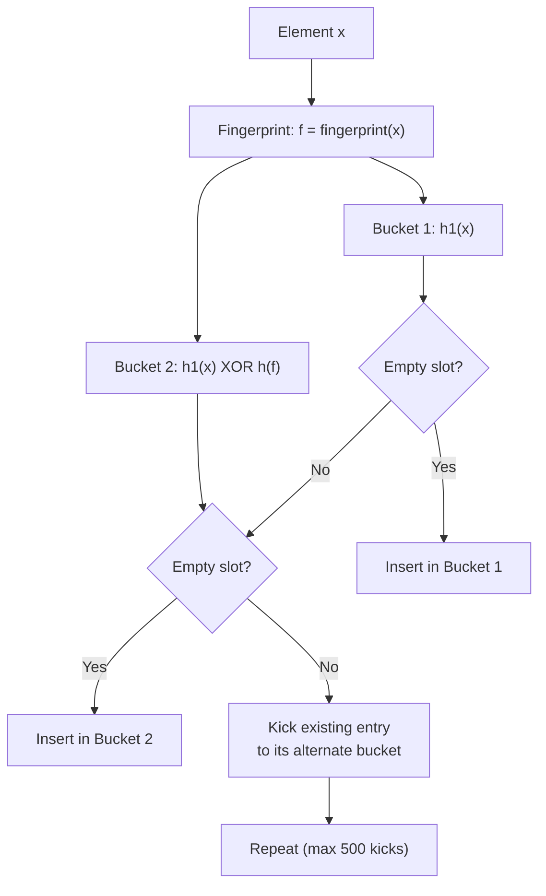
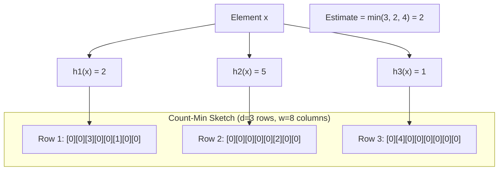

# Bloom Filters & Probabilistic Data Structures

A Bloom filter answers one question: "Is this element possibly in the set, or definitely not?" It does this using dramatically less memory than storing the actual set, at the cost of a small, tunable probability of false positives. It never produces false negatives — if the filter says "no," the element is guaranteed absent.

This trade-off turns out to be extraordinarily useful. Every query you run against a database, every URL your browser checks against a phishing list, every key lookup in an LSM-tree storage engine — all of these use Bloom filters or their descendants to avoid expensive operations that would almost certainly return "not found."

## How Bloom Filters Work

### The Data Structure

A Bloom filter is a bit array of $m$ bits, initially all set to 0, combined with $k$ independent hash functions, each mapping an element to one of the $m$ bit positions.

```
Initial state (m = 16 bits):
[0][0][0][0][0][0][0][0][0][0][0][0][0][0][0][0]
 0  1  2  3  4  5  6  7  8  9 10 11 12 13 14 15
```

### Insert Operation

To insert an element, compute all $k$ hash functions and set the corresponding bits to 1:

```
Insert "alice" with k=3 hash functions:
  h1("alice") = 2
  h2("alice") = 7
  h3("alice") = 13

[0][0][1][0][0][0][0][1][0][0][0][0][0][1][0][0]
 0  1  2  3  4  5  6  7  8  9 10 11 12 13 14 15
      ^                 ^                 ^
```

```
Insert "bob":
  h1("bob") = 4
  h2("bob") = 7    ← already set by "alice"
  h3("bob") = 11

[0][0][1][0][1][0][0][1][0][0][0][1][0][1][0][0]
 0  1  2  3  4  5  6  7  8  9 10 11 12 13 14 15
```

### Lookup Operation

To check membership, compute all $k$ hash functions and check if all corresponding bits are 1:

```
Lookup "alice": bits 2, 7, 13 → all 1 → "possibly present" ✓
Lookup "charlie": bits 1, 5, 9 → bit 1 is 0 → "definitely not present" ✗
Lookup "dave": bits 2, 4, 11 → all 1 → "possibly present" (FALSE POSITIVE!)
```

::: danger False Positives Are Fundamental
A Bloom filter can report an element as present when it is not (false positive). This happens because other insertions set the same bit positions. A Bloom filter can **never** report an element as absent when it is actually present (false negative). You cannot delete elements from a standard Bloom filter because clearing a bit might affect other elements.
:::

### The False Positive Math

The probability that a specific bit is still 0 after inserting $n$ elements with $k$ hash functions into an $m$-bit array:

$$
P(\text{bit is 0}) = \left(1 - \frac{1}{m}\right)^{kn} \approx e^{-kn/m}
$$

The false positive probability — the chance that all $k$ bits for a non-member are set to 1:

$$
P(\text{false positive}) = \left(1 - e^{-kn/m}\right)^k
$$

### Optimal Number of Hash Functions

The false positive rate is minimized when:

$$
k = \frac{m}{n} \ln 2 \approx 0.693 \times \frac{m}{n}
$$

With the optimal $k$, the false positive rate simplifies to:

$$
P(\text{fp}) = \left(\frac{1}{2}\right)^k = (0.6185)^{m/n}
$$

### Sizing a Bloom Filter

Given a desired false positive rate $p$ and expected number of elements $n$:

$$
m = -\frac{n \ln p}{(\ln 2)^2}
$$

| False positive rate | Bits per element ($m/n$) | Hash functions ($k$) |
|----|----|----|
| 10% | 4.79 | 3 |
| 1% | 9.58 | 7 |
| 0.1% | 14.38 | 10 |
| 0.01% | 19.17 | 13 |

::: tip Memory Efficiency
A Bloom filter with a 1% false positive rate uses only **9.6 bits per element** — regardless of element size. Storing 1 billion URLs (average 50 bytes each) as a set would take ~50 GB. A Bloom filter for the same set with 1% FP rate takes ~1.2 GB — a 40x reduction.
:::

## Implementation

```python
import math
import mmh3  # MurmurHash3
from bitarray import bitarray

class BloomFilter:
    def __init__(self, expected_items: int, fp_rate: float = 0.01):
        self.fp_rate = fp_rate
        self.size = self._optimal_size(expected_items, fp_rate)
        self.num_hashes = self._optimal_hashes(self.size, expected_items)
        self.bit_array = bitarray(self.size)
        self.bit_array.setall(0)
        self.count = 0

    @staticmethod
    def _optimal_size(n: int, p: float) -> int:
        """Calculate optimal bit array size."""
        m = -(n * math.log(p)) / (math.log(2) ** 2)
        return int(math.ceil(m))

    @staticmethod
    def _optimal_hashes(m: int, n: int) -> int:
        """Calculate optimal number of hash functions."""
        k = (m / n) * math.log(2)
        return int(math.ceil(k))

    def _get_hash_indices(self, item: str) -> list[int]:
        """Generate k hash indices using double hashing."""
        h1 = mmh3.hash(item, seed=0) % self.size
        h2 = mmh3.hash(item, seed=42) % self.size
        return [(h1 + i * h2) % self.size for i in range(self.num_hashes)]

    def add(self, item: str) -> None:
        for idx in self._get_hash_indices(item):
            self.bit_array[idx] = 1
        self.count += 1

    def might_contain(self, item: str) -> bool:
        """Returns True if item might be in the set, False if definitely not."""
        return all(self.bit_array[idx] for idx in self._get_hash_indices(item))

    @property
    def current_fp_rate(self) -> float:
        """Estimate current false positive rate."""
        bits_set = self.bit_array.count(1)
        return (bits_set / self.size) ** self.num_hashes


# Usage
bf = BloomFilter(expected_items=1_000_000, fp_rate=0.001)

bf.add("user:12345")
bf.add("user:67890")

print(bf.might_contain("user:12345"))  # True (correct)
print(bf.might_contain("user:99999"))  # False (or very rarely True)
```

## Counting Bloom Filters

Standard Bloom filters do not support deletion — you cannot unset a bit without potentially removing other elements. Counting Bloom filters replace each bit with a counter:

```
Standard:  [0][1][0][1][1][0][0][1]     ← 1 bit per position
Counting:  [0][2][0][1][3][0][0][1]     ← n bits (usually 4) per position
```

```python
class CountingBloomFilter:
    def __init__(self, expected_items: int, fp_rate: float = 0.01):
        self.size = self._optimal_size(expected_items, fp_rate)
        self.num_hashes = self._optimal_hashes(self.size, expected_items)
        self.counters = [0] * self.size

    def add(self, item: str) -> None:
        for idx in self._get_hash_indices(item):
            self.counters[idx] += 1

    def remove(self, item: str) -> None:
        """Remove an element. Only call if the element was previously added."""
        if not self.might_contain(item):
            raise ValueError("Cannot remove element not in filter")
        for idx in self._get_hash_indices(item):
            self.counters[idx] = max(0, self.counters[idx] - 1)

    def might_contain(self, item: str) -> bool:
        return all(self.counters[idx] > 0
                   for idx in self._get_hash_indices(item))
```

::: warning Counter Overflow
With 4-bit counters, the maximum count is 15. If a counter overflows, it stays at the maximum value and deletion becomes unsafe. The probability of overflow is negligible for well-sized filters, but monitor it in production.
:::

**Trade-off:** Counting Bloom filters use 3-4x more memory than standard Bloom filters (4 bits per counter vs 1 bit).

## Cuckoo Filters

Cuckoo filters are a modern alternative that support deletion, use less space than counting Bloom filters, and often have better lookup performance.



The key insight: each element has exactly two possible bucket locations, and you can compute one from the other using only the fingerprint (not the original element):

$$
h_2(x) = h_1(x) \oplus \text{hash}(\text{fingerprint}(x))
$$

This XOR property means you can relocate entries without knowing the original elements.

```python
import hashlib
import struct
from typing import Optional

class CuckooFilter:
    def __init__(self, capacity: int, bucket_size: int = 4,
                 fingerprint_bits: int = 8, max_kicks: int = 500):
        self.capacity = capacity
        self.bucket_size = bucket_size
        self.fp_bits = fingerprint_bits
        self.max_kicks = max_kicks
        self.buckets: list[list[int]] = [[] for _ in range(capacity)]
        self.count = 0

    def _fingerprint(self, item: str) -> int:
        h = int(hashlib.sha256(item.encode()).hexdigest(), 16)
        fp = h % ((1 << self.fp_bits) - 1) + 1  # Never 0
        return fp

    def _hash1(self, item: str) -> int:
        h = int(hashlib.md5(item.encode()).hexdigest(), 16)
        return h % self.capacity

    def _hash2(self, index: int, fingerprint: int) -> int:
        return (index ^ hash(fingerprint)) % self.capacity

    def insert(self, item: str) -> bool:
        fp = self._fingerprint(item)
        i1 = self._hash1(item)
        i2 = self._hash2(i1, fp)

        if len(self.buckets[i1]) < self.bucket_size:
            self.buckets[i1].append(fp)
            self.count += 1
            return True
        if len(self.buckets[i2]) < self.bucket_size:
            self.buckets[i2].append(fp)
            self.count += 1
            return True

        # Must kick existing entries
        import random
        i = random.choice([i1, i2])
        for _ in range(self.max_kicks):
            j = random.randrange(len(self.buckets[i]))
            fp, self.buckets[i][j] = self.buckets[i][j], fp
            i = self._hash2(i, fp)
            if len(self.buckets[i]) < self.bucket_size:
                self.buckets[i].append(fp)
                self.count += 1
                return True

        return False  # Filter is too full

    def lookup(self, item: str) -> bool:
        fp = self._fingerprint(item)
        i1 = self._hash1(item)
        i2 = self._hash2(i1, fp)
        return fp in self.buckets[i1] or fp in self.buckets[i2]

    def delete(self, item: str) -> bool:
        fp = self._fingerprint(item)
        i1 = self._hash1(item)
        i2 = self._hash2(i1, fp)
        for bucket_idx in [i1, i2]:
            if fp in self.buckets[bucket_idx]:
                self.buckets[bucket_idx].remove(fp)
                self.count -= 1
                return True
        return False
```

### Bloom Filter vs Cuckoo Filter

| Feature | Bloom Filter | Cuckoo Filter |
|---------|-------------|---------------|
| Deletion | Not supported | Supported |
| Space (at <3% FP) | More efficient | Less efficient |
| Space (at >3% FP) | Less efficient | More efficient |
| Lookup speed | $k$ hash probes | 2 hash probes |
| Insert speed | $k$ hash probes | Amortized $O(1)$ |
| Load factor | N/A | Typically ~95% |

## HyperLogLog

HyperLogLog (HLL) answers a different question: "How many distinct elements are in this set?" It does so using $O(\log \log n)$ memory — for 1 billion distinct elements, it uses only ~1.5 KB of memory with ~2% error.

### The Intuition

If you hash elements uniformly, the maximum number of leading zeros in any hash tells you roughly how many distinct elements you have seen. If the longest run of leading zeros is $R$, the estimated cardinality is $2^R$.

```
hash("alice")   = 00101...  → 2 leading zeros
hash("bob")     = 10011...  → 0 leading zeros
hash("charlie") = 00001...  → 3 leading zeros
hash("dave")    = 01100...  → 1 leading zero

Max leading zeros = 3 → estimate ≈ 2^3 = 8 distinct elements
```

This estimate has high variance. HyperLogLog reduces variance by splitting elements into $m$ buckets using the first few bits, and taking the harmonic mean of the estimates:

$$
E = \alpha_m \cdot m^2 \cdot \left(\sum_{j=1}^{m} 2^{-M_j}\right)^{-1}
$$

where $M_j$ is the maximum number of leading zeros seen in bucket $j$, and $\alpha_m$ is a bias correction constant.

```python
import hashlib
import math

class HyperLogLog:
    def __init__(self, precision: int = 14):
        """precision p: uses 2^p registers, ~1.04/sqrt(2^p) standard error."""
        self.p = precision
        self.m = 1 << precision  # Number of registers
        self.registers = [0] * self.m
        self.alpha = self._compute_alpha(self.m)

    @staticmethod
    def _compute_alpha(m: int) -> float:
        if m == 16:
            return 0.673
        elif m == 32:
            return 0.697
        elif m == 64:
            return 0.709
        else:
            return 0.7213 / (1 + 1.079 / m)

    def _hash(self, item: str) -> int:
        h = hashlib.sha1(item.encode()).hexdigest()
        return int(h[:16], 16)  # 64-bit hash

    def add(self, item: str) -> None:
        h = self._hash(item)
        # First p bits → register index
        idx = h >> (64 - self.p)
        # Remaining bits → count leading zeros
        remaining = h & ((1 << (64 - self.p)) - 1)
        leading_zeros = (64 - self.p) - remaining.bit_length() + 1
        self.registers[idx] = max(self.registers[idx], leading_zeros)

    def estimate(self) -> int:
        """Return estimated cardinality."""
        raw = self.alpha * self.m ** 2 * (
            sum(2 ** (-r) for r in self.registers) ** -1
        )

        # Small range correction
        if raw <= 2.5 * self.m:
            zeros = self.registers.count(0)
            if zeros > 0:
                return int(self.m * math.log(self.m / zeros))

        return int(raw)

    def merge(self, other: 'HyperLogLog') -> 'HyperLogLog':
        """Merge two HLLs (e.g., from different servers)."""
        assert self.p == other.p
        result = HyperLogLog(self.p)
        result.registers = [
            max(a, b) for a, b in zip(self.registers, other.registers)
        ]
        return result
```

**Standard error** of HyperLogLog: $\frac{1.04}{\sqrt{m}}$

| Precision ($p$) | Registers ($m$) | Memory | Standard Error |
|-----------------|-----------------|--------|----------------|
| 10 | 1,024 | 1 KB | 3.25% |
| 14 | 16,384 | 12 KB | 0.81% |
| 16 | 65,536 | 48 KB | 0.41% |

Redis uses HyperLogLog natively with the `PFADD` and `PFCOUNT` commands — 12 KB per counter, ~0.81% error.

## Count-Min Sketch

A Count-Min Sketch (CMS) estimates the frequency of elements in a stream using sub-linear memory. Unlike a Bloom filter (which answers "is this in the set?"), a CMS answers "approximately how many times has this element appeared?"



```python
import hashlib
import sys

class CountMinSketch:
    def __init__(self, width: int, depth: int):
        """
        width (w): number of columns. Determines accuracy: error ≤ e*N/w
        depth (d): number of rows/hash functions. Determines confidence: 1 - 1/e^d
        """
        self.w = width
        self.d = depth
        self.table = [[0] * width for _ in range(depth)]
        self.total = 0

    def _hash(self, item: str, i: int) -> int:
        h = hashlib.md5(f"{i}:{item}".encode()).hexdigest()
        return int(h, 16) % self.w

    def add(self, item: str, count: int = 1) -> None:
        self.total += count
        for i in range(self.d):
            j = self._hash(item, i)
            self.table[i][j] += count

    def estimate(self, item: str) -> int:
        """Returns an overestimate of the true count."""
        return min(
            self.table[i][self._hash(item, i)]
            for i in range(self.d)
        )

    @staticmethod
    def from_error_bounds(epsilon: float, delta: float) -> 'CountMinSketch':
        """Create CMS with error ≤ epsilon*N with probability ≥ 1-delta."""
        import math
        w = int(math.ceil(math.e / epsilon))
        d = int(math.ceil(math.log(1 / delta)))
        return CountMinSketch(w, d)
```

The error guarantee: for any element, the estimated count $\hat{f}$ satisfies:

$$
f \leq \hat{f} \leq f + \frac{\epsilon \cdot N}{\text{width}}
$$

with probability $\geq 1 - \delta$, where $N$ is the total number of insertions.

## Real-World Usage

### LSM-Tree Storage Engines (LevelDB, RocksDB, Cassandra)

Before reading an SSTable from disk, check a Bloom filter to see if the key could be there. This avoids unnecessary disk I/O for keys that do not exist in that level.

```
Query for key "user:123":
  Level 0 Bloom filter → "maybe" → read SSTable → not found
  Level 1 Bloom filter → "no" → skip (saved disk read!)
  Level 2 Bloom filter → "maybe" → read SSTable → found!
```

See [Storage Engines](/system-design/databases/storage-engines) for how this fits into the LSM-tree architecture.

### Google Chrome Safe Browsing

Chrome checks URLs against a Bloom filter of known malicious URLs stored locally. Only if the Bloom filter says "maybe" does it make a network call to verify.

### Content Delivery Networks

CDNs use Bloom filters to decide which objects to cache. Only cache an object after it has been requested more than once (the first request adds it to the filter; subsequent requests that hit the filter trigger caching).

### Database Query Optimization

PostgreSQL uses Bloom filters for join optimization, and Cassandra uses them to avoid reading SSTables that cannot contain a partition key.

### Stream Processing

Count-Min Sketch is used in network monitoring to detect heavy hitters (IPs sending the most traffic) and in advertising to track approximate impression counts.

## Comparison of Probabilistic Data Structures

| Structure | Question Answered | Memory | Error Type |
|-----------|------------------|--------|------------|
| Bloom Filter | "Is x in the set?" | $O(n)$ bits | False positives |
| Cuckoo Filter | "Is x in the set?" (with delete) | $O(n)$ bits | False positives |
| HyperLogLog | "How many distinct elements?" | $O(\log \log n)$ | Estimation error |
| Count-Min Sketch | "How often does x appear?" | $O(1/\epsilon)$ | Overestimates |
| MinHash | "How similar are sets A and B?" | $O(k)$ | Estimation error |
| Top-K (Space-Saving) | "What are the most frequent elements?" | $O(k)$ | May miss elements |

## Further Reading

- [Storage Engines](/system-design/databases/storage-engines) — How Bloom filters are used in LSM-trees
- [Redis Internals](/system-design/databases/redis-internals) — Redis native HyperLogLog and Bloom filter modules
- [Consistent Hashing](/system-design/distributed-systems/consistent-hashing) — Another hash-based distributed systems primitive
- [Distributed Locking](/system-design/distributed-systems/distributed-locking) — Probabilistic approaches to distributed coordination
- Burton H. Bloom, "Space/Time Trade-offs in Hash Coding with Allowable Errors" (1970)
- Philippe Flajolet et al., "HyperLogLog: the analysis of a near-optimal cardinality estimation algorithm" (2007)
- Bin Fan et al., "Cuckoo Filter: Practically Better Than Bloom" (2014)
- Graham Cormode and S. Muthukrishnan, "An improved data stream summary: the count-min sketch and its applications" (2005)
