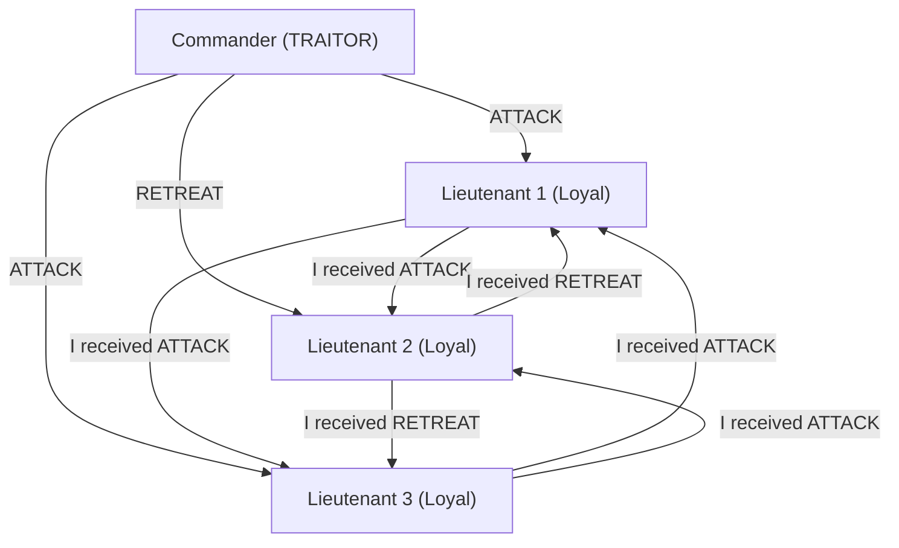
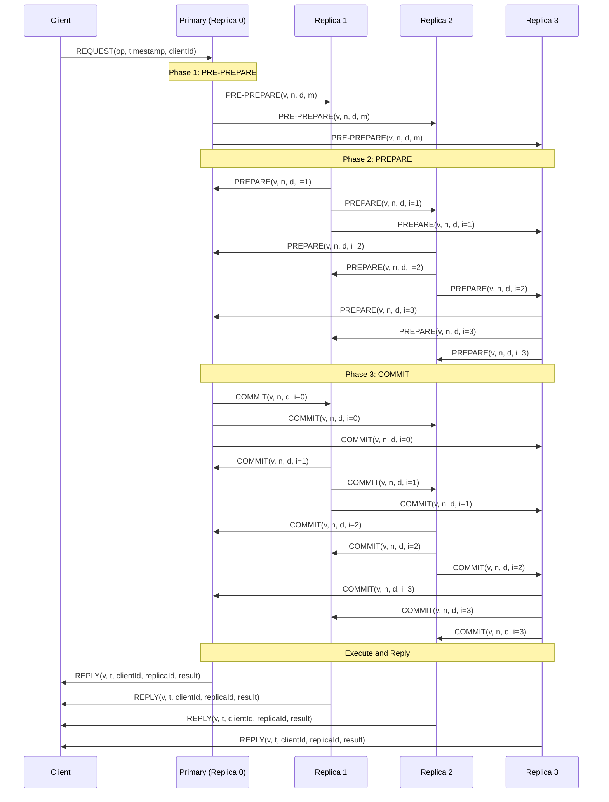
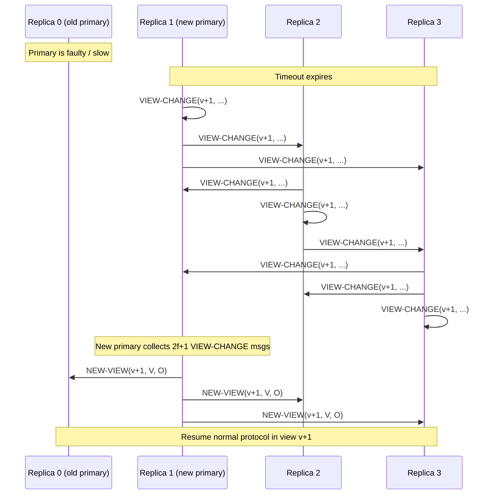
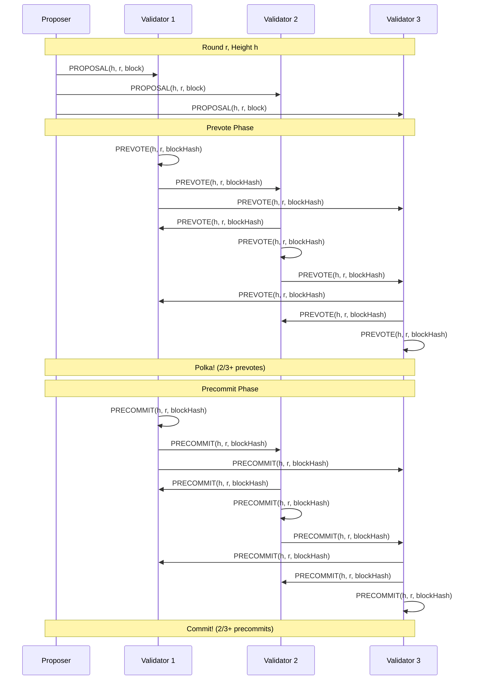
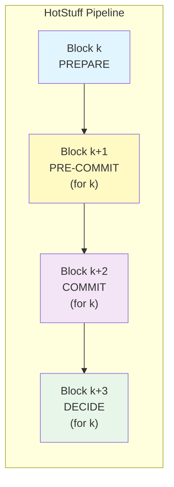
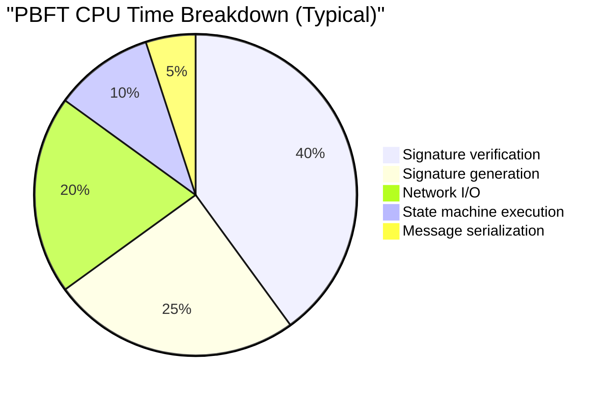

# Byzantine Fault Tolerance

Byzantine Fault Tolerance is the gold standard of fault tolerance in distributed systems. While crash fault tolerance handles nodes that simply stop working, BFT handles the far harder problem: nodes that lie, send conflicting messages, collude with other faulty nodes, or behave in arbitrary and unpredictable ways. Every blockchain consensus protocol, every safety-critical distributed system, and every system operating in an adversarial environment must grapple with BFT — and the theoretical limits it imposes.

## The Byzantine Generals Problem

### The Original Formulation (Lamport, Shostak, Pease — 1982)

In their landmark 1982 paper "The Byzantine Generals Problem," Leslie Lamport, Robert Shostak, and Marshall Pease framed one of the most important problems in distributed computing as a military metaphor.

**The scenario:** Several divisions of the Byzantine army surround an enemy city. Each division is commanded by a general. The generals can communicate only by messenger. After observing the enemy, they must agree on a common plan of action — attack or retreat. Some generals may be traitors who will try to prevent the loyal generals from reaching agreement.

**The requirements:**

1. **Agreement:** All loyal generals must decide on the same plan of action.
2. **Validity:** If all loyal generals prefer the same plan, then that must be the decision.

The traitors (Byzantine-faulty nodes) can do anything: send conflicting messages to different generals, refuse to send messages, collude with other traitors, or even perfectly mimic the behavior of a loyal general for a time before acting maliciously.

```
Scenario: 3 generals, 1 traitor

General A (Loyal): "ATTACK"
General B (Loyal): "ATTACK"
General T (Traitor): tells A "ATTACK", tells B "RETREAT"

General A sees: A=ATTACK, B=ATTACK, T=ATTACK → decides ATTACK
General B sees: A=ATTACK, B=ATTACK, T=RETREAT → decides ???

If B uses majority vote: 2 ATTACK vs 1 RETREAT → ATTACK ✓
But what if the traitor is the "commander" sending the initial order?
```

### The Commander Variant

The paper specifically considers a commander-lieutenant formulation:

- One general (the **commander**) sends an order to the other $n-1$ generals (the **lieutenants**).
- **IC1:** All loyal lieutenants obey the same order.
- **IC2:** If the commanding general is loyal, every loyal lieutenant obeys the order he sends.

This is subtly harder than it appears. When the commander is a traitor, he can send "ATTACK" to some lieutenants and "RETREAT" to others. The loyal lieutenants must still agree — even though they received contradictory orders and cannot distinguish a traitorous commander from a situation where other lieutenants are lying about what they received.



In this scenario, Lieutenant 1 sees: Commander said ATTACK, L2 says RETREAT, L3 says ATTACK. Majority = ATTACK.
Lieutenant 2 sees: Commander said RETREAT, L1 says ATTACK, L3 says ATTACK. Majority = ATTACK.
Lieutenant 3 sees: Commander said ATTACK, L1 says ATTACK, L2 says RETREAT. Majority = ATTACK.

All loyal lieutenants agree on ATTACK — the protocol works here because there are 3 loyal lieutenants and only 1 traitor.

## The $3f+1$ Bound — Proof

### Theorem Statement

**Theorem (Lamport, Shostak, Pease 1982):** A system of $n$ nodes can tolerate at most $f$ Byzantine-faulty nodes if and only if $n \geq 3f + 1$.

Equivalently: fewer than one-third of the nodes may be faulty.

### Proof of the Lower Bound ($n \geq 3f + 1$ is necessary)

We prove that $3f$ nodes are insufficient to tolerate $f$ Byzantine faults. It suffices to show the impossibility for $f = 1$ and $n = 3$ (the result generalizes via a reduction argument).

**Proof by contradiction for $n = 3, f = 1$:**

Assume, for contradiction, that a protocol $\mathcal{P}$ solves Byzantine agreement among 3 nodes where 1 is faulty.

Consider three scenarios with nodes $A$, $B$, $C$:

**Scenario 1:** Node $C$ is faulty. Node $A$ has input $v_A = 0$, Node $B$ has input $v_B = 0$. By the validity condition, since all loyal nodes ($A$ and $B$) have input 0, they must both decide 0. Node $C$ sends arbitrary messages.

**Scenario 2:** Node $C$ is faulty. Node $A$ has input $v_A = 1$, Node $B$ has input $v_B = 1$. By validity, both loyal nodes must decide 1.

**Scenario 3:** No node is faulty. Node $A$ has input $v_A = 0$, Node $B$ has input $v_B = 1$. All nodes follow the protocol honestly.

Now the key insight — we construct a contradiction by showing $C$ cannot distinguish certain scenarios:

In Scenario 3, node $C$ must decide some value $d \in \{0, 1\}$.

**Case $d = 0$:** Consider Scenario 2 from node $B$'s perspective. In Scenario 2, $B$ has input 1 and must decide 1. But what if $C$ is faulty and behaves toward $B$ exactly as it would in Scenario 3 (where $C$'s honest behavior is based on seeing $A=0, B=1$)? And what if $A$ is actually the faulty node, sending messages to $B$ as if $A$ had input 1 (as in Scenario 2) while sending messages to $C$ as if $A$ had input 0 (as in Scenario 3)? From $B$'s perspective, this is indistinguishable from Scenario 2 with $C$ faulty. So $B$ decides 1. But from $C$'s perspective, this looks exactly like Scenario 3, so $C$ decides 0. Since $A$ is the actual faulty node, $B$ and $C$ are both loyal — but they decided differently, violating agreement. Contradiction.

**Case $d = 1$:** Symmetric argument using Scenario 1. From $A$'s perspective, a faulty $B$ can make the situation look identical to Scenario 1, causing $A$ to decide 0. But $C$ decides 1 as in Scenario 3. Two loyal nodes disagree. Contradiction.

$$
\boxed{n = 3, f = 1 \text{ is impossible} \implies n \geq 3f + 1 \text{ is necessary}}
$$

### Generalization via Simulation

The generalization from $f = 1$ to arbitrary $f$ uses a simulation argument. If we had a protocol for $3f$ nodes tolerating $f$ faults, we could construct a protocol for 3 nodes tolerating 1 fault by having each of the 3 nodes simulate $f$ of the $3f$ nodes. When one of the 3 real nodes is faulty, it corresponds to $f$ simulated nodes being faulty — but the protocol should tolerate $f$ faults among $3f$ nodes. This gives us a protocol for 3 nodes with 1 fault — which we proved impossible.

### Proof of the Upper Bound ($n \geq 3f + 1$ is sufficient)

The constructive proof shows an algorithm that works with $n = 3f + 1$ nodes. The original paper provides a recursive algorithm called the **Oral Messages algorithm** OM($m$), where $m$ is the number of traitors.

**OM(0)** — base case with no traitors:
1. The commander sends his value to every lieutenant.
2. Each lieutenant uses the value received from the commander.

**OM($m$)** — recursive case:
1. The commander sends his value to every lieutenant.
2. For each $i$, lieutenant $i$ acts as commander in OM($m-1$), sending the value received from the original commander to each of the other $n-2$ lieutenants.
3. For each $i$, lieutenant $i$ computes the majority of the values received in step 2 (plus the value received directly in step 1).

The recursion terminates at depth $m$ and requires $n \geq 3m + 1$ nodes at each level.

::: info Message Complexity of OM(m)
The OM($m$) algorithm has exponential message complexity: $O(n^{m+1})$. For $m = 1$ and $n = 4$, this is manageable ($O(64)$ messages). For $m = 10$ and $n = 31$, this is $O(31^{11}) \approx 2.5 \times 10^{16}$ messages — completely impractical. This is why practical BFT protocols like PBFT use a different approach.
:::

### With Cryptographic Signatures

If we allow digital signatures (the "Signed Messages" model), the bound improves dramatically:

$$
n \geq 2f + 1 \quad \text{(with unforgeable signatures)}
$$

This is because signed messages prevent a faulty node from claiming it received a different value than it actually did — any node can verify the commander's signature. The impossibility proof above relied on the ability of a faulty node to relay different (fabricated) information to different parties. Signatures eliminate this capability.

::: warning Signature Assumptions
The $2f + 1$ bound with signatures assumes: (1) signatures cannot be forged, (2) anyone can verify any signature, (3) a faulty node cannot forge the signature of a loyal node. These are standard cryptographic assumptions but not unconditionally guaranteed — if the adversary can break the signature scheme, you fall back to the $3f + 1$ bound.
:::

## Practical Byzantine Fault Tolerance (PBFT)

### Motivation

The OM algorithm from the original paper is theoretically elegant but practically useless for real systems due to its exponential message complexity. In 1999, Miguel Castro and Barbara Liskov published "Practical Byzantine Fault Tolerance," which achieved BFT with polynomial message complexity — making it feasible for real-world deployment.

PBFT was a breakthrough because it demonstrated that BFT could be achieved with:
- $O(n^2)$ message complexity per consensus round
- Performance within a small factor of non-BFT replication protocols
- Ability to handle realistic workloads

### System Model

PBFT assumes:
- **$n = 3f + 1$ replicas**, at most $f$ of which are Byzantine-faulty
- **Asynchronous network** with eventual delivery (messages may be delayed, reordered, or duplicated, but are eventually delivered)
- **Cryptographic primitives**: digital signatures and cryptographic hash functions
- **Weak synchrony for liveness**: the system must eventually become synchronous enough for progress (safety is always guaranteed regardless of timing)

Replicas are numbered $0, 1, \ldots, n-1$. At any given time, one replica is the **primary** (leader) and the rest are **backups**. The primary for view $v$ is replica $v \mod n$.

### The Three-Phase Protocol

PBFT achieves consensus through three phases: **pre-prepare**, **prepare**, and **commit**.



#### Phase 1: Pre-Prepare

The primary assigns a sequence number $n$ to the client request $m$ and multicasts a `PRE-PREPARE` message to all backups:

$$
\langle\langle \text{PRE-PREPARE}, v, n, d \rangle_{\sigma_p}, m\rangle
$$

Where:
- $v$ = current view number
- $n$ = sequence number assigned by the primary
- $d$ = digest (hash) of the client request $m$
- $\sigma_p$ = primary's signature

A backup $i$ accepts the pre-prepare if:
1. The signature is valid and $d$ matches the digest of $m$.
2. The backup is in view $v$.
3. It has not accepted a pre-prepare for view $v$ and sequence number $n$ with a different digest.
4. The sequence number $n$ is between a low water mark $h$ and a high water mark $H$.

The pre-prepare phase establishes a binding between a sequence number and a request within a view. If the primary is faulty and assigns the same sequence number to different requests, the backups will detect this and refuse to accept.

#### Phase 2: Prepare

Upon accepting a pre-prepare, backup $i$ multicasts a `PREPARE` message to all other replicas:

$$
\langle \text{PREPARE}, v, n, d, i \rangle_{\sigma_i}
$$

A replica (including the primary) collects prepare messages. We say a replica $i$ has **prepared** a request if it has:
1. The pre-prepare for $(v, n, d)$.
2. At least $2f$ matching prepare messages from different backups (for the same $v$, $n$, $d$).

The prepared predicate is written as $\text{prepared}(m, v, n, i) = \text{true}$.

**Why $2f$ prepares?** With $n = 3f + 1$ total replicas, $2f$ prepares from backups (plus the pre-prepare from the primary) means $2f + 1$ replicas agree on the assignment of sequence number $n$ to digest $d$ in view $v$. Since at most $f$ are faulty, at least $f + 1$ of these are honest — meaning a majority of honest nodes agree. This ensures that no two honest replicas can prepare different requests for the same view and sequence number.

::: tip Key Invariant
If $\text{prepared}(m, v, n, i) = \text{true}$ and $\text{prepared}(m', v, n, j) = \text{true}$ for honest replicas $i$ and $j$, then $m = m'$.

**Proof:** Replica $i$ received $2f + 1$ messages (pre-prepare + $2f$ prepares) for $(v, n, d)$. Replica $j$ received $2f + 1$ messages for $(v, n, d')$. These two sets together have $4f + 2$ messages, but there are only $3f + 1$ replicas — so at least $f + 1$ replicas are in both sets. Since at most $f$ are faulty, at least one honest replica is in both sets — but an honest replica only sends one prepare per $(v, n)$, so $d = d'$ and $m = m'$.
:::

#### Phase 3: Commit

Once a replica has prepared a request, it multicasts a `COMMIT` message:

$$
\langle \text{COMMIT}, v, n, d, i \rangle_{\sigma_i}
$$

A replica considers a request **committed-local** if:
1. It has prepared the request.
2. It has received $2f + 1$ commit messages (from different replicas, possibly including its own) matching the pre-prepare.

The two-phase structure (prepare then commit) is essential. The prepare phase ensures agreement within a view. The commit phase ensures that this agreement survives view changes — even if the view changes before all honest replicas have prepared.

**Why the commit phase is needed:** Consider this scenario without a commit phase: replica $A$ has prepared request $m$ at sequence number $n$ in view $v$. A view change occurs. In the new view $v + 1$, the new primary might not know about $m$ (if the replicas that helped $A$ prepare were faulty and don't report $m$ during the view change). Without the commit phase, $A$ might execute $m$ while the new view assigns a different request to sequence number $n$.

The commit phase ensures that if any honest replica considers a request committed, then at least $f + 1$ honest replicas have prepared it — guaranteeing that any subsequent view change will learn about this request.

#### Execution and Reply

Once a request is committed-local, the replica executes it (in sequence number order) and sends a `REPLY` to the client:

$$
\langle \text{REPLY}, v, t, c, i, r \rangle_{\sigma_i}
$$

The client waits for $f + 1$ matching replies from different replicas. Since at most $f$ replicas are faulty, at least one of these $f + 1$ matching replies must be from an honest replica — guaranteeing the result is correct.

### View Change Protocol

The view change protocol is the most intricate part of PBFT. It handles the case when the primary is faulty — either by being silent (not proposing requests) or by sending conflicting pre-prepares.



#### When a View Change Triggers

A backup starts a timer when it receives a request and the timer has not already been running. If the timer expires before the request is executed, the backup suspects the primary and initiates a view change.

#### The VIEW-CHANGE Message

A backup $i$ that suspects the primary multicasts:

$$
\langle \text{VIEW-CHANGE}, v+1, n, \mathcal{C}, \mathcal{P}, i \rangle_{\sigma_i}
$$

Where:
- $v + 1$ = the new view number
- $n$ = the sequence number of the latest stable checkpoint known to $i$
- $\mathcal{C}$ = a set of $2f + 1$ checkpoint messages proving the checkpoint at $n$
- $\mathcal{P}$ = a set of $\mathcal{P}_m$ sets, one for each request $m$ that $i$ has prepared with sequence number greater than $n$. Each $\mathcal{P}_m$ contains the pre-prepare and $2f$ matching prepare messages.

#### The NEW-VIEW Message

The new primary $p'$ (replica $p' = (v + 1) \mod n$) collects $2f + 1$ valid VIEW-CHANGE messages for view $v + 1$ (including its own, if it sent one). It then computes the set of pre-prepare messages $\mathcal{O}$ for the new view:

For each sequence number $s$ between the low water mark and the high water mark of the VIEW-CHANGE messages:
- If there exists a VIEW-CHANGE message in which $s$ was prepared (i.e., some $\mathcal{P}_m$ exists for $s$), create a new PRE-PREPARE for $(v + 1, s, d)$ where $d$ is the digest from the highest-viewed prepare in the VIEW-CHANGE messages.
- If no VIEW-CHANGE message reports a prepare for $s$, create a PRE-PREPARE for $(v + 1, s, d_{\text{null}})$ — a null (no-op) request.

The new primary multicasts:

$$
\langle \text{NEW-VIEW}, v+1, \mathcal{V}, \mathcal{O} \rangle_{\sigma_{p'}}
$$

Where $\mathcal{V}$ is the set of $2f + 1$ VIEW-CHANGE messages and $\mathcal{O}$ is the set of new PRE-PREPARE messages.

Backups verify the NEW-VIEW message by independently computing what $\mathcal{O}$ should be. If it matches, they accept the new view and process the pre-prepares in $\mathcal{O}$ through the normal prepare/commit protocol.

::: warning View Change Correctness
The view change protocol is where most BFT implementation bugs live. The critical invariant: if any honest replica executed a request at sequence number $s$ in view $v$, then in any subsequent view $v' > v$, the same request must be assigned to sequence number $s$. The VIEW-CHANGE messages carry the proof (prepare certificates) needed to reconstruct this assignment. If the new primary tries to assign a different request, the backups will detect the discrepancy and reject the NEW-VIEW.
:::

### Checkpoints and Garbage Collection

Without garbage collection, replicas would need to store all messages forever. PBFT uses checkpoints to bound storage:

1. Every $K$ requests (e.g., $K = 128$), a replica takes a checkpoint of its state and multicasts a CHECKPOINT message.
2. When a replica collects $2f + 1$ matching checkpoint messages (a **stable checkpoint**), it can discard all pre-prepare, prepare, and commit messages with sequence numbers up to the checkpoint.
3. The low water mark $h$ is set to the sequence number of the last stable checkpoint.
4. The high water mark $H = h + L$ where $L$ is chosen large enough to allow progress (e.g., $L = 2K$).

### Message Complexity Analysis

| Phase | Messages per replica | Total messages |
|-------|---------------------|----------------|
| Request | 1 (client to primary) | 1 |
| Pre-prepare | 1 per backup | $n - 1$ |
| Prepare | $n - 1$ per backup | $(n-1)^2$ |
| Commit | $n$ per replica | $n^2$ |
| Reply | 1 per replica | $n$ |
| **Total** | | $O(n^2)$ |

For $n = 3f + 1 = 4$ (tolerating 1 fault):
- Pre-prepare: 3 messages
- Prepare: 9 messages
- Commit: 16 messages
- Total: ~30 messages per consensus round

For $n = 3f + 1 = 31$ (tolerating 10 faults):
- Pre-prepare: 30 messages
- Prepare: 900 messages
- Commit: 961 messages
- Total: ~1,900 messages per consensus round

The $O(n^2)$ complexity is the main scalability bottleneck of PBFT. This is why PBFT is practical for small clusters (4-20 nodes) but struggles with larger deployments.

## TypeScript Simulation of PBFT Message Flow

The following simulation implements the core PBFT three-phase protocol, demonstrating how messages flow between replicas, how quorums are checked, and how Byzantine faults are detected.

```typescript
type MessageType = 'PRE-PREPARE' | 'PREPARE' | 'COMMIT' | 'REPLY';

interface PBFTMessage {
  type: MessageType;
  view: number;
  sequenceNumber: number;
  digest: string;
  senderId: number;
  signature: string; // Simplified: just senderId + digest
}

interface ClientRequest {
  operation: string;
  timestamp: number;
  clientId: string;
}

type ReplicaBehavior = 'honest' | 'silent' | 'equivocating';

class PBFTReplica {
  readonly id: number;
  private view: number = 0;
  private sequenceNumber: number = 0;
  private behavior: ReplicaBehavior;

  // Message logs
  private prePrepareLog: Map<string, PBFTMessage> = new Map();
  private prepareLog: Map<string, PBFTMessage[]> = new Map();
  private commitLog: Map<string, PBFTMessage[]> = new Map();
  private executedRequests: Map<number, string> = new Map();

  // Network reference
  private network: PBFTNetwork;

  // Protocol parameters
  private readonly f: number; // max Byzantine faults
  private readonly n: number; // total replicas

  constructor(
    id: number,
    f: number,
    n: number,
    network: PBFTNetwork,
    behavior: ReplicaBehavior = 'honest'
  ) {
    this.id = id;
    this.f = f;
    this.n = n;
    this.network = network;
    this.behavior = behavior;
  }

  get isPrimary(): boolean {
    return this.id === this.view % this.n;
  }

  private sign(digest: string): string {
    return `sig_${this.id}_${digest}`;
  }

  private messageKey(view: number, seq: number): string {
    return `${view}:${seq}`;
  }

  private computeDigest(request: ClientRequest): string {
    return `hash(${request.operation}:${request.timestamp}:${request.clientId})`;
  }

  // Phase 0: Receive client request (primary only)
  handleClientRequest(request: ClientRequest): void {
    if (!this.isPrimary) {
      console.log(`  [Replica ${this.id}] Not primary, forwarding to primary`);
      return;
    }

    if (this.behavior === 'silent') {
      console.log(`  [Replica ${this.id}] BYZANTINE: Staying silent, not proposing`);
      return;
    }

    this.sequenceNumber++;
    const digest = this.computeDigest(request);

    console.log(`  [Replica ${this.id}] Primary assigning seq=${this.sequenceNumber} to "${request.operation}"`);

    const prePrepare: PBFTMessage = {
      type: 'PRE-PREPARE',
      view: this.view,
      sequenceNumber: this.sequenceNumber,
      digest,
      senderId: this.id,
      signature: this.sign(digest),
    };

    if (this.behavior === 'equivocating') {
      console.log(`  [Replica ${this.id}] BYZANTINE: Sending conflicting pre-prepares`);
      // Send different digests to different replicas
      for (let i = 0; i < this.n; i++) {
        if (i !== this.id) {
          const fakeDigest = i % 2 === 0 ? digest : `fake_${digest}`;
          this.network.send(this.id, i, { ...prePrepare, digest: fakeDigest });
        }
      }
    } else {
      // Honest: broadcast same pre-prepare to all backups
      this.network.broadcast(this.id, prePrepare);
    }

    // Primary also records its own pre-prepare
    const key = this.messageKey(this.view, this.sequenceNumber);
    this.prePrepareLog.set(key, prePrepare);
  }

  // Phase 1: Handle PRE-PREPARE
  handlePrePrepare(msg: PBFTMessage): void {
    if (this.behavior === 'silent') return;

    const key = this.messageKey(msg.view, msg.sequenceNumber);

    // Validation checks
    if (msg.view !== this.view) {
      console.log(`  [Replica ${this.id}] Rejected PRE-PREPARE: wrong view`);
      return;
    }
    if (msg.senderId !== msg.view % this.n) {
      console.log(`  [Replica ${this.id}] Rejected PRE-PREPARE: not from primary`);
      return;
    }
    if (this.prePrepareLog.has(key)) {
      const existing = this.prePrepareLog.get(key)!;
      if (existing.digest !== msg.digest) {
        console.log(`  [Replica ${this.id}] Rejected PRE-PREPARE: conflicting digest for same seq`);
        return;
      }
    }

    console.log(`  [Replica ${this.id}] Accepted PRE-PREPARE(v=${msg.view}, n=${msg.sequenceNumber})`);
    this.prePrepareLog.set(key, msg);

    // Send PREPARE to all replicas
    const prepare: PBFTMessage = {
      type: 'PREPARE',
      view: msg.view,
      sequenceNumber: msg.sequenceNumber,
      digest: msg.digest,
      senderId: this.id,
      signature: this.sign(msg.digest),
    };

    this.network.broadcast(this.id, prepare);
  }

  // Phase 2: Handle PREPARE
  handlePrepare(msg: PBFTMessage): void {
    if (this.behavior === 'silent') return;

    const key = this.messageKey(msg.view, msg.sequenceNumber);

    if (!this.prepareLog.has(key)) {
      this.prepareLog.set(key, []);
    }

    const prepares = this.prepareLog.get(key)!;

    // Don't accept duplicate prepares from same sender
    if (prepares.some(p => p.senderId === msg.senderId)) return;

    prepares.push(msg);

    // Check if we have the prepared predicate: pre-prepare + 2f matching prepares
    const prePrepare = this.prePrepareLog.get(key);
    if (!prePrepare) return;

    const matchingPrepares = prepares.filter(p => p.digest === prePrepare.digest);

    if (matchingPrepares.length >= 2 * this.f) {
      console.log(
        `  [Replica ${this.id}] PREPARED(v=${msg.view}, n=${msg.sequenceNumber}) ` +
        `— got ${matchingPrepares.length} matching prepares (need ${2 * this.f})`
      );

      // Enter commit phase
      const commit: PBFTMessage = {
        type: 'COMMIT',
        view: msg.view,
        sequenceNumber: msg.sequenceNumber,
        digest: prePrepare.digest,
        senderId: this.id,
        signature: this.sign(prePrepare.digest),
      };

      this.network.broadcast(this.id, commit);
    }
  }

  // Phase 3: Handle COMMIT
  handleCommit(msg: PBFTMessage): void {
    if (this.behavior === 'silent') return;

    const key = this.messageKey(msg.view, msg.sequenceNumber);

    if (!this.commitLog.has(key)) {
      this.commitLog.set(key, []);
    }

    const commits = this.commitLog.get(key)!;

    // Don't accept duplicate commits from same sender
    if (commits.some(c => c.senderId === msg.senderId)) return;

    commits.push(msg);

    const prePrepare = this.prePrepareLog.get(key);
    if (!prePrepare) return;

    const matchingCommits = commits.filter(c => c.digest === prePrepare.digest);

    // committed-local: prepared + 2f+1 matching commits
    if (matchingCommits.length >= 2 * this.f + 1) {
      if (!this.executedRequests.has(msg.sequenceNumber)) {
        this.executedRequests.set(msg.sequenceNumber, prePrepare.digest);
        console.log(
          `  [Replica ${this.id}] COMMITTED & EXECUTED(v=${msg.view}, n=${msg.sequenceNumber}) ` +
          `— got ${matchingCommits.length} matching commits (need ${2 * this.f + 1})`
        );
      }
    }
  }

  receiveMessage(msg: PBFTMessage): void {
    switch (msg.type) {
      case 'PRE-PREPARE': this.handlePrePrepare(msg); break;
      case 'PREPARE': this.handlePrepare(msg); break;
      case 'COMMIT': this.handleCommit(msg); break;
    }
  }

  hasExecuted(seq: number): boolean {
    return this.executedRequests.has(seq);
  }
}

class PBFTNetwork {
  private replicas: PBFTReplica[] = [];
  private messageQueue: Array<{ from: number; to: number; msg: PBFTMessage }> = [];

  addReplica(replica: PBFTReplica): void {
    this.replicas[replica.id] = replica;
  }

  send(from: number, to: number, msg: PBFTMessage): void {
    this.messageQueue.push({ from, to, msg });
  }

  broadcast(from: number, msg: PBFTMessage): void {
    for (const replica of this.replicas) {
      if (replica.id !== from) {
        this.messageQueue.push({ from, to: replica.id, msg: { ...msg } });
      }
    }
  }

  // Process all queued messages (simulates asynchronous delivery)
  deliverAll(): void {
    while (this.messageQueue.length > 0) {
      const batch = [...this.messageQueue];
      this.messageQueue = [];

      for (const { to, msg } of batch) {
        this.replicas[to].receiveMessage(msg);
      }
    }
  }
}

// --- Simulation ---

function runSimulation(
  scenario: string,
  f: number,
  behaviors: ReplicaBehavior[]
): void {
  const n = 3 * f + 1;
  console.log(`\n${'='.repeat(70)}`);
  console.log(`Scenario: ${scenario}`);
  console.log(`n=${n} replicas, f=${f} max Byzantine faults`);
  console.log(`Behaviors: ${behaviors.join(', ')}`);
  console.log('='.repeat(70));

  const network = new PBFTNetwork();
  const replicas: PBFTReplica[] = [];

  for (let i = 0; i < n; i++) {
    const replica = new PBFTReplica(i, f, n, network, behaviors[i]);
    replicas.push(replica);
    network.addReplica(replica);
  }

  const request: ClientRequest = {
    operation: 'transfer(Alice, Bob, 100)',
    timestamp: Date.now(),
    clientId: 'client-1',
  };

  console.log(`\nClient sends: "${request.operation}"`);
  console.log('-'.repeat(50));

  // Primary handles client request
  replicas[0].handleClientRequest(request);

  // Deliver messages iteratively until quiescence
  for (let round = 0; round < 5; round++) {
    console.log(`\n--- Delivery round ${round + 1} ---`);
    network.deliverAll();
  }

  // Check results
  console.log(`\n--- Results ---`);
  for (const replica of replicas) {
    const executed = replica.hasExecuted(1);
    console.log(`  Replica ${replica.id}: ${executed ? 'EXECUTED' : 'did not execute'}`);
  }
}

// Scenario 1: All honest
runSimulation('All replicas honest', 1, ['honest', 'honest', 'honest', 'honest']);

// Scenario 2: One Byzantine (silent)
runSimulation('One silent Byzantine replica', 1, ['honest', 'honest', 'honest', 'silent']);

// Scenario 3: Equivocating primary
runSimulation('Equivocating Byzantine primary', 1, [
  'equivocating', 'honest', 'honest', 'honest',
]);
```

::: details Expected Output Analysis
**Scenario 1 (all honest):** All 4 replicas execute the request. The primary sends PRE-PREPARE, all 3 backups send PREPARE, all 4 send COMMIT. Each replica collects $2f = 2$ matching prepares and $2f + 1 = 3$ matching commits.

**Scenario 2 (one silent):** The silent replica never responds, but 3 honest replicas is enough. Each honest replica collects 2 matching prepares (from the other 2 backups) and 3 matching commits (from all 3 honest replicas). The silent replica never executes.

**Scenario 3 (equivocating primary):** The primary sends different digests to different replicas. Honest replicas will receive conflicting pre-prepares, and when they exchange PREPARE messages, they will find that their digests do not match. No quorum of $2f$ matching prepares will form for either digest. In a full implementation, the backups would timeout and trigger a view change.
:::

## BFT in Blockchain

### Why Blockchain Needs BFT

Blockchain systems operate in adversarial environments where participants are economically motivated to cheat. Traditional BFT assumes a known, fixed set of participants (permissioned model). Public blockchains extend this with Sybil resistance mechanisms (Proof of Work, Proof of Stake) that determine who gets to participate.

### Tendermint BFT

Tendermint (now CometBFT) is a BFT consensus engine designed for blockchain. It powers the Cosmos ecosystem and is the most widely deployed BFT protocol in production blockchain systems.

**Key innovations over PBFT:**

1. **Simplified protocol:** Two phases instead of three (propose + two rounds of voting: prevote and precommit).
2. **Deterministic leader rotation:** The proposer rotates each block, reducing the reliance on view changes.
3. **Locking mechanism:** Prevents equivocation through a "polka" (2/3+ prevotes for a block), which locks validators to that block.
4. **Accountability:** If a validator signs conflicting messages, cryptographic evidence can be presented to slash their stake.



**Tendermint's locking rules:**

1. **Lock rule:** A validator locks on a block when it sees a polka ($> 2/3$ prevotes) for that block in the current round.
2. **Unlock rule:** A validator unlocks only if it sees a polka for a different block in a later round.
3. **Prevote rule:** A locked validator must prevote for its locked block (unless it sees a polka for something else in a later round).

These rules ensure that once a block reaches commit (2/3+ precommits), no conflicting block can ever gather a polka — because the locked validators will not prevote for anything else.

### HotStuff BFT

HotStuff, introduced by Yin et al. in 2019, achieves **linear** message complexity per view ($O(n)$ instead of PBFT's $O(n^2)$) through a key innovation: **threshold signatures** and a **pipelined three-phase protocol**.

**Key properties:**

1. **Linear communication:** The leader collects votes, aggregates them into a single threshold signature (quorum certificate, or QC), and broadcasts the QC. Each phase costs $O(n)$ messages instead of $O(n^2)$.
2. **Optimistic responsiveness:** In the common case (honest leader, synchronous network), consensus completes in the time it takes for the actual network delay — not a pre-configured timeout.
3. **Simple view change:** The view change is identical to the normal case — just another phase of the protocol. This eliminates the complex view change logic of PBFT.



HotStuff's pipelined structure means that while block $k$ is being committed, block $k+1$ is being pre-committed, and block $k+2$ is being prepared — all simultaneously. This amortizes the latency cost of the three phases.

**Comparison of message complexity per view:**

| Protocol | Leader to all | All to all | Total |
|----------|--------------|------------|-------|
| PBFT | $O(n)$ | $O(n^2)$ | $O(n^2)$ |
| Tendermint | $O(n)$ | $O(n^2)$ | $O(n^2)$ |
| HotStuff | $O(n)$ | $O(n)$ via leader | $O(n)$ |

The trick: in HotStuff, validators send their votes only to the leader (not to all other validators). The leader aggregates these votes into a quorum certificate (using threshold signatures) and broadcasts the QC. This star topology replaces the all-to-all communication of PBFT and Tendermint.

::: warning HotStuff's Trade-off
HotStuff's linear complexity comes at a cost: it requires one additional phase compared to PBFT (three phases vs two for normal operation). It also introduces a stronger reliance on the leader — if the leader is slow or faulty, all validators must wait for a timeout before view-changing. PBFT's all-to-all communication means backups can independently determine when the primary has failed.
:::

## Comparison of BFT Variants

| Property | PBFT | Tendermint | HotStuff | IBFT 2.0 |
|----------|------|-----------|----------|----------|
| **Year** | 1999 | 2014 | 2019 | 2017 |
| **Fault tolerance** | $f < n/3$ | $f < n/3$ | $f < n/3$ | $f < n/3$ |
| **Message complexity** | $O(n^2)$ | $O(n^2)$ | $O(n)$ | $O(n^2)$ |
| **View change complexity** | $O(n^3)$ | $O(n^2)$ | $O(n)$ | $O(n^2)$ |
| **Phases** | 3 (pre-prepare, prepare, commit) | 2 (prevote, precommit) | 3 (prepare, pre-commit, commit) | 3 |
| **Leader rotation** | On failure only | Every block | Every block | Round-robin |
| **Finality** | Immediate | Immediate | Immediate | Immediate |
| **Crypto required** | MACs or sigs | Signatures | Threshold sigs | Signatures |
| **Pipeline-able** | No | No | Yes | No |
| **Used in** | Research, some permissioned chains | Cosmos, Binance Chain | Libra/Diem, Aptos, Cypherium | Hyperledger Besu |

### Latency Comparison

Assuming network round-trip time $\delta$:

- **PBFT:** $3\delta$ (pre-prepare + prepare + commit)
- **Tendermint:** $2\delta$ per round, but may require multiple rounds
- **HotStuff (basic):** $4\delta$ (one extra phase), but pipelining amortizes to $\delta$ per block
- **HotStuff (chained):** After pipeline warm-up, one block commits per $\delta$

## Performance Overhead Analysis

### Cost of BFT vs Crash Fault Tolerance

BFT is significantly more expensive than crash fault tolerance (CFT) protocols like Raft or Paxos. Here is a quantitative comparison:

| Metric | Raft (CFT) | PBFT (BFT) | Overhead |
|--------|-----------|-----------|----------|
| Nodes for $f$ faults | $2f + 1$ | $3f + 1$ | 50% more nodes |
| Messages per consensus | $O(n)$ | $O(n^2)$ | Quadratic blowup |
| Crypto operations | 0 (or TLS only) | $O(n^2)$ signatures | Significant CPU |
| Latency (phases) | 2 | 3 | 50% more RTTs |
| Throughput (empirical) | ~100k ops/sec | ~10k ops/sec | ~10x reduction |
| Storage per operation | Log entry | Log + all messages | ~$n$x more |

### Empirical Performance Data

Castro and Liskov's original PBFT paper reported:
- **Throughput:** Within 3% of an unreplicated server for read-heavy workloads, up to 27% overhead for write-heavy workloads
- **Latency:** 3ms for a null operation with 4 replicas on a LAN

Modern implementations on modern hardware (as of 2024-2025):
- **Tendermint:** 1,000-10,000 tx/sec with 4-100 validators
- **HotStuff:** Up to 100,000+ tx/sec with threshold signature optimizations
- **IBFT 2.0:** 200-1,000 tx/sec in Hyperledger Besu

### Where the Overhead Comes From



The dominant cost is cryptographic: every message must be signed and every received message must have its signature verified. With $O(n^2)$ messages per consensus round, this means $O(n^2)$ signature operations.

**Optimizations that help:**

1. **MAC-based authentication (PBFT):** Replace digital signatures with MACs for most messages — faster but requires pairwise shared keys.
2. **Threshold signatures (HotStuff):** Aggregate $n$ individual signatures into one — reduces verification cost from $O(n)$ to $O(1)$.
3. **Batching:** Amortize the per-consensus cost over many client requests. If each consensus round processes 1,000 requests instead of 1, the overhead per request drops by 1,000x.
4. **Speculative execution:** Execute requests speculatively during the prepare phase, rolling back if consensus fails. Zyzzyva (2007) pioneered this approach.
5. **Parallelism:** Process independent requests concurrently. Mir-BFT (2020) partitions the sequence number space among multiple leaders.

## When BFT Matters in Practice

### Permissioned Blockchains

In a permissioned blockchain (e.g., Hyperledger Fabric, R3 Corda, enterprise Ethereum), the set of participants is known and relatively small. BFT is the natural consensus choice because:

1. **Known participants** allow using BFT's fixed membership model directly.
2. **Small validator sets** (4-20 nodes) keep the $O(n^2)$ cost manageable.
3. **Immediate finality** — no need to wait for multiple block confirmations as in Nakamoto consensus.
4. **Regulatory requirements** may demand Byzantine fault tolerance for auditability and accountability.

Use cases: supply chain tracking (Walmart, Maersk), cross-border payments (JPMorgan Onyx), central bank digital currencies (CBDC pilots).

### Financial Systems

Financial infrastructure requires BFT when:

1. **Multiple untrusting institutions** must agree on a shared ledger (interbank settlement, securities exchanges).
2. **Regulatory compliance** demands tolerance of compromised nodes — a single hacked bank node should not corrupt the ledger.
3. **Value at stake** is high enough that the performance overhead is justified.

Example: The Australian Securities Exchange (ASX) explored replacing its CHESS clearing system with a DLT-based system using BFT consensus. The Bank for International Settlements' Project Helvetia uses BFT for tokenized asset settlement.

### Aviation and Space

Safety-critical systems in aviation have used BFT-like techniques since before the formal theory existed:

- **Boeing 777 fly-by-wire:** Triple-modular redundancy with Byzantine voting among flight control computers.
- **SpaceX Falcon 9:** Triple-redundant flight computers with voting, tolerating one Byzantine fault.
- **NASA's SIFT (Software Implemented Fault Tolerance):** One of the earliest practical BFT systems, designed for aircraft control in the 1970s.

In these systems, the "adversary" is not a malicious attacker but physical phenomena: cosmic ray bit-flips, electromagnetic interference, or hardware degradation. The system must produce correct outputs even if one computer's results are arbitrarily wrong.

### When BFT Does NOT Matter

BFT is overkill when:

1. **All nodes are under your control** and you trust your own infrastructure. Use Raft instead — it is simpler, faster, and well-understood. This covers most internal microservice architectures.
2. **Crash faults dominate.** In practice, most distributed system failures are crashes, not Byzantine behavior. The additional cost of BFT is wasted if Byzantine faults are extraordinarily rare.
3. **You need more than ~100 participants.** PBFT's $O(n^2)$ complexity makes it impractical. Use Nakamoto consensus (Proof of Work/Stake) or DAG-based protocols instead.
4. **Latency is paramount.** The extra round-trip of BFT protocols (compared to CFT) is unacceptable for ultra-low-latency applications like high-frequency trading.

::: tip Decision Framework
```
Do you control all nodes?
  ├── Yes → Use Raft/Paxos (CFT)
  └── No → Do you know all participants?
          ├── Yes, < 100 → Use PBFT/Tendermint/HotStuff (BFT)
          └── No, or > 100 → Use Nakamoto/PoS consensus
```
:::

## Beyond Classical BFT

### Asynchronous BFT

Classical BFT protocols (PBFT, Tendermint, HotStuff) assume partial synchrony — the network is asynchronous but eventually becomes synchronous for liveness. Fully asynchronous BFT protocols make no timing assumptions at all.

**The FLP impossibility result** (Fischer, Lynch, Paterson, 1985) proves that deterministic consensus is impossible in a fully asynchronous network with even one crash fault. Asynchronous BFT protocols circumvent this by using randomization:

- **HoneyBadgerBFT (2016):** First practical asynchronous BFT. Uses threshold encryption and a randomized common coin to achieve consensus without any timing assumptions. Throughput scales well because it batches transactions.
- **Dumbo (2020):** Improves on HoneyBadgerBFT with better latency by reducing the number of reliable broadcast instances.
- **DAG-Rider (2021):** Builds consensus on top of a DAG (directed acyclic graph) structure, achieving zero-message-overhead consensus.

### Optimistic BFT

Some protocols optimize for the common case where no faults occur:

- **Zyzzyva (2007):** If all replicas agree and respond quickly, consensus completes in a single round-trip. Falls back to PBFT-like behavior when faults are detected. This is "speculative BFT."
- **SBFT (Gueta et al., 2019):** Combines a fast path (linear communication) when all nodes are honest with a slow path (quadratic) when faults are detected.

### BFT with Trusted Components

If nodes have access to trusted hardware (like Intel SGX or ARM TrustZone):

- **MinBFT and MinZyzzyva:** Reduce the fault tolerance threshold from $3f + 1$ to $2f + 1$ by using a trusted monotonic counter that prevents equivocation. The counter ensures a node cannot sign two different messages for the same sequence number.
- **CCF (Confidential Consortium Framework):** Microsoft's framework uses SGX enclaves to achieve BFT-like guarantees with fewer nodes.

### Byzantine Fault Detection vs Tolerance

An alternative paradigm: instead of tolerating Byzantine faults, detect them after the fact and punish the faulty nodes.

- **PeerReview (2007):** Keeps a tamper-evident log of each node's behavior. If a node acts Byzantine, the evidence is available for auditing.
- **Proof of Stake slashing:** Blockchain validators that sign conflicting blocks lose their staked tokens — a financial penalty for Byzantine behavior.
- **Accountable Safety (Tendermint):** If safety is violated, cryptographic evidence identifies at least $f + 1$ validators who signed conflicting blocks. These validators can be slashed.

This approach trades real-time tolerance for economic deterrence — it does not prevent the fault but makes it prohibitively expensive.

## Relationship to Other Distributed Systems Concepts

### BFT and CAP

BFT does not change the CAP theorem. A BFT system still must choose between consistency and availability during a partition. However:

- BFT protocols like PBFT choose **consistency** (CP system) — they halt rather than produce conflicting results during a partition.
- BFT with $3f + 1$ nodes can tolerate up to $f$ nodes being partitioned (and potentially acting Byzantine) while maintaining both safety and liveness, as long as the remaining $2f + 1$ honest nodes can communicate.

### BFT and Consensus

BFT consensus is strictly harder than crash-fault-tolerant consensus:

$$
\text{BFT consensus} \supset \text{CFT consensus} \supset \text{Leader election}
$$

Any BFT consensus protocol can be used for CFT (just ignore the extra guarantees), but not vice versa. Raft and Paxos cannot handle Byzantine faults.

### BFT and State Machine Replication

BFT consensus is typically used to implement **Byzantine fault-tolerant state machine replication (BFT-SMR)**. The consensus protocol determines the order of operations; each replica executes operations in that order on a deterministic state machine. If the state machine is deterministic and all honest replicas execute the same operations in the same order, they arrive at the same state — regardless of what the Byzantine replicas do.

The formal guarantee:

$$
\forall i, j \in \text{honest}: \text{state}_i = \text{state}_j \text{ after executing the first } k \text{ committed operations}
$$

This is the foundation of every BFT blockchain: the "state machine" is the blockchain's transaction processing logic, and BFT consensus determines the order of blocks (and hence transactions).

## Summary of Key Theorems and Bounds

| Result | Bound | Condition |
|--------|-------|-----------|
| Byzantine agreement (oral messages) | $n \geq 3f + 1$ | No cryptography |
| Byzantine agreement (signed messages) | $n \geq 2f + 1$ | Unforgeable signatures |
| Byzantine agreement (trusted hardware) | $n \geq 2f + 1$ | Monotonic counters |
| FLP impossibility | No deterministic consensus | Asynchronous, 1 crash fault |
| Dolev-Strong | $n \geq f + 1$ (synchronous, signatures) | Known round bound |
| DLS (Dwork, Lynch, Stockmeyer) | $n \geq 3f + 1$ (partial synchrony) | Eventually synchronous |
| PBFT message complexity | $O(n^2)$ per consensus | Normal case |
| PBFT view change complexity | $O(n^3)$ | View change |
| HotStuff message complexity | $O(n)$ per view | Threshold signatures |
| Lower bound on BFT message complexity | $\Omega(n^2)$ total bits | Dolev-Reischuk, 1985 |

::: info The Dolev-Reischuk Bound
Dolev and Reischuk (1985) proved that any deterministic BFT protocol requires $\Omega(n^2)$ total bits of communication in the worst case. HotStuff achieves $O(n)$ messages by using threshold signatures that encode $O(n)$ bits of information in a single signature — so the total bits communicated are still $\Omega(n^2)$ when you account for the content of the threshold signature. The bound is respected, but the constant factors and distribution of work are much better.
:::
