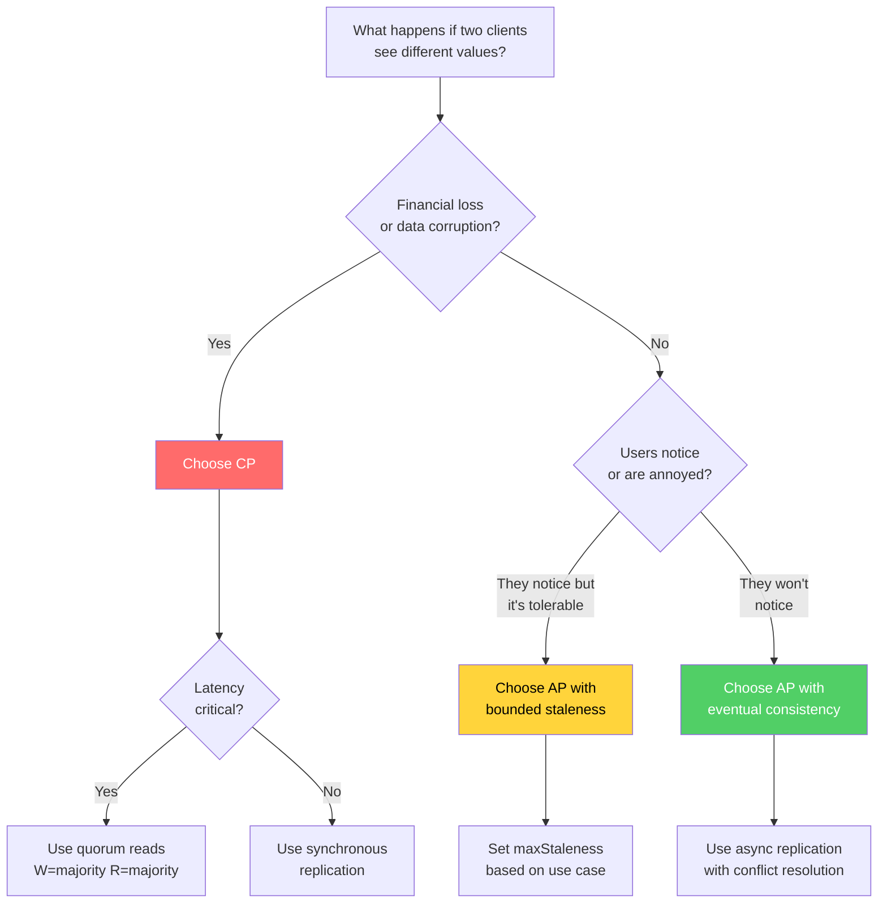

# CAP Theorem

The CAP theorem is the most cited, most misunderstood, and most practically important result in distributed systems theory. It defines the fundamental trade-off that every distributed data store must navigate — and understanding it correctly separates engineers who design resilient systems from those who discover their trade-offs in production at 3 AM.

## Historical Context

In 2000, Eric Brewer presented the CAP conjecture at the ACM Symposium on Principles of Distributed Computing (PODC). His claim: it is impossible for a distributed data store to simultaneously provide more than two out of three guarantees — Consistency, Availability, and Partition Tolerance.

In 2002, Seth Gilbert and Nancy Lynch of MIT formalized and proved Brewer's conjecture, turning it from a rule of thumb into a proven theorem. Their proof is surprisingly short — it constructs a specific scenario where providing all three is provably impossible.

In 2012, Brewer himself published "CAP Twelve Years Later: How the Rules Have Changed," clarifying widespread misunderstandings and introducing the idea that the trade-off is not a static choice but a dynamic, per-operation decision.

## The Three Guarantees — Precisely Defined

### Consistency (C)

**Formal definition:** Every read receives the most recent write or an error.

This is *linearizability* — the strongest form of consistency. It means the system behaves as if there is a single copy of the data, and all operations are atomic. If a write completes successfully, every subsequent read (from any node) must return that value or a later one.

```
Timeline:
  Client A: WRITE x=1     ────────────── OK
  Client B:                   READ x ──── returns 1 ✓
  Client C:                       READ x ─── returns 1 ✓
```

This is NOT the same as eventual consistency, where reads might return stale data for a while. CAP's "C" is the strongest possible guarantee.

::: warning Common Misconception
CAP consistency is NOT the same as ACID consistency. ACID consistency means transactions move the database from one valid state to another (integrity constraints). CAP consistency means all nodes see the same data at the same time (linearizability). These are completely different properties with the same name.
:::

### Availability (A)

**Formal definition:** Every request received by a non-failing node must result in a response (not an error).

There is no time bound on the response — it just must eventually come. But critically, this means the system cannot reject requests during a partition. If a node is up and receives a request, it must respond.

This does NOT mean low latency. A system that takes 30 seconds to respond is still "available" under CAP's definition. It also does NOT mean the response is correct — it just means a response is given.

::: warning Common Misconception
CAP availability is much stronger than practical availability (like "five nines"). CAP requires that EVERY non-failed node responds to EVERY request. Practical availability allows occasional failures. A system can have 99.999% uptime and still not satisfy CAP's availability guarantee.
:::

### Partition Tolerance (P)

**Formal definition:** The system continues to operate despite arbitrary message loss or delay between nodes.

A network partition occurs when the communication link between two or more nodes fails, splitting the cluster into isolated groups that cannot communicate with each other.

```
Before partition:
  [Node A] ←──── network ────→ [Node B]

During partition:
  [Node A] ←──── ✗ BROKEN ✗ ────→ [Node B]

  Both nodes are alive.
  Both nodes receive client requests.
  Neither node can communicate with the other.
```

In any real distributed system, network partitions WILL happen. Cables get cut. Switches fail. Cloud availability zones lose connectivity. Garbage collection pauses make a node appear dead. This is not a theoretical concern — it happens regularly in production.

## The Proof (Simplified)

Gilbert and Lynch's proof is by contradiction. Assume a system provides all three guarantees. Now construct a scenario:

**Setup:** Two nodes, $N_1$ and $N_2$, both storing value $v_0$.

**Step 1:** A network partition occurs — $N_1$ and $N_2$ cannot communicate.

**Step 2:** A client sends a write request to $N_1$: `WRITE v = v_1`

**Step 3:** Because the system is **Available**, $N_1$ must respond with success (it cannot reject the request just because it can't reach $N_2$).

**Step 4:** Because the system is **Partition Tolerant**, it must continue operating despite the partition. $N_1$ processes the write.

**Step 5:** A different client sends a read request to $N_2$: `READ v`

**Step 6:** Because the system is **Available**, $N_2$ must respond (it cannot refuse).

**Step 7:** But $N_2$ has no way to know about the write to $N_1$ (the partition prevents communication). So $N_2$ returns $v_0$.

**Step 8:** This violates **Consistency** — a read returned $v_0$ after a write set $v = v_1$.

$$
\text{Consistency} \wedge \text{Availability} \wedge \text{Partition Tolerance} \implies \bot
$$

**QED.** No system can provide all three simultaneously during a partition.

::: details Full Formal Proof
The formal proof in Gilbert & Lynch's paper uses an asynchronous network model where:

- Messages can take arbitrarily long to deliver
- There are no bounds on processing time
- The only guarantee is that messages sent over a non-partitioned link are eventually delivered

In this model, they show that for any algorithm claiming to implement an atomic (linearizable) read/write register:

1. There exists an execution containing a partition where some read operation returns an inconsistent value, OR
2. There exists an execution where some operation never receives a response

This holds even for a single register storing a single bit. The result is surprisingly strong — it applies to the simplest possible case.

The formal proof distinguishes between *asynchronous* and *partially synchronous* models. In partially synchronous models (where there exists an unknown upper bound on message delay), it is possible to provide consistency and availability during non-partitioned operation and gracefully degrade during partitions. This is what most real systems do.
:::

## The Real Trade-Off: CP vs AP

Since network partitions are inevitable in any distributed system, "Partition Tolerance" is not really a choice — you MUST have it. The real question becomes:

**During a partition, do you sacrifice Consistency or Availability?**

### CP Systems (Consistency + Partition Tolerance)

When a partition occurs, some nodes will become unavailable to maintain consistency.

**Behavior during partition:**
- Nodes that can't confirm they have the latest data will refuse requests (return errors)
- The system prefers being correct over being responsive
- Some clients may see errors or timeouts

**Examples:**
| System | How It Works |
|--------|-------------|
| **ZooKeeper** | Uses ZAB consensus. During a partition, the minority side stops accepting writes. Clients connected to minority nodes get errors. |
| **etcd** | Uses Raft consensus. A leader must be able to communicate with a majority. If partitioned away from the majority, the old leader steps down. |
| **HBase** | Uses ZooKeeper for coordination. Region servers cut off from ZooKeeper stop serving requests. |
| **MongoDB** (default) | With `w:majority`, writes only succeed if acknowledged by a majority. During a partition, the minority side cannot accept writes. |
| **Spanner** | Google's globally distributed database. Uses TrueTime and Paxos. Sacrifices availability during partitions to provide external consistency (strongest form of linearizability). |

**When to choose CP:**
- Financial transactions (you cannot have two nodes accepting conflicting transfers)
- Inventory management (overselling is worse than temporary unavailability)
- Leader election (two leaders is catastrophic — "split-brain")
- Configuration management (nodes acting on different configs causes cascading failures)

### AP Systems (Availability + Partition Tolerance)

When a partition occurs, all nodes continue serving requests, but may return stale or conflicting data.

**Behavior during partition:**
- All nodes respond to all requests
- Different nodes may return different values for the same key
- After the partition heals, the system must reconcile conflicting updates

**Examples:**
| System | How It Works |
|--------|-------------|
| **Cassandra** | Tunable consistency. With `ONE` read/write consistency, every node responds. During partitions, updates happen on both sides and are reconciled using last-write-wins (LWW) timestamps. |
| **DynamoDB** | Amazon's key-value store. Uses consistent hashing and vector clocks. During partitions, all nodes continue serving. Conflicts resolved on read via application-supplied merge functions. |
| **CouchDB** | Multi-master replication. Every node accepts writes independently. Conflicts stored and exposed to the application for resolution. |
| **Riak** | Uses CRDTs for automatic conflict resolution. Vector clocks track causality. Siblings (conflicting versions) are either auto-merged or presented to the application. |
| **DNS** | The most successful AP system ever built. DNS records propagate slowly and can be stale, but every DNS server always responds. |

**When to choose AP:**
- Social media feeds (showing a slightly stale feed is better than showing nothing)
- Shopping carts (let users add items on both sides of a partition, merge later)
- Caching layers (stale cache is better than no cache — usually)
- Metrics/analytics (approximate counts are acceptable, downtime is not)
- Session stores (a slightly stale session is better than logging the user out)

## Beyond the Binary: The PACELC Model

Daniel Abadi proposed PACELC in 2012 to extend CAP with the observation that even when there is NO partition, there is still a trade-off between latency and consistency.

**PACELC:** If there is a **P**artition, choose between **A**vailability and **C**onsistency. **E**lse (no partition), choose between **L**atency and **C**onsistency.

```
if (partition) {
  choose: Availability OR Consistency    // CAP trade-off
} else {
  choose: Latency OR Consistency         // PACELC extension
}
```

This captures important nuances:

| System | Partition (PA/PC) | No Partition (EL/EC) | Classification |
|--------|------------------|---------------------|---------------|
| Cassandra (ONE) | PA | EL | PA/EL — always fast, sometimes inconsistent |
| MongoDB (majority) | PC | EC | PC/EC — always consistent, sometimes slow |
| DynamoDB | PA | EL | PA/EL — prioritizes availability and speed |
| Spanner | PC | EC | PC/EC — consistency above all else |
| Cassandra (QUORUM) | PC | EL | PC/EL — consistent with quorum, fast reads |
| PNUTS (Yahoo) | PC | EL | PC/EL — timeline consistency with low latency |

::: info War Story
At Amazon, the original Dynamo paper (2007) made the deliberate choice of PA/EL for the shopping cart service. The reasoning: a customer should NEVER see an error when adding to their cart. If a partition occurs and both sides accept conflicting cart updates, the reconciliation strategy is to take the union of both carts. The worst case is that an item the customer removed reappears — annoying but recoverable. The alternative (CP) would mean the customer sees an error page during checkout, which directly costs revenue.

This single design decision — choosing AP for the shopping cart — influenced an entire generation of distributed database design and directly led to Cassandra, Riak, and Voldemort.
:::

## Per-Operation Trade-offs

One of the most important insights from Brewer's 2012 revisit is that CAP is not a system-wide, static choice. Different operations in the same system can make different trade-offs:

```typescript
// Same database, different trade-offs per operation

// CP: Account balance must be consistent (financial correctness)
async function getAccountBalance(userId: string): Promise<number> {
  return await db.read('accounts', userId, {
    consistency: 'strong',     // linearizable read
    // If partition occurs, this will return an error rather than stale data
  });
}

// AP: User profile can be eventually consistent (stale is acceptable)
async function getUserProfile(userId: string): Promise<Profile> {
  return await db.read('profiles', userId, {
    consistency: 'eventual',   // might be stale
    // If partition occurs, returns whatever data this node has
  });
}

// AP: Activity feed — availability over consistency
async function getActivityFeed(userId: string): Promise<Activity[]> {
  return await db.read('feeds', userId, {
    consistency: 'eventual',
    maxStaleness: '5s',        // bounded staleness — read at most 5s behind
  });
}
```

This is how production systems actually work. The question is never "is this system CP or AP?" but "for THIS operation, on THIS data, which trade-off is correct?"

## Tunable Consistency (Quorum Systems)

Many distributed databases let you tune the consistency/availability trade-off per request using quorum-based reads and writes.

Given $N$ replicas, $W$ write replicas, and $R$ read replicas:

$$
W + R > N \implies \text{strong consistency (at least one node has latest)}
$$

$$
W + R \leq N \implies \text{eventual consistency (reads might miss latest write)}
$$

**Common configurations:**

| Configuration | W | R | N | Behavior |
|--------------|---|---|---|----------|
| Strong consistency | N | 1 | N | Write to all, read from any. Write is slow, read is fast. |
| Strong consistency | ⌈N/2⌉+1 | ⌈N/2⌉+1 | N | Quorum read + write. Balanced latency. |
| Weak consistency | 1 | 1 | N | Write to one, read from one. Fastest but no consistency guarantee. |
| Write-optimized | 1 | N | N | Write to one (fast writes), read from all (slow reads, but consistent). |

**Example with N=3:**

```
Strong consistency: W=2, R=2 (2+2=4 > 3 ✓)

Write: goes to 2 of 3 nodes → acknowledged
Read: goes to 2 of 3 nodes → at least 1 has latest value

  [Node A: v=1] ✓ (received write)
  [Node B: v=1] ✓ (received write)
  [Node C: v=0] ✗ (hasn't received write yet)

Read hits Node B and Node C:
  Node B returns v=1 (latest)
  Node C returns v=0 (stale)
  Client takes the one with the higher timestamp → v=1 ✓
```

The math for determining the probability of stale reads with different quorum sizes:

$$
P(\text{stale read}) = \frac{\binom{N-W}{R}}{\binom{N}{R}}
$$

For $N=3, W=2, R=1$:

$$
P(\text{stale}) = \frac{\binom{1}{1}}{\binom{3}{1}} = \frac{1}{3} = 33.3\%
$$

For $N=3, W=2, R=2$:

$$
P(\text{stale}) = \frac{\binom{1}{2}}{\binom{3}{2}} = \frac{0}{3} = 0\%
$$

## Practical Decision Framework

When designing a distributed system, work through this decision tree:



## Common Mistakes

### Mistake 1: "We chose CP so we're always consistent"

CP systems are only consistent IF the system is working correctly. During a partition, a CP system provides consistency by sacrificing availability — meaning some requests fail. If your error handling swallows those failures or retries against a stale cache, you've accidentally become AP without the proper conflict resolution.

### Mistake 2: "We need strong consistency everywhere"

Most data in most applications doesn't need linearizability. Profile pictures, display names, notification counts, activity feeds, analytics data, cached content — all of these are perfectly fine with eventual consistency. Reserve strong consistency for data where incorrectness causes real harm: money, inventory, permissions, leader election.

### Mistake 3: "AP means we lose data"

AP systems don't lose data — they may temporarily return stale data or need to reconcile conflicts. With proper conflict resolution strategies (LWW, vector clocks, CRDTs, application-level merging), AP systems provide excellent durability. The Amazon shopping cart is AP and has never lost a cart item in production.

### Mistake 4: "Network partitions are rare, so CAP doesn't matter"

Google's Chubby paper reports that in their infrastructure, network events that cause some form of partition happen multiple times per day. AWS has had multiple high-profile partition events. Partitions are not rare — they are a normal operational condition. Design for them.

### Mistake 5: "We picked our trade-off so we're done"

The trade-off is not static. It should be revisited:
- When requirements change (new regulatory requirements may demand strong consistency for data that was previously eventually consistent)
- When scale changes (what worked at 10 nodes may not work at 1000)
- When new operations are added (a new feature may need a different trade-off than existing features)

## Further Reading

- **Gilbert & Lynch's proof:** [Brewer's Conjecture and the Feasibility of Consistent, Available, Partition-Tolerant Web Services](https://groups.csail.mit.edu/tds/papers/Gilbert/Brewer2.pdf) (2002)
- **Brewer's 2012 revisit:** "CAP Twelve Years Later: How the Rules Have Changed"
- **Abadi's PACELC:** "Consistency Tradeoffs in Modern Distributed Database System Design"
- **Amazon's Dynamo paper:** "Dynamo: Amazon's Highly Available Key-value Store" (2007)
- **Next:** [Consistency Models](./consistency-models) — understanding the spectrum between linearizability and eventual consistency
