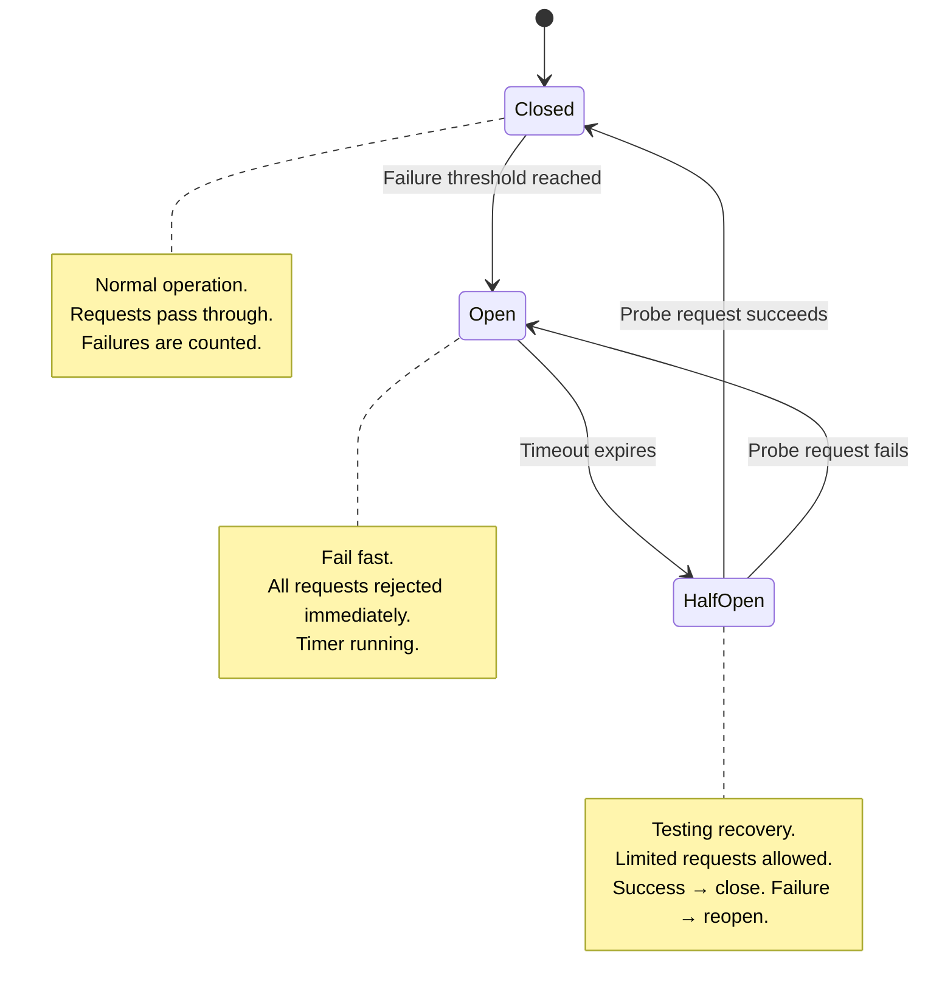
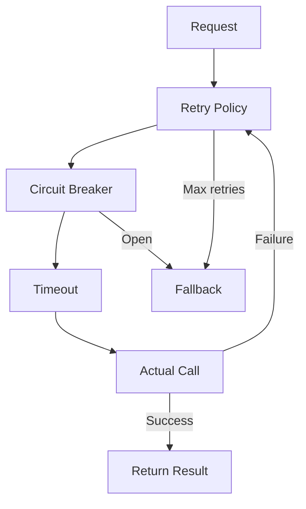
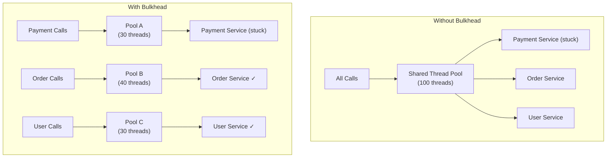

# Circuit Breaker Pattern

In electrical systems, a circuit breaker prevents a short circuit from burning down your house. In distributed systems, it prevents a failing dependency from taking down your entire service. The circuit breaker pattern wraps calls to external services and monitors failures. When failures exceed a threshold, the circuit "opens" and subsequent calls fail immediately without even attempting the call — giving the failing service time to recover instead of being hammered with requests it cannot handle.

Without circuit breakers, a single slow or failing dependency cascades through your entire system. Service A calls Service B, which is timing out. Service A's threads pile up waiting. Service A starts timing out. Service C, which calls Service A, starts timing out. Within seconds, your entire microservice mesh is a pile of threads waiting on connections that will never complete.

## The State Machine

A circuit breaker has three states:



### Closed State (Normal)

All requests pass through. The circuit breaker monitors success and failure rates. If the failure rate exceeds the configured threshold within a measurement window, the circuit opens.

### Open State (Failing Fast)

All requests are immediately rejected without calling the downstream service. This serves two purposes: it protects the failing service from additional load, and it protects the calling service from wasting resources on calls that will fail. After a configured timeout, the circuit transitions to half-open.

### Half-Open State (Testing)

A limited number of probe requests are allowed through to test if the downstream service has recovered. If they succeed, the circuit closes. If any fail, the circuit reopens and the timeout resets.

## Core Implementation

```go
package circuitbreaker

import (
	"errors"
	"sync"
	"time"
)

type State int

const (
	StateClosed   State = iota
	StateOpen
	StateHalfOpen
)

func (s State) String() string {
	switch s {
	case StateClosed:
		return "CLOSED"
	case StateOpen:
		return "OPEN"
	case StateHalfOpen:
		return "HALF_OPEN"
	default:
		return "UNKNOWN"
	}
}

var ErrCircuitOpen = errors.New("circuit breaker is open")

type CircuitBreaker struct {
	mu               sync.Mutex
	state            State
	failureCount     int
	successCount     int
	failureThreshold int
	successThreshold int       // Successes needed in half-open to close
	timeout          time.Duration
	lastFailureTime  time.Time
	onStateChange    func(from, to State)
}

type Config struct {
	FailureThreshold int
	SuccessThreshold int
	Timeout          time.Duration
	OnStateChange    func(from, to State)
}

func New(cfg Config) *CircuitBreaker {
	return &CircuitBreaker{
		state:            StateClosed,
		failureThreshold: cfg.FailureThreshold,
		successThreshold: cfg.SuccessThreshold,
		timeout:          cfg.Timeout,
		onStateChange:    cfg.OnStateChange,
	}
}

func (cb *CircuitBreaker) Execute(fn func() error) error {
	if !cb.allowRequest() {
		return ErrCircuitOpen
	}

	err := fn()

	cb.mu.Lock()
	defer cb.mu.Unlock()

	if err != nil {
		cb.onFailure()
	} else {
		cb.onSuccess()
	}

	return err
}

func (cb *CircuitBreaker) allowRequest() bool {
	cb.mu.Lock()
	defer cb.mu.Unlock()

	switch cb.state {
	case StateClosed:
		return true
	case StateOpen:
		if time.Since(cb.lastFailureTime) > cb.timeout {
			cb.transitionTo(StateHalfOpen)
			return true
		}
		return false
	case StateHalfOpen:
		return true
	default:
		return false
	}
}

func (cb *CircuitBreaker) onSuccess() {
	switch cb.state {
	case StateClosed:
		cb.failureCount = 0
	case StateHalfOpen:
		cb.successCount++
		if cb.successCount >= cb.successThreshold {
			cb.transitionTo(StateClosed)
		}
	}
}

func (cb *CircuitBreaker) onFailure() {
	switch cb.state {
	case StateClosed:
		cb.failureCount++
		if cb.failureCount >= cb.failureThreshold {
			cb.transitionTo(StateOpen)
		}
	case StateHalfOpen:
		cb.transitionTo(StateOpen)
	}
	cb.lastFailureTime = time.Now()
}

func (cb *CircuitBreaker) transitionTo(newState State) {
	if cb.state == newState {
		return
	}
	oldState := cb.state
	cb.state = newState
	cb.failureCount = 0
	cb.successCount = 0

	if cb.onStateChange != nil {
		cb.onStateChange(oldState, newState)
	}
}
```

**Usage:**

```go
cb := circuitbreaker.New(circuitbreaker.Config{
	FailureThreshold: 5,      // Open after 5 failures
	SuccessThreshold: 3,      // Close after 3 successes in half-open
	Timeout:          30 * time.Second,
	OnStateChange: func(from, to circuitbreaker.State) {
		log.Printf("Circuit breaker: %s → %s", from, to)
		metrics.RecordStateChange(from.String(), to.String())
	},
})

err := cb.Execute(func() error {
	return paymentService.Charge(ctx, amount)
})

if errors.Is(err, circuitbreaker.ErrCircuitOpen) {
	// Fallback: queue for retry, return cached result, etc.
	return handleFallback(ctx, amount)
}
```

## Failure Detection Strategies

Not all errors should trip the circuit breaker. A 400 Bad Request means the client sent garbage — that is not a service failure. A 503 Service Unavailable means the service is actually down.

### Error Classification

```python
from enum import Enum

class ErrorType(Enum):
    TRANSIENT = "transient"      # Should trip circuit breaker
    PERMANENT = "permanent"      # Should NOT trip circuit breaker
    TIMEOUT = "timeout"          # Should trip circuit breaker

def classify_error(status_code: int, error: Exception) -> ErrorType:
    """Classify HTTP errors for circuit breaker decisions."""
    if isinstance(error, TimeoutError):
        return ErrorType.TIMEOUT

    if status_code is None:
        return ErrorType.TRANSIENT  # Connection error

    if 400 <= status_code < 500:
        return ErrorType.PERMANENT  # Client error, not a service failure

    if status_code >= 500:
        return ErrorType.TRANSIENT  # Server error

    return ErrorType.PERMANENT
```

### Sliding Window Failure Rate

Instead of counting raw failures, track the failure rate over a sliding window:

```java
public class SlidingWindowCircuitBreaker {
    private final int windowSize;
    private final double failureRateThreshold;
    private final CircularBuffer<Boolean> results;

    public SlidingWindowCircuitBreaker(int windowSize,
                                       double failureRateThreshold) {
        this.windowSize = windowSize;
        this.failureRateThreshold = failureRateThreshold;
        this.results = new CircularBuffer<>(windowSize);
    }

    public void recordResult(boolean success) {
        results.add(success);

        if (results.size() >= windowSize) {
            long failures = results.stream()
                .filter(r -> !r)
                .count();
            double failureRate = (double) failures / results.size();

            if (failureRate >= failureRateThreshold) {
                transitionToOpen();
            }
        }
    }
}
```

The failure rate threshold is typically set between 50-80%. The window size determines how many samples you need before making a decision — too small and you get false positives from normal error spikes; too large and you react too slowly.

$$
\text{failure\_rate} = \frac{\text{failures in window}}{\text{total calls in window}}
$$

## Library Implementations

### Resilience4j (Java)

```java
import io.github.resilience4j.circuitbreaker.CircuitBreaker;
import io.github.resilience4j.circuitbreaker.CircuitBreakerConfig;
import io.github.resilience4j.circuitbreaker.CircuitBreakerRegistry;

CircuitBreakerConfig config = CircuitBreakerConfig.custom()
    .failureRateThreshold(50)                     // 50% failure rate
    .slowCallRateThreshold(80)                     // 80% slow call rate
    .slowCallDurationThreshold(Duration.ofSeconds(2))
    .waitDurationInOpenState(Duration.ofSeconds(30))
    .permittedNumberOfCallsInHalfOpenState(5)
    .slidingWindowType(SlidingWindowType.COUNT_BASED)
    .slidingWindowSize(10)
    .minimumNumberOfCalls(5)
    .recordExceptions(IOException.class, TimeoutException.class)
    .ignoreExceptions(BusinessException.class)
    .build();

CircuitBreakerRegistry registry = CircuitBreakerRegistry.of(config);
CircuitBreaker cb = registry.circuitBreaker("paymentService");

// Decorate a function
Supplier<PaymentResult> decorated = CircuitBreaker
    .decorateSupplier(cb, () -> paymentService.charge(amount));

// Execute with fallback
Try<PaymentResult> result = Try.ofSupplier(decorated)
    .recover(CallNotPermittedException.class,
             e -> PaymentResult.queued());
```

### Polly (.NET)

```csharp
using Polly;
using Polly.CircuitBreaker;

var circuitBreakerPolicy = Policy
    .Handle<HttpRequestException>()
    .Or<TimeoutException>()
    .AdvancedCircuitBreakerAsync(
        failureThreshold: 0.5,           // 50% failure rate
        samplingDuration: TimeSpan.FromSeconds(10),
        minimumThroughput: 8,            // Min calls before evaluating
        durationOfBreak: TimeSpan.FromSeconds(30),
        onBreak: (exception, duration) =>
        {
            logger.LogWarning(
                "Circuit opened for {Duration}s due to {Exception}",
                duration.TotalSeconds, exception.Message);
        },
        onReset: () => logger.LogInformation("Circuit closed"),
        onHalfOpen: () => logger.LogInformation("Circuit half-open")
    );

// Execute
var result = await circuitBreakerPolicy.ExecuteAsync(async () =>
{
    return await httpClient.GetAsync("/api/payments");
});
```

### TypeScript Implementation

```typescript
interface CircuitBreakerOptions {
  failureThreshold: number;
  successThreshold: number;
  timeout: number;  // milliseconds
}

class CircuitBreaker {
  private state: 'CLOSED' | 'OPEN' | 'HALF_OPEN' = 'CLOSED';
  private failureCount = 0;
  private successCount = 0;
  private lastFailureTime = 0;

  constructor(private options: CircuitBreakerOptions) {}

  async execute<T>(fn: () => Promise<T>): Promise<T> {
    if (this.state === 'OPEN') {
      if (Date.now() - this.lastFailureTime > this.options.timeout) {
        this.state = 'HALF_OPEN';
        this.successCount = 0;
      } else {
        throw new Error('Circuit breaker is OPEN');
      }
    }

    try {
      const result = await fn();
      this.onSuccess();
      return result;
    } catch (error) {
      this.onFailure();
      throw error;
    }
  }

  private onSuccess(): void {
    if (this.state === 'HALF_OPEN') {
      this.successCount++;
      if (this.successCount >= this.options.successThreshold) {
        this.state = 'CLOSED';
        this.failureCount = 0;
      }
    } else {
      this.failureCount = 0;
    }
  }

  private onFailure(): void {
    this.failureCount++;
    this.lastFailureTime = Date.now();

    if (this.state === 'HALF_OPEN') {
      this.state = 'OPEN';
    } else if (this.failureCount >= this.options.failureThreshold) {
      this.state = 'OPEN';
    }
  }
}
```

## Complementary Patterns

Circuit breakers rarely work alone. They are part of a resilience stack.

### Retry with Exponential Backoff

Retry transient failures before the circuit breaker trips:



```python
import time
import random

def retry_with_backoff(fn, max_retries=3, base_delay=1.0, max_delay=30.0):
    """Retry with exponential backoff and full jitter."""
    for attempt in range(max_retries + 1):
        try:
            return fn()
        except TransientError as e:
            if attempt == max_retries:
                raise

            delay = min(base_delay * (2 ** attempt), max_delay)
            jitter = random.uniform(0, delay)
            time.sleep(jitter)
```

::: warning Retry + Circuit Breaker Ordering
Always put retry **outside** the circuit breaker. If retry is inside, each retry counts as a separate failure toward the circuit breaker threshold, causing it to trip prematurely.

Correct: `Retry → CircuitBreaker → Call`
Wrong: `CircuitBreaker → Retry → Call`
:::

### Bulkhead Pattern

Isolate failures by partitioning resources. If the payment service fails, it should not consume all your thread pool capacity and starve the order service.



```java
// Resilience4j Bulkhead
BulkheadConfig config = BulkheadConfig.custom()
    .maxConcurrentCalls(30)
    .maxWaitDuration(Duration.ofMillis(500))
    .build();

Bulkhead paymentBulkhead = Bulkhead.of("payment", config);

// Combine with circuit breaker
Supplier<PaymentResult> decorated = Decorators
    .ofSupplier(() -> paymentService.charge(amount))
    .withBulkhead(paymentBulkhead)
    .withCircuitBreaker(circuitBreaker)
    .withRetry(retry)
    .withFallback(List.of(
        CallNotPermittedException.class,
        BulkheadFullException.class
    ), e -> PaymentResult.queued())
    .decorate();
```

### Timeout Pattern

Always pair circuit breakers with timeouts. Without a timeout, a hanging call never returns an error, so the circuit breaker never sees a failure.

```go
func callWithTimeout(ctx context.Context, timeout time.Duration,
                     fn func(context.Context) error) error {
    ctx, cancel := context.WithTimeout(ctx, timeout)
    defer cancel()

    done := make(chan error, 1)
    go func() {
        done <- fn(ctx)
    }()

    select {
    case err := <-done:
        return err
    case <-ctx.Done():
        return fmt.Errorf("call timed out after %v", timeout)
    }
}
```

## Fallback Strategies

When the circuit is open, you need a fallback. The right fallback depends on your business requirements:

| Strategy | When to Use | Example |
|----------|------------|---------|
| **Default value** | Non-critical data | Return empty recommendations |
| **Cache** | Stale data is better than no data | Serve cached product prices |
| **Queue** | Eventually consistent is OK | Queue payment for retry |
| **Graceful degradation** | Partial service is better than none | Show product page without reviews |
| **Error response** | Client can handle it | Return 503 with retry-after |

```python
class ResilientProductService:
    def __init__(self, product_api, cache, circuit_breaker):
        self.api = product_api
        self.cache = cache
        self.cb = circuit_breaker

    def get_product(self, product_id: str) -> Product:
        try:
            product = self.cb.execute(
                lambda: self.api.get(product_id)
            )
            self.cache.set(product_id, product, ttl=3600)
            return product
        except CircuitOpenError:
            # Fallback 1: serve from cache
            cached = self.cache.get(product_id)
            if cached:
                cached.stale = True
                return cached
            # Fallback 2: minimal response
            return Product(id=product_id, name="Temporarily unavailable",
                          available=False)
```

## Monitoring Circuit Breakers

Circuit breaker state changes are critical operational events. Monitor them aggressively.

```python
from prometheus_client import Counter, Gauge, Histogram

# Metrics
circuit_state = Gauge(
    'circuit_breaker_state',
    'Current state (0=closed, 1=open, 2=half-open)',
    ['service']
)
circuit_transitions = Counter(
    'circuit_breaker_transitions_total',
    'State transitions',
    ['service', 'from_state', 'to_state']
)
call_duration = Histogram(
    'circuit_breaker_call_duration_seconds',
    'Call duration through circuit breaker',
    ['service', 'result']
)
```

::: tip Alert on Open Circuits
Set up alerts for circuit breaker state changes. An open circuit means a dependency is failing, and you need to investigate. Also track the **time spent in open state** — if a circuit stays open for more than a few minutes, something is seriously wrong.

See [Observability](/infrastructure/observability/) for alerting strategies.
:::

## Anti-Patterns

### Circuit Breaker Per Instance vs Per Service

If you have a circuit breaker per downstream instance and one instance dies, the circuit breaker for that instance opens, but all other instances keep receiving traffic. This is correct. If you have a single circuit breaker for the entire service, one bad instance causes you to stop calling all instances — even the healthy ones.

### Too-Sensitive Thresholds

Setting `failureThreshold = 1` causes the circuit to open on a single failure. Network blips happen. Set thresholds high enough to filter out noise but low enough to catch real outages. Start with a failure rate of 50% over a window of 10 calls.

### No Monitoring

A circuit breaker silently failing fast is worse than a visible error. If you cannot tell which circuits are open and why, you have traded one problem for another.

## Further Reading

- [Rate Limiting](/system-design/distributed-systems/rate-limiting) — Complementary pattern for traffic control
- [Distributed Locking](/system-design/distributed-systems/distributed-locking) — Another pattern affected by failure modes
- [Failure Detectors](/system-design/distributed-systems/failure-detectors) — Theory behind detecting failed nodes
- [Consistency Models](/system-design/distributed-systems/consistency-models) — How circuit breakers affect consistency guarantees
- [Service Mesh](/infrastructure/service-mesh/) — How service meshes implement circuit breaking at the infrastructure level
- Michael Nygard, *Release It!* — The book that popularized the circuit breaker pattern
- Netflix Hystrix Wiki — The canonical implementation (now in maintenance mode)
- Resilience4j documentation — The modern Java resilience library
