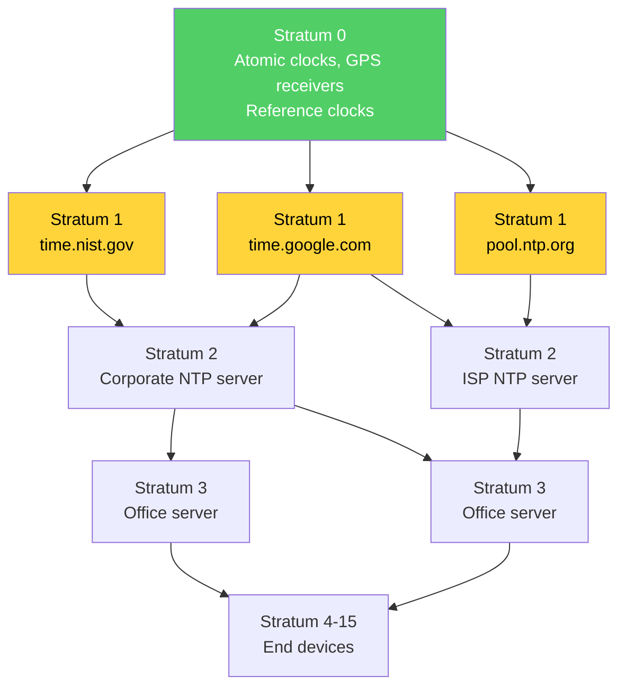
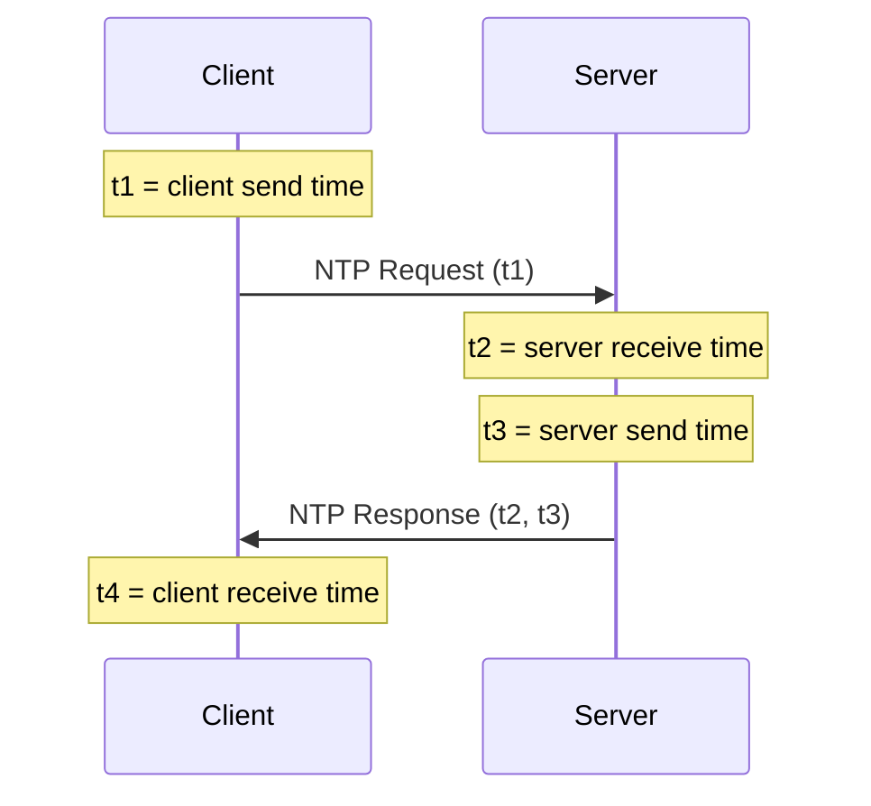
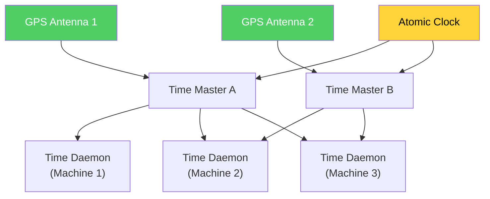

# Clock Synchronization

Time is the most deceptive concept in distributed systems. Every programmer assumes they can call `Date.now()` and get a meaningful answer. In a single process, they can. In a distributed system, they cannot. Clocks on different machines disagree — not by microseconds in some edge case, but by milliseconds to seconds as a routine matter. This disagreement is not a bug to be fixed but a physical reality to be managed.

## Why It Exists

### The Problem of Disagreeing Clocks

Consider two servers processing financial transactions:

```
Server A's clock: 14:00:00.000
Server B's clock: 14:00:00.347   (347ms ahead of A)

Transaction T1 arrives at Server A at A's time 14:00:00.100
Transaction T2 arrives at Server B at B's time 14:00:00.200

Wall-clock reality: T1 happened at real time 14:00:00.100
                    T2 happened at real time 13:59:59.853

T2 actually happened BEFORE T1, but the timestamps say T2 happened after T1.
```

If the system orders transactions by timestamp, it will process them in the wrong order. For financial transactions, this can mean the difference between a valid trade and a regulatory violation.

### Why Clocks Disagree

Every computer has a local oscillator that drives its clock. These oscillators are imperfect:

1. **Manufacturing variation** — No two crystals vibrate at exactly the same frequency
2. **Temperature sensitivity** — Oscillator frequency changes with temperature
3. **Aging** — Crystal properties change over time
4. **Voltage variation** — Power supply fluctuations affect frequency

These imperfections cause clocks to **drift** — run slightly faster or slower than real time. Over minutes and hours, small drift accumulates into significant disagreement.

### Consequences of Clock Skew

| Scenario | Problem Caused by Clock Skew |
|----------|------------------------------|
| Distributed databases | Transaction ordering violations, snapshot isolation failures |
| Certificate validation | Certificates appear expired or not-yet-valid |
| Cache expiration | Items expire too early or too late across servers |
| Log correlation | Events from different servers appear in wrong order |
| Distributed locks | Lock leases expire at wrong times, causing split-brain |
| Rate limiting | Per-second rate limits are inaccurate |
| Consensus protocols | Leader election timeouts fire incorrectly |
| Kerberos authentication | Tickets rejected due to clock difference > 5 minutes |

::: info War Story
A CDN provider discovered that 0.3% of HTTPS connections were failing with certificate validation errors. Investigation revealed that edge servers in one region had clocks drifting up to 8 minutes ahead. When a new TLS certificate was provisioned with a "Not Before" timestamp of the current time, edge servers with clocks 8 minutes ahead saw the certificate as valid, but client browsers with accurate clocks rejected it because the certificate appeared to be "not yet valid." The root cause: NTP had been accidentally disabled during a system image update six months earlier. The clocks had been drifting freely for 180 days. The fix took 30 seconds (restart NTP), but the debugging took 3 weeks.
:::

## First Principles

### Crystal Oscillator Physics

Most computers use **quartz crystal oscillators** as their timekeeping element. A quartz crystal is a piezoelectric material — when voltage is applied, it vibrates at a natural resonant frequency determined by its physical dimensions.

**Typical specs for a commodity server crystal:**
- Nominal frequency: 32.768 kHz (for RTC) or MHz range (for CPU clock)
- Frequency stability: $\pm 20$ ppm (parts per million) at room temperature
- Temperature coefficient: $\pm 0.035$ ppm/°C² (parabolic curve centered at 25°C)
- Aging: $\pm 3$ ppm/year

**What does 20 ppm mean in practice?**

$$
\text{Drift per second} = 20 \times 10^{-6} \text{ seconds} = 20 \text{ μs/s}
$$

$$
\text{Drift per minute} = 1.2 \text{ ms/min}
$$

$$
\text{Drift per hour} = 72 \text{ ms/hour}
$$

$$
\text{Drift per day} = 1.728 \text{ s/day}
$$

After one day without synchronization, a clock can be almost 2 seconds off. After a month, nearly a minute.

**Temperature effects:** The frequency of a quartz crystal follows a parabolic curve:

$$
\frac{\Delta f}{f_0} = a(T - T_0)^2
$$

where $T_0 \approx 25°C$ is the turnover temperature and $a \approx -0.035$ ppm/°C². At 35°C:

$$
\frac{\Delta f}{f_0} = -0.035 \times (35 - 25)^2 = -3.5 \text{ ppm}
$$

In a datacenter where server inlet temperature varies from 18°C to 32°C across racks, temperature-induced drift differences between servers can be significant.

### Clock Types

**Hardware clock (RTC — Real Time Clock):**
- Battery-backed oscillator on the motherboard
- Runs even when the computer is off
- Low accuracy (± 20 ppm typical)
- Read via BIOS or OS syscall

**System clock (OS clock):**
- Maintained by the operating system kernel
- Initialized from RTC at boot, then runs from CPU timer interrupts
- Can be adjusted by NTP or manual set
- Subject to both oscillator drift AND OS scheduling jitter

**Monotonic clock:**
- Guaranteed to never go backward
- Not related to wall-clock time
- Suitable for measuring elapsed time between events on a single machine
- Not useful for ordering events across machines

### Drift, Skew, and Offset

Three fundamental measures of clock inaccuracy:

**Clock offset ($\theta$):** The difference between a clock's time and true time at a specific instant.

$$
\theta(t) = C(t) - t
$$

where $C(t)$ is the clock's reading at true time $t$.

**Clock skew ($\delta$):** The rate of change of offset — how fast the clock is drifting.

$$
\delta = \frac{d\theta}{dt} = \frac{dC}{dt} - 1
$$

A perfect clock has $\delta = 0$. A clock running 20 ppm fast has $\delta = 20 \times 10^{-6}$.

**Clock drift ($\rho$):** The maximum skew of the clock. For a crystal with ±20 ppm stability:

$$
\rho = 20 \times 10^{-6}
$$

Two clocks with drift rate $\rho$ can diverge at rate $2\rho$ (one fast, one slow):

$$
|\theta_A(t) - \theta_B(t)| \leq 2\rho \cdot t + |\theta_A(0) - \theta_B(0)|
$$

### The Speed of Light Limit

Even if we had perfect oscillators, there is a fundamental limit: the speed of light. A signal between New York and London (5,500 km via cable) takes at minimum:

$$
t_{min} = \frac{5{,}500 \times 10^3 \text{ m}}{2 \times 10^8 \text{ m/s}} \approx 27.5 \text{ ms}
$$

(using $2 \times 10^8$ m/s for speed of light in fiber, about 2/3 of vacuum speed)

You cannot synchronize clocks across the Atlantic to better than ~27.5ms using network protocols. Even within a datacenter (100m of cable), the minimum latency is:

$$
t_{min} = \frac{100}{2 \times 10^8} = 0.5 \text{ μs}
$$

## Core Mechanics: NTP (Network Time Protocol)

### Overview

NTP (Network Time Protocol), designed by David Mills at the University of Delaware, has been synchronizing clocks on the internet since 1985. It is one of the oldest internet protocols still in wide use.

**Goal:** Synchronize clocks to within tens of milliseconds over the internet, or sub-millisecond on a LAN.

**Current version:** NTPv4 (RFC 5905, published 2010)

### Stratum Levels

NTP organizes time sources in a hierarchy:



| Stratum | Description | Typical Accuracy |
|---------|-------------|-----------------|
| 0 | Reference clock (atomic, GPS) | nanoseconds |
| 1 | Directly connected to stratum 0 | microseconds |
| 2 | Syncs from stratum 1 servers | ~1-10 ms |
| 3 | Syncs from stratum 2 servers | ~10-50 ms |
| ... | Each hop adds uncertainty | |
| 16 | Unsynchronized (maximum) | undefined |

### The NTP Exchange Protocol

NTP uses a four-timestamp exchange to measure the offset and round-trip delay between client and server:



From these four timestamps:

**Round-trip delay:**

$$
d = (t_4 - t_1) - (t_3 - t_2)
$$

The total time the packet spent in the network (excluding server processing time).

**Clock offset:**

$$
\theta = \frac{(t_2 - t_1) + (t_3 - t_4)}{2}
$$

This assumes the network delay is symmetric (equal in both directions). If the one-way delays are $d_{\text{req}}$ and $d_{\text{resp}}$:

$$
d = d_{\text{req}} + d_{\text{resp}}
$$

$$
\theta = \theta_{\text{true}} + \frac{d_{\text{req}} - d_{\text{resp}}}{2}
$$

The offset estimate is only as accurate as the symmetry assumption. Asymmetric routing (common on the internet) introduces systematic error equal to half the asymmetry.

### Error Bounds

The true offset lies within:

$$
\theta_{\text{true}} \in \left[\theta - \frac{d}{2}, \theta + \frac{d}{2}\right]
$$

Lower round-trip delay means tighter bounds. NTP preferentially selects samples with the lowest delay.

### Marzullo's Algorithm

When a client has multiple NTP sources, it must combine their offset estimates. Marzullo's algorithm (1984) finds the smallest interval consistent with the maximum number of sources.

Each source $i$ provides an offset estimate $\theta_i$ with error bound $\pm \epsilon_i$, giving an interval $[\theta_i - \epsilon_i, \theta_i + \epsilon_i]$.

**Algorithm:**
1. Collect all intervals from all sources
2. Find the smallest interval that intersects with the majority of source intervals
3. Use the midpoint of this intersection as the best offset estimate

```
Source 1: [─────────────]      offset = 10ms ± 5ms → [5, 15]
Source 2:     [──────────────]  offset = 12ms ± 6ms → [6, 18]
Source 3: [───────]            offset = 8ms  ± 3ms → [5, 11]
Source 4:                 [─────────]  offset = 20ms ± 4ms → [16, 24]

Intersection of sources 1, 2, 3: [6, 11]
Source 4 is an outlier (no overlap with the majority)
Best estimate: midpoint of [6, 11] = 8.5ms
```

This makes NTP robust against a minority of faulty or malicious time sources (falsetickers).

### The Intersection Algorithm

NTP's actual implementation uses a variant called the **intersection algorithm**:

1. For each source, compute the interval $[\theta_i - \lambda_i, \theta_i + \lambda_i]$ where $\lambda_i = d_i/2 + \epsilon_i$ includes both network delay and estimated dispersion
2. Find the largest number of sources $f$ such that more than $n/2$ source intervals intersect
3. The intersection of these intervals is the **system peer selection** interval
4. Select the "best" source (lowest stratum, lowest delay, lowest dispersion) within this interval as the system peer

### NTP Clock Discipline

Once an offset is determined, NTP doesn't simply jump the clock. Instead, it uses a **clock discipline algorithm** — a feedback control loop that adjusts the clock frequency (slewing) to gradually bring it into alignment:

**Phase correction (for small offsets < 128ms):**

$$
f_{\text{adj}} = f_0 + K_p \cdot \theta + K_i \cdot \int \theta \, dt
$$

This is a PI (proportional-integral) controller. The clock frequency is adjusted to gradually eliminate the offset without causing time jumps.

**Step correction (for large offsets > 128ms):**
The clock is stepped (jumped) to the correct time immediately. This can cause problems for applications that assume time never jumps.

**Panic threshold (offset > 1000 seconds):**
NTP refuses to adjust and exits. The offset is so large that something is seriously wrong (wrong timezone, hardware failure, spoofed NTP server).

### NTP Accuracy in Practice

| Environment | Typical Accuracy | Notes |
|-------------|-----------------|-------|
| Over internet | 1-50 ms | Depends on path asymmetry |
| Within datacenter | 0.1-1 ms | Low latency, symmetric paths |
| With local GPS receiver | 1-10 μs | Stratum 1 accuracy |
| With PTP (IEEE 1588) | < 1 μs | Hardware timestamping required |

## Core Mechanics: PTP (Precision Time Protocol)

### Why PTP When We Have NTP?

NTP's accuracy is limited by:
1. Software timestamping — kernel interrupt latency adds jitter
2. Asymmetric network paths — NTP cannot correct for routing asymmetry
3. Non-deterministic OS scheduling — variable delay between packet arrival and timestamp

PTP (IEEE 1588) achieves sub-microsecond accuracy by:
1. **Hardware timestamping** — Network interface cards (NICs) stamp packets at the PHY layer, eliminating OS jitter
2. **Transparent clocks** — Network switches measure and report their forwarding delay, removing switch-induced asymmetry
3. **Boundary clocks** — Switches act as PTP clients and servers, reducing hop count

### PTP Message Exchange

PTP uses a similar four-timestamp exchange to NTP but with hardware timestamps:

```
         Master                     Slave
           |                          |
           |──── Sync (t1) ──────────►|
           |                     t2 = receive time
           |──── Follow_Up (t1) ─────►|
           |                          |
           |◄──── Delay_Req ──────────|
           |                     t3 = send time
           |──── Delay_Resp (t4) ────►|
           |                          |
```

The `Sync` message is timestamped by hardware at the precise moment it leaves the master's NIC. The `Follow_Up` message carries this timestamp (because the hardware timestamp isn't known until after the packet is sent).

### PTP Accuracy

| Configuration | Accuracy |
|--------------|----------|
| Software PTP | 10-100 μs |
| Hardware PTP, standard NICs | 100 ns - 1 μs |
| Hardware PTP, PTP-aware switches | 10-100 ns |
| White Rabbit (CERN extension) | < 1 ns |

PTP is used in financial trading (where microseconds matter for order priority), telecommunications (5G requires ±1.5μs synchronization), and scientific instruments.

## GPS-Based Time: Google's TrueTime

### The GPS Approach

Instead of synchronizing clocks over the network, equip each machine with a GPS receiver that provides time directly from atomic clocks in GPS satellites.

**GPS timing accuracy:** ~10-30 ns (in ideal conditions with clear sky view)

**But in a datacenter:** GPS antennas must be on the roof, with cables running to server rooms. Signal degradation, multipath reflections, and cable delay add uncertainty. Practical accuracy: ~1-7 μs.

### TrueTime API

Google's TrueTime, introduced with Spanner (2012), doesn't return a single timestamp. It returns an **interval**:

```
TT.now() → [earliest, latest]
```

The guarantee: the true current time is somewhere within this interval. The interval width $\epsilon$ is typically 1-7 ms, depending on how recently the local clock was synchronized.

```typescript
interface TrueTimeInterval {
  earliest: number;  // lower bound on true time
  latest: number;    // upper bound on true time
}

// TT.now() returns an interval, NOT a point
function ttNow(): TrueTimeInterval {
  // In reality, this is backed by GPS receivers and
  // atomic clocks with known drift bounds
  const now = Date.now();
  const epsilon = getCurrentUncertainty(); // typically 1-7ms
  return {
    earliest: now - epsilon,
    latest: now + epsilon,
  };
}

// TT.after(t) → true if t has definitely passed
function ttAfter(t: number): boolean {
  return ttNow().earliest > t;
}

// TT.before(t) → true if t has definitely not arrived
function ttBefore(t: number): boolean {
  return ttNow().latest < t;
}
```

### TrueTime Architecture

Each Google datacenter has:
- **GPS receivers** — Multiple antennas on the roof, providing time from the GPS satellite constellation
- **Atomic clocks** — Cesium or rubidium oscillators as backup and cross-check against GPS
- **Time masters** — Servers that collect GPS and atomic clock data, compute uncertainty bounds, and serve time to other machines
- **Time daemon** — Each machine runs a daemon that polls multiple time masters and computes local uncertainty



The time daemon polls time masters every 30 seconds. Between polls, the uncertainty $\epsilon$ grows at the local oscillator's drift rate:

$$
\epsilon(t) = \epsilon_0 + \rho \cdot (t - t_{\text{last\_sync}})
$$

where $\epsilon_0$ is the uncertainty at the last synchronization and $\rho$ is the local drift bound (typically 200 μs/s for server-grade crystals).

### Spanner: Using TrueTime for Serializable Transactions

Spanner uses TrueTime's uncertainty intervals to provide **external consistency** — the strongest form of consistency for distributed transactions. If transaction $T_1$ commits before $T_2$ starts (in real time), then $T_1$'s commit timestamp is less than $T_2$'s.

**The commit wait rule:**

When a transaction commits at timestamp $s$:
1. The leader assigns commit timestamp $s = \text{TT.now().latest}$
2. The leader **waits** until $\text{TT.after}(s)$ is true before releasing the commit

This wait ensures that $s$ has definitely passed before any other transaction can observe the committed data. The wait duration is $2\epsilon$ in the worst case.

$$
\text{Commit wait} \leq 2\epsilon \approx 2 \times 7\text{ms} = 14\text{ms}
$$

This is the direct relationship between **clock uncertainty and transaction latency**:

$$
\text{Transaction latency} \geq \text{Paxos round-trip} + 2\epsilon
$$

Google has invested heavily in reducing $\epsilon$ because every millisecond of clock uncertainty adds a millisecond of transaction latency.

### The Relationship Between Clock Uncertainty and Transaction Latency

This deserves emphasis because it is one of the most important practical consequences of clock synchronization:

$$
\boxed{\text{Commit latency} = f(\epsilon) \implies \text{Better clocks} = \text{Faster transactions}}
$$

| Clock uncertainty $\epsilon$ | Commit wait $2\epsilon$ | Impact |
|-----------------------------|------------------------|--------|
| 7 ms (typical TrueTime) | 14 ms | Acceptable for most workloads |
| 100 ms (NTP over internet) | 200 ms | Too slow for interactive applications |
| 1 ms (TrueTime with better crystals) | 2 ms | Negligible overhead |
| 1 μs (PTP with atomic clock) | 2 μs | Effectively zero overhead |

This is why Google runs its own time infrastructure. The cost of GPS receivers and atomic clocks in every datacenter is dwarfed by the performance benefit of low $\epsilon$.

### Clock Skew and Drift in Real Datacenters

Published measurements from real datacenter deployments:

| Source | Environment | Measured Skew | Notes |
|--------|-------------|---------------|-------|
| Google (Spanner paper) | Google DC with TrueTime | $\epsilon \leq 7\text{ms}$, avg $\approx 4\text{ms}$ | GPS + atomic clocks |
| Corbett et al. 2012 | Google DC | 200 μs/s max drift rate | Server-grade oscillators |
| Brewer & Raab 2014 | Facebook DC with NTP | P99 < 10ms, P50 < 1ms | Well-tuned NTP |
| Najafi et al. 2016 | Azure DC with NTP | Mean 1ms, P99.9 6ms | NTP with local stratum 1 |
| AWS (re:Invent talks) | AWS DC | "Single-digit milliseconds" | NTP + ClockBound |

Key finding: with proper NTP configuration and local stratum 1 servers, datacenter clock skew is consistently in the low millisecond range. The tail (P99.9) can spike during NTP re-synchronization events or server reboots.

## TypeScript Implementation: Simple NTP Client

```typescript
// Simple NTP Client Implementation
// Demonstrates the core NTP offset/delay calculation

interface NTPTimestamps {
  t1: number; // Client send time
  t2: number; // Server receive time
  t3: number; // Server send time
  t4: number; // Client receive time
}

interface NTPResult {
  offset: number;      // Estimated clock offset (ms)
  roundTripDelay: number; // Round-trip network delay (ms)
  errorBound: number;  // Maximum error in offset estimate (ms)
}

interface NTPSource {
  id: string;
  stratum: number;
  lastResult: NTPResult | null;
  reachability: number; // 8-bit shift register of successes
  jitter: number;       // RMS of recent offset differences
}

class SimpleNTPClient {
  private sources: NTPSource[] = [];
  private offsetHistory: number[] = [];
  private readonly maxHistory = 8;

  // Smoothed offset and frequency
  private smoothedOffset: number = 0;
  private frequencyCorrection: number = 0; // ppm

  // PI controller gains
  private readonly Kp = 0.5;  // Proportional gain
  private readonly Ki = 0.01; // Integral gain
  private integralAccumulator = 0;

  /**
   * Process an NTP exchange and compute offset and delay.
   */
  processExchange(timestamps: NTPTimestamps): NTPResult {
    const { t1, t2, t3, t4 } = timestamps;

    // Round-trip delay: total time minus server processing time
    const roundTripDelay = (t4 - t1) - (t3 - t2);

    // Clock offset: average of forward and backward path offsets
    // Assumes symmetric delays
    const offset = ((t2 - t1) + (t3 - t4)) / 2;

    // Error bound: half the round-trip delay
    // True offset is within [offset - d/2, offset + d/2]
    const errorBound = roundTripDelay / 2;

    return { offset, roundTripDelay, errorBound };
  }

  /**
   * Add an NTP time source.
   */
  addSource(id: string, stratum: number): void {
    this.sources.push({
      id,
      stratum,
      lastResult: null,
      reachability: 0,
      jitter: 0,
    });
  }

  /**
   * Record a measurement from a source.
   */
  recordMeasurement(sourceId: string, result: NTPResult): void {
    const source = this.sources.find(s => s.id === sourceId);
    if (!source) return;

    // Update reachability register (shift left, add 1 for success)
    source.reachability = ((source.reachability << 1) | 1) & 0xFF;

    // Update jitter (RMS of offset differences)
    if (source.lastResult) {
      const diff = result.offset - source.lastResult.offset;
      source.jitter = Math.sqrt(
        source.jitter * source.jitter * 0.75 + diff * diff * 0.25
      );
    }

    source.lastResult = result;
  }

  /**
   * Implementation of Marzullo's algorithm to find the best
   * offset interval from multiple sources.
   */
  marzulloAlgorithm(): { offset: number; errorBound: number } | null {
    // Collect intervals from all reachable sources
    const intervals: Array<{ low: number; high: number; source: string }> = [];

    for (const source of this.sources) {
      if (source.lastResult && source.reachability > 0) {
        intervals.push({
          low: source.lastResult.offset - source.lastResult.errorBound,
          high: source.lastResult.offset + source.lastResult.errorBound,
          source: source.id,
        });
      }
    }

    if (intervals.length === 0) return null;

    // Build sorted list of interval endpoints
    type Endpoint = { value: number; type: 'start' | 'end' };
    const endpoints: Endpoint[] = [];
    for (const interval of intervals) {
      endpoints.push({ value: interval.low, type: 'start' });
      endpoints.push({ value: interval.high, type: 'end' });
    }
    endpoints.sort((a, b) => a.value - b.value || (a.type === 'start' ? -1 : 1));

    // Find the point covered by the most intervals
    let maxOverlap = 0;
    let currentOverlap = 0;
    let bestLow = 0;
    let bestHigh = 0;
    let inBest = false;

    for (const ep of endpoints) {
      if (ep.type === 'start') {
        currentOverlap++;
        if (currentOverlap > maxOverlap) {
          maxOverlap = currentOverlap;
          bestLow = ep.value;
          inBest = true;
        }
      } else {
        if (currentOverlap === maxOverlap && inBest) {
          bestHigh = ep.value;
          inBest = false;
        }
        currentOverlap--;
      }
    }

    // Check that a majority of sources agree
    const majority = Math.floor(intervals.length / 2) + 1;
    if (maxOverlap < majority) {
      console.warn(`Only ${maxOverlap}/${intervals.length} sources agree. ` +
        `Possible falseticker.`);
    }

    const offset = (bestLow + bestHigh) / 2;
    const errorBound = (bestHigh - bestLow) / 2;

    return { offset, errorBound };
  }

  /**
   * Select the best source (system peer) from available sources.
   * Prefers: lower stratum > lower delay > lower jitter
   */
  selectSystemPeer(): NTPSource | null {
    const reachable = this.sources.filter(
      s => s.lastResult && s.reachability > 0
    );

    if (reachable.length === 0) return null;

    // Sort by: stratum (ascending), then delay (ascending), then jitter (ascending)
    reachable.sort((a, b) => {
      if (a.stratum !== b.stratum) return a.stratum - b.stratum;
      const delayA = a.lastResult!.roundTripDelay;
      const delayB = b.lastResult!.roundTripDelay;
      if (delayA !== delayB) return delayA - delayB;
      return a.jitter - b.jitter;
    });

    return reachable[0];
  }

  /**
   * Apply clock discipline: compute frequency adjustment
   * using a PI controller.
   */
  discipline(measuredOffset: number): {
    phaseCorrection: number;
    frequencyCorrection: number;
  } {
    // PI controller
    this.integralAccumulator += measuredOffset;

    const phaseCorrection = this.Kp * measuredOffset;
    this.frequencyCorrection = this.Ki * this.integralAccumulator;

    this.smoothedOffset = measuredOffset;

    return {
      phaseCorrection,
      frequencyCorrection: this.frequencyCorrection,
    };
  }

  /**
   * Get current synchronization status.
   */
  getStatus(): {
    systemPeer: string | null;
    offset: number;
    frequencyCorrection: number;
    sources: Array<{
      id: string;
      stratum: number;
      offset: number | null;
      delay: number | null;
      jitter: number;
      reachability: string;
    }>;
  } {
    const peer = this.selectSystemPeer();

    return {
      systemPeer: peer?.id ?? null,
      offset: this.smoothedOffset,
      frequencyCorrection: this.frequencyCorrection,
      sources: this.sources.map(s => ({
        id: s.id,
        stratum: s.stratum,
        offset: s.lastResult?.offset ?? null,
        delay: s.lastResult?.roundTripDelay ?? null,
        jitter: s.jitter,
        reachability: s.reachability.toString(2).padStart(8, '0'),
      })),
    };
  }
}

// ─── Simulation ─────────────────────────────────────────────────

function runNTPSimulation(): void {
  console.log('=== Simple NTP Client Simulation ===\n');

  const client = new SimpleNTPClient();

  // Add multiple time sources
  client.addSource('ntp1.example.com', 1);
  client.addSource('ntp2.example.com', 2);
  client.addSource('ntp3.example.com', 2);
  client.addSource('ntp4.evil.com', 2); // Falseticker

  // Simulate exchanges with each source
  // True offset is +5ms (our clock is 5ms behind)

  console.log('--- Round 1: Initial measurements ---');

  // Source 1: good, low delay
  const r1 = client.processExchange({
    t1: 1000, t2: 1005.2, t3: 1005.3, t4: 1001.1,
  });
  client.recordMeasurement('ntp1.example.com', r1);
  console.log(`  ntp1: offset=${r1.offset.toFixed(2)}ms delay=${r1.roundTripDelay.toFixed(2)}ms`);

  // Source 2: good, medium delay
  const r2 = client.processExchange({
    t1: 1000, t2: 1005.5, t3: 1005.7, t4: 1002.0,
  });
  client.recordMeasurement('ntp2.example.com', r2);
  console.log(`  ntp2: offset=${r2.offset.toFixed(2)}ms delay=${r2.roundTripDelay.toFixed(2)}ms`);

  // Source 3: good, medium delay
  const r3 = client.processExchange({
    t1: 1000, t2: 1004.8, t3: 1005.0, t4: 1001.5,
  });
  client.recordMeasurement('ntp3.example.com', r3);
  console.log(`  ntp3: offset=${r3.offset.toFixed(2)}ms delay=${r3.roundTripDelay.toFixed(2)}ms`);

  // Source 4: falseticker (offset is way off)
  const r4 = client.processExchange({
    t1: 1000, t2: 1050.0, t3: 1050.2, t4: 1001.0,
  });
  client.recordMeasurement('ntp4.evil.com', r4);
  console.log(`  ntp4: offset=${r4.offset.toFixed(2)}ms delay=${r4.roundTripDelay.toFixed(2)}ms`);

  // Run Marzullo's algorithm
  console.log('\n--- Marzullo\'s Algorithm ---');
  const best = client.marzulloAlgorithm();
  if (best) {
    console.log(`  Best offset: ${best.offset.toFixed(2)}ms ± ${best.errorBound.toFixed(2)}ms`);
  }

  // Select system peer
  const peer = client.selectSystemPeer();
  console.log(`  System peer: ${peer?.id}`);

  // Apply clock discipline
  if (best) {
    const discipline = client.discipline(best.offset);
    console.log(`\n--- Clock Discipline ---`);
    console.log(`  Phase correction: ${discipline.phaseCorrection.toFixed(4)}ms`);
    console.log(`  Frequency correction: ${discipline.frequencyCorrection.toFixed(6)} ppm`);
  }

  // Print full status
  console.log('\n--- Full Status ---');
  const status = client.getStatus();
  console.log(`  System peer: ${status.systemPeer}`);
  console.log(`  Offset: ${status.offset.toFixed(2)}ms`);
  console.log('  Sources:');
  for (const src of status.sources) {
    console.log(
      `    ${src.id} [stratum ${src.stratum}] ` +
      `offset=${src.offset?.toFixed(2) ?? 'N/A'}ms ` +
      `delay=${src.delay?.toFixed(2) ?? 'N/A'}ms ` +
      `reach=${src.reachability}`
    );
  }
}

runNTPSimulation();
```

## Edge Cases and Failure Modes

### Leap Seconds

A leap second is an extra second inserted (or theoretically removed) to keep UTC aligned with Earth's rotation. The most recent was December 31, 2016.

**Problems leap seconds cause:**
- `23:59:59` → `23:59:60` → `00:00:00` — most software doesn't expect a 60th second
- Some systems crash, others miscount, others freeze for a second
- NTP distributes leap second warnings in the packet header

**Solutions:**
- **Leap smear (Google's approach):** Spread the extra second over a 24-hour window. Instead of adding one second at midnight, slow the clock by ~11.6 μs per second throughout the day. The clock is never more than 0.5 seconds off
- **Kernel step:** Linux kernel inserts the leap second, causing a 1-second repeat or jump
- **UTC-SLS (Smoothed Leap Seconds):** Similar to leap smear, defined in a draft standard

::: info War Story
On June 30, 2012, the leap second insertion caused widespread outages across the internet. The Linux kernel's leap second handling triggered a bug in the `hrtimer` subsystem, causing high CPU usage (100% on affected cores) in Java applications, MySQL, and other software that used POSIX timers. Reddit, Gawker, Mozilla, FourSquare, and Qantas airline all experienced outages. The fix was a kernel patch, but the immediate workaround was `date -s "$(date)"` — resetting the system time, which cleared the internal timer state. Google's infrastructure was unaffected because it used leap smearing.
:::

### NTP Spoofing and Security

NTP traditionally runs over UDP with no authentication. An attacker can:
- Send fake NTP responses to shift a victim's clock
- Conduct a man-in-the-middle attack on NTP traffic
- Amplify DDoS attacks using NTP's `monlist` command (now disabled by default)

**NTS (Network Time Security):** Published as RFC 8915 in 2020, NTS adds TLS-based authentication to NTP. It uses a key exchange protocol (NTS-KE) to establish shared keys, then authenticates NTP packets with AEAD (authenticated encryption with associated data).

### Clock Jumps and Monotonicity

When NTP corrects a large offset, it can cause the system clock to **jump backward**. This breaks software that assumes time is monotonically increasing:

```
Before step: 14:00:05.000
After step:  14:00:03.500  (clock jumped back 1.5 seconds!)

Any timer set for 14:00:04.000 fires immediately (it's already "past")
Any elapsed time calculation gives a negative result
Any log correlation based on timestamps is confused
```

**Mitigation:**
- Use **monotonic clocks** (`performance.now()` in JS, `CLOCK_MONOTONIC` in POSIX) for elapsed time measurement
- Use **slewing** instead of stepping (NTP's default for offsets < 128ms)
- Design applications to handle non-monotonic wall clock timestamps

### VM Clock Issues

Virtual machines have additional clock problems:

1. **vCPU scheduling** — When a VM is not scheduled on a physical CPU, its clock effectively stops. When it resumes, the clock jumps forward
2. **Live migration** — Moving a VM between physical hosts can cause clock jumps
3. **TSC instability** — The Time Stamp Counter (TSC) may not be synchronized across physical cores or sockets

Cloud providers mitigate these with:
- **Paravirtual clocks** (e.g., `kvm-clock` in KVM/QEMU) that account for VM scheduling
- **Dedicated NTP infrastructure** (AWS Time Sync Service, Google Cloud's NTP, Azure Time Sync)
- **ClockBound** (AWS) — provides TrueTime-like uncertainty intervals using NTP

## Performance Considerations

### Synchronization Accuracy vs. Cost

| Method | Accuracy | Cost per Server | Infrastructure |
|--------|----------|----------------|----------------|
| NTP over internet | 1-50 ms | $0 | Public NTP pools |
| NTP with local stratum 1 | 0.1-1 ms | ~$500 one-time | GPS receiver + antenna |
| PTP with software timestamping | 10-100 μs | ~$0 (software) | PTP-capable switches needed |
| PTP with hardware timestamping | 10-100 ns | ~$200/NIC | PTP-capable NICs + switches |
| TrueTime (GPS + atomic) | 1-7 ms uncertainty | ~$2000+/DC | GPS receivers + atomic clocks |

### Impact on System Design

Clock synchronization accuracy directly affects system design choices:

| If clock accuracy is... | You can use... | You cannot use... |
|------------------------|---------------|-------------------|
| ~50 ms (internet NTP) | Lamport clocks, vector clocks | Timestamp-based ordering |
| ~1 ms (local NTP) | Hybrid Logical Clocks, loose time bounds | Spanner-style commit wait |
| ~1 μs (PTP) | Timestamp-based ordering, short commit waits | |
| ~100 ns (PTP + atomic) | Direct timestamp comparison, CockroachDB-style | |

## Math Foundations

### Clock Synchronization Bounds

**Internal synchronization:** All clocks agree with each other within $\delta$.

$$
\forall i, j: |C_i(t) - C_j(t)| \leq \delta \quad \forall t
$$

**External synchronization:** All clocks agree with true time within $D$.

$$
\forall i: |C_i(t) - t| \leq D \quad \forall t
$$

External synchronization with bound $D$ implies internal synchronization with bound $2D$ (triangle inequality).

### Optimal Synchronization

Lundelius and Lynch (1984) proved a lower bound on clock synchronization:

$$
\delta \geq \frac{u}{2}(1 - \frac{1}{n})
$$

where $u$ is the uncertainty in message delay (the difference between maximum and minimum one-way delay) and $n$ is the number of processes.

For two processes ($n = 2$):

$$
\delta \geq \frac{u}{4}
$$

This means if the network delay varies between 1ms and 11ms ($u = 10$ms), you cannot synchronize two clocks better than 2.5ms, regardless of the algorithm used.

### Allan Variance

The stability of an oscillator is characterized by the **Allan variance** $\sigma_y^2(\tau)$, which measures frequency fluctuations over averaging time $\tau$:

$$
\sigma_y^2(\tau) = \frac{1}{2} \left\langle \left(\bar{y}_{n+1} - \bar{y}_n\right)^2 \right\rangle
$$

where $\bar{y}_n$ is the average fractional frequency over the $n$-th interval of duration $\tau$.

Typical values:
- Quartz crystal: $\sigma_y(\tau=1\text{s}) \approx 10^{-10}$ to $10^{-12}$
- Rubidium atomic clock: $\sigma_y(\tau=1\text{s}) \approx 10^{-11}$ to $10^{-13}$
- Cesium atomic clock: $\sigma_y(\tau=1\text{s}) \approx 10^{-13}$ to $10^{-14}$

### Uncertainty Growth Model

After synchronization at time $t_0$ with initial uncertainty $\epsilon_0$, the uncertainty at time $t$ is:

$$
\epsilon(t) = \epsilon_0 + \rho \cdot (t - t_0) + \frac{1}{2} \dot{\rho} \cdot (t - t_0)^2
$$

where $\rho$ is the drift rate and $\dot{\rho}$ is the drift rate change (for temperature-dependent effects). In practice, the quadratic term is negligible over short intervals.

For Spanner with $\rho = 200$ μs/s and sync interval of 30 seconds:

$$
\epsilon(30\text{s}) = \epsilon_0 + 200 \times 10^{-6} \times 30 = \epsilon_0 + 6\text{ms}
$$

This is why Spanner's TrueTime uncertainty is typically 1-7ms: $\epsilon_0 \approx 1$ms from the synchronization itself, plus up to 6ms of drift until the next synchronization.

## Hybrid Logical Clocks (HLC)

### Motivation

Logical clocks (Lamport, vector) provide causal ordering but lose the connection to physical time. Physical clocks provide timestamps but can't guarantee causal ordering. Hybrid Logical Clocks (Kulkarni, Demirbas, Madeppa, Avva, Leone, 2014) combine both.

### The Problem HLC Solves

Consider CockroachDB or any database that wants to use timestamps for ordering:

1. You want timestamps close to physical time (for human-readable ordering and TTL enforcement)
2. You need causal consistency (if event A causes event B, then $\text{ts}(A) < \text{ts}(B)$)
3. You cannot afford TrueTime's infrastructure cost

NTP gives you (1) but not (2). Lamport clocks give you (2) but not (1). HLC gives you both.

### HLC Algorithm

An HLC timestamp has two components: $(l, c)$ where:
- $l$ = the maximum physical clock value seen so far
- $c$ = a counter for events at the same $l$ value

```
On local event or send event at node j:
  l'.j = l.j
  l.j = max(l'.j, pt.j)   // pt.j is the physical clock of j
  if l.j = l'.j:
    c.j = c.j + 1          // same l, increment counter
  else:
    c.j = 0                // new l, reset counter
  timestamp = (l.j, c.j)

On receiving message m at node j:
  l'.j = l.j
  l.j = max(l'.j, l.m, pt.j)
  if l.j = l'.j = l.m:
    c.j = max(c.j, c.m) + 1
  else if l.j = l'.j:
    c.j = c.j + 1
  else if l.j = l.m:
    c.j = c.m + 1
  else:
    c.j = 0
  timestamp = (l.j, c.j)
```

### HLC Properties

1. **Causal consistency:** If $e \rightarrow f$, then $(l.e, c.e) < (l.f, c.f)$
2. **Bounded divergence from physical time:** $l.j - pt.j \leq \epsilon$ (where $\epsilon$ is the maximum clock skew in the system)
3. **Size:** Only 2 numbers (vs. vector clocks' $O(n)$ entries)
4. **Self-stabilizing:** If $l$ gets too far ahead of physical time, it will be corrected as physical time catches up

### HLC vs. Other Clocks

| Clock Type | Causal Order | Physical Time | Size | NTP Sufficient |
|-----------|-------------|---------------|------|----------------|
| Physical (NTP) | No | Yes | $O(1)$ | Yes |
| Lamport | Yes | No | $O(1)$ | Not needed |
| Vector | Yes | No | $O(n)$ | Not needed |
| HLC | Yes | Approximate | $O(1)$ | Yes |
| TrueTime | Yes (with wait) | Yes (interval) | $O(1)$ | No (GPS needed) |

### Where HLC Is Used

- **CockroachDB** — Uses HLC for transaction timestamps. Provides serializability via timestamp ordering with a "clock skew window" for uncertainty
- **YugabyteDB** — Uses HLC for MVCC timestamps
- **TiDB** — Uses a centralized timestamp oracle (TSO) which is conceptually similar

::: info War Story
CockroachDB chose HLC over TrueTime because they wanted to be deployable on commodity hardware (no GPS receivers). However, this means CockroachDB cannot provide Spanner's external consistency guarantee — it relies on a "clock skew bound" (default 500ms) and occasionally needs to restart transactions that might be affected by clock skew. In testing, a team deployed CockroachDB across three cloud regions with NTP and measured maximum clock skew of 150ms. They set the `--max-offset` flag to 250ms (with safety margin). One day, an NTP misconfiguration in one region caused 400ms of skew. CockroachDB detected the violation and shut down the affected nodes (by design — it refuses to operate outside the configured clock skew bound). The auto-shutdown prevented data corruption but caused a partial outage. Lesson: HLC-based systems trade TrueTime's infrastructure cost for operational sensitivity to clock synchronization quality.
:::

## Comparison: Time Synchronization Methods

| Method | Accuracy | Infrastructure Cost | Deployment Complexity | Used By |
|--------|----------|--------------------|-----------------------|---------|
| NTP (internet) | 1-50 ms | None | Trivial | Everyone |
| NTP (local stratum 1) | 0.1-1 ms | Low ($500/receiver) | Low | Enterprise datacenters |
| PTP (software) | 10-100 μs | Medium | Medium | Financial trading |
| PTP (hardware) | 10-100 ns | High | High | Telecom, high-freq trading |
| GPS receivers | 10-100 ns | Medium ($200-2K/unit) | Medium (antenna placement) | Google TrueTime |
| Atomic clocks | 0.1-10 ns | Very high ($10K-50K) | High | Google TrueTime (backup) |
| White Rabbit | < 1 ns | Very high | Very high | CERN, scientific |

## Decision Framework

### Choosing a Time Synchronization Strategy

```
What accuracy do you need?
├── > 50ms is fine:
│   └── NTP with public pools. Done.
├── 1-10ms needed:
│   ├── Can you run your own NTP server?
│   │   ├── Yes: Local stratum 1 with GPS receiver
│   │   └── No: Cloud provider's NTP (AWS Time Sync, Google NTP)
│   └── Need TrueTime-style uncertainty bounds?
│       └── Use AWS ClockBound or implement your own
├── 1-100μs needed:
│   ├── PTP with software timestamping (check switch support)
│   └── PTP with hardware timestamping (need PTP-capable NICs)
└── < 1μs needed:
    └── PTP with hardware + boundary clocks + atomic reference

How do you handle ordering?
├── Physical timestamps sufficient (low contention, wide time window):
│   └── NTP + wall clock timestamps
├── Need causal ordering without TrueTime:
│   └── Hybrid Logical Clocks
├── Need external consistency (Spanner-style):
│   ├── Have GPS + atomic clocks: TrueTime + commit wait
│   └── Don't have GPS: Accept weaker guarantees or use TSO
└── Need only causal ordering (no physical time):
    └── Vector clocks or Lamport timestamps
```

### Synchronization Monitoring Checklist

| Metric | What to Monitor | Alert Threshold |
|--------|----------------|-----------------|
| Offset to NTP source | `ntpq -p` offset column | > 10ms |
| NTP reach register | `ntpq -p` reach column | < 377 (not all 8 polls successful) |
| Clock frequency error | `ntpq -c rv` frequency | > 100 ppm |
| Number of reachable sources | `ntpq -p` count | < 3 |
| Stratum | `ntpq -c rv` stratum | > 4 (too far from reference) |
| Inter-node clock skew | Custom measurement | > your system's max_offset |

## Advanced Topics

### Logical Physical Clocks (LPC)

An extension of HLC that provides tighter bounds on the divergence between the logical component $l$ and physical time $pt$:

$$
|l - pt| \leq \epsilon \cdot (1 + \frac{1}{\text{msg\_rate}})
$$

where $\epsilon$ is the NTP synchronization bound and $\text{msg\_rate}$ is the rate of causal messages. More messages mean tighter bounds.

### Synchronized Clocks for Distributed Machine Learning

Distributed training (parameter servers, all-reduce) increasingly uses time synchronization for:
- **Staleness bounds** — Reject gradient updates older than $\tau$ seconds
- **Barrier synchronization** — Use time instead of message-based barriers for BSP training
- **Federated learning** — Coordinate rounds across devices with different clocks

### Clock Synchronization in 5G

5G networks require $\pm 1.5$ μs time synchronization between base stations for features like Coordinated Multi-Point (CoMP) and Time Division Duplex (TDD). This drives deployment of PTP with boundary clocks throughout the telecom network.

### The Future: Chip-Scale Atomic Clocks

Chip-Scale Atomic Clocks (CSACs) are miniaturized atomic clocks the size of a matchbox:
- Power: < 120 mW
- Size: 17 cm³
- Accuracy: $\pm 10^{-11}$ (vs. $\pm 10^{-5}$ for quartz)
- Cost: ~$1,500 (decreasing)

If CSACs become cheap enough to put in every server ($<$100), the clock synchronization problem largely disappears for datacenter applications. A CSAC with $10^{-11}$ stability drifts only:

$$
\text{Drift per day} = 10^{-11} \times 86{,}400 = 0.864 \text{ μs/day}
$$

Even without any synchronization, two CSAC-equipped servers would disagree by at most ~1.7 μs after a full day. This is better than PTP for most deployments.

### Verifiable Time

In trustless environments (blockchain, multi-party computation), you need **verifiable** timestamps — time proofs that can be verified by a third party:

1. **Trusted timestamping services** (RFC 3161) — A trusted authority signs a hash with a timestamp
2. **Rough Time** (Google) — A protocol for bootstrapping secure time on devices that don't have a trusted clock yet
3. **Blockchain-based time** — Use block timestamps as a coarse time reference (Bitcoin blocks are ~10 minutes apart)
4. **Verifiable Delay Functions (VDFs)** — Cryptographic functions that provably require a minimum amount of sequential computation time, providing a lower bound on elapsed time

### Time in Relativistic Systems

For systems spanning large distances (satellite networks, interplanetary communication), relativistic effects on time become significant:

**GPS satellites** orbit at 20,200 km altitude moving at ~3.87 km/s. Time dilation effects:
- Special relativity (velocity): clocks run ~7 μs/day slower
- General relativity (gravity): clocks run ~45 μs/day faster (weaker gravity at altitude)
- Net effect: GPS satellite clocks run ~38 μs/day fast

GPS compensates by offsetting the satellite clock frequency:

$$
f_{\text{satellite}} = f_0 \times \left(1 - \frac{38 \text{ μs/day}}{86{,}400 \text{ s/day}}\right) = f_0 \times (1 - 4.4 \times 10^{-10})
$$

Without this correction, GPS position errors would accumulate at ~11.4 km/day.

::: info War Story
In 2016, a team building a globally distributed database benchmarked clock skew across their deployment (US-East, EU-West, AP-Southeast). They expected NTP to keep clocks within 10ms. What they found: 95th percentile skew was indeed under 10ms, but once a week, a "clock glitch" event pushed skew to 200-800ms for 30-60 seconds. Root cause analysis revealed that these glitches coincided with VMotion events (live VM migration in VMware). During migration, the VM was paused for a few hundred milliseconds, and when it resumed, its clock was stale. NTP would then step-correct the clock, causing a backward jump. Their database used timestamps for conflict resolution (last-writer-wins), and these clock jumps caused data to be silently overwritten by "newer" writes from the glitching node. The fix was three-fold: (1) switch to HLC timestamps, (2) configure NTP to slew instead of step for offsets under 1 second, and (3) implement a "clock health" check that removed a node from the write path if its clock offset exceeded a threshold.
:::

## Key Takeaways

Clock synchronization is not a solved problem — it is a managed problem. Physical clocks drift due to fundamental properties of crystal oscillators, and no amount of engineering eliminates the need for synchronization protocols.

NTP provides millisecond-level accuracy for most applications and should be properly configured in every production deployment. PTP provides microsecond-level accuracy when hardware support is available. Google's TrueTime demonstrates that sub-10ms uncertainty bounds are achievable with GPS and atomic clocks, and that this uncertainty directly impacts transaction performance through the commit-wait mechanism.

For most distributed systems that need causal ordering without TrueTime infrastructure, Hybrid Logical Clocks provide the best trade-off: constant-size timestamps, causal consistency, and bounded divergence from physical time. The choice between HLC, TrueTime, and pure logical clocks depends on your accuracy requirements, infrastructure budget, and willingness to accept operational complexity.

The fundamental lesson: never trust `Date.now()` across machines without understanding the synchronization quality and its implications for your system's correctness guarantees.
