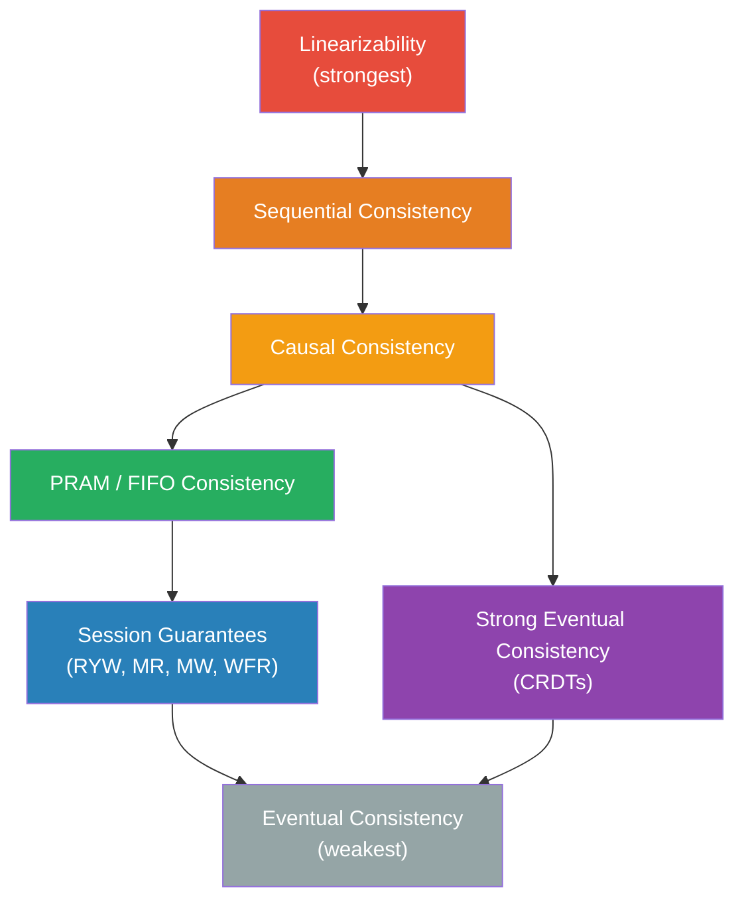
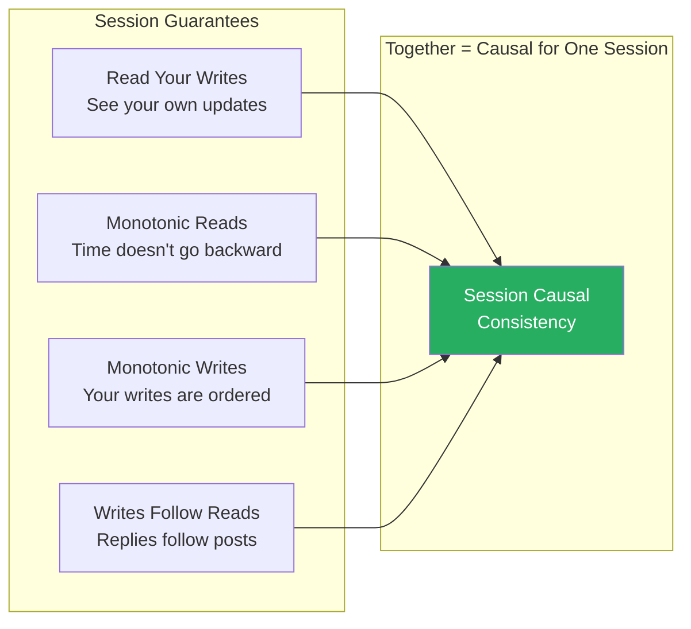
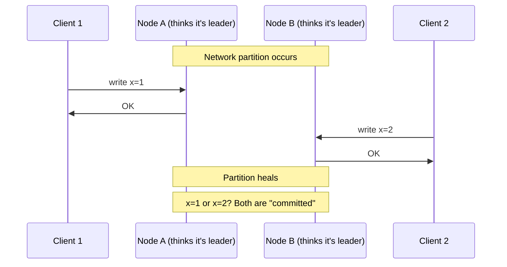
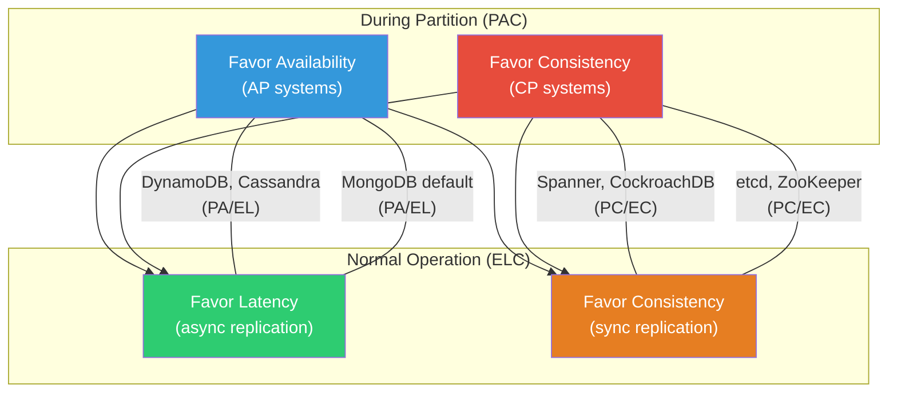
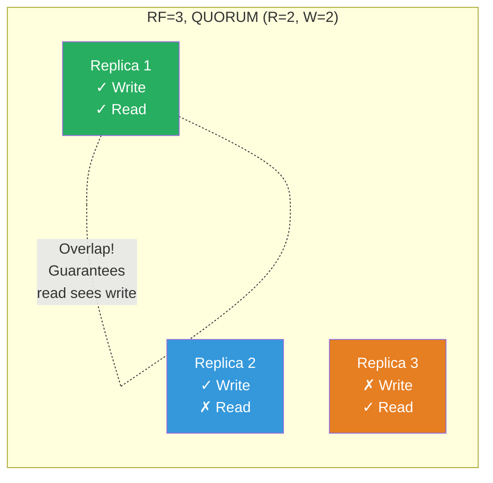
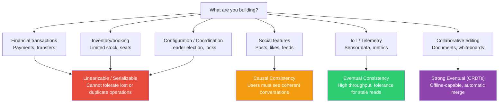

# Consistency Models

When someone says a distributed system is "consistent," they have told you almost nothing. There are at least nine formally distinct consistency models, each providing different guarantees about the order and visibility of operations. Choosing the wrong one costs you either correctness or performance — and the failure mode is always a surprise at 3 AM in production.

This page is the complete map. Every model, formally defined, practically explained, and placed in context with real systems you will actually use.

## Why Consistency Models Exist

A single-node database has a trivial consistency story: operations happen in the order they arrive, and every read sees the latest write. The moment you replicate data to a second node, you face a fundamental question:

> **When a write completes on one node, what can a read on another node see?**

The answer to this question defines the consistency model. Different answers trade off between three competing demands:

1. **Correctness** — Can the application reason about the data it reads?
2. **Performance** — How much coordination (messages, latency) is required?
3. **Availability** — Can the system respond when nodes are partitioned?

The [CAP Theorem](./cap-theorem) proves you cannot maximize all three simultaneously during a network partition. Consistency models are the knobs you turn to choose your position in this trade-off space.

## First Principles: What Is a Consistency Model?

A consistency model is a contract between a distributed data store and its clients. It specifies the set of **allowed execution histories** — that is, given a sequence of read and write operations issued by multiple clients, the consistency model defines which return values are legal.

### The Happens-Before Relation

All formal consistency definitions build on Lamport's **happens-before** relation, denoted $\rightarrow$. For two events $a$ and $b$:

$$
a \rightarrow b \iff \begin{cases}
a \text{ and } b \text{ are on the same process, and } a \text{ occurs before } b \\
a \text{ is a send event and } b \text{ is the corresponding receive event} \\
\exists c : a \rightarrow c \wedge c \rightarrow b \quad \text{(transitivity)}
\end{cases}
$$

If neither $a \rightarrow b$ nor $b \rightarrow a$, the events are **concurrent**, written $a \| b$. Concurrent events are the source of all consistency headaches — the model defines what the system is allowed to do with them.

### Operations as a History

We represent a system's execution as a **history** $H$, which is a set of operations. Each operation has:

- **Invocation**: the moment the client issues the request
- **Response**: the moment the client receives the result
- **Type**: read ($r$) or write ($w$)
- **Object**: the key or register being accessed
- **Value**: the value written or read

A history is **sequential** if every invocation is immediately followed by its response (no concurrency). A history is **concurrent** if operations from different clients can overlap in time.

A consistency model defines a set of constraints on which sequential histories a concurrent history can be "equivalent" to.

## The Consistency Hierarchy

The models form a strict hierarchy. Stronger models restrict the set of allowed histories more tightly, making applications easier to reason about — but harder (more expensive) to implement.



The subset relationships:

$$
\text{Linearizable} \subset \text{Sequentially Consistent} \subset \text{Causally Consistent} \subset \text{Eventually Consistent}
$$

Every linearizable execution is also sequentially consistent. Every sequentially consistent execution is also causally consistent. But the reverse is not true.

## 1. Linearizability (Atomic Consistency)

### Formal Definition

A history $H$ is **linearizable** if there exists a total order $S$ of the operations in $H$ such that:

1. $S$ is consistent with the **real-time ordering** of $H$: if operation $op_1$ completes before operation $op_2$ begins (in wall-clock time), then $op_1$ appears before $op_2$ in $S$.
2. Each read in $S$ returns the value of the most recent preceding write to the same object.

$$
\forall \, op_1, op_2 \in H : \text{end}(op_1) < \text{start}(op_2) \implies op_1 <_S op_2
$$

### Real-World Analogy

Linearizability is like a single shared whiteboard in a room. When someone writes a new value, everyone who looks at the board afterward sees it. There is no "propagation delay." The board is the single source of truth, and all operations are instantaneous.

### What Makes It Special

Linearizability is **composable**: if each individual object in a system is linearizable, the entire system is linearizable. This is a unique property — sequential consistency does NOT have it.

Linearizability also respects **real-time ordering**. This is what distinguishes it from sequential consistency.

### Implementation Sketch

```typescript
/**
 * Linearizable register using a single leader.
 * All reads and writes go through the leader.
 * The leader serializes all operations.
 */
class LinearizableRegister<T> {
  private value: T;
  private version: number = 0;
  private readonly quorumSize: number;
  private readonly replicas: ReplicaClient[];

  constructor(
    initialValue: T,
    replicas: ReplicaClient[],
  ) {
    this.value = initialValue;
    this.replicas = replicas;
    // Majority quorum: floor(n/2) + 1
    this.quorumSize = Math.floor(replicas.length / 2) + 1;
  }

  /**
   * Linearizable write: replicate to a quorum before acknowledging.
   * Combined with linearizable read (which also contacts a quorum),
   * this guarantees that every read sees the latest write.
   */
  async write(newValue: T): Promise<void> {
    this.version++;
    const writeVersion = this.version;

    const acks = await this.replicateToQuorum({
      type: 'write',
      value: newValue,
      version: writeVersion,
    });

    if (acks < this.quorumSize) {
      throw new Error(
        `Write failed: only ${acks}/${this.quorumSize} acks received`
      );
    }

    this.value = newValue;
  }

  /**
   * Linearizable read: contact a quorum to find the latest version.
   * This prevents stale reads from a lagging replica.
   */
  async read(): Promise<T> {
    const responses = await this.readFromQuorum();

    // Find the highest version across quorum responses
    let latest = { value: this.value, version: this.version };
    for (const resp of responses) {
      if (resp.version > latest.version) {
        latest = resp;
      }
    }

    // Read-repair: propagate the latest value to replicas that are behind
    if (latest.version > this.version) {
      this.value = latest.value;
      this.version = latest.version;
      await this.replicateToQuorum({
        type: 'write',
        value: latest.value,
        version: latest.version,
      });
    }

    return latest.value;
  }

  private async replicateToQuorum(
    msg: WriteMessage<T>
  ): Promise<number> {
    const results = await Promise.allSettled(
      this.replicas.map(r => r.send(msg))
    );
    return results.filter(r => r.status === 'fulfilled').length;
  }

  private async readFromQuorum(): Promise<VersionedValue<T>[]> {
    const results = await Promise.allSettled(
      this.replicas.map(r => r.read())
    );

    const successes = results
      .filter((r): r is PromiseFulfilledResult<VersionedValue<T>> =>
        r.status === 'fulfilled'
      )
      .map(r => r.value);

    if (successes.length < this.quorumSize) {
      throw new Error(
        `Read failed: only ${successes.length}/${this.quorumSize} responses`
      );
    }

    return successes;
  }
}

interface WriteMessage<T> {
  type: 'write';
  value: T;
  version: number;
}

interface VersionedValue<T> {
  value: T;
  version: number;
}

interface ReplicaClient {
  send<T>(msg: WriteMessage<T>): Promise<void>;
  read<T>(): Promise<VersionedValue<T>>;
}
```

### Systems That Use It

| System | Mechanism |
|--------|-----------|
| ZooKeeper (writes) | Single leader, atomic broadcast (Zab) |
| etcd | Raft consensus for all operations |
| Spanner | TrueTime + 2PC across Paxos groups |
| CockroachDB | Hybrid logical clocks + Raft |
| FoundationDB | Deterministic simulation-tested OCC |

### Cost

Linearizability requires **coordination** on every operation. In the absence of failures, this costs at least one round-trip to a quorum. Under the CAP theorem, linearizable systems must sacrifice availability during partitions.

::: warning
Linearizability is expensive. Every read must contact a quorum (or go through the leader), adding latency. Many systems that claim to be "strongly consistent" actually provide sequential consistency or even something weaker. Always verify the actual guarantees by reading the system's formal specification — or better yet, test it with [Jepsen](https://jepsen.io).
:::

## 2. Sequential Consistency

### Formal Definition

A history $H$ is **sequentially consistent** if there exists a total order $S$ of the operations in $H$ such that:

1. $S$ is consistent with the **program order** of each process: if process $P$ issues operation $op_1$ before $op_2$, then $op_1$ appears before $op_2$ in $S$.
2. Each read in $S$ returns the value of the most recent preceding write to the same object.

The critical difference from linearizability: sequential consistency does **not** require respecting real-time ordering across processes. Two operations from different processes can be reordered in $S$ even if one completed before the other started in real time.

### Real-World Analogy

Sequential consistency is like a group chat where messages from each person appear in the order they sent them, but messages from different people can be interleaved in any order. You might see Alice's message before Bob's even if Bob sent his first — as long as Alice's messages among themselves are in the right order.

### The Difference That Matters

```
Real-time order:
  Process 1: W(x=1) ──────────── completes
  Process 2:                          W(x=2) ──── completes
  Process 3:                                          R(x) → ?

Linearizable:  R(x) MUST return 2 (the latest write in real time)
Seq. consistent: R(x) can return 1 OR 2 (either total order is valid)
```

This difference seems subtle, but it breaks composability. A system where each object is sequentially consistent does NOT guarantee that the entire system is sequentially consistent.

### Implementation Sketch

```typescript
/**
 * Sequentially consistent register using total order broadcast.
 * All operations are broadcast to all nodes in a total order,
 * but the order does not need to respect real-time.
 */
class SequentiallyConsistentStore<T> {
  private store: Map<string, T> = new Map();
  private localQueue: Operation<T>[] = [];
  private readonly nodeId: string;
  private sequenceNumber: number = 0;

  constructor(nodeId: string) {
    this.nodeId = nodeId;
  }

  /**
   * Writes are applied locally and broadcast.
   * The total order broadcast layer ensures all nodes
   * see operations in the same order.
   */
  async write(key: string, value: T): Promise<void> {
    const op: Operation<T> = {
      type: 'write',
      key,
      value,
      nodeId: this.nodeId,
      seq: this.sequenceNumber++,
    };

    // Total order broadcast ensures all nodes process
    // this operation in the same position relative to
    // other operations — but NOT necessarily in real-time order.
    await this.totalOrderBroadcast(op);
    this.applyLocally(op);
  }

  /**
   * Reads can be served locally because total order broadcast
   * guarantees all nodes converge to the same state.
   * However, a read might return a "stale" value in real-time
   * terms if a concurrent write hasn't been delivered yet.
   */
  read(key: string): T | undefined {
    return this.store.get(key);
  }

  private applyLocally(op: Operation<T>): void {
    if (op.type === 'write' && op.value !== undefined) {
      this.store.set(op.key, op.value);
    }
  }

  private async totalOrderBroadcast(op: Operation<T>): Promise<void> {
    // In practice, this uses a protocol like Zab, ISIS, or
    // a sequencer node that assigns global sequence numbers.
    // All nodes deliver messages in sequence-number order.
    this.localQueue.push(op);
    // ... broadcast to all nodes ...
  }
}

interface Operation<T> {
  type: 'write' | 'read';
  key: string;
  value?: T;
  nodeId: string;
  seq: number;
}
```

### Systems That Use It

| System | Notes |
|--------|-------|
| ZooKeeper (reads) | Reads can be served by any node; only writes go through the leader |
| Many CPU memory models | x86 TSO provides sequential consistency for most practical purposes |

::: tip
Sequential consistency is rarely offered as a standalone guarantee by distributed databases. It was more prominent in shared-memory multiprocessor research (Lamport, 1979). In practice, systems either go all the way to linearizability or drop down to causal or eventual consistency.
:::

## 3. Causal Consistency

### Formal Definition

A history $H$ is **causally consistent** if for every process $P$, the sequence of operations observed by $P$ is consistent with a partial order that respects the happens-before relation $\rightarrow$.

Formally, if $w_1 \rightarrow w_2$ (write $w_1$ causally precedes write $w_2$), then every process that sees $w_2$ must also have seen $w_1$ before it.

$$
w_1 \rightarrow w_2 \implies \forall P : \text{if } P \text{ observes } w_2 \text{, then } P \text{ has observed } w_1
$$

Concurrent writes ($w_1 \| w_2$) can be observed in different orders by different processes.

### Real-World Analogy

Causal consistency is like a conversation thread. If Alice says "What time is the meeting?" and Bob replies "3 PM," everyone must see Alice's question before Bob's answer. But if Carol independently posts about lunch plans at the same time, different people might see Carol's post interleaved differently relative to Alice and Bob — and that is fine.

### Tracking Causality

Causal consistency requires tracking which operations have **influenced** other operations. This is typically done with [vector clocks](./vector-clocks-lamport-timestamps):

```typescript
/**
 * Causal consistency using vector clocks.
 * Each node maintains a vector clock tracking the latest
 * operation it has seen from every other node.
 */
class CausalStore<T> {
  private store: Map<string, { value: T; clock: VectorClock }> = new Map();
  private clock: VectorClock;
  private pendingWrites: Map<string, PendingWrite<T>[]> = new Map();
  private readonly nodeId: string;
  private readonly nodeCount: number;

  constructor(nodeId: string, nodeCount: number) {
    this.nodeId = nodeId;
    this.nodeCount = nodeCount;
    this.clock = new VectorClock(nodeCount);
  }

  /**
   * Write with causal metadata.
   * The vector clock captures all operations that causally
   * precede this write.
   */
  async write(key: string, value: T): Promise<void> {
    // Increment our own component of the vector clock
    this.clock.increment(this.nodeId);

    const entry = {
      value,
      clock: this.clock.clone(),
    };

    this.store.set(key, entry);

    // Replicate to other nodes with the vector clock attached
    await this.replicate(key, entry);
  }

  /**
   * Read returns the local value.
   * Causal consistency guarantees that if we've seen an effect,
   * we've also seen its cause.
   */
  read(key: string): T | undefined {
    return this.store.get(key)?.value;
  }

  /**
   * When receiving a replicated write, check if all causal
   * dependencies have been satisfied before applying.
   */
  onReceiveReplication(
    key: string,
    value: T,
    remoteClock: VectorClock,
    sourceNode: string
  ): void {
    if (this.causallyReady(remoteClock, sourceNode)) {
      // All causal dependencies are satisfied — apply the write
      this.clock.merge(remoteClock);
      this.store.set(key, { value, clock: remoteClock });
      // Check if any pending writes can now be applied
      this.drainPendingWrites();
    } else {
      // Buffer the write until its dependencies arrive
      if (!this.pendingWrites.has(key)) {
        this.pendingWrites.set(key, []);
      }
      this.pendingWrites.get(key)!.push({
        value,
        clock: remoteClock,
        sourceNode,
      });
    }
  }

  /**
   * A remote write is causally ready if we've seen all operations
   * that causally precede it. This means our clock must be >=
   * the remote clock for every component except the source node's.
   */
  private causallyReady(
    remoteClock: VectorClock,
    sourceNode: string
  ): boolean {
    return remoteClock.isCausallyReady(this.clock, sourceNode);
  }

  private drainPendingWrites(): void {
    for (const [key, pending] of this.pendingWrites) {
      const ready = pending.filter(pw =>
        this.causallyReady(pw.clock, pw.sourceNode)
      );
      for (const pw of ready) {
        this.clock.merge(pw.clock);
        this.store.set(key, { value: pw.value, clock: pw.clock });
      }
      const remaining = pending.filter(
        pw => !this.causallyReady(pw.clock, pw.sourceNode)
      );
      if (remaining.length > 0) {
        this.pendingWrites.set(key, remaining);
      } else {
        this.pendingWrites.delete(key);
      }
    }
  }

  private async replicate(
    key: string,
    entry: { value: T; clock: VectorClock }
  ): Promise<void> {
    // Send to all other nodes with vector clock metadata
    // Implementation depends on network layer
  }
}

class VectorClock {
  private entries: Map<string, number> = new Map();

  constructor(private size: number) {}

  increment(nodeId: string): void {
    this.entries.set(nodeId, (this.entries.get(nodeId) ?? 0) + 1);
  }

  get(nodeId: string): number {
    return this.entries.get(nodeId) ?? 0;
  }

  merge(other: VectorClock): void {
    for (const [nodeId, count] of other.entries) {
      this.entries.set(
        nodeId,
        Math.max(this.get(nodeId), count)
      );
    }
  }

  clone(): VectorClock {
    const vc = new VectorClock(this.size);
    for (const [nodeId, count] of this.entries) {
      vc.entries.set(nodeId, count);
    }
    return vc;
  }

  /**
   * Check if the remote clock's dependencies (everything except
   * the source node's own counter) have been satisfied locally.
   */
  isCausallyReady(localClock: VectorClock, sourceNode: string): boolean {
    for (const [nodeId, count] of this.entries) {
      if (nodeId === sourceNode) {
        // The source's counter should be exactly one ahead
        // of what we've seen (this is the new operation)
        if (count > localClock.get(nodeId) + 1) return false;
      } else {
        // For all other nodes, we must have seen at least
        // as many operations as the remote has
        if (count > localClock.get(nodeId)) return false;
      }
    }
    return true;
  }
}

interface PendingWrite<T> {
  value: T;
  clock: VectorClock;
  sourceNode: string;
}
```

### Systems That Use It

| System | Mechanism |
|--------|-----------|
| MongoDB (default) | Causal sessions with cluster time |
| COPS (research) | Explicit dependency tracking |
| Eiger (research) | Column-family store with causal consistency |
| Riak (optional) | Dotted version vectors |

### Why Causal Consistency Matters

Causal consistency is the **strongest consistency model achievable without sacrificing availability during partitions**. This result, proven by Mahajan, Alvisi, and Dahlin (2011), makes it a sweet spot in the consistency-availability trade-off.

::: info Key Theorem
Causal consistency is the strongest consistency model that does not require synchronous coordination between replicas. It can be implemented in an always-available, partition-tolerant manner. Anything stronger (like sequential or linearizable) must sacrifice availability during partitions per the CAP theorem.
:::

## 4. PRAM / FIFO Consistency

### Formal Definition

**PRAM (Pipelined RAM) consistency**, also called FIFO consistency, guarantees that writes from a single process are seen by all other processes in the order they were issued. Writes from different processes may be seen in different orders by different observers.

$$
\forall P_i, P_j : \text{writes by } P_i \text{ are observed by } P_j \text{ in } P_i\text{'s issue order}
$$

This is strictly weaker than causal consistency because it does not track causality across processes. If process A reads a value written by process B and then writes a new value, PRAM does NOT guarantee that other processes see B's write before A's — but causal consistency does.

### Real-World Analogy

PRAM is like following multiple people on social media. Each person's posts appear in the order they posted them, but you might see Alice's 3 PM post before Bob's 2 PM post even though Bob posted first — because there is no causal relationship between their independent posts.

### Implementation Sketch

```typescript
/**
 * PRAM consistency: each source's writes are delivered in order.
 * This is simpler than causal consistency because we only need
 * per-source sequence numbers, not vector clocks.
 */
class PRAMStore<T> {
  private store: Map<string, T> = new Map();
  private perSourceSeq: Map<string, number> = new Map();
  private buffered: Map<string, BufferedWrite<T>[]> = new Map();
  private readonly nodeId: string;
  private localSeq: number = 0;

  constructor(nodeId: string) {
    this.nodeId = nodeId;
  }

  async write(key: string, value: T): Promise<void> {
    const seq = this.localSeq++;
    this.store.set(key, value);
    await this.broadcast({ key, value, sourceNode: this.nodeId, seq });
  }

  read(key: string): T | undefined {
    return this.store.get(key);
  }

  onReceive(msg: BufferedWrite<T>): void {
    const expectedSeq = this.perSourceSeq.get(msg.sourceNode) ?? 0;

    if (msg.seq === expectedSeq) {
      // This is the next expected write from this source — apply it
      this.store.set(msg.key, msg.value);
      this.perSourceSeq.set(msg.sourceNode, expectedSeq + 1);

      // Check buffered writes from this source
      this.drainBuffer(msg.sourceNode);
    } else if (msg.seq > expectedSeq) {
      // Out of order — buffer it
      if (!this.buffered.has(msg.sourceNode)) {
        this.buffered.set(msg.sourceNode, []);
      }
      this.buffered.get(msg.sourceNode)!.push(msg);
    }
    // If msg.seq < expectedSeq, it's a duplicate — ignore
  }

  private drainBuffer(sourceNode: string): void {
    const buffer = this.buffered.get(sourceNode);
    if (!buffer) return;

    buffer.sort((a, b) => a.seq - b.seq);

    let expected = this.perSourceSeq.get(sourceNode) ?? 0;
    while (buffer.length > 0 && buffer[0].seq === expected) {
      const msg = buffer.shift()!;
      this.store.set(msg.key, msg.value);
      expected++;
    }
    this.perSourceSeq.set(sourceNode, expected);
  }

  private async broadcast(msg: BufferedWrite<T>): Promise<void> {
    // Send to all replicas via reliable FIFO channels
  }
}

interface BufferedWrite<T> {
  key: string;
  value: T;
  sourceNode: string;
  seq: number;
}
```

### Where It Appears

PRAM consistency is relatively rare as an explicit guarantee in production systems. It is more commonly seen as a building block in academic literature. However, Kafka's per-partition ordering guarantee is conceptually similar: messages from a single producer to a single partition are delivered in order, but no cross-partition ordering is guaranteed.

## 5. Session Guarantees

Session guarantees are consistency properties scoped to a single client session. They were formalized by Terry, Demers, Petersen, Spreitzer, Theimer, and Welsh in their 1994 paper "Session Guarantees for Weakly Consistent Replicated Data."

These guarantees are critical for user experience: even if the global system is eventually consistent, a single user should see a coherent view of their own operations.

### 5a. Read Your Writes (RYW)

**Definition:** If a process performs a write $w$ and then a read $r$ (in the same session), $r$ must reflect $w$ (or a later write).

$$
\text{session}(w) = \text{session}(r) \wedge w \rightarrow r \implies r \text{ sees } w
$$

**Analogy:** When you post a tweet and then refresh your profile, you expect to see your tweet. Without RYW, you might see a stale version of your profile (served from a replica that hasn't received your write yet) and panic that your post was lost.

```typescript
/**
 * Read-Your-Writes implementation using a session write-set.
 * The client tracks which servers have received its writes
 * and routes reads accordingly.
 */
class RYWSession<T> {
  private writeVersion: number = 0;
  private readonly sessionId: string;

  constructor(sessionId: string) {
    this.sessionId = sessionId;
  }

  async write(
    key: string,
    value: T,
    replicas: ReplicaNode<T>[]
  ): Promise<void> {
    this.writeVersion++;
    const tag = {
      sessionId: this.sessionId,
      version: this.writeVersion,
    };

    // Write to primary; primary replicates asynchronously
    await replicas[0].write(key, value, tag);
  }

  async read(
    key: string,
    replicas: ReplicaNode<T>[]
  ): Promise<T | undefined> {
    // Find a replica that has seen our latest write
    for (const replica of replicas) {
      const replicaVersion = await replica.getSessionVersion(
        this.sessionId
      );
      if (replicaVersion >= this.writeVersion) {
        return replica.read(key);
      }
    }

    // Fallback: read from primary (guaranteed to have our writes)
    return replicas[0].read(key);
  }
}

interface ReplicaNode<T> {
  write(key: string, value: T, tag: SessionTag): Promise<void>;
  read(key: string): Promise<T | undefined>;
  getSessionVersion(sessionId: string): Promise<number>;
}

interface SessionTag {
  sessionId: string;
  version: number;
}
```

::: tip Practical Implementation
Many systems implement RYW by routing all reads for a session to the same replica that received the writes (sticky sessions). This is simple but creates hot spots. A more sophisticated approach is to include a version token in the write response and pass it with subsequent reads — the read will wait or redirect until the replica is caught up.
:::

### 5b. Monotonic Reads

**Definition:** If a process reads a value $v$ at time $t_1$ and reads again at time $t_2 > t_1$, the second read must return $v$ or a later value — never an older one.

$$
r_1 \rightarrow r_2 \implies \text{value}(r_2) \geq \text{value}(r_1)
$$

**Analogy:** You are reading a news feed. If you see today's headlines, refresh, and then see yesterday's headlines, the system has violated monotonic reads. Time should not go backward.

**Violation scenario:** Without monotonic reads, a client could read from replica A (which is up-to-date), then on the next request get routed to replica B (which is lagging), and see stale data. This is extremely confusing for users.

```typescript
class MonotonicReadSession<T> {
  // Track the highest version seen per key
  private highWaterMarks: Map<string, number> = new Map();

  async read(
    key: string,
    replicas: ReplicaNode<T>[]
  ): Promise<T | undefined> {
    const minVersion = this.highWaterMarks.get(key) ?? 0;

    for (const replica of replicas) {
      const { value, version } = await replica.readVersioned(key);
      if (version >= minVersion) {
        // Update the high-water mark
        this.highWaterMarks.set(key, version);
        return value;
      }
    }

    throw new Error(
      `No replica has version >= ${minVersion} for key ${key}`
    );
  }
}
```

### 5c. Monotonic Writes

**Definition:** If a process performs write $w_1$ before write $w_2$ (in the same session), then $w_1$ must be applied before $w_2$ at every replica.

$$
w_1 \rightarrow w_2 \implies \forall \text{ replica } R : R \text{ applies } w_1 \text{ before } w_2
$$

**Analogy:** You update your shipping address, then place an order. Without monotonic writes, the order might be processed by a replica that hasn't received the address update yet, causing the package to go to the old address.

### 5d. Writes Follow Reads

**Definition:** If a process reads a value $v$ (produced by write $w_1$) and then performs write $w_2$, any replica that sees $w_2$ must also have seen $w_1$.

$$
r \text{ sees } w_1 \wedge r \rightarrow w_2 \implies w_1 \rightarrow w_2
$$

**Analogy:** You read a forum post and write a reply. Without writes-follow-reads, a replica could show your reply without the original post — a non-sequitur.

### Session Guarantees: The Practical View



::: info Key Insight
If all four session guarantees are provided simultaneously for a session, the result is equivalent to causal consistency from that session's perspective. This is why session guarantees are sometimes called "the building blocks of causal consistency."
:::

## 6. Eventual Consistency

### Formal Definition

A system provides **eventual consistency** if, when no new writes are submitted, all replicas will eventually converge to the same value.

$$
\forall \text{ key } k : \lim_{t \to \infty} \text{value}_R(k, t) = V \quad \text{for all replicas } R
$$

That is it. Eventual consistency says nothing about:
- How long convergence takes
- What values are returned during convergence
- Whether reads return values that were ever written (!)

### Real-World Analogy

Eventual consistency is like rumors spreading through a company. Eventually, everyone hears the news, but in the meantime, different people have different (possibly conflicting) information. And the news might get distorted along the way.

### The Problem with "Eventual"

Eventual consistency is often described as "the data will eventually be consistent." This is misleadingly reassuring. The word "eventually" hides all the interesting failure modes:

1. **How eventual is eventual?** Could be milliseconds. Could be hours. Could be never, if there is a bug in the anti-entropy protocol.
2. **What happens in the meantime?** Reads might return stale data, no data, or conflicting data from different replicas.
3. **What about conflicts?** If two replicas accept conflicting writes, who wins? Last-writer-wins (LWW)? Application-level merge? Silent data loss?

::: danger
The most dangerous aspect of eventual consistency is not the eventual convergence — it is the **conflict resolution strategy** when concurrent writes occur. Last-writer-wins (LWW) silently drops data. If your LWW timestamp source has clock skew, you might consistently drop writes from the node with the slower clock. This has caused real data loss in production Cassandra deployments.
:::

### Implementation Sketch

```typescript
/**
 * Eventually consistent store with anti-entropy via gossip.
 * Uses last-writer-wins (LWW) conflict resolution.
 */
class EventuallyConsistentStore<T> {
  private store: Map<string, TimestampedValue<T>> = new Map();
  private readonly nodeId: string;
  private peers: PeerNode<T>[] = [];

  constructor(nodeId: string) {
    this.nodeId = nodeId;
  }

  write(key: string, value: T): void {
    const entry: TimestampedValue<T> = {
      value,
      timestamp: Date.now(), // WARNING: clock skew can cause issues
      nodeId: this.nodeId,
    };

    this.store.set(key, entry);
    // Fire-and-forget replication — no waiting for acks
    this.gossipAsync(key, entry);
  }

  read(key: string): T | undefined {
    return this.store.get(key)?.value;
  }

  /**
   * Anti-entropy: periodically exchange state digests with
   * a random peer and reconcile differences.
   */
  async antiEntropyRound(): Promise<void> {
    const peer = this.peers[Math.floor(Math.random() * this.peers.length)];
    const digest = this.computeDigest();
    const diff = await peer.exchangeDigest(digest);

    for (const [key, remoteEntry] of diff) {
      const localEntry = this.store.get(key);
      if (!localEntry || this.lwwResolve(localEntry, remoteEntry) === remoteEntry) {
        this.store.set(key, remoteEntry);
      }
    }
  }

  /**
   * Last-writer-wins: the entry with the higher timestamp wins.
   * Ties are broken by node ID to ensure deterministic resolution.
   */
  private lwwResolve(
    a: TimestampedValue<T>,
    b: TimestampedValue<T>
  ): TimestampedValue<T> {
    if (a.timestamp !== b.timestamp) {
      return a.timestamp > b.timestamp ? a : b;
    }
    // Deterministic tie-breaker
    return a.nodeId > b.nodeId ? a : b;
  }

  private gossipAsync(key: string, entry: TimestampedValue<T>): void {
    // Fanout to a few random peers
    const fanout = Math.min(3, this.peers.length);
    const targets = this.selectRandomPeers(fanout);
    for (const peer of targets) {
      peer.receive(key, entry).catch(() => {
        // Best-effort — anti-entropy will catch up
      });
    }
  }

  private selectRandomPeers(count: number): PeerNode<T>[] {
    const shuffled = [...this.peers].sort(() => Math.random() - 0.5);
    return shuffled.slice(0, count);
  }

  private computeDigest(): Map<string, number> {
    const digest = new Map<string, number>();
    for (const [key, entry] of this.store) {
      digest.set(key, entry.timestamp);
    }
    return digest;
  }
}

interface TimestampedValue<T> {
  value: T;
  timestamp: number;
  nodeId: string;
}

interface PeerNode<T> {
  receive(key: string, entry: TimestampedValue<T>): Promise<void>;
  exchangeDigest(
    digest: Map<string, number>
  ): Promise<Map<string, TimestampedValue<T>>>;
}
```

### Systems That Use It

| System | Conflict Resolution |
|--------|-------------------|
| DynamoDB (default) | LWW or application-level |
| Cassandra (default) | LWW with timestamp |
| Riak | Sibling values (application resolves) or CRDTs |
| DNS | TTL-based propagation |
| S3 | Read-after-write for PUTs, eventual for overwrites/deletes |

## 7. Strong Eventual Consistency (SEC)

### Formal Definition

A system provides **strong eventual consistency** if:

1. **Eventual delivery:** Every update applied at one correct replica is eventually applied at all correct replicas.
2. **Convergence:** Correct replicas that have received the same set of updates are in the same state (regardless of the order of delivery).
3. **Termination:** All operations terminate (no coordination needed).

The key difference from plain eventual consistency: SEC guarantees **deterministic convergence** without conflict resolution. Two replicas that have seen the same set of updates are guaranteed to be in the same state, even if they received the updates in different orders.

### CRDTs: The Implementation

**Conflict-Free Replicated Data Types (CRDTs)** are the mechanism that makes SEC possible. They are data structures designed so that concurrent operations always commute — the result is the same regardless of the order operations are applied.

```typescript
/**
 * G-Counter: a grow-only counter CRDT.
 * Each node maintains its own counter.
 * The value is the sum of all node counters.
 * Merge takes the max of each node's counter.
 */
class GCounter {
  private counts: Map<string, number> = new Map();
  private readonly nodeId: string;

  constructor(nodeId: string) {
    this.nodeId = nodeId;
    this.counts.set(nodeId, 0);
  }

  increment(amount: number = 1): void {
    const current = this.counts.get(this.nodeId) ?? 0;
    this.counts.set(this.nodeId, current + amount);
  }

  value(): number {
    let sum = 0;
    for (const count of this.counts.values()) {
      sum += count;
    }
    return sum;
  }

  /**
   * Merge is commutative, associative, and idempotent:
   *   merge(a, b) = merge(b, a)           — commutative
   *   merge(a, merge(b, c)) = merge(merge(a, b), c) — associative
   *   merge(a, a) = a                     — idempotent
   *
   * These three properties guarantee convergence regardless of
   * message ordering, duplication, or retry.
   */
  merge(other: GCounter): void {
    for (const [nodeId, count] of other.counts) {
      this.counts.set(
        nodeId,
        Math.max(this.counts.get(nodeId) ?? 0, count)
      );
    }
  }
}

/**
 * LWW-Register: a last-writer-wins register CRDT.
 * Concurrent writes are resolved by timestamp.
 */
class LWWRegister<T> {
  private val: T;
  private ts: number;
  private readonly nodeId: string;

  constructor(nodeId: string, initialValue: T) {
    this.nodeId = nodeId;
    this.val = initialValue;
    this.ts = 0;
  }

  set(value: T, timestamp: number): void {
    if (timestamp > this.ts) {
      this.val = value;
      this.ts = timestamp;
    }
  }

  get(): T {
    return this.val;
  }

  merge(other: LWWRegister<T>): void {
    if (other.ts > this.ts) {
      this.val = other.val;
      this.ts = other.ts;
    } else if (other.ts === this.ts && other.nodeId > this.nodeId) {
      // Deterministic tie-breaking
      this.val = other.val;
      this.ts = other.ts;
    }
  }
}
```

### SEC vs EC

| Property | Eventual Consistency | Strong Eventual Consistency |
|----------|--------------------|-----------------------------|
| Convergence | Eventually, somehow | Deterministic, automatic |
| Conflicts | Need resolution strategy | No conflicts by construction |
| Coordination | May need for conflict resolution | Never needed |
| Data structures | Any | Must use CRDTs |
| Complexity | Resolution logic can be complex | CRDT design can be complex |

### Systems That Use It

| System | CRDTs Used |
|--------|-----------|
| Riak (CRDT buckets) | Counters, sets, maps, flags |
| Redis (CRDTs in Redis Enterprise) | Counters, sets |
| Automerge | JSON-like CRDT for collaborative editing |
| Yjs | Text and JSON CRDTs for real-time collaboration |
| Phoenix/Elixir (CRDT-based PubSub) | OR-Set for presence tracking |

For a deep dive into CRDT theory and implementation, see [CRDTs](./crdt-fundamentals).

## Edge Cases & Failure Modes

### Stale Reads Under "Strong" Consistency

Even linearizable systems can appear to provide stale reads due to implementation subtleties:

```
Scenario: Leader-based linearizable system

1. Client A writes x=1 to the leader. Leader replicates to quorum. Write succeeds.
2. Leader crashes.
3. New leader is elected — but it was a follower that had NOT received the write.
4. Client B reads x from the new leader. Gets the old value.

This is a linearizability violation. The system CLAIMED to be linearizable
but the leader election protocol had a bug.
```

This exact scenario was found by Jepsen in multiple databases (see War Stories below).

### Clock Skew in LWW Systems

```
Node A clock:  12:00:00.000
Node B clock:  12:00:00.500  (500ms ahead due to NTP drift)

1. Client writes x=1 to Node A at A's time 12:00:00.100
2. Client writes x=2 to Node B at B's time 12:00:00.200
3. But B's timestamp is 12:00:00.700 (B's clock is ahead)

LWW resolution: x=2 wins because 12:00:00.700 > 12:00:00.100

Real-time order: x=1 happened first, x=2 happened second — LWW got it right by luck.

But what if the writes were reversed?
1. Client writes x=2 to Node B at B's time 12:00:00.200 → timestamp 12:00:00.700
2. Client writes x=1 to Node A at A's time 12:00:00.400 → timestamp 12:00:00.400

LWW resolution: x=2 wins because 12:00:00.700 > 12:00:00.400
Real-time order: x=2 happened first, x=1 happened second — LWW dropped the LATER write!
```

::: danger
LWW with physical timestamps can silently drop the most recent write if clocks are skewed. This is not a theoretical concern — NTP clock drift of hundreds of milliseconds is common in cloud environments. Google solved this with TrueTime (bounded clock uncertainty); most systems are not Google.
:::

### The "Immortal Write" Problem

In eventually consistent systems with tombstones (soft deletes), a race between a delete and a lagging replica can cause deleted data to reappear:

```
1. Replica A has item X
2. Client deletes X on Replica A (tombstone created)
3. Replica B, which still has X, gossips X to Replica A
4. If the tombstone has been garbage-collected, X reappears

This is the "resurrection" or "zombie" problem.
```

Cassandra uses "gc_grace_seconds" (default 10 days) to control tombstone lifetime. If a replica is down for longer than gc_grace_seconds, it can resurrect deleted data when it comes back online.

### Split-Brain in "CP" Systems



Split-brain occurs when two nodes both believe they are the leader during a partition. This violates linearizability because both accept writes that the other does not know about. Raft prevents this by requiring a majority quorum for leader election — but bugs in the implementation can still allow it.

## Performance Characteristics

### Latency Cost of Consistency

| Consistency Model | Minimum Latency (no failures) | Coordination Required |
|-------------------|-------------------------------|----------------------|
| Linearizability | 1 RTT to quorum | Every operation |
| Sequential | 1 RTT to leader (writes only) | Writes only |
| Causal | Local read, async replication | None (but metadata overhead) |
| PRAM/FIFO | Local read, ordered replication | Per-source ordering |
| Session guarantees | Depends on implementation | Session routing |
| Strong Eventual (CRDT) | Local read/write, async merge | None |
| Eventual | Local read/write | None |

### Throughput Impact

$$
\text{Throughput}_{\text{linearizable}} \leq \frac{\text{Throughput}_{\text{eventual}}}{Q}
$$

where $Q$ is the quorum size. In a 5-node cluster with quorum of 3, linearizable throughput is at most $\frac{1}{3}$ of eventual throughput — and in practice, it is much less due to coordination overhead and contention.

### The Consistency-Latency Trade-off (PACELC)

The PACELC theorem (Abadi, 2012) extends CAP to include the latency trade-off during normal (non-partitioned) operation:

> If there is a **P**artition, choose between **A**vailability and **C**onsistency. **E**lse (normal operation), choose between **L**atency and **C**onsistency.



| System | PACELC Classification |
|--------|----------------------|
| DynamoDB | PA/EL |
| Cassandra | PA/EL (default), PC/EC (with ALL quorum) |
| MongoDB | PA/EL (default), PC/EC (with majority concern) |
| Spanner | PC/EC |
| CockroachDB | PC/EC |
| etcd | PC/EC |
| Riak | PA/EL |

## Mathematical Foundations

### Formal Model: Shared Register

The formal study of consistency models uses the abstraction of a **shared register** (or shared object). A register supports two operations:

- $\text{write}(v)$: sets the register to value $v$
- $\text{read}() \to v$: returns the current value of the register

A **history** is a sequence of invocations and responses on the register:

$$
H = \langle \text{inv}_1, \text{resp}_1, \text{inv}_2, \text{resp}_2, \ldots \rangle
$$

### Linearizability as a Linearization

A history $H$ is linearizable if we can assign a **linearization point** $\tau(op)$ to each operation $op$ such that:

$$
\forall op \in H : \text{inv}(op) \leq \tau(op) \leq \text{resp}(op)
$$

and the sequence of operations ordered by $\tau$ is a valid sequential execution.

The linearization point is the "instant" at which the operation appears to take effect. Every operation must have exactly one such point within its invocation-response interval.

### Sequential Consistency as a Legal Permutation

A history $H$ is sequentially consistent if there exists a **permutation** $\sigma$ of the operations in $H$ such that:

1. $\sigma$ preserves program order within each process
2. $\sigma$ is a legal sequential execution

$$
\exists \sigma : H \xrightarrow{\text{process-order preserving}} \sigma \wedge \sigma \in \text{Legal}
$$

### Causal Consistency via Partial Orders

Define the causal order $\prec$ as the transitive closure of:

$$
a \prec b \iff \begin{cases}
\text{proc}(a) = \text{proc}(b) \wedge a \text{ precedes } b \text{ in process order} \\
a = \text{write}(x, v) \wedge b = \text{read}(x) \to v \\
\exists c : a \prec c \wedge c \prec b
\end{cases}
$$

A history is causally consistent if there exists a valid **serialization** of the causal order — that is, a topological sort of $\prec$ that is a legal sequential execution.

The important distinction: causally consistent histories allow different processes to observe different serializations of concurrent events. Only causally related events must be observed in the same order by all processes.

### Convergence Rate for Eventual Consistency

For a gossip-based eventually consistent system with $n$ nodes, fanout $f$, and gossip interval $\Delta$:

$$
T_{\text{convergence}} = O\left(\frac{\log n}{\log f} \cdot \Delta\right)
$$

With a fanout of $f = 3$ and $n = 1000$ nodes, convergence takes approximately $\frac{\log 1000}{\log 3} \approx 6.3$ gossip rounds. If the gossip interval is 1 second, full convergence takes about 7 seconds.

The probability that a specific node has NOT received an update after $k$ gossip rounds:

$$
P(\text{not received after } k \text{ rounds}) = \left(1 - \frac{f}{n}\right)^{k \cdot n_{\text{infected}}}
$$

This converges to 0 exponentially fast, which is why gossip protocols are called "epidemic" protocols.

## Jepsen-Style Correctness Testing

[Jepsen](https://jepsen.io), created by Kyle Kingsbury (aphyr), is the de facto standard for testing the consistency claims of distributed databases. Jepsen works by:

1. Setting up a cluster of the system under test
2. Running concurrent operations from multiple clients
3. Injecting failures (network partitions, process crashes, clock skew)
4. Checking whether the observed history is consistent with the claimed consistency model

### How to Think About Correctness

A system's consistency model is not what the documentation says — it is what the implementation actually provides under adversarial conditions. Jepsen has repeatedly found that systems claiming linearizability actually provide something weaker.

The key question for any claimed consistency model:

> Can I construct a history of operations and failures that produces a result inconsistent with the claimed model?

### Checking Linearizability

Checking whether a given history is linearizable is NP-complete in general. However, for practical histories (bounded concurrency), efficient checkers exist:

```typescript
/**
 * Simplified linearizability checker.
 * For each possible linearization order, check if the reads
 * are consistent with the writes.
 *
 * In practice, tools like Jepsen use the Knossos or Elle checkers,
 * which use more sophisticated algorithms (WGL, Wing-Gong linearizability).
 */
function checkLinearizability<T>(history: HistoryEntry<T>[]): boolean {
  // Sort by invocation time
  const sorted = [...history].sort(
    (a, b) => a.invocationTime - b.invocationTime
  );

  // Try all possible linearization points
  return tryLinearize(sorted, new Map(), 0);
}

function tryLinearize<T>(
  ops: HistoryEntry<T>[],
  state: Map<string, T>,
  index: number
): boolean {
  if (index === ops.length) return true;

  // Find all operations that COULD be linearized next
  // (their invocation has occurred and they haven't been linearized yet)
  const candidates = ops
    .slice(index)
    .filter(op => !op.linearized)
    .filter(op =>
      // This op's invocation must be before or concurrent with
      // the earliest unlinearized response
      ops
        .slice(index)
        .filter(o => !o.linearized)
        .every(o => op.invocationTime <= o.responseTime)
    );

  for (const candidate of candidates) {
    candidate.linearized = true;

    // Apply the operation and check consistency
    const newState = new Map(state);
    if (candidate.type === 'write') {
      newState.set(candidate.key, candidate.value!);
    } else if (candidate.type === 'read') {
      const expected = newState.get(candidate.key);
      if (candidate.returnValue !== expected) {
        candidate.linearized = false;
        continue; // This linearization order is invalid
      }
    }

    if (tryLinearize(ops, newState, index + 1)) {
      return true;
    }

    candidate.linearized = false;
  }

  return false;
}

interface HistoryEntry<T> {
  type: 'read' | 'write';
  key: string;
  value?: T;
  returnValue?: T;
  invocationTime: number;
  responseTime: number;
  linearized?: boolean;
}
```

::: warning
The simplified checker above is exponential in the number of concurrent operations. Production linearizability checkers (Knossos, Porcupine, Elle) use pruning strategies, caching, and model-specific optimizations to make this tractable. Elle, used by modern Jepsen analyses, uses a graph-based approach that checks transaction isolation levels including serializability.
:::

## Real-World War Stories

::: info War Story: The MongoDB Election Bug (Jepsen 2017)
**System:** MongoDB 3.4.0-rc3

**Claimed guarantee:** Linearizable reads (with `readConcern: "linearizable"`)

**What happened:** Jepsen found that during a network partition, MongoDB could elect a new primary on the minority side of the partition (a stale primary that hadn't stepped down yet could continue serving reads). Clients reading from the stale primary would see stale data — violating linearizability.

**Root cause:** The primary did not check whether it still held a valid lease before serving linearizable reads. It continued serving reads after losing its majority but before stepping down.

**Impact:** Any application relying on `readConcern: "linearizable"` for correctness (locks, leader election, counters) could read stale data and make incorrect decisions.

**Fix:** MongoDB added a `writeConcern` confirmation step for linearizable reads, where the node confirms it is still primary by getting a majority acknowledgment before returning the read result.

**Lesson:** Testing your consistency implementation under failure conditions is not optional. The happy path almost always works; it is the edge cases during failures that break consistency.
:::

::: info War Story: Cassandra's Counter Corruption
**System:** Apache Cassandra (multiple versions)

**Claimed guarantee:** Eventual consistency with counter semantics (increment/decrement should be commutative and convergent)

**What happened:** Under concurrent increments and node failures, Cassandra's counters could over-count, under-count, or even go negative for a grow-only counter. The counter value would never converge to the correct value because the corruption was baked into the replicated state.

**Root cause:** Cassandra's original counter implementation used a replay-based approach where the same increment could be applied multiple times during read repair or anti-entropy repair. The lack of idempotency meant that retries and repairs caused over-counting.

**Impact:** Any application using Cassandra counters for billing, rate limiting, or inventory could produce incorrect results. One company reported overbilling customers by 15% due to counter over-counting.

**Fix:** Cassandra 2.1 introduced a new counter implementation based on a CRDT-like design with per-node shards, making increments idempotent. However, upgrading required careful migration and the new implementation still has known edge cases during node replacement.

**Lesson:** "Eventually consistent" does not mean "eventually correct." If the merge/resolution function is not commutative, associative, and idempotent, convergence does not guarantee the correct final value.
:::

::: info War Story: The Amazon DynamoDB Shopping Cart Anomaly
**System:** Amazon Dynamo (the internal predecessor to DynamoDB)

**Claimed guarantee:** Eventual consistency with vector clock-based conflict detection and application-level resolution

**What happened:** As described in the original Dynamo paper (DeCandia et al., 2007), the shopping cart application at Amazon experienced a specific anomaly: items that customers had explicitly removed from their cart would reappear after a conflict merge.

**Root cause:** When two replicas of a shopping cart diverged (due to a partition or concurrent modifications), the application-level merge function took the union of items in both versions. If the customer removed an item from one version but it still existed in the other divergent version, the union would re-add the removed item.

**Impact:** Customers saw items they had explicitly removed reappear in their shopping cart. Amazon considered this acceptable because "adding items to the cart is more important than removing them" — a deleted item reappearing is annoying but a purchased item disappearing is a lost sale.

**Design decision:** Amazon deliberately chose this "add wins" semantic because the business cost of losing an addition was higher than the cost of a resurrection. This is a textbook example of how consistency model choices are ultimately business decisions, not purely technical ones.

**Lesson:** Conflict resolution is domain-specific. The "correct" merge function depends on the business semantics of the data. There is no universal correct answer.
:::

::: info War Story: The GitHub MySQL Replication Lag Incident (2012)
**System:** GitHub's MySQL replication setup

**Claimed guarantee:** Not formally specified (practical eventual consistency via MySQL async replication)

**What happened:** A user pushed code to GitHub, then immediately browsed to their repository page. The web request was routed to a MySQL read replica that had not yet received the push data. The user saw their repository without the new commits — as if the push had been lost.

**Root cause:** GitHub's load balancer distributed read traffic across MySQL replicas without session affinity. Replication lag (even a few hundred milliseconds) was enough to violate read-your-writes consistency.

**Impact:** Users filed support tickets believing their pushes were lost. The psychological impact of "I pushed code and it disappeared" is disproportionate to the technical severity.

**Fix:** GitHub implemented sticky sessions for authenticated users, routing a user's reads to the same replica that received their writes (or to the primary). They later moved to more sophisticated approaches using GTID-based read routing.

**Lesson:** Even if your system is "only" eventually consistent, violating read-your-writes consistency is unacceptable for interactive applications. Users will not understand or tolerate seeing stale views of their own data.
:::

## Tunable Consistency

Some systems allow the consistency level to be configured per-operation, giving applications control over the consistency-latency trade-off.

### Cassandra's Consistency Levels

Cassandra uses a quorum-based approach where the consistency level determines how many replicas must respond:

```
Replication Factor (RF) = 3

Write CL  | Read CL   | Guarantee
----------|-----------|------------------------------------------
ONE       | ONE       | Eventual consistency (fastest)
ONE       | ALL       | Reads always see latest, but reads are slow
ALL       | ONE       | Writes are slow, reads may be stale
QUORUM    | QUORUM    | Linearizable (R + W > RF)
LOCAL_ONE | LOCAL_ONE | Eventual, within a datacenter
EACH_QUORUM | LOCAL_QUORUM | Cross-DC linearizable (expensive)
```

The key formula for quorum-based linearizability:

$$
R + W > N
$$

where $R$ = read replicas, $W$ = write replicas, $N$ = total replicas. When $R + W > N$, the read and write quorums must overlap, guaranteeing the read sees the latest write.



```typescript
/**
 * Tunable consistency client for a Cassandra-like system.
 */
class TunableConsistencyClient<T> {
  private replicas: ReplicaNode<T>[];
  private rf: number;

  constructor(replicas: ReplicaNode<T>[]) {
    this.replicas = replicas;
    this.rf = replicas.length;
  }

  async write(
    key: string,
    value: T,
    consistency: ConsistencyLevel
  ): Promise<void> {
    const required = this.resolveCount(consistency);

    const results = await Promise.allSettled(
      this.replicas.map(r => r.write(key, value))
    );

    const acks = results.filter(r => r.status === 'fulfilled').length;

    if (acks < required) {
      throw new Error(
        `Write failed: ${acks}/${required} acks ` +
        `(CL=${consistency})`
      );
    }

    // Writes to remaining replicas happen asynchronously (hinted handoff)
  }

  async read(
    key: string,
    consistency: ConsistencyLevel
  ): Promise<T | undefined> {
    const required = this.resolveCount(consistency);

    const results = await Promise.allSettled(
      this.replicas.map(r => r.readWithVersion(key))
    );

    const successes = results
      .filter(
        (r): r is PromiseFulfilledResult<VersionedValue<T>> =>
          r.status === 'fulfilled'
      )
      .map(r => r.value);

    if (successes.length < required) {
      throw new Error(
        `Read failed: ${successes.length}/${required} responses ` +
        `(CL=${consistency})`
      );
    }

    // Return the value with the highest version among responding replicas
    const latest = successes.reduce((a, b) =>
      a.version > b.version ? a : b
    );

    // Trigger read repair for stale replicas (async)
    this.readRepairAsync(key, latest);

    return latest.value;
  }

  private resolveCount(cl: ConsistencyLevel): number {
    switch (cl) {
      case 'ONE':
        return 1;
      case 'QUORUM':
        return Math.floor(this.rf / 2) + 1;
      case 'ALL':
        return this.rf;
      default:
        throw new Error(`Unknown consistency level: ${cl}`);
    }
  }

  private readRepairAsync(
    key: string,
    latest: VersionedValue<T>
  ): void {
    // Fire-and-forget repair to bring stale replicas up to date
    for (const replica of this.replicas) {
      replica
        .repairIfStale(key, latest)
        .catch(() => { /* best effort */ });
    }
  }
}

type ConsistencyLevel = 'ONE' | 'QUORUM' | 'ALL';

interface ReplicaNode<T> {
  write(key: string, value: T): Promise<void>;
  readWithVersion(key: string): Promise<VersionedValue<T>>;
  repairIfStale(key: string, latest: VersionedValue<T>): Promise<void>;
}

interface VersionedValue<T> {
  value: T;
  version: number;
}
```

### DynamoDB's Consistency Options

DynamoDB offers two consistency levels per read:

| Setting | Guarantee | Latency | Cost |
|---------|-----------|---------|------|
| `ConsistentRead: false` (default) | Eventual consistency | Low (~single-digit ms) | 0.5 RCU per 4KB |
| `ConsistentRead: true` | Strong consistency (linearizable) | Higher (~double) | 1 RCU per 4KB |

DynamoDB achieves this by routing strongly consistent reads to the leader replica of the partition, while eventually consistent reads can go to any replica.

::: tip
DynamoDB's strongly consistent reads are linearizable within a single partition key. Cross-partition operations (like Scan or Query across partitions) do NOT provide linearizability even with `ConsistentRead: true`. For cross-partition consistency, use DynamoDB Transactions.
:::

## Comparison Table: Real Systems

| System | Default Model | Strongest Available | PACELC | Notes |
|--------|--------------|--------------------|----|-------|
| PostgreSQL (single node) | Serializable | Serializable | N/A (not distributed) | MVCC-based |
| PostgreSQL (streaming replication) | Eventual | Linearizable (sync replication) | PA/EL or PC/EC | Configurable per replica |
| MySQL (InnoDB, single node) | Repeatable Read | Serializable | N/A | Gap locking |
| MySQL (Group Replication) | Eventual | Linearizable (single-primary) | PA/EL | Multi-primary is weaker |
| MongoDB | Causal (sessions) | Linearizable | PA/EL | Per-operation tunable |
| Cassandra | Eventual | Linearizable (QUORUM+QUORUM) | PA/EL | Per-operation tunable |
| DynamoDB | Eventual | Linearizable (per-partition) | PA/EL | Strong reads cost 2x |
| CockroachDB | Serializable | Serializable | PC/EC | Always serializable |
| Spanner | Linearizable | Strict serializable | PC/EC | TrueTime for external consistency |
| etcd | Linearizable | Linearizable | PC/EC | Raft-based |
| ZooKeeper | Sequential (reads) | Linearizable (sync + read) | PC/EC | Reads can be stale unless you sync first |
| Redis (single) | Linearizable | Linearizable | N/A | Single-threaded |
| Redis (Cluster) | Eventual | Eventual | PA/EL | Async replication between shards |
| Riak | Eventual | Eventual (strong EC with CRDTs) | PA/EL | Dynamo-style |
| TiDB | Snapshot Isolation | Linearizable (with Stale Read disabled) | PC/EC | Raft + Percolator |
| YugabyteDB | Snapshot Isolation | Serializable | PC/EC | Raft per tablet |
| FoundationDB | Serializable | Strict serializable | PC/EC | Deterministic simulation |
| ScyllaDB | Eventual | Linearizable (LWT) | PA/EL | Paxos for LWT |

::: warning
This table reflects default configurations. Many systems can be tuned to provide stronger or weaker guarantees. Always verify the actual guarantees for your specific configuration and workload by reading the documentation carefully and ideally running Jepsen-style tests.
:::

## Decision Framework

### Step 1: What Are You Building?



### Step 2: What Are Your Constraints?

| Constraint | Recommendation |
|-----------|---------------|
| Single region, low latency required | Linearizable (single leader, quorum reads) |
| Multi-region, low latency required | Causal consistency or eventual with session guarantees |
| Multi-region, correctness critical | Linearizable with Spanner-style TrueTime (accept the latency) |
| Offline-capable clients | Strong eventual consistency (CRDTs) |
| High write throughput | Eventual consistency (async replication) |
| Read-heavy, staleness tolerable | Eventual with read replicas |
| Read-heavy, staleness NOT tolerable | Linearizable reads (quorum or leader reads) |

### Step 3: Decision Matrix

| | Linearizable | Sequential | Causal | Session Guarantees | Strong Eventual | Eventual |
|---|:---:|:---:|:---:|:---:|:---:|:---:|
| **Correctness** | Highest | High | Medium | Medium | Medium | Lowest |
| **Availability (during partition)** | No | No | Yes | Depends | Yes | Yes |
| **Latency (writes)** | High | Medium | Low | Low | Lowest | Lowest |
| **Latency (reads)** | High | Low | Lowest | Low | Lowest | Lowest |
| **Throughput** | Lowest | Medium | High | High | Highest | Highest |
| **Implementation complexity** | High | Medium | High | Medium | High (CRDT design) | Low |
| **Debugging difficulty** | Easy | Medium | Hard | Medium | Hard | Hardest |
| **Multi-region friendly** | No | No | Yes | Yes | Yes | Yes |

### The Golden Rule

::: tip The Pragmatic Approach
Start with the **weakest consistency model that your application can tolerate**, then strengthen it only where correctness requires it. Most applications need:

1. **Linearizability** for coordination primitives (locks, leader election, unique ID generation)
2. **Session guarantees** (especially read-your-writes) for user-facing reads
3. **Eventual consistency** for everything else (analytics, caches, search indices)

Very few applications need global linearizability for all operations. The systems that do (financial ledgers, medical records) pay for it with latency and operational complexity — and they should.
:::

## Advanced Topics

### External Consistency (Strict Serializability)

External consistency is even stronger than linearizability. While linearizability applies to single-object operations, external consistency applies to transactions across multiple objects:

> If transaction $T_1$ commits before transaction $T_2$ starts (in real time), then $T_1$ must appear before $T_2$ in the serialization order.

Google Spanner achieves this using **TrueTime**, a globally synchronized clock with bounded uncertainty:

$$
\text{TrueTime.now()} = [t_{\text{earliest}}, t_{\text{latest}}]
$$

Spanner guarantees that the true time is within this interval. To ensure external consistency, a transaction waits after commit until $t_{\text{latest}}$ has passed — this ensures that any later transaction starts after the commit timestamp.

The wait time equals the clock uncertainty, typically 1-7 ms for TrueTime (GPS + atomic clocks). This is the latency tax for external consistency.

### Consistency in the Presence of Transactions

Single-object consistency (linearizability) and multi-object consistency (serializability) are different dimensions:

```
                    Increasing single-object consistency →

                    Eventual    Causal    Sequential    Linearizable
                 ┌──────────┬──────────┬─────────────┬──────────────┐
   No isolation  │          │          │             │ Linearizable │
                 │          │          │             │   (single    │
                 │          │          │             │   objects)   │
                 ├──────────┼──────────┼─────────────┼──────────────┤
   Read          │          │          │             │              │
   Committed     │          │          │             │              │
                 ├──────────┼──────────┼─────────────┼──────────────┤
   Snapshot      │          │          │             │              │
   Isolation     │          │          │             │              │
                 ├──────────┼──────────┼─────────────┼──────────────┤
   Serializable  │          │          │             │   Strict     │
                 │          │          │             │Serializability│
                 │          │          │             │  (Spanner)   │
                 └──────────┴──────────┴─────────────┴──────────────┘
   ↑
   Increasing transaction isolation
```

Most distributed databases live somewhere in this 2D space. CockroachDB and Spanner aim for the top-right corner (strict serializability). Cassandra lives in the bottom-left (eventual consistency, no multi-object transactions). DynamoDB's transactions occupy a middle ground.

### The CAP-Consistency Connection

Revisiting the [CAP Theorem](./cap-theorem) through the lens of consistency models:

- **CP systems** sacrifice availability for strong consistency (linearizability). During a partition, they refuse requests rather than serve stale data. Examples: etcd, ZooKeeper, Spanner.
- **AP systems** sacrifice consistency for availability. During a partition, they continue serving requests but may return stale or conflicting data. Examples: Cassandra (default), DynamoDB (default), Riak.
- **Causal consistency** is the strongest model that can be both available and partition-tolerant. This is why it has become increasingly popular — it offers meaningful guarantees without the availability penalty.

### Consistency Verification in Practice

Beyond Jepsen, there are several approaches to verifying consistency in production:

1. **Linearizability auditing:** Write a unique value, immediately read from a different node, verify the value. Run this continuously as a background probe.

2. **Causal consistency checking:** Perform a write, then a causally dependent write on another node, then read both from a third node. Verify the second write is never visible without the first.

3. **Convergence testing:** Write conflicting values to partitioned replicas, heal the partition, and verify all replicas converge to the same value within the expected time bound.

4. **Clock skew injection:** Artificially skew clocks between nodes and verify that the consistency guarantees still hold. This catches LWW bugs and timestamp-dependent logic.

```typescript
/**
 * Simple linearizability probe that runs continuously
 * against a distributed store.
 */
class LinearizabilityProbe<T> {
  private violations: Violation[] = [];
  private probeCount: number = 0;

  constructor(
    private readonly store: DistributedStore<T>,
    private readonly nodes: string[],
  ) {}

  async runProbe(): Promise<ProbeResult> {
    this.probeCount++;
    const key = `__probe_${this.probeCount}`;
    const value = `v_${Date.now()}_${Math.random()}` as unknown as T;

    // Write to one node
    const writeNode = this.nodes[0];
    const writeStart = performance.now();
    await this.store.write(key, value, { node: writeNode });
    const writeEnd = performance.now();

    // Immediately read from a different node
    const readNode = this.nodes[1];
    const readStart = performance.now();
    const readValue = await this.store.read(key, { node: readNode });
    const readEnd = performance.now();

    // If the read started after the write ended, it MUST
    // return the written value (or a later one) for linearizability.
    if (readStart > writeEnd && readValue !== value) {
      const violation: Violation = {
        probeId: this.probeCount,
        key,
        expectedValue: value as unknown as string,
        actualValue: readValue as unknown as string,
        writeNode,
        readNode,
        writeLatencyMs: writeEnd - writeStart,
        gapMs: readStart - writeEnd,
        timestamp: new Date().toISOString(),
      };
      this.violations.push(violation);
      return { passed: false, violation };
    }

    return { passed: true };
  }

  getViolationRate(): number {
    return this.violations.length / this.probeCount;
  }
}

interface DistributedStore<T> {
  write(key: string, value: T, opts: { node: string }): Promise<void>;
  read(key: string, opts: { node: string }): Promise<T | undefined>;
}

interface Violation {
  probeId: number;
  key: string;
  expectedValue: string;
  actualValue: string | undefined;
  writeNode: string;
  readNode: string;
  writeLatencyMs: number;
  gapMs: number;
  timestamp: string;
}

interface ProbeResult {
  passed: boolean;
  violation?: Violation;
}
```

### Hybrid Consistency Models

Modern systems increasingly use **hybrid** approaches, applying different consistency models to different data or operations:

1. **Spanner:** Externally consistent for all operations, but allows "stale reads" at a user-specified timestamp for improved performance.
2. **CockroachDB:** Serializable by default, but supports `AS OF SYSTEM TIME` queries for reading historical snapshots without coordination.
3. **MongoDB:** Causal consistency within a session, eventual consistency across sessions, linearizable for specific operations using `readConcern: "linearizable"`.
4. **DynamoDB:** Eventual by default, strongly consistent per-read, transactions for multi-item atomicity.

This per-operation tuning is the practical reality of consistency in production. A single application typically uses multiple consistency levels:

```typescript
// Example: E-commerce application using mixed consistency

// Inventory check: MUST be linearizable (prevent overselling)
const stock = await db.read('inventory:sku-123', {
  consistency: 'linearizable',
});

// Product description: eventual consistency is fine
const description = await db.read('product:sku-123', {
  consistency: 'eventual',
});

// User's order history: read-your-writes (user expects to see their order)
const orders = await db.read('orders:user-456', {
  consistency: 'session',
  sessionToken: userSession.token,
});

// Analytics counter: eventual consistency, high throughput
await db.increment('page-views:product-page', {
  consistency: 'eventual',
});
```

### The Future: Invariant-Based Consistency

Research is moving toward **invariant-based consistency**, where the system automatically determines the minimum consistency level needed to preserve application-level invariants:

- "Account balance >= 0" requires coordination only for decrements that might cause the balance to go negative.
- "Unique username" requires coordination only for username registration, not for reads.
- "Total items in cart <= 100" requires coordination only near the limit.

Systems like Indigo and CISE (Consistency Is Sometimes Expensive) explore this space, but it remains largely a research topic as of 2026. The challenge is that specifying invariants formally is hard, and verifying that a consistency level preserves them is even harder.

## Summary: The Consistency Spectrum at a Glance

| Model | One-Line Definition | Key Property | Cost |
|-------|-------------------|-------------|------|
| **Linearizable** | Behaves like a single copy, real-time order | Composable, real-time | Highest latency |
| **Sequential** | Behaves like a single copy, program order | Total order per process | High latency |
| **Causal** | Effects are seen after causes | Preserves causality | Medium (metadata) |
| **PRAM/FIFO** | Each source's writes are in order | Per-source ordering | Low |
| **Read Your Writes** | See your own writes | Session coherence | Low (routing) |
| **Monotonic Reads** | Time doesn't go backward | No stale regression | Low (tracking) |
| **Monotonic Writes** | Your writes are applied in order | Session write order | Low (ordering) |
| **Strong Eventual** | Same updates = same state | Deterministic merge | Low (CRDT design) |
| **Eventual** | Will converge... eventually | Availability | Lowest |

The right consistency model is not the strongest one — it is the weakest one that still preserves your application's correctness invariants. Everything stronger is latency and availability you are paying for but not using.
