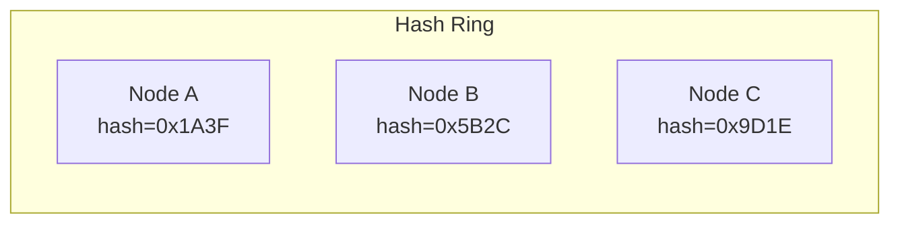
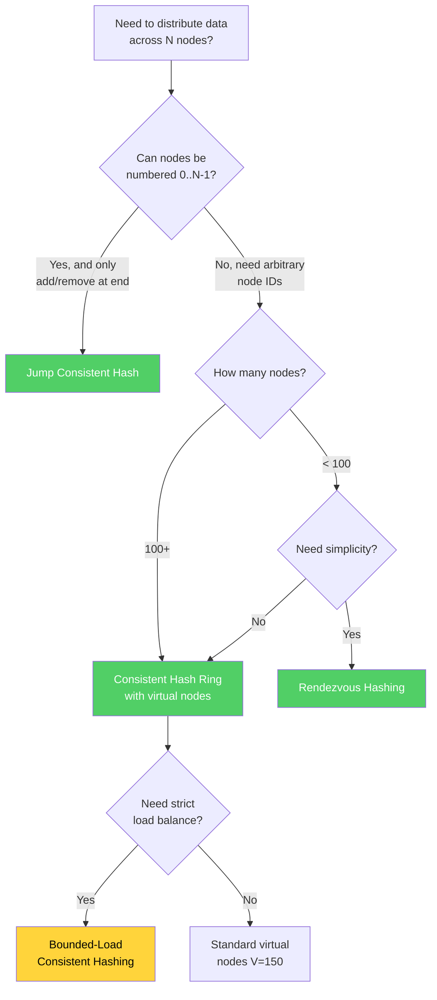

# Consistent Hashing

Consistent hashing is one of the most practically important algorithms in distributed systems. It solves a deceptively simple problem: how do you distribute data across N nodes such that adding or removing a node requires moving only a minimal amount of data?

## Why It Exists

### The Naive Approach and Its Failure

The obvious way to distribute keys across $N$ nodes:

$$
\text{node} = \text{hash}(key) \mod N
$$

This works perfectly — until you add or remove a node. When $N$ changes to $N+1$, the modulus changes for almost every key:

```
With N=3:
  hash("user:1") % 3 = 1 → Node B
  hash("user:2") % 3 = 0 → Node A
  hash("user:3") % 3 = 2 → Node C

With N=4 (added Node D):
  hash("user:1") % 4 = 2 → Node C  ← MOVED
  hash("user:2") % 4 = 3 → Node D  ← MOVED
  hash("user:3") % 4 = 1 → Node B  ← MOVED
```

On average, when going from $N$ to $N+1$ nodes, the fraction of keys that need to move is:

$$
\frac{N}{N+1} \approx 1 - \frac{1}{N}
$$

For $N=100$ nodes, adding one node moves **99%** of all keys. In a caching layer with billions of keys, this means a near-total cache miss storm — a thundering herd that can take down your backend.

### The Consistent Hashing Solution

Consistent hashing, introduced by David Karger et al. in 1997, guarantees that when going from $N$ to $N+1$ nodes, only $\frac{K}{N+1}$ keys need to move (where $K$ is the total number of keys). This is the theoretical minimum — you can't do better.

## Core Mechanics

### The Hash Ring

Imagine the output space of a hash function as a circle (ring) from $0$ to $2^{32} - 1$:



1. **Nodes** are placed on the ring by hashing their identifier (IP address, hostname, etc.)
2. **Keys** are placed on the ring by hashing the key
3. **Assignment rule:** A key is assigned to the first node encountered when walking clockwise from the key's position

```
Ring (0 → 2^32):

    0 ─────── Node A (pos: 100) ─────── Node B (pos: 500) ─────── Node C (pos: 800) ─────── 2^32
                  ↑                          ↑                          ↑
            Keys 0-100                 Keys 101-500               Keys 501-800
           assigned to A              assigned to B              assigned to C
                                                                Keys 801-2^32
                                                               assigned to A (wraps)
```

### Adding a Node

When Node D is added at position 300:

```
Before:
    Node A (100) ──────────── Node B (500) ──── Node C (800)
    Keys: 801-100             Keys: 101-500      Keys: 501-800

After adding Node D at 300:
    Node A (100) ── Node D (300) ── Node B (500) ── Node C (800)
    Keys: 801-100   Keys: 101-300    Keys: 301-500   Keys: 501-800
```

Only keys in the range 101-300 moved — from Node B to Node D. Nodes A and C are completely unaffected. The fraction of keys that moved is approximately $\frac{1}{N+1}$.

### Removing a Node

When Node B is removed:

```
Before:
    Node A (100) ── Node D (300) ── Node B (500) ── Node C (800)

After removing Node B:
    Node A (100) ── Node D (300) ──────────────── Node C (800)
    Keys: 801-100   Keys: 101-300                  Keys: 301-800
```

Only Node B's keys (301-500) moved to Node C. All other assignments unchanged.

## The Load Balancing Problem and Virtual Nodes

### The Problem

With $N$ physical nodes placed randomly on a ring of size $M$, the expected arc length per node is $\frac{M}{N}$. But the variance is high. By the birthday paradox and properties of uniform distributions, some nodes will get arcs that are significantly larger or smaller than average.

For $N$ nodes uniformly distributed on a ring, the expected maximum load ratio is:

$$
\frac{\max(\text{arc length})}{\text{average arc length}} = \Theta(\log N)
$$

With 10 nodes, some node will handle roughly $\log(10) \approx 2.3\times$ the average load. With 100 nodes, the hottest node handles $\sim 4.6\times$ average. This is unacceptable.

### Virtual Nodes (vnodes)

The solution: instead of placing each physical node at one position on the ring, place it at $V$ positions (virtual nodes).

```
Physical Node A → Virtual nodes: A-0, A-1, A-2, ..., A-149
Physical Node B → Virtual nodes: B-0, B-1, B-2, ..., B-149
Physical Node C → Virtual nodes: C-0, C-1, C-2, ..., C-149
```

Each virtual node is hashed independently and placed on the ring. With $V$ virtual nodes per physical node, the ring has $N \times V$ points, and the load distribution approaches uniform.

The standard deviation of load per node with $V$ virtual nodes is:

$$
\sigma = \frac{1}{\sqrt{V}} \cdot \frac{1}{N}
$$

With $V = 150$ (Cassandra's default), the standard deviation is less than 10% of the mean — most nodes carry between 90% and 110% of the average load.

::: tip Choosing V
| V (virtual nodes) | Load std dev | Memory per node | Recommended for |
|-------------------|-------------|-----------------|-----------------|
| 1 | ~100% of mean | Minimal | Never use in production |
| 10 | ~32% of mean | Low | Small clusters (<10 nodes) |
| 100 | ~10% of mean | Moderate | Most production systems |
| 150 | ~8% of mean | Moderate | Cassandra default |
| 256 | ~6% of mean | Higher | Large clusters, strict balance requirements |
| 1000+ | ~3% of mean | High | Rarely worth the memory cost |
:::

### Heterogeneous Nodes

Virtual nodes elegantly handle nodes with different capacities. A node with 2x the CPU and memory gets 2x the virtual nodes:

```typescript
class ConsistentHashRing<T> {
  private ring: Map<number, T> = new Map();
  private sortedHashes: number[] = [];

  addNode(node: T, id: string, weight: number = 1, baseVnodes: number = 150): void {
    const vnodeCount = Math.round(baseVnodes * weight);
    for (let i = 0; i < vnodeCount; i++) {
      const hash = this.hash(`${id}:${i}`);
      this.ring.set(hash, node);
      this.sortedHashes.push(hash);
    }
    this.sortedHashes.sort((a, b) => a - b);
  }

  removeNode(id: string, weight: number = 1, baseVnodes: number = 150): void {
    const vnodeCount = Math.round(baseVnodes * weight);
    for (let i = 0; i < vnodeCount; i++) {
      const hash = this.hash(`${id}:${i}`);
      this.ring.delete(hash);
      const idx = this.sortedHashes.indexOf(hash);
      if (idx !== -1) this.sortedHashes.splice(idx, 1);
    }
  }

  getNode(key: string): T | undefined {
    if (this.sortedHashes.length === 0) return undefined;
    const hash = this.hash(key);
    // Binary search for the first hash >= key's hash
    let idx = this.binarySearchCeil(hash);
    if (idx >= this.sortedHashes.length) idx = 0; // Wrap around
    return this.ring.get(this.sortedHashes[idx]);
  }

  // Get N distinct physical nodes for replication
  getNodes(key: string, count: number): T[] {
    const result: T[] = [];
    const seen = new Set<T>();
    if (this.sortedHashes.length === 0) return result;

    const hash = this.hash(key);
    let idx = this.binarySearchCeil(hash);

    while (result.length < count && seen.size < this.ring.size) {
      if (idx >= this.sortedHashes.length) idx = 0;
      const node = this.ring.get(this.sortedHashes[idx])!;
      if (!seen.has(node)) {
        seen.add(node);
        result.push(node);
      }
      idx++;
    }
    return result;
  }

  private hash(key: string): number {
    // MurmurHash3 or similar — using simple hash for illustration
    let hash = 0;
    for (let i = 0; i < key.length; i++) {
      const char = key.charCodeAt(i);
      hash = ((hash << 5) - hash) + char;
      hash = hash & hash; // Convert to 32-bit integer
    }
    return Math.abs(hash);
  }

  private binarySearchCeil(target: number): number {
    let lo = 0;
    let hi = this.sortedHashes.length;
    while (lo < hi) {
      const mid = (lo + hi) >>> 1;
      if (this.sortedHashes[mid] < target) lo = mid + 1;
      else hi = mid;
    }
    return lo;
  }
}
```

## Production Implementation

Here's a production-grade consistent hash ring with proper hashing, replication awareness, and monitoring:

```typescript
import { createHash } from 'crypto';

interface NodeInfo {
  id: string;
  host: string;
  port: number;
  weight: number;
  zone: string; // Availability zone for rack-aware placement
}

interface RingConfig {
  baseVnodes: number;
  replicationFactor: number;
  hashFunction: 'md5' | 'sha256' | 'murmur3';
}

class ProductionHashRing {
  private ring: Map<number, string> = new Map(); // hash → nodeId
  private sortedHashes: number[] = [];
  private nodes: Map<string, NodeInfo> = new Map();
  private config: RingConfig;

  constructor(config: Partial<RingConfig> = {}) {
    this.config = {
      baseVnodes: 150,
      replicationFactor: 3,
      hashFunction: 'md5',
      ...config,
    };
  }

  addNode(node: NodeInfo): { movedKeys: number; affectedNodes: string[] } {
    this.nodes.set(node.id, node);
    const vnodeCount = Math.round(this.config.baseVnodes * node.weight);
    const affectedNodes = new Set<string>();

    for (let i = 0; i < vnodeCount; i++) {
      const hash = this.hashKey(`${node.id}#${i}`);

      // Find which node previously owned this portion of the ring
      const previousOwner = this.getNodeIdForHash(hash);
      if (previousOwner) affectedNodes.add(previousOwner);

      this.ring.set(hash, node.id);
      this.insertSorted(hash);
    }

    // Estimate moved keys (proportional to arc length acquired)
    const movedKeys = Math.round(vnodeCount / this.sortedHashes.length * 100);

    return { movedKeys, affectedNodes: [...affectedNodes] };
  }

  removeNode(nodeId: string): { movedKeys: number; targetNodes: string[] } {
    const node = this.nodes.get(nodeId);
    if (!node) throw new Error(`Node ${nodeId} not found`);

    const vnodeCount = Math.round(this.config.baseVnodes * node.weight);
    const targetNodes = new Set<string>();

    for (let i = 0; i < vnodeCount; i++) {
      const hash = this.hashKey(`${nodeId}#${i}`);
      this.ring.delete(hash);
      const idx = this.sortedHashes.indexOf(hash);
      if (idx !== -1) this.sortedHashes.splice(idx, 1);

      // Find which node now owns this portion
      const newOwner = this.getNodeIdForHash(hash);
      if (newOwner) targetNodes.add(newOwner);
    }

    this.nodes.delete(nodeId);
    const movedKeys = Math.round(vnodeCount / (this.sortedHashes.length + vnodeCount) * 100);

    return { movedKeys, targetNodes: [...targetNodes] };
  }

  // Get the primary node for a key
  getNode(key: string): NodeInfo | undefined {
    const nodeId = this.getNodeIdForHash(this.hashKey(key));
    return nodeId ? this.nodes.get(nodeId) : undefined;
  }

  // Get replication set — N distinct physical nodes, preferably in different zones
  getReplicaSet(key: string): NodeInfo[] {
    const result: NodeInfo[] = [];
    const seenIds = new Set<string>();
    const seenZones = new Set<string>();
    const hash = this.hashKey(key);

    let idx = this.binarySearchCeil(hash);
    let attempts = 0;

    // First pass: try to get nodes in different zones
    while (result.length < this.config.replicationFactor && attempts < this.sortedHashes.length) {
      if (idx >= this.sortedHashes.length) idx = 0;
      const nodeId = this.ring.get(this.sortedHashes[idx])!;
      const node = this.nodes.get(nodeId)!;

      if (!seenIds.has(nodeId)) {
        // Prefer nodes in different zones for fault tolerance
        if (!seenZones.has(node.zone) || result.length >= this.availableZoneCount()) {
          seenIds.add(nodeId);
          seenZones.add(node.zone);
          result.push(node);
        }
      }
      idx++;
      attempts++;
    }

    // If we couldn't fill the replica set with zone diversity, relax the constraint
    if (result.length < this.config.replicationFactor) {
      idx = this.binarySearchCeil(hash);
      attempts = 0;
      while (result.length < this.config.replicationFactor && attempts < this.sortedHashes.length) {
        if (idx >= this.sortedHashes.length) idx = 0;
        const nodeId = this.ring.get(this.sortedHashes[idx])!;
        const node = this.nodes.get(nodeId)!;
        if (!seenIds.has(nodeId)) {
          seenIds.add(nodeId);
          result.push(node);
        }
        idx++;
        attempts++;
      }
    }

    return result;
  }

  // Ring statistics for monitoring
  getStats(): {
    nodeCount: number;
    vnodeCount: number;
    loadDistribution: Map<string, { vnodes: number; loadPercent: number }>;
  } {
    const loadMap = new Map<string, number>();
    for (const nodeId of this.ring.values()) {
      loadMap.set(nodeId, (loadMap.get(nodeId) || 0) + 1);
    }

    const totalVnodes = this.sortedHashes.length;
    const loadDistribution = new Map<string, { vnodes: number; loadPercent: number }>();

    for (const [nodeId, vnodes] of loadMap) {
      loadDistribution.set(nodeId, {
        vnodes,
        loadPercent: (vnodes / totalVnodes) * 100,
      });
    }

    return {
      nodeCount: this.nodes.size,
      vnodeCount: totalVnodes,
      loadDistribution,
    };
  }

  private availableZoneCount(): number {
    const zones = new Set<string>();
    for (const node of this.nodes.values()) zones.add(node.zone);
    return zones.size;
  }

  private getNodeIdForHash(hash: number): string | undefined {
    if (this.sortedHashes.length === 0) return undefined;
    let idx = this.binarySearchCeil(hash);
    if (idx >= this.sortedHashes.length) idx = 0;
    return this.ring.get(this.sortedHashes[idx]);
  }

  private hashKey(key: string): number {
    const hashBuffer = createHash(this.config.hashFunction)
      .update(key)
      .digest();
    // Use first 4 bytes as a 32-bit unsigned integer
    return hashBuffer.readUInt32BE(0);
  }

  private binarySearchCeil(target: number): number {
    let lo = 0;
    let hi = this.sortedHashes.length;
    while (lo < hi) {
      const mid = (lo + hi) >>> 1;
      if (this.sortedHashes[mid] < target) lo = mid + 1;
      else hi = mid;
    }
    return lo;
  }

  private insertSorted(hash: number): void {
    const idx = this.binarySearchCeil(hash);
    this.sortedHashes.splice(idx, 0, hash);
  }
}
```

## Alternative: Jump Consistent Hashing

Google's Jump Consistent Hash (Lamping & Veach, 2014) achieves perfect balance with O(1) memory and O(ln n) time — but only works when nodes are numbered 0 to N-1 (no arbitrary node IDs).

```typescript
function jumpConsistentHash(key: bigint, numBuckets: number): number {
  let b = -1n;
  let j = 0n;

  while (j < BigInt(numBuckets)) {
    b = j;
    key = ((key * 2862933555777941757n) + 1n) & 0xFFFFFFFFFFFFFFFFn;
    j = BigInt(Math.floor((Number(b) + 1) * (Number(1n << 31n) / Number((key >> 33n) + 1n))));
  }

  return Number(b);
}
```

**Properties:**
- Perfect balance: each bucket gets exactly $\frac{1}{N}$ of keys
- Minimal movement: when going from $N$ to $N+1$, exactly $\frac{1}{N+1}$ of keys move
- O(1) memory: no ring structure needed
- O(ln N) time: the loop executes approximately $\ln(N)$ times
- **Limitation:** buckets must be numbered 0 to N-1. You can't remove bucket 3 and keep bucket 4 — you can only add/remove from the end.

## Alternative: Rendezvous Hashing (Highest Random Weight)

```typescript
function rendezvousHash(key: string, nodes: string[]): string {
  let maxWeight = -Infinity;
  let selectedNode = nodes[0];

  for (const node of nodes) {
    const weight = hash(`${key}:${node}`);
    if (weight > maxWeight) {
      maxWeight = weight;
      selectedNode = node;
    }
  }

  return selectedNode;
}
```

**Properties:**
- O(N) per lookup (must check all nodes)
- Perfect balance without virtual nodes
- Minimal disruption: adding/removing a node moves only $\frac{1}{N}$ of keys
- Simple to implement — no ring structure
- **Limitation:** O(N) lookup makes it impractical for large N (thousands of nodes)

## Alternative: Bounded-Load Consistent Hashing

Google's 2017 paper addresses the remaining load imbalance in consistent hashing. It guarantees that no node receives more than $(1 + \epsilon)$ times the average load.

**Algorithm:** When assigning a key, walk clockwise on the ring as usual, but skip any node that is already at $(1 + \epsilon) \times \text{average load}$. Continue to the next node.

$$
\text{max load per node} \leq \lceil (1 + \epsilon) \cdot \frac{K}{N} \rceil
$$

This is used in Google's load balancers for backend server selection.

## Comparison Table

| Algorithm | Balance | Memory | Lookup Time | Node Add/Remove | Arbitrary Node IDs |
|-----------|---------|--------|-------------|----------------|--------------------|
| Modulo hash | Perfect | O(1) | O(1) | Moves ~100% keys | Yes |
| Consistent hash (no vnodes) | O(log N) imbalance | O(N) | O(log N) | Moves ~1/N keys | Yes |
| Consistent hash (V vnodes) | ~1/√V imbalance | O(N·V) | O(log(N·V)) | Moves ~1/N keys | Yes |
| Jump consistent hash | Perfect | O(1) | O(ln N) | Moves ~1/N keys | No (0..N-1 only) |
| Rendezvous hashing | Perfect | O(N) | O(N) | Moves ~1/N keys | Yes |
| Bounded-load | (1+ε) of average | O(N·V) | O(log(N·V)) | Moves ~1/N keys | Yes |

## Real-World Usage

| System | Algorithm | Virtual Nodes | Hash Function |
|--------|-----------|---------------|---------------|
| **Cassandra** | Consistent hash ring | 256 (configurable) | Murmur3 |
| **DynamoDB** | Consistent hash ring | Undisclosed | MD5 |
| **Riak** | Consistent hash ring | 64 (default) | SHA-1 |
| **Memcached (libketama)** | Consistent hash ring | 100-200 per server | MD5 |
| **Akka Cluster** | Consistent hash ring | Configurable | Murmur3 |
| **HAProxy** | Consistent hash ring | Configurable | SDBM |
| **Google Load Balancer** | Bounded-load consistent hash | Internal | Internal |
| **Vimeo** | Jump consistent hash | N/A | Internal |

::: info War Story
**The Memcached Thundering Herd (2008)**

In the early days of Facebook, their Memcached fleet used modular hashing (`hash(key) % N`). When a Memcached server crashed and was replaced, `N` changed, causing nearly all cached keys to map to different servers. This triggered a cache stampede where millions of requests hit the backend database simultaneously, causing a cascading failure.

After this incident, Facebook adopted consistent hashing via the `libketama` library (originally from Last.fm). With consistent hashing, losing one server only invalidated the ~$\frac{1}{N}$ of keys that mapped to that server. This single change eliminated an entire class of outages.

The lesson: in any caching tier with more than a few nodes, consistent hashing is not optional — it's a correctness requirement.
:::

::: info War Story
**DynamoDB's Partition Rebalancing**

Amazon's original Dynamo paper (2007) used consistent hashing with virtual nodes for partition assignment. But they discovered that with heterogeneous hardware and varying data sizes, virtual nodes alone weren't enough. Some partitions grew much larger than others due to hot keys or uneven data distribution.

In later versions, DynamoDB moved to a model where partition assignment is still based on consistent hashing, but the system can split hot partitions and redistribute them. The consistent hashing provides the base assignment, but an orchestration layer on top handles dynamic rebalancing.

The lesson: consistent hashing provides a good starting point for data distribution, but production systems often need an additional rebalancing mechanism on top.
:::

## Edge Cases and Failure Modes

### Hot Keys

Consistent hashing distributes keys uniformly, but it cannot protect against hot keys — a single key that receives disproportionate traffic. If `user:beyonce` gets 1000x more reads than average, the node responsible for that key becomes a hotspot regardless of how well the ring is balanced.

**Mitigations:**
- **Key splitting:** Append a random suffix (`user:beyonce:0` through `user:beyonce:9`) and read from a random replica
- **Client-side caching:** Cache hot keys in the application layer
- **Read replicas:** Route reads for hot keys to replicas, not just the primary

### Ring Membership Changes During Requests

When a node is being added or removed, there's a window where different clients may have different views of the ring. Client A might think key X maps to Node 2, while Client B (with an updated ring) thinks key X maps to Node 5.

**Mitigations:**
- **Two-phase migration:** First copy data to the new owner, then update the ring. Reads during migration check both old and new owners.
- **Versioned ring:** Clients include the ring version in requests. Nodes redirect if the version is stale.

### Hash Collisions

With 32-bit hashes and thousands of virtual nodes, hash collisions become non-negligible. Two virtual nodes mapping to the same hash position means one of them gets zero arc length (zero keys).

**Mitigation:** Use a collision-resistant hash (SHA-256) and a large hash space (128-bit or 256-bit). With $2^{128}$ positions and 10,000 virtual nodes, the collision probability is negligible ($\approx 10^{-31}$).

## Decision Framework



## Further Reading

- **Karger et al.:** "Consistent Hashing and Random Trees: Distributed Caching Protocols for Relieving Hot Spots on the World Wide Web" (1997)
- **Lamping & Veach:** "A Fast, Minimal Memory, Consistent Hash Algorithm" (Jump Consistent Hash, 2014)
- **Mirrokni et al.:** "Consistent Hashing with Bounded Loads" (Google, 2017)
- **DeCandia et al.:** "Dynamo: Amazon's Highly Available Key-value Store" (2007)
- **Next:** [Byzantine Fault Tolerance](./byzantine-fault-tolerance) — when nodes can lie
