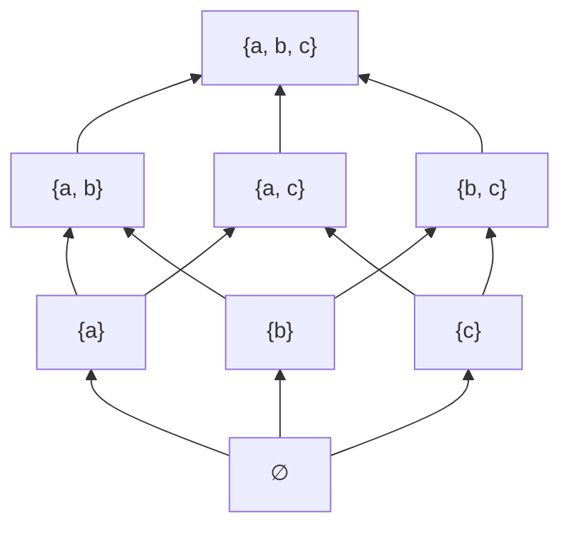
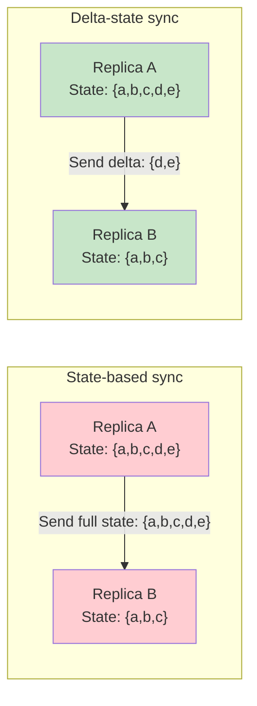
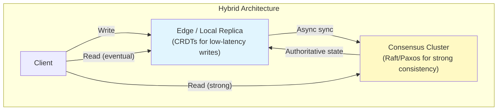

# Conflict-free Replicated Data Types (CRDTs)

CRDTs are data structures that can be replicated across multiple nodes, updated independently and concurrently without coordination, and merged automatically with a mathematically guaranteed result: all replicas converge to the same state. No conflicts. No consensus protocol. No coordination. The data structure itself resolves everything.

This is not a weaker guarantee than consensus — it is a different guarantee. Consensus says "let's all agree on what happened." CRDTs say "it doesn't matter what order things happened in — the result is the same."

## Why CRDTs Exist

### The Conflict Resolution Problem

In any replicated system, concurrent updates create conflicts:

```
Replica A: counter = 5 → counter = 6 (increment)
Replica B: counter = 5 → counter = 6 (increment)

After sync: counter = ???
  - If last-writer-wins: counter = 6 (WRONG — lost an increment)
  - If we merge correctly: counter = 7 (both increments applied)
```

Traditional approaches to this problem:

1. **Consensus (Paxos/Raft):** All updates go through a leader. Correct but requires coordination — every write pays the latency cost of a round-trip to the leader. Unavailable during partitions.
2. **Last-Writer-Wins:** Keep the value with the latest timestamp. Simple but loses data — concurrent updates are silently dropped.
3. **Application-level conflict resolution:** Push the problem to the developer. Error-prone and hard to get right (see: CouchDB conflict resolution).
4. **Operational Transform (OT):** Transform concurrent operations to account for each other. Complex, fragile, hard to prove correct for arbitrary data types (see: Google Docs' years of engineering effort).

CRDTs take a fundamentally different approach: **design the data structure so that conflicts are impossible by construction.**

### The CAP Connection

The CAP theorem forces a choice during network partitions: consistency or availability. CRDTs choose availability — every replica can accept writes during a partition, and when the partition heals, replicas merge automatically to a consistent state. This gives you:

- **A** (Available): Every replica accepts reads and writes at all times.
- **P** (Partition tolerant): Operates correctly during network partitions.
- **Eventual Consistency**: After partitions heal and replicas synchronize, all replicas converge to the same state.

CRDTs are the strongest form of eventual consistency — they guarantee convergence without requiring any conflict resolution logic.

## Mathematical Foundation

### Join Semilattices

The mathematical structure underlying CRDTs is the **join semilattice**.

**Definition:** A join semilattice is a set $S$ equipped with a binary operation $\sqcup$ (called "join" or "least upper bound") that satisfies three properties:

1. **Commutativity:** $a \sqcup b = b \sqcup a$
2. **Associativity:** $(a \sqcup b) \sqcup c = a \sqcup (b \sqcup c)$
3. **Idempotency:** $a \sqcup a = a$

These three properties define a partial order $\leq$ on $S$:

$$
a \leq b \iff a \sqcup b = b
$$

Intuitively: $a \leq b$ means "$b$ contains at least as much information as $a$." The join $a \sqcup b$ is the smallest element that is $\geq$ both $a$ and $b$ — the "least upper bound."

**Why these properties matter for replication:**

- **Commutativity** means the order in which replicas receive updates does not matter. Replica A receiving update 1 then update 2 reaches the same state as Replica B receiving update 2 then update 1.
- **Associativity** means the grouping of merges does not matter. Whether you merge A with B, then the result with C, or merge B with C first, then merge with A — the result is the same.
- **Idempotency** means applying the same update twice has no effect. This is critical because distributed networks may deliver the same message multiple times — with idempotency, at-least-once delivery is equivalent to exactly-once delivery.



The diagram above shows the lattice of subsets of $\{a, b, c\}$ under the set union operation. Set union ($\cup$) is a join: it is commutative, associative, and idempotent. This is exactly why grow-only sets (G-Sets) are CRDTs — the set union is a join on the lattice of subsets.

### Monotonically Increasing State

A CRDT's state must only move "upward" in the lattice — it can never decrease. This is the **monotonicity** requirement:

$$
\text{state}(t_1) \leq \text{state}(t_2) \quad \text{for all } t_1 < t_2
$$

Every update to a CRDT must produce a state that is $\geq$ the current state in the lattice ordering. This guarantees that merges always make progress — they never undo previous updates.

This is why it is trivial to build a grow-only counter (G-Counter) but nontrivial to build a counter that supports decrements. Decrements would move the state "downward" in the lattice, violating monotonicity.

## State-based CRDTs (CvRDTs) vs Operation-based CRDTs (CmRDTs)

There are two equivalent formulations of CRDTs, differing in what is transmitted between replicas.

### State-based CRDTs (Convergent Replicated Data Types — CvRDTs)

Each replica maintains a complete copy of the state. To synchronize, replicas send their full state to each other, and the receiver merges the incoming state with its own using the join operation.

**Requirements:**
- The state forms a join semilattice.
- The merge function is the lattice join.
- Updates are inflationary (only move state upward in the lattice).
- Communication: reliable broadcast (messages may be delayed, reordered, duplicated, but are eventually delivered).

**Pros:** Simple to implement. Tolerates message loss, duplication, and reordering for free (because merge is commutative, associative, and idempotent). Works with any gossip protocol.

**Cons:** Transmitting the full state can be expensive for large data structures. A G-Set with millions of elements sends millions of elements on every sync.

### Operation-based CRDTs (Commutative Replicated Data Types — CmRDTs)

Instead of sending the full state, replicas send the operations that were applied. Receivers apply these operations to their local state.

**Requirements:**
- Operations must commute: applying op1 then op2 gives the same result as op2 then op1.
- Communication: reliable causal broadcast (messages are delivered exactly once, in causal order). This is a stronger requirement than CvRDTs.

**Pros:** Transmit only the operation (small messages). More efficient for large data structures.

**Cons:** Requires exactly-once, causally ordered delivery — a stronger (harder to implement) communication primitive. If messages are duplicated or delivered out of causal order, the result may be incorrect.

::: info Equivalence
Shapiro et al. (2011) proved that CvRDTs and CmRDTs are equivalent in expressiveness: any CvRDT can be expressed as a CmRDT and vice versa. The choice is an engineering trade-off, not a fundamental capability difference.
:::

## G-Counter (Grow-Only Counter)

### Formal Definition

A G-Counter is a counter that only supports increment operations. Each of $n$ replicas maintains its own count; the total counter value is the sum of all replica counts.

**State:** A vector of non-negative integers, one per replica: $V = [v_0, v_1, \ldots, v_{n-1}]$

**Operations:**
- $\text{increment}(i)$: Replica $i$ increments $V[i]$ by 1.
- $\text{value}()$: Returns $\sum_{i=0}^{n-1} V[i]$
- $\text{merge}(V_a, V_b)$: Returns $[\max(V_a[0], V_b[0]), \max(V_a[1], V_b[1]), \ldots]$

### Merge Function Proof

**Commutativity:** $\text{merge}(V_a, V_b)[i] = \max(V_a[i], V_b[i]) = \max(V_b[i], V_a[i]) = \text{merge}(V_b, V_a)[i]$ ✓

**Associativity:** $\max(\max(a, b), c) = \max(a, \max(b, c))$ for all non-negative integers. ✓

**Idempotency:** $\max(a, a) = a$ ✓

### TypeScript Implementation

```typescript
class GCounter {
  // Map from replica ID to that replica's count
  private counts: Map<string, number>;
  private readonly replicaId: string;

  constructor(replicaId: string) {
    this.replicaId = replicaId;
    this.counts = new Map();
    this.counts.set(replicaId, 0);
  }

  increment(amount: number = 1): void {
    if (amount < 0) throw new Error('G-Counter only supports non-negative increments');
    const current = this.counts.get(this.replicaId) ?? 0;
    this.counts.set(this.replicaId, current + amount);
  }

  value(): number {
    let sum = 0;
    for (const count of this.counts.values()) {
      sum += count;
    }
    return sum;
  }

  merge(other: GCounter): GCounter {
    const result = new GCounter(this.replicaId);
    // Take the max for each replica ID present in either counter
    const allKeys = new Set([...this.counts.keys(), ...other.counts.keys()]);
    for (const key of allKeys) {
      const a = this.counts.get(key) ?? 0;
      const b = other.counts.get(key) ?? 0;
      result.counts.set(key, Math.max(a, b));
    }
    return result;
  }

  getState(): Map<string, number> {
    return new Map(this.counts);
  }
}

// Usage
const counterA = new GCounter('A');
const counterB = new GCounter('B');

counterA.increment(); // A: {A: 1}
counterA.increment(); // A: {A: 2}
counterB.increment(); // B: {B: 1}

const merged = counterA.merge(counterB);
console.log(merged.value()); // 3 (correct: 2 + 1)
```

### Limitations

- **No decrements:** By design, the counter can only grow. Decrementing would violate monotonicity.
- **State grows with replicas:** The vector size is proportional to the number of replicas that have ever incremented. For large-scale systems with many ephemeral replicas, this can be problematic.
- **No reset:** You cannot reset the counter to zero.

## PN-Counter (Positive-Negative Counter)

### Formal Definition

A PN-Counter supports both increment and decrement by maintaining two G-Counters: one for increments ($P$) and one for decrements ($N$).

**State:** A pair of G-Counters: $(P, N)$

**Operations:**
- $\text{increment}(i)$: $P.\text{increment}(i)$
- $\text{decrement}(i)$: $N.\text{increment}(i)$
- $\text{value}()$: $P.\text{value}() - N.\text{value}()$
- $\text{merge}((P_a, N_a), (P_b, N_b))$: $(P_a.\text{merge}(P_b), N_a.\text{merge}(N_b))$

### Merge Function Proof

Since the merge operates component-wise on two G-Counters, and G-Counter merge is commutative, associative, and idempotent, the PN-Counter merge inherits all three properties. The product of two semilattices is a semilattice.

### TypeScript Implementation

```typescript
class PNCounter {
  private positive: GCounter;
  private negative: GCounter;
  private readonly replicaId: string;

  constructor(replicaId: string) {
    this.replicaId = replicaId;
    this.positive = new GCounter(replicaId);
    this.negative = new GCounter(replicaId);
  }

  increment(amount: number = 1): void {
    this.positive.increment(amount);
  }

  decrement(amount: number = 1): void {
    this.negative.increment(amount);
  }

  value(): number {
    return this.positive.value() - this.negative.value();
  }

  merge(other: PNCounter): PNCounter {
    const result = new PNCounter(this.replicaId);
    result.positive = this.positive.merge(other.positive);
    result.negative = this.negative.merge(other.negative);
    return result;
  }
}

// Usage
const pnA = new PNCounter('A');
const pnB = new PNCounter('B');

pnA.increment();    // A: P={A:1}, N={A:0} → value = 1
pnA.increment();    // A: P={A:2}, N={A:0} → value = 2
pnB.decrement();    // B: P={B:0}, N={B:1} → value = -1

const merged = pnA.merge(pnB);
console.log(merged.value()); // 1 (correct: 2 - 1)
```

### Limitations

- **Value can go negative:** There is no way to enforce a non-negative constraint without coordination.
- **Double state overhead:** Two G-Counters means double the storage and synchronization cost.
- **No reset:** Cannot reset to zero without coordination.

## G-Set (Grow-Only Set)

### Formal Definition

A G-Set is a set that only supports add operations. Elements can be added but never removed.

**State:** A set $S$

**Operations:**
- $\text{add}(e)$: $S \leftarrow S \cup \{e\}$
- $\text{lookup}(e)$: Returns $e \in S$
- $\text{merge}(S_a, S_b)$: Returns $S_a \cup S_b$

### Merge Function Proof

Set union is the canonical example of a join semilattice operation:

**Commutativity:** $A \cup B = B \cup A$ ✓ (by definition of set union)

**Associativity:** $(A \cup B) \cup C = A \cup (B \cup C)$ ✓ (by definition of set union)

**Idempotency:** $A \cup A = A$ ✓ (by definition of set union)

### TypeScript Implementation

```typescript
class GSet<T> {
  private elements: Set<T>;

  constructor() {
    this.elements = new Set();
  }

  add(element: T): void {
    this.elements.add(element);
  }

  lookup(element: T): boolean {
    return this.elements.has(element);
  }

  value(): Set<T> {
    return new Set(this.elements);
  }

  merge(other: GSet<T>): GSet<T> {
    const result = new GSet<T>();
    for (const e of this.elements) result.add(e);
    for (const e of other.elements) result.add(e);
    return result;
  }
}

// Usage
const setA = new GSet<string>();
const setB = new GSet<string>();

setA.add('alice');
setA.add('bob');
setB.add('bob');
setB.add('charlie');

const merged = setA.merge(setB);
console.log(merged.value()); // Set { 'alice', 'bob', 'charlie' }
```

### Limitations

- **No removal:** Once an element is added, it can never be removed. This is fine for append-only use cases (event logs, seen-message IDs) but unusable for most application data.

## 2P-Set (Two-Phase Set)

### Formal Definition

A 2P-Set supports both add and remove, but an element can only be removed after it has been added, and once removed, it can never be re-added. It maintains two G-Sets: one for additions ($A$) and one for removals (the "tombstone set" $R$).

**State:** A pair of G-Sets: $(A, R)$

**Operations:**
- $\text{add}(e)$: $A \leftarrow A \cup \{e\}$
- $\text{remove}(e)$: $R \leftarrow R \cup \{e\}$ (precondition: $e \in A$)
- $\text{lookup}(e)$: Returns $e \in A \wedge e \notin R$
- $\text{merge}((A_a, R_a), (A_b, R_b))$: Returns $(A_a \cup A_b, R_a \cup R_b)$

### Merge Function Proof

As with PN-Counter, this is a product of two G-Sets, so the merge is component-wise union — commutative, associative, and idempotent by the properties of set union.

### TypeScript Implementation

```typescript
class TwoPSet<T> {
  private addSet: GSet<T>;
  private removeSet: GSet<T>;

  constructor() {
    this.addSet = new GSet();
    this.removeSet = new GSet();
  }

  add(element: T): void {
    this.addSet.add(element);
  }

  remove(element: T): void {
    if (!this.addSet.lookup(element)) {
      throw new Error(`Cannot remove element not in add set: ${element}`);
    }
    this.removeSet.add(element);
  }

  lookup(element: T): boolean {
    return this.addSet.lookup(element) && !this.removeSet.lookup(element);
  }

  value(): Set<T> {
    const result = new Set<T>();
    for (const e of this.addSet.value()) {
      if (!this.removeSet.lookup(e)) {
        result.add(e);
      }
    }
    return result;
  }

  merge(other: TwoPSet<T>): TwoPSet<T> {
    const result = new TwoPSet<T>();
    result.addSet = this.addSet.merge(other.addSet);
    result.removeSet = this.removeSet.merge(other.removeSet);
    return result;
  }
}

// Usage
const tpA = new TwoPSet<string>();
const tpB = new TwoPSet<string>();

tpA.add('alice');
tpA.add('bob');
tpB.add('alice');
tpB.remove('alice'); // alice removed on B

const merged = tpA.merge(tpB);
console.log(merged.lookup('alice')); // false (remove wins)
console.log(merged.lookup('bob'));   // true
```

### Limitations

- **No re-add:** Once an element is removed, it is gone forever. You cannot add it back.
- **Remove wins over concurrent add:** If replica A adds element $e$ and replica B concurrently removes $e$ (having previously added it), the remove wins. This may not always be the desired semantics.
- **Tombstone accumulation:** Removed elements remain in the tombstone set forever, consuming memory.

## LWW-Register (Last-Writer-Wins Register)

### Formal Definition

An LWW-Register stores a single value with a timestamp. When two replicas merge, the value with the higher timestamp wins.

**State:** A pair $(v, t)$ where $v$ is the value and $t$ is the timestamp.

**Operations:**
- $\text{assign}(v', t')$: If $t' > t$, set $(v, t) \leftarrow (v', t')$
- $\text{value}()$: Returns $v$
- $\text{merge}((v_a, t_a), (v_b, t_b))$: Returns the pair with the higher timestamp. If $t_a = t_b$, use a deterministic tiebreaker (e.g., compare values lexicographically or use replica IDs).

### Merge Function Proof

The merge takes the maximum by timestamp. Max is:

**Commutative:** $\max(a, b) = \max(b, a)$ ✓

**Associative:** $\max(\max(a, b), c) = \max(a, \max(b, c))$ ✓

**Idempotent:** $\max(a, a) = a$ ✓

::: warning Tiebreaking
When timestamps are equal, you need a deterministic tiebreaker. Common choices: (1) higher replica ID wins, (2) lexicographic comparison of values, (3) bias toward one specific operation (e.g., "remove wins" or "add wins"). The choice is application-specific and affects semantics — there is no universally correct answer.
:::

### TypeScript Implementation

```typescript
class LWWRegister<T> {
  private val: T;
  private timestamp: number;
  private readonly replicaId: string;

  constructor(replicaId: string, initialValue: T, initialTimestamp: number = 0) {
    this.replicaId = replicaId;
    this.val = initialValue;
    this.timestamp = initialTimestamp;
  }

  assign(value: T, timestamp: number = Date.now()): void {
    if (timestamp > this.timestamp) {
      this.val = value;
      this.timestamp = timestamp;
    }
  }

  value(): T {
    return this.val;
  }

  getTimestamp(): number {
    return this.timestamp;
  }

  merge(other: LWWRegister<T>): LWWRegister<T> {
    if (other.timestamp > this.timestamp) {
      const result = new LWWRegister(this.replicaId, other.val, other.timestamp);
      return result;
    } else if (other.timestamp === this.timestamp) {
      // Deterministic tiebreaker: use lexicographic comparison of replica IDs
      // In practice, compare the values or use a consistent rule
      const winnerVal = this.replicaId > other.replicaId ? this.val : other.val;
      return new LWWRegister(this.replicaId, winnerVal, this.timestamp);
    }
    return new LWWRegister(this.replicaId, this.val, this.timestamp);
  }
}

// Usage
const regA = new LWWRegister('A', 'initial');
const regB = new LWWRegister('B', 'initial');

regA.assign('valueFromA', 100);
regB.assign('valueFromB', 200); // later timestamp wins

const merged = regA.merge(regB);
console.log(merged.value()); // 'valueFromB'
```

### Limitations

- **Data loss:** Concurrent writes with different values — the "loser" is silently discarded. If replica A writes "alice" and replica B writes "bob" at nearly the same time, one write is lost.
- **Clock dependency:** Requires synchronized clocks (or at minimum, clocks that produce a total order). Clock skew can cause "older" writes to overwrite "newer" ones.
- **No causal ordering:** A later wall-clock write does not necessarily represent a causally later event.

## LWW-Element-Set

### Formal Definition

An LWW-Element-Set combines LWW semantics with set operations. Each element has an add-timestamp and a remove-timestamp. An element is in the set if its add-timestamp is greater than its remove-timestamp.

**State:** Two maps: $A$ (add timestamps) and $R$ (remove timestamps), both mapping elements to timestamps.

**Operations:**
- $\text{add}(e, t)$: $A[e] \leftarrow \max(A[e], t)$
- $\text{remove}(e, t)$: $R[e] \leftarrow \max(R[e], t)$
- $\text{lookup}(e)$: Returns $A[e] > R[e]$ (or $e \in A \wedge e \notin R$)
- $\text{merge}$: Take pointwise max of both $A$ and $R$ maps.

### TypeScript Implementation

```typescript
class LWWElementSet<T> {
  private addMap: Map<T, number>;   // element → add timestamp
  private removeMap: Map<T, number>; // element → remove timestamp

  constructor() {
    this.addMap = new Map();
    this.removeMap = new Map();
  }

  add(element: T, timestamp: number = Date.now()): void {
    const existing = this.addMap.get(element) ?? 0;
    this.addMap.set(element, Math.max(existing, timestamp));
  }

  remove(element: T, timestamp: number = Date.now()): void {
    const existing = this.removeMap.get(element) ?? 0;
    this.removeMap.set(element, Math.max(existing, timestamp));
  }

  lookup(element: T): boolean {
    const addTs = this.addMap.get(element);
    if (addTs === undefined) return false;
    const removeTs = this.removeMap.get(element) ?? -1;
    return addTs > removeTs; // bias: add wins on equal timestamps
  }

  value(): Set<T> {
    const result = new Set<T>();
    for (const [element, addTs] of this.addMap) {
      const removeTs = this.removeMap.get(element) ?? -1;
      if (addTs > removeTs) {
        result.add(element);
      }
    }
    return result;
  }

  merge(other: LWWElementSet<T>): LWWElementSet<T> {
    const result = new LWWElementSet<T>();

    // Merge add maps: take max timestamp for each element
    for (const [e, ts] of this.addMap) {
      result.addMap.set(e, Math.max(ts, other.addMap.get(e) ?? 0));
    }
    for (const [e, ts] of other.addMap) {
      if (!result.addMap.has(e)) result.addMap.set(e, ts);
    }

    // Merge remove maps: take max timestamp for each element
    for (const [e, ts] of this.removeMap) {
      result.removeMap.set(e, Math.max(ts, other.removeMap.get(e) ?? 0));
    }
    for (const [e, ts] of other.removeMap) {
      if (!result.removeMap.has(e)) result.removeMap.set(e, ts);
    }

    return result;
  }
}

// Usage
const lwwA = new LWWElementSet<string>();
const lwwB = new LWWElementSet<string>();

lwwA.add('alice', 100);
lwwA.add('bob', 100);
lwwB.add('alice', 100);
lwwB.remove('alice', 200); // later remove wins

const merged = lwwA.merge(lwwB);
console.log(merged.lookup('alice')); // false (removed at t=200 > added at t=100)
console.log(merged.lookup('bob'));   // true

// Re-add works (unlike 2P-Set)
lwwA.add('alice', 300); // re-add at t=300 > remove at t=200
const merged2 = lwwA.merge(lwwB);
console.log(merged2.lookup('alice')); // true (re-added!)
```

### Limitations

- **Clock dependency:** Same as LWW-Register — requires reasonably synchronized clocks.
- **Tombstone accumulation:** Remove timestamps persist forever.
- **Concurrent add/remove:** If add and remove happen with the same timestamp, the bias (add-wins or remove-wins) is a design choice that may surprise users.

## OR-Set (Observed-Remove Set)

### Formal Definition

The OR-Set (also called Add-Wins Set) is the most practical CRDT set. It supports add and remove without the limitations of 2P-Set (no re-add) or LWW-Element-Set (clock dependency). The key insight: each add operation generates a unique tag. A remove operation removes specific tags, not the element itself. If the element is concurrently re-added with a new tag, the re-add is preserved.

**State:** A map from elements to sets of unique tags: $S: E \rightarrow \mathcal{P}(\text{Tag})$

**Operations:**
- $\text{add}(e)$: Generate a unique tag $\alpha$ (e.g., $(replicaId, counter)$). Set $S[e] \leftarrow S[e] \cup \{\alpha\}$.
- $\text{remove}(e)$: Set $S[e] \leftarrow \emptyset$ (remove all currently known tags for $e$).
- $\text{lookup}(e)$: Returns $S[e] \neq \emptyset$
- $\text{merge}(S_a, S_b)$: For each element $e$, the merged tag set is the union of tags in both replicas, minus tags that were observed and removed.

The merge semantics are: a tag is in the merged set if it is in at least one replica and was not explicitly removed from a replica that observed it. The precise formulation requires tracking which tags have been removed.

### Why "Observed-Remove" Works

```
Replica A                           Replica B
─────────                           ─────────
add("alice") → tag α₁              add("alice") → tag α₂
  S = {alice: {α₁}}                  S = {alice: {α₂}}

A removes "alice" (removes α₁)
  S = {alice: {}}

                    ── sync ──

A merges B: alice has tag α₂ (A never saw α₂, so A didn't remove it)
  S = {alice: {α₂}}  ← alice is PRESENT ✓

B merges A: alice has tag α₂ (α₁ was removed by A)
  S = {alice: {α₂}}  ← alice is PRESENT ✓

Both replicas agree: alice is in the set.
The concurrent add "wins" over the concurrent remove — this is the "add-wins" semantics.
```

### TypeScript Implementation

```typescript
type UniqueTag = string;

class ORSet<T> {
  // element → set of unique tags
  private elements: Map<string, Set<UniqueTag>>;
  // Track all tags that have been removed
  private tombstones: Set<UniqueTag>;
  private readonly replicaId: string;
  private counter: number;

  constructor(replicaId: string) {
    this.replicaId = replicaId;
    this.elements = new Map();
    this.tombstones = new Set();
    this.counter = 0;
  }

  private generateTag(): UniqueTag {
    return `${this.replicaId}:${++this.counter}`;
  }

  private elementKey(element: T): string {
    return JSON.stringify(element);
  }

  add(element: T): void {
    const key = this.elementKey(element);
    const tag = this.generateTag();

    if (!this.elements.has(key)) {
      this.elements.set(key, new Set());
    }
    this.elements.get(key)!.add(tag);
  }

  remove(element: T): void {
    const key = this.elementKey(element);
    const tags = this.elements.get(key);

    if (tags) {
      // Move all current tags to tombstones
      for (const tag of tags) {
        this.tombstones.add(tag);
      }
      tags.clear();
    }
  }

  lookup(element: T): boolean {
    const key = this.elementKey(element);
    const tags = this.elements.get(key);
    return tags !== undefined && tags.size > 0;
  }

  value(): Set<T> {
    const result = new Set<T>();
    for (const [key, tags] of this.elements) {
      if (tags.size > 0) {
        result.add(JSON.parse(key) as T);
      }
    }
    return result;
  }

  merge(other: ORSet<T>): ORSet<T> {
    const result = new ORSet<T>(this.replicaId);
    result.counter = Math.max(this.counter, other.counter);

    // Union of all tombstones
    result.tombstones = new Set([...this.tombstones, ...other.tombstones]);

    // Collect all element keys
    const allKeys = new Set([...this.elements.keys(), ...other.elements.keys()]);

    for (const key of allKeys) {
      const tagsA = this.elements.get(key) ?? new Set<UniqueTag>();
      const tagsB = other.elements.get(key) ?? new Set<UniqueTag>();

      // Union of tags from both replicas
      const unionTags = new Set([...tagsA, ...tagsB]);

      // Remove tombstoned tags
      const liveTags = new Set<UniqueTag>();
      for (const tag of unionTags) {
        if (!result.tombstones.has(tag)) {
          liveTags.add(tag);
        }
      }

      if (liveTags.size > 0) {
        result.elements.set(key, liveTags);
      }
    }

    return result;
  }

  // For debugging
  debug(): { elements: Record<string, string[]>; tombstones: string[] } {
    const elements: Record<string, string[]> = {};
    for (const [key, tags] of this.elements) {
      if (tags.size > 0) {
        elements[key] = [...tags];
      }
    }
    return { elements, tombstones: [...this.tombstones] };
  }
}

// Demonstration of OR-Set semantics
const orA = new ORSet<string>('A');
const orB = new ORSet<string>('B');

// Both add "alice"
orA.add('alice'); // tag A:1
orB.add('alice'); // tag B:1

// A removes "alice" (removes tag A:1)
orA.remove('alice');

// After merge: B's tag B:1 was never observed by A, so it survives
const merged = orA.merge(orB);
console.log(merged.lookup('alice')); // true — add wins!

// Now both agree alice is in the set
const merged2 = orB.merge(orA);
console.log(merged2.lookup('alice')); // true

// Demonstrate re-add
orA.add('alice'); // new tag A:2
orA.remove('alice'); // removes A:2
orA.add('alice'); // new tag A:3 — alice is back!
console.log(orA.lookup('alice')); // true
```

### Merge Function Proof

The OR-Set merge is defined as: for each element, the tag set in the merged state is the union of tag sets from both replicas, minus tags that appear in either replica's tombstone set. This is equivalent to computing, for each tag: the tag is live if it exists in at least one replica and was not removed in any replica that had observed it.

**Commutativity:** Union of tags is commutative. Union of tombstones is commutative. Therefore the merge is commutative. ✓

**Associativity:** Union of tags is associative. Union of tombstones is associative. Therefore the merge is associative. ✓

**Idempotency:** Merging a set with itself produces the same tags (union with self = self) and same tombstones. ✓

### Limitations

- **Metadata overhead:** Each add creates a unique tag that persists (either as a live tag or in the tombstone set). Over time, this metadata can grow unboundedly.
- **Tombstone accumulation:** Removed tags are kept in the tombstone set forever. In practice, tombstone garbage collection requires coordination (e.g., vector clocks to determine when all replicas have observed a tombstone).
- **No ordering:** The OR-Set is unordered — it does not preserve insertion order.

## MV-Register (Multi-Value Register)

### Formal Definition

An MV-Register is a register that, instead of silently discarding concurrent writes (like LWW-Register), preserves all concurrent values. When replicas sync, if there were concurrent writes, the register holds multiple values — the application must resolve the conflict.

This is the approach taken by Amazon Dynamo and Riak. Instead of choosing a winner automatically, the system presents all concurrent values (called "siblings" in Riak) to the application.

**State:** A set of $(value, vector\_clock)$ pairs.

**Operations:**
- $\text{assign}(v, vc)$: Add $(v, vc)$ to the state, removing any pairs whose vector clock is dominated by $vc$.
- $\text{value}()$: Returns the set of values from all non-dominated pairs.
- $\text{merge}$: Keep all pairs that are not dominated by any other pair.

### TypeScript Implementation

```typescript
type VectorClock = Map<string, number>;

function vcDominates(a: VectorClock, b: VectorClock): boolean {
  // a dominates b if a[k] >= b[k] for all k, and a[k] > b[k] for at least one k
  let dominated = true;
  let strictlyGreater = false;

  const allKeys = new Set([...a.keys(), ...b.keys()]);
  for (const key of allKeys) {
    const aVal = a.get(key) ?? 0;
    const bVal = b.get(key) ?? 0;
    if (aVal < bVal) {
      dominated = false;
      break;
    }
    if (aVal > bVal) {
      strictlyGreater = true;
    }
  }
  return dominated && strictlyGreater;
}

function vcConcurrent(a: VectorClock, b: VectorClock): boolean {
  return !vcDominates(a, b) && !vcDominates(b, a) && !vcEqual(a, b);
}

function vcEqual(a: VectorClock, b: VectorClock): boolean {
  const allKeys = new Set([...a.keys(), ...b.keys()]);
  for (const key of allKeys) {
    if ((a.get(key) ?? 0) !== (b.get(key) ?? 0)) return false;
  }
  return true;
}

interface MVEntry<T> {
  value: T;
  vectorClock: VectorClock;
}

class MVRegister<T> {
  private entries: MVEntry<T>[];
  private readonly replicaId: string;
  private clock: VectorClock;

  constructor(replicaId: string) {
    this.replicaId = replicaId;
    this.entries = [];
    this.clock = new Map();
  }

  assign(value: T): void {
    // Increment our own clock component
    const current = this.clock.get(this.replicaId) ?? 0;
    this.clock.set(this.replicaId, current + 1);

    // Create new entry with the current clock
    const newEntry: MVEntry<T> = {
      value,
      vectorClock: new Map(this.clock),
    };

    // Replace all existing entries (our new write dominates our previous writes)
    this.entries = [newEntry];
  }

  value(): T[] {
    return this.entries.map(e => e.value);
  }

  merge(other: MVRegister<T>): MVRegister<T> {
    const result = new MVRegister<T>(this.replicaId);

    // Merge clocks
    const allKeys = new Set([...this.clock.keys(), ...other.clock.keys()]);
    for (const key of allKeys) {
      result.clock.set(key, Math.max(
        this.clock.get(key) ?? 0,
        other.clock.get(key) ?? 0
      ));
    }

    // Collect all entries
    const allEntries = [...this.entries, ...other.entries];

    // Keep only entries not dominated by any other entry
    result.entries = allEntries.filter((entry, i) => {
      return !allEntries.some((other, j) =>
        i !== j && vcDominates(other.vectorClock, entry.vectorClock)
      );
    });

    // Deduplicate entries with equal vector clocks
    const unique: MVEntry<T>[] = [];
    for (const entry of result.entries) {
      if (!unique.some(u => vcEqual(u.vectorClock, entry.vectorClock))) {
        unique.push(entry);
      }
    }
    result.entries = unique;

    return result;
  }
}

// Usage
const mvA = new MVRegister<string>('A');
const mvB = new MVRegister<string>('B');

mvA.assign('alice');   // VC: {A: 1}
mvB.assign('bob');     // VC: {B: 1}

const merged = mvA.merge(mvB);
console.log(merged.value()); // ['alice', 'bob'] — both concurrent values preserved!

// Application must resolve: e.g., show both to user, pick one, merge somehow
```

### Limitations

- **Application-level resolution required:** The MV-Register does not resolve conflicts — it preserves them. The application must decide what to do with multiple concurrent values.
- **Sibling explosion:** In pathological cases, the number of concurrent values can grow without bound if many replicas write independently without syncing.

## RGA (Replicated Growable Array)

### Formal Definition

RGA is a CRDT for ordered sequences — the foundation for collaborative text editing. Each element in the array is assigned a unique identifier that determines its position. Insertions and deletions can happen concurrently at any position, and all replicas converge to the same sequence.

**Key insight:** Instead of using integer indices (which shift when elements are inserted), RGA assigns each element a unique, immutable identifier based on a timestamp and the identifier of the element to its left. This creates a tree structure where the position of each element is determined by its path from the root.

**State:** A sequence of $(id, value, tombstone)$ triples, where:
- $id$ = unique identifier: $(timestamp, replicaId)$
- $value$ = the element value (e.g., a character)
- $tombstone$ = boolean indicating whether the element has been deleted

**Operations:**
- $\text{insertAfter}(id_{ref}, value)$: Insert a new element after the element with identifier $id_{ref}$.
- $\text{delete}(id)$: Mark the element with identifier $id$ as a tombstone.

### Conflict Resolution for Concurrent Insertions

When two replicas concurrently insert after the same element, the resulting order is determined by the unique identifiers. The element with the higher timestamp (or higher replica ID as tiebreaker) is placed first (leftmost). This gives a deterministic total order.

```
Initial: [H, e, l, l, o]

Replica A inserts 'X' after 'l' (position 3): timestamp = 5, replica = A
Replica B inserts 'Y' after 'l' (position 3): timestamp = 5, replica = B

After merge (higher replicaId = later position):
  [H, e, l, l, X, Y, o]  (if A < B lexicographically)

Both replicas agree on this order regardless of merge order.
```

### TypeScript Implementation

```typescript
interface RGANode<T> {
  id: { timestamp: number; replicaId: string };
  value: T;
  deleted: boolean;
}

class RGA<T> {
  private nodes: RGANode<T>[];
  private readonly replicaId: string;
  private timestamp: number;

  constructor(replicaId: string) {
    this.replicaId = replicaId;
    this.nodes = [];
    this.timestamp = 0;
  }

  private nextTimestamp(): number {
    return ++this.timestamp;
  }

  private compareIds(
    a: { timestamp: number; replicaId: string },
    b: { timestamp: number; replicaId: string }
  ): number {
    if (a.timestamp !== b.timestamp) return a.timestamp - b.timestamp;
    return a.replicaId < b.replicaId ? -1 : a.replicaId > b.replicaId ? 1 : 0;
  }

  private findNodeIndex(id: { timestamp: number; replicaId: string }): number {
    return this.nodes.findIndex(
      n => n.id.timestamp === id.timestamp && n.id.replicaId === id.replicaId
    );
  }

  // Insert after the node with the given ID. If id is null, insert at the beginning.
  insertAfter(
    refId: { timestamp: number; replicaId: string } | null,
    value: T
  ): RGANode<T> {
    const newNode: RGANode<T> = {
      id: { timestamp: this.nextTimestamp(), replicaId: this.replicaId },
      value,
      deleted: false,
    };

    let insertIndex: number;

    if (refId === null) {
      // Insert at the beginning
      insertIndex = 0;
    } else {
      const refIndex = this.findNodeIndex(refId);
      if (refIndex === -1) throw new Error('Reference node not found');
      insertIndex = refIndex + 1;
    }

    // Find the correct position among concurrent insertions after the same reference
    // Nodes with higher timestamps (or higher replicaId for tiebreak) go first
    while (insertIndex < this.nodes.length) {
      const existingNode = this.nodes[insertIndex];
      // If the existing node has a higher ID, the new node goes before it
      if (this.compareIds(newNode.id, existingNode.id) > 0) {
        break;
      }
      insertIndex++;
    }

    this.nodes.splice(insertIndex, 0, newNode);
    return newNode;
  }

  // Apply a remote insert operation
  remoteInsert(
    refId: { timestamp: number; replicaId: string } | null,
    node: RGANode<T>
  ): void {
    // Update local timestamp to be at least as high as the incoming one
    this.timestamp = Math.max(this.timestamp, node.id.timestamp);

    let insertIndex: number;

    if (refId === null) {
      insertIndex = 0;
    } else {
      const refIndex = this.findNodeIndex(refId);
      if (refIndex === -1) throw new Error('Reference node not found for remote insert');
      insertIndex = refIndex + 1;
    }

    // Find correct position among concurrent insertions
    while (insertIndex < this.nodes.length) {
      const existingNode = this.nodes[insertIndex];
      if (this.compareIds(node.id, existingNode.id) > 0) {
        break;
      }
      insertIndex++;
    }

    this.nodes.splice(insertIndex, 0, { ...node });
  }

  delete(id: { timestamp: number; replicaId: string }): void {
    const index = this.findNodeIndex(id);
    if (index !== -1) {
      this.nodes[index].deleted = true;
    }
  }

  // Get visible (non-deleted) elements
  value(): T[] {
    return this.nodes.filter(n => !n.deleted).map(n => n.value);
  }

  // Get all nodes (including tombstones) for merging
  allNodes(): RGANode<T>[] {
    return [...this.nodes];
  }

  // Merge with another RGA
  merge(other: RGA<T>): RGA<T> {
    const result = new RGA<T>(this.replicaId);
    result.timestamp = Math.max(this.timestamp, other.timestamp);

    // Collect all nodes from both replicas
    const allNodesMap = new Map<string, RGANode<T>>();

    for (const node of this.nodes) {
      const key = `${node.id.timestamp}:${node.id.replicaId}`;
      allNodesMap.set(key, { ...node });
    }

    for (const node of other.nodes) {
      const key = `${node.id.timestamp}:${node.id.replicaId}`;
      const existing = allNodesMap.get(key);
      if (existing) {
        // If either replica deleted it, it is deleted
        existing.deleted = existing.deleted || node.deleted;
      } else {
        allNodesMap.set(key, { ...node });
      }
    }

    // Sort by timestamp (descending) then replicaId for deterministic order
    const sorted = [...allNodesMap.values()].sort((a, b) => {
      if (a.id.timestamp !== b.id.timestamp) return a.id.timestamp - b.id.timestamp;
      return a.id.replicaId < b.id.replicaId ? -1 : 1;
    });

    result.nodes = sorted;
    return result;
  }

  toString(): string {
    return this.value().join('');
  }
}

// Collaborative text editing demo
const docA = new RGA<string>('A');
const docB = new RGA<string>('B');

// User A types "Hello"
const h = docA.insertAfter(null, 'H');
const e = docA.insertAfter(h.id, 'e');
const l1 = docA.insertAfter(e.id, 'l');
const l2 = docA.insertAfter(l1.id, 'l');
const o = docA.insertAfter(l2.id, 'o');

console.log(docA.toString()); // "Hello"

// Sync A → B (simplified: copy nodes)
for (const node of docA.allNodes()) {
  const idx = docA.allNodes().indexOf(node);
  const refId = idx === 0 ? null : docA.allNodes()[idx - 1].id;
  docB.remoteInsert(refId, node);
}
console.log(docB.toString()); // "Hello"

// Concurrent edits:
// User A inserts '!' after 'o'
const excl = docA.insertAfter(o.id, '!');

// User B inserts ' World' after 'o'
const sp = docB.insertAfter(o.id, ' ');
const w = docB.insertAfter(sp.id, 'W');

// After merge, both replicas have the same content
// The exact interleaving depends on timestamps and replica IDs
const merged = docA.merge(docB);
console.log(merged.toString()); // Deterministic result based on IDs
```

### Limitations

- **Tombstone overhead:** Deleted elements remain as tombstones, consuming memory. For a document with many edits, the tombstone list can grow much larger than the visible content.
- **Performance:** Finding insertion positions requires scanning the list. For large documents, this is $O(n)$ per operation.
- **Interleaving anomalies:** Concurrent insertions at the same position may interleave in unintuitive ways. If user A types "abc" and user B types "xyz" after the same position, the result might be "axbycz" instead of "abcxyz" or "xyzabc." Modern algorithms (YATA, used in Yjs) address this.

## Real-World CRDT Libraries

### Automerge

Automerge is a JavaScript/TypeScript CRDT library that provides a JSON-like data model. You work with plain JavaScript objects; Automerge tracks changes and handles merging automatically.

**Key features:**
- JSON-compatible data model (objects, arrays, strings, numbers, booleans)
- Automatic change tracking via ES6 Proxy
- Efficient binary encoding for storage and network transfer
- History and undo support
- Text CRDT for collaborative editing (based on RGA)

```typescript
// Automerge usage example (conceptual — actual API may vary)
import * as Automerge from 'automerge';

// Create a document
let doc1 = Automerge.init<{ title: string; items: string[] }>();
doc1 = Automerge.change(doc1, 'Initialize', doc => {
  doc.title = 'Shopping List';
  doc.items = ['Milk', 'Eggs'];
});

// Fork for another replica
let doc2 = Automerge.clone(doc1);

// Concurrent edits
doc1 = Automerge.change(doc1, 'Add bread', doc => {
  doc.items.push('Bread');
});

doc2 = Automerge.change(doc2, 'Add butter', doc => {
  doc.items.push('Butter');
});

// Merge — both items appear, no conflict
let merged = Automerge.merge(doc1, doc2);
// merged.items = ['Milk', 'Eggs', 'Bread', 'Butter'] (order may vary)
```

**Architecture:** Automerge uses an operation log internally. Each change is recorded as a sequence of operations (set field, insert into list, delete). The merge computes a deterministic ordering of all operations across all replicas. Under the hood, maps use an MV-Register per key, and lists use an RGA variant.

**Performance characteristics (Automerge v2):**
- Document load: O(n) where n is the number of operations
- Single edit: O(log n) amortized
- Merge: O(n + m) where n and m are the number of operations in each branch
- Storage: Compressed binary format, typically 2-10x the raw data size

### Yjs

Yjs is a high-performance CRDT framework focused on collaborative editing. It is the most widely used CRDT library for real-time collaboration.

**Key features:**
- YATA algorithm for text/list CRDTs (solves RGA interleaving anomalies)
- Sub-document support (lazy loading of large documents)
- Awareness protocol for showing cursors, selections, and presence
- Network-agnostic (works with WebSocket, WebRTC, or any transport)
- Ecosystem of bindings: ProseMirror, Quill, Monaco, CodeMirror, TipTap

```typescript
// Yjs usage example (conceptual)
import * as Y from 'yjs';

const ydoc1 = new Y.Doc();
const ydoc2 = new Y.Doc();

// Shared types
const ytext1 = ydoc1.getText('editor');
const ytext2 = ydoc2.getText('editor');

// User 1 types
ytext1.insert(0, 'Hello');

// Sync state from doc1 to doc2
const stateVector1 = Y.encodeStateVector(ydoc1);
const update1 = Y.encodeStateAsUpdate(ydoc1, Y.encodeStateVector(ydoc2));
Y.applyUpdate(ydoc2, update1);

// User 2 types concurrently
ytext2.insert(5, ' World');

// After bidirectional sync, both docs contain "Hello World"
```

**YATA (Yet Another Transformation Approach):**
Yjs uses the YATA algorithm instead of plain RGA. YATA prevents interleaving anomalies by enforcing a rule: when multiple items are concurrently inserted after the same reference position, items from the same origin (user session) are kept together. This produces more intuitive results for collaborative text editing.

**Performance characteristics (Yjs):**
- Insert: O(log n) typical, O(n) worst case
- Delete: O(1) (tombstone marking)
- Merge/sync: O(k) where k is the number of new operations
- Memory: ~50 bytes per character for text (including metadata)

### Automerge vs Yjs Comparison

| Feature | Automerge | Yjs |
|---------|-----------|-----|
| Data model | Full JSON (objects, arrays, text) | Shared types (Y.Map, Y.Array, Y.Text) |
| Algorithm | Operation log with deterministic ordering | YATA |
| Text editing | Good (RGA-based) | Excellent (YATA, no interleaving) |
| Performance | Good (v2 is much improved) | Excellent (optimized C/WASM core) |
| Bundle size | ~300KB (WASM) | ~15KB (pure JS) |
| Persistence | Built-in save/load | Provider-based (y-indexeddb, etc.) |
| Undo/redo | Built-in | Plugin (y-undo) |
| Ecosystem | Smaller | Large (many editor bindings) |
| Protocol | Sync protocol with encoded changes | Update-based with state vectors |

## CRDTs in Production

### Riak (Basho)

Riak was the first major database to offer CRDTs as a first-class feature (Riak 2.0, 2013). It implements:

- **Counters:** PN-Counter
- **Sets:** OR-Set (they call it "set")
- **Maps:** Nested CRDT maps with counters, sets, flags, registers, and sub-maps
- **Flags:** Enable/disable boolean (using an OR-Set of "enable" markers)
- **Registers:** LWW-Register

Riak's CRDT implementation handles the distributed coordination automatically — clients perform simple read/write operations, and Riak manages replication, conflict resolution, and convergence.

**Lessons from Riak's CRDT deployment:**
1. **Sibling explosion was a real problem.** Before CRDTs, Riak used vector clocks and "sibling" values for conflict resolution. Applications often failed to resolve siblings, leading to unbounded growth. CRDTs eliminated this entirely.
2. **Tombstone garbage collection is hard.** Riak implements tombstone GC using "dot-based" CRDTs that can safely remove tombstones once all replicas have observed them.
3. **CRDTs are not free.** The metadata overhead (vector clocks, unique tags in OR-Sets) can be significant. For a set with 10,000 elements, each with a unique tag, the metadata can exceed the data size.

### Redis CRDTs (Redis Enterprise)

Redis Enterprise offers CRDTs for active-active geo-replication. Their implementation includes:

- **Counters:** CRDT counter that supports INCREMENT and DECREMENT
- **Strings:** LWW string
- **Sets:** OR-Set semantics for SADD/SREM
- **Sorted Sets:** CRDT sorted set with conflict resolution for score conflicts
- **Hashes:** Per-field LWW
- **Lists:** Timestamp-based CRDT list

Redis CRDTs are designed for the common case: multiple data centers, each accepting writes, with asynchronous replication between them. When writes conflict, the CRDT semantics determine the outcome automatically.

### SoundCloud's Roshi

Roshi is a large-scale CRDT set implementation built by SoundCloud for their activity stream. It implements an LWW-Element-Set on top of Redis, using Redis sorted sets with timestamps as scores.

**Architecture:**
- Multiple Redis clusters, each holding a complete copy of the data
- Inserts write to all clusters with a timestamp
- Reads merge results from all clusters (taking the union, applying LWW semantics)
- Repair process periodically reconciles clusters

**Scale:** Roshi handled SoundCloud's activity stream at ~10,000 writes/second and ~100,000 reads/second. The LWW-Element-Set semantics were sufficient for their use case (displaying activity feeds where occasionally losing an event is acceptable).

## Delta-State CRDTs

### The Bandwidth Problem

State-based CRDTs transmit the full state on every sync. For a G-Counter with 100 replicas, every sync message contains 100 integers — even if only one changed. For an OR-Set with 10,000 elements, every sync message contains 10,000 elements with their tags. This is wasteful.

### Delta-State CRDTs: The Solution

Delta-state CRDTs (Almeida et al., 2015) transmit only the changes since the last sync. A delta is the "difference" between the current state and the state at the last sync point. Deltas are themselves join semilattice elements — they can be merged just like full states.

**Key properties:**
- Deltas are small (proportional to the number of changes, not the total state size)
- Deltas can be composed: multiple deltas can be merged into a single delta
- The merge of a state with its deltas produces the same result as merging with the full updated state
- Deltas are idempotent — re-applying a delta has no effect



### Delta G-Counter Example

```typescript
class DeltaGCounter {
  private counts: Map<string, number>;
  private readonly replicaId: string;
  // Track what changed since last sync
  private pendingDelta: Map<string, number>;

  constructor(replicaId: string) {
    this.replicaId = replicaId;
    this.counts = new Map();
    this.counts.set(replicaId, 0);
    this.pendingDelta = new Map();
  }

  increment(amount: number = 1): void {
    const current = this.counts.get(this.replicaId) ?? 0;
    const newValue = current + amount;
    this.counts.set(this.replicaId, newValue);

    // Record delta: only the changed entry
    this.pendingDelta.set(this.replicaId, newValue);
  }

  value(): number {
    let sum = 0;
    for (const count of this.counts.values()) sum += count;
    return sum;
  }

  // Get the delta since the last call to getDelta()
  getDelta(): Map<string, number> {
    const delta = new Map(this.pendingDelta);
    this.pendingDelta.clear();
    return delta;
  }

  // Apply a delta from another replica
  applyDelta(delta: Map<string, number>): void {
    for (const [key, value] of delta) {
      const current = this.counts.get(key) ?? 0;
      this.counts.set(key, Math.max(current, value));
    }
  }

  // Full merge still works too
  merge(other: DeltaGCounter): void {
    for (const [key, value] of other.counts) {
      const current = this.counts.get(key) ?? 0;
      this.counts.set(key, Math.max(current, value));
    }
  }
}

// Usage: delta sync uses much less bandwidth
const dA = new DeltaGCounter('A');
const dB = new DeltaGCounter('B');

dA.increment(); // A=1
dA.increment(); // A=2
dA.increment(); // A=3

// Instead of sending {A: 3, B: 0} (full state),
// send only {A: 3} (the delta)
const delta = dA.getDelta();
console.log(delta); // Map { 'A' => 3 }

dB.applyDelta(delta);
console.log(dB.value()); // 3
```

### Delta Composition

Multiple deltas can be composed (merged) into a single delta before transmission. This is useful for batching:

$$
\delta_{1..n} = \delta_1 \sqcup \delta_2 \sqcup \ldots \sqcup \delta_n
$$

Since deltas are semilattice elements, this composition is commutative, associative, and idempotent — so the order of composition does not matter, and applying the composed delta has the same effect as applying each delta individually.

## CRDTs vs Operational Transform (OT)

### Operational Transform Overview

OT was the first practical approach to real-time collaborative editing. Invented in 1989 by Ellis and Gibbs, OT transforms concurrent operations against each other to account for the effects of previously applied operations.

**Core idea:** If user A inserts "X" at position 3 and user B deletes the character at position 1, then by the time A's operation reaches B, the correct position for A's insertion is position 2 (because B's deletion shifted everything left by one).

The transformation function $T(op_A, op_B)$ takes two concurrent operations and returns a transformed version of $op_A$ that accounts for $op_B$ having already been applied.

### Comparison

| Aspect | CRDTs | OT |
|--------|-------|-----|
| **Correctness guarantee** | Mathematical (lattice properties) | Requires proving transformation functions satisfy TP1/TP2 |
| **Server requirement** | No server needed (peer-to-peer) | Typically needs a central server for operation ordering |
| **Complexity** | Data structure complexity | Algorithm complexity (transformation functions) |
| **Proven correct** | Yes, by construction | Difficult — many published OT algorithms have bugs |
| **Undo support** | Challenging | Natural (inverse operations) |
| **Metadata overhead** | Unique IDs per element, tombstones | Operation log, version vectors |
| **Memory usage** | Higher (tombstones, tags) | Lower (no tombstones) |
| **Bandwidth** | Higher without delta-state optimization | Lower (operations are small) |
| **Offline support** | Excellent (merge any time) | Limited (long offline periods cause complex transforms) |
| **Production use** | Figma, Notion (partially), Apple Notes | Google Docs, Microsoft 365 |

### Why CRDTs Are Winning

Despite OT's earlier adoption, CRDTs have gained significant momentum:

1. **Correctness:** Multiple published OT algorithms were later found to have bugs. The transformation functions for non-trivial data types (trees, rich text) are extremely difficult to get right. CRDTs are correct by construction — if the merge is a valid semilattice join, convergence is guaranteed.

2. **Decentralization:** OT typically requires a central server to impose a total order on operations. CRDTs work peer-to-peer, enabling local-first software and edge computing.

3. **Offline support:** CRDTs handle arbitrarily long offline periods — just merge when back online. OT struggles with long divergence because the number of transformations grows combinatorially.

4. **Performance improvements:** Libraries like Yjs have shown that CRDTs can match or exceed OT performance for text editing. The metadata overhead, while real, is manageable with delta-state optimizations and efficient encoding.

::: info Notable Exception: Google Docs
Google Docs uses OT, not CRDTs. Google has invested enormous engineering effort into making OT work correctly and efficiently at scale. Their OT implementation is battle-tested over 15+ years. For most teams, the effort required to build a correct OT system from scratch is prohibitive — which is why CRDTs (with libraries like Yjs) are the more practical choice for new projects.
:::

## When to Use CRDTs vs Consensus

### Use CRDTs When

1. **Availability is more important than strong consistency.** If your system must accept writes during network partitions, CRDTs give you eventual consistency with guaranteed convergence.

2. **Low-latency local writes matter.** CRDTs allow immediate local writes without waiting for a round-trip to a leader. This is critical for:
   - Collaborative editing (latency perceived by users)
   - Mobile/IoT applications (unreliable network)
   - Multi-region deployments (cross-region latency)

3. **The data model fits.** Counters, sets, registers, and text sequences are natural CRDT use cases. If your data can be modeled as a combination of these primitives, CRDTs are a great fit.

4. **You are building local-first software.** Applications that work fully offline and sync when connected (note-taking apps, collaborative tools) are the ideal CRDT use case.

5. **Peer-to-peer architecture.** CRDTs do not require a central server, making them suitable for decentralized applications.

### Use Consensus When

1. **Strong consistency is required.** Bank account balances, inventory counts, seat reservations — any scenario where reading stale data or resolving conflicts after the fact is unacceptable.

2. **Uniqueness constraints must be enforced.** CRDTs cannot enforce that a username is unique across all replicas without coordination. Consensus can.

3. **Ordering matters.** If operations must be applied in a specific order (e.g., "debit before credit"), consensus provides a total order. CRDTs provide only a partial order.

4. **The data model does not fit CRDTs.** Some data structures do not have natural CRDT representations. For example, a constraint like "the counter must never go below zero" requires coordination — a PN-Counter can go negative.

### Hybrid Approaches

Many production systems combine both:



- **Figma:** Uses CRDTs for real-time collaborative editing (shapes, positions, text) but consensus-based backend for user accounts, permissions, and project metadata.
- **Notion:** Uses a CRDT-inspired approach for block-level editing with server-side conflict resolution for complex operations.
- **Apple Notes:** Uses CRDTs for note content, CloudKit (consensus-based) for metadata and sharing.

## Advanced Topics

### Garbage Collection of Tombstones

Tombstones are the bane of CRDT implementations. They grow without bound, consuming memory and slowing down operations. Garbage collection requires knowing that all replicas have observed a tombstone — only then is it safe to remove.

**Approaches:**

1. **Causal stability:** A state is causally stable at replica $i$ if every other replica has delivered every message that is causally before it. Once a tombstone is causally stable, it can be safely removed. Detecting causal stability requires vector clocks and is equivalent to knowing the minimum vector clock across all replicas.

2. **Epoch-based GC:** Periodically, all replicas agree on a "epoch boundary." All tombstones from before the boundary can be removed. This requires minimal coordination (one round of agreement per epoch).

3. **Prune on full sync:** When two replicas perform a full state sync (not just delta), they can prune tombstones that both have observed.

### Composition of CRDTs

CRDTs compose: a map of CRDTs is a CRDT, a list of CRDTs is a CRDT, etc. This allows building complex data structures from primitive CRDTs.

**CRDT Map:** A map where each key maps to a CRDT value. Updates to different keys are independent. Updates to the same key are resolved by the value CRDT's merge function. Add/remove of keys uses OR-Set semantics.

**CRDT JSON (Automerge's model):**
- Objects → CRDT Maps with MV-Register values per key
- Arrays → RGA where each element is a CRDT value
- Strings → RGA of characters
- Numbers → LWW-Register
- Booleans → LWW-Register
- Null → LWW-Register

This composition gives you a full JSON-compatible data model that is a CRDT, enabling collaborative editing of arbitrary structured data.

### The Metadata Cost

Every CRDT carries metadata beyond the raw data. Here is a comparison of metadata overhead for common CRDTs:

| CRDT | Raw data size | Metadata per element | Total for 10K elements |
|------|---------------|---------------------|----------------------|
| G-Counter | 8 bytes (sum) | 8 bytes per replica | 8B + 8 × $n$ replicas |
| G-Set | $d$ bytes/element | ~0 (just set membership) | $10K \times d$ |
| OR-Set | $d$ bytes/element | ~24 bytes (unique tag) | $10K \times (d + 24)$ |
| LWW-Register | $d$ bytes | 8 bytes (timestamp) | $d + 8$ |
| RGA (text) | 1 byte/char | ~32 bytes (ID + refs) | $10K \times 33$ = 330KB |

For RGA-based text editing, the metadata overhead is roughly 32x the raw data. A 10,000-character document requires ~330KB of CRDT state. This is why efficient encoding (like Yjs's binary format) is essential — Yjs can represent this same document in ~50KB.

### Formal Verification of CRDTs

Several research groups have formally verified CRDT implementations:

- **Verified CRDTs in Isabelle/HOL:** Gomes et al. (2017) mechanically verified the convergence of several CRDTs (G-Counter, PN-Counter, G-Set, OR-Set, RGA) in the Isabelle proof assistant.
- **CRDT verification in Liquid Haskell:** Nagar and Jagannathan (2019) used refinement types to verify CRDT properties.
- **VeriFx:** A framework for automatically verifying CRDTs by checking the semilattice properties.

Formal verification matters because subtle bugs in CRDT implementations can cause replicas to diverge silently — the exact failure mode CRDTs are supposed to prevent.
