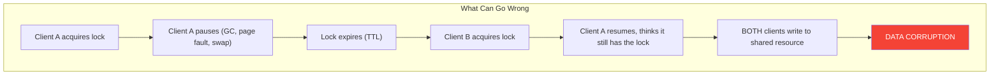
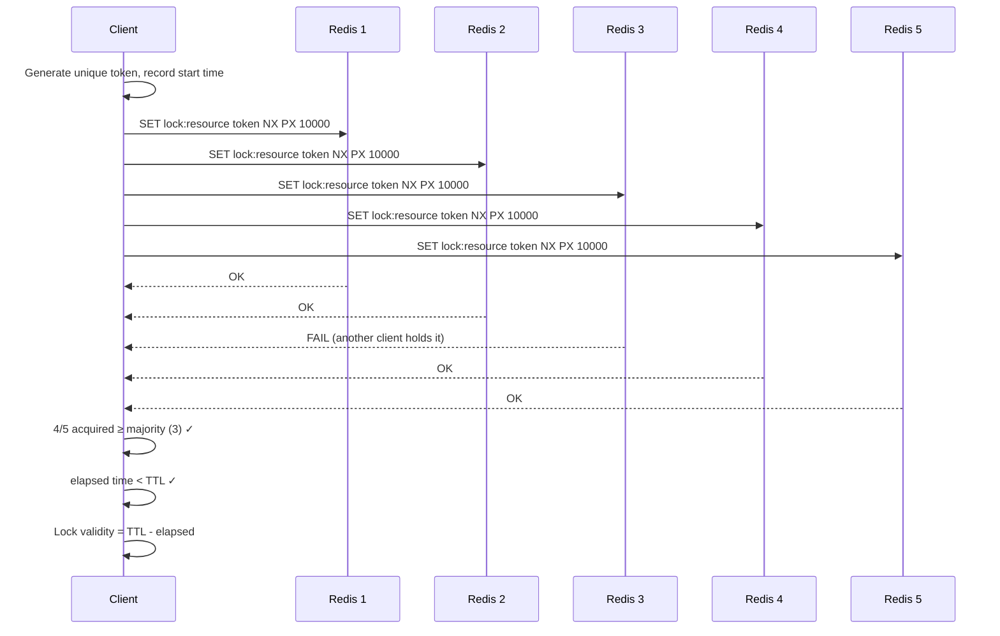
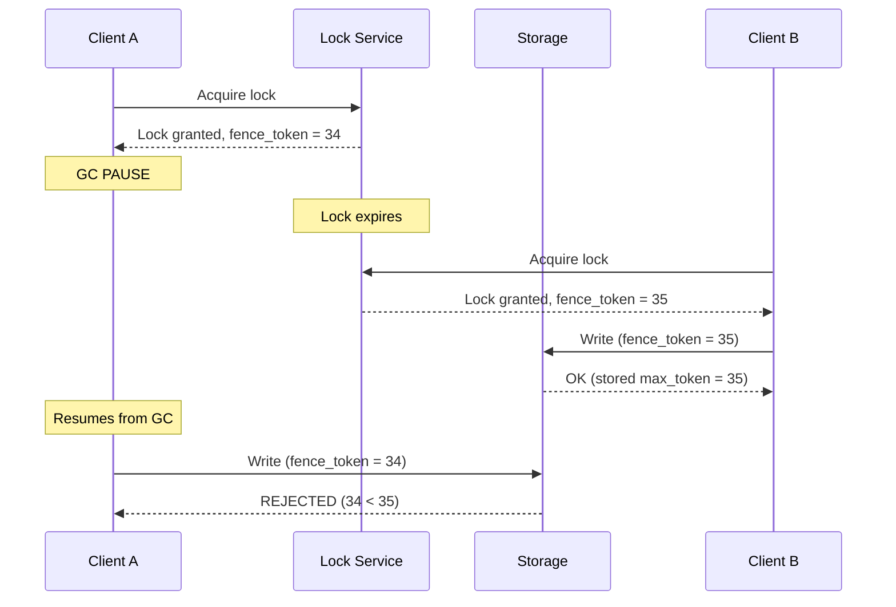
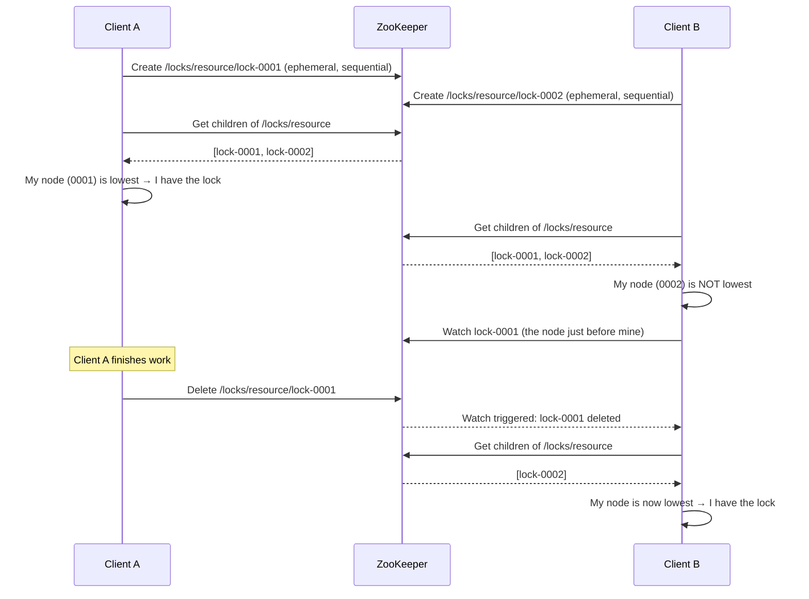

# Distributed Locking

Distributed locking is one of the most deceptively dangerous problems in distributed systems. The idea seems simple: multiple processes need mutual exclusion over a shared resource. In a single-process world, you use a mutex. In a distributed world, you need a distributed lock. But the properties that make a local mutex safe — atomicity, no partial failure, no clock skew — simply do not exist in a distributed system.

Getting distributed locks wrong leads to double-charging customers, corrupting data, overselling inventory, or processing the same job multiple times. Getting them right requires understanding exactly what guarantees your lock provides and, critically, what guarantees it does not provide.

## Why Distributed Locks Are Hard

A correct distributed lock must satisfy three properties:

1. **Mutual exclusion (safety):** At most one client holds the lock at any time
2. **Deadlock freedom (liveness):** Even if a client that holds the lock crashes, eventually the lock becomes available
3. **Fault tolerance:** The lock service survives node failures

The fundamental problem is that in a distributed system, you cannot have all three of the following simultaneously:

- **No clock assumptions** — The algorithm works regardless of clock drift or process pauses
- **No network assumptions** — The algorithm works regardless of message delays
- **Mutual exclusion** — At most one client holds the lock

This is a consequence of the [CAP Theorem](/system-design/distributed-systems/cap-theorem) and the FLP impossibility result. Every practical distributed lock makes compromises.



## Single-Node Redis Lock

The simplest approach. Works well when you only have one Redis instance and can tolerate the lock being unavailable if that instance dies.

```python
import redis
import uuid
import time

class RedisLock:
    def __init__(self, redis_client: redis.Redis, resource: str,
                 ttl_ms: int = 10000):
        self.redis = redis_client
        self.resource = f"lock:{resource}"
        self.ttl_ms = ttl_ms
        self.token = str(uuid.uuid4())

    def acquire(self, timeout_ms: int = 5000) -> bool:
        """Try to acquire the lock within timeout."""
        deadline = time.time() + timeout_ms / 1000
        while time.time() < deadline:
            # SET NX with TTL — atomic acquire
            if self.redis.set(self.resource, self.token,
                              nx=True, px=self.ttl_ms):
                return True
            time.sleep(0.01)  # Retry interval
        return False

    def release(self) -> bool:
        """Release the lock only if we still hold it."""
        # Must be atomic: check-and-delete
        script = """
        if redis.call("GET", KEYS[1]) == ARGV[1] then
            return redis.call("DEL", KEYS[1])
        else
            return 0
        end
        """
        result = self.redis.eval(script, 1, self.resource, self.token)
        return result == 1

    def extend(self, additional_ms: int) -> bool:
        """Extend the lock TTL if we still hold it."""
        script = """
        if redis.call("GET", KEYS[1]) == ARGV[1] then
            return redis.call("PEXPIRE", KEYS[1], ARGV[2])
        else
            return 0
        end
        """
        result = self.redis.eval(script, 1, self.resource,
                                  self.token, str(additional_ms))
        return result == 1
```

::: warning The Release Script Is Critical
You must use a Lua script for release. A naive `GET` + `DEL` has a race condition: between the `GET` and the `DEL`, the lock could expire and another client could acquire it. Your `DEL` would then delete the other client's lock.
:::

## Redis Redlock Algorithm

Redlock, proposed by Salvatore Sanfilippo (antirez), extends the single-node lock to multiple independent Redis instances. The idea is to acquire the lock on a majority of N independent Redis masters (not replicas).

### The Algorithm

Given N Redis instances (recommended N=5):



**Step by step:**

1. Get the current time in milliseconds ($T_1$)
2. Try to acquire the lock on all N instances sequentially, using the same key and random token, with a small per-instance timeout (e.g., 5-50ms)
3. Get the current time again ($T_2$). The lock is acquired if and only if:
   - The lock was acquired on at least $\lfloor N/2 \rfloor + 1$ instances
   - The total elapsed time ($T_2 - T_1$) is less than the lock TTL
4. The effective lock validity time is: $\text{TTL} - (T_2 - T_1) - \text{clock\_drift}$
5. If the lock was not acquired, release it on all instances

```python
import time
import uuid
import redis

class Redlock:
    CLOCK_DRIFT_FACTOR = 0.01  # 1% clock drift
    RETRY_DELAY_MS = 200
    RETRY_COUNT = 3

    def __init__(self, redis_instances: list[redis.Redis], ttl_ms: int = 10000):
        self.instances = redis_instances
        self.quorum = len(redis_instances) // 2 + 1
        self.ttl_ms = ttl_ms

    def acquire(self, resource: str) -> dict | None:
        token = str(uuid.uuid4())
        key = f"lock:{resource}"

        for attempt in range(self.RETRY_COUNT):
            acquired_count = 0
            start_time = time.monotonic()

            for instance in self.instances:
                try:
                    if instance.set(key, token, nx=True, px=self.ttl_ms):
                        acquired_count += 1
                except redis.RedisError:
                    pass

            elapsed_ms = (time.monotonic() - start_time) * 1000
            drift = self.ttl_ms * self.CLOCK_DRIFT_FACTOR + 2
            validity = self.ttl_ms - elapsed_ms - drift

            if acquired_count >= self.quorum and validity > 0:
                return {
                    "resource": resource,
                    "token": token,
                    "validity_ms": validity,
                }

            # Failed — release all
            self._release_all(key, token)
            time.sleep(self.RETRY_DELAY_MS / 1000 * (0.5 + 0.5 *
                       __import__('random').random()))

        return None

    def release(self, lock_info: dict) -> None:
        key = f"lock:{lock_info['resource']}"
        self._release_all(key, lock_info['token'])

    def _release_all(self, key: str, token: str) -> None:
        script = """
        if redis.call("GET", KEYS[1]) == ARGV[1] then
            return redis.call("DEL", KEYS[1])
        else
            return 0
        end
        """
        for instance in self.instances:
            try:
                instance.eval(script, 1, key, token)
            except redis.RedisError:
                pass
```

## Martin Kleppmann's Critique of Redlock

In his influential 2016 blog post "How to do distributed locking," Martin Kleppmann identified fundamental problems with Redlock. His critique is essential reading for anyone building distributed locks.

### The GC Pause Problem

```
Time →
Client A:  [acquire lock]............[GC PAUSE 15 sec]............[write data]
                                                                      ↑
Lock:      [████████ VALID ████████][EXPIRED]                    A thinks it
                                                                 still has lock
Client B:                           [acquire lock][write data]
                                                       ↑
                                                  B also writes

Result: BOTH clients wrote. Mutual exclusion violated.
```

The problem is not specific to GC — any process pause (page faults, thrashing, CPU scheduling) can cause a client to hold a lock past its expiry without realizing it. And there is no way for the client to detect this after the pause ends, because it cannot know how long it was paused.

### The Clock Jump Problem

Redlock depends on clock accuracy. If a Redis node's clock jumps forward (due to NTP correction, VM migration, or operator error), its locks expire prematurely, breaking the quorum guarantee.

### Kleppmann's Solution: Fencing Tokens

The fundamental fix is to not rely on the lock for safety at all. Instead, use the lock for efficiency (preventing duplicate work) and use **fencing tokens** for safety:



```python
class FencedLock:
    """Lock with monotonically increasing fencing tokens."""

    def __init__(self, lock_service, resource: str):
        self.lock_service = lock_service
        self.resource = resource
        self.fence_token: int | None = None

    def acquire(self) -> int:
        """Returns a fencing token (monotonically increasing integer)."""
        lock_info = self.lock_service.acquire(self.resource)
        if lock_info is None:
            raise LockAcquisitionError("Could not acquire lock")
        self.fence_token = lock_info['fence_token']
        return self.fence_token

    def write_with_fence(self, storage, key: str, value: any) -> bool:
        """Write to storage, rejected if a higher fence token has been seen."""
        return storage.conditional_write(key, value, self.fence_token)


class FencedStorage:
    """Storage that rejects writes with stale fencing tokens."""

    def __init__(self):
        self.data = {}
        self.max_tokens = {}  # Per-resource max fence token seen

    def conditional_write(self, key: str, value: any,
                          fence_token: int) -> bool:
        max_seen = self.max_tokens.get(key, 0)
        if fence_token < max_seen:
            return False  # Stale lock holder
        self.max_tokens[key] = fence_token
        self.data[key] = value
        return True
```

::: danger The Real Lesson
If you need the lock for **correctness** (not just efficiency), you must use fencing tokens. If your storage system does not support fencing, your distributed lock cannot guarantee mutual exclusion in the presence of process pauses, regardless of which lock algorithm you use.
:::

## ZooKeeper Distributed Locks

ZooKeeper provides stronger guarantees than Redis for locking because it uses consensus (ZAB protocol) for replication and supports ephemeral sequential nodes.

### ZooKeeper Lock Recipe



```java
import org.apache.zookeeper.*;
import java.util.*;

public class ZooKeeperLock {
    private final ZooKeeper zk;
    private final String lockPath;
    private String myNode;

    public ZooKeeperLock(ZooKeeper zk, String resource) {
        this.zk = zk;
        this.lockPath = "/locks/" + resource;
    }

    public void acquire() throws Exception {
        // Ensure parent path exists
        ensurePath(lockPath);

        // Create ephemeral sequential node
        myNode = zk.create(
            lockPath + "/lock-",
            new byte[0],
            ZooDefs.Ids.OPEN_ACL_UNSAFE,
            CreateMode.EPHEMERAL_SEQUENTIAL
        );

        while (true) {
            List<String> children = zk.getChildren(lockPath, false);
            Collections.sort(children);

            String myNodeName = myNode.substring(
                myNode.lastIndexOf('/') + 1);

            if (children.get(0).equals(myNodeName)) {
                return; // I have the lock
            }

            // Watch the node just before mine
            int myIndex = children.indexOf(myNodeName);
            String watchNode = lockPath + "/" + children.get(myIndex - 1);

            final Object lock = new Object();
            Stat stat = zk.exists(watchNode, event -> {
                synchronized (lock) {
                    lock.notifyAll();
                }
            });

            if (stat != null) {
                synchronized (lock) {
                    lock.wait(); // Wait for predecessor to be deleted
                }
            }
            // Loop back and check again
        }
    }

    public void release() throws Exception {
        if (myNode != null) {
            zk.delete(myNode, -1);
            myNode = null;
        }
    }
}
```

**Key advantages over Redis:**

| Property | Redis (Redlock) | ZooKeeper |
|----------|----------------|-----------|
| Consensus | No (independent nodes) | Yes (ZAB protocol) |
| Ephemeral locks | TTL-based (clock-dependent) | Session-based (heartbeat) |
| Ordering | No guaranteed ordering | Sequential nodes → FIFO ordering |
| Watch mechanism | Pub/Sub (not atomic) | Native watches (atomic with read) |
| Fencing tokens | Not built in | Sequential node number = fence token |

## etcd Distributed Locks

etcd uses Raft consensus and provides native lease-based locking:

```go
package main

import (
	"context"
	"log"
	"time"

	clientv3 "go.etcd.io/etcd/client/v3"
	"go.etcd.io/etcd/client/v3/concurrency"
)

func main() {
	cli, err := clientv3.New(clientv3.Config{
		Endpoints:   []string{"localhost:2379"},
		DialTimeout: 5 * time.Second,
	})
	if err != nil {
		log.Fatal(err)
	}
	defer cli.Close()

	// Create a session with a 10-second TTL
	session, err := concurrency.NewSession(cli,
		concurrency.WithTTL(10))
	if err != nil {
		log.Fatal(err)
	}
	defer session.Close()

	// Create a distributed lock
	mutex := concurrency.NewMutex(session, "/locks/my-resource")

	// Acquire the lock
	ctx, cancel := context.WithTimeout(context.Background(),
		5*time.Second)
	defer cancel()

	if err := mutex.Lock(ctx); err != nil {
		log.Fatal("failed to acquire lock:", err)
	}
	log.Println("Lock acquired!")

	// The lock's revision acts as a fencing token
	log.Printf("Fencing token (revision): %d", mutex.Header().Revision)

	// Do work under the lock...
	time.Sleep(2 * time.Second)

	// Release the lock
	if err := mutex.Unlock(context.TODO()); err != nil {
		log.Fatal("failed to release lock:", err)
	}
	log.Println("Lock released")
}
```

etcd's lease mechanism is superior to TTL-based expiry because the session automatically renews the lease through keepalive RPCs. If the client process dies, the session ends, and the lock is released within one TTL period.

## When to Use Which Lock

| Scenario | Recommended Approach | Why |
|----------|---------------------|-----|
| **Efficiency** (prevent duplicate work) | Single Redis node + TTL | Simple, fast, failures cause at most double work |
| **Correctness** (prevent data corruption) | ZooKeeper/etcd + fencing tokens | Consensus-backed, sequential ordering |
| **Already running Redis** | Single Redis lock (not Redlock) | Simpler, same practical guarantees as Redlock |
| **Already running ZooKeeper** | ZooKeeper lock recipe | Battle-tested, well-understood semantics |
| **Already running etcd** | etcd concurrency API | Native support, Raft-backed |
| **Need ordering** | ZooKeeper or etcd | Sequential nodes provide fair ordering |

::: tip Kleppmann's Advice
"If you need locks only for efficiency, use a single Redis instance with automatic lock expiration. If you need locks for correctness, do not use Redlock — use a proper consensus system like ZooKeeper, and use fencing tokens."
:::

## Lock Safety Checklist

Before deploying distributed locks in production, verify:

1. **Do you actually need a distributed lock?** Could you use an idempotency key or database constraint instead?
2. **Is the lock for efficiency or correctness?** This determines your entire approach
3. **Do you have fencing tokens?** If correctness matters, your storage must reject stale writes
4. **What happens when the lock holder crashes?** TTL/lease expiry must release the lock
5. **What happens during network partitions?** Can two clients both believe they hold the lock?
6. **Is your clock reliable?** If using TTL-based locks, NTP drift can violate assumptions
7. **What is your lock contention pattern?** High contention may indicate a design problem

## Further Reading

- [CAP Theorem](/system-design/distributed-systems/cap-theorem) — Why you cannot have both safety and liveness
- [Consistency Models](/system-design/distributed-systems/consistency-models) — Linearizability and its relationship to locking
- [Leader Election](/system-design/consensus/leader-election) — Related coordination problem
- [Distributed Transactions](/system-design/distributed-systems/distributed-transactions) — Alternative approaches to distributed coordination
- [Raft Full Walkthrough](/system-design/consensus/raft-full-walkthrough) — The consensus protocol behind etcd locks
- Martin Kleppmann, "How to do distributed locking" (2016)
- Salvatore Sanfilippo, "Is Redlock safe?" (2016)
- Apache Curator documentation — Production ZooKeeper lock recipes
- Martin Kleppmann, *Designing Data-Intensive Applications*, Chapter 8
