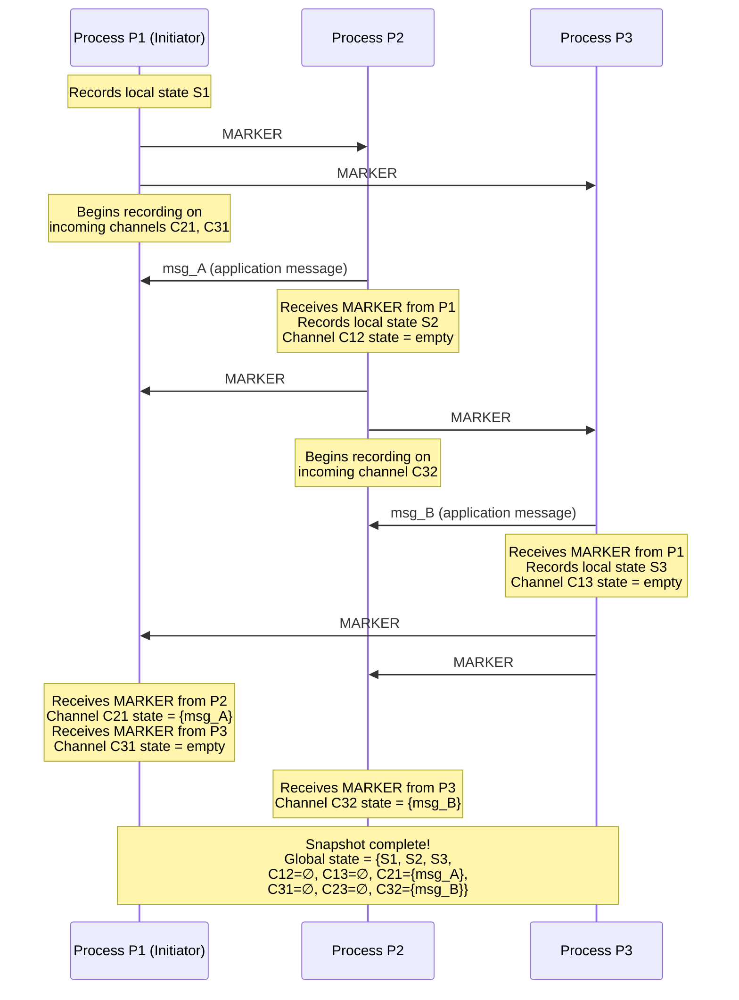
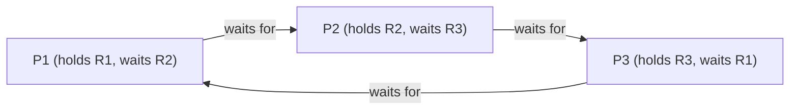
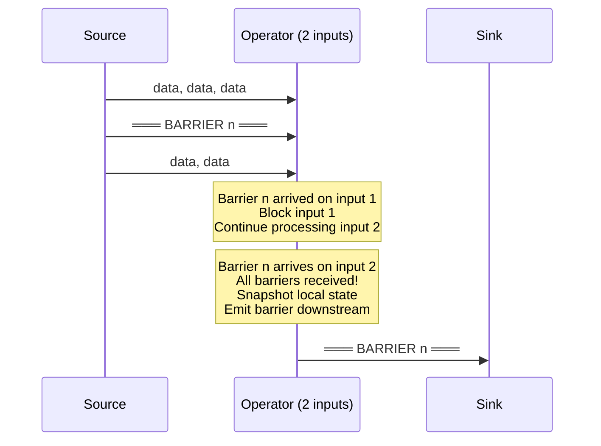

# Distributed Snapshots

Capturing the state of a single process is trivial — dump memory to disk. Capturing the state of a distributed system where processes communicate through messages, where there is no shared memory, no shared clock, and messages are in flight across the network at the instant you decide to "take a picture" — that is one of the deepest problems in distributed computing.

## Why It Exists

### The Global State Problem

Consider a distributed system with three processes: $P_1$, $P_2$, $P_3$. Each process has local state (variables, buffers, data structures). Between them, communication channels carry messages. At any instant, some messages are "in transit" — sent but not yet received.

The **global state** of this system is:

$$
S = \left(\bigcup_{i} s_i\right) \cup \left(\bigcup_{i,j} c_{ij}\right)
$$

where $s_i$ is the local state of process $P_i$ and $c_{ij}$ is the state of the channel from $P_i$ to $P_j$ (the set of messages in transit on that channel).

The problem: you cannot freeze all processes simultaneously. There is no global clock. Even if you could send a "freeze now" message, it arrives at different processes at different times. While you are recording $P_1$'s state, $P_2$ is still sending and receiving messages. The snapshot you capture might never have existed as a real state of the system.

### Why You Need Snapshots

Even though capturing global state is hard, many critical problems require it:

1. **Checkpointing and recovery** — Save the system state periodically so you can restart from the last checkpoint after a failure instead of from the beginning
2. **Deadlock detection** — A deadlock is a property of the global state (a cycle in the wait-for graph). No single process can detect it from local information alone
3. **Garbage collection** — An object is garbage only if no process holds a reference to it. This requires global knowledge
4. **Termination detection** — Has the distributed computation finished? Only a global view can answer this
5. **Debugging** — Understanding what state the system was in when a bug manifested

::: info War Story
At a financial services company processing equity trades, a distributed system had an intermittent bug where trades occasionally appeared to duplicate. The problem was impossible to reproduce because it depended on exact message timing across six services. The team implemented Chandy-Lamport snapshots at 30-second intervals and logged them. When the bug manifested again three weeks later, they had a consistent snapshot from seconds before the duplication event. The snapshot revealed that a retry mechanism was triggering because acknowledgments were being delayed in a channel between the order gateway and the matching engine — the message was in-flight in the channel state when the retry timer expired. Without the snapshot capturing channel state (not just process state), this bug would have remained a mystery.
:::

## First Principles

### What Makes a Snapshot "Consistent"?

Not every collection of process states constitutes a meaningful snapshot. To be useful, a snapshot must correspond to a state that the system **could have been in** — even if it was never actually in that exact state at any single instant.

This is formalized through the concept of **consistent cuts**.

### Events, Causality, and Happens-Before

Every process generates a sequence of events. Events include:
- Internal state transitions
- Sending a message
- Receiving a message

Lamport's happens-before relation ($\rightarrow$) defines a partial order on events:

1. If $a$ and $b$ are events in the same process and $a$ occurs before $b$, then $a \rightarrow b$
2. If $a$ is the sending of a message and $b$ is the receipt of that message, then $a \rightarrow b$
3. If $a \rightarrow b$ and $b \rightarrow c$, then $a \rightarrow c$ (transitivity)

If neither $a \rightarrow b$ nor $b \rightarrow a$, we say $a$ and $b$ are **concurrent** ($a \| b$).

### Cuts

A **cut** $C$ in a distributed computation is a partition of all events into two sets: those that occurred "before" the cut and those that occurred "after."

For each process $P_i$, the cut includes a prefix of $P_i$'s events. Let $c_i$ denote the last event of $P_i$ included in the cut.

```
Process P1: ──e1──e2──e3──e4──e5──e6──►
                         |
Process P2: ──f1──f2──f3──f4──f5──►
                    |
Process P3: ──g1──g2──g3──g4──►
                         |

Cut C includes: {e1,e2,e3} from P1, {f1,f2} from P2, {g1,g2,g3} from P3
```

### Consistent Cuts (Formal Definition)

A cut $C$ is **consistent** if and only if:

$$
\forall e, e': \left(e' \in C \wedge e \rightarrow e'\right) \implies e \in C
$$

In words: if the cut includes an event $e'$, it must also include all events that causally precede $e'$. You cannot observe an effect without its cause.

**Equivalently:** no message crosses the cut "backward" — from the future side to the past side. If a receive event is in the cut, the corresponding send event must also be in the cut.

```
CONSISTENT CUT:                    INCONSISTENT CUT:

P1: ──s────────────►               P1: ──s────────────►
       \                                  \
        \  msg                             \  msg
         \                                  \
P2: ──────r────────►               P2: ──────r────────►
          |                               |
        cut line                       cut line

Send s is BEFORE cut ✓             Send s is AFTER cut ✗
Recv r is AFTER cut  ✓             Recv r is BEFORE cut ✗
                                   (effect without cause!)
```

### The Lattice of Consistent Cuts

The set of all consistent cuts of a distributed computation forms a **lattice** under the subset ordering. This lattice represents all possible observations of the computation — every consistent cut corresponds to a global state that the system could have passed through.

$$
\text{If } C_1 \text{ and } C_2 \text{ are consistent cuts, then } C_1 \cap C_2 \text{ and } C_1 \cup C_2 \text{ are also consistent cuts.}
$$

This lattice structure is fundamental: checking whether a property holds in the computation reduces to checking it across consistent cuts in this lattice.

## Core Mechanics: The Chandy-Lamport Algorithm

### The Breakthrough Insight

K. Mani Chandy and Leslie Lamport published their algorithm in 1985. The key insight: you do not need synchronized clocks or a global freeze. You need **markers** — special messages that propagate through the system's own communication channels, using the FIFO property of channels to create a consistent cut.

### Assumptions

The Chandy-Lamport algorithm requires:
1. **FIFO channels** — Messages between any two processes are received in the order they were sent
2. **Reliable delivery** — No messages are lost (but there may be arbitrary delay)
3. **Strongly connected graph** — Every process can reach every other process through directed channels
4. **Finite delay** — Messages arrive in finite (but unbounded) time

### The Algorithm

Any process can initiate a snapshot. Let's call the initiator $P_i$.

**Initiator's rule:**
1. $P_i$ records its own local state $s_i$
2. $P_i$ sends a **marker** message on every outgoing channel before sending any further application messages

**Receiver's rule (when $P_j$ receives a marker on channel $C_{ij}$):**
- **If $P_j$ has not yet recorded its state:**
  1. $P_j$ records its local state $s_j$
  2. $P_j$ records the state of channel $C_{ij}$ as **empty** (no messages in transit)
  3. $P_j$ sends a marker on all its outgoing channels
  4. $P_j$ begins recording messages arriving on all other incoming channels $C_{kj}$ where $k \neq i$
- **If $P_j$ has already recorded its state:**
  1. $P_j$ stops recording on channel $C_{ij}$
  2. The state of $C_{ij}$ is the sequence of messages received on $C_{ij}$ between when $P_j$ recorded its state and when $P_j$ received the marker on $C_{ij}$

**Termination:** The snapshot is complete when every process has received a marker on every incoming channel.

### Sequence Diagram: Complete Walkthrough



### Why FIFO Channels Are Essential

The algorithm relies on FIFO ordering to ensure that the marker "separates" pre-snapshot messages from post-snapshot messages on each channel.

Consider channel $C_{ij}$. When $P_i$ records its state, it immediately sends a marker on $C_{ij}$. Because the channel is FIFO:
- All messages sent by $P_i$ **before** recording arrive at $P_j$ **before** the marker
- All messages sent by $P_i$ **after** recording arrive at $P_j$ **after** the marker

The marker acts as a **barrier** in the channel, cleanly dividing "before snapshot" messages from "after snapshot" messages.

Without FIFO, a post-snapshot message could arrive before the marker, and it would be incorrectly included in the channel state. This would create an inconsistent cut.

### Proof of Correctness

We prove that the Chandy-Lamport algorithm records a consistent cut.

**Theorem:** The cut recorded by the algorithm is consistent — for every message $m$, if the receive event of $m$ is included in the cut, then the send event of $m$ is also included.

**Proof:** Let $m$ be a message sent from $P_i$ to $P_j$. Suppose the receive of $m$ at $P_j$ is included in the cut (i.e., $P_j$ received $m$ before recording its state).

We need to show that $P_i$ sent $m$ before recording its state.

Consider two cases:

**Case 1: $P_j$ received the marker from $P_i$ before $P_j$ recorded its state.**
Then $P_j$ recorded its state upon receiving the marker from $P_i$. Since $m$ was received before $P_j$'s state recording, and the marker was also received before $P_j$'s state recording (in fact, it triggered it), we know $m$ arrived before the marker on channel $C_{ij}$. By FIFO, $m$ was **sent** before the marker on $C_{ij}$. Since $P_i$ sends the marker immediately after recording its state, $m$ was sent before $P_i$ recorded its state. $\square$

**Case 2: $P_j$ received the marker from $P_i$ after $P_j$ had already recorded its state.**
Then $P_j$ received its state-recording trigger from some other process $P_k$ (via a marker on $C_{kj}$). The message $m$ was received before $P_j$'s recording. The marker from $P_i$ hasn't arrived yet. But this doesn't affect the argument — we need to show that $P_i$ sent $m$ before recording its state.

Since $P_j$ received $m$ before recording, and $m$ is on channel $C_{ij}$, if $P_i$ had already recorded its state when sending $m$, then $P_i$ would have sent the marker before $m$ (the marker is sent immediately after recording). By FIFO, $P_j$ would receive the marker before $m$, which means the marker would have arrived before $P_j$'s recording. But in Case 2, the marker from $P_i$ arrived after $P_j$'s recording. This contradicts the assumption that $m$ arrived before recording but the marker arrived after. Actually — no contradiction: the marker from $P_i$ arriving after $P_j$'s recording is fine, but we showed that if $P_i$ sent $m$ after recording, the marker would arrive before $m$. Since $m$ arrived before the marker on channel $C_{ij}$ (given that $m$ was received before recording but the marker after), FIFO implies $m$ was sent before the marker, hence before $P_i$'s recording. $\square$

$$
\boxed{\text{The recorded cut is consistent: } \forall m, \text{recv}(m) \in C \implies \text{send}(m) \in C}
$$

### Complexity Analysis

For a system with $n$ processes and $e$ channels:

| Metric | Complexity |
|--------|-----------|
| Marker messages | $O(e)$ — one marker per channel |
| Time complexity | $O(d)$ — where $d$ is the diameter of the process graph |
| Space overhead | $O(\text{state size} + \text{channel messages})$ |
| Can run concurrently with computation? | Yes |

The algorithm is **non-blocking** — processes continue executing normally while the snapshot is being taken. The only overhead is sending marker messages and buffering channel state.

## Core Mechanics: Detailed Example

### A Three-Process Token-Passing System

Consider a system where a single token (representing a unit of work) is passed between three processes. The total number of tokens is conserved — this is an invariant we want to verify through snapshots.

**Initial state:**
- $P_1$: holds token (count = 1)
- $P_2$: no token (count = 0)
- $P_3$: no token (count = 0)
- Total: 1

```
Time →

P1: [tok=1] ──send(tok)──→ [tok=0] ───────────────── [tok=0] ──────────►
                   \
                    \  token msg
                     \
P2: [tok=0] ─────────\──→ [tok=0] ──recv(tok)──→ [tok=1] ──send(tok)──►
                      \                                    \
                       \                                    \
P3: [tok=0] ────────────\─────────────────────── [tok=0] ───\──recv(tok)──→ [tok=1]
```

**Scenario A — Consistent snapshot:**
- $P_1$ recorded after sending: tok=0
- $P_2$ recorded before receiving: tok=0
- Channel $C_{12}$ state: {token_msg}
- Total: 0 + 0 + {token in channel} = 1 $\checkmark$

**Scenario B — Inconsistent "snapshot" (NOT from Chandy-Lamport):**
- $P_1$ recorded after sending: tok=0
- $P_2$ recorded after receiving: tok=1
- Channel $C_{12}$ state not captured
- Total: 0 + 1 = 1 (appears correct but by luck)
- If we captured $P_1$ before sending and $P_2$ after receiving: 1 + 1 = 2 $\times$ (token duplicated!)

The Chandy-Lamport algorithm prevents Scenario B because the marker separating pre/post snapshot states ensures that if $P_2$'s recorded state includes the received token, then $P_1$'s recorded state must be post-send, AND the channel state must NOT include the token.

## TypeScript Implementation

```typescript
// Chandy-Lamport Distributed Snapshot Simulation

type ProcessId = string;
type MessageId = string;

interface Message {
  id: MessageId;
  from: ProcessId;
  to: ProcessId;
  payload: any;
  timestamp: number;
}

interface MarkerMessage {
  type: 'MARKER';
  snapshotId: string;
  from: ProcessId;
  to: ProcessId;
  timestamp: number;
}

interface ChannelState {
  from: ProcessId;
  to: ProcessId;
  messages: Message[];
}

interface ProcessState {
  processId: ProcessId;
  localState: Record<string, any>;
  recordedAt: number;
}

interface Snapshot {
  id: string;
  initiator: ProcessId;
  processStates: Map<ProcessId, ProcessState>;
  channelStates: Map<string, ChannelState>;
  complete: boolean;
  startedAt: number;
  completedAt?: number;
}

class FIFOChannel {
  readonly from: ProcessId;
  readonly to: ProcessId;
  private queue: (Message | MarkerMessage)[] = [];
  private delay: number;

  constructor(from: ProcessId, to: ProcessId, delay: number = 10) {
    this.from = from;
    this.to = to;
    this.delay = delay;
  }

  enqueue(msg: Message | MarkerMessage): void {
    this.queue.push(msg);
  }

  dequeue(): (Message | MarkerMessage) | undefined {
    return this.queue.shift(); // FIFO: always dequeue from front
  }

  peek(): (Message | MarkerMessage) | undefined {
    return this.queue[0];
  }

  isEmpty(): boolean {
    return this.queue.length === 0;
  }

  get channelKey(): string {
    return `${this.from}->${this.to}`;
  }
}

class Process {
  readonly id: ProcessId;
  private localState: Record<string, any>;
  private outgoingChannels: Map<ProcessId, FIFOChannel> = new Map();
  private incomingChannels: Map<ProcessId, FIFOChannel> = new Map();

  // Snapshot-related state
  private snapshotStates: Map<string, {
    recorded: boolean;
    localState?: Record<string, any>;
    recordedAt?: number;
    recording: Map<ProcessId, Message[]>; // channel -> buffered msgs
    markersReceived: Set<ProcessId>;
  }> = new Map();

  private clock: number = 0;
  private messageLog: Message[] = [];

  constructor(id: ProcessId, initialState: Record<string, any>) {
    this.id = id;
    this.localState = { ...initialState };
  }

  addOutgoingChannel(channel: FIFOChannel): void {
    this.outgoingChannels.set(channel.to, channel);
  }

  addIncomingChannel(channel: FIFOChannel): void {
    this.incomingChannels.set(channel.from, channel);
  }

  getLocalState(): Record<string, any> {
    return { ...this.localState };
  }

  updateState(key: string, value: any): void {
    this.clock++;
    this.localState[key] = value;
  }

  // Send an application message
  sendMessage(to: ProcessId, payload: any): Message {
    this.clock++;
    const channel = this.outgoingChannels.get(to);
    if (!channel) {
      throw new Error(`No channel from ${this.id} to ${to}`);
    }

    const msg: Message = {
      id: `msg-${this.id}-${this.clock}`,
      from: this.id,
      to,
      payload,
      timestamp: this.clock,
    };

    channel.enqueue(msg);
    console.log(`  [${this.id}] Sent message to ${to}: ${JSON.stringify(payload)}`);
    return msg;
  }

  // Initiate a snapshot (this process is the initiator)
  initiateSnapshot(snapshotId: string): void {
    console.log(`\n  [${this.id}] *** INITIATING SNAPSHOT ${snapshotId} ***`);
    this.clock++;

    // Record own state
    const snapshotState = {
      recorded: true,
      localState: { ...this.localState },
      recordedAt: this.clock,
      recording: new Map<ProcessId, Message[]>(),
      markersReceived: new Set<ProcessId>(),
    };

    // Start recording on all incoming channels
    for (const [fromId] of this.incomingChannels) {
      snapshotState.recording.set(fromId, []);
    }

    this.snapshotStates.set(snapshotId, snapshotState);

    console.log(`  [${this.id}] Recorded local state: ${JSON.stringify(snapshotState.localState)}`);

    // Send markers on all outgoing channels
    for (const [toId, channel] of this.outgoingChannels) {
      const marker: MarkerMessage = {
        type: 'MARKER',
        snapshotId,
        from: this.id,
        to: toId,
        timestamp: this.clock,
      };
      channel.enqueue(marker);
      console.log(`  [${this.id}] Sent MARKER to ${toId}`);
    }
  }

  // Process one incoming message from a specific channel
  processNextMessage(fromId: ProcessId): {
    type: 'app' | 'marker' | 'none';
    message?: Message | MarkerMessage;
    snapshotId?: string;
  } {
    const channel = this.incomingChannels.get(fromId);
    if (!channel || channel.isEmpty()) {
      return { type: 'none' };
    }

    const msg = channel.dequeue()!;
    this.clock++;

    if ('type' in msg && msg.type === 'MARKER') {
      return this.handleMarker(msg as MarkerMessage);
    } else {
      return this.handleApplicationMessage(msg as Message);
    }
  }

  private handleMarker(marker: MarkerMessage): {
    type: 'marker';
    message: MarkerMessage;
    snapshotId: string;
  } {
    const { snapshotId, from } = marker;
    console.log(`  [${this.id}] Received MARKER from ${from} (snapshot: ${snapshotId})`);

    let snapshotState = this.snapshotStates.get(snapshotId);

    if (!snapshotState || !snapshotState.recorded) {
      // First marker for this snapshot — record state
      console.log(`  [${this.id}] First marker! Recording local state.`);

      snapshotState = {
        recorded: true,
        localState: { ...this.localState },
        recordedAt: this.clock,
        recording: new Map<ProcessId, Message[]>(),
        markersReceived: new Set<ProcessId>(),
      };

      // Channel from 'from' is empty (marker arrived before any post-snapshot msg)
      snapshotState.markersReceived.add(from);

      // Start recording on all OTHER incoming channels
      for (const [channelFrom] of this.incomingChannels) {
        if (channelFrom !== from) {
          snapshotState.recording.set(channelFrom, []);
        }
      }

      this.snapshotStates.set(snapshotId, snapshotState);
      console.log(`  [${this.id}] Recorded state: ${JSON.stringify(snapshotState.localState)}`);
      console.log(`  [${this.id}] Channel ${from}->${this.id} state: EMPTY`);

      // Send markers on all outgoing channels
      for (const [toId, channel] of this.outgoingChannels) {
        const newMarker: MarkerMessage = {
          type: 'MARKER',
          snapshotId,
          from: this.id,
          to: toId,
          timestamp: this.clock,
        };
        channel.enqueue(newMarker);
        console.log(`  [${this.id}] Sent MARKER to ${toId}`);
      }
    } else {
      // Already recorded state — stop recording on this channel
      snapshotState.markersReceived.add(from);
      const channelMessages = snapshotState.recording.get(from) || [];
      snapshotState.recording.delete(from);
      console.log(
        `  [${this.id}] Channel ${from}->${this.id} state: [${channelMessages.map((m) => m.id).join(', ')}]`
      );
    }

    return { type: 'marker', message: marker, snapshotId };
  }

  private handleApplicationMessage(msg: Message): {
    type: 'app';
    message: Message;
  } {
    console.log(`  [${this.id}] Received app message from ${msg.from}: ${JSON.stringify(msg.payload)}`);

    // Apply message to local state (application-specific logic)
    if (msg.payload.type === 'token_transfer') {
      this.localState['tokens'] = (this.localState['tokens'] || 0) + msg.payload.amount;
    }

    // If recording for any snapshot, buffer this message for the channel
    for (const [, snapshotState] of this.snapshotStates) {
      if (snapshotState.recorded && snapshotState.recording.has(msg.from)) {
        snapshotState.recording.get(msg.from)!.push(msg);
      }
    }

    this.messageLog.push(msg);
    return { type: 'app', message: msg };
  }

  // Check if snapshot is complete for this process
  isSnapshotComplete(snapshotId: string): boolean {
    const state = this.snapshotStates.get(snapshotId);
    if (!state || !state.recorded) return false;
    return state.recording.size === 0;
  }

  getSnapshotState(snapshotId: string): ProcessState | undefined {
    const state = this.snapshotStates.get(snapshotId);
    if (!state || !state.recorded) return undefined;
    return {
      processId: this.id,
      localState: state.localState!,
      recordedAt: state.recordedAt!,
    };
  }

  getChannelStatesForSnapshot(snapshotId: string): Map<string, Message[]> {
    const result = new Map<string, Message[]>();
    const state = this.snapshotStates.get(snapshotId);
    if (!state) return result;

    // Completed channels have been removed from recording
    // and their messages are in markersReceived implicitly
    // For simplicity, we track completed channel states separately
    return result;
  }
}

// ─── Simulation Engine ────────────────────────────────────────────

class DistributedSystem {
  private processes: Map<ProcessId, Process> = new Map();
  private channels: FIFOChannel[] = [];
  private snapshots: Map<string, Snapshot> = new Map();

  addProcess(id: ProcessId, initialState: Record<string, any>): Process {
    const process = new Process(id, initialState);
    this.processes.set(id, process);
    return process;
  }

  addChannel(from: ProcessId, to: ProcessId, delay: number = 10): FIFOChannel {
    const fromProcess = this.processes.get(from)!;
    const toProcess = this.processes.get(to)!;

    const channel = new FIFOChannel(from, to, delay);
    fromProcess.addOutgoingChannel(channel);
    toProcess.addIncomingChannel(channel);
    this.channels.push(channel);
    return channel;
  }

  initiateSnapshot(initiatorId: ProcessId): string {
    const snapshotId = `snap-${Date.now()}-${Math.random().toString(36).slice(2, 8)}`;
    const process = this.processes.get(initiatorId)!;
    process.initiateSnapshot(snapshotId);

    this.snapshots.set(snapshotId, {
      id: snapshotId,
      initiator: initiatorId,
      processStates: new Map(),
      channelStates: new Map(),
      complete: false,
      startedAt: Date.now(),
    });

    return snapshotId;
  }

  // Process all pending messages in round-robin fashion
  tick(): boolean {
    let anyActivity = false;

    for (const [, process] of this.processes) {
      for (const channel of this.channels) {
        if (channel.to === process.id && !channel.isEmpty()) {
          const result = process.processNextMessage(channel.from);
          if (result.type !== 'none') {
            anyActivity = true;
          }
        }
      }
    }

    return anyActivity;
  }

  // Run until no more messages
  drain(): void {
    let rounds = 0;
    while (this.tick() && rounds < 100) {
      rounds++;
    }
  }

  getProcess(id: ProcessId): Process {
    return this.processes.get(id)!;
  }
}

// ─── Demo: Token Conservation ──────────────────────────────────────

function runTokenConservationDemo(): void {
  console.log('=== Chandy-Lamport Snapshot: Token Conservation Demo ===\n');

  const system = new DistributedSystem();

  // Three processes, P1 starts with 5 tokens
  const p1 = system.addProcess('P1', { tokens: 5, name: 'Process 1' });
  const p2 = system.addProcess('P2', { tokens: 0, name: 'Process 2' });
  const p3 = system.addProcess('P3', { tokens: 0, name: 'Process 3' });

  // Fully connected channels
  system.addChannel('P1', 'P2');
  system.addChannel('P1', 'P3');
  system.addChannel('P2', 'P1');
  system.addChannel('P2', 'P3');
  system.addChannel('P3', 'P1');
  system.addChannel('P3', 'P2');

  console.log('--- Phase 1: Application messages ---');

  // P1 sends 2 tokens to P2
  p1.updateState('tokens', 3); // 5 - 2 = 3
  p1.sendMessage('P2', { type: 'token_transfer', amount: 2 });

  // P1 sends 1 token to P3
  p1.updateState('tokens', 2); // 3 - 1 = 2
  p1.sendMessage('P3', { type: 'token_transfer', amount: 1 });

  console.log('\n--- Phase 2: Deliver some messages, then snapshot ---');

  // Deliver P1->P2 message (P2 gets 2 tokens)
  system.getProcess('P2').processNextMessage('P1');

  // NOW initiate snapshot from P1 (P1 has 2 tokens, P2 has 2, P3 has 0, 1 token in transit P1->P3)
  console.log('\n--- Phase 3: Snapshot initiated ---');
  const snapshotId = system.initiateSnapshot('P1');

  // Drain all remaining messages
  console.log('\n--- Phase 4: Processing remaining messages ---');
  system.drain();

  console.log('\n--- Snapshot Results ---');
  for (const pid of ['P1', 'P2', 'P3']) {
    const state = system.getProcess(pid).getSnapshotState(snapshotId);
    if (state) {
      console.log(`  ${pid}: ${JSON.stringify(state.localState)}`);
    }
  }

  console.log('\n  Expected total tokens: 5');
  console.log('  (P1=2 local + P2=2 local + 1 in channel P1->P3 = 5) ✓');
}

runTokenConservationDemo();
```

## Edge Cases and Failure Modes

### Multiple Concurrent Snapshots

The algorithm supports multiple simultaneous snapshots by tagging each marker with a unique snapshot ID. Each process maintains separate recording state per snapshot. This is essential in practice — a monitoring system might initiate snapshots at regular intervals, and a new snapshot might begin before the previous one completes.

The key constraint: each snapshot's markers must be independently tracked. A marker for snapshot S1 does not satisfy the marker requirement for snapshot S2.

### Non-FIFO Channels

If channels are not FIFO, the algorithm breaks. Consider:

```
P1 sends: [app_msg_1] [MARKER] [app_msg_2]
P2 receives (non-FIFO reorder): [MARKER] [app_msg_2] [app_msg_1]
```

$P_2$ records its state upon receiving the marker, then receives $\text{app\_msg\_2}$ (post-snapshot, correctly excluded) and $\text{app\_msg\_1}$ (pre-snapshot, incorrectly excluded). The channel state is wrong.

**Workarounds for non-FIFO channels:**
1. Add sequence numbers and buffer at receiver to restore FIFO order
2. Use the Lai-Yang algorithm (works without FIFO, uses message coloring)
3. Use the Mattern algorithm (uses vector clocks instead of markers)

### Large State Problem

If a process's local state is gigabytes (e.g., an in-memory database), recording it atomically is expensive. Strategies:

1. **Copy-on-write** — Use OS-level fork() or application-level COW data structures. Record a pointer to the state; actual copying happens lazily only when state is modified
2. **Incremental snapshots** — Record only the delta from the last snapshot
3. **Asynchronous state copy** — Begin copying state in background, recording writes that happen during the copy (write-ahead log approach)

### Network Partitions During Snapshot

If a partition occurs during snapshot collection, markers on partitioned channels never arrive. The snapshot never completes.

Mitigations:
- **Timeout** — If a snapshot doesn't complete within a configured duration, abort it
- **Snapshot coordinator** — A designated process tracks snapshot progress and can abort/retry
- **Periodic retry** — Initiate snapshots on a timer; if one fails, the next will succeed after partition heals

## Performance Considerations

### Overhead Measurement

The overhead of the Chandy-Lamport algorithm comes from three sources:

1. **Marker messages:** $O(e)$ additional messages where $e$ is the number of channels. In a fully connected network of $n$ processes, $e = n(n-1)$, so overhead is $O(n^2)$
2. **State recording latency:** Each process must capture its state, which may involve serialization
3. **Channel state buffering:** Messages arriving between state recording and marker receipt must be buffered

In practice, for a system with $n = 100$ processes in a fully connected topology:

$$
\text{Marker messages} = n(n-1) = 100 \times 99 = 9{,}900
$$

This is modest compared to the application message rate in most systems.

### Snapshot Frequency Trade-off

More frequent snapshots mean:
- **Pro:** Less work to redo after failure (smaller recovery window)
- **Con:** Higher overhead, more marker messages, more state to store

The optimal snapshot interval $T_{opt}$ balances the cost of snapshotting ($C_s$) against the cost of re-execution after failure ($C_r$):

$$
T_{opt} = \sqrt{\frac{2 \cdot C_s}{C_r \cdot \lambda}}
$$

where $\lambda$ is the failure rate. This is derived from the Young/Daly optimal checkpoint interval formula.

### Storage Costs

Each snapshot stores all process states and channel states. If total state size is $S$ and we keep $k$ snapshots:

$$
\text{Storage} = k \cdot S + \text{channel messages in transit}
$$

With incremental snapshots, storage drops to:

$$
\text{Storage} = S + (k-1) \cdot \Delta S_{avg}
$$

where $\Delta S_{avg}$ is the average state change between snapshots.

## Math Foundations

### Consistent Cuts and Lattices

Let $E_i$ be the set of events at process $P_i$, and let $E = \bigcup_i E_i$ be the set of all events. A **cut** is a tuple $C = (c_1, c_2, \ldots, c_n)$ where $c_i$ is the number of events included from $P_i$.

The set of all consistent cuts forms a **distributive lattice** $(L, \leq)$ where:

$$
C_1 \leq C_2 \iff \forall i: c_1^{(i)} \leq c_2^{(i)}
$$

The meet and join operations are:

$$
C_1 \wedge C_2 = (\min(c_1^{(1)}, c_2^{(1)}), \ldots, \min(c_1^{(n)}, c_2^{(n)}))
$$

$$
C_1 \vee C_2 = (\max(c_1^{(1)}, c_2^{(1)}), \ldots, \max(c_1^{(n)}, c_2^{(n)}))
$$

### Stable Property Detection

A property $\phi$ of the global state is **stable** if once it becomes true, it remains true forever. Examples: deadlock, termination, token loss.

**Theorem (Chandy-Lamport):** If $\phi$ is a stable property and $\phi$ holds in the actual state $S^*$ at the time the snapshot captures state $S$, then $\phi$ holds in $S$.

More precisely, the snapshot state $S$ is reachable from some state $S_{\text{before}}$ that occurred before the snapshot was initiated, and $S^*$ is reachable from $S$:

$$
S_{\text{before}} \leadsto S \leadsto S^*
$$

If $\phi(S^*) = \text{true}$ and $\phi$ is stable, then $\phi(S) = \text{true}$.

This means: to detect deadlock, take a snapshot and check for deadlock in the snapshot. If found, the system is (or was) deadlocked.

### Number of Consistent Cuts

For $n$ processes each with $k$ events, the number of possible cuts is $(k+1)^n$. The number of **consistent** cuts depends on the causal structure but is bounded:

$$
1 \leq |\text{consistent cuts}| \leq (k+1)^n
$$

In the worst case (all events concurrent), all cuts are consistent. In the best case (totally ordered), the number of consistent cuts equals the total number of events plus one.

## Applications in Detail

### Deadlock Detection

A distributed deadlock occurs when processes form a cycle of dependencies:



To detect this:
1. Take a Chandy-Lamport snapshot
2. Construct the wait-for graph from the snapshot
3. Check for cycles using DFS
4. If a cycle exists, the system is deadlocked (deadlock is a stable property)

### Garbage Collection

In distributed garbage collection, an object $O$ on node $N_1$ is garbage only if:
- No local process on $N_1$ references $O$, AND
- No process on any other node references $O$, AND
- No message in transit contains a reference to $O$

The last condition is why snapshots must capture channel state. A snapshot that only records process states might conclude an object is garbage while a message carrying a reference to it is in transit.

### Checkpointing for Fault Tolerance

The primary use of snapshots in production systems:

1. Take periodic snapshots
2. Store snapshots to durable storage (disk, S3, HDFS)
3. On failure, restore the latest snapshot
4. Replay messages from the snapshot point forward

The challenge: coordinated checkpointing (Chandy-Lamport style) requires all processes to participate. If one process is slow, the entire checkpoint is delayed.

**Uncoordinated checkpointing** allows each process to checkpoint independently but risks the **domino effect** — during recovery, rolling back one process may require rolling back others, which may require rolling back further, potentially cascading to the initial state.

```
P1: ──[ckpt1]───────[ckpt2]──────[ckpt3]──X
P2: ────[ckpt1]──────[ckpt2]──────────X
P3: ──────[ckpt1]──────────[ckpt2]────X

Recovery attempt:
P1 rolls back to ckpt3
  → inconsistent with P2.ckpt2 → P2 rolls back to ckpt1
    → inconsistent with P3.ckpt2 → P3 rolls back to ckpt1
      → inconsistent with P1.ckpt3 → P1 rolls back to ckpt2
        → ... domino effect back to start
```

Coordinated checkpoints (Chandy-Lamport) avoid the domino effect entirely because the snapshot is globally consistent.

## Flink's Asynchronous Barrier Snapshotting (ABS)

### Why Chandy-Lamport Isn't Enough for Stream Processing

Apache Flink needed snapshots for exactly-once stream processing — every event must be processed exactly once, even across failures. Chandy-Lamport works but has issues for streaming:

1. **Channel state recording is expensive** — In a high-throughput stream processor, millions of events might be in-flight. Recording all of them as channel state is prohibitive
2. **Non-deterministic processing** — Chandy-Lamport assumes processes are deterministic so replay from a snapshot reproduces the same computation. Stream processors often aren't

### The ABS Protocol

Flink's ABS protocol (published by Carbone et al., 2015) is a variant of Chandy-Lamport designed for directed acyclic dataflow graphs:

**Key modification:** Instead of recording channel state, ABS **aligns** barriers across input channels so that no channel state needs to be recorded.



**Algorithm:**
1. The **JobManager** injects barriers into all source streams
2. When an operator receives a barrier on one input:
   - It **blocks** that input (stops reading from it)
   - Continues processing other inputs until their barriers arrive
3. When barriers have arrived on **all** inputs:
   - The operator snapshots its local state asynchronously
   - Forwards the barrier to all downstream operators
   - Unblocks all inputs
4. When all sinks have received the barrier, the snapshot is complete

### Why ABS Avoids Channel State

By aligning barriers, ABS ensures that at the moment of snapshot:
- All pre-barrier records have been processed
- No post-barrier records have been processed
- Therefore, there are no "in-flight" records to capture

This eliminates channel state entirely, dramatically reducing snapshot size.

### Trade-off: Alignment Overhead

Blocking an input while waiting for barriers on other inputs introduces **back-pressure**. If one input is much faster than another, the fast input's buffer fills up while waiting for the slow input's barrier. This can cause:

- Increased latency during snapshotting
- Memory pressure from buffered records
- Cascading back-pressure upstream

Flink 1.11 introduced **unaligned checkpoints** to address this — they allow processing to continue on all inputs without blocking, at the cost of recording channel state (returning closer to pure Chandy-Lamport). The choice between aligned and unaligned checkpoints is configurable.

### ABS vs. Chandy-Lamport Comparison

| Aspect | Chandy-Lamport | Flink ABS (Aligned) | Flink ABS (Unaligned) |
|--------|---------------|--------------------|-----------------------|
| Channel state | Recorded | Not recorded | Recorded |
| FIFO required | Yes | Yes | Yes |
| Blocking | Non-blocking | Blocks inputs | Non-blocking |
| Snapshot size | State + channels | State only | State + channels |
| Back-pressure | None | During alignment | None |
| Graph topology | Any (connected) | DAG | DAG |
| Suited for | General distributed | Stream processing | High-skew streams |

## Comparison of Snapshot Algorithms

| Algorithm | Year | FIFO Required | Records Channels | Complexity | Key Innovation |
|-----------|------|---------------|-------------------|------------|----------------|
| Chandy-Lamport | 1985 | Yes | Yes | $O(e)$ messages | Marker-based separation |
| Lai-Yang | 1987 | No | Yes | $O(e)$ messages | Message coloring (pre/post snapshot) |
| Mattern | 1993 | No | Yes | $O(e)$ messages | Vector clock-based cut detection |
| Acharya-Badrinath | 1994 | No | No (piggybacked) | $O(n)$ messages | Quasi-synchronous checkpointing |
| Flink ABS | 2015 | Yes | No (aligned) | $O(e)$ barriers | Barrier alignment in DAG |

### Lai-Yang Algorithm

For non-FIFO channels, the Lai-Yang algorithm colors messages:
- Messages sent **before** the snapshot are colored **white**
- Messages sent **after** the snapshot are colored **red**

Each process records all white messages received after its snapshot as channel state. No markers needed — the coloring is piggybacked on application messages.

### Mattern's Algorithm

Uses vector timestamps instead of markers. Each process:
1. Determines a consistent cut using vector clock comparisons
2. Records its state when its vector clock reaches the cut value
3. Channel state is derived from the vector timestamps of messages

This is more expensive (vector clocks have $O(n)$ size) but works without FIFO channels.

::: info War Story
A team at a major cloud provider implemented Chandy-Lamport for checkpointing a distributed stream processing pipeline with 200+ operators. During testing, they discovered that their message broker (Kafka) provided ordering guarantees within partitions but not across partitions. When an operator consumed from multiple Kafka partitions, messages from different partitions could arrive out of order — violating the FIFO assumption. Their first "fix" was to route all messages through a single partition (destroying parallelism). The correct fix was to add per-partition sequence numbers and a reorder buffer at each operator, restoring FIFO semantics at the application level. Lesson: verify that your infrastructure actually provides the guarantees your algorithm assumes.
:::

## Decision Framework

### When to Use Distributed Snapshots

```
Need global state?
├── Yes: Is the property you're checking stable?
│   ├── Yes (deadlock, termination): Use Chandy-Lamport
│   │   Single snapshot suffices — stable properties persist
│   └── No (e.g., load balance metrics):
│       Need consistent snapshot? Or approximate OK?
│       ├── Consistent: Use Chandy-Lamport but check repeatedly
│       └── Approximate: Use gossip-based aggregation
└── No: You don't need snapshots

What kind of system?
├── Stream processor (DAG topology):
│   ├── Low latency required: Flink ABS (unaligned)
│   └── Small state, less skew: Flink ABS (aligned)
├── General distributed system:
│   ├── FIFO channels available: Chandy-Lamport
│   └── Non-FIFO channels: Lai-Yang or Mattern
└── Shared memory system: Not applicable (use local snapshot)

How large is the state?
├── Small (< 100 MB): Direct serialization on snapshot
├── Medium (100 MB – 10 GB): Copy-on-write (fork-based)
└── Large (> 10 GB): Incremental snapshots + background copy
```

### Snapshot Storage Strategy

| Strategy | Recovery Time | Storage Cost | Implementation Complexity |
|----------|--------------|-------------|--------------------------|
| Full snapshots, keep last N | Fast (load latest) | $N \times S$ | Low |
| Incremental snapshots | Medium (base + deltas) | $S + (N-1)\Delta$ | Medium |
| Full + incremental hybrid | Fast for recent, slow for old | $S + (N-1)\Delta$ | High |
| Continuous checkpointing (Zab-style) | Very fast | $S + \text{log}$ | Very high |

## Advanced Topics

### Consistent Global Predicates

Beyond stable properties, we often want to detect **unstable** properties — conditions that may become true and then false again. Two interpretations:

1. **Possibly $\phi$** — there exists a consistent cut in which $\phi$ holds
2. **Definitely $\phi$** — $\phi$ holds in all consistent cuts during an interval

Detecting "possibly $\phi$" requires constructing the lattice of consistent cuts and evaluating $\phi$ on each. For $n$ processes with $k$ events each, this lattice can have up to $(k+1)^n$ elements — exponential. Efficient algorithms exist for restricted predicate classes:

- **Conjunctive predicates** ($\phi = \phi_1 \wedge \phi_2 \wedge \ldots \wedge \phi_n$ where $\phi_i$ depends only on $P_i$'s state): $O(n \cdot k)$
- **Linear predicates:** $O(n \cdot k)$
- **Semi-linear predicates:** $O(n \cdot k)$
- **General predicates:** NP-complete

### Causal Delivery and Snapshots

If the system provides **causal delivery** (if $\text{send}(m_1) \rightarrow \text{send}(m_2)$, then $\text{deliver}(m_1)$ happens before $\text{deliver}(m_2)$ at any common destination), then:

1. Chandy-Lamport works without explicit FIFO channels (causal delivery implies FIFO)
2. The snapshot can be taken with fewer assumptions about the transport layer

### Rollback Recovery Protocols

Snapshots enable three classes of rollback recovery:

**Checkpoint-based:**
- Coordinated checkpointing (Chandy-Lamport style)
- Uncoordinated with dependency tracking (no domino effect)
- Communication-induced checkpointing

**Log-based:**
- Pessimistic logging — log every non-deterministic event before processing
- Optimistic logging — log asynchronously, risk re-processing on failure
- Causal logging — log only events needed for causal consistency

**Hybrid:** Combine checkpoints (less frequent) with message logging (between checkpoints).

The recovery guarantee:

$$
\text{Recovery time} \propto \frac{\text{work since last checkpoint}}{\text{replay speed}}
$$

$$
\text{Expected lost work per failure} = \frac{T_{\text{checkpoint}}}{2}
$$

where $T_{\text{checkpoint}}$ is the interval between checkpoints (assuming failures are uniformly distributed).

### Snapshot Isolation in Databases

The term "snapshot" also appears in database isolation levels. **Snapshot isolation** provides each transaction with a consistent view of the database at the transaction's start time. This is related but distinct:

- **Distributed snapshots** (this article): capture the global state of a running distributed computation
- **Snapshot isolation** (databases): provide a consistent read view for transactions

Both rely on the same fundamental idea — a consistent cut through the system's event history — but the mechanisms differ. Databases use multi-version concurrency control (MVCC), while distributed snapshots use marker protocols.

### Self-Stabilizing Snapshots

In a self-stabilizing system, the snapshot algorithm must work even if the system starts in an arbitrary state (including one where spurious markers are already in the channels). Katz and Perry (1993) showed how to extend Chandy-Lamport with termination detection to make it self-stabilizing.

The key addition: after the snapshot completes, verify its consistency using vector clocks. If inconsistent, discard and retry. After a finite number of retries, the system stabilizes and produces a correct snapshot.

### Distributed Snapshots in Cloud-Native Systems

Modern systems rarely implement Chandy-Lamport directly. Instead, they use:

1. **Kafka + compacted topics** — The log IS the state. A snapshot is a position (offset) in the log. Recovery replays from the offset
2. **Flink checkpoints** — ABS protocol as described above
3. **Spark Structured Streaming** — Uses write-ahead logs and idempotent sinks instead of true snapshots
4. **CockroachDB** — Uses MVCC with a timestamp oracle; "snapshots" are time-bounded reads at a specific HLC timestamp
5. **etcd** — Raft-based snapshots: leader compacts the log and stores a snapshot of the state machine at a specific log index

Each of these adapts the core insight — consistent cuts through causal history — to the specific guarantees of their infrastructure.

::: info War Story
During a major retail company's Black Friday sale, their Apache Flink pipeline processing purchase events started falling behind. The operations team increased checkpoint frequency to protect against data loss, not realizing that aligned checkpoints were causing back-pressure cascades. Each checkpoint was blocking fast source partitions for up to 8 seconds while waiting for slow partitions to catch up. The fix was switching to unaligned checkpoints (which don't block inputs but record in-flight data). Checkpoint time dropped from 8 seconds to 200ms, and the pipeline caught up within minutes. The lesson: snapshot mechanism choice directly impacts production throughput, and the trade-offs between aligned vs. unaligned checkpoints are not just theoretical.
:::

### Open Research Problems

1. **Snapshots under Byzantine faults** — Chandy-Lamport assumes processes are honest. What if a process lies about its state? BFT snapshot protocols exist but are expensive ($O(n^2)$ messages with $3f+1$ processes for $f$ faulty)
2. **Elastic snapshots** — Taking snapshots while the set of processes is changing (scaling events). Current algorithms assume a fixed process set
3. **Approximate snapshots** — For large-scale analytics, an approximate snapshot (capturing most but not all channel state) might be acceptable and much cheaper
4. **Encrypted snapshots** — Capturing global state without any single entity seeing the full state (privacy-preserving snapshots for multi-party computation)
5. **Continuous snapshots** — Instead of discrete snapshots, maintain a continuously updated view of the global state. Related to change data capture (CDC) and materialized views

## Key Takeaways

The distributed snapshot problem sits at the heart of distributed computing because it forces you to confront the fundamental challenges: no global clock, no shared memory, messages in transit. The Chandy-Lamport algorithm's elegance lies in using the system's own communication channels (via markers) to create a consistent cut without stopping the computation.

The algorithm's assumptions (FIFO channels, reliable delivery) are strong but achievable in practice through sequence numbers and retransmission. When these assumptions don't hold, alternative algorithms (Lai-Yang, Mattern) provide the same guarantees with different mechanisms.

In production, the choice of snapshot mechanism is driven by the specific constraints of your system: state size, message rate, topology, and recovery time objectives. Understanding the theory — consistent cuts, stable properties, the lattice of global states — gives you the foundation to evaluate these trade-offs rigorously.
