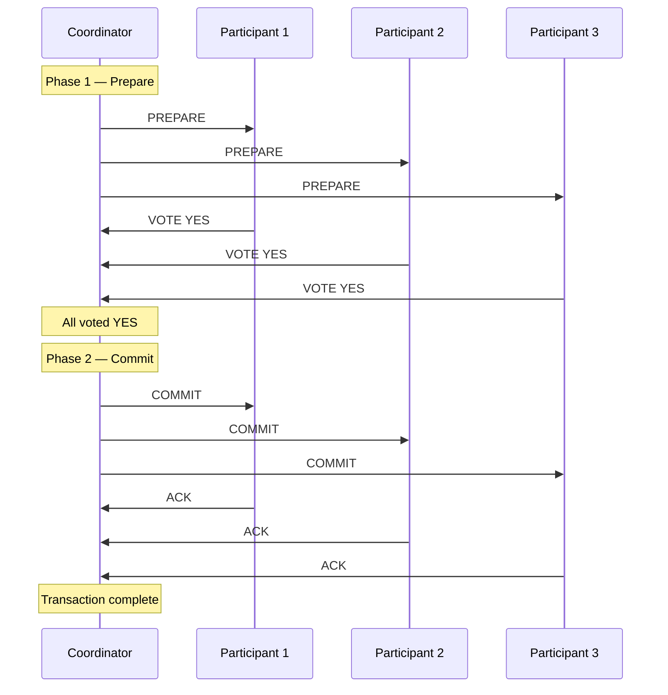
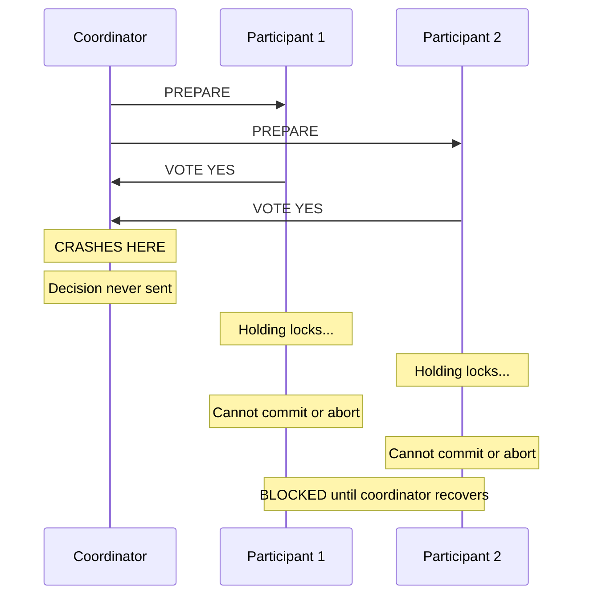
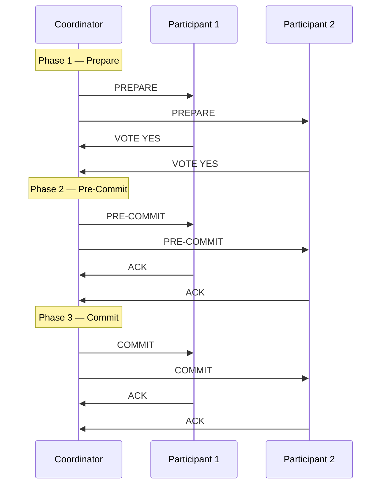
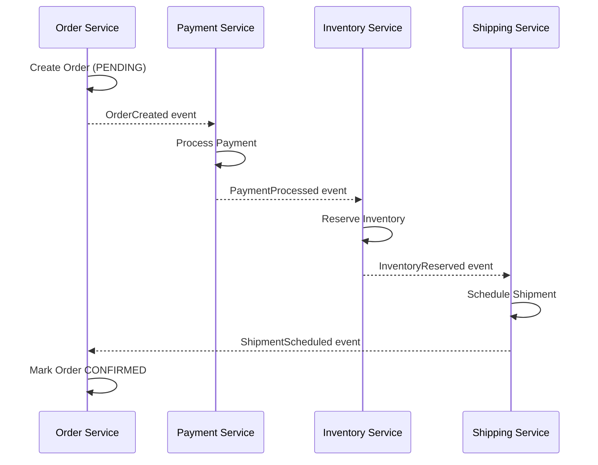
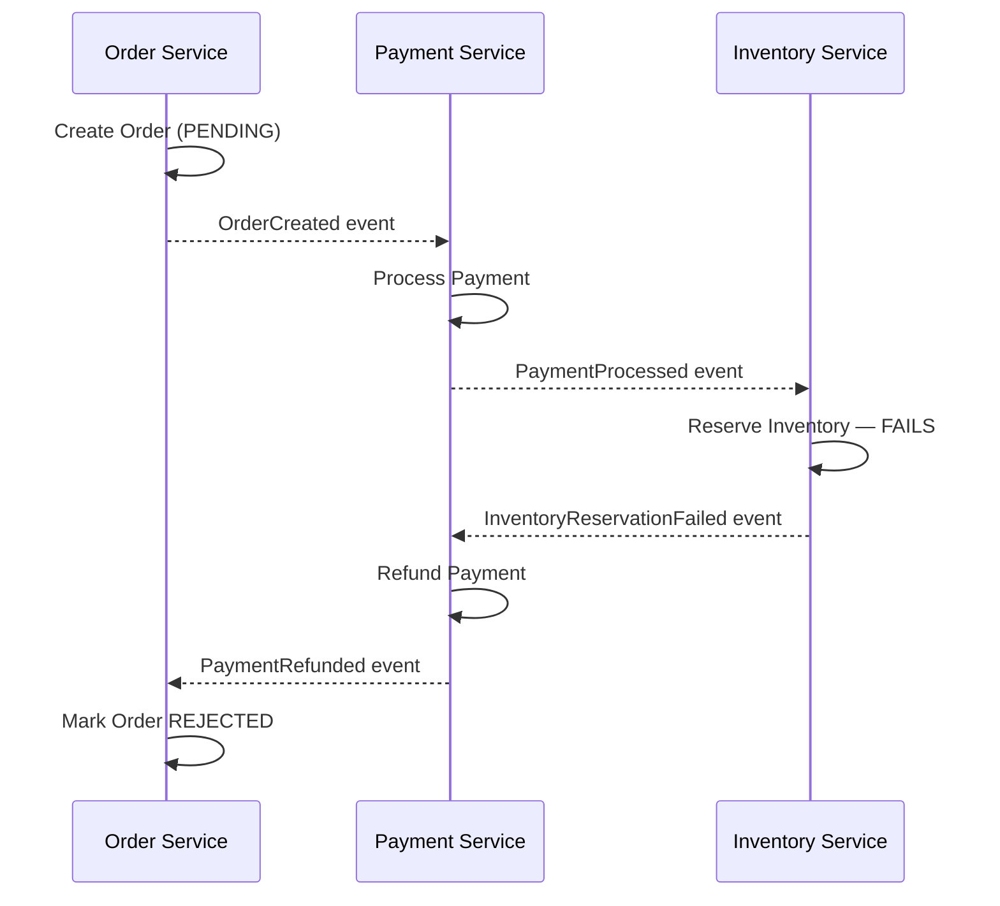
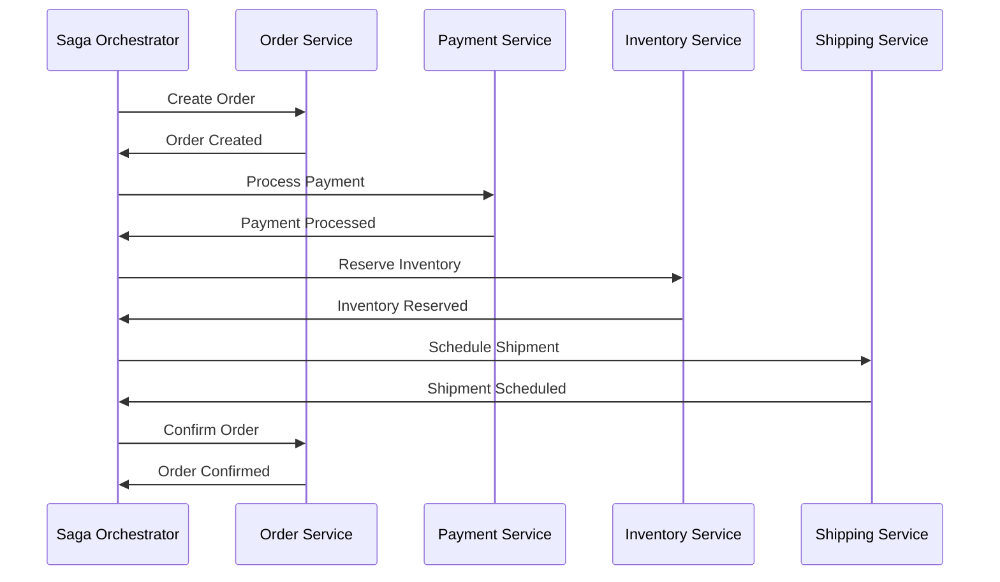

# Distributed Transactions

A distributed transaction spans multiple independent services, databases, or resource managers and must either succeed everywhere or fail everywhere. This sounds simple. In practice, it is the hardest problem in distributed systems — because the network can fail at any moment, any participant can crash at any moment, and you must still guarantee correctness.

This document covers every major approach to solving this problem, from the battle-tested Two-Phase Commit protocol to modern Saga-based patterns used in microservice architectures.

## 1. Why Distributed Transactions Exist

### The Problem

Consider a simple e-commerce checkout. A single user action must:

1. **Debit the user's payment** (Payment Service, database A)
2. **Reserve inventory** (Inventory Service, database B)
3. **Create an order record** (Order Service, database C)

If payment succeeds but inventory reservation fails, the user has been charged for nothing. If the order record is created but payment fails, you've given away product for free. The system must be all-or-nothing — but each step lives in a different process, potentially on a different continent.

Local ACID transactions solve this within a single database. The moment data spans boundaries — multiple databases, multiple services, multiple data centers — you need a distributed transaction protocol.

### Historical Context

The Two-Phase Commit protocol was formalized by Jim Gray in 1978 in his paper "Notes on Data Base Operating Systems." It became the backbone of the X/Open XA standard, implemented by every major database and message broker in the 1990s and 2000s.

Dale Skeen and Michael Stonebraker proposed Three-Phase Commit in 1981 to address 2PC's blocking problem, proving that non-blocking atomic commit requires at least three communication rounds.

The Saga pattern was introduced by Hector Garcia-Molina and Kenneth Salem in 1987 at Princeton, originally for long-lived transactions in a single database. It was rediscovered and adapted for microservices by Chris Richardson and others in the 2010s, becoming the dominant pattern in modern distributed systems.

## 2. First Principles — The Atomic Commit Problem

### What We Need

The **atomic commit problem** requires all participants in a transaction to agree on one of two outcomes:

- **Commit**: All participants make their changes permanent.
- **Abort**: No participant makes any changes permanent.

### Formal Requirements

A correct atomic commit protocol must satisfy:

1. **Agreement**: All participants that reach a decision reach the *same* decision.
2. **Validity**: If all participants vote YES, the decision is COMMIT. If any participant votes NO, the decision is ABORT.
3. **Termination**: Every non-failed participant eventually reaches a decision.

$$
\forall p_i, p_j \in P_{\text{decided}} : \text{decision}(p_i) = \text{decision}(p_j)
$$

$$
\left(\forall p_i \in P : \text{vote}(p_i) = \text{YES}\right) \Rightarrow \text{decision} = \text{COMMIT}
$$

$$
\left(\exists p_i \in P : \text{vote}(p_i) = \text{NO}\right) \Rightarrow \text{decision} = \text{ABORT}
$$

### The FLP Impossibility Connection

Fischer, Lynch, and Paterson proved in 1985 that no deterministic protocol can guarantee consensus in an asynchronous system where even one process can fail. This means **no perfect atomic commit protocol exists** in a fully asynchronous network. Every real protocol makes trade-offs — 2PC sacrifices termination (it can block), 3PC sacrifices correctness under partitions, and Sagas sacrifice atomicity (using compensation instead).

## 3. Two-Phase Commit (2PC)

### Core Mechanics

2PC uses a designated **coordinator** (also called the Transaction Manager) that orchestrates all **participants** (Resource Managers) through two distinct phases.

**Phase 1 — Prepare (Voting Phase)**:
The coordinator asks each participant: "Can you commit?" Each participant performs all work (acquires locks, writes to WAL) but does NOT make changes visible. It replies YES (prepared) or NO (abort).

**Phase 2 — Commit/Abort (Decision Phase)**:
If ALL participants voted YES, the coordinator sends COMMIT to all. If ANY voted NO (or timed out), the coordinator sends ABORT to all. Participants execute the decision and release locks.



### The Transaction Log (Write-Ahead Log)

Both coordinator and participants write decisions to a durable log BEFORE sending messages. This is critical for crash recovery:

| Event | Who Logs | Log Record |
|-------|----------|------------|
| Transaction starts | Coordinator | `BEGIN txn-id` |
| Vote received | Coordinator | `VOTE txn-id participant-id YES/NO` |
| Decision made | Coordinator | `DECISION txn-id COMMIT/ABORT` |
| Prepare request received | Participant | `PREPARE txn-id` |
| Vote sent | Participant | `VOTE txn-id YES/NO` |
| Decision received | Participant | `DECISION txn-id COMMIT/ABORT` |
| Work completed | Participant | `DONE txn-id` |

The decision record is the **point of no return**. Once the coordinator writes COMMIT to its log, the transaction WILL commit, regardless of any subsequent failures.

### Proof of Correctness

**Agreement**: All participants receive the same decision message from the coordinator. If a participant misses the message, it will ask the coordinator upon recovery and get the same answer.

**Validity**: The coordinator only sends COMMIT if all votes are YES. If any vote is NO (or missing due to timeout), it sends ABORT.

**Termination**: This is where 2PC fails. If the coordinator crashes after sending PREPARE but before sending the decision, participants are stuck — they have voted YES, hold locks, and cannot unilaterally decide. They must wait for the coordinator to recover. This is the **blocking problem**.

$$
\text{2PC satisfies Agreement} \wedge \text{Validity} \wedge \neg\text{Termination (under coordinator failure)}
$$

### Failure Scenarios

#### Scenario 1: Participant Crashes Before Voting

The coordinator times out waiting for the vote, treats it as a NO, and sends ABORT to all participants. Safe and straightforward.

#### Scenario 2: Participant Crashes After Voting YES

The coordinator already has the vote. If all votes are YES, it sends COMMIT. The crashed participant, upon recovery, reads its log, sees it voted YES, contacts the coordinator, learns the decision, and completes the commit. Locks are held until recovery.

#### Scenario 3: Coordinator Crashes Before Sending Decision

This is the **catastrophic case**. All participants that voted YES are in the **uncertain state** — they cannot commit (maybe another participant voted NO), and they cannot abort (maybe the coordinator decided to commit). They must hold locks and wait.



#### Scenario 4: Network Partition During Phase 2

The coordinator sends COMMIT, but the message reaches only some participants. Those that received COMMIT will commit. Those that didn't are in the uncertain state. Eventually, when the partition heals, they'll learn the decision — but until then, they block.

#### Scenario 5: Coordinator and One Participant Crash Simultaneously

The surviving participants cannot determine the decision. The crashed participant might have been the only NO voter, or all might have voted YES. The protocol is fully blocked until at least one of them recovers.

### Timeout Handling

| State | Timeout Action | Rationale |
|-------|---------------|-----------|
| Coordinator waiting for votes | ABORT | Safe — no decision made yet |
| Participant waiting for PREPARE | ABORT unilaterally | Safe — haven't voted yet |
| Participant waiting for decision (voted YES) | **BLOCK** — cannot decide | Unsafe to commit or abort |
| Participant waiting for decision (voted NO) | ABORT unilaterally | Safe — coordinator will also abort |

The third row is the critical problem. A participant that voted YES and is waiting for a decision CANNOT safely do anything except wait.

### Implementation

```typescript
import { EventEmitter } from "events";

// --- Types ---

type TransactionId = string;

enum TransactionState {
  INIT = "INIT",
  PREPARING = "PREPARING",
  PREPARED = "PREPARED",
  COMMITTING = "COMMITTING",
  COMMITTED = "COMMITTED",
  ABORTING = "ABORTING",
  ABORTED = "ABORTED",
}

enum Vote {
  YES = "YES",
  NO = "NO",
}

interface LogEntry {
  timestamp: number;
  txnId: TransactionId;
  event: string;
  data?: unknown;
}

// --- Write-Ahead Log ---

class WriteAheadLog {
  private entries: LogEntry[] = [];

  async append(txnId: TransactionId, event: string, data?: unknown): Promise<void> {
    const entry: LogEntry = {
      timestamp: Date.now(),
      txnId,
      event,
      data,
    };
    this.entries.push(entry);
    // In production: fsync to durable storage before returning
  }

  getEntries(txnId: TransactionId): LogEntry[] {
    return this.entries.filter((e) => e.txnId === txnId);
  }

  getLastEvent(txnId: TransactionId): string | undefined {
    const entries = this.getEntries(txnId);
    return entries.length > 0 ? entries[entries.length - 1].event : undefined;
  }
}

// --- Participant ---

interface Participant {
  id: string;
  prepare(txnId: TransactionId, operation: () => Promise<boolean>): Promise<Vote>;
  commit(txnId: TransactionId): Promise<void>;
  abort(txnId: TransactionId): Promise<void>;
  getState(txnId: TransactionId): TransactionState;
}

class TwoPhaseParticipant implements Participant {
  public id: string;
  private wal = new WriteAheadLog();
  private states = new Map<TransactionId, TransactionState>();
  private pendingWork = new Map<TransactionId, () => Promise<void>>();

  constructor(id: string) {
    this.id = id;
  }

  async prepare(
    txnId: TransactionId,
    operation: () => Promise<boolean>,
  ): Promise<Vote> {
    await this.wal.append(txnId, "PREPARE_RECEIVED");
    this.states.set(txnId, TransactionState.PREPARING);

    try {
      const canCommit = await operation();

      if (canCommit) {
        await this.wal.append(txnId, "VOTE_YES");
        this.states.set(txnId, TransactionState.PREPARED);
        return Vote.YES;
      } else {
        await this.wal.append(txnId, "VOTE_NO");
        this.states.set(txnId, TransactionState.ABORTED);
        return Vote.NO;
      }
    } catch (error) {
      await this.wal.append(txnId, "VOTE_NO", { error: String(error) });
      this.states.set(txnId, TransactionState.ABORTED);
      return Vote.NO;
    }
  }

  async commit(txnId: TransactionId): Promise<void> {
    await this.wal.append(txnId, "COMMIT_RECEIVED");
    this.states.set(txnId, TransactionState.COMMITTING);
    // Apply changes permanently — in production this finalizes the WAL entries
    await this.wal.append(txnId, "COMMITTED");
    this.states.set(txnId, TransactionState.COMMITTED);
  }

  async abort(txnId: TransactionId): Promise<void> {
    await this.wal.append(txnId, "ABORT_RECEIVED");
    this.states.set(txnId, TransactionState.ABORTING);
    // Roll back any prepared changes
    await this.wal.append(txnId, "ABORTED");
    this.states.set(txnId, TransactionState.ABORTED);
  }

  getState(txnId: TransactionId): TransactionState {
    return this.states.get(txnId) ?? TransactionState.INIT;
  }
}

// --- Coordinator ---

interface CoordinatorConfig {
  prepareTimeoutMs: number;
  commitTimeoutMs: number;
  maxRetries: number;
}

class TwoPhaseCoordinator {
  private wal = new WriteAheadLog();
  private participants: Participant[];
  private config: CoordinatorConfig;

  constructor(participants: Participant[], config?: Partial<CoordinatorConfig>) {
    this.participants = participants;
    this.config = {
      prepareTimeoutMs: config?.prepareTimeoutMs ?? 5000,
      commitTimeoutMs: config?.commitTimeoutMs ?? 10000,
      maxRetries: config?.maxRetries ?? 3,
    };
  }

  async execute(
    txnId: TransactionId,
    operations: Map<string, () => Promise<boolean>>,
  ): Promise<boolean> {
    await this.wal.append(txnId, "BEGIN");

    // Phase 1: Prepare
    const votes = await this.preparePhase(txnId, operations);
    const allYes = votes.every(([, vote]) => vote === Vote.YES);

    if (allYes) {
      // Phase 2: Commit
      await this.wal.append(txnId, "DECISION_COMMIT");
      await this.commitPhase(txnId);
      return true;
    } else {
      // Phase 2: Abort
      await this.wal.append(txnId, "DECISION_ABORT");
      await this.abortPhase(txnId);
      return false;
    }
  }

  private async preparePhase(
    txnId: TransactionId,
    operations: Map<string, () => Promise<boolean>>,
  ): Promise<Array<[string, Vote]>> {
    const votePromises = this.participants.map(async (p): Promise<[string, Vote]> => {
      const operation = operations.get(p.id);
      if (!operation) {
        return [p.id, Vote.NO];
      }

      try {
        const vote = await this.withTimeout(
          p.prepare(txnId, operation),
          this.config.prepareTimeoutMs,
        );
        await this.wal.append(txnId, `VOTE_${vote}`, { participant: p.id });
        return [p.id, vote];
      } catch (error) {
        // Timeout or communication failure treated as NO
        await this.wal.append(txnId, "VOTE_TIMEOUT", { participant: p.id });
        return [p.id, Vote.NO];
      }
    });

    return Promise.all(votePromises);
  }

  private async commitPhase(txnId: TransactionId): Promise<void> {
    const commitPromises = this.participants.map(async (p) => {
      for (let attempt = 0; attempt < this.config.maxRetries; attempt++) {
        try {
          await this.withTimeout(
            p.commit(txnId),
            this.config.commitTimeoutMs,
          );
          return;
        } catch {
          // Retry — the decision is already logged, we MUST deliver it
          await this.delay(Math.pow(2, attempt) * 100);
        }
      }
      // If all retries fail, a background recovery process must eventually
      // deliver the commit. The decision is in the WAL and is permanent.
      console.error(`Failed to deliver COMMIT to ${p.id} for txn ${txnId}`);
    });

    await Promise.all(commitPromises);
    await this.wal.append(txnId, "COMPLETE");
  }

  private async abortPhase(txnId: TransactionId): Promise<void> {
    const abortPromises = this.participants.map(async (p) => {
      try {
        await this.withTimeout(
          p.abort(txnId),
          this.config.commitTimeoutMs,
        );
      } catch {
        // Best-effort abort — participant will abort on recovery
        // when it contacts the coordinator and learns the decision
      }
    });

    await Promise.all(abortPromises);
    await this.wal.append(txnId, "COMPLETE");
  }

  private withTimeout<T>(promise: Promise<T>, ms: number): Promise<T> {
    return new Promise<T>((resolve, reject) => {
      const timer = setTimeout(() => reject(new Error("Timeout")), ms);
      promise
        .then((val) => {
          clearTimeout(timer);
          resolve(val);
        })
        .catch((err) => {
          clearTimeout(timer);
          reject(err);
        });
    });
  }

  private delay(ms: number): Promise<void> {
    return new Promise((resolve) => setTimeout(resolve, ms));
  }
}
```

### Performance Characteristics

| Metric | Value | Notes |
|--------|-------|-------|
| Message complexity | $O(3n)$ | $n$ prepares + $n$ votes + $n$ commit/abort |
| Round trips | 2 | Prepare/Vote, then Commit/Abort |
| Lock hold time | Entire prepare + commit duration | Blocks concurrent access |
| Latency lower bound | 2 * RTT + fsync time | Two forced log writes (vote + decision) |
| Throughput ceiling | Bounded by slowest participant | The chain is only as fast as its slowest link |

In practice, 2PC adds 10-50ms of overhead per transaction in a well-connected data center, dominated by the forced fsync of the WAL. Cross-region 2PC can add 200-500ms due to network latency, making it impractical for latency-sensitive workloads.

## 4. Three-Phase Commit (3PC)

### Why 2PC's Blocking Is Unacceptable

In 2PC, when the coordinator crashes after PREPARE but before sending the decision, all participants that voted YES are stuck. They hold locks on shared resources, blocking all other transactions that touch those resources. If the coordinator takes minutes or hours to recover, the entire system is effectively down.

3PC was designed by Dale Skeen in 1981 to eliminate this blocking window by adding a third phase that ensures no participant is ever in a state where it cannot unilaterally decide.

### Core Mechanics

3PC introduces a **pre-commit** phase between voting and committing:

1. **Phase 1 — Prepare**: Same as 2PC. Coordinator sends PREPARE, participants vote.
2. **Phase 2 — Pre-Commit**: If all votes are YES, coordinator sends PRE-COMMIT. Participants acknowledge but do NOT commit yet. If any vote is NO, coordinator sends ABORT.
3. **Phase 3 — Commit**: Coordinator sends COMMIT. Participants make changes permanent.

The key insight: after receiving PRE-COMMIT, a participant knows that ALL participants voted YES. This means if the coordinator crashes, surviving participants can safely commit — because they know no one voted NO.



### The Non-Blocking Property

In 3PC, if the coordinator crashes, participants can elect a new coordinator and determine the outcome:

- If **any** surviving participant has received COMMIT, the decision is COMMIT.
- If **any** surviving participant has NOT received PRE-COMMIT, the decision is ABORT (because the coordinator might have aborted).
- If **all** surviving participants have received PRE-COMMIT but none has received COMMIT, they can safely COMMIT (they know everyone voted YES).

This is non-blocking because participants never reach a state where they must wait for a failed coordinator — they always have enough information to decide.

### Why 3PC Still Fails: Network Partitions

3PC solves the blocking problem under **crash failures** (nodes fail by stopping), but it does NOT work under **network partitions**. Consider:

1. Coordinator sends PRE-COMMIT to P1 and P2.
2. A network partition separates P1 from {Coordinator, P2}.
3. P1 has received PRE-COMMIT. It times out waiting for COMMIT.
4. P1 elects itself as the new coordinator and decides COMMIT (it knows everyone voted YES).
5. Meanwhile, the real coordinator detected P1's "failure" and sent ABORT to P2.
6. **P1 committed. P2 aborted. Agreement violated.**

$$
\text{3PC: non-blocking under crash failures} \wedge \text{unsafe under network partitions}
$$

This is why 3PC is rarely used in practice. Real networks have partitions, not just crashes. The protocol solves a theoretical problem but fails in the real world.

### Performance Characteristics

| Metric | 2PC | 3PC |
|--------|-----|-----|
| Message complexity | $O(3n)$ | $O(5n)$ |
| Round trips | 2 | 3 |
| Blocking under coordinator crash | YES | NO (crash only) |
| Correct under partitions | YES (but blocks) | NO |
| Practical adoption | Widespread | Virtually none |

The extra round trip in 3PC increases latency by ~50%, and the protocol provides no benefit in networks where partitions occur. This is why the industry effectively abandoned 3PC in favor of other approaches.

## 5. The Saga Pattern

### Why Sagas Exist

2PC requires all participants to hold locks for the entire transaction duration. In a microservices architecture where a transaction might span 5-10 services with round-trip latencies of 50-200ms each, locks could be held for seconds. Under load, this causes cascading lock contention and system-wide slowdowns.

Sagas take a fundamentally different approach: instead of holding locks and ensuring atomicity, they **break the transaction into a sequence of local transactions**, each of which commits immediately. If a later step fails, previously committed steps are **compensated** (undone) by executing a compensating transaction.

This trades strong consistency for availability and performance — a direct application of the CAP theorem's trade-offs.

### First Principles

A Saga is a sequence of local transactions $T_1, T_2, \ldots, T_n$ where:

- Each $T_i$ has a corresponding compensating transaction $C_i$ that semantically undoes $T_i$'s effects.
- If $T_i$ fails, the saga executes $C_{i-1}, C_{i-2}, \ldots, C_1$ in reverse order.
- Each $T_i$ and $C_i$ is a local ACID transaction within its own service.

$$
\text{Saga execution (success): } T_1, T_2, \ldots, T_n
$$

$$
\text{Saga execution (failure at } T_k \text{): } T_1, T_2, \ldots, T_{k-1}, T_k(\text{fail}), C_{k-1}, C_{k-2}, \ldots, C_1
$$

::: warning Critical Understanding
Compensating transactions do NOT roll back. They apply a NEW transaction that reverses the effect. "Debit $100" is compensated by "Credit $100" — a new entry in the ledger, not the removal of the old one. This has profound implications for system design.
:::

### Choreography vs Orchestration

There are two approaches to coordinating a saga.

#### Choreography (Event-Driven)

Each service listens for events and decides what to do next. There is no central coordinator. Services communicate through a message broker.



**Compensation flow (inventory reservation fails):**



**Pros:** Simple, loosely coupled, no single point of failure.

**Cons:** Hard to understand the overall flow, difficult to debug, risk of cyclic dependencies, adding new steps requires modifying existing services.

#### Orchestration (Central Coordinator)

A dedicated orchestrator service manages the saga. It tells each participant what to do and handles compensation on failure.



**Pros:** Clear flow, easy to debug, centralized error handling, no cyclic dependencies.

**Cons:** Single point of failure (mitigated by making the orchestrator stateless + durable state store), risk of becoming a "god service."

### Compensating Transactions — Design Principles

Compensating transactions must be:

1. **Idempotent**: Can be executed multiple times with the same result (critical for retry scenarios).
2. **Commutative** (ideally): Order of compensation should not matter for the final state.
3. **Retryable**: Must eventually succeed — a compensation that fails permanently leaves the system inconsistent.

| Forward Transaction | Compensating Transaction | Notes |
|---------------------|------------------------|-------|
| Create Order | Cancel Order | Sets status to CANCELLED |
| Debit Account $100 | Credit Account $100 | New ledger entry, not deletion |
| Reserve 5 units of inventory | Release 5 units of inventory | Increment available count |
| Send confirmation email | Send cancellation email | Cannot "unsend" — compensating action |
| Ship package | Create return shipment | Physical actions are hardest to compensate |

### Pivot Transactions

A **pivot transaction** is the step in a saga that, once committed, guarantees the saga will complete successfully (all subsequent steps will succeed or can be infinitely retried). It divides the saga into two halves:

- **Compensatable transactions**: Steps before the pivot that can be compensated.
- **Retriable transactions**: Steps after the pivot that are guaranteed to eventually succeed.

Example in our e-commerce saga:

| Step | Type | Transaction |
|------|------|------------|
| $T_1$ | Compensatable | Create Order (PENDING) |
| $T_2$ | Compensatable | Reserve Inventory |
| $T_3$ | **Pivot** | Process Payment |
| $T_4$ | Retriable | Confirm Order |
| $T_5$ | Retriable | Schedule Shipment |

After payment succeeds (the pivot), we guarantee the rest will complete — even if it takes retries. Before the pivot, any failure triggers compensation.

### Countermeasure Strategies

Sagas lack the isolation property of ACID. Without locks held across the entire transaction, other transactions can see intermediate state. Chris Richardson documents six countermeasures:

#### 1. Semantic Lock

Mark records as "in progress" during the saga. Other transactions check this flag and either wait, fail, or proceed with caution.

```typescript
// Order has a status field acting as a semantic lock
interface Order {
  id: string;
  status: "PENDING" | "APPROVED" | "CONFIRMED" | "CANCELLED";
  // PENDING = saga in progress, acts as a semantic lock
  // Other services check status before interacting with this order
}
```

::: warning Anti-Pattern Alert
Semantic locks re-introduce blocking — the very thing sagas were designed to avoid. Use them only where the inconsistency window is truly dangerous (e.g., financial transactions). Over-use negates the benefits of using a saga over 2PC.
:::

#### 2. Commutative Updates

Design operations so that execution order does not matter. Accounting entries are naturally commutative — debit followed by credit produces the same final balance regardless of interleaving.

$$
f(g(x)) = g(f(x)) \Rightarrow \text{updates are safe under reordering}
$$

#### 3. Pessimistic View

Reorder saga steps to minimize the risk of business-level errors. Process the most failure-prone step first, so compensation is simpler (fewer steps to undo).

#### 4. Reread Value

Before committing a step, reread the data to verify it has not changed since the saga started. This is optimistic concurrency control applied within a saga.

```typescript
async function reserveInventory(
  productId: string,
  quantity: number,
  expectedVersion: number,
): Promise<boolean> {
  const current = await db.getProduct(productId);

  if (current.version !== expectedVersion) {
    // Data has changed since saga started — abort or retry
    return false;
  }

  if (current.availableStock < quantity) {
    return false;
  }

  await db.updateProduct(productId, {
    availableStock: current.availableStock - quantity,
    version: current.version + 1,
  });

  return true;
}
```

#### 5. Version File

Record the operations as they arrive, then execute them in the correct order. This handles out-of-order message delivery by buffering and reordering.

#### 6. By Value (Risk-Based)

Use saga semantics for low-risk operations and stronger coordination (like 2PC) for high-value operations. A $5 order can tolerate eventual consistency; a $50,000 wire transfer might warrant 2PC's overhead.

### Full Saga Orchestrator Implementation

```typescript
// --- Types ---

type StepName = string;

interface SagaStep<TContext> {
  name: StepName;
  /** Execute the forward transaction. Return updated context. */
  execute: (context: TContext) => Promise<TContext>;
  /** Compensate (undo) this step. Return updated context. */
  compensate: (context: TContext) => Promise<TContext>;
}

enum SagaStatus {
  NOT_STARTED = "NOT_STARTED",
  RUNNING = "RUNNING",
  COMPLETED = "COMPLETED",
  COMPENSATING = "COMPENSATING",
  COMPENSATED = "COMPENSATED",
  FAILED = "FAILED", // compensation itself failed — requires manual intervention
}

interface SagaState<TContext> {
  id: string;
  status: SagaStatus;
  context: TContext;
  currentStepIndex: number;
  completedSteps: StepName[];
  compensatedSteps: StepName[];
  errors: Array<{ step: StepName; error: string; timestamp: number }>;
  createdAt: number;
  updatedAt: number;
}

interface SagaStore<TContext> {
  save(state: SagaState<TContext>): Promise<void>;
  load(sagaId: string): Promise<SagaState<TContext> | null>;
}

// --- In-Memory Store (replace with database-backed store in production) ---

class InMemorySagaStore<TContext> implements SagaStore<TContext> {
  private store = new Map<string, SagaState<TContext>>();

  async save(state: SagaState<TContext>): Promise<void> {
    this.store.set(state.id, structuredClone(state));
  }

  async load(sagaId: string): Promise<SagaState<TContext> | null> {
    const state = this.store.get(sagaId);
    return state ? structuredClone(state) : null;
  }
}

// --- Saga Orchestrator ---

interface OrchestratorConfig {
  maxRetries: number;
  retryDelayMs: number;
  stepTimeoutMs: number;
}

class SagaOrchestrator<TContext> {
  private steps: Array<SagaStep<TContext>>;
  private store: SagaStore<TContext>;
  private config: OrchestratorConfig;

  constructor(
    steps: Array<SagaStep<TContext>>,
    store: SagaStore<TContext>,
    config?: Partial<OrchestratorConfig>,
  ) {
    this.steps = steps;
    this.store = store;
    this.config = {
      maxRetries: config?.maxRetries ?? 3,
      retryDelayMs: config?.retryDelayMs ?? 1000,
      stepTimeoutMs: config?.stepTimeoutMs ?? 30000,
    };
  }

  async execute(sagaId: string, initialContext: TContext): Promise<SagaState<TContext>> {
    let state: SagaState<TContext> = {
      id: sagaId,
      status: SagaStatus.RUNNING,
      context: initialContext,
      currentStepIndex: 0,
      completedSteps: [],
      compensatedSteps: [],
      errors: [],
      createdAt: Date.now(),
      updatedAt: Date.now(),
    };

    await this.store.save(state);

    // Execute forward steps
    for (let i = 0; i < this.steps.length; i++) {
      const step = this.steps[i];
      state.currentStepIndex = i;
      state.updatedAt = Date.now();
      await this.store.save(state);

      try {
        state.context = await this.executeWithRetry(
          () => step.execute(state.context),
          step.name,
        );
        state.completedSteps.push(step.name);
        state.updatedAt = Date.now();
        await this.store.save(state);
      } catch (error) {
        // Step failed — begin compensation
        state.errors.push({
          step: step.name,
          error: error instanceof Error ? error.message : String(error),
          timestamp: Date.now(),
        });
        state.status = SagaStatus.COMPENSATING;
        state.updatedAt = Date.now();
        await this.store.save(state);

        return this.compensate(state);
      }
    }

    // All steps succeeded
    state.status = SagaStatus.COMPLETED;
    state.updatedAt = Date.now();
    await this.store.save(state);
    return state;
  }

  private async compensate(state: SagaState<TContext>): Promise<SagaState<TContext>> {
    // Compensate in reverse order — only steps that actually completed
    const stepsToCompensate = [...state.completedSteps].reverse();

    for (const stepName of stepsToCompensate) {
      const step = this.steps.find((s) => s.name === stepName);
      if (!step) continue;

      try {
        state.context = await this.executeWithRetry(
          () => step.compensate(state.context),
          `compensate:${step.name}`,
        );
        state.compensatedSteps.push(step.name);
        state.updatedAt = Date.now();
        await this.store.save(state);
      } catch (error) {
        // Compensation failed — this is a critical error
        // Requires manual intervention or a dead-letter queue
        state.errors.push({
          step: `compensate:${step.name}`,
          error: error instanceof Error ? error.message : String(error),
          timestamp: Date.now(),
        });
        state.status = SagaStatus.FAILED;
        state.updatedAt = Date.now();
        await this.store.save(state);
        return state;
      }
    }

    state.status = SagaStatus.COMPENSATED;
    state.updatedAt = Date.now();
    await this.store.save(state);
    return state;
  }

  private async executeWithRetry(
    fn: () => Promise<TContext>,
    stepName: string,
  ): Promise<TContext> {
    let lastError: Error | undefined;

    for (let attempt = 0; attempt <= this.config.maxRetries; attempt++) {
      try {
        return await this.withTimeout(fn(), this.config.stepTimeoutMs);
      } catch (error) {
        lastError = error instanceof Error ? error : new Error(String(error));

        if (attempt < this.config.maxRetries) {
          const delay = this.config.retryDelayMs * Math.pow(2, attempt);
          await new Promise((resolve) => setTimeout(resolve, delay));
        }
      }
    }

    throw lastError ?? new Error(`Step ${stepName} failed after retries`);
  }

  private withTimeout<T>(promise: Promise<T>, ms: number): Promise<T> {
    return new Promise<T>((resolve, reject) => {
      const timer = setTimeout(
        () => reject(new Error(`Step timed out after ${ms}ms`)),
        ms,
      );
      promise
        .then((val) => {
          clearTimeout(timer);
          resolve(val);
        })
        .catch((err) => {
          clearTimeout(timer);
          reject(err);
        });
    });
  }

  /** Resume a saga from its persisted state (crash recovery). */
  async resume(sagaId: string): Promise<SagaState<TContext> | null> {
    const state = await this.store.load(sagaId);
    if (!state) return null;

    switch (state.status) {
      case SagaStatus.RUNNING:
        // Re-execute from the current step index
        // In production, this requires idempotency of all steps
        return this.continueExecution(state);
      case SagaStatus.COMPENSATING:
        // Continue compensation from where it left off
        return this.compensate(state);
      case SagaStatus.COMPLETED:
      case SagaStatus.COMPENSATED:
      case SagaStatus.FAILED:
        // Terminal states — nothing to do
        return state;
      default:
        return state;
    }
  }

  private async continueExecution(
    state: SagaState<TContext>,
  ): Promise<SagaState<TContext>> {
    for (let i = state.completedSteps.length; i < this.steps.length; i++) {
      const step = this.steps[i];
      state.currentStepIndex = i;
      state.updatedAt = Date.now();
      await this.store.save(state);

      try {
        state.context = await this.executeWithRetry(
          () => step.execute(state.context),
          step.name,
        );
        state.completedSteps.push(step.name);
        state.updatedAt = Date.now();
        await this.store.save(state);
      } catch (error) {
        state.errors.push({
          step: step.name,
          error: error instanceof Error ? error.message : String(error),
          timestamp: Date.now(),
        });
        state.status = SagaStatus.COMPENSATING;
        state.updatedAt = Date.now();
        await this.store.save(state);
        return this.compensate(state);
      }
    }

    state.status = SagaStatus.COMPLETED;
    state.updatedAt = Date.now();
    await this.store.save(state);
    return state;
  }
}

// --- Example Usage: E-Commerce Order Saga ---

interface OrderContext {
  orderId: string;
  userId: string;
  productId: string;
  quantity: number;
  amount: number;
  paymentId?: string;
  inventoryReservationId?: string;
  shipmentId?: string;
}

const orderSagaSteps: Array<SagaStep<OrderContext>> = [
  {
    name: "createOrder",
    execute: async (ctx) => {
      // POST /orders — creates order in PENDING state
      console.log(`Creating order for user ${ctx.userId}`);
      return { ...ctx, orderId: `order-${Date.now()}` };
    },
    compensate: async (ctx) => {
      // PUT /orders/:id/cancel
      console.log(`Cancelling order ${ctx.orderId}`);
      return ctx;
    },
  },
  {
    name: "reserveInventory",
    execute: async (ctx) => {
      // POST /inventory/reserve
      console.log(`Reserving ${ctx.quantity} units of ${ctx.productId}`);
      return { ...ctx, inventoryReservationId: `inv-${Date.now()}` };
    },
    compensate: async (ctx) => {
      // DELETE /inventory/reserve/:id
      console.log(`Releasing inventory reservation ${ctx.inventoryReservationId}`);
      return ctx;
    },
  },
  {
    name: "processPayment",
    // This is the PIVOT transaction
    execute: async (ctx) => {
      // POST /payments
      console.log(`Charging $${ctx.amount} to user ${ctx.userId}`);
      return { ...ctx, paymentId: `pay-${Date.now()}` };
    },
    compensate: async (ctx) => {
      // POST /payments/:id/refund
      console.log(`Refunding payment ${ctx.paymentId}`);
      return ctx;
    },
  },
  {
    name: "confirmOrder",
    // Retriable transaction — must eventually succeed
    execute: async (ctx) => {
      // PUT /orders/:id/confirm
      console.log(`Confirming order ${ctx.orderId}`);
      return ctx;
    },
    compensate: async (ctx) => {
      // Retriable steps after the pivot should not need compensation
      // under normal operation, but we include it for robustness
      console.log(`Reverting order confirmation ${ctx.orderId}`);
      return ctx;
    },
  },
  {
    name: "scheduleShipment",
    // Retriable transaction
    execute: async (ctx) => {
      // POST /shipments
      console.log(`Scheduling shipment for order ${ctx.orderId}`);
      return { ...ctx, shipmentId: `ship-${Date.now()}` };
    },
    compensate: async (ctx) => {
      console.log(`Cancelling shipment ${ctx.shipmentId}`);
      return ctx;
    },
  },
];

// Create and execute the saga
async function runOrderSaga(): Promise<void> {
  const store = new InMemorySagaStore<OrderContext>();
  const orchestrator = new SagaOrchestrator(orderSagaSteps, store, {
    maxRetries: 3,
    retryDelayMs: 500,
    stepTimeoutMs: 10000,
  });

  const result = await orchestrator.execute("saga-001", {
    orderId: "",
    userId: "user-123",
    productId: "product-456",
    quantity: 2,
    amount: 49.99,
  });

  console.log(`Saga completed with status: ${result.status}`);
  console.log(`Completed steps: ${result.completedSteps.join(", ")}`);

  if (result.errors.length > 0) {
    console.log("Errors:", result.errors);
  }
}
```

## 6. The Outbox Pattern

### The Dual-Write Problem

Consider a service that must update its database AND publish an event to a message broker. These are two separate systems — you cannot wrap them in a single ACID transaction.

```
Service writes to DB: SUCCESS
Service publishes to Kafka: FAILS (network error)
→ DB is updated but no event is published
→ Other services never learn about the change
→ System is inconsistent
```

If you reverse the order (publish first, then write), you get the opposite problem: an event is published but the DB write fails, so other services react to a change that never happened.

This is the **dual-write problem**, and no amount of try/catch can solve it — because the failure can happen between the two operations, or the process can crash between them.

### Transactional Outbox

The solution: write the event to an **outbox table** in the SAME database, in the SAME transaction as the business data. A separate process reads the outbox and publishes events.

```sql
-- Single ACID transaction
BEGIN;
  UPDATE orders SET status = 'CONFIRMED' WHERE id = 'order-123';
  INSERT INTO outbox (id, aggregate_type, aggregate_id, event_type, payload, created_at)
    VALUES (gen_random_uuid(), 'Order', 'order-123', 'OrderConfirmed',
            '{"orderId": "order-123", "amount": 49.99}', NOW());
COMMIT;
```

Because both writes are in the same transaction, they either both succeed or both fail. The outbox table is the event log.

### Publishing Strategies

#### Polling Publisher

A background process polls the outbox table for unpublished events, publishes them to the broker, and marks them as published.

```typescript
interface OutboxEntry {
  id: string;
  aggregateType: string;
  aggregateId: string;
  eventType: string;
  payload: string;
  createdAt: Date;
  publishedAt: Date | null;
}

class PollingPublisher {
  private pollIntervalMs: number;
  private batchSize: number;
  private running = false;

  constructor(
    private db: DatabaseClient,
    private broker: MessageBroker,
    options?: { pollIntervalMs?: number; batchSize?: number },
  ) {
    this.pollIntervalMs = options?.pollIntervalMs ?? 500;
    this.batchSize = options?.batchSize ?? 100;
  }

  async start(): Promise<void> {
    this.running = true;

    while (this.running) {
      try {
        const published = await this.publishBatch();

        if (published === 0) {
          // No events to publish — wait before polling again
          await this.delay(this.pollIntervalMs);
        }
        // If we published events, immediately check for more (no delay)
      } catch (error) {
        console.error("Polling publisher error:", error);
        await this.delay(this.pollIntervalMs * 2);
      }
    }
  }

  stop(): void {
    this.running = false;
  }

  private async publishBatch(): Promise<number> {
    // Fetch unpublished events ordered by creation time
    const entries: OutboxEntry[] = await this.db.query(
      `SELECT * FROM outbox
       WHERE published_at IS NULL
       ORDER BY created_at ASC
       LIMIT $1
       FOR UPDATE SKIP LOCKED`,
      [this.batchSize],
    );

    if (entries.length === 0) return 0;

    for (const entry of entries) {
      await this.broker.publish(entry.eventType, {
        id: entry.id,
        aggregateType: entry.aggregateType,
        aggregateId: entry.aggregateId,
        payload: JSON.parse(entry.payload),
        timestamp: entry.createdAt.toISOString(),
      });

      await this.db.query(
        `UPDATE outbox SET published_at = NOW() WHERE id = $1`,
        [entry.id],
      );
    }

    return entries.length;
  }

  private delay(ms: number): Promise<void> {
    return new Promise((resolve) => setTimeout(resolve, ms));
  }
}

// Type stubs for the example
interface DatabaseClient {
  query(sql: string, params?: unknown[]): Promise<any>;
}

interface MessageBroker {
  publish(topic: string, message: unknown): Promise<void>;
}
```

**Trade-offs of polling:**

| Aspect | Assessment |
|--------|-----------|
| Latency | 0 to `pollIntervalMs` delay (typically 100-500ms) |
| DB load | Constant polling queries even when idle |
| Ordering | Guaranteed within a single aggregate |
| Scalability | Limited by polling frequency and batch size |
| Simplicity | Very simple to implement and debug |

#### Log-Based Change Data Capture (CDC)

Instead of polling, use the database's transaction log (WAL in PostgreSQL, binlog in MySQL) as the event source. Tools like Debezium read the log and publish events.

```
PostgreSQL WAL → Debezium → Kafka → Consumer Services
```

This eliminates polling overhead, provides near-zero latency, captures ALL changes (including those from other applications writing to the same DB), and does not require an outbox table (though many still use one for clarity).

**Trade-offs of CDC:**

| Aspect | Assessment |
|--------|-----------|
| Latency | Near-zero (ms-level) |
| DB load | Minimal — reads the existing WAL |
| Ordering | Guaranteed by WAL ordering |
| Scalability | Excellent — WAL is already written |
| Complexity | Requires infrastructure (Debezium, Kafka Connect) |
| Operational burden | Another system to monitor, upgrade, and debug |

### Outbox Table Cleanup

The outbox table will grow indefinitely unless cleaned up. Strategies:

1. **Delete after publishing**: Simple but loses the audit trail.
2. **Partitioned table by date**: Drop old partitions efficiently.
3. **Move to archive table**: Preserve audit trail without bloating the main table.
4. **TTL-based cleanup**: Delete entries older than N days after publishing.

In production, retention of 7-30 days of published events is common for debugging.

## 7. Edge Cases and Failure Modes

### The Impossible Cases

#### Compensating Transaction Fails

If a compensation step itself fails permanently, the saga enters a **FAILED** state requiring manual intervention. This is the saga equivalent of a corrupted database — there is no automated recovery.

Mitigations:
- Design compensating transactions to be simple and unlikely to fail.
- Use a dead-letter queue for failed compensations.
- Implement alerting that pages an on-call engineer within minutes.
- Provide admin tooling to manually resolve stuck sagas.

#### Idempotency Violations

If a step is retried but is not idempotent, it may execute twice. "Charge credit card $100" executed twice charges $200. Every saga step MUST be idempotent.

Implementation: Use an idempotency key (typically the saga ID + step name) and check before execution:

```typescript
async function idempotentExecute(
  key: string,
  fn: () => Promise<void>,
): Promise<void> {
  const alreadyExecuted = await db.query(
    "SELECT 1 FROM idempotency_keys WHERE key = $1",
    [key],
  );

  if (alreadyExecuted.rows.length > 0) {
    return; // Already executed — skip
  }

  await fn();

  await db.query(
    "INSERT INTO idempotency_keys (key, created_at) VALUES ($1, NOW())",
    [key],
  );
}
```

#### Zombie Sagas

A saga orchestrator crashes and restarts, but the old instance is still running (e.g., in a different container that was slow to terminate). Now two instances are executing the same saga. Solutions:

- Use distributed locks (Redis SETNX) with TTL.
- Use database advisory locks.
- Design all steps to be idempotent (the correct answer regardless).

#### Out-of-Order Events (Choreography)

In choreography, events may arrive out of order due to message broker partitioning or consumer rebalancing. An `InventoryReserved` event might arrive before `PaymentProcessed` at a service that needs both.

Solution: Use a state machine at each service that tracks which events have been received and only proceeds when all prerequisites are met.

## 8. Performance Characteristics

### Latency Comparison

| Protocol | Happy Path Latency | Failure Path Latency |
|----------|-------------------|---------------------|
| 2PC | $2 \times RTT + 2 \times fsync$ | Same + timeout |
| 3PC | $3 \times RTT + 3 \times fsync$ | Same + election |
| Saga (orchestration) | $n \times (RTT + step\_latency)$ | Up to $2n \times (RTT + step\_latency)$ |
| Saga (choreography) | $n \times (RTT + step\_latency + broker\_latency)$ | Same as orchestration + broker overhead |

For a 5-step saga in a data center with 2ms RTT and 10ms average step latency:
- Happy path: $5 \times (2 + 10) = 60\text{ms}$
- Failure at step 3, compensate 2 steps: $3 \times 12 + 2 \times 12 = 60\text{ms}$

For 2PC with the same RTT:
- Happy path: $2 \times 2 + 2 \times 5 = 14\text{ms}$ (faster but locks held for full duration)

### Throughput Comparison

2PC throughput is bounded by lock contention. If transactions take 14ms and touch the same rows, maximum throughput is roughly $\frac{1000}{14} \approx 71$ transactions/second on those rows.

Sagas release locks after each local transaction, so the lock hold time per row is just the local transaction duration (~5-10ms), yielding $\frac{1000}{7.5} \approx 133$ transactions/second per hot row — nearly 2x higher.

Under contention-free workloads, the difference disappears and 2PC wins on simplicity.

## 9. Mathematical Foundations

### Saga Correctness

A saga $S = (T_1, C_1), (T_2, C_2), \ldots, (T_n, C_n)$ is correct if:

$$
\forall i \in [1, n] : C_i(T_i(\sigma)) = \sigma'
$$

where $\sigma$ is the state before $T_i$ and $\sigma'$ is a state that is *semantically equivalent* to $\sigma$ (not necessarily identical — compensations may leave audit trails).

The key distinction from ACID rollback:

$$
\text{ACID: } \text{rollback}(T(\sigma)) = \sigma \quad \text{(exact reversal)}
$$

$$
\text{Saga: } C(T(\sigma)) \approx \sigma \quad \text{(semantic reversal)}
$$

### Failure Probability Analysis

For a saga with $n$ steps, where each step has failure probability $p$:

$$
P(\text{saga succeeds}) = (1 - p)^n
$$

$$
P(\text{failure at step } k) = (1 - p)^{k-1} \cdot p
$$

$$
E[\text{compensation steps}] = \sum_{k=1}^{n} (k - 1) \cdot (1 - p)^{k-1} \cdot p
$$

For $n = 5$ steps and $p = 0.01$ (1% failure rate per step):

$$
P(\text{success}) = 0.99^5 \approx 0.951 = 95.1\%
$$

$$
E[\text{compensations}] \approx 0.096 \text{ steps per saga execution}
$$

This means roughly 1 in 20 sagas will require compensation, and on average, about 0.1 steps will need to be compensated per saga execution. These numbers inform capacity planning for compensation infrastructure.

### 2PC Availability

For a 2PC transaction with a coordinator and $n$ participants, assuming each node has availability $a$:

$$
P(\text{2PC completes without blocking}) = a^{n+1}
$$

For $n = 3$ participants and $a = 0.999$ (three nines):

$$
P(\text{no blocking}) = 0.999^4 \approx 0.996
$$

This means about 4 in 1000 transactions will experience blocking due to a node failure. At 1000 TPS, that is 4 blocked transactions per second — each potentially holding locks for the coordinator's recovery time.

## 10. Real-World War Stories

::: info War Story: The Phantom Payment
A fintech company implemented a saga for payment processing. The "process payment" step charged the customer's card and returned success. The next step ("update order") failed due to a database deadlock. The saga triggered compensation, which issued a refund. But the refund took 5-7 business days to appear on the customer's statement. During that time, customers saw both a charge and no order — generating thousands of support tickets.

**Lesson:** Compensating transactions in financial systems have real-world delays. The company redesigned their saga to use payment *authorization* (hold funds) as a compensatable step, with *capture* (actually charge) as the pivot transaction. Releasing an authorization is instant and invisible to the customer.
:::

::: info War Story: The Saga That Never Ended
An e-commerce platform used choreography-based sagas. A bug in the inventory service caused it to publish both `InventoryReserved` and `InventoryReservationFailed` events for the same request (a race condition between two threads). The payment service saw `InventoryReserved` and charged the customer. The order service saw `InventoryReservationFailed` and cancelled the order. Neither service knew the other had acted. The customer was charged for a cancelled order, and inventory was both reserved and released.

**Lesson:** Choreography makes it extremely difficult to reason about the global state of a saga. The company migrated to orchestration, where the orchestrator maintains a single source of truth for the saga's state. They also added a reconciliation job that detected inconsistencies by comparing state across services every hour.
:::

::: info War Story: 2PC Lock Storm at Scale
A major retail bank used XA transactions (2PC) across their core banking system. During a Black Friday promotion, transaction volume spiked 10x. The 2PC lock hold times, normally 15ms, began to compound under load. Lock waits caused timeouts, which caused aborts, which caused retries, which caused more lock contention. Within 30 minutes, the entire payment processing pipeline ground to a halt — a classic thundering herd amplified by distributed locking.

**Lesson:** 2PC is inherently vulnerable to load-induced cascading failures because locks are held across network round trips. The bank decomposed their most critical path into a saga pattern with idempotent steps, reducing lock hold times from 15ms (cross-service) to 2ms (local). They kept 2PC only for regulatory-mandated atomicity requirements (inter-account transfers within the same ledger).
:::

::: info War Story: The Outbox That Ate the Disk
A SaaS company implemented the transactional outbox pattern but forgot to add a cleanup job. The outbox table grew to 800 million rows over 6 months. Queries that had been taking 1ms began taking 30 seconds. The polling publisher could not keep up, causing event delivery delays of over an hour. Downstream services began showing stale data. Autovacuum in PostgreSQL could not keep up with the table bloat, causing the entire database to slow down.

**Lesson:** The outbox table needs the same operational care as any critical table — indexing, partitioning, vacuuming, and retention policies. The company switched to range-partitioned tables by week and automated partition drops for data older than 14 days.
:::

## 11. Decision Framework

### When to Use What

```
                         ┌─────────────────────────────────┐
                         │  Do you need atomic consistency  │
                         │  across multiple services?       │
                         └───────────────┬─────────────────┘
                                         │
                              ┌──── YES ─┴─ NO ────┐
                              │                     │
                              ▼                     ▼
                   ┌──────────────────┐    Use local transactions.
                   │ Is it within a    │    No distributed protocol
                   │ single database?  │    needed.
                   └────────┬─────────┘
                            │
                 ┌─── YES ──┴── NO ───┐
                 │                    │
                 ▼                    ▼
          Use local ACID       ┌──────────────────┐
          transactions.        │ Can you tolerate  │
                               │ eventual          │
                               │ consistency?      │
                               └────────┬─────────┘
                                        │
                             ┌─── YES ──┴── NO ───┐
                             │                    │
                             ▼                    ▼
                     Use Saga pattern.      Use 2PC (XA).
                             │              Accept the blocking
                             │              risk and performance
                             ▼              cost.
                    ┌────────────────┐
                    │ How many       │
                    │ services?      │
                    └───────┬───────┘
                            │
                 ┌─ 2-3 ───┴── 4+ ──┐
                 │                   │
                 ▼                   ▼
          Choreography         Orchestration
          (simpler for         (manageable at
           few services)        scale)
```

### Comprehensive Comparison Table

| Dimension | 2PC | 3PC | Saga (Choreography) | Saga (Orchestration) | Outbox + Events |
|-----------|-----|-----|---------------------|---------------------|----------------|
| **Consistency** | Strong (linearizable) | Strong (linearizable) | Eventual | Eventual | Eventual |
| **Availability** | Low (blocking) | Medium (non-blocking, crash only) | High | High | High |
| **Partition tolerance** | Blocks during partition | UNSAFE during partition | Tolerant | Tolerant | Tolerant |
| **Lock hold time** | Entire transaction | Entire transaction | Per-step only | Per-step only | Per-step only |
| **Latency** | 2 RTT | 3 RTT | n * step_time | n * step_time | n * step_time + broker_latency |
| **Throughput** | Limited by lock contention | Limited by lock contention | High | High | High |
| **Complexity** | Low-medium | Medium | High (implicit flow) | Medium (explicit flow) | Medium |
| **Failure handling** | Automatic (protocol) | Automatic (protocol) | Manual (compensation) | Manual (compensation) | Automatic (at-least-once) |
| **Debugging** | Easy (central log) | Easy (central log) | Hard (distributed events) | Medium (orchestrator log) | Medium (outbox + broker) |
| **Infrastructure** | XA-compatible DBs | Rarely available | Message broker | Message broker + state store | Message broker + CDC |
| **Max participants** | ~5-10 practical | ~5-10 practical | Unlimited | Unlimited | N/A (pair-wise) |
| **Recovery** | Coordinator WAL | Coordinator WAL + election | Saga state store | Saga state store | Outbox table |
| **Use at big tech** | Legacy banking, rare | Almost never | Netflix, Uber | Uber, Airbnb | LinkedIn, all major |

### Decision Matrix by Business Requirements

| Requirement | Recommended Approach | Rationale |
|------------|---------------------|-----------|
| Financial transfers between accounts in the same ledger | 2PC | Regulatory requirement for atomicity |
| E-commerce order spanning 5+ microservices | Saga (orchestration) | Eventual consistency is acceptable; need visibility |
| Event-driven architecture, 2-3 services | Saga (choreography) | Simplest for small scope |
| Service writes to DB and must notify others | Outbox pattern | Solves the dual-write problem |
| Cross-region transaction | Saga | 2PC latency across regions is prohibitive |
| Sub-millisecond latency requirement | None — redesign for single-service | No distributed protocol is fast enough |
| Regulatory audit trail required | Saga (orchestration) + outbox | Full history in orchestrator + outbox |

## 12. Advanced Topics

### Combining Patterns: Saga + Outbox

In production, sagas and the outbox pattern are often used together. Each saga step writes its result AND the next event to its local database using the outbox pattern, ensuring that progress is never lost.

```
Step execution:
  BEGIN TRANSACTION;
    -- Execute business logic
    UPDATE inventory SET reserved = reserved + 5 WHERE product_id = 'X';
    -- Record saga state
    UPDATE saga_state SET current_step = 'inventory_reserved' WHERE saga_id = 'S1';
    -- Write outbox event for next step
    INSERT INTO outbox (event_type, payload) VALUES ('InventoryReserved', '...');
  COMMIT;
```

This eliminates the dual-write problem within each saga step and guarantees exactly-once event delivery (with idempotent consumers).

### Distributed Sagas With Parallel Steps

Not all saga steps are sequential. Some can execute in parallel:

$$
S = T_1 \rightarrow (T_2 \parallel T_3) \rightarrow T_4
$$

The orchestrator can fan out steps 2 and 3 simultaneously, wait for both to complete, then proceed to step 4. If either parallel step fails, all completed parallel steps AND all prior steps must be compensated.

```typescript
interface ParallelSagaStep<TContext> {
  name: string;
  parallelSteps: Array<SagaStep<TContext>>;
}

type SagaStepOrParallel<TContext> =
  | SagaStep<TContext>
  | ParallelSagaStep<TContext>;

function isParallelStep<TContext>(
  step: SagaStepOrParallel<TContext>,
): step is ParallelSagaStep<TContext> {
  return "parallelSteps" in step;
}

async function executeStep<TContext>(
  step: SagaStepOrParallel<TContext>,
  context: TContext,
): Promise<TContext> {
  if (isParallelStep(step)) {
    const results = await Promise.all(
      step.parallelSteps.map((s) => s.execute(context)),
    );
    // Merge all context updates (last writer wins for overlapping keys)
    return results.reduce(
      (merged, result) => ({ ...merged, ...result }),
      context,
    );
  }
  return step.execute(context);
}
```

### Saga Observability

Production saga systems need deep observability:

1. **Distributed tracing**: Each saga step carries the saga ID as a correlation ID, propagated via OpenTelemetry spans.
2. **Metrics**: Track saga completion rate, compensation rate, step latency distribution, and time-to-completion histograms.
3. **State inspection**: An admin UI showing all in-flight sagas, their current step, and elapsed time.
4. **Alerting**: Page when a saga has been in `COMPENSATING` or `RUNNING` state for longer than its SLA.

Key metrics to track:

| Metric | Alert Threshold | Meaning |
|--------|----------------|---------|
| `saga.completion.rate` | < 95% | Too many sagas are failing |
| `saga.compensation.rate` | > 5% | Unusual failure rate |
| `saga.duration.p99` | > 30s | Sagas are taking too long |
| `saga.stuck.count` | > 0 | Sagas are stuck (orchestrator crash?) |
| `saga.failed.count` | > 0 | Compensation failed — manual intervention needed |

### Exactly-Once Processing in Sagas

True exactly-once processing is impossible in distributed systems (proven by the Two Generals' Problem). What we achieve is **effectively exactly-once** through idempotent processing + at-least-once delivery:

$$
\text{Effectively exactly-once} = \text{at-least-once delivery} + \text{idempotent processing}
$$

Implementation requires:
1. Every message carries a unique deduplication ID (the saga step execution ID).
2. Every consumer checks if it has already processed that ID before executing.
3. The deduplication check and business logic execute in a single local transaction.

```typescript
async function processStepIdempotently<T>(
  db: DatabaseClient,
  executionId: string,
  logic: () => Promise<T>,
): Promise<T | null> {
  // Check + insert in a single transaction
  const result = await db.query(
    `INSERT INTO processed_messages (id, processed_at)
     VALUES ($1, NOW())
     ON CONFLICT (id) DO NOTHING
     RETURNING id`,
    [executionId],
  );

  if (result.rows.length === 0) {
    // Already processed — skip
    return null;
  }

  return logic();
}
```

### Research Frontiers

**Deterministic Database Systems**: Projects like Calvin (Yale) and BOHM eliminate the need for distributed commit protocols by pre-ordering all transactions before execution. If all replicas execute the same deterministic transaction order, they arrive at the same state without any coordination during execution.

$$
\text{Calvin: } \text{Total order} \rightarrow \text{Deterministic execution} \rightarrow \text{No 2PC needed}
$$

**CRDTs (Conflict-Free Replicated Data Types)**: By using data structures where all concurrent updates commute automatically, some applications can eliminate the need for transactions entirely. Counter-based inventory systems, for example, can use PN-Counters to handle concurrent increments and decrements without coordination.

**Invariant Confluence**: Research by Peter Bailis (Stanford) on determining when coordination is truly necessary. If a set of transactions is *invariant confluent* — meaning any interleaving of those transactions preserves application invariants — then coordination can be safely skipped. This provides a formal framework for deciding when to use distributed transactions vs. eventual consistency.

$$
\text{Invariant Confluent} \Rightarrow \text{Coordination-free execution is safe}
$$

These research directions suggest a future where the blunt instruments of 2PC and even sagas are replaced by application-aware protocols that coordinate only when mathematically necessary.
