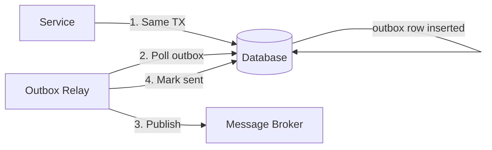

# Exactly-Once Semantics

"We need exactly-once delivery" is one of the most frequently requested and most frequently misunderstood requirements in distributed systems. It sounds obvious — process each message exactly once — but it's remarkably hard to achieve, and the cost depends on *which* layer you want the guarantee at.

---

## The Three Delivery Guarantees

### At-Most-Once
Send the message, don't retry. If it gets lost, it's gone.

```
Producer → Message → Consumer
If consumer crashes: message is lost ✗
```

**When to use:** Fire-and-forget metrics, heartbeats, cache invalidation hints. Losing some events is acceptable; re-processing them would be wrong (e.g., sending a notification twice is worse than not sending it).

### At-Least-Once
Retry until you get an acknowledgment. The consumer may process the message multiple times.

```
Producer → Message → Consumer
Consumer crashes before ACK:
Producer → Message (retry) → Consumer
Consumer processes it again ⚠
```

**When to use:** Most messaging systems default. The application is responsible for handling duplicates (via idempotency).

### Exactly-Once
Process each message exactly once. Neither loss nor duplication.

```
Producer → Message → Consumer
Consumer crashes before ACK:
System ensures message is re-delivered but effect is applied only once ✓
```

**When to use:** Financial transactions, inventory decrements, order processing — any operation where the result of running it twice is different from running it once.

---

## Why It's Hard

Exactly-once requires coordination between three parties: producer, broker, and consumer. Any of them can fail at any time.

```
Scenario: Payment service publishing "charge $100" to Kafka

1. Payment service sends message to Kafka
2. Kafka broker receives and stores it
3. Network drops before ACK reaches producer
4. Producer doesn't know: did Kafka get the message?
5. Producer retries
6. Now the message is in Kafka twice
7. Consumer processes both: customer charged $200 ✗
```

The fundamental problem: **after a failure, you cannot distinguish "message was received" from "message was received and ACK was lost."**

---

## Idempotency: The Foundation

An operation is **idempotent** if applying it multiple times has the same effect as applying it once.

```
Idempotent:
  SET balance = 100   ✓  (running twice still = 100)
  DELETE WHERE id=5   ✓  (second delete finds nothing)

NOT idempotent:
  balance += 100      ✗  (running twice = +200)
  INSERT INTO orders  ✗  (running twice = duplicate row)
```

Making operations idempotent is the most practical path to exactly-once behavior.

### Idempotency Keys

Assign every operation a unique ID. The server stores processed IDs. If it sees the same ID again, return the cached result without reprocessing.

```
POST /payments
{
  "idempotency_key": "pay_usr123_order456_1234567890",
  "amount": 100,
  "currency": "USD"
}
```

**Server behavior:**
```
1. Check: has idempotency_key been processed?
   - Yes: return stored result (no re-processing)
   - No: process, store result with key, return result
```

**Used by:** Stripe (every API call accepts `Idempotency-Key`), Braintree, Twilio.

**Key design:**
- Must be unique per operation attempt (not per user or per session)
- Include enough context: `{user_id}_{order_id}_{timestamp}` or use UUID
- Store with TTL (Stripe keeps keys for 24 hours)

---

## The Transactional Outbox Pattern

The most reliable pattern for publishing events from a service without losing them or duplicating them.

**Problem:** You want to update a database AND publish a message. What if the DB commits but the message publish fails? Or the message publishes but the DB rolls back?

```
// WRONG — can publish without DB commit, or DB commit without publishing
db.update(order)        // step 1
messageQueue.publish()  // step 2 — what if this crashes?
```

**Solution:** Write the message to an **outbox table** in the same transaction as the business data. A separate process reads the outbox and publishes.



```sql
BEGIN;
  UPDATE orders SET status = 'confirmed' WHERE id = 123;
  INSERT INTO outbox (id, topic, payload, created_at)
    VALUES (gen_random_uuid(), 'order.confirmed',
            '{"order_id": 123}', NOW());
COMMIT;
```

The outbox relay (e.g., Debezium reading the WAL, or a polling job):
1. Reads unprocessed outbox rows
2. Publishes to Kafka/RabbitMQ
3. Marks rows as published (or deletes them)

**Guarantees:** At-least-once delivery to the broker. The broker must be idempotent or the consumer must deduplicate.

**Used by:** Any service doing event-driven architecture correctly. Debezium + CDC (Change Data Capture) is the most common implementation.

---

## Kafka Exactly-Once

Kafka introduced **exactly-once semantics (EOS)** in version 0.11 (2017). It covers:

### 1. Idempotent Producer

Prevents duplicates between producer and broker caused by retries.

```
Producer sends: msg(seq=1, data=X)
Network drop before ACK
Producer retries: msg(seq=1, data=X)
Broker deduplicates: "already saw seq=1 from this producer" → ignores ✓
```

Each producer gets a **PID (Producer ID)**. Each message has a sequence number. The broker maintains state per (PID, partition) and deduplicates.

Enable:
```java
props.put("enable.idempotence", "true");
```

### 2. Transactions

Allows atomically writing to multiple partitions and topics.

```java
producer.initTransactions();
producer.beginTransaction();
producer.send(new ProducerRecord<>("orders", orderId, "confirmed"));
producer.send(new ProducerRecord<>("notifications", userId, "order_confirmed"));
producer.commitTransaction();  // atomic — either both land or neither
```

**Transaction coordinator:** A special Kafka broker component that manages transaction state using a `__transaction_state` internal topic.

### 3. Exactly-Once in Kafka Streams

The full end-to-end guarantee: **read-process-write** atomically.

```
Consumer reads msg from input topic
Consumer processes (transforms, enriches)
Producer writes to output topic
Consumer commits offset
All four steps are atomic — either all happen or none
```

```java
props.put("processing.guarantee", "exactly_once_v2");
```

**Cost:** ~20% throughput reduction vs at-least-once. Higher latency. Only guarantees exactly-once *within the Kafka ecosystem* — downstream systems (databases, external APIs) need their own idempotency.

---

## Exactly-Once Across Different Layers

| Layer | Mechanism | Cost |
|-------|-----------|------|
| **Producer → Broker** | Idempotent producer (sequence numbers) | Low |
| **Broker durability** | Replication + acks=all | Medium |
| **Consumer → Application** | Idempotency keys + deduplication | Medium |
| **Application → Database** | Transactional outbox or DB transactions | Medium |
| **End-to-end (Kafka Streams)** | Transactions + atomic offset commits | High |
| **Cross-service** | Saga pattern + compensating transactions | Very high |

---

## Practical Patterns

### Deduplication Table

```sql
CREATE TABLE processed_events (
  event_id UUID PRIMARY KEY,
  processed_at TIMESTAMP DEFAULT NOW()
);

-- On message receive:
INSERT INTO processed_events (event_id) VALUES ($1)
ON CONFLICT (event_id) DO NOTHING
RETURNING *;
-- If nothing returned: already processed, skip
-- If row returned: process and commit atomically
```

### Conditional Update (Compare-and-Swap)

```sql
-- Only apply if we haven't already applied this version
UPDATE orders
SET status = 'shipped', version = version + 1
WHERE id = $1 AND version = $expected_version;

-- If 0 rows affected: already processed (version mismatch) → skip
```

### Fencing with Tokens

```
1. Acquire distributed lock → get token T
2. Perform work with token T
3. Write result with condition: "only if current token is T"
4. Release lock

If lock expires and another process gets token T+1:
Old process's write (with token T) is rejected ✓
```

---

## The Real Answer

True end-to-end exactly-once across network boundaries is **theoretically impossible** in the general case (for the same reasons as [FLP](/system-design/distributed-systems/flp-impossibility)). What systems provide is:

1. **Idempotent operations** — safe to retry, same result
2. **Deduplication** — detect and discard duplicates
3. **Atomic transactions** — within a single system boundary

When someone says "exactly-once," they usually mean "at-least-once delivery with idempotent processing." That's achievable, practical, and what you should build. True "the effect happens exactly once regardless of failures" requires a transaction coordinator and is only practical within a single system boundary (like Kafka Streams).
