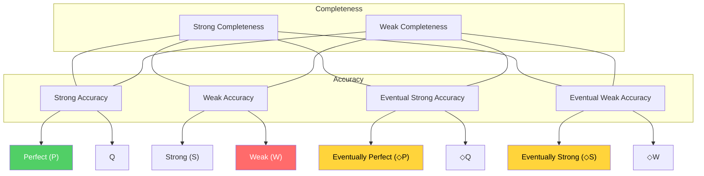
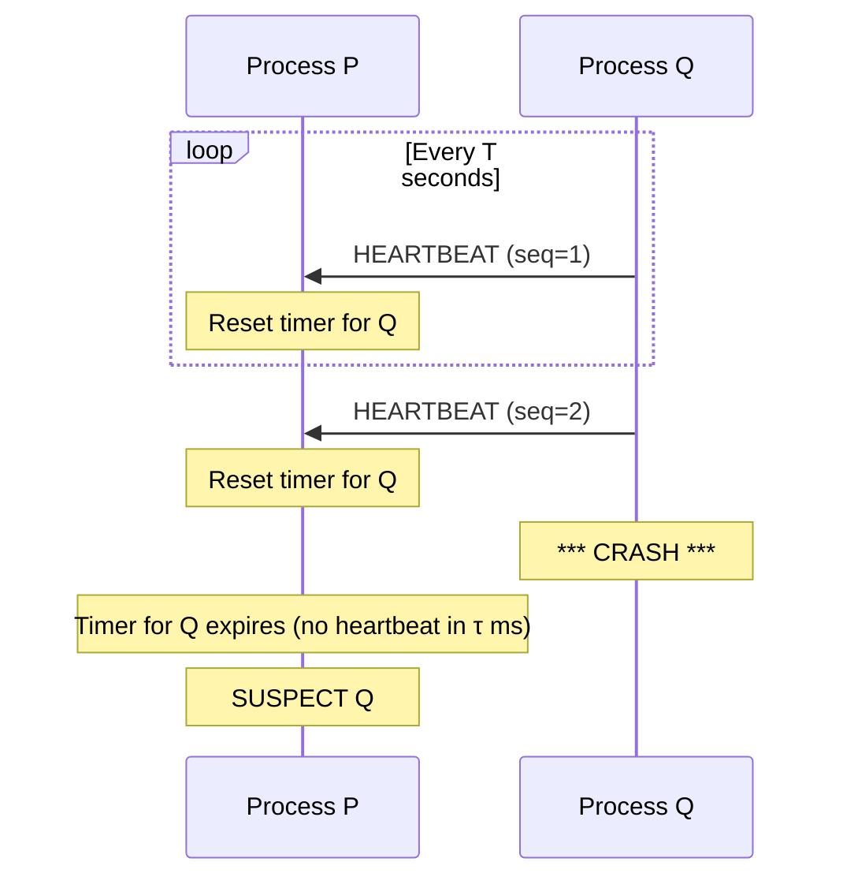
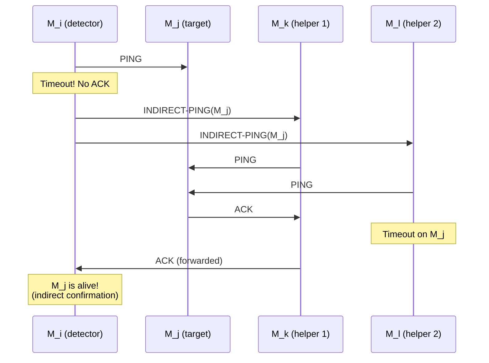

# Failure Detectors

How do you know if a remote process is dead? You send it a message. It doesn't respond. Is it dead? Or is the network slow? Or is the process overloaded, about to respond in 3 seconds? This seemingly simple question — "is it dead?" — is actually **impossible** to answer correctly in an asynchronous distributed system. This impossibility result is one of the most important theorems in computer science, and the entire field of failure detectors exists to work around it.

## Why It Exists

### The Fundamental Problem

In a distributed system, the only way to learn about a remote process is through messages. If you send a message and get no reply, there are exactly two possibilities:

1. **The process has crashed** — it will never respond
2. **The process is slow or the network is slow** — it will respond eventually

There is no way to distinguish these cases in finite time. Any timeout you choose is arbitrary: too short and you falsely declare live processes dead (false positive); too long and you waste time waiting for dead processes (slow detection).

This isn't an engineering limitation to be solved with better hardware. It is a **proven mathematical impossibility**.

### Why Correct Failure Detection Matters

Getting failure detection wrong has consequences:

- **False positive (declare alive process as dead):** The system removes a healthy node, rebalances data, triggers unnecessary failovers. If the "dead" node comes back, you have a split-brain scenario
- **False negative (fail to detect a dead process):** Requests pile up waiting for a response that will never come. Timeouts propagate. Latency cascades through the system
- **Slow detection:** A dead node sits in the cluster for minutes, receiving traffic it can't process. Users experience errors

::: info War Story
A large e-commerce platform used a 30-second heartbeat timeout for their service mesh. During a garbage collection pause on one of the primary database nodes, the GC pause lasted 31 seconds. The failure detector declared the node dead. The cluster initiated failover: promoted a replica, redirected traffic, and began re-replicating data. When the GC pause ended and the old primary came back online, both nodes believed they were the primary. Each accepted writes for 47 seconds before the conflict was detected. The result: 2,300 orders with inconsistent state, requiring three days of manual reconciliation. The root cause was not the GC pause — it was a failure detector that could only say "dead" or "alive" with no nuance in between.
:::

## First Principles

### System Model: Synchronous vs. Asynchronous

The theoretical treatment of failure detection begins with the system model:

**Synchronous system:**
- There exists a known upper bound $\Delta$ on message delivery time
- There exists a known upper bound $\Phi$ on process step time
- Failure detection is trivial: if no response arrives within $\Delta + \Phi$, the process is dead

**Asynchronous system:**
- No bound on message delivery time
- No bound on process step time
- Messages can be delayed arbitrarily (but eventually delivered if the sender and receiver are correct)

Real systems are neither purely synchronous nor purely asynchronous. They are **partially synchronous** — most of the time, messages arrive within predictable bounds, but occasionally, delays exceed any fixed bound (GC pauses, network congestion, CPU saturation).

### The FLP Impossibility Result

In 1985, Michael Fischer, Nancy Lynch, and Michael Paterson proved the most important impossibility result in distributed computing:

> **FLP Theorem:** In an asynchronous distributed system where even a single process can crash, there is no deterministic algorithm that solves consensus.

**What is consensus?** All correct processes must agree on a value. More formally, consensus requires three properties:

1. **Agreement** — No two correct processes decide differently
2. **Validity** — If all processes propose the same value $v$, then $v$ is the decided value
3. **Termination** — Every correct process eventually decides

FLP proves that no algorithm can guarantee all three in an asynchronous system with even one faulty process.

### The FLP Proof (Intuition)

The proof constructs an adversarial execution. The key insight:

1. There must exist some initial configuration where the decision could go either way (a **bivalent** configuration). If all initial configurations led to the same decision, the algorithm would be trivially useless (violating validity)

2. From any bivalent configuration, the adversary can always find a way to reach another bivalent configuration — by delaying the right message at the right time

3. Therefore, the algorithm can be kept in a bivalent state forever, never reaching a decision

The crucial step is (2). The adversary exploits the asynchronous model: since there is no upper bound on message delay, the adversary can delay a message from process $p$ for an arbitrarily long time. The other processes cannot distinguish "message delayed" from "process $p$ crashed." If they wait for $p$'s message, they risk waiting forever (violating termination). If they proceed without $p$'s message, the adversary can deliver $p$'s message later, potentially causing disagreement.

$$
\text{Asynchrony} + \text{Crash failures} \implies \neg\text{Consensus}
$$

### Why FLP Matters Practically

FLP seems to say "consensus is impossible," but Paxos, Raft, and ZooKeeper solve consensus every day. The resolution:

1. **FLP assumes pure asynchrony.** Real systems are partially synchronous — timeouts work most of the time
2. **FLP proves impossibility for deterministic algorithms.** Randomized algorithms (like Ben-Or's) can solve consensus with probability 1
3. **FLP assumes guaranteed termination.** If you allow algorithms that might not terminate in pathological scenarios (but always terminate in practice), you can solve consensus

**Failure detectors** are the theoretical framework for understanding option (1) — they formalize what assumptions about timing are needed to make consensus solvable.

## Core Mechanics: Unreliable Failure Detectors

### Chandra-Toueg Framework (1996)

Tushar Deepak Chandra and Sam Toueg introduced the concept of **unreliable failure detectors** — oracles that provide (possibly incorrect) hints about which processes have crashed. They showed that even imperfect failure information is sufficient to solve consensus.

A failure detector $\mathcal{D}$ is a distributed oracle. Each process $p$ has a local module of $\mathcal{D}$ that maintains a set $\text{suspected}_p$ — the set of processes that $p$ currently suspects have crashed. This set can change over time and can be wrong.

### Completeness and Accuracy

Failure detectors are classified along two dimensions:

**Completeness** — do we eventually suspect all crashed processes?

| Property | Definition |
|----------|-----------|
| **Strong completeness** | Eventually, every crashed process is permanently suspected by **every** correct process |
| **Weak completeness** | Eventually, every crashed process is permanently suspected by **some** correct process |

**Accuracy** — do we avoid falsely suspecting correct processes?

| Property | Definition |
|----------|-----------|
| **Strong accuracy** | No correct process is **ever** suspected |
| **Weak accuracy** | **Some** correct process is **never** suspected |
| **Eventual strong accuracy** | After some time $T$, no correct process is suspected |
| **Eventual weak accuracy** | After some time $T$, some correct process is never suspected |

### The Eight Failure Detector Classes

Combining completeness and accuracy yields eight classes:



### The Key Result: $\diamondsuit S$ Is Sufficient for Consensus

Chandra and Toueg proved two landmark results:

1. **$\diamondsuit S$ (Eventually Strong) is the weakest failure detector that can solve consensus** in asynchronous systems with crash failures and a majority of correct processes
2. **$\Omega$ (the leader oracle)** — which outputs a single process ID, and eventually all correct processes output the same correct process — is equivalent to $\diamondsuit S$ for solving consensus

This means: to solve consensus, you need a failure detector that eventually:
- Suspects all crashed processes (eventual completeness)
- Stops falsely suspecting at least one correct process (eventual weak accuracy)

This is remarkably weak. The failure detector can make arbitrarily many mistakes for an arbitrarily long time. It just needs to eventually get its act together.

$$
\diamondsuit S + \text{majority correct} \implies \text{Consensus solvable}
$$

### Reducibility Between Failure Detectors

The eight classes form a hierarchy:

$$
\mathcal{P} \succeq \mathcal{S} \succeq \diamondsuit\mathcal{S} \succeq \diamondsuit\mathcal{W}
$$

where $\mathcal{A} \succeq \mathcal{B}$ means "a failure detector of class $\mathcal{A}$ can be transformed into one of class $\mathcal{B}$."

Also: weak completeness can be transformed into strong completeness by having processes gossip their suspicions. If process $p$ suspects process $q$, it tells everyone. So for practical purposes, we only need to distinguish accuracy properties.

## Core Mechanics: Heartbeat-Based Detection

### The Basic Protocol

The simplest practical failure detector:

1. Every process sends a **heartbeat** message to its neighbors every $T$ seconds
2. If process $p$ doesn't receive a heartbeat from process $q$ within a timeout $\tau$, $p$ suspects $q$
3. If $p$ later receives a heartbeat from $q$, $p$ un-suspects $q$



### Choosing the Timeout

The timeout $\tau$ must balance two goals:

- **Small $\tau$**: Detect failures quickly, but more false positives (falsely suspect slow processes)
- **Large $\tau$**: Fewer false positives, but slow detection

For a system where message delay $D$ follows a distribution with mean $\mu$ and standard deviation $\sigma$:

$$
\tau = \mu + k\sigma
$$

where $k$ is a parameter controlling the trade-off. $k = 3$ means approximately 99.7% of legitimate heartbeats arrive before the timeout (assuming normal distribution).

**Problems with fixed timeouts:**
- Network conditions change over time
- Different process pairs may have different latencies
- Sudden load spikes can cause temporary delays that exceed $\tau$

### Adaptive Timeout (TCP-Style)

Inspired by TCP's retransmission timeout calculation:

$$
\text{SRTT}_{n+1} = (1 - \alpha) \cdot \text{SRTT}_n + \alpha \cdot \text{RTT}_n
$$

$$
\text{RTTVAR}_{n+1} = (1 - \beta) \cdot \text{RTTVAR}_n + \beta \cdot |\text{SRTT}_n - \text{RTT}_n|
$$

$$
\tau_{n+1} = \text{SRTT}_{n+1} + 4 \cdot \text{RTTVAR}_{n+1}
$$

where:
- $\text{SRTT}$ = smoothed round-trip time
- $\text{RTTVAR}$ = round-trip time variation
- $\alpha = 1/8$, $\beta = 1/4$ (standard values from RFC 6298)
- $\text{RTT}_n$ = measured arrival time of the $n$-th heartbeat

This adapts to changing network conditions but still produces a binary output: suspected or not.

## Core Mechanics: The Phi Accrual Failure Detector

### The Key Insight

Hayashibara, Défago, Yared, and Katayama (2004) observed that the binary "suspected/not-suspected" output of traditional failure detectors loses information. A process that missed one heartbeat by 1ms is in the same state as one that missed 10 heartbeats. This is absurd.

The **phi accrual failure detector** outputs a **suspicion level** $\phi$ — a continuous value indicating how suspicious the silence is. Higher $\phi$ means more likely the process has crashed.

### How It Works

The detector maintains a sliding window of inter-arrival times of heartbeats from each monitored process.

**Step 1: Collect samples**

Let $\{t_1, t_2, \ldots, t_n\}$ be the last $n$ heartbeat inter-arrival times. Compute:

$$
\mu = \frac{1}{n}\sum_{i=1}^{n} t_i \qquad \sigma^2 = \frac{1}{n}\sum_{i=1}^{n}(t_i - \mu)^2
$$

**Step 2: Model the distribution**

Assume heartbeat inter-arrival times follow a normal distribution $\mathcal{N}(\mu, \sigma^2)$. (The original paper also considers the exponential distribution; Cassandra uses the normal distribution.)

**Step 3: Compute $\phi$**

When the current time is $t_{\text{now}}$ and the last heartbeat arrived at $t_{\text{last}}$, the time since last heartbeat is:

$$
\Delta t = t_{\text{now}} - t_{\text{last}}
$$

The probability that a heartbeat would be **this late or later** if the process is alive:

$$
P(\text{delay} \geq \Delta t) = 1 - F(\Delta t) = 1 - \Phi\left(\frac{\Delta t - \mu}{\sigma}\right)
$$

where $\Phi$ is the CDF of the standard normal distribution.

The suspicion level is defined as:

$$
\phi = -\log_{10}\left(1 - \Phi\left(\frac{\Delta t - \mu}{\sigma}\right)\right)
$$

### Interpreting $\phi$

| $\phi$ value | $P(\text{alive})$ | Interpretation |
|-------------|-------------------|----------------|
| 0 | ~100% | Heartbeat expected soon, nothing unusual |
| 1 | ~90% | Slightly late, probably fine |
| 3 | ~99.9% | Quite late, suspicious |
| 5 | ~99.999% | Very suspicious |
| 8 | ~99.999999% | Almost certainly dead |
| 12 | ~$10^{-12}$ | Dead |

The application sets a **threshold** $\phi_{\text{threshold}}$. When $\phi > \phi_{\text{threshold}}$, the process is considered failed. Different applications can use different thresholds:

- Cassandra uses $\phi_{\text{threshold}} = 8$ by default
- Applications tolerant of false positives might use $\phi_{\text{threshold}} = 3$
- Mission-critical applications might use $\phi_{\text{threshold}} = 12$

### Why $\phi$ Is Better Than Timeouts

1. **Self-tuning** — The window of inter-arrival times automatically tracks changes in network conditions
2. **Calibrated** — $\phi = 8$ means the same thing regardless of the network (the probability of a false positive is $10^{-8}$)
3. **Application-configurable** — Different parts of the application can use different thresholds from the same detector
4. **Smooth degradation** — As network conditions worsen, $\phi$ increases gradually instead of suddenly flipping from "alive" to "dead"

### Mathematical Properties

The phi accrual detector satisfies:

$$
\lim_{\Delta t \to \infty} \phi(\Delta t) = \infty
$$

If a process is truly dead, $\phi$ grows without bound (eventually exceeds any threshold — strong completeness).

$$
P(\phi > \phi_{\text{threshold}} \mid \text{process alive}) = 10^{-\phi_{\text{threshold}}}
$$

The probability of a false positive is exponentially small in the threshold (parametric accuracy).

## TypeScript Implementation

```typescript
// Phi Accrual Failure Detector Implementation

interface PhiAccrualConfig {
  /** Number of inter-arrival samples to keep */
  windowSize: number;
  /** Minimum standard deviation to avoid division issues (ms) */
  minStdDeviation: number;
  /** Initial inter-arrival time estimate when no data (ms) */
  initialHeartbeatInterval: number;
  /** Phi threshold above which a node is considered down */
  threshold: number;
  /** Maximum number of missed intervals before forced suspicion */
  maxSampleSize: number;
}

const DEFAULT_CONFIG: PhiAccrualConfig = {
  windowSize: 1000,
  minStdDeviation: 100,
  initialHeartbeatInterval: 500,
  threshold: 8,
  maxSampleSize: 200,
};

class ArrivalWindow {
  private intervals: number[] = [];
  private readonly maxSize: number;
  private mean: number = 0;
  private variance: number = 0;
  private count: number = 0;

  constructor(maxSize: number) {
    this.maxSize = maxSize;
  }

  /**
   * Record a new inter-arrival interval.
   * Uses Welford's online algorithm for numerically stable
   * mean and variance computation.
   */
  record(interval: number): void {
    if (this.intervals.length >= this.maxSize) {
      // Remove oldest and adjust running stats
      this.intervals.shift();
    }
    this.intervals.push(interval);
    this.count++;

    // Recompute mean and variance from scratch for accuracy
    // (Welford's with window removal is tricky; full recompute
    // is fine for window sizes < 1000)
    const n = this.intervals.length;
    this.mean = this.intervals.reduce((a, b) => a + b, 0) / n;
    this.variance =
      this.intervals.reduce((sum, val) => sum + (val - this.mean) ** 2, 0) / n;
  }

  getMean(): number {
    return this.mean;
  }

  getStdDev(minValue: number): number {
    return Math.max(Math.sqrt(this.variance), minValue);
  }

  getSampleCount(): number {
    return this.intervals.length;
  }
}

class HeartbeatHistory {
  private lastHeartbeatTime: number | null = null;
  private readonly window: ArrivalWindow;
  private readonly config: PhiAccrualConfig;

  constructor(config: PhiAccrualConfig) {
    this.config = config;
    this.window = new ArrivalWindow(config.windowSize);
  }

  recordHeartbeat(timestamp: number): void {
    if (this.lastHeartbeatTime !== null) {
      const interval = timestamp - this.lastHeartbeatTime;
      if (interval > 0) {
        this.window.record(interval);
      }
    }
    this.lastHeartbeatTime = timestamp;
  }

  getLastHeartbeatTime(): number | null {
    return this.lastHeartbeatTime;
  }

  /**
   * Compute the phi value for the given timestamp.
   *
   * phi = -log10(1 - CDF(timeSinceLastHeartbeat))
   *
   * where CDF is the cumulative distribution function of
   * the normal distribution with parameters estimated from
   * the arrival window.
   */
  phi(currentTime: number): number {
    if (this.lastHeartbeatTime === null) {
      return 0; // No data yet, cannot compute
    }

    const timeSinceLast = currentTime - this.lastHeartbeatTime;

    const mean =
      this.window.getSampleCount() > 0
        ? this.window.getMean()
        : this.config.initialHeartbeatInterval;

    const stdDev = this.window.getStdDev(this.config.minStdDeviation);

    return this.computePhi(timeSinceLast, mean, stdDev);
  }

  private computePhi(
    timeSinceLast: number,
    mean: number,
    stdDev: number
  ): number {
    // Compute the probability of observing a delay >= timeSinceLast
    // assuming normal distribution N(mean, stdDev^2)
    const y = (timeSinceLast - mean) / stdDev;
    const probability = 1.0 - this.normalCDF(y);

    // phi = -log10(probability)
    // Clamp probability to avoid -log10(0) = Infinity
    const clampedProbability = Math.max(probability, 1e-15);
    return -Math.log10(clampedProbability);
  }

  /**
   * Approximation of the standard normal CDF using
   * Abramowitz and Stegun formula 7.1.26.
   * Maximum error: 1.5 × 10^-7
   */
  private normalCDF(x: number): number {
    if (x < -8.0) return 0.0;
    if (x > 8.0) return 1.0;

    // Constants for the approximation
    const a1 = 0.254829592;
    const a2 = -0.284496736;
    const a3 = 1.421413741;
    const a4 = -1.453152027;
    const a5 = 1.061405429;
    const p = 0.3275911;

    const sign = x < 0 ? -1 : 1;
    const absX = Math.abs(x);

    const t = 1.0 / (1.0 + p * absX);
    const y =
      1.0 -
      ((((a5 * t + a4) * t + a3) * t + a2) * t + a1) *
        t *
        Math.exp(-absX * absX / 2) /
        Math.sqrt(2 * Math.PI);

    return 0.5 * (1.0 + sign * y);
  }
}

class PhiAccrualFailureDetector {
  private readonly config: PhiAccrualConfig;
  private readonly histories: Map<string, HeartbeatHistory> = new Map();
  private readonly listeners: Array<(nodeId: string, phi: number, isDown: boolean) => void> = [];

  constructor(config: Partial<PhiAccrualConfig> = {}) {
    this.config = { ...DEFAULT_CONFIG, ...config };
  }

  /**
   * Record a heartbeat from a node.
   */
  heartbeat(nodeId: string, timestamp: number = Date.now()): void {
    let history = this.histories.get(nodeId);
    if (!history) {
      history = new HeartbeatHistory(this.config);
      this.histories.set(nodeId, history);
    }
    history.recordHeartbeat(timestamp);
  }

  /**
   * Get the current phi value for a node.
   */
  phi(nodeId: string, currentTime: number = Date.now()): number {
    const history = this.histories.get(nodeId);
    if (!history) {
      return 0; // Unknown node, no suspicion
    }
    return history.phi(currentTime);
  }

  /**
   * Check if a node is considered down.
   */
  isAvailable(nodeId: string, currentTime: number = Date.now()): boolean {
    return this.phi(nodeId, currentTime) < this.config.threshold;
  }

  /**
   * Get all nodes and their current status.
   */
  getNodeStatuses(currentTime: number = Date.now()): Map<string, {
    phi: number;
    isAvailable: boolean;
    lastHeartbeat: number | null;
  }> {
    const statuses = new Map();
    for (const [nodeId, history] of this.histories) {
      const phiValue = history.phi(currentTime);
      statuses.set(nodeId, {
        phi: phiValue,
        isAvailable: phiValue < this.config.threshold,
        lastHeartbeat: history.getLastHeartbeatTime(),
      });
    }
    return statuses;
  }

  /**
   * Register a listener for failure detection events.
   */
  onSuspicionChange(
    callback: (nodeId: string, phi: number, isDown: boolean) => void
  ): void {
    this.listeners.push(callback);
  }

  /**
   * Run a monitoring cycle: check all nodes and notify listeners.
   */
  monitor(currentTime: number = Date.now()): void {
    for (const [nodeId] of this.histories) {
      const phiValue = this.phi(nodeId, currentTime);
      const isDown = phiValue >= this.config.threshold;
      for (const listener of this.listeners) {
        listener(nodeId, phiValue, isDown);
      }
    }
  }

  remove(nodeId: string): void {
    this.histories.delete(nodeId);
  }
}

// ─── Simulation ─────────────────────────────────────────────────

function runPhiAccrualSimulation(): void {
  console.log('=== Phi Accrual Failure Detector Simulation ===\n');

  const detector = new PhiAccrualFailureDetector({
    threshold: 8,
    windowSize: 100,
    minStdDeviation: 50,
    initialHeartbeatInterval: 1000,
  });

  // Register listener
  detector.onSuspicionChange((nodeId, phi, isDown) => {
    const status = isDown ? '*** SUSPECTED DOWN ***' : 'OK';
    console.log(`  [Monitor] ${nodeId}: phi=${phi.toFixed(2)} ${status}`);
  });

  let time = 0;

  // Simulate Node A: healthy, regular heartbeats ~1000ms apart
  console.log('--- Phase 1: Regular heartbeats from Node A ---');
  for (let i = 0; i < 20; i++) {
    time += 1000 + Math.random() * 100 - 50; // 950-1050ms
    detector.heartbeat('NodeA', time);
  }
  detector.monitor(time);

  // Simulate Node B: irregular heartbeats ~1000ms with high variance
  console.log('\n--- Phase 2: Irregular heartbeats from Node B ---');
  time = 0;
  for (let i = 0; i < 20; i++) {
    time += 1000 + Math.random() * 600 - 300; // 700-1300ms
    detector.heartbeat('NodeB', time);
  }
  detector.monitor(time);

  // Now simulate Node A going silent (crash)
  console.log('\n--- Phase 3: Node A stops heartbeating (crash) ---');
  const lastHeartbeat = 20000;
  for (let elapsed = 1000; elapsed <= 10000; elapsed += 1000) {
    const checkTime = lastHeartbeat + elapsed;
    const phi = detector.phi('NodeA', checkTime);
    console.log(
      `  t+${elapsed}ms: phi=${phi.toFixed(2)} ` +
      `available=${detector.isAvailable('NodeA', checkTime)}`
    );
  }

  // Compare: how long until each node is detected as failed
  console.log('\n--- Phase 4: Detection time comparison ---');
  console.log('  Node A (low variance): detected faster');
  console.log('  Node B (high variance): detected slower');
  console.log('  This is correct! High variance means longer silences are normal.');
}

runPhiAccrualSimulation();
```

## Edge Cases and Failure Modes

### Byzantine Failures

All the failure detectors discussed so far assume **crash-stop** failures: a process either works correctly or stops entirely. **Byzantine** failures are far worse — a process can send arbitrary, malicious messages.

With Byzantine failures:
- A process can send heartbeats while producing wrong results
- A process can send heartbeats to some monitors but not others
- A process can forge heartbeats on behalf of other processes

Byzantine failure detection requires fundamentally different approaches:
- **Challenge-response protocols** — Send a computation challenge; verify the response
- **Cross-checking** — Compare outputs of multiple processes
- **Reputation systems** — Track historical accuracy

### Partial Failures

In cloud environments, a process might be "partially failed":
- Able to send heartbeats but unable to process requests (e.g., out of memory for application data but not for the heartbeat thread)
- Network interface partially failed (can reach some nodes but not others)
- Disk failed but process still running in memory

Heartbeat-based detectors miss partial failures. Solutions:
- **Application-level health checks** — The heartbeat includes a small computation or database query
- **Liveness vs. readiness probes** — Kubernetes distinguishes between "process is alive" (liveness) and "process can serve requests" (readiness)
- **Deep health checks** — Verify not just that the process responds, but that it responds correctly

### Gray Failures

A "gray failure" occurs when a component's failure is **observable by some but not all** observers. Example:
- Node A can reach Node C
- Node B cannot reach Node C
- A and B disagree about whether C is alive

This is particularly insidious because:
- A sees C as healthy and continues sending it traffic
- B sees C as failed and triggers failover
- The system is in an inconsistent state

Detection strategies:
- **Multi-probe detection** — Multiple monitors probe each node from different network paths
- **Consensus on failure** — Require a quorum of monitors to agree before declaring failure
- **Indirect monitoring** — A monitors B's perception of C (gossip-based approach)

### Clock Skew

If the failure detector uses timestamps, clock skew between nodes can cause:
- Heartbeats appearing to arrive in the future (negative inter-arrival time)
- Heartbeats appearing much more delayed than they actually are

The phi accrual detector is particularly vulnerable because it computes inter-arrival statistics. A clock jump on the monitored node can corrupt the arrival window.

Mitigation: use monotonic clocks (not wall clocks) for local time measurements, and measure inter-arrival times locally (the monitoring node's clock only).

## Performance Analysis

### Detection Time vs. False Positive Rate

For a heartbeat-based detector with interval $T$ and timeout multiplier $k$:

$$
\text{Detection time} = T + kT = T(1 + k)
$$

$$
P(\text{false positive per interval}) \approx 1 - \Phi(k) \quad \text{(for normal delays)}
$$

where $\Phi$ is the standard normal CDF.

| $k$ | $P$(false positive) | Detection time (if $T = 1s$) |
|-----|--------------------|-----------------------------|
| 1 | 15.87% | 2s |
| 2 | 2.28% | 3s |
| 3 | 0.13% | 4s |
| 4 | 0.003% | 5s |
| 5 | 0.00003% | 6s |

### Network Overhead

For $n$ nodes with all-to-all heartbeating:

$$
\text{Messages per second} = n(n-1) / T
$$

For $n = 1000$ and $T = 1\text{s}$: $999{,}000$ messages/second. This is prohibitive.

Solutions:
- **Ring topology** — Each node monitors only its neighbors: $O(n)$ messages
- **Random sampling** — Each node monitors $k \ll n$ random peers: $O(kn)$ messages
- **Hierarchical** — Monitor in groups; group leaders monitor each other
- **SWIM** — Combines direct and indirect probing (see below)

### Bandwidth

Each heartbeat message is typically small (< 100 bytes), but at high message rates:

$$
\text{Bandwidth} = \frac{n(n-1)}{T} \times \text{msg\_size}
$$

For $n = 1000$, $T = 1$, msg\_size = 64 bytes:

$$
\text{Bandwidth} = 999{,}000 \times 64 = 63.9 \text{ MB/s}
$$

This is significant — using heartbeats for failure detection in large clusters requires careful topology design.

## Math Foundations

### Modeling Failure Detection Quality

Define the quality of service (QoS) of a failure detector by three metrics (Chen, Toueg, and Aguilera, 2002):

1. **Detection time ($T_D$)** — Time from actual crash to detection
2. **Mistake rate ($\lambda_M$)** — Frequency of false positives (falsely suspecting a correct process)
3. **Mistake duration ($T_M$)** — How long a false suspicion lasts before being corrected

These are related by the heartbeat interval $T$, timeout $\tau$, and message loss probability $p_L$:

$$
T_D \approx T + \frac{\tau}{1 - p_L}
$$

$$
\lambda_M \approx \frac{p_L^{k}}{T}
$$

where $k = \lceil \tau / T \rceil$ is the number of consecutive heartbeats that must be lost to trigger a false suspicion.

$$
T_M \approx T \cdot (1 - p_L)
$$

### The Impossibility Spectrum

The FLP result is one point on a spectrum of impossibility results:

$$
\begin{aligned}
&\text{Synchronous system:} & \text{Consensus solvable with } f < n \\
&\text{Partially synchronous:} & \text{Consensus solvable with } f < n/2 \\
&\text{Asynchronous + } \diamondsuit S: & \text{Consensus solvable with } f < n/2 \\
&\text{Asynchronous (no FD):} & \text{Consensus impossible for } f \geq 1 \\
&\text{Byzantine synchronous:} & \text{Consensus solvable with } f < n/3 \\
&\text{Byzantine asynchronous:} & \text{Consensus impossible for } f \geq 1
\end{aligned}
$$

### Probabilistic Guarantees of Phi Accrual

For the phi accrual detector with threshold $\phi_T$:

$$
P(\text{false suspicion}) = 10^{-\phi_T}
$$

Expected time between false suspicions:

$$
E[T_{\text{between false positives}}] = \frac{T}{10^{-\phi_T}} = T \cdot 10^{\phi_T}
$$

For $T = 1\text{s}$ and $\phi_T = 8$:

$$
E[T_{\text{between false positives}}] = 10^8 \text{ seconds} \approx 3.17 \text{ years}
$$

This is why Cassandra's default of $\phi_T = 8$ is reasonable — a false positive is expected about once every 3 years per monitored node.

## The SWIM Protocol

### Scalable Weakly-consistent Infection-style Membership

SWIM (Das, Gupta, Maniatis, 2002) is a membership and failure detection protocol designed for large-scale clusters. It was adopted by HashiCorp's Serf and Consul (via the memberlist library).

### Problems with Traditional Heartbeating

In a cluster of $n$ nodes with all-to-all heartbeating:
- **Message load:** $O(n^2)$ messages per detection period
- **False positive probability increases with $n$:** With $n$ monitored nodes and false positive probability $p$ per node, the probability of at least one false positive is $1 - (1-p)^n$

SWIM solves both problems.

### SWIM Protocol Mechanics

Each protocol period $T$, a node $M_i$:

1. **Direct probe:** $M_i$ selects a random node $M_j$ and sends a `PING`
2. If $M_j$ responds with `ACK` within a timeout, $M_j$ is alive. Done.
3. **Indirect probe (if direct fails):** $M_i$ selects $k$ random nodes and sends each an `INDIRECT-PING(M_j)` request
4. Each of these $k$ nodes sends a `PING` to $M_j$ and forwards the `ACK` (if received) back to $M_i$
5. If $M_i$ receives no `ACK` (direct or indirect) for $M_j$, $M_i$ marks $M_j$ as **suspect**
6. After a suspect timeout, if no refutation arrives, $M_j$ is declared **failed**



### SWIM Analysis

**Message complexity:** $O(n)$ per detection period. Each node sends one direct probe plus $k$ indirect probes (where $k$ is a constant, typically 3).

**Detection time:** Expected $O(\log n)$ protocol periods to detect and disseminate a failure (using piggyback gossip on PING/ACK messages).

**False positive rate:** The indirect probe mechanism reduces false positives caused by network issues between specific node pairs. If $M_i$ can't reach $M_j$ directly (e.g., due to a localized network issue), the indirect probes through $M_k$ and $M_l$ will likely succeed.

### SWIM Suspicion Mechanism

SWIM introduces a **suspicion sub-protocol** to further reduce false positives:

1. Instead of directly marking a node as failed, mark it as **SUSPECT**
2. Broadcast the suspicion through gossip
3. The suspected node has a window of time to **refute** the suspicion (by sending an `ALIVE` message with a higher incarnation number)
4. Only after the suspicion timer expires without refutation is the node declared **CONFIRM DEAD**

The incarnation number prevents stale suspicions from causing false failures. When a node $M_j$ receives a suspicion about itself, it increments its incarnation number and disseminates an `ALIVE` message. Other nodes accept `ALIVE` messages with higher incarnation numbers, overriding suspicions.

::: info War Story
HashiCorp's Consul uses a modified SWIM protocol (via the `memberlist` library) for cluster membership. In a production deployment with 5,000 nodes across three datacenters, they discovered that SWIM's random probe target selection was causing uneven detection times — nodes that happened to not be selected for probing for several rounds could be unresponsive for up to 30 seconds before being detected. The fix was to use a **round-robin** probe target selection instead of purely random: each node maintains a shuffled list of all other nodes and probes them in order, ensuring every node is probed within $n$ protocol periods. This guarantees a bounded worst-case detection time of $n \cdot T$ instead of the probabilistic $O(\log n)$ expectation.
:::

## Comparison of Failure Detection Strategies

| Strategy | Detection Time | False Positive Rate | Message Complexity | Scalability | Used By |
|----------|---------------|--------------------|--------------------|------------|---------|
| Fixed timeout | $T + \tau$ | Depends on $\tau$ | $O(n^2)$ per period | Poor | Simple systems |
| Adaptive timeout | $T + \tau_{adaptive}$ | Lower than fixed | $O(n^2)$ per period | Poor | TCP |
| Phi accrual | $T + f(\phi_{threshold})$ | $10^{-\phi_{threshold}}$ | $O(n^2)$ per period | Moderate | Cassandra, Akka |
| SWIM | $O(T \cdot \log n)$ expected | Low (indirect probes) | $O(n)$ per period | Excellent | Consul, Serf |
| SWIM + suspicion | $O(T \cdot \log n)$ + suspect timeout | Very low | $O(n)$ per period | Excellent | Consul |
| Hierarchical | Depends on hierarchy | Varies | $O(n)$ per period | Good | ZooKeeper |

## Real-World Implementations

### How Akka Detects Failures

Akka (now Apache Pekko) uses a phi accrual failure detector with:
- Default threshold: $\phi = 10$ (configurable)
- Heartbeat interval: 1 second
- Acceptable heartbeat pause: 3 seconds (accounts for GC pauses)
- Monitoring: each node monitors a configurable number of other nodes (not all-to-all)

Akka also provides a **cluster sharding** rebalance mechanism that uses failure detection to trigger shard rebalancing when nodes join or leave.

### How Cassandra Detects Failures

Cassandra uses the phi accrual failure detector with:
- Default threshold: $\phi = 8$
- Heartbeat arrives via gossip protocol (every 1 second)
- Window size: 1000 samples
- Arrival window is per-node, allowing for different network characteristics to different peers

When a node is suspected:
1. It is marked as DOWN in the gossip state
2. If the node recovers and sends heartbeats again, it is marked UP
3. If the node remains DOWN for a configurable time (default: 10 minutes), a human operator must manually remove it (to prevent data loss from automatic removal)

### How ZooKeeper Detects Failures

ZooKeeper uses a **session-based** failure detection mechanism:

1. Each client maintains a session with the ZooKeeper ensemble
2. The session has a timeout $T$ (configurable, typically 2-20 seconds)
3. The client sends heartbeats (pings) at $T/3$ intervals
4. If the server doesn't receive a heartbeat within $T$, the session expires
5. Session expiration triggers ephemeral node deletion and watch notifications

This is essentially a fixed-timeout heartbeat mechanism, but the server side uses the concept of "session" to provide higher-level semantics (ephemeral nodes, watches).

ZooKeeper's leader election (for the ZooKeeper ensemble itself) uses:
- `tickTime`: base heartbeat interval (default 2000ms)
- `initLimit`: ticks for initial synchronization (followers connecting to leader)
- `syncLimit`: ticks for followers to sync with leader during normal operation
- If a follower doesn't hear from the leader within `syncLimit × tickTime`, it triggers a new election

### How Kubernetes Detects Node Failures

Kubernetes uses a multi-layered approach:

1. **kubelet heartbeats:** Each node's kubelet sends heartbeats to the API server (default: every 10 seconds)
2. **Node controller:** The kube-controller-manager monitors heartbeats. If no heartbeat is received within `node-monitor-grace-period` (default: 40 seconds), the node is marked as `NotReady`
3. **Pod eviction:** After `pod-eviction-timeout` (default: 5 minutes), pods on `NotReady` nodes are evicted (rescheduled elsewhere)

Total time from node failure to pod rescheduling: ~5 minutes 40 seconds by default. This is deliberately conservative to avoid cascading evictions during network blips.

## Decision Framework

### Choosing a Failure Detection Strategy

```
How many nodes?
├── < 50: All-to-all heartbeating is fine
│   ├── Need calibrated false positive rate? → Phi accrual
│   └── Fixed timeout is acceptable? → Adaptive timeout
├── 50 - 5000: Need scalable approach
│   ├── SWIM (O(n) messages, proven at scale)
│   └── Hierarchical (group-based monitoring)
└── > 5000: Hierarchical + SWIM hybrid

What's your priority?
├── Minimize false positives:
│   ├── Phi accrual with high threshold (ϕ ≥ 10)
│   └── SWIM with suspicion sub-protocol
├── Minimize detection time:
│   ├── Aggressive timeout (accept higher false positives)
│   └── Multiple probe paths (SWIM indirect probes)
└── Minimize network overhead:
    └── SWIM (O(n) messages vs O(n²))

What failure model?
├── Crash-stop only:
│   └── Any heartbeat-based approach works
├── Crash-recovery:
│   └── Need incarnation numbers (SWIM) or epoch tracking
├── Omission (messages lost):
│   └── SWIM indirect probes handle this well
└── Byzantine (malicious):
    └── Challenge-response with cryptographic verification
```

### Timeout Configuration Guide

| Environment | Heartbeat Interval | Timeout | Rationale |
|-------------|-------------------|---------|-----------|
| Same rack | 100ms | 500ms | Ultra-low latency, negligible jitter |
| Same datacenter | 500ms - 1s | 2-5s | Low latency, minor jitter |
| Cross-datacenter | 2-5s | 10-30s | Higher latency, more jitter |
| Over internet | 5-10s | 30-60s | High latency, high variance |
| With GC pauses | Interval + max GC | 3× max GC | Must survive worst-case GC |

## Advanced Topics

### Failure Detectors and Consensus

The theoretical importance of failure detectors lies in their relationship to consensus:

**Theorem (Chandra, Hadzilacos, Toueg, 1996):** $\Omega$ is the weakest failure detector for solving consensus in asynchronous systems with a majority of correct processes.

$\Omega$ is the **leader oracle**: it outputs a single process ID, and eventually all correct processes output the same correct process. $\Omega$ is equivalent to $\diamondsuit S$ for solving consensus.

This means every consensus algorithm (Paxos, Raft, Viewstamped Replication) implicitly relies on $\Omega$ — they all have a leader election phase that implements $\Omega$.

**Paxos:** The leader is the proposer. If multiple proposers compete, Paxos may not terminate (livelock). In practice, a leader election protocol (implementing $\Omega$) selects a single proposer.

**Raft:** The leader election mechanism IS the $\Omega$ implementation. Raft's election timeout is a failure detector. When the timeout fires, a follower suspects the leader has crashed and starts a new election.

### Quorum-Based Failure Detection

Instead of each node independently deciding about failures, require a **quorum** of monitors to agree:

$$
\text{Node } N \text{ is declared failed} \iff |\{M : M \text{ suspects } N\}| \geq \lceil(n+1)/2\rceil
$$

Benefits:
- Prevents split-brain caused by network partition between a single monitor and the monitored node
- Reduces false positives from localized network issues
- Provides stronger guarantees (closer to $\diamondsuit P$ than $\diamondsuit S$)

Costs:
- Requires communication between monitors to reach agreement
- Slower detection (must wait for quorum)
- Adds complexity

### Self-Tuning Failure Detectors

Research systems that automatically optimize failure detection:

1. **Machine learning-based:** Train a classifier on historical heartbeat patterns to predict crashes. Features include inter-arrival time statistics, trend direction, and system metrics (CPU, memory, disk)
2. **Workload-aware:** Adjust timeouts based on current system load. During high-load periods, increase timeouts; during low-load periods, decrease them
3. **Network-topology-aware:** Use knowledge of the network topology (same rack, same datacenter, cross-region) to set per-link timeout parameters

### Failure Detection in Serverless

Serverless platforms face unique failure detection challenges:
- Functions are ephemeral — they start, execute, and die. Traditional heartbeating doesn't apply
- Cold starts look like slow responses, not failures
- The platform (not the function) must detect function failures

Serverless platforms use **invocation-level timeout** (each function call has a deadline) combined with **platform-level health checks** (the platform monitors the worker VMs that execute functions).

### Speculative Failure Detection

Instead of waiting to confirm a failure, **speculatively** treat a slow response as a failure and hedge:

1. Send the request to the primary node
2. If no response within $p$-th percentile latency, send the same request to a backup node
3. Use whichever response arrives first

This is not traditional failure detection — it's a latency optimization that treats slow nodes as "effectively failed." Google's "tail at scale" paper describes this approach for reducing tail latency.

$$
P(\text{both slow}) = P(\text{primary slow}) \times P(\text{backup slow}) = p_{tail}^2
$$

For $p_{tail} = 1\%$: $P(\text{both slow}) = 0.01\%$ — a 100x improvement.

### The Relationship Between Failure Detection and Consensus

There is a deep duality between failure detection and consensus:

- Failure detection can be used to **build** consensus ($\diamondsuit S \implies$ consensus possible)
- Consensus can be used to **build** failure detection (agree on who is alive)

This creates a chicken-and-egg problem: you need failure detection to build consensus, but the best failure detection uses consensus. In practice, this is resolved by using weaker, standalone failure detection ($\Omega$, implemented via timeouts and leader election) to bootstrap consensus, and then using consensus for stronger failure detection decisions (like definitive node removal).

::: info War Story
A distributed database team implemented a phi accrual failure detector but set the threshold too low ($\phi = 3$). During a routine network maintenance event that added 200ms of latency to cross-rack communication, the detector declared 40% of the cluster dead. The remaining nodes tried to take over the responsibilities of the "dead" nodes, overloading themselves and causing actual failures. The cascading failure took down the entire cluster for 45 minutes. The post-mortem revealed that $\phi = 3$ corresponds to a false positive probability of only $10^{-3}$ per check — with 1000 checks per second across all node pairs, this means approximately one false positive per second. The team raised the threshold to $\phi = 8$ ($10^{-8}$ probability) and implemented a mandatory "confirmation delay" where a node must be suspected for at least 10 seconds before any recovery action is taken. No similar incident has occurred since.
:::

### Failure Detectors Beyond Crash Failures

The classical theory focuses on crash failures, but modern systems face richer failure modes:

| Failure Mode | Detection Approach | Example |
|-------------|-------------------|---------|
| Crash-stop | Heartbeat timeout | Process terminates |
| Crash-recovery | Heartbeat + epoch number | Process restarts |
| Omission | Indirect probing | Dropped packets |
| Timing | Statistical analysis | Slow responses |
| Performance | Latency monitoring | Degraded throughput |
| Byzantine | Challenge-response + voting | Corrupted responses |
| Gray | Multi-observer correlation | Partial reachability |

Each failure mode requires specialized detection mechanisms. Production systems typically layer multiple detectors:

1. **L1 — Network liveness:** Can we reach the node at all? (ICMP ping, TCP connect)
2. **L2 — Process liveness:** Is the application process running? (Heartbeat response)
3. **L3 — Functional liveness:** Can the process serve requests? (Health check endpoint)
4. **L4 — Correctness liveness:** Is the process producing correct results? (Semantic health check)

A node might pass L1-L3 but fail L4 (producing wrong results due to data corruption). A comprehensive failure detection strategy checks all levels.

## Key Takeaways

Failure detection in distributed systems is fundamentally constrained by the FLP impossibility result — in a purely asynchronous system, you cannot reliably distinguish a dead process from a slow one. The Chandra-Toueg framework provides the theoretical foundation for understanding what kinds of imperfect failure detection are sufficient for solving consensus.

In practice, the choice comes down to: phi accrual detectors for calibrated suspicion levels with tunable false positive rates, SWIM for scalable detection in large clusters, and application-specific health checks for detecting partial and gray failures. The most robust production systems layer multiple detection mechanisms, use conservative timeouts with gradual escalation, and never take irreversible action (like permanent node removal) based on a single failure detector's output.
