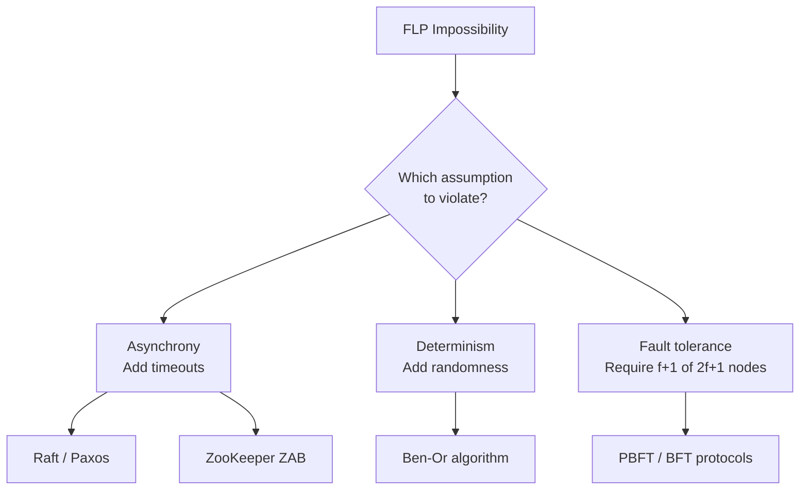

# FLP Impossibility

In 1985, Fischer, Lynch, and Paterson published a two-page proof that shook the foundations of distributed systems theory. It proved something deeply uncomfortable: **in a purely asynchronous distributed system, no deterministic algorithm can solve consensus if even a single process might fail.**

This is not a statement about bad implementations. It's a mathematical proof about what is *possible*. Every consensus protocol you've ever used — Raft, Paxos, ZooKeeper's ZAB — exists in spite of this theorem, not ignorant of it.

---

## What is Consensus?

Consensus requires all non-faulty processes to agree on a single value, where:

1. **Validity** — The agreed value must have been proposed by some process
2. **Agreement** — No two non-faulty processes decide different values
3. **Termination** — Every non-faulty process eventually decides

Sounds simple. FLP proves it's impossible under one specific model.

---

## The Asynchronous Model

The theorem applies specifically to the **asynchronous message-passing model**:

- Processes communicate by sending messages
- Messages are eventually delivered but with **no upper bound on delay**
- Processes run at **arbitrary speeds** — no shared clock
- A process can **crash-stop** (halt silently, never restart)
- You cannot distinguish a crashed process from a very slow one

This last point is the crux. In a real network, a 10-second silence from a node could mean:
- The node crashed
- The network partition
- The node is just very slow under load

You cannot tell. This is the asymmetry FLP exploits.

---

## The Proof Intuition

The full proof uses a *bivalent configuration* argument. Here's the intuition without the formalism:

**Setup:** Imagine a consensus algorithm trying to decide 0 or 1. The system starts in some initial configuration.

**Bivalent vs Univalent:**
- A configuration is **univalent** if the outcome is already determined (0-valent or 1-valent)
- A configuration is **bivalent** if the outcome depends on future message ordering

**The argument:**
1. There always exists a bivalent initial configuration (some starting states are undecided)
2. From any bivalent configuration, you can always find a "critical step" where delaying one message keeps the system bivalent
3. A crashed process is indistinguishable from a delayed one
4. Therefore: an adversary who controls message delivery can always delay the one message that would force a decision — keeping the system bivalent forever
5. The algorithm never terminates

The adversary doesn't need to do anything malicious. It just needs to delay one message indefinitely — something the model explicitly allows.

---

## What FLP Actually Says

| Claim | Correct? |
|-------|----------|
| "You can never build a consensus algorithm" | ❌ No |
| "You can never build a *deterministic* consensus algorithm in a *purely async* model with *any* failures" | ✅ Yes |
| "Raft and Paxos violate FLP" | ❌ No — they escape it |
| "FLP means distributed systems are broken" | ❌ No — it means you must accept trade-offs |

---

## How Real Systems Escape FLP

Since the theorem is a proof about a specific model, real systems escape it by **stepping outside the model**:

### 1. Timeouts (Partial Synchrony)
Raft and Paxos use election timeouts. A candidate waits a random duration — if no heartbeat, assume the leader crashed and start an election.

This is not purely asynchronous. It assumes messages arrive within *some* bound. The system is **partially synchronous** — and FLP doesn't apply.

```
FLP world:    "Messages take arbitrarily long"
Raft world:   "Messages usually arrive within 150ms; if not, assume failure"
```

### 2. Randomization
Ben-Or's randomized consensus algorithm introduces coin flips. Because the adversary can't predict random choices, the "keep it bivalent forever" strategy fails with probability 1.

FLP applies only to **deterministic** algorithms. Randomization sidesteps it.

### 3. Failure Detectors
Chandra and Toueg showed that with an *unreliable failure detector* (a service that suspects crashed processes, possibly incorrectly), consensus becomes solvable. You trade mathematical certainty for an oracle that's usually right.

ZooKeeper, etcd, and Consul all use failure detectors (heartbeats with timeouts) for this reason.

---

## Practical Implications

Every consensus system you use has made an explicit choice about which FLP assumption to violate:



**Raft:** Uses randomized election timeouts (sidesteps both asynchrony and determinism)

**Paxos:** Uses timeouts + quorums

**ZooKeeper:** Uses heartbeats (timeouts) + majority quorums

**Cassandra (leaderless):** Doesn't do consensus per-write; uses eventual consistency + read repair (sidesteps the problem entirely by relaxing the agreement requirement)

---

## The CAP Connection

FLP and CAP are related but distinct:

| Theorem | Model | Says |
|---------|-------|------|
| **FLP** | Asynchronous, crash-stop failures | Consensus is *impossible* (termination) |
| **CAP** | Network partitions | Choose 2 of: Consistency, Availability, Partition Tolerance |

CAP is about trade-offs during partitions. FLP is about fundamental impossibility even without partitions. A system can satisfy CAP's CP guarantee while still being affected by FLP — consensus still requires escaping the async model.

---

## Why This Matters in Practice

You will never write a FLP proof. But FLP explains why:

- **Leader election takes time** — the system can't instantly agree on a new leader
- **Split-brain is possible** — two nodes can simultaneously believe they're the leader during a partition
- **"Strong consistency" has a latency cost** — waiting for quorum acknowledgment is the cost of escaping FLP
- **Timeouts are fundamental, not a hack** — they are the mechanism by which real systems add the partial synchrony that FLP's model lacks

Every time you tune an election timeout, set a replication factor, or choose between CP and AP in your database, you are navigating the consequences of Fischer, Lynch, and Paterson's 1985 proof.

---

## Further Reading

- [Original FLP Paper (1985)](https://dl.acm.org/doi/10.1145/3149.214121) — 2 pages, worth reading
- [Consensus on Transaction Commit — Gray & Lamport](https://dl.acm.org/doi/10.1145/1132863.1132867)
- [Unreliable Failure Detectors — Chandra & Toueg](https://dl.acm.org/doi/10.1145/226643.226647)
- [Raft paper](https://raft.github.io/raft.pdf) — see how it sidesteps FLP in practice
