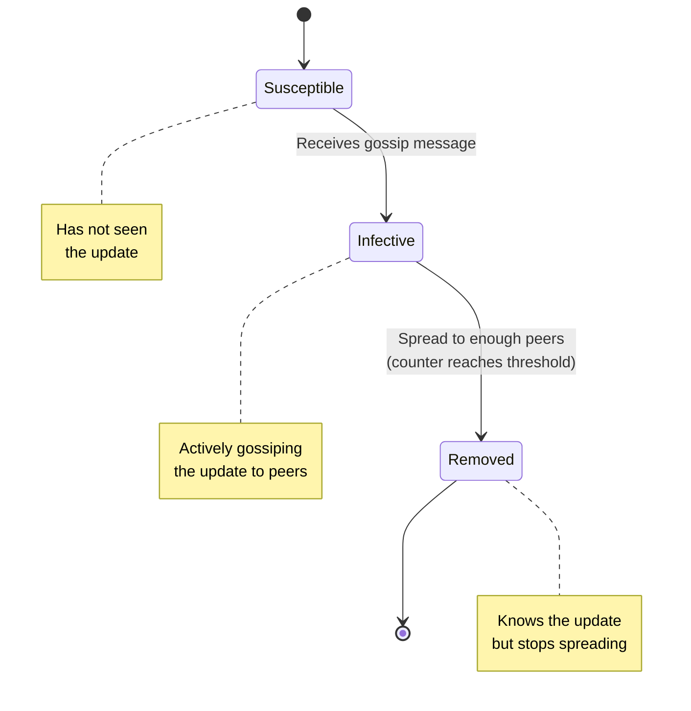
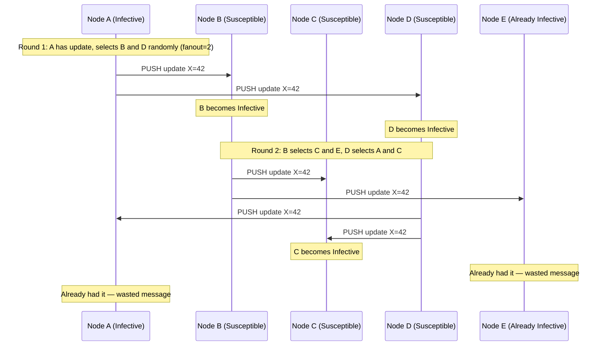
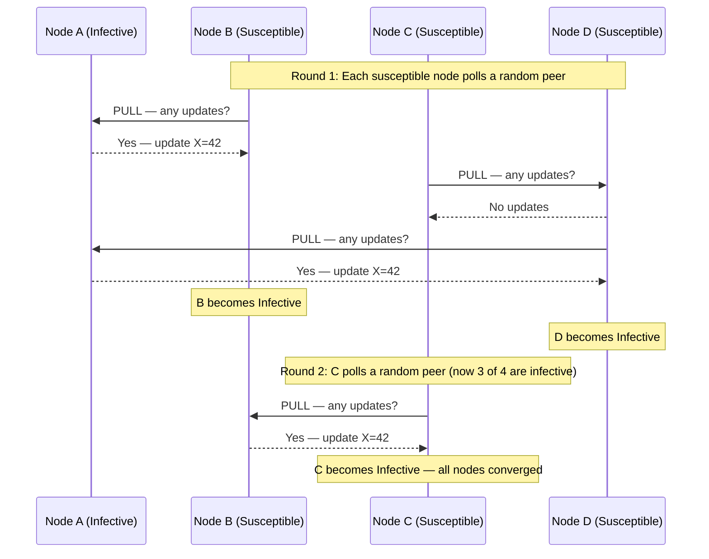
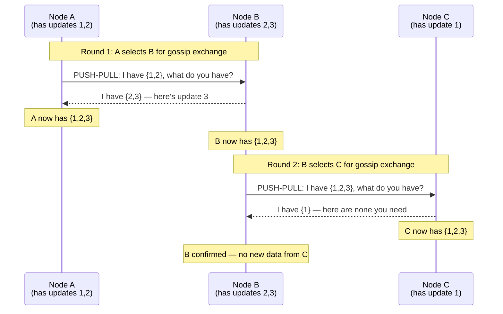
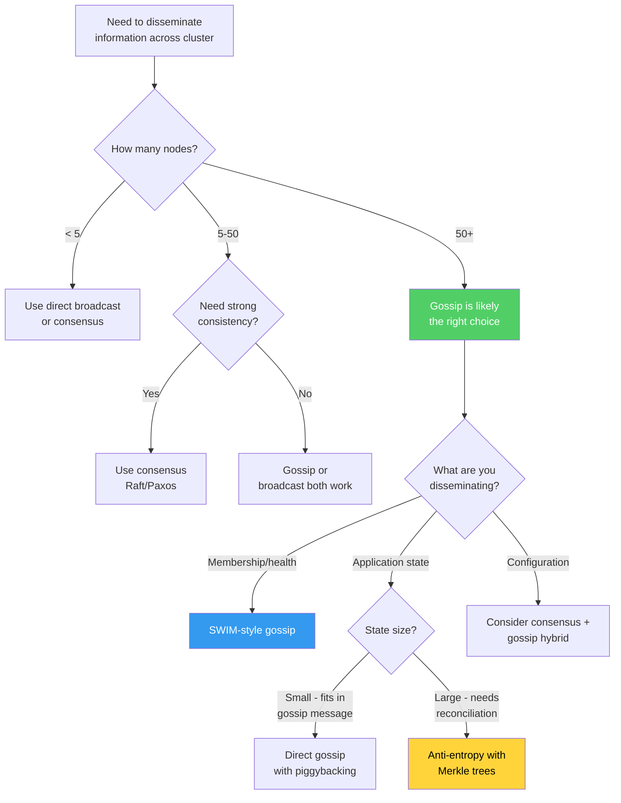
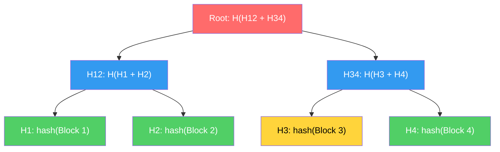
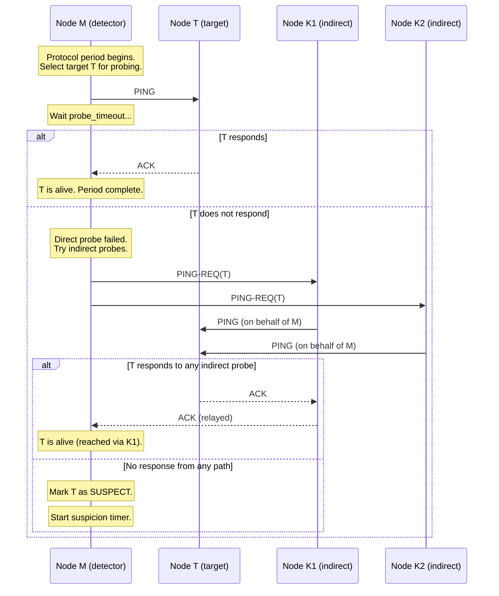
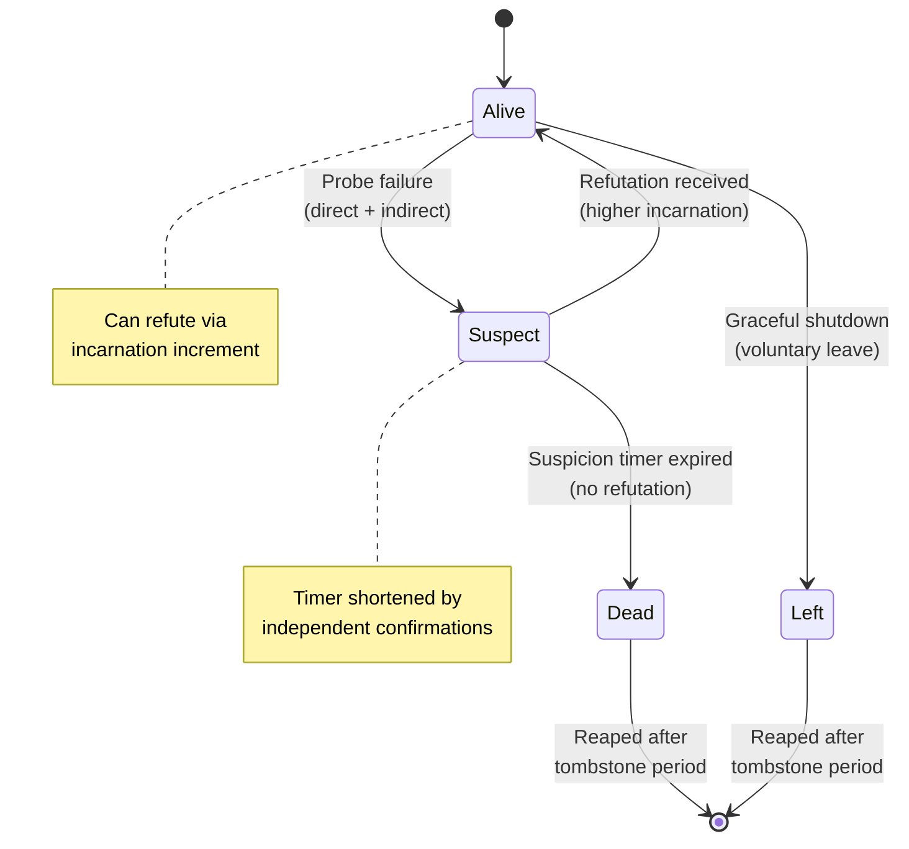
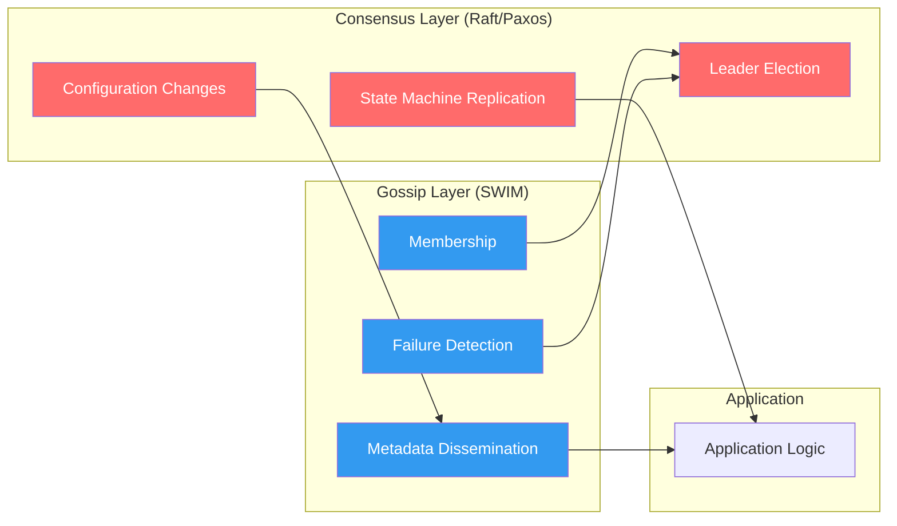

# Gossip Protocols

Gossip protocols are the immune system of distributed systems. They solve a problem that sounds impossible: how do you reliably propagate information to every node in a thousand-node cluster when any node can fail at any time, any network link can drop at any moment, and there is no central coordinator? The answer, borrowed from epidemiology, is to spread information the same way diseases spread — randomly, redundantly, and relentlessly.

## 1. Why Gossip Exists

Centralized approaches to information dissemination break down at scale for three fundamental reasons:

**Single point of failure.** If one node is responsible for broadcasting state changes, that node's failure silences the entire system. You can add redundancy to the broadcaster, but then you need consensus on which broadcaster is active — and now you've traded one hard problem for another.

**Quadratic message complexity.** A central broadcaster sending updates to $N$ nodes generates $O(N)$ messages per update. If every node generates updates, total traffic is $O(N^2)$. At 10,000 nodes with 1 update per second per node, that is 100 million messages per second through a single point.

**Synchronization bottleneck.** Centralized broadcast requires the broadcaster to maintain connections to every node, track acknowledgments, handle retries, and manage timeouts. This becomes the dominant bottleneck long before the network itself is saturated.

Gossip protocols eliminate all three problems. Every node acts identically — there is no special role. Message complexity is $O(N \log N)$ per dissemination round. And the protocol is inherently fault-tolerant because it uses randomized redundancy rather than deterministic delivery.

## 2. First Principles: Epidemiology Meets Computer Science

### The Epidemic Analogy

In 1987, Alan Demers, Dan Greene, Carl Hauser, Wes Irish, John Larson, Shenker, Sturgis, Swinehart, and Terry at Xerox PARC published "Epidemic Algorithms for Replicated Database Maintenance." They observed that the mathematical models used to study disease propagation could be applied directly to database replication.

The key insight: in an epidemic, each infected individual randomly contacts others and transmits the disease. No central authority directs the spread. Despite this, epidemics reliably infect entire populations — the mathematics guarantees convergence.

Mapping the analogy:

| Epidemiology | Gossip Protocol |
|---|---|
| Population | Cluster of nodes |
| Infected individual | Node with new information |
| Susceptible individual | Node without the information |
| Contact | Network message exchange |
| Disease transmission | Data propagation |
| Epidemic round | Gossip round (protocol period) |
| Recovery/immunity | Node has already seen the message |

### The Three States

In the SIR model from epidemiology, every individual is in one of three states:

- **Susceptible (S):** Has not received the information yet.
- **Infective (I):** Has the information and is actively spreading it.
- **Removed (R):** Has the information but has stopped spreading it (to save bandwidth).

A node transitions from S to I when it receives a gossip message. It transitions from I to R after spreading the message enough times (the "fanout" or "gossip factor").



## 3. Core Mechanics: Push, Pull, and Push-Pull

### Push Gossip

In push gossip, an infective node randomly selects $f$ peers (the fanout) and sends them the update. This is the simplest form.



**Characteristics of push gossip:**
- Fast initial spread when few nodes are infected
- Wastes bandwidth in later rounds (many pushes hit already-infected nodes)
- Latency: $O(\log N)$ rounds to infect all nodes
- Each infective node sends $f$ messages per round regardless of population state

### Pull Gossip

In pull gossip, susceptible nodes periodically contact a random peer and ask "do you have anything new?" If the peer is infective, it sends the update.



**Characteristics of pull gossip:**
- Slow initial spread (few infective nodes to pull from)
- Fast final convergence (many infective nodes to pull from)
- More bandwidth-efficient than push in later stages
- Each node generates exactly 1 request per round (predictable load)

### Push-Pull Gossip

Push-pull combines both: when two nodes communicate, they exchange information bidirectionally. The initiator pushes its state AND pulls the peer's state. This captures the best of both worlds.



**Characteristics of push-pull gossip:**
- Fastest convergence: combines push's fast initial spread with pull's fast final convergence
- Higher per-message cost (bidirectional data exchange)
- Most commonly used in production systems
- Convergence in $O(\log \log N)$ rounds for push-pull vs $O(\log N)$ for push-only

### Comparison of Gossip Styles

| Property | Push | Pull | Push-Pull |
|---|---|---|---|
| Initial spread speed | Fast | Slow | Fast |
| Final convergence speed | Slow | Fast | Very fast |
| Rounds to full infection | $O(\log N)$ | $O(\log N)$ | $O(\log \log N)$ |
| Bandwidth in early rounds | Low | Low | Moderate |
| Bandwidth in late rounds | High (wasted pushes) | Low | Moderate |
| Message pattern | Fire-and-forget | Request-response | Bidirectional exchange |
| Used in practice | Rare alone | Rare alone | Almost always |

## 4. Implementation: A Complete TypeScript Gossip Protocol

The following is a full, working implementation of a gossip-based membership and dissemination protocol. It includes peer selection, failure detection, suspicion mechanism, and state reconciliation.

```typescript
import { EventEmitter } from 'events';
import * as net from 'net';
import * as dgram from 'dgram';

// ─── Types ───────────────────────────────────────────────────────────

interface NodeId {
  host: string;
  port: number;
}

type NodeState = 'alive' | 'suspect' | 'dead' | 'left';

interface Member {
  id: NodeId;
  state: NodeState;
  incarnation: number;      // Lamport-like counter to refute suspicions
  lastStateChange: number;  // Timestamp of last state transition
  metadata: Record<string, string>; // Application-level metadata
}

type GossipMessageType =
  | 'ping'
  | 'ping-req'
  | 'ack'
  | 'alive'
  | 'suspect'
  | 'dead'
  | 'compound';

interface GossipMessage {
  type: GossipMessageType;
  sender: NodeId;
  target?: NodeId;
  incarnation: number;
  payload?: unknown;
  piggyback?: MembershipUpdate[];
}

interface MembershipUpdate {
  member: NodeId;
  state: NodeState;
  incarnation: number;
  metadata?: Record<string, string>;
}

interface GossipConfig {
  bindHost: string;
  bindPort: number;
  seeds: NodeId[];           // Initial known peers to bootstrap from
  fanout: number;            // Number of peers to gossip with per round
  gossipInterval: number;    // Milliseconds between gossip rounds
  probeInterval: number;     // Milliseconds between failure detection probes
  probeTimeout: number;      // Milliseconds to wait for a probe ACK
  indirectProbes: number;    // Number of indirect probes on direct probe failure
  suspicionTimeout: number;  // Milliseconds before suspect is declared dead
  maxTransmissions: number;  // Max times a message is piggybacked before removal
}

const DEFAULT_CONFIG: GossipConfig = {
  bindHost: '0.0.0.0',
  bindPort: 7946,
  seeds: [],
  fanout: 3,
  gossipInterval: 200,
  probeInterval: 1000,
  probeTimeout: 500,
  indirectProbes: 3,
  suspicionTimeout: 5000,
  maxTransmissions: 8,
};

// ─── Dissemination Queue ─────────────────────────────────────────────
// Tracks updates that need to be piggybacked on protocol messages.
// Each update has a transmission count; once it exceeds maxTransmissions,
// the update is dropped (it has been spread to enough peers).

class DisseminationQueue {
  private queue: Array<{
    update: MembershipUpdate;
    transmissions: number;
  }> = [];

  constructor(private maxTransmissions: number) {}

  enqueue(update: MembershipUpdate): void {
    // Remove any existing update for the same member
    this.queue = this.queue.filter(
      (item) =>
        item.update.member.host !== update.member.host ||
        item.update.member.port !== update.member.port
    );
    this.queue.push({ update, transmissions: 0 });
  }

  // Get up to `limit` updates to piggyback, prioritizing least-transmitted
  getUpdates(limit: number): MembershipUpdate[] {
    // Sort by transmission count (least first) so fresh updates spread first
    this.queue.sort((a, b) => a.transmissions - b.transmissions);

    const selected = this.queue.slice(0, limit);
    for (const item of selected) {
      item.transmissions++;
    }

    // Remove items that have been transmitted enough
    this.queue = this.queue.filter(
      (item) => item.transmissions < this.maxTransmissions
    );

    return selected.map((item) => item.update);
  }

  get length(): number {
    return this.queue.length;
  }
}

// ─── Suspicion Timer ─────────────────────────────────────────────────
// Implements the SWIM suspicion sub-protocol. When a node is suspected,
// a timer starts. Other nodes confirming the suspicion accelerate the
// timer. The suspect can refute by broadcasting an alive message with
// a higher incarnation number.

class SuspicionTimer {
  private timer: ReturnType<typeof setTimeout> | null = null;
  private confirmations: Set<string> = new Set();
  private readonly minTimeout: number;
  private readonly maxTimeout: number;
  private readonly k: number; // Required independent confirmations

  constructor(
    private target: NodeId,
    private onExpire: (target: NodeId) => void,
    clusterSize: number,
    baseTimeout: number
  ) {
    // Suspicion timeout scales logarithmically with cluster size
    // per the Lifeguard paper (Hashicorp, 2018)
    this.k = Math.max(3, Math.ceil(Math.log2(clusterSize)));
    this.maxTimeout = baseTimeout;
    this.minTimeout = baseTimeout / 4;
    this.startTimer();
  }

  private startTimer(): void {
    const timeout = this.calculateTimeout();
    this.timer = setTimeout(() => {
      this.onExpire(this.target);
    }, timeout);
  }

  private calculateTimeout(): number {
    // As more independent nodes confirm the suspicion, the timeout decreases
    // Formula from Lifeguard: timeout = max - (max - min) * (confirmations / k)
    const ratio = Math.min(this.confirmations.size / this.k, 1.0);
    return this.maxTimeout - (this.maxTimeout - this.minTimeout) * ratio;
  }

  confirm(from: NodeId): void {
    const key = `${from.host}:${from.port}`;
    if (this.confirmations.has(key)) return;
    this.confirmations.add(key);

    // Restart timer with shorter timeout
    if (this.timer) clearTimeout(this.timer);
    this.startTimer();
  }

  cancel(): void {
    if (this.timer) {
      clearTimeout(this.timer);
      this.timer = null;
    }
  }
}

// ─── Main Gossip Node ────────────────────────────────────────────────

class GossipNode extends EventEmitter {
  private config: GossipConfig;
  private members: Map<string, Member> = new Map();
  private self: Member;
  private dissemination: DisseminationQueue;
  private suspicionTimers: Map<string, SuspicionTimer> = new Map();
  private socket: dgram.Socket | null = null;
  private gossipTimer: ReturnType<typeof setInterval> | null = null;
  private probeTimer: ReturnType<typeof setInterval> | null = null;
  private probeIndex: number = 0;
  private pendingProbes: Map<string, {
    timeout: ReturnType<typeof setTimeout>;
    resolve: (ack: boolean) => void;
  }> = new Map();

  constructor(config: Partial<GossipConfig> = {}) {
    super();
    this.config = { ...DEFAULT_CONFIG, ...config };
    this.dissemination = new DisseminationQueue(this.config.maxTransmissions);

    this.self = {
      id: { host: this.config.bindHost, port: this.config.bindPort },
      state: 'alive',
      incarnation: 0,
      lastStateChange: Date.now(),
      metadata: {},
    };
  }

  private memberKey(id: NodeId): string {
    return `${id.host}:${id.port}`;
  }

  // ─── Lifecycle ───────────────────────────────────────────────────

  async start(): Promise<void> {
    this.socket = dgram.createSocket('udp4');

    this.socket.on('message', (msg, rinfo) => {
      try {
        const message: GossipMessage = JSON.parse(msg.toString());
        this.handleMessage(message, rinfo);
      } catch (err) {
        this.emit('error', new Error(`Failed to parse message: ${err}`));
      }
    });

    await new Promise<void>((resolve, reject) => {
      this.socket!.bind(this.config.bindPort, this.config.bindHost, () => {
        resolve();
      });
      this.socket!.once('error', reject);
    });

    // Add self to member list
    this.members.set(this.memberKey(this.self.id), this.self);

    // Join via seed nodes
    for (const seed of this.config.seeds) {
      await this.sendMessage(seed, {
        type: 'alive',
        sender: this.self.id,
        incarnation: this.self.incarnation,
        payload: this.self.metadata,
      });
    }

    // Start gossip and failure detection loops
    this.gossipTimer = setInterval(
      () => this.gossipRound(),
      this.config.gossipInterval
    );
    this.probeTimer = setInterval(
      () => this.probeRound(),
      this.config.probeInterval
    );

    this.emit('started', this.self.id);
  }

  async stop(): Promise<void> {
    // Broadcast graceful leave
    const leaveUpdate: MembershipUpdate = {
      member: this.self.id,
      state: 'left',
      incarnation: this.self.incarnation,
    };
    this.dissemination.enqueue(leaveUpdate);

    // Do a few final gossip rounds to spread the leave message
    for (let i = 0; i < 3; i++) {
      await this.gossipRound();
    }

    if (this.gossipTimer) clearInterval(this.gossipTimer);
    if (this.probeTimer) clearInterval(this.probeTimer);
    for (const timer of this.suspicionTimers.values()) {
      timer.cancel();
    }

    if (this.socket) {
      this.socket.close();
      this.socket = null;
    }

    this.emit('stopped');
  }

  // ─── Peer Selection ──────────────────────────────────────────────
  // Uses Fisher-Yates shuffle to select `count` random live peers.
  // Excludes self and dead/left nodes.

  private selectRandomPeers(count: number): Member[] {
    const candidates = Array.from(this.members.values()).filter(
      (m) =>
        this.memberKey(m.id) !== this.memberKey(this.self.id) &&
        m.state !== 'dead' &&
        m.state !== 'left'
    );

    // Fisher-Yates shuffle
    for (let i = candidates.length - 1; i > 0; i--) {
      const j = Math.floor(Math.random() * (i + 1));
      [candidates[i], candidates[j]] = [candidates[j], candidates[i]];
    }

    return candidates.slice(0, Math.min(count, candidates.length));
  }

  // For failure detection probing, we round-robin through the member
  // list (shuffled periodically) to ensure every member is probed
  // within a bounded time.

  private selectProbeTarget(): Member | null {
    const candidates = Array.from(this.members.values()).filter(
      (m) =>
        this.memberKey(m.id) !== this.memberKey(this.self.id) &&
        m.state !== 'dead' &&
        m.state !== 'left'
    );

    if (candidates.length === 0) return null;

    this.probeIndex = this.probeIndex % candidates.length;
    const target = candidates[this.probeIndex];
    this.probeIndex++;

    // Reshuffle when we've gone through everyone once
    if (this.probeIndex >= candidates.length) {
      this.probeIndex = 0;
    }

    return target;
  }

  // ─── Gossip Round (Push-Pull) ────────────────────────────────────

  private async gossipRound(): Promise<void> {
    const peers = this.selectRandomPeers(this.config.fanout);

    for (const peer of peers) {
      // Piggyback membership updates on gossip messages
      const updates = this.dissemination.getUpdates(10);

      const message: GossipMessage = {
        type: 'alive',
        sender: this.self.id,
        incarnation: this.self.incarnation,
        piggyback: updates,
      };

      await this.sendMessage(peer.id, message);
    }
  }

  // ─── Failure Detection (SWIM-style) ──────────────────────────────
  // Each probe period:
  //   1. Pick a target node
  //   2. Send a direct PING
  //   3. If no ACK within probeTimeout, send PING-REQ to k indirect nodes
  //   4. If still no ACK, mark the target as SUSPECT

  private async probeRound(): Promise<void> {
    const target = this.selectProbeTarget();
    if (!target) return;

    const directAck = await this.sendPing(target.id);
    if (directAck) return; // Target is alive

    // Direct probe failed — try indirect probes through other members
    const indirectPeers = this.selectRandomPeers(this.config.indirectProbes)
      .filter((p) => this.memberKey(p.id) !== this.memberKey(target.id));

    const indirectResults = await Promise.all(
      indirectPeers.map((peer) => this.sendPingReq(peer.id, target.id))
    );

    const anyAck = indirectResults.some((result) => result);
    if (anyAck) return; // Target responded to indirect probe

    // No response — suspect the target
    this.suspectNode(target.id);
  }

  private sendPing(target: NodeId): Promise<boolean> {
    return new Promise<boolean>((resolve) => {
      const key = this.memberKey(target);
      const timeout = setTimeout(() => {
        this.pendingProbes.delete(key);
        resolve(false);
      }, this.config.probeTimeout);

      this.pendingProbes.set(key, { timeout, resolve });

      const piggyback = this.dissemination.getUpdates(6);
      this.sendMessage(target, {
        type: 'ping',
        sender: this.self.id,
        incarnation: this.self.incarnation,
        piggyback,
      });
    });
  }

  private async sendPingReq(
    via: NodeId,
    target: NodeId
  ): Promise<boolean> {
    return new Promise<boolean>((resolve) => {
      const key = `indirect:${this.memberKey(target)}:via:${this.memberKey(via)}`;
      const timeout = setTimeout(() => {
        this.pendingProbes.delete(key);
        resolve(false);
      }, this.config.probeTimeout * 2); // Longer timeout for indirect

      this.pendingProbes.set(key, { timeout, resolve });

      this.sendMessage(via, {
        type: 'ping-req',
        sender: this.self.id,
        target: target,
        incarnation: this.self.incarnation,
      });
    });
  }

  // ─── Message Handling ────────────────────────────────────────────

  private handleMessage(
    message: GossipMessage,
    rinfo: dgram.RemoteInfo
  ): void {
    // Process any piggybacked membership updates first
    if (message.piggyback) {
      for (const update of message.piggyback) {
        this.applyMembershipUpdate(update);
      }
    }

    // Ensure the sender is in our member list
    this.ensureMember(message.sender);

    switch (message.type) {
      case 'ping':
        this.handlePing(message);
        break;
      case 'ping-req':
        this.handlePingReq(message);
        break;
      case 'ack':
        this.handleAck(message);
        break;
      case 'alive':
        this.handleAlive(message);
        break;
      case 'suspect':
        this.handleSuspect(message);
        break;
      case 'dead':
        this.handleDead(message);
        break;
    }
  }

  private handlePing(message: GossipMessage): void {
    const piggyback = this.dissemination.getUpdates(6);
    this.sendMessage(message.sender, {
      type: 'ack',
      sender: this.self.id,
      incarnation: this.self.incarnation,
      piggyback,
    });
  }

  private async handlePingReq(message: GossipMessage): Promise<void> {
    if (!message.target) return;

    // Forward the ping to the target
    const ack = await this.sendPing(message.target);

    if (ack) {
      // Target is alive — relay ACK back to the requester
      this.sendMessage(message.sender, {
        type: 'ack',
        sender: this.self.id,
        target: message.target,
        incarnation: this.self.incarnation,
      });
    }
  }

  private handleAck(message: GossipMessage): void {
    // Check for direct probe ACK
    const directKey = this.memberKey(message.sender);
    const directProbe = this.pendingProbes.get(directKey);
    if (directProbe) {
      clearTimeout(directProbe.timeout);
      directProbe.resolve(true);
      this.pendingProbes.delete(directKey);
      return;
    }

    // Check for indirect probe ACK
    if (message.target) {
      for (const [key, probe] of this.pendingProbes) {
        if (key.startsWith('indirect:') && key.includes(this.memberKey(message.target))) {
          clearTimeout(probe.timeout);
          probe.resolve(true);
          this.pendingProbes.delete(key);
          return;
        }
      }
    }
  }

  private handleAlive(message: GossipMessage): void {
    const key = this.memberKey(message.sender);
    const existing = this.members.get(key);

    if (existing && message.incarnation > existing.incarnation) {
      existing.state = 'alive';
      existing.incarnation = message.incarnation;
      existing.lastStateChange = Date.now();
      if (message.payload) {
        existing.metadata = message.payload as Record<string, string>;
      }

      // Cancel any suspicion timer
      const timer = this.suspicionTimers.get(key);
      if (timer) {
        timer.cancel();
        this.suspicionTimers.delete(key);
      }

      this.dissemination.enqueue({
        member: message.sender,
        state: 'alive',
        incarnation: message.incarnation,
        metadata: existing.metadata,
      });

      this.emit('member-alive', existing);
    }
  }

  private handleSuspect(message: GossipMessage): void {
    if (!message.target) return;
    const key = this.memberKey(message.target);

    // If we are the suspect, refute by incrementing incarnation
    if (key === this.memberKey(this.self.id)) {
      this.self.incarnation++;
      this.dissemination.enqueue({
        member: this.self.id,
        state: 'alive',
        incarnation: this.self.incarnation,
        metadata: this.self.metadata,
      });
      this.emit('refuted-suspicion', message.sender);
      return;
    }

    const existing = this.members.get(key);
    if (!existing) return;

    if (message.incarnation >= existing.incarnation && existing.state === 'alive') {
      this.suspectNode(message.target, message.incarnation);
    }

    // If already suspect, add confirmation
    const timer = this.suspicionTimers.get(key);
    if (timer) {
      timer.confirm(message.sender);
    }
  }

  private handleDead(message: GossipMessage): void {
    if (!message.target) return;
    const key = this.memberKey(message.target);

    // If someone declares us dead, refute strongly
    if (key === this.memberKey(this.self.id)) {
      this.self.incarnation++;
      this.dissemination.enqueue({
        member: this.self.id,
        state: 'alive',
        incarnation: this.self.incarnation,
        metadata: this.self.metadata,
      });
      return;
    }

    const existing = this.members.get(key);
    if (!existing) return;

    if (message.incarnation >= existing.incarnation) {
      existing.state = 'dead';
      existing.incarnation = message.incarnation;
      existing.lastStateChange = Date.now();

      const timer = this.suspicionTimers.get(key);
      if (timer) {
        timer.cancel();
        this.suspicionTimers.delete(key);
      }

      this.dissemination.enqueue({
        member: message.target,
        state: 'dead',
        incarnation: message.incarnation,
      });

      this.emit('member-dead', existing);
    }
  }

  // ─── Membership Management ──────────────────────────────────────

  private ensureMember(id: NodeId): void {
    const key = this.memberKey(id);
    if (!this.members.has(key)) {
      const member: Member = {
        id,
        state: 'alive',
        incarnation: 0,
        lastStateChange: Date.now(),
        metadata: {},
      };
      this.members.set(key, member);
      this.dissemination.enqueue({
        member: id,
        state: 'alive',
        incarnation: 0,
      });
      this.emit('member-joined', member);
    }
  }

  private suspectNode(target: NodeId, incarnation?: number): void {
    const key = this.memberKey(target);
    const member = this.members.get(key);
    if (!member || member.state === 'dead' || member.state === 'left') return;

    member.state = 'suspect';
    if (incarnation !== undefined) {
      member.incarnation = incarnation;
    }
    member.lastStateChange = Date.now();

    // Start suspicion timer if not already running
    if (!this.suspicionTimers.has(key)) {
      const timer = new SuspicionTimer(
        target,
        (t) => this.declareDead(t),
        this.members.size,
        this.config.suspicionTimeout
      );
      this.suspicionTimers.set(key, timer);
    }

    this.dissemination.enqueue({
      member: target,
      state: 'suspect',
      incarnation: member.incarnation,
    });

    this.emit('member-suspect', member);
  }

  private declareDead(target: NodeId): void {
    const key = this.memberKey(target);
    const member = this.members.get(key);
    if (!member) return;

    member.state = 'dead';
    member.lastStateChange = Date.now();

    this.suspicionTimers.delete(key);

    this.dissemination.enqueue({
      member: target,
      state: 'dead',
      incarnation: member.incarnation,
    });

    this.emit('member-dead', member);
  }

  // ─── Network I/O ────────────────────────────────────────────────

  private async sendMessage(
    target: NodeId,
    message: GossipMessage
  ): Promise<void> {
    if (!this.socket) return;

    const buf = Buffer.from(JSON.stringify(message));
    return new Promise<void>((resolve, reject) => {
      this.socket!.send(buf, target.port, target.host, (err) => {
        if (err) {
          this.emit('error', err);
          reject(err);
        } else {
          resolve();
        }
      });
    });
  }

  // ─── Membership Update Application ──────────────────────────────
  // Applies an update only if it supersedes the current state.
  // The ordering rules (from SWIM):
  //   dead > suspect > alive (for the same incarnation)
  //   higher incarnation always wins

  private applyMembershipUpdate(update: MembershipUpdate): void {
    const key = this.memberKey(update.member);

    // Don't apply updates about ourselves — we know our own state
    if (key === this.memberKey(this.self.id)) {
      if (update.state === 'suspect' || update.state === 'dead') {
        // Someone thinks we're suspect/dead — refute
        this.self.incarnation = Math.max(
          this.self.incarnation,
          update.incarnation
        ) + 1;
        this.dissemination.enqueue({
          member: this.self.id,
          state: 'alive',
          incarnation: this.self.incarnation,
          metadata: this.self.metadata,
        });
      }
      return;
    }

    const existing = this.members.get(key);
    if (!existing) {
      // New member — add it
      const member: Member = {
        id: update.member,
        state: update.state,
        incarnation: update.incarnation,
        lastStateChange: Date.now(),
        metadata: update.metadata || {},
      };
      this.members.set(key, member);
      this.emit('member-joined', member);
      return;
    }

    // Determine if this update supersedes the current state
    if (this.updateSupersedes(update, existing)) {
      const oldState = existing.state;
      existing.state = update.state;
      existing.incarnation = update.incarnation;
      existing.lastStateChange = Date.now();
      if (update.metadata) {
        existing.metadata = update.metadata;
      }

      // Re-disseminate the update
      this.dissemination.enqueue(update);

      // Emit appropriate events
      if (update.state === 'alive' && oldState === 'suspect') {
        const timer = this.suspicionTimers.get(key);
        if (timer) {
          timer.cancel();
          this.suspicionTimers.delete(key);
        }
        this.emit('member-alive', existing);
      } else if (update.state === 'suspect' && oldState === 'alive') {
        this.suspectNode(update.member, update.incarnation);
      } else if (update.state === 'dead') {
        this.emit('member-dead', existing);
      }
    }
  }

  private updateSupersedes(
    update: MembershipUpdate,
    existing: Member
  ): boolean {
    if (update.incarnation > existing.incarnation) return true;
    if (update.incarnation < existing.incarnation) return false;

    // Same incarnation — use state ordering: dead > suspect > alive
    const stateOrder: Record<NodeState, number> = {
      alive: 0,
      suspect: 1,
      dead: 2,
      left: 3,
    };

    return stateOrder[update.state] > stateOrder[existing.state];
  }

  // ─── Public API ─────────────────────────────────────────────────

  getMembers(): Member[] {
    return Array.from(this.members.values());
  }

  getAliveMembers(): Member[] {
    return this.getMembers().filter((m) => m.state === 'alive');
  }

  setMetadata(key: string, value: string): void {
    this.self.metadata[key] = value;
    this.self.incarnation++;
    this.dissemination.enqueue({
      member: this.self.id,
      state: 'alive',
      incarnation: this.self.incarnation,
      metadata: this.self.metadata,
    });
  }

  getMemberCount(): number {
    return this.members.size;
  }
}
```

::: info Design Decisions
The implementation above makes several deliberate choices that mirror production gossip systems:

1. **UDP transport** — gossip messages are small and loss-tolerant. TCP's overhead (connection setup, guaranteed delivery) is unnecessary when the protocol itself handles retransmission via redundant gossip rounds.
2. **Piggybacking** — membership updates ride along on protocol messages (PINGs, ACKs) rather than being sent separately. This dramatically reduces the number of messages.
3. **Incarnation numbers** — a monotonically increasing counter that allows a node to refute false suspicions. If Node A suspects Node B, Node B simply increments its incarnation and broadcasts an alive message. The higher incarnation trumps the suspicion.
4. **Round-robin probe target selection** — instead of selecting probe targets randomly (which could leave some nodes unprobed for many rounds), the implementation cycles through all members, guaranteeing bounded detection time.
:::

## 5. Edge Cases and Failure Modes

### The Split-Brain Gossip Partition

When a network partition splits the cluster into two groups, each side independently declares the other side dead. When the partition heals, both sides have conflicting membership views.

**The problem:** Node A (on side 1) has been declared dead by side 2. Node B (on side 2) has been declared dead by side 1. When connectivity restores, both sides believe they are the "correct" cluster.

**The solution:** Incarnation numbers. When side 1 re-contacts Node A (which side 2 declared dead), Node A refutes the death declaration by incrementing its incarnation. The higher incarnation propagates through the merged cluster, correcting the membership view. The same happens for Node B.

### The Slow Node Problem

A node that is not dead but merely slow (due to GC pauses, disk I/O, CPU saturation) will fail to respond to probes in time. It will be suspected and eventually declared dead — even though it is still running.

**The problem:** The slow node is removed from the cluster, its work is reassigned, and then it "comes back." Now you have two nodes handling the same work.

**The solution:** The SWIM suspicion mechanism gives the slow node time to refute. Additionally, production systems like Consul use "nack" responses from indirect probe intermediaries: if the intermediary itself could not reach the target, it sends a nack. This distinguishes "the target is truly unresponsive" from "there's a network issue between you and the target."

### Seed Node Exhaustion

If all seed nodes are down when a new node tries to join, the new node cannot bootstrap into the cluster.

**The solution:** Production systems use multiple seed discovery mechanisms: static seed lists, DNS-based discovery (a DNS record that returns current cluster members), cloud provider APIs (AWS EC2 tag discovery, Kubernetes service discovery), and file-based seed lists that are periodically updated by a configuration management system.

### Rapid Membership Churn

When many nodes join or leave simultaneously (deployment rollouts, auto-scaling events), the dissemination queue can become overwhelmed. Each join/leave generates a membership update that must be gossiped to all nodes.

**The solution:** Batch updates and increase the number of piggyback updates per message during high-churn periods. Some implementations use adaptive fanout — increasing the fanout parameter when the dissemination queue is large.

### Clock Skew and Incarnation Races

Two nodes can race to increment their incarnation numbers. If Node A and Node B both observe a suspicion about themselves at nearly the same time, they both increment and broadcast. This is harmless — the higher incarnation wins, and both nodes end up alive.

However, if incarnation numbers are derived from wall clocks instead of monotonic counters, clock skew can cause an older refutation to appear newer. This is why incarnation numbers must be logical counters, not timestamps.

## 6. Performance Characteristics

### Bandwidth Overhead

Each gossip round, a node sends $f$ messages (one per fanout peer). Each message contains:
- Protocol header: ~50 bytes
- Sender identity and incarnation: ~30 bytes
- Piggybacked updates: ~100 bytes per update, typically 6-10 updates

**Per-round bandwidth per node:**

$$
B_{\text{round}} = f \times (H + P \times U)
$$

Where $f$ = fanout, $H$ = header size, $P$ = piggyback count, $U$ = update size.

With $f = 3$, $H = 80$ bytes, $P = 8$, $U = 100$ bytes:

$$
B_{\text{round}} = 3 \times (80 + 8 \times 100) = 3 \times 880 = 2640 \text{ bytes}
$$

At a gossip interval of 200ms (5 rounds/sec):

$$
B_{\text{total}} = 2640 \times 5 = 13,200 \text{ bytes/sec} \approx 13 \text{ KB/s}
$$

This is **independent of cluster size**. A 10-node cluster and a 10,000-node cluster generate the same per-node bandwidth. The total cluster bandwidth scales linearly: $O(N)$.

### Failure Detection Time

With SWIM, the worst-case failure detection time is:

$$
T_{\text{detect}} = T_{\text{probe}} + T_{\text{suspect}} + T_{\text{disseminate}}
$$

Where:
- $T_{\text{probe}}$: time until the failed node is selected for probing (at most $N \times T_{\text{interval}}$ in round-robin)
- $T_{\text{suspect}}$: suspicion timeout before declaring dead
- $T_{\text{disseminate}}$: time for the death declaration to reach all nodes ($O(\log N)$ rounds)

For $N = 1000$, $T_{\text{interval}} = 1$s, $T_{\text{suspect}} = 5$s, gossip interval = 200ms:

$$
T_{\text{probe}} \leq 1000 \times 1\text{s} = 1000\text{s (worst case)}
$$

This worst case is unacceptable, which is why practical implementations use a **shuffled** round-robin. After shuffling, the expected detection time is $N/2 \times T_{\text{interval}}$. More sophisticated implementations (like Consul's Serf) partition the member list into segments and probe each segment in parallel, bringing expected detection time down to seconds even for large clusters.

### Scalability Characteristics

| Metric | Scaling | Notes |
|---|---|---|
| Per-node bandwidth | $O(1)$ | Constant regardless of cluster size |
| Total cluster bandwidth | $O(N)$ | Linear with node count |
| Convergence time | $O(\log N)$ | Rounds for full dissemination |
| Failure detection (expected) | $O(N)$ | With round-robin probing |
| Memory per node | $O(N)$ | Must store full membership list |
| Message size | $O(1)$ | Fixed-size with bounded piggyback |

### CPU Overhead

Gossip processing is minimal: parse a small UDP message, update an in-memory map, serialize a response. At 5 rounds/second with fanout 3, a node processes approximately 15 inbound and 15 outbound messages per second (in a large cluster). This is negligible — measured in microseconds of CPU time per round.

The dominant CPU cost is in the application-level processing triggered by membership changes (rebalancing hash rings, updating routing tables, etc.), not in the gossip protocol itself.

## 7. Mathematical Foundations

### Convergence Analysis

Consider a cluster of $N$ nodes. One node is initially infective (has a new update). In each round, every infective node selects one random peer (fanout $f = 1$ for simplicity) and pushes the update.

Let $S_k$ be the number of susceptible nodes after round $k$. Initially $S_0 = N - 1$.

In round $k$, there are $N - S_k$ infective nodes. Each infective node randomly selects a peer. The probability that a specific susceptible node is NOT selected by any infective node is:

$$
P(\text{not selected}) = \left(1 - \frac{1}{N}\right)^{N - S_k}
$$

Therefore the expected number of susceptible nodes after round $k+1$:

$$
E[S_{k+1}] = S_k \cdot \left(1 - \frac{1}{N}\right)^{N - S_k}
$$

Let $I_k = N - S_k$ (number of infective nodes). Then:

$$
E[I_{k+1}] = N - S_k \cdot \left(1 - \frac{1}{N}\right)^{I_k}
$$

**Theorem.** With push gossip and fanout $f = 1$, all $N$ nodes are infected with high probability after $O(\log N)$ rounds.

**Proof sketch.** We analyze two phases:

**Phase 1 (Exponential growth):** When $I_k \ll N$, most pushes hit susceptible nodes. Each infective node infects approximately one new node per round. Thus $I_k \approx 2^k$ (doubling each round). This phase lasts $\log_2 N$ rounds until $I_k \approx N/2$.

**Phase 2 (Tail convergence):** When $I_k$ is close to $N$, we track the remaining susceptible nodes. With $I_k = N - S_k$ infective nodes, the probability a specific susceptible node survives round $k$ is:

$$
\left(1 - \frac{1}{N}\right)^{I_k} \approx e^{-I_k/N}
$$

When $I_k \approx N - c$ for small $c$:

$$
P(\text{survive}) \approx e^{-(N-c)/N} \approx e^{-1} \approx 0.368
$$

So each remaining susceptible node has a ~63.2% chance of being infected per round. After $r$ additional rounds, the expected number of surviving susceptible nodes is:

$$
E[S_{k+r}] \approx S_k \cdot e^{-r}
$$

For $S_k = N/2$, we need $r = \ln(N/2) \approx \ln N$ additional rounds to reduce to $O(1)$ susceptible nodes.

**Total rounds:** $\log_2 N + \ln N = O(\log N)$.

With fanout $f > 1$, the growth is faster. The infection probability becomes:

$$
P(\text{all infected after } k \text{ rounds}) = \left(1 - \left(1 - \frac{1}{N}\right)^{f \cdot k}\right)^N
$$

For this to approach 1, we need $f \cdot k \cdot \ln(N/N) \to -\infty$, which gives $k = O(\log N / \log f)$. With $f = 3$:

$$
k \approx \frac{\ln N}{\ln 3} \approx 0.91 \log_2 N
$$

### Infection Probability Formula

The probability that **all** $N$ nodes are infected after $k$ rounds of push gossip with fanout $f = 1$:

$$
P(\text{all infected after } k \text{ rounds}) = \left(1 - \left(1 - \frac{1}{N}\right)^k\right)^N
$$

**Derivation.** Consider a single susceptible node. In each of $k$ rounds, each infective node selects a random peer. For simplicity, assume the number of infective nodes grows fast enough that by round $k$, approximately $k$ independent "infection attempts" have occurred (this approximation tightens as $N$ grows). The probability this node is infected by at least one attempt:

$$
p = 1 - \left(1 - \frac{1}{N}\right)^k
$$

For all $N$ nodes to be infected (each independently with probability $p$):

$$
P(\text{all}) = p^N = \left(1 - \left(1 - \frac{1}{N}\right)^k\right)^N
$$

**Simplification for large $N$.** Using $(1 - 1/N)^k \approx e^{-k/N}$:

$$
P(\text{all}) \approx \left(1 - e^{-k/N}\right)^N
$$

Setting $k = c \cdot N \ln N$ for constant $c$:

$$
P(\text{all}) \approx \left(1 - e^{-c \ln N}\right)^N = \left(1 - N^{-c}\right)^N \approx e^{-N^{1-c}}
$$

For $c > 1$, $N^{1-c} \to 0$, so $P(\text{all}) \to 1$. This proves that $k = O(N \log N)$ total infection attempts suffice, which with $N$ infective nodes each doing 1 push per round corresponds to $O(\log N)$ rounds.

### The Phi Accrual Failure Detector

The phi accrual failure detector (Hayashibara et al., 2004) outputs a continuous suspicion level $\phi$ rather than a binary alive/dead decision. The value $\phi$ represents the confidence that the monitored node has failed:

$$
\phi(t) = -\log_{10}\left(1 - F(t - t_{\text{last}})\right)
$$

Where $F$ is the CDF of the inter-arrival time distribution of heartbeats, and $t_{\text{last}}$ is the time of the last received heartbeat.

If heartbeat inter-arrival times follow a normal distribution with mean $\mu$ and variance $\sigma^2$:

$$
F(\Delta t) = \Phi\left(\frac{\Delta t - \mu}{\sigma}\right)
$$

Where $\Phi$ is the standard normal CDF.

**Interpretation:**
- $\phi = 1$: 10% chance the node has NOT failed (90% probability of failure)
- $\phi = 2$: 1% chance the node has NOT failed (99% probability of failure)
- $\phi = 3$: 0.1% chance the node has NOT failed (99.9% probability of failure)
- $\phi = 8$: Used by Cassandra as the default threshold

The advantage over fixed timeouts: the detector automatically adapts to network conditions. A node on a high-latency link will have a larger $\mu$ and $\sigma$, so the detector requires more elapsed time before reaching the threshold $\phi$. This reduces false positives in heterogeneous networks.

## 8. Real-World War Stories

::: info War Story: Cassandra's Gossip Storm
In 2014, a large Cassandra deployment at a major streaming company experienced a "gossip storm." The root cause: a misconfigured node was rapidly joining and leaving the cluster (every 2-3 seconds due to a startup crash loop). Each join and leave generated membership updates that had to be gossiped to all ~800 nodes. The dissemination queue on every node grew unboundedly because new updates were being generated faster than old ones could be fully propagated.

The fix had two parts:
1. **Rate limiting:** Cassandra added a minimum interval between processing join events from the same node (implemented as `QUARANTINE_DELAY` in `StorageService.java`).
2. **Dampening:** If a node is seen joining/leaving more than 3 times in a configurable window, subsequent events are suppressed and an operator alert is raised.

This incident led to the addition of `phi_convict_threshold` tuning guidance in the Cassandra documentation and influenced how later versions handle rapid membership churn.
:::

::: info War Story: Consul's Flapping Detector
HashiCorp's Consul (built on the Serf gossip library) encountered a problem in large-scale deployments (~5000 nodes across multiple datacenters): nodes with marginal network connectivity would oscillate between alive and suspect states hundreds of times per day. Each transition generated gossip traffic and triggered service catalog updates, creating a continuous background load.

The solution was the Lifeguard extension to SWIM (published at USENIX ATC 2018). Lifeguard introduced three mechanisms:
1. **Dogpiling:** When a node sees that many others are also suspecting the same target, it can accelerate the suspicion timeout (the target is more likely truly dead).
2. **Buddy system:** A node that is being suspected preferentially sends its refutation to the nodes it knows are suspecting it, rather than random peers.
3. **Local health awareness:** A node monitors its own responsiveness. If it detects that its own event loop is delayed (e.g., due to GC), it proactively increases its incarnation number and broadcasts an alive message, preempting suspicion.

These mechanisms reduced false positive failure detections by 8x in their production clusters.
:::

::: info War Story: DynamoDB's Partition Awareness via Gossip
Amazon's DynamoDB uses gossip for a specific and critical purpose: partition map propagation. When the partition layout changes (due to splits, moves, or rebalancing), the new partition map must reach every storage node and every request router. Using gossip means there is no centralized partition map server that could become a bottleneck or SPOF.

However, DynamoDB learned a hard lesson about gossip convergence during a 2015 incident: a partition map update was generated, but due to an unfortunate interaction between the gossip protocol and a network micro-partition, a subset of request routers received the old map while others received the new map. For approximately 17 minutes, different routers were directing writes to different storage nodes for the same partition key, causing data inconsistency.

The mitigation was a versioned partition map with explicit consistency checks: each storage node verifies that the request router's partition map version matches its own, and rejects requests from routers with stale maps. This forces the router to refresh its map before retrying — trading availability for consistency in the partition map layer, while keeping the overall system AP.
:::

## 9. Decision Frameworks

### When to Use Gossip



### Gossip vs Consensus vs Broadcast

| Property | Gossip | Consensus (Raft/Paxos) | Reliable Broadcast |
|---|---|---|---|
| **Consistency** | Eventual | Strong (linearizable) | Depends on implementation |
| **Latency** | $O(\log N)$ rounds | $O(1)$ rounds (leader-based) | $O(1)$ rounds |
| **Fault tolerance** | Tolerates up to $N-1$ failures | Requires majority alive | Varies |
| **Scalability** | Excellent ($N > 1000$) | Poor ($N < 7$ typical) | Moderate ($N < 100$) |
| **Bandwidth per node** | $O(1)$ | $O(N)$ for leader | $O(N)$ |
| **Deterministic delivery** | No | Yes | Yes |
| **Ordering** | No guarantees | Total order | Causal or total |
| **Partition behavior** | Continues on both sides | Minority side stops | Depends |
| **Use case** | Membership, health, metadata | Leader election, state machine replication | Pub/sub, event distribution |
| **Complexity** | Low | High | Moderate |
| **Real-world examples** | Cassandra, Consul, DynamoDB | etcd, ZooKeeper, CockroachDB | Kafka, RabbitMQ |

### Choosing Gossip Parameters

| Parameter | Low Value | High Value | Guidance |
|---|---|---|---|
| **Fanout** ($f$) | 1: Slow convergence, low bandwidth | 5+: Fast convergence, high bandwidth | $f = 3$ is a good default. Use $\lceil \log N \rceil$ for large clusters. |
| **Gossip interval** | 50ms: Fast but high CPU/bandwidth | 1000ms: Slow but efficient | 200ms is common. Decrease for faster convergence if bandwidth allows. |
| **Probe interval** | 100ms: Fast detection, high false positive risk | 5000ms: Slow detection, low false positives | 1000ms is standard. Match to your SLA requirements. |
| **Suspicion timeout** | 1s: Fast eviction, high false positive risk | 30s: Slow eviction, low false positives | Scale with $\log N$. Consul uses $\text{suspicion\_mult} \times \lceil \log N \rceil \times \text{probe\_interval}$. |
| **Indirect probes** ($k$) | 1: Minimal redundancy | 5+: High redundancy | 3 is standard. Higher values reduce false positives at cost of bandwidth. |

## 10. Advanced Topics

### Anti-Entropy with Merkle Trees

While gossip efficiently disseminates individual updates, long-running systems accumulate drift: missed updates, corruption, software bugs that cause silent data divergence. Anti-entropy protocols periodically compare the full state between nodes and reconcile differences.

The naive approach — sending the entire state to a peer for comparison — is prohibitively expensive. If each node stores 1 TB of data, you cannot send 1 TB per reconciliation round.

**Merkle trees** solve this by enabling efficient difference detection. A Merkle tree is a binary tree where:
- Each leaf node is the hash of a data block
- Each internal node is the hash of its children's hashes
- The root hash summarizes the entire dataset



**Reconciliation process:**
1. Node A sends its root hash to Node B.
2. If root hashes match, the datasets are identical. Done.
3. If they differ, Node B requests the hashes of the root's children.
4. Node A sends H12 and H34.
5. Node B compares: if H12 matches but H34 differs, the difference is in blocks 3-4.
6. Recurse into the differing subtree until individual differing blocks are identified.
7. Exchange only the differing blocks.

**Complexity:** With $N$ data blocks and $D$ differing blocks, reconciliation requires $O(D \cdot \log(N/D))$ hash comparisons and transfers only $O(D)$ blocks. If 3 blocks out of 1 million differ, you transfer 3 blocks instead of 1 million.

Cassandra uses Merkle trees for its `nodetool repair` operation. Each node builds a Merkle tree over its partition range, exchanges root hashes with replicas, and synchronizes only the differing partitions.

### SWIM: Scalable Weakly-consistent Infection-style Process Group Membership

The SWIM protocol (Das, Gupta, Sturgis, 2002) is the foundation of production gossip systems like Consul's Serf and HashiCorp's memberlist. SWIM separates two concerns that are often conflated:

1. **Failure detection:** Determining whether a specific node is alive or dead.
2. **Membership dissemination:** Propagating membership changes (joins, leaves, failures) to all nodes.

#### SWIM Failure Detection

SWIM's failure detection uses a **probe-based** approach rather than heartbeats:



**Why indirect probes matter:** A direct probe failure does not necessarily mean the target is dead. The network path between the detector and the target might be disrupted while the target is perfectly healthy and reachable from other nodes. Indirect probes test alternative network paths, reducing false positives.

#### SWIM Suspicion Mechanism

When a node is marked SUSPECT, it is not immediately declared dead. Instead, a suspicion timer starts. During this timer:

1. The suspicion is disseminated to other nodes via gossip piggybacking.
2. Other nodes that independently suspect the same target send confirmations, which accelerate the timer.
3. The suspected node, upon receiving the suspicion message, can **refute** it by incrementing its incarnation number and broadcasting an ALIVE message.



#### Protocol Period

Each SWIM protocol period consists of:

1. **Probe phase:** Select a target, send PING, wait for ACK.
2. **Indirect probe phase (if needed):** Send PING-REQ to $k$ random members.
3. **Dissemination:** Piggyback membership updates on all protocol messages.

The period length determines the failure detection latency. With $N$ members and period $T$:
- Expected time to first probe of a failed node: $N/2 \times T$
- Suspicion timeout: $S$ (configured, typically $\sim \log(N) \times T$)
- Total expected detection time: $N/2 \times T + S + O(\log N) \times T_{\text{gossip}}$

### Cracking Open Real Systems

#### Cassandra's Gossiper

Apache Cassandra's gossip implementation lives in `org.apache.cassandra.gms.Gossiper`. The key design elements:

**Gossip state:** Each node maintains an `EndpointState` for every known node, containing:
- `HeartBeatState`: a generation number (epoch) and a version number (incremented each gossip round)
- `ApplicationState`: a map of application-level state (load, schema version, data center, rack, tokens, severity, host ID)

**GossipDigestSyn/Ack/Ack2 (three-way handshake):**
1. **SYN:** The initiator sends digests (endpoint + generation + maxVersion) for all known nodes.
2. **ACK:** The receiver compares digests. For endpoints where the receiver has newer info, it sends the full state. For endpoints where the initiator has newer info, it requests those states.
3. **ACK2:** The initiator sends the requested states.

This three-way handshake ensures both sides converge in a single gossip round, regardless of who initiates.

**Failure detection:** Cassandra uses the phi accrual failure detector (not SWIM's binary detection). The `FailureDetector` class maintains arrival time statistics for heartbeats from each node. When $\phi$ exceeds `phi_convict_threshold` (default: 8), the node is convicted.

**Key configuration:**
- Gossip interval: 1 second
- Phi threshold: 8 (configurable)
- Quarantine delay: 60 seconds (newly booted nodes ignore gossip from recently decommissioned nodes for this period)

#### Consul's Serf (SWIM + Extensions)

HashiCorp Consul uses Serf, which is built on their `memberlist` library — a Go implementation of SWIM with extensions.

**Serf's extensions beyond basic SWIM:**
- **Lifeguard (2018):** Adaptive suspicion timeouts based on local health, dogpiling confirmations, and buddy refutation. See the War Story above.
- **User events:** Applications can broadcast arbitrary events through the gossip layer. Events are disseminated with a configurable TTL (max number of gossip rounds).
- **Queries:** Request-response over gossip. A node sends a query, and all nodes that receive it respond. The initiator collects responses for a configurable timeout. Used for things like "which nodes are running service X?"
- **Tombstones:** When a node leaves or is declared dead, a tombstone remains in the membership list for a configurable period (default: 24 hours) to prevent the node from being re-added by stale gossip from nodes that haven't yet learned about the departure.

**WAN gossip:** Consul runs two gossip pools — a LAN pool (within a datacenter, fast gossip interval) and a WAN pool (across datacenters, slower gossip interval with larger probe timeouts to accommodate higher latency). The WAN pool connects one representative from each datacenter.

#### DynamoDB's Gossip for Partition Awareness

DynamoDB's use of gossip is narrower and more focused than Cassandra's. Key aspects from the Dynamo paper (2007) and subsequent re-architecture:

- **Membership and failure detection:** Uses a gossip-based protocol to maintain a consistent view of which nodes are alive and which virtual nodes (vnodes) map to which physical nodes.
- **Partition map:** The consistent hash ring assignment is propagated via gossip. Each node receives and applies the latest partition map through gossip exchanges.
- **Preference lists:** For each partition key, DynamoDB computes a preference list (the $N$ nodes responsible for that key). This computation depends on the gossip-propagated partition map.
- **Hinted handoff metadata:** When a node performs a hinted handoff (stores a write intended for an unavailable node), the metadata about pending hints is gossipped so that when the target node recovers, the hint can be delivered.

### Cracking the Bandwidth Ceiling: Rumor Mongering with Decay

In standard gossip, each node in the infective state spreads every update with equal probability. This is wasteful — old updates that most nodes already have consume bandwidth without contributing to convergence.

**Rumor mongering with decay** addresses this. Each update has a "heat" value that decreases each time it is sent. Hot (new) updates are prioritized for dissemination. Cold (old) updates are sent only if there is spare capacity in the gossip message.

The decay function:

$$
\text{heat}(t) = \text{heat}_0 \cdot e^{-\lambda t}
$$

Where $\lambda$ is the decay rate and $t$ is time since the update was received. Updates whose heat drops below a threshold $\epsilon$ are removed from the dissemination queue.

With fanout $f$ and $U$ updates in the queue, the probability of selecting update $i$ for inclusion in a gossip message:

$$
P(i) = \frac{\text{heat}(i)}{\sum_{j=1}^{U} \text{heat}(j)}
$$

This ensures that new, unspread updates are disseminated first, while old updates gracefully age out.

### Secure Gossip: Authentication and Encryption

In adversarial environments, gossip protocols must defend against:

1. **Sybil attacks:** An attacker introduces many fake nodes to overwhelm the cluster.
2. **Eclipse attacks:** An attacker positions its nodes to intercept all gossip from a target node, isolating it.
3. **Message tampering:** An attacker modifies gossip messages in transit.

**Defenses:**
- **Shared secret authentication:** All gossip messages include an HMAC computed with a shared cluster key. Consul and Serf support this via the `encrypt_key` configuration.
- **TLS encryption:** Gossip messages are encrypted in transit. This prevents eavesdropping and tampering but adds latency and computational overhead.
- **Signed membership:** Each node's membership claim includes a signature from a trusted authority (e.g., a certificate authority). Nodes verify signatures before accepting new members.
- **Peer limits:** Cap the maximum number of members to prevent unbounded growth from Sybil attacks.

### Hybrid Architectures: Gossip + Consensus

Many production systems combine gossip with consensus protocols:

- **Cassandra:** Uses gossip for membership and failure detection, but uses Paxos (lightweight transactions) for linearizable operations on specific keys.
- **CockroachDB:** Uses gossip for cluster metadata (node addresses, store descriptors, zone configs) but uses Raft for data replication.
- **Consul:** Uses gossip (Serf) for membership and health checking, but uses Raft for the service catalog and KV store.

The pattern: **gossip for the data plane** (high volume, eventual consistency acceptable) and **consensus for the control plane** (low volume, strong consistency required).



This hybrid approach leverages the strengths of each: gossip's scalability and fault tolerance for information that tolerates staleness, and consensus's strong guarantees for information that must be globally consistent.

## Further Reading

- **Demers et al. (1987):** "Epidemic Algorithms for Replicated Database Maintenance" — the original paper that started it all.
- **Das, Gupta, Sturgis (2002):** "SWIM: Scalable Weakly-consistent Infection-style Process Group Membership Protocol" — the foundation of Consul's Serf.
- **Hayashibara et al. (2004):** "The Phi Accrual Failure Detector" — the adaptive failure detector used in Cassandra.
- **Lifeguard (2018):** "Lifeguard: Local Health Awareness for More Accurate Failure Detection" — HashiCorp's SWIM extensions.
- **DeCandia et al. (2007):** "Dynamo: Amazon's Highly Available Key-value Store" — DynamoDB's gossip-based architecture.
- **Birman (2007):** "The Promise, and Limitations, of Gossip Protocols" — an excellent survey with practical analysis.
- **Next:** [Consistency Models](./consistency-models) — understanding what guarantees gossip-based systems can and cannot provide.
