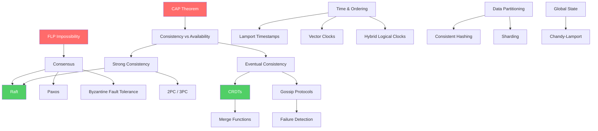

# Distributed Systems

A distributed system is a collection of independent computers that appears to its users as a single coherent system. This seemingly simple definition conceals decades of research, thousands of papers, and some of the hardest problems in computer science.

This section doesn't just describe distributed systems — it takes you from the fundamental impossibility results (FLP, CAP) through the algorithms that work around them (Raft, Paxos, CRDTs) to the engineering decisions you'll make when building real systems.

## Why Distributed Systems Matter

Every production system you build will be distributed. The moment you have:
- A web server talking to a database → distributed system
- Two services communicating over HTTP → distributed system
- A cache layer between your app and storage → distributed system
- A read replica for your database → distributed system

You cannot escape distribution. You can only choose whether to understand it or be surprised by it.

## The Eight Fallacies

In 1994, Peter Deutsch and James Gosling identified assumptions that developers make about distributed systems that are all false:

1. **The network is reliable** — packets drop, connections reset, cables get cut
2. **Latency is zero** — every network call adds milliseconds to seconds
3. **Bandwidth is infinite** — you can saturate any link with enough traffic
4. **The network is secure** — every byte traversing the network can be intercepted
5. **Topology doesn't change** — nodes join, leave, and fail constantly
6. **There is one administrator** — multiple teams, multiple policies, multiple agendas
7. **Transport cost is zero** — serialization, deserialization, encryption all cost CPU
8. **The network is homogeneous** — different hardware, OS versions, protocol versions

Every decision in this section traces back to these realities.

## Concept Map

## Learning Path

Follow this order for the most coherent understanding:

| Order | Topic | Why This Order |
|-------|-------|---------------|
| 1 | [CAP Theorem](./cap-theorem) | The foundational trade-off that shapes every design decision |
| 2 | [Consistency Models](./consistency-models) | Understand what "consistent" actually means (it's not what you think) |
| 3 | [Clock Synchronization](./clock-synchronization) | Why you can't trust time in distributed systems |
| 4 | [Vector Clocks & Lamport Timestamps](./vector-clocks-lamport-timestamps) | How to order events without synchronized clocks |
| 5 | [Failure Detectors](./failure-detectors) | How nodes determine if other nodes are dead |
| 6 | [Gossip Protocols](./gossip-protocols) | How information spreads through a cluster |
| 7 | [Consistent Hashing](./consistent-hashing) | How to distribute data across nodes evenly |
| 8 | [Distributed Transactions](./distributed-transactions) | 2PC, 3PC, Sagas — coordinating across boundaries |
| 9 | [Distributed Snapshots](./distributed-snapshots) | How to capture global state of a running system |
| 10 | [Byzantine Fault Tolerance](./byzantine-fault-tolerance) | When nodes can lie — the hardest problem |
| 11 | [CRDTs](./crdt-fundamentals) | Data structures that never conflict — the elegant alternative |

## Key Insight

The entire field of distributed systems can be reduced to one question:

> **How do we get multiple machines to agree on something when any of them can fail at any time, messages can be lost or delayed, and there is no shared clock?**

Every algorithm, every protocol, every pattern in this section is an answer to some aspect of this question, each making different trade-offs about what guarantees it provides and what it gives up.
