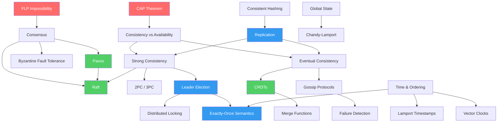

# Distributed Systems

A distributed system is a collection of independent computers that appears to its users as a single coherent system. This seemingly simple definition conceals decades of research, thousands of papers, and some of the hardest problems in computer science.

This section doesn't just describe distributed systems — it takes you from the fundamental impossibility results (FLP, CAP) through the algorithms that work around them (Raft, Paxos, CRDTs) to the engineering decisions you'll make when building real systems.

## Why Distributed Systems Matter

Every production system you build will be distributed. The moment you have:
- A web server talking to a database → distributed system
- Two services communicating over HTTP → distributed system
- A cache layer between your app and storage → distributed system
- A read replica for your database → distributed system

You cannot escape distribution. You can only choose whether to understand it or be surprised by it.

## The Eight Fallacies

In 1994, Peter Deutsch and James Gosling identified assumptions that developers make about distributed systems that are all false:

1. **The network is reliable** — packets drop, connections reset, cables get cut
2. **Latency is zero** — every network call adds milliseconds to seconds
3. **Bandwidth is infinite** — you can saturate any link with enough traffic
4. **The network is secure** — every byte traversing the network can be intercepted
5. **Topology doesn't change** — nodes join, leave, and fail constantly
6. **There is one administrator** — multiple teams, multiple policies, multiple agendas
7. **Transport cost is zero** — serialization, deserialization, encryption all cost CPU
8. **The network is homogeneous** — different hardware, OS versions, protocol versions

Every decision in this section traces back to these realities.

## Concept Map

```mermaid
graph TB
    FLP[FLP Impossibility] --> Consensus
    CAP[CAP Theorem] --> Tradeoffs[Consistency vs Availability]

    Consensus --> Paxos
    Consensus --> Raft
    Consensus --> BFT[Byzantine Fault Tolerance]
    Paxos --> Raft

    Tradeoffs --> Strong[Strong Consistency]
    Tradeoffs --> Eventual[Eventual Consistency]

    Strong --> TwoPC[2PC / 3PC]
    Strong --> Raft
    Strong --> LeaderElection[Leader Election]

    Eventual --> CRDTs
    Eventual --> Gossip[Gossip Protocols]

    LeaderElection --> DistLocking[Distributed Locking]
    LeaderElection --> ExactlyOnce[Exactly-Once Semantics]

    CRDTs --> MergeFunction[Merge Functions]
    Gossip --> FailureDetection[Failure Detection]

    Time[Time & Ordering] --> Lamport[Lamport Timestamps]
    Time --> Vector[Vector Clocks]
    Time --> ExactlyOnce

    Replication --> Strong
    Replication --> Eventual
    ConsistentHashing[Consistent Hashing] --> Replication

    Snapshots[Global State] --> ChandyLamport[Chandy-Lamport]

    style FLP fill:#ff6b6b,color:#fff
    style CAP fill:#ff6b6b,color:#fff
    style Raft fill:#51cf66,color:#fff
    style Paxos fill:#51cf66,color:#fff
    style CRDTs fill:#51cf66,color:#fff
    style ExactlyOnce fill:#339af0,color:#fff
    style Replication fill:#339af0,color:#fff
    style LeaderElection fill:#339af0,color:#fff
```

## Learning Path

Follow this order for the most coherent understanding. Richer than any single course — covers theory, algorithms, and production patterns.

### Part 1 — Foundations
*The theorems and models that shape every design decision.*

| Order | Topic | Why This Order |
|-------|-------|---------------|
| 1 | [CAP Theorem](./cap-theorem) | The foundational trade-off — consistency vs availability during partitions |
| 2 | [Consistency Models](./consistency-models) | What "consistent" actually means — strong, causal, eventual, and everything between |
| 3 | [FLP Impossibility](./flp-impossibility) | Why consensus is impossible in async systems — and how real protocols escape it |

### Part 2 — Data Distribution
*How data gets spread across nodes and kept in sync.*

| Order | Topic | Why This Order |
|-------|-------|---------------|
| 4 | [Replication](./replication) | Single-leader, multi-leader, leaderless — the full spectrum with trade-offs |
| 5 | [Consistent Hashing](./consistent-hashing) | How to partition data across nodes with minimal reshuffling |

### Part 3 — Consensus & Coordination
*The algorithms that let distributed nodes agree on things.*

| Order | Topic | Why This Order |
|-------|-------|---------------|
| 6 | [Distributed Transactions](./distributed-transactions) | 2PC, 3PC, Sagas — coordinating writes across service boundaries |
| 7 | [Paxos](./paxos) | The original consensus algorithm — theory every engineer should know |
| 8 | [Leader Election](./leader-election) | Bully, Ring, Raft election, ZooKeeper — and how to avoid split-brain |
| 9 | [Distributed Locking](./distributed-locking) | Mutex semantics over a network — fencing tokens, Redlock, and why it's hard |

### Part 4 — Time & Order
*Why clocks lie and how to order events without them.*

| Order | Topic | Why This Order |
|-------|-------|---------------|
| 10 | [Clock Synchronization](./clock-synchronization) | NTP, PTP, TrueTime — and why you still can't trust wall clocks |
| 11 | [Vector Clocks & Lamport Timestamps](./vector-clocks-lamport-timestamps) | Causal ordering of events without synchronized clocks |
| 12 | [Exactly-Once Semantics](./exactly-once-semantics) | Idempotency, transactional outbox, Kafka EOS — the hardest messaging guarantee |

### Part 5 — Failure & Recovery
*How nodes detect, gossip about, and recover from failures.*

| Order | Topic | Why This Order |
|-------|-------|---------------|
| 13 | [Failure Detectors](./failure-detectors) | Φ-accrual, heartbeats, timeouts — how nodes know when peers are dead |
| 14 | [Gossip Protocols](./gossip-protocols) | Epidemic information spreading — membership, failure detection at scale |
| 15 | [Distributed Snapshots](./distributed-snapshots) | Chandy-Lamport — capturing consistent global state of a running system |

### Part 6 — Advanced Theory
*The deep end — CRDTs, Byzantine failures, probabilistic structures.*

| Order | Topic | Why This Order |
|-------|-------|---------------|
| 16 | [CRDTs](./crdt-fundamentals) | Data structures that merge without conflicts — the elegant alternative to locking |
| 17 | [Byzantine Fault Tolerance](./byzantine-fault-tolerance) | When nodes can lie — PBFT, PoW, the 3f+1 requirement |

### Part 7 — Practical Tools
*Applied patterns you'll use daily in production.*

| Order | Topic | Why This Order |
|-------|-------|---------------|
| 18 | [Rate Limiting](./rate-limiting) | Token bucket, sliding window, Redis-based distributed enforcement |
| 19 | [Circuit Breaker](./circuit-breaker) | Failure isolation — preventing cascading failures across services |
| 20 | [Bloom Filters](./bloom-filters) | Probabilistic set membership — space-efficient duplicate detection |
| 21 | [Queueing Theory](./queueing-theory) | Little's Law, M/M/1 queues — the math behind capacity planning |

## Key Insight

The entire field of distributed systems can be reduced to one question:

> **How do we get multiple machines to agree on something when any of them can fail at any time, messages can be lost or delayed, and there is no shared clock?**

Every algorithm, every protocol, every pattern in this section is an answer to some aspect of this question, each making different trade-offs about what guarantees it provides and what it gives up.
