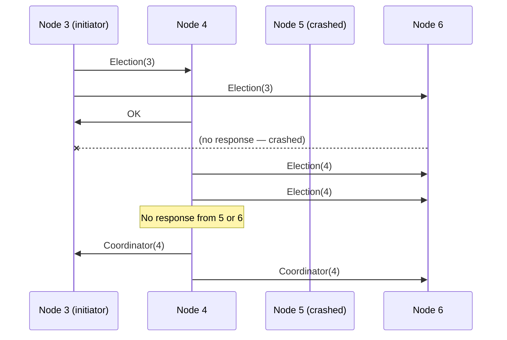
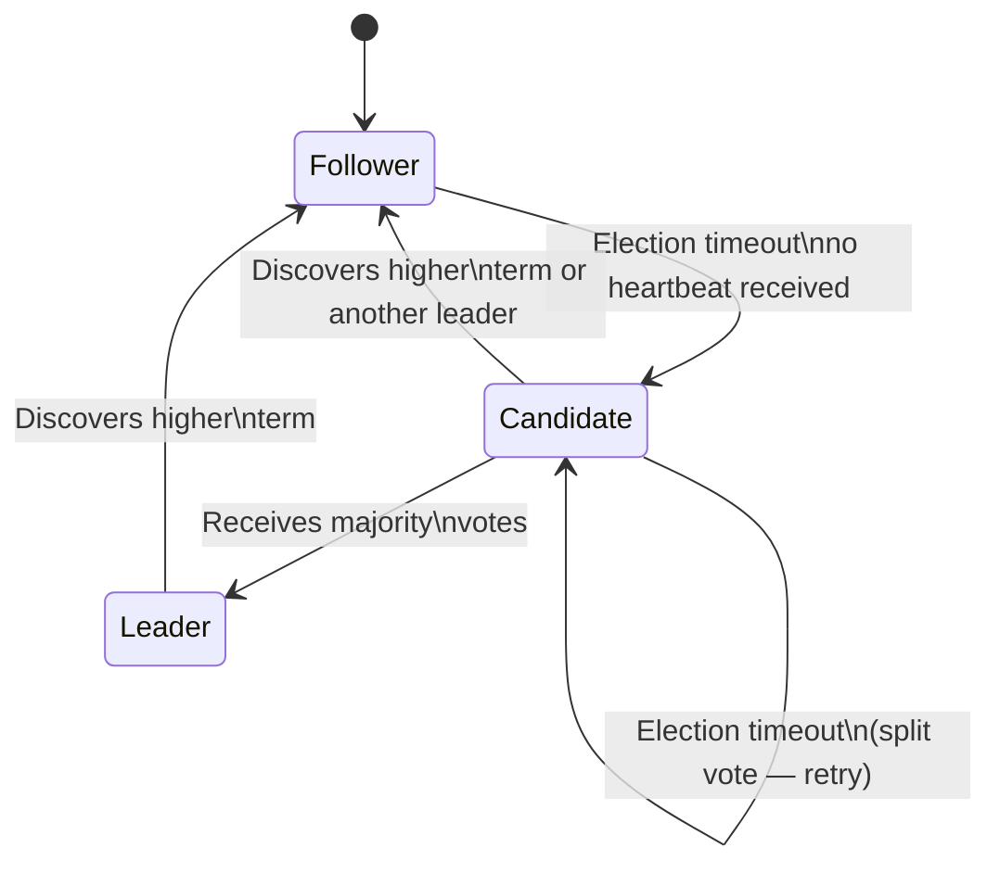

# Leader Election

Many distributed systems require a single coordinator: the Kafka controller that assigns partitions, the primary database that accepts writes, the scheduler that prevents duplicate job runs, the lock server that serializes access. 

**Leader election** is the process by which distributed nodes agree on a single leader from among themselves — and then recover by electing a new one when the current leader fails.

---

## Why You Need a Leader

Not all distributed systems need a leader. Leaderless systems (Cassandra, Dynamo) avoid the complexity entirely. But a leader simplifies:

- **Serialization** — one node orders all operations, no conflicts
- **Coordination** — one node makes decisions others follow
- **Consistency** — reads from the leader always see the latest writes

The cost: the leader is a **single point of bottleneck** and a **single point of failure**. Leader election is the mechanism that handles the failure case.

---

## Requirements

A correct leader election algorithm must guarantee:

1. **Safety** — At most one leader at any time (no split-brain)
2. **Liveness** — A leader is eventually elected if enough nodes are up
3. **Validity** — The elected leader is a live node

These map directly to the consensus problem. Leader election *is* a form of consensus — agreeing on the value "which node is the leader."

---

## The Bully Algorithm

The classic algorithm for fully-connected networks where every node knows every other node's ID.

**Assumption:** Higher ID = "stronger" node. Strongest healthy node wins.

### How It Works

```
When a node P notices the leader is dead:
1. P sends Election(P.id) to all nodes with higher IDs
2. If no response within timeout: P declares itself leader
   → P sends Coordinator(P.id) to all nodes with lower IDs
3. If a higher-ID node Q receives Election(P.id):
   → Q sends OK to P (suppressing P's election)
   → Q starts its own election
```



**Problems:**
- O(n²) messages in the worst case
- Assumes synchrony (relies on timeouts)
- A slow node with a high ID can suppress a faster, lower-ID node from leading

---

## Ring Election

Nodes are arranged in a logical ring. Each node knows its successor.

### Chang-Roberts Algorithm

```
1. Node P suspects leader has crashed
2. P sends Election(P.id) to its successor
3. Each node Q that receives Election(id):
   - If id > Q.id: forward Election(id) to successor
   - If id < Q.id: send Election(Q.id) instead (suppress smaller IDs)
   - If id == Q.id: Q is the leader, send Coordinator(Q.id) around the ring
```

```mermaid
graph LR
    N1((1)) -->|Election(1)| N2((2))
    N2 -->|Election(2)| N3((3))
    N3 -->|Election(5)| N4((5))
    N4 -->|Election(5)| N5((5 = leader))
    N5 -->|Coordinator(5)| N1
```

**Complexity:** O(n) messages in the best case, O(n²) worst case (multiple simultaneous initiators).

**Real-world use:** Token Ring networks historically used ring election. Modern systems rarely use it — Raft is better.

---

## Raft Leader Election

The algorithm used by etcd, CockroachDB, TiKV, and most modern distributed databases. Built into Raft's design — not a separate mechanism.

### Roles

- **Follower** — passive, responds to requests from leaders/candidates
- **Candidate** — actively trying to become leader
- **Leader** — handles all client requests, sends heartbeats

### Terms

Time is divided into **terms** (monotonically increasing integers). Each term begins with an election. If a candidate wins, it serves as leader for the rest of the term. Terms act as logical clocks — stale messages from old terms are rejected.

### The Algorithm

```
Trigger: Follower receives no heartbeat within election timeout (150-300ms)
1. Follower increments its term, becomes Candidate
2. Votes for itself, sends RequestVote(term, candidateId, lastLogIndex, lastLogTerm) to all
3. Votes granted if:
   - Voter hasn't voted this term AND
   - Candidate's log is at least as up-to-date as voter's log
4. If candidate receives votes from majority: becomes Leader
5. Leader sends heartbeats (empty AppendEntries) to prevent new elections
```



### Split Vote Handling

If two candidates start elections simultaneously, votes may split and neither wins. Raft uses **randomized election timeouts** (each node picks a random timeout in 150-300ms range) to prevent simultaneous elections. The first node to time out usually wins before others even start.

This is also how Raft escapes the [FLP impossibility](/system-design/distributed-systems/flp-impossibility) — randomization breaks the deterministic adversary.

### Log Safety Constraint

A candidate can only win if its log is at least as up-to-date as the majority of the cluster. This prevents electing a leader that's missing committed entries:

```
Candidate A: log = [1,2,3,4,5]
Candidate B: log = [1,2,3]

Nodes with log [1,2,3,4,5] will NOT vote for B
→ B cannot win majority → A wins
→ No committed entries are lost
```

---

## ZooKeeper-Based Election

For systems that don't implement their own consensus, ZooKeeper (or etcd) provides leader election as a service.

### Pattern: Ephemeral Sequential Nodes

```
1. Each candidate creates a ZNode: /election/candidate-{seq_num}
   (Sequential: ZooKeeper auto-assigns incrementing numbers)
2. List all /election/ children, sort by sequence number
3. If I have the lowest number: I am the leader
4. Otherwise: watch the node with the next lower sequence number
5. When watched node is deleted (leader died): repeat from step 2
```

```
/election/
  candidate-0000000001  ← Leader
  candidate-0000000002  ← Watches 0001
  candidate-0000000003  ← Watches 0002
```

**Why watch the predecessor, not the leader?** If all nodes watch the leader's ZNode, when it dies, all nodes simultaneously try to read the children list → **herd effect** (thundering herd). Watching only the predecessor serializes the election without the thundering herd.

**Used by:** Kafka (controller election), HBase (HMaster election), older Hadoop (NameNode HA).

---

## Split-Brain: The Nightmare Scenario

Split-brain occurs when two nodes both believe they are the leader simultaneously.

```
Timeline:
t=0: Node A is leader, replicating to Node B and C
t=1: Network partition — A can reach B, C can reach D and E
t=2: C detects A is unreachable, starts election
t=3: C wins (quorum: C, D, E)
t=4: Both A and C are accepting writes as leader
t=5: Partition heals — conflicting data
```

### Prevention

**Quorum:** Only allow a leader to operate if it can communicate with a majority (N/2 + 1 nodes). A minority partition cannot elect a leader. This is the core mechanism in Raft and Paxos.

**Fencing tokens:** Each leader receives a monotonically increasing token. Storage systems reject requests with stale tokens. A partitioned old leader with token `5` is rejected by storage when the new leader with token `6` is operating.

```
Leader A (token=5): WRITE key=X val=old
Storage: "Current leader token is 6, rejecting token 5" → rejected ✓
```

**STONITH (Shoot The Other Node In The Head):** When a failover occurs, explicitly kill the old leader before promoting the new one. Common in Pacemaker/Corosync (Linux HA cluster). Brutal but effective.

---

## Practical Recommendations

| Scenario | Recommendation |
|----------|---------------|
| New distributed system | Use Raft (via etcd or CockroachDB) |
| Need lightweight coordination | Use etcd's built-in leader election |
| Existing ZooKeeper infrastructure | Use ZooKeeper ephemeral nodes |
| Database primary election | Use Patroni (PostgreSQL) or Orchestrator (MySQL) |
| Simple single-region | Use Redis SETNX with TTL as a simple lock |

**Never implement split-brain prevention yourself.** Use a battle-tested consensus library. The failure modes are subtle and the consequences (data corruption) are severe.
