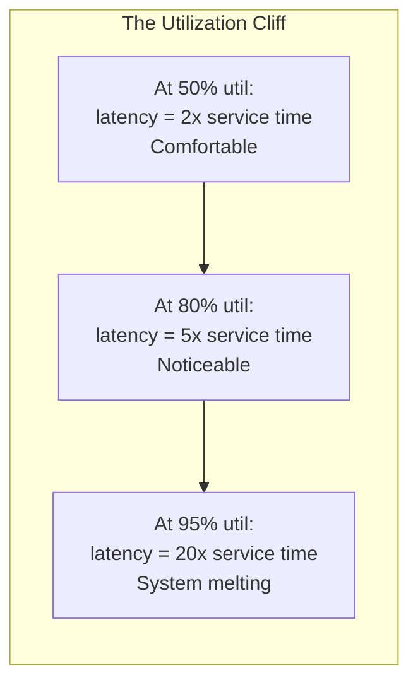

# Queueing Theory

Queueing theory is the mathematics of waiting. Every time a request hits your load balancer, enters a thread pool, joins a Kafka partition, or waits for a database connection — it enters a queue. Understanding queueing theory lets you predict when systems will break before they actually break, and explains why your p99 latency is 50x your median.

This is not abstract math. If you have ever asked "why does latency spike at 70% CPU?" or "how many instances do I need to keep p99 under 200ms?" — the answer comes from queueing theory.

## Little's Law

Little's Law is the most useful result in queueing theory. It requires almost no assumptions and applies to virtually any stable system:

$$
L = \lambda W
$$

Where:
- $L$ = average number of items in the system (queue + being served)
- $\lambda$ = average arrival rate (items per unit time)
- $W$ = average time an item spends in the system (wait time + service time)

### Intuition

If a coffee shop serves 60 customers per hour ($\lambda = 60/\text{hr}$) and each customer spends an average of 5 minutes in the shop ($W = 5/60 \text{ hr}$), then at any given moment there are on average:

$$
L = 60 \times \frac{5}{60} = 5 \text{ customers in the shop}
$$

### Application: Sizing a Connection Pool

Your service handles 1,000 requests/second. Each request holds a database connection for an average of 10ms.

$$
L = \lambda W = 1000 \times 0.01 = 10 \text{ connections in use}
$$

You need at least 10 connections in your pool to sustain this throughput. In practice, add headroom for variance — 2-3x is common, so 20-30 connections.

::: tip Little's Law Is Model-Free
Little's Law holds for any stable system regardless of arrival distribution, service distribution, number of servers, or queueing discipline. The only requirement is that the system is in steady state (arrival rate equals departure rate over time). This makes it extraordinarily useful for quick capacity estimates.
:::

### Application: Throughput from Latency

You observe that your API has 200ms average latency ($W = 0.2s$) and your load balancer shows 50 concurrent requests on average ($L = 50$). Your throughput is:

$$
\lambda = \frac{L}{W} = \frac{50}{0.2} = 250 \text{ requests/second}
$$

## The M/M/1 Queue

The M/M/1 queue is the simplest analytically tractable queueing model:
- **M** — Arrivals follow a Poisson process (memoryless, exponentially distributed inter-arrival times)
- **M** — Service times are exponentially distributed
- **1** — One server

Despite its simplicity, M/M/1 captures the essential behavior of many real systems and explains the nonlinear relationship between utilization and latency.

### Key Parameters

- $\lambda$ = arrival rate (requests/second)
- $\mu$ = service rate (requests/second one server can process)
- $\rho = \frac{\lambda}{\mu}$ = utilization (fraction of time the server is busy)

For stability, we require $\rho < 1$ (the server must be faster than the arrival rate on average).

### M/M/1 Results

**Average number in system:**

$$
L = \frac{\rho}{1 - \rho}
$$

**Average time in system (wait + service):**

$$
W = \frac{1}{\mu - \lambda} = \frac{1}{\mu(1 - \rho)}
$$

**Average time waiting in queue (before service begins):**

$$
W_q = \frac{\rho}{\mu(1 - \rho)}
$$

**Average number waiting in queue:**

$$
L_q = \frac{\rho^2}{1 - \rho}
$$

### The Utilization Cliff

This is the most important insight from queueing theory. Plot $L$ against $\rho$:

| Utilization $\rho$ | Avg Queue Length $L$ | Avg Wait Time Multiple |
|---------------------|---------------------|----------------------|
| 0.1 (10%) | 0.11 | 1.1x service time |
| 0.3 (30%) | 0.43 | 1.4x |
| 0.5 (50%) | 1.0 | 2.0x |
| 0.7 (70%) | 2.3 | 3.3x |
| 0.8 (80%) | 4.0 | 5.0x |
| 0.9 (90%) | 9.0 | 10.0x |
| 0.95 (95%) | 19.0 | 20.0x |
| 0.99 (99%) | 99.0 | 100.0x |



::: danger The 80% Rule
Never plan to run a system above 70-80% utilization in production. The relationship between utilization and latency is not linear — it is a hyperbola ($\frac{1}{1-\rho}$). Going from 70% to 90% utilization does not increase latency by 28% — it increases it by **3.3x**. This is why systems seem "fine" until they suddenly are not.
:::

### Practical Example: Thread Pool Sizing

Your API server has a thread pool of 100 threads ($c = 100$, but treating as M/M/1 for each thread). Each request takes an average of 50ms to process ($\mu = 20$ req/s per thread). Total capacity is $100 \times 20 = 2000$ req/s.

At 1400 req/s ($\rho = 0.70$):
$$
W = \frac{1}{2000 - 1400} = \frac{1}{600} \approx 1.67\text{ms wait} + 50\text{ms service} \approx 52\text{ms total}
$$

At 1800 req/s ($\rho = 0.90$):
$$
W = \frac{1}{2000 - 1800} = \frac{1}{200} = 5\text{ms wait} + 50\text{ms service} = 55\text{ms total}
$$

At 1960 req/s ($\rho = 0.98$):
$$
W = \frac{1}{2000 - 1960} = \frac{1}{40} = 25\text{ms wait} + 50\text{ms service} = 75\text{ms total}
$$

At 1990 req/s ($\rho = 0.995$): $W = 200\text{ms wait} + 50\text{ms service} = 250\text{ms total}$

The system went from 52ms to 250ms by adding 42% more traffic.

## The M/M/c Queue (Multi-Server)

Real systems have multiple servers (threads, instances, workers). The M/M/c queue models $c$ identical parallel servers with a single shared queue.

### Parameters

- $\lambda$ = arrival rate
- $\mu$ = per-server service rate
- $c$ = number of servers
- $\rho = \frac{\lambda}{c\mu}$ = per-server utilization (must be < 1 for stability)

### Erlang-C Formula

The probability that an arriving customer must wait (all servers busy):

$$
C(c, \rho) = \frac{\frac{(c\rho)^c}{c!} \cdot \frac{1}{1-\rho}}{\sum_{k=0}^{c-1} \frac{(c\rho)^k}{k!} + \frac{(c\rho)^c}{c!} \cdot \frac{1}{1-\rho}}
$$

**Average wait time in queue:**

$$
W_q = \frac{C(c, \rho)}{c\mu(1-\rho)}
$$

**Average time in system:**

$$
W = W_q + \frac{1}{\mu}
$$

### Why Multi-Server Is Better Than Multiple Single-Server

A single queue feeding multiple servers (M/M/c) always outperforms multiple separate queues (c independent M/M/1 systems). This is because a shared queue eliminates the problem of one server sitting idle while another has a backlog.

| Configuration | Arrival Rate | Servers | Utilization | Avg Wait |
|---------------|-------------|---------|-------------|----------|
| 1 queue, 4 servers (M/M/4) | 300 req/s | 4 at 100 req/s each | 75% | Low |
| 4 queues, 1 server each (4x M/M/1) | 75 req/s each | 4 at 100 req/s each | 75% | Higher |

This is why supermarkets with a single serpentine line are more efficient than per-register lines, and why a shared thread pool outperforms per-client worker threads.

::: tip Practical Implication
Always prefer a single shared queue feeding multiple workers over separate per-worker queues. This applies to:
- Thread pools (shared work queue, not per-thread queues)
- Load balancers (least-connections, not round-robin which approximates separate queues)
- Kafka consumers (more partitions per consumer group, not separate consumer groups)
:::

## Why p99 >> p50: Heavy-Tailed Distributions

In production systems, the p99 latency is often 10-100x the p50. This is not a bug — it is a fundamental property of queueing systems with variable service times.

### The Exponential vs. Heavy-Tailed Service Times

The M/M/1 model assumes exponential service times, which are well-behaved. Real systems have heavy-tailed service times due to:
- Garbage collection pauses
- Cache misses (L1 cache hit: 1ns, disk read: 10ms — a 10,000,000x difference)
- Lock contention
- Network retries
- Database query plan regressions
- Background compaction in LSM-tree databases

### Percentile Amplification in Queues

When requests with variable service times queue behind each other, slow requests delay fast ones. A single 100ms garbage collection pause at the head of the queue delays every request behind it.

If service time has a coefficient of variation $C_s = \frac{\sigma_s}{\bar{s}}$ (standard deviation divided by mean), then wait times scale with $C_s^2$. For exponential distributions, $C_s = 1$. For heavy-tailed distributions, $C_s \gg 1$, and wait times explode.

### Real-World Percentile Example

Consider an API with these service time percentiles:

| Percentile | Service Time | Explanation |
|------------|-------------|-------------|
| p50 | 5ms | Typical request — cache hit, fast query |
| p90 | 20ms | Moderate — larger payload, index scan |
| p99 | 150ms | Slow — cache miss, GC pause, cold start |
| p99.9 | 800ms | Very slow — timeout + retry, compaction |

After queueing (at 70% utilization), the latency distribution widens further:

| Percentile | Service Time | After Queueing | Amplification |
|------------|-------------|----------------|---------------|
| p50 | 5ms | 12ms | 2.4x |
| p90 | 20ms | 65ms | 3.3x |
| p99 | 150ms | 890ms | 5.9x |
| p99.9 | 800ms | 4200ms | 5.3x |

::: warning Averages Lie
Never use average latency to assess system health. A system with 5ms average latency might have a p99 of 2 seconds. The average is dominated by the fast majority, completely hiding the slow tail that real users experience. Always monitor p50, p90, p99, and p99.9.
:::

### Fan-Out Amplifies Tail Latency

When a single user request fans out to N backend services (common in microservices), the overall latency is the maximum of all N calls. The probability that at least one call hits the tail increases rapidly:

$$
P(\text{any call slow}) = 1 - (1 - P(\text{one call slow}))^N
$$

For a p99 of 100ms across each of $N = 50$ parallel calls:

$$
P(\text{at least one call > 100ms}) = 1 - (1 - 0.01)^{50} = 1 - 0.99^{50} \approx 0.395
$$

**39.5% of user requests** will experience a slow backend call. Your user-facing p99 is driven by the backend's p99, amplified by fan-out. This is why Jeff Dean's "tail at scale" paper is essential reading.

## Kingman's Formula

Kingman's formula (also called the VUT formula) estimates average wait time for a G/G/1 queue (general arrival and service distributions, single server):

$$
W_q \approx \left(\frac{\rho}{1-\rho}\right) \cdot \left(\frac{C_a^2 + C_s^2}{2}\right) \cdot \bar{s}
$$

Where:
- $\rho$ = utilization
- $C_a$ = coefficient of variation of inter-arrival times ($\frac{\sigma_a}{\bar{a}}$)
- $C_s$ = coefficient of variation of service times ($\frac{\sigma_s}{\bar{s}}$)
- $\bar{s}$ = mean service time

### The VUT Decomposition

The formula has three intuitive factors:

| Factor | Symbol | Meaning |
|--------|--------|---------|
| **V** (Variability) | $\frac{C_a^2 + C_s^2}{2}$ | How variable are arrivals and service times? |
| **U** (Utilization) | $\frac{\rho}{1-\rho}$ | How busy is the server? |
| **T** (Time) | $\bar{s}$ | How long does service take? |

This decomposition is powerful because it tells you the three levers you have to reduce wait times:

1. **Reduce variability** — More consistent request handling (eliminate GC pauses, use connection pools, avoid cold starts)
2. **Reduce utilization** — Add more servers (horizontal scaling)
3. **Reduce service time** — Make each request faster (optimize code, add caching)

### Example: Impact of Service Time Variability

Two systems with the same average service time (10ms) and utilization (80%):

**System A:** Consistent service times ($C_s = 0.2$)
$$
W_q \approx \frac{0.8}{0.2} \times \frac{1 + 0.04}{2} \times 10\text{ms} = 4 \times 0.52 \times 10 = 20.8\text{ms}
$$

**System B:** Highly variable service times ($C_s = 3.0$)
$$
W_q \approx \frac{0.8}{0.2} \times \frac{1 + 9}{2} \times 10\text{ms} = 4 \times 5 \times 10 = 200\text{ms}
$$

System B has **10x the wait time** despite identical average throughput and utilization. This is why reducing variance (eliminating outlier requests) is often more impactful than reducing average latency.

## Applying Queueing Theory to Capacity Planning

### Step 1: Measure Your Parameters

```bash
# Measure arrival rate (requests per second)
# From your load balancer metrics or application metrics

# Measure service time distribution
# p50, p90, p99, mean, standard deviation
# From your APM tool (Datadog, Grafana, etc.)

# Calculate utilization
# CPU utilization, thread pool utilization, connection pool utilization
```

| Metric | How to Get It | What It Tells You |
|--------|--------------|-------------------|
| $\lambda$ (arrival rate) | Load balancer RPS | Demand on the system |
| $\bar{s}$ (mean service time) | APM p50 or mean latency | How fast the system processes |
| $C_s$ (service time CoV) | $\text{stddev} / \text{mean}$ from latency histogram | How variable processing is |
| $\rho$ (utilization) | CPU usage, thread pool active/total | How close to saturation |

### Step 2: Model Your System

For a web service with $c$ instances, each handling $\mu$ requests/second:

$$
\text{Max throughput} = c \times \mu
$$

$$
\text{Target utilization} \leq 0.7 \text{ (70% rule)}
$$

$$
\text{Required instances} = \left\lceil \frac{\lambda}{0.7 \times \mu} \right\rceil
$$

### Step 3: Predict Latency at Target Load

Use Kingman's formula to estimate wait times at your target utilization:

```python
import math

def kingman_wait(arrival_rate, service_rate, ca, cs):
    """Estimate average wait time using Kingman's formula."""
    rho = arrival_rate / service_rate
    if rho >= 1.0:
        return float('inf')  # System is unstable

    mean_service = 1.0 / service_rate
    variability = (ca**2 + cs**2) / 2.0
    utilization = rho / (1.0 - rho)

    return utilization * variability * mean_service

def capacity_plan(peak_rps, service_time_ms, service_time_std_ms,
                  target_util=0.7, target_wait_ms=50):
    """Calculate required instances for a capacity target."""
    mu = 1000.0 / service_time_ms  # per-instance throughput (req/s)
    cs = service_time_std_ms / service_time_ms

    # Instances needed for utilization target
    instances_util = math.ceil(peak_rps / (target_util * mu))

    # Check if wait time meets target
    total_mu = instances_util * mu
    rho = peak_rps / total_mu
    ca = 1.0  # Assume Poisson arrivals
    wait = kingman_wait(peak_rps, total_mu, ca, cs) * 1000  # ms

    print(f"Peak RPS: {peak_rps}")
    print(f"Per-instance throughput: {mu:.0f} req/s")
    print(f"Instances needed (utilization): {instances_util}")
    print(f"Actual utilization: {rho:.2%}")
    print(f"Estimated avg wait: {wait:.1f} ms")
    print(f"Estimated avg total: {wait + service_time_ms:.1f} ms")

    if wait > target_wait_ms:
        # Need more instances
        # Iterate to find the right number
        for c in range(instances_util, instances_util * 3):
            total_mu = c * mu
            rho = peak_rps / total_mu
            if rho >= 1.0:
                continue
            wait = kingman_wait(peak_rps, total_mu, ca, cs) * 1000
            if wait <= target_wait_ms:
                print(f"\nTo meet {target_wait_ms}ms wait target: {c} instances "
                      f"(util={rho:.2%}, wait={wait:.1f}ms)")
                break

# Example: API doing 5000 RPS, 20ms avg service, 15ms std dev
capacity_plan(
    peak_rps=5000,
    service_time_ms=20,
    service_time_std_ms=15,
    target_util=0.7,
    target_wait_ms=10
)
```

### Step 4: Plan for Spikes

Traffic is not constant. Use a multiplier based on your traffic pattern:

| Traffic Pattern | Spike Multiplier | Example |
|----------------|-----------------|---------|
| Steady SaaS B2B | 1.5-2x average | Business hours traffic |
| Consumer web | 2-3x average | Evening peak |
| E-commerce | 5-10x average | Flash sales, Black Friday |
| Gaming | 3-5x average | New content release |
| Event-driven | 10-100x average | Super Bowl, election night |

$$
\text{Required capacity} = \text{spike multiplier} \times \text{average capacity requirement}
$$

::: tip Autoscaling Is Not Instant
Cloud autoscaling takes 2-10 minutes to add new instances (boot, health check, warm up). During that window, your existing fleet must absorb the spike. Size your base fleet for the traffic level you must sustain during the scaling lag.
:::

## Key Takeaways

| Principle | Formula | Practical Implication |
|-----------|---------|----------------------|
| Little's Law | $L = \lambda W$ | Relate concurrency, throughput, and latency |
| Utilization cliff | $W \propto \frac{1}{1-\rho}$ | Never run above 70-80% utilization |
| Shared queues win | M/M/c > c x M/M/1 | Use shared work queues, not per-worker queues |
| Variance kills | $W_q \propto C_s^2$ | Reducing variance > reducing mean |
| Tail amplification | $P = 1-(1-p)^N$ | Fan-out amplifies tail latency |
| Kingman's formula | $W_q = \frac{\rho}{1-\rho} \cdot \frac{C_a^2+C_s^2}{2} \cdot \bar{s}$ | Three levers: variability, utilization, service time |

## Further Reading

- [Consistent Hashing](/system-design/distributed-systems/consistent-hashing) — Load distribution across nodes
- [Rate Limiting](/system-design/distributed-systems/rate-limiting) — Controlling arrival rate $\lambda$
- [Load Balancing Algorithms](/system-design/load-balancing/algorithms) — Queue assignment strategies
- [Caching Strategies](/system-design/caching/caching-strategies) — Reducing service time $\bar{s}$
- [Backpressure Patterns](/system-design/message-queues/backpressure-patterns) — What to do when queues fill up
- *Performance Modeling and Design of Computer Systems* by Mor Harchol-Balter — The definitive textbook
- Jeff Dean, "The Tail at Scale" (2013) — Fan-out and tail latency in large-scale systems
- *Erta Elahi, "Queuing Theory and Telecommunications"* — Applied queueing for network engineers
