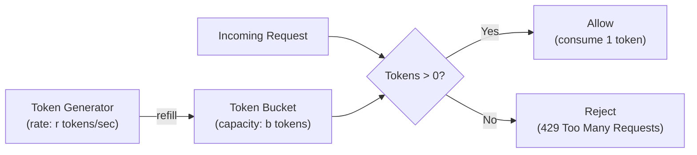
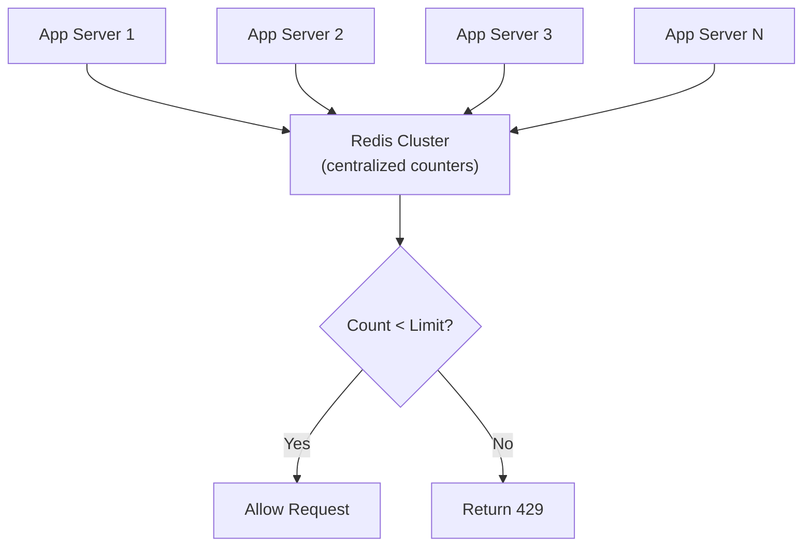
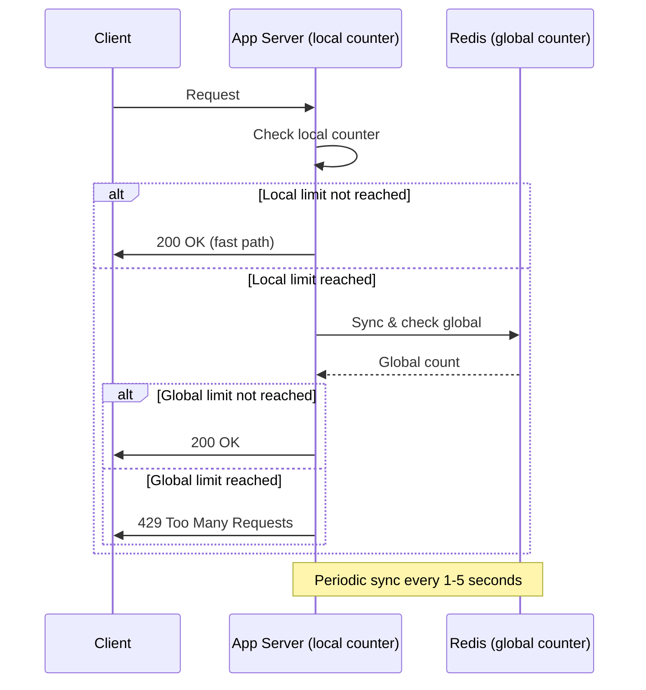
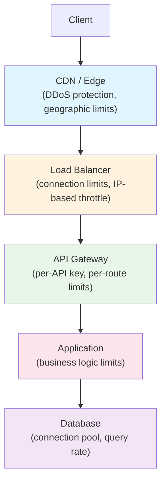

# Rate Limiting

Rate limiting is the practice of controlling the number of requests a client can make to a system within a given time window. It sounds trivial — count requests, reject extras — but the implementation details determine whether your system gracefully degrades under load or collapses when you need it most. Every production API you have ever used enforces rate limits, and getting the algorithm wrong can either block legitimate users or let abusive traffic through.

Rate limiting is not just about protection. It is a fundamental capacity planning tool. It lets you make guarantees about system behavior under load, allocate resources fairly between tenants, and create predictable cost models for your infrastructure.

## Why Rate Limiting Matters

Without rate limiting, a single misbehaving client — or a coordinated attack — can consume all your capacity:

```
Normal traffic:     ████████░░░░░░░░░░░░  40% capacity
Spike without RL:   ████████████████████  100% → cascading failure
Spike with RL:      ████████████░░░░░░░░  60% → graceful degradation
```

Rate limiting serves four distinct purposes:

| Purpose | Example |
|---------|---------|
| **Security** | Prevent brute-force login attempts |
| **Availability** | Protect backends from traffic spikes |
| **Fairness** | Prevent one tenant from starving others |
| **Cost control** | Cap expensive API calls per billing period |

## Rate Limiting Algorithms

There are four major algorithms, each with different trade-offs. Understanding the math behind each one is critical for choosing the right approach.

### Fixed Window Counter

The simplest algorithm. Divide time into fixed windows (e.g., 1-minute intervals) and count requests per window.

```mermaid
gantt
    title Fixed Window Counter (limit: 5 req/min)
    dateFormat X
    axisFormat %s

    section Window 1
    Requests 1-5 (allowed)  :done, 0, 60
    section Window 2
    Requests 1-3 (allowed)  :done, 60, 120
    section Window 3
    Requests 1-5 (allowed)  :done, 120, 180
```



**Implementation in Python:**

```python
import time
from dataclasses import dataclass

@dataclass
class FixedWindowLimiter:
    max_requests: int
    window_size_seconds: int

    def __post_init__(self):
        self.windows: dict[str, dict] = {}

    def allow_request(self, client_id: str) -> bool:
        now = time.time()
        window_key = int(now // self.window_size_seconds)

        if client_id not in self.windows:
            self.windows[client_id] = {}

        client = self.windows[client_id]

        if client.get("window") != window_key:
            client["window"] = window_key
            client["count"] = 0

        if client["count"] >= self.max_requests:
            return False

        client["count"] += 1
        return True

# Usage
limiter = FixedWindowLimiter(max_requests=100, window_size_seconds=60)
if not limiter.allow_request("user-123"):
    raise RateLimitExceeded("Try again later")
```

**The boundary problem:** If a client sends 100 requests at 0:59 and 100 more at 1:01, they get 200 requests through in 2 seconds — double the intended rate. This happens because the counter resets at window boundaries.

$$
\text{Worst-case burst} = 2 \times \text{max\_requests}
$$

### Sliding Window Log

Fixes the boundary problem by tracking the exact timestamp of every request.

```python
import time
from collections import deque

class SlidingWindowLogLimiter:
    def __init__(self, max_requests: int, window_seconds: int):
        self.max_requests = max_requests
        self.window_seconds = window_seconds
        self.logs: dict[str, deque] = {}

    def allow_request(self, client_id: str) -> bool:
        now = time.time()
        cutoff = now - self.window_seconds

        if client_id not in self.logs:
            self.logs[client_id] = deque()

        log = self.logs[client_id]

        # Remove expired entries
        while log and log[0] <= cutoff:
            log.popleft()

        if len(log) >= self.max_requests:
            return False

        log.append(now)
        return True
```

**Trade-off:** Exact correctness, but $O(n)$ memory per client where $n$ is the number of requests in the window. For high-rate clients, this can be expensive.

### Sliding Window Counter

A hybrid that combines fixed window counting with interpolation to approximate a sliding window, using $O(1)$ memory per client.

```python
import time

class SlidingWindowCounter:
    def __init__(self, max_requests: int, window_seconds: int):
        self.max_requests = max_requests
        self.window_seconds = window_seconds
        self.clients: dict[str, dict] = {}

    def allow_request(self, client_id: str) -> bool:
        now = time.time()
        current_window = int(now // self.window_seconds)
        window_elapsed = (now % self.window_seconds) / self.window_seconds

        if client_id not in self.clients:
            self.clients[client_id] = {
                "prev_count": 0,
                "curr_count": 0,
                "curr_window": current_window,
            }

        client = self.clients[client_id]

        if client["curr_window"] < current_window:
            client["prev_count"] = client["curr_count"]
            client["curr_count"] = 0
            client["curr_window"] = current_window

        # Weighted count: previous window's remaining weight + current count
        estimated_count = (
            client["prev_count"] * (1 - window_elapsed)
            + client["curr_count"]
        )

        if estimated_count >= self.max_requests:
            return False

        client["curr_count"] += 1
        return True
```

The estimated request count for the sliding window is:

$$
\text{count} = \text{prev\_count} \times (1 - \text{elapsed\_fraction}) + \text{curr\_count}
$$

This gives ~0.003% false positive rate in practice according to Cloudflare's measurements — close enough to exact for virtually all use cases.

### Token Bucket

The most flexible algorithm. A bucket holds tokens; each request consumes a token. Tokens are added at a constant rate. This naturally allows controlled bursts while enforcing an average rate.



**Key parameters:**

| Parameter | Meaning | Effect |
|-----------|---------|--------|
| **Bucket size** ($b$) | Maximum tokens stored | Controls burst size |
| **Refill rate** ($r$) | Tokens added per second | Controls sustained rate |

```go
package ratelimit

import (
	"sync"
	"time"
)

type TokenBucket struct {
	mu         sync.Mutex
	tokens     float64
	maxTokens  float64
	refillRate float64 // tokens per second
	lastRefill time.Time
}

func NewTokenBucket(maxTokens float64, refillRate float64) *TokenBucket {
	return &TokenBucket{
		tokens:     maxTokens,
		maxTokens:  maxTokens,
		refillRate: refillRate,
		lastRefill: time.Now(),
	}
}

func (tb *TokenBucket) Allow() bool {
	tb.mu.Lock()
	defer tb.mu.Unlock()

	now := time.Now()
	elapsed := now.Sub(tb.lastRefill).Seconds()
	tb.tokens += elapsed * tb.refillRate
	if tb.tokens > tb.maxTokens {
		tb.tokens = tb.maxTokens
	}
	tb.lastRefill = now

	if tb.tokens < 1 {
		return false
	}

	tb.tokens--
	return true
}
```

**The math:** After an idle period of $t$ seconds, the bucket has $\min(b, r \cdot t)$ tokens available. A client that was silent for 10 seconds with $r = 10$ tokens/sec and $b = 50$ gets an immediate burst of 50 requests, then is limited to 10/sec thereafter.

### Leaky Bucket

The inverse of token bucket. Requests enter a queue (bucket) and are processed at a constant rate. If the queue is full, new requests are dropped.

```python
import time
from collections import deque
from threading import Lock

class LeakyBucket:
    def __init__(self, capacity: int, leak_rate: float):
        self.capacity = capacity
        self.leak_rate = leak_rate  # requests processed per second
        self.queue: deque = deque()
        self.last_leak = time.time()
        self.lock = Lock()

    def allow_request(self, request_id: str) -> bool:
        with self.lock:
            self._leak()
            if len(self.queue) >= self.capacity:
                return False
            self.queue.append(request_id)
            return True

    def _leak(self):
        now = time.time()
        elapsed = now - self.last_leak
        leaked = int(elapsed * self.leak_rate)
        for _ in range(min(leaked, len(self.queue))):
            self.queue.popleft()
        if leaked > 0:
            self.last_leak = now
```

::: tip Token Bucket vs Leaky Bucket
Token bucket allows bursts up to the bucket size. Leaky bucket smooths traffic to a constant output rate. Choose token bucket when you want to allow burst traffic; choose leaky bucket when you need to protect downstream services that cannot handle spikes.
:::

### Algorithm Comparison

| Algorithm | Memory | Accuracy | Burst Handling | Complexity |
|-----------|--------|----------|----------------|------------|
| Fixed Window | $O(1)$ per client | Low (boundary issue) | Allows 2x burst | Simple |
| Sliding Log | $O(n)$ per client | Exact | No bursts | Moderate |
| Sliding Counter | $O(1)$ per client | ~99.997% | Minimal bursts | Moderate |
| Token Bucket | $O(1)$ per client | Exact for rate | Controlled bursts | Moderate |
| Leaky Bucket | $O(b)$ per client | Exact for rate | No bursts | Moderate |

## Distributed Rate Limiting

Single-node rate limiting is straightforward. The hard problem is rate limiting across a distributed system where requests can hit any of N servers.

### Centralized Counter with Redis

The most common production approach. All application nodes check a shared Redis counter.



**Redis sliding window implementation using sorted sets:**

```python
import redis
import time

class RedisRateLimiter:
    def __init__(self, redis_client: redis.Redis, max_requests: int,
                 window_seconds: int):
        self.redis = redis_client
        self.max_requests = max_requests
        self.window_seconds = window_seconds

    def allow_request(self, client_id: str) -> tuple[bool, dict]:
        key = f"ratelimit:{client_id}"
        now = time.time()
        cutoff = now - self.window_seconds

        pipe = self.redis.pipeline()
        # Remove expired entries
        pipe.zremrangebyscore(key, 0, cutoff)
        # Count remaining entries
        pipe.zcard(key)
        # Add current request (score = timestamp, member = unique ID)
        pipe.zadd(key, {f"{now}": now})
        # Set expiry on the key
        pipe.expire(key, self.window_seconds)

        results = pipe.execute()
        request_count = results[1]

        allowed = request_count < self.max_requests
        remaining = max(0, self.max_requests - request_count - 1)

        headers = {
            "X-RateLimit-Limit": str(self.max_requests),
            "X-RateLimit-Remaining": str(remaining),
            "X-RateLimit-Reset": str(int(now) + self.window_seconds),
        }

        if not allowed:
            # Remove the request we just added
            self.redis.zrem(key, f"{now}")
            headers["Retry-After"] = str(self.window_seconds)

        return allowed, headers
```

::: warning Redis Latency Matters
Every rate limit check adds a round-trip to Redis (~0.5-2ms on the same AZ). At 100K requests/sec, that is 100K extra Redis commands per second. Use pipelining, connection pooling, and consider [Redis Caching Patterns](/system-design/caching/redis-caching-patterns) for optimization.
:::

**Atomic token bucket in Redis using Lua scripting:**

```lua
-- KEYS[1] = rate limit key
-- ARGV[1] = max_tokens (bucket capacity)
-- ARGV[2] = refill_rate (tokens per second)
-- ARGV[3] = now (current timestamp in milliseconds)
-- ARGV[4] = requested tokens (usually 1)

local key = KEYS[1]
local max_tokens = tonumber(ARGV[1])
local refill_rate = tonumber(ARGV[2])
local now = tonumber(ARGV[3])
local requested = tonumber(ARGV[4])

local data = redis.call('HMGET', key, 'tokens', 'last_refill')
local tokens = tonumber(data[1]) or max_tokens
local last_refill = tonumber(data[2]) or now

-- Calculate token refill
local elapsed = (now - last_refill) / 1000.0
tokens = math.min(max_tokens, tokens + elapsed * refill_rate)

local allowed = 0
if tokens >= requested then
    tokens = tokens - requested
    allowed = 1
end

redis.call('HMSET', key, 'tokens', tokens, 'last_refill', now)
redis.call('PEXPIRE', key, math.ceil(max_tokens / refill_rate) * 1000)

return {allowed, math.floor(tokens)}
```

### Local + Global Hybrid

For ultra-low latency, use local rate limiting with periodic synchronization:



```python
import threading
import time

class HybridRateLimiter:
    def __init__(self, redis_client, max_requests: int,
                 window_seconds: int, num_servers: int,
                 sync_interval: float = 2.0):
        self.redis = redis_client
        self.max_requests = max_requests
        self.window_seconds = window_seconds
        self.local_limit = max_requests // num_servers  # Fair share
        self.sync_interval = sync_interval
        self.local_counts: dict[str, int] = {}
        self.lock = threading.Lock()

        # Start background sync
        self._start_sync_thread()

    def allow_request(self, client_id: str) -> bool:
        with self.lock:
            count = self.local_counts.get(client_id, 0)
            if count >= self.local_limit:
                return False
            self.local_counts[client_id] = count + 1
            return True

    def _sync_to_redis(self):
        with self.lock:
            for client_id, count in self.local_counts.items():
                key = f"ratelimit:global:{client_id}"
                self.redis.incrby(key, count)
                self.redis.expire(key, self.window_seconds)
            self.local_counts.clear()

    def _start_sync_thread(self):
        def sync_loop():
            while True:
                time.sleep(self.sync_interval)
                self._sync_to_redis()
        t = threading.Thread(target=sync_loop, daemon=True)
        t.start()
```

::: danger Consistency Trade-off
The hybrid approach trades consistency for latency. With N servers syncing every S seconds, the system can temporarily allow up to $N \times \text{local\_limit}$ extra requests during the sync window. This is acceptable for most API rate limiting but not for security-critical limits like login attempts.
:::

## Rate Limiting at Different Layers

Production systems enforce rate limits at multiple layers, each serving a different purpose.



| Layer | What to Limit | Why |
|-------|--------------|-----|
| **CDN/Edge** | Requests per IP, per region | Stop DDoS before it reaches your infra |
| **Load Balancer** | Connections per IP, bandwidth | Prevent connection exhaustion |
| **API Gateway** | Requests per API key, per route | Enforce billing tiers, protect specific endpoints |
| **Application** | Business operations per user | Prevent abuse (e.g., max 10 password resets/hour) |
| **Database** | Queries per connection, connection pool size | Prevent query storms from overwhelming the DB |

### API Gateway Rate Limiting

Most API gateways (Kong, AWS API Gateway, Traefik) have built-in rate limiting. Here is a Kong configuration:

```yaml
# Kong rate limiting plugin
plugins:
  - name: rate-limiting
    config:
      second: 50
      minute: 1000
      hour: 10000
      policy: redis
      redis_host: redis.internal
      redis_port: 6379
      redis_database: 0
      fault_tolerant: true    # Allow traffic if Redis is down
      hide_client_headers: false
      limit_by: credential    # Per API key
```

### NGINX Rate Limiting

NGINX uses the leaky bucket algorithm via its `limit_req` module. See [Nginx Deep Dive](/infrastructure/nginx/) for full configuration.

```nginx
http {
    # Define a rate limit zone: 10 requests/second per IP
    limit_req_zone $binary_remote_addr zone=api:10m rate=10r/s;

    server {
        location /api/ {
            # Allow burst of 20, process excess without delay up to 10
            limit_req zone=api burst=20 nodelay;
            limit_req_status 429;

            proxy_pass http://backend;
        }
    }
}
```

## Response Headers and Client Behavior

Standard rate limit response headers (RFC 6585, IETF draft `RateLimit` fields):

```http
HTTP/1.1 429 Too Many Requests
Content-Type: application/json
X-RateLimit-Limit: 1000
X-RateLimit-Remaining: 0
X-RateLimit-Reset: 1711027200
Retry-After: 30

{
  "error": "rate_limit_exceeded",
  "message": "Rate limit of 1000 requests per hour exceeded",
  "retry_after": 30
}
```

::: tip Client-Side Rate Limit Handling
Good API clients implement exponential backoff with jitter when they receive a 429:

$$
\text{delay} = \min\left(\text{base} \times 2^{\text{attempt}} + \text{random}(0, \text{jitter}),\ \text{max\_delay}\right)
$$

This prevents [thundering herd](/system-design/caching/thundering-herd) effects when many clients are rate-limited simultaneously.
:::

```typescript
async function requestWithBackoff<T>(
  fn: () => Promise<T>,
  maxRetries: number = 5
): Promise<T> {
  for (let attempt = 0; attempt <= maxRetries; attempt++) {
    try {
      return await fn();
    } catch (error: any) {
      if (error.status !== 429 || attempt === maxRetries) throw error;

      const retryAfter = error.headers?.['retry-after'];
      const delay = retryAfter
        ? parseInt(retryAfter) * 1000
        : Math.min(1000 * Math.pow(2, attempt) + Math.random() * 1000, 30000);

      console.warn(`Rate limited. Retrying in ${​{delay}}ms (attempt ${​{attempt + 1}})`);
      await new Promise(resolve => setTimeout(resolve, delay));
    }
  }
  throw new Error('Max retries exceeded');
}
```

## Multi-Tenant Rate Limiting

In SaaS systems, you need different limits for different tiers:

```python
from enum import Enum
from dataclasses import dataclass

class Tier(Enum):
    FREE = "free"
    PRO = "pro"
    ENTERPRISE = "enterprise"

@dataclass
class RateLimitPolicy:
    requests_per_second: int
    requests_per_minute: int
    requests_per_day: int
    burst_size: int

TIER_POLICIES: dict[Tier, RateLimitPolicy] = {
    Tier.FREE:       RateLimitPolicy(1, 60, 1_000, 5),
    Tier.PRO:        RateLimitPolicy(10, 600, 50_000, 50),
    Tier.ENTERPRISE: RateLimitPolicy(100, 6_000, 1_000_000, 500),
}

class MultiTenantRateLimiter:
    def __init__(self, redis_client):
        self.redis = redis_client
        self.limiters: dict[str, dict] = {}

    def check_all_limits(self, tenant_id: str, tier: Tier) -> bool:
        policy = TIER_POLICIES[tier]

        checks = [
            self._check(tenant_id, "sec", 1, policy.requests_per_second),
            self._check(tenant_id, "min", 60, policy.requests_per_minute),
            self._check(tenant_id, "day", 86400, policy.requests_per_day),
        ]

        return all(checks)

    def _check(self, tenant_id: str, window: str,
               duration: int, limit: int) -> bool:
        key = f"rl:{tenant_id}:{window}"
        count = self.redis.incr(key)
        if count == 1:
            self.redis.expire(key, duration)
        return count <= limit
```

## Graceful Degradation Strategies

When rate limits are hit, do not just return 429. Consider these strategies:

1. **Queue and delay** — Accept the request but process it later
2. **Serve cached responses** — Return stale data instead of rejecting
3. **Reduce quality** — Return a simplified response (no recommendations, no personalization)
4. **Prioritize** — Rate limit low-priority traffic first, keep critical paths open

```python
class GracefulRateLimiter:
    def handle_request(self, request, client_id: str):
        priority = self.get_priority(request)

        if priority == "critical":
            # Never rate limit health checks, webhooks
            return self.process(request)

        if not self.limiter.allow_request(client_id):
            if priority == "high":
                return self.serve_cached(request)
            elif priority == "medium":
                return self.enqueue(request)
            else:
                return Response(status=429, body="Rate limited")

        return self.process(request)
```

## Testing Rate Limiters

Rate limiters are notoriously hard to test because they depend on time. Use clock injection:

```go
type Clock interface {
	Now() time.Time
}

type RealClock struct{}
func (RealClock) Now() time.Time { return time.Now() }

type MockClock struct {
	current time.Time
}
func (m *MockClock) Now() time.Time  { return m.current }
func (m *MockClock) Advance(d time.Duration) { m.current = m.current.Add(d) }

func TestTokenBucket(t *testing.T) {
	clock := &MockClock{current: time.Now()}
	bucket := NewTokenBucketWithClock(10, 1.0, clock) // 10 tokens, 1/sec refill

	// Consume all tokens
	for i := 0; i < 10; i++ {
		if !bucket.Allow() {
			t.Fatalf("request %d should be allowed", i)
		}
	}

	// Next request should be rejected
	if bucket.Allow() {
		t.Fatal("request should be rejected")
	}

	// Advance time by 5 seconds, should have 5 tokens
	clock.Advance(5 * time.Second)
	for i := 0; i < 5; i++ {
		if !bucket.Allow() {
			t.Fatalf("request %d should be allowed after refill", i)
		}
	}
}
```

## Further Reading

- [Circuit Breaker Pattern](/system-design/distributed-systems/circuit-breaker) — Complementary resilience pattern that works with rate limiting
- [Consistent Hashing](/system-design/distributed-systems/consistent-hashing) — How to distribute rate limit state across nodes
- [CAP Theorem](/system-design/distributed-systems/cap-theorem) — Why distributed rate limiters must choose between accuracy and availability
- [Nginx Deep Dive](/infrastructure/nginx/) — NGINX's built-in rate limiting module
- [Observability](/infrastructure/observability/) — How to monitor rate limit metrics and alert on anomalies
- Google's "Using load shedding to avoid overload" from the SRE book
- Stripe's blog post "Scaling your API with rate limiters"
- Cloudflare's "How we built rate limiting capable of scaling to millions of domains"
