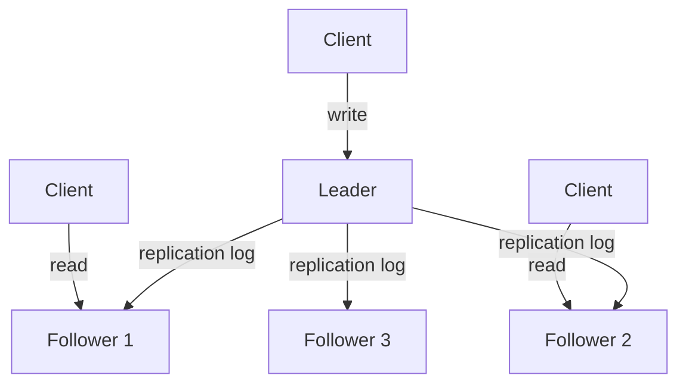
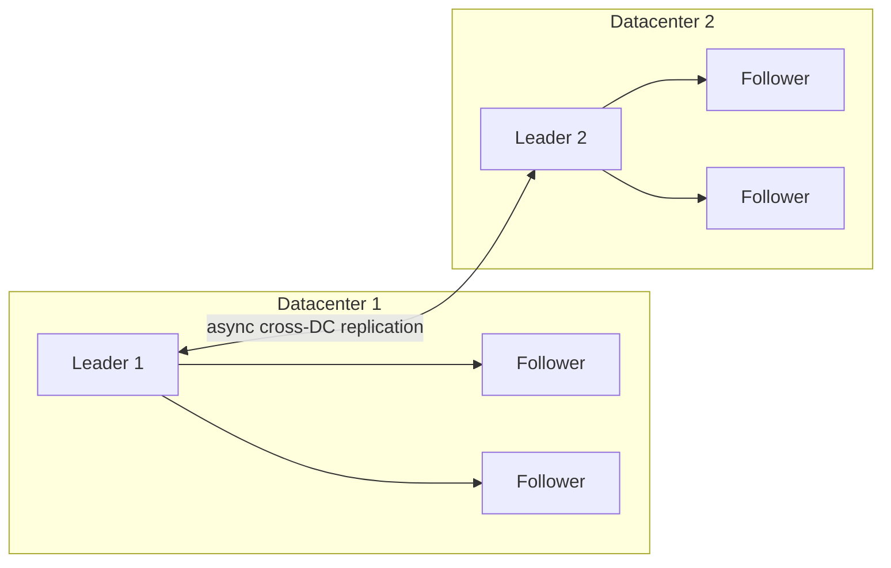
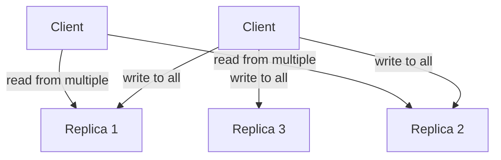

# Replication

Replication means keeping the same data on multiple nodes. The reasons are straightforward:
- **Availability** — if one node dies, others serve reads/writes
- **Latency** — serve users from a geographically closer replica
- **Read throughput** — spread read load across replicas

The hard part is keeping replicas in sync when data changes. Every replication scheme makes trade-offs about what happens when the network partitions, a replica falls behind, or two nodes accept conflicting writes.

---

## Single-Leader Replication

The most common approach. One node is designated the **leader** (also called primary or master). All writes go to the leader. Followers replicate from the leader.



### How Replication Works

The leader writes changes to a **replication log** (WAL in PostgreSQL, binlog in MySQL). Followers consume this log and apply changes in order.

**Synchronous replication:**
- Leader waits for follower to confirm before acknowledging the write to the client
- Follower is guaranteed to be up-to-date
- Write latency = leader latency + round-trip to follower
- If the synchronous follower is slow or down, writes block

**Asynchronous replication:**
- Leader acknowledges the write immediately after writing locally
- Followers replicate in the background
- Low write latency
- **Replication lag** — followers may be seconds or minutes behind
- If the leader crashes before replication completes, writes are lost

**Semi-synchronous (most practical):**
- One follower is synchronous; the rest are async
- Guarantees at least two copies of every write
- PostgreSQL's `synchronous_standby_names` works this way

### Replication Lag Problems

When followers are behind the leader, you get consistency anomalies:

**Read-your-own-writes violation:**
```
1. User writes a post
2. Read is routed to a lagging follower
3. User sees their post hasn't appeared yet
```
Fix: Route reads to the leader for a short window after a write from the same user.

**Monotonic reads violation:**
```
1. User reads comment from follower A (up to date)
2. User refreshes, routed to follower B (30s behind)
3. Comment appears to vanish
```
Fix: Route a user's reads to the same replica consistently (e.g., hash user ID to replica).

**Causal consistency violation:**
```
1. User A asks a question
2. User B answers
3. User C sees the answer but not the question (follower lag)
```
Fix: Track causality via vector clocks or only replicate causally ordered writes.

### Failover

When the leader fails:
1. Detect failure via heartbeat timeout
2. Elect a new leader (the most up-to-date follower)
3. Redirect clients to the new leader

Problems that can arise:
- **Split brain** — old leader comes back thinking it's still leader; two leaders accept writes simultaneously
- **Lost writes** — async-replicated writes on old leader that weren't yet replicated are lost when new leader takes over
- **Wrong failover** — promoting a follower that's far behind can lose more data

---

## Multi-Leader Replication

Multiple nodes accept writes. Each leader replicates to the others. Common for **multi-datacenter** setups.



**Benefits:**
- Writes served locally in each datacenter → low latency
- Works even if inter-DC network partitions (each DC keeps accepting writes)

**The problem: write conflicts**

```
1. User on DC1 sets title = "Hello"
2. Concurrently, user on DC2 sets title = "World"
3. Both leaders replicate to each other
4. What is the final value?
```

### Conflict Resolution Strategies

**Last-write-wins (LWW):**
Use timestamps — the write with the highest timestamp wins. Simple but loses data (the "Hello" write is silently discarded).

**Merge:**
Keep both values and let the application merge them. Works for commutative operations (sets, counters). Used by Riak, CRDTs.

**Custom conflict resolution:**
On write: reject the conflicting write (require explicit conflict resolution).
On read: return all conflicting values and let the application decide. CouchDB uses this.

**Operational Transformation / CRDTs:**
Design data structures that are inherently conflict-free. Every concurrent edit can be merged deterministically. Google Docs uses OT; collaborative text editors increasingly use CRDTs.

---

## Leaderless Replication

No designated leader. Any replica accepts writes. The client (or a coordinator) sends writes to multiple replicas simultaneously.

Made famous by Amazon Dynamo (2007). Used by Cassandra, DynamoDB, Riak.



### Quorum Reads and Writes

With N replicas, write to W replicas, read from R replicas:

$$W + R > N \implies \text{at least one replica is always in both sets}$$

The read will always hit at least one replica that has the latest write.

**Common configurations:**
| N | W | R | Trade-off |
|---|---|---|-----------|
| 3 | 2 | 2 | Balanced — tolerates 1 failure |
| 3 | 3 | 1 | Strong write consistency, fast reads |
| 3 | 1 | 3 | Fast writes, strong reads |
| 3 | 1 | 1 | Maximum availability, no consistency guarantee |

**Cassandra defaults:** N=3, W=1, R=1 (eventual consistency). Tunable per query.

### Handling Stale Reads

Even with W+R > N, you can get stale reads if:
- A write failed on some replicas (partial write)
- A replica was down during the write and just came back

**Read repair:** When a read detects stale data on a replica, it writes the fresh value back. Happens in the read path.

**Anti-entropy:** A background process constantly compares replicas and syncs differences. Uses Merkle trees to efficiently find diverged data.

**Hinted handoff:** If a target replica is down, a different replica temporarily holds the write and forwards it when the target recovers.

### Sloppy Quorums

During a network partition, strict quorum (W+R > N) might fail because not enough replicas are reachable. A **sloppy quorum** allows writing to any W reachable replicas, even if they're not in the usual N.

Trade-off: higher availability, but reads from the original N replicas might not see the latest write until handoff completes.

---

## Replication Comparison

| | Single-Leader | Multi-Leader | Leaderless |
|---|---|---|---|
| **Write conflicts** | None (one writer) | Possible | Possible |
| **Write latency** | Leader RTT | Local DC | Tunable |
| **Read latency** | Low (follower) | Low (local DC) | Tunable |
| **Failover complexity** | High | Medium | Low |
| **Consistency** | Strong (sync) / Eventual (async) | Eventual | Tunable |
| **Used by** | PostgreSQL, MySQL, MongoDB | MySQL (cross-DC), CouchDB | Cassandra, DynamoDB, Riak |

---

## Replication Factor and Durability

Higher replication factor = more durability, more storage cost, higher write latency.

**N=1:** No redundancy. Any failure loses data.
**N=2:** Survives 1 failure. No quorum possible (split-brain on partition).
**N=3:** Survives 1 failure. Quorum = 2/3. Most common production default.
**N=5:** Survives 2 failures. Used for critical data (financial records, auth tokens).

**Rule of thumb:** For OLTP data, N=3 with synchronous replication to at least one follower. For object storage (S3-style), N=3+ with erasure coding.

---

## Practical Patterns

**Read replicas (PostgreSQL):**
```
Primary accepts writes, replicates via streaming WAL to standby nodes.
Application routes reads to standby, writes to primary.
Replication lag: typically <1s for same-region replicas.
```

**Cassandra with LOCAL_QUORUM:**
```
W=QUORUM within local DC, replicated async to remote DC.
Strong consistency within a DC, eventual across DCs.
```

**MySQL GTID-based replication:**
```
Global Transaction IDs track exactly which transactions each replica has applied.
Enables safe, automatic failover without manual binlog position tracking.
```

---

## What Can Go Wrong in Production

1. **Replication lag spike** under write burst → stale reads increase
2. **Circular replication** in multi-leader without loop detection → infinite replication
3. **Ghost rows** after failover — rows written to old leader that weren't replicated
4. **Schema changes** on leader before replica has applied them → replication stops on type mismatch
5. **Clock skew** in LWW — two writes a millisecond apart on different machines; NTP drift decides the winner

The safest default: synchronous replication to one follower + async to the rest, with automatic failover that requires manual confirmation before promoting a stale replica.
