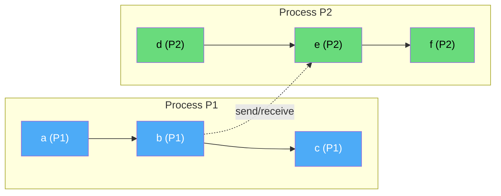
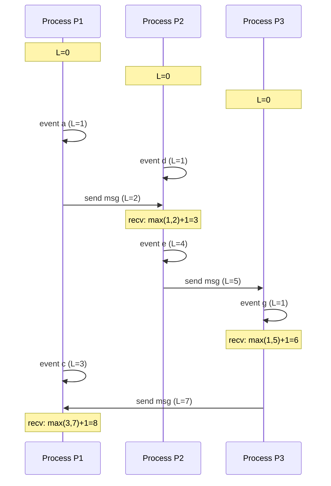
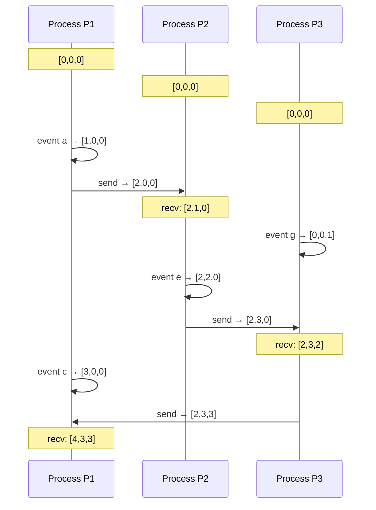
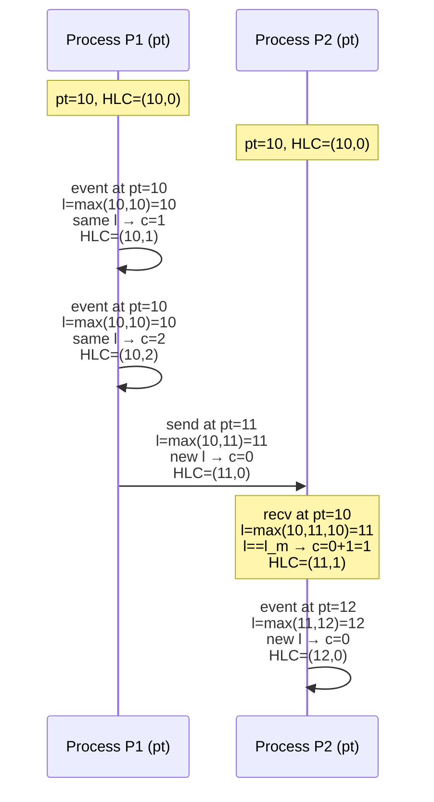
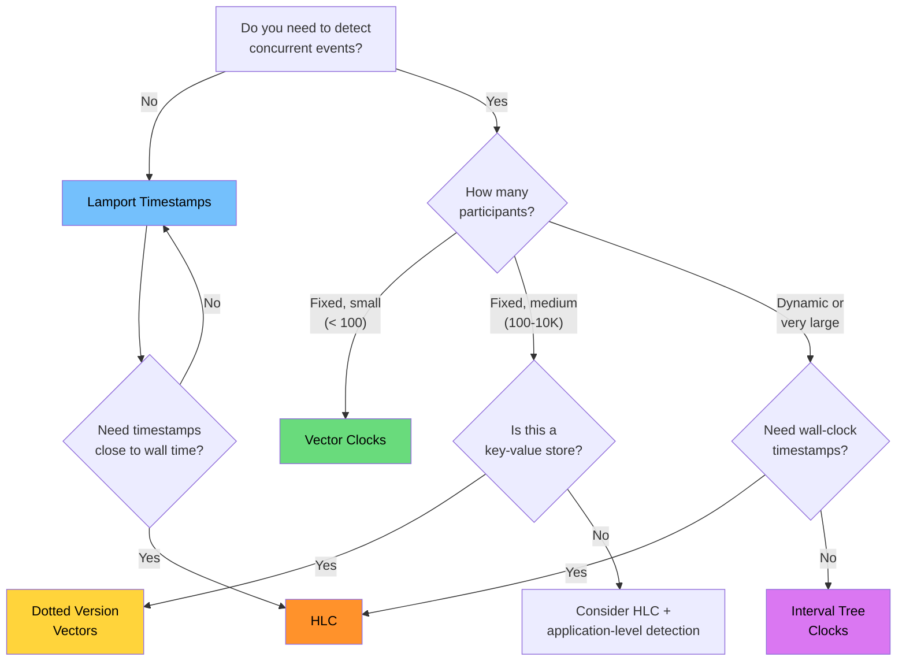

# Vector Clocks & Lamport Timestamps

Time is the most deceptive concept in distributed systems. On a single machine, you can call `Date.now()` and trust the result. In a distributed system, that same call on two different machines will give you two different numbers — and neither one is "right." This page covers the entire landscape of logical time: from Lamport's 1978 breakthrough through vector clocks, hybrid logical clocks, dotted version vectors, and interval tree clocks. Every mechanism exists because physical time fails, and understanding exactly *how* it fails is the foundation of everything that follows.

## 1. Why Logical Clocks Exist

### The Problem of Physical Time

Every computer has a quartz crystal oscillator that vibrates at a nominal frequency (typically 32.768 kHz for real-time clocks or MHz/GHz for CPU clocks). These crystals are imperfect. They drift.

**Clock drift** is the rate at which a clock diverges from a reference. Commodity hardware drifts at roughly 10–200 parts per million (ppm). That means:

- At 100 ppm drift, a clock gains or loses **8.64 seconds per day**
- After one week: **~1 minute** of drift
- After one month: **~4.3 minutes** of drift

**Clock skew** is the instantaneous difference between two clocks at a given moment. Even if you synchronize two clocks perfectly at time $t_0$, their drift rates differ, so skew grows over time.

**NTP (Network Time Protocol)** can synchronize clocks to within a few milliseconds on a LAN and tens of milliseconds over the internet. But NTP has fundamental limitations:

1. **Network jitter** — round-trip time varies unpredictably, making precise synchronization impossible
2. **Step corrections** — NTP may jump the clock forward or backward, creating duplicate or missing timestamps
3. **Slew corrections** — NTP may speed up or slow down the clock, making durations unreliable
4. **Asymmetric paths** — NTP assumes symmetric network delay, which is often false
5. **Leap seconds** — the clock may go from `23:59:59` to `23:59:60` or skip `23:59:60` entirely

::: danger Physical Clocks Are Unreliable for Ordering
If machine A timestamps event $e_1$ at `T=100` and machine B timestamps event $e_2$ at `T=101`, you CANNOT conclude that $e_1$ happened before $e_2$. The clocks could be skewed such that $e_2$ actually happened first. Physical timestamps provide no causal ordering guarantees across machines.
:::

### What We Actually Need

In distributed systems, we rarely need to know the *exact* time something happened. What we need is to answer the question:

> **Did event A happen before event B, or are they concurrent?**

This is a question about **causal ordering**, not wall-clock time. Logical clocks answer this question without relying on physical time at all.

## 2. First Principles: The Happens-Before Relation

Leslie Lamport defined the **happens-before** relation ($\rightarrow$) in his 1978 paper "Time, Clocks, and the Ordering of Events in a Distributed System." It is the foundation of all logical clock mechanisms.

### Definition

The happens-before relation $\rightarrow$ is the smallest relation on events satisfying three rules:

1. **Process order:** If events $a$ and $b$ occur on the same process, and $a$ comes before $b$ in the process's execution, then $a \rightarrow b$.

2. **Message causality:** If event $a$ is the sending of a message and event $b$ is the receipt of that same message by another process, then $a \rightarrow b$.

3. **Transitivity:** If $a \rightarrow b$ and $b \rightarrow c$, then $a \rightarrow c$.

### Concurrent Events

Two events $a$ and $b$ are **concurrent** (written $a \| b$) if and only if:

$$
a \| b \iff \neg(a \rightarrow b) \land \neg(b \rightarrow a)
$$

Concurrent events have no causal relationship. Neither one could have influenced the other. They happened in separate causal chains, possibly at the "same time" or possibly not — we cannot tell, and it does not matter.

### Partial Order

The happens-before relation is a **strict partial order** on events:

- **Irreflexive:** $\neg(a \rightarrow a)$ — no event happens before itself
- **Asymmetric:** $a \rightarrow b \implies \neg(b \rightarrow a)$
- **Transitive:** $a \rightarrow b \land b \rightarrow c \implies a \rightarrow c$

It is a *partial* order because not all events are comparable — concurrent events are incomparable. This is fundamentally different from physical time, which is a *total* order on all events.



In this diagram:
- $a \rightarrow b \rightarrow c$ (process order on P1)
- $d \rightarrow e \rightarrow f$ (process order on P2)
- $b \rightarrow e$ (message causality)
- By transitivity: $a \rightarrow e$, $a \rightarrow f$, $b \rightarrow f$
- Concurrent pairs: $a \| d$, $a \| e$ is **false** ($a \rightarrow e$), $c \| f$, $c \| d$, $c \| e$, $d \| a$, $d \| b$, $d \| c$

## 3. Lamport Timestamps

### Core Mechanics

A Lamport timestamp is a single integer counter assigned to each event. Every process maintains its own counter, and the rules are:

1. **Internal event:** Before executing an event, increment the counter: $L := L + 1$
2. **Send event:** Before sending a message, increment the counter: $L := L + 1$. Attach $L$ to the message.
3. **Receive event:** On receiving a message with timestamp $L_{\text{msg}}$, set $L := \max(L, L_{\text{msg}}) + 1$



### The Clock Condition (Proof)

**Theorem (Lamport Clock Condition):** If $a \rightarrow b$, then $L(a) < L(b)$.

**Proof:** By structural induction on the derivation of $a \rightarrow b$.

*Base cases:*
- **Process order:** If $a$ and $b$ are on the same process and $a$ precedes $b$, then $b$'s counter was incremented at least once after $a$'s timestamp was assigned. So $L(b) \geq L(a) + 1 > L(a)$.
- **Message causality:** If $a$ is a send and $b$ is the corresponding receive, then $L(b) = \max(L_{\text{receiver}}, L(a)) + 1 \geq L(a) + 1 > L(a)$.

*Inductive case (transitivity):* If $a \rightarrow b$ and $b \rightarrow c$, then by the inductive hypothesis, $L(a) < L(b)$ and $L(b) < L(c)$. By transitivity of $<$ on integers, $L(a) < L(c)$. $\square$

### The Critical Limitation

The converse is **NOT** true. $L(a) < L(b)$ does **NOT** imply $a \rightarrow b$.

**Counterexample:** In the diagram above, event $d$ on P2 has $L(d) = 1$ and event $c$ on P1 has $L(c) = 3$, so $L(d) < L(c)$. But $d$ and $c$ are concurrent — neither happened before the other.

$$
a \rightarrow b \implies L(a) < L(b) \quad \text{(TRUE)}
$$
$$
L(a) < L(b) \implies a \rightarrow b \quad \text{(FALSE)}
$$

This means Lamport timestamps **cannot detect concurrent events**. If two events have different Lamport timestamps, you cannot distinguish "one caused the other" from "they are concurrent." This is the fundamental limitation that vector clocks solve.

### Total Ordering with Process IDs

While Lamport timestamps only provide a partial order, you can construct a **total order** by breaking ties with process IDs. Define:

$$
(L(a), P_a) < (L(b), P_b) \iff L(a) < L(b) \lor (L(a) = L(b) \land P_a < P_b)
$$

This gives a total order consistent with causality (if $a \rightarrow b$, then $(L(a), P_a) < (L(b), P_b)$), but the order between concurrent events is arbitrary — it depends on process ID assignment. This total order is used in Lamport's mutual exclusion algorithm.

### TypeScript Implementation

```typescript
class LamportClock {
  private counter: number = 0;
  private readonly processId: string;

  constructor(processId: string) {
    this.processId = processId;
  }

  /**
   * Increment and return timestamp for a local event.
   */
  tick(): number {
    this.counter += 1;
    return this.counter;
  }

  /**
   * Increment and return timestamp for a send event.
   * Attach the returned value to the outgoing message.
   */
  send(): number {
    this.counter += 1;
    return this.counter;
  }

  /**
   * Update clock on receiving a message with the sender's timestamp.
   * Returns the new local timestamp for the receive event.
   */
  receive(senderTimestamp: number): number {
    this.counter = Math.max(this.counter, senderTimestamp) + 1;
    return this.counter;
  }

  /**
   * Get current timestamp without incrementing (for inspection only).
   */
  get value(): number {
    return this.counter;
  }

  /**
   * Total order comparison using process ID as tiebreaker.
   * Returns negative if this < other, positive if this > other, 0 if equal.
   */
  compareTo(
    thisTimestamp: number,
    otherTimestamp: number,
    otherProcessId: string
  ): number {
    if (thisTimestamp !== otherTimestamp) {
      return thisTimestamp - otherTimestamp;
    }
    return this.processId.localeCompare(otherProcessId);
  }

  get id(): string {
    return this.processId;
  }
}

// --- Usage ---
const clockA = new LamportClock('process-A');
const clockB = new LamportClock('process-B');

// Process A has a local event
const tsA1 = clockA.tick(); // 1

// Process A sends a message to B
const tsA2 = clockA.send(); // 2

// Process B had a local event before receiving
const tsB1 = clockB.tick(); // 1

// Process B receives A's message
const tsB2 = clockB.receive(tsA2); // max(1, 2) + 1 = 3

// Process B has a local event
const tsB3 = clockB.tick(); // 4

console.log(`A: ${tsA1}, ${tsA2}`);    // A: 1, 2
console.log(`B: ${tsB1}, ${tsB2}, ${tsB3}`); // B: 1, 3, 4
```

## 4. Vector Clocks

### Why They Exist

Lamport timestamps lose information. When you see $L(a) = 3$ and $L(b) = 5$, you know that IF $a \rightarrow b$ then $L(a) < L(b)$, but you cannot determine from the timestamps alone whether $a \rightarrow b$ or $a \| b$. Vector clocks solve this by giving each process its own dimension in the timestamp, creating a timestamp that fully captures causal history.

### Definition

For a system with $n$ processes, a **vector clock** $VC$ is a vector of $n$ integers, one per process. Process $P_i$ maintains vector $VC_i[0..n-1]$, where:

- $VC_i[i]$ is the count of events at process $P_i$ itself
- $VC_i[j]$ (for $j \neq i$) is the latest known event count at process $P_j$ as known to $P_i$

### Rules

1. **Internal event at $P_i$:** Increment own component: $VC_i[i] := VC_i[i] + 1$
2. **Send event at $P_i$:** Increment own component: $VC_i[i] := VC_i[i] + 1$. Attach entire vector $VC_i$ to the message.
3. **Receive event at $P_i$ from $P_j$:** Merge vectors component-wise, then increment own component:
   $$
   \forall k: VC_i[k] := \max(VC_i[k], VC_{\text{msg}}[k])
   $$
   $$
   VC_i[i] := VC_i[i] + 1
   $$

### Comparing Vector Timestamps

For two vector timestamps $V$ and $W$:

$$
V = W \iff \forall k: V[k] = W[k]
$$

$$
V \leq W \iff \forall k: V[k] \leq W[k]
$$

$$
V < W \iff V \leq W \land V \neq W
$$

$$
V \| W \iff \neg(V \leq W) \land \neg(W \leq V)
$$

The last condition — incomparability — is the key capability that Lamport timestamps lack. Two vector timestamps are incomparable (concurrent) when neither dominates the other component-wise, meaning each vector has at least one component strictly greater than the corresponding component in the other.

### Sequence Diagram: Detecting Concurrency



Now we can detect concurrency:

- Event $c$ at P1: $VC = [3,0,0]$
- Event $g$ at P3: $VC = [0,0,1]$
- Is $[3,0,0] \leq [0,0,1]$? No, because $3 > 0$ in position 0.
- Is $[0,0,1] \leq [3,0,0]$? No, because $1 > 0$ in position 2.
- Therefore $c \| g$ — they are **concurrent**. Exactly right.

Compare this with Lamport timestamps, which would give $L(c) = 3$ and $L(g) = 1$, making it look like $g$ happened before $c$ — a false conclusion.

### Proof of Correctness

**Theorem:** For any two events $a$ and $b$:

$$
a \rightarrow b \iff VC(a) < VC(b)
$$

**Proof ($\Rightarrow$): If $a \rightarrow b$ then $VC(a) < VC(b)$**

By structural induction, identical to the Lamport proof but tracking all components:

*Base case — process order:* If $a$ and $b$ are on process $P_i$ with $a$ before $b$, then $VC(b)[i] \geq VC(a)[i] + 1 > VC(a)[i]$. For all $j \neq i$, $VC(b)[j] \geq VC(a)[j]$ because components only increase. So $VC(a) < VC(b)$.

*Base case — message causality:* If $a$ is a send at $P_i$ and $b$ is the receive at $P_j$, the receive rule sets $VC(b)[k] = \max(VC_j[k], VC(a)[k])$ for all $k$, then increments $VC(b)[j]$. So $VC(b)[k] \geq VC(a)[k]$ for all $k$, and $VC(b)[j] > VC(a)[j]$ (since it was incremented). Thus $VC(a) < VC(b)$.

*Inductive case:* Transitivity of $<$ on vectors.

**Proof ($\Leftarrow$): If $VC(a) < VC(b)$ then $a \rightarrow b$**

Equivalently, we prove the contrapositive: if $\neg(a \rightarrow b)$, then $\neg(VC(a) < VC(b))$.

If $\neg(a \rightarrow b)$, then either $b \rightarrow a$ or $a \| b$.

Case 1: $b \rightarrow a$. By the forward direction, $VC(b) < VC(a)$, which implies $\neg(VC(a) < VC(b))$ by asymmetry.

Case 2: $a \| b$. Let $a$ occur at process $P_i$. Since $a$ does not happen before $b$ and they are on different processes (or the same process but then they would be ordered), process $P_i$'s contribution to $VC(b)$ can only reflect events at $P_i$ that causally precede $b$ — which does not include $a$. Therefore $VC(b)[i] < VC(a)[i]$, which means $\neg(VC(a) \leq VC(b))$, which means $\neg(VC(a) < VC(b))$. $\square$

This bidirectional equivalence is what makes vector clocks strictly more powerful than Lamport timestamps. They perfectly characterize the happens-before relation.

### Space Complexity

The fundamental cost is $O(n)$ space per timestamp, where $n$ is the number of processes. Every message must carry a vector of $n$ integers. In a system with 1,000 nodes, every message carries 1,000 integers (typically 8 bytes each = 8 KB per message just for the timestamp).

This is the primary practical limitation of vector clocks. Solutions include:

- **Pruning**: Remove entries for processes known to have crashed permanently
- **Compression**: Use sparse representations (most entries may be zero)
- **Plausible clocks**: Approximate vector clocks with bounded size at the cost of some false positives in concurrency detection
- **Alternative mechanisms**: Dotted version vectors, interval tree clocks (covered below)

### TypeScript Implementation

```typescript
type VectorTimestamp = Map<string, number>;

class VectorClock {
  private clock: VectorTimestamp;
  private readonly processId: string;

  constructor(processId: string) {
    this.processId = processId;
    this.clock = new Map<string, number>();
    this.clock.set(processId, 0);
  }

  /**
   * Increment own component for a local event.
   * Returns a snapshot of the current vector timestamp.
   */
  tick(): VectorTimestamp {
    this.clock.set(
      this.processId,
      (this.clock.get(this.processId) ?? 0) + 1
    );
    return this.snapshot();
  }

  /**
   * Increment own component and return the vector to attach to a message.
   */
  send(): VectorTimestamp {
    this.clock.set(
      this.processId,
      (this.clock.get(this.processId) ?? 0) + 1
    );
    return this.snapshot();
  }

  /**
   * Merge the received vector with our own, then increment own component.
   */
  receive(incoming: VectorTimestamp): VectorTimestamp {
    // Component-wise maximum
    for (const [pid, ts] of incoming) {
      const local = this.clock.get(pid) ?? 0;
      this.clock.set(pid, Math.max(local, ts));
    }
    // Increment own component for the receive event
    this.clock.set(
      this.processId,
      (this.clock.get(this.processId) ?? 0) + 1
    );
    return this.snapshot();
  }

  /**
   * Return an immutable snapshot of the current vector.
   */
  snapshot(): VectorTimestamp {
    return new Map(this.clock);
  }

  /**
   * Compare two vector timestamps.
   * Returns:
   *   'before'     if a < b   (a happened before b)
   *   'after'      if a > b   (a happened after b)
   *   'concurrent' if a || b  (a and b are concurrent)
   *   'equal'      if a == b
   */
  static compare(
    a: VectorTimestamp,
    b: VectorTimestamp
  ): 'before' | 'after' | 'concurrent' | 'equal' {
    const allKeys = new Set([...a.keys(), ...b.keys()]);
    let aLessOrEqual = true;
    let bLessOrEqual = true;
    let equal = true;

    for (const key of allKeys) {
      const aVal = a.get(key) ?? 0;
      const bVal = b.get(key) ?? 0;

      if (aVal < bVal) {
        aLessOrEqual = true; // a[key] <= b[key], consistent with a <= b
        bLessOrEqual = false; // b[key] > a[key], so b is NOT <= a
        equal = false;
      } else if (aVal > bVal) {
        aLessOrEqual = false;
        bLessOrEqual = true;
        equal = false;
      }
      // aVal === bVal: no change
    }

    if (equal) return 'equal';
    if (aLessOrEqual) return 'before';
    if (bLessOrEqual) return 'after';
    return 'concurrent';
  }

  /**
   * Compute the join (least upper bound) of two vector timestamps.
   * Useful for merging concurrent state.
   */
  static merge(
    a: VectorTimestamp,
    b: VectorTimestamp
  ): VectorTimestamp {
    const result = new Map(a);
    for (const [key, val] of b) {
      result.set(key, Math.max(result.get(key) ?? 0, val));
    }
    return result;
  }

  get id(): string {
    return this.processId;
  }
}

// --- Usage demonstrating concurrency detection ---
const vc1 = new VectorClock('P1');
const vc2 = new VectorClock('P2');
const vc3 = new VectorClock('P3');

// P1 does local work
const ts_a = vc1.tick(); // {P1: 1}

// P1 sends to P2
const ts_send1 = vc1.send(); // {P1: 2}
const ts_recv1 = vc2.receive(ts_send1); // {P1: 2, P2: 1}

// P3 does independent work — concurrent with P1 and P2
const ts_g = vc3.tick(); // {P3: 1}

// Can we detect that ts_recv1 and ts_g are concurrent?
const comparison = VectorClock.compare(ts_recv1, ts_g);
console.log(comparison); // 'concurrent' ✓

// P2 sends to P3
const ts_send2 = vc2.send(); // {P1: 2, P2: 2}
const ts_recv2 = vc3.receive(ts_send2); // {P1: 2, P2: 2, P3: 2}

// Now P3 knows about P1's and P2's events
const causal = VectorClock.compare(ts_a, ts_recv2);
console.log(causal); // 'before' — a happened before recv2 ✓
```

## 5. Edge Cases & Failure Modes

### Process Crashes and Restarts

When a process crashes and restarts, it may lose its in-memory clock state. If it restarts with a zero clock, it will assign timestamps that are "in the past" from the perspective of other processes. Solutions:

1. **Persist clock state to durable storage** before acknowledging events
2. **Assign a new process ID** on restart (treating the restarted process as a new participant)
3. **Recover from peers** — request current vector timestamps from known peers and merge

### Clock Overflow

With 64-bit integers, a process generating 1 billion events per second would take ~292 years to overflow. In practice this is not a concern, but implementations should handle it:

```typescript
const MAX_SAFE_COUNTER = Number.MAX_SAFE_INTEGER; // 2^53 - 1 in JS

function safeIncrement(counter: number): number {
  if (counter >= MAX_SAFE_COUNTER) {
    throw new Error(
      `Clock overflow: counter reached ${counter}. ` +
      `This process has generated more than 9 quadrillion events.`
    );
  }
  return counter + 1;
}
```

### Late-Arriving Messages

A message sent long ago may arrive after many events have occurred. With Lamport timestamps, the receive rule ($\max$ + 1) handles this correctly — the clock jumps forward if needed. With vector clocks, the merge rule similarly handles arbitrarily delayed messages. No special treatment is required; this is exactly the scenario the algorithms were designed for.

### Byzantine Processes

Logical clocks assume processes follow the rules honestly. A process that lies about its timestamp (sends a clock far in the future) can cause all receiving processes to jump their clocks forward, permanently inflating timestamps. This is analogous to a Sybil attack on time. Defenses include:

- **Bounded clock advancement** — reject timestamps more than $\delta$ ahead of local time
- **Signed timestamps** — use authenticated data structures so forgery is detectable
- **Hybrid logical clocks** — bound logical clock to physical time, preventing unbounded jumps

### Network Partitions and Reconvergence

During a network partition, processes on different sides of the partition independently advance their clocks. When the partition heals:

- **Lamport timestamps:** The first cross-partition message causes the receiving side to jump forward. No conflict is detected.
- **Vector clocks:** All events during the partition on different sides are correctly identified as concurrent. This is exactly the information needed for conflict resolution.

### Garbage Collection of Vector Entries

In long-running systems where processes come and go, vector clocks grow without bound. Entries for departed processes should eventually be pruned, but only after all nodes have observed all events from those processes. Premature pruning can cause incorrect causal ordering.

## 6. Performance Characteristics

### Message Size Overhead

| Mechanism | Timestamp Size | Per-Message Overhead |
|-----------|---------------|---------------------|
| Lamport timestamp | 1 integer (8 bytes) | 8 bytes |
| Vector clock ($n$ processes) | $n$ integers | $8n$ bytes |
| Hybrid Logical Clock | 2 integers (physical + logical) | 16 bytes |
| Dotted Version Vector | $n$ integers + 1 dot | $8n + 16$ bytes |
| Interval Tree Clock | Variable (tree structure) | Variable, $O(\log n)$ amortized |

### Computation Overhead

| Operation | Lamport | Vector Clock | HLC |
|-----------|---------|-------------|-----|
| Local event | $O(1)$ | $O(1)$ | $O(1)$ |
| Send | $O(1)$ | $O(n)$ copy | $O(1)$ |
| Receive | $O(1)$ | $O(n)$ merge | $O(1)$ |
| Compare | $O(1)$ | $O(n)$ | $O(1)$ |
| Storage per event | $O(1)$ | $O(n)$ | $O(1)$ |

### Practical Scalability Limits

| Number of Nodes | Vector Clock Size | Feasible? |
|----------------|------------------|-----------|
| 3–10 | 24–80 bytes | Absolutely |
| 100 | 800 bytes | Fine for most workloads |
| 1,000 | 8 KB | Borderline — significant overhead per message |
| 10,000 | 80 KB | Impractical for per-message clocks |
| 1,000,000 | 8 MB | Completely infeasible |

This scaling wall is why systems with large or dynamic participant sets use alternatives like dotted version vectors, interval tree clocks, or hybrid logical clocks.

## 7. Mathematical Foundations

### Lattice Theory

Vector clocks form a **bounded join-semilattice** under the component-wise maximum operation.

**Join (least upper bound):** For vectors $V$ and $W$:

$$
(V \sqcup W)[k] = \max(V[k], W[k]) \quad \forall k
$$

**Properties of the join:**

$$
V \sqcup W = W \sqcup V \quad \text{(commutativity)}
$$
$$
V \sqcup (W \sqcup X) = (V \sqcup W) \sqcup X \quad \text{(associativity)}
$$
$$
V \sqcup V = V \quad \text{(idempotence)}
$$

These are exactly the properties required for **CRDTs** (Conflict-free Replicated Data Types) — which is why vector clocks are the theoretical foundation for CRDT merge operations.

**Bottom element:** The zero vector $\bot = [0, 0, \ldots, 0]$ satisfies $\bot \sqcup V = V$ for all $V$.

### Characterization Theorem

Let $\mathcal{E}$ be the set of all events in a distributed execution, and let $\rightarrow$ be the happens-before relation. The vector clock function $VC: \mathcal{E} \to \mathbb{N}^n$ is the **unique** (up to isomorphism) function satisfying:

$$
VC(a) < VC(b) \iff a \rightarrow b
$$

This means vector clocks are the *canonical* representation of the happens-before relation. No smaller data structure can capture the same information exactly.

**Formal statement (Charron-Bost, 1991):** For $n \geq 2$ processes, any clock system that characterizes the happens-before relation requires timestamps of dimension at least $n$. Vector clocks achieve this lower bound exactly.

### Information-Theoretic Argument

Each process can independently generate events. To distinguish "event $i$ at process $P_k$ happened before event $e$" from "event $i$ at process $P_k$ did NOT happen before event $e$," we need at least one bit of information per process per event. A counter (integer) per process is the minimal representation that provides this information and supports efficient comparison.

Thus, the $O(n)$ space per timestamp is not a design choice — it is an **information-theoretic lower bound** for exact causality tracking.

### Partial Orders and Antichains

The set of concurrent events forms an **antichain** in the partial order induced by $\rightarrow$. The maximum antichain size (Dilworth's theorem) equals the minimum number of chains (totally ordered subsets) needed to partition the event set. In a system with $n$ processes, the maximum antichain size is $n$ — you can have at most $n$ mutually concurrent events (one per process).

The **width** of the happens-before partial order is exactly $n$, which again shows why $n$-dimensional vectors are necessary and sufficient.

## 8. Hybrid Logical Clocks (HLC)

### Motivation

Vector clocks have $O(n)$ size. Lamport timestamps have $O(1)$ size but cannot detect concurrency. Is there a middle ground?

Hybrid Logical Clocks (HLC), introduced by Kulkarni et al. in 2014, combine physical time with a logical counter to achieve:

- $O(1)$ size (just two integers)
- Timestamps close to physical time (useful for debugging and TTL operations)
- Causal consistency: if $a \rightarrow b$ then $HLC(a) < HLC(b)$
- No backward jump: HLC is always $\geq$ physical time

The trade-off: HLC provides the same guarantees as Lamport timestamps (the forward direction), NOT vector clock guarantees. You still cannot detect concurrency from HLC timestamps alone. But HLC is strictly better than Lamport timestamps because the timestamps are meaningful (close to wall-clock time).

### Structure

An HLC timestamp consists of two components:

$$
HLC = (l, c)
$$

Where:
- $l$ (logical part): the maximum physical time seen so far
- $c$ (counter): a tiebreaker for events at the same $l$ value

Comparison: $(l_1, c_1) < (l_2, c_2) \iff l_1 < l_2 \lor (l_1 = l_2 \land c_1 < c_2)$

### Rules

Let $pt$ be the current physical time.

1. **Local event or send at process $P_j$:**
   ```
   l' = l_j
   l_j = max(l', pt)
   if l_j == l':
       c_j = c_j + 1
   else:
       c_j = 0
   ```
   Attach $(l_j, c_j)$ to the message if sending.

2. **Receive at process $P_j$ from message with $(l_m, c_m)$:**
   ```
   l' = l_j
   l_j = max(l', l_m, pt)
   if l_j == l' == l_m:
       c_j = max(c_j, c_m) + 1
   elif l_j == l':
       c_j = c_j + 1
   elif l_j == l_m:
       c_j = c_m + 1
   else:
       c_j = 0    // physical time advanced past both
   ```

### Key Properties

1. **Monotonicity:** HLC timestamps at a process are strictly increasing
2. **Bounded divergence:** $l - pt$ is bounded by the maximum clock skew $\epsilon$ across all processes. Formally: $l \leq pt + \epsilon$
3. **Causal consistency:** $e \rightarrow f \implies HLC(e) < HLC(f)$
4. **Close to physical time:** The $l$ component is always within $\epsilon$ of real physical time

### Sequence Diagram: HLC Behavior



Notice how the $l$ component stays close to physical time. Even when P2's physical clock is behind (pt=10 while P1 is at pt=11), the HLC correctly orders events and the $l$ value quickly reconverges to physical time once pt catches up.

### TypeScript Implementation

```typescript
interface HLCTimestamp {
  /** Logical component: max physical time seen */
  l: number;
  /** Counter: tiebreaker within same l value */
  c: number;
  /** Node identifier for total ordering */
  node: string;
}

class HybridLogicalClock {
  private l: number;
  private c: number;
  private readonly node: string;
  private readonly getPhysicalTime: () => number;

  /**
   * @param node - Unique node identifier
   * @param getPhysicalTime - Function returning current physical time in ms.
   *        Defaults to Date.now(). Injected for testability.
   */
  constructor(
    node: string,
    getPhysicalTime: () => number = () => Date.now()
  ) {
    this.node = node;
    this.getPhysicalTime = getPhysicalTime;
    this.l = getPhysicalTime();
    this.c = 0;
  }

  /**
   * Generate a timestamp for a local event or outgoing message.
   */
  now(): HLCTimestamp {
    const pt = this.getPhysicalTime();
    const lOld = this.l;

    this.l = Math.max(lOld, pt);

    if (this.l === lOld) {
      // Physical time has not advanced; increment counter
      this.c += 1;
    } else {
      // Physical time advanced; reset counter
      this.c = 0;
    }

    return { l: this.l, c: this.c, node: this.node };
  }

  /**
   * Update clock upon receiving a message with timestamp (l_m, c_m).
   * Returns the timestamp for the receive event.
   */
  receive(remote: HLCTimestamp): HLCTimestamp {
    const pt = this.getPhysicalTime();
    const lOld = this.l;

    this.l = Math.max(lOld, remote.l, pt);

    if (this.l === lOld && this.l === remote.l) {
      // All three are equal; take max counter + 1
      this.c = Math.max(this.c, remote.c) + 1;
    } else if (this.l === lOld) {
      // Our old l was the max; increment our counter
      this.c += 1;
    } else if (this.l === remote.l) {
      // Remote l was the max; continue from remote counter
      this.c = remote.c + 1;
    } else {
      // Physical time was the max; reset counter
      this.c = 0;
    }

    return { l: this.l, c: this.c, node: this.node };
  }

  /**
   * Compare two HLC timestamps.
   * Returns negative if a < b, positive if a > b, 0 if equal.
   */
  static compare(a: HLCTimestamp, b: HLCTimestamp): number {
    if (a.l !== b.l) return a.l - b.l;
    if (a.c !== b.c) return a.c - b.c;
    return a.node.localeCompare(b.node);
  }

  /**
   * Check if a timestamp is within acceptable bounds of physical time.
   * Used to detect Byzantine or severely skewed clocks.
   */
  static isWithinBound(
    ts: HLCTimestamp,
    physicalTime: number,
    maxDrift: number
  ): boolean {
    return Math.abs(ts.l - physicalTime) <= maxDrift;
  }
}

// --- Usage ---
let physicalTime = 1000;
const hlc1 = new HybridLogicalClock('node-1', () => physicalTime);
const hlc2 = new HybridLogicalClock('node-2', () => physicalTime);

// Two events at the same physical time on node-1
const ts1 = hlc1.now(); // {l: 1000, c: 1, node: 'node-1'}
const ts2 = hlc1.now(); // {l: 1000, c: 2, node: 'node-1'}

// node-1 sends to node-2
const ts3 = hlc1.now(); // {l: 1000, c: 3, node: 'node-1'} — attached to msg
const ts4 = hlc2.receive(ts3); // {l: 1000, c: 4, node: 'node-2'}

// Physical time advances
physicalTime = 1001;
const ts5 = hlc2.now(); // {l: 1001, c: 0, node: 'node-2'} — counter resets

// Ordering is correct
console.log(HybridLogicalClock.compare(ts1, ts2)); // negative (ts1 < ts2)
console.log(HybridLogicalClock.compare(ts3, ts4)); // negative (ts3 < ts4)
console.log(HybridLogicalClock.compare(ts4, ts5)); // negative (ts4 < ts5)
```

### CockroachDB's HLC Implementation

CockroachDB uses HLC as its primary timestamp mechanism. Their implementation adds several production hardening features:

1. **Maximum clock offset enforcement:** CockroachDB nodes refuse to start if their clock is more than 500ms (configurable) from other nodes. If clock skew exceeds this bound during operation, the node self-terminates to prevent causal ordering violations.

2. **Uncertainty intervals:** When a transaction reads a key, it checks for values written within the uncertainty window $[read\_ts, read\_ts + max\_offset]$. If such a value exists, the transaction restarts at the higher timestamp. This eliminates stale reads without requiring perfectly synchronized clocks.

3. **Closed timestamps:** CockroachDB tracks a "closed timestamp" per range — a timestamp below which no new writes will occur. This enables consistent reads at historical timestamps without blocking writes.

::: info War Story
CockroachDB discovered in production that AWS instances occasionally experienced clock jumps of several hundred milliseconds when NTP stepped the clock. This caused transactions to see unexpectedly large uncertainty intervals, leading to excessive transaction restarts. Their fix: monitoring for clock jumps and temporarily increasing the uncertainty interval, then gradually reducing it as the clock stabilizes. The lesson: even with HLC, physical clock behavior matters enormously.
:::

## 9. Dotted Version Vectors

### The Problem with Vector Clocks in Key-Value Stores

When vector clocks are used in key-value stores (like DynamoDB or Riak), a subtle problem arises. Consider a key `x` replicated across nodes A, B, and C. If a client writes to node A, then another client writes to node B concurrently, the vector clock correctly identifies the conflict. But what happens during **conflict resolution**?

The resolved value gets a new vector clock that reflects BOTH causal histories. Now if a third client reads the resolved value from node A and writes it back, the vector clock grows — it now contains entries for A, B, and the resolving process. Over many rounds of concurrent writes and resolutions, the clock grows without bound even though the number of *replicas* is fixed.

The root cause: standard vector clocks track *client* identities, but in a replicated key-value store, what matters is *replica* identities.

### How Dotted Version Vectors Work

A **dotted version vector** (DVV) separates the "latest event" (the **dot**) from the "causal context" (the **version vector**):

$$
DVV = (\text{dot}, \text{version\_vector})
$$

Where:
- **dot** = $(r, n)$: the specific replica $r$ and sequence number $n$ of the event that created this value
- **version vector**: the standard vector clock tracking known events at each replica

The dot provides a precise pointer to the specific event, while the version vector summarizes the causal past. This separation allows accurate conflict detection while keeping the clock size bounded by the number of replicas (not the number of clients or write operations).

### Riak's Implementation

Riak adopted dotted version vectors to solve their vector clock explosion problem. In Riak's approach:

1. Each vnode (virtual node) maintains a monotonically increasing counter
2. When a client writes to a vnode, the vnode assigns a new dot: `(vnode_id, counter++)`
3. The client's read context (version vector from the most recent read) is attached to the write
4. The vnode compares the dot and version vector to determine if this write supersedes, is concurrent with, or conflicts with the current stored values

The key insight: the vector only needs entries for vnodes, not for every client that has ever written. Since the number of vnodes is fixed and small (e.g., 64), the vector size is bounded.

::: info War Story
Before adopting dotted version vectors, Riak users frequently encountered "sibling explosion" — a single key accumulating thousands of concurrent versions because the vector clock kept growing and comparisons became less precise. One production system had a key with over 100,000 siblings, consuming several GB of memory on the node. Dotted version vectors eliminated this class of problem entirely by ensuring that resolved values properly dominate their predecessors in the causal order.
:::

## 10. Interval Tree Clocks

### The Dynamic Participant Problem

Both vector clocks and dotted version vectors require knowing the set of participants in advance (or at least having a fixed-size identifier space). What if processes dynamically join and leave? Adding a new process to a vector clock system requires adding a new dimension to every timestamp everywhere.

**Interval Tree Clocks** (ITC), introduced by Almeida, Baquero, and Gonçalves in 2008, solve this by:

1. Representing process identity as intervals of the real number line $[0, 1)$
2. **Forking:** a process splits its interval to create a new participant (e.g., $[0, 1) \to [0, 0.5)$ and $[0.5, 1)$)
3. **Joining:** when a process departs, its interval is reclaimed by merging with a neighbor
4. No global knowledge of participants is required

### Structure

An ITC stamp is a pair $(i, e)$ where:
- $i$ is the **ID** — a binary tree encoding an interval subset of $[0, 1)$
- $e$ is the **event** component — a tree of integers recording the event count

### Operations

- **Fork:** Split $(i, e) \to ((i_1, e), (i_2, e))$ where $i_1$ and $i_2$ partition $i$
- **Event:** Increment the event tree at positions owned by the ID
- **Join:** Merge $(i_1, e_1)$ and $(i_2, e_2) \to (i_1 \cup i_2, \text{merge}(e_1, e_2))$
- **Compare:** Similar to vector clocks — one event tree dominates another if it is $\geq$ at all positions

The space complexity is $O(k)$ where $k$ is the number of *active* participants, not the total number that have ever existed. This makes ITC ideal for peer-to-peer systems, mobile computing, and any scenario where the participant set is highly dynamic.

### When to Use Interval Tree Clocks

| Scenario | Best Mechanism |
|----------|---------------|
| Fixed, small set of replicas (3-10) | Vector clocks |
| Key-value store with fixed vnodes | Dotted version vectors |
| Dynamic peer-to-peer network | Interval tree clocks |
| Large-scale system needing only causal consistency | HLC |
| Need total ordering with minimal overhead | Lamport timestamps |

## 11. Real-World Systems

### Amazon DynamoDB

DynamoDB (as described in the 2007 Dynamo paper) uses vector clocks for conflict detection:

1. Each write is tagged with a vector clock based on the coordinating replica
2. On read, if multiple versions exist with concurrent vector clocks, all versions (called "siblings") are returned to the client
3. The client application performs reconciliation (e.g., merging shopping carts by taking the union)
4. The reconciled value is written back with a new vector clock that dominates all siblings

**Important caveat:** The 2007 Dynamo paper described this approach, but modern DynamoDB (the managed AWS service) uses a simpler last-writer-wins (LWW) conflict resolution by default. The vector clock approach was deemed too complex for most application developers. This is a significant pragmatic lesson: theoretical optimality does not always win in production.

::: info War Story
The original Dynamo team at Amazon discovered that application developers consistently failed to implement correct reconciliation functions. Shopping cart union (take the superset of items from both versions) was one of the few cases where the merge function was both obvious and correct. For most other data types, developers either returned one version arbitrarily (reinventing LWW poorly) or wrote merge functions with subtle bugs. This experience directly influenced the design of DynamoDB (the service) to default to LWW, and influenced the development of CRDTs, which provide automatic, mathematically correct merging.
:::

### CockroachDB (HLC + MVCC)

CockroachDB combines HLC with multi-version concurrency control:

1. Every key-value pair is stored with its HLC timestamp as a version
2. Transactions read at a consistent HLC timestamp
3. The uncertainty interval $[read\_ts, read\_ts + max\_offset]$ handles clock skew
4. Serializable isolation is achieved through MVCC + write intents + the closed timestamp mechanism

The advantage of HLC over pure Lamport timestamps here: timestamps are meaningful wall-clock values, enabling features like:
- **Time-travel queries:** `SELECT * FROM t AS OF SYSTEM TIME '2026-03-15'`
- **TTL:** expire data based on its HLC timestamp
- **Debugging:** timestamps in logs correspond to real time

### Google Spanner (TrueTime)

While not a logical clock, Spanner's TrueTime API deserves mention as the alternative to logical clocks. Google built custom hardware (atomic clocks and GPS receivers in every data center) to provide a time API with bounded uncertainty:

```
TrueTime.now() → [earliest, latest]
```

The interval is guaranteed to contain the true time. Typically $\epsilon < 7$ ms. Spanner uses this to implement external consistency (linearizability across the globe) by waiting out the uncertainty interval before committing:

$$
\text{commit\_wait} \geq \epsilon \implies \text{all readers see committed writes in order}
$$

This is fundamentally different from logical clocks — it solves the same ordering problem but through hardware-guaranteed physical time bounds rather than logical reasoning. It works spectacularly well but requires custom hardware that only Google (and now a few cloud providers offering "similar" services) can realistically deploy.

### Cassandra (Lamport-like LWW)

Cassandra uses a simple last-write-wins strategy based on client-provided timestamps (by default, the coordinator's wall clock time). This is neither Lamport timestamps nor vector clocks — it is plain physical timestamps with no logical component.

The consequences:
- **Clock skew causes data loss:** If node A's clock is ahead by 5 seconds, writes to node A will "win" over concurrent writes to node B for the next 5 seconds
- **No concurrency detection:** All concurrent writes are silently resolved by timestamp, with no way to detect or surface the conflict
- **Simplicity:** The system is much simpler to implement and reason about than vector clocks

Cassandra made this trade-off deliberately. For its intended use cases (time-series data, event logs, caching), LWW is often acceptable, and the simplicity benefits outweigh the theoretical loss of concurrency detection.

## 12. Decision Framework

### Choosing a Clock Mechanism



### Comparison Matrix

| Property | Lamport | Vector Clock | HLC | DVV | ITC |
|----------|---------|-------------|-----|-----|-----|
| Detects causality ($\rightarrow$) | Forward only | Bidirectional | Forward only | Bidirectional | Bidirectional |
| Detects concurrency ($\|\|$) | No | Yes | No | Yes | Yes |
| Timestamp size | $O(1)$ | $O(n)$ | $O(1)$ | $O(n)$ | $O(k)$ |
| Close to wall time | No | No | Yes | No | No |
| Dynamic participants | N/A | Hard | N/A | Hard | Native |
| Implementation complexity | Trivial | Moderate | Moderate | High | High |
| Production systems | Many | Riak, (old) Dynamo | CockroachDB | Riak 2.0+ | Research |

### When to Use What

**Use Lamport timestamps when:**
- You only need a total ordering consistent with causality
- Message size is critical (IoT, embedded systems)
- You are implementing mutual exclusion or total-order broadcast

**Use vector clocks when:**
- You need to detect and resolve concurrent updates
- The number of participants is small and fixed
- Correctness of conflict detection is paramount

**Use HLC when:**
- You need causal ordering with $O(1)$ size
- Wall-clock-meaningful timestamps are valuable (debugging, TTL, time-travel queries)
- You can tolerate not detecting concurrency from timestamps alone

**Use dotted version vectors when:**
- You are building a replicated key-value store
- Clients come and go but replicas are fixed
- You need vector-clock-like concurrency detection without clock growth

**Use interval tree clocks when:**
- Participants dynamically join and leave
- No central coordinator exists to assign IDs
- You need a purely decentralized solution

## 13. Advanced Topics

### Consistent Snapshots

A **consistent snapshot** (or consistent cut) of a distributed system is a set of local states — one per process — such that no message is recorded as received without its corresponding send also being recorded. Formally, a cut $C$ is consistent if:

$$
\forall e \in C: (f \rightarrow e \implies f \in C)
$$

Vector clocks enable efficient consistent snapshot detection. A set of events $\{e_1, \ldots, e_n\}$ (one per process) forms a consistent cut if and only if:

$$
\forall i, j: VC(e_i)[j] \leq VC(e_j)[j]
$$

This condition states that no process has "seen more" of another process than that process has recorded in the snapshot. This is the basis of the Chandy-Lamport snapshot algorithm.

### Plausible Clocks

When vector clocks are too large but concurrency detection is needed, **plausible clocks** offer a compromise. The idea: use a fixed-size vector (say, 8 entries) and hash process IDs into vector positions. Multiple processes may map to the same position, causing "false concurrency" (the clock reports two events as concurrent when one actually happened before the other) but never "false causality."

$$
\text{Position for process } P_i = \text{hash}(P_i) \mod k
$$

Where $k$ is the fixed vector size. The probability of a false positive (falsely reporting concurrency) depends on the load factor:

$$
P(\text{collision}) \approx 1 - e^{-\frac{n^2}{2k}}
$$

With $k = 64$ and $n = 10$ processes, the collision probability is about 54%. With $n = 5$, it drops to about 18%. Plausible clocks are useful when occasional false concurrency detection is acceptable (leading to unnecessary conflict resolution, which is safe but wasteful).

### Bloom Clocks

A more recent approach uses Bloom filters to compress vector clock information. A **Bloom clock** maintains a Bloom filter of $(process\_id, counter)$ pairs instead of an explicit vector. This gives:

- $O(m)$ fixed space where $m$ is the Bloom filter size (independent of $n$)
- False positives for causality (may incorrectly claim $a \rightarrow b$ when $a \| b$)
- No false negatives (if $a \rightarrow b$, the clock always reports it correctly)

The error direction is reversed compared to plausible clocks: Bloom clocks may report false *causality*, while plausible clocks report false *concurrency*. The choice depends on which error is more acceptable for the application.

### Version Vectors vs. Vector Clocks

These terms are often used interchangeably, but there is a subtle distinction:

- **Vector clocks** assign a timestamp to every *event* (including internal events)
- **Version vectors** assign a timestamp to every *version of a data item* (only update events)

Version vectors increment only on writes to the replicated object, not on every internal computation step. This means version vectors can have the same counter value for long periods between updates, but they still correctly characterize the happens-before relation among update events.

In practice, the algorithms are identical — the difference is what constitutes an "event" that triggers a clock increment.

### Causal Broadcast

Logical clocks enable **causal broadcast** — a communication primitive guaranteeing that if message $m_1$ causally precedes message $m_2$, then every process delivers $m_1$ before $m_2$.

Implementation with vector clocks:

```typescript
class CausalBroadcast {
  private vc: VectorClock;
  private buffer: Array<{
    msg: unknown;
    senderVc: VectorTimestamp;
    senderId: string;
  }> = [];
  private readonly deliver: (msg: unknown) => void;

  constructor(
    processId: string,
    deliverCallback: (msg: unknown) => void
  ) {
    this.vc = new VectorClock(processId);
    this.deliver = deliverCallback;
  }

  /**
   * Broadcast a message to all processes.
   * In practice, this uses the network layer to send to all peers.
   */
  broadcast(msg: unknown): VectorTimestamp {
    return this.vc.send();
    // Network layer sends (msg, vc.snapshot()) to all peers
  }

  /**
   * Called when a message arrives from the network.
   * Buffers the message if causal dependencies are not yet satisfied.
   */
  onReceive(
    msg: unknown,
    senderVc: VectorTimestamp,
    senderId: string
  ): void {
    this.buffer.push({ msg, senderVc, senderId });
    this.tryDeliver();
  }

  /**
   * Attempt to deliver buffered messages whose causal
   * dependencies have been satisfied.
   */
  private tryDeliver(): void {
    let delivered = true;
    while (delivered) {
      delivered = false;
      for (let idx = 0; idx < this.buffer.length; idx++) {
        const entry = this.buffer[idx];
        if (this.canDeliver(entry.senderVc, entry.senderId)) {
          // Remove from buffer
          this.buffer.splice(idx, 1);
          // Update our vector clock
          this.vc.receive(entry.senderVc);
          // Deliver to application
          this.deliver(entry.msg);
          delivered = true;
          break; // Restart scan — new deliveries may be unblocked
        }
      }
    }
  }

  /**
   * A message from sender S with vector V can be delivered if:
   * 1. V[S] == our_vc[S] + 1  (this is the next expected message from S)
   * 2. For all other processes P: V[P] <= our_vc[P]
   *    (we have already received everything the sender had received before
   *    sending this message)
   */
  private canDeliver(
    senderVc: VectorTimestamp,
    senderId: string
  ): boolean {
    const ourSnapshot = this.vc.snapshot();

    for (const [pid, senderVal] of senderVc) {
      const ourVal = ourSnapshot.get(pid) ?? 0;
      if (pid === senderId) {
        // We expect exactly the next message from the sender
        if (senderVal !== ourVal + 1) return false;
      } else {
        // We must have seen everything the sender saw
        if (senderVal > ourVal) return false;
      }
    }
    return true;
  }
}
```

This guarantees causal delivery ordering without requiring a central sequencer. Messages that arrive "too early" (before their causal dependencies) are buffered until the dependencies are satisfied.

### Matrix Clocks

A **matrix clock** extends vector clocks by tracking not just "what I know" but "what I know that everyone else knows." Process $P_i$ maintains an $n \times n$ matrix where:

- Row $i$ = $P_i$'s own vector clock (what $P_i$ knows)
- Row $j$ = $P_i$'s estimate of $P_j$'s vector clock (what $P_i$ thinks $P_j$ knows)

The key use case: **garbage collection**. If every entry in column $k$ is $\geq t$, then every process has seen all events at $P_k$ up to time $t$, and information about those events can be safely garbage collected.

$$
\min_i(M_i[j][k]) \geq t \implies \text{all processes know } P_k\text{'s events through } t
$$

Matrix clocks have $O(n^2)$ size, making them impractical for large systems, but they are valuable in small, fixed-membership systems where garbage collection is important (e.g., replicated state machines with bounded logs).

### Relationship to CRDTs

Conflict-free Replicated Data Types (CRDTs) are built on the mathematical foundations of vector clocks. The join semilattice structure of vector clocks ($\max$ as the merge operator) is exactly the algebraic structure that CRDTs require.

A state-based CRDT needs:
1. A partial order on states (vector clocks provide this via $\leq$)
2. A join operation that is commutative, associative, and idempotent (component-wise $\max$ satisfies all three)
3. The state space forms a join-semilattice (vector timestamps do)

This is not a coincidence. CRDTs were designed by the same research community that developed vector clocks, and the lattice structure was a deliberate choice to enable automatic conflict resolution with the same causal guarantees that vector clocks provide.

### The CAP Connection

Logical clocks are central to the CAP theorem trade-offs:

- **CP systems** use logical clocks (often Lamport timestamps) within consensus protocols (Raft, Paxos) to totally order operations. The Raft log index is essentially a Lamport timestamp for the replicated log.
- **AP systems** use vector clocks to detect conflicts that arise from concurrent writes during partitions. The vector clock comparison tells you exactly which writes conflict and which are causally ordered.
- **HLC-based systems** (like CockroachDB) use the combination of physical and logical time to navigate between CP and AP depending on whether a partition is occurring.

Understanding logical clocks is therefore not just an academic exercise — it is the mechanism by which CAP trade-offs are implemented in practice.

## Further Reading

- **Lamport's original paper:** "Time, Clocks, and the Ordering of Events in a Distributed System" (1978) — still one of the most readable papers in computer science
- **Fidge/Mattern:** Independent co-inventors of vector clocks (1988) — Fidge's paper is shorter, Mattern's is more thorough
- **Kulkarni et al.:** "Logical Physical Clocks and Consistent Snapshots in Globally Distributed Databases" (2014) — the HLC paper
- **Almeida et al.:** "Interval Tree Clocks" (2008) — elegant solution to dynamic participants
- **Preguiça et al.:** "Dotted Version Vectors" (2012) — solving the sibling explosion problem
- **Corbett et al.:** "Spanner: Google's Globally Distributed Database" (2012) — the TrueTime approach
- **Amazon's Dynamo paper:** "Dynamo: Amazon's Highly Available Key-value Store" (2007) — vector clocks in production
- **Previous:** [CAP Theorem](./cap-theorem) — the fundamental trade-off that logical clocks help navigate
- **Next:** [Consistency Models](./consistency-models) — the spectrum of consistency guarantees that logical clocks enforce
