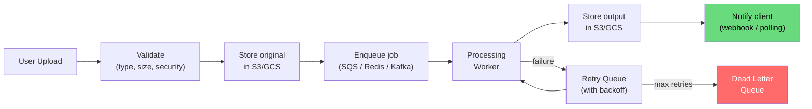
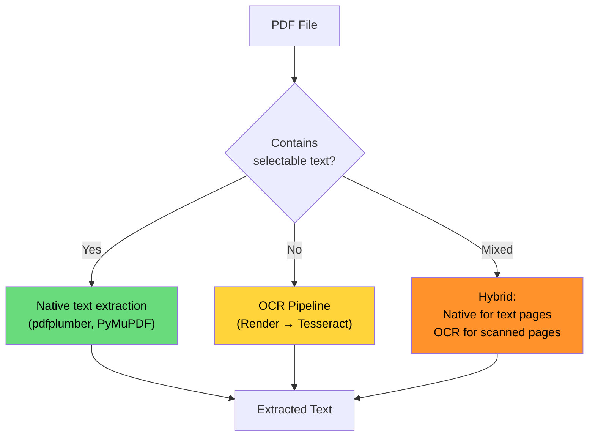
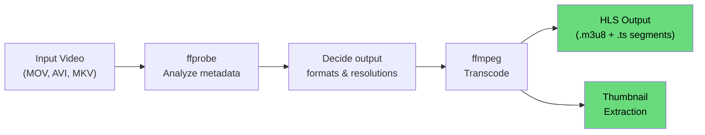
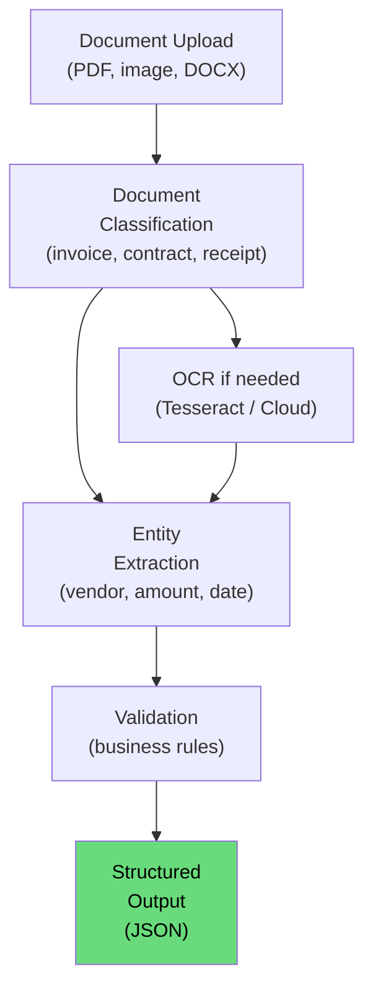
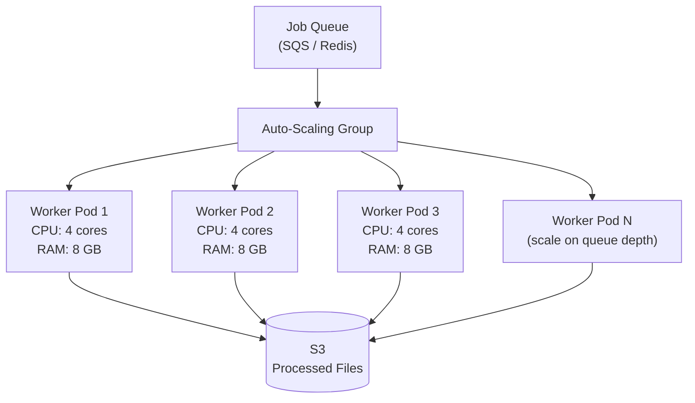

# File Processing at Scale

Every non-trivial application eventually needs to process files — resize uploaded images, extract text from PDFs, transcode video for streaming, or run documents through AI for classification. These operations are CPU-intensive, memory-hungry, and failure-prone. They cannot live in your request-response cycle.

This page covers the five pillars of file processing — PDF/OCR, image manipulation, video transcoding, AI-powered document processing, and the async pipeline architecture that ties them together.

---

## Why File Processing is Hard

| Challenge | Why It Matters |
|-----------|---------------|
| **CPU-intensive** | Image resizing, PDF rendering, and video encoding peg CPUs for seconds to minutes |
| **Memory-hungry** | A 50 MB PDF can require 2 GB of RAM to render all pages |
| **Unpredictable duration** | A 1-page PDF takes 200 ms; a 500-page PDF takes 5 minutes |
| **Failure-prone** | Corrupt files, unsupported formats, OOM kills, timeouts |
| **Security risk** | Uploaded files can contain malware, zip bombs, XML bombs |
| **Format chaos** | HEIC, WebP, AVIF, TIFF, PDF/A, MKV, MOV — the zoo never stops |

::: danger
Never process user-uploaded files synchronously in your API request handler. A single 500-page PDF upload will tie up a worker for minutes, blocking all other requests. Always process files asynchronously via a job queue.
:::

---

## Async Pipeline Architecture

Every file processing system follows the same pattern:



### Pipeline Components

```python
# Job queue message structure
{
    "job_id": "job_abc123",
    "type": "image_resize",
    "input": {
        "bucket": "uploads",
        "key": "raw/user_42/photo_2026-03-20.jpg",
        "content_type": "image/jpeg",
        "size_bytes": 4500000
    },
    "params": {
        "widths": [200, 800, 1600],
        "format": "webp",
        "quality": 80
    },
    "output": {
        "bucket": "processed",
        "prefix": "images/user_42/"
    },
    "metadata": {
        "user_id": "user_42",
        "callback_url": "https://api.example.com/webhooks/file-processed",
        "priority": "normal",
        "created_at": "2026-03-20T10:30:00Z"
    },
    "attempt": 0,
    "max_attempts": 3
}
```

### Worker Design

```python
class FileProcessingWorker:
    """Generic file processing worker with resource limits."""

    def __init__(self):
        self.processors = {
            'image_resize': ImageProcessor(),
            'pdf_extract': PDFProcessor(),
            'video_transcode': VideoTranscoder(),
            'ocr': OCRProcessor(),
            'ai_document': AIDocumentProcessor(),
        }

    def process(self, job: dict):
        processor = self.processors[job['type']]

        # Download input file to local temp directory
        with tempfile.TemporaryDirectory() as tmpdir:
            input_path = self.download(job['input'], tmpdir)

            # Validate file before processing
            self.validate(input_path, job['type'])

            # Process with timeout
            try:
                outputs = processor.process(
                    input_path=input_path,
                    params=job['params'],
                    output_dir=tmpdir
                )
            except subprocess.TimeoutExpired:
                raise ProcessingTimeout(f"Job {job['job_id']} timed out")

            # Upload outputs to object storage
            output_keys = []
            for output in outputs:
                key = f"{job['output']['prefix']}{output.filename}"
                self.upload(output.path, job['output']['bucket'], key)
                output_keys.append(key)

        # Notify completion
        self.notify(job, output_keys)

    def validate(self, path: str, job_type: str):
        """Security validation before processing."""
        file_size = os.path.getsize(path)

        # Check file size limits
        limits = {
            'image_resize': 50 * 1024 * 1024,       # 50 MB
            'pdf_extract': 200 * 1024 * 1024,        # 200 MB
            'video_transcode': 5 * 1024 * 1024 * 1024, # 5 GB
            'ocr': 100 * 1024 * 1024,                # 100 MB
        }

        if file_size > limits.get(job_type, 100 * 1024 * 1024):
            raise FileTooLarge(f"File {file_size} exceeds limit")

        # Verify magic bytes match claimed content type
        detected_type = magic.from_file(path, mime=True)
        # Reject if detected type doesn't match expected
```

---

## PDF Extraction and OCR

### PDF Text Extraction

Two types of PDFs require different approaches:



### Native PDF Text Extraction

```python
import pdfplumber

class PDFTextExtractor:
    """Extract text from PDFs with selectable text content."""

    def extract(self, pdf_path: str) -> list[dict]:
        pages = []

        with pdfplumber.open(pdf_path) as pdf:
            for i, page in enumerate(pdf.pages):
                text = page.extract_text()

                # Extract tables separately
                tables = page.extract_tables()

                pages.append({
                    'page_number': i + 1,
                    'text': text or '',
                    'tables': tables,
                    'has_text': bool(text and text.strip()),
                    'width': page.width,
                    'height': page.height,
                })

        return pages

    def needs_ocr(self, pages: list[dict]) -> bool:
        """Determine if PDF needs OCR (scanned document)."""
        text_pages = sum(1 for p in pages if p['has_text'])
        return text_pages < len(pages) * 0.5  # < 50% pages have text
```

### OCR with Tesseract

```python
import subprocess
from PIL import Image
import pytesseract

class OCRProcessor:
    """OCR pipeline: PDF → images → Tesseract → text."""

    def process(self, pdf_path: str, params: dict, output_dir: str):
        dpi = params.get('dpi', 300)
        language = params.get('language', 'eng')

        # Step 1: Render PDF pages to images using pdftoppm (Poppler)
        image_prefix = os.path.join(output_dir, 'page')
        subprocess.run([
            'pdftoppm',
            '-png',
            '-r', str(dpi),
            pdf_path,
            image_prefix
        ], check=True, timeout=300)

        # Step 2: OCR each page image
        image_files = sorted(glob.glob(f"{image_prefix}*.png"))
        results = []

        for img_path in image_files:
            # Pre-process image for better OCR accuracy
            img = Image.open(img_path)
            img = self.preprocess(img)

            # Run Tesseract
            text = pytesseract.image_to_string(
                img,
                lang=language,
                config='--oem 3 --psm 6'
                # OEM 3: LSTM neural net engine
                # PSM 6: Assume uniform block of text
            )

            # Get word-level bounding boxes for structured extraction
            data = pytesseract.image_to_data(
                img,
                lang=language,
                output_type=pytesseract.Output.DICT
            )

            results.append({
                'text': text,
                'confidence': self.avg_confidence(data),
                'word_boxes': self.extract_word_boxes(data),
            })

        return results

    def preprocess(self, img: Image) -> Image:
        """Improve OCR accuracy with image preprocessing."""
        import cv2
        import numpy as np

        # Convert to OpenCV format
        cv_img = np.array(img)

        # Convert to grayscale
        gray = cv2.cvtColor(cv_img, cv2.COLOR_RGB2GRAY)

        # Deskew
        gray = self.deskew(gray)

        # Adaptive thresholding (binarization)
        binary = cv2.adaptiveThreshold(
            gray, 255,
            cv2.ADAPTIVE_THRESH_GAUSSIAN_C,
            cv2.THRESH_BINARY, 11, 2
        )

        # Denoise
        denoised = cv2.fastNlMeansDenoising(binary, h=10)

        return Image.fromarray(denoised)

    def avg_confidence(self, data: dict) -> float:
        confs = [int(c) for c in data['conf'] if int(c) > 0]
        return sum(confs) / len(confs) if confs else 0.0
```

### OCR Quality Tips

| Factor | Impact | Recommendation |
|--------|--------|---------------|
| **DPI** | Higher DPI = better accuracy | 300 DPI minimum, 600 for small text |
| **Binarization** | Clean black/white separation | Adaptive threshold, not global |
| **Deskew** | Rotated text fails OCR | Detect and correct skew angle |
| **Language** | Wrong language model = garbage | Detect language first, load correct model |
| **Noise** | Specks and artifacts confuse OCR | Apply denoising filter |
| **Font quality** | Handwriting, decorative fonts fail | Tesseract is best with printed text |

::: tip
For production OCR, consider cloud services (Google Document AI, AWS Textract, Azure Form Recognizer) for higher accuracy than Tesseract, especially for structured documents like invoices and forms. Tesseract is excellent for straightforward text extraction but struggles with complex layouts.
:::

---

## Image Processing

### Sharp (Node.js) — The Performance Champion

Sharp uses libvips under the hood, which processes images 4-5x faster than ImageMagick while using 10x less memory.

```javascript
const sharp = require('sharp');
const path = require('path');

class ImageProcessor {
    /**
     * Resize an image to multiple widths, convert format, strip metadata.
     */
    async process(inputPath, params, outputDir) {
        const { widths, format = 'webp', quality = 80 } = params;
        const outputs = [];

        for (const width of widths) {
            const outputFilename = `${path.parse(inputPath).name}_${width}.${format}`;
            const outputPath = path.join(outputDir, outputFilename);

            await sharp(inputPath)
                .resize(width, null, {
                    fit: 'inside',             // Maintain aspect ratio
                    withoutEnlargement: true,  // Don't upscale
                })
                .toFormat(format, {
                    quality,
                    effort: format === 'avif' ? 4 : undefined,
                })
                .rotate()              // Auto-rotate based on EXIF
                .withMetadata({         // Strip EXIF but keep orientation
                    orientation: undefined,
                })
                .toFile(outputPath);

            outputs.push({
                filename: outputFilename,
                path: outputPath,
                width,
            });
        }

        return outputs;
    }

    /**
     * Generate responsive image variants for a web application.
     */
    async generateResponsiveSet(inputPath, outputDir) {
        const variants = [
            { width: 320, suffix: 'sm' },
            { width: 640, suffix: 'md' },
            { width: 1024, suffix: 'lg' },
            { width: 1920, suffix: 'xl' },
            { width: 2560, suffix: '2xl' },
        ];

        const formats = ['webp', 'avif'];
        const outputs = [];

        for (const variant of variants) {
            for (const format of formats) {
                const filename = `${path.parse(inputPath).name}_${variant.suffix}.${format}`;
                const outputPath = path.join(outputDir, filename);

                await sharp(inputPath)
                    .resize(variant.width, null, { fit: 'inside', withoutEnlargement: true })
                    .toFormat(format, { quality: format === 'avif' ? 65 : 80 })
                    .toFile(outputPath);

                outputs.push({ filename, path: outputPath, width: variant.width, format });
            }
        }

        return outputs;
    }
}
```

### ImageMagick — The Swiss Army Knife

When you need operations Sharp does not support (complex compositing, PDF to image, SVG rendering):

```bash
# Resize with quality control
magick input.jpg -resize 800x600 -quality 85 output.jpg

# Convert PDF page to image (for OCR preprocessing)
magick -density 300 document.pdf[0] -quality 90 page-0.png

# Batch resize with multiple outputs
magick input.jpg \
    \( +clone -resize 320x -write output_sm.webp +delete \) \
    \( +clone -resize 640x -write output_md.webp +delete \) \
    \( +clone -resize 1024x -write output_lg.webp +delete \) \
    -resize 1920x output_xl.webp

# Strip all metadata (privacy)
magick input.jpg -strip output.jpg

# Add watermark
magick input.jpg watermark.png \
    -gravity southeast -geometry +10+10 \
    -composite output.jpg
```

### Image Processing Comparison

| Feature | Sharp (libvips) | ImageMagick | Pillow (Python) |
|---------|----------------|-------------|----------------|
| **Speed** | Fastest (4-5x IM) | Medium | Slowest |
| **Memory** | Very low (streaming) | High (loads full image) | Medium |
| **Format support** | JPEG, PNG, WebP, AVIF, TIFF, GIF | 200+ formats | Common formats |
| **PDF to image** | No | Yes | No (needs Poppler) |
| **SVG rendering** | Yes (via librsvg) | Yes | No |
| **Complex compositing** | Limited | Excellent | Basic |
| **Language** | Node.js | CLI / any | Python |
| **Best for** | Web image pipelines | Complex operations, batch | Python scripts, ML preprocessing |

::: warning
ImageMagick has a history of security vulnerabilities (ImageTragick, CVE-2016-3714). If processing user-uploaded files, always: (1) validate file magic bytes before processing, (2) set resource limits in `policy.xml`, (3) run in a sandboxed container with limited filesystem access, (4) keep ImageMagick updated.
:::

---

## Video Transcoding with FFmpeg

Video transcoding is the most resource-intensive file processing operation. A single 1080p video can take minutes to transcode on a powerful machine.

### FFmpeg Pipeline



```python
import subprocess
import json

class VideoTranscoder:
    """Transcode video to HLS with multiple quality levels."""

    def probe(self, input_path: str) -> dict:
        """Get video metadata using ffprobe."""
        result = subprocess.run([
            'ffprobe',
            '-v', 'quiet',
            '-print_format', 'json',
            '-show_format',
            '-show_streams',
            input_path
        ], capture_output=True, text=True, check=True)

        return json.loads(result.stdout)

    def transcode_to_hls(self, input_path: str, output_dir: str,
                          params: dict) -> list:
        """Transcode to adaptive bitrate HLS (multiple quality levels)."""
        probe_data = self.probe(input_path)
        video_stream = next(
            s for s in probe_data['streams'] if s['codec_type'] == 'video'
        )
        source_height = int(video_stream['height'])
        source_width = int(video_stream['width'])

        # Define quality levels based on source resolution
        levels = self.get_quality_levels(source_height)

        # Build FFmpeg command for multi-bitrate HLS
        cmd = ['ffmpeg', '-i', input_path]

        filter_complex = []
        output_maps = []

        for i, level in enumerate(levels):
            # Scale filter for each quality level
            filter_complex.append(
                f"[0:v]scale=-2:{level['height']}[v{i}]"
            )

            output_maps.extend([
                '-map', f'[v{i}]',
                '-map', '0:a?',  # Map audio if present
                f'-c:v:{i}', 'libx264',
                f'-b:v:{i}', level['bitrate'],
                f'-maxrate:v:{i}', level['max_bitrate'],
                f'-bufsize:v:{i}', level['bufsize'],
                f'-c:a:{i}', 'aac',
                f'-b:a:{i}', '128k',
            ])

        cmd.extend(['-filter_complex', ';'.join(filter_complex)])
        cmd.extend(output_maps)

        # HLS output settings
        master_playlist = os.path.join(output_dir, 'master.m3u8')
        cmd.extend([
            '-f', 'hls',
            '-hls_time', '6',              # 6-second segments
            '-hls_playlist_type', 'vod',
            '-hls_segment_filename',
            os.path.join(output_dir, 'segment_%v_%03d.ts'),
            '-master_pl_name', 'master.m3u8',
            '-var_stream_map', ' '.join(
                f'v:{i},a:{i}' for i in range(len(levels))
            ),
            os.path.join(output_dir, 'stream_%v.m3u8'),
        ])

        subprocess.run(cmd, check=True, timeout=3600)

        return [{'type': 'hls', 'path': master_playlist}]

    def get_quality_levels(self, source_height: int) -> list:
        """Select appropriate quality levels based on source resolution."""
        all_levels = [
            {'height': 360, 'bitrate': '800k',
             'max_bitrate': '856k', 'bufsize': '1200k'},
            {'height': 480, 'bitrate': '1400k',
             'max_bitrate': '1498k', 'bufsize': '2100k'},
            {'height': 720, 'bitrate': '2800k',
             'max_bitrate': '2996k', 'bufsize': '4200k'},
            {'height': 1080, 'bitrate': '5000k',
             'max_bitrate': '5350k', 'bufsize': '7500k'},
            {'height': 1440, 'bitrate': '8000k',
             'max_bitrate': '8560k', 'bufsize': '12000k'},
            {'height': 2160, 'bitrate': '14000k',
             'max_bitrate': '14980k', 'bufsize': '21000k'},
        ]
        # Only include levels at or below source resolution
        return [l for l in all_levels if l['height'] <= source_height]

    def extract_thumbnail(self, input_path: str, output_path: str,
                          timestamp: str = '00:00:05'):
        """Extract a single frame as a thumbnail."""
        subprocess.run([
            'ffmpeg', '-i', input_path,
            '-ss', timestamp,
            '-vframes', '1',
            '-vf', 'scale=640:-2',
            '-q:v', '2',
            output_path
        ], check=True, timeout=30)
```

### Video Processing Costs

| Operation | Duration (1-hour 1080p video) | CPU Usage |
|-----------|------------------------------|-----------|
| **Probe metadata** | < 1 second | Minimal |
| **Thumbnail extraction** | 2-5 seconds | Low |
| **360p transcode** | 3-5 minutes | 1 core |
| **1080p transcode (H.264)** | 10-20 minutes | 4 cores |
| **1080p transcode (H.265/HEVC)** | 30-60 minutes | 4 cores |
| **4K transcode (H.264)** | 30-60 minutes | 8 cores |
| **Multi-bitrate HLS** | 20-40 minutes | 8+ cores |

::: tip
Use hardware encoding (NVENC on NVIDIA GPUs, QSV on Intel, VideoToolbox on Mac) for 5-10x speed improvement over software encoding. The quality is slightly lower but the speed/cost tradeoff is usually worth it: `-c:v h264_nvenc` instead of `-c:v libx264`.
:::

---

## AI-Powered Document Processing

Modern document processing uses language models for extraction tasks that rule-based systems struggle with.

### Document Processing Pipeline



```python
class AIDocumentProcessor:
    """Process documents using LLMs for intelligent extraction."""

    def process_invoice(self, text: str) -> dict:
        """Extract structured data from an invoice using an LLM."""
        prompt = f"""Extract the following fields from this invoice text.
Return a JSON object with these fields:
- vendor_name: string
- invoice_number: string
- invoice_date: string (YYYY-MM-DD)
- due_date: string (YYYY-MM-DD)
- line_items: array of objects with description, quantity, unit_price, total
- subtotal: number
- tax: number
- total: number
- currency: string (3-letter code)

Invoice text:
{text}

JSON output:"""

        response = self.llm.generate(prompt, max_tokens=2000)
        extracted = json.loads(response)

        # Validate extracted data
        validated = self.validate_invoice(extracted)
        return validated

    def validate_invoice(self, data: dict) -> dict:
        """Business rule validation on extracted data."""
        errors = []

        # Check line items sum to subtotal
        computed_subtotal = sum(
            item.get('total', 0) for item in data.get('line_items', [])
        )
        if abs(computed_subtotal - data.get('subtotal', 0)) > 0.01:
            errors.append(f"Line items sum {computed_subtotal} != subtotal {data['subtotal']}")

        # Check subtotal + tax = total
        computed_total = data.get('subtotal', 0) + data.get('tax', 0)
        if abs(computed_total - data.get('total', 0)) > 0.01:
            errors.append(f"Subtotal + tax {computed_total} != total {data['total']}")

        data['validation_errors'] = errors
        data['is_valid'] = len(errors) == 0
        return data
```

---

## Security Considerations

### File Upload Security Checklist

| Check | Implementation | Why |
|-------|---------------|-----|
| **Magic byte validation** | Check file header bytes, not just extension | Prevents disguised executables |
| **File size limits** | Reject before fully receiving | Prevents disk exhaustion |
| **Content-type verification** | Server-side detection, ignore client header | Client headers are untrusted |
| **Filename sanitization** | Strip path traversal characters (`../`) | Prevents directory traversal |
| **Antivirus scan** | ClamAV or cloud scanning API | Detect malware |
| **ZIP bomb detection** | Check compression ratio | Prevents decompression bombs |
| **Image dimension limits** | Reject images > 10000x10000 px | Prevents memory exhaustion |
| **SVG sanitization** | Strip `<script>` tags, external references | SVGs can contain XSS |
| **Processing sandbox** | Run in isolated container with limits | Contain exploit damage |

```python
import magic
import os

class FileValidator:
    ALLOWED_TYPES = {
        'image/jpeg': {'max_size': 50 * 1024 * 1024, 'extensions': ['.jpg', '.jpeg']},
        'image/png': {'max_size': 50 * 1024 * 1024, 'extensions': ['.png']},
        'image/webp': {'max_size': 50 * 1024 * 1024, 'extensions': ['.webp']},
        'application/pdf': {'max_size': 200 * 1024 * 1024, 'extensions': ['.pdf']},
        'video/mp4': {'max_size': 5 * 1024 * 1024 * 1024, 'extensions': ['.mp4']},
    }

    def validate(self, file_path: str, claimed_type: str) -> bool:
        # Step 1: Check file size
        size = os.path.getsize(file_path)
        type_config = self.ALLOWED_TYPES.get(claimed_type)
        if not type_config:
            raise UnsupportedType(f"Type {claimed_type} not allowed")
        if size > type_config['max_size']:
            raise FileTooLarge(f"File {size} exceeds {type_config['max_size']}")

        # Step 2: Verify actual type via magic bytes
        detected_type = magic.from_file(file_path, mime=True)
        if detected_type != claimed_type:
            raise TypeMismatch(
                f"Claimed {claimed_type} but detected {detected_type}"
            )

        # Step 3: Check extension
        ext = os.path.splitext(file_path)[1].lower()
        if ext not in type_config['extensions']:
            raise InvalidExtension(f"Extension {ext} not valid for {claimed_type}")

        return True
```

---

## Scaling Strategies

### Horizontal Scaling



| Scaling Dimension | Strategy |
|-------------------|----------|
| **Queue depth scaling** | Add workers when queue depth > threshold |
| **CPU-based scaling** | Add workers when avg CPU > 70% |
| **Job type isolation** | Separate queues for fast (image) and slow (video) jobs |
| **Priority queues** | Premium users get dedicated worker pool |
| **Spot/preemptible instances** | Video transcoding is preemptible (restart job on eviction) |
| **GPU workers** | Dedicated GPU pool for video transcoding with NVENC |

### Resource Limits per Job Type

| Job Type | CPU Limit | Memory Limit | Timeout | Worker Size |
|----------|----------|-------------|---------|-------------|
| Image resize | 1 core | 512 MB | 30 s | Small |
| PDF text extraction | 1 core | 2 GB | 120 s | Medium |
| OCR (per page) | 1 core | 1 GB | 60 s | Medium |
| Video thumbnail | 1 core | 1 GB | 30 s | Small |
| Video transcode (1080p) | 4 cores | 4 GB | 30 min | Large |
| AI document extraction | 1 core | 2 GB | 60 s | Medium |

---

## Key Takeaways

1. **Always process asynchronously** — file processing is CPU-intensive and unpredictable; never do it in the API request cycle
2. **Validate before processing** — check magic bytes, file size, and dimensions before spending CPU on a potentially malicious file
3. **Sharp over ImageMagick for web** — Sharp (libvips) is 4-5x faster and uses 10x less memory for common web image operations
4. **Tesseract for basic OCR, cloud for complex** — Tesseract handles clean printed text well; use Google Document AI or AWS Textract for invoices, forms, and handwriting
5. **FFmpeg is the only game in town for video** — learn it well; use hardware encoding (NVENC) for production throughput
6. **Separate queues by job duration** — fast jobs (image resize) and slow jobs (video transcode) should not share a queue; slow jobs block fast ones
7. **Security is non-negotiable** — uploaded files are untrusted input; validate, sandbox, and limit everything
8. **AI extraction is the future** — LLMs can extract structured data from messy documents that rule-based systems cannot handle, but always validate the output
