# Building Blocks Overview

Every large-scale system is built from the same set of building blocks. Netflix, Uber, Instagram, Slack — they all use DNS, load balancers, caches, databases, message queues, and CDNs. The difference is in how these blocks are combined and configured.

Think of building blocks like LEGO pieces. You do not need to invent new pieces — you need to know which pieces exist, what each one does, and when to use it. This page is your catalog of every piece.

Each building block below is explained in 5-8 lines with a "when you need it" section, a Mermaid diagram showing where it fits, and a link to the deep dive page.

## The Full Picture

Here is where every building block fits in a typical web architecture:

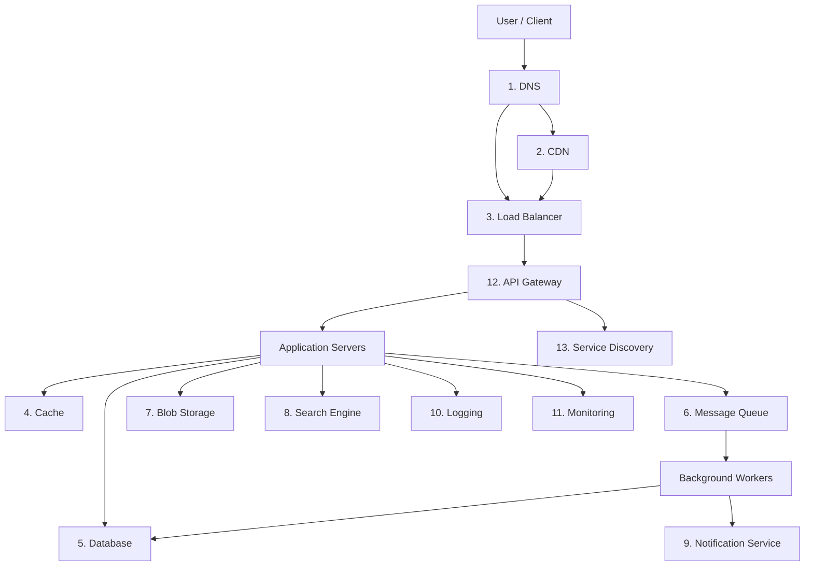

## 1. DNS (Domain Name System)

DNS translates human-readable domain names (like `google.com`) into IP addresses (like `142.250.80.4`). It is the very first step in every internet request. Without DNS, users would have to memorize IP addresses.

DNS is a distributed, hierarchical database with servers all over the world. When you type a URL, your browser asks DNS for the IP address, then connects to that IP. DNS responses are cached at multiple levels (browser, OS, ISP) to reduce latency. DNS can also be used for load balancing by returning different IPs for the same domain.

**When you need it**: Always. Every internet application needs DNS. You configure it once (point your domain to your servers) and update it when your infrastructure changes.

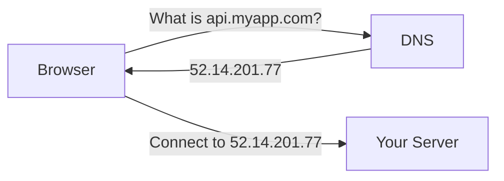

**Deep dive**: [DNS Deep Dive](/system-design/networking/dns-deep-dive) | [How the Internet Works](/system-design/fundamentals/how-the-internet-works)

## 2. CDN (Content Delivery Network)

A CDN is a network of servers distributed around the world that cache and serve static content (images, CSS, JavaScript, videos) from the location closest to the user. Instead of every request traveling to your origin server in Virginia, a user in Tokyo gets the content from a CDN node in Tokyo.

CDNs reduce latency (100-200ms savings for distant users), reduce load on your origin servers, and handle traffic spikes. Major CDNs include Cloudflare, AWS CloudFront, Akamai, and Fastly. Modern CDNs can also run code at the edge (edge computing) for things like authentication and A/B testing.

**When you need it**: When you serve static assets (every web app), when you have global users, or when you need to handle traffic spikes without scaling your origin.

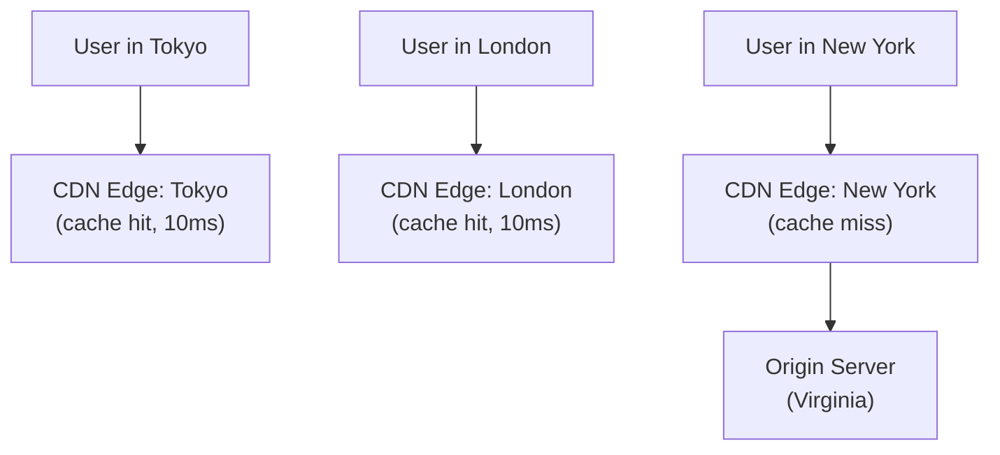

**Deep dive**: [CDN Deep Dive](/system-design/caching/cdn-deep-dive)

## 3. Load Balancer

A load balancer distributes incoming requests across multiple servers. If you have 4 web servers, the load balancer decides which server handles each request. This improves throughput (4 servers handle 4x traffic), availability (if one server dies, the others keep serving), and enables zero-downtime deployments.

Load balancers can operate at Layer 4 (TCP level, very fast, looks at IP/port only) or Layer 7 (HTTP level, can inspect URLs, headers, and cookies for smarter routing). Common load balancers include Nginx, HAProxy, AWS ALB/NLB, and Envoy.

**When you need it**: As soon as you have more than one application server, which should be as soon as you care about availability (even with moderate traffic).

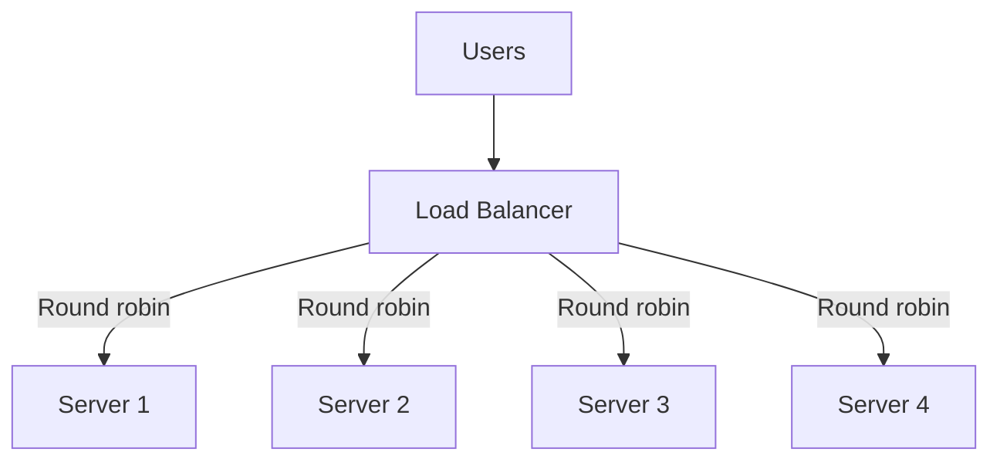

**Deep dive**: [Load Balancing Algorithms](/system-design/load-balancing/algorithms) | [L4 vs L7](/system-design/load-balancing/l4-vs-l7) | [Nginx Config](/system-design/load-balancing/nginx-config)

## 4. Cache

A cache is a high-speed data storage layer that sits between your application and the database. It stores frequently accessed data in memory (RAM), which is 100-1,000x faster than reading from a database on disk. A typical Redis cache responds in 0.1ms versus 5-50ms for a database query.

The most common caching tool is Redis, followed by Memcached. Caching can reduce database load by 80-95% for read-heavy applications. The main challenge is cache invalidation — making sure the cache does not serve stale data after the underlying data changes.

**When you need it**: When your database is the bottleneck, when you have read-heavy workloads, or when you need sub-millisecond response times. For most web apps, add caching before adding more database replicas.

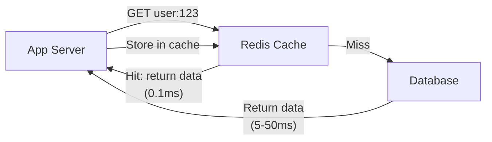

**Deep dive**: [Caching Strategies](/system-design/caching/caching-strategies) | [Cache Invalidation](/system-design/caching/cache-invalidation) | [Redis Caching Patterns](/system-design/caching/redis-caching-patterns) | [Thundering Herd](/system-design/caching/thundering-herd)

## 5. Database

The database is where your application's permanent data lives. It is the source of truth. There are many types of databases, each optimized for different access patterns:

- **Relational (SQL)**: PostgreSQL, MySQL — structured data with relationships and transactions
- **Document**: MongoDB — flexible schemas, JSON-like documents
- **Key-Value**: Redis, DynamoDB — simple lookups by key, extremely fast
- **Wide-Column**: Cassandra, ScyllaDB — massive scale, time-series data
- **Graph**: Neo4j — relationships between entities (social networks, recommendations)
- **Search**: Elasticsearch — full-text search across large datasets

Choosing the right database is one of the most important system design decisions. See [SQL vs NoSQL Decision Guide](/system-design/fundamentals/sql-vs-nosql) for a framework.

**When you need it**: Always. Every application that stores data needs at least one database.

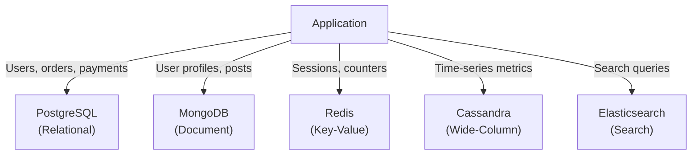

**Deep dive**: [Database Selection Guide](/system-design/databases/database-selection-guide) | [PostgreSQL Internals](/system-design/databases/postgres-internals) | [Indexing Deep Dive](/system-design/databases/indexing-deep-dive)

## 6. Message Queue

A message queue is a buffer between services that decouples the sender from the receiver. Instead of Service A directly calling Service B (and waiting for a response), Service A puts a message on the queue and moves on. Service B processes the message when it is ready. If Service B is down, the messages wait in the queue and are processed when it comes back up.

Popular message queues include Apache Kafka (event streaming, high throughput), RabbitMQ (traditional messaging, flexible routing), AWS SQS (managed, simple), and Redis Streams. Message queues enable asynchronous processing, peak shaving, and service decoupling.

**When you need it**: When you have operations that do not need to complete before responding to the user (sending emails, generating thumbnails, updating analytics), or when you want to decouple services so failures do not cascade.

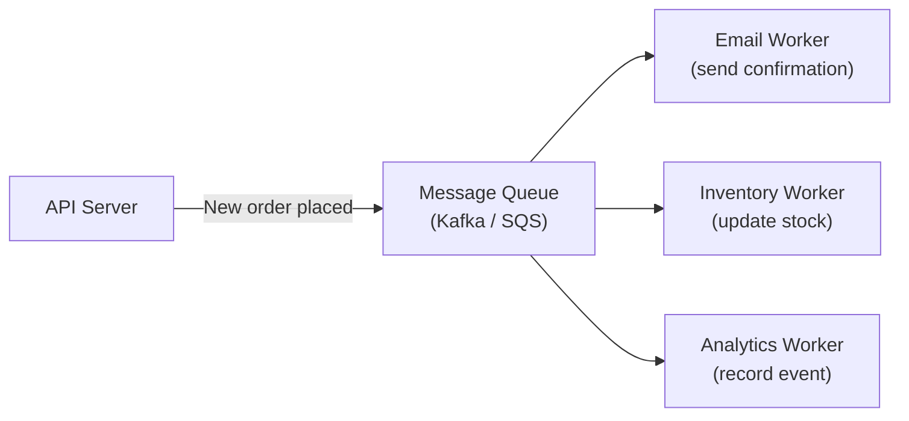

**Deep dive**: [Kafka Internals](/system-design/message-queues/kafka-internals) | [RabbitMQ Internals](/system-design/message-queues/rabbitmq-internals) | [Queue Selection Guide](/system-design/message-queues/queue-selection-guide) | [Backpressure Patterns](/system-design/message-queues/backpressure-patterns)

## 7. Blob Storage

Blob (Binary Large Object) storage is for files: images, videos, PDFs, backups, log archives. You do not store these in a database — databases are designed for structured data, not multi-megabyte files. Blob storage is cheap, durable, and designed for massive scale.

AWS S3 is the most widely used blob storage (99.999999999% durability). Google Cloud Storage and Azure Blob Storage are equivalents. You upload a file, get a URL, and serve it (usually through a CDN). Blob storage typically costs $0.02-0.03 per GB per month — thousands of times cheaper than database storage.

**When you need it**: Whenever your application handles files — user uploads, profile pictures, documents, logs, backups, or any media content.

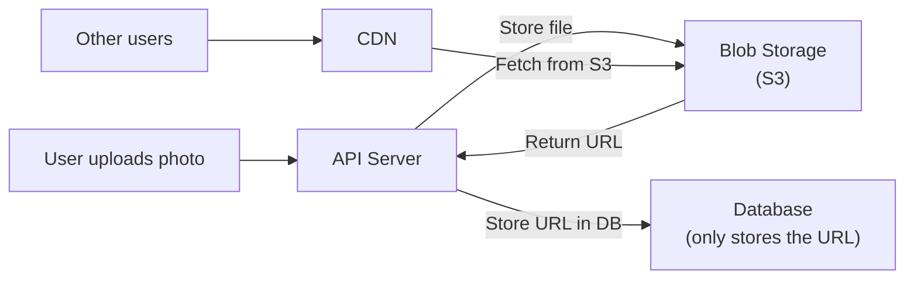

## 8. Search Engine

When users need to search through text (product search, log search, article search), a regular database is too slow. Search engines like Elasticsearch build specialized data structures (inverted indexes) that make full-text search fast. A search query that would take 30 seconds on PostgreSQL takes 5ms on Elasticsearch.

Elasticsearch can also handle aggregations (analytics), geospatial queries, and fuzzy matching (finding "recieve" when the user meant "receive"). It scales horizontally by splitting the index across multiple nodes (shards).

**When you need it**: When you need full-text search, autocomplete, or analytics across large datasets. Do not use it as your primary database — it is a secondary index, not a source of truth.

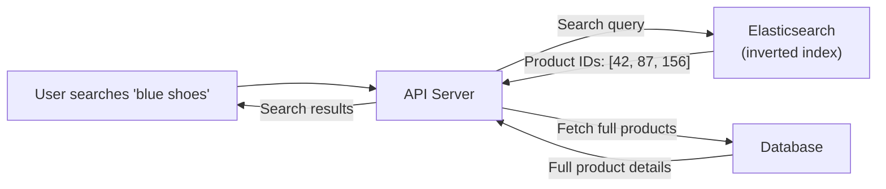

**Deep dive**: [Elasticsearch Internals](/system-design/databases/elasticsearch-internals)

## 9. Notification Service

A notification service delivers messages to users through multiple channels: push notifications (mobile), email, SMS, in-app notifications, and webhooks. It is typically implemented as a separate service that consumes events from a message queue.

The challenges include handling millions of notifications per minute, dealing with delivery failures (retries), respecting user preferences (do not send push at 3 AM), rate limiting, and template management. Major services include Firebase Cloud Messaging (FCM), Apple Push Notification Service (APNS), AWS SNS, and Twilio.

**When you need it**: When your application sends notifications to users — which is almost every consumer application.

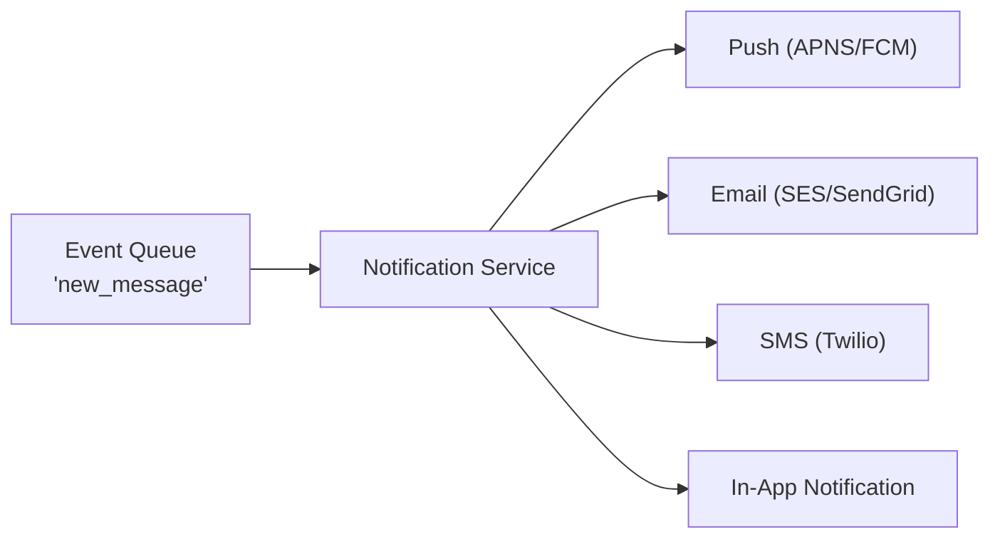

## 10. Logging

Centralized logging collects logs from every server, service, and container into one searchable place. Without centralized logging, debugging a problem means SSH-ing into each of 50 servers and grepping through files. With centralized logging, you search across all servers from a single dashboard.

The most common stack is ELK (Elasticsearch, Logstash, Kibana) or its cloud equivalents (AWS CloudWatch Logs, Datadog Logs, Grafana Loki). Structured logging (JSON format) makes logs searchable by fields like request ID, user ID, and error type.

**When you need it**: The moment you have more than one server. Even with one server, centralized logging helps with debugging and compliance.

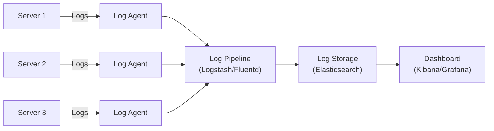

**Deep dive**: [Logging](/devops/logging) | [Observability Tools](/devops/observability-tools)

## 11. Monitoring

Monitoring collects metrics (numbers that change over time) from your system and alerts you when something is wrong. Key metrics include request latency, error rates, CPU usage, memory usage, disk space, and queue depth.

The most popular tools are Prometheus (metric collection), Grafana (dashboards), Datadog (all-in-one), and AWS CloudWatch. Good monitoring answers three questions: "Is the system healthy?", "What changed?", and "What is about to break?"

**When you need it**: From day one in production. You cannot fix what you cannot measure. Start with basic metrics (CPU, memory, request latency, error rate) and expand from there.

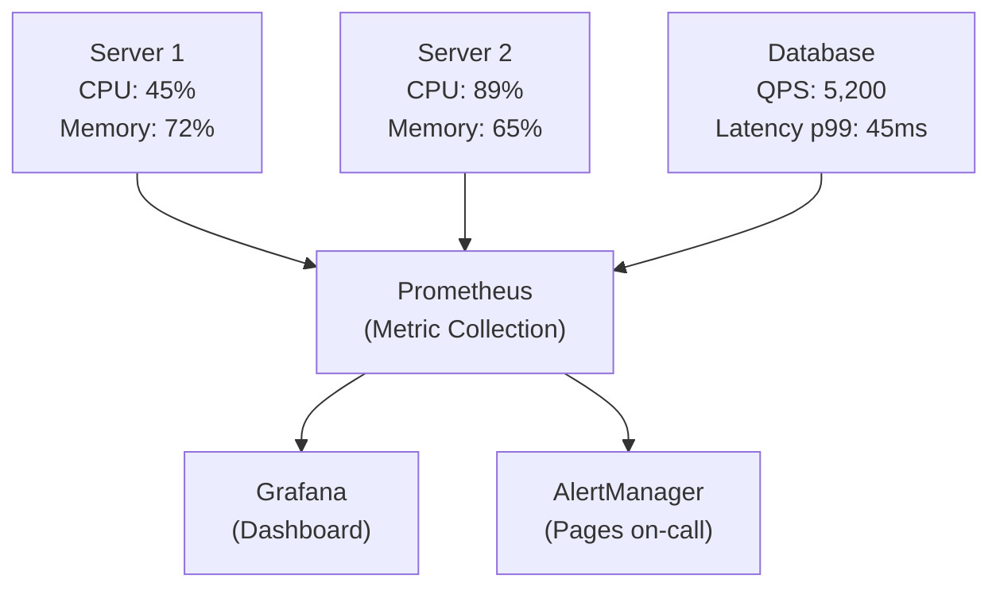

**Deep dive**: [Monitoring](/devops/monitoring) | [Custom Metrics](/devops/monitoring/custom-metrics) | [Observability Tools](/devops/observability-tools)

## 12. API Gateway

An API gateway is a single entry point for all client requests. It sits in front of your microservices and handles cross-cutting concerns: authentication, rate limiting, request routing, protocol translation, response caching, and logging. Without an API gateway, every microservice would need to implement these features independently.

Popular API gateways include Kong, AWS API Gateway, Envoy, and Nginx. In a microservices architecture, the API gateway is essential because clients should not need to know about individual services.

**When you need it**: When you have multiple backend services (microservices) that clients need to access through a single endpoint, or when you need centralized authentication and rate limiting.

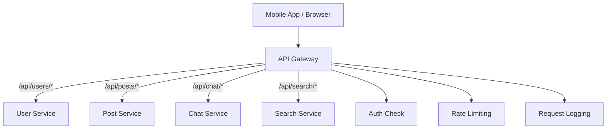

**Deep dive**: [API Gateway Pattern](/architecture-patterns/microservices/api-gateway-pattern) | [Rate Limiting](/system-design/distributed-systems/rate-limiting) | [API Security Patterns](/system-design/api-design/api-security-patterns)

## 13. Service Discovery

In a microservices architecture, services need to find each other. The User Service needs to know the IP address of the Auth Service. But servers come and go — auto-scaling adds and removes instances constantly. Hardcoding IP addresses does not work.

Service discovery solves this. Services register themselves (their name and IP:port) when they start and deregister when they stop. When Service A needs to call Service B, it asks the service discovery registry for Service B's current address. Popular tools include Consul, etcd, ZooKeeper, and cloud-native solutions like AWS Cloud Map and Kubernetes DNS.

**When you need it**: When you have multiple services that communicate with each other, especially in containerized or auto-scaling environments.

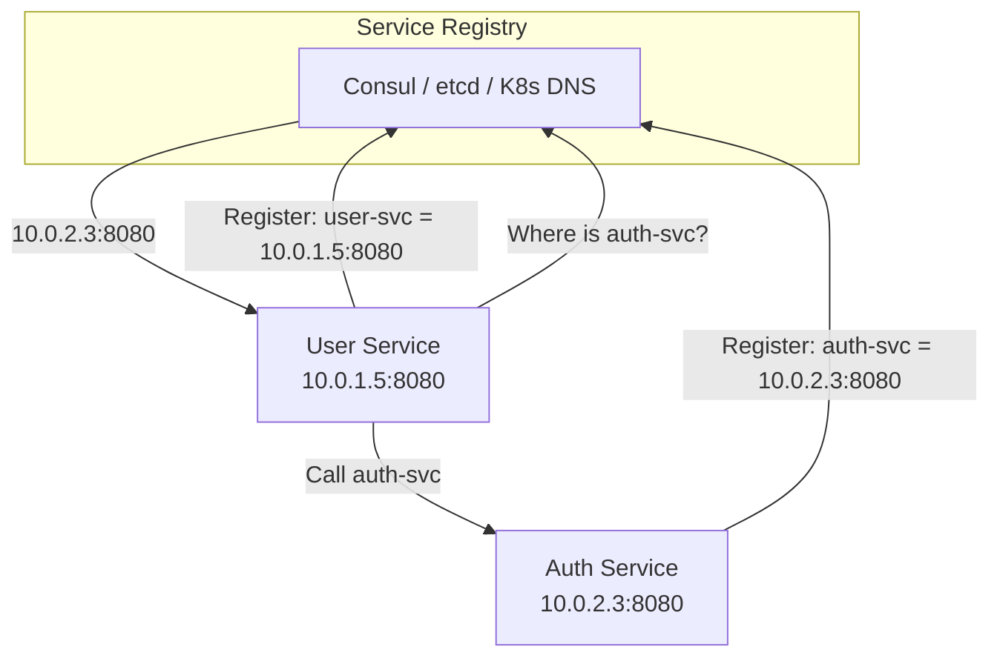

**Deep dive**: [Service Discovery](/system-design/networking/service-discovery)

## How Building Blocks Evolve With Scale

Not every application needs every building block. Here is a guide for when to add each one:

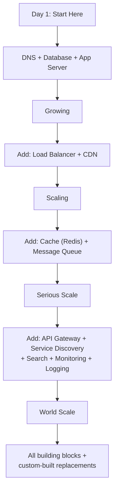

| Scale | Building Blocks Needed |
|---|---|
| 1-100 users | DNS, Database, App Server |
| 100-10K | + Load Balancer, CDN, Blob Storage |
| 10K-100K | + Cache, Message Queue, Monitoring |
| 100K-1M | + Search, Notification Service, Logging |
| 1M-10M | + API Gateway, Service Discovery |
| 10M+ | Everything, possibly custom-built at each layer |

For a detailed walkthrough of this evolution, see [Zero to Million Users](/system-design/fundamentals/zero-to-million-users).

## Summary Table

| Building Block | What It Does | Key Metric | Common Tools |
|---|---|---|---|
| DNS | Translates domains to IPs | Resolution time (~20ms) | Route 53, Cloudflare DNS |
| CDN | Serves static content from edge | Cache hit ratio (>95%) | CloudFront, Cloudflare, Fastly |
| Load Balancer | Distributes requests | Requests/sec, latency added (<1ms) | Nginx, ALB, HAProxy |
| Cache | Fast in-memory data access | Hit rate, latency (~0.1ms) | Redis, Memcached |
| Database | Persistent data storage | QPS, latency, storage size | PostgreSQL, MongoDB, DynamoDB |
| Message Queue | Async processing | Throughput, lag | Kafka, RabbitMQ, SQS |
| Blob Storage | File/media storage | Durability (11 nines) | S3, GCS, Azure Blob |
| Search Engine | Full-text search | Query latency (~5ms) | Elasticsearch, Meilisearch |
| Notifications | User message delivery | Delivery rate, latency | FCM, APNS, SES, Twilio |
| Logging | Centralized log collection | Ingest rate, retention | ELK, Loki, CloudWatch |
| Monitoring | Metrics and alerting | Scrape interval, alert latency | Prometheus, Grafana, Datadog |
| API Gateway | Request routing + cross-cutting | Latency added, RPS capacity | Kong, AWS API GW, Envoy |
| Service Discovery | Dynamic service location | Registration latency | Consul, etcd, K8s DNS |

## What to Learn Next

- **[How to Read Architecture Diagrams](/system-design/fundamentals/how-to-read-architecture)** — Understand what the boxes and arrows mean
- **[Proxies](/system-design/fundamentals/proxies)** — How load balancers, CDNs, and API gateways work under the hood
- **[Scaling Fundamentals](/system-design/fundamentals/scaling-fundamentals)** — How to scale each building block
- **[System Design Glossary](/system-design/fundamentals/system-design-glossary)** — Definitions for every term in system design
