# System Design Characteristics

When someone asks "Is this a good system?", they are really asking about a set of measurable characteristics. Every system design discussion — every interview, every architecture review, every production decision — revolves around these properties.

This page teaches you the eight most important characteristics, what they actually mean, how they are measured, and what real-world numbers look like. Understanding these characteristics is like learning the vocabulary of system design. You cannot have a meaningful conversation about architecture without them.

## The Eight Characteristics

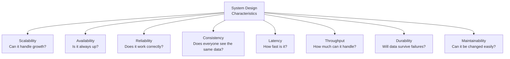

These characteristics are often in tension with each other. Making a system more available might make it less consistent. Making it more durable might increase latency. System design is the art of choosing the right trade-offs for your specific use case.

## 1. Scalability

**Scalability** is the ability of a system to handle increased load by adding resources.

A system is scalable if performance does not degrade proportionally as load increases. If your system handles 1,000 users at 50ms latency, and it handles 10,000 users at 55ms latency (after adding resources), that is good scalability. If it handles 10,000 users at 500ms latency, that is bad scalability.

### Measuring Scalability

Scalability is measured by how performance changes as you add resources:

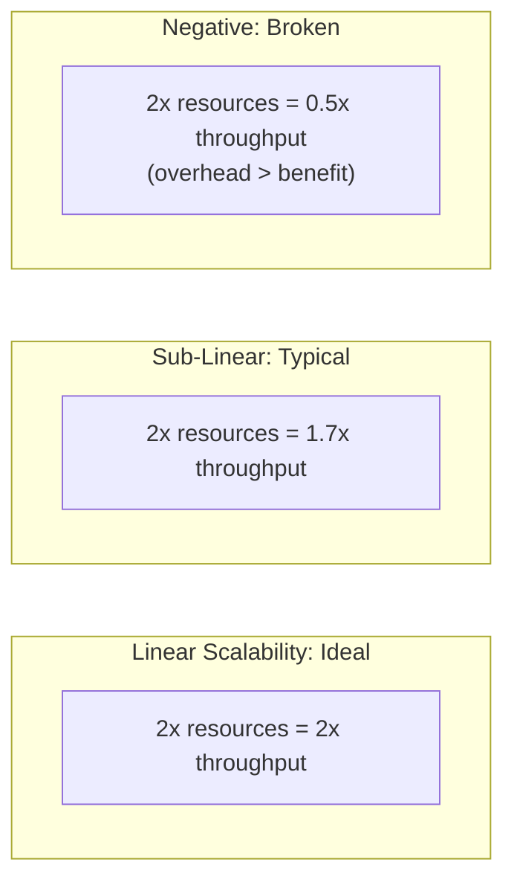

**Real-world example**: A stateless web server scales almost linearly. If one server handles 1,000 requests/second, two servers handle ~2,000 requests/second, and ten servers handle ~10,000 requests/second. A database does not scale this well — adding a read replica might give you 1.7x read throughput (not 2x) because of replication overhead.

For a complete guide to scaling approaches, see [Scaling Fundamentals](/system-design/fundamentals/scaling-fundamentals).

### Types of Scalability

| Type | Definition | Example |
|---|---|---|
| Horizontal | Add more machines | Add web servers behind a load balancer |
| Vertical | Upgrade to a bigger machine | Upgrade from 16 GB to 128 GB RAM |
| Data | System handles growing data volume | Sharding a database as it grows to 10 TB |
| Geographic | System serves global users | Multi-region deployment |

## 2. Availability

**Availability** is the percentage of time a system is operational and accessible.

This is usually expressed as a percentage, and the industry talks about "nines." The more nines, the more available the system.

### The Nines Table

This table is critical. Memorize it.

| Availability | Designation | Downtime/Year | Downtime/Month | Downtime/Week |
|---|---|---|---|---|
| 99% | Two nines | 3.65 days | 7.3 hours | 1.68 hours |
| 99.9% | Three nines | 8.77 hours | 43.8 minutes | 10.1 minutes |
| 99.95% | Three and a half nines | 4.38 hours | 21.9 minutes | 5.04 minutes |
| 99.99% | Four nines | 52.6 minutes | 4.38 minutes | 1.01 minutes |
| 99.999% | Five nines | 5.26 minutes | 26.3 seconds | 6.05 seconds |
| 99.9999% | Six nines | 31.5 seconds | 2.63 seconds | 0.605 seconds |

::: warning
Going from 99.9% to 99.99% is much harder than going from 99% to 99.9%. Each additional nine typically costs 10x more in engineering effort and infrastructure.
:::

### Real-World Availability Numbers

| Service | Typical SLA | What It Means |
|---|---|---|
| AWS S3 | 99.99% | 52.6 minutes downtime/year |
| AWS EC2 | 99.99% | 52.6 minutes downtime/year |
| Google Cloud SQL | 99.95% | 4.38 hours downtime/year |
| Stripe API | 99.99%+ | Almost no downtime |
| Your startup's first server | ~99% | 3.65 days downtime/year (be honest) |

### How to Calculate Availability of Combined Systems

If your system has multiple components in series (all must work), the total availability is the product:

```
System = Web Server → Database

Web Server availability: 99.9%
Database availability:   99.9%

System availability: 99.9% × 99.9% = 99.8%
```

That is worse than either component alone. Every component you add in series reduces overall availability.

If components are in parallel (either can work), availability improves:

```
Two database replicas, each 99.9% available:

Probability both are down: (1 - 0.999) × (1 - 0.999) = 0.000001
System availability: 1 - 0.000001 = 99.9999%
```

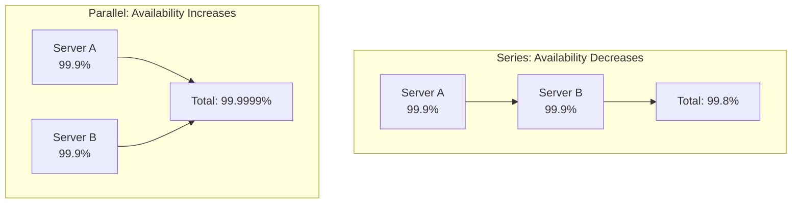

For strategies to improve availability, see [Redundancy & Replication](/system-design/fundamentals/redundancy-replication).

## 3. Reliability

**Reliability** is the probability that a system performs its intended function without failure over a given time period.

Availability asks "Is it up?". Reliability asks "Is it working correctly?" A system can be available but unreliable — it is running but returning wrong results.

### Measuring Reliability: MTBF and MTTR

Two key metrics:

**MTBF (Mean Time Between Failures)**: How long, on average, the system runs before something breaks.

**MTTR (Mean Time To Recovery)**: How long, on average, it takes to fix the system after a failure.

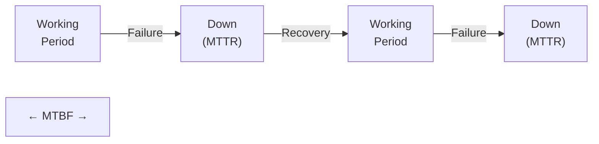

```
Availability = MTBF / (MTBF + MTTR)
```

**Example**:
- Your system fails once every 30 days (MTBF = 30 days)
- It takes 2 hours to fix each time (MTTR = 2 hours)
- Availability = 720 hours / (720 + 2) = 99.72%

To improve availability, you either:
1. **Increase MTBF** — Make failures less frequent (better hardware, better code, redundancy)
2. **Decrease MTTR** — Fix failures faster (automated failover, runbooks, monitoring)

Decreasing MTTR is usually easier and more impactful. This is why companies invest heavily in on-call processes, automated recovery, and monitoring. See [Observability Tools](/devops/observability-tools).

### Real-World Reliability Numbers

| Component | MTBF | Source |
|---|---|---|
| Server-grade HDD | 300,000 hours (~34 years) | Backblaze data |
| Server-grade SSD | 2,000,000 hours (~228 years) | Manufacturer spec |
| AWS EC2 instance | ~7,000 hours (~290 days) | Industry observation |
| In-house server | ~1,000-5,000 hours | Varies widely |

These numbers are averages. A server that "should" last 290 days might die on day 1. This is why you always plan for failures.

## 4. Consistency

**Consistency** means all users see the same data at the same time. In a distributed system (multiple servers), keeping data consistent is surprisingly hard.

### The Three Levels of Consistency

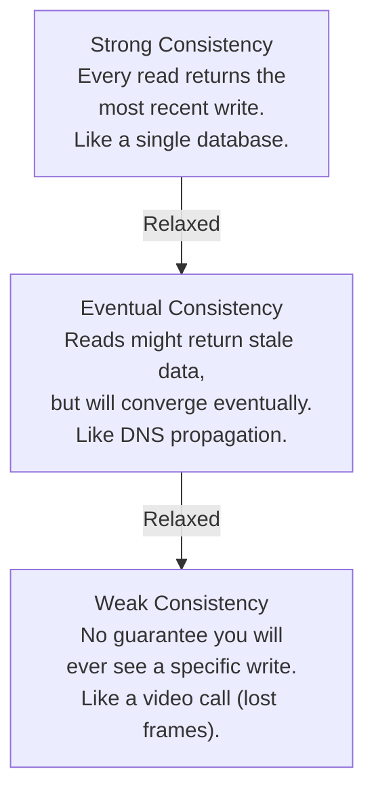

| Level | Guarantee | Latency Impact | Example |
|---|---|---|---|
| Strong | Every read sees the latest write | Higher (must wait for sync) | Bank balance after transfer |
| Eventual | Reads will catch up "eventually" | Lower (reads can be stale) | Social media likes count |
| Weak | No guarantee | Lowest | Video streaming (dropped frames) |

**When to use which**:
- Bank transactions: Strong consistency (you must see the correct balance)
- Social media feed: Eventual consistency (it is OK if a like shows up 2 seconds late)
- Live video: Weak consistency (a dropped frame is better than a paused video)

For a deep dive, see [Consistency Models](/system-design/distributed-systems/consistency-models) and [CAP Theorem](/system-design/distributed-systems/cap-theorem).

## 5. Latency

**Latency** is the time between a request being sent and the response being received. It is what users feel as "speed."

### Understanding Percentiles

Latency is measured in percentiles because averages lie. If 99 requests take 10ms and 1 request takes 10,000ms, the average is 109ms — which describes nobody's actual experience.

| Percentile | Meaning | Why It Matters |
|---|---|---|
| p50 (median) | 50% of requests are faster than this | The "typical" experience |
| p90 | 90% of requests are faster than this | The experience for most users |
| p95 | 95% of requests are faster than this | Used in most SLAs |
| p99 | 99% of requests are faster than this | The tail — where expensive users live |
| p99.9 | 99.9% of requests are faster than this | Extreme tail — often reveals bugs |

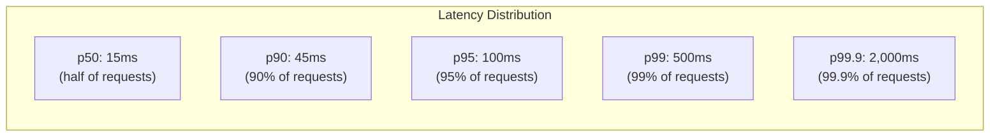

### Real-World Latency Numbers

These are approximate numbers for reference. Memorize the order of magnitude.

| Operation | Time |
|---|---|
| L1 cache reference | 0.5 ns |
| L2 cache reference | 7 ns |
| Main memory reference | 100 ns |
| SSD random read | 16 microseconds |
| HDD random read | 2-10 ms |
| Read 1 MB from memory | 3 microseconds |
| Read 1 MB from SSD | 49 microseconds |
| Read 1 MB from HDD | 825 microseconds |
| Redis GET | 0.1-0.5 ms |
| PostgreSQL simple query | 1-5 ms |
| PostgreSQL complex query | 10-100 ms |
| Round trip within data center | 0.5 ms |
| Round trip US coast-to-coast | 40 ms |
| Round trip US to Europe | 80-100 ms |
| Round trip US to Asia | 150-200 ms |

::: tip Jeff Dean's Numbers
The latency numbers above are famously attributed to Jeff Dean at Google. They help you estimate how fast or slow a system will be before you build it. When someone says "let's add a cache," you know a Redis GET (0.1ms) is 10-50x faster than a PostgreSQL query (5ms), which tells you caching is worth it.
:::

### What Causes High Latency

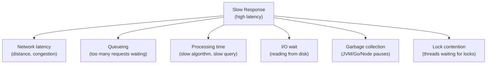

For performance debugging techniques, see [API Slow Debugging Playbook](/debugging-playbooks/api-slow) and [Node.js Profiling](/performance/profiling/nodejs-profiling).

## 6. Throughput

**Throughput** is the amount of work a system can handle per unit of time. While latency is about how fast one request completes, throughput is about how many requests complete per second.

| System | Throughput Metric | Typical Numbers |
|---|---|---|
| Web server (Node.js) | Requests per second | 5,000-30,000 RPS |
| Web server (Go) | Requests per second | 50,000-100,000 RPS |
| PostgreSQL | Queries per second | 10,000-50,000 QPS |
| Redis | Commands per second | 100,000-500,000 ops/sec |
| Kafka (single broker) | Messages per second | 200,000-1,000,000 msg/sec |
| Nginx (static files) | Requests per second | 100,000+ RPS |

### Throughput vs Latency: The Tradeoff

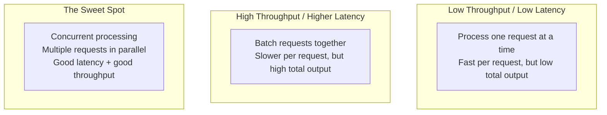

**Analogy**: A highway has two relevant metrics — how fast a single car can go (latency) and how many cars pass per hour (throughput). Making each car faster (wider lanes) is like reducing latency. Adding more lanes is like increasing throughput. At some point, too many cars on the highway cause traffic jams — throughput goes up but latency suffers.

### Bottleneck Identification

The throughput of a system is limited by its slowest component (the bottleneck):

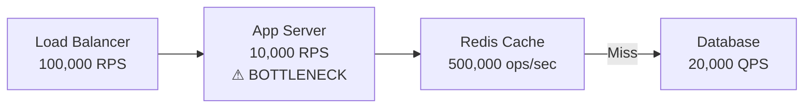

In this example, no matter how fast your load balancer, cache, or database are, the system can only handle 10,000 requests per second because the app server is the bottleneck.

## 7. Durability

**Durability** is the guarantee that once data is successfully written, it will not be lost — even if the server crashes, the disk fails, or the data center burns down.

### Levels of Durability

| Level | Protection Against | Example |
|---|---|---|
| In-memory only | Nothing (data lost on restart) | Redis without persistence |
| Single disk | Process crash | PostgreSQL with fsync |
| RAID (multiple disks) | Single disk failure | RAID-1 or RAID-10 |
| Replication (multiple servers) | Server failure | PostgreSQL streaming replication |
| Multi-AZ | Availability zone failure | AWS RDS Multi-AZ |
| Multi-region | Regional disaster | Cross-region replication |
| Multi-cloud | Cloud provider outage | Data replicated to AWS + GCP |

### Real-World Durability Numbers

| Service | Durability | What It Means |
|---|---|---|
| AWS S3 | 99.999999999% (11 nines) | In 10 million objects, you might lose 1 every 10 million years |
| AWS EBS | 99.999% (5 nines) | Annual failure rate of 0.1-0.2% |
| Redis (AOF, every second) | ~99.99% | Might lose up to 1 second of writes on crash |
| Redis (no persistence) | 0% | Everything lost on restart |

::: warning
Durability and availability are different. A system can be durable (data is safe) but unavailable (you cannot access it right now). S3 has 99.99% availability but 99.999999999% durability — meaning your data is almost certainly safe even if S3 has a brief outage.
:::

## 8. Maintainability

**Maintainability** is how easy it is to operate, modify, and extend the system over time.

This is the least glamorous characteristic but arguably the most important in the long run. Most software spends far more time being maintained than being built.

### Three Aspects of Maintainability

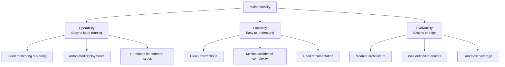

**Real-world example of poor maintainability**: A system with no tests, no documentation, no monitoring, and business logic scattered across 200 microservices that no one fully understands. Every change risks breaking something, deployments take a full day, and debugging requires tribal knowledge from the one engineer who built it in 2019.

For testing approaches that improve maintainability, see [Unit Testing](/testing/unit-testing) and [Property-Based Testing](/testing/property-based-testing).

## How Characteristics Trade Off Against Each Other

Almost every design decision involves trading one characteristic for another:

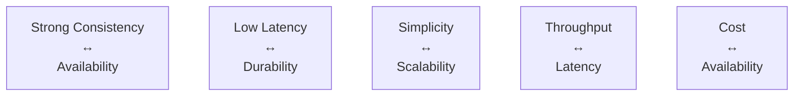

| If You Want More... | You Might Sacrifice... | Example |
|---|---|---|
| Consistency | Availability and latency | Synchronous replication waits for all nodes |
| Availability | Consistency | Eventual consistency allows stale reads |
| Low latency | Durability | Write to memory instead of disk |
| Throughput | Latency | Batch processing instead of real-time |
| Simplicity | Scalability | Monolith is simpler but harder to scale |
| Availability (more nines) | Cost | Redundancy costs money |

The CAP theorem formalizes the most famous of these trade-offs: you cannot have perfect Consistency, Availability, and Partition tolerance simultaneously. See [CAP Theorem](/system-design/distributed-systems/cap-theorem).

## Putting It Together: A Real Example

Consider designing a payments system (like Stripe):

| Characteristic | Requirement | Why |
|---|---|---|
| Availability | 99.999% (5 nines) | Payments must always work; downtime = lost revenue |
| Consistency | Strong | You cannot charge someone twice or lose a charge |
| Durability | 99.999999999% | Financial records must never be lost |
| Latency | p99 < 500ms | Users expect fast checkout |
| Throughput | 10,000+ TPS | Handle peak traffic (Black Friday) |
| Reliability | MTBF > 90 days, MTTR < 5 min | Failures must be rare and recovery automatic |
| Maintainability | High | Financial regulations require auditable changes |
| Scalability | Must handle 10x peak loads | Seasonal traffic spikes |

Now compare that to a social media feed:

| Characteristic | Requirement | Why |
|---|---|---|
| Availability | 99.9% | Annoying but not catastrophic if down |
| Consistency | Eventual | OK if a like shows up 2 seconds late |
| Durability | 99.99% | Losing a post is bad but not legally disastrous |
| Latency | p50 < 100ms | Feed must feel instant |
| Throughput | 100,000+ RPS | Millions of users scrolling simultaneously |
| Scalability | Horizontal | Must handle viral moments |

Different systems, different trade-offs, different designs.

## Key Vocabulary Summary

| Term | One-Line Definition |
|---|---|
| **Scalability** | Ability to handle increased load by adding resources |
| **Availability** | Percentage of time the system is operational |
| **Reliability** | Probability the system works correctly over time |
| **Consistency** | All users see the same data at the same time |
| **Latency** | Time from request to response |
| **Throughput** | Amount of work completed per time unit |
| **Durability** | Guarantee that written data survives failures |
| **Maintainability** | Ease of operating, understanding, and changing the system |
| **MTBF** | Mean Time Between Failures |
| **MTTR** | Mean Time To Recovery |
| **SLA** | Service Level Agreement (contractual availability guarantee) |
| **p99** | 99th percentile latency |

## What to Learn Next

- **[Scaling Fundamentals](/system-design/fundamentals/scaling-fundamentals)** — How to achieve scalability in practice
- **[Redundancy & Replication](/system-design/fundamentals/redundancy-replication)** — How to achieve availability through redundancy
- **[CAP Theorem](/system-design/distributed-systems/cap-theorem)** — The formal proof that consistency and availability trade off
- **[Estimation Practice](/system-design/fundamentals/estimation-practice)** — Practice calculating these numbers for real systems
- **[Zero to Million Users](/system-design/fundamentals/zero-to-million-users)** — See how characteristics drive architectural decisions

## Real-World Examples

::: tip Google Spanner
Google Spanner achieves **strong consistency globally** using GPS-synchronized TrueTime clocks across data centers. It provides serializable transactions with 99.999% availability — proving the CAP theorem is about trade-offs, not impossibilities. Spanner sacrifices some write latency (cross-region consensus) to give both consistency and availability.
:::

::: tip Amazon DynamoDB
DynamoDB defaults to **eventual consistency** for reads (cheaper, faster) and offers strongly consistent reads as an opt-in per-request. This design choice reflects Amazon's "availability first" philosophy — they would rather show a slightly stale shopping cart than show an error page.
:::

::: tip Stripe
Stripe designs for **99.999% availability** on their payments API. They achieve this with multi-region active-active deployment, automatic failover, and extensive chaos engineering. Their durability requirement is absolute — losing a payment record is legally and financially unacceptable, so they use synchronous replication with write-ahead logs.
:::

## Interview Tip

::: tip What to say
"Every system design decision is a trade-off between characteristics. I always start by asking: which characteristics are non-negotiable? For a payments system, consistency and durability are mandatory — I'd use strong consistency even though it costs latency. For a social media feed, I'd choose eventual consistency and optimize for low latency and high throughput, because showing a like 2 seconds late is acceptable. The key insight is that each additional nine of availability costs roughly 10x more engineering effort."
:::
