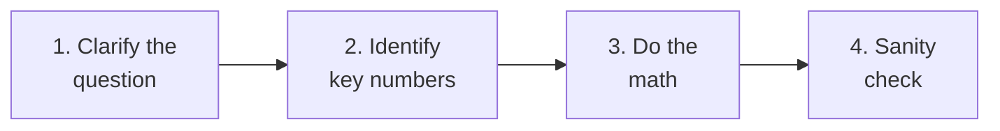
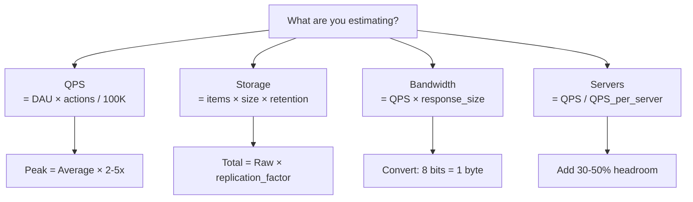

# Estimation Practice

Back-of-the-envelope estimation is the single most important skill in system design interviews and capacity planning. When someone says "design a system like Twitter," you need to know how many requests per second, how much storage, how much bandwidth, and how many servers before you draw a single diagram.

This page gives you a framework for estimation, then walks through 20 real exercises with full math solutions. Work through each one with pen and paper before reading the solution.

## The Estimation Framework

Every estimation follows the same four steps:



1. **Clarify**: What exactly are you estimating? QPS? Storage? Bandwidth?
2. **Identify numbers**: Monthly active users, daily active users, actions per user per day, data size per action
3. **Math**: Multiply, divide, convert units. Round aggressively — you want order of magnitude, not precision.
4. **Sanity check**: Does the answer make sense? Is it in the right ballpark?

## Numbers You Should Memorize

### Power of 2

| Power | Value | Approximate |
|---|---|---|
| 2^10 | 1,024 | ~1 thousand (1 KB) |
| 2^20 | 1,048,576 | ~1 million (1 MB) |
| 2^30 | 1,073,741,824 | ~1 billion (1 GB) |
| 2^40 | ~1.1 trillion | ~1 TB |
| 2^50 | ~1.1 quadrillion | ~1 PB |

### Time Conversions

| Period | Seconds |
|---|---|
| 1 day | 86,400 (~10^5) |
| 1 month | 2,592,000 (~2.5 × 10^6) |
| 1 year | 31,536,000 (~3 × 10^7) |

::: tip The Magic Number
There are about **100,000 seconds in a day** (actually 86,400, but round to 10^5 for easy math). This is the most useful conversion factor in estimation.
:::

### Common Service Numbers

| Service (2026) | DAU | MAU |
|---|---|---|
| Facebook | ~2 billion | ~3 billion |
| YouTube | ~2.5 billion | ~2.7 billion |
| WhatsApp | ~2 billion | ~2.8 billion |
| Instagram | ~1.5 billion | ~2 billion |
| TikTok | ~1.2 billion | ~1.8 billion |
| Twitter/X | ~250 million | ~550 million |
| Slack | ~35 million | ~80 million |
| Uber | ~130 million monthly riders | |
| Netflix | ~280 million subscribers | |
| Spotify | ~250 million DAU | ~650 million MAU |

### Data Size Reference

| Data | Approximate Size |
|---|---|
| 1 character (ASCII) | 1 byte |
| 1 character (UTF-8, international) | 1-4 bytes |
| A tweet (280 chars) | ~0.5 KB (with metadata) |
| A WhatsApp text message (with metadata) | ~0.1 KB |
| A JSON API response | 1-10 KB |
| An Instagram photo (compressed) | 200-500 KB |
| A profile picture thumbnail | 10-50 KB |
| 1 minute of MP3 audio | ~1 MB |
| 1 minute of 1080p video (compressed) | ~10 MB |
| 1 minute of 4K video (compressed) | ~40 MB |

## The QPS Formula

Most estimations need **Queries Per Second (QPS)**:

```
QPS = DAU × actions_per_user_per_day / seconds_per_day

Simplified:
QPS = DAU × actions_per_user / 100,000
```

**Peak QPS** is typically 2-5x the average QPS (traffic is not evenly distributed; peaks happen during evenings and events).

---

## Exercise 1: Twitter QPS

**Question**: Estimate the read and write QPS for Twitter.

**Given**:
- 250 million DAU
- Average user views ~200 tweets per day (scrolling feed)
- Average user posts ~0.5 tweets per day (most users just read)

**Solution**:

```
Read QPS:
  250M users × 200 tweets viewed / 100,000 seconds
  = 50,000,000,000 / 100,000
  = 500,000 read QPS

Write QPS:
  250M users × 0.5 tweets / 100,000 seconds
  = 125,000,000 / 100,000
  = 1,250 write QPS

Peak read QPS: 500,000 × 3 = ~1,500,000
Peak write QPS: 1,250 × 3 = ~3,750
```

**Key insight**: Read-to-write ratio is 400:1. This is heavily read-heavy, which means caching is extremely effective.

---

## Exercise 2: WhatsApp Storage (Messages)

**Question**: How much storage does WhatsApp need for messages per year?

**Given**:
- 2 billion DAU
- Average user sends 40 messages per day
- Average message size: 100 bytes (text, with metadata)
- Messages stored for 30 days on servers (then only on device)

**Solution**:

```
Messages per day:
  2B × 40 = 80 billion messages/day

Storage per day:
  80B × 100 bytes = 8 TB/day

Storage for 30-day window:
  8 TB × 30 = 240 TB

With replication factor of 3:
  240 TB × 3 = 720 TB
```

**Key insight**: Even a "simple" messaging app needs nearly 1 PB of storage just for recent messages. This is why WhatsApp only stores messages temporarily on servers and relies on device storage for history.

---

## Exercise 3: YouTube Bandwidth

**Question**: Estimate YouTube's total bandwidth consumption.

**Given**:
- 2.5 billion DAU
- Average user watches 40 minutes of video per day
- Average video quality: mix of 480p (3 MB/min) and 1080p (10 MB/min)
- Weighted average: ~5 MB/min

**Solution**:

```
Total minutes watched per day:
  2.5B × 40 min = 100 billion minutes/day

Data consumed per day:
  100B min × 5 MB/min = 500 PB/day

Bandwidth (average):
  500 PB / 86,400 seconds = ~5.8 TB/second = ~46.4 Tbps

Peak bandwidth (2-3x):
  ~100-140 Tbps
```

**Key insight**: YouTube serves nearly 50 Tbps on average. This is why CDNs are essential — this bandwidth is distributed across thousands of edge servers worldwide. See [CDN Deep Dive](/system-design/caching/cdn-deep-dive).

---

## Exercise 4: Uber Rides Per Day

**Question**: Estimate the QPS for Uber ride requests and location updates.

**Given**:
- ~130 million monthly riders
- ~30% use Uber daily = ~40 million daily riders
- ~5 million active drivers at any time
- Each rider requests ~1.5 rides per day
- Active drivers send location every 4 seconds

**Solution**:

```
Ride requests QPS:
  40M riders × 1.5 rides / 100,000 seconds
  = 600 ride requests/second

Driver location updates QPS:
  5M drivers / 4 seconds per update
  = 1,250,000 updates/second

Peak location updates:
  1.25M × 3 = ~3.75M QPS
```

**Key insight**: Location updates dominate the system at 1.25M QPS — over 2,000x more than ride requests. The system design must be optimized for high-throughput writes, not ride matching.

---

## Exercise 5: Instagram Upload Storage

**Question**: How much new storage does Instagram need per day for photo uploads?

**Given**:
- 1.5 billion DAU
- ~5% post a photo on any given day = 75 million uploads/day
- Average photo: 500 KB (compressed, displayed version)
- Instagram stores 4 sizes per photo (thumbnail, small, medium, original)
- Total per photo with all sizes: ~1.5 MB

**Solution**:

```
Daily upload storage:
  75M photos × 1.5 MB = 112.5 TB/day

Annual upload storage:
  112.5 TB × 365 = ~41 PB/year

With replication factor of 3:
  41 PB × 3 = ~123 PB/year

Upload QPS:
  75M / 100,000 = 750 uploads/second
```

**Key insight**: 41 PB of new data per year just from photos. This is why Instagram uses dedicated blob storage (not a database) for images and aggressive compression. See [CDN Deep Dive](/system-design/caching/cdn-deep-dive).

---

## Exercise 6: Slack Messages

**Question**: Estimate Slack's message QPS and daily storage.

**Given**:
- 35 million DAU
- Average user sends 30 messages per day
- Average message: 200 bytes (text + metadata)
- Average user reads ~300 messages per day

**Solution**:

```
Write QPS:
  35M × 30 / 100,000 = 10,500 write QPS

Read QPS:
  35M × 300 / 100,000 = 105,000 read QPS

Daily storage:
  35M × 30 × 200 bytes = 210 GB/day

Annual storage:
  210 GB × 365 = ~77 TB/year
  With replication: ~230 TB/year
```

**Key insight**: Slack is 10:1 read-heavy. Messages are small but frequent. The challenge is not storage (77 TB/year is modest) but real-time delivery and search across billions of messages.

---

## Exercise 7: Netflix Streaming

**Question**: Estimate Netflix's peak bandwidth requirements.

**Given**:
- 280 million subscribers
- ~50% watch on any given day = 140 million daily streamers
- Average session: 90 minutes
- Average bitrate: 5 Mbps (mix of quality levels)
- Peak: 30% of daily viewers watch simultaneously in evening prime time

**Solution**:

```
Peak concurrent viewers:
  140M × 0.30 = 42 million concurrent

Peak bandwidth:
  42M × 5 Mbps = 210 Tbps

With encoding overhead (~10%):
  ~230 Tbps peak
```

**Key insight**: 230 Tbps is enormous. Netflix operates their own CDN (Open Connect) with thousands of servers placed directly inside ISP networks to avoid congesting the internet backbone.

---

## Exercise 8: Google Search QPS

**Question**: Estimate Google Search queries per second.

**Given**:
- ~8.5 billion searches per day worldwide (Google's disclosed number)

**Solution**:

```
Average QPS:
  8.5B / 86,400 = ~98,000 QPS

Rounded: ~100,000 QPS

Peak QPS (2-3x):
  ~200,000-300,000 QPS
```

Each search query actually triggers many internal lookups (index lookups, ad auctions, personalization, spell checking, knowledge graph), so the internal QPS might be 10-100x the external QPS: 1-10 million internal operations per second.

---

## Exercise 9: Spotify Audio Storage

**Question**: How much storage does Spotify need for its entire music library?

**Given**:
- ~100 million tracks in library
- Average track: 3.5 minutes
- Stored in multiple quality levels:
  - Low (24 kbps): ~0.6 MB/min
  - Normal (96 kbps): ~0.7 MB/min
  - High (160 kbps): ~1.2 MB/min
  - Very High (320 kbps): ~2.4 MB/min
- Total per track across all qualities: ~3.5 min × (0.6 + 0.7 + 1.2 + 2.4) MB/min ≈ 17 MB

**Solution**:

```
Total library storage:
  100M tracks × 17 MB = 1,700 TB = ~1.7 PB

With replication factor of 3:
  1.7 PB × 3 = ~5.1 PB

With CDN copies worldwide (estimate 10 edge regions):
  Could be 17+ PB of total stored audio data
```

**Key insight**: 1.7 PB for the entire music library is surprisingly manageable. The real challenge is the bandwidth — 250 million daily users streaming simultaneously.

---

## Exercise 10: Discord Concurrent Users

**Question**: Estimate Discord's peak concurrent users and message throughput.

**Given**:
- ~200 million MAU
- ~40% DAU ratio = 80 million DAU
- Average session: 4 hours
- Average user sends 50 messages per day
- Peak: 40% of DAU online simultaneously

**Solution**:

```
Peak concurrent users:
  80M × 0.40 = 32 million concurrent connections

Message write QPS:
  80M × 50 / 100,000 = 40,000 message writes/second

Peak message QPS:
  40,000 × 3 = 120,000 writes/second

Each message is read by N users in the channel.
Average channel size: ~20 members
Message read QPS:
  120,000 × 20 = 2,400,000 read deliveries/second
```

**Key insight**: 32 million concurrent WebSocket connections is the hard engineering challenge. Each connection uses memory on a server. If each WebSocket connection uses ~10 KB of memory, you need 320 GB of RAM just for connection state. See [WebSockets](/system-design/networking/websockets).

---

## Exercise 11: Twitter Storage (Tweets)

**Question**: How much storage does Twitter need for tweets per year?

**Given**:
- 250 million DAU
- 0.5 tweets per user per day
- Tweet metadata (user ID, timestamp, geo, reply info): ~500 bytes
- About 30% of tweets have a photo (~300 KB average)
- About 5% have a video (~5 MB average)

**Solution**:

```
Tweets per day: 250M × 0.5 = 125M tweets/day

Text + metadata:
  125M × 500 bytes = 62.5 GB/day

Photos:
  125M × 0.30 × 300 KB = 11.25 TB/day

Videos:
  125M × 0.05 × 5 MB = 31.25 TB/day

Total daily: ~42.5 TB/day
Annual: 42.5 TB × 365 = ~15.5 PB/year
With replication (3x): ~46.5 PB/year
```

---

## Exercise 12: Uber Location Data Storage

**Question**: How much location data does Uber store per day?

**Given**:
- 5 million active drivers
- Average driver is active 8 hours/day
- Location update every 4 seconds
- Each location record: driver_id (8 bytes), lat (8 bytes), lon (8 bytes), timestamp (8 bytes), speed (4 bytes), heading (4 bytes) = ~40 bytes

**Solution**:

```
Updates per driver per active day:
  8 hours × 3,600 seconds/hour / 4 seconds = 7,200 updates

Total daily updates:
  5M drivers × 7,200 = 36 billion updates/day

Daily storage:
  36B × 40 bytes = 1.44 TB/day

Annual: 1.44 TB × 365 = ~525 TB/year
With replication (3x): ~1.6 PB/year
```

---

## Exercise 13: Email Storage (Gmail)

**Question**: Estimate Gmail's total storage requirement.

**Given**:
- ~1.8 billion Gmail users
- Average user stores 5 GB of email data
- Only ~30% of users are active and growing their mailbox

**Solution**:

```
Total storage:
  1.8B × 5 GB = 9 EB (exabytes)

New data per day:
  Assume active users receive 50 emails/day, average 75 KB each
  540M active × 50 × 75 KB = ~2 PB/day

Annual new data: ~730 PB/year
With replication (3x): ~2.2 EB/year
```

**Key insight**: Gmail stores approximately 9 exabytes of email. This is why Google built custom storage infrastructure (Colossus/GFS) rather than using off-the-shelf databases.

---

## Exercise 14: Chat App Message Delivery Latency

**Question**: If a chat app has 100 million concurrent users, how many servers do you need for WebSocket connections?

**Given**:
- 100 million concurrent WebSocket connections
- Each connection uses ~10 KB of memory
- Each server has 64 GB of usable RAM for connections
- Leave 30% overhead for processing

**Solution**:

```
Usable RAM per server: 64 GB × 0.70 = ~45 GB

Connections per server:
  45 GB / 10 KB = 4,500,000 connections/server

Servers needed:
  100M / 4.5M = ~23 servers

With 50% headroom for spikes:
  23 × 1.5 = ~35 servers for WebSocket connections
```

**Key insight**: 35 servers for 100M connections sounds surprisingly few, but this is only for connection state. Message routing, storage, presence tracking, and fan-out require many more servers.

---

## Exercise 15: URL Shortener (like bit.ly)

**Question**: Design capacity for a URL shortener with 500 million new URLs per month.

**Given**:
- 500 million new URLs per month
- Read-to-write ratio: 100:1
- Each URL mapping: short URL (7 chars) + original URL (average 200 chars) + metadata = ~500 bytes
- Keep URLs for 5 years

**Solution**:

```
Write QPS:
  500M / (30 × 86,400) = ~190 writes/second

Read QPS:
  190 × 100 = ~19,000 reads/second

Storage for 5 years:
  500M × 12 months × 5 years × 500 bytes
  = 30B URLs × 500 bytes = 15 TB

With replication (3x): 45 TB
```

**Key insight**: A URL shortener is heavily read-biased and relatively small in storage. The main challenge is making reads as fast as possible — this is a perfect use case for Redis as a cache in front of a database.

---

## Exercise 16: Payment System (like Stripe)

**Question**: Estimate QPS and storage for a payment processor handling 1 billion transactions per year.

**Given**:
- 1 billion transactions/year
- Each transaction record: ~2 KB (amount, currency, card token, merchant, status, metadata)
- Must keep records for 7 years (regulatory requirement)
- Peak: Black Friday = 10x average

**Solution**:

```
Average QPS:
  1B / (365 × 86,400) = ~32 transactions/second

Peak QPS (Black Friday):
  32 × 10 = 320 TPS

Storage per year:
  1B × 2 KB = 2 TB/year

7-year retention:
  2 TB × 7 = 14 TB

With replication + audit logs:
  ~50-100 TB total
```

**Key insight**: Payment systems are surprisingly low QPS compared to social media. The challenge is not throughput but rather consistency, durability, and auditability. See [Distributed Transactions](/system-design/distributed-systems/distributed-transactions).

---

## Exercise 17: Social Media Feed Generation

**Question**: Estimate the compute needed to generate Instagram feeds.

**Given**:
- 1.5 billion DAU
- Average user opens the app 7 times per day = 7 feed generations
- Each feed generation considers posts from ~200 followed accounts
- Each consideration involves scoring (ML model inference): ~0.1ms per post

**Solution**:

```
Feed generations per day:
  1.5B × 7 = 10.5 billion/day

Feed generation QPS:
  10.5B / 100,000 = 105,000 QPS

Posts scored per generation: 200
Total scoring operations per second:
  105,000 × 200 = 21,000,000 scoring ops/second

Compute time per second:
  21M × 0.1ms = 2,100 seconds of compute per wall-clock second
  = 2,100 CPU-cores dedicated to feed scoring
```

**Key insight**: Feed generation is a CPU-intensive fan-out problem. 2,100 cores just for scoring, plus memory for loading all those posts. This is why companies precompute feeds rather than generating them on every request. See [Caching Strategies](/system-design/caching/caching-strategies).

---

## Exercise 18: Video Upload Processing (YouTube)

**Question**: How much compute does YouTube need for video transcoding?

**Given**:
- ~500 hours of video uploaded every minute (YouTube's disclosed number)
- Each video is transcoded into ~10 quality levels (144p through 4K + audio)
- Transcoding 1 minute of video into one quality takes ~2 minutes of CPU time
- Total transcode work per minute of uploaded video: 10 qualities × 2 CPU-minutes = 20 CPU-minutes

**Solution**:

```
Minutes of video uploaded per minute: 500 hours × 60 = 30,000 minutes

CPU-minutes needed per upload minute:
  30,000 × 20 = 600,000 CPU-minutes per minute

CPU cores needed:
  600,000 CPU-minutes / 1 minute = 600,000 CPU cores

With 50% utilization target:
  ~1.2 million CPU cores for transcoding
```

**Key insight**: YouTube needs over a million CPU cores just for transcoding. This is why video platforms are among the largest consumers of cloud compute. This processing is asynchronous — videos are not available in all qualities immediately after upload.

---

## Exercise 19: Notification System

**Question**: Estimate the push notification throughput for an app with 500 million DAU.

**Given**:
- 500 million DAU
- Average user receives 20 push notifications per day
- Peak hour: 15% of daily notifications sent in one hour
- Each notification: ~1 KB (payload + metadata + device token)

**Solution**:

```
Total notifications per day:
  500M × 20 = 10 billion/day

Average notifications per second:
  10B / 86,400 = ~115,000/second

Peak hour notifications:
  10B × 0.15 = 1.5 billion in one hour
  = 1.5B / 3,600 = ~417,000 notifications/second

Bandwidth for peak:
  417K × 1 KB = ~417 MB/second = ~3.3 Gbps
```

**Key insight**: Sending 417K notifications per second requires a highly optimized delivery pipeline. You cannot open individual connections to APNS/FCM for each notification — you need connection pooling and batching.

---

## Exercise 20: Search Index (Google Scale)

**Question**: Estimate the storage needed for Google's search index.

**Given**:
- Google indexes ~130 trillion web pages (estimated)
- Average indexed page: ~100 KB of text content
- Inverted index is typically 30-50% of raw text size
- Forward index (for snippets) adds another 20%

**Solution**:

```
Raw text content:
  130 trillion × 100 KB = 13 EB (exabytes)

Inverted index (40% of raw):
  13 EB × 0.40 = 5.2 EB

Forward index (20% of raw):
  13 EB × 0.20 = 2.6 EB

Total index storage:
  5.2 + 2.6 = ~7.8 EB

With replication across data centers (3-5x):
  ~25-40 EB
```

**Key insight**: Google's search index is measured in exabytes. This is why Google invented GFS, MapReduce, and BigTable — no existing technology could handle this scale when they needed it.

---

## Estimation Cheat Sheet



| What | Formula |
|---|---|
| QPS | DAU x actions_per_user / 86,400 |
| Peak QPS | Average QPS x 2-5 |
| Storage/year | DAU x actions_per_user x 365 x data_per_action |
| Bandwidth | QPS x average_response_size |
| Servers needed | Peak QPS / QPS_per_server x 1.5 (headroom) |

## What to Learn Next

- **[System Design Characteristics](/system-design/fundamentals/characteristics)** — Understand the numbers that define a system
- **[Zero to Million Users](/system-design/fundamentals/zero-to-million-users)** — See how these numbers drive architecture decisions
- **[Building Blocks Overview](/system-design/fundamentals/building-blocks)** — The components you will size using these estimations
- **[Cache Sizing Math](/system-design/caching/cache-sizing-math)** — Apply estimation to cache capacity planning
