# How the Internet Works

You open your browser, type `www.google.com`, and press Enter. In less than a second, a fully rendered webpage appears on your screen. That single second involves dozens of machines, thousands of miles of fiber optic cable, multiple protocol handshakes, and a carefully orchestrated chain of events that most developers never think about.

This page breaks down every single step of that journey. If you have never studied networking before, this is your starting point. Everything else in system design — load balancing, caching, databases, distributed systems — builds on the concepts explained here.

## The Big Picture

Before we dive into details, here is the entire lifecycle of what happens when you type a URL and press Enter:

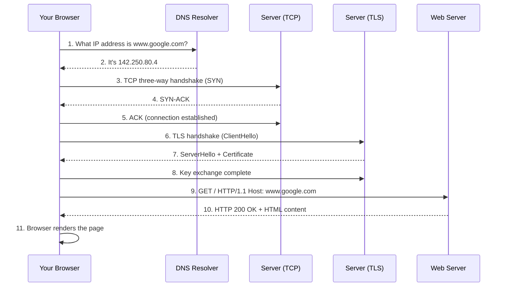

Each numbered step is an entire topic on its own. Let us walk through every single one.

## Step 0: What Is the Internet, Actually?

The internet is not a cloud. It is not magic. It is a physical network of computers connected by cables. Undersea fiber optic cables cross entire oceans. Copper and fiber cables run under your city streets. Your Wi-Fi router connects to these cables through your Internet Service Provider (ISP).

At its core, the internet is just millions of computers that have agreed to speak the same language. That language is called **TCP/IP** (Transmission Control Protocol / Internet Protocol). Every device that connects to the internet — your phone, your laptop, a server in a data center — uses TCP/IP to communicate.

### A Simple Analogy

Think of the internet like the postal system:

| Postal System | Internet |
|---|---|
| Your home address | IP address |
| ZIP code | Network prefix |
| Mail carrier | Router |
| Post office | ISP |
| Letter | Data packet |
| Envelope with address | IP header |
| Certified mail (tracking) | TCP |
| Regular mail (no tracking) | UDP |

Just like a letter goes through multiple post offices before reaching its destination, your data goes through multiple routers before reaching the server.

## Step 1: IP Addresses — The Address System of the Internet

Every device on the internet has a unique address called an **IP address**. There are two versions:

### IPv4

An IPv4 address looks like this: `192.168.1.1`

It is four numbers separated by dots. Each number can be 0 to 255. That gives us about 4.3 billion possible addresses. That sounds like a lot, but there are over 30 billion devices connected to the internet today. We ran out of IPv4 addresses years ago.

```
IPv4 address: 142.250.80.4
                │    │   │ │
                │    │   │ └── 8 bits (0-255)
                │    │   └──── 8 bits (0-255)
                │    └──────── 8 bits (0-255)
                └────────────── 8 bits (0-255)

Total: 32 bits = 2^32 = 4,294,967,296 addresses
```

### IPv6

IPv6 was created to solve the address shortage. An IPv6 address looks like this: `2607:f8b0:4004:0800:0000:0000:0000:200e`

It uses 128 bits instead of 32, giving us 340 undecillion addresses (that is a 3 followed by 38 zeros). We will never run out.

### Public vs Private IP Addresses

Not every device has a public IP address. Your home network uses **private** IP addresses internally:

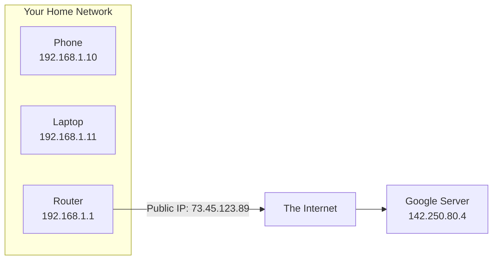

Your router uses **Network Address Translation (NAT)** to translate between your private addresses and the single public IP address your ISP gave you. This is how hundreds of devices in your home can share one public IP.

Private IP ranges you will see everywhere:
- `10.0.0.0` to `10.255.255.255` (large networks)
- `172.16.0.0` to `172.31.255.255` (medium networks)
- `192.168.0.0` to `192.168.255.255` (home networks)

## Step 2: Ports — Apartment Numbers for IP Addresses

If an IP address is like a building address, a **port** is like an apartment number. A single server at IP `142.250.80.4` runs many different services. Ports tell the network which service you want to talk to.

A port is a number from 0 to 65535. Some ports are standard:

| Port | Service | What It Does |
|---|---|---|
| 80 | HTTP | Unencrypted web traffic |
| 443 | HTTPS | Encrypted web traffic |
| 22 | SSH | Remote terminal access |
| 53 | DNS | Domain name lookups |
| 25 | SMTP | Sending email |
| 3306 | MySQL | MySQL database |
| 5432 | PostgreSQL | PostgreSQL database |
| 6379 | Redis | Redis cache/store |
| 27017 | MongoDB | MongoDB database |

When you visit `https://www.google.com`, your browser automatically uses port 443 because `https://` means encrypted. The full address is actually `https://www.google.com:443`, but browsers hide the default port.

```
Full network address:  142.250.80.4:443
                       ──────────── ───
                       IP address   Port
```

## Step 3: Domain Names and DNS — The Phone Book

Nobody wants to type `142.250.80.4` into their browser. We use **domain names** like `www.google.com` instead. The system that translates domain names into IP addresses is called **DNS** (Domain Name System).

DNS is like a phone book for the internet. You look up a name, and it gives you a number.

### How DNS Resolution Works

When you type `www.google.com`, your browser needs to find the IP address. Here is the full resolution chain:

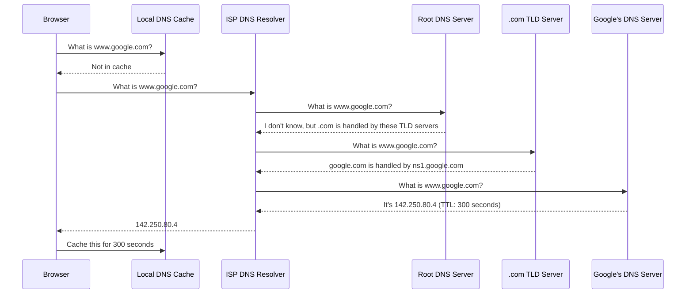

The resolution goes through up to four levels:

1. **Browser cache** — Your browser remembers recent lookups (Chrome caches for ~60 seconds)
2. **Operating system cache** — Your OS has its own DNS cache
3. **Router cache** — Your home router caches DNS results too
4. **ISP recursive resolver** — Your ISP's DNS server does the heavy lifting
5. **Root servers** — 13 root server clusters worldwide (named a.root-servers.net through m.root-servers.net)
6. **TLD servers** — Servers for `.com`, `.org`, `.net`, etc.
7. **Authoritative servers** — The final server that actually knows the IP address

::: tip Why This Matters for System Design
DNS is the first thing that happens for every single request. If DNS is slow, everything is slow. This is why companies use DNS providers like Cloudflare (1.1.1.1) or Google (8.8.8.8) that have servers all over the world. For a deep dive into DNS internals, see the [DNS Deep Dive](/system-design/networking/dns-deep-dive) page.
:::

### DNS Record Types

DNS does not just store IP addresses. It stores different types of records:

| Record Type | Purpose | Example |
|---|---|---|
| A | Maps domain to IPv4 address | `google.com` → `142.250.80.4` |
| AAAA | Maps domain to IPv6 address | `google.com` → `2607:f8b0:...` |
| CNAME | Alias one domain to another | `www.google.com` → `google.com` |
| MX | Mail server for a domain | `google.com` → `smtp.google.com` |
| NS | Name server for a domain | `google.com` → `ns1.google.com` |
| TXT | Arbitrary text (verification, SPF) | `google.com` → `v=spf1 ...` |

## Step 4: TCP — The Reliable Delivery Service

Now that the browser knows the IP address (`142.250.80.4`), it needs to establish a connection. The internet uses **TCP** (Transmission Control Protocol) for reliable communication.

TCP guarantees three things:
1. **Delivery** — Every packet arrives (or you get an error)
2. **Order** — Packets arrive in the correct sequence
3. **Integrity** — Data is not corrupted in transit

### The TCP Three-Way Handshake

Before any data is sent, the client and server perform a "handshake" to establish a connection:

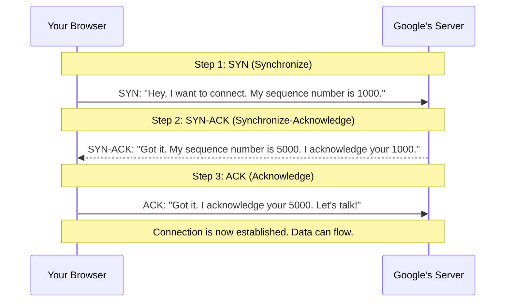

This handshake takes one **round trip** between client and server. If you are in New York and the server is in California, light in fiber takes about 20 milliseconds one way. So the handshake alone takes about 40 milliseconds. This matters because it adds latency to every new connection.

### Why Not Just Send Data Immediately?

The handshake exists because the internet is unreliable. Packets get lost, duplicated, or delayed. The handshake ensures both sides agree on:
- Sequence numbers (to detect missing or out-of-order packets)
- Window sizes (how much data to send before waiting for acknowledgment)
- Whether the other side is even alive

### TCP vs UDP

TCP is not the only option. **UDP** (User Datagram Protocol) skips the handshake and reliability:

| Feature | TCP | UDP |
|---|---|---|
| Connection setup | Three-way handshake | None |
| Delivery guarantee | Yes | No |
| Order guarantee | Yes | No |
| Speed | Slower (overhead) | Faster (no overhead) |
| Use case | Web, email, file transfer | Video streaming, gaming, DNS queries |

Video calls use UDP because a dropped frame is better than a delayed one. Web browsing uses TCP because you need every byte of HTML to arrive correctly.

## Step 5: TLS — The Encryption Layer

After TCP connects, if you are using HTTPS (which is almost all websites today), the browser and server perform a **TLS handshake** (Transport Layer Security). This encrypts everything so nobody between you and the server can read the data.

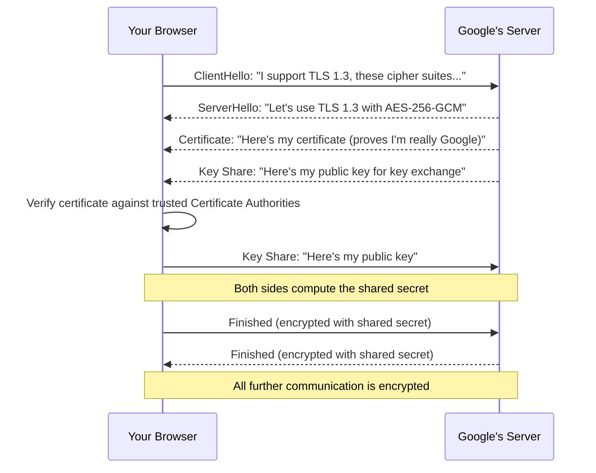

### What the TLS Handshake Does

1. **Agrees on encryption method** — Both sides agree on which encryption algorithm to use
2. **Verifies identity** — The server proves it is really Google (not an impersonator) using a digital certificate
3. **Exchanges keys** — Both sides generate a shared secret key used to encrypt all future messages

TLS 1.3 (the current version) does this in just **one round trip** (about 20ms for coast-to-coast US connections). Older TLS 1.2 required two round trips.

::: info Real-World Impact
The TLS handshake adds 20-100ms to every new connection depending on distance. This is why modern browsers keep connections open (HTTP keep-alive) instead of creating a new one for every request. For a deep dive into TLS, see the [TLS Handshake](/system-design/networking/tls-handshake) page.
:::

### Certificates and Trust

How does your browser know the certificate is real? Every browser and operating system ships with a list of trusted **Certificate Authorities (CAs)** — companies like Let's Encrypt, DigiCert, and Comodo. When Google gets a certificate, a CA vouches for them. Your browser trusts the CA, so it trusts Google's certificate.

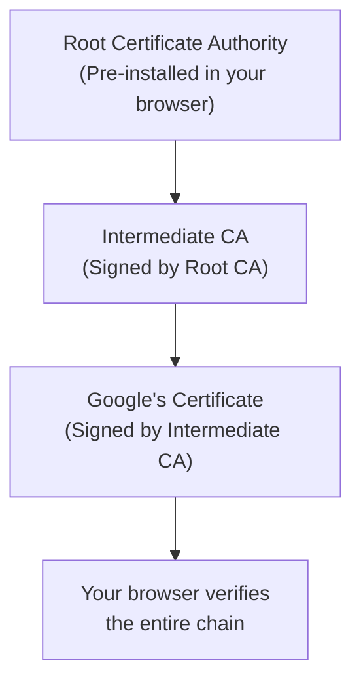

## Step 6: HTTP — The Language of the Web

Now the connection is established and encrypted. The browser sends an **HTTP request** to the server. HTTP (HyperText Transfer Protocol) is the language browsers and servers use to communicate.

### The HTTP Request

```
GET / HTTP/1.1
Host: www.google.com
User-Agent: Chrome/120.0
Accept: text/html
Accept-Language: en-US
Accept-Encoding: gzip, deflate, br
Connection: keep-alive
```

Let us break this down line by line:

| Line | Meaning |
|---|---|
| `GET / HTTP/1.1` | Method=GET, Path=/, Version=HTTP/1.1 |
| `Host: www.google.com` | Which website (one server can host many) |
| `User-Agent: Chrome/120.0` | What browser you are using |
| `Accept: text/html` | What format you want the response in |
| `Accept-Encoding: gzip` | "I can handle compressed responses" |
| `Connection: keep-alive` | "Don't close this connection after one request" |

### HTTP Methods

| Method | Purpose | Example |
|---|---|---|
| GET | Retrieve data | Load a webpage |
| POST | Send data | Submit a login form |
| PUT | Replace data | Update your profile |
| PATCH | Partially update data | Change just your email |
| DELETE | Remove data | Delete a post |
| HEAD | GET without the body | Check if a page exists |
| OPTIONS | Ask what methods are allowed | CORS preflight check |

### The HTTP Response

```
HTTP/1.1 200 OK
Content-Type: text/html; charset=UTF-8
Content-Length: 14523
Content-Encoding: gzip
Cache-Control: max-age=300
Set-Cookie: session=abc123; Secure; HttpOnly

<!DOCTYPE html>
<html>
  <head><title>Google</title></head>
  <body>...</body>
</html>
```

### HTTP Status Codes

| Code Range | Category | Common Codes |
|---|---|---|
| 1xx | Informational | 100 Continue, 101 Switching Protocols |
| 2xx | Success | 200 OK, 201 Created, 204 No Content |
| 3xx | Redirect | 301 Moved Permanently, 302 Found, 304 Not Modified |
| 4xx | Client Error | 400 Bad Request, 401 Unauthorized, 403 Forbidden, 404 Not Found |
| 5xx | Server Error | 500 Internal Server Error, 502 Bad Gateway, 503 Service Unavailable |

::: tip
You will see these status codes everywhere in system design. When someone talks about "the API returns a 429," they mean the server is rate-limiting you. When debugging says "502 Bad Gateway," the load balancer cannot reach the backend server. See the [Intermittent 502 Debugging Playbook](/debugging-playbooks/intermittent-502) for real-world examples.
:::

## Step 7: What Happens at Each Hop

Your request does not fly directly from your laptop to Google's server. It passes through many intermediate devices:

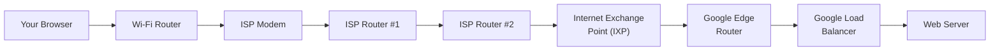

Each hop is a **router** that reads the destination IP address and forwards the packet to the next router that is closer to the destination. This process is called **routing**.

### Traceroute — See the Hops Yourself

You can see every hop your data takes using the `traceroute` command (or `tracert` on Windows):

```bash
$ traceroute google.com
 1  192.168.1.1      1.2 ms    ← Your router
 2  10.0.0.1         5.3 ms    ← ISP local node
 3  72.14.215.85     8.1 ms    ← ISP backbone
 4  108.170.252.1   10.2 ms    ← Google edge
 5  142.250.80.4    11.5 ms    ← Google server
```

Each line is one hop. The time shown is the **round-trip time** to that hop and back. Notice how the numbers go up — each hop adds latency.

### Internet Exchange Points (IXPs)

Big networks meet at **Internet Exchange Points**. These are physical buildings where ISPs, cloud providers, and content companies connect their networks directly. There are about 900 IXPs worldwide. The biggest ones (like DE-CIX in Frankfurt) handle over 14 terabits per second of traffic.

## Step 8: The Server Side

The request arrives at Google's data center. But it does not go straight to a single computer. A modern web service has many layers:

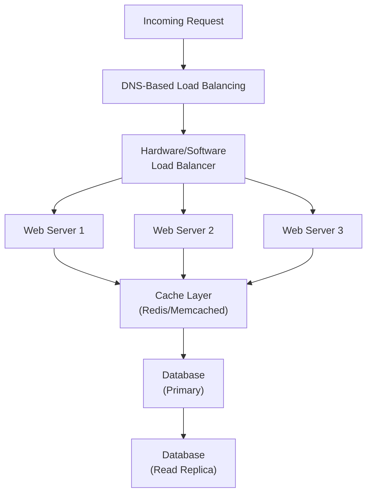

1. **DNS-based load balancing** — Google's DNS returns different IP addresses to different users, spreading traffic across data centers worldwide
2. **Load balancer** — Distributes requests across many identical web servers (see [Load Balancing](/system-design/load-balancing))
3. **Web servers** — The actual application code that processes your request
4. **Cache** — Stores frequently accessed data in memory for speed (see [Caching Strategies](/system-design/caching/caching-strategies))
5. **Database** — Stores permanent data on disk (see [Databases](/system-design/databases))

## Step 9: The Response Journey

The response takes the reverse path. But it is not necessarily the same route — internet routing is dynamic, and the return path may use completely different routers.

### How the Browser Renders the Page

Once the browser receives the HTML, rendering begins:

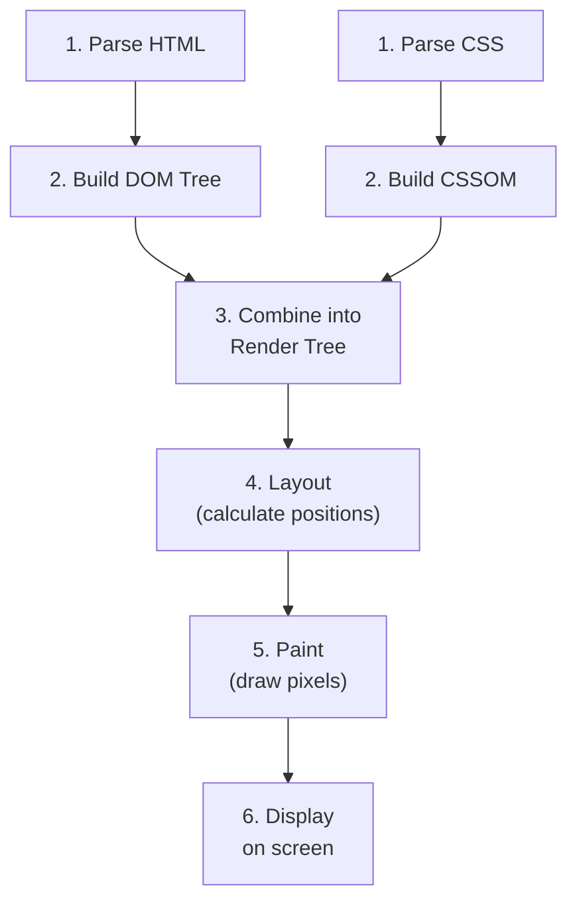

The browser parses the HTML, discovers it needs CSS files, JavaScript files, images, and fonts — and makes additional HTTP requests for each one. A typical webpage makes 50-100 additional requests after the initial HTML loads.

## The Complete Timeline with Real Numbers

Here is every step with approximate timing for a user in New York accessing a server in California (80ms round trip):

| Step | Time | Cumulative | What Happens |
|---|---|---|---|
| DNS lookup | 0-50ms | 50ms | Usually cached, sometimes requires full resolution |
| TCP handshake | 40ms | 90ms | 1 round trip (SYN → SYN-ACK → ACK) |
| TLS handshake | 40ms | 130ms | 1 round trip for TLS 1.3 |
| HTTP request/response | 40ms | 170ms | 1 round trip for the HTML |
| Receive HTML | 10-50ms | 220ms | Depends on page size and bandwidth |
| Parse and render | 50-200ms | 420ms | Browser processes HTML, CSS, JS |
| Additional resources | 100-500ms | 920ms | CSS, JS, images, fonts |
| **Total** | | **~1 second** | **Page is interactive** |

This is why the "Time to Interactive" metric for most websites is 1-3 seconds even on fast connections. Every round trip adds ~40ms (coast-to-coast US) or ~100ms (US to Europe) or ~150ms (US to Asia).

## HTTP Versions — How the Protocol Evolved

The web did not always work the way it does today. HTTP has evolved significantly:

### HTTP/1.0 (1996)

One request per connection. To load a page with 50 resources, you needed 50 separate TCP connections. Each connection meant another TCP handshake (40ms) and TLS handshake (40ms). Painfully slow.

### HTTP/1.1 (1997)

Added **keep-alive** connections — reuse the same TCP connection for multiple requests. But requests still had to go one at a time on each connection (head-of-line blocking). Browsers worked around this by opening 6 parallel connections per domain.

### HTTP/2 (2015)

**Multiplexing** — multiple requests and responses can fly over a single TCP connection simultaneously. No head-of-line blocking at the HTTP level. Also added header compression and server push.

### HTTP/3 (2022)

Replaced TCP with **QUIC** (built on UDP). Eliminates TCP's head-of-line blocking at the transport level. Faster connection setup because QUIC combines the transport and TLS handshakes into a single round trip. For details, see [HTTP/2 & HTTP/3](/system-design/networking/http2-http3) and [QUIC Protocol](/system-design/networking/quic-protocol).

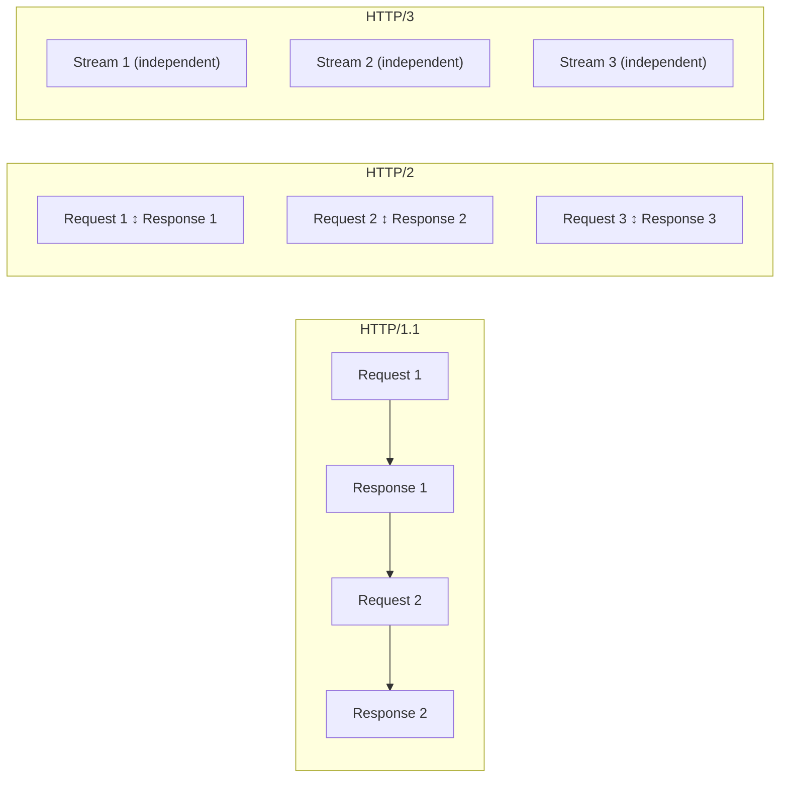

## Putting It All Together

Here is a summary diagram of everything that happens when you type `www.google.com`:

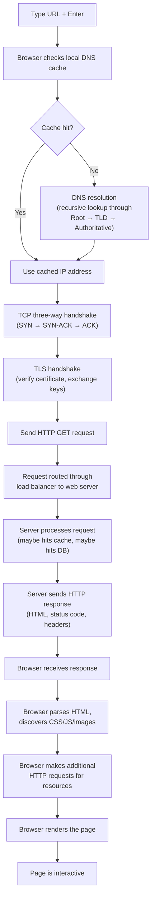

## Key Vocabulary

| Term | Definition |
|---|---|
| **IP Address** | A unique numerical address for every device on the internet |
| **Port** | A number (0-65535) that identifies a specific service on a device |
| **Domain Name** | A human-readable name (like google.com) that maps to an IP address |
| **DNS** | The system that translates domain names to IP addresses |
| **TCP** | A protocol that guarantees reliable, ordered delivery of data |
| **UDP** | A protocol that sends data without guarantees (faster, but unreliable) |
| **TLS** | Encryption protocol that secures data in transit |
| **HTTP** | The protocol browsers and servers use to communicate |
| **HTTPS** | HTTP over TLS (encrypted HTTP) |
| **Router** | A device that forwards packets between networks |
| **Latency** | The time it takes for data to travel from source to destination |
| **Bandwidth** | How much data can be transmitted per second |
| **Round Trip Time (RTT)** | Time for a packet to go from you to the server and back |

## What to Learn Next

Now that you understand how the internet works, you are ready to build on this foundation:

- **[Client-Server Architecture](/system-design/fundamentals/client-server)** — How applications are structured on top of this network
- **[DNS Deep Dive](/system-design/networking/dns-deep-dive)** — The full story of DNS with record types, DNSSEC, and production debugging
- **[TCP/IP Deep Dive](/system-design/networking/tcp-ip-deep-dive)** — Congestion control, flow control, and TCP internals
- **[TLS Handshake](/system-design/networking/tls-handshake)** — Certificate chains, cipher suites, and TLS 1.3 details
- **[HTTP/2 & HTTP/3](/system-design/networking/http2-http3)** — How modern HTTP dramatically improves performance
- **[System Design Characteristics](/system-design/fundamentals/characteristics)** — Latency, availability, reliability, and the numbers that matter
