# How to Read & Draw Architecture Diagrams

Architecture diagrams are the universal language of system design. When a senior engineer explains a system, they draw boxes and arrows on a whiteboard. When you read a blog post about how Netflix works, you see a diagram. When you do a system design interview, you draw a diagram.

But nobody teaches you how to read these diagrams. What does a box mean? What does a dashed arrow versus a solid arrow mean? What do the colors represent? This page teaches you the conventions, gives you tools, and walks through five real example diagrams so you can both read and draw architecture diagrams with confidence.

## The Basic Vocabulary

Every architecture diagram is built from a small set of elements:

### Boxes = Components

A box represents a **component** — a running piece of software, a database, a service, or a logical grouping.

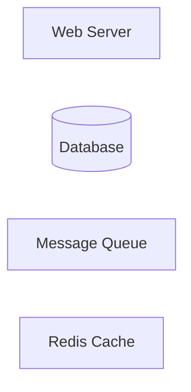

Common box shapes and their meanings:

| Shape | Meaning | Example |
|---|---|---|
| Rectangle | Service, application, or generic component | Web Server, API Service |
| Cylinder | Database or persistent storage | PostgreSQL, MongoDB, S3 |
| Rectangle with wavy bottom | Queue or message broker | Kafka, RabbitMQ, SQS |
| Cloud shape | External service or the internet | AWS, Internet, third-party API |
| Person/stick figure | User or client | Browser, Mobile App |
| Rounded rectangle | Process or function | Load Balancer, CDN |

### Arrows = Communication

An arrow represents **communication** between components — a request, a data flow, or a dependency.

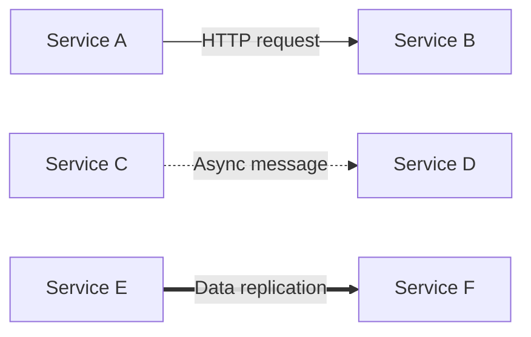

| Arrow Style | Meaning | Example |
|---|---|---|
| Solid arrow (→) | Synchronous request/response | HTTP API call, database query |
| Dashed arrow (- - →) | Asynchronous or optional | Message queue, event, background job |
| Thick arrow (═══→) | High-volume data flow | Replication, bulk data transfer |
| Bidirectional (↔) | Two-way communication | WebSocket, bidirectional replication |
| No arrow (line) | Association or grouping | "These components are related" |

### Labels = What Flows

Labels on arrows tell you **what** is being communicated:

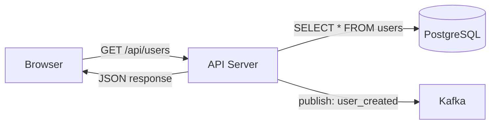

Always label arrows. An unlabeled arrow is ambiguous — does it mean "sends a request to" or "receives data from" or "depends on"?

### Boundaries = Grouping

Dashed rectangles or shaded regions group related components. They might represent:
- A network boundary (VPC, private network)
- A team ownership boundary
- A deployment unit (Kubernetes namespace, AWS account)
- A logical layer (presentation, application, data)

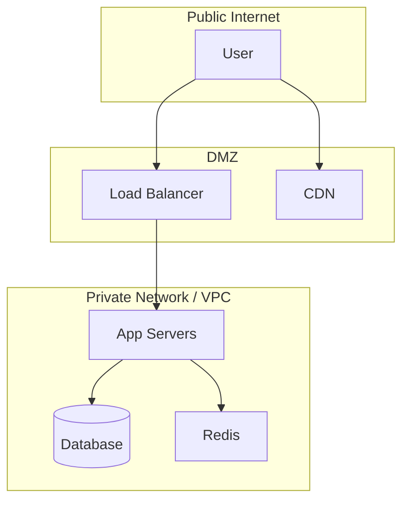

## Color Conventions

Colors are not standardized, but common conventions exist:

| Color | Common Meaning |
|---|---|
| Blue | Compute / application services |
| Green | Data stores (databases, caches) |
| Orange / Yellow | Message queues, event streams |
| Red | External services, warnings, or problems |
| Gray | Infrastructure (load balancers, DNS, network) |
| Purple | Security components (auth, encryption) |

::: tip
When drawing your own diagrams, pick a color scheme and be consistent. Do not use more than 5-6 colors, or the diagram becomes confusing. The most important thing is that similar components have the same color.
:::

## Common Notation Systems

### The C4 Model

The C4 model (created by Simon Brown) is the most popular formal architecture notation. It defines four levels of zoom:

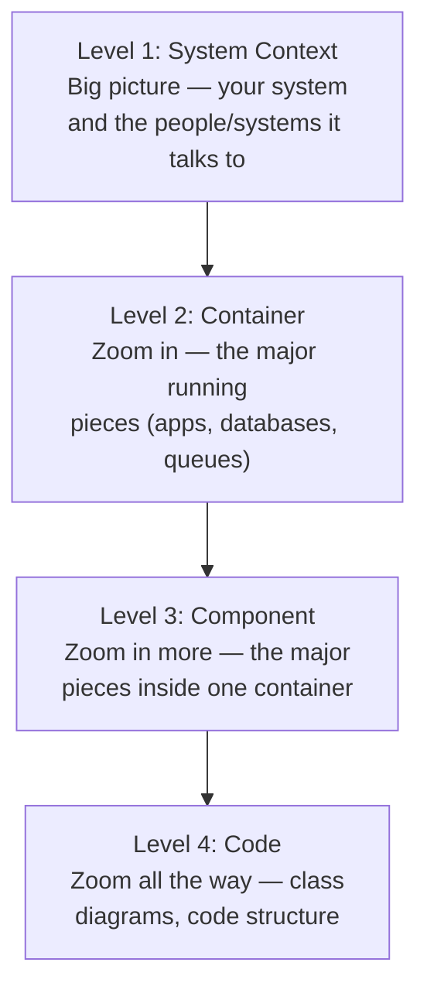

**Level 1 — System Context**: Shows your system as a single box, surrounded by the users and external systems it interacts with. No internal details. This is the diagram you show to executives.

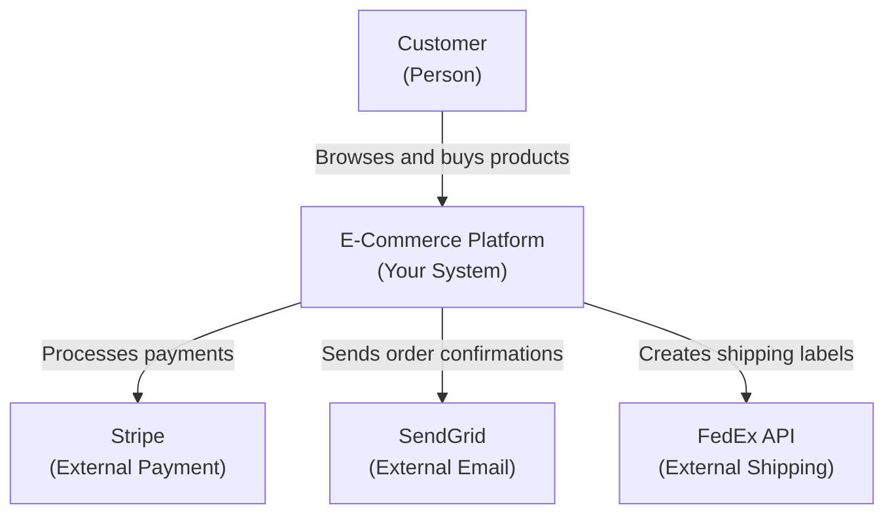

**Level 2 — Container**: Shows the major running pieces inside your system — the web app, the API, the database, the message queue. This is the most common level for architecture discussions.

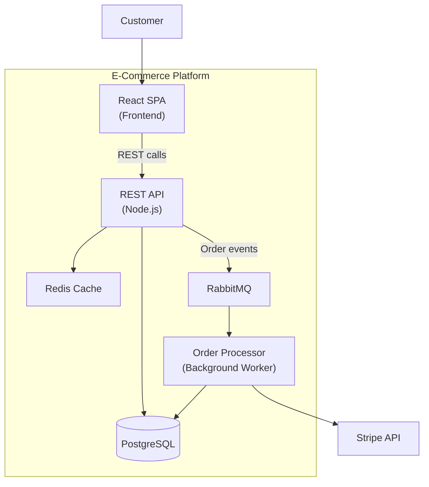

**Level 3 — Component**: Zooms into one container and shows its internal components (controllers, services, repositories). Useful for developers working on that specific container.

**Level 4 — Code**: UML class diagrams or code-level structure. Rarely drawn because code changes too frequently and tools can auto-generate these.

### UML (Unified Modeling Language)

UML is the older formal notation. While less popular for system architecture (C4 has largely replaced it for that), UML sequence diagrams and class diagrams are still widely used:

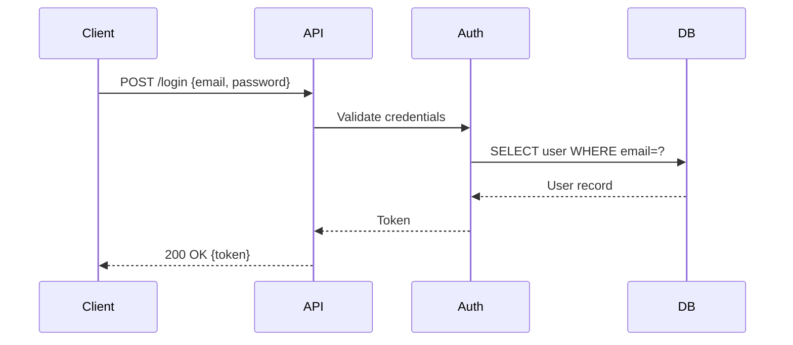

Sequence diagrams are excellent for showing the order of operations in a request flow. Use them when timing and order matter.

## Tools for Drawing Architecture Diagrams

| Tool | Type | Best For | Cost |
|---|---|---|---|
| **Excalidraw** | Browser-based, hand-drawn style | Quick diagrams, collaborative | Free |
| **draw.io (diagrams.net)** | Browser-based or desktop | Detailed, formal diagrams | Free |
| **Mermaid** | Text-to-diagram (in Markdown) | Documentation, version-controlled | Free |
| **Lucidchart** | Browser-based, polished | Enterprise, team collaboration | Paid |
| **Figma/FigJam** | Design tool | Beautiful diagrams, presentations | Free tier |
| **Whimsical** | Browser-based | Flowcharts, wireframes + diagrams | Free tier |

### Excalidraw Tips

Excalidraw produces a hand-drawn look that is excellent for informal diagrams and whiteboard-style communication. Key tips:
- Use the rectangle tool for services, the diamond tool for databases
- Use the arrow tool to connect components
- Group related components with a dashed rectangle (select + Ctrl+G)
- Export as PNG or SVG for documentation
- Use their component library for AWS/GCP icons

### Mermaid Tips (For Documentation)

Mermaid diagrams live inside Markdown files and are rendered automatically by VitePress, GitHub, GitLab, and many other tools. This entire knowledge base uses Mermaid diagrams.

```
graph TD
    A["Client"] --> B["Server"]
    B --> C[("Database")]
```

Mermaid is perfect for documentation because diagrams are version-controlled alongside the text. When the architecture changes, you update the diagram in the same pull request.

## Five Example Diagrams Explained

### Example 1: Simple Web Application

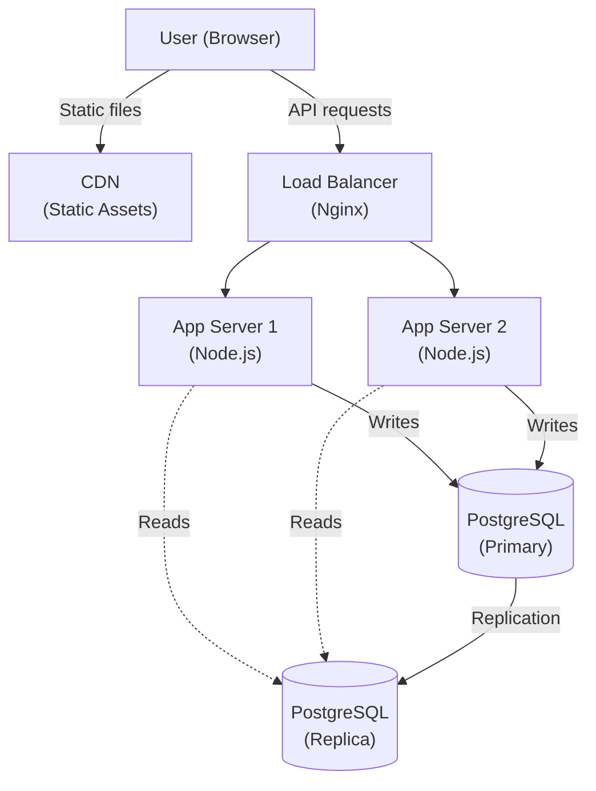

**Reading this diagram**:
- Users access the system two ways: static files from the CDN, API requests through the load balancer
- The load balancer distributes API requests between two app servers
- Writes (solid arrows) go to the primary database
- Reads (dashed arrows) go to the replica (for better performance)
- The primary replicates data to the replica

### Example 2: Microservices with Event Bus

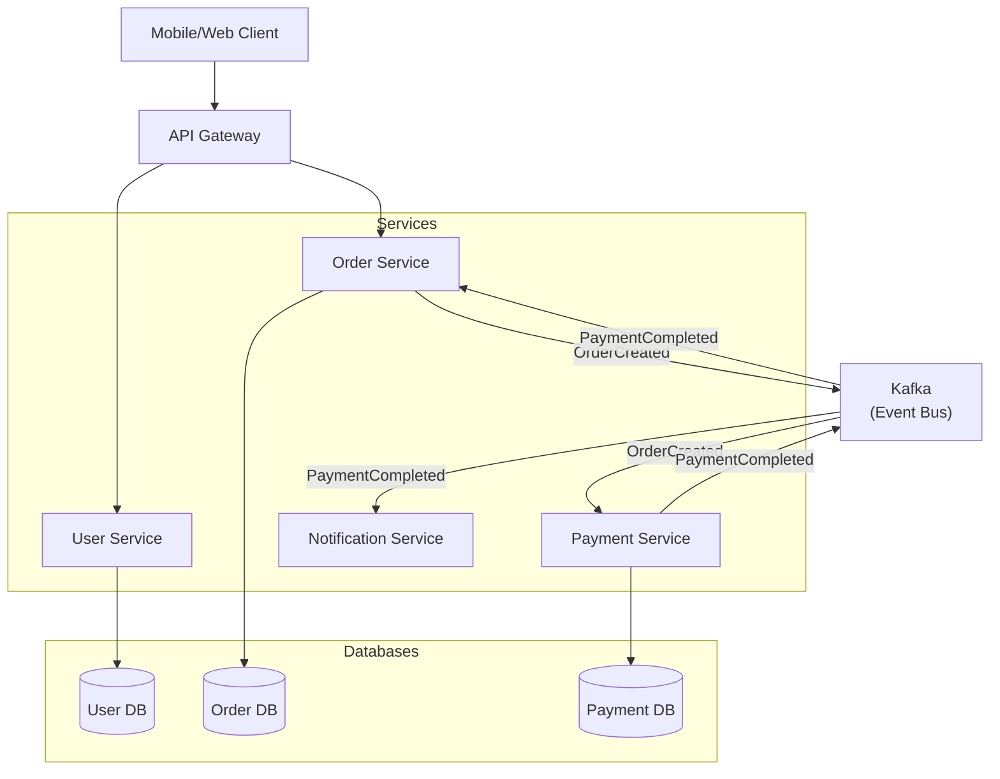

**Reading this diagram**:
- Clients talk to an API Gateway (single entry point)
- Each service has its own database (microservices data ownership)
- Services communicate asynchronously through Kafka events (dashed boxes with labels)
- When an order is created, it publishes an event; the payment service reacts to it
- When payment completes, both the notification service and order service react

This is the **event-driven microservices** pattern. See [Communication Patterns](/architecture-patterns/microservices/communication-patterns) and [Kafka Internals](/system-design/message-queues/kafka-internals).

### Example 3: Multi-Region Deployment

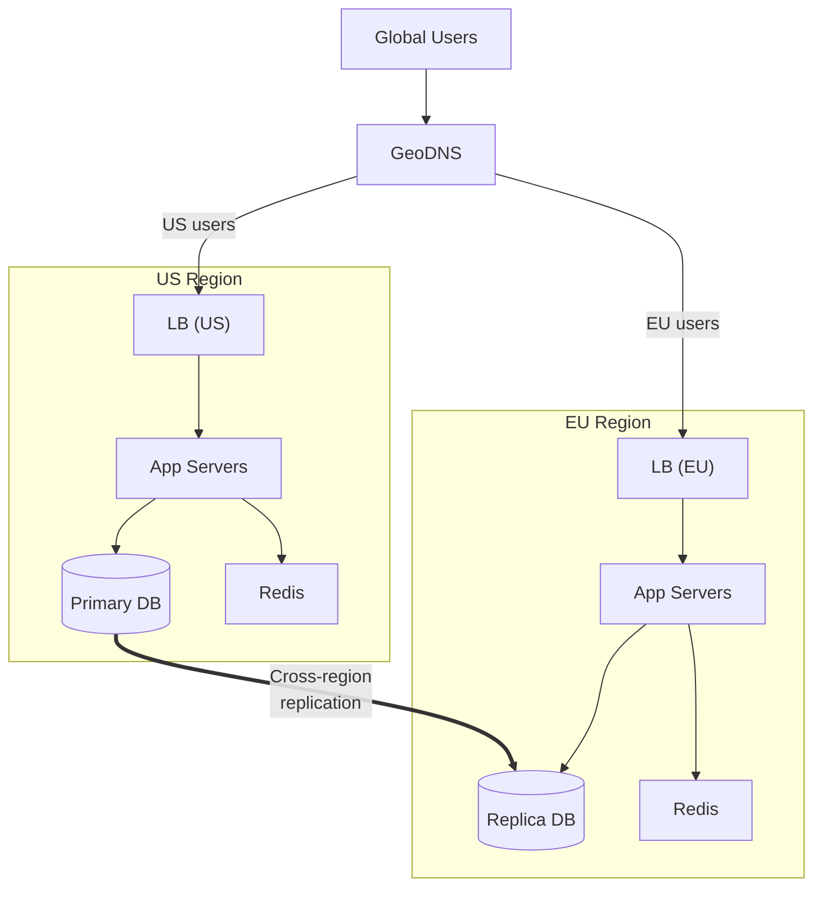

**Reading this diagram**:
- GeoDNS routes users to the nearest region
- Each region has its own load balancer, app servers, and cache
- One region has the primary database, the other has a replica
- The thick arrow (═══→) indicates high-volume cross-region replication
- Writes go to the US (primary), reads can be served locally in EU

### Example 4: Real-Time Chat System

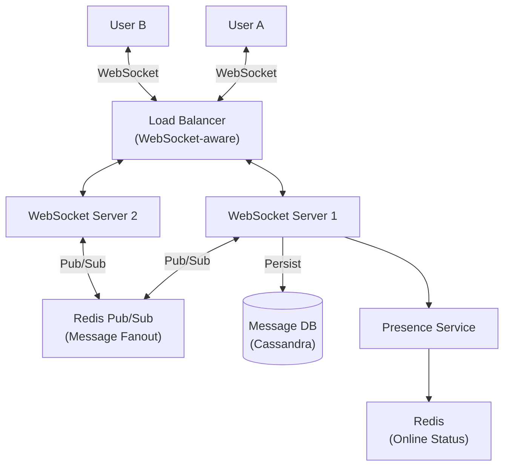

**Reading this diagram**:
- Bidirectional arrows (↔) indicate WebSocket connections (persistent, two-way)
- Redis Pub/Sub fans out messages between WebSocket servers (if User A is on WS1 and User B is on WS2, Redis routes the message)
- Messages are persisted to Cassandra (write-heavy, distributed)
- Presence service tracks who is online using Redis

### Example 5: CI/CD Pipeline

```mermaid
graph LR
    Dev["Developer"]
    Git["GitHub"]
    CI["CI Server<br/>(GitHub Actions)"]
    Test["Run Tests"]
    Build["Build Docker<br/>Image"]
    Registry["Container<br/>Registry (ECR)"]
    Stage["Staging<br/>Environment"]
    Approve["Manual<br/>Approval"]
    Prod["Production<br/>Environment"]
    Monitor["Monitoring<br/>(Datadog)"]

    Dev -->|"git push"| Git
    Git -->|"Webhook"| CI
    CI --> Test
    Test -->|"Pass"| Build
    Build --> Registry
    Registry --> Stage
    Stage -->|"Smoke tests pass"| Approve
    Approve -->|"Approved"| Prod
    Prod --> Monitor
```

**Reading this diagram**:
- Left-to-right flow represents a pipeline (time flows left to right)
- Each box is a stage in the deployment process
- The "Manual Approval" box indicates a human gate (not everything is automated)
- Monitoring closes the loop — you watch production after deployment

## Common Patterns You Will See Everywhere

### Pattern 1: Client → LB → Servers → DB

The most basic web architecture:

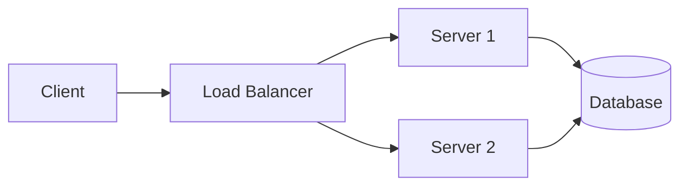

### Pattern 2: Client → CDN + LB → Microservices → Queues → DB

The modern microservices architecture:

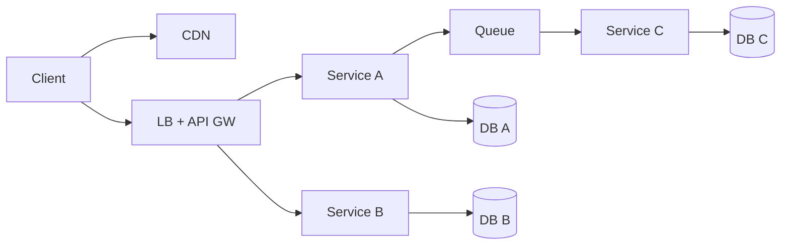

### Pattern 3: Write Path / Read Path Split

Many systems have different paths for reads and writes. This is called CQRS (Command Query Responsibility Segregation):

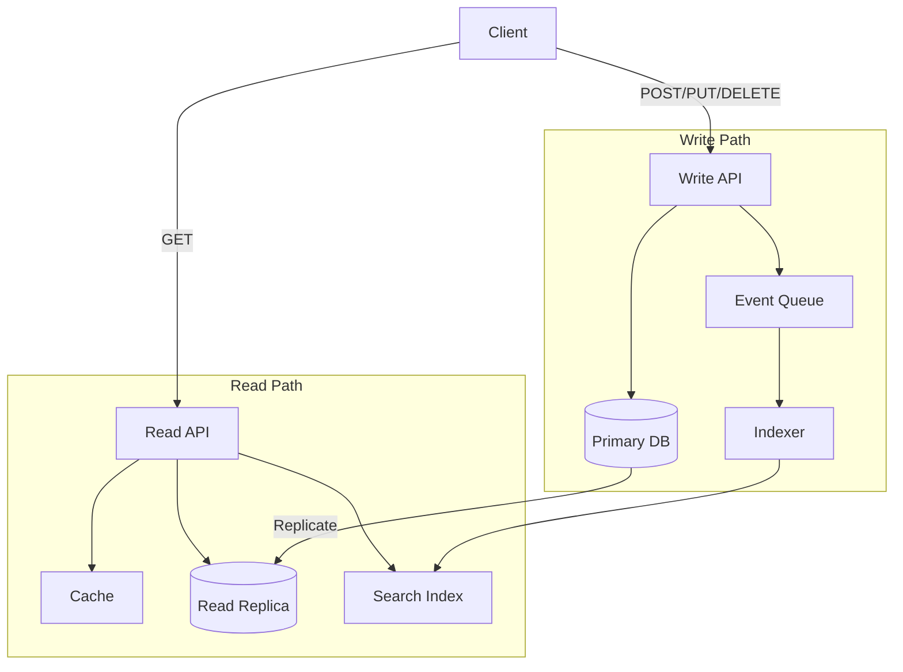

## Tips for Drawing Good Diagrams

1. **Start with the user** — Put the user/client at the top or left. Information flows down or right.

2. **Group related components** — Use boundaries/subgraphs to show what belongs together.

3. **Label every arrow** — An unlabeled arrow is ambiguous. Write the protocol (HTTP, gRPC), the data (JSON, events), or the operation (read, write).

4. **Use consistent shapes** — Rectangles for services, cylinders for databases, rounded rectangles for infrastructure. Do not mix conventions.

5. **Show the happy path first** — Draw the normal flow before adding error handling, fallbacks, and edge cases.

6. **Keep it at one level of abstraction** — Do not mix high-level boxes ("Backend") with low-level boxes ("Redis connection pool"). Pick a zoom level and stick to it.

7. **Fewer boxes is better** — If your diagram has more than 15-20 boxes, it is too complex. Split it into multiple diagrams at different zoom levels.

8. **Include a legend** — If you use colors, line styles, or shapes with specific meaning, add a legend so readers do not have to guess.

## When to Use Which Diagram Type

| Diagram Type | Best For | Example |
|---|---|---|
| **Box-and-arrow** (system diagram) | Showing overall architecture and data flow | "Here is how our system works" |
| **Sequence diagram** | Showing the order of operations in a flow | "Here is what happens when a user logs in" |
| **Flowchart** | Showing decision logic | "Here is how we route requests" |
| **Deployment diagram** | Showing where code runs (which servers, regions) | "Here is our infrastructure" |
| **Entity-relationship diagram** | Showing database schema | "Here is our data model" |

## Summary

| Element | Meaning |
|---|---|
| Rectangle | Service or application |
| Cylinder | Database or storage |
| Solid arrow | Synchronous communication |
| Dashed arrow | Asynchronous communication |
| Thick arrow | High-volume data flow |
| Bidirectional arrow | Two-way communication |
| Boundary / subgraph | Grouping of related components |
| Label on arrow | What data or protocol is used |

## What to Learn Next

- **[Building Blocks Overview](/system-design/fundamentals/building-blocks)** — Know what the boxes in diagrams represent
- **[Client-Server Architecture](/system-design/fundamentals/client-server)** — The foundational architecture pattern
- **[Zero to Million Users](/system-design/fundamentals/zero-to-million-users)** — See how diagrams evolve as systems grow
- **[System Design Glossary](/system-design/fundamentals/system-design-glossary)** — Understand every term you see in diagrams
- **[Microservices](/architecture-patterns/microservices/)** — Complex architectures with many communicating services
