# Proxies

A **proxy** is a server that sits between a client and another server, forwarding requests on behalf of one of them. Proxies are everywhere in system design — every load balancer, CDN, API gateway, and VPN is a proxy. Understanding proxies is essential because they are the invisible glue that holds modern architectures together.

If you have ever heard someone say "we put Nginx in front of the app" or "the CDN handles TLS termination," they are talking about proxies.

## What Is a Proxy?

At its simplest, a proxy is a middleman:

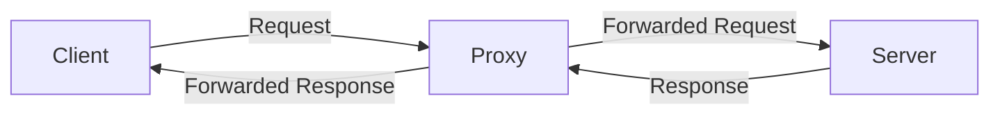

The client sends a request to the proxy. The proxy forwards it to the actual server. The server responds to the proxy. The proxy forwards the response to the client. The client may or may not know the proxy exists.

There are two fundamentally different kinds of proxies: **forward** and **reverse**.

## Forward Proxy (Client-Side Proxy)

A forward proxy sits in front of the **client** and forwards requests on the client's behalf. The server sees the proxy's IP address, not the client's.

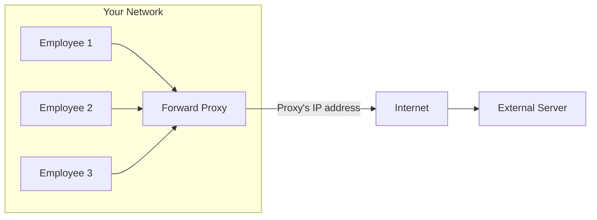

### Use Cases for Forward Proxies

| Use Case | How | Example |
|---|---|---|
| Bypass geo-restrictions | Route through a proxy in another country | VPN services |
| Content filtering | Block requests to certain domains | Corporate networks blocking social media |
| Caching | Cache responses for repeated requests | ISP caching popular content |
| Anonymity | Hide the client's real IP | Tor network |
| Access control | Require authentication before internet access | University Wi-Fi login pages |

### Real Examples

- **Corporate proxies** — Your company routes all internet traffic through a proxy that logs URLs and blocks certain sites
- **VPN** — A VPN is essentially a forward proxy that encrypts traffic between you and the proxy server
- **Tor** — Routes traffic through multiple proxy layers for anonymity

## Reverse Proxy (Server-Side Proxy)

A reverse proxy sits in front of the **server** and handles incoming requests on the server's behalf. The client does not know (or care) that a proxy exists — it thinks it is talking directly to the server.

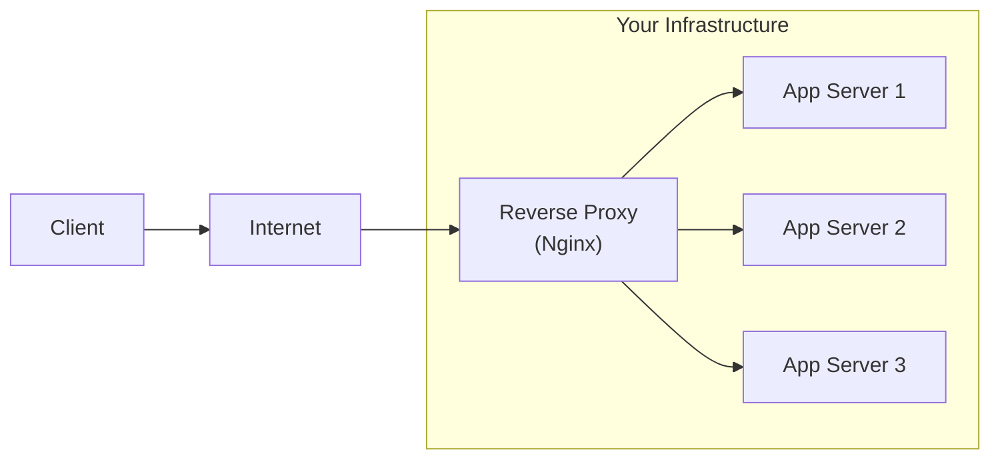

### Use Cases for Reverse Proxies

| Use Case | How | Example |
|---|---|---|
| Load balancing | Distribute requests across servers | Nginx, HAProxy, AWS ALB |
| SSL/TLS termination | Handle encryption at the proxy | Nginx terminates HTTPS |
| Caching | Cache responses to reduce backend load | Nginx caching, Varnish |
| Compression | Compress responses before sending to client | gzip/Brotli at the proxy |
| Security | Hide backend servers, block attacks | WAF (Web Application Firewall) |
| Rate limiting | Limit requests per client | API gateway |
| Routing | Route to different backends by URL path | `/api/*` → API server, `/*` → frontend |

This is the type of proxy you will encounter most often in system design.

## Forward vs Reverse: The Key Difference

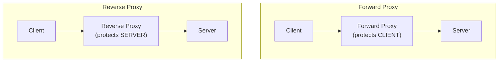

| | Forward Proxy | Reverse Proxy |
|---|---|---|
| **Who uses it?** | The client | The server |
| **Who knows about it?** | The client knows, server does not | The server knows, client does not |
| **Protects** | The client's identity | The server's identity and infrastructure |
| **Example** | VPN, corporate proxy | Nginx, CloudFront, API Gateway |
| **Configured by** | Client or client's network admin | Server or infrastructure team |

## Nginx as a Reverse Proxy

Nginx is the most popular reverse proxy in the world. Here is a real, production-ready configuration:

### Basic Reverse Proxy

```nginx
# /etc/nginx/nginx.conf

http {
    # Define the group of backend servers
    upstream app_servers {
        server 10.0.1.10:3000;  # App server 1
        server 10.0.1.11:3000;  # App server 2
        server 10.0.1.12:3000;  # App server 3
    }

    server {
        listen 80;
        server_name myapp.com;

        # All requests are forwarded to the app servers
        location / {
            proxy_pass http://app_servers;
            proxy_set_header Host $host;
            proxy_set_header X-Real-IP $remote_addr;
            proxy_set_header X-Forwarded-For $proxy_add_x_forwarded_for;
            proxy_set_header X-Forwarded-Proto $scheme;
        }
    }
}
```

What each line does:

| Line | Purpose |
|---|---|
| `upstream app_servers` | Defines a group of backend servers for load balancing |
| `listen 80` | Nginx listens on port 80 (HTTP) |
| `server_name myapp.com` | Only handles requests for this domain |
| `proxy_pass` | Forwards the request to one of the upstream servers |
| `X-Real-IP` | Tells the backend the real client IP (not Nginx's IP) |
| `X-Forwarded-For` | Chain of proxy IPs the request has passed through |
| `X-Forwarded-Proto` | Whether the original request was HTTP or HTTPS |

### Nginx with TLS Termination + Caching

```nginx
http {
    # Cache zone: 10 MB of keys, up to 1 GB of cached responses
    proxy_cache_path /var/cache/nginx levels=1:2
                     keys_zone=my_cache:10m max_size=1g
                     inactive=60m use_temp_path=off;

    upstream app_servers {
        server 10.0.1.10:3000;
        server 10.0.1.11:3000;
    }

    # Redirect HTTP to HTTPS
    server {
        listen 80;
        server_name myapp.com;
        return 301 https://$server_name$request_uri;
    }

    # HTTPS server
    server {
        listen 443 ssl http2;
        server_name myapp.com;

        # TLS certificates
        ssl_certificate     /etc/ssl/certs/myapp.com.crt;
        ssl_certificate_key /etc/ssl/private/myapp.com.key;
        ssl_protocols       TLSv1.2 TLSv1.3;

        # Cached static assets
        location /static/ {
            proxy_pass http://app_servers;
            proxy_cache my_cache;
            proxy_cache_valid 200 1h;
            add_header X-Cache-Status $upstream_cache_status;
        }

        # Dynamic API requests (not cached)
        location /api/ {
            proxy_pass http://app_servers;
            proxy_set_header Host $host;
            proxy_set_header X-Real-IP $remote_addr;
        }
    }
}
```

For more Nginx configuration patterns, see [Nginx Config](/system-design/load-balancing/nginx-config).

## API Gateway as a Proxy

An API gateway is a specialized reverse proxy for microservices. It does everything a reverse proxy does, plus:

- **Authentication** — Verify JWT tokens or API keys before forwarding
- **Rate limiting** — Block clients that send too many requests
- **Request transformation** — Modify headers, body, or path before forwarding
- **Response aggregation** — Combine responses from multiple backend services
- **Circuit breaking** — Stop forwarding to a service that is failing

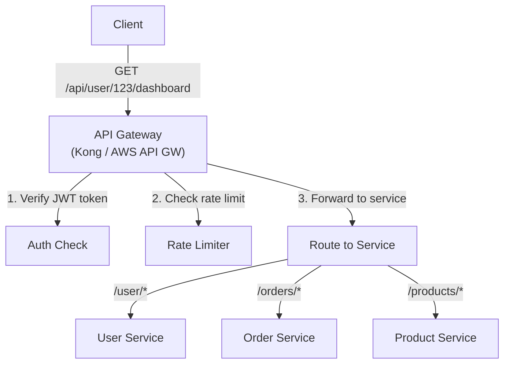

For more details, see [API Gateway Pattern](/architecture-patterns/microservices/api-gateway-pattern) and [API Security Patterns](/system-design/api-design/api-security-patterns).

## CDN as a Proxy

A CDN is a globally distributed reverse proxy that caches content at the edge. When a user requests an image, the CDN edge server closest to them either serves the cached version (cache hit) or fetches it from the origin server (cache miss), caches it, and serves it.

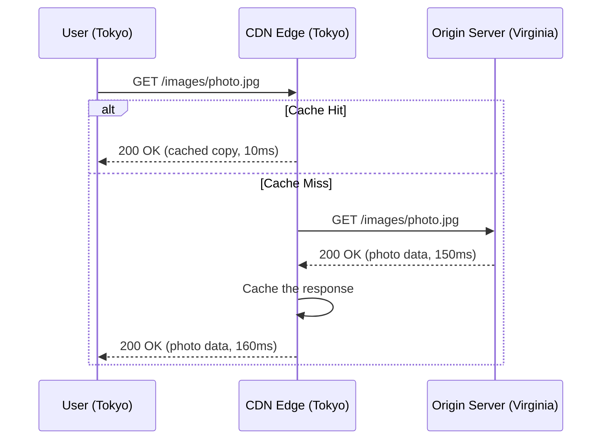

The CDN proxy is transparent to the client — the user's browser does not know it is talking to a CDN edge server rather than the origin. This is because the DNS resolves the domain to the nearest CDN edge's IP address.

See [CDN Deep Dive](/system-design/caching/cdn-deep-dive) for the full story.

## TLS Termination at the Proxy

**TLS termination** means the proxy handles the encryption/decryption of HTTPS traffic, and communication between the proxy and the backend servers happens over plain HTTP. This is one of the most common patterns in production.

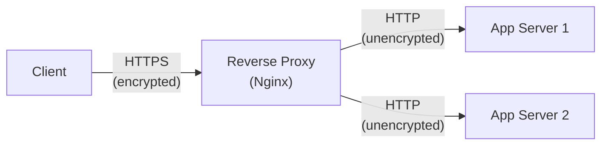

### Why Terminate TLS at the Proxy?

1. **Performance** — TLS encryption/decryption is CPU-intensive. Doing it once at the proxy instead of on every backend server saves significant CPU.
2. **Certificate management** — You manage certificates in one place (the proxy) instead of on every server.
3. **Simpler backend code** — Backend servers do not need to handle TLS at all.
4. **Centralized security** — All TLS configuration (cipher suites, protocol versions) is in one place.

::: warning Security Note
The traffic between the proxy and backend servers is unencrypted. This is acceptable when they are on the same private network (within a VPC). If traffic crosses untrusted networks, use **TLS passthrough** or **mutual TLS (mTLS)** between the proxy and backends.
:::

For more on TLS, see [TLS Handshake](/system-design/networking/tls-handshake).

## Proxy Chaining

In real-world architectures, requests often pass through multiple proxies in sequence. This is called **proxy chaining**.

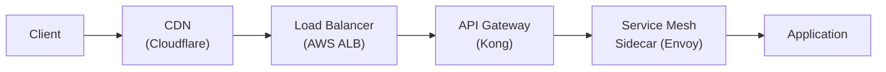

In this chain, the request passes through four proxies before reaching the application:
1. **CDN** — Caches static content, blocks DDoS
2. **Load Balancer** — Distributes traffic across servers
3. **API Gateway** — Handles auth, rate limiting, routing
4. **Service Mesh Sidecar** — Handles service-to-service encryption and observability

Each proxy adds a small amount of latency (typically 0.5-2ms each), but the benefits usually far outweigh the cost.

### Tracking Requests Through Proxy Chains

When a request passes through multiple proxies, the `X-Forwarded-For` header accumulates each proxy's IP:

```
X-Forwarded-For: 203.0.113.50, 198.51.100.10, 10.0.0.1

                 ↑ client IP     ↑ CDN IP         ↑ LB IP
```

This is how the application knows the real client IP despite multiple proxies in the chain.

## L4 vs L7 Proxying

Proxies can operate at different layers of the network stack. The two most common are Layer 4 (transport) and Layer 7 (application).

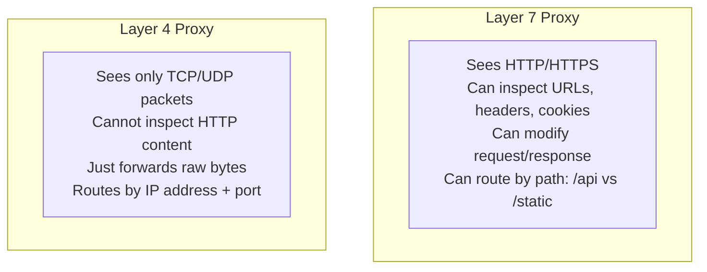

| Feature | L4 Proxy | L7 Proxy |
|---|---|---|
| **Operates on** | TCP/UDP packets | HTTP requests |
| **Can see** | Source/dest IP, port | URLs, headers, cookies, body |
| **Routing decisions** | IP + port only | URL path, header values, cookies |
| **Speed** | Faster (less processing) | Slower (must parse HTTP) |
| **TLS** | Can pass through (no termination) | Can terminate TLS |
| **Example** | AWS NLB, iptables | Nginx, HAProxy, AWS ALB, Envoy |
| **Use case** | Raw TCP pass-through, gaming, IoT | Web apps, APIs, microservices |

### When to Use L4 vs L7

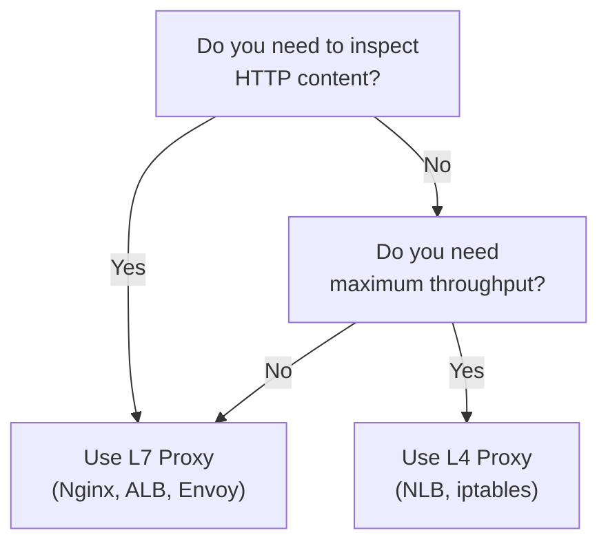

**L4 is best for**: TCP passthrough, non-HTTP protocols (databases, game servers, custom TCP protocols), maximum performance

**L7 is best for**: HTTP/HTTPS traffic, path-based routing, header-based routing, TLS termination, web application firewalls

For a deep dive, see [L4 vs L7 Load Balancing](/system-design/load-balancing/l4-vs-l7).

## Common Proxy Patterns in Production

### Pattern 1: Static + Dynamic Splitting

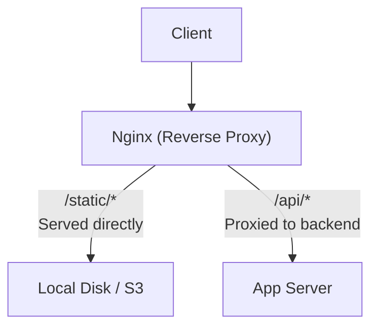

Nginx serves static files directly from disk (fast, no backend involved) and proxies API requests to the application server. This reduces backend load dramatically.

### Pattern 2: Blue-Green Deployment

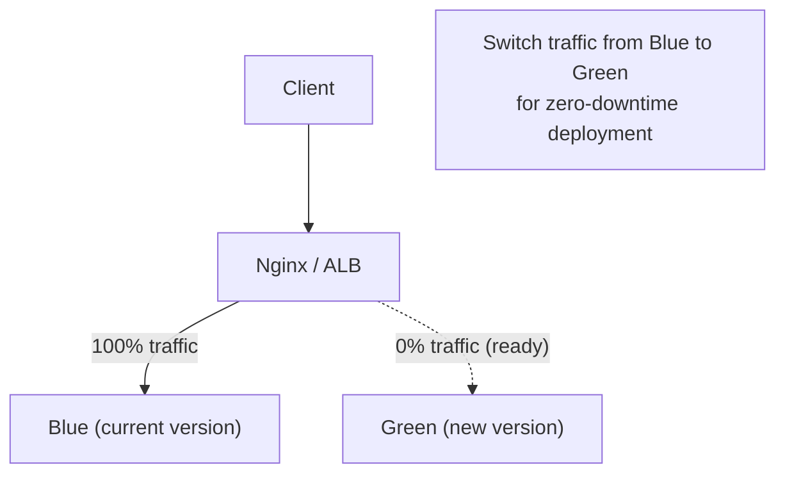

The proxy switches traffic between two identical environments. Deploy the new version to Green, test it, then switch the proxy to route all traffic to Green. If something goes wrong, switch back to Blue instantly.

### Pattern 3: Canary Deployment

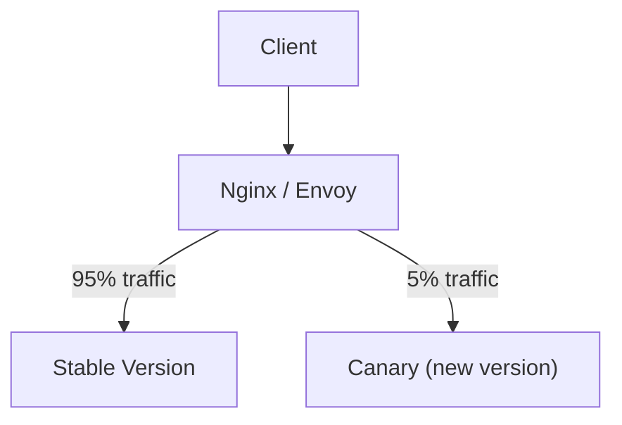

Route a small percentage of traffic to the new version. Monitor error rates and latency. If the canary looks good, gradually increase its traffic share. This is safer than blue-green because you only risk 5% of users.

## Summary

| Proxy Type | Protects | Example |
|---|---|---|
| Forward Proxy | Client identity | VPN, corporate proxy |
| Reverse Proxy | Server infrastructure | Nginx, Cloudflare |
| CDN | Origin from traffic | CloudFront, Fastly |
| API Gateway | Backend services | Kong, AWS API GW |
| Service Mesh Sidecar | Service-to-service | Envoy, Linkerd |
| L4 Proxy | TCP-level forwarding | AWS NLB, iptables |
| L7 Proxy | HTTP-level routing | Nginx, ALB, Envoy |

## What to Learn Next

- **[Load Balancing Algorithms](/system-design/load-balancing/algorithms)** — How proxies decide which server to forward to
- **[Nginx Config](/system-design/load-balancing/nginx-config)** — Production Nginx configuration patterns
- **[TLS Handshake](/system-design/networking/tls-handshake)** — How TLS termination works under the hood
- **[CDN Deep Dive](/system-design/caching/cdn-deep-dive)** — CDN as a globally distributed proxy
- **[API Gateway Pattern](/architecture-patterns/microservices/api-gateway-pattern)** — API gateway as an intelligent proxy
- **[L4 vs L7](/system-design/load-balancing/l4-vs-l7)** — Deep dive into proxy layers
