# Redundancy & Replication Intro

Here is a harsh truth about computers: **everything fails**. Hard drives die. Servers crash. Network cables get cut. Entire data centers go offline. The question is not "will it fail?" but "when it fails, does your system keep working?"

**Redundancy** means having extra copies of critical components so that when one fails, another takes over. **Replication** is the mechanism by which data is copied across multiple machines to achieve redundancy. Together, they are the foundation of system availability.

This page teaches you the core concepts. We will cover the common redundancy patterns, how failover works, and the tricky problems that arise. Each topic links to a deep-dive page for production-level details.

## Why Redundancy Is Not the Same as Backup

Many beginners confuse these. They are fundamentally different:

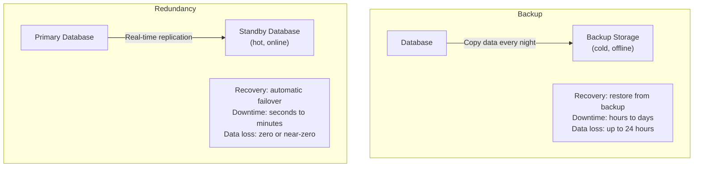

| | Backup | Redundancy |
|---|---|---|
| **Purpose** | Disaster recovery, historical snapshots | High availability, continuous operation |
| **Data freshness** | Hours to days old | Seconds or real-time |
| **Recovery time** | Hours to days | Seconds to minutes |
| **When to use** | Protection against catastrophic failure, compliance | Protection against individual component failure |
| **Cost** | Lower (cold storage is cheap) | Higher (running extra servers) |

You need both. Redundancy handles everyday failures (a server crashes, a disk dies). Backups handle catastrophic scenarios (someone accidentally deletes the database, ransomware attack, corruption).

## The Redundancy Patterns

There are three main patterns for redundancy. Each makes a different trade-off between cost, complexity, and failover speed.

### Active-Passive (Primary-Standby)

The most common pattern. One server (the **active** or **primary**) handles all traffic. Another server (the **passive** or **standby**) sits idle, receiving replicated data, ready to take over if the primary fails.

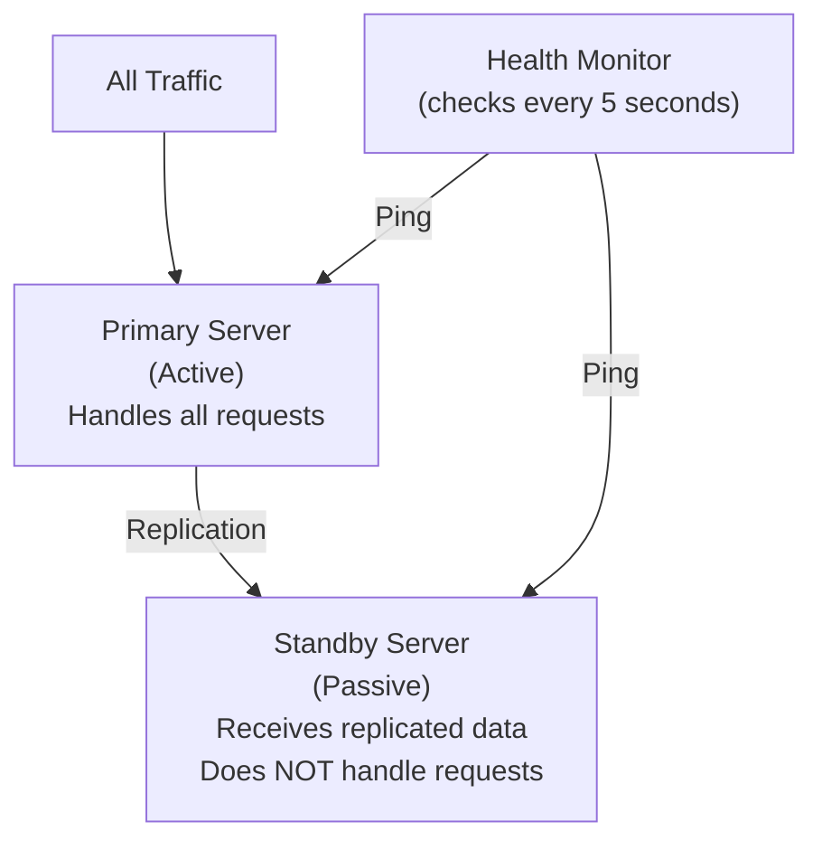

**How failover works**:
1. The health monitor detects the primary is down (missed 3 consecutive health checks)
2. The monitor promotes the standby to primary
3. DNS or the load balancer is updated to point to the new primary
4. The old primary is investigated and repaired

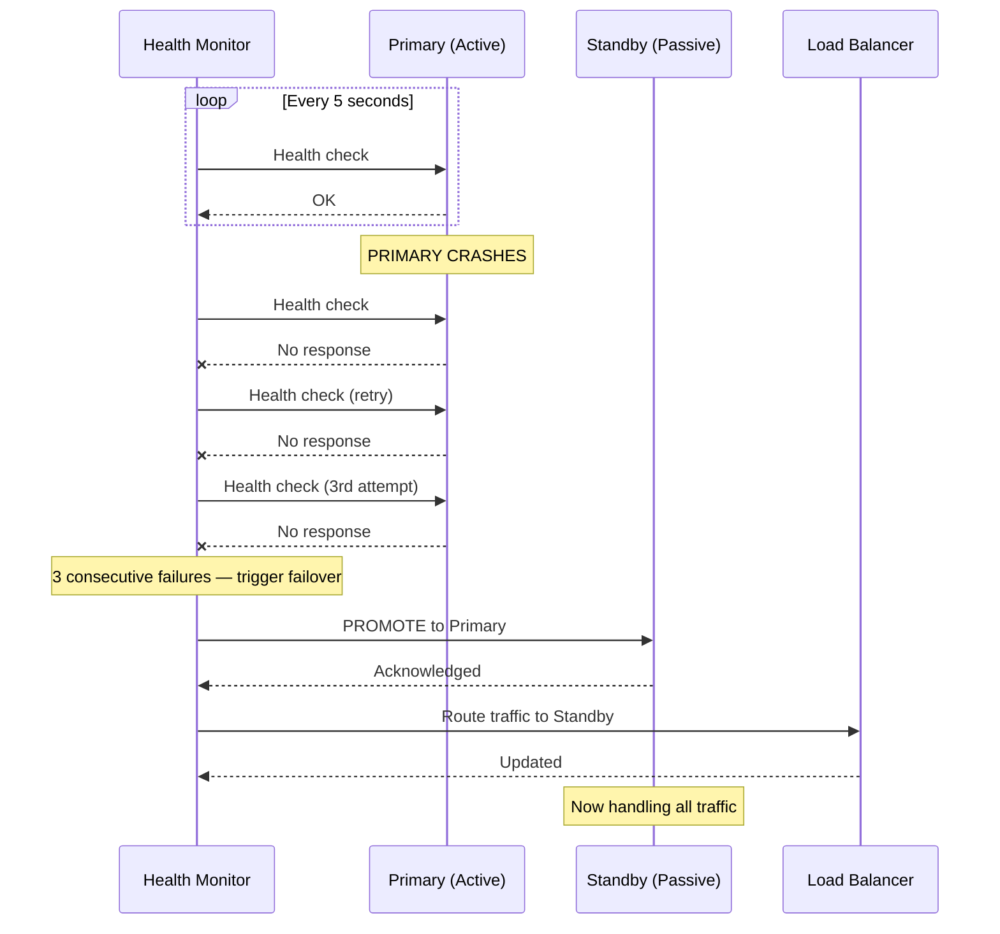

**Failover time**: 15-60 seconds typically (depends on health check interval and detection threshold)

**Data loss risk**: Depends on replication mode:
- **Synchronous replication**: Zero data loss (standby always has latest data)
- **Asynchronous replication**: May lose seconds of data (standby may be slightly behind)

**Real-world examples**:
- AWS RDS Multi-AZ (PostgreSQL/MySQL) — automatic failover in 60-120 seconds
- Redis Sentinel — promotes a replica to primary on failure
- PostgreSQL streaming replication with Patroni

**Advantages**: Simple to understand and operate. Standby uses minimal resources.

**Disadvantages**: Standby server is wasted capacity (it does nothing during normal operation). Failover is not instant — there is a detection and promotion window.

### Active-Active (Multi-Primary)

Both servers handle traffic simultaneously. If one fails, the other continues serving without any failover delay.

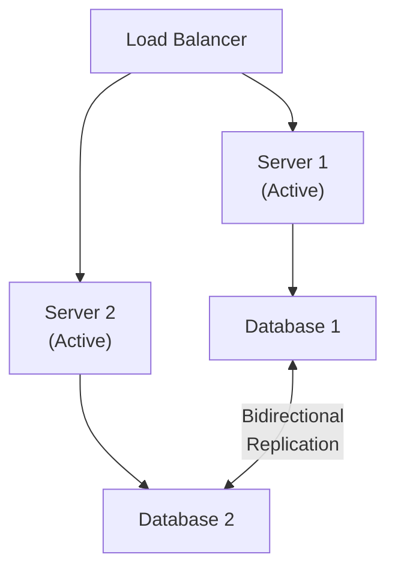

**How it works**:
- Both servers receive and process requests
- Both databases accept writes and replicate to each other
- If one server or database fails, the other handles all traffic automatically

**Advantages**:
- No wasted resources (both servers do useful work)
- No failover delay (the surviving server was already handling traffic)
- Better resource utilization

**Disadvantages**:
- **Conflict resolution is hard** — What if both databases write to the same row at the same time? Who wins?
- **More complex** — Bidirectional replication is harder to set up and debug
- **Consistency challenges** — Data may be temporarily inconsistent between the two

**Real-world examples**:
- CockroachDB, YugabyteDB (multi-active by design)
- MySQL Group Replication
- DynamoDB Global Tables
- Cassandra (all nodes accept writes)

Active-active is common for **stateless application servers** (which is easy — just put two servers behind a load balancer). It is much harder for **databases** because of write conflicts. See [Consistency Models](/system-design/distributed-systems/consistency-models) for how this is managed.

### Hot, Warm, and Cold Standby

The standby server can be in different states of readiness:

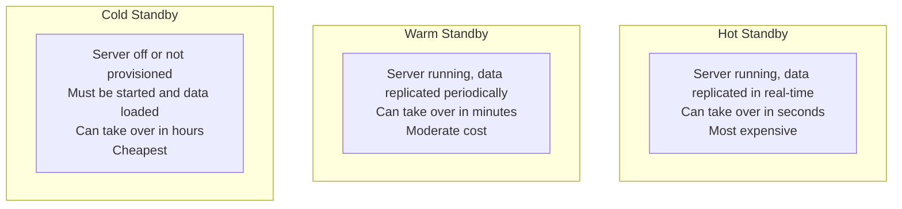

| Type | State | Data Freshness | Failover Time | Cost |
|---|---|---|---|---|
| Hot | Running, real-time sync | Seconds behind | 15-60 seconds | High (runs 24/7) |
| Warm | Running, periodic sync | Minutes to hours behind | 5-30 minutes | Medium |
| Cold | Off or not provisioned | Last backup (hours/days) | 1-24 hours | Low |

**Which to choose**:
- **Hot**: Mission-critical systems (payments, primary database)
- **Warm**: Important but can tolerate brief downtime (internal tools, staging)
- **Cold**: Non-critical or cost-sensitive (dev environments, disaster recovery backup)

## Failover Mechanics

### How Failure Is Detected

The most common detection method is **health checks** — a monitor periodically sends a request to each server and checks for a response.

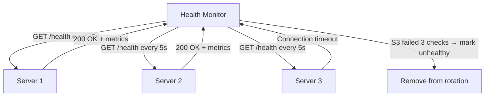

Key parameters:
- **Check interval**: How often to check (typically 5-30 seconds)
- **Timeout**: How long to wait for a response (typically 2-5 seconds)
- **Unhealthy threshold**: How many consecutive failures before marking as down (typically 2-3)
- **Healthy threshold**: How many consecutive successes before marking as healthy again (typically 2-3)

For detailed health check patterns, see [Health Checks](/system-design/load-balancing/health-checks).

### DNS Failover vs Load Balancer Failover

There are two common ways to redirect traffic during failover:

**DNS Failover**: Update the DNS record to point to the standby. Simple but slow — DNS records are cached, so some clients will keep going to the dead server until their cache expires (TTL). Typical TTL is 60-300 seconds.

**Load Balancer Failover**: The load balancer detects the dead server and stops sending it traffic. Fast (seconds) because the load balancer makes the decision for each request. This is the preferred approach for most architectures. See [Load Balancing](/system-design/load-balancing).

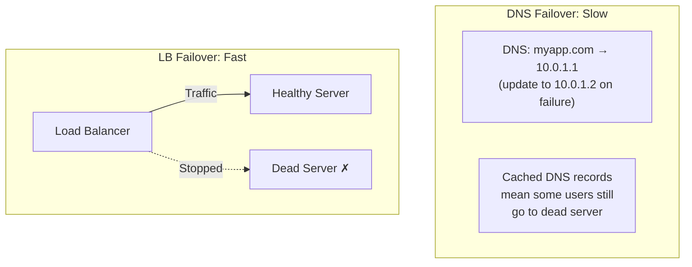

### Automatic vs Manual Failover

| | Automatic Failover | Manual Failover |
|---|---|---|
| **Speed** | Seconds to minutes | Minutes to hours (depends on humans) |
| **Risk** | May trigger on false positives (flapping) | No false positives (human judgment) |
| **Best for** | Cloud-managed services (RDS, etc.) | Critical databases where wrong failover is catastrophic |
| **Example** | AWS RDS Multi-AZ | Large bank's primary database |

Most organizations use automatic failover for application servers and load balancers, and semi-automatic (auto-detect, human-approve) for critical databases.

## Replication — How Data Stays in Sync

Redundancy requires replication — keeping data identical across multiple machines. There are two fundamental approaches:

### Synchronous Replication

The primary waits for the standby to confirm it has received and stored the data before telling the client "write successful."

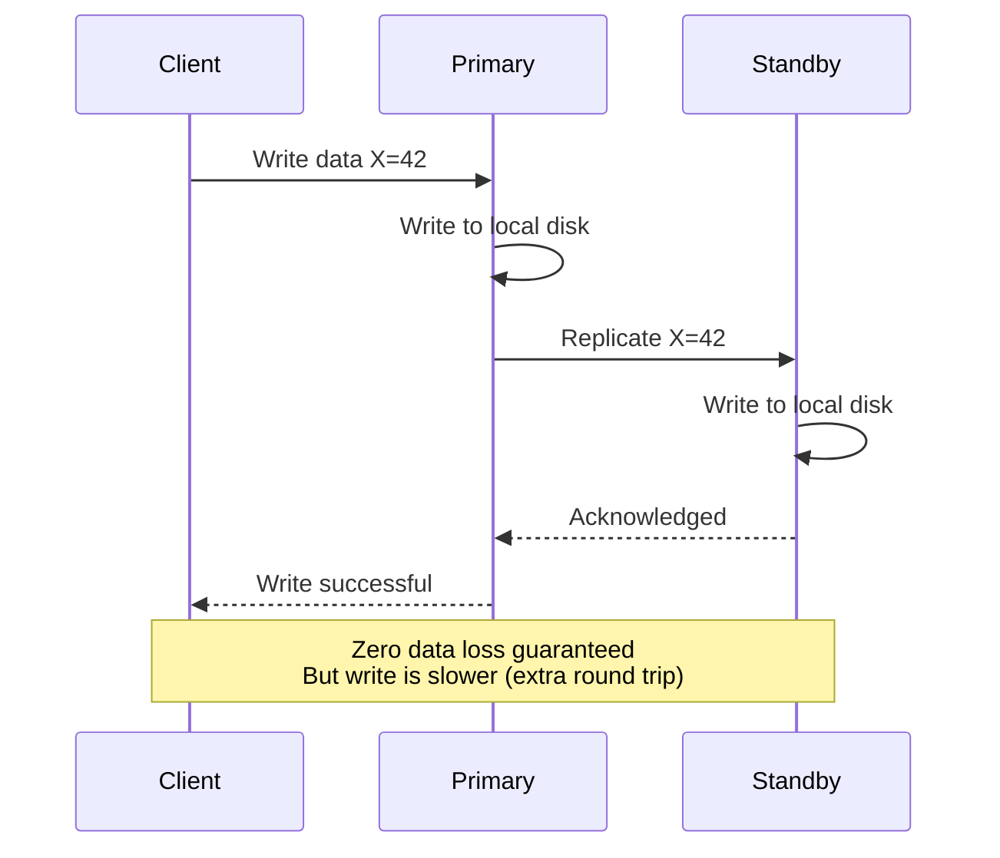

**Advantage**: Zero data loss — if the primary crashes after confirming, the standby has the data.

**Disadvantage**: Slower writes — every write must wait for the standby to confirm. If the standby is slow or the network is congested, all writes slow down.

### Asynchronous Replication

The primary confirms the write immediately and replicates to the standby in the background.

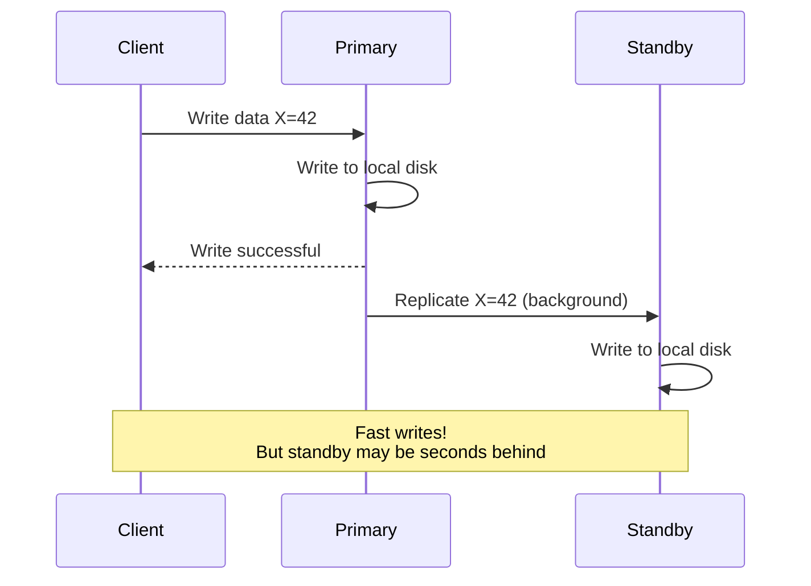

**Advantage**: Fast writes — the client does not wait for replication.

**Disadvantage**: Data loss possible — if the primary crashes before the standby catches up, recent writes are lost.

### Replication Lag

In asynchronous replication, the standby is always slightly behind the primary. This gap is called **replication lag**.

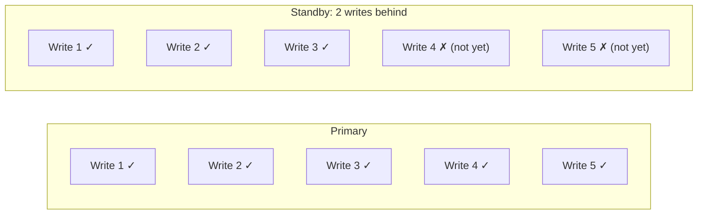

**What replication lag means in practice**:
- A user writes a comment, then immediately reads the page — they do not see their own comment (because the read goes to a replica that has not received the write yet)
- A user updates their profile, refreshes, and sees the old profile
- An order is placed but the order history page shows no new order

**Typical replication lag**:
- Same data center: 0.5-5ms
- Cross-region (US East to US West): 30-80ms
- Cross-continent (US to Europe): 80-120ms
- Under heavy load: can spike to seconds or even minutes

For detailed coverage of replication mechanics, see [Replication](/system-design/databases/replication).

## The Split-Brain Problem

Split-brain is the most dangerous failure mode in replicated systems. It happens when both the primary and standby think they are the primary and both accept writes independently.

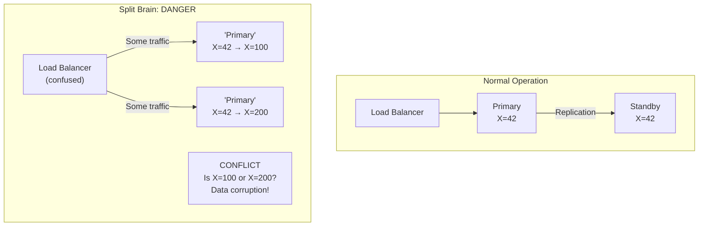

### How Split-Brain Happens

1. Network partition separates the primary and standby
2. The standby cannot reach the primary, so it concludes the primary is dead
3. The standby promotes itself to primary
4. But the original primary is still alive — it just cannot reach the standby
5. Now both accept writes, and the data diverges

### How to Prevent Split-Brain

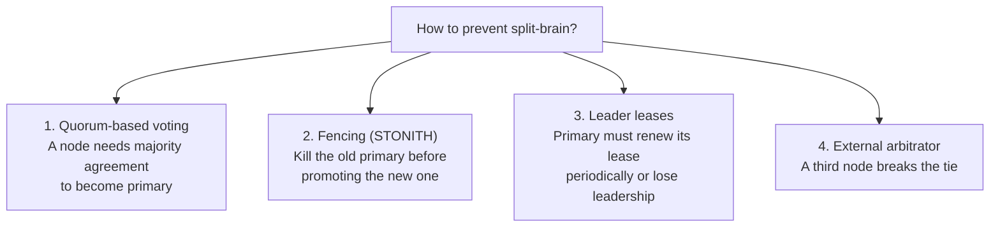

1. **Quorum voting**: Requires a majority of nodes (e.g., 3 out of 5) to agree before any node can become primary. With a network partition, only one side can have a majority.

2. **Fencing (STONITH = Shoot The Other Node In The Head)**: Before promoting the standby, forcibly power off the old primary. Brutal but effective.

3. **Leader leases**: The primary holds a time-limited "lease." If it cannot renew the lease (because it is partitioned), it steps down. See [Distributed Locking](/system-design/distributed-systems/distributed-locking).

4. **External arbitrator**: A third node or service (like ZooKeeper, etcd, or Consul) acts as a tiebreaker. See [Leader Election](/system-design/consensus/leader-election).

For the theory behind these solutions, see [Consensus](/system-design/consensus) and [Raft Full Walkthrough](/system-design/consensus/raft-full-walkthrough).

## Redundancy at Every Layer

A truly available system has redundancy at every level, not just the database:

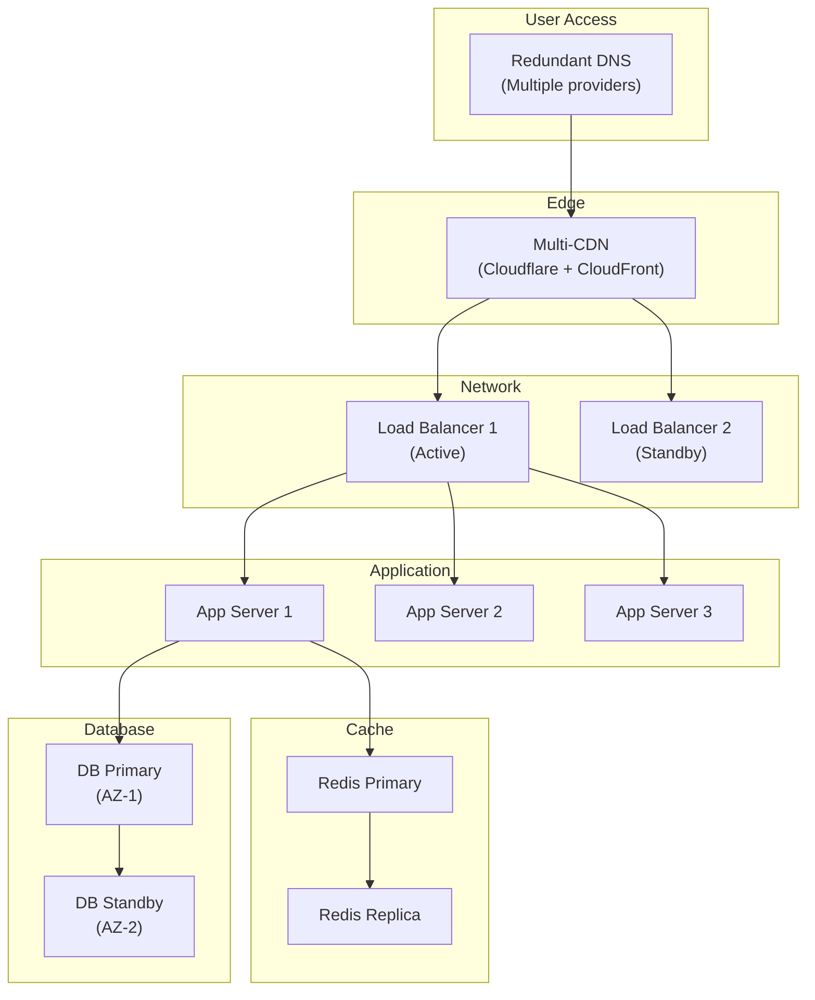

| Layer | Redundancy Strategy | Failure Scenario |
|---|---|---|
| DNS | Multiple DNS providers | DNS provider outage |
| CDN | Multi-CDN (Cloudflare + Fastly) | CDN outage |
| Load Balancer | Active-passive pair | LB hardware failure |
| App Servers | Multiple behind LB | One server crashes |
| Cache | Redis Sentinel / Cluster | Redis node failure |
| Database | Multi-AZ replication | Availability zone outage |
| Storage | S3 (11 nines durability) | Disk failure |
| Data Center | Multi-region | Regional disaster |

## Cost of Redundancy

Redundancy is not free. Here is what it costs for a typical setup:

| Component | Without Redundancy | With Redundancy | Cost Increase |
|---|---|---|---|
| App Server | 1 × $100/mo | 3 × $100 = $300/mo | 3x |
| Database | 1 × $500/mo | 2 × $500 = $1,000/mo | 2x |
| Cache | 1 × $100/mo | 2 × $100 = $200/mo | 2x |
| Load Balancer | $0 | $20/mo | New cost |
| Monitoring | $0 | $100/mo | New cost |
| **Total** | **$700/mo** | **$1,620/mo** | **2.3x** |

For many applications, this cost is justified by the availability improvement. Going from 99% to 99.9% (by adding redundancy) means going from 3.65 days of downtime per year to 8.77 hours.

## Key Vocabulary

| Term | Definition |
|---|---|
| **Redundancy** | Having extra copies of components for fault tolerance |
| **Replication** | The process of copying data across machines |
| **Failover** | Switching from a failed component to a backup |
| **Active-Passive** | One server works, one waits as backup |
| **Active-Active** | Both servers work simultaneously |
| **Hot Standby** | Backup running with real-time data, ready immediately |
| **Warm Standby** | Backup running with periodic data, ready in minutes |
| **Cold Standby** | Backup off, ready in hours |
| **Replication Lag** | Delay between primary write and replica receiving it |
| **Split-Brain** | Both nodes think they are primary — data divergence risk |
| **Quorum** | Majority agreement required for decisions |
| **Fencing** | Forcibly shutting down old primary to prevent split-brain |

## What to Learn Next

- **[Replication](/system-design/databases/replication)** — Deep dive into database replication mechanics
- **[System Design Characteristics](/system-design/fundamentals/characteristics)** — Availability nines and how to calculate them
- **[Health Checks](/system-design/load-balancing/health-checks)** — How failure is detected in production
- **[Leader Election](/system-design/consensus/leader-election)** — How systems choose which node is the primary
- **[Raft Full Walkthrough](/system-design/consensus/raft-full-walkthrough)** — The consensus algorithm that prevents split-brain
- **[CAP Theorem](/system-design/distributed-systems/cap-theorem)** — Why you cannot have perfect consistency and availability
- **[Failure Detectors](/system-design/distributed-systems/failure-detectors)** — How distributed systems detect node failures

## Real-World Examples

::: tip AWS RDS Multi-AZ
AWS RDS provides **active-passive failover** out of the box. The primary database is in one Availability Zone, and a synchronous standby replica runs in a different AZ. When the primary fails, RDS automatically promotes the standby within 60-120 seconds. This is the most common redundancy pattern for production databases and costs only 2x a single instance.
:::

::: tip CockroachDB
CockroachDB uses **active-active replication** with Raft consensus across all nodes. Every piece of data is replicated to at least 3 nodes, and any node can accept reads and writes. If a node or even an entire data center goes down, the surviving nodes continue serving without any failover delay — achieving 99.99%+ availability by design.
:::

::: tip GitHub
GitHub experienced a major incident in 2018 due to a **split-brain** scenario. A network partition caused their MySQL orchestrator to promote a replica to primary while the original primary was still running. This resulted in 24 hours of data inconsistency. They resolved it by replaying transactions and now use additional safeguards including fencing (STONITH) to prevent split-brain.
:::

## Interview Tip

::: tip What to say
"Redundancy is how you buy availability nines. For databases, I'd start with active-passive (Multi-AZ) because it's simple and handles 99% of failure scenarios — one standby with synchronous replication gives you zero data loss and automatic failover in under 2 minutes. I'd only move to active-active when I need zero-downtime failover or multi-region writes, because active-active introduces write conflicts and split-brain risk. The most important thing is to actually test the failover — untested failover plans fail when you need them most."
:::
