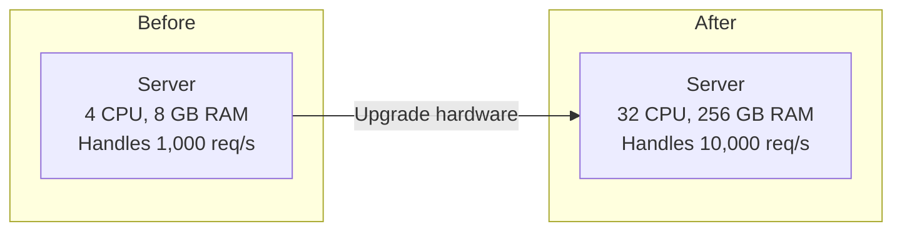
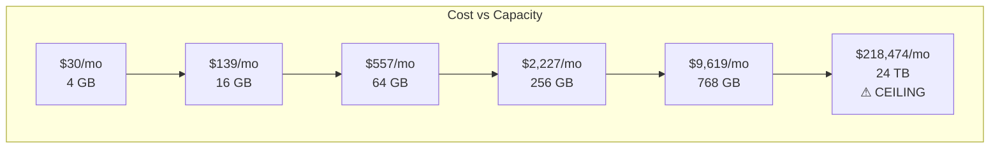
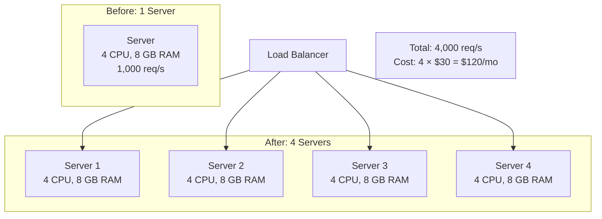
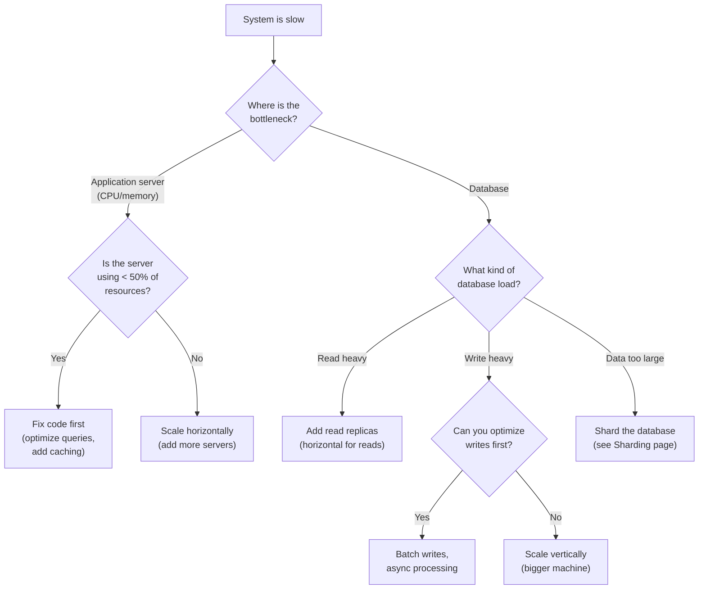
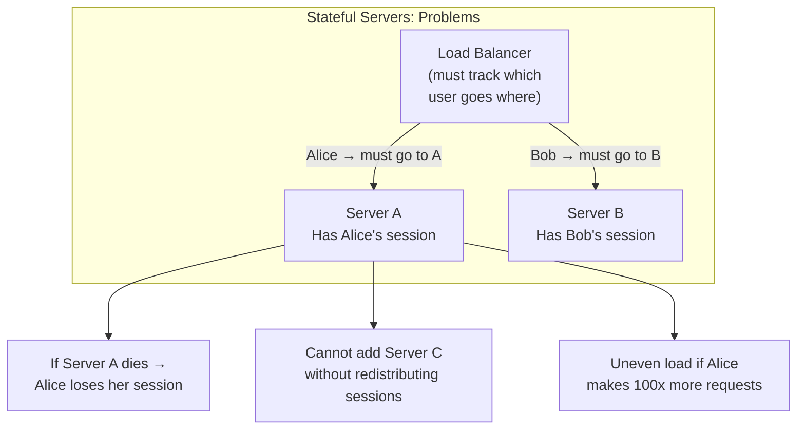
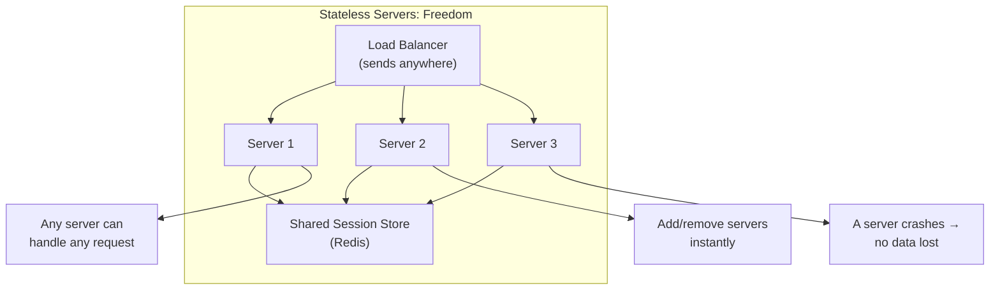
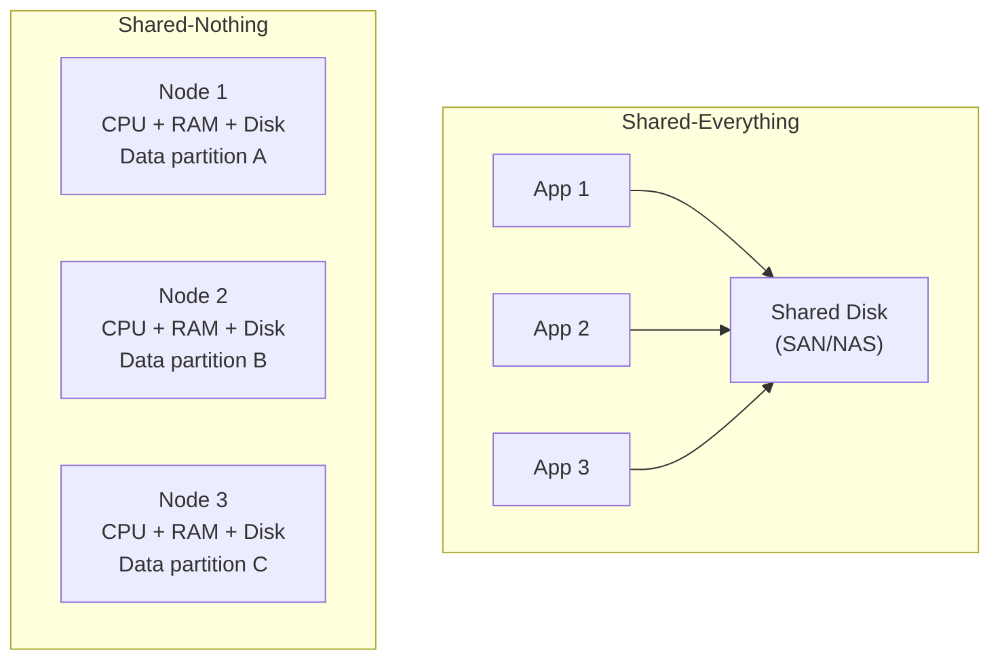
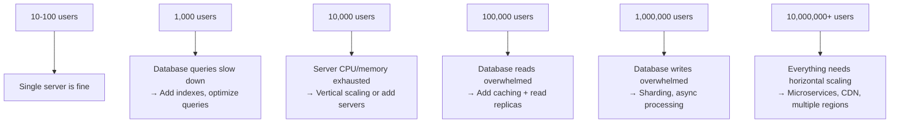
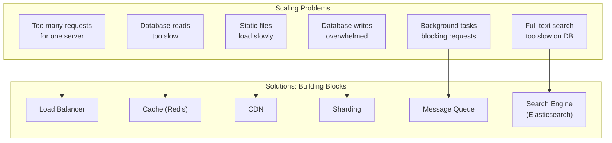

# Scaling Fundamentals

Your application works perfectly on your laptop. Then you deploy it, a few thousand users show up, and everything breaks. The server runs out of memory. The database cannot keep up. Pages take 30 seconds to load. Congratulations — you have a scaling problem.

**Scaling** means making your system handle more load. More users, more requests, more data, more everything. This page teaches you the two fundamental approaches to scaling, when to use each one, and the principles that make systems scalable from day one.

## What Is "Load"?

Before you can scale, you need to understand what you are scaling. "Load" means different things for different systems:

| System Type | Load Metric | Example |
|---|---|---|
| Web server | Requests per second (RPS) | 5,000 HTTP requests/sec |
| Database | Queries per second (QPS) | 10,000 queries/sec |
| Message queue | Messages per second | 100,000 messages/sec |
| Video streaming | Concurrent streams | 50,000 simultaneous viewers |
| Storage system | GB stored / IOPS | 500 TB stored, 10,000 IOPS |
| Real-time app | Concurrent connections | 200,000 WebSocket connections |

The first step in any scaling discussion is: **What metric is growing, and what is the bottleneck?**

## The Two Approaches to Scaling

There are exactly two ways to handle more load: make your machine bigger, or add more machines.

### Vertical Scaling (Scale Up)

**Vertical scaling** means using a bigger, more powerful machine. More CPU cores, more RAM, faster disks.



**Real-world example**: Your PostgreSQL database is slow because it only has 16 GB of RAM and your entire database is 50 GB. You upgrade to a machine with 128 GB of RAM, and now the entire database fits in the OS page cache. Queries that took 100ms now take 2ms.

**Advantages**:
- Simple — no code changes required
- No distributed systems complexity
- All data is on one machine (no consistency issues)
- Easier to maintain and debug

**Disadvantages**:
- There is a hard ceiling (you can only get so big)
- Cost grows faster than capacity (superlinear cost)
- Single point of failure (one machine dies, everything dies)
- Requires downtime for upgrades

### The Cost Curve Problem

Vertical scaling gets expensive fast. Here are real AWS EC2 prices (on-demand, US East, as of 2026):

| Instance | vCPUs | RAM | Monthly Cost | Cost per GB RAM |
|---|---|---|---|---|
| t3.medium | 2 | 4 GB | $30 | $7.50/GB |
| m6i.xlarge | 4 | 16 GB | $139 | $8.69/GB |
| m6i.4xlarge | 16 | 64 GB | $557 | $8.70/GB |
| m6i.16xlarge | 64 | 256 GB | $2,227 | $8.70/GB |
| x2idn.24xlarge | 96 | 768 GB | $9,619 | $12.52/GB |
| u-24tb1.metal | 448 | 24,576 GB | $218,474 | $8.89/GB |

Notice the jump at the very high end. The 24 TB RAM machine costs $218K/month. And that is the ceiling — there is nothing bigger. If you need more than that, vertical scaling is over. You must go horizontal.



### Horizontal Scaling (Scale Out)

**Horizontal scaling** means adding more machines of the same size and spreading the load across them.



**Real-world example**: Your web API handles 1,000 requests per second on one server. Instead of buying a server 10x bigger, you put 10 identical servers behind a [load balancer](/system-design/load-balancing). Each handles 1,000 req/s, and together they handle 10,000 req/s.

**Advantages**:
- No ceiling — keep adding machines as needed
- Cost grows linearly (10x machines = 10x cost for ~10x capacity)
- Redundancy built in (one machine dies, others keep working)
- Can scale incrementally (add 1 machine at a time)

**Disadvantages**:
- Application must be designed for it (stateless, no local storage)
- Distributed systems complexity (network failures, data consistency)
- Need a load balancer to distribute traffic
- Harder to debug (which of the 50 servers has the bug?)

## When to Scale Vertically vs Horizontally

This is not an either/or decision. Most real systems use both:



**Rules of thumb**:

| Component | Scale Vertically | Scale Horizontally |
|---|---|---|
| Web/API servers | Rarely needed | Almost always |
| Databases (writes) | First choice | Last resort (sharding) |
| Databases (reads) | Sometimes | Read replicas |
| Cache (Redis) | Often sufficient | Redis Cluster for large data |
| Message queues | Rarely | Kafka partitions, multiple brokers |
| Background workers | Sometimes | Usually horizontal |

For deep dives into database scaling approaches, see [Replication](/system-design/databases/replication) and [Sharding](/system-design/databases/sharding).

## The Key Principle: Stateless Services

The single most important principle for horizontal scaling is making your application servers **stateless**. This means servers do not store any information about users or sessions in their own memory.

### Why Stateless Matters

If a server stores user sessions in memory, every request from that user must go to the same server. This is called **session affinity** or **sticky sessions**, and it creates serious problems:





### How to Make a Service Stateless

1. **Store sessions in Redis or a database**, not in server memory
2. **Store files in blob storage** (S3, GCS), not on the server's local disk
3. **Use JWTs or tokens** instead of server-side session objects
4. **Store cache in a shared cache layer** (Redis, Memcached), not in application memory
5. **Make every request self-contained** — it includes everything the server needs

For more on session management patterns, see [Session Affinity](/system-design/load-balancing/session-affinity) and [Redis Caching Patterns](/system-design/caching/redis-caching-patterns).

## Shared-Nothing Architecture

The next level of statelessness is **shared-nothing architecture**. In shared-nothing, each node is completely independent. It has its own CPU, memory, and storage. Nodes do not share any resources.



**Shared-nothing** is how most large-scale databases work:
- **Cassandra** — Each node owns a range of the hash ring
- **Kafka** — Each broker owns specific partitions
- **Elasticsearch** — Each node holds specific shards
- **CockroachDB** — Each node manages specific ranges

The advantage is that there is no single resource that bottlenecks the entire system. Each node can be scaled independently. The disadvantage is that operations that span multiple nodes (like joins across partitions) become much more complex.

For details on how data is distributed across nodes, see [Consistent Hashing](/system-design/distributed-systems/consistent-hashing) and [Sharding](/system-design/databases/sharding).

## What Breaks at Each Level

As your system grows, different components become bottlenecks at different scales. Here is what typically breaks and when:



| Scale | What Breaks | Solution |
|---|---|---|
| 100 users | Nothing (unless your code is terrible) | Enjoy the peace |
| 1K users | Slow database queries | Add indexes, optimize SQL |
| 10K users | Server resources exhausted | Add caching, horizontal scaling |
| 100K users | Database read throughput | Read replicas + cache layer |
| 1M users | Database write throughput, session management | Sharding, stateless servers, message queues |
| 10M+ users | Everything, plus global latency | Multi-region, CDN, specialized services |

For a detailed walkthrough of how architecture evolves at each stage, see the [Zero to Million Users](/system-design/fundamentals/zero-to-million-users) page.

## Real-World Scaling Examples

### Example 1: Instagram (Reads >> Writes)

Instagram's workload is heavily read-biased. Millions of users browse feeds, but only a fraction post at any moment.

- **Reads**: Horizontal scaling with many read replicas + aggressive caching
- **Writes**: Single primary database (with sharding at massive scale)
- **Images**: Stored in blob storage (not the database), served via CDN
- **Feed generation**: Precomputed and cached, not generated on every request

### Example 2: Uber (Real-Time, Write-Heavy)

Uber processes millions of location updates per second from drivers. This is write-heavy and latency-sensitive.

- **Location data**: Written to an in-memory store, not a traditional database
- **Matching**: Specialized algorithms on in-memory data
- **Historical data**: Moved to a data warehouse (Hadoop/Spark) for analytics
- **Cell-based architecture**: Geographic regions are independent cells

### Example 3: Slack (Concurrent Connections)

Slack maintains persistent WebSocket connections for every online user.

- **Connections**: Horizontal scaling of WebSocket servers
- **Messages**: Written to database + broadcast via message queue
- **Presence**: Dedicated presence service using gossip protocol
- **Search**: Separate Elasticsearch cluster

## The Scaling Checklist

Before you reach for more hardware, make sure you have done these first:

### Step 1: Optimize Your Code

```
Common wins:
- Add database indexes for slow queries
- Use EXPLAIN ANALYZE to find bad query plans
- Reduce N+1 queries (fetching related data one at a time)
- Remove unnecessary computations from hot paths
```

### Step 2: Add Caching

Put a cache layer between your application and database. Most web applications are 90%+ reads. Caching can reduce database load by 10x.

See [Caching Strategies](/system-design/caching/caching-strategies) and [Multi-Layer Caching](/system-design/caching/multi-layer-caching).

### Step 3: Offload Static Assets

Move images, CSS, JavaScript, and videos to a CDN. This reduces server load and improves latency for users worldwide.

See [CDN Deep Dive](/system-design/caching/cdn-deep-dive).

### Step 4: Add Read Replicas

If the database is the bottleneck and reads dominate, add read replicas. Writes go to the primary, reads go to replicas.

See [Replication](/system-design/databases/replication).

### Step 5: Scale Application Servers Horizontally

Make your servers stateless and put them behind a load balancer. See [Load Balancing Algorithms](/system-design/load-balancing/algorithms).

### Step 6: Introduce Async Processing

Not everything needs to happen immediately. Send emails, generate reports, and process images in the background using message queues.

See [Kafka Internals](/system-design/message-queues/kafka-internals) and [Backpressure Patterns](/system-design/message-queues/backpressure-patterns).

### Step 7: Shard the Database (Last Resort)

Only shard when you have exhausted all other options. Sharding is complex and hard to undo.

See [Sharding](/system-design/databases/sharding).

## Connection Between Scaling and Building Blocks

Every system design building block exists to solve a scaling problem:



For an overview of all building blocks and when to use each, see the [Building Blocks Overview](/system-design/fundamentals/building-blocks) page.

## Key Vocabulary

| Term | Definition |
|---|---|
| **Vertical Scaling** | Making one machine more powerful |
| **Horizontal Scaling** | Adding more machines |
| **Stateless** | Server stores no per-client state in memory |
| **Stateful** | Server stores per-client state in memory |
| **Shared-Nothing** | Each node is independent with its own resources |
| **Load Balancer** | Distributes requests across multiple servers |
| **Read Replica** | A copy of the database that handles read queries |
| **Shard** | A horizontal partition of a database |
| **Throughput** | Amount of work completed per unit of time |
| **Bottleneck** | The component limiting overall system performance |

## What to Learn Next

- **[Zero to Million Users](/system-design/fundamentals/zero-to-million-users)** — Watch an architecture evolve step by step from 1 user to 100 million
- **[System Design Characteristics](/system-design/fundamentals/characteristics)** — Understand scalability, availability, latency, and reliability with real numbers
- **[Building Blocks Overview](/system-design/fundamentals/building-blocks)** — All the components you will use when scaling
- **[Load Balancing](/system-design/load-balancing)** — How traffic gets distributed across servers
- **[Caching Strategies](/system-design/caching/caching-strategies)** — The single biggest performance lever for most applications

## Real-World Examples

::: tip Netflix
Netflix uses **horizontal scaling** for its microservices layer, running thousands of EC2 instances behind Zuul (their custom load balancer). Their stateless services auto-scale based on traffic, handling over 400 billion events per day across 200+ microservices. Each service team independently scales their instances.
:::

::: tip Shopify
Shopify uses **vertical scaling first** for their MySQL databases (upgrading to 12 TB RAM machines) and only shards when absolutely necessary. Their "Pods" architecture horizontally scales by assigning groups of shops to independent infrastructure stacks, keeping each pod simple while scaling the overall system.
:::

::: tip Twitter/X
Twitter moved from a Ruby monolith (the "Fail Whale" era) to **horizontally scaled JVM services**. Their timeline service precomputes home timelines into Redis clusters. For celebrities with 100M+ followers, they switch from fan-out-on-write (push) to fan-out-on-read (pull), demonstrating hybrid scaling at extreme load.
:::

## Interview Tip

::: tip What to say
"I'd start by identifying the bottleneck — is it CPU, memory, database reads, or writes? For application servers, I'd scale horizontally because they're stateless and easy to clone behind a load balancer. For the database, I'd first optimize queries, then add caching (Redis reduces DB load by 80-90%), then read replicas, and only shard as a last resort because sharding is complex and hard to reverse. Companies like Instagram ran on just 3 engineers with this progressive approach up to 30 million users."
:::
