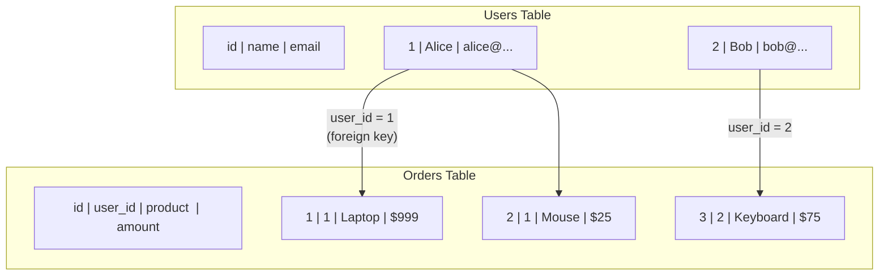
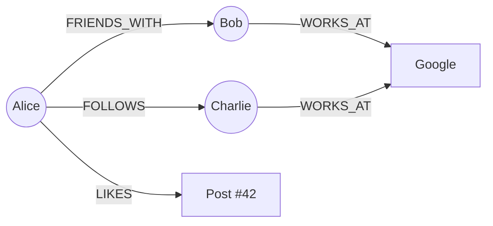
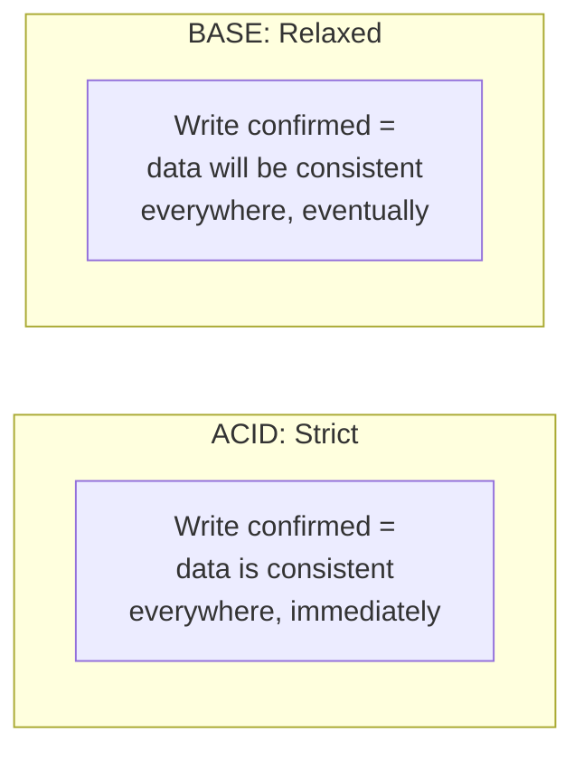
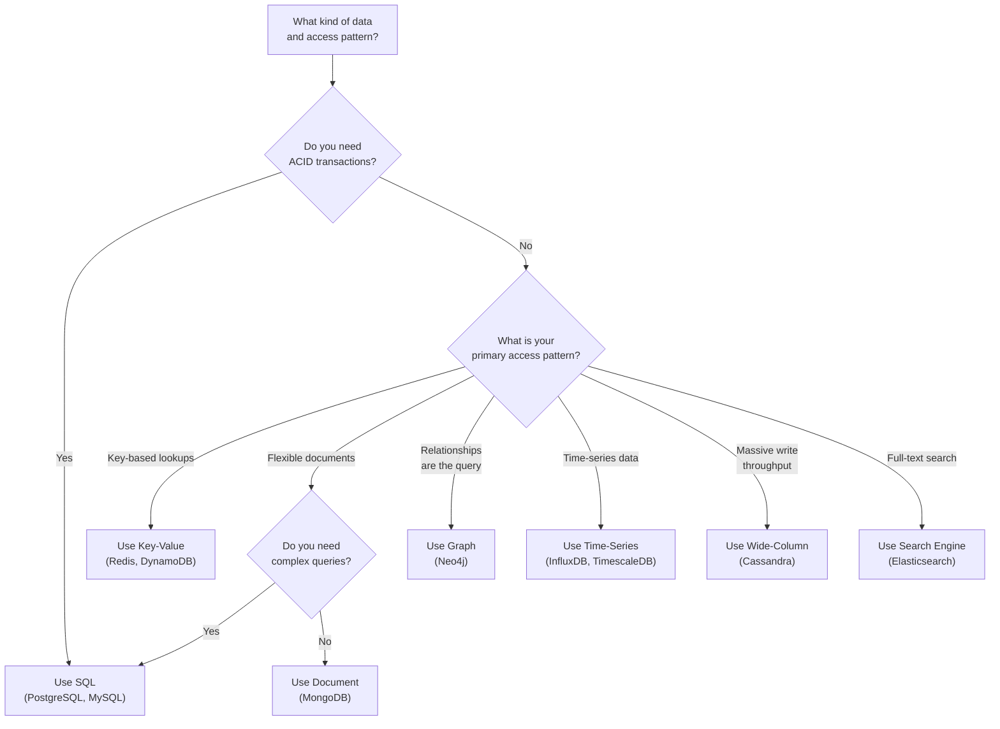
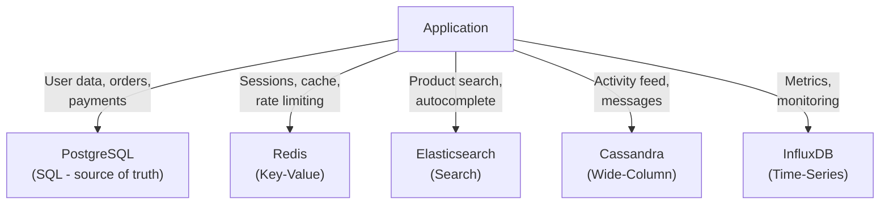

# SQL vs NoSQL Decision Guide

"Should I use SQL or NoSQL?" is one of the most common questions in software engineering. The answer is never "SQL is better" or "NoSQL is better." The answer is always "it depends on your specific use case."

This page gives you a framework for making that decision. We will cover what SQL and NoSQL actually are, when each type shines, a decision flowchart, and 10 real-world scenarios with recommendations.

## What Is SQL (Relational)?

SQL databases store data in **tables** with **rows** and **columns**. Every row follows the same schema (structure). Tables are related to each other through foreign keys. You query data using SQL (Structured Query Language).



**Popular SQL databases**: PostgreSQL, MySQL, SQLite, SQL Server, Oracle, CockroachDB

**Key properties**:
- Fixed schema — you define columns before inserting data
- ACID transactions — atomicity, consistency, isolation, durability
- Joins — combine data from multiple tables in a single query
- Mature — decades of optimization, tooling, and community knowledge

## What Is NoSQL?

NoSQL (Not Only SQL) is a catch-all term for databases that do not use the traditional table/row/column model. There are several types, each designed for a different use case.

### Document Databases

Store data as flexible JSON-like documents. Each document can have a different structure. No fixed schema.

```json
// User document in MongoDB
{
  "_id": "user_123",
  "name": "Alice",
  "email": "alice@example.com",
  "orders": [
    { "product": "Laptop", "amount": 999 },
    { "product": "Mouse", "amount": 25 }
  ]
}
```

**Popular**: MongoDB, Couchbase, Amazon DocumentDB

**Best for**: Content management, user profiles, catalogs — data where the schema varies or evolves frequently.

### Key-Value Stores

The simplest database: store a value under a key. Like a giant hash map / dictionary.

```
SET user:123 "{name: 'Alice', last_login: '2026-03-25'}"
GET user:123  →  "{name: 'Alice', last_login: '2026-03-25'}"
```

**Popular**: Redis, DynamoDB, etcd, Memcached

**Best for**: Caching, sessions, counters, feature flags — data accessed by a known key with simple lookups.

### Wide-Column Stores

Store data in columns rather than rows. Optimized for reading and writing large amounts of data across many servers.

```
Row Key     | Column Family: Profile          | Column Family: Activity
user_123    | name="Alice" email="alice@..."   | last_login="2026-03-25" posts=42
user_456    | name="Bob"   email="bob@..."     | last_login="2026-03-24" posts=7
```

**Popular**: Apache Cassandra, ScyllaDB, HBase, Google Bigtable

**Best for**: Time-series data, IoT sensor data, messaging systems — massive write throughput across many nodes.

### Graph Databases

Store data as **nodes** (entities) and **edges** (relationships). Optimized for querying relationships between entities.



**Popular**: Neo4j, Amazon Neptune, ArangoDB, TigerGraph

**Best for**: Social networks, recommendation engines, fraud detection — data where relationships are the primary query pattern.

### Time-Series Databases

Optimized for data that arrives as a stream of timestamped events: metrics, sensor readings, stock prices.

```
timestamp            | server  | cpu_usage | memory_usage
2026-03-25T10:00:00  | web-01  | 45.2%     | 72.1%
2026-03-25T10:00:05  | web-01  | 47.8%     | 72.3%
2026-03-25T10:00:10  | web-01  | 43.1%     | 71.9%
```

**Popular**: InfluxDB, TimescaleDB (on PostgreSQL), ClickHouse, Prometheus

**Best for**: Monitoring, IoT data, financial data — append-heavy workloads with time-range queries. See [Time-Series Databases](/system-design/databases/time-series-databases).

## ACID vs BASE

The fundamental philosophical difference between SQL and many NoSQL databases:

### ACID (SQL databases guarantee this)

| Property | Meaning | Example |
|---|---|---|
| **Atomicity** | All or nothing — a transaction either fully completes or fully rolls back | Transferring $100: both the debit and credit happen, or neither does |
| **Consistency** | Data always satisfies integrity constraints | Account balance never goes negative (if that is a rule) |
| **Isolation** | Concurrent transactions do not interfere with each other | Two people buying the last item — only one succeeds |
| **Durability** | Once committed, data survives crashes | After the transfer confirms, the data is safe on disk |

See [Isolation Levels](/system-design/databases/isolation-levels) for the nuances of isolation.

### BASE (Many NoSQL databases follow this)

| Property | Meaning |
|---|---|
| **Basically Available** | The system responds to every request (even if the data is stale) |
| **Soft state** | Data may change over time without input (due to eventual consistency) |
| **Eventually consistent** | If no new updates are made, all nodes will converge to the same value |



**ACID** is like a bank vault — strict rules, no exceptions, slower but safe.
**BASE** is like a social media feed — fast, flexible, but you might see stale data for a few seconds.

## The Decision Flowchart

Use this flowchart to guide your database choice:



## Comparison Table

| Feature | SQL | Document | Key-Value | Wide-Column | Graph | Time-Series |
|---|---|---|---|---|---|---|
| **Schema** | Fixed | Flexible | None | Flexible | Flexible | Fixed/Semi |
| **Transactions** | ACID | Limited | Limited | Limited | Varies | Limited |
| **Joins** | Excellent | Poor | None | Poor | Native | Limited |
| **Write throughput** | Moderate | High | Very High | Very High | Moderate | Very High |
| **Read throughput** | High | High | Very High | High | High (for traversals) | High (for ranges) |
| **Horizontal scaling** | Hard | Easy | Easy | Easy | Moderate | Easy |
| **Best for** | Complex queries, relationships | Flexible data | Simple lookups | Large-scale writes | Relationship queries | Time-range queries |

## 10 Real Scenarios with Recommendations

### Scenario 1: E-Commerce Platform

**Requirements**: Products, users, orders, payments, inventory management. Must guarantee that when a user pays, the order is created and inventory is decremented atomically.

**Recommendation**: **PostgreSQL (SQL)**

Why: E-commerce requires ACID transactions. When a user places an order, you must atomically charge payment, create the order, and decrement inventory. If any step fails, all must roll back. SQL databases excel at this. Relationships between users, orders, and products are well-modeled with foreign keys.

### Scenario 2: Content Management System (Blog/CMS)

**Requirements**: Articles with varying structures (some have video, some have galleries, some have polls). Frequently changing content model.

**Recommendation**: **MongoDB (Document)**

Why: Blog posts and CMS content have varying structures. One post might have a photo gallery, another has an embedded video, another has a poll. A fixed SQL schema would require many nullable columns or complex table relationships. MongoDB lets each document have a different structure.

### Scenario 3: Session Store for a Web Application

**Requirements**: Store user session data. Access by session ID. Millions of sessions. Auto-expire after 30 minutes.

**Recommendation**: **Redis (Key-Value)**

Why: Sessions are accessed by a known key (session ID), need sub-millisecond latency, and should auto-expire. Redis handles all of this natively with the `EXPIRE` command. It is the industry standard for session storage.

### Scenario 4: IoT Sensor Data

**Requirements**: 100,000 sensors sending temperature readings every 5 seconds. Query pattern: "show me the average temperature for sensor X over the last 24 hours."

**Recommendation**: **TimescaleDB or InfluxDB (Time-Series)**

Why: This is pure time-series data — timestamped events from many sources, queried by time ranges. Time-series databases have specialized storage engines that compress time-series data 10-50x better than general-purpose databases and optimize for time-range queries.

### Scenario 5: Social Network

**Requirements**: Users follow other users. Show "people you might know" (friends of friends). Detect communities and clusters.

**Recommendation**: **Neo4j (Graph)** for relationship queries, **PostgreSQL (SQL)** for user profiles and posts

Why: "Friends of friends" is a graph traversal that takes 1ms in Neo4j but might take 30 seconds in SQL with multi-level JOINs. Use a graph database for relationship-heavy queries and a relational database for structured user data. Many real social networks use both.

### Scenario 6: Real-Time Chat Application

**Requirements**: Millions of users, billions of messages, low latency delivery, messages stored permanently.

**Recommendation**: **Cassandra (Wide-Column)** for message storage, **Redis (Key-Value)** for presence/caching

Why: Chat generates massive write throughput (millions of messages per second). Cassandra handles high write throughput at scale with automatic distribution across nodes. Messages are typically queried by conversation + time range, which maps perfectly to Cassandra's data model.

### Scenario 7: Banking / Financial System

**Requirements**: Account balances, transfers, transaction history. Absolute consistency. Regulatory compliance.

**Recommendation**: **PostgreSQL (SQL)** or **CockroachDB (Distributed SQL)**

Why: Financial systems require ACID transactions — a transfer must atomically debit one account and credit another. There is no room for eventual consistency when money is involved. If you need multi-region deployment, CockroachDB provides ACID transactions across geographic regions. See [NewSQL](/system-design/databases/newsql).

### Scenario 8: Product Catalog with Search

**Requirements**: 10 million products. Users search by name, category, price range, ratings. Need autocomplete and fuzzy matching.

**Recommendation**: **Elasticsearch (Search)** backed by **PostgreSQL (SQL)**

Why: PostgreSQL is the source of truth for product data. Elasticsearch provides fast full-text search, faceted search (filter by category, price range), fuzzy matching ("recieve" → "receive"), and autocomplete. Data flows from PostgreSQL to Elasticsearch via a sync pipeline.

### Scenario 9: Logging and Analytics

**Requirements**: Ingest 100,000 log events per second. Store for 30 days. Query: "show me all errors from service X in the last hour."

**Recommendation**: **Elasticsearch (Search)** or **ClickHouse (Columnar)**

Why: Log data is append-only, queried by time range and text search. Elasticsearch excels at full-text search across logs. ClickHouse excels at analytical queries (aggregations, counts, percentiles) on large datasets. See [ClickHouse Internals](/system-design/databases/clickhouse-internals).

### Scenario 10: Gaming Leaderboard

**Requirements**: 50 million players. Real-time global leaderboard. "Show me the top 100 players" and "Show me player X's rank."

**Recommendation**: **Redis (Key-Value)** using Sorted Sets

Why: Redis Sorted Sets are purpose-built for leaderboards. `ZADD` adds a player with a score, `ZRANK` gets a player's rank, `ZRANGE` gets the top N players — all in O(log N) time. A leaderboard for 50 million players responds in under 1ms.

## When to Use Multiple Databases (Polyglot Persistence)

Most real-world systems use more than one database. Each database handles what it is best at:



This pattern is called **polyglot persistence**. The tradeoff is operational complexity — each database is another system to manage, monitor, backup, and scale. Only add a specialized database when the general-purpose one truly cannot handle the access pattern.

For more guidance on database selection, see [Database Selection Guide](/system-design/databases/database-selection-guide).

## Common Myths Debunked

### Myth 1: "NoSQL is faster than SQL"

**Reality**: Speed depends on access pattern, not database type. Redis (NoSQL) is faster than PostgreSQL for key lookups. But PostgreSQL is faster than MongoDB for complex joins. Use the right tool for the job.

### Myth 2: "SQL doesn't scale"

**Reality**: PostgreSQL and MySQL scale well vertically (the largest instances handle millions of QPS). With read replicas, they scale reads horizontally. With sharding (Vitess for MySQL, Citus for PostgreSQL), they scale writes horizontally. Google Spanner, CockroachDB, and TiDB are distributed SQL databases that scale to petabytes. See [Sharding](/system-design/databases/sharding).

### Myth 3: "NoSQL means no schema"

**Reality**: NoSQL databases have schemas — they are just enforced at the application level instead of the database level. This is called "schema-on-read." It is not schema-free; it is schema-shifted. And it can be a double-edged sword: the flexibility that lets you iterate fast also lets you create inconsistent data if you are not careful.

### Myth 4: "You have to choose one or the other"

**Reality**: Most production systems use both SQL and NoSQL. PostgreSQL for transactional data, Redis for caching, Elasticsearch for search. The question is not "SQL or NoSQL?" but "Which combination fits my needs?"

## Summary Decision Table

| If You Need... | Choose | Example DB |
|---|---|---|
| Transactions (ACID) | SQL | PostgreSQL, MySQL |
| Flexible schema | Document | MongoDB |
| Ultra-fast key lookups | Key-Value | Redis, DynamoDB |
| Massive write throughput | Wide-Column | Cassandra, ScyllaDB |
| Relationship queries | Graph | Neo4j |
| Time-range queries | Time-Series | TimescaleDB, InfluxDB |
| Full-text search | Search Engine | Elasticsearch |
| Global ACID transactions | Distributed SQL | CockroachDB, Spanner |

## What to Learn Next

- **[Database Selection Guide](/system-design/databases/database-selection-guide)** — The complete decision framework with more scenarios
- **[PostgreSQL Internals](/system-design/databases/postgres-internals)** — How the most popular SQL database works under the hood
- **[MongoDB Internals](/system-design/databases/mongodb-internals)** — How the most popular document database works
- **[Redis Internals](/system-design/databases/redis-internals)** — How Redis achieves sub-millisecond latency
- **[Cassandra Internals](/system-design/databases/cassandra-internals)** — How Cassandra handles massive write throughput
- **[Graph Databases](/system-design/databases/graph-databases)** — When and how to use graph databases
- **[Indexing Deep Dive](/system-design/databases/indexing-deep-dive)** — How indexes make any database faster
- **[Isolation Levels](/system-design/databases/isolation-levels)** — Understanding ACID isolation in practice
