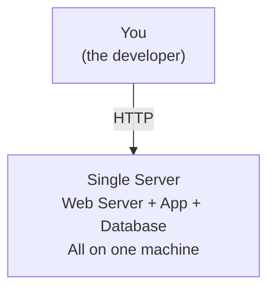
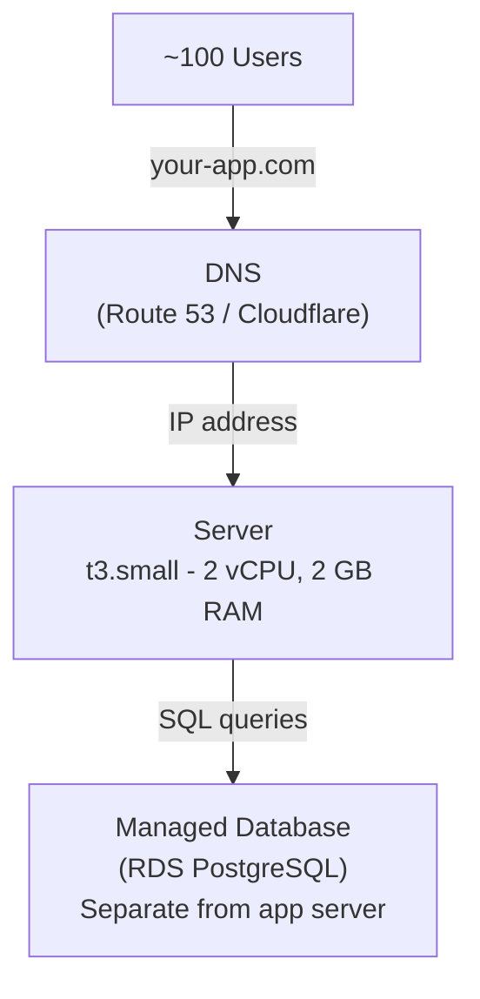
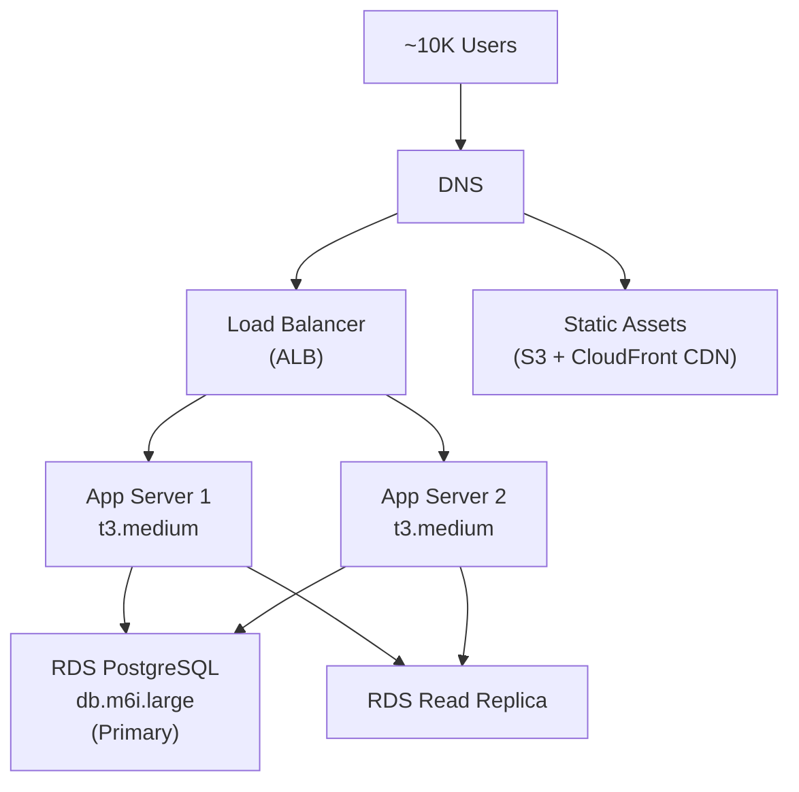
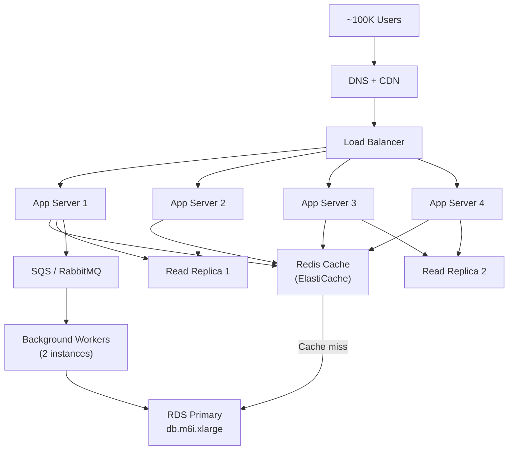
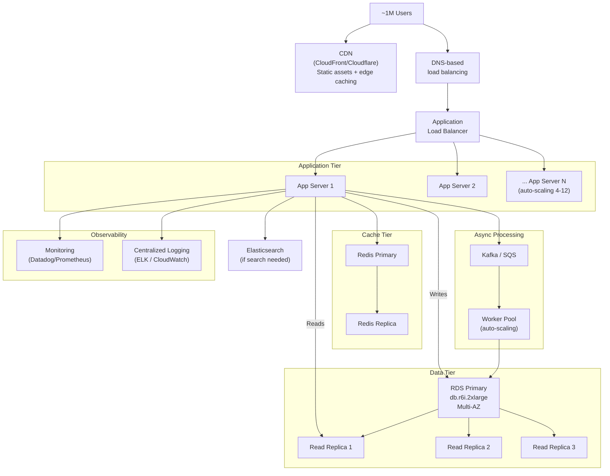
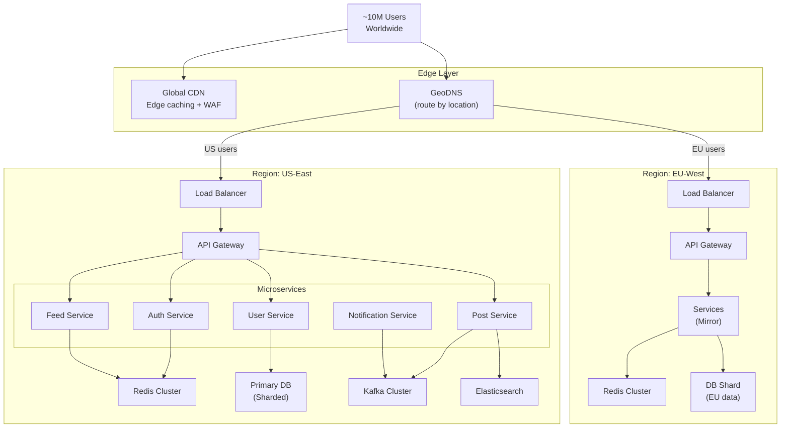
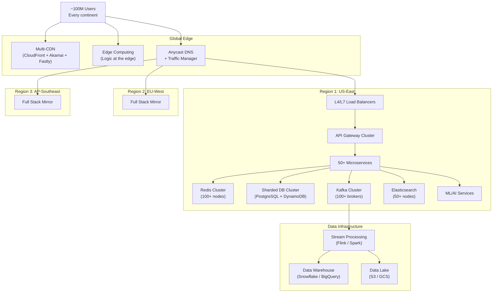
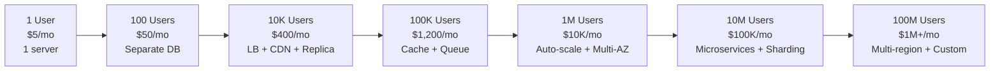

# Zero to Million Users

This is the page. The one you bookmark and come back to over and over. It answers the most fundamental question in system design: **how does an application architecture evolve as you go from 1 user to 100 million?**

Every architecture starts simple. A single server. A single database. As users grow, things break. You add a piece to fix the bottleneck. Then something else breaks. You add another piece. This cycle repeats until you have the complex, multi-layered architectures that companies like Netflix, Instagram, and Uber run today.

The goal of this page is to show you exactly what breaks at each level, why it breaks, what you should add, and what it costs. We will walk through seven stages with a Mermaid diagram at every single one.

## Stage 1: 1 User (You and Your Laptop)

You have just built your app. You are the only user. Everything runs on a single server.

**Architecture**:
- One server (maybe a $5/month VPS or even localhost)
- Web server (Nginx or Node.js), application code, and database (PostgreSQL or MySQL) all on the same machine
- DNS points your domain to this one server's IP address

**Cost**: $5-20/month (a DigitalOcean droplet or small AWS EC2 instance)

**What works**: Everything. At this scale, the simplest possible setup is the right setup. Do not over-engineer. Do not add Redis. Do not add a message queue. Do not use microservices. Just ship.

**What could go wrong**: If this single server dies, your entire application is down. But with 1 user, you probably do not care. You just restart it.

## Stage 2: 100 Users (Your Friends and Early Adopters)

Your friends start using the app. You have maybe 100 users making a few requests per minute. Still tiny, but you need a few basic things.

**What changed and why**:
1. **Separated the database from the application server** — The database now runs on its own machine (AWS RDS, Google Cloud SQL). Why? Because the database and the web server compete for CPU and memory. A slow database query can starve your web server of resources. Separating them lets each use its full capacity.

2. **Added DNS** — You registered a domain name and pointed it to your server. See [DNS Deep Dive](/system-design/networking/dns-deep-dive).

**Cost**: ~$50-80/month
- Application server: $15/month (t3.small)
- Managed database: $30/month (db.t3.micro RDS)
- DNS: $0.50/month

**What could go wrong**: Still a single point of failure. If the app server dies, the site goes down. But at 100 users, a few minutes of downtime is acceptable.

## Stage 3: 10,000 Users (Product-Market Fit)

Things are getting real. You have 10,000 users, maybe 50-100 concurrent at peak. The single server is starting to sweat.

**What changed and why**:

1. **Added a Load Balancer** — One server cannot handle the load. You now have two identical application servers behind a load balancer. If one dies, the other keeps serving. The load balancer distributes traffic between them. See [Load Balancing Algorithms](/system-design/load-balancing/algorithms).

2. **Made application servers stateless** — Sessions are stored in the database or a cookie-based JWT, not in server memory. This lets the load balancer send any request to any server. See [Scaling Fundamentals](/system-design/fundamentals/scaling-fundamentals).

3. **Added a Read Replica** — Most web apps are 80-90% reads. You added a read replica for the database. Write queries go to the primary, read queries go to the replica. This doubles your read capacity. See [Replication](/system-design/databases/replication).

4. **Moved static assets to a CDN** — Images, CSS, JavaScript, and fonts are now served from CloudFront (or Cloudflare). This reduces load on your servers and makes the site faster for users worldwide. See [CDN Deep Dive](/system-design/caching/cdn-deep-dive).

**Cost**: ~$300-500/month
- Load balancer: $20/month (ALB)
- 2 app servers: $60/month (2x t3.medium)
- Primary database: $130/month (db.m6i.large)
- Read replica: $130/month
- CDN + S3: $20-50/month

**What could go wrong**:
- Database is still a single point of failure (the primary). If it dies, writes stop.
- No caching — every request hits the database.
- No background processing — slow operations block requests.

## Stage 4: 100,000 Users (Growing Fast)

100K users, 500-1,000 concurrent at peak, 1,000-2,000 requests per second. The database is groaning.

**What changed and why**:

1. **Added a Cache Layer (Redis)** — This is the single biggest performance improvement you can make. Instead of querying the database for every request, you check Redis first. Cache hit rate of 80-90% means the database only sees 10-20% of the traffic. A Redis `GET` takes 0.1ms. A database query takes 5-50ms. See [Caching Strategies](/system-design/caching/caching-strategies) and [Redis Caching Patterns](/system-design/caching/redis-caching-patterns).

2. **Added more App Servers** — From 2 to 4 servers. Horizontal scaling of the stateless tier. Easy because they are stateless.

3. **Added a Second Read Replica** — More read capacity for the database.

4. **Added a Message Queue + Background Workers** — Sending emails, generating thumbnails, processing uploads — these no longer happen during the HTTP request. They are pushed to a queue and processed asynchronously by background workers. The user gets an immediate response, and the slow work happens in the background. See [Message Queues](/system-design/message-queues) and [Backpressure Patterns](/system-design/message-queues/backpressure-patterns).

**Cost**: ~$800-1,500/month
- Load balancer: $20/month
- 4 app servers: $120/month
- Redis: $50/month (cache.t3.medium)
- Primary database: $260/month (db.m6i.xlarge)
- 2 read replicas: $520/month
- Message queue + workers: $80/month
- CDN + S3: $50-100/month

**What could go wrong**:
- Cache invalidation bugs (users see stale data). See [Cache Invalidation](/system-design/caching/cache-invalidation).
- Thundering herd when a popular cache key expires. See [Thundering Herd](/system-design/caching/thundering-herd).
- The primary database is still a single writer. If write load grows, it becomes the bottleneck.
- No monitoring — you are flying blind. You do not know which queries are slow or which servers are overloaded.

## Stage 5: 1,000,000 Users (You Made It)

One million users. 5,000-10,000 concurrent. 10,000-50,000 requests per second. You need real infrastructure now.

**What changed and why**:

1. **Auto-scaling Application Servers** — Instead of manually adding servers, you use auto-scaling groups. When CPU exceeds 70%, a new server spins up automatically. When load drops, servers are removed. This saves money during off-peak hours.

2. **Multi-AZ Database** — Your primary database now has an automatic failover replica in a different Availability Zone. If the primary dies, the replica is promoted within 60 seconds. Your application barely notices. See [Redundancy & Replication](/system-design/fundamentals/redundancy-replication).

3. **Redis Replication** — Your cache layer is now replicated. If the Redis primary dies, the replica takes over.

4. **Monitoring and Logging** — You cannot operate at this scale without visibility. You need metrics (request latency, error rates, CPU, memory), logs (centralized and searchable), and alerts (PagerDuty wakes you up at 3 AM when something breaks). See [Observability Tools](/devops/observability-tools).

5. **Elasticsearch** — If your app has search functionality, you cannot do full-text search on PostgreSQL at this scale. Elasticsearch handles millions of search queries per second. See [Elasticsearch Internals](/system-design/databases/elasticsearch-internals).

6. **Kafka / SQS** — The message queue is now more sophisticated. Kafka handles event streaming for analytics, notifications, feed generation, and more. See [Kafka Internals](/system-design/message-queues/kafka-internals).

**Cost**: ~$5,000-15,000/month
- CDN: $200-500/month
- Load balancer: $50/month
- App servers (auto-scaling 4-12): $500-1,500/month
- Redis (replicated): $200/month
- Primary database (Multi-AZ): $1,000/month
- 3 read replicas: $1,500/month
- Kafka/SQS + workers: $500/month
- Elasticsearch: $500/month
- Monitoring/Logging: $300-500/month

**What could go wrong**:
- Database write throughput hits the ceiling — a single primary can only handle so many writes
- Cross-region latency — users in Europe/Asia experience 200-300ms extra latency
- Deployment complexity — rolling deployments across 12 servers need orchestration
- Cost management becomes a real concern

## Stage 6: 10,000,000 Users (Serious Scale)

Ten million users. This is where simple architectures break down and you need specialized solutions.

**What changed and why**:

1. **Microservices** — The monolithic backend is split into independent services. Each team owns one service and can deploy it independently. This is not about technology — it is about organizational scaling. See [Microservices](/architecture-patterns/microservices/) and [Decomposition Strategies](/architecture-patterns/microservices/decomposition-strategies).

2. **API Gateway** — A single entry point that handles authentication, rate limiting, request routing, and protocol translation. See [API Gateway Pattern](/architecture-patterns/microservices/api-gateway-pattern).

3. **Database Sharding** — The database is now split across multiple machines. User data might be sharded by user ID. Each shard holds a subset of users. This multiplies write capacity. See [Sharding](/system-design/databases/sharding).

4. **Multi-Region Deployment** — You now have servers in at least two geographic regions. US users hit US servers. European users hit EU servers. This cuts latency by 100-200ms. See [Global Load Balancing](/system-design/load-balancing/global-load-balancing).

5. **Redis Cluster** — A single Redis instance is not enough. Redis Cluster spreads data across multiple nodes.

**Cost**: ~$50,000-150,000/month

**What could go wrong**:
- Distributed transactions across microservices. See [Distributed Transactions](/system-design/distributed-systems/distributed-transactions).
- Data consistency across regions (user updates in US, reads in EU). See [Consistency Models](/system-design/distributed-systems/consistency-models).
- Service-to-service failures cascading. See [Circuit Breaker](/system-design/distributed-systems/circuit-breaker).
- Debugging becomes extremely hard — a single request might touch 10 services.

## Stage 7: 100,000,000 Users (World Scale)

One hundred million users. This is Netflix, Spotify, Uber territory. Almost everything is custom-built at this scale.

**What changed and why**:

1. **Multi-CDN** — One CDN is not enough. You use multiple CDN providers and route between them based on performance and cost.

2. **Edge Computing** — Some logic runs at the CDN edge (closest to users). Authentication, A/B testing, personalization, and rate limiting can happen before the request even reaches your data center.

3. **50+ Microservices** — Each major feature is its own service with its own team, database, and deployment pipeline.

4. **Specialized Databases** — You are no longer using one database technology. PostgreSQL for relational data, DynamoDB for key-value, Elasticsearch for search, Redis for caching, Cassandra for time-series, Neo4j for recommendations. See [SQL vs NoSQL Decision Guide](/system-design/fundamentals/sql-vs-nosql).

5. **Stream Processing** — Real-time event processing with Apache Flink or Spark Streaming for analytics, fraud detection, and personalization.

6. **3+ Regions** — Full deployment in US, Europe, and Asia. Each region is (mostly) independent. Cross-region replication for data that must be globally consistent.

7. **Data Infrastructure** — A dedicated analytics pipeline. Events flow from Kafka to stream processing to a data warehouse. Data scientists query the warehouse for insights.

**Cost**: $500,000-5,000,000+/month

## The Complete Evolution Summary

| Stage | Users | RPS | Servers | Database | Monthly Cost |
|---|---|---|---|---|---|
| 1 | 1 | <1 | 1 (all-in-one) | Local | $5 |
| 2 | 100 | 1-10 | 1 app + 1 DB | Managed RDS | $50 |
| 3 | 10K | 100-500 | 2 app + LB + CDN | Primary + 1 replica | $400 |
| 4 | 100K | 1K-5K | 4 app + cache + queue | Primary + 2 replicas | $1,200 |
| 5 | 1M | 10K-50K | 4-12 (auto-scale) | Multi-AZ + 3 replicas | $10K |
| 6 | 10M | 50K-200K | 50+ (microservices) | Sharded + multi-region | $100K |
| 7 | 100M | 200K-1M+ | Hundreds | Multi-DB + specialized | $1M+ |

## What to Add at Each Stage — Quick Reference

| When You Hit... | Add This | Why | Page |
|---|---|---|---|
| Slow queries | Database indexes + query optimization | 10-100x faster queries | [Indexing Deep Dive](/system-design/databases/indexing-deep-dive) |
| Single server limit | Load balancer + 2nd server | Distribute traffic, add redundancy | [Load Balancing](/system-design/load-balancing) |
| Static asset load | CDN | Serve files from edge, reduce server load | [CDN Deep Dive](/system-design/caching/cdn-deep-dive) |
| Slow reads | Cache (Redis) | 100x faster reads, reduce DB load | [Caching Strategies](/system-design/caching/caching-strategies) |
| Slow background tasks | Message queue + workers | Async processing, decouple services | [Kafka Internals](/system-design/message-queues/kafka-internals) |
| Read DB bottleneck | Read replicas | Scale reads horizontally | [Replication](/system-design/databases/replication) |
| Write DB bottleneck | Sharding | Scale writes horizontally | [Sharding](/system-design/databases/sharding) |
| Feature velocity | Microservices | Independent teams, independent deploys | [Microservices](/architecture-patterns/microservices/) |
| Global latency | Multi-region deployment | Serve users from nearest data center | [Global Load Balancing](/system-design/load-balancing/global-load-balancing) |
| No visibility | Monitoring + logging | See what is happening, alert on problems | [Observability Tools](/devops/observability-tools) |
| Search too slow | Elasticsearch | Dedicated search engine | [Elasticsearch Internals](/system-design/databases/elasticsearch-internals) |

## Golden Rules

1. **Do not optimize prematurely.** At 100 users, a single server is correct. Do not build for 10 million users when you have 100.

2. **Solve the bottleneck in front of you.** Identify what is actually slow or broken, and fix that specific thing.

3. **Stateless application servers are non-negotiable.** This is the one principle you should adopt from day one. Store sessions and state externally.

4. **Caching is your biggest lever.** Adding Redis to a typical web app reduces database load by 80-90%. Always add caching before adding database replicas.

5. **Delay sharding as long as possible.** It is the most complex and hardest-to-reverse decision. Exhaust vertical scaling, caching, read replicas, and query optimization first.

6. **Monitor everything from the start.** You cannot fix what you cannot see. Add basic metrics and logging early.

7. **Each new component adds complexity.** Every message queue, cache, and service you add is something that can break. Add components only when the pain of not having them exceeds the pain of maintaining them.

## What to Learn Next

- **[Scaling Fundamentals](/system-design/fundamentals/scaling-fundamentals)** — Deep dive into vertical vs horizontal scaling
- **[System Design Characteristics](/system-design/fundamentals/characteristics)** — Understand availability, latency, and reliability numbers
- **[Building Blocks Overview](/system-design/fundamentals/building-blocks)** — Every component mentioned on this page, explained
- **[Estimation Practice](/system-design/fundamentals/estimation-practice)** — Learn to calculate the numbers behind each stage

## Real-World Examples

::: tip Instagram (2012)
Instagram scaled from 0 to **30 million users with just 3 engineers**. They started with a single Django server on AWS, added PostgreSQL read replicas, Memcached for query caching, and Celery + RabbitMQ for async tasks. They only sharded their database after reaching massive scale — proving you can go far with a simple architecture before adding complexity.
:::

::: tip Discord
Discord evolved from a single Go server to supporting **150 million monthly active users**. At each stage they added exactly what was needed: Cassandra for message storage (write-heavy workload), Redis for presence tracking, and Elixir for real-time WebSocket servers. They famously delayed sharding their voice servers until they absolutely had to.
:::

::: tip Notion
Notion ran on a **single PostgreSQL database** serving millions of users until 2021. They eventually had to shard their monolithic database, but their restraint in delaying that complexity allowed the small team to focus on product. When they did shard, they used application-level routing by workspace ID.
:::

## Interview Tip

::: tip What to say
"When discussing architecture evolution, I always start simple and add components only when I can name the specific bottleneck they solve. At Stage 1, a single server is correct — optimizing for 10 million users when you have 100 is wasted effort. My scaling checklist is: optimize code first, then add caching (biggest lever), then CDN for static assets, then read replicas, then horizontal app scaling, and sharding only as a last resort. Instagram proved this works — 30 million users with 3 engineers and a simple stack."
:::
