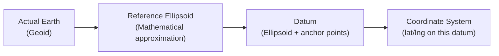
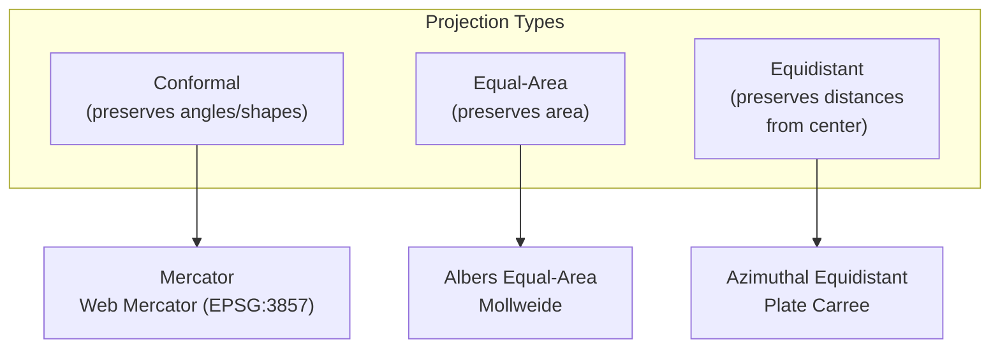
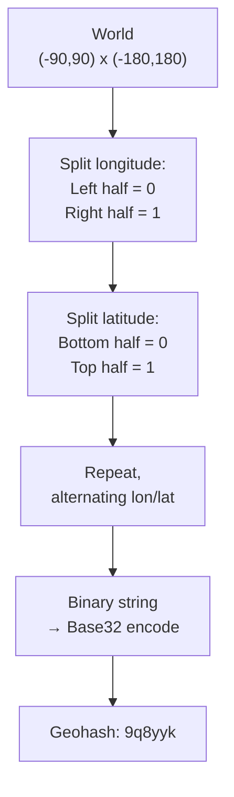
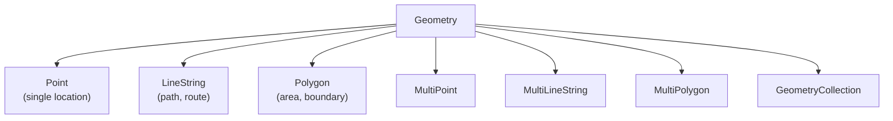
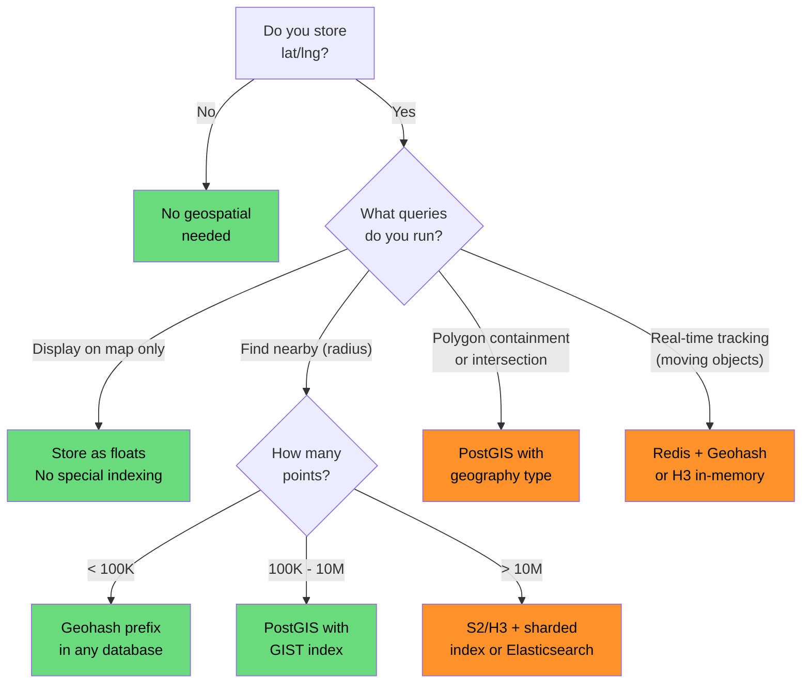

# Geospatial Engineering Overview

Every time you open a ride-hailing app, search for "coffee near me", or watch a delivery driver navigate to your door, geospatial engineering is doing the heavy lifting. Behind the simple blue dot on a map lies a stack of coordinate systems, spatial indexes, projection math, and distance algorithms that most engineers never learn until they need them.

This page gives you the conceptual foundation. The companion [Spatial Indexing Deep Dive](/system-design/geospatial/spatial-indexing) goes into advanced data structures and production implementations.

---

## Why Geospatial Engineering Matters

Location is one of the most common dimensions in modern applications, yet most CS curricula skip it entirely. If you are building any of the following, you need geospatial fundamentals:

| Domain | Geospatial Problem |
|--------|-------------------|
| Ride-hailing (Uber, Lyft) | Match riders to nearest drivers in real time |
| Food delivery (DoorDash) | Assign orders to couriers within a delivery radius |
| E-commerce (Amazon) | Find the nearest warehouse with stock |
| Social (Tinder, Snapchat) | "People nearby" with privacy-preserving location |
| Real estate (Zillow) | Search within a drawn polygon, school district boundaries |
| Logistics (FedEx, UPS) | Route optimization across thousands of stops |
| IoT / Fleet tracking | Monitor thousands of vehicles, geofence alerting |
| Gaming (Pokemon Go) | Augmented reality anchored to real-world coordinates |

---

## The Shape of the Earth

Before you can reason about coordinates, you need to understand what you are projecting onto.

### The Geoid, Ellipsoid, and Datum

The Earth is not a sphere. It is not even a perfect ellipsoid. The actual shape — the **geoid** — is an irregular surface defined by gravity. Since we cannot do math on an irregular potato, we approximate.



| Concept | Definition | Example |
|---------|-----------|---------|
| **Geoid** | The true gravitational shape of the Earth | Measured by satellites (GRACE mission) |
| **Ellipsoid** | A mathematically defined oval that approximates the geoid | WGS84 ellipsoid: semi-major axis 6,378,137 m |
| **Datum** | An ellipsoid anchored to specific reference points | WGS84, NAD83, ETRS89 |
| **CRS** | Coordinate Reference System — the full specification | EPSG:4326 (WGS84 geographic) |

::: warning
Mixing datums is a common bug. A point in NAD27 and the same point in WGS84 can differ by up to 200 meters in North America. Always track which datum your coordinates use.
:::

### WGS84 — The Universal Standard

**WGS84** (World Geodetic System 1984) is the datum used by GPS, Google Maps, and nearly every web mapping system. When someone gives you a latitude and longitude without specifying a datum, they almost certainly mean WGS84.

- **EPSG:4326** — WGS84 geographic coordinates (latitude, longitude in degrees)
- **EPSG:3857** — Web Mercator projection (used by all major web map tile servers)

```
Latitude:   -90 to +90   (north-south, equator = 0)
Longitude: -180 to +180  (east-west, Prime Meridian = 0)
```

::: tip
Latitude is like a ladder (lat-itude, lat-er) — it goes up and down. Longitude is long — it wraps around the Earth the long way.
:::

---

## Coordinate Systems and Projections

The Earth is 3D. Maps are 2D. Converting between them always introduces distortion. The type of projection you choose determines what gets distorted and what is preserved.

### Common Projections



| Projection | Preserves | Distorts | Use Case |
|-----------|-----------|----------|----------|
| **Mercator** | Angles, local shapes | Area (Greenland looks huge) | Navigation, web maps |
| **Web Mercator (3857)** | Angles | Area, poles (cuts off at ~85 degrees) | Google Maps, Mapbox, Leaflet |
| **UTM** | Shape within each zone | Nothing significant within zone | Military, surveying, local engineering |
| **Albers** | Area | Shape at edges | Thematic maps, census data |
| **Lambert Conformal Conic** | Shape, angles | Area | Aviation charts, state-level mapping |

### When Projection Matters in Engineering

For most backend applications — finding nearby drivers, geofencing, proximity search — you work in **WGS84 (EPSG:4326)** and use geodesic distance formulas. You only need to worry about projections when:

1. **Rendering map tiles** — tile servers use Web Mercator (EPSG:3857)
2. **Computing areas** — Mercator wildly distorts area; use equal-area projections
3. **High-precision surveying** — use UTM for sub-meter accuracy
4. **Storing in PostGIS** — use `geography` type (WGS84) for global data, `geometry` type with a local projection for regional data

---

## Distance Calculations

"How far apart are two points?" is the foundational geospatial query, and the answer depends on how much accuracy you need versus how much CPU you want to spend.

### Haversine Formula

The Haversine formula computes the great-circle distance between two points on a sphere. It ignores the ellipsoidal shape of the Earth but is accurate to about 0.3% (good enough for most applications).

```python
import math

def haversine(lat1, lon1, lat2, lon2):
    """Distance in kilometers between two points on Earth."""
    R = 6371  # Earth radius in km

    dlat = math.radians(lat2 - lat1)
    dlon = math.radians(lon2 - lon1)

    a = (math.sin(dlat / 2) ** 2 +
         math.cos(math.radians(lat1)) *
         math.cos(math.radians(lat2)) *
         math.sin(dlon / 2) ** 2)

    c = 2 * math.atan2(math.sqrt(a), math.sqrt(1 - a))
    return R * c

# New York to London
print(haversine(40.7128, -74.0060, 51.5074, -0.1278))
# Output: 5570.25 km
```

### Vincenty / Karney (Geodesic)

For sub-meter accuracy, use **Vincenty's formulae** or the improved **Karney algorithm** (implemented in GeographicLib). These compute distance on the WGS84 ellipsoid.

```python
from geographiclib.geodesic import Geodesic

result = Geodesic.WGS84.Inverse(40.7128, -74.0060, 51.5074, -0.1278)
print(f"Distance: {result['s12'] / 1000:.2f} km")
# Output: 5570.22 km (more accurate than Haversine)
```

### Distance Method Comparison

| Method | Accuracy | Speed | Use Case |
|--------|---------|-------|----------|
| **Euclidean (flat earth)** | Terrible for > 1 km | Fastest | Only for very small areas (< 1 km, same city block) |
| **Haversine** | ~0.3% error | Fast | Proximity search, "nearby" queries, 99% of apps |
| **Vincenty** | ~0.05 mm | Medium | Surveying, geodesy, aviation |
| **Karney** | ~15 nm | Medium | Best for all cases needing high precision |

::: tip
Use Haversine for application-level "find nearby" queries. Use PostGIS `ST_Distance` with `geography` type for database-level queries — it uses the Karney algorithm internally.
:::

---

## Geohashing

Geohashing converts a 2D coordinate (latitude, longitude) into a 1D string that preserves spatial locality. Nearby points tend to share a common prefix, which makes geohashes perfect for database indexing.

### How Geohashing Works

The algorithm recursively bisects the world:



Each additional character narrows the area:

| Geohash Length | Cell Width | Cell Height | Approximate Area |
|---------------|-----------|------------|-----------------|
| 1 | 5,000 km | 5,000 km | Continent |
| 2 | 1,250 km | 625 km | Large country region |
| 3 | 156 km | 156 km | State / Province |
| 4 | 39.1 km | 19.5 km | Metro area |
| 5 | 4.9 km | 4.9 km | Town |
| 6 | 1.2 km | 0.6 km | Neighborhood |
| 7 | 153 m | 153 m | City block |
| 8 | 38 m | 19 m | Building |
| 9 | 4.8 m | 4.8 m | Room |

### Geohash Properties

**Prefix sharing** — if two geohashes share a prefix, they are in the same region. `9q8yyk` and `9q8yym` are in the same level-5 cell.

**Edge problem** — two points across a cell boundary can be very close but share no prefix at all. The classic example: points on either side of the Prime Meridian or the Equator.

```python
import geohash2

# San Francisco
gh1 = geohash2.encode(37.7749, -122.4194, precision=6)
print(gh1)  # "9q8yyk"

# Nearby point in SF
gh2 = geohash2.encode(37.7750, -122.4190, precision=6)
print(gh2)  # "9q8yyk" — same geohash!

# Finding neighbors to handle edge cases
neighbors = geohash2.neighbors(gh1)
print(neighbors)
# ['9q8yym', '9q8yys', '9q8yyw', '9q8yyj', ...]
```

::: warning
Never use exact geohash prefix matching alone for proximity search. Always query the target cell **plus its 8 neighbors** to avoid missing nearby points across cell boundaries.
:::

### Geohash in Databases

Geohashes work beautifully as database index keys because prefix searches become range scans:

```sql
-- Find all restaurants in a geohash region
-- The geohash column has a B-tree index
SELECT * FROM restaurants
WHERE geohash LIKE '9q8yy%';

-- With neighbors for completeness
SELECT * FROM restaurants
WHERE geohash LIKE '9q8yy%'
   OR geohash LIKE '9q8yz%'
   OR geohash LIKE '9q8yw%'
   -- ... all 8 neighbors
```

---

## Spatial Data Types and Formats

### Geometry Types

The OGC (Open Geospatial Consortium) defines standard geometry types:



| Type | Example Use | WKT Example |
|------|------------|-------------|
| **Point** | Store location, pin on map | `POINT(-122.4194 37.7749)` |
| **LineString** | Road segment, route, river | `LINESTRING(-122.4 37.7, -122.3 37.8)` |
| **Polygon** | Delivery zone, city boundary | `POLYGON((-122.5 37.7, -122.4 37.7, ...))` |
| **MultiPolygon** | Country with islands, discontiguous zones | `MULTIPOLYGON((...), (...))` |

### Data Formats

| Format | Type | Use Case |
|--------|------|----------|
| **GeoJSON** | Text (JSON) | Web APIs, Leaflet/Mapbox, interchange |
| **WKT** | Text | SQL queries, human-readable |
| **WKB** | Binary | Database internal storage, efficient transfer |
| **Shapefile** | Binary + sidecar files | Legacy GIS (ESRI), government data |
| **GeoParquet** | Columnar binary | Analytics, data lakes, large datasets |
| **FlatGeobuf** | Binary | Streaming large datasets over HTTP |
| **MVT** | Binary (protobuf) | Vector map tiles |

```json
// GeoJSON Point
{
  "type": "Feature",
  "geometry": {
    "type": "Point",
    "coordinates": [-122.4194, 37.7749]
  },
  "properties": {
    "name": "San Francisco",
    "population": 873965
  }
}
```

::: danger
GeoJSON uses **[longitude, latitude]** order (x, y). Most humans think latitude-first. This mismatch causes countless bugs. Google Maps API uses (lat, lng), but GeoJSON uses [lng, lat]. Always check which convention your library expects.
:::

---

## When You Need Geospatial Infrastructure

Not every app that stores lat/lng needs a full geospatial stack. Use this decision tree:



### Complexity Tiers

| Tier | Complexity | Tools | Example Apps |
|------|-----------|-------|-------------|
| **1 — Store & Display** | Low | Regular float columns, GeoJSON in frontend | Contact directory with addresses |
| **2 — Proximity Search** | Medium | Geohash in Redis/DynamoDB or PostGIS | Restaurant finder, store locator |
| **3 — Polygon Operations** | High | PostGIS, Turf.js | Delivery zone management, geofencing |
| **4 — Real-Time Spatial** | Very High | H3/S2 + Redis + stream processing | Uber, fleet tracking, Pokemon Go |

---

## Common Geospatial Pitfalls

### 1. Storing Coordinates as Integers

Storing lat/lng as integers (multiplied by 1e6 or 1e7) saves space but introduces rounding errors and makes joins with GIS tools painful. Use `DOUBLE PRECISION` or `geography` type instead.

### 2. Ignoring the Antimeridian

The International Date Line (180 / -180 longitude) breaks naive bounding box queries:

```sql
-- WRONG: this returns nothing for a box crossing the antimeridian
WHERE lng BETWEEN 170 AND -170

-- CORRECT: split into two ranges
WHERE (lng >= 170 OR lng <= -170)
```

### 3. Treating Lat/Lng as a Flat Grid

One degree of latitude is always ~111 km. But one degree of longitude varies from 111 km at the equator to 0 km at the poles.

```python
import math

def lng_km_per_degree(latitude):
    """Kilometers per degree of longitude at a given latitude."""
    return 111.32 * math.cos(math.radians(latitude))

print(lng_km_per_degree(0))    # 111.32 km (equator)
print(lng_km_per_degree(45))   # 78.71 km (Paris)
print(lng_km_per_degree(60))   # 55.66 km (Helsinki)
print(lng_km_per_degree(89))   # 1.94 km (near pole)
```

### 4. Using Float Equality

Floating-point coordinates should never be compared with `==`. Use a tolerance:

```python
# WRONG
if user_lat == store_lat and user_lng == store_lng:
    ...

# CORRECT (within ~1 meter)
EPSILON = 0.00001  # ~1.1 meters
if abs(user_lat - store_lat) < EPSILON and abs(user_lng - store_lng) < EPSILON:
    ...
```

### 5. Privacy: Storing Exact User Locations

Storing exact GPS coordinates is a privacy risk. Common mitigations:

| Technique | Precision | Method |
|-----------|----------|--------|
| **Geohash truncation** | ~1 km | Store only 5-6 character geohash |
| **Random jitter** | ~100-500 m | Add random offset before storage |
| **Snap to grid** | Variable | Round to nearest grid cell center |
| **k-anonymity** | Variable | Only reveal location if k users share the same cell |

---

## Geospatial Tech Stack at a Glance

| Layer | Tools |
|-------|-------|
| **Database** | [PostGIS](/system-design/databases/) (Postgres extension), MongoDB (2dsphere), Elasticsearch |
| **In-memory index** | Redis GEO commands, H3, S2 |
| **Tile server** | Martin, pg_tileserv, Tegola |
| **Frontend** | Mapbox GL JS, Leaflet, Deck.gl, Google Maps API |
| **Geocoding** | Nominatim (OSM), Google Geocoding API, Mapbox |
| **Routing** | OSRM, Valhalla, GraphHopper, Google Directions API |
| **Data processing** | Apache Sedona (Spark), DuckDB Spatial, GDAL/OGR |
| **File formats** | GeoJSON, GeoParquet, FlatGeobuf, Shapefile |

---

## What to Learn Next

| Topic | Link |
|-------|------|
| Spatial indexing deep dive (geohash, S2, H3, R-tree, PostGIS) | [Spatial Indexing Deep Dive](/system-design/geospatial/spatial-indexing) |
| Design Uber/Lyft (ride matching, real-time location) | [Design Uber](/system-design-interviews/uber) |
| Design Google Maps (routing, tile serving) | [Design Google Maps](/system-design-interviews/google-maps) |
| Caching strategies for location data | [Caching](/system-design/caching/) |
| Stream processing for real-time location | [Stream Processing](/data-engineering/stream-processing/) |

---

## Key Takeaways

1. **The Earth is not flat** — always use geodesic distance (Haversine minimum) for points more than a kilometer apart
2. **Geohashes are your gateway drug** — they turn 2D coordinates into 1D sortable strings, perfect for database indexes
3. **GeoJSON is [lng, lat]** — the most common source of geospatial bugs is coordinate order
4. **Always query neighbors** — geohash proximity search must include the 8 surrounding cells
5. **Choose the right tier** — do not build PostGIS infrastructure for a simple store locator with 200 locations
6. **Privacy is not optional** — truncate, jitter, or anonymize user locations before storage
