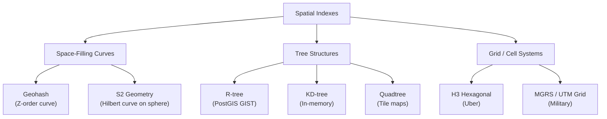
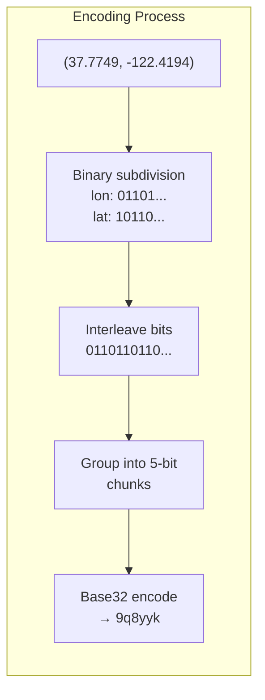
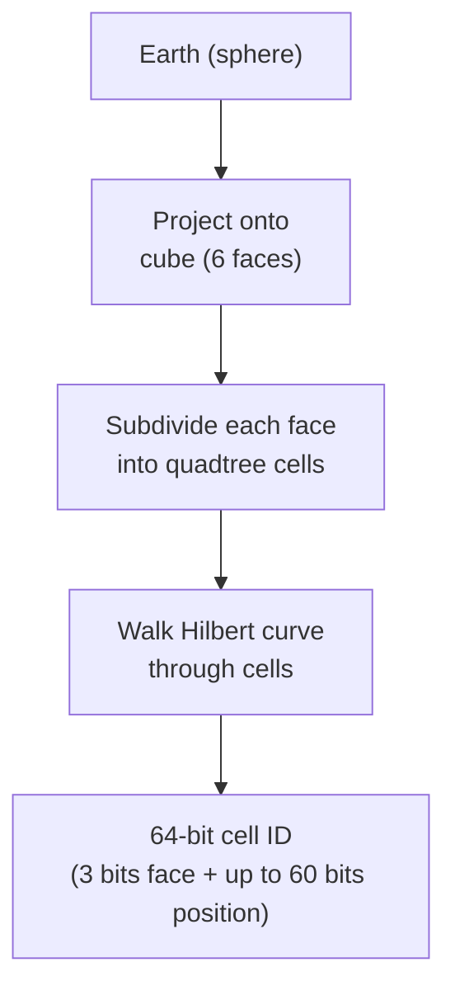
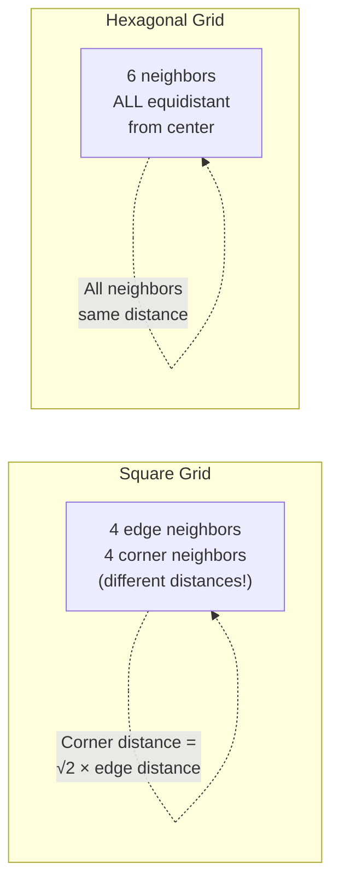
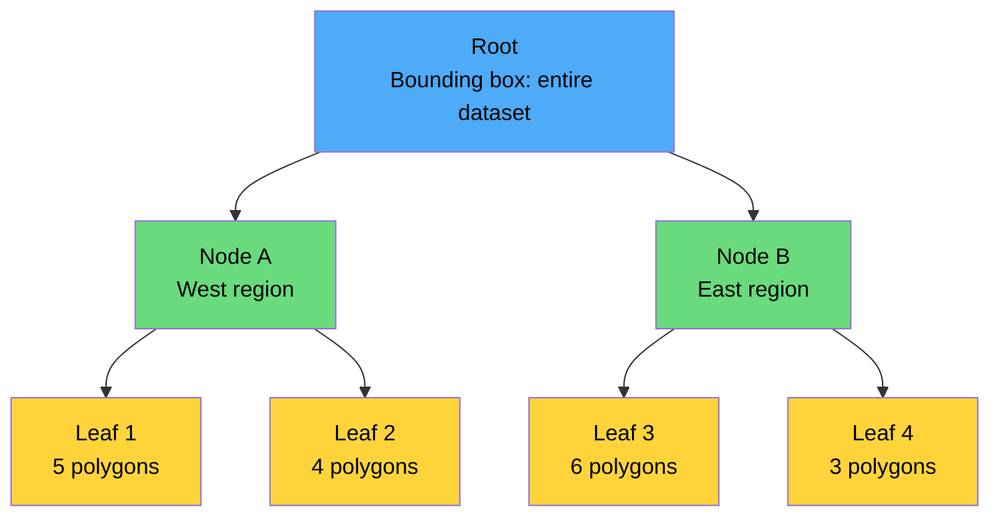
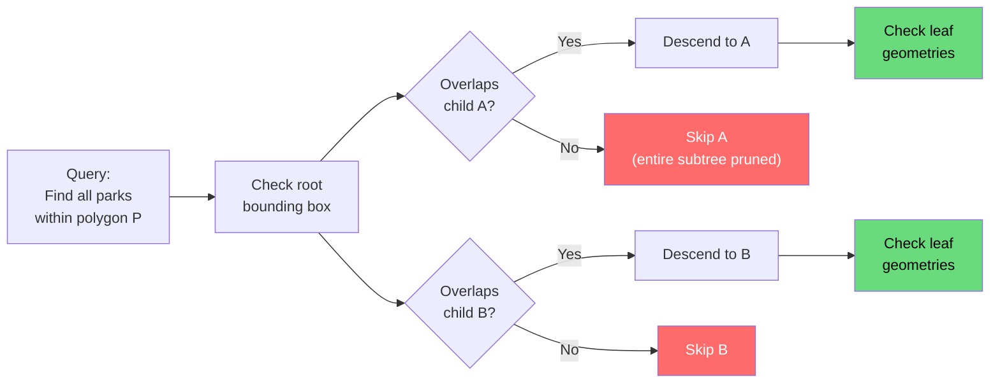
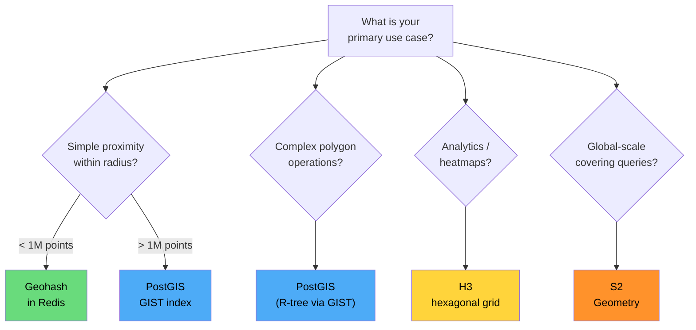
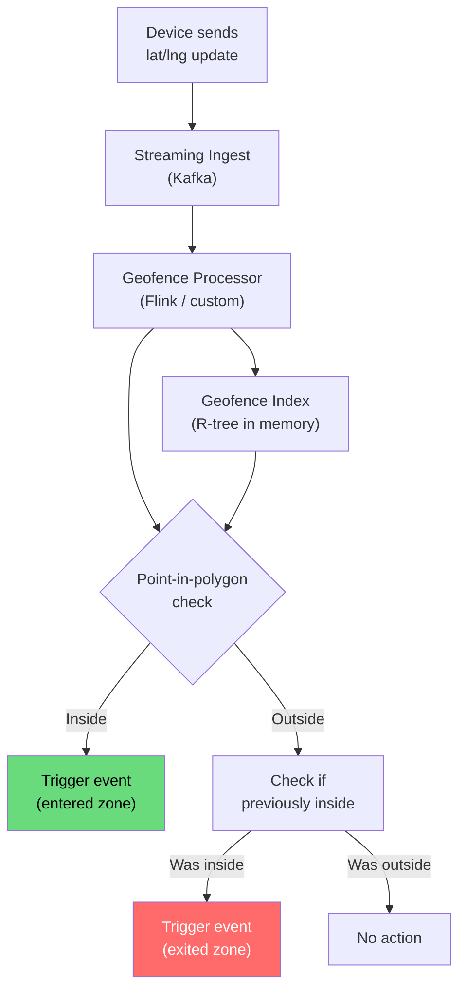
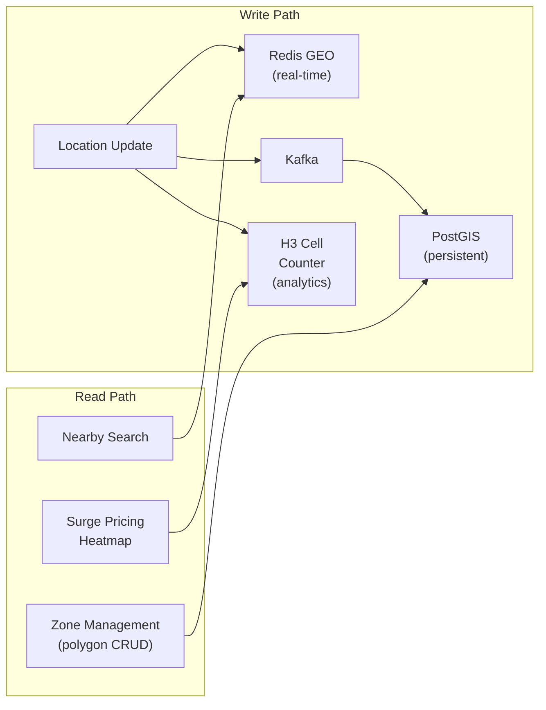

# Spatial Indexing Deep Dive

A regular B-tree cannot answer "find all restaurants within 2 km of me" efficiently. Spatial data lives in two dimensions (or more), and standard one-dimensional indexes cannot capture proximity in 2D space without scanning far too many rows. Spatial indexes solve this by partitioning space into cells, hierarchies, or trees that make multi-dimensional proximity queries fast.

This page covers the five most important spatial indexing approaches: Geohash, S2 Geometry, H3 Hexagonal, R-tree, and PostGIS — with production use cases for each.

---

## The Spatial Indexing Landscape



| Index | Dimension Reduction | Storage | Best For |
|-------|-------------------|---------|----------|
| **Geohash** | 2D → 1D string | Any key-value store | Simple proximity, Redis, DynamoDB |
| **S2** | 3D sphere → 1D integer | Any sorted store | Google-scale, covering queries |
| **H3** | 2D → hexagonal cells | Any store | Analytics, ride matching, heatmaps |
| **R-tree** | Bounding box hierarchy | PostGIS, SQLite | Polygon queries, complex GIS |
| **KD-tree** | Binary space partition | In-memory only | ML nearest-neighbor, small datasets |
| **Quadtree** | Recursive 4-way split | In-memory, tile servers | Map rendering, collision detection |

---

## 1. Geohash

Geohash uses a **Z-order curve** (Morton curve) to interleave latitude and longitude bits into a single string. This is the simplest spatial index and works with any database that supports prefix queries.

### How It Works (Bit Interleaving)

```
Longitude bits: 0 1 1 0 1 ...
Latitude bits:  1 0 1 1 0 ...
Interleaved:   01 10 11 01 10 ...
                ↓
Base32 encode → "9q8yyk"
```



### Precision Table

| Characters | Bits | Cell Width | Cell Height | Error (lat) | Error (lon) |
|-----------|------|-----------|------------|------------|------------|
| 1 | 5 | 5,000 km | 5,000 km | +/- 23 deg | +/- 23 deg |
| 2 | 10 | 1,250 km | 625 km | +/- 2.8 deg | +/- 5.6 deg |
| 3 | 15 | 156 km | 156 km | +/- 0.7 deg | +/- 0.7 deg |
| 4 | 20 | 39.1 km | 19.5 km | +/- 0.087 deg | +/- 0.18 deg |
| 5 | 25 | 4.9 km | 4.9 km | +/- 0.022 deg | +/- 0.022 deg |
| 6 | 30 | 1.2 km | 610 m | +/- 0.0027 deg | +/- 0.0055 deg |
| 7 | 35 | 153 m | 153 m | +/- 0.00069 deg | +/- 0.00069 deg |
| 8 | 40 | 38.2 m | 19.1 m | +/- 0.000086 deg | +/- 0.00017 deg |

### Proximity Search with Geohash

The standard algorithm: compute the target geohash, expand to include all 8 neighbors, query for matching prefixes, then filter by exact distance.

```python
import geohash2
from math import radians, sin, cos, sqrt, atan2

def find_nearby(lat, lng, radius_km, precision=6):
    """Find candidate cells for a proximity search."""
    center = geohash2.encode(lat, lng, precision=precision)

    # Always include neighbors to handle edge cases
    candidates = {center}
    candidates.update(geohash2.neighbors(center))

    return candidates

def haversine_km(lat1, lon1, lat2, lon2):
    R = 6371
    dlat = radians(lat2 - lat1)
    dlon = radians(lon2 - lon1)
    a = sin(dlat/2)**2 + cos(radians(lat1)) * cos(radians(lat2)) * sin(dlon/2)**2
    return R * 2 * atan2(sqrt(a), sqrt(1 - a))

# Usage: Find restaurants within 2 km
cells = find_nearby(37.7749, -122.4194, radius_km=2, precision=6)
# Query DB: SELECT * FROM restaurants WHERE geohash IN ('9q8yyk', '9q8yym', ...)
# Post-filter: keep only results within exact 2 km radius
```

### Geohash in Redis

Redis has native geospatial support built on sorted sets with geohash scoring:

```bash
# Add locations
GEOADD restaurants -122.4194 37.7749 "pizza-place"
GEOADD restaurants -122.4089 37.7837 "sushi-spot"
GEOADD restaurants -122.4058 37.7880 "taco-stand"

# Find within 2 km radius
GEORADIUS restaurants -122.4194 37.7749 2 km WITHCOORD WITHDIST ASC COUNT 10

# Or use the newer GEOSEARCH (Redis 6.2+)
GEOSEARCH restaurants FROMLONLAT -122.4194 37.7749 BYRADIUS 2 km ASC COUNT 10
```

::: tip
Redis `GEOADD` internally stores coordinates as a 52-bit geohash score in a sorted set. `GEORADIUS` / `GEOSEARCH` queries the sorted set by score range (exploiting geohash prefix locality) and then filters by exact distance. This gives O(N+log(M)) performance where N is results and M is total items.
:::

### Geohash in DynamoDB

DynamoDB has no native geospatial support, but geohash works perfectly as a sort key:

```typescript
// Store with geohash as sort key
const params = {
  TableName: 'Locations',
  Item: {
    pk: 'RESTAURANT',
    sk: '9q8yyk8v',  // geohash
    lat: 37.7749,
    lng: -122.4194,
    name: 'Pizza Place',
  }
};

// Query: find all in geohash prefix
// Use BEGINS_WITH on the sort key
const query = {
  TableName: 'Locations',
  KeyConditionExpression: 'pk = :pk AND begins_with(sk, :prefix)',
  ExpressionAttributeValues: {
    ':pk': 'RESTAURANT',
    ':prefix': '9q8yy',  // 5-char prefix for ~5 km resolution
  }
};
```

### Geohash Limitations

| Limitation | Impact | Mitigation |
|-----------|--------|-----------|
| **Edge discontinuity** | Nearby points across cell boundary share no prefix | Always query 8 neighbors |
| **Z-order curve jumps** | Some spatially close cells have distant geohash values | Accept false positives, filter post-query |
| **Non-uniform cells** | Cells are rectangular, not square (except at equator) | Use S2 or H3 for uniform cells |
| **Pole distortion** | Cells get very narrow near poles | Not an issue for most applications |

---

## 2. S2 Geometry (Google)

S2, developed by Google, projects the Earth onto a cube and uses a **Hilbert curve** to map the 2D surface to 1D cell IDs. The Hilbert curve has better spatial locality than the Z-order curve used by geohash — nearby cells on the sphere almost always have nearby cell IDs.

### S2 Architecture



### S2 Cell Levels

S2 cells range from level 0 (face of the cube) to level 30 (sub-centimeter):

| Level | Approx Cell Size | Typical Use |
|-------|-----------------|-------------|
| 0 | ~7,800 km | Hemisphere |
| 5 | ~250 km | Country region |
| 10 | ~8 km | City district |
| 12 | ~2 km | Neighborhood |
| 14 | ~460 m | City block |
| 16 | ~120 m | Building cluster |
| 18 | ~30 m | Individual building |
| 20 | ~7 m | Room |
| 24 | ~0.5 m | Sub-meter precision |
| 30 | ~1 cm | Maximum precision |

### S2 Covering

The killer feature of S2 is **covering**: given any region (circle, polygon, arbitrary shape), S2 can compute a set of cells at various levels that tightly cover the region. These cells become simple range queries on a sorted index.

```python
import s2sphere

def s2_covering_for_radius(lat, lng, radius_km, max_cells=8):
    """Compute S2 cell covering for a circular region."""
    center = s2sphere.LatLng.from_degrees(lat, lng)
    # Earth radius ≈ 6371 km
    angle = s2sphere.Angle.from_degrees(radius_km / 111.32)

    cap = s2sphere.Cap.from_axis_angle(
        center.to_point(),
        angle
    )

    coverer = s2sphere.RegionCoverer()
    coverer.min_level = 10
    coverer.max_level = 16
    coverer.max_cells = max_cells

    covering = coverer.get_covering(cap)
    return covering

# Find cells covering 5 km around San Francisco
cells = s2_covering_for_radius(37.7749, -122.4194, 5.0)
for cell_id in cells:
    print(f"Cell: {cell_id.id()}, Level: {cell_id.level()}")
```

### S2 vs Geohash

| Feature | Geohash | S2 |
|---------|---------|-----|
| **Curve type** | Z-order (Morton) | Hilbert |
| **Spatial locality** | Good (jumps at boundaries) | Excellent (minimal jumps) |
| **Cell shape** | Rectangle (varies by latitude) | Nearly uniform quadrilateral |
| **Multi-level covering** | No (fixed precision) | Yes (mix levels for tight fit) |
| **Pole handling** | Degenerate cells | Uniform cells everywhere |
| **Cell ID format** | Base32 string | 64-bit integer |
| **Ecosystem** | Ubiquitous (Redis, DynamoDB) | Google, Foursquare, MongoDB (2dsphere) |
| **Implementation complexity** | Simple | Complex |

::: tip
Google uses S2 internally for Google Maps, Google Earth, and BigQuery GIS. MongoDB's `2dsphere` index also uses S2 under the hood. If you need to cover arbitrary polygons efficiently, S2 is the best choice.
:::

---

## 3. H3 Hexagonal Indexing (Uber)

H3 is Uber's open-source hierarchical hexagonal grid system. Unlike geohash (rectangles) and S2 (quadrilaterals), H3 uses **hexagons**, which have a crucial property: every neighbor is equidistant from the center. This eliminates the directional bias of rectangular grids.

### Why Hexagons?



| Property | Square Grid | Hexagonal Grid |
|----------|------------|----------------|
| **Neighbors** | 4 edge + 4 corner (unequal distance) | 6 (all equidistant) |
| **Edge effects** | Diagonal vs adjacent ambiguity | No ambiguity |
| **Coverage** | Perfect tiling | Perfect tiling |
| **Area uniformity** | Varies with projection | Nearly uniform (icosahedron base) |
| **Gradient smoothing** | Checkerboard artifacts | Smooth gradients |

### H3 Resolution Levels

| Resolution | Avg Hex Area | Avg Edge Length | Use Case |
|-----------|-------------|-----------------|----------|
| 0 | 4,357,449 km2 | 1,107 km | Continental |
| 3 | 12,392 km2 | 59.8 km | Regional analysis |
| 5 | 252.9 km2 | 8.5 km | City-level |
| 7 | 5.16 km2 | 1.22 km | Neighborhood |
| 8 | 0.737 km2 | 461 m | Surge pricing zone |
| 9 | 0.105 km2 | 174 m | City block |
| 10 | 0.015 km2 | 65.9 m | Building cluster |
| 12 | 307 m2 | 9.4 m | Individual building |
| 15 | 0.9 m2 | 0.5 m | Sub-meter |

### H3 for Ride Matching

Uber uses H3 for surge pricing, supply/demand analysis, and ride matching:

```python
import h3

# Convert lat/lng to H3 cell
lat, lng = 37.7749, -122.4194
h3_index = h3.latlng_to_cell(lat, lng, res=8)
print(h3_index)  # '8828308281fffff'

# Get k-ring (all cells within k steps)
# k=1 gives the hex + its 6 neighbors (7 total)
# k=2 gives 19 cells, k=3 gives 37, etc.
ring = h3.grid_disk(h3_index, k=2)
print(f"Cells in k=2 ring: {len(ring)}")  # 19

# Compute supply/demand per hex
def compute_surge(h3_cell, drivers, riders):
    """Compute surge multiplier for a hexagonal zone."""
    supply = len([d for d in drivers if h3.latlng_to_cell(d.lat, d.lng, 8) == h3_cell])
    demand = len([r for r in riders if h3.latlng_to_cell(r.lat, r.lng, 8) == h3_cell])

    if supply == 0:
        return 3.0  # max surge
    ratio = demand / supply
    if ratio > 2.0:
        return min(1.0 + (ratio - 1.0) * 0.5, 3.0)
    return 1.0

# Polyfill a polygon with hexagons (e.g., a delivery zone)
polygon = h3.LatLngPoly(
    [(37.78, -122.42), (37.79, -122.40), (37.77, -122.40), (37.76, -122.42)]
)
hexagons = h3.polygon_to_cells(polygon, res=9)
print(f"Hexagons covering zone: {len(hexagons)}")
```

### H3 for Analytics and Heatmaps

```sql
-- PostgreSQL with h3-pg extension
-- Count events per hexagon for a heatmap
SELECT
    h3_lat_lng_to_cell(location, 8) AS hex,
    COUNT(*) AS event_count,
    AVG(value) AS avg_value
FROM events
WHERE timestamp > NOW() - INTERVAL '1 hour'
GROUP BY hex
ORDER BY event_count DESC
LIMIT 100;
```

::: warning
H3 has a subtle parent-child relationship issue: a hex at resolution N does not perfectly subdivide into 7 child hexes at resolution N+1 due to the geometry of hexagonal tiling. H3 handles this with "pentagon" cells at icosahedron vertices (12 total globally), but be aware of this when doing hierarchical aggregation.
:::

---

## 4. R-tree (PostGIS / GIST)

R-trees are balanced search trees for spatial data. Unlike geohash and S2 (which map 2D to 1D), R-trees work natively in 2D by organizing objects into nested **bounding boxes**.

### R-tree Structure



### How R-tree Search Works

1. Start at root. Check if query region overlaps root's bounding box (it always does).
2. Descend to child nodes whose bounding boxes overlap the query region.
3. Skip subtrees whose bounding boxes do not overlap (this is the pruning).
4. At leaf nodes, check individual geometries against the query.



### PostGIS GIST Index

PostGIS uses R-trees via the **GIST (Generalized Search Tree)** framework. This is the most powerful spatial index for complex queries.

```sql
-- Create a table with geography type
CREATE TABLE businesses (
    id SERIAL PRIMARY KEY,
    name TEXT,
    location GEOGRAPHY(POINT, 4326),
    boundary GEOGRAPHY(POLYGON, 4326)
);

-- Create GIST spatial index
CREATE INDEX idx_businesses_location ON businesses USING GIST (location);
CREATE INDEX idx_businesses_boundary ON businesses USING GIST (boundary);

-- Proximity search: find businesses within 5 km
SELECT name, ST_Distance(location, ST_MakePoint(-122.4194, 37.7749)::geography) AS dist_m
FROM businesses
WHERE ST_DWithin(
    location,
    ST_MakePoint(-122.4194, 37.7749)::geography,
    5000  -- meters
)
ORDER BY dist_m
LIMIT 20;

-- Polygon containment: is this point inside a delivery zone?
SELECT name
FROM delivery_zones
WHERE ST_Contains(
    boundary::geometry,
    ST_MakePoint(-122.4194, 37.7749)::geometry
);

-- Intersection: which zones overlap with this new zone?
SELECT a.name
FROM delivery_zones a
WHERE ST_Intersects(
    a.boundary,
    ST_GeomFromGeoJSON('{
        "type": "Polygon",
        "coordinates": [[[-122.5,37.7],[-122.4,37.7],[-122.4,37.8],[-122.5,37.8],[-122.5,37.7]]]
    }')::geography
);
```

### Geography vs Geometry in PostGIS

| Feature | `geometry` | `geography` |
|---------|-----------|-------------|
| **Coordinates** | Projected (flat, in meters/feet) | WGS84 (lat/lng in degrees) |
| **Distance** | Euclidean (flat earth) | Geodesic (curved earth) |
| **Accuracy** | Depends on projection, often wrong for large areas | Always correct globally |
| **Speed** | Faster (simpler math) | Slower (geodesic calculations) |
| **Functions** | All 300+ PostGIS functions | Subset (~40 functions) |
| **Use when** | Single city, known projection | Global data, multi-region |

::: tip
Rule of thumb: use `geography` for anything spanning more than one city. Use `geometry` with a local projection (UTM zone) for high-performance queries within a single metro area.
:::

---

## 5. Choosing the Right Spatial Index

### Decision Matrix



### Production Use Cases

| Company | Index | Use Case |
|---------|-------|----------|
| **Uber** | H3 | Surge pricing zones, supply/demand analysis |
| **Google** | S2 | Google Maps, BigQuery GIS, Earth |
| **Tinder** | Geohash | "People nearby" with Redis |
| **DoorDash** | PostGIS + H3 | Delivery zones (PostGIS), analytics (H3) |
| **Foursquare** | S2 | Place search, venue recommendations |
| **Snap** | S2 + H3 | Snap Map, location stories |
| **MongoDB** | S2 | `2dsphere` index |
| **Elasticsearch** | Geohash + BKD | Geo queries, geo-aggregations |

---

## Geofencing at Scale

Geofencing — "is this point inside this polygon?" — is one of the most performance-sensitive geospatial operations.

### Architecture for Real-Time Geofencing



### Optimization: Pre-filter with H3

For millions of geofences, checking every polygon is too slow. Pre-compute which H3 cells each geofence covers, then use cell lookup for O(1) pre-filtering:

```python
import h3

def precompute_geofence_index(geofences, resolution=7):
    """Build an H3-based geofence lookup table."""
    cell_to_fences = {}

    for fence in geofences:
        # Convert polygon to H3 cells
        polygon = h3.LatLngPoly(fence.vertices)
        cells = h3.polygon_to_cells(polygon, res=resolution)

        for cell in cells:
            if cell not in cell_to_fences:
                cell_to_fences[cell] = []
            cell_to_fences[cell].append(fence.id)

    return cell_to_fences

def check_geofence(lat, lng, cell_index, geofences, resolution=7):
    """Fast geofence check using H3 pre-filter."""
    cell = h3.latlng_to_cell(lat, lng, res=resolution)

    # O(1) lookup — only check geofences that overlap this cell
    candidate_ids = cell_index.get(cell, [])

    # Exact point-in-polygon only for candidates
    results = []
    for fid in candidate_ids:
        fence = geofences[fid]
        if point_in_polygon(lat, lng, fence.vertices):
            results.append(fid)
    return results
```

---

## Performance Benchmarks

Real-world performance for "find nearest K points within radius R" with 10 million points:

| Index | Query Latency (p50) | Query Latency (p99) | Memory | Notes |
|-------|--------------------|--------------------|--------|-------|
| **Redis GEOSEARCH** | 0.3 ms | 1.2 ms | ~800 MB | In-memory, limited to points |
| **PostGIS GIST** | 2 ms | 12 ms | ~400 MB index | Supports all geometry types |
| **Elasticsearch** | 5 ms | 25 ms | ~1.5 GB | Also does full-text search |
| **DynamoDB + Geohash** | 8 ms | 35 ms | Managed | Requires client-side distance filter |
| **MongoDB 2dsphere** | 3 ms | 15 ms | ~600 MB index | S2-based, good polygon support |
| **H3 + PostgreSQL** | 1 ms | 5 ms | ~300 MB index | Pre-computed cells, integer lookups |

::: danger
These benchmarks are illustrative. Real performance depends heavily on data distribution, query shape, hardware, and configuration. Always benchmark with your own data and access patterns before choosing.
:::

---

## Combining Spatial Indexes

Production systems often use multiple spatial indexes for different purposes:



| Layer | Index | Why |
|-------|-------|-----|
| **Hot (real-time)** | Redis GEO or in-memory H3 | Sub-millisecond proximity, moving objects |
| **Warm (persistent)** | PostGIS GIST | Complex polygon queries, geofencing |
| **Analytical** | H3 in ClickHouse/BigQuery | Aggregation, heatmaps, trend analysis |

---

## Key Takeaways

1. **Geohash** is the simplest — use it when you need "nearby" queries in Redis, DynamoDB, or any key-value store
2. **S2** is the most versatile — multi-level covering makes it ideal for arbitrary polygon queries at global scale
3. **H3** is the best for analytics — hexagonal uniformity eliminates directional bias in aggregations
4. **R-tree (PostGIS)** is the most powerful — use it when you need polygon intersection, containment, and the full GIS function library
5. **Combine indexes** — real systems use Redis for real-time, PostGIS for persistence, and H3 for analytics
6. **Always post-filter** — spatial indexes produce candidates; verify with exact distance or point-in-polygon
7. **Pre-compute when possible** — geofence checking at scale requires H3/S2 pre-filtering, not brute-force polygon checks
