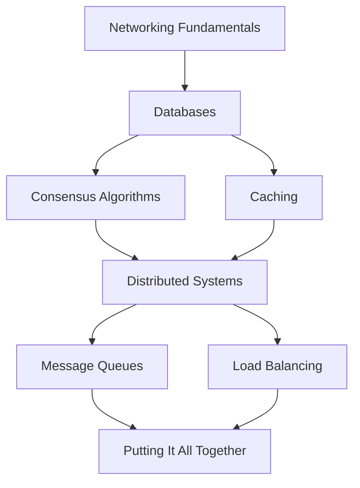

# System Design

Most engineers hit a ceiling. They can build features, ship code, debug production issues — but when someone asks them to design a system that handles ten million requests per second, they freeze. System design is the discipline that breaks through that ceiling. It is the art and science of making hard trade-offs under uncertainty, and it separates senior engineers from everyone else.

This section doesn't hand you cookie-cutter answers. It builds your mental model from the ground up: why distributed systems are fundamentally hard (spoiler: it's physics), how databases actually store and retrieve data at the storage engine level, why caching is a consistency nightmare disguised as a performance optimization, and how consensus algorithms like Raft manage to get unreliable machines to agree on anything at all.

## Why This Matters

Every production system you will ever touch is distributed. Even a "simple" web app involves a browser, a CDN, a load balancer, application servers, a database, and probably a cache. Understanding how these pieces interact — and how they fail — is not optional knowledge. It is the foundation everything else in this vault builds on.

## Learning Path

Follow this order. Each topic builds on the ones before it.

Start with networking — you cannot reason about distributed systems if you don't understand latency, TCP vs UDP, DNS resolution, or how TLS handshakes work. Then move to databases, because storage is the heart of every system. Caching and consensus branch from there: caching teaches you about the tension between speed and correctness, while consensus teaches you how to maintain correctness across multiple nodes. These converge at distributed systems, which layers in replication, partitioning, and failure modes. Message queues and load balancing are the connective tissue that ties large-scale systems together.

## Section Map

| Subsection | What You'll Learn | Key Concepts |
|---|---|---|
| [Networking](/system-design/networking) | How data actually moves between machines, DNS, TCP/IP, HTTP/2, gRPC, WebSockets | Latency vs bandwidth, connection pooling, TLS termination |
| [Databases](/system-design/databases) | Storage engines, indexing, replication, partitioning, transactions, query planning | B-trees vs LSM-trees, ACID vs BASE, EXPLAIN ANALYZE |
| [Caching](/system-design/caching) | Cache strategies, invalidation patterns, multi-layer caching, thundering herd | Write-through vs write-behind, cache stampede prevention, TTL design |
| [Consensus Algorithms](/system-design/consensus) | How distributed nodes agree on state despite failures | Raft step-by-step, Paxos intuition, leader election, log replication |
| [Distributed Systems](/system-design/distributed-systems) | CAP theorem (with proof), consistency models, replication strategies, failure detection | Linearizability, eventual consistency, vector clocks, CRDTs |
| [Message Queues](/system-design/message-queues) | Async communication, delivery guarantees, backpressure, stream processing | At-least-once vs exactly-once, dead letter queues, partition ordering |
| [Load Balancing](/system-design/load-balancing) | Traffic distribution algorithms, health checks, session affinity, global load balancing | Round-robin vs consistent hashing, L4 vs L7, connection draining |

## How to Use This Section

Each page follows a consistent structure: the **concept** explained from first principles, a **visual diagram** of the key idea, a **TypeScript or pseudocode implementation** you can actually run, **failure modes** that catch people in production, and **interview-ready** summaries you can use to explain these ideas under pressure.

Don't just read — build. After each subsection, try to sketch a system on a whiteboard (or in Excalidraw) that uses what you just learned. If you can't explain it without looking at the notes, you haven't learned it yet.
